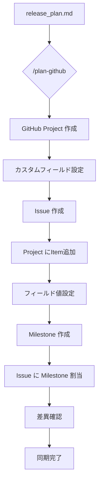

## Plan GitHub

リリース計画を GitHub Project・Issue・Milestone に反映し、プロジェクト管理を GitHub 上で一元化します。

### 使い方

```bash
/plan-github [オプション]
```

### オプション

- なし : 全体の同期を実行（Project作成、Issue作成、フィールド設定、Milestone作成）
- `--project` : GitHub Project のみを作成
- `--issues` : Issue のみを作成（Project が存在する前提）
- `--fields` : Project フィールド値のみを設定
- `--milestones` : Milestone のみを作成し Issue に割り当て
- `--verify` : release_plan.md と GitHub の差異を確認
- `--status` : 現在の GitHub Project 状態を表示

### 基本例

```bash
# 初回の完全同期（Project、Issue、Milestone すべて作成）
/plan-github
「リリース計画を GitHub Project に反映して」

# GitHub Project のみ作成
/plan-github --project
「GitHub Project を作成して」

# 差異確認
/plan-github --verify
「release_plan.md と GitHub Issue の差異を確認して」

# 現在の状態確認
/plan-github --status
「GitHub Project の現在の状態を表示して」
```

### 詳細機能

#### GitHub Project の作成

release_plan.md に基づいて GitHub Project を作成し、カスタムフィールドを設定します。

**作成されるフィールド**:

- **リリース**: 1.0 MVP / 2.0 機能拡張版 / 3.0 完成版
- **イテレーション**: 1〜12
- **優先度**: 必須 / 重要
- **SP**: ストーリーポイント（数値）
- **カテゴリ**: 認証・ユーザー管理 / マスタ管理 / 仕訳管理 / 元帳・残高管理 / 財務諸表 / システム管理

```bash
# GitHub Project の作成
/plan-github --project
「カスタムフィールド付きの GitHub Project を作成して」
```

#### Issue の作成

ユーザーストーリーを GitHub Issue として作成し、Project に追加します。

**Issue の構成**:

- **タイトル**: `[ストーリーID] ストーリー名`
- **本文**: ユーザーストーリー、受け入れ基準、見積もり情報
- **Project 紐付け**: 作成した Project に自動追加

```bash
# Issue の作成と Project への追加
/plan-github --issues
「ユーザーストーリーを Issue として作成して Project に追加して」
```

#### フィールド値の設定

各 Issue の Project フィールドに release_plan.md の値を反映します。

**設定される情報**:

- リリース（マイルストーン対応）
- イテレーション番号
- 優先度（必須/重要）
- ストーリーポイント
- カテゴリ

```bash
# フィールド値の一括設定
/plan-github --fields
「release_plan.md の内容で Project フィールドを更新して」
```

#### Milestone の作成

リリースを GitHub Milestone として作成し、Issue に割り当てます。

**作成される Milestone**:

- **リリース 1.0 MVP**: 基本的な仕訳入力と元帳管理
- **リリース 2.0 機能拡張版**: 承認ワークフローと財務諸表
- **リリース 3.0 完成版**: 高度な分析機能とシステム管理

```bash
# Milestone の作成と Issue 割り当て
/plan-github --milestones
「リリースを Milestone として作成して Issue に割り当てて」
```

#### 差異確認

release_plan.md と GitHub Issue/Project の整合性を確認します。

**確認項目**:

- ストーリー数の一致
- ストーリーポイントの一致
- リリース/Milestone 割り当ての一致
- 優先度の一致

```bash
# 差異確認
/plan-github --verify
「release_plan.md と GitHub の差異がないか確認して」
```

### 出力例

```
📊 GitHub Project 同期結果
━━━━━━━━━━━━━━━━━━━━━━━━━━━━━━━━

🎯 Project: 会計システムのケーススタディ
   URL: https://github.com/users/k2works/projects/8

📋 Issue 作成状況
├─ 認証・ユーザー管理: 6件（21SP）
├─ マスタ管理: 8件（29SP）
├─ 仕訳管理: 10件（45SP）
├─ 元帳・残高管理: 5件（26SP）
├─ 財務諸表: 3件（21SP）
└─ システム管理: 2件（13SP）
   合計: 34件（155SP）

🏁 Milestone 割り当て
├─ リリース 1.0 MVP: 14件（期日: 2026-02-27）
├─ リリース 2.0 機能拡張版: 12件（期日: 2026-04-24）
└─ リリース 3.0 完成版: 8件（期日: 2026-06-19）

✅ 差異確認: release_plan.md と完全一致
```

### Claude との連携

```bash
# リリース計画から完全同期
cat docs/development/release_plan.md
/plan-github
「このリリース計画を GitHub Project に完全同期して」

# 計画更新後の差異確認と同期
cat docs/development/release_plan.md
/plan-github --verify
「更新したリリース計画と GitHub の差異を確認して」

# 既存 Project へのフィールド更新
/plan-github --fields
「release_plan.md の最新内容で Project フィールドを更新して」
```

### 注意事項

- **前提条件**:
  - `docs/development/release_plan.md` が存在すること
  - `gh` CLI がインストールされ認証済みであること
  - Project API スコープが有効であること（`gh auth refresh -s project,read:project`）
- **制限事項**:
  - 既存の Project/Issue がある場合は重複作成に注意
  - フィールド値の更新は既存値を上書き
- **推奨事項**:
  - 初回は `--verify` で差異確認してから同期
  - 大規模な変更前にはバックアップを推奨

### ベストプラクティス

1. **初回同期**: `/plan-github` で全体を一括作成
2. **計画更新時**: `/plan-github --verify` で差異確認後、必要な部分のみ更新
3. **定期確認**: `/plan-github --status` で進捗状況を定期的に確認
4. **一貫性維持**: release_plan.md を Single Source of Truth として管理

### 同期フロー



### 関連コマンド

- `/plan` : リリース計画とイテレーション計画の作成
- `/progress` : 進捗状況の確認と更新
- `/git-commit` : 変更のコミット
