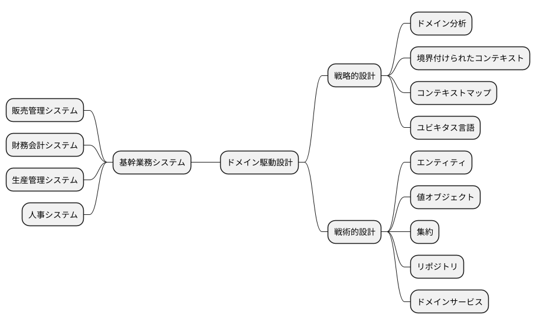
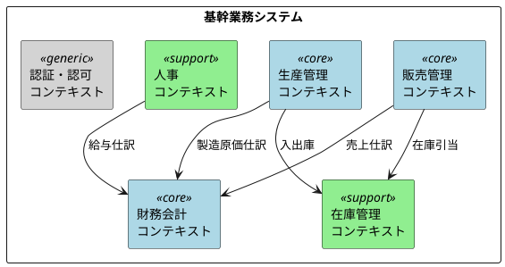
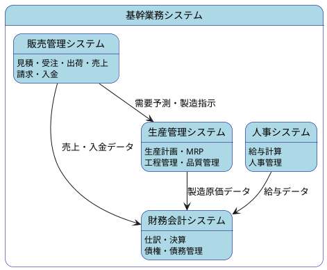
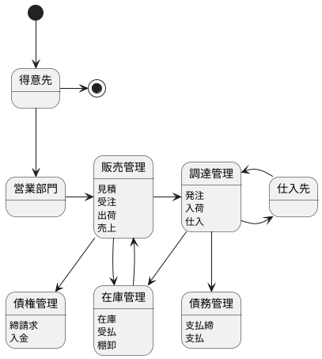
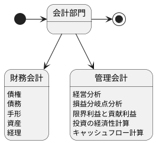
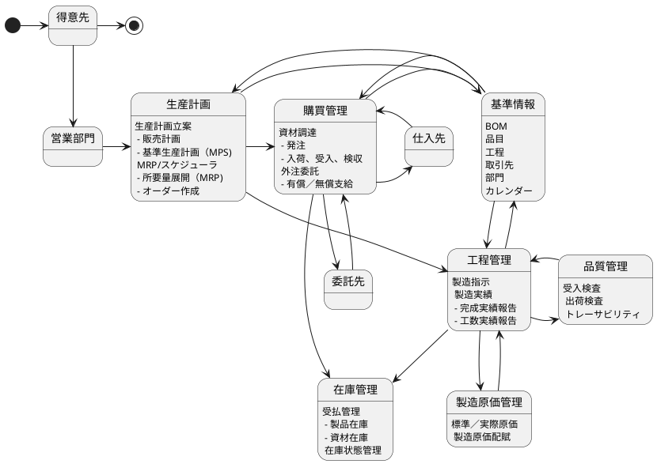

# 第1章：基幹業務システムとは

本章では、基幹業務システムの概要と、ドメイン駆動設計（DDD）との関係について解説します。

## 1.1 ドメイン駆動設計と基幹業務システム

ドメイン駆動設計（Domain-Driven Design、以下 DDD）は、複雑なビジネスドメインを扱うソフトウェア開発において有効なアプローチです。基幹業務システムは、まさにこの複雑なビジネスドメインの典型例といえます。

### 戦略的設計と戦術的設計

DDD は大きく「戦略的設計」と「戦術的設計」の2つのレベルに分けられます。

#### 戦略的設計

戦略的設計は、ビジネスドメイン全体を俯瞰し、システムの境界を定義するための手法です。

| 概念 | 説明 |
|---|---|
| ドメイン | ビジネスの問題領域全体 |
| サブドメイン | ドメインを分割した個々の領域（コア・サポート・汎用） |
| 境界付けられたコンテキスト | 特定のモデルが適用される明確な境界 |
| コンテキストマップ | コンテキスト間の関係を可視化したもの |
| ユビキタス言語 | チーム全体で共有する共通言語 |

#### 戦術的設計

戦術的設計は、境界付けられたコンテキスト内部のモデルを実装するためのパターン群です。

| パターン | 説明 |
|---|---|
| エンティティ | 識別子を持つオブジェクト |
| 値オブジェクト | 識別子を持たない不変オブジェクト |
| 集約 | 整合性を保つオブジェクトの集まり |
| リポジトリ | 集約の永続化を担当 |
| ドメインサービス | エンティティに属さない業務ロジック |

### 基幹業務システムへの適用

基幹業務システムを DDD の観点から分析すると、各サブシステムは「境界付けられたコンテキスト」として捉えることができます。

各コンテキストは以下のように分類できます。

| 分類 | コンテキスト | 説明 |
|---|---|---|
| コアドメイン | 販売管理、財務会計、生産管理 | 事業の競争優位性を生む中核領域 |
| サポートドメイン | 人事、在庫管理 | コアドメインを支援する領域 |
| 汎用ドメイン | 認証・認可 | 汎用的に利用可能な領域 |

---

## 1.2 基幹業務システムを構成するサブシステム

基幹業務システムは、企業の基幹となる業務を支えるシステムの総称です。一般的に以下の4つのサブシステムで構成されます。

### 販売管理システム

販売管理システムは、企業の販売活動を管理するシステムです。得意先からの受注を起点に、出荷・売上・請求・入金までの一連の業務フローを管理します。

**主要機能**

- **見積管理**：得意先への見積書作成・管理
- **受注管理**：受注情報の登録・管理
- **出荷管理**：出荷指示・出荷実績の管理
- **売上管理**：売上計上・売上分析
- **債権管理**：請求書発行・入金消込・残高管理

### 財務会計システム

財務会計システムは、企業の財務状況を管理・報告するシステムです。日々の取引を仕訳として記録し、決算処理を通じて財務諸表を作成します。

**主要機能**

- **仕訳管理**：日々の取引を仕訳として記録
- **決算処理**：月次・年次決算、財務諸表作成
- **債権管理**：売掛金・受取手形の管理
- **債務管理**：買掛金・支払手形の管理
- **資産管理**：固定資産の管理・減価償却

### 生産管理システム

生産管理システムは、製造業における生産活動を管理するシステムです。需要予測に基づく生産計画の立案から、資材調達、製造実行、品質管理までを一貫して管理します。

**主要機能**

- **生産計画**：MPS（基準生産計画）・MRP（資材所要量計画）
- **購買管理**：発注・入荷・検収
- **工程管理**：製造指示・製造実績・工数管理
- **在庫管理**：資材在庫・製品在庫・受払管理
- **品質管理**：受入検査・出荷検査・トレーサビリティ
- **製造原価管理**：標準原価・実際原価・原価差異分析

### 人事システム

人事システムは、企業の人事・労務管理を行うシステムです。従業員情報の管理から給与計算、勤怠管理までを担当します。

**主要機能**

- **人事管理**：従業員情報・組織情報の管理
- **給与計算**：給与・賞与計算、年末調整
- **勤怠管理**：出退勤・休暇の管理
- **採用管理**：採用プロセスの管理

---

## まとめ

本章では、基幹業務システムの全体像と DDD との関係について解説しました。

- **DDD の戦略的設計**を適用することで、基幹業務システムを複数の境界付けられたコンテキストとして整理できる
- 基幹業務システムは主に**販売管理・財務会計・生産管理・人事**の4つのサブシステムで構成される
- 各サブシステムは相互に連携し、企業の基幹業務を支える

次章では、これらのサブシステムが担う業務領域について、より詳細に解説します。
