# 第2章：基幹業務システムの業務領域

本章では、基幹業務システムを構成する各業務領域について詳しく解説します。各領域がどのような業務を担当し、他の領域とどのように連携するかを理解することで、システム全体の設計に役立てることができます。

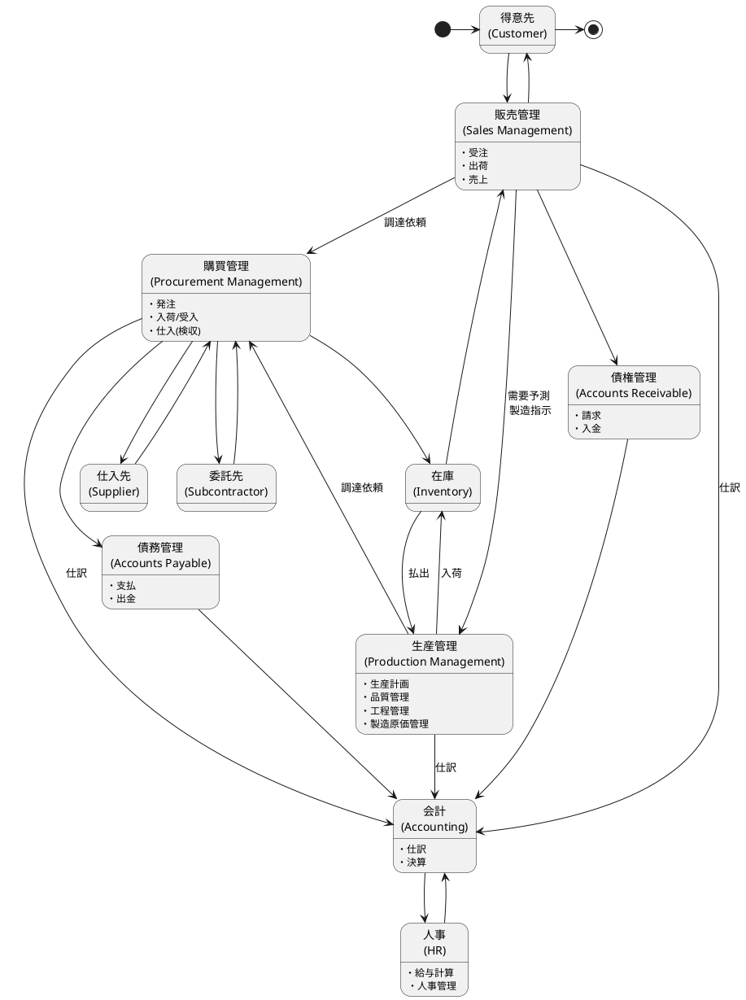

---

## 2.1 販売管理領域

販売管理領域は、企業の収益を生み出す中核的な業務領域です。得意先からの注文を受け、商品を出荷し、売上を計上するまでの一連のプロセスを管理します。

### 受注・出荷・売上

販売管理の基本的な業務フローは「受注→出荷→売上」の流れで進みます。

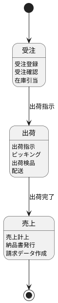

| 業務 | 説明 | 主なデータ |
|---|---|---|
| 受注 | 得意先からの注文を受け付け、登録する | 受注データ、受注明細 |
| 出荷 | 受注に基づき商品を出荷する | 出荷指示、出荷実績 |
| 売上 | 出荷完了後に売上を計上する | 売上データ、売上明細 |

### 得意先との関係

販売管理では、得意先（顧客）との関係を適切に管理することが重要です。

- **得意先マスタ**：得意先の基本情報（名称、住所、連絡先等）
- **取引条件**：締日、支払条件、与信限度額
- **出荷先**：商品の届け先（得意先と異なる場合がある）
- **請求先**：請求書の送付先

---

## 2.2 購買管理領域

購買管理領域は、企業が必要とする商品や資材を仕入先から調達する業務を管理します。

### 発注・入荷/受入・仕入（検収）

購買管理の基本的な業務フローは「発注→入荷→検収」の流れで進みます。

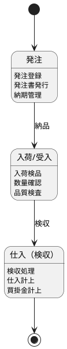

| 業務 | 説明 | 主なデータ |
|---|---|---|
| 発注 | 仕入先に商品・資材を発注する | 発注データ、発注明細 |
| 入荷/受入 | 仕入先から届いた商品を受け入れる | 入荷データ、入荷明細 |
| 仕入（検収） | 受入後に検収を行い、仕入を計上する | 検収データ、仕入明細 |

### 仕入先・委託先との関係

- **仕入先マスタ**：仕入先の基本情報、取引条件
- **委託先マスタ**：外注委託先の情報（有償支給/無償支給の区分）
- **単価マスタ**：品目ごとの仕入単価、適用期間

---

## 2.3 在庫管理領域

在庫管理領域は、企業が保有する商品・資材の在庫を管理する業務領域です。

### 在庫の受払

在庫管理では、入庫（受）と出庫（払）を記録し、現在の在庫数量を把握します。

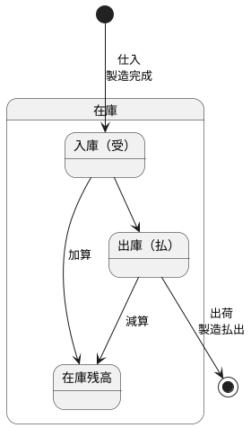

| 取引種別 | 入庫（受） | 出庫（払） |
|---|---|---|
| 販売管理 | 返品受入 | 出荷 |
| 購買管理 | 仕入入庫 | 返品出庫 |
| 生産管理 | 製造完成 | 製造払出 |
| 在庫調整 | 棚卸増 | 棚卸減 |

### 販売管理・購買管理・生産管理との連携

在庫管理は、他の3つの業務領域と密接に連携します。

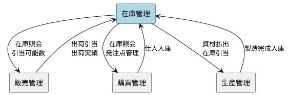

---

## 2.4 生産管理領域

生産管理領域は、製造業における生産活動全体を管理する業務領域です。

### 生産計画・品質管理・工程管理・製造原価管理

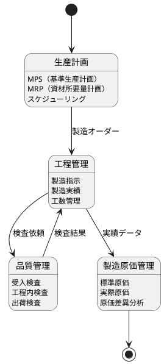

| 業務 | 説明 |
|---|---|
| 生産計画 | 需要予測に基づき、何を・いつ・どれだけ生産するかを計画 |
| 工程管理 | 製造指示の発行、製造実績の収集、工数の管理 |
| 品質管理 | 受入・工程内・出荷の各段階での品質検査 |
| 製造原価管理 | 製品の製造原価を計算し、標準原価との差異を分析 |

### 購買管理・在庫管理との連携

生産管理は、資材の調達（購買管理）と在庫管理と連携して動作します。

- **購買管理との連携**：MRP から発注依頼を生成、外注委託の管理
- **在庫管理との連携**：資材の払出、製品の入庫、在庫状態管理

---

## 2.5 債権管理領域

債権管理領域は、販売活動によって発生した売掛金（債権）を管理する業務領域です。

### 請求・入金

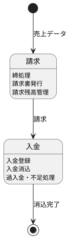

| 業務 | 説明 | 主なデータ |
|---|---|---|
| 請求 | 売上データを集計し、得意先に請求する | 請求データ、請求明細 |
| 入金 | 得意先からの入金を登録し、請求と消込する | 入金データ、消込明細 |

### 販売管理との連携

- 売上データから請求データを生成
- 都度請求と締め請求の使い分け
- 与信管理（与信限度額のチェック）

---

## 2.6 債務管理領域

債務管理領域は、購買活動によって発生した買掛金（債務）を管理する業務領域です。

### 支払・出金

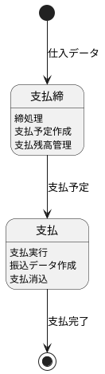

| 業務 | 説明 | 主なデータ |
|---|---|---|
| 支払締 | 仕入データを集計し、支払予定を作成する | 支払予定データ |
| 支払 | 仕入先への支払を実行する | 支払データ、振込データ |

### 購買管理との連携

- 検収データから買掛金を計上
- 支払条件に基づく支払予定の作成
- 振込データの作成と銀行連携

---

## 2.7 会計領域

会計領域は、企業のすべての経済活動を仕訳として記録し、財務諸表を作成する業務領域です。

### 仕訳・決算

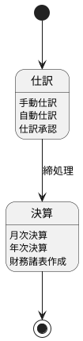

| 業務 | 説明 |
|---|---|
| 仕訳 | 日々の取引を借方・貸方に分けて記録 |
| 決算 | 期間損益を確定し、財務諸表を作成 |

### 債権・債務・生産管理からの仕訳連携

会計領域は、他の業務領域から仕訳データを受け取ります。

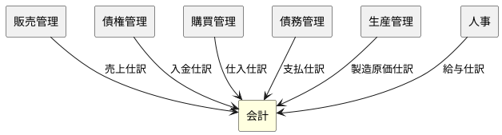

| 連携元 | 仕訳内容 |
|---|---|
| 販売管理 | 売上計上（売掛金/売上） |
| 債権管理 | 入金消込（現金預金/売掛金） |
| 購買管理 | 仕入計上（仕入/買掛金） |
| 債務管理 | 支払消込（買掛金/現金預金） |
| 生産管理 | 製造原価計上 |
| 人事 | 給与計上（給与/未払金） |

---

## 2.8 人事領域

人事領域は、企業の従業員に関する情報を管理し、給与計算を行う業務領域です。

### 給与計算・人事管理

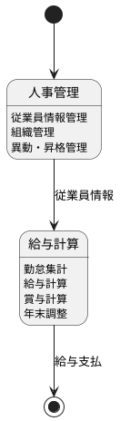

| 業務 | 説明 |
|---|---|
| 人事管理 | 従業員の入社・退社、異動、昇格等を管理 |
| 給与計算 | 勤怠データに基づき給与・賞与を計算 |

### 会計との連携

- 給与データから給与仕訳を生成
- 社会保険料・税金の計上
- 未払給与・預り金の管理

---

## まとめ

本章では、基幹業務システムを構成する8つの業務領域について解説しました。

| 領域 | 主な業務 | 連携先 |
|---|---|---|
| 販売管理 | 受注・出荷・売上 | 在庫管理、債権管理、会計 |
| 購買管理 | 発注・入荷・検収 | 在庫管理、債務管理、会計 |
| 在庫管理 | 入出庫・棚卸 | 販売管理、購買管理、生産管理 |
| 生産管理 | 生産計画・工程管理 | 購買管理、在庫管理、会計 |
| 債権管理 | 請求・入金 | 販売管理、会計 |
| 債務管理 | 支払締・支払 | 購買管理、会計 |
| 会計 | 仕訳・決算 | 全領域 |
| 人事 | 給与計算・人事管理 | 会計 |

次章では、これらの業務領域を横断する業務フローの全体像について解説します。
