# 第3章：業務フローの全体像

本章では、基幹業務システムを構成する3つの主要システム（販売管理・財務会計・生産管理）の業務フローを詳しく解説します。各システムがどのような流れで業務を処理し、他のシステムとどのように連携するかを理解することで、システム設計の全体像を把握できます。

---

## 3.1 販売管理システムの業務フロー

販売管理システムは、得意先からの注文を起点として、商品の出荷・売上計上・代金回収までの一連の業務フローを管理します。

### 全体フロー

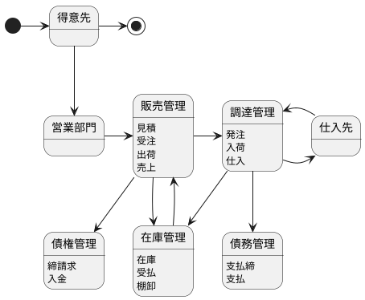

### 得意先 → 営業部門 → 販売管理

販売管理の起点は、得意先からの引き合い・注文です。営業部門が窓口となり、見積・受注・出荷・売上の業務を遂行します。

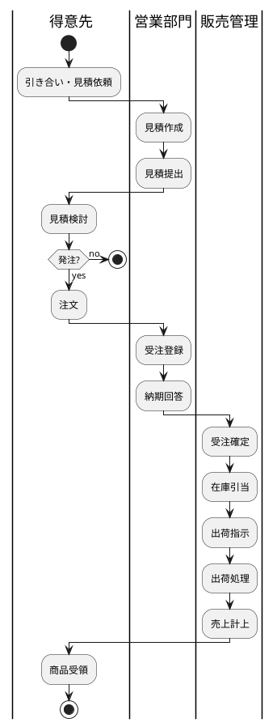

| ステップ | 担当 | 業務内容 | 生成データ |
|---|---|---|---|
| 1 | 得意先 | 引き合い・見積依頼 | - |
| 2 | 営業部門 | 見積作成・提出 | 見積データ |
| 3 | 得意先 | 注文 | - |
| 4 | 営業部門 | 受注登録 | 受注データ |
| 5 | 販売管理 | 在庫引当・出荷指示 | 出荷指示データ |
| 6 | 販売管理 | 出荷処理 | 出荷データ |
| 7 | 販売管理 | 売上計上 | 売上データ |

### 販売管理 → 調達管理 / 在庫管理 / 債権管理

販売管理は、受注後に複数の業務領域と連携します。

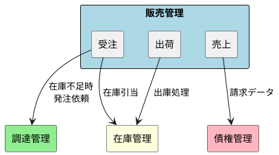

| 連携先 | トリガー | 連携内容 |
|---|---|---|
| 調達管理 | 在庫不足 | 発注依頼（商品の補充） |
| 在庫管理 | 受注時 | 在庫引当（予約） |
| 在庫管理 | 出荷時 | 出庫処理（在庫減少） |
| 債権管理 | 売上計上時 | 請求データ生成 |

### 調達管理 → 仕入先 / 在庫管理 / 債務管理

調達管理は、販売管理からの発注依頼を受けて、仕入先への発注・入荷・検収を行います。

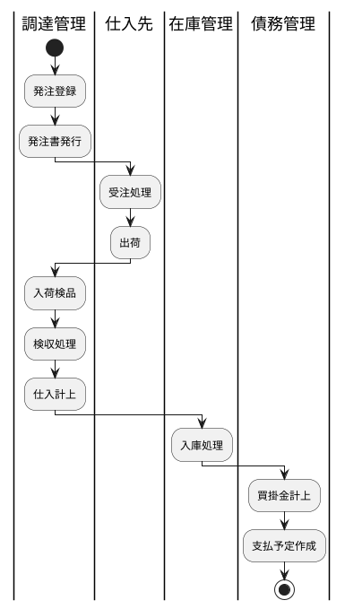

| 連携先 | 連携内容 |
|---|---|
| 仕入先 | 発注書送付、納品受領 |
| 在庫管理 | 検収後の入庫処理 |
| 債務管理 | 仕入計上、買掛金管理 |

---

## 3.2 財務会計システムの業務フロー

財務会計システムは、企業のすべての経済活動を仕訳として記録し、財務諸表を作成します。

### 全体フロー

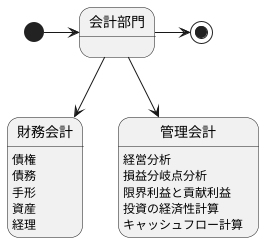

### 会計部門 → 財務会計 / 管理会計

会計部門は、「財務会計」と「管理会計」の2つの領域を担当します。

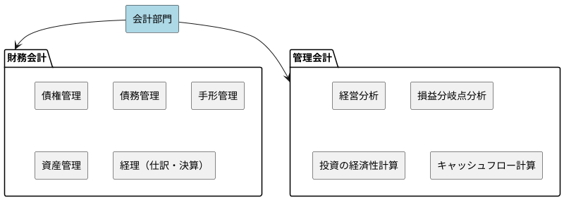

| 区分 | 目的 | 主な業務 |
|---|---|---|
| 財務会計 | 外部報告（株主・税務署等） | 仕訳、決算、財務諸表作成 |
| 管理会計 | 内部意思決定 | 経営分析、予算管理、原価管理 |

### 財務会計：債権・債務・手形・資産・経理

財務会計の各業務は相互に連携し、最終的に経理（仕訳・決算）に集約されます。

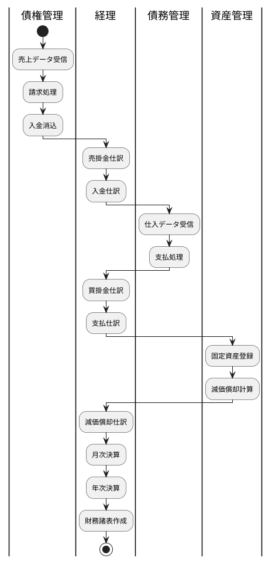

| 業務 | 内容 | 生成される仕訳例 |
|---|---|---|
| 債権管理 | 売掛金の請求・入金管理 | 売掛金/売上、現金/売掛金 |
| 債務管理 | 買掛金の支払管理 | 仕入/買掛金、買掛金/現金 |
| 手形管理 | 受取手形・支払手形の管理 | 受取手形/売掛金 |
| 資産管理 | 固定資産の管理・減価償却 | 減価償却費/減価償却累計額 |
| 経理 | 仕訳入力・決算処理 | 各種決算整理仕訳 |

### 管理会計：経営分析・損益分岐点分析・投資の経済性計算・キャッシュフロー計算

管理会計は、経営判断に必要な情報を提供します。

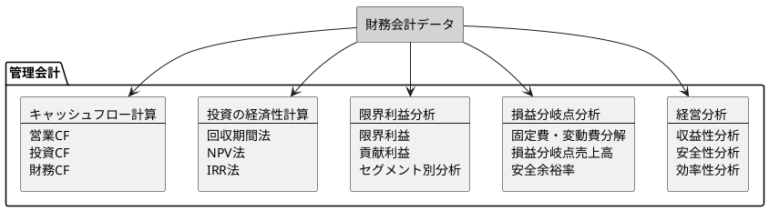

| 分析手法 | 目的 | 活用場面 |
|---|---|---|
| 経営分析 | 企業の財務状態を評価 | 決算報告、経営会議 |
| 損益分岐点分析 | 利益が出る売上高を把握 | 販売目標設定 |
| 限界利益分析 | 製品・部門別の収益性評価 | 製品構成の最適化 |
| 投資の経済性計算 | 投資案件の評価 | 設備投資判断 |
| キャッシュフロー計算 | 資金繰りの把握 | 資金計画策定 |

---

## 3.3 生産管理システムの業務フロー

生産管理システムは、製造業における生産活動全体を管理します。需要予測に基づく生産計画から、資材調達、製造実行、品質管理までを一貫して管理します。

### 全体フロー

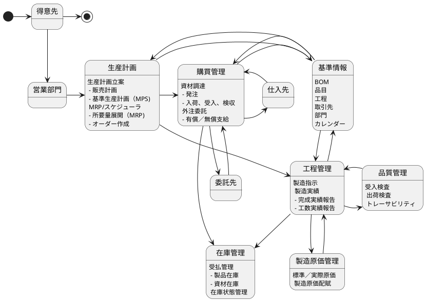

### 得意先 → 営業部門 → 生産計画

生産管理の起点は、得意先からの需要情報です。営業部門が受注情報や需要予測を生産計画に連携します。

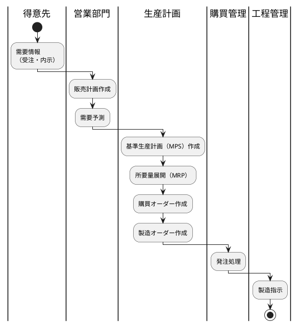

| ステップ | 担当 | 業務内容 | 生成データ |
|---|---|---|---|
| 1 | 得意先 | 需要情報提供 | 受注データ、内示データ |
| 2 | 営業部門 | 販売計画作成 | 販売計画 |
| 3 | 生産計画 | MPS 作成 | 基準生産計画 |
| 4 | 生産計画 | MRP 実行 | 所要量データ |
| 5 | 生産計画 | オーダー作成 | 購買オーダー、製造オーダー |

### 生産計画 → 購買管理 / 工程管理

生産計画から生成されたオーダーは、購買管理と工程管理に展開されます。

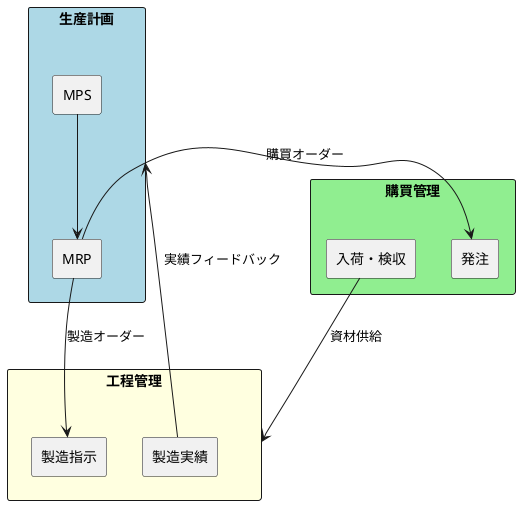

### 購買管理 → 仕入先 / 委託先 / 在庫管理

購買管理は、資材の調達と外注委託を担当します。

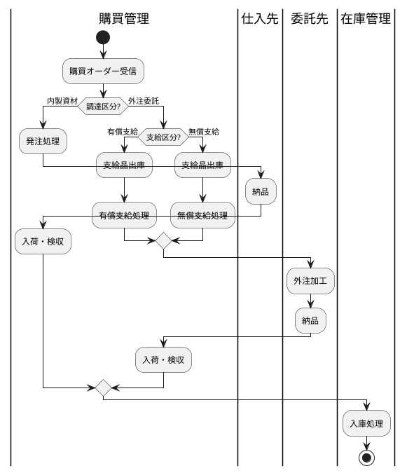

| 調達パターン | 説明 | 仕入先/委託先 |
|---|---|---|
| 通常発注 | 資材・部品を仕入先から購入 | 仕入先 |
| 有償支給 | 資材を有償で委託先に支給し、加工後に買い戻す | 委託先 |
| 無償支給 | 資材を無償で委託先に支給し、加工賃のみ支払う | 委託先 |

### 工程管理 → 在庫管理 / 製造原価管理 / 品質管理

工程管理は、製造指示の発行から製造実績の収集までを管理し、複数の領域と連携します。

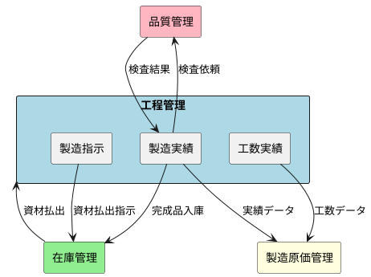

| 連携先 | 連携内容 |
|---|---|
| 在庫管理 | 資材の払出、完成品の入庫 |
| 製造原価管理 | 製造実績・工数実績からの原価計算 |
| 品質管理 | 工程内検査、完成検査 |

### 基準情報との連携

生産管理システムは、各種マスタ（基準情報）を参照して動作します。

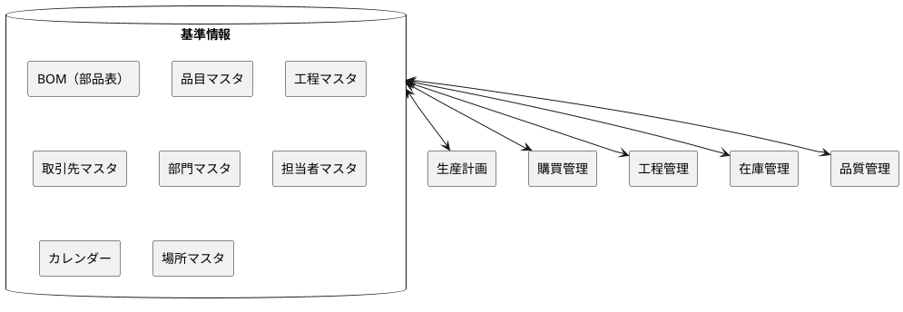

| 基準情報 | 用途 |
|---|---|
| BOM（部品表） | 製品の構成部品と所要量を定義 |
| 品目マスタ | 品目の基本情報（リードタイム、ロットサイズ等） |
| 工程マスタ | 製造工程の定義 |
| 取引先マスタ | 仕入先・委託先の情報 |
| 部門マスタ | 製造部門の情報 |
| 担当者マスタ | 作業担当者の情報 |
| カレンダー | 稼働日・稼働時間の定義 |
| 場所マスタ | 倉庫・工程の場所情報 |

---

## まとめ

本章では、3つの主要システムの業務フローについて解説しました。

| システム | 起点 | 主要フロー | 連携先 |
|---|---|---|---|
| 販売管理 | 得意先の注文 | 受注→出荷→売上→請求→入金 | 調達管理、在庫管理、債権管理 |
| 財務会計 | 各システムの取引データ | 仕訳→決算→財務諸表 | 全システム |
| 生産管理 | 需要情報 | 生産計画→調達/製造→完成 | 購買管理、在庫管理、品質管理 |

これで第1部「基幹業務システムの全体像」の解説は終了です。次の第2部からは、各システムの詳細なデータベース設計について解説していきます。
