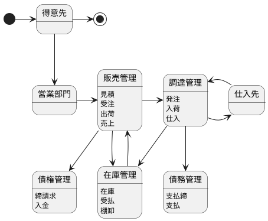
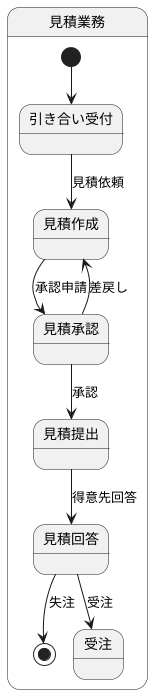
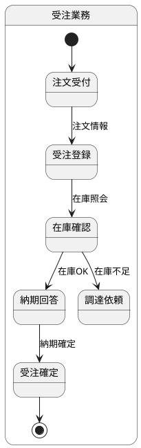
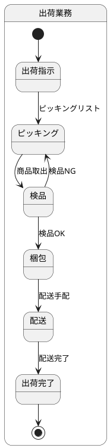
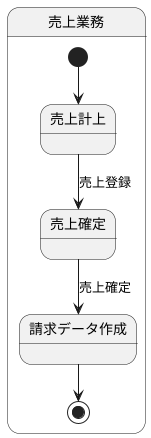
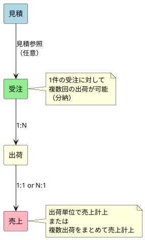
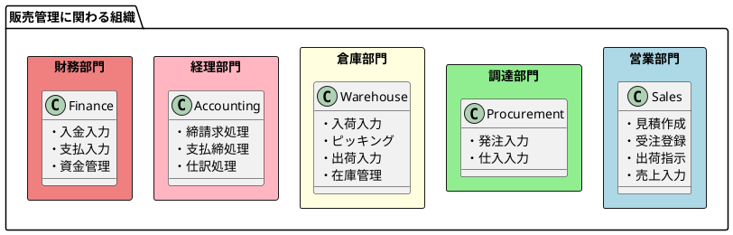
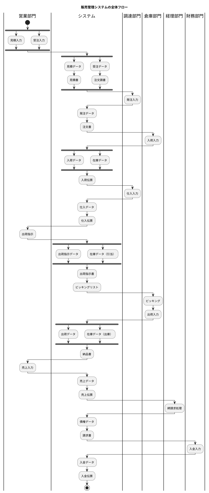
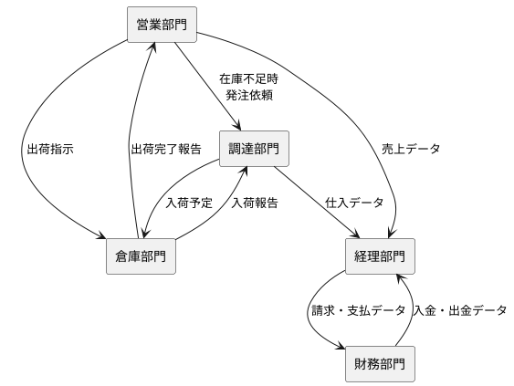

# 第4章：販売管理システムの全体像

本章から第2部「販売管理システム」の解説に入ります。まず、販売管理システムのスコープと、関連する組織の役割分担について解説します。

---

## 4.1 販売管理システムのスコープ

販売管理システムは、企業の販売活動を支援するシステムです。得意先からの引き合いを起点として、見積・受注・出荷・売上までの一連の業務プロセスを管理します。

### システム全体像

### 見積

見積は、得意先からの引き合いに対して、商品の価格・納期・数量等の条件を提示する業務です。

| 項目 | 説明 |
|---|---|
| 目的 | 得意先に販売条件を提示し、受注につなげる |
| 入力 | 引き合い情報（商品、数量、希望納期等） |
| 出力 | 見積書 |
| 主なデータ | 見積データ、見積明細データ |

**見積データの主要項目**

- 見積番号、見積日、有効期限
- 得意先コード、得意先名
- 担当者、担当部門
- 見積金額（税抜）、消費税額、見積金額（税込）

### 受注

受注は、得意先からの注文を受け付け、社内で処理する業務です。

| 項目 | 説明 |
|---|---|
| 目的 | 得意先の注文を正確に記録し、出荷・売上の起点とする |
| 入力 | 注文情報（商品、数量、希望納期、納品先等） |
| 出力 | 注文請書、受注確認書 |
| 主なデータ | 受注データ、受注明細データ |

**受注データの主要項目**

- 受注番号、受注日、希望納期
- 得意先コード、納品先コード
- 担当者、担当部門
- 受注金額（税抜）、消費税額、受注金額（税込）
- 受注ステータス（受付、確定、出荷中、完了、キャンセル）

### 出荷

出荷は、受注に基づいて商品を得意先に届ける業務です。

| 項目 | 説明 |
|---|---|
| 目的 | 受注した商品を正確・迅速に得意先に届ける |
| 入力 | 受注データ、出荷指示 |
| 出力 | 出荷指示書、ピッキングリスト、納品書 |
| 主なデータ | 出荷指示データ、出荷データ、出荷明細データ |

**出荷データの主要項目**

- 出荷番号、出荷日、出荷予定日
- 受注番号（紐付け）
- 納品先コード、配送先住所
- 出荷ステータス（指示済、ピッキング中、出荷済、配送中、配送完了）

### 売上

売上は、商品の引渡しが完了した時点で収益を計上する業務です。

| 項目 | 説明 |
|---|---|
| 目的 | 収益を正確に計上し、請求・回収の起点とする |
| 入力 | 出荷データ、納品確認 |
| 出力 | 売上伝票、請求データ |
| 主なデータ | 売上データ、売上明細データ |

**売上データの主要項目**

- 売上番号、売上日、計上月
- 受注番号、出荷番号（紐付け）
- 得意先コード、請求先コード
- 売上金額（税抜）、消費税額、売上金額（税込）

### 業務間の関連

見積・受注・出荷・売上の各業務は、以下のように関連しています。

| 関連 | カーディナリティ | 説明 |
|---|---|---|
| 見積 → 受注 | 0..1 : 0..N | 見積なしで受注可能、1見積から複数受注も可能 |
| 受注 → 出荷 | 1 : 1..N | 分納により1受注から複数出荷 |
| 出荷 → 売上 | 1..N : 1 | 出荷単位または複数出荷まとめて売上計上 |

---

## 4.2 販売組織の役割分担

販売管理システムに関わる組織は複数あり、それぞれが異なる役割を担っています。

### 組織構成

### 営業部門

営業部門は、得意先との接点を持ち、販売活動の中心的な役割を担います。

| 業務 | 責務 | 主な操作 |
|---|---|---|
| 見積 | 得意先への価格・納期の提示 | 見積作成、見積書発行 |
| 受注 | 得意先からの注文受付 | 受注登録、納期回答 |
| 出荷指示 | 倉庫への出荷依頼 | 出荷指示登録 |
| 売上 | 収益の計上 | 売上入力、売上確定 |

### 調達部門

調達部門は、商品・資材の仕入れを担当します。

| 業務 | 責務 | 主な操作 |
|---|---|---|
| 発注 | 仕入先への注文 | 発注登録、注文書発行 |
| 仕入 | 検収・仕入計上 | 仕入入力、仕入伝票発行 |

### 倉庫部門

倉庫部門は、商品・資材の物理的な管理を担当します。

| 業務 | 責務 | 主な操作 |
|---|---|---|
| 入荷 | 仕入先からの商品受入 | 入荷入力、検品 |
| ピッキング | 出荷商品の取り出し | ピッキング作業 |
| 出荷 | 商品の発送 | 出荷入力、配送手配 |
| 在庫管理 | 在庫数量の管理 | 棚卸、在庫調整 |

### 経理部門

経理部門は、取引の記帳・請求・支払の管理を担当します。

| 業務 | 責務 | 主な操作 |
|---|---|---|
| 締請求 | 売上の請求処理 | 締処理、請求書発行 |
| 支払締 | 仕入の支払処理 | 締処理、支払予定作成 |
| 仕訳 | 会計処理 | 仕訳入力、自動仕訳 |

### 財務部門

財務部門は、資金の入出金管理を担当します。

| 業務 | 責務 | 主な操作 |
|---|---|---|
| 入金 | 得意先からの入金処理 | 入金入力、消込処理 |
| 支払 | 仕入先への支払処理 | 支払入力、振込処理 |
| 資金管理 | 資金繰りの管理 | 資金計画、残高管理 |

### 業務フローと各部門の責務

各部門がどのタイミングで業務に関与するかを、全体フローで示します。

### 部門間の連携ポイント

| 連携元 | 連携先 | 連携内容 |
|---|---|---|
| 営業部門 | 調達部門 | 在庫不足時の発注依頼 |
| 営業部門 | 倉庫部門 | 出荷指示 |
| 営業部門 | 経理部門 | 売上データ |
| 調達部門 | 倉庫部門 | 入荷予定情報 |
| 調達部門 | 経理部門 | 仕入データ |
| 倉庫部門 | 営業部門 | 出荷完了報告 |
| 経理部門 | 財務部門 | 請求・支払データ |
| 財務部門 | 経理部門 | 入金・出金データ |

---

## まとめ

本章では、販売管理システムの全体像について解説しました。

- **販売管理システムのスコープ**は「見積→受注→出荷→売上」の4つの主要業務
- **5つの部門**（営業・調達・倉庫・経理・財務）がそれぞれの責務を担う
- 部門間の連携により、一連の業務フローが成立する

次章では、販売管理システムの基盤となるマスタ情報の設計について解説します。
