# 第4章：販売管理システムの全体像

本章から第2部「販売管理システム」の解説に入ります。まず、販売管理システムのスコープと、関連する組織の役割分担について解説します。

---

## 4.1 販売管理システムのスコープ

販売管理システムは、企業の販売活動を支援するシステムです。得意先からの引き合いを起点として、見積・受注・出荷・売上までの一連の業務プロセスを管理します。

### システム全体像

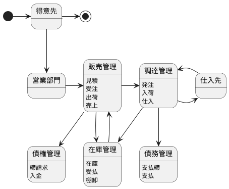

### 見積

見積は、得意先からの引き合いに対して、商品の価格・納期・数量等の条件を提示する業務です。

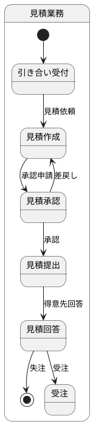

| 項目 | 説明 |
|---|---|
| 目的 | 得意先に販売条件を提示し、受注につなげる |
| 入力 | 引き合い情報（商品、数量、希望納期等） |
| 出力 | 見積書 |
| 主なデータ | 見積データ、見積明細データ |

**見積データの主要項目**

- 見積番号、見積日、有効期限
- 得意先コード、得意先名
- 担当者、担当部門
- 見積金額（税抜）、消費税額、見積金額（税込）

### 受注

受注は、得意先からの注文を受け付け、社内で処理する業務です。

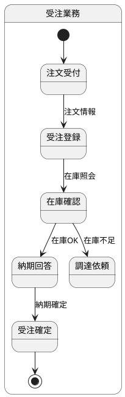

| 項目 | 説明 |
|---|---|
| 目的 | 得意先の注文を正確に記録し、出荷・売上の起点とする |
| 入力 | 注文情報（商品、数量、希望納期、納品先等） |
| 出力 | 注文請書、受注確認書 |
| 主なデータ | 受注データ、受注明細データ |

**受注データの主要項目**

- 受注番号、受注日、希望納期
- 得意先コード、納品先コード
- 担当者、担当部門
- 受注金額（税抜）、消費税額、受注金額（税込）
- 受注ステータス（受付、確定、出荷中、完了、キャンセル）

### 出荷

出荷は、受注に基づいて商品を得意先に届ける業務です。

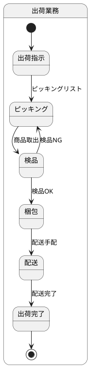

| 項目 | 説明 |
|---|---|
| 目的 | 受注した商品を正確・迅速に得意先に届ける |
| 入力 | 受注データ、出荷指示 |
| 出力 | 出荷指示書、ピッキングリスト、納品書 |
| 主なデータ | 出荷指示データ、出荷データ、出荷明細データ |

**出荷データの主要項目**

- 出荷番号、出荷日、出荷予定日
- 受注番号（紐付け）
- 納品先コード、配送先住所
- 出荷ステータス（指示済、ピッキング中、出荷済、配送中、配送完了）

### 売上

売上は、商品の引渡しが完了した時点で収益を計上する業務です。

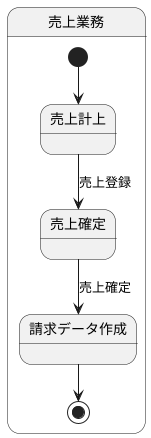

| 項目 | 説明 |
|---|---|
| 目的 | 収益を正確に計上し、請求・回収の起点とする |
| 入力 | 出荷データ、納品確認 |
| 出力 | 売上伝票、請求データ |
| 主なデータ | 売上データ、売上明細データ |

**売上データの主要項目**

- 売上番号、売上日、計上月
- 受注番号、出荷番号（紐付け）
- 得意先コード、請求先コード
- 売上金額（税抜）、消費税額、売上金額（税込）

### 業務間の関連

見積・受注・出荷・売上の各業務は、以下のように関連しています。

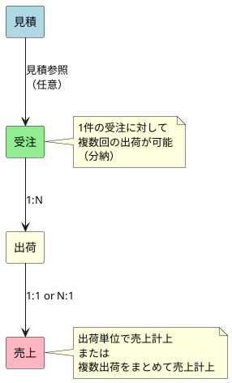

| 関連 | カーディナリティ | 説明 |
|---|---|---|
| 見積 → 受注 | 0..1 : 0..N | 見積なしで受注可能、1見積から複数受注も可能 |
| 受注 → 出荷 | 1 : 1..N | 分納により1受注から複数出荷 |
| 出荷 → 売上 | 1..N : 1 | 出荷単位または複数出荷まとめて売上計上 |

---

## 4.2 販売組織の役割分担

販売管理システムに関わる組織は複数あり、それぞれが異なる役割を担っています。

### 組織構成

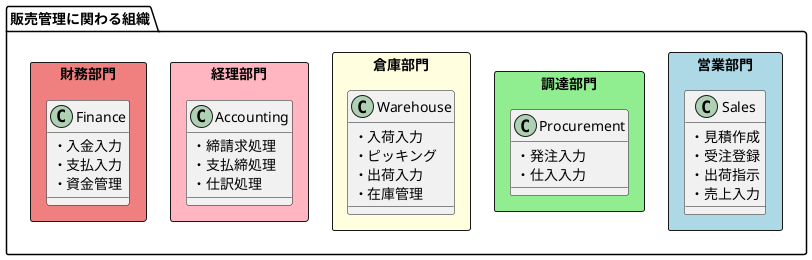

### 営業部門

営業部門は、得意先との接点を持ち、販売活動の中心的な役割を担います。

| 業務 | 責務 | 主な操作 |
|---|---|---|
| 見積 | 得意先への価格・納期の提示 | 見積作成、見積書発行 |
| 受注 | 得意先からの注文受付 | 受注登録、納期回答 |
| 出荷指示 | 倉庫への出荷依頼 | 出荷指示登録 |
| 売上 | 収益の計上 | 売上入力、売上確定 |

### 調達部門

調達部門は、商品・資材の仕入れを担当します。

| 業務 | 責務 | 主な操作 |
|---|---|---|
| 発注 | 仕入先への注文 | 発注登録、注文書発行 |
| 仕入 | 検収・仕入計上 | 仕入入力、仕入伝票発行 |

### 倉庫部門

倉庫部門は、商品・資材の物理的な管理を担当します。

| 業務 | 責務 | 主な操作 |
|---|---|---|
| 入荷 | 仕入先からの商品受入 | 入荷入力、検品 |
| ピッキング | 出荷商品の取り出し | ピッキング作業 |
| 出荷 | 商品の発送 | 出荷入力、配送手配 |
| 在庫管理 | 在庫数量の管理 | 棚卸、在庫調整 |

### 経理部門

経理部門は、取引の記帳・請求・支払の管理を担当します。

| 業務 | 責務 | 主な操作 |
|---|---|---|
| 締請求 | 売上の請求処理 | 締処理、請求書発行 |
| 支払締 | 仕入の支払処理 | 締処理、支払予定作成 |
| 仕訳 | 会計処理 | 仕訳入力、自動仕訳 |

### 財務部門

財務部門は、資金の入出金管理を担当します。

| 業務 | 責務 | 主な操作 |
|---|---|---|
| 入金 | 得意先からの入金処理 | 入金入力、消込処理 |
| 支払 | 仕入先への支払処理 | 支払入力、振込処理 |
| 資金管理 | 資金繰りの管理 | 資金計画、残高管理 |

### 業務フローと各部門の責務

各部門がどのタイミングで業務に関与するかを、全体フローで示します。

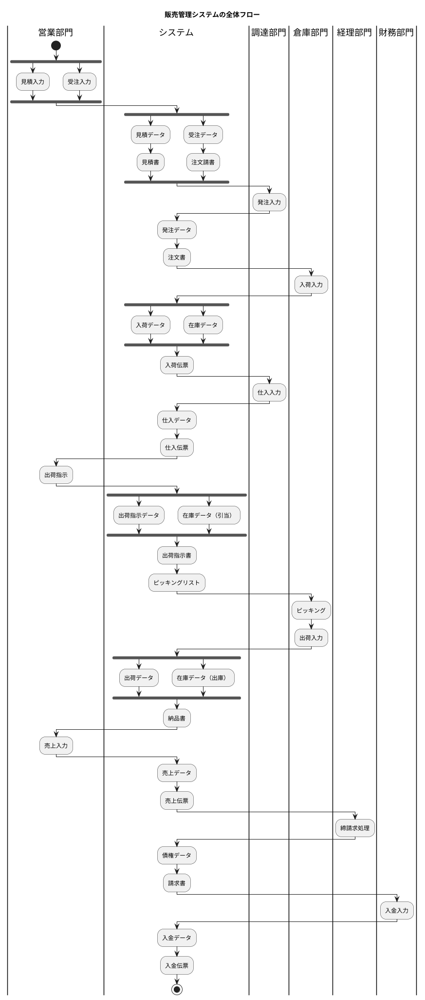

### 部門間の連携ポイント

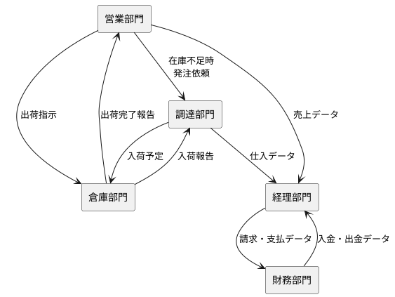

| 連携元 | 連携先 | 連携内容 |
|---|---|---|
| 営業部門 | 調達部門 | 在庫不足時の発注依頼 |
| 営業部門 | 倉庫部門 | 出荷指示 |
| 営業部門 | 経理部門 | 売上データ |
| 調達部門 | 倉庫部門 | 入荷予定情報 |
| 調達部門 | 経理部門 | 仕入データ |
| 倉庫部門 | 営業部門 | 出荷完了報告 |
| 経理部門 | 財務部門 | 請求・支払データ |
| 財務部門 | 経理部門 | 入金・出金データ |

---

## 4.3 販売管理システムのアーキテクチャ

本節では、販売管理システム（SMS: Sales Management System）のプロジェクト構成とアーキテクチャについて解説します。

### プロジェクト構成

販売管理システムは `apps/sms` ディレクトリ以下に構築します。

```
apps/sms/
├── backend/                           # バックエンド
│   └── src/
│       ├── domain/                    # ドメイン層（純粋なビジネスロジック）
│       │   ├── model/                 # ドメインモデル（エンティティ、値オブジェクト）
│       │   │   ├── master/            # マスタ関連
│       │   │   ├── sales/             # 販売関連
│       │   │   ├── purchase/          # 仕入関連
│       │   │   ├── inventory/         # 在庫関連
│       │   │   └── billing/           # 請求関連
│       │   └── exception/             # ドメイン例外
│       │
│       ├── application/               # アプリケーション層
│       │   ├── port/
│       │   │   ├── in/                # Input Port（ユースケースIF）
│       │   │   └── out/               # Output Port（リポジトリIF）
│       │   └── service/               # Application Service（ユースケース実装）
│       │
│       └── infrastructure/            # インフラストラクチャ層
│           ├── in/                    # Input Adapter（外部からの入力）
│           │   └── rest/              # REST API
│           │       ├── controller/    # REST Controller
│           │       ├── dto/           # Data Transfer Object
│           │       └── exception/     # Exception Handler
│           ├── out/                   # Output Adapter（外部への出力）
│           │   └── datasource/        # DB実装
│           │       ├── mapper/        # O/R Mapper
│           │       └── repository/    # Repository実装
│           └── config/                # 設定クラス
│
├── frontend/                          # フロントエンド
│   └── src/
│       ├── components/                # UI コンポーネント
│       ├── pages/                     # ページコンポーネント
│       ├── hooks/                     # カスタムフック
│       ├── services/                  # API クライアント
│       └── types/                     # 型定義
│
├── database/                          # データベース（永続化層）
│   ├── migrations/                    # マイグレーション
│   ├── seeds/                         # シードデータ
│   └── schema/                        # スキーマ定義
│
└── docker-compose.yml                 # Docker 構成
```

**各レイヤーの責務：**

| レイヤー | 責務 |
|---|---|
| Domain 層 | ビジネスルールとドメインモデル（外部技術に非依存） |
| Application 層 | ユースケースの実装とオーケストレーション |
| Infrastructure 層 | 外部技術との接続（DB、Web 等） |

### ヘキサゴナルアーキテクチャ（ポート&アダプター）

販売管理システムは、ヘキサゴナルアーキテクチャ（Ports and Adapters）を採用します。このアーキテクチャにより、ビジネスロジックを外部の技術的関心事から分離し、テスト容易性と保守性を高めます。

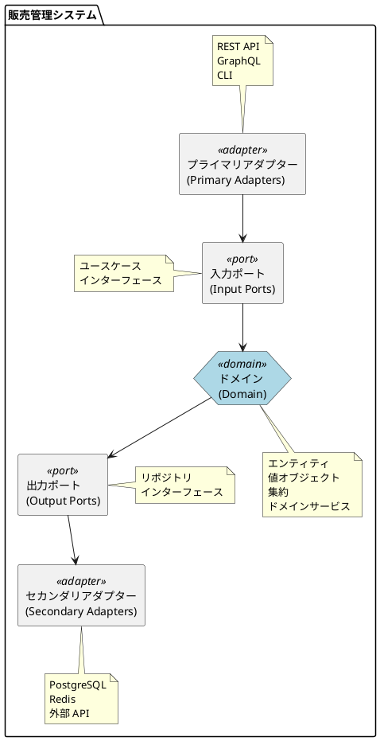

#### ドメイン（中心）

ドメインはシステムの中心に位置し、ビジネスロジックを実装します。

```
backend/src/domain/
├── model/                       # ドメインモデル
│   ├── master/                  # マスタ関連
│   │   ├── Product.ts           # 商品
│   │   ├── Customer.ts          # 顧客
│   │   └── Supplier.ts          # 仕入先
│   ├── sales/                   # 販売関連
│   │   ├── Order.ts             # 受注
│   │   ├── OrderItem.ts         # 受注明細
│   │   ├── Shipment.ts          # 出荷
│   │   └── Sales.ts             # 売上
│   ├── purchase/                # 仕入関連
│   │   ├── Purchase.ts          # 発注
│   │   └── PurchaseReceipt.ts   # 仕入
│   ├── inventory/               # 在庫関連
│   │   └── Inventory.ts         # 在庫
│   └── billing/                 # 請求関連
│       ├── Invoice.ts           # 請求
│       └── Receipt.ts           # 入金
└── exception/                   # ドメイン例外
    └── DomainException.ts
```

#### ポート（入力ポート・出力ポート）

ポートは、ドメインと外部世界との境界を定義するインターフェースです。

| ポート種別 | 役割 | 例 |
|---|---|---|
| 入力ポート | 外部からの要求を受け付ける | ユースケースインターフェース |
| 出力ポート | 外部リソースへのアクセスを抽象化 | リポジトリインターフェース |

```typescript
// 入力ポート（ユースケースインターフェース）
interface CreateOrderUseCase {
  execute(command: CreateOrderCommand): Promise<OrderId>;
}

// 出力ポート（リポジトリインターフェース）
interface OrderRepository {
  save(order: Order): Promise<void>;
  findById(id: OrderId): Promise<Order | null>;
  findByCustomerId(customerId: CustomerId): Promise<Order[]>;
}
```

#### アダプター（プライマリ・セカンダリ）

アダプターは、ポートの実装を提供し、外部技術とドメインを接続します。

| アダプター種別 | 役割 | 例 |
|---|---|---|
| プライマリアダプター | 外部からの入力を処理 | REST コントローラ、CLI |
| セカンダリアダプター | 外部リソースへの出力を処理 | DB リポジトリ実装、外部 API クライアント |

```
backend/src/infrastructure/
├── in/                          # Input Adapter（プライマリアダプター）
│   └── rest/                    # REST API
│       ├── controller/
│       │   ├── OrderController.ts
│       │   ├── ShipmentController.ts
│       │   └── SalesController.ts
│       ├── dto/
│       │   ├── OrderRequest.ts
│       │   └── OrderResponse.ts
│       └── exception/
│           └── RestExceptionHandler.ts
├── out/                         # Output Adapter（セカンダリアダプター）
│   └── datasource/              # DB実装
│       ├── mapper/
│       │   └── OrderMapper.ts
│       └── repository/
│           ├── OrderRepositoryImpl.ts
│           └── CustomerRepositoryImpl.ts
└── config/                      # 設定クラス
    ├── DatabaseConfig.ts
    └── WebConfig.ts
```

#### 依存性の方向と依存性逆転の原則

ヘキサゴナルアーキテクチャでは、すべての依存性がドメインに向かいます。

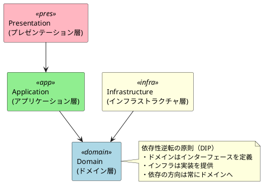

### ドメイン駆動設計の適用

#### 集約とリポジトリ

販売管理システムの主要な集約を以下に示します。

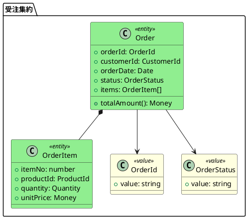

| 集約 | ルートエンティティ | 主な責務 |
|---|---|---|
| 見積集約 | Estimate | 見積の作成・更新・承認 |
| 受注集約 | Order | 受注の登録・在庫引当・ステータス管理 |
| 出荷集約 | Shipment | 出荷指示・出荷実績の管理 |
| 売上集約 | Sales | 売上計上・請求データ生成 |

#### ドメインサービス

エンティティに属さないビジネスロジックはドメインサービスとして実装します。

```typescript
// 価格計算サービス
class PricingService {
  calculateOrderTotal(
    items: OrderItem[],
    customer: Customer,
    discountPolicy: DiscountPolicy
  ): Money {
    // 顧客別単価の適用
    // 数量割引の計算
    // 消費税の計算
  }
}

// 在庫引当サービス
class InventoryAllocationService {
  allocate(order: Order): AllocationResult {
    // 在庫の確認
    // 引当処理
    // 不足時の調達依頼
  }
}
```

#### アプリケーションサービス

アプリケーションサービスは、ユースケースを実装し、トランザクション境界を管理します。

```typescript
// 受注登録ユースケース
class CreateOrderService implements CreateOrderUseCase {
  constructor(
    private orderRepository: OrderRepository,
    private customerRepository: CustomerRepository,
    private pricingService: PricingService,
    private inventoryService: InventoryAllocationService
  ) {}

  async execute(command: CreateOrderCommand): Promise<OrderId> {
    // 1. 顧客の取得
    const customer = await this.customerRepository.findById(command.customerId);

    // 2. 受注の作成
    const order = Order.create(customer, command.items);

    // 3. 価格計算
    order.calculateTotal(this.pricingService);

    // 4. 在庫引当
    await this.inventoryService.allocate(order);

    // 5. 保存
    await this.orderRepository.save(order);

    return order.id;
  }
}
```

### API 設計

#### RESTful API の基本方針

| 原則 | 説明 |
|---|---|
| リソース指向 | URL はリソース（名詞）を表す |
| HTTP メソッド | GET/POST/PUT/DELETE で操作を表現 |
| ステートレス | サーバーはセッション状態を保持しない |
| HATEOAS | レスポンスに関連リソースへのリンクを含める |

#### エンドポイント設計

```
# 見積
GET    /api/v1/estimates              # 見積一覧
POST   /api/v1/estimates              # 見積作成
GET    /api/v1/estimates/{id}         # 見積詳細
PUT    /api/v1/estimates/{id}         # 見積更新
DELETE /api/v1/estimates/{id}         # 見積削除
POST   /api/v1/estimates/{id}/approve # 見積承認

# 受注
GET    /api/v1/orders                 # 受注一覧
POST   /api/v1/orders                 # 受注登録
GET    /api/v1/orders/{id}            # 受注詳細
PUT    /api/v1/orders/{id}            # 受注更新
POST   /api/v1/orders/{id}/confirm    # 受注確定
POST   /api/v1/orders/{id}/cancel     # 受注キャンセル

# 出荷
GET    /api/v1/shipments              # 出荷一覧
POST   /api/v1/shipments              # 出荷登録
GET    /api/v1/shipments/{id}         # 出荷詳細
POST   /api/v1/shipments/{id}/ship    # 出荷実行
POST   /api/v1/shipments/{id}/deliver # 配送完了

# 売上
GET    /api/v1/sales                  # 売上一覧
POST   /api/v1/sales                  # 売上計上
GET    /api/v1/sales/{id}             # 売上詳細
```

---

## まとめ

本章では、販売管理システムの全体像について解説しました。

- **販売管理システムのスコープ**は「見積→受注→出荷→売上」の4つの主要業務
- **5つの部門**（営業・調達・倉庫・経理・財務）がそれぞれの責務を担う
- 部門間の連携により、一連の業務フローが成立する
- **ヘキサゴナルアーキテクチャ**により、ドメインを中心とした疎結合な設計を実現
- **ドメイン駆動設計**の集約・リポジトリパターンを適用

次章では、販売管理システムの基盤となるマスタ情報の設計について解説します。
