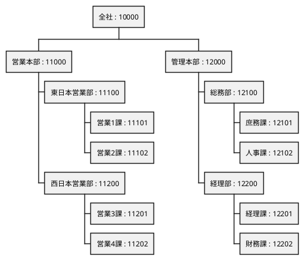
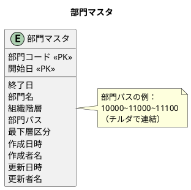
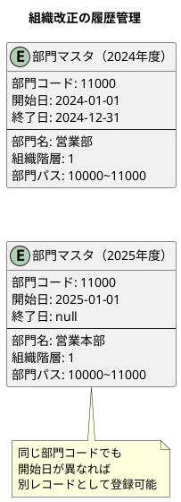
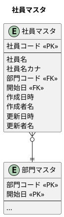
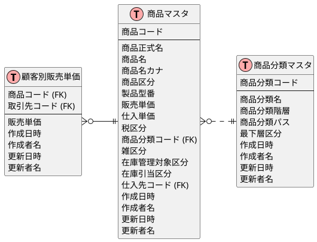
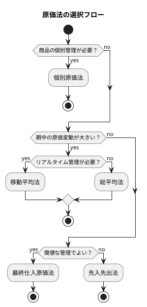
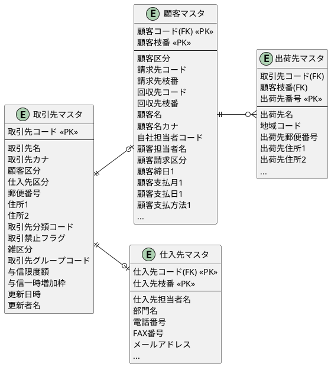
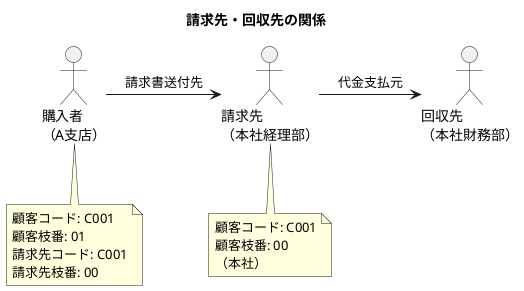
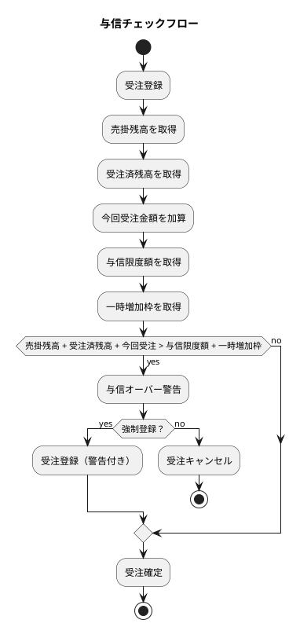
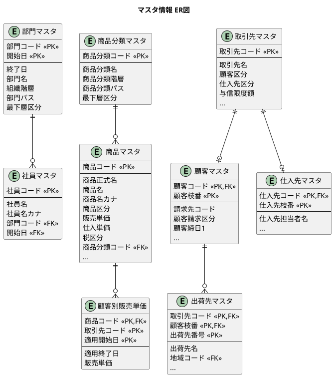

# 第5章：マスタ情報の設計

販売管理システムの基盤となるマスタ情報を TDD で設計していきます。本章では、組織・社員・商品・取引先といった基本的なマスタテーブルの設計と実装を行います。

## 5.1 部門マスタの設計

企業の組織構造を管理する部門マスタを設計します。

### 組織階層の概念

企業の組織は階層構造を持っています。部門マスタでは、この階層構造を「部門パス」で表現します。



### 部門マスタの ER 図



### 部門マスタの項目説明

| 項目 | 説明 | 例 |
|-----|------|-----|
| **部門コード** | 部門を一意に識別するコード | `11101` |
| **開始日** | 部門の有効期間開始日 | `2025-01-01` |
| **終了日** | 部門の有効期間終了日 | `null`（有効） |
| **部門名** | 部門の名称 | `営業1課` |
| **組織階層** | 階層の深さ（0から開始） | `3` |
| **部門パス** | ルートからのパス（チルダ連結） | `10000~11000~11100~11101` |
| **最下層区分** | 最下層（末端）かどうか | `true` |

### 組織改正への対応（履歴管理）

組織改正が発生した場合、同じ部門コードでも開始日が異なるレコードを登録することで、組織の変遷を管理できます。



### マイグレーション：部門マスタテーブルの作成

<details>
<summary>SQL 実装</summary>

```sql
-- src/main/resources/db/migration/V002__create_department_master.sql

-- 部門マスタ（日本語テーブル名・カラム名）
CREATE TABLE "部門マスタ" (
    "部門コード" VARCHAR(10) NOT NULL,
    "開始日" DATE NOT NULL,
    "終了日" DATE,
    "部門名" VARCHAR(40) NOT NULL,
    "組織階層" INTEGER NOT NULL DEFAULT 0,
    "部門パス" VARCHAR(100),
    "最下層区分" BOOLEAN NOT NULL DEFAULT FALSE,
    "作成日時" TIMESTAMP DEFAULT CURRENT_TIMESTAMP,
    "作成者名" VARCHAR(50),
    "更新日時" TIMESTAMP DEFAULT CURRENT_TIMESTAMP,
    "更新者名" VARCHAR(50),
    PRIMARY KEY ("部門コード", "開始日")
);

-- インデックス
CREATE INDEX idx_部門マスタ_部門パス ON "部門マスタ"("部門パス");
CREATE INDEX idx_部門マスタ_組織階層 ON "部門マスタ"("組織階層");
```

</details>

### TDD：部門の登録と取得

#### Red: 失敗するテストを書く

<details>
<summary>DepartmentRepositoryTest.java</summary>

```java
// src/test/java/com/example/sms/infrastructure/persistence/repository/DepartmentRepositoryTest.java
package com.example.sms.infrastructure.persistence.repository;

import com.example.sms.application.port.out.DepartmentRepository;
import com.example.sms.domain.model.department.Department;
import com.example.sms.testsetup.BaseIntegrationTest;
import org.junit.jupiter.api.*;
import org.springframework.beans.factory.annotation.Autowired;

import java.time.LocalDate;

import static org.assertj.core.api.Assertions.*;

@DisplayName("部門リポジトリ")
class DepartmentRepositoryTest extends BaseIntegrationTest {

    @Autowired
    private DepartmentRepository departmentRepository;

    @BeforeEach
    void setUp() {
        departmentRepository.deleteAll();
    }

    @Nested
    @DisplayName("登録")
    class Registration {

        @Test
        @DisplayName("部門を登録できる")
        void canRegisterDepartment() {
            // Arrange
            var department = Department.builder()
                    .departmentCode("10000")
                    .startDate(LocalDate.of(2025, 1, 1))
                    .departmentName("本社")
                    .hierarchyLevel(0)
                    .departmentPath("10000")
                    .isLeaf(false)
                    .build();

            // Act
            departmentRepository.save(department);

            // Assert
            var result = departmentRepository.findByCode("10000");
            assertThat(result).isPresent();
            assertThat(result.get().getDepartmentName()).isEqualTo("本社");
            assertThat(result.get().getHierarchyLevel()).isEqualTo(0);
        }

        @Test
        @DisplayName("階層構造を持つ部門を登録できる")
        void canRegisterHierarchicalDepartments() {
            // Arrange: 親部門
            var parent = Department.builder()
                    .departmentCode("10000")
                    .startDate(LocalDate.of(2025, 1, 1))
                    .departmentName("本社")
                    .hierarchyLevel(0)
                    .departmentPath("10000")
                    .isLeaf(false)
                    .build();
            departmentRepository.save(parent);

            // Arrange: 子部門
            var child = Department.builder()
                    .departmentCode("11000")
                    .startDate(LocalDate.of(2025, 1, 1))
                    .departmentName("営業本部")
                    .hierarchyLevel(1)
                    .departmentPath("10000~11000")
                    .isLeaf(false)
                    .build();
            departmentRepository.save(child);

            // Arrange: 孫部門（最下層）
            var grandChild = Department.builder()
                    .departmentCode("11101")
                    .startDate(LocalDate.of(2025, 1, 1))
                    .departmentName("営業1課")
                    .hierarchyLevel(3)
                    .departmentPath("10000~11000~11100~11101")
                    .isLeaf(true)
                    .build();
            departmentRepository.save(grandChild);

            // Act
            var result = departmentRepository.findByCode("11101");

            // Assert
            assertThat(result).isPresent();
            assertThat(result.get().getDepartmentPath()).isEqualTo("10000~11000~11100~11101");
            assertThat(result.get().isLeaf()).isTrue();
        }
    }

    @Nested
    @DisplayName("履歴管理")
    class HistoryManagement {

        @Test
        @DisplayName("同じ部門コードでも開始日が異なれば登録できる（組織改正対応）")
        void canRegisterSameCodeWithDifferentStartDate() {
            // Arrange: 旧組織
            var oldDept = Department.builder()
                    .departmentCode("11000")
                    .startDate(LocalDate.of(2024, 1, 1))
                    .endDate(LocalDate.of(2024, 12, 31))
                    .departmentName("営業部")
                    .hierarchyLevel(1)
                    .departmentPath("10000~11000")
                    .isLeaf(false)
                    .build();
            departmentRepository.save(oldDept);

            // Arrange: 新組織
            var newDept = Department.builder()
                    .departmentCode("11000")
                    .startDate(LocalDate.of(2025, 1, 1))
                    .departmentName("営業本部")
                    .hierarchyLevel(1)
                    .departmentPath("10000~11000")
                    .isLeaf(false)
                    .build();
            departmentRepository.save(newDept);

            // Act: 現在有効な部門を取得
            var result = departmentRepository.findByCodeAndDate("11000", LocalDate.of(2025, 4, 1));

            // Assert
            assertThat(result).isPresent();
            assertThat(result.get().getDepartmentName()).isEqualTo("営業本部");
        }
    }
}
```

</details>

#### Green: テストを通す実装

<details>
<summary>Department.java（エンティティ）</summary>

```java
// src/main/java/com/example/sms/domain/model/department/Department.java
package com.example.sms.domain.model.department;

import lombok.*;
import java.time.LocalDate;
import java.time.LocalDateTime;

@Data
@Builder
@NoArgsConstructor
@AllArgsConstructor
public class Department {
    private String departmentCode;
    private LocalDate startDate;
    private LocalDate endDate;
    private String departmentName;
    @Builder.Default
    private Integer hierarchyLevel = 0;
    private String departmentPath;
    @Builder.Default
    private boolean isLeaf = false;
    private LocalDateTime createdAt;
    private String createdBy;
    private LocalDateTime updatedAt;
    private String updatedBy;
}
```

</details>

<details>
<summary>DepartmentRepository.java（Output Port）</summary>

```java
// src/main/java/com/example/sms/application/port/out/DepartmentRepository.java
package com.example.sms.application.port.out;

import com.example.sms.domain.model.department.Department;

import java.time.LocalDate;
import java.util.List;
import java.util.Optional;

/**
 * 部門リポジトリ（Output Port）
 */
public interface DepartmentRepository {

    void save(Department department);

    Optional<Department> findByCode(String departmentCode);

    Optional<Department> findByCodeAndDate(String departmentCode, LocalDate baseDate);

    List<Department> findAll();

    List<Department> findByHierarchyLevel(int level);

    List<Department> findChildren(String parentPath);

    void update(Department department);

    void deleteAll();
}
```

</details>

<details>
<summary>DepartmentMapper.xml</summary>

```xml
<?xml version="1.0" encoding="UTF-8" ?>
<!DOCTYPE mapper
        PUBLIC "-//mybatis.org//DTD Mapper 3.0//EN"
        "http://mybatis.org/dtd/mybatis-3-mapper.dtd">
<mapper namespace="com.example.sms.infrastructure.persistence.mapper.DepartmentMapper">

    <resultMap id="DepartmentResultMap" type="com.example.sms.domain.model.department.Department">
        <result property="departmentCode" column="部門コード"/>
        <result property="startDate" column="開始日"/>
        <result property="endDate" column="終了日"/>
        <result property="departmentName" column="部門名"/>
        <result property="hierarchyLevel" column="組織階層"/>
        <result property="departmentPath" column="部門パス"/>
        <result property="isLeaf" column="最下層区分"/>
        <result property="createdAt" column="作成日時"/>
        <result property="createdBy" column="作成者名"/>
        <result property="updatedAt" column="更新日時"/>
        <result property="updatedBy" column="更新者名"/>
    </resultMap>

    <insert id="insert" parameterType="com.example.sms.domain.model.department.Department">
        INSERT INTO "部門マスタ" (
            "部門コード", "開始日", "終了日", "部門名",
            "組織階層", "部門パス", "最下層区分",
            "作成日時", "作成者名", "更新日時", "更新者名"
        ) VALUES (
            #{departmentCode}, #{startDate}, #{endDate}, #{departmentName},
            #{hierarchyLevel}, #{departmentPath}, #{isLeaf},
            CURRENT_TIMESTAMP, #{createdBy}, CURRENT_TIMESTAMP, #{updatedBy}
        )
    </insert>

    <select id="findByCode" resultMap="DepartmentResultMap">
        SELECT * FROM "部門マスタ"
        WHERE "部門コード" = #{departmentCode}
          AND ("終了日" IS NULL OR "終了日" > CURRENT_DATE)
        ORDER BY "開始日" DESC
        LIMIT 1
    </select>

    <select id="findByCodeAndDate" resultMap="DepartmentResultMap">
        SELECT * FROM "部門マスタ"
        WHERE "部門コード" = #{departmentCode}
          AND "開始日" &lt;= #{baseDate}
          AND ("終了日" IS NULL OR "終了日" > #{baseDate})
        ORDER BY "開始日" DESC
        LIMIT 1
    </select>

    <delete id="deleteAll">
        TRUNCATE TABLE "部門マスタ" CASCADE
    </delete>
</mapper>
```

</details>

---

## 5.2 社員マスタの設計

部門に所属する社員を管理するマスタを設計します。

### 社員マスタの ER 図



### マイグレーション：社員マスタテーブルの作成

<details>
<summary>SQL 実装</summary>

```sql
-- src/main/resources/db/migration/V003__create_employee_master.sql

-- 社員マスタ
CREATE TABLE "社員マスタ" (
    "社員コード" VARCHAR(10) PRIMARY KEY,
    "社員名" VARCHAR(20) NOT NULL,
    "社員名カナ" VARCHAR(40),
    "部門コード" VARCHAR(10),
    "開始日" DATE,
    "作成日時" TIMESTAMP DEFAULT CURRENT_TIMESTAMP,
    "作成者名" VARCHAR(50),
    "更新日時" TIMESTAMP DEFAULT CURRENT_TIMESTAMP,
    "更新者名" VARCHAR(50),
    FOREIGN KEY ("部門コード", "開始日") REFERENCES "部門マスタ"("部門コード", "開始日")
);

CREATE INDEX idx_社員マスタ_部門コード ON "社員マスタ"("部門コード");
```

</details>

### エンティティ（ドメイン層）

<details>
<summary>Employee.java</summary>

```java
// src/main/java/com/example/sms/domain/model/employee/Employee.java
package com.example.sms.domain.model.employee;

import lombok.*;
import java.time.LocalDate;
import java.time.LocalDateTime;

@Data
@Builder
@NoArgsConstructor
@AllArgsConstructor
public class Employee {
    private String employeeCode;
    private String employeeName;
    private String employeeNameKana;
    private String departmentCode;
    private LocalDate departmentStartDate;
    private LocalDateTime createdAt;
    private String createdBy;
    private LocalDateTime updatedAt;
    private String updatedBy;
}
```

</details>

---

## 5.3 商品マスタの設計

販売管理システムで扱う「商品」の情報を管理するマスタを設計します。

### 商品マスタの構造



### 商品区分と税区分

商品には「商品区分」と「税区分」という2つの区分があります。

#### 商品区分

| 区分値 | 説明 |
|-------|------|
| 商品 | 仕入れて販売する商品 |
| 製品 | 自社で製造した製品 |
| サービス | 無形のサービス |
| 諸口 | その他の一時的な商品 |

#### 税区分

| 区分値 | 説明 |
|-------|------|
| 外税 | 税抜価格で管理し、別途消費税を計算 |
| 内税 | 税込価格で管理 |
| 非課税 | 消費税対象外 |

### マイグレーション：商品マスタテーブルの作成

<details>
<summary>SQL 実装</summary>

```sql
-- src/main/resources/db/migration/V004__create_product_master.sql

-- 商品区分 ENUM
CREATE TYPE 商品区分 AS ENUM ('商品', '製品', 'サービス', '諸口');

-- 税区分 ENUM
CREATE TYPE 税区分 AS ENUM ('外税', '内税', '非課税');

-- 商品分類マスタ
CREATE TABLE "商品分類マスタ" (
    "商品分類コード" VARCHAR(10) PRIMARY KEY,
    "商品分類名" VARCHAR(50) NOT NULL,
    "商品分類階層" INTEGER NOT NULL DEFAULT 0,
    "商品分類パス" VARCHAR(100),
    "最下層区分" BOOLEAN NOT NULL DEFAULT FALSE,
    "作成日時" TIMESTAMP DEFAULT CURRENT_TIMESTAMP,
    "作成者名" VARCHAR(50),
    "更新日時" TIMESTAMP DEFAULT CURRENT_TIMESTAMP,
    "更新者名" VARCHAR(50)
);

-- 商品マスタ
CREATE TABLE "商品マスタ" (
    "商品コード" VARCHAR(20) PRIMARY KEY,
    "商品正式名" VARCHAR(200),
    "商品名" VARCHAR(100) NOT NULL,
    "商品名カナ" VARCHAR(200),
    "商品区分" 商品区分 NOT NULL DEFAULT '商品',
    "製品型番" VARCHAR(50),
    "販売単価" DECIMAL(15, 2) DEFAULT 0,
    "仕入単価" DECIMAL(15, 2) DEFAULT 0,
    "税区分" 税区分 NOT NULL DEFAULT '外税',
    "商品分類コード" VARCHAR(10) REFERENCES "商品分類マスタ"("商品分類コード"),
    "雑区分" BOOLEAN DEFAULT FALSE,
    "在庫管理対象区分" BOOLEAN DEFAULT TRUE,
    "在庫引当区分" BOOLEAN DEFAULT TRUE,
    "仕入先コード" VARCHAR(20),
    "仕入先枝番" VARCHAR(10),
    "作成日時" TIMESTAMP DEFAULT CURRENT_TIMESTAMP,
    "作成者名" VARCHAR(50),
    "更新日時" TIMESTAMP DEFAULT CURRENT_TIMESTAMP,
    "更新者名" VARCHAR(50)
);

-- インデックス
CREATE INDEX idx_商品マスタ_商品区分 ON "商品マスタ"("商品区分");
CREATE INDEX idx_商品マスタ_商品分類コード ON "商品マスタ"("商品分類コード");
CREATE INDEX idx_商品分類マスタ_商品分類パス ON "商品分類マスタ"("商品分類パス");
```

</details>

### TDD：商品の登録と取得

#### Red: 失敗するテストを書く

<details>
<summary>ProductRepositoryTest.java</summary>

```java
// src/test/java/com/example/sms/infrastructure/persistence/repository/ProductRepositoryTest.java
package com.example.sms.infrastructure.persistence.repository;

import com.example.sms.application.port.out.ProductRepository;
import com.example.sms.domain.model.product.Product;
import com.example.sms.domain.model.product.ProductCategory;
import com.example.sms.domain.model.product.TaxCategory;
import com.example.sms.testsetup.BaseIntegrationTest;
import org.junit.jupiter.api.*;
import org.springframework.beans.factory.annotation.Autowired;

import java.math.BigDecimal;

import static org.assertj.core.api.Assertions.*;

@DisplayName("商品リポジトリ")
class ProductRepositoryTest extends BaseIntegrationTest {

    @Autowired
    private ProductRepository productRepository;

    @BeforeEach
    void setUp() {
        productRepository.deleteAll();
    }

    @Nested
    @DisplayName("登録")
    class Registration {

        @Test
        @DisplayName("商品を登録できる")
        void canRegisterProduct() {
            // Arrange
            var product = Product.builder()
                    .productCode("PROD001")
                    .productName("テスト商品")
                    .productCategory(ProductCategory.PRODUCT)
                    .sellingPrice(new BigDecimal("1000"))
                    .purchasePrice(new BigDecimal("700"))
                    .taxCategory(TaxCategory.EXCLUSIVE)
                    .build();

            // Act
            productRepository.save(product);

            // Assert
            var result = productRepository.findByCode("PROD001");
            assertThat(result).isPresent();
            assertThat(result.get().getProductName()).isEqualTo("テスト商品");
            assertThat(result.get().getSellingPrice()).isEqualByComparingTo(new BigDecimal("1000"));
        }

        @Test
        @DisplayName("全ての商品区分を登録できる")
        void canRegisterAllCategories() {
            var categories = ProductCategory.values();

            for (int i = 0; i < categories.length; i++) {
                var product = Product.builder()
                        .productCode("CAT-" + String.format("%03d", i))
                        .productName("商品" + categories[i].getDisplayName())
                        .productCategory(categories[i])
                        .taxCategory(TaxCategory.EXCLUSIVE)
                        .build();

                productRepository.save(product);

                var result = productRepository.findByCode(product.getProductCode());
                assertThat(result).isPresent();
                assertThat(result.get().getProductCategory()).isEqualTo(categories[i]);
            }
        }
    }

    @Nested
    @DisplayName("税区分")
    class TaxCategories {

        @Test
        @DisplayName("外税商品を登録できる")
        void canRegisterExclusiveTax() {
            var product = createProduct("TAX001", "外税商品", TaxCategory.EXCLUSIVE);
            productRepository.save(product);

            var result = productRepository.findByCode("TAX001");
            assertThat(result.get().getTaxCategory()).isEqualTo(TaxCategory.EXCLUSIVE);
        }

        @Test
        @DisplayName("内税商品を登録できる")
        void canRegisterInclusiveTax() {
            var product = createProduct("TAX002", "内税商品", TaxCategory.INCLUSIVE);
            productRepository.save(product);

            var result = productRepository.findByCode("TAX002");
            assertThat(result.get().getTaxCategory()).isEqualTo(TaxCategory.INCLUSIVE);
        }

        @Test
        @DisplayName("非課税商品を登録できる")
        void canRegisterTaxFree() {
            var product = createProduct("TAX003", "非課税商品", TaxCategory.TAX_FREE);
            productRepository.save(product);

            var result = productRepository.findByCode("TAX003");
            assertThat(result.get().getTaxCategory()).isEqualTo(TaxCategory.TAX_FREE);
        }
    }

    private Product createProduct(String code, String name, TaxCategory taxCategory) {
        return Product.builder()
                .productCode(code)
                .productName(name)
                .productCategory(ProductCategory.PRODUCT)
                .taxCategory(taxCategory)
                .build();
    }
}
```

</details>

#### Green: テストを通す実装

<details>
<summary>Product.java（エンティティ）</summary>

```java
// src/main/java/com/example/sms/domain/model/product/Product.java
package com.example.sms.domain.model.product;

import lombok.*;
import java.math.BigDecimal;
import java.time.LocalDateTime;

@Data
@Builder
@NoArgsConstructor
@AllArgsConstructor
public class Product {
    private String productCode;
    private String productFullName;
    private String productName;
    private String productNameKana;
    private ProductCategory productCategory;
    private String modelNumber;
    @Builder.Default
    private BigDecimal sellingPrice = BigDecimal.ZERO;
    @Builder.Default
    private BigDecimal purchasePrice = BigDecimal.ZERO;
    private TaxCategory taxCategory;
    private String classificationCode;
    @Builder.Default
    private boolean isMiscellaneous = false;
    @Builder.Default
    private boolean isInventoryManaged = true;
    @Builder.Default
    private boolean isInventoryAllocated = true;
    private String supplierCode;
    private String supplierBranchNumber;
    private LocalDateTime createdAt;
    private String createdBy;
    private LocalDateTime updatedAt;
    private String updatedBy;
}
```

</details>

<details>
<summary>ProductCategory.java（商品区分 Enum）</summary>

```java
// src/main/java/com/example/sms/domain/model/product/ProductCategory.java
package com.example.sms.domain.model.product;

import lombok.Getter;
import lombok.RequiredArgsConstructor;

@Getter
@RequiredArgsConstructor
public enum ProductCategory {
    PRODUCT("商品"),
    MANUFACTURED("製品"),
    SERVICE("サービス"),
    MISCELLANEOUS("諸口");

    private final String displayName;

    public static ProductCategory fromDisplayName(String displayName) {
        for (ProductCategory category : values()) {
            if (category.displayName.equals(displayName)) {
                return category;
            }
        }
        throw new IllegalArgumentException("不正な商品区分: " + displayName);
    }
}
```

</details>

<details>
<summary>TaxCategory.java（税区分 Enum）</summary>

```java
// src/main/java/com/example/sms/domain/model/product/TaxCategory.java
package com.example.sms.domain.model.product;

import lombok.Getter;
import lombok.RequiredArgsConstructor;

@Getter
@RequiredArgsConstructor
public enum TaxCategory {
    EXCLUSIVE("外税"),
    INCLUSIVE("内税"),
    TAX_FREE("非課税");

    private final String displayName;

    public static TaxCategory fromDisplayName(String displayName) {
        for (TaxCategory category : values()) {
            if (category.displayName.equals(displayName)) {
                return category;
            }
        }
        throw new IllegalArgumentException("不正な税区分: " + displayName);
    }
}
```

</details>

### 顧客別販売単価の設計

特定の顧客に対して、標準単価とは異なる販売単価を設定できる仕組みです。

<details>
<summary>SQL 実装</summary>

```sql
-- src/main/resources/db/migration/V005__create_customer_price.sql

-- 顧客別販売単価
CREATE TABLE "顧客別販売単価" (
    "商品コード" VARCHAR(20) NOT NULL REFERENCES "商品マスタ"("商品コード"),
    "取引先コード" VARCHAR(20) NOT NULL,
    "適用開始日" DATE NOT NULL,
    "適用終了日" DATE,
    "販売単価" DECIMAL(15, 2) NOT NULL,
    "作成日時" TIMESTAMP DEFAULT CURRENT_TIMESTAMP,
    "作成者名" VARCHAR(50),
    "更新日時" TIMESTAMP DEFAULT CURRENT_TIMESTAMP,
    "更新者名" VARCHAR(50),
    PRIMARY KEY ("商品コード", "取引先コード", "適用開始日")
);
```

</details>

---

## 5.4 原価管理の設計

商品の原価を計算する方法には8種類あります。

### 8種類の原価法

| 原価法 | 説明 |
|-------|------|
| **個別原価法** | 個々の商品ごとに原価を管理 |
| **先入先出法** | 最も古い在庫から順に払い出す |
| **後入先出法** | 最も新しい在庫から順に払い出す |
| **総平均法** | 期間全体の平均原価を使用 |
| **移動平均法** | 仕入れのたびに平均原価を再計算 |
| **単純平均法** | 単純に平均値を使用 |
| **最終仕入原価法** | 最後に仕入れた原価を使用 |
| **売価還元法** | 売価から逆算して原価を算出 |

### 原価法の選択基準



本システムでは**移動平均法**を採用し、仕入れのたびに平均原価を再計算します。

---

## 5.5 消費税の設計

### 税区分の考え方

| 税区分 | 説明 | 計算方法 |
|-------|------|---------|
| **外税** | 税抜価格で管理 | 価格 × 税率 = 消費税額 |
| **内税** | 税込価格で管理 | 価格 × 税率 ÷ (1 + 税率) = 消費税額 |
| **非課税** | 消費税対象外 | 消費税額 = 0 |

### 消費税計算の実装

<details>
<summary>TaxCalculator.java</summary>

```java
// src/main/java/com/example/sms/domain/type/TaxCalculator.java
package com.example.sms.domain.type;

import com.example.sms.domain.model.product.TaxCategory;
import lombok.RequiredArgsConstructor;
import java.math.BigDecimal;
import java.math.RoundingMode;

@RequiredArgsConstructor
public class TaxCalculator {

    private final BigDecimal taxRate;

    /**
     * 消費税額を計算する
     */
    public BigDecimal calculateTax(BigDecimal price, TaxCategory taxCategory) {
        return switch (taxCategory) {
            case EXCLUSIVE -> price.multiply(taxRate)
                    .setScale(0, RoundingMode.DOWN);
            case INCLUSIVE -> price.multiply(taxRate)
                    .divide(BigDecimal.ONE.add(taxRate), 0, RoundingMode.DOWN);
            case TAX_FREE -> BigDecimal.ZERO;
        };
    }

    /**
     * 税込金額を計算する
     */
    public BigDecimal calculateTaxIncludedPrice(BigDecimal price, TaxCategory taxCategory) {
        return switch (taxCategory) {
            case EXCLUSIVE -> price.add(calculateTax(price, taxCategory));
            case INCLUSIVE -> price;
            case TAX_FREE -> price;
        };
    }
}
```

</details>

---

## 5.6 顧客マスタの設計

顧客と仕入先を統合管理する取引先マスタを設計します。

### 取引先マスタの構造



### 請求先・回収先の概念

顧客マスタでは、実際に商品を購入する顧客と、請求書を送付する先（請求先）、代金を回収する先（回収先）を分けて管理できます。



### マイグレーション：取引先関連テーブルの作成

<details>
<summary>SQL 実装</summary>

```sql
-- src/main/resources/db/migration/V006__create_partner_master.sql

-- 請求区分 ENUM
CREATE TYPE 請求区分 AS ENUM ('都度', '締め');

-- 支払方法 ENUM
CREATE TYPE 支払方法 AS ENUM ('現金', '振込', '手形', '小切手', 'その他');

-- 取引先グループマスタ
CREATE TABLE "取引先グループマスタ" (
    "取引先グループコード" VARCHAR(10) PRIMARY KEY,
    "取引先グループ名" VARCHAR(50) NOT NULL,
    "作成日時" TIMESTAMP DEFAULT CURRENT_TIMESTAMP,
    "作成者名" VARCHAR(50),
    "更新日時" TIMESTAMP DEFAULT CURRENT_TIMESTAMP,
    "更新者名" VARCHAR(50)
);

-- 取引先マスタ
CREATE TABLE "取引先マスタ" (
    "取引先コード" VARCHAR(20) PRIMARY KEY,
    "取引先名" VARCHAR(100) NOT NULL,
    "取引先カナ" VARCHAR(200),
    "顧客区分" BOOLEAN DEFAULT FALSE,
    "仕入先区分" BOOLEAN DEFAULT FALSE,
    "郵便番号" VARCHAR(10),
    "住所1" VARCHAR(100),
    "住所2" VARCHAR(100),
    "取引先分類コード" VARCHAR(10),
    "取引禁止フラグ" BOOLEAN DEFAULT FALSE,
    "雑区分" BOOLEAN DEFAULT FALSE,
    "取引先グループコード" VARCHAR(10) REFERENCES "取引先グループマスタ"("取引先グループコード"),
    "与信限度額" DECIMAL(15, 2) DEFAULT 0,
    "与信一時増加枠" DECIMAL(15, 2) DEFAULT 0,
    "作成日時" TIMESTAMP DEFAULT CURRENT_TIMESTAMP,
    "作成者名" VARCHAR(50),
    "更新日時" TIMESTAMP DEFAULT CURRENT_TIMESTAMP,
    "更新者名" VARCHAR(50)
);

-- 顧客マスタ
CREATE TABLE "顧客マスタ" (
    "顧客コード" VARCHAR(20) NOT NULL REFERENCES "取引先マスタ"("取引先コード"),
    "顧客枝番" VARCHAR(10) NOT NULL DEFAULT '00',
    "顧客区分" VARCHAR(10),
    "請求先コード" VARCHAR(20),
    "請求先枝番" VARCHAR(10),
    "回収先コード" VARCHAR(20),
    "回収先枝番" VARCHAR(10),
    "顧客名" VARCHAR(100),
    "顧客名カナ" VARCHAR(200),
    "自社担当者コード" VARCHAR(10),
    "顧客担当者名" VARCHAR(50),
    "顧客部門名" VARCHAR(50),
    "顧客郵便番号" VARCHAR(10),
    "顧客都道府県" VARCHAR(10),
    "顧客住所1" VARCHAR(100),
    "顧客住所2" VARCHAR(100),
    "顧客電話番号" VARCHAR(20),
    "顧客FAX番号" VARCHAR(20),
    "顧客メールアドレス" VARCHAR(100),
    "顧客請求区分" 請求区分 DEFAULT '締め',
    "顧客締日1" INTEGER,
    "顧客支払月1" INTEGER,
    "顧客支払日1" INTEGER,
    "顧客支払方法1" 支払方法,
    "顧客締日2" INTEGER,
    "顧客支払月2" INTEGER,
    "顧客支払日2" INTEGER,
    "顧客支払方法2" 支払方法,
    "作成日時" TIMESTAMP DEFAULT CURRENT_TIMESTAMP,
    "作成者名" VARCHAR(50),
    "更新日時" TIMESTAMP DEFAULT CURRENT_TIMESTAMP,
    "更新者名" VARCHAR(50),
    PRIMARY KEY ("顧客コード", "顧客枝番")
);

-- 仕入先マスタ
CREATE TABLE "仕入先マスタ" (
    "仕入先コード" VARCHAR(20) NOT NULL REFERENCES "取引先マスタ"("取引先コード"),
    "仕入先枝番" VARCHAR(10) NOT NULL DEFAULT '00',
    "仕入先担当者名" VARCHAR(50),
    "部門名" VARCHAR(50),
    "電話番号" VARCHAR(20),
    "FAX番号" VARCHAR(20),
    "メールアドレス" VARCHAR(100),
    "作成日時" TIMESTAMP DEFAULT CURRENT_TIMESTAMP,
    "作成者名" VARCHAR(50),
    "更新日時" TIMESTAMP DEFAULT CURRENT_TIMESTAMP,
    "更新者名" VARCHAR(50),
    PRIMARY KEY ("仕入先コード", "仕入先枝番")
);

-- 地域マスタ
CREATE TABLE "地域マスタ" (
    "地域コード" VARCHAR(10) PRIMARY KEY,
    "地域名" VARCHAR(50) NOT NULL,
    "作成日時" TIMESTAMP DEFAULT CURRENT_TIMESTAMP,
    "作成者名" VARCHAR(50),
    "更新日時" TIMESTAMP DEFAULT CURRENT_TIMESTAMP,
    "更新者名" VARCHAR(50)
);

-- 出荷先マスタ
CREATE TABLE "出荷先マスタ" (
    "取引先コード" VARCHAR(20) NOT NULL,
    "顧客枝番" VARCHAR(10) NOT NULL,
    "出荷先番号" VARCHAR(10) NOT NULL,
    "出荷先名" VARCHAR(100) NOT NULL,
    "地域コード" VARCHAR(10) REFERENCES "地域マスタ"("地域コード"),
    "出荷先郵便番号" VARCHAR(10),
    "出荷先住所1" VARCHAR(100),
    "出荷先住所2" VARCHAR(100),
    "作成日時" TIMESTAMP DEFAULT CURRENT_TIMESTAMP,
    "作成者名" VARCHAR(50),
    "更新日時" TIMESTAMP DEFAULT CURRENT_TIMESTAMP,
    "更新者名" VARCHAR(50),
    PRIMARY KEY ("取引先コード", "顧客枝番", "出荷先番号"),
    FOREIGN KEY ("取引先コード", "顧客枝番") REFERENCES "顧客マスタ"("顧客コード", "顧客枝番")
);

-- インデックス
CREATE INDEX idx_取引先マスタ_取引先グループ ON "取引先マスタ"("取引先グループコード");
CREATE INDEX idx_顧客マスタ_請求先 ON "顧客マスタ"("請求先コード", "請求先枝番");
```

</details>

### エンティティ（ドメイン層）

<details>
<summary>Partner.java</summary>

```java
// src/main/java/com/example/sms/domain/model/partner/Partner.java
package com.example.sms.domain.model.partner;

import lombok.*;
import java.math.BigDecimal;
import java.time.LocalDateTime;

@Data
@Builder
@NoArgsConstructor
@AllArgsConstructor
public class Partner {
    private String partnerCode;
    private String partnerName;
    private String partnerNameKana;
    @Builder.Default
    private boolean isCustomer = false;
    @Builder.Default
    private boolean isSupplier = false;
    private String postalCode;
    private String address1;
    private String address2;
    private String classificationCode;
    @Builder.Default
    private boolean isTradingProhibited = false;
    @Builder.Default
    private boolean isMiscellaneous = false;
    private String groupCode;
    @Builder.Default
    private BigDecimal creditLimit = BigDecimal.ZERO;
    @Builder.Default
    private BigDecimal temporaryCreditIncrease = BigDecimal.ZERO;
    private LocalDateTime createdAt;
    private String createdBy;
    private LocalDateTime updatedAt;
    private String updatedBy;
}
```

</details>

---

## 5.7 取引条件の設計

顧客との取引条件（締日・支払日など）を管理します。

### 締日・支払月・支払日の管理

| 項目 | 説明 | 例 |
|-----|------|-----|
| **締日** | 請求の締め日 | 20日、末日 |
| **支払月** | 締め月から何ヶ月後か | 0（当月）、1（翌月） |
| **支払日** | 支払日 | 10日、25日、末日 |

### 都度請求と締め請求

| 請求区分 | 説明 |
|---------|------|
| **都度請求** | 取引のたびに請求書を発行 |
| **締め請求** | 締日でまとめて請求書を発行 |

### 与信管理



### 請求区分・支払方法の Enum

<details>
<summary>BillingType.java</summary>

```java
// src/main/java/com/example/sms/domain/model/partner/BillingType.java
package com.example.sms.domain.model.partner;

import lombok.Getter;
import lombok.RequiredArgsConstructor;

@Getter
@RequiredArgsConstructor
public enum BillingType {
    ON_DEMAND("都度"),
    PERIODIC("締め");

    private final String displayName;

    public static BillingType fromDisplayName(String displayName) {
        for (BillingType type : values()) {
            if (type.displayName.equals(displayName)) {
                return type;
            }
        }
        throw new IllegalArgumentException("不正な請求区分: " + displayName);
    }
}
```

</details>

<details>
<summary>PaymentMethod.java</summary>

```java
// src/main/java/com/example/sms/domain/model/partner/PaymentMethod.java
package com.example.sms.domain.model.partner;

import lombok.Getter;
import lombok.RequiredArgsConstructor;

@Getter
@RequiredArgsConstructor
public enum PaymentMethod {
    CASH("現金"),
    TRANSFER("振込"),
    BILL("手形"),
    CHECK("小切手"),
    OTHER("その他");

    private final String displayName;

    public static PaymentMethod fromDisplayName(String displayName) {
        for (PaymentMethod method : values()) {
            if (method.displayName.equals(displayName)) {
                return method;
            }
        }
        throw new IllegalArgumentException("不正な支払方法: " + displayName);
    }
}
```

</details>

---

## 第5章のまとめ

### 作成したテーブル

| テーブル名 | 説明 |
|-----------|------|
| `部門マスタ` | 組織階層を管理する部門情報 |
| `社員マスタ` | 部門に所属する社員情報 |
| `商品分類マスタ` | 商品の分類階層 |
| `商品マスタ` | 販売商品の情報 |
| `顧客別販売単価` | 顧客ごとの特別単価 |
| `取引先グループマスタ` | 取引先のグループ |
| `取引先マスタ` | 顧客・仕入先の統合情報 |
| `顧客マスタ` | 顧客固有情報 |
| `仕入先マスタ` | 仕入先固有情報 |
| `地域マスタ` | 地域情報 |
| `出荷先マスタ` | 顧客の出荷先情報 |

### ER 図（第5章完了時点）



### 設計のポイント

1. **組織階層管理**: 部門マスタは `部門パス` で階層構造を表現
2. **履歴管理**: 部門マスタは `開始日` による世代管理を採用
3. **統合マスタ**: 取引先マスタで顧客・仕入先を統合管理
4. **日本語 DB / 英語 Java**: テーブル・カラムは日本語、Java コードは英語で統一
5. **PostgreSQL ENUM**: 区分値は日本語 ENUM 型で型安全性を確保
6. **与信管理**: 与信限度額と一時増加枠で柔軟な与信管理を実現

---

## 次章の予告

第6章では、受注・出荷・売上の設計に進みます。販売管理の中核となる業務フローを TDD で実装していきます。

---

[← 第4章：販売管理システムのアーキテクチャ](./chapter04.md) | [第6章：受注・出荷・売上の設計 →](./chapter06.md)
