# 第6章：受注・出荷・売上の設計

販売管理システムの中核となるトランザクションデータを設計していきます。本章では、受注から出荷、売上計上までの一連の業務フローに対応したデータベース設計と実装を行います。

## 販売業務の全体フロー

販売業務は「見積 → 受注 → 出荷 → 売上」という一連のフローで構成されます。

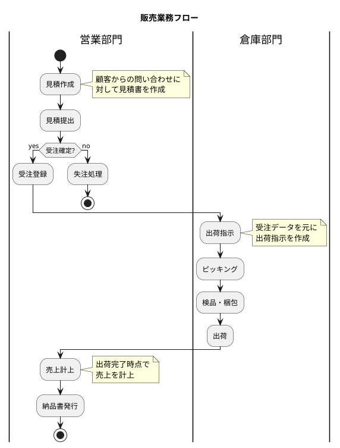

### トランザクションデータの特徴

トランザクションデータには以下の共通した特徴があります。

| 特徴 | 説明 |
|-----|------|
| **ヘッダ・明細構造** | 1つの取引に複数の商品が含まれるため、ヘッダ（親）と明細（子）の構造を持つ |
| **ステータス管理** | 業務の進捗状態を管理するステータスを持つ |
| **連番管理** | 伝票番号などの連番を自動採番する |
| **日時管理** | 作成日時、更新日時など監査証跡を残す |
| **マスタ参照** | 顧客・商品・社員などのマスタを参照する |

---

## 6.1 受注業務の DB 設計

### 受注業務フローの理解

受注業務は、顧客からの注文を受け付け、システムに登録する業務です。

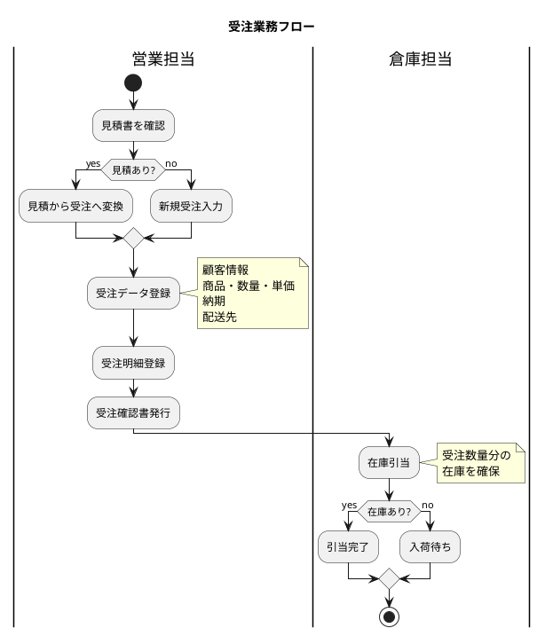

### 受注データ・受注明細データの構造

#### 受注データの ER 図

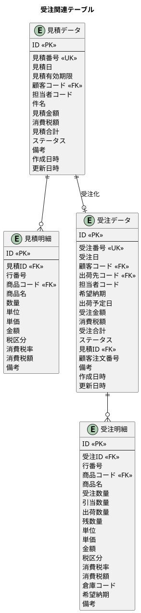

### 受注ステータスの定義

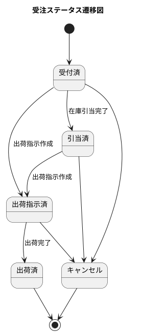

| ステータス | 説明 |
|-----------|------|
| **受付済** | 受注登録が完了した状態 |
| **引当済** | 在庫引当が完了した状態 |
| **出荷指示済** | 出荷指示が作成された状態 |
| **出荷済** | 出荷が完了した状態 |
| **キャンセル** | 受注がキャンセルされた状態 |

### マイグレーション：受注関連テーブルの作成

<details>
<summary>V006__create_quotation_order_tables.sql</summary>

```sql
-- src/main/resources/db/migration/V006__create_quotation_order_tables.sql

-- 見積ステータス
CREATE TYPE 見積ステータス AS ENUM ('商談中', '受注確定', '失注', '期限切れ');

-- 受注ステータス
CREATE TYPE 受注ステータス AS ENUM ('受付済', '引当済', '出荷指示済', '出荷済', 'キャンセル');

-- 見積データ（ヘッダ）
CREATE TABLE "見積データ" (
    "ID" SERIAL PRIMARY KEY,
    "見積番号" VARCHAR(20) UNIQUE NOT NULL,
    "見積日" DATE NOT NULL,
    "見積有効期限" DATE,
    "顧客コード" VARCHAR(20) NOT NULL,
    "担当者コード" VARCHAR(20),
    "件名" VARCHAR(200),
    "見積金額" DECIMAL(15, 2) DEFAULT 0 NOT NULL,
    "消費税額" DECIMAL(15, 2) DEFAULT 0 NOT NULL,
    "見積合計" DECIMAL(15, 2) DEFAULT 0 NOT NULL,
    "ステータス" 見積ステータス DEFAULT '商談中' NOT NULL,
    "備考" TEXT,
    "作成日時" TIMESTAMP DEFAULT CURRENT_TIMESTAMP NOT NULL,
    "作成者" VARCHAR(50),
    "更新日時" TIMESTAMP DEFAULT CURRENT_TIMESTAMP NOT NULL,
    "更新者" VARCHAR(50),
    CONSTRAINT "fk_見積データ_顧客"
        FOREIGN KEY ("顧客コード") REFERENCES "顧客マスタ"("顧客コード")
);

-- 見積明細
CREATE TABLE "見積明細" (
    "ID" SERIAL PRIMARY KEY,
    "見積ID" INTEGER NOT NULL,
    "行番号" INTEGER NOT NULL,
    "商品コード" VARCHAR(20) NOT NULL,
    "商品名" VARCHAR(100) NOT NULL,
    "数量" DECIMAL(15, 2) NOT NULL,
    "単位" VARCHAR(10),
    "単価" DECIMAL(15, 2) NOT NULL,
    "金額" DECIMAL(15, 2) NOT NULL,
    "税区分" 税区分 DEFAULT '外税' NOT NULL,
    "消費税率" DECIMAL(5, 2) DEFAULT 10.00 NOT NULL,
    "消費税額" DECIMAL(15, 2) DEFAULT 0 NOT NULL,
    "備考" TEXT,
    CONSTRAINT "fk_見積明細_見積"
        FOREIGN KEY ("見積ID") REFERENCES "見積データ"("ID") ON DELETE CASCADE,
    CONSTRAINT "fk_見積明細_商品"
        FOREIGN KEY ("商品コード") REFERENCES "商品マスタ"("商品コード"),
    CONSTRAINT "uq_見積明細_行番号" UNIQUE ("見積ID", "行番号")
);

-- 受注データ（ヘッダ）
CREATE TABLE "受注データ" (
    "ID" SERIAL PRIMARY KEY,
    "受注番号" VARCHAR(20) UNIQUE NOT NULL,
    "受注日" DATE NOT NULL,
    "顧客コード" VARCHAR(20) NOT NULL,
    "出荷先コード" VARCHAR(20),
    "担当者コード" VARCHAR(20),
    "希望納期" DATE,
    "出荷予定日" DATE,
    "受注金額" DECIMAL(15, 2) DEFAULT 0 NOT NULL,
    "消費税額" DECIMAL(15, 2) DEFAULT 0 NOT NULL,
    "受注合計" DECIMAL(15, 2) DEFAULT 0 NOT NULL,
    "ステータス" 受注ステータス DEFAULT '受付済' NOT NULL,
    "見積ID" INTEGER,
    "顧客注文番号" VARCHAR(50),
    "備考" TEXT,
    "作成日時" TIMESTAMP DEFAULT CURRENT_TIMESTAMP NOT NULL,
    "作成者" VARCHAR(50),
    "更新日時" TIMESTAMP DEFAULT CURRENT_TIMESTAMP NOT NULL,
    "更新者" VARCHAR(50),
    CONSTRAINT "fk_受注データ_顧客"
        FOREIGN KEY ("顧客コード") REFERENCES "顧客マスタ"("顧客コード"),
    CONSTRAINT "fk_受注データ_出荷先"
        FOREIGN KEY ("出荷先コード") REFERENCES "出荷先マスタ"("出荷先コード"),
    CONSTRAINT "fk_受注データ_見積"
        FOREIGN KEY ("見積ID") REFERENCES "見積データ"("ID")
);

-- 受注明細
CREATE TABLE "受注明細" (
    "ID" SERIAL PRIMARY KEY,
    "受注ID" INTEGER NOT NULL,
    "行番号" INTEGER NOT NULL,
    "商品コード" VARCHAR(20) NOT NULL,
    "商品名" VARCHAR(100) NOT NULL,
    "受注数量" DECIMAL(15, 2) NOT NULL,
    "引当数量" DECIMAL(15, 2) DEFAULT 0 NOT NULL,
    "出荷数量" DECIMAL(15, 2) DEFAULT 0 NOT NULL,
    "残数量" DECIMAL(15, 2) NOT NULL,
    "単位" VARCHAR(10),
    "単価" DECIMAL(15, 2) NOT NULL,
    "金額" DECIMAL(15, 2) NOT NULL,
    "税区分" 税区分 DEFAULT '外税' NOT NULL,
    "消費税率" DECIMAL(5, 2) DEFAULT 10.00 NOT NULL,
    "消費税額" DECIMAL(15, 2) DEFAULT 0 NOT NULL,
    "倉庫コード" VARCHAR(20),
    "希望納期" DATE,
    "備考" TEXT,
    CONSTRAINT "fk_受注明細_受注"
        FOREIGN KEY ("受注ID") REFERENCES "受注データ"("ID") ON DELETE CASCADE,
    CONSTRAINT "fk_受注明細_商品"
        FOREIGN KEY ("商品コード") REFERENCES "商品マスタ"("商品コード"),
    CONSTRAINT "uq_受注明細_行番号" UNIQUE ("受注ID", "行番号")
);

-- インデックス
CREATE INDEX "idx_見積データ_顧客コード" ON "見積データ"("顧客コード");
CREATE INDEX "idx_見積データ_見積日" ON "見積データ"("見積日");
CREATE INDEX "idx_見積データ_ステータス" ON "見積データ"("ステータス");
CREATE INDEX "idx_受注データ_顧客コード" ON "受注データ"("顧客コード");
CREATE INDEX "idx_受注データ_受注日" ON "受注データ"("受注日");
CREATE INDEX "idx_受注データ_ステータス" ON "受注データ"("ステータス");
CREATE INDEX "idx_受注データ_希望納期" ON "受注データ"("希望納期");
```

</details>

### 受注ステータス Enum

<details>
<summary>OrderStatus.java</summary>

```java
// src/main/java/com/example/sms/domain/model/sales/OrderStatus.java
package com.example.sms.domain.model.sales;

import lombok.Getter;
import lombok.RequiredArgsConstructor;

@Getter
@RequiredArgsConstructor
public enum OrderStatus {
    RECEIVED("受付済"),
    ALLOCATED("引当済"),
    SHIPMENT_INSTRUCTED("出荷指示済"),
    SHIPPED("出荷済"),
    CANCELLED("キャンセル");

    private final String displayName;

    public static OrderStatus fromDisplayName(String displayName) {
        for (OrderStatus status : values()) {
            if (status.displayName.equals(displayName)) {
                return status;
            }
        }
        throw new IllegalArgumentException("Unknown order status: " + displayName);
    }
}
```

</details>

### 受注エンティティ

<details>
<summary>SalesOrder.java</summary>

```java
// src/main/java/com/example/sms/domain/model/sales/SalesOrder.java
package com.example.sms.domain.model.sales;

import lombok.Builder;
import lombok.Data;

import java.math.BigDecimal;
import java.time.LocalDate;
import java.time.LocalDateTime;
import java.util.List;

@Data
@Builder
public class SalesOrder {
    private Integer id;
    private String orderNumber;
    private LocalDate orderDate;
    private String customerCode;
    private String shipToCode;
    private String salesRepCode;
    private LocalDate requestedDeliveryDate;
    private LocalDate scheduledShipDate;
    private BigDecimal subtotal;
    private BigDecimal taxAmount;
    private BigDecimal totalAmount;
    private OrderStatus status;
    private Integer quotationId;
    private String customerOrderNumber;
    private String remarks;
    private LocalDateTime createdAt;
    private String createdBy;
    private LocalDateTime updatedAt;
    private String updatedBy;

    // リレーション
    private List<SalesOrderDetail> details;
}
```

</details>

<details>
<summary>SalesOrderDetail.java</summary>

```java
// src/main/java/com/example/sms/domain/model/sales/SalesOrderDetail.java
package com.example.sms.domain.model.sales;

import com.example.sms.domain.model.product.TaxCategory;
import lombok.Builder;
import lombok.Data;

import java.math.BigDecimal;
import java.time.LocalDate;

@Data
@Builder
public class SalesOrderDetail {
    private Integer id;
    private Integer orderId;
    private Integer lineNumber;
    private String productCode;
    private String productName;
    private BigDecimal orderQuantity;
    private BigDecimal allocatedQuantity;
    private BigDecimal shippedQuantity;
    private BigDecimal remainingQuantity;
    private String unit;
    private BigDecimal unitPrice;
    private BigDecimal amount;
    private TaxCategory taxCategory;
    private BigDecimal taxRate;
    private BigDecimal taxAmount;
    private String warehouseCode;
    private LocalDate requestedDeliveryDate;
    private String remarks;
}
```

</details>

### TypeHandler の実装

日本語の ENUM 値を Java の Enum に変換するための TypeHandler を実装します。

<details>
<summary>OrderStatusTypeHandler.java</summary>

```java
// src/main/java/com/example/sms/infrastructure/persistence/mybatis/typehandler/OrderStatusTypeHandler.java
package com.example.sms.infrastructure.persistence.mybatis.typehandler;

import com.example.sms.domain.model.sales.OrderStatus;
import org.apache.ibatis.type.BaseTypeHandler;
import org.apache.ibatis.type.JdbcType;
import org.apache.ibatis.type.MappedTypes;

import java.sql.*;

@MappedTypes(OrderStatus.class)
public class OrderStatusTypeHandler extends BaseTypeHandler<OrderStatus> {

    @Override
    public void setNonNullParameter(PreparedStatement ps, int i,
                                     OrderStatus parameter, JdbcType jdbcType) throws SQLException {
        ps.setObject(i, parameter.getDisplayName(), Types.OTHER);
    }

    @Override
    public OrderStatus getNullableResult(ResultSet rs, String columnName) throws SQLException {
        String value = rs.getString(columnName);
        return value == null ? null : OrderStatus.fromDisplayName(value);
    }

    @Override
    public OrderStatus getNullableResult(ResultSet rs, int columnIndex) throws SQLException {
        String value = rs.getString(columnIndex);
        return value == null ? null : OrderStatus.fromDisplayName(value);
    }

    @Override
    public OrderStatus getNullableResult(CallableStatement cs, int columnIndex) throws SQLException {
        String value = cs.getString(columnIndex);
        return value == null ? null : OrderStatus.fromDisplayName(value);
    }
}
```

</details>

### TDD：受注の登録と取得

#### Red: 失敗するテストを書く

<details>
<summary>SalesOrderRepositoryTest.java</summary>

```java
// src/test/java/com/example/sms/infrastructure/persistence/repository/SalesOrderRepositoryTest.java
package com.example.sms.infrastructure.persistence.repository;

import com.example.sms.application.port.out.SalesOrderRepository;
import com.example.sms.domain.model.product.TaxCategory;
import com.example.sms.domain.model.sales.*;
import com.example.sms.testsetup.BaseIntegrationTest;
import org.junit.jupiter.api.*;
import org.springframework.beans.factory.annotation.Autowired;

import java.math.BigDecimal;
import java.time.LocalDate;

import static org.assertj.core.api.Assertions.*;

@DisplayName("受注リポジトリ")
class SalesOrderRepositoryTest extends BaseIntegrationTest {

    @Autowired
    private SalesOrderRepository salesOrderRepository;

    @BeforeEach
    void setUp() {
        salesOrderRepository.deleteAll();
    }

    @Nested
    @DisplayName("受注の登録")
    class OrderRegistration {

        @Test
        @DisplayName("受注を登録できる")
        void canRegisterOrder() {
            // Arrange
            var order = SalesOrder.builder()
                    .orderNumber("SO-2025-0001")
                    .orderDate(LocalDate.of(2025, 1, 20))
                    .customerCode("CUST-001")
                    .requestedDeliveryDate(LocalDate.of(2025, 1, 30))
                    .subtotal(new BigDecimal("50000"))
                    .taxAmount(new BigDecimal("5000"))
                    .totalAmount(new BigDecimal("55000"))
                    .status(OrderStatus.RECEIVED)
                    .build();

            // Act
            salesOrderRepository.save(order);

            // Assert
            var result = salesOrderRepository.findByOrderNumber("SO-2025-0001");
            assertThat(result).isPresent();
            assertThat(result.get().getOrderNumber()).isEqualTo("SO-2025-0001");
            assertThat(result.get().getCustomerCode()).isEqualTo("CUST-001");
            assertThat(result.get().getTotalAmount()).isEqualByComparingTo(new BigDecimal("55000"));
            assertThat(result.get().getStatus()).isEqualTo(OrderStatus.RECEIVED);
        }

        @Test
        @DisplayName("受注明細を登録できる")
        void canRegisterOrderWithDetails() {
            // Arrange
            var order = SalesOrder.builder()
                    .orderNumber("SO-2025-0002")
                    .orderDate(LocalDate.of(2025, 1, 20))
                    .customerCode("CUST-001")
                    .subtotal(new BigDecimal("10000"))
                    .taxAmount(new BigDecimal("1000"))
                    .totalAmount(new BigDecimal("11000"))
                    .status(OrderStatus.RECEIVED)
                    .build();
            salesOrderRepository.save(order);

            var detail = SalesOrderDetail.builder()
                    .orderId(order.getId())
                    .lineNumber(1)
                    .productCode("PROD-001")
                    .productName("テスト商品A")
                    .orderQuantity(new BigDecimal("10"))
                    .allocatedQuantity(BigDecimal.ZERO)
                    .shippedQuantity(BigDecimal.ZERO)
                    .remainingQuantity(new BigDecimal("10"))
                    .unit("個")
                    .unitPrice(new BigDecimal("1000"))
                    .amount(new BigDecimal("10000"))
                    .taxCategory(TaxCategory.EXCLUSIVE)
                    .taxRate(new BigDecimal("10.00"))
                    .taxAmount(new BigDecimal("1000"))
                    .warehouseCode("WH-001")
                    .build();

            // Act
            salesOrderRepository.saveDetail(detail);

            // Assert
            var result = salesOrderRepository.findByIdWithDetails(order.getId());
            assertThat(result).isPresent();
            assertThat(result.get().getDetails()).hasSize(1);
            assertThat(result.get().getDetails().get(0).getProductCode()).isEqualTo("PROD-001");
            assertThat(result.get().getDetails().get(0).getOrderQuantity())
                    .isEqualByComparingTo(new BigDecimal("10"));
        }

        @Test
        @DisplayName("受注明細の数量を更新できる")
        void canUpdateDetailQuantities() {
            // Arrange
            var order = SalesOrder.builder()
                    .orderNumber("SO-2025-0003")
                    .orderDate(LocalDate.of(2025, 1, 20))
                    .customerCode("CUST-001")
                    .subtotal(new BigDecimal("10000"))
                    .taxAmount(new BigDecimal("1000"))
                    .totalAmount(new BigDecimal("11000"))
                    .status(OrderStatus.RECEIVED)
                    .build();
            salesOrderRepository.save(order);

            var detail = SalesOrderDetail.builder()
                    .orderId(order.getId())
                    .lineNumber(1)
                    .productCode("PROD-001")
                    .productName("テスト商品A")
                    .orderQuantity(new BigDecimal("10"))
                    .allocatedQuantity(BigDecimal.ZERO)
                    .shippedQuantity(BigDecimal.ZERO)
                    .remainingQuantity(new BigDecimal("10"))
                    .unit("個")
                    .unitPrice(new BigDecimal("1000"))
                    .amount(new BigDecimal("10000"))
                    .taxCategory(TaxCategory.EXCLUSIVE)
                    .taxRate(new BigDecimal("10.00"))
                    .taxAmount(new BigDecimal("1000"))
                    .build();
            salesOrderRepository.saveDetail(detail);

            // Act: 5個引当
            salesOrderRepository.updateDetailQuantities(
                    detail.getId(),
                    new BigDecimal("5"),   // 引当数量
                    BigDecimal.ZERO,       // 出荷数量
                    new BigDecimal("5")    // 残数量
            );

            // Assert
            var result = salesOrderRepository.findByIdWithDetails(order.getId());
            assertThat(result).isPresent();
            var updatedDetail = result.get().getDetails().get(0);
            assertThat(updatedDetail.getAllocatedQuantity()).isEqualByComparingTo(new BigDecimal("5"));
            assertThat(updatedDetail.getRemainingQuantity()).isEqualByComparingTo(new BigDecimal("5"));
        }
    }

    @Nested
    @DisplayName("受注の検索")
    class OrderSearch {

        @Test
        @DisplayName("納期範囲で受注を検索できる")
        void canSearchByDeliveryDateRange() {
            // Arrange
            var order1 = SalesOrder.builder()
                    .orderNumber("SO-2025-0004")
                    .orderDate(LocalDate.of(2025, 1, 15))
                    .customerCode("CUST-001")
                    .requestedDeliveryDate(LocalDate.of(2025, 1, 25))
                    .subtotal(BigDecimal.ZERO)
                    .taxAmount(BigDecimal.ZERO)
                    .totalAmount(BigDecimal.ZERO)
                    .status(OrderStatus.RECEIVED)
                    .build();
            salesOrderRepository.save(order1);

            var order2 = SalesOrder.builder()
                    .orderNumber("SO-2025-0005")
                    .orderDate(LocalDate.of(2025, 1, 20))
                    .customerCode("CUST-001")
                    .requestedDeliveryDate(LocalDate.of(2025, 2, 15))
                    .subtotal(BigDecimal.ZERO)
                    .taxAmount(BigDecimal.ZERO)
                    .totalAmount(BigDecimal.ZERO)
                    .status(OrderStatus.RECEIVED)
                    .build();
            salesOrderRepository.save(order2);

            // Act: 1月中の納期で検索
            var januaryOrders = salesOrderRepository.findByDeliveryDateRange(
                    LocalDate.of(2025, 1, 1),
                    LocalDate.of(2025, 1, 31)
            );

            // Assert
            assertThat(januaryOrders).hasSize(1);
            assertThat(januaryOrders.get(0).getOrderNumber()).isEqualTo("SO-2025-0004");
        }
    }
}
```

</details>

#### Green: テストを通す実装

<details>
<summary>SalesOrderRepository.java</summary>

```java
// src/main/java/com/example/sms/application/port/out/SalesOrderRepository.java
package com.example.sms.application.port.out;

import com.example.sms.domain.model.sales.OrderStatus;
import com.example.sms.domain.model.sales.SalesOrder;
import com.example.sms.domain.model.sales.SalesOrderDetail;

import java.math.BigDecimal;
import java.time.LocalDate;
import java.util.List;
import java.util.Optional;

public interface SalesOrderRepository {

    void save(SalesOrder order);

    void saveDetail(SalesOrderDetail detail);

    Optional<SalesOrder> findById(Integer id);

    Optional<SalesOrder> findByOrderNumber(String orderNumber);

    Optional<SalesOrder> findByIdWithDetails(Integer id);

    List<SalesOrder> findByDeliveryDateRange(LocalDate from, LocalDate to);

    void updateStatus(Integer id, OrderStatus status);

    void updateDetailQuantities(Integer detailId,
                                 BigDecimal allocatedQuantity,
                                 BigDecimal shippedQuantity,
                                 BigDecimal remainingQuantity);

    void deleteAll();
}
```

</details>

<details>
<summary>SalesOrderMapper.xml</summary>

```xml
<?xml version="1.0" encoding="UTF-8" ?>
<!DOCTYPE mapper PUBLIC "-//mybatis.org//DTD Mapper 3.0//EN"
        "http://mybatis.org/dtd/mybatis-3-mapper.dtd">

<!-- src/main/resources/mapper/SalesOrderMapper.xml -->
<mapper namespace="com.example.sms.infrastructure.persistence.mapper.SalesOrderMapper">

    <resultMap id="salesOrderResultMap" type="com.example.sms.domain.model.sales.SalesOrder">
        <id property="id" column="ID"/>
        <result property="orderNumber" column="受注番号"/>
        <result property="orderDate" column="受注日"/>
        <result property="customerCode" column="顧客コード"/>
        <result property="shipToCode" column="出荷先コード"/>
        <result property="salesRepCode" column="担当者コード"/>
        <result property="requestedDeliveryDate" column="希望納期"/>
        <result property="scheduledShipDate" column="出荷予定日"/>
        <result property="subtotal" column="受注金額"/>
        <result property="taxAmount" column="消費税額"/>
        <result property="totalAmount" column="受注合計"/>
        <result property="status" column="ステータス"
                typeHandler="com.example.sms.infrastructure.persistence.mybatis.typehandler.OrderStatusTypeHandler"/>
        <result property="quotationId" column="見積ID"/>
        <result property="customerOrderNumber" column="顧客注文番号"/>
        <result property="remarks" column="備考"/>
        <result property="createdAt" column="作成日時"/>
        <result property="createdBy" column="作成者"/>
        <result property="updatedAt" column="更新日時"/>
        <result property="updatedBy" column="更新者"/>
        <collection property="details" ofType="com.example.sms.domain.model.sales.SalesOrderDetail">
            <id property="id" column="明細ID"/>
            <result property="orderId" column="受注ID"/>
            <result property="lineNumber" column="行番号"/>
            <result property="productCode" column="商品コード"/>
            <result property="productName" column="商品名"/>
            <result property="orderQuantity" column="受注数量"/>
            <result property="allocatedQuantity" column="引当数量"/>
            <result property="shippedQuantity" column="出荷数量"/>
            <result property="remainingQuantity" column="残数量"/>
            <result property="unit" column="単位"/>
            <result property="unitPrice" column="単価"/>
            <result property="amount" column="金額"/>
            <result property="taxCategory" column="税区分"
                    typeHandler="com.example.sms.infrastructure.persistence.mybatis.typehandler.TaxCategoryTypeHandler"/>
            <result property="taxRate" column="消費税率"/>
            <result property="taxAmount" column="明細消費税額"/>
            <result property="warehouseCode" column="倉庫コード"/>
            <result property="requestedDeliveryDate" column="明細希望納期"/>
        </collection>
    </resultMap>

    <insert id="insert" useGeneratedKeys="true" keyProperty="id" keyColumn="ID">
        INSERT INTO "受注データ" (
            "受注番号", "受注日", "顧客コード", "出荷先コード", "担当者コード",
            "希望納期", "出荷予定日", "受注金額", "消費税額", "受注合計",
            "ステータス", "見積ID", "顧客注文番号", "備考", "作成者", "更新者"
        ) VALUES (
            #{orderNumber}, #{orderDate}, #{customerCode}, #{shipToCode}, #{salesRepCode},
            #{requestedDeliveryDate}, #{scheduledShipDate}, #{subtotal}, #{taxAmount}, #{totalAmount},
            #{status, typeHandler=com.example.sms.infrastructure.persistence.mybatis.typehandler.OrderStatusTypeHandler},
            #{quotationId}, #{customerOrderNumber}, #{remarks}, #{createdBy}, #{updatedBy}
        )
    </insert>

    <insert id="insertDetail" useGeneratedKeys="true" keyProperty="id" keyColumn="ID">
        INSERT INTO "受注明細" (
            "受注ID", "行番号", "商品コード", "商品名", "受注数量",
            "引当数量", "出荷数量", "残数量", "単位", "単価", "金額",
            "税区分", "消費税率", "消費税額", "倉庫コード", "希望納期"
        ) VALUES (
            #{orderId}, #{lineNumber}, #{productCode}, #{productName}, #{orderQuantity},
            #{allocatedQuantity}, #{shippedQuantity}, #{remainingQuantity}, #{unit},
            #{unitPrice}, #{amount},
            #{taxCategory, typeHandler=com.example.sms.infrastructure.persistence.mybatis.typehandler.TaxCategoryTypeHandler},
            #{taxRate}, #{taxAmount}, #{warehouseCode}, #{requestedDeliveryDate}
        )
    </insert>

    <select id="findByOrderNumber" resultMap="salesOrderResultMap">
        SELECT * FROM "受注データ" WHERE "受注番号" = #{orderNumber}
    </select>

    <select id="findByIdWithDetails" resultMap="salesOrderResultMap">
        SELECT
            o."ID", o."受注番号", o."受注日", o."顧客コード", o."出荷先コード",
            o."担当者コード", o."希望納期", o."出荷予定日", o."受注金額", o."消費税額",
            o."受注合計", o."ステータス", o."見積ID", o."顧客注文番号", o."備考",
            o."作成日時", o."作成者", o."更新日時", o."更新者",
            d."ID" AS 明細ID, d."受注ID", d."行番号", d."商品コード", d."商品名",
            d."受注数量", d."引当数量", d."出荷数量", d."残数量", d."単位",
            d."単価", d."金額", d."税区分", d."消費税率",
            d."消費税額" AS 明細消費税額, d."倉庫コード",
            d."希望納期" AS 明細希望納期
        FROM "受注データ" o
        LEFT JOIN "受注明細" d ON o."ID" = d."受注ID"
        WHERE o."ID" = #{id}
        ORDER BY d."行番号"
    </select>

    <select id="findByDeliveryDateRange" resultMap="salesOrderResultMap">
        SELECT * FROM "受注データ"
        WHERE "希望納期" BETWEEN #{from} AND #{to}
        ORDER BY "希望納期"
    </select>

    <update id="updateStatus">
        UPDATE "受注データ"
        SET "ステータス" = #{status, typeHandler=com.example.sms.infrastructure.persistence.mybatis.typehandler.OrderStatusTypeHandler},
            "更新日時" = CURRENT_TIMESTAMP
        WHERE "ID" = #{id}
    </update>

    <update id="updateDetailQuantities">
        UPDATE "受注明細"
        SET "引当数量" = #{allocatedQuantity},
            "出荷数量" = #{shippedQuantity},
            "残数量" = #{remainingQuantity}
        WHERE "ID" = #{detailId}
    </update>

    <delete id="deleteAll">
        DELETE FROM "受注明細";
        DELETE FROM "受注データ";
    </delete>

</mapper>
```

</details>

---

## 6.2 出荷業務の DB 設計

### 出荷業務の流れ

出荷業務は、受注データを起点として商品を顧客に届けるまでのプロセスです。

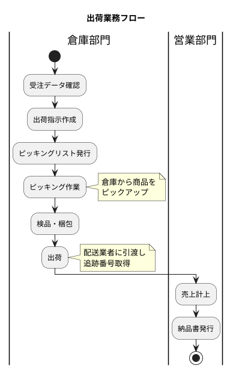

### 出荷指示データ・出荷明細データ

#### 出荷関連テーブルの ER 図

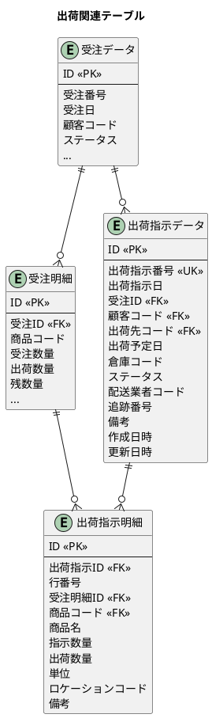

### 出荷ステータスの定義

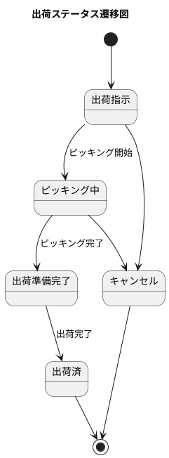

| ステータス | 説明 |
|-----------|------|
| **出荷指示** | 出荷指示が作成された状態 |
| **ピッキング中** | ピッキング作業中の状態 |
| **出荷準備完了** | 検品・梱包が完了した状態 |
| **出荷済** | 配送業者に引き渡した状態 |
| **キャンセル** | 出荷指示がキャンセルされた状態 |

### マイグレーション：出荷関連テーブルの作成

<details>
<summary>V007__create_shipment_tables.sql</summary>

```sql
-- src/main/resources/db/migration/V007__create_shipment_tables.sql

-- 出荷ステータス
CREATE TYPE 出荷ステータス AS ENUM ('出荷指示', 'ピッキング中', '出荷準備完了', '出荷済', 'キャンセル');

-- 出荷指示ヘッダ
CREATE TABLE "出荷指示データ" (
    "ID" SERIAL PRIMARY KEY,
    "出荷指示番号" VARCHAR(20) UNIQUE NOT NULL,
    "出荷指示日" DATE NOT NULL,
    "受注ID" INTEGER NOT NULL,
    "顧客コード" VARCHAR(20) NOT NULL,
    "出荷先コード" VARCHAR(20),
    "出荷予定日" DATE NOT NULL,
    "倉庫コード" VARCHAR(20) NOT NULL,
    "ステータス" 出荷ステータス DEFAULT '出荷指示' NOT NULL,
    "配送業者コード" VARCHAR(20),
    "追跡番号" VARCHAR(50),
    "備考" TEXT,
    "作成日時" TIMESTAMP DEFAULT CURRENT_TIMESTAMP NOT NULL,
    "作成者" VARCHAR(50),
    "更新日時" TIMESTAMP DEFAULT CURRENT_TIMESTAMP NOT NULL,
    "更新者" VARCHAR(50),
    CONSTRAINT "fk_出荷指示データ_受注"
        FOREIGN KEY ("受注ID") REFERENCES "受注データ"("ID"),
    CONSTRAINT "fk_出荷指示データ_顧客"
        FOREIGN KEY ("顧客コード") REFERENCES "顧客マスタ"("顧客コード"),
    CONSTRAINT "fk_出荷指示データ_出荷先"
        FOREIGN KEY ("出荷先コード") REFERENCES "出荷先マスタ"("出荷先コード")
);

-- 出荷指示明細
CREATE TABLE "出荷指示明細" (
    "ID" SERIAL PRIMARY KEY,
    "出荷指示ID" INTEGER NOT NULL,
    "行番号" INTEGER NOT NULL,
    "受注明細ID" INTEGER NOT NULL,
    "商品コード" VARCHAR(20) NOT NULL,
    "商品名" VARCHAR(100) NOT NULL,
    "指示数量" DECIMAL(15, 2) NOT NULL,
    "出荷数量" DECIMAL(15, 2) DEFAULT 0 NOT NULL,
    "単位" VARCHAR(10),
    "ロケーションコード" VARCHAR(20),
    "備考" TEXT,
    CONSTRAINT "fk_出荷指示明細_出荷指示"
        FOREIGN KEY ("出荷指示ID") REFERENCES "出荷指示データ"("ID") ON DELETE CASCADE,
    CONSTRAINT "fk_出荷指示明細_受注明細"
        FOREIGN KEY ("受注明細ID") REFERENCES "受注明細"("ID"),
    CONSTRAINT "fk_出荷指示明細_商品"
        FOREIGN KEY ("商品コード") REFERENCES "商品マスタ"("商品コード"),
    CONSTRAINT "uq_出荷指示明細_行番号" UNIQUE ("出荷指示ID", "行番号")
);

-- インデックス
CREATE INDEX "idx_出荷指示データ_受注ID" ON "出荷指示データ"("受注ID");
CREATE INDEX "idx_出荷指示データ_出荷予定日" ON "出荷指示データ"("出荷予定日");
CREATE INDEX "idx_出荷指示データ_ステータス" ON "出荷指示データ"("ステータス");
```

</details>

### 出荷ステータス Enum

<details>
<summary>ShipmentStatus.java</summary>

```java
// src/main/java/com/example/sms/domain/model/sales/ShipmentStatus.java
package com.example.sms.domain.model.sales;

import lombok.Getter;
import lombok.RequiredArgsConstructor;

@Getter
@RequiredArgsConstructor
public enum ShipmentStatus {
    INSTRUCTED("出荷指示"),
    PICKING("ピッキング中"),
    READY("出荷準備完了"),
    SHIPPED("出荷済"),
    CANCELLED("キャンセル");

    private final String displayName;

    public static ShipmentStatus fromDisplayName(String displayName) {
        for (ShipmentStatus status : values()) {
            if (status.displayName.equals(displayName)) {
                return status;
            }
        }
        throw new IllegalArgumentException("Unknown shipment status: " + displayName);
    }
}
```

</details>

### 出荷指示エンティティ

<details>
<summary>ShipmentInstruction.java</summary>

```java
// src/main/java/com/example/sms/domain/model/sales/ShipmentInstruction.java
package com.example.sms.domain.model.sales;

import lombok.Builder;
import lombok.Data;

import java.time.LocalDate;
import java.time.LocalDateTime;
import java.util.List;

@Data
@Builder
public class ShipmentInstruction {
    private Integer id;
    private String instructionNumber;
    private LocalDate instructionDate;
    private Integer orderId;
    private String customerCode;
    private String shipToCode;
    private LocalDate scheduledShipDate;
    private String warehouseCode;
    private ShipmentStatus status;
    private String carrierCode;
    private String trackingNumber;
    private String remarks;
    private LocalDateTime createdAt;
    private String createdBy;
    private LocalDateTime updatedAt;
    private String updatedBy;

    // リレーション
    private SalesOrder order;
    private List<ShipmentInstructionDetail> details;
}
```

</details>

<details>
<summary>ShipmentInstructionDetail.java</summary>

```java
// src/main/java/com/example/sms/domain/model/sales/ShipmentInstructionDetail.java
package com.example.sms.domain.model.sales;

import lombok.Builder;
import lombok.Data;

import java.math.BigDecimal;

@Data
@Builder
public class ShipmentInstructionDetail {
    private Integer id;
    private Integer shipmentInstructionId;
    private Integer lineNumber;
    private Integer orderDetailId;
    private String productCode;
    private String productName;
    private BigDecimal instructedQuantity;
    private BigDecimal shippedQuantity;
    private String unit;
    private String locationCode;
    private String remarks;
}
```

</details>

### TDD：出荷指示の登録と取得

<details>
<summary>ShipmentInstructionRepositoryTest.java</summary>

```java
// src/test/java/com/example/sms/infrastructure/persistence/repository/ShipmentInstructionRepositoryTest.java
package com.example.sms.infrastructure.persistence.repository;

import com.example.sms.application.port.out.SalesOrderRepository;
import com.example.sms.application.port.out.ShipmentInstructionRepository;
import com.example.sms.domain.model.sales.*;
import com.example.sms.testsetup.BaseIntegrationTest;
import org.junit.jupiter.api.*;
import org.springframework.beans.factory.annotation.Autowired;

import java.math.BigDecimal;
import java.time.LocalDate;

import static org.assertj.core.api.Assertions.*;

@DisplayName("出荷指示リポジトリ")
class ShipmentInstructionRepositoryTest extends BaseIntegrationTest {

    @Autowired
    private ShipmentInstructionRepository shipmentInstructionRepository;

    @Autowired
    private SalesOrderRepository salesOrderRepository;

    @BeforeEach
    void setUp() {
        shipmentInstructionRepository.deleteAll();
        salesOrderRepository.deleteAll();
        setupOrderData();
    }

    private void setupOrderData() {
        // 受注データ準備
        var order = SalesOrder.builder()
                .orderNumber("SO-2025-0001")
                .orderDate(LocalDate.of(2025, 1, 20))
                .customerCode("CUST-001")
                .requestedDeliveryDate(LocalDate.of(2025, 1, 30))
                .subtotal(new BigDecimal("50000"))
                .taxAmount(new BigDecimal("5000"))
                .totalAmount(new BigDecimal("55000"))
                .status(OrderStatus.RECEIVED)
                .build();
        salesOrderRepository.save(order);
    }

    @Nested
    @DisplayName("出荷指示の登録")
    class ShipmentInstructionRegistration {

        @Test
        @DisplayName("出荷指示を登録できる")
        void canRegisterShipmentInstruction() {
            // Arrange
            var order = salesOrderRepository.findByOrderNumber("SO-2025-0001").get();
            var instruction = ShipmentInstruction.builder()
                    .instructionNumber("SI-2025-0001")
                    .instructionDate(LocalDate.of(2025, 1, 25))
                    .orderId(order.getId())
                    .customerCode("CUST-001")
                    .scheduledShipDate(LocalDate.of(2025, 1, 28))
                    .warehouseCode("WH-001")
                    .status(ShipmentStatus.INSTRUCTED)
                    .build();

            // Act
            shipmentInstructionRepository.save(instruction);

            // Assert
            var result = shipmentInstructionRepository.findByInstructionNumber("SI-2025-0001");
            assertThat(result).isPresent();
            assertThat(result.get().getOrderId()).isEqualTo(order.getId());
            assertThat(result.get().getStatus()).isEqualTo(ShipmentStatus.INSTRUCTED);
        }

        @Test
        @DisplayName("出荷指示ステータスを更新できる")
        void canUpdateShipmentStatus() {
            // Arrange
            var order = salesOrderRepository.findByOrderNumber("SO-2025-0001").get();
            var instruction = ShipmentInstruction.builder()
                    .instructionNumber("SI-2025-0002")
                    .instructionDate(LocalDate.of(2025, 1, 25))
                    .orderId(order.getId())
                    .customerCode("CUST-001")
                    .scheduledShipDate(LocalDate.of(2025, 1, 28))
                    .warehouseCode("WH-001")
                    .status(ShipmentStatus.INSTRUCTED)
                    .build();
            shipmentInstructionRepository.save(instruction);

            // Act: ピッキング開始
            shipmentInstructionRepository.updateStatus(instruction.getId(), ShipmentStatus.PICKING);

            // Assert
            var result = shipmentInstructionRepository.findById(instruction.getId());
            assertThat(result).isPresent();
            assertThat(result.get().getStatus()).isEqualTo(ShipmentStatus.PICKING);
        }

        @Test
        @DisplayName("追跡番号を登録できる")
        void canRegisterTrackingNumber() {
            // Arrange
            var order = salesOrderRepository.findByOrderNumber("SO-2025-0001").get();
            var instruction = ShipmentInstruction.builder()
                    .instructionNumber("SI-2025-0003")
                    .instructionDate(LocalDate.of(2025, 1, 25))
                    .orderId(order.getId())
                    .customerCode("CUST-001")
                    .scheduledShipDate(LocalDate.of(2025, 1, 28))
                    .warehouseCode("WH-001")
                    .status(ShipmentStatus.SHIPPED)
                    .carrierCode("YAMATO")
                    .trackingNumber("1234-5678-9012")
                    .build();

            // Act
            shipmentInstructionRepository.save(instruction);

            // Assert
            var result = shipmentInstructionRepository.findByInstructionNumber("SI-2025-0003");
            assertThat(result).isPresent();
            assertThat(result.get().getCarrierCode()).isEqualTo("YAMATO");
            assertThat(result.get().getTrackingNumber()).isEqualTo("1234-5678-9012");
        }
    }
}
```

</details>

### 受注から出荷指示を作成するサービス

<details>
<summary>ShipmentService.java</summary>

```java
// src/main/java/com/example/sms/application/service/ShipmentService.java
package com.example.sms.application.service;

import com.example.sms.application.port.out.*;
import com.example.sms.domain.model.sales.*;
import lombok.RequiredArgsConstructor;
import org.springframework.stereotype.Service;
import org.springframework.transaction.annotation.Transactional;

import java.math.BigDecimal;
import java.time.LocalDate;

@Service
@RequiredArgsConstructor
public class ShipmentService {

    private final SalesOrderRepository salesOrderRepository;
    private final ShipmentInstructionRepository shipmentInstructionRepository;

    /**
     * 受注から出荷指示を作成する
     */
    @Transactional
    public ShipmentInstruction createShipmentInstruction(Integer orderId,
                                                          LocalDate scheduledShipDate,
                                                          String warehouseCode) {
        var order = salesOrderRepository.findByIdWithDetails(orderId)
                .orElseThrow(() -> new IllegalArgumentException("Order not found: " + orderId));

        if (order.getStatus() != OrderStatus.RECEIVED && order.getStatus() != OrderStatus.ALLOCATED) {
            throw new IllegalStateException("Cannot create shipment instruction for order with status: "
                    + order.getStatus());
        }

        // 出荷指示ヘッダ作成
        var instruction = ShipmentInstruction.builder()
                .instructionNumber(generateInstructionNumber(LocalDate.now()))
                .instructionDate(LocalDate.now())
                .orderId(orderId)
                .customerCode(order.getCustomerCode())
                .shipToCode(order.getShipToCode())
                .scheduledShipDate(scheduledShipDate)
                .warehouseCode(warehouseCode)
                .status(ShipmentStatus.INSTRUCTED)
                .build();
        shipmentInstructionRepository.save(instruction);

        // 出荷指示明細作成
        int lineNumber = 1;
        for (var orderDetail : order.getDetails()) {
            if (orderDetail.getRemainingQuantity().compareTo(BigDecimal.ZERO) > 0) {
                var instructionDetail = ShipmentInstructionDetail.builder()
                        .shipmentInstructionId(instruction.getId())
                        .lineNumber(lineNumber++)
                        .orderDetailId(orderDetail.getId())
                        .productCode(orderDetail.getProductCode())
                        .productName(orderDetail.getProductName())
                        .instructedQuantity(orderDetail.getRemainingQuantity())
                        .shippedQuantity(BigDecimal.ZERO)
                        .unit(orderDetail.getUnit())
                        .build();
                shipmentInstructionRepository.saveDetail(instructionDetail);
            }
        }

        // 受注ステータスを更新
        salesOrderRepository.updateStatus(orderId, OrderStatus.SHIPMENT_INSTRUCTED);

        return instruction;
    }

    private String generateInstructionNumber(LocalDate date) {
        return String.format("SI-%d-%04d", date.getYear(), System.currentTimeMillis() % 10000);
    }
}
```

</details>

---

## 6.3 売上業務の DB 設計

### 売上データ・売上明細データの構造

#### 売上関連テーブルの ER 図

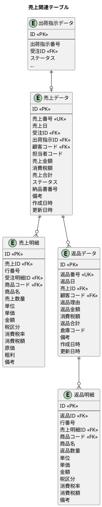

### 出荷完了から売上計上への流れ

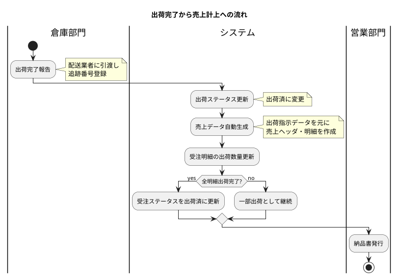

### 売上ステータスの定義

| ステータス | 説明 |
|-----------|------|
| **計上済** | 売上が計上された状態 |
| **請求済** | 請求書が発行された状態 |
| **入金済** | 入金が確認された状態 |
| **取消** | 売上が取り消された状態 |

### マイグレーション：売上関連テーブルの作成

<details>
<summary>V008__create_sales_tables.sql</summary>

```sql
-- src/main/resources/db/migration/V008__create_sales_tables.sql

-- 売上ステータス
CREATE TYPE 売上ステータス AS ENUM ('計上済', '請求済', '入金済', '取消');

-- 売上ヘッダ
CREATE TABLE "売上データ" (
    "ID" SERIAL PRIMARY KEY,
    "売上番号" VARCHAR(20) UNIQUE NOT NULL,
    "売上日" DATE NOT NULL,
    "受注ID" INTEGER NOT NULL,
    "出荷指示ID" INTEGER,
    "顧客コード" VARCHAR(20) NOT NULL,
    "担当者コード" VARCHAR(20),
    "売上金額" DECIMAL(15, 2) DEFAULT 0 NOT NULL,
    "消費税額" DECIMAL(15, 2) DEFAULT 0 NOT NULL,
    "売上合計" DECIMAL(15, 2) DEFAULT 0 NOT NULL,
    "ステータス" 売上ステータス DEFAULT '計上済' NOT NULL,
    "納品書番号" VARCHAR(20),
    "備考" TEXT,
    "作成日時" TIMESTAMP DEFAULT CURRENT_TIMESTAMP NOT NULL,
    "作成者" VARCHAR(50),
    "更新日時" TIMESTAMP DEFAULT CURRENT_TIMESTAMP NOT NULL,
    "更新者" VARCHAR(50),
    CONSTRAINT "fk_売上データ_受注"
        FOREIGN KEY ("受注ID") REFERENCES "受注データ"("ID"),
    CONSTRAINT "fk_売上データ_出荷指示"
        FOREIGN KEY ("出荷指示ID") REFERENCES "出荷指示データ"("ID"),
    CONSTRAINT "fk_売上データ_顧客"
        FOREIGN KEY ("顧客コード") REFERENCES "顧客マスタ"("顧客コード")
);

-- 売上明細
CREATE TABLE "売上明細" (
    "ID" SERIAL PRIMARY KEY,
    "売上ID" INTEGER NOT NULL,
    "行番号" INTEGER NOT NULL,
    "受注明細ID" INTEGER NOT NULL,
    "商品コード" VARCHAR(20) NOT NULL,
    "商品名" VARCHAR(100) NOT NULL,
    "売上数量" DECIMAL(15, 2) NOT NULL,
    "単位" VARCHAR(10),
    "単価" DECIMAL(15, 2) NOT NULL,
    "金額" DECIMAL(15, 2) NOT NULL,
    "税区分" 税区分 DEFAULT '外税' NOT NULL,
    "消費税率" DECIMAL(5, 2) DEFAULT 10.00 NOT NULL,
    "消費税額" DECIMAL(15, 2) DEFAULT 0 NOT NULL,
    "原価" DECIMAL(15, 2),
    "粗利" DECIMAL(15, 2),
    "備考" TEXT,
    CONSTRAINT "fk_売上明細_売上"
        FOREIGN KEY ("売上ID") REFERENCES "売上データ"("ID") ON DELETE CASCADE,
    CONSTRAINT "fk_売上明細_受注明細"
        FOREIGN KEY ("受注明細ID") REFERENCES "受注明細"("ID"),
    CONSTRAINT "fk_売上明細_商品"
        FOREIGN KEY ("商品コード") REFERENCES "商品マスタ"("商品コード"),
    CONSTRAINT "uq_売上明細_行番号" UNIQUE ("売上ID", "行番号")
);

-- インデックス
CREATE INDEX "idx_売上データ_受注ID" ON "売上データ"("受注ID");
CREATE INDEX "idx_売上データ_売上日" ON "売上データ"("売上日");
CREATE INDEX "idx_売上データ_顧客コード" ON "売上データ"("顧客コード");
```

</details>

### 売上ステータス Enum

<details>
<summary>SalesStatus.java</summary>

```java
// src/main/java/com/example/sms/domain/model/sales/SalesStatus.java
package com.example.sms.domain.model.sales;

import lombok.Getter;
import lombok.RequiredArgsConstructor;

@Getter
@RequiredArgsConstructor
public enum SalesStatus {
    RECORDED("計上済"),
    INVOICED("請求済"),
    COLLECTED("入金済"),
    CANCELLED("取消");

    private final String displayName;

    public static SalesStatus fromDisplayName(String displayName) {
        for (SalesStatus status : values()) {
            if (status.displayName.equals(displayName)) {
                return status;
            }
        }
        throw new IllegalArgumentException("Unknown sales status: " + displayName);
    }
}
```

</details>

### 売上エンティティ

<details>
<summary>Sales.java</summary>

```java
// src/main/java/com/example/sms/domain/model/sales/Sales.java
package com.example.sms.domain.model.sales;

import lombok.Builder;
import lombok.Data;

import java.math.BigDecimal;
import java.time.LocalDate;
import java.time.LocalDateTime;
import java.util.List;

@Data
@Builder
public class Sales {
    private Integer id;
    private String salesNumber;
    private LocalDate salesDate;
    private Integer orderId;
    private Integer shipmentInstructionId;
    private String customerCode;
    private String salesRepCode;
    private BigDecimal subtotal;
    private BigDecimal taxAmount;
    private BigDecimal totalAmount;
    private SalesStatus status;
    private String deliveryNoteNumber;
    private String remarks;
    private LocalDateTime createdAt;
    private String createdBy;
    private LocalDateTime updatedAt;
    private String updatedBy;

    // リレーション
    private SalesOrder order;
    private ShipmentInstruction shipmentInstruction;
    private List<SalesDetail> details;
}
```

</details>

<details>
<summary>SalesDetail.java</summary>

```java
// src/main/java/com/example/sms/domain/model/sales/SalesDetail.java
package com.example.sms.domain.model.sales;

import com.example.sms.domain.model.product.TaxCategory;
import lombok.Builder;
import lombok.Data;

import java.math.BigDecimal;

@Data
@Builder
public class SalesDetail {
    private Integer id;
    private Integer salesId;
    private Integer lineNumber;
    private Integer orderDetailId;
    private String productCode;
    private String productName;
    private BigDecimal salesQuantity;
    private String unit;
    private BigDecimal unitPrice;
    private BigDecimal amount;
    private TaxCategory taxCategory;
    private BigDecimal taxRate;
    private BigDecimal taxAmount;
    private BigDecimal costPrice;
    private BigDecimal grossProfit;
    private String remarks;
}
```

</details>

### 返品処理の設計

返品処理は、売上データに対してマイナスの取引を記録する処理です。

#### 返品業務の流れ

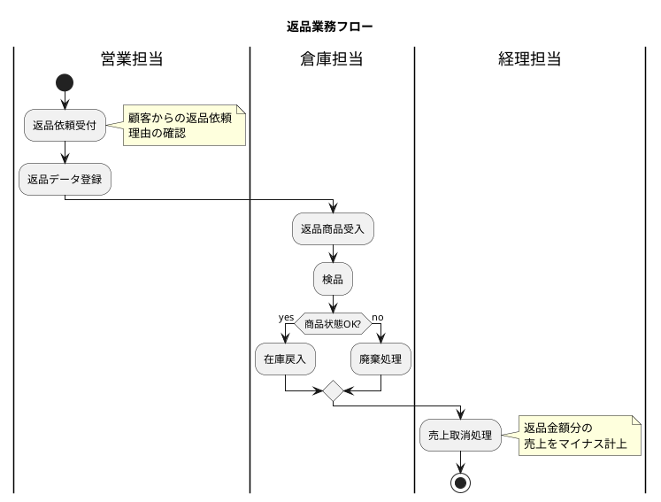

### マイグレーション：返品関連テーブルの作成

<details>
<summary>V009__create_return_tables.sql</summary>

```sql
-- src/main/resources/db/migration/V009__create_return_tables.sql

-- 返品データ
CREATE TABLE "返品データ" (
    "ID" SERIAL PRIMARY KEY,
    "返品番号" VARCHAR(20) UNIQUE NOT NULL,
    "返品日" DATE NOT NULL,
    "売上ID" INTEGER NOT NULL,
    "顧客コード" VARCHAR(20) NOT NULL,
    "返品理由" VARCHAR(200),
    "返品金額" DECIMAL(15, 2) DEFAULT 0 NOT NULL,
    "消費税額" DECIMAL(15, 2) DEFAULT 0 NOT NULL,
    "返品合計" DECIMAL(15, 2) DEFAULT 0 NOT NULL,
    "倉庫コード" VARCHAR(20),
    "備考" TEXT,
    "作成日時" TIMESTAMP DEFAULT CURRENT_TIMESTAMP NOT NULL,
    "作成者" VARCHAR(50),
    "更新日時" TIMESTAMP DEFAULT CURRENT_TIMESTAMP NOT NULL,
    "更新者" VARCHAR(50),
    CONSTRAINT "fk_返品データ_売上"
        FOREIGN KEY ("売上ID") REFERENCES "売上データ"("ID"),
    CONSTRAINT "fk_返品データ_顧客"
        FOREIGN KEY ("顧客コード") REFERENCES "顧客マスタ"("顧客コード")
);

-- 返品明細
CREATE TABLE "返品明細" (
    "ID" SERIAL PRIMARY KEY,
    "返品ID" INTEGER NOT NULL,
    "行番号" INTEGER NOT NULL,
    "売上明細ID" INTEGER NOT NULL,
    "商品コード" VARCHAR(20) NOT NULL,
    "商品名" VARCHAR(100) NOT NULL,
    "返品数量" DECIMAL(15, 2) NOT NULL,
    "単位" VARCHAR(10),
    "単価" DECIMAL(15, 2) NOT NULL,
    "金額" DECIMAL(15, 2) NOT NULL,
    "税区分" 税区分 DEFAULT '外税' NOT NULL,
    "消費税率" DECIMAL(5, 2) DEFAULT 10.00 NOT NULL,
    "消費税額" DECIMAL(15, 2) DEFAULT 0 NOT NULL,
    "備考" TEXT,
    CONSTRAINT "fk_返品明細_返品"
        FOREIGN KEY ("返品ID") REFERENCES "返品データ"("ID") ON DELETE CASCADE,
    CONSTRAINT "fk_返品明細_売上明細"
        FOREIGN KEY ("売上明細ID") REFERENCES "売上明細"("ID"),
    CONSTRAINT "fk_返品明細_商品"
        FOREIGN KEY ("商品コード") REFERENCES "商品マスタ"("商品コード"),
    CONSTRAINT "uq_返品明細_行番号" UNIQUE ("返品ID", "行番号")
);

-- インデックス
CREATE INDEX "idx_返品データ_売上ID" ON "返品データ"("売上ID");
CREATE INDEX "idx_返品データ_返品日" ON "返品データ"("返品日");
```

</details>

### 赤黒処理の考え方

赤黒処理とは、誤った伝票を訂正するための会計処理手法です。

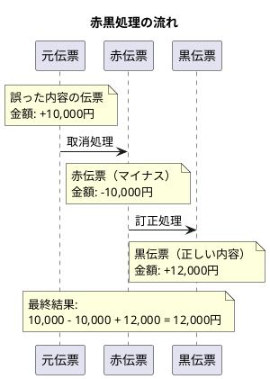

#### 赤黒処理の特徴

| 項目 | 説明 |
|-----|------|
| **元伝票** | 訂正対象となる誤った伝票 |
| **赤伝票** | 元伝票をマイナスで打ち消す伝票 |
| **黒伝票** | 正しい内容を記載した新しい伝票 |

#### 赤黒処理のメリット

- **監査証跡の保持**: 元の伝票を削除せず、訂正の履歴が残る
- **会計基準への準拠**: 伝票の修正ではなく、新規伝票で訂正
- **トレーサビリティ**: いつ、誰が、なぜ訂正したかを追跡可能

---

## 6.4 全体の ER 図

受注から売上までの全体的な関連を示します。

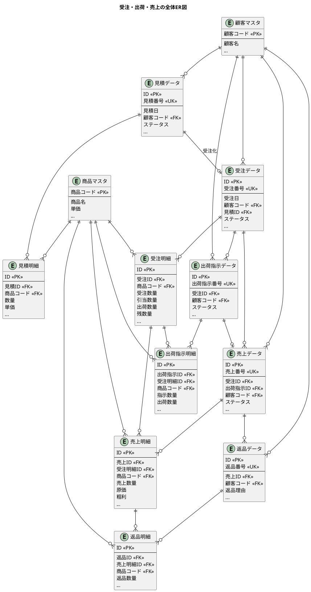

---

## 6.4 リレーションと楽観ロックの設計

### MyBatis ネストした ResultMap によるリレーション設定

受注データは、受注（ヘッダ）→ 受注明細の2層構造を持ちます。MyBatis でこの親子関係を効率的に取得するためのリレーション設定を実装します。

#### ネストした ResultMap の定義

<details>
<summary>SalesOrderMapper.xml（リレーション設定）</summary>

```xml
<?xml version="1.0" encoding="UTF-8" ?>
<!DOCTYPE mapper PUBLIC "-//mybatis.org//DTD Mapper 3.0//EN"
        "http://mybatis.org/dtd/mybatis-3-mapper.dtd">

<!-- src/main/resources/mapper/SalesOrderMapper.xml -->
<mapper namespace="com.example.sms.infrastructure.persistence.mapper.SalesOrderMapper">

    <!-- 受注（ヘッダ）の ResultMap -->
    <resultMap id="salesOrderWithDetailsResultMap" type="com.example.sms.domain.model.sales.SalesOrder">
        <id property="id" column="o_id"/>
        <result property="orderNumber" column="o_受注番号"/>
        <result property="orderDate" column="o_受注日"/>
        <result property="customerCode" column="o_顧客コード"/>
        <result property="shipToCode" column="o_出荷先コード"/>
        <result property="salesRepCode" column="o_担当者コード"/>
        <result property="requestedDeliveryDate" column="o_希望納期"/>
        <result property="scheduledShipDate" column="o_出荷予定日"/>
        <result property="subtotal" column="o_受注金額"/>
        <result property="taxAmount" column="o_消費税額"/>
        <result property="totalAmount" column="o_受注合計"/>
        <result property="status" column="o_ステータス"
                typeHandler="com.example.sms.infrastructure.persistence.mybatis.typehandler.OrderStatusTypeHandler"/>
        <result property="version" column="o_バージョン"/>
        <result property="createdAt" column="o_作成日時"/>
        <result property="updatedAt" column="o_更新日時"/>
        <!-- 受注明細との1:N関連 -->
        <collection property="details" ofType="com.example.sms.domain.model.sales.SalesOrderDetail"
                    resultMap="salesOrderDetailNestedResultMap"/>
    </resultMap>

    <!-- 受注明細のネスト ResultMap -->
    <resultMap id="salesOrderDetailNestedResultMap" type="com.example.sms.domain.model.sales.SalesOrderDetail">
        <id property="id" column="d_id"/>
        <result property="orderId" column="d_受注ID"/>
        <result property="lineNumber" column="d_行番号"/>
        <result property="productCode" column="d_商品コード"/>
        <result property="productName" column="d_商品名"/>
        <result property="orderQuantity" column="d_受注数量"/>
        <result property="allocatedQuantity" column="d_引当数量"/>
        <result property="shippedQuantity" column="d_出荷数量"/>
        <result property="remainingQuantity" column="d_残数量"/>
        <result property="unit" column="d_単位"/>
        <result property="unitPrice" column="d_単価"/>
        <result property="amount" column="d_金額"/>
        <result property="taxCategory" column="d_税区分"
                typeHandler="com.example.sms.infrastructure.persistence.mybatis.typehandler.TaxCategoryTypeHandler"/>
        <result property="taxRate" column="d_消費税率"/>
        <result property="taxAmount" column="d_消費税額"/>
        <result property="version" column="d_バージョン"/>
    </resultMap>

    <!-- JOIN による一括取得クエリ -->
    <select id="findWithDetailsByOrderNumber" resultMap="salesOrderWithDetailsResultMap">
        SELECT
            o."ID" AS o_id,
            o."受注番号" AS o_受注番号,
            o."受注日" AS o_受注日,
            o."顧客コード" AS o_顧客コード,
            o."出荷先コード" AS o_出荷先コード,
            o."担当者コード" AS o_担当者コード,
            o."希望納期" AS o_希望納期,
            o."出荷予定日" AS o_出荷予定日,
            o."受注金額" AS o_受注金額,
            o."消費税額" AS o_消費税額,
            o."受注合計" AS o_受注合計,
            o."ステータス" AS o_ステータス,
            o."バージョン" AS o_バージョン,
            o."作成日時" AS o_作成日時,
            o."更新日時" AS o_更新日時,
            d."ID" AS d_id,
            d."受注ID" AS d_受注ID,
            d."行番号" AS d_行番号,
            d."商品コード" AS d_商品コード,
            d."商品名" AS d_商品名,
            d."受注数量" AS d_受注数量,
            d."引当数量" AS d_引当数量,
            d."出荷数量" AS d_出荷数量,
            d."残数量" AS d_残数量,
            d."単位" AS d_単位,
            d."単価" AS d_単価,
            d."金額" AS d_金額,
            d."税区分" AS d_税区分,
            d."消費税率" AS d_消費税率,
            d."消費税額" AS d_消費税額,
            d."バージョン" AS d_バージョン
        FROM "受注データ" o
        LEFT JOIN "受注明細" d
            ON o."ID" = d."受注ID"
        WHERE o."受注番号" = #{orderNumber}
        ORDER BY d."行番号"
    </select>

</mapper>
```

</details>

#### リレーション設定のポイント

| 設定項目 | 説明 |
|---------|------|
| `<collection>` | 1:N 関連のマッピング |
| `<id>` | 主キーの識別（MyBatis が重複排除に使用） |
| `resultMap` | ネストした ResultMap の参照 |
| エイリアス（AS） | カラム名の重複を避けるためのプレフィックス |
| `ORDER BY` | コレクションの順序を保証 |

### 楽観ロックの実装

複数ユーザーが同時に受注データを編集する場合、データの整合性を保つために楽観ロック（Optimistic Locking）を実装します。

#### Flyway マイグレーション: バージョンカラム追加

<details>
<summary>V010__add_version_columns.sql</summary>

```sql
-- src/main/resources/db/migration/V010__add_version_columns.sql

-- 受注データテーブルにバージョンカラムを追加
ALTER TABLE "受注データ" ADD COLUMN "バージョン" INTEGER DEFAULT 1 NOT NULL;

-- 受注明細テーブルにバージョンカラムを追加
ALTER TABLE "受注明細" ADD COLUMN "バージョン" INTEGER DEFAULT 1 NOT NULL;

-- 出荷指示データテーブルにバージョンカラムを追加
ALTER TABLE "出荷指示データ" ADD COLUMN "バージョン" INTEGER DEFAULT 1 NOT NULL;

-- 出荷指示明細テーブルにバージョンカラムを追加
ALTER TABLE "出荷指示明細" ADD COLUMN "バージョン" INTEGER DEFAULT 1 NOT NULL;

-- 売上データテーブルにバージョンカラムを追加
ALTER TABLE "売上データ" ADD COLUMN "バージョン" INTEGER DEFAULT 1 NOT NULL;

-- 売上明細テーブルにバージョンカラムを追加
ALTER TABLE "売上明細" ADD COLUMN "バージョン" INTEGER DEFAULT 1 NOT NULL;

-- 返品データテーブルにバージョンカラムを追加
ALTER TABLE "返品データ" ADD COLUMN "バージョン" INTEGER DEFAULT 1 NOT NULL;

-- 返品明細テーブルにバージョンカラムを追加
ALTER TABLE "返品明細" ADD COLUMN "バージョン" INTEGER DEFAULT 1 NOT NULL;

-- コメント追加
COMMENT ON COLUMN "受注データ"."バージョン" IS '楽観ロック用バージョン番号';
COMMENT ON COLUMN "受注明細"."バージョン" IS '楽観ロック用バージョン番号';
COMMENT ON COLUMN "出荷指示データ"."バージョン" IS '楽観ロック用バージョン番号';
COMMENT ON COLUMN "出荷指示明細"."バージョン" IS '楽観ロック用バージョン番号';
COMMENT ON COLUMN "売上データ"."バージョン" IS '楽観ロック用バージョン番号';
COMMENT ON COLUMN "売上明細"."バージョン" IS '楽観ロック用バージョン番号';
COMMENT ON COLUMN "返品データ"."バージョン" IS '楽観ロック用バージョン番号';
COMMENT ON COLUMN "返品明細"."バージョン" IS '楽観ロック用バージョン番号';
```

</details>

#### エンティティへのバージョンフィールド追加

<details>
<summary>SalesOrder.java（バージョンフィールド追加）</summary>

```java
// src/main/java/com/example/sms/domain/model/sales/SalesOrder.java
package com.example.sms.domain.model.sales;

import lombok.AllArgsConstructor;
import lombok.Builder;
import lombok.Data;
import lombok.NoArgsConstructor;

import java.math.BigDecimal;
import java.time.LocalDate;
import java.time.LocalDateTime;
import java.util.ArrayList;
import java.util.List;

@Data
@Builder
@NoArgsConstructor
@AllArgsConstructor
public class SalesOrder {
    private Integer id;
    private String orderNumber;
    private LocalDate orderDate;
    private String customerCode;
    private String shipToCode;
    private String salesRepCode;
    private LocalDate requestedDeliveryDate;
    private LocalDate scheduledShipDate;
    private BigDecimal subtotal;
    private BigDecimal taxAmount;
    private BigDecimal totalAmount;
    private OrderStatus status;
    private Integer quotationId;
    private String customerOrderNumber;
    private String remarks;
    private LocalDateTime createdAt;
    private String createdBy;
    private LocalDateTime updatedAt;
    private String updatedBy;

    // 楽観ロック用バージョン
    @Builder.Default
    private Integer version = 1;

    // リレーション
    @Builder.Default
    private List<SalesOrderDetail> details = new ArrayList<>();
}
```

</details>

#### MyBatis Mapper: 楽観ロック対応の更新

<details>
<summary>SalesOrderMapper.xml（楽観ロック対応 UPDATE）</summary>

```xml
<!-- 楽観ロック対応の更新（バージョンチェック付き） -->
<update id="updateWithOptimisticLock" parameterType="com.example.sms.domain.model.sales.SalesOrder">
    UPDATE "受注データ"
    SET
        "受注日" = #{orderDate},
        "顧客コード" = #{customerCode},
        "出荷先コード" = #{shipToCode},
        "担当者コード" = #{salesRepCode},
        "希望納期" = #{requestedDeliveryDate},
        "出荷予定日" = #{scheduledShipDate},
        "受注金額" = #{subtotal},
        "消費税額" = #{taxAmount},
        "受注合計" = #{totalAmount},
        "ステータス" = #{status, typeHandler=com.example.sms.infrastructure.persistence.mybatis.typehandler.OrderStatusTypeHandler},
        "更新日時" = CURRENT_TIMESTAMP,
        "バージョン" = "バージョン" + 1
    WHERE "ID" = #{id}
    AND "バージョン" = #{version}
</update>
```

</details>

#### 楽観ロック例外クラス

<details>
<summary>OptimisticLockException.java</summary>

```java
// src/main/java/com/example/sms/domain/exception/OptimisticLockException.java
package com.example.sms.domain.exception;

public class OptimisticLockException extends RuntimeException {

    private final String entityName;
    private final Integer entityId;
    private final Integer expectedVersion;
    private final Integer actualVersion;

    public OptimisticLockException(String entityName, Integer entityId) {
        super(String.format("%s (ID: %d) は既に削除されています", entityName, entityId));
        this.entityName = entityName;
        this.entityId = entityId;
        this.expectedVersion = null;
        this.actualVersion = null;
    }

    public OptimisticLockException(String entityName, Integer entityId,
                                    Integer expectedVersion, Integer actualVersion) {
        super(String.format("%s (ID: %d) は他のユーザーによって更新されています。" +
                "期待バージョン: %d, 実際のバージョン: %d",
                entityName, entityId, expectedVersion, actualVersion));
        this.entityName = entityName;
        this.entityId = entityId;
        this.expectedVersion = expectedVersion;
        this.actualVersion = actualVersion;
    }

    public String getEntityName() {
        return entityName;
    }

    public Integer getEntityId() {
        return entityId;
    }

    public Integer getExpectedVersion() {
        return expectedVersion;
    }

    public Integer getActualVersion() {
        return actualVersion;
    }
}
```

</details>

#### Repository 実装: 楽観ロック対応

<details>
<summary>SalesOrderRepositoryImpl.java（楽観ロック対応）</summary>

```java
// src/main/java/com/example/sms/infrastructure/persistence/repository/SalesOrderRepositoryImpl.java
package com.example.sms.infrastructure.persistence.repository;

import com.example.sms.application.port.out.SalesOrderRepository;
import com.example.sms.domain.exception.OptimisticLockException;
import com.example.sms.domain.model.sales.OrderStatus;
import com.example.sms.domain.model.sales.SalesOrder;
import com.example.sms.domain.model.sales.SalesOrderDetail;
import com.example.sms.infrastructure.persistence.mapper.SalesOrderMapper;
import lombok.RequiredArgsConstructor;
import org.springframework.stereotype.Repository;
import org.springframework.transaction.annotation.Transactional;

import java.math.BigDecimal;
import java.time.LocalDate;
import java.util.List;
import java.util.Optional;

@Repository
@RequiredArgsConstructor
public class SalesOrderRepositoryImpl implements SalesOrderRepository {

    private final SalesOrderMapper mapper;

    @Override
    @Transactional
    public void update(SalesOrder order) {
        int updatedCount = mapper.updateWithOptimisticLock(order);

        if (updatedCount == 0) {
            // バージョン不一致または削除済み
            Integer currentVersion = mapper.findVersionById(order.getId());
            if (currentVersion == null) {
                throw new OptimisticLockException("受注", order.getId());
            } else {
                throw new OptimisticLockException("受注", order.getId(),
                        order.getVersion(), currentVersion);
            }
        }
    }

    @Override
    public Optional<SalesOrder> findByIdWithDetails(Integer id) {
        return Optional.ofNullable(mapper.findByIdWithDetails(id));
    }

    @Override
    public Optional<SalesOrder> findByOrderNumber(String orderNumber) {
        return Optional.ofNullable(mapper.findByOrderNumber(orderNumber));
    }

    // その他のメソッド...
}
```

</details>

#### TDD: 楽観ロックのテスト

<details>
<summary>SalesOrderRepositoryOptimisticLockTest.java</summary>

```java
// src/test/java/com/example/sms/infrastructure/persistence/repository/SalesOrderRepositoryOptimisticLockTest.java
package com.example.sms.infrastructure.persistence.repository;

import com.example.sms.application.port.out.SalesOrderRepository;
import com.example.sms.domain.exception.OptimisticLockException;
import com.example.sms.domain.model.sales.OrderStatus;
import com.example.sms.domain.model.sales.SalesOrder;
import com.example.sms.testsetup.BaseIntegrationTest;
import org.junit.jupiter.api.*;
import org.springframework.beans.factory.annotation.Autowired;

import java.math.BigDecimal;
import java.time.LocalDate;

import static org.assertj.core.api.Assertions.*;

@DisplayName("受注リポジトリ - 楽観ロック")
class SalesOrderRepositoryOptimisticLockTest extends BaseIntegrationTest {

    @Autowired
    private SalesOrderRepository salesOrderRepository;

    @BeforeEach
    void setUp() {
        salesOrderRepository.deleteAll();
    }

    @Nested
    @DisplayName("楽観ロック")
    class OptimisticLocking {

        @Test
        @DisplayName("同じバージョンで更新できる")
        void canUpdateWithSameVersion() {
            // Arrange
            var order = SalesOrder.builder()
                    .orderNumber("SO-2025-0001")
                    .orderDate(LocalDate.of(2025, 1, 20))
                    .customerCode("CUST-001")
                    .subtotal(new BigDecimal("50000"))
                    .taxAmount(new BigDecimal("5000"))
                    .totalAmount(new BigDecimal("55000"))
                    .status(OrderStatus.RECEIVED)
                    .build();
            salesOrderRepository.save(order);

            // Act
            var fetched = salesOrderRepository.findByOrderNumber("SO-2025-0001").get();
            fetched.setSubtotal(new BigDecimal("60000"));
            salesOrderRepository.update(fetched);

            // Assert
            var updated = salesOrderRepository.findByOrderNumber("SO-2025-0001").get();
            assertThat(updated.getSubtotal()).isEqualByComparingTo(new BigDecimal("60000"));
            assertThat(updated.getVersion()).isEqualTo(2); // バージョンがインクリメント
        }

        @Test
        @DisplayName("異なるバージョンで更新すると楽観ロック例外が発生する")
        void throwsExceptionWhenVersionMismatch() {
            // Arrange
            var order = SalesOrder.builder()
                    .orderNumber("SO-2025-0002")
                    .orderDate(LocalDate.of(2025, 1, 20))
                    .customerCode("CUST-001")
                    .subtotal(new BigDecimal("50000"))
                    .taxAmount(new BigDecimal("5000"))
                    .totalAmount(new BigDecimal("55000"))
                    .status(OrderStatus.RECEIVED)
                    .build();
            salesOrderRepository.save(order);

            // ユーザーAが取得
            var orderA = salesOrderRepository.findByOrderNumber("SO-2025-0002").get();
            // ユーザーBが取得
            var orderB = salesOrderRepository.findByOrderNumber("SO-2025-0002").get();

            // ユーザーAが更新（成功）
            orderA.setSubtotal(new BigDecimal("60000"));
            salesOrderRepository.update(orderA);

            // Act & Assert: ユーザーBが古いバージョンで更新（失敗）
            orderB.setSubtotal(new BigDecimal("70000"));
            assertThatThrownBy(() -> salesOrderRepository.update(orderB))
                    .isInstanceOf(OptimisticLockException.class)
                    .hasMessageContaining("他のユーザーによって更新されています");
        }
    }
}
```

</details>

#### 楽観ロックのベストプラクティス

| ポイント | 説明 |
|---------|------|
| **バージョンカラム** | INTEGER 型で十分（オーバーフローは実用上問題なし） |
| **WHERE 条件** | 必ず `AND "バージョン" = #{version}` を含める |
| **インクリメント** | `"バージョン" = "バージョン" + 1` でアトミックに更新 |
| **例外処理** | 更新件数が0の場合は楽観ロック例外をスロー |
| **リトライ** | 必要に応じて再取得・再更新のリトライロジックを実装 |

---

## まとめ

本章では、販売管理システムの中核となるトランザクションデータの設計を行いました。

### 設計のポイント

1. **ヘッダ・明細構造**: すべてのトランザクションデータは、ヘッダ（親）と明細（子）の1対多構造を持つ

2. **ステータス管理**: 各トランザクションは状態遷移を持ち、PostgreSQL の ENUM 型で管理

3. **トレーサビリティ**: 見積→受注→出荷→売上の流れを追跡可能な外部キー設計

4. **数量管理**: 受注明細では受注数量・引当数量・出荷数量・残数量を分離管理

5. **返品・赤黒処理**: 売上の訂正は削除ではなく、返品データによる追記で対応

6. **リレーション設定**: MyBatis のネスト ResultMap で親子関係を効率的に取得

7. **楽観ロック**: バージョンカラムによる同時更新制御で整合性を保証

### 次章の予告

第7章では、売上データを起点とした債権管理（請求・入金）の設計を行います。
