# 第7章：債権管理の設計

販売管理システムにおいて、売上が発生した後の請求・入金管理は経営の根幹を支える重要な業務です。本章では、請求業務と回収業務のデータベース設計と実装を行います。

## 債権管理の全体像

債権管理は「売上 → 請求 → 入金 → 消込」という一連のフローで構成されます。

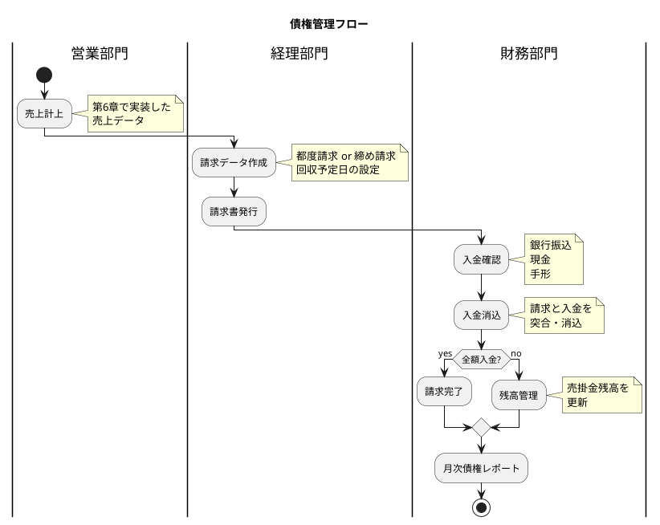

### 債権管理で扱うデータ

| データ | 説明 |
|-------|------|
| **請求データ** | 顧客への請求情報（請求金額、請求日、回収予定日） |
| **請求明細** | 請求に含まれる売上データの明細 |
| **入金データ** | 顧客からの入金情報（入金金額、入金方法） |
| **入金消込明細** | 入金と請求の突合情報 |
| **売掛金残高** | 顧客別の債権残高 |

---

## 7.1 請求業務の DB 設計

### 請求業務フローの理解

請求業務には「都度請求」と「締め請求」の2つのパターンがあります。

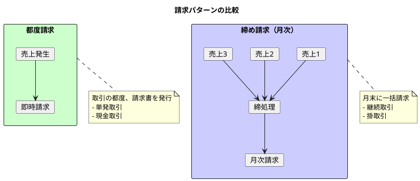

| 請求パターン | 特徴 | 用途 |
|------------|------|------|
| **都度請求** | 売上発生時に即座に請求 | 単発取引、現金取引 |
| **締め請求** | 月末など締日にまとめて請求 | 継続取引、掛売り |

### 締処理の概念

締め請求では、顧客ごとに設定された締日に基づいて売上を集約します。

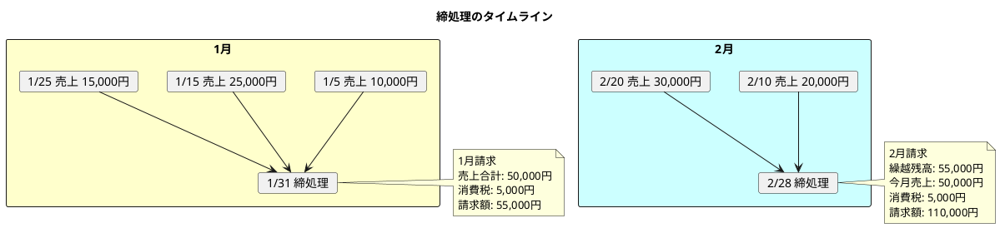

### 請求データ・請求明細の構造

#### 請求データの ER 図

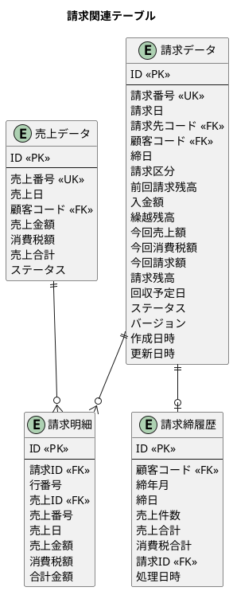

### 請求ステータスの定義

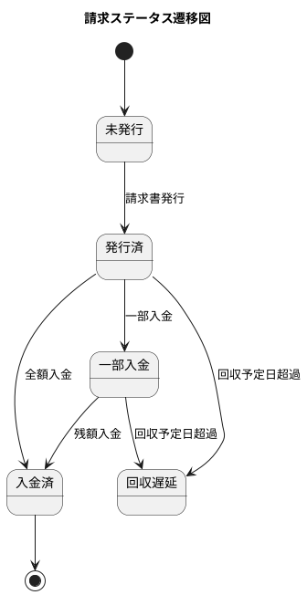

| ステータス | 説明 |
|-----------|------|
| **未発行** | 請求データ作成済み、請求書未発行 |
| **発行済** | 請求書を発行した状態 |
| **一部入金** | 一部入金があり、残高がある状態 |
| **入金済** | 全額入金が完了した状態 |
| **回収遅延** | 回収予定日を過ぎても未回収の状態 |

### マイグレーション：請求関連テーブルの作成

<details>
<summary>V009__create_invoice_tables.sql</summary>

```sql
-- src/main/resources/db/migration/V009__create_invoice_tables.sql

-- 請求ステータス
CREATE TYPE 請求ステータス AS ENUM ('未発行', '発行済', '一部入金', '入金済', '回収遅延');

-- 請求区分
CREATE TYPE 請求区分 AS ENUM ('都度請求', '締め請求');

-- 請求データ（ヘッダ）
CREATE TABLE "請求データ" (
    "ID" SERIAL PRIMARY KEY,
    "請求番号" VARCHAR(20) UNIQUE NOT NULL,
    "請求日" DATE NOT NULL,
    "請求先コード" VARCHAR(20) NOT NULL,
    "顧客コード" VARCHAR(20) NOT NULL,
    "締日" DATE,
    "請求区分" 請求区分 NOT NULL,
    "前回請求残高" DECIMAL(15, 2) DEFAULT 0 NOT NULL,
    "入金額" DECIMAL(15, 2) DEFAULT 0 NOT NULL,
    "繰越残高" DECIMAL(15, 2) DEFAULT 0 NOT NULL,
    "今回売上額" DECIMAL(15, 2) DEFAULT 0 NOT NULL,
    "今回消費税額" DECIMAL(15, 2) DEFAULT 0 NOT NULL,
    "今回請求額" DECIMAL(15, 2) DEFAULT 0 NOT NULL,
    "請求残高" DECIMAL(15, 2) DEFAULT 0 NOT NULL,
    "回収予定日" DATE,
    "ステータス" 請求ステータス DEFAULT '未発行' NOT NULL,
    "備考" TEXT,
    "バージョン" INTEGER DEFAULT 1 NOT NULL,
    "作成日時" TIMESTAMP DEFAULT CURRENT_TIMESTAMP NOT NULL,
    "作成者" VARCHAR(50),
    "更新日時" TIMESTAMP DEFAULT CURRENT_TIMESTAMP NOT NULL,
    "更新者" VARCHAR(50),
    CONSTRAINT "fk_請求データ_顧客"
        FOREIGN KEY ("顧客コード") REFERENCES "顧客マスタ"("顧客コード")
);

-- 請求明細
CREATE TABLE "請求明細" (
    "ID" SERIAL PRIMARY KEY,
    "請求ID" INTEGER NOT NULL,
    "行番号" INTEGER NOT NULL,
    "売上ID" INTEGER NOT NULL,
    "売上番号" VARCHAR(20) NOT NULL,
    "売上日" DATE NOT NULL,
    "売上金額" DECIMAL(15, 2) NOT NULL,
    "消費税額" DECIMAL(15, 2) NOT NULL,
    "合計金額" DECIMAL(15, 2) NOT NULL,
    CONSTRAINT "fk_請求明細_請求"
        FOREIGN KEY ("請求ID") REFERENCES "請求データ"("ID") ON DELETE CASCADE,
    CONSTRAINT "fk_請求明細_売上"
        FOREIGN KEY ("売上ID") REFERENCES "売上データ"("ID"),
    CONSTRAINT "uk_請求明細_請求_行" UNIQUE ("請求ID", "行番号")
);

-- 請求締履歴
CREATE TABLE "請求締履歴" (
    "ID" SERIAL PRIMARY KEY,
    "顧客コード" VARCHAR(20) NOT NULL,
    "締年月" VARCHAR(7) NOT NULL,
    "締日" DATE NOT NULL,
    "売上件数" INTEGER NOT NULL,
    "売上合計" DECIMAL(15, 2) NOT NULL,
    "消費税合計" DECIMAL(15, 2) NOT NULL,
    "請求ID" INTEGER,
    "処理日時" TIMESTAMP DEFAULT CURRENT_TIMESTAMP NOT NULL,
    CONSTRAINT "fk_請求締履歴_顧客"
        FOREIGN KEY ("顧客コード") REFERENCES "顧客マスタ"("顧客コード"),
    CONSTRAINT "fk_請求締履歴_請求"
        FOREIGN KEY ("請求ID") REFERENCES "請求データ"("ID"),
    CONSTRAINT "uk_請求締履歴_顧客_年月" UNIQUE ("顧客コード", "締年月")
);

-- 売掛金残高
CREATE TABLE "売掛金残高" (
    "ID" SERIAL PRIMARY KEY,
    "顧客コード" VARCHAR(20) NOT NULL,
    "基準日" DATE NOT NULL,
    "前月残高" DECIMAL(15, 2) DEFAULT 0 NOT NULL,
    "当月売上" DECIMAL(15, 2) DEFAULT 0 NOT NULL,
    "当月入金" DECIMAL(15, 2) DEFAULT 0 NOT NULL,
    "当月残高" DECIMAL(15, 2) DEFAULT 0 NOT NULL,
    "作成日時" TIMESTAMP DEFAULT CURRENT_TIMESTAMP NOT NULL,
    "更新日時" TIMESTAMP DEFAULT CURRENT_TIMESTAMP NOT NULL,
    CONSTRAINT "fk_売掛金残高_顧客"
        FOREIGN KEY ("顧客コード") REFERENCES "顧客マスタ"("顧客コード"),
    CONSTRAINT "uk_売掛金残高_顧客_基準日" UNIQUE ("顧客コード", "基準日")
);

-- インデックス
CREATE INDEX "idx_請求データ_顧客コード" ON "請求データ"("顧客コード");
CREATE INDEX "idx_請求データ_請求日" ON "請求データ"("請求日");
CREATE INDEX "idx_請求データ_ステータス" ON "請求データ"("ステータス");
CREATE INDEX "idx_請求明細_請求ID" ON "請求明細"("請求ID");
CREATE INDEX "idx_売掛金残高_基準日" ON "売掛金残高"("基準日");

-- テーブルコメント
COMMENT ON TABLE "請求データ" IS '請求ヘッダ情報を管理するテーブル';
COMMENT ON TABLE "請求明細" IS '請求に含まれる売上明細を管理するテーブル';
COMMENT ON TABLE "請求締履歴" IS '月次締処理の履歴を管理するテーブル';
COMMENT ON TABLE "売掛金残高" IS '顧客別月次売掛金残高を管理するテーブル';
```

</details>

### 請求エンティティの実装

<details>
<summary>請求ステータス ENUM</summary>

```java
// src/main/java/com/example/sales/domain/model/invoice/InvoiceStatus.java
package com.example.sales.domain.model.invoice;

import lombok.Getter;
import lombok.RequiredArgsConstructor;

@Getter
@RequiredArgsConstructor
public enum InvoiceStatus {
    DRAFT("未発行"),
    ISSUED("発行済"),
    PARTIALLY_PAID("一部入金"),
    PAID("入金済"),
    OVERDUE("回収遅延");

    private final String displayName;

    public static InvoiceStatus fromDisplayName(String displayName) {
        for (InvoiceStatus status : values()) {
            if (status.displayName.equals(displayName)) {
                return status;
            }
        }
        throw new IllegalArgumentException("Unknown status: " + displayName);
    }
}
```

</details>

<details>
<summary>請求区分 ENUM</summary>

```java
// src/main/java/com/example/sales/domain/model/invoice/InvoiceType.java
package com.example.sales.domain.model.invoice;

import lombok.Getter;
import lombok.RequiredArgsConstructor;

@Getter
@RequiredArgsConstructor
public enum InvoiceType {
    IMMEDIATE("都度請求"),
    CLOSING("締め請求");

    private final String displayName;

    public static InvoiceType fromDisplayName(String displayName) {
        for (InvoiceType type : values()) {
            if (type.displayName.equals(displayName)) {
                return type;
            }
        }
        throw new IllegalArgumentException("Unknown type: " + displayName);
    }
}
```

</details>

<details>
<summary>請求エンティティ</summary>

```java
// src/main/java/com/example/sales/domain/model/invoice/Invoice.java
package com.example.sales.domain.model.invoice;

import lombok.AllArgsConstructor;
import lombok.Builder;
import lombok.Data;
import lombok.NoArgsConstructor;

import java.math.BigDecimal;
import java.time.LocalDate;
import java.time.LocalDateTime;
import java.util.ArrayList;
import java.util.List;

@Data
@Builder
@NoArgsConstructor
@AllArgsConstructor
public class Invoice {
    private Integer id;
    private String invoiceNumber;
    private LocalDate invoiceDate;
    private String billingCode;
    private String customerCode;
    private LocalDate closingDate;
    private InvoiceType invoiceType;
    private BigDecimal previousBalance;
    private BigDecimal receiptAmount;
    private BigDecimal carriedBalance;
    private BigDecimal currentSalesAmount;
    private BigDecimal currentTaxAmount;
    private BigDecimal currentInvoiceAmount;
    private BigDecimal invoiceBalance;
    private LocalDate dueDate;
    private InvoiceStatus status;
    private String remarks;
    private LocalDateTime createdAt;
    private String createdBy;
    private LocalDateTime updatedAt;
    private String updatedBy;

    // 楽観ロック用バージョン
    @Builder.Default
    private Integer version = 1;

    // リレーション
    @Builder.Default
    private List<InvoiceDetail> details = new ArrayList<>();

    /**
     * 請求残高を計算する
     */
    public BigDecimal calculateInvoiceBalance() {
        return carriedBalance.add(currentInvoiceAmount).subtract(receiptAmount);
    }

    /**
     * 繰越残高を計算する
     */
    public BigDecimal calculateCarriedBalance() {
        return previousBalance.subtract(receiptAmount);
    }
}
```

</details>

<details>
<summary>請求明細エンティティ</summary>

```java
// src/main/java/com/example/sales/domain/model/invoice/InvoiceDetail.java
package com.example.sales.domain.model.invoice;

import lombok.Builder;
import lombok.Data;

import java.math.BigDecimal;
import java.time.LocalDate;

@Data
@Builder
public class InvoiceDetail {
    private Integer id;
    private Integer invoiceId;
    private Integer lineNumber;
    private Integer salesId;
    private String salesNumber;
    private LocalDate salesDate;
    private BigDecimal salesAmount;
    private BigDecimal taxAmount;
    private BigDecimal totalAmount;
}
```

</details>

### 締処理サービスの実装

<details>
<summary>締処理サービス</summary>

```java
// src/main/java/com/example/sales/application/service/ClosingService.java
package com.example.sales.application.service;

import com.example.sales.application.port.out.*;
import com.example.sales.domain.model.invoice.*;
import com.example.sales.domain.model.sales.Sales;
import lombok.RequiredArgsConstructor;
import org.springframework.stereotype.Service;
import org.springframework.transaction.annotation.Transactional;

import java.math.BigDecimal;
import java.time.LocalDate;
import java.time.YearMonth;
import java.util.List;

@Service
@RequiredArgsConstructor
public class ClosingService {

    private final InvoiceRepository invoiceRepository;
    private final SalesRepository salesRepository;
    private final CustomerRepository customerRepository;
    private final ClosingHistoryRepository closingHistoryRepository;

    /**
     * 月次締処理を実行する
     */
    @Transactional
    public Invoice executeMonthlyClosing(String customerCode, YearMonth yearMonth) {
        LocalDate closingDate = yearMonth.atEndOfMonth();

        // 既に締処理済みかチェック
        if (closingHistoryRepository.existsByCustomerAndYearMonth(customerCode, yearMonth)) {
            throw new IllegalStateException("既に締処理が実行されています: " + yearMonth);
        }

        // 対象期間の売上を取得
        LocalDate fromDate = yearMonth.atDay(1);
        LocalDate toDate = yearMonth.atEndOfMonth();
        List<Sales> salesList = salesRepository.findByCustomerCodeAndDateRange(
                customerCode, fromDate, toDate);

        if (salesList.isEmpty()) {
            throw new IllegalStateException("対象期間の売上がありません");
        }

        // 売上合計・消費税を集計
        BigDecimal totalSales = salesList.stream()
                .map(Sales::getSalesAmount)
                .reduce(BigDecimal.ZERO, BigDecimal::add);
        BigDecimal totalTax = salesList.stream()
                .map(Sales::getTaxAmount)
                .reduce(BigDecimal.ZERO, BigDecimal::add);

        // 前回請求残高を取得
        BigDecimal previousBalance = invoiceRepository
                .findLatestByCustomerCode(customerCode)
                .map(Invoice::getInvoiceBalance)
                .orElse(BigDecimal.ZERO);

        // 顧客の回収サイトから回収予定日を計算
        var customer = customerRepository.findByCustomerCode(customerCode)
                .orElseThrow(() -> new IllegalArgumentException("顧客が見つかりません"));
        LocalDate dueDate = calculateDueDate(closingDate, customer.getCollectionSite());

        // 請求データを作成
        var invoice = Invoice.builder()
                .invoiceNumber(generateInvoiceNumber())
                .invoiceDate(closingDate)
                .billingCode(customerCode)
                .customerCode(customerCode)
                .closingDate(closingDate)
                .invoiceType(InvoiceType.CLOSING)
                .previousBalance(previousBalance)
                .receiptAmount(BigDecimal.ZERO)
                .carriedBalance(previousBalance)
                .currentSalesAmount(totalSales)
                .currentTaxAmount(totalTax)
                .currentInvoiceAmount(totalSales.add(totalTax))
                .invoiceBalance(previousBalance.add(totalSales).add(totalTax))
                .dueDate(dueDate)
                .status(InvoiceStatus.DRAFT)
                .build();

        invoiceRepository.save(invoice);

        // 請求明細を作成
        int lineNumber = 1;
        for (Sales sales : salesList) {
            var detail = InvoiceDetail.builder()
                    .invoiceId(invoice.getId())
                    .lineNumber(lineNumber++)
                    .salesId(sales.getId())
                    .salesNumber(sales.getSalesNumber())
                    .salesDate(sales.getSalesDate())
                    .salesAmount(sales.getSalesAmount())
                    .taxAmount(sales.getTaxAmount())
                    .totalAmount(sales.getSalesTotal())
                    .build();
            invoiceRepository.saveDetail(detail);
        }

        // 締履歴を保存
        var history = ClosingHistory.builder()
                .customerCode(customerCode)
                .closingYearMonth(yearMonth.toString())
                .closingDate(closingDate)
                .salesCount(salesList.size())
                .salesTotal(totalSales)
                .taxTotal(totalTax)
                .invoiceId(invoice.getId())
                .build();
        closingHistoryRepository.save(history);

        return invoice;
    }

    private LocalDate calculateDueDate(LocalDate closingDate, Integer collectionSite) {
        if (collectionSite == null) {
            collectionSite = 30; // デフォルト30日
        }
        return closingDate.plusDays(collectionSite);
    }

    private String generateInvoiceNumber() {
        return String.format("INV-%d-%04d",
                LocalDate.now().getYear(), System.currentTimeMillis() % 10000);
    }
}
```

</details>

---

## 7.2 回収業務の DB 設計

### 入金業務フローの理解

入金業務は、顧客からの入金を記録し、請求と突合（消込）する業務です。

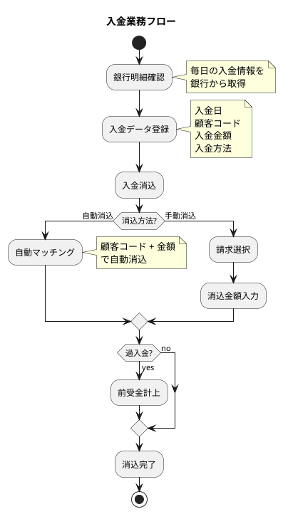

### 入金方法の種類

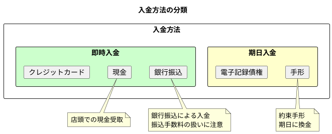

| 入金方法 | 特徴 | 手数料 |
|---------|------|-------|
| **現金** | 即時入金、店頭取引 | なし |
| **銀行振込** | 最も一般的、振込手数料が発生 | 振込手数料（顧客負担 or 当社負担） |
| **クレジットカード** | カード会社経由で入金 | カード手数料 |
| **手形** | 期日に換金、不渡りリスク | なし |
| **電子記録債権** | 電子的な債権管理 | 利用料 |

### 入金消込のパターン

入金と請求の消込には、以下のパターンがあります。

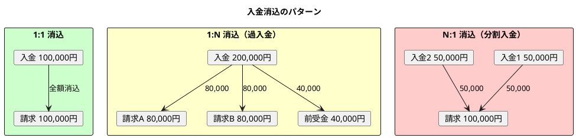

| パターン | 説明 | 処理 |
|---------|------|------|
| **1:1** | 1件の入金で1件の請求を消込 | 通常の消込 |
| **1:N** | 1件の入金で複数の請求を消込 | 古い請求から順に消込、余剰は前受金 |
| **N:1** | 複数の入金で1件の請求を消込 | 分割入金、一部入金状態の管理 |

### 入金データ・入金消込明細の構造

#### 入金データの ER 図

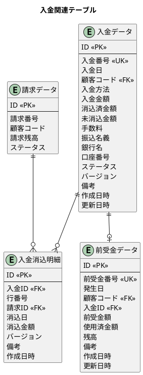

### 入金ステータスの定義

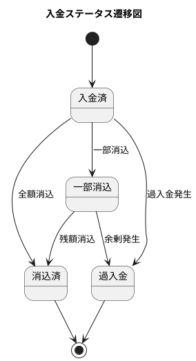

| ステータス | 説明 |
|-----------|------|
| **入金済** | 入金登録完了、未消込状態 |
| **一部消込** | 一部が消込済み |
| **消込済** | 全額が消込完了 |
| **過入金** | 入金額が請求額を超過 |

### マイグレーション：入金関連テーブルの作成

<details>
<summary>V010__create_receipt_tables.sql</summary>

```sql
-- src/main/resources/db/migration/V010__create_receipt_tables.sql

-- 入金ステータス
CREATE TYPE 入金ステータス AS ENUM ('入金済', '一部消込', '消込済', '過入金');

-- 入金方法
CREATE TYPE 入金方法 AS ENUM ('現金', '銀行振込', 'クレジットカード', '手形', '電子記録債権');

-- 入金データ
CREATE TABLE "入金データ" (
    "ID" SERIAL PRIMARY KEY,
    "入金番号" VARCHAR(20) UNIQUE NOT NULL,
    "入金日" DATE NOT NULL,
    "顧客コード" VARCHAR(20) NOT NULL,
    "入金方法" 入金方法 NOT NULL,
    "入金金額" DECIMAL(15, 2) NOT NULL,
    "消込済金額" DECIMAL(15, 2) DEFAULT 0 NOT NULL,
    "未消込金額" DECIMAL(15, 2) DEFAULT 0 NOT NULL,
    "手数料" DECIMAL(15, 2) DEFAULT 0 NOT NULL,
    "振込名義" VARCHAR(100),
    "銀行名" VARCHAR(50),
    "口座番号" VARCHAR(20),
    "ステータス" 入金ステータス DEFAULT '入金済' NOT NULL,
    "備考" TEXT,
    "バージョン" INTEGER DEFAULT 1 NOT NULL,
    "作成日時" TIMESTAMP DEFAULT CURRENT_TIMESTAMP NOT NULL,
    "作成者" VARCHAR(50),
    "更新日時" TIMESTAMP DEFAULT CURRENT_TIMESTAMP NOT NULL,
    "更新者" VARCHAR(50),
    CONSTRAINT "fk_入金データ_顧客"
        FOREIGN KEY ("顧客コード") REFERENCES "顧客マスタ"("顧客コード")
);

-- 入金消込明細
CREATE TABLE "入金消込明細" (
    "ID" SERIAL PRIMARY KEY,
    "入金ID" INTEGER NOT NULL,
    "行番号" INTEGER NOT NULL,
    "請求ID" INTEGER NOT NULL,
    "消込日" DATE NOT NULL,
    "消込金額" DECIMAL(15, 2) NOT NULL,
    "備考" TEXT,
    "バージョン" INTEGER DEFAULT 1 NOT NULL,
    "作成日時" TIMESTAMP DEFAULT CURRENT_TIMESTAMP NOT NULL,
    CONSTRAINT "fk_入金消込明細_入金"
        FOREIGN KEY ("入金ID") REFERENCES "入金データ"("ID") ON DELETE CASCADE,
    CONSTRAINT "fk_入金消込明細_請求"
        FOREIGN KEY ("請求ID") REFERENCES "請求データ"("ID"),
    CONSTRAINT "uk_入金消込明細_入金_行" UNIQUE ("入金ID", "行番号")
);

-- 前受金データ
CREATE TABLE "前受金データ" (
    "ID" SERIAL PRIMARY KEY,
    "前受金番号" VARCHAR(20) UNIQUE NOT NULL,
    "発生日" DATE NOT NULL,
    "顧客コード" VARCHAR(20) NOT NULL,
    "入金ID" INTEGER,
    "前受金額" DECIMAL(15, 2) NOT NULL,
    "使用済金額" DECIMAL(15, 2) DEFAULT 0 NOT NULL,
    "残高" DECIMAL(15, 2) NOT NULL,
    "備考" TEXT,
    "作成日時" TIMESTAMP DEFAULT CURRENT_TIMESTAMP NOT NULL,
    "更新日時" TIMESTAMP DEFAULT CURRENT_TIMESTAMP NOT NULL,
    CONSTRAINT "fk_前受金データ_顧客"
        FOREIGN KEY ("顧客コード") REFERENCES "顧客マスタ"("顧客コード"),
    CONSTRAINT "fk_前受金データ_入金"
        FOREIGN KEY ("入金ID") REFERENCES "入金データ"("ID")
);

-- インデックス
CREATE INDEX "idx_入金データ_顧客コード" ON "入金データ"("顧客コード");
CREATE INDEX "idx_入金データ_入金日" ON "入金データ"("入金日");
CREATE INDEX "idx_入金データ_ステータス" ON "入金データ"("ステータス");
CREATE INDEX "idx_入金消込明細_入金ID" ON "入金消込明細"("入金ID");
CREATE INDEX "idx_入金消込明細_請求ID" ON "入金消込明細"("請求ID");
CREATE INDEX "idx_前受金データ_顧客コード" ON "前受金データ"("顧客コード");

-- テーブルコメント
COMMENT ON TABLE "入金データ" IS '入金情報を管理するテーブル';
COMMENT ON TABLE "入金消込明細" IS '入金と請求の消込明細を管理するテーブル';
COMMENT ON TABLE "前受金データ" IS '過入金による前受金を管理するテーブル';
COMMENT ON COLUMN "入金データ"."バージョン" IS '楽観ロック用バージョン番号';
```

</details>

### 入金エンティティの実装

<details>
<summary>入金ステータス ENUM</summary>

```java
// src/main/java/com/example/sales/domain/model/receipt/ReceiptStatus.java
package com.example.sales.domain.model.receipt;

import lombok.Getter;
import lombok.RequiredArgsConstructor;

@Getter
@RequiredArgsConstructor
public enum ReceiptStatus {
    RECEIVED("入金済"),
    PARTIALLY_APPLIED("一部消込"),
    APPLIED("消込済"),
    OVERPAID("過入金");

    private final String displayName;

    public static ReceiptStatus fromDisplayName(String displayName) {
        for (ReceiptStatus status : values()) {
            if (status.displayName.equals(displayName)) {
                return status;
            }
        }
        throw new IllegalArgumentException("Unknown status: " + displayName);
    }
}
```

</details>

<details>
<summary>入金方法 ENUM</summary>

```java
// src/main/java/com/example/sales/domain/model/receipt/PaymentMethod.java
package com.example.sales.domain.model.receipt;

import lombok.Getter;
import lombok.RequiredArgsConstructor;

@Getter
@RequiredArgsConstructor
public enum PaymentMethod {
    CASH("現金"),
    BANK_TRANSFER("銀行振込"),
    CREDIT_CARD("クレジットカード"),
    BILL("手形"),
    ELECTRONIC_BOND("電子記録債権");

    private final String displayName;

    public static PaymentMethod fromDisplayName(String displayName) {
        for (PaymentMethod method : values()) {
            if (method.displayName.equals(displayName)) {
                return method;
            }
        }
        throw new IllegalArgumentException("Unknown method: " + displayName);
    }
}
```

</details>

<details>
<summary>入金エンティティ</summary>

```java
// src/main/java/com/example/sales/domain/model/receipt/Receipt.java
package com.example.sales.domain.model.receipt;

import lombok.Builder;
import lombok.Data;

import java.math.BigDecimal;
import java.time.LocalDate;
import java.time.LocalDateTime;
import java.util.List;

@Data
@Builder
public class Receipt {
    private Integer id;
    private String receiptNumber;
    private LocalDate receiptDate;
    private String customerCode;
    private PaymentMethod paymentMethod;
    private BigDecimal receiptAmount;
    private BigDecimal appliedAmount;
    private BigDecimal unappliedAmount;
    private BigDecimal bankFee;
    private String payerName;
    private String bankName;
    private String accountNumber;
    private ReceiptStatus status;
    private String remarks;
    private Integer version;
    private LocalDateTime createdAt;
    private String createdBy;
    private LocalDateTime updatedAt;
    private String updatedBy;

    // リレーション
    private List<ReceiptApplication> applications;

    /**
     * 未消込金額を計算する
     */
    public BigDecimal calculateUnappliedAmount() {
        return receiptAmount.subtract(appliedAmount).subtract(bankFee);
    }

    /**
     * 消込可能かどうかを判定する
     */
    public boolean canApply(BigDecimal amount) {
        return unappliedAmount.compareTo(amount) >= 0;
    }
}
```

</details>

<details>
<summary>入金消込明細エンティティ</summary>

```java
// src/main/java/com/example/sales/domain/model/receipt/ReceiptApplication.java
package com.example.sales.domain.model.receipt;

import lombok.Builder;
import lombok.Data;

import java.math.BigDecimal;
import java.time.LocalDate;
import java.time.LocalDateTime;

@Data
@Builder
public class ReceiptApplication {
    private Integer id;
    private Integer receiptId;
    private Integer lineNumber;
    private Integer invoiceId;
    private LocalDate applicationDate;
    private BigDecimal appliedAmount;
    private String remarks;
    private Integer version;
    private LocalDateTime createdAt;
}
```

</details>

### 入金消込サービスの実装

<details>
<summary>入金消込サービス</summary>

```java
// src/main/java/com/example/sales/application/service/ReceiptService.java
package com.example.sales.application.service;

import com.example.sales.application.port.out.*;
import com.example.sales.domain.model.invoice.Invoice;
import com.example.sales.domain.model.invoice.InvoiceStatus;
import com.example.sales.domain.model.receipt.*;
import lombok.RequiredArgsConstructor;
import org.springframework.stereotype.Service;
import org.springframework.transaction.annotation.Transactional;

import java.math.BigDecimal;
import java.time.LocalDate;
import java.util.ArrayList;
import java.util.List;

@Service
@RequiredArgsConstructor
public class ReceiptService {

    private final ReceiptRepository receiptRepository;
    private final InvoiceRepository invoiceRepository;
    private final AdvanceReceiptRepository advanceReceiptRepository;

    /**
     * 入金を登録する
     */
    @Transactional
    public Receipt registerReceipt(Receipt receipt) {
        receipt.setUnappliedAmount(
                receipt.getReceiptAmount().subtract(receipt.getBankFee()));
        receipt.setAppliedAmount(BigDecimal.ZERO);
        receipt.setStatus(ReceiptStatus.RECEIVED);
        receiptRepository.save(receipt);
        return receipt;
    }

    /**
     * 入金を請求に消込する
     */
    @Transactional
    public ReceiptApplication applyReceipt(
            Integer receiptId, Integer invoiceId, BigDecimal amount) {

        var receipt = receiptRepository.findById(receiptId)
                .orElseThrow(() -> new IllegalArgumentException(
                        "入金が見つかりません: " + receiptId));

        var invoice = invoiceRepository.findById(invoiceId)
                .orElseThrow(() -> new IllegalArgumentException(
                        "請求が見つかりません: " + invoiceId));

        // バリデーション
        if (!receipt.canApply(amount)) {
            throw new IllegalStateException("消込可能金額が不足しています");
        }
        if (amount.compareTo(invoice.getInvoiceBalance()) > 0) {
            throw new IllegalStateException("消込金額が請求残高を超えています");
        }

        // 消込明細を作成
        int lineNumber = getNextLineNumber(receiptId);
        var application = ReceiptApplication.builder()
                .receiptId(receiptId)
                .lineNumber(lineNumber)
                .invoiceId(invoiceId)
                .applicationDate(LocalDate.now())
                .appliedAmount(amount)
                .build();
        receiptRepository.saveApplication(application);

        // 入金の金額を更新
        BigDecimal newAppliedAmount = receipt.getAppliedAmount().add(amount);
        BigDecimal newUnappliedAmount = receipt.getUnappliedAmount().subtract(amount);
        receiptRepository.updateAmounts(receiptId, newAppliedAmount, newUnappliedAmount);

        // 入金ステータスを更新
        if (newUnappliedAmount.compareTo(BigDecimal.ZERO) <= 0) {
            receiptRepository.updateStatus(receiptId, ReceiptStatus.APPLIED);
        }

        // 請求の入金額を更新
        invoiceRepository.updateReceiptAmount(invoiceId, amount);

        // 請求ステータスを更新
        var updatedInvoice = invoiceRepository.findById(invoiceId).get();
        if (updatedInvoice.getInvoiceBalance().compareTo(BigDecimal.ZERO) <= 0) {
            invoiceRepository.updateStatus(invoiceId, InvoiceStatus.PAID);
        } else {
            invoiceRepository.updateStatus(invoiceId, InvoiceStatus.PARTIALLY_PAID);
        }

        return application;
    }

    /**
     * 自動消込を実行する（古い請求から順に消込）
     */
    @Transactional
    public List<ReceiptApplication> autoApply(Integer receiptId) {
        var receipt = receiptRepository.findById(receiptId)
                .orElseThrow(() -> new IllegalArgumentException(
                        "入金が見つかりません: " + receiptId));

        List<Invoice> unpaidInvoices = invoiceRepository
                .findUnpaidByCustomerCode(receipt.getCustomerCode());

        BigDecimal remainingAmount = receipt.getUnappliedAmount();
        List<ReceiptApplication> applications = new ArrayList<>();

        for (Invoice invoice : unpaidInvoices) {
            if (remainingAmount.compareTo(BigDecimal.ZERO) <= 0) {
                break;
            }

            BigDecimal applyAmount = remainingAmount.min(invoice.getInvoiceBalance());
            var application = applyReceipt(receiptId, invoice.getId(), applyAmount);
            applications.add(application);

            remainingAmount = remainingAmount.subtract(applyAmount);
        }

        // 過入金の場合は前受金として登録
        if (remainingAmount.compareTo(BigDecimal.ZERO) > 0) {
            createAdvanceReceipt(receipt.getCustomerCode(), receiptId, remainingAmount);
            receiptRepository.updateStatus(receiptId, ReceiptStatus.OVERPAID);
        }

        return applications;
    }

    private void createAdvanceReceipt(
            String customerCode, Integer receiptId, BigDecimal amount) {
        var advanceReceipt = AdvanceReceipt.builder()
                .advanceReceiptNumber(generateAdvanceReceiptNumber())
                .occurredDate(LocalDate.now())
                .customerCode(customerCode)
                .receiptId(receiptId)
                .advanceAmount(amount)
                .usedAmount(BigDecimal.ZERO)
                .balance(amount)
                .build();
        advanceReceiptRepository.save(advanceReceipt);
    }

    private int getNextLineNumber(Integer receiptId) {
        var applications = receiptRepository.findApplicationsByReceiptId(receiptId);
        return applications.size() + 1;
    }

    private String generateAdvanceReceiptNumber() {
        return String.format("ADV-%d-%04d",
                LocalDate.now().getYear(), System.currentTimeMillis() % 10000);
    }
}
```

</details>

### 債権残高管理サービス

<details>
<summary>売掛金残高サービス</summary>

```java
// src/main/java/com/example/sales/application/service/AccountsReceivableService.java
package com.example.sales.application.service;

import com.example.sales.application.port.out.*;
import com.example.sales.domain.model.invoice.AccountsReceivable;
import lombok.RequiredArgsConstructor;
import org.springframework.stereotype.Service;
import org.springframework.transaction.annotation.Transactional;

import java.math.BigDecimal;
import java.time.LocalDate;
import java.time.YearMonth;
import java.util.List;

@Service
@RequiredArgsConstructor
public class AccountsReceivableService {

    private final AccountsReceivableRepository arRepository;
    private final SalesRepository salesRepository;
    private final ReceiptRepository receiptRepository;
    private final CustomerRepository customerRepository;

    /**
     * 月次売掛金残高を更新する
     */
    @Transactional
    public void updateMonthlyBalance(YearMonth yearMonth) {
        LocalDate baseDate = yearMonth.atEndOfMonth();
        LocalDate fromDate = yearMonth.atDay(1);
        LocalDate toDate = yearMonth.atEndOfMonth();

        var customers = customerRepository.findAll();

        for (var customer : customers) {
            // 前月残高を取得
            BigDecimal previousBalance = getPreviousMonthBalance(
                    customer.getCustomerCode(), yearMonth);

            // 当月売上を集計
            BigDecimal currentSales = salesRepository
                    .sumSalesByCustomerAndDateRange(
                            customer.getCustomerCode(), fromDate, toDate);

            // 当月入金を集計
            BigDecimal currentReceipts = receiptRepository
                    .sumReceiptsByCustomerAndDateRange(
                            customer.getCustomerCode(), fromDate, toDate);

            // 当月残高を計算
            BigDecimal currentBalance = previousBalance
                    .add(currentSales)
                    .subtract(currentReceipts);

            // 売掛金残高を更新
            var ar = AccountsReceivable.builder()
                    .customerCode(customer.getCustomerCode())
                    .baseDate(baseDate)
                    .previousMonthBalance(previousBalance)
                    .currentMonthSales(currentSales)
                    .currentMonthReceipts(currentReceipts)
                    .currentMonthBalance(currentBalance)
                    .build();
            arRepository.upsert(ar);
        }
    }

    /**
     * 顧客別売掛金残高を取得する
     */
    public List<AccountsReceivable> getCustomerBalances(LocalDate baseDate) {
        return arRepository.findByBaseDate(baseDate);
    }

    /**
     * 滞留債権一覧を取得する
     */
    public List<AccountsReceivable> getOverdueBalances(
            LocalDate currentDate, int overdueDays) {
        LocalDate cutoffDate = currentDate.minusDays(overdueDays);
        return arRepository.findOverdue(cutoffDate);
    }

    private BigDecimal getPreviousMonthBalance(
            String customerCode, YearMonth yearMonth) {
        LocalDate previousMonthEnd = yearMonth.minusMonths(1).atEndOfMonth();
        return arRepository.findByCustomerCodeAndBaseDate(
                        customerCode, previousMonthEnd)
                .map(AccountsReceivable::getCurrentMonthBalance)
                .orElse(BigDecimal.ZERO);
    }
}
```

</details>

---

## 7.3 リレーションと楽観ロックの設計

### N+1 問題とその解決

請求データは、請求（ヘッダ）→ 請求明細の2層構造を持ちます。入金データも入金 → 入金消込明細の親子関係があります。これらのデータを効率的に取得するための設計を行います。

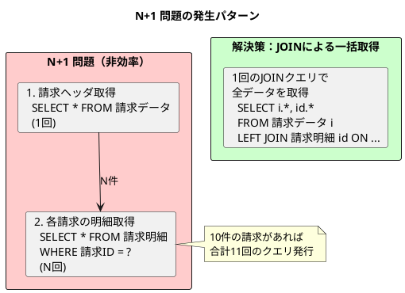

### MyBatis ネストした ResultMap による関連付け

<details>
<summary>請求データのリレーション設定（InvoiceMapper.xml）</summary>

```xml
<?xml version="1.0" encoding="UTF-8" ?>
<!DOCTYPE mapper
        PUBLIC "-//mybatis.org//DTD Mapper 3.0//EN"
        "http://mybatis.org/dtd/mybatis-3-mapper.dtd">
<mapper namespace="com.example.sales.infrastructure.persistence.mapper.InvoiceMapper">

    <!-- 請求（ヘッダ）の ResultMap -->
    <resultMap id="InvoiceWithDetailsResultMap"
               type="com.example.sales.domain.model.invoice.Invoice">
        <id property="id" column="i_id"/>
        <result property="invoiceNumber" column="i_請求番号"/>
        <result property="invoiceDate" column="i_請求日"/>
        <result property="billingCode" column="i_請求先コード"/>
        <result property="customerCode" column="i_顧客コード"/>
        <result property="closingDate" column="i_締日"/>
        <result property="invoiceType" column="i_請求区分"
                typeHandler="com.example.sales.infrastructure.persistence.typehandler.InvoiceTypeTypeHandler"/>
        <result property="previousBalance" column="i_前回請求残高"/>
        <result property="receiptAmount" column="i_入金額"/>
        <result property="carriedBalance" column="i_繰越残高"/>
        <result property="currentSalesAmount" column="i_今回売上額"/>
        <result property="currentTaxAmount" column="i_今回消費税額"/>
        <result property="currentInvoiceAmount" column="i_今回請求額"/>
        <result property="invoiceBalance" column="i_請求残高"/>
        <result property="dueDate" column="i_回収予定日"/>
        <result property="status" column="i_ステータス"
                typeHandler="com.example.sales.infrastructure.persistence.typehandler.InvoiceStatusTypeHandler"/>
        <result property="version" column="i_バージョン"/>
        <result property="createdAt" column="i_作成日時"/>
        <result property="updatedAt" column="i_更新日時"/>
        <!-- 請求明細との1:N関連 -->
        <collection property="details"
                    ofType="com.example.sales.domain.model.invoice.InvoiceDetail"
                    resultMap="InvoiceDetailNestedResultMap"/>
    </resultMap>

    <!-- 請求明細のネスト ResultMap -->
    <resultMap id="InvoiceDetailNestedResultMap"
               type="com.example.sales.domain.model.invoice.InvoiceDetail">
        <id property="id" column="id_id"/>
        <result property="invoiceId" column="id_請求ID"/>
        <result property="lineNumber" column="id_行番号"/>
        <result property="salesId" column="id_売上ID"/>
        <result property="salesNumber" column="id_売上番号"/>
        <result property="salesDate" column="id_売上日"/>
        <result property="salesAmount" column="id_売上金額"/>
        <result property="taxAmount" column="id_消費税額"/>
        <result property="totalAmount" column="id_合計金額"/>
    </resultMap>

    <!-- JOIN による一括取得クエリ -->
    <select id="findWithDetailsByInvoiceNumber"
            resultMap="InvoiceWithDetailsResultMap">
        SELECT
            i."ID" AS i_id,
            i."請求番号" AS i_請求番号,
            i."請求日" AS i_請求日,
            i."請求先コード" AS i_請求先コード,
            i."顧客コード" AS i_顧客コード,
            i."締日" AS i_締日,
            i."請求区分" AS i_請求区分,
            i."前回請求残高" AS i_前回請求残高,
            i."入金額" AS i_入金額,
            i."繰越残高" AS i_繰越残高,
            i."今回売上額" AS i_今回売上額,
            i."今回消費税額" AS i_今回消費税額,
            i."今回請求額" AS i_今回請求額,
            i."請求残高" AS i_請求残高,
            i."回収予定日" AS i_回収予定日,
            i."ステータス" AS i_ステータス,
            i."バージョン" AS i_バージョン,
            i."作成日時" AS i_作成日時,
            i."更新日時" AS i_更新日時,
            id."ID" AS id_id,
            id."請求ID" AS id_請求ID,
            id."行番号" AS id_行番号,
            id."売上ID" AS id_売上ID,
            id."売上番号" AS id_売上番号,
            id."売上日" AS id_売上日,
            id."売上金額" AS id_売上金額,
            id."消費税額" AS id_消費税額,
            id."合計金額" AS id_合計金額
        FROM "請求データ" i
        LEFT JOIN "請求明細" id
            ON i."ID" = id."請求ID"
        WHERE i."請求番号" = #{invoiceNumber}
        ORDER BY id."行番号"
    </select>

</mapper>
```

</details>

### リレーション設定のポイント

| 設定項目 | 説明 |
|---------|------|
| `<collection>` | 1:N 関連のマッピング |
| `<id>` | 主キーの識別（MyBatis が重複排除に使用） |
| `resultMap` | ネストした ResultMap の参照 |
| エイリアス（AS） | カラム名の重複を避けるためのプレフィックス |
| `ORDER BY` | コレクションの順序を保証 |

### 楽観ロック（Optimistic Locking）の実装

複数ユーザーが同時に請求データや入金データを編集する場合、データの整合性を保つために楽観ロックを実装します。

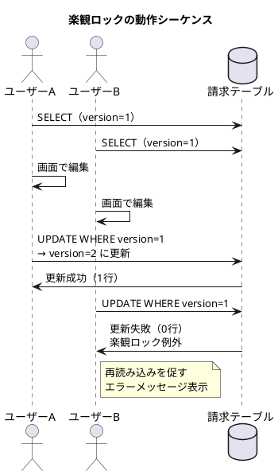

### バージョンカラムによる同時更新制御

<details>
<summary>楽観ロック対応の MyBatis Mapper</summary>

```xml
<!-- 楽観ロック対応の更新（バージョンチェック付き） -->
<update id="updateWithOptimisticLock"
        parameterType="com.example.sales.domain.model.invoice.Invoice">
    UPDATE "請求データ"
    SET
        "請求日" = #{invoiceDate},
        "請求先コード" = #{billingCode},
        "顧客コード" = #{customerCode},
        "締日" = #{closingDate},
        "請求区分" = #{invoiceType,
            typeHandler=com.example.sales.infrastructure.persistence.typehandler.InvoiceTypeTypeHandler}::請求区分,
        "前回請求残高" = #{previousBalance},
        "入金額" = #{receiptAmount},
        "繰越残高" = #{carriedBalance},
        "今回売上額" = #{currentSalesAmount},
        "今回消費税額" = #{currentTaxAmount},
        "今回請求額" = #{currentInvoiceAmount},
        "請求残高" = #{invoiceBalance},
        "回収予定日" = #{dueDate},
        "ステータス" = #{status,
            typeHandler=com.example.sales.infrastructure.persistence.typehandler.InvoiceStatusTypeHandler}::請求ステータス,
        "更新日時" = CURRENT_TIMESTAMP,
        "バージョン" = "バージョン" + 1
    WHERE "ID" = #{id}
    AND "バージョン" = #{version}
</update>

<!-- 楽観ロック対応の削除 -->
<delete id="deleteWithOptimisticLock">
    DELETE FROM "請求データ"
    WHERE "ID" = #{id}
    AND "バージョン" = #{version}
</delete>
```

</details>

<details>
<summary>楽観ロック例外クラス</summary>

```java
// src/main/java/com/example/sales/domain/exception/OptimisticLockException.java
package com.example.sales.domain.exception;

public class OptimisticLockException extends RuntimeException {

    public OptimisticLockException(String entityName, Integer id) {
        super(String.format(
                "%s（ID: %d）は他のユーザーによって更新または削除されました。" +
                "画面を再読み込みしてください。",
                entityName, id));
    }

    public OptimisticLockException(
            String entityName, Integer id,
            Integer expectedVersion, Integer actualVersion) {
        super(String.format(
                "%s（ID: %d）は他のユーザーによって更新されました。" +
                "（期待バージョン: %d, 実際のバージョン: %d）" +
                "画面を再読み込みしてください。",
                entityName, id, expectedVersion, actualVersion));
    }
}
```

</details>

<details>
<summary>Repository 実装：楽観ロック対応</summary>

```java
// src/main/java/com/example/sales/infrastructure/persistence/repository/InvoiceRepositoryImpl.java
package com.example.sales.infrastructure.persistence.repository;

import com.example.sales.application.port.out.InvoiceRepository;
import com.example.sales.domain.exception.OptimisticLockException;
import com.example.sales.domain.model.invoice.*;
import com.example.sales.infrastructure.persistence.mapper.InvoiceMapper;
import lombok.RequiredArgsConstructor;
import org.springframework.stereotype.Repository;
import org.springframework.transaction.annotation.Transactional;

@Repository
@RequiredArgsConstructor
public class InvoiceRepositoryImpl implements InvoiceRepository {

    private final InvoiceMapper invoiceMapper;

    /**
     * 楽観ロック対応の更新
     * @throws OptimisticLockException 他のユーザーによって更新された場合
     */
    @Override
    @Transactional
    public void update(Invoice invoice) {
        int updatedCount = invoiceMapper.updateWithOptimisticLock(invoice);

        if (updatedCount == 0) {
            Integer currentVersion = invoiceMapper.findVersionById(invoice.getId());

            if (currentVersion == null) {
                throw new OptimisticLockException("請求", invoice.getId());
            } else {
                throw new OptimisticLockException(
                    "請求",
                    invoice.getId(),
                    invoice.getVersion(),
                    currentVersion
                );
            }
        }
    }

    /**
     * 楽観ロック対応の削除
     * @throws OptimisticLockException 他のユーザーによって更新された場合
     */
    @Override
    @Transactional
    public void delete(Integer id, Integer version) {
        int deletedCount = invoiceMapper.deleteWithOptimisticLock(id, version);

        if (deletedCount == 0) {
            throw new OptimisticLockException("請求", id);
        }
    }
}
```

</details>

### 楽観ロックのテスト

<details>
<summary>楽観ロックのテストコード</summary>

```java
@Nested
@DisplayName("楽観ロックの更新テスト")
class OptimisticLockUpdateTest {

    @Test
    @DisplayName("正しいバージョンで更新できる")
    void shouldUpdateWithCorrectVersion() {
        // Given: 請求を登録
        var invoice = createTestInvoice("INV-0001");
        invoiceRepository.save(invoice);

        // When: バージョン1で更新
        var saved = invoiceRepository.findByInvoiceNumber("INV-0001").orElseThrow();
        assertThat(saved.getVersion()).isEqualTo(1);
        saved.setInvoiceBalance(new BigDecimal("200000"));
        invoiceRepository.update(saved);

        // Then: バージョンが2に増加
        var updated = invoiceRepository.findByInvoiceNumber("INV-0001").orElseThrow();
        assertThat(updated.getVersion()).isEqualTo(2);
    }

    @Test
    @DisplayName("古いバージョンで更新すると楽観ロック例外がスローされる")
    void shouldThrowOptimisticLockExceptionWithOldVersion() {
        // Given: 請求を登録して、別のセッションで更新
        var invoice = createTestInvoice("INV-0002");
        invoiceRepository.save(invoice);

        var sessionA = invoiceRepository.findByInvoiceNumber("INV-0002").orElseThrow();
        var sessionB = invoiceRepository.findByInvoiceNumber("INV-0002").orElseThrow();

        // セッションAで更新
        sessionA.setInvoiceBalance(new BigDecimal("300000"));
        invoiceRepository.update(sessionA);

        // When/Then: セッションBで更新すると例外
        sessionB.setInvoiceBalance(new BigDecimal("400000"));
        assertThatThrownBy(() -> invoiceRepository.update(sessionB))
                .isInstanceOf(OptimisticLockException.class)
                .hasMessageContaining("他のユーザーによって更新されました");
    }
}
```

</details>

### 楽観ロックのベストプラクティス

| ポイント | 説明 |
|---------|------|
| **バージョンカラム** | INTEGER 型で十分（オーバーフローは現実的に発生しない） |
| **WHERE 条件** | 必ず `AND "バージョン" = #{version}` を含める |
| **インクリメント** | `"バージョン" = "バージョン" + 1` でアトミックに更新 |
| **例外処理** | 更新件数が0の場合は楽観ロック例外をスロー |
| **エラーメッセージ** | ユーザーにわかりやすいメッセージで再読み込みを促す |

---

## 第7章のまとめ

本章では、債権管理の核心部分である請求・入金・売掛金管理について学びました。

### 学んだこと

1. **請求パターンの理解**
   - 都度請求と締め請求の違い
   - 締処理による売上の集約

2. **請求データの構造**
   - 前回繰越・今回売上・請求残高の計算
   - 回収予定日の設定

3. **入金消込の実装**
   - 1:1、1:N、N:1 の消込パターン
   - 自動消込機能

4. **債権残高管理**
   - 月次売掛金残高の更新
   - 滞留債権の管理

5. **リレーションと楽観ロック**
   - N+1 問題の回避
   - 同時更新の競合制御

### 債権管理の ER 図（全体像）

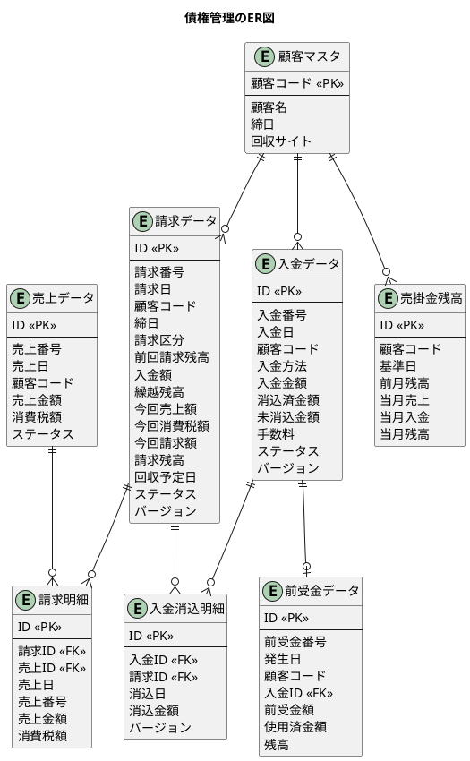

### 次章の予告

第8章では、調達管理の設計に進みます。発注・入荷・仕入の一連の購買業務プロセスをデータベース設計と TDD で実装していきます。

---

[← 第6章：受注・出荷・売上の設計](./chapter06.md) | [第8章：調達管理の設計 →](./chapter08.md)
