# 第8章：調達管理の設計

販売管理システムにおいて、商品の仕入れを管理する調達業務は事業継続の基盤となります。本章では、発注から入荷・検収、仕入計上までの一連の調達業務フローに対応したデータベース設計と実装を行います。

## 調達管理の全体像

調達管理は「発注 → 入荷 → 検収 → 仕入計上」という一連のフローで構成されます。

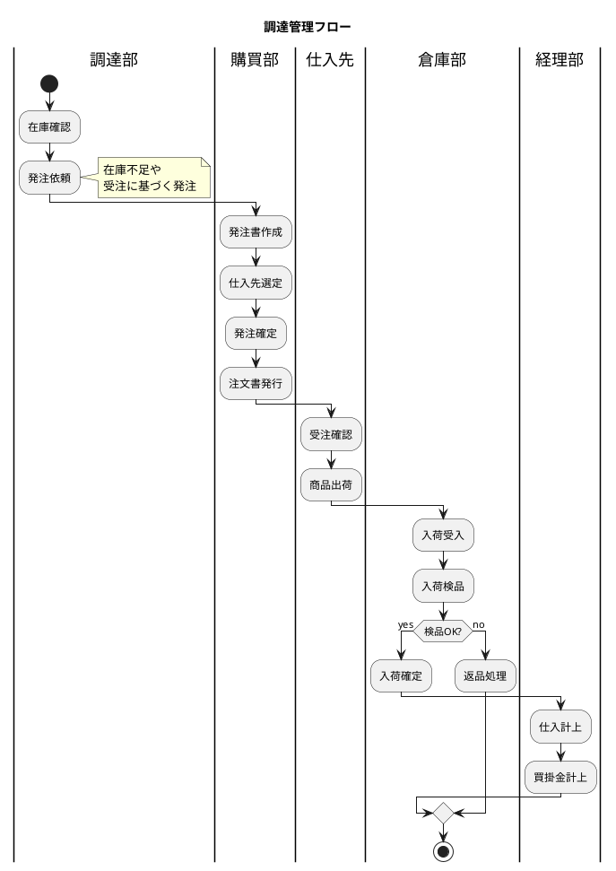

### 調達管理で扱うデータ

| データ | 説明 |
|-------|------|
| **発注データ** | 仕入先への発注情報（発注数量、希望納期） |
| **発注明細** | 発注に含まれる商品明細 |
| **入荷データ** | 仕入先からの入荷情報 |
| **入荷明細** | 入荷に含まれる検品情報 |
| **仕入データ** | 検収確定後の仕入情報（買掛金発生） |

---

## 8.1 発注業務の DB 設計

### 調達の4つのパターン

発注業務には、目的に応じて4つのパターンがあります。

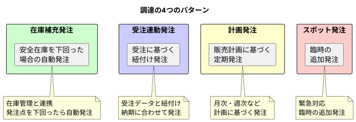

| パターン | 説明 | トリガー |
|---------|------|---------|
| **在庫補充発注** | 安全在庫を下回った場合の自動発注 | 在庫数量 < 発注点 |
| **受注連動発注** | 受注に基づく紐付け発注 | 受注登録時 |
| **計画発注** | 販売計画に基づく定期発注 | 月次・週次計画 |
| **スポット発注** | 臨時の追加発注 | 手動 |

### 発注データ・発注明細データの構造

#### 発注データの ER 図

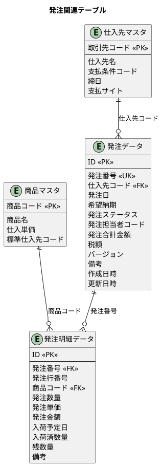

### 発注ステータスの定義

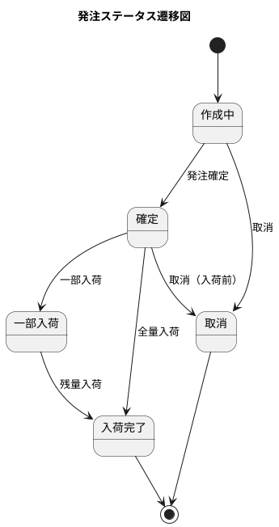

| ステータス | 説明 |
|-----------|------|
| **作成中** | 発注データ作成中、編集可能 |
| **確定** | 発注確定、注文書発行済み |
| **一部入荷** | 一部の商品が入荷済み |
| **入荷完了** | 全商品が入荷済み |
| **取消** | 発注がキャンセルされた状態 |

### 仕入先マスタとの連携

仕入先マスタは、発注先の情報を管理します。

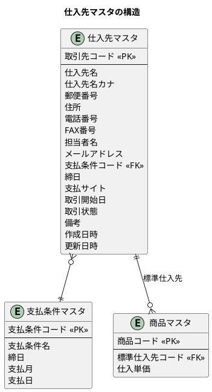

### マイグレーション：発注関連テーブルの作成

<details>
<summary>V013__create_purchase_order_tables.sql</summary>

```sql
-- src/main/resources/db/migration/V013__create_purchase_order_tables.sql

-- 発注ステータス
CREATE TYPE 発注ステータス AS ENUM ('作成中', '確定', '一部入荷', '入荷完了', '取消');

-- 倉庫マスタ
CREATE TABLE "倉庫マスタ" (
    "倉庫コード" VARCHAR(20) PRIMARY KEY,
    "倉庫名" VARCHAR(100) NOT NULL,
    "倉庫名カナ" VARCHAR(200),
    "郵便番号" VARCHAR(10),
    "住所" VARCHAR(200),
    "電話番号" VARCHAR(20),
    "有効フラグ" BOOLEAN DEFAULT TRUE,
    "作成日時" TIMESTAMP DEFAULT CURRENT_TIMESTAMP NOT NULL,
    "作成者名" VARCHAR(50),
    "更新日時" TIMESTAMP DEFAULT CURRENT_TIMESTAMP NOT NULL,
    "更新者名" VARCHAR(50)
);

-- 発注データ
CREATE TABLE "発注データ" (
    "ID" SERIAL PRIMARY KEY,
    "発注番号" VARCHAR(20) UNIQUE NOT NULL,
    "仕入先コード" VARCHAR(20) NOT NULL,
    "仕入先枝番" VARCHAR(10) DEFAULT '00',
    "発注日" DATE NOT NULL,
    "希望納期" DATE,
    "発注ステータス" 発注ステータス DEFAULT '作成中' NOT NULL,
    "発注担当者コード" VARCHAR(20),
    "発注合計金額" DECIMAL(15, 2) DEFAULT 0,
    "税額" DECIMAL(15, 2) DEFAULT 0,
    "備考" TEXT,
    "バージョン" INTEGER DEFAULT 1 NOT NULL,
    "作成日時" TIMESTAMP DEFAULT CURRENT_TIMESTAMP NOT NULL,
    "作成者" VARCHAR(50),
    "更新日時" TIMESTAMP DEFAULT CURRENT_TIMESTAMP NOT NULL,
    "更新者" VARCHAR(50),
    CONSTRAINT "fk_発注_仕入先"
        FOREIGN KEY ("仕入先コード", "仕入先枝番") REFERENCES "仕入先マスタ"("仕入先コード", "仕入先枝番")
);

-- 発注明細データ
CREATE TABLE "発注明細データ" (
    "ID" SERIAL PRIMARY KEY,
    "発注ID" INTEGER NOT NULL,
    "発注行番号" INTEGER NOT NULL,
    "商品コード" VARCHAR(20) NOT NULL,
    "発注数量" DECIMAL(15, 2) NOT NULL,
    "発注単価" DECIMAL(15, 2) NOT NULL,
    "発注金額" DECIMAL(15, 2) NOT NULL,
    "入荷予定日" DATE,
    "入荷済数量" DECIMAL(15, 2) DEFAULT 0,
    "残数量" DECIMAL(15, 2),
    "備考" TEXT,
    "作成日時" TIMESTAMP DEFAULT CURRENT_TIMESTAMP NOT NULL,
    "更新日時" TIMESTAMP DEFAULT CURRENT_TIMESTAMP NOT NULL,
    CONSTRAINT "fk_発注明細_発注"
        FOREIGN KEY ("発注ID") REFERENCES "発注データ"("ID") ON DELETE CASCADE,
    CONSTRAINT "fk_発注明細_商品"
        FOREIGN KEY ("商品コード") REFERENCES "商品マスタ"("商品コード"),
    CONSTRAINT "uk_発注明細_発注_行" UNIQUE ("発注ID", "発注行番号")
);

-- 残数量の自動計算トリガー
CREATE OR REPLACE FUNCTION update_purchase_order_remaining()
RETURNS TRIGGER AS $$
BEGIN
    NEW."残数量" := NEW."発注数量" - COALESCE(NEW."入荷済数量", 0);
    RETURN NEW;
END;
$$ LANGUAGE plpgsql;

CREATE TRIGGER trg_発注明細_残数量更新
    BEFORE INSERT OR UPDATE ON "発注明細データ"
    FOR EACH ROW
    EXECUTE FUNCTION update_purchase_order_remaining();

-- インデックス
CREATE INDEX "idx_発注データ_仕入先コード" ON "発注データ"("仕入先コード");
CREATE INDEX "idx_発注データ_発注日" ON "発注データ"("発注日");
CREATE INDEX "idx_発注データ_ステータス" ON "発注データ"("発注ステータス");
CREATE INDEX "idx_発注明細_商品コード" ON "発注明細データ"("商品コード");

-- テーブルコメント
COMMENT ON TABLE "倉庫マスタ" IS '倉庫情報を管理するテーブル';
COMMENT ON TABLE "発注データ" IS '発注ヘッダ情報を管理するテーブル';
COMMENT ON TABLE "発注明細データ" IS '発注明細情報を管理するテーブル';
COMMENT ON COLUMN "発注データ"."バージョン" IS '楽観ロック用バージョン番号';
```

</details>

### 発注エンティティの実装

<details>
<summary>発注ステータス ENUM</summary>

```java
// src/main/java/com/example/sms/domain/model/purchase/PurchaseOrderStatus.java
package com.example.sms.domain.model.purchase;

import lombok.Getter;
import lombok.RequiredArgsConstructor;

@Getter
@RequiredArgsConstructor
public enum PurchaseOrderStatus {
    DRAFT("作成中"),
    CONFIRMED("確定"),
    PARTIALLY_RECEIVED("一部入荷"),
    COMPLETED("入荷完了"),
    CANCELLED("取消");

    private final String displayName;

    /**
     * 表示名から発注ステータスを取得する.
     *
     * @param displayName 表示名
     * @return 発注ステータス
     */
    public static PurchaseOrderStatus fromDisplayName(String displayName) {
        for (PurchaseOrderStatus status : values()) {
            if (status.displayName.equals(displayName)) {
                return status;
            }
        }
        throw new IllegalArgumentException("不正な発注ステータス: " + displayName);
    }

    /**
     * 確定可能かどうか.
     *
     * @return 確定可能な場合true
     */
    public boolean canConfirm() {
        return this == DRAFT;
    }

    /**
     * 入荷登録可能かどうか.
     *
     * @return 入荷登録可能な場合true
     */
    public boolean canReceive() {
        return this == CONFIRMED || this == PARTIALLY_RECEIVED;
    }

    /**
     * 取消可能かどうか.
     *
     * @return 取消可能な場合true
     */
    public boolean canCancel() {
        return this == DRAFT || this == CONFIRMED;
    }
}
```

</details>

<details>
<summary>発注エンティティ</summary>

```java
// src/main/java/com/example/sms/domain/model/purchase/PurchaseOrder.java
package com.example.sms.domain.model.purchase;

import lombok.AllArgsConstructor;
import lombok.Builder;
import lombok.Data;
import lombok.NoArgsConstructor;

import java.math.BigDecimal;
import java.time.LocalDate;
import java.time.LocalDateTime;
import java.util.ArrayList;
import java.util.List;

@Data
@Builder
@NoArgsConstructor
@AllArgsConstructor
@SuppressWarnings("PMD.RedundantFieldInitializer")
public class PurchaseOrder {
    private Integer id;
    private String purchaseOrderNumber;
    private String supplierCode;
    @Builder.Default
    private String supplierBranchNumber = "00";
    private LocalDate orderDate;
    private LocalDate desiredDeliveryDate;
    @Builder.Default
    private PurchaseOrderStatus status = PurchaseOrderStatus.DRAFT;
    private String purchaserCode;
    @Builder.Default
    private BigDecimal totalAmount = BigDecimal.ZERO;
    @Builder.Default
    private BigDecimal taxAmount = BigDecimal.ZERO;
    private String remarks;
    private LocalDateTime createdAt;
    private String createdBy;
    private LocalDateTime updatedAt;
    private String updatedBy;

    /** 楽観ロック用バージョン. */
    @Builder.Default
    private Integer version = 1;

    @Builder.Default
    private List<PurchaseOrderDetail> details = new ArrayList<>();

    /**
     * 発注合計金額を再計算する
     */
    public void recalculateTotalAmount() {
        if (details != null && !details.isEmpty()) {
            this.totalAmount = details.stream()
                    .map(PurchaseOrderDetail::getOrderAmount)
                    .reduce(BigDecimal.ZERO, BigDecimal::add);
            // 消費税10%
            this.taxAmount = this.totalAmount.multiply(new BigDecimal("0.10"));
        }
    }

    /**
     * 全明細が入荷完了かどうか
     */
    public boolean isAllReceived() {
        if (details == null || details.isEmpty()) {
            return false;
        }
        return details.stream()
                .allMatch(d -> d.getRemainingQuantity().compareTo(BigDecimal.ZERO) == 0);
    }

    /**
     * 一部入荷があるかどうか
     */
    public boolean hasPartialReceipt() {
        if (details == null || details.isEmpty()) {
            return false;
        }
        return details.stream()
                .anyMatch(d -> d.getReceivedQuantity().compareTo(BigDecimal.ZERO) > 0
                        && d.getRemainingQuantity().compareTo(BigDecimal.ZERO) > 0);
    }
}
```

</details>

<details>
<summary>発注明細エンティティ</summary>

```java
// src/main/java/com/example/sales/domain/model/purchase/PurchaseOrderDetail.java
package com.example.sms.domain.model.purchase;

import lombok.Builder;
import lombok.Data;

import java.math.BigDecimal;
import java.time.LocalDate;
import java.time.LocalDateTime;

@Data
@Builder
public class PurchaseOrderDetail {
    private Integer id;
    private String purchaseOrderNumber;
    private Integer lineNumber;
    private String productCode;
    private BigDecimal orderQuantity;
    private BigDecimal unitPrice;
    private BigDecimal orderAmount;
    private LocalDate expectedDeliveryDate;
    private BigDecimal receivedQuantity;
    private BigDecimal remainingQuantity;
    private String remarks;
    private LocalDateTime createdAt;
    private LocalDateTime updatedAt;

    /**
     * 発注金額を計算する
     */
    public void calculateOrderAmount() {
        this.orderAmount = this.orderQuantity.multiply(this.unitPrice);
    }

    /**
     * 残数量を計算する
     */
    public void calculateRemainingQuantity() {
        this.remainingQuantity = this.orderQuantity
                .subtract(this.receivedQuantity != null ? this.receivedQuantity : BigDecimal.ZERO);
    }

    /**
     * 入荷可能数量かどうか
     */
    public boolean canReceive(BigDecimal quantity) {
        return quantity.compareTo(BigDecimal.ZERO) > 0
                && quantity.compareTo(this.remainingQuantity) <= 0;
    }
}
```

</details>

### 発注サービスの実装

<details>
<summary>発注サービス</summary>

```java
// src/main/java/com/example/sales/application/service/PurchaseOrderService.java
package com.example.sms.application.service;

import com.example.sms.application.port.out.*;
import com.example.sms.domain.model.purchase.*;
import lombok.RequiredArgsConstructor;
import org.springframework.stereotype.Service;
import org.springframework.transaction.annotation.Transactional;

import java.math.BigDecimal;
import java.time.LocalDate;
import java.time.format.DateTimeFormatter;
import java.util.ArrayList;
import java.util.List;
import java.util.Optional;

@Service
@RequiredArgsConstructor
public class PurchaseOrderService {

    private final PurchaseOrderRepository purchaseOrderRepository;

    /**
     * 発注番号を生成する
     */
    private String generatePurchaseOrderNumber(LocalDate orderDate) {
        String prefix = "PO-" + orderDate.format(
                DateTimeFormatter.ofPattern("yyyyMM")) + "-";
        Optional<String> latestNumber = purchaseOrderRepository
                .findLatestPurchaseOrderNumber(prefix + "%");

        int sequence = 1;
        if (latestNumber.isPresent()) {
            String latest = latestNumber.get();
            int currentSequence = Integer.parseInt(
                    latest.substring(latest.length() - 4));
            sequence = currentSequence + 1;
        }

        return prefix + String.format("%04d", sequence);
    }

    /**
     * 発注を作成する
     */
    @Transactional
    public PurchaseOrder createPurchaseOrder(PurchaseOrderCreateCommand command) {
        String purchaseOrderNumber = generatePurchaseOrderNumber(command.getOrderDate());

        // 発注ヘッダを作成
        PurchaseOrder purchaseOrder = PurchaseOrder.builder()
                .purchaseOrderNumber(purchaseOrderNumber)
                .supplierCode(command.getSupplierCode())
                .orderDate(command.getOrderDate())
                .desiredDeliveryDate(command.getDesiredDeliveryDate())
                .status(PurchaseOrderStatus.DRAFT)
                .purchaserCode(command.getPurchaserCode())
                .remarks(command.getRemarks())
                .totalAmount(BigDecimal.ZERO)
                .taxAmount(BigDecimal.ZERO)
                .build();

        // 発注明細を作成
        List<PurchaseOrderDetail> details = new ArrayList<>();
        int lineNumber = 0;

        for (var detailCommand : command.getDetails()) {
            lineNumber++;
            BigDecimal orderAmount = detailCommand.getOrderQuantity()
                    .multiply(detailCommand.getUnitPrice());

            PurchaseOrderDetail detail = PurchaseOrderDetail.builder()
                    .purchaseOrderNumber(purchaseOrderNumber)
                    .lineNumber(lineNumber)
                    .productCode(detailCommand.getProductCode())
                    .orderQuantity(detailCommand.getOrderQuantity())
                    .unitPrice(detailCommand.getUnitPrice())
                    .orderAmount(orderAmount)
                    .expectedDeliveryDate(detailCommand.getExpectedDeliveryDate())
                    .receivedQuantity(BigDecimal.ZERO)
                    .remainingQuantity(detailCommand.getOrderQuantity())
                    .remarks(detailCommand.getRemarks())
                    .build();

            details.add(detail);
        }

        purchaseOrder.setDetails(details);
        purchaseOrder.recalculateTotalAmount();

        // データベースに保存
        purchaseOrderRepository.save(purchaseOrder);

        return purchaseOrder;
    }

    /**
     * 発注を確定する
     */
    @Transactional
    public void confirmPurchaseOrder(String purchaseOrderNumber) {
        PurchaseOrder purchaseOrder = findByPurchaseOrderNumber(purchaseOrderNumber)
                .orElseThrow(() -> new IllegalArgumentException(
                        "発注が見つかりません: " + purchaseOrderNumber));

        if (!purchaseOrder.getStatus().canConfirm()) {
            throw new IllegalStateException(
                    "この発注は確定できません。現在のステータス: " +
                    purchaseOrder.getStatus().getDisplayName());
        }

        purchaseOrderRepository.updateStatus(
                purchaseOrderNumber, PurchaseOrderStatus.CONFIRMED);
    }

    /**
     * 発注を取消する
     */
    @Transactional
    public void cancelPurchaseOrder(String purchaseOrderNumber) {
        PurchaseOrder purchaseOrder = findByPurchaseOrderNumber(purchaseOrderNumber)
                .orElseThrow(() -> new IllegalArgumentException(
                        "発注が見つかりません: " + purchaseOrderNumber));

        if (!purchaseOrder.getStatus().canCancel()) {
            throw new IllegalStateException(
                    "この発注は取消できません。現在のステータス: " +
                    purchaseOrder.getStatus().getDisplayName());
        }

        purchaseOrderRepository.updateStatus(
                purchaseOrderNumber, PurchaseOrderStatus.CANCELLED);
    }

    /**
     * 発注番号で検索する
     */
    public Optional<PurchaseOrder> findByPurchaseOrderNumber(String purchaseOrderNumber) {
        return purchaseOrderRepository.findByPurchaseOrderNumber(purchaseOrderNumber);
    }

    /**
     * 未完了の発注を検索する
     */
    public List<PurchaseOrder> findPendingOrders() {
        return purchaseOrderRepository.findPendingOrders();
    }
}
```

</details>

---

## 8.2 入荷・検収業務の DB 設計

### 入荷業務フローの理解

入荷業務は、発注した商品を受け取り、検品して仕入計上する業務です。

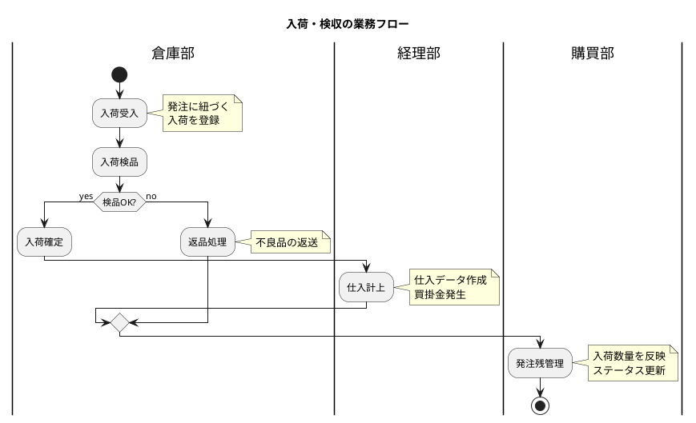

### 入荷データの構造

#### 入荷・仕入データの ER 図

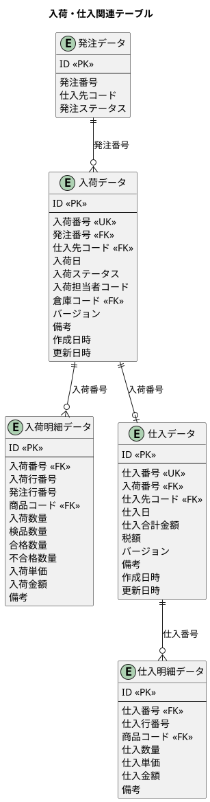

### 入荷ステータスの定義

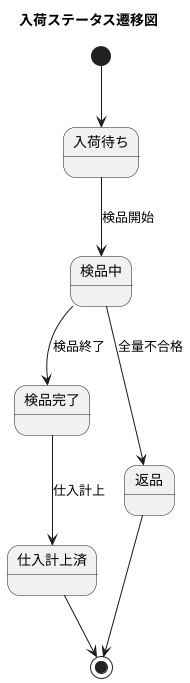

| ステータス | 説明 |
|-----------|------|
| **入荷待ち** | 入荷データ登録済み、検品前 |
| **検品中** | 検品作業中 |
| **検品完了** | 検品完了、仕入計上待ち |
| **仕入計上済** | 仕入データ作成済み |
| **返品** | 全量返品処理 |

### 検収（仕入計上）処理

検収処理では、検品完了後に合格数量分を仕入として計上します。

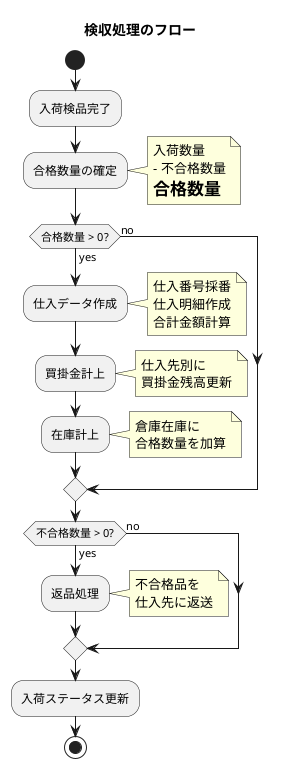

### 諸口品目の扱い

諸口品目（雑品、消耗品など）は、商品マスタに登録せずに直接入力する品目です。

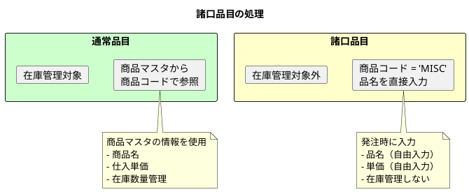

### マイグレーション：入荷・仕入関連テーブルの作成

<details>
<summary>V014__create_receiving_tables.sql</summary>

```sql
-- src/main/resources/db/migration/V014__create_receiving_tables.sql

-- 入荷ステータス
CREATE TYPE 入荷ステータス AS ENUM ('入荷待ち', '検品中', '検品完了', '仕入計上済', '返品');

-- 入荷データ
CREATE TABLE "入荷データ" (
    "ID" SERIAL PRIMARY KEY,
    "入荷番号" VARCHAR(20) UNIQUE NOT NULL,
    "発注ID" INTEGER NOT NULL,
    "仕入先コード" VARCHAR(20) NOT NULL,
    "仕入先枝番" VARCHAR(10) DEFAULT '00',
    "入荷日" DATE NOT NULL,
    "入荷ステータス" 入荷ステータス DEFAULT '入荷待ち' NOT NULL,
    "入荷担当者コード" VARCHAR(20),
    "倉庫コード" VARCHAR(20) NOT NULL,
    "備考" TEXT,
    "バージョン" INTEGER DEFAULT 1 NOT NULL,
    "作成日時" TIMESTAMP DEFAULT CURRENT_TIMESTAMP NOT NULL,
    "作成者" VARCHAR(50),
    "更新日時" TIMESTAMP DEFAULT CURRENT_TIMESTAMP NOT NULL,
    "更新者" VARCHAR(50),
    CONSTRAINT "fk_入荷_発注"
        FOREIGN KEY ("発注ID") REFERENCES "発注データ"("ID"),
    CONSTRAINT "fk_入荷_仕入先"
        FOREIGN KEY ("仕入先コード", "仕入先枝番") REFERENCES "仕入先マスタ"("仕入先コード", "仕入先枝番"),
    CONSTRAINT "fk_入荷_倉庫"
        FOREIGN KEY ("倉庫コード") REFERENCES "倉庫マスタ"("倉庫コード")
);

-- 入荷明細データ
CREATE TABLE "入荷明細データ" (
    "ID" SERIAL PRIMARY KEY,
    "入荷ID" INTEGER NOT NULL,
    "入荷行番号" INTEGER NOT NULL,
    "発注明細ID" INTEGER NOT NULL,
    "商品コード" VARCHAR(20) NOT NULL,
    "入荷数量" DECIMAL(15, 2) NOT NULL,
    "検品数量" DECIMAL(15, 2) DEFAULT 0,
    "合格数量" DECIMAL(15, 2) DEFAULT 0,
    "不合格数量" DECIMAL(15, 2) DEFAULT 0,
    "入荷単価" DECIMAL(15, 2) NOT NULL,
    "入荷金額" DECIMAL(15, 2) NOT NULL,
    "備考" TEXT,
    "作成日時" TIMESTAMP DEFAULT CURRENT_TIMESTAMP NOT NULL,
    "更新日時" TIMESTAMP DEFAULT CURRENT_TIMESTAMP NOT NULL,
    CONSTRAINT "fk_入荷明細_入荷"
        FOREIGN KEY ("入荷ID") REFERENCES "入荷データ"("ID") ON DELETE CASCADE,
    CONSTRAINT "fk_入荷明細_発注明細"
        FOREIGN KEY ("発注明細ID") REFERENCES "発注明細データ"("ID"),
    CONSTRAINT "fk_入荷明細_商品"
        FOREIGN KEY ("商品コード") REFERENCES "商品マスタ"("商品コード"),
    CONSTRAINT "uk_入荷明細_入荷_行" UNIQUE ("入荷ID", "入荷行番号")
);

-- 仕入データ（検収確定後に作成）
CREATE TABLE "仕入データ" (
    "ID" SERIAL PRIMARY KEY,
    "仕入番号" VARCHAR(20) UNIQUE NOT NULL,
    "入荷ID" INTEGER NOT NULL,
    "仕入先コード" VARCHAR(20) NOT NULL,
    "仕入先枝番" VARCHAR(10) DEFAULT '00',
    "仕入日" DATE NOT NULL,
    "仕入合計金額" DECIMAL(15, 2) NOT NULL,
    "税額" DECIMAL(15, 2) NOT NULL,
    "備考" TEXT,
    "バージョン" INTEGER DEFAULT 1 NOT NULL,
    "作成日時" TIMESTAMP DEFAULT CURRENT_TIMESTAMP NOT NULL,
    "作成者" VARCHAR(50),
    "更新日時" TIMESTAMP DEFAULT CURRENT_TIMESTAMP NOT NULL,
    "更新者" VARCHAR(50),
    CONSTRAINT "fk_仕入_入荷"
        FOREIGN KEY ("入荷ID") REFERENCES "入荷データ"("ID"),
    CONSTRAINT "fk_仕入_仕入先"
        FOREIGN KEY ("仕入先コード", "仕入先枝番") REFERENCES "仕入先マスタ"("仕入先コード", "仕入先枝番")
);

-- 仕入明細データ
CREATE TABLE "仕入明細データ" (
    "ID" SERIAL PRIMARY KEY,
    "仕入ID" INTEGER NOT NULL,
    "仕入行番号" INTEGER NOT NULL,
    "商品コード" VARCHAR(20) NOT NULL,
    "仕入数量" DECIMAL(15, 2) NOT NULL,
    "仕入単価" DECIMAL(15, 2) NOT NULL,
    "仕入金額" DECIMAL(15, 2) NOT NULL,
    "備考" TEXT,
    "作成日時" TIMESTAMP DEFAULT CURRENT_TIMESTAMP NOT NULL,
    "更新日時" TIMESTAMP DEFAULT CURRENT_TIMESTAMP NOT NULL,
    CONSTRAINT "fk_仕入明細_仕入"
        FOREIGN KEY ("仕入ID") REFERENCES "仕入データ"("ID") ON DELETE CASCADE,
    CONSTRAINT "fk_仕入明細_商品"
        FOREIGN KEY ("商品コード") REFERENCES "商品マスタ"("商品コード"),
    CONSTRAINT "uk_仕入明細_仕入_行" UNIQUE ("仕入ID", "仕入行番号")
);

-- インデックス
CREATE INDEX "idx_入荷データ_発注ID" ON "入荷データ"("発注ID");
CREATE INDEX "idx_入荷データ_入荷日" ON "入荷データ"("入荷日");
CREATE INDEX "idx_入荷データ_ステータス" ON "入荷データ"("入荷ステータス");
CREATE INDEX "idx_入荷明細_発注明細ID" ON "入荷明細データ"("発注明細ID");
CREATE INDEX "idx_仕入データ_仕入先コード" ON "仕入データ"("仕入先コード");
CREATE INDEX "idx_仕入データ_仕入日" ON "仕入データ"("仕入日");

-- テーブルコメント
COMMENT ON TABLE "入荷データ" IS '入荷ヘッダ情報を管理するテーブル';
COMMENT ON TABLE "入荷明細データ" IS '入荷明細・検品情報を管理するテーブル';
COMMENT ON TABLE "仕入データ" IS '仕入ヘッダ情報を管理するテーブル';
COMMENT ON TABLE "仕入明細データ" IS '仕入明細情報を管理するテーブル';
COMMENT ON COLUMN "入荷データ"."バージョン" IS '楽観ロック用バージョン番号';
COMMENT ON COLUMN "仕入データ"."バージョン" IS '楽観ロック用バージョン番号';
```

</details>

### 入荷エンティティの実装

<details>
<summary>入荷ステータス ENUM</summary>

```java
// src/main/java/com/example/sales/domain/model/purchase/ReceivingStatus.java
package com.example.sms.domain.model.purchase;

import lombok.Getter;
import lombok.RequiredArgsConstructor;

@Getter
@RequiredArgsConstructor
public enum ReceivingStatus {
    WAITING("入荷待ち"),
    INSPECTING("検品中"),
    INSPECTION_COMPLETED("検品完了"),
    PURCHASE_RECORDED("仕入計上済"),
    RETURNED("返品");

    private final String displayName;

    /**
     * 表示名から入荷ステータスを取得する.
     *
     * @param displayName 表示名
     * @return 入荷ステータス
     */
    public static ReceivingStatus fromDisplayName(String displayName) {
        for (ReceivingStatus status : values()) {
            if (status.displayName.equals(displayName)) {
                return status;
            }
        }
        throw new IllegalArgumentException("不正な入荷ステータス: " + displayName);
    }

    /**
     * 検品開始可能かどうか.
     *
     * @return 検品開始可能な場合true
     */
    public boolean canStartInspection() {
        return this == WAITING;
    }

    /**
     * 仕入計上可能かどうか.
     *
     * @return 仕入計上可能な場合true
     */
    public boolean canRecordPurchase() {
        return this == INSPECTION_COMPLETED;
    }
}
```

</details>

<details>
<summary>入荷エンティティ</summary>

```java
// src/main/java/com/example/sales/domain/model/purchase/Receiving.java
package com.example.sms.domain.model.purchase;

import lombok.AllArgsConstructor;
import lombok.Builder;
import lombok.Data;
import lombok.NoArgsConstructor;

import java.time.LocalDate;
import java.time.LocalDateTime;
import java.util.ArrayList;
import java.util.List;

@Data
@Builder
@NoArgsConstructor
@AllArgsConstructor
public class Receiving {
    private Integer id;
    private String receivingNumber;
    private String purchaseOrderNumber;
    private String supplierCode;
    private LocalDate receivingDate;
    private ReceivingStatus status;
    private String receiverCode;
    private String warehouseCode;
    private String remarks;
    private LocalDateTime createdAt;
    private String createdBy;
    private LocalDateTime updatedAt;
    private String updatedBy;

    // 楽観ロック用バージョン
    @Builder.Default
    private Integer version = 1;

    // リレーション
    @Builder.Default
    private List<ReceivingDetail> details = new ArrayList<>();
}
```

</details>

<details>
<summary>入荷明細エンティティ</summary>

```java
// src/main/java/com/example/sales/domain/model/purchase/ReceivingDetail.java
package com.example.sms.domain.model.purchase;

import lombok.Builder;
import lombok.Data;

import java.math.BigDecimal;
import java.time.LocalDateTime;

@Data
@Builder
public class ReceivingDetail {
    private Integer id;
    private String receivingNumber;
    private Integer lineNumber;
    private Integer purchaseOrderLineNumber;
    private String productCode;
    private BigDecimal receivingQuantity;
    private BigDecimal inspectedQuantity;
    private BigDecimal acceptedQuantity;
    private BigDecimal rejectedQuantity;
    private BigDecimal unitPrice;
    private BigDecimal amount;
    private String remarks;
    private LocalDateTime createdAt;
    private LocalDateTime updatedAt;

    /**
     * 検品を完了する
     */
    public void completeInspection(BigDecimal acceptedQty, BigDecimal rejectedQty) {
        this.inspectedQuantity = acceptedQty.add(rejectedQty);
        this.acceptedQuantity = acceptedQty;
        this.rejectedQuantity = rejectedQty;
    }
}
```

</details>

<details>
<summary>仕入エンティティ</summary>

```java
// src/main/java/com/example/sales/domain/model/purchase/Purchase.java
package com.example.sms.domain.model.purchase;

import lombok.AllArgsConstructor;
import lombok.Builder;
import lombok.Data;
import lombok.NoArgsConstructor;

import java.math.BigDecimal;
import java.time.LocalDate;
import java.time.LocalDateTime;
import java.util.ArrayList;
import java.util.List;

@Data
@Builder
@NoArgsConstructor
@AllArgsConstructor
public class Purchase {
    private Integer id;
    private String purchaseNumber;
    private String receivingNumber;
    private String supplierCode;
    private LocalDate purchaseDate;
    private BigDecimal totalAmount;
    private BigDecimal taxAmount;
    private String remarks;
    private LocalDateTime createdAt;
    private String createdBy;
    private LocalDateTime updatedAt;
    private String updatedBy;

    // 楽観ロック用バージョン
    @Builder.Default
    private Integer version = 1;

    // リレーション
    @Builder.Default
    private List<PurchaseDetail> details = new ArrayList<>();

    /**
     * 仕入合計金額を再計算
     */
    public void recalculateTotalAmount() {
        if (details != null && !details.isEmpty()) {
            this.totalAmount = details.stream()
                    .map(PurchaseDetail::getPurchaseAmount)
                    .reduce(BigDecimal.ZERO, BigDecimal::add);
            this.taxAmount = this.totalAmount.multiply(new BigDecimal("0.10"));
        }
    }
}
```

</details>

### 入荷・仕入サービスの実装

<details>
<summary>入荷サービス</summary>

```java
// src/main/java/com/example/sales/application/service/ReceivingService.java
package com.example.sms.application.service;

import com.example.sms.application.port.out.*;
import com.example.sms.domain.model.purchase.*;
import lombok.RequiredArgsConstructor;
import org.springframework.stereotype.Service;
import org.springframework.transaction.annotation.Transactional;

import java.math.BigDecimal;
import java.time.LocalDate;
import java.time.format.DateTimeFormatter;
import java.util.ArrayList;
import java.util.List;
import java.util.Optional;

@Service
@RequiredArgsConstructor
public class ReceivingService {

    private final ReceivingRepository receivingRepository;
    private final PurchaseOrderRepository purchaseOrderRepository;
    private final PurchaseRepository purchaseRepository;
    private final InventoryRepository inventoryRepository;
    private final AccountsPayableRepository accountsPayableRepository;

    /**
     * 入荷を登録する
     */
    @Transactional
    public Receiving createReceiving(ReceivingCreateCommand command) {
        // 発注の存在確認
        PurchaseOrder purchaseOrder = purchaseOrderRepository
                .findByPurchaseOrderNumber(command.getPurchaseOrderNumber())
                .orElseThrow(() -> new IllegalArgumentException(
                        "発注が見つかりません: " + command.getPurchaseOrderNumber()));

        if (!purchaseOrder.getStatus().canReceive()) {
            throw new IllegalStateException(
                    "この発注は入荷登録できません。現在のステータス: " +
                    purchaseOrder.getStatus().getDisplayName());
        }

        String receivingNumber = generateReceivingNumber(command.getReceivingDate());

        Receiving receiving = Receiving.builder()
                .receivingNumber(receivingNumber)
                .purchaseOrderNumber(command.getPurchaseOrderNumber())
                .supplierCode(purchaseOrder.getSupplierCode())
                .receivingDate(command.getReceivingDate())
                .status(ReceivingStatus.WAITING)
                .receiverCode(command.getReceiverCode())
                .warehouseCode(command.getWarehouseCode())
                .remarks(command.getRemarks())
                .build();

        List<ReceivingDetail> details = new ArrayList<>();
        int lineNumber = 0;

        for (var detailCommand : command.getDetails()) {
            lineNumber++;
            BigDecimal amount = detailCommand.getReceivingQuantity()
                    .multiply(detailCommand.getUnitPrice());

            ReceivingDetail detail = ReceivingDetail.builder()
                    .receivingNumber(receivingNumber)
                    .lineNumber(lineNumber)
                    .purchaseOrderLineNumber(detailCommand.getPurchaseOrderLineNumber())
                    .productCode(detailCommand.getProductCode())
                    .receivingQuantity(detailCommand.getReceivingQuantity())
                    .inspectedQuantity(BigDecimal.ZERO)
                    .acceptedQuantity(BigDecimal.ZERO)
                    .rejectedQuantity(BigDecimal.ZERO)
                    .unitPrice(detailCommand.getUnitPrice())
                    .amount(amount)
                    .remarks(detailCommand.getRemarks())
                    .build();

            details.add(detail);
        }

        receiving.setDetails(details);
        receivingRepository.save(receiving);

        return receiving;
    }

    /**
     * 検品を完了する
     */
    @Transactional
    public void completeInspection(String receivingNumber,
                                    List<InspectionResult> results) {
        Receiving receiving = findByReceivingNumber(receivingNumber)
                .orElseThrow(() -> new IllegalArgumentException(
                        "入荷が見つかりません: " + receivingNumber));

        for (InspectionResult result : results) {
            receivingRepository.updateInspectionResult(
                    receivingNumber,
                    result.getLineNumber(),
                    result.getAcceptedQuantity(),
                    result.getRejectedQuantity()
            );
        }

        receivingRepository.updateStatus(
                receivingNumber, ReceivingStatus.INSPECTION_COMPLETED);
    }

    /**
     * 仕入計上する
     */
    @Transactional
    public Purchase recordPurchase(String receivingNumber) {
        Receiving receiving = findByReceivingNumber(receivingNumber)
                .orElseThrow(() -> new IllegalArgumentException(
                        "入荷が見つかりません: " + receivingNumber));

        if (!receiving.getStatus().canRecordPurchase()) {
            throw new IllegalStateException(
                    "この入荷は仕入計上できません。現在のステータス: " +
                    receiving.getStatus().getDisplayName());
        }

        String purchaseNumber = generatePurchaseNumber(LocalDate.now());

        // 仕入データを作成
        Purchase purchase = Purchase.builder()
                .purchaseNumber(purchaseNumber)
                .receivingNumber(receivingNumber)
                .supplierCode(receiving.getSupplierCode())
                .purchaseDate(LocalDate.now())
                .build();

        List<PurchaseDetail> purchaseDetails = new ArrayList<>();
        int lineNumber = 0;

        for (ReceivingDetail receivingDetail : receiving.getDetails()) {
            if (receivingDetail.getAcceptedQuantity().compareTo(BigDecimal.ZERO) > 0) {
                lineNumber++;
                BigDecimal purchaseAmount = receivingDetail.getAcceptedQuantity()
                        .multiply(receivingDetail.getUnitPrice());

                PurchaseDetail purchaseDetail = PurchaseDetail.builder()
                        .purchaseNumber(purchaseNumber)
                        .lineNumber(lineNumber)
                        .productCode(receivingDetail.getProductCode())
                        .purchaseQuantity(receivingDetail.getAcceptedQuantity())
                        .unitPrice(receivingDetail.getUnitPrice())
                        .purchaseAmount(purchaseAmount)
                        .build();

                purchaseDetails.add(purchaseDetail);

                // 在庫を増加
                inventoryRepository.increaseQuantity(
                        receiving.getWarehouseCode(),
                        receivingDetail.getProductCode(),
                        receivingDetail.getAcceptedQuantity()
                );
            }
        }

        purchase.setDetails(purchaseDetails);
        purchase.recalculateTotalAmount();
        purchaseRepository.save(purchase);

        // 発注残を更新
        updatePurchaseOrderReceivedQuantity(receiving);

        // 入荷ステータスを更新
        receivingRepository.updateStatus(
                receivingNumber, ReceivingStatus.PURCHASE_RECORDED);

        // 買掛金を計上
        accountsPayableRepository.increaseBalance(
                receiving.getSupplierCode(),
                purchase.getTotalAmount().add(purchase.getTaxAmount())
        );

        return purchase;
    }

    private void updatePurchaseOrderReceivedQuantity(Receiving receiving) {
        for (ReceivingDetail detail : receiving.getDetails()) {
            purchaseOrderRepository.updateReceivedQuantity(
                    receiving.getPurchaseOrderNumber(),
                    detail.getPurchaseOrderLineNumber(),
                    detail.getAcceptedQuantity()
            );
        }

        // 発注のステータスを更新
        PurchaseOrder purchaseOrder = purchaseOrderRepository
                .findByPurchaseOrderNumber(receiving.getPurchaseOrderNumber())
                .orElseThrow();

        if (purchaseOrder.isAllReceived()) {
            purchaseOrderRepository.updateStatus(
                    receiving.getPurchaseOrderNumber(),
                    PurchaseOrderStatus.COMPLETED
            );
        } else if (purchaseOrder.hasPartialReceipt()) {
            purchaseOrderRepository.updateStatus(
                    receiving.getPurchaseOrderNumber(),
                    PurchaseOrderStatus.PARTIALLY_RECEIVED
            );
        }
    }

    public Optional<Receiving> findByReceivingNumber(String receivingNumber) {
        return receivingRepository.findByReceivingNumber(receivingNumber);
    }

    private String generateReceivingNumber(LocalDate receivingDate) {
        String prefix = "RCV-" + receivingDate.format(
                DateTimeFormatter.ofPattern("yyyyMM")) + "-";
        Optional<String> latestNumber = receivingRepository
                .findLatestReceivingNumber(prefix + "%");

        int sequence = 1;
        if (latestNumber.isPresent()) {
            String latest = latestNumber.get();
            int currentSequence = Integer.parseInt(
                    latest.substring(latest.length() - 4));
            sequence = currentSequence + 1;
        }

        return prefix + String.format("%04d", sequence);
    }

    private String generatePurchaseNumber(LocalDate purchaseDate) {
        String prefix = "PUR-" + purchaseDate.format(
                DateTimeFormatter.ofPattern("yyyyMM")) + "-";
        Optional<String> latestNumber = purchaseRepository
                .findLatestPurchaseNumber(prefix + "%");

        int sequence = 1;
        if (latestNumber.isPresent()) {
            String latest = latestNumber.get();
            int currentSequence = Integer.parseInt(
                    latest.substring(latest.length() - 4));
            sequence = currentSequence + 1;
        }

        return prefix + String.format("%04d", sequence);
    }
}
```

</details>

---

## 8.3 リレーションと楽観ロックの設計

### N+1 問題とその解決

発注データは、発注（ヘッダ）→ 発注明細の2層構造を持ちます。入荷データも入荷 → 入荷明細の親子関係があります。これらのデータを効率的に取得するための設計を行います。

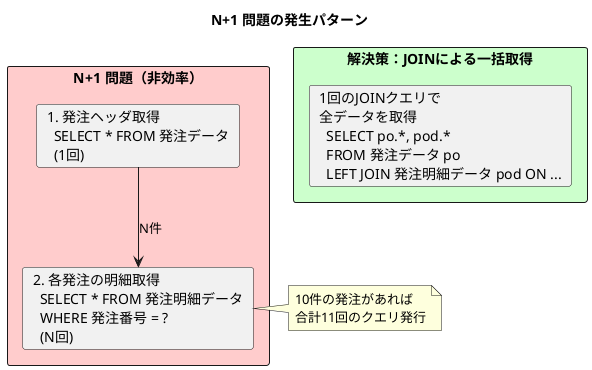

### MyBatis ネストした ResultMap による関連付け

<details>
<summary>発注データのリレーション設定（PurchaseOrderMapper.xml）</summary>

```xml
<?xml version="1.0" encoding="UTF-8" ?>
<!DOCTYPE mapper
        PUBLIC "-//mybatis.org//DTD Mapper 3.0//EN"
        "http://mybatis.org/dtd/mybatis-3-mapper.dtd">
<mapper namespace="com.example.sms.infrastructure.out.persistence.mapper.PurchaseOrderMapper">

    <!-- 発注（ヘッダ）の ResultMap -->
    <resultMap id="PurchaseOrderWithDetailsResultMap"
               type="com.example.sms.domain.model.purchase.PurchaseOrder">
        <id property="id" column="po_id"/>
        <result property="purchaseOrderNumber" column="po_発注番号"/>
        <result property="supplierCode" column="po_仕入先コード"/>
        <result property="orderDate" column="po_発注日"/>
        <result property="desiredDeliveryDate" column="po_希望納期"/>
        <result property="status" column="po_発注ステータス"
                typeHandler="com.example.sms.infrastructure.out.persistence.typehandler.PurchaseOrderStatusTypeHandler"/>
        <result property="purchaserCode" column="po_発注担当者コード"/>
        <result property="totalAmount" column="po_発注合計金額"/>
        <result property="taxAmount" column="po_税額"/>
        <result property="remarks" column="po_備考"/>
        <result property="version" column="po_バージョン"/>
        <result property="createdAt" column="po_作成日時"/>
        <result property="updatedAt" column="po_更新日時"/>
        <!-- 発注明細との1:N関連 -->
        <collection property="details"
                    ofType="com.example.sms.domain.model.purchase.PurchaseOrderDetail"
                    resultMap="PurchaseOrderDetailNestedResultMap"/>
    </resultMap>

    <!-- 発注明細のネスト ResultMap -->
    <resultMap id="PurchaseOrderDetailNestedResultMap"
               type="com.example.sms.domain.model.purchase.PurchaseOrderDetail">
        <id property="id" column="pod_id"/>
        <result property="purchaseOrderNumber" column="pod_発注番号"/>
        <result property="lineNumber" column="pod_発注行番号"/>
        <result property="productCode" column="pod_商品コード"/>
        <result property="orderQuantity" column="pod_発注数量"/>
        <result property="unitPrice" column="pod_発注単価"/>
        <result property="orderAmount" column="pod_発注金額"/>
        <result property="expectedDeliveryDate" column="pod_入荷予定日"/>
        <result property="receivedQuantity" column="pod_入荷済数量"/>
        <result property="remainingQuantity" column="pod_残数量"/>
        <result property="remarks" column="pod_備考"/>
    </resultMap>

    <!-- JOIN による一括取得クエリ -->
    <select id="findWithDetailsByPurchaseOrderNumber"
            resultMap="PurchaseOrderWithDetailsResultMap">
        SELECT
            po."ID" AS po_id,
            po."発注番号" AS po_発注番号,
            po."仕入先コード" AS po_仕入先コード,
            po."発注日" AS po_発注日,
            po."希望納期" AS po_希望納期,
            po."発注ステータス" AS po_発注ステータス,
            po."発注担当者コード" AS po_発注担当者コード,
            po."発注合計金額" AS po_発注合計金額,
            po."税額" AS po_税額,
            po."備考" AS po_備考,
            po."バージョン" AS po_バージョン,
            po."作成日時" AS po_作成日時,
            po."更新日時" AS po_更新日時,
            pod."ID" AS pod_id,
            pod."発注番号" AS pod_発注番号,
            pod."発注行番号" AS pod_発注行番号,
            pod."商品コード" AS pod_商品コード,
            pod."発注数量" AS pod_発注数量,
            pod."発注単価" AS pod_発注単価,
            pod."発注金額" AS pod_発注金額,
            pod."入荷予定日" AS pod_入荷予定日,
            pod."入荷済数量" AS pod_入荷済数量,
            pod."残数量" AS pod_残数量,
            pod."備考" AS pod_備考
        FROM "発注データ" po
        LEFT JOIN "発注明細データ" pod
            ON po."発注番号" = pod."発注番号"
        WHERE po."発注番号" = #{purchaseOrderNumber}
        ORDER BY pod."発注行番号"
    </select>

</mapper>
```

</details>

### リレーション設定のポイント

| 設定項目 | 説明 |
|---------|------|
| `<collection>` | 1:N 関連のマッピング |
| `<id>` | 主キーの識別（MyBatis が重複排除に使用） |
| `resultMap` | ネストした ResultMap の参照 |
| エイリアス（AS） | カラム名の重複を避けるためのプレフィックス |
| `ORDER BY` | コレクションの順序を保証 |

### 楽観ロック（Optimistic Locking）の実装

複数ユーザーが同時に発注データや入荷データを編集する場合、データの整合性を保つために楽観ロックを実装します。

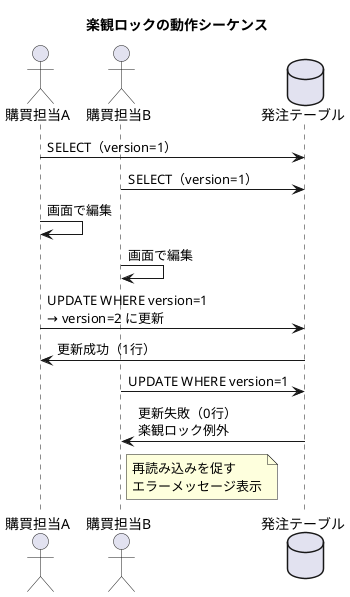

### バージョンカラムによる同時更新制御

<details>
<summary>楽観ロック対応の MyBatis Mapper</summary>

```xml
<!-- 楽観ロック対応の更新（バージョンチェック付き） -->
<update id="updateWithOptimisticLock"
        parameterType="com.example.sms.domain.model.purchase.PurchaseOrder">
    UPDATE "発注データ"
    SET
        "仕入先コード" = #{supplierCode},
        "発注日" = #{orderDate},
        "希望納期" = #{desiredDeliveryDate},
        "発注ステータス" = #{status,
            typeHandler=com.example.sms.infrastructure.out.persistence.typehandler.PurchaseOrderStatusTypeHandler}::発注ステータス,
        "発注担当者コード" = #{purchaserCode},
        "発注合計金額" = #{totalAmount},
        "税額" = #{taxAmount},
        "備考" = #{remarks},
        "更新日時" = CURRENT_TIMESTAMP,
        "バージョン" = "バージョン" + 1
    WHERE "発注番号" = #{purchaseOrderNumber}
    AND "バージョン" = #{version}
</update>

<!-- 楽観ロック対応の削除 -->
<delete id="deleteWithOptimisticLock">
    DELETE FROM "発注データ"
    WHERE "発注番号" = #{purchaseOrderNumber}
    AND "バージョン" = #{version}
</delete>
```

</details>

<details>
<summary>Repository 実装：楽観ロック対応</summary>

```java
// src/main/java/com/example/sms/infrastructure/out/persistence/repository/PurchaseOrderRepositoryImpl.java
package com.example.sms.infrastructure.out.persistence.repository;

import com.example.sms.application.port.out.PurchaseOrderRepository;
import com.example.sms.domain.exception.OptimisticLockException;
import com.example.sms.domain.model.purchase.PurchaseOrder;
import com.example.sms.domain.model.purchase.PurchaseOrderDetail;
import com.example.sms.infrastructure.out.persistence.mapper.PurchaseOrderMapper;
import lombok.RequiredArgsConstructor;
import org.springframework.stereotype.Repository;
import org.springframework.transaction.annotation.Transactional;

import java.util.Optional;

/**
 * 発注リポジトリ実装.
 */
@Repository
@RequiredArgsConstructor
public class PurchaseOrderRepositoryImpl implements PurchaseOrderRepository {

    private final PurchaseOrderMapper purchaseOrderMapper;

    @Override
    public void save(PurchaseOrder purchaseOrder) {
        purchaseOrderMapper.insertHeader(purchaseOrder);
        if (purchaseOrder.getDetails() != null) {
            for (PurchaseOrderDetail detail : purchaseOrder.getDetails()) {
                detail.setPurchaseOrderId(purchaseOrder.getId());
                purchaseOrderMapper.insertDetail(detail);
            }
        }
    }

    @Override
    public Optional<PurchaseOrder> findByPurchaseOrderNumber(String purchaseOrderNumber) {
        return purchaseOrderMapper.findByPurchaseOrderNumber(purchaseOrderNumber);
    }

    @Override
    public Optional<PurchaseOrder> findWithDetailsByPurchaseOrderNumber(String purchaseOrderNumber) {
        return Optional.ofNullable(purchaseOrderMapper.findWithDetailsByPurchaseOrderNumber(purchaseOrderNumber));
    }

    /**
     * 楽観ロック対応の更新.
     * @throws OptimisticLockException 他のユーザーによって更新された場合
     */
    @Override
    @Transactional
    public void update(PurchaseOrder purchaseOrder) {
        int updatedCount = purchaseOrderMapper.updateWithOptimisticLock(purchaseOrder);

        if (updatedCount == 0) {
            // バージョン不一致または削除済み
            Integer currentVersion = purchaseOrderMapper.findVersionById(purchaseOrder.getId());
            if (currentVersion == null) {
                throw new OptimisticLockException("発注", purchaseOrder.getId());
            } else {
                throw new OptimisticLockException("発注", purchaseOrder.getId(),
                        purchaseOrder.getVersion(), currentVersion);
            }
        }

        purchaseOrderMapper.deleteDetailsByPurchaseOrderId(purchaseOrder.getId());
        if (purchaseOrder.getDetails() != null) {
            for (PurchaseOrderDetail detail : purchaseOrder.getDetails()) {
                detail.setPurchaseOrderId(purchaseOrder.getId());
                purchaseOrderMapper.insertDetail(detail);
            }
        }
    }

    @Override
    public void deleteById(Integer id) {
        purchaseOrderMapper.deleteById(id);
    }

    @Override
    public void deleteAll() {
        purchaseOrderMapper.deleteAll();
    }
}
```

</details>

### 楽観ロックのテスト

<details>
<summary>楽観ロックのテストコード</summary>

```java
@Nested
@DisplayName("楽観ロック")
class OptimisticLocking {

    @Test
    @DisplayName("同じバージョンで更新できる")
    void canUpdateWithSameVersion() {
        var purchaseOrder = createPurchaseOrder("PO-2025-0001", LocalDate.of(2025, 1, 15));
        purchaseOrderRepository.save(purchaseOrder);

        var fetched = purchaseOrderRepository.findByPurchaseOrderNumber("PO-2025-0001").get();
        fetched.setStatus(PurchaseOrderStatus.CONFIRMED);
        purchaseOrderRepository.update(fetched);

        var updated = purchaseOrderRepository.findByPurchaseOrderNumber("PO-2025-0001").get();
        assertThat(updated.getStatus()).isEqualTo(PurchaseOrderStatus.CONFIRMED);
        assertThat(updated.getVersion()).isEqualTo(2);
    }

    @Test
    @DisplayName("異なるバージョンで更新すると楽観ロック例外が発生する")
    void throwsExceptionWhenVersionMismatch() {
        var purchaseOrder = createPurchaseOrder("PO-2025-0002", LocalDate.of(2025, 1, 15));
        purchaseOrderRepository.save(purchaseOrder);

        var poA = purchaseOrderRepository.findByPurchaseOrderNumber("PO-2025-0002").get();
        var poB = purchaseOrderRepository.findByPurchaseOrderNumber("PO-2025-0002").get();

        poA.setStatus(PurchaseOrderStatus.CONFIRMED);
        purchaseOrderRepository.update(poA);

        poB.setStatus(PurchaseOrderStatus.CANCELLED);
        assertThatThrownBy(() -> purchaseOrderRepository.update(poB))
                .isInstanceOf(OptimisticLockException.class)
                .hasMessageContaining("他のユーザーによって更新されています");
    }

    @Test
    @DisplayName("削除されたエンティティを更新すると楽観ロック例外が発生する")
    void throwsExceptionWhenEntityDeleted() {
        var purchaseOrder = createPurchaseOrder("PO-2025-0003", LocalDate.of(2025, 1, 15));
        purchaseOrderRepository.save(purchaseOrder);

        var fetched = purchaseOrderRepository.findByPurchaseOrderNumber("PO-2025-0003").get();
        purchaseOrderRepository.deleteById(fetched.getId());

        fetched.setStatus(PurchaseOrderStatus.CONFIRMED);
        assertThatThrownBy(() -> purchaseOrderRepository.update(fetched))
                .isInstanceOf(OptimisticLockException.class)
                .hasMessageContaining("既に削除されています");
    }
}
```

</details>

### 楽観ロックのベストプラクティス

| ポイント | 説明 |
|---------|------|
| **バージョンカラム** | INTEGER 型で十分（オーバーフローは現実的に発生しない） |
| **WHERE 条件** | 必ず `AND "バージョン" = #{version}` を含める |
| **インクリメント** | `"バージョン" = "バージョン" + 1` でアトミックに更新 |
| **例外処理** | 更新件数が0の場合は楽観ロック例外をスロー |
| **エラーメッセージ** | ユーザーにわかりやすいメッセージで再読み込みを促す |

---

## 第8章のまとめ

本章では、調達管理の核心部分である発注・入荷・仕入処理について学びました。

### 学んだこと

1. **調達パターンの理解**
   - 在庫補充発注、受注連動発注、計画発注、スポット発注

2. **発注データの構造**
   - ヘッダ・明細構造
   - 発注ステータス管理
   - 仕入先マスタとの連携

3. **入荷・検収処理**
   - 入荷検品のフロー
   - 合格/不合格数量の管理
   - 仕入計上と買掛金発生

4. **諸口品目の扱い**
   - 商品マスタに登録しない品目の処理

5. **リレーションと楽観ロック**
   - N+1 問題の回避
   - 同時更新の競合制御

### 調達管理の ER 図（全体像）

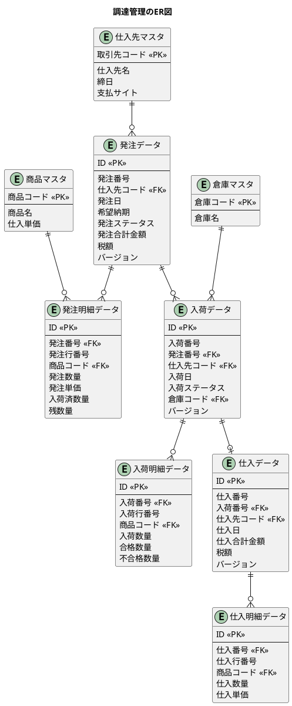

### 次章の予告

第9章では、在庫管理の設計に進みます。倉庫別・商品別の在庫管理、引当処理、棚卸業務のデータベース設計と実装を行います。

---

[← 第7章：債権管理の設計](./chapter07.md) | [第9章：在庫管理の設計 →](./chapter09.md)
