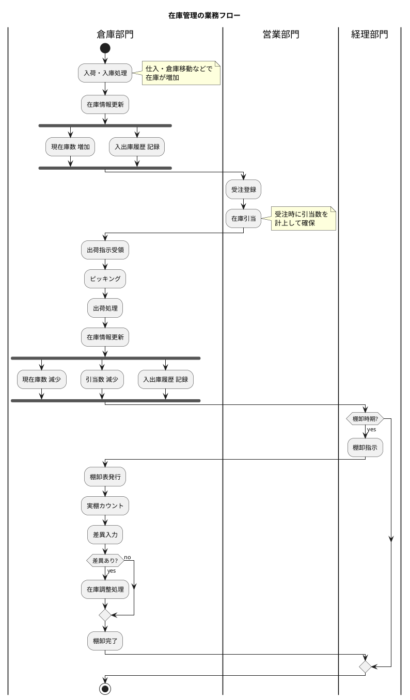
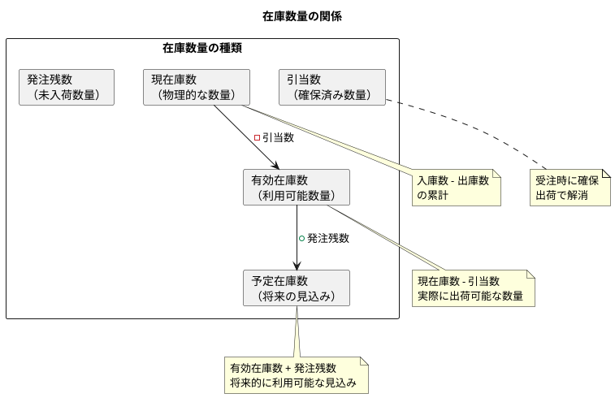
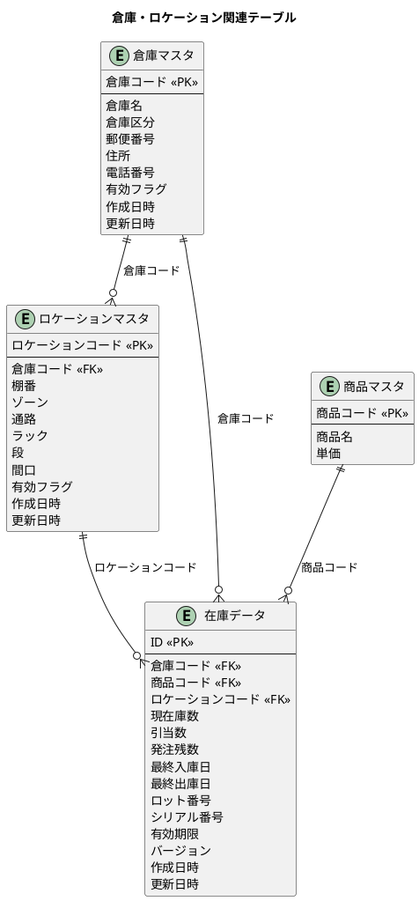
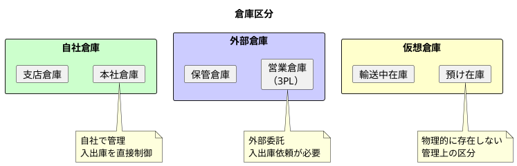
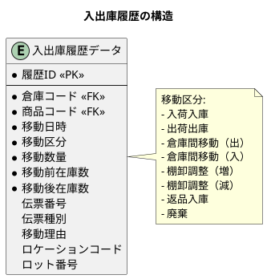
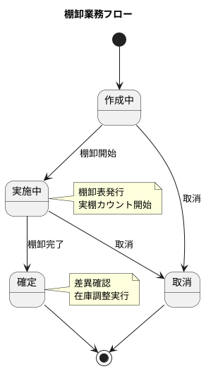
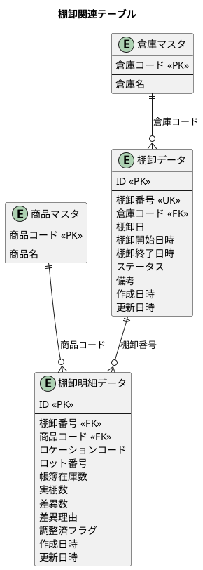
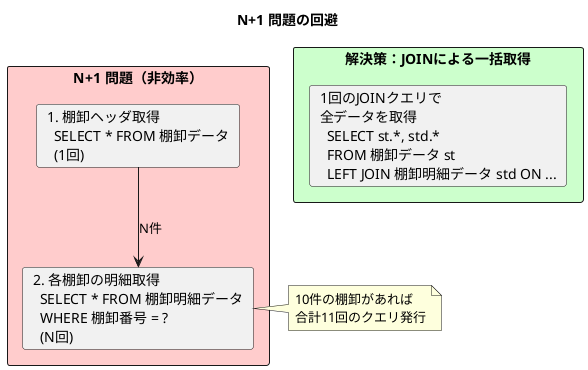
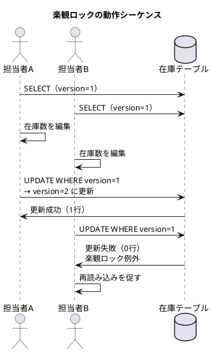
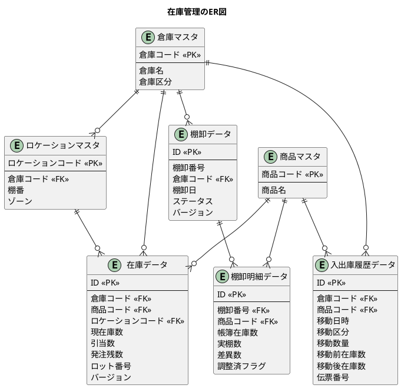

# 第9章：在庫管理の設計

販売管理システムにおいて、在庫管理は商品の物理的な状態を追跡し、適正在庫を維持するための重要な機能です。本章では、倉庫別・商品別の在庫管理、引当処理、入出庫履歴、棚卸業務のデータベース設計と実装を行います。

## 在庫管理の全体像

在庫管理は「入庫 → 在庫保管 → 引当 → 出庫」という一連のフローで構成されます。



### 在庫管理で扱うデータ

| データ | 説明 |
|-------|------|
| **在庫データ** | 倉庫×商品の現在の在庫状態 |
| **入出庫履歴** | 在庫の増減を時系列で記録 |
| **棚卸データ** | 棚卸作業の管理情報 |
| **棚卸明細** | 商品ごとの帳簿在庫と実棚数 |

---

## 9.1 在庫情報の DB 設計

### 在庫数量の種類

在庫管理では「倉庫コード × 商品コード」の組み合わせで在庫を管理します。



| 数量種別 | 説明 | 計算式 |
|---------|------|--------|
| **現在庫数** | 物理的に倉庫にある数量 | 入庫数 - 出庫数 |
| **引当数** | 受注等で確保済みの数量 | 受注引当の合計 |
| **有効在庫数** | 実際に利用可能な数量 | 現在庫数 - 引当数 |
| **発注残数** | 発注済みで未入荷の数量 | 発注数 - 入荷数 |
| **予定在庫数** | 将来的に利用可能な見込み | 有効在庫数 + 発注残数 |

### 倉庫マスタの設計



### 倉庫区分の定義



| 倉庫区分 | 説明 |
|---------|------|
| **自社** | 自社所有・管理の倉庫 |
| **外部** | 外部委託（3PL）の倉庫 |
| **仮想** | 輸送中、預け在庫など |

### マイグレーション：倉庫・在庫関連テーブルの作成

<details>
<summary>V013__create_inventory_tables.sql</summary>

```sql
-- src/main/resources/db/migration/V013__create_inventory_tables.sql

-- 倉庫区分
CREATE TYPE 倉庫区分 AS ENUM ('自社', '外部', '仮想');

-- 倉庫マスタ
CREATE TABLE "倉庫マスタ" (
    "倉庫コード" VARCHAR(20) PRIMARY KEY,
    "倉庫名" VARCHAR(100) NOT NULL,
    "倉庫区分" 倉庫区分 DEFAULT '自社' NOT NULL,
    "郵便番号" VARCHAR(10),
    "住所" VARCHAR(200),
    "電話番号" VARCHAR(20),
    "有効フラグ" BOOLEAN DEFAULT true NOT NULL,
    "作成日時" TIMESTAMP DEFAULT CURRENT_TIMESTAMP NOT NULL,
    "作成者" VARCHAR(50),
    "更新日時" TIMESTAMP DEFAULT CURRENT_TIMESTAMP NOT NULL,
    "更新者" VARCHAR(50)
);

-- ロケーションマスタ
CREATE TABLE "ロケーションマスタ" (
    "ロケーションコード" VARCHAR(20) PRIMARY KEY,
    "倉庫コード" VARCHAR(20) NOT NULL,
    "棚番" VARCHAR(20) NOT NULL,
    "ゾーン" VARCHAR(10),
    "通路" VARCHAR(10),
    "ラック" VARCHAR(10),
    "段" VARCHAR(10),
    "間口" VARCHAR(10),
    "有効フラグ" BOOLEAN DEFAULT true NOT NULL,
    "作成日時" TIMESTAMP DEFAULT CURRENT_TIMESTAMP NOT NULL,
    "作成者" VARCHAR(50),
    "更新日時" TIMESTAMP DEFAULT CURRENT_TIMESTAMP NOT NULL,
    "更新者" VARCHAR(50),
    CONSTRAINT "fk_ロケーション_倉庫"
        FOREIGN KEY ("倉庫コード") REFERENCES "倉庫マスタ"("倉庫コード"),
    UNIQUE ("倉庫コード", "棚番")
);

-- 在庫データ（倉庫 × 商品）
CREATE TABLE "在庫データ" (
    "ID" SERIAL PRIMARY KEY,
    "倉庫コード" VARCHAR(20) NOT NULL,
    "商品コード" VARCHAR(20) NOT NULL,
    "ロケーションコード" VARCHAR(20),
    "現在庫数" DECIMAL(15, 2) DEFAULT 0 NOT NULL,
    "引当数" DECIMAL(15, 2) DEFAULT 0 NOT NULL,
    "発注残数" DECIMAL(15, 2) DEFAULT 0 NOT NULL,
    "最終入庫日" DATE,
    "最終出庫日" DATE,
    "ロット番号" VARCHAR(50),
    "シリアル番号" VARCHAR(50),
    "有効期限" DATE,
    "バージョン" INTEGER DEFAULT 1 NOT NULL,
    "作成日時" TIMESTAMP DEFAULT CURRENT_TIMESTAMP NOT NULL,
    "作成者" VARCHAR(50),
    "更新日時" TIMESTAMP DEFAULT CURRENT_TIMESTAMP NOT NULL,
    "更新者" VARCHAR(50),
    CONSTRAINT "fk_在庫_倉庫"
        FOREIGN KEY ("倉庫コード") REFERENCES "倉庫マスタ"("倉庫コード"),
    CONSTRAINT "fk_在庫_商品"
        FOREIGN KEY ("商品コード") REFERENCES "商品マスタ"("商品コード"),
    CONSTRAINT "fk_在庫_ロケーション"
        FOREIGN KEY ("ロケーションコード") REFERENCES "ロケーションマスタ"("ロケーションコード"),
    UNIQUE ("倉庫コード", "商品コード", "ロケーションコード", "ロット番号")
);

-- 有効在庫数を計算するビュー
CREATE VIEW "有効在庫ビュー" AS
SELECT
    "倉庫コード",
    "商品コード",
    "ロケーションコード",
    "現在庫数",
    "引当数",
    "現在庫数" - "引当数" AS "有効在庫数",
    "発注残数",
    "現在庫数" - "引当数" + "発注残数" AS "予定在庫数"
FROM "在庫データ";

-- インデックス
CREATE INDEX "idx_ロケーション_倉庫" ON "ロケーションマスタ"("倉庫コード");
CREATE INDEX "idx_在庫_倉庫コード" ON "在庫データ"("倉庫コード");
CREATE INDEX "idx_在庫_商品コード" ON "在庫データ"("商品コード");
CREATE INDEX "idx_在庫_ロケーション" ON "在庫データ"("ロケーションコード");
CREATE INDEX "idx_在庫_ロット番号" ON "在庫データ"("ロット番号");
CREATE INDEX "idx_在庫_有効期限" ON "在庫データ"("有効期限");

-- テーブルコメント
COMMENT ON TABLE "倉庫マスタ" IS '倉庫情報を管理するマスタテーブル';
COMMENT ON TABLE "ロケーションマスタ" IS '倉庫内の棚・ロケーション情報を管理するテーブル';
COMMENT ON TABLE "在庫データ" IS '倉庫×商品の在庫情報を管理するテーブル';
COMMENT ON COLUMN "在庫データ"."バージョン" IS '楽観ロック用バージョン番号';
```

</details>

### 倉庫・在庫エンティティの実装

<details>
<summary>倉庫区分 ENUM</summary>

```java
// src/main/java/com/example/sales/domain/model/inventory/WarehouseType.java
package com.example.sales.domain.model.inventory;

import lombok.Getter;
import lombok.RequiredArgsConstructor;

@Getter
@RequiredArgsConstructor
public enum WarehouseType {
    OWN("自社"),
    EXTERNAL("外部"),
    VIRTUAL("仮想");

    private final String displayName;

    public static WarehouseType fromDisplayName(String displayName) {
        for (WarehouseType type : values()) {
            if (type.displayName.equals(displayName)) {
                return type;
            }
        }
        throw new IllegalArgumentException("Unknown warehouse type: " + displayName);
    }
}
```

</details>

<details>
<summary>倉庫マスタエンティティ</summary>

```java
// src/main/java/com/example/sales/domain/model/inventory/Warehouse.java
package com.example.sales.domain.model.inventory;

import lombok.Builder;
import lombok.Data;

import java.time.LocalDateTime;

@Data
@Builder
public class Warehouse {
    private String warehouseCode;
    private String warehouseName;
    private WarehouseType warehouseType;
    private String postalCode;
    private String address;
    private String phoneNumber;
    private Boolean activeFlag;
    private LocalDateTime createdAt;
    private String createdBy;
    private LocalDateTime updatedAt;
    private String updatedBy;

    /**
     * 自社倉庫かどうか
     */
    public boolean isOwnWarehouse() {
        return this.warehouseType == WarehouseType.OWN;
    }

    /**
     * 仮想倉庫かどうか
     */
    public boolean isVirtualWarehouse() {
        return this.warehouseType == WarehouseType.VIRTUAL;
    }
}
```

</details>

<details>
<summary>ロケーションマスタエンティティ</summary>

```java
// src/main/java/com/example/sales/domain/model/inventory/Location.java
package com.example.sales.domain.model.inventory;

import lombok.Builder;
import lombok.Data;

import java.time.LocalDateTime;

@Data
@Builder
public class Location {
    private String locationCode;
    private String warehouseCode;
    private String shelfNumber;
    private String zone;
    private String aisle;
    private String rack;
    private String level;
    private String bay;
    private Boolean activeFlag;
    private LocalDateTime createdAt;
    private String createdBy;
    private LocalDateTime updatedAt;
    private String updatedBy;

    // リレーション
    private Warehouse warehouse;

    /**
     * ロケーションの完全表記を取得
     * 例: A-01-02-03-04
     */
    public String getFullAddress() {
        StringBuilder sb = new StringBuilder();
        if (zone != null) sb.append(zone).append("-");
        if (aisle != null) sb.append(aisle).append("-");
        if (rack != null) sb.append(rack).append("-");
        if (level != null) sb.append(level).append("-");
        if (bay != null) sb.append(bay);
        return sb.toString().replaceAll("-$", "");
    }
}
```

</details>

<details>
<summary>在庫エンティティ</summary>

```java
// src/main/java/com/example/sales/domain/model/inventory/Inventory.java
package com.example.sales.domain.model.inventory;

import com.example.sales.domain.model.product.Product;
import lombok.Builder;
import lombok.Data;

import java.math.BigDecimal;
import java.time.LocalDate;
import java.time.LocalDateTime;

@Data
@Builder
public class Inventory {
    private Integer id;
    private String warehouseCode;
    private String productCode;
    private String locationCode;
    private BigDecimal currentQuantity;
    private BigDecimal allocatedQuantity;
    private BigDecimal orderedQuantity;
    private LocalDate lastReceiptDate;
    private LocalDate lastShipmentDate;
    private String lotNumber;
    private String serialNumber;
    private LocalDate expirationDate;
    private LocalDateTime createdAt;
    private String createdBy;
    private LocalDateTime updatedAt;
    private String updatedBy;

    // 楽観ロック用バージョン
    @Builder.Default
    private Integer version = 1;

    // リレーション
    private Warehouse warehouse;
    private Product product;
    private Location location;

    /**
     * 有効在庫数を計算
     */
    public BigDecimal getAvailableQuantity() {
        return currentQuantity.subtract(allocatedQuantity);
    }

    /**
     * 予定在庫数を計算
     */
    public BigDecimal getProjectedQuantity() {
        return currentQuantity.subtract(allocatedQuantity).add(orderedQuantity);
    }

    /**
     * 引当可能かどうかを判定
     */
    public boolean canAllocate(BigDecimal quantity) {
        return getAvailableQuantity().compareTo(quantity) >= 0;
    }

    /**
     * 在庫を引当
     */
    public void allocate(BigDecimal quantity) {
        if (!canAllocate(quantity)) {
            throw new IllegalStateException(
                "有効在庫数が不足しています。有効在庫: " + getAvailableQuantity() +
                ", 引当要求: " + quantity);
        }
        this.allocatedQuantity = this.allocatedQuantity.add(quantity);
    }

    /**
     * 引当を解除
     */
    public void deallocate(BigDecimal quantity) {
        if (this.allocatedQuantity.compareTo(quantity) < 0) {
            throw new IllegalStateException(
                "引当数を超える解除はできません。引当数: " + this.allocatedQuantity +
                ", 解除要求: " + quantity);
        }
        this.allocatedQuantity = this.allocatedQuantity.subtract(quantity);
    }

    /**
     * 入庫処理
     */
    public void receive(BigDecimal quantity) {
        this.currentQuantity = this.currentQuantity.add(quantity);
        this.lastReceiptDate = LocalDate.now();
    }

    /**
     * 出庫処理
     */
    public void ship(BigDecimal quantity) {
        if (this.currentQuantity.compareTo(quantity) < 0) {
            throw new IllegalStateException(
                "現在庫数が不足しています。現在庫: " + this.currentQuantity +
                ", 出庫要求: " + quantity);
        }
        this.currentQuantity = this.currentQuantity.subtract(quantity);
        this.lastShipmentDate = LocalDate.now();
    }

    /**
     * 有効期限切れかどうか
     */
    public boolean isExpired() {
        if (expirationDate == null) {
            return false;
        }
        return expirationDate.isBefore(LocalDate.now());
    }
}
```

</details>

### 在庫サービスの実装

<details>
<summary>在庫サービス</summary>

```java
// src/main/java/com/example/sales/application/service/InventoryService.java
package com.example.sales.application.service;

import com.example.sales.application.port.out.InventoryRepository;
import com.example.sales.domain.model.inventory.*;
import lombok.RequiredArgsConstructor;
import org.springframework.stereotype.Service;
import org.springframework.transaction.annotation.Transactional;

import java.math.BigDecimal;
import java.time.LocalDate;
import java.util.List;
import java.util.Optional;

@Service
@RequiredArgsConstructor
public class InventoryService {

    private final InventoryRepository inventoryRepository;

    /**
     * 商品別の在庫サマリを取得
     */
    public InventorySummary getProductInventorySummary(String productCode) {
        List<Inventory> inventories = inventoryRepository.findByProductCode(productCode);

        BigDecimal totalCurrent = BigDecimal.ZERO;
        BigDecimal totalAllocated = BigDecimal.ZERO;
        BigDecimal totalOrdered = BigDecimal.ZERO;

        for (Inventory inv : inventories) {
            totalCurrent = totalCurrent.add(inv.getCurrentQuantity());
            totalAllocated = totalAllocated.add(inv.getAllocatedQuantity());
            totalOrdered = totalOrdered.add(inv.getOrderedQuantity());
        }

        return InventorySummary.builder()
                .productCode(productCode)
                .totalCurrentQuantity(totalCurrent)
                .totalAllocatedQuantity(totalAllocated)
                .totalAvailableQuantity(totalCurrent.subtract(totalAllocated))
                .totalOrderedQuantity(totalOrdered)
                .warehouseDetails(inventories)
                .build();
    }

    /**
     * 倉庫別の在庫一覧を取得
     */
    public List<Inventory> getInventoryByWarehouse(String warehouseCode) {
        return inventoryRepository.findByWarehouseCode(warehouseCode);
    }

    /**
     * 在庫を引当
     */
    @Transactional
    public AllocationResult allocate(String warehouseCode, String productCode,
                                      BigDecimal quantity) {
        Optional<Inventory> inventoryOpt = inventoryRepository
                .findByWarehouseAndProduct(warehouseCode, productCode);

        if (inventoryOpt.isEmpty()) {
            return AllocationResult.failure("在庫が見つかりません");
        }

        Inventory inventory = inventoryOpt.get();
        BigDecimal available = inventory.getAvailableQuantity();

        if (available.compareTo(quantity) < 0) {
            return AllocationResult.failure(
                "有効在庫数が不足しています。有効在庫: " + available);
        }

        inventoryRepository.allocate(inventory.getId(), quantity);

        return AllocationResult.success(quantity);
    }

    /**
     * 引当を解除
     */
    @Transactional
    public void deallocate(String warehouseCode, String productCode,
                           BigDecimal quantity) {
        Optional<Inventory> inventoryOpt = inventoryRepository
                .findByWarehouseAndProduct(warehouseCode, productCode);

        if (inventoryOpt.isEmpty()) {
            throw new IllegalArgumentException("在庫が見つかりません");
        }

        Inventory inventory = inventoryOpt.get();
        inventoryRepository.deallocate(inventory.getId(), quantity);
    }

    /**
     * 入庫処理
     */
    @Transactional
    public void receive(String warehouseCode, String productCode,
                        BigDecimal quantity) {
        Optional<Inventory> inventoryOpt = inventoryRepository
                .findByWarehouseAndProduct(warehouseCode, productCode);

        if (inventoryOpt.isEmpty()) {
            // 新規在庫レコード作成
            Inventory newInventory = Inventory.builder()
                    .warehouseCode(warehouseCode)
                    .productCode(productCode)
                    .currentQuantity(quantity)
                    .allocatedQuantity(BigDecimal.ZERO)
                    .orderedQuantity(BigDecimal.ZERO)
                    .lastReceiptDate(LocalDate.now())
                    .build();
            inventoryRepository.save(newInventory);
        } else {
            Inventory inventory = inventoryOpt.get();
            inventoryRepository.receive(inventory.getId(), quantity, LocalDate.now());
        }
    }

    /**
     * 出庫処理
     */
    @Transactional
    public void ship(String warehouseCode, String productCode,
                     BigDecimal quantity) {
        Optional<Inventory> inventoryOpt = inventoryRepository
                .findByWarehouseAndProduct(warehouseCode, productCode);

        if (inventoryOpt.isEmpty()) {
            throw new IllegalArgumentException("在庫が見つかりません");
        }

        Inventory inventory = inventoryOpt.get();
        inventoryRepository.ship(inventory.getId(), quantity, LocalDate.now());
    }

    /**
     * 在庫数量を直接更新（棚卸調整用）
     */
    @Transactional
    public void adjustQuantity(String warehouseCode, String productCode,
                               BigDecimal newQuantity, String reason) {
        Optional<Inventory> inventoryOpt = inventoryRepository
                .findByWarehouseAndProduct(warehouseCode, productCode);

        if (inventoryOpt.isEmpty()) {
            throw new IllegalArgumentException("在庫が見つかりません");
        }

        Inventory inventory = inventoryOpt.get();
        inventoryRepository.updateCurrentQuantity(
                inventory.getId(), newQuantity, reason);
    }
}
```

</details>

<details>
<summary>在庫サマリ・引当結果クラス</summary>

```java
// src/main/java/com/example/sales/application/service/InventorySummary.java
package com.example.sales.application.service;

import com.example.sales.domain.model.inventory.Inventory;
import lombok.Builder;
import lombok.Data;

import java.math.BigDecimal;
import java.util.List;

@Data
@Builder
public class InventorySummary {
    private String productCode;
    private BigDecimal totalCurrentQuantity;
    private BigDecimal totalAllocatedQuantity;
    private BigDecimal totalAvailableQuantity;
    private BigDecimal totalOrderedQuantity;
    private List<Inventory> warehouseDetails;
}
```

```java
// src/main/java/com/example/sales/application/service/AllocationResult.java
package com.example.sales.application.service;

import lombok.Builder;
import lombok.Data;

import java.math.BigDecimal;

@Data
@Builder
public class AllocationResult {
    private boolean success;
    private BigDecimal allocatedQuantity;
    private String reason;

    public static AllocationResult success(BigDecimal quantity) {
        return AllocationResult.builder()
                .success(true)
                .allocatedQuantity(quantity)
                .build();
    }

    public static AllocationResult failure(String reason) {
        return AllocationResult.builder()
                .success(false)
                .allocatedQuantity(BigDecimal.ZERO)
                .reason(reason)
                .build();
    }
}
```

</details>

---

## 9.2 在庫移動・棚卸の DB 設計

### 入出庫履歴の管理

入出庫履歴は在庫の増減を時系列で記録し、トレーサビリティを確保します。



### 移動区分の定義

| 移動区分 | 在庫影響 | 説明 |
|---------|---------|------|
| **入荷入庫** | 増加 | 仕入先からの入荷 |
| **出荷出庫** | 減少 | 顧客への出荷 |
| **倉庫間移動（出）** | 減少 | 他倉庫への移動（出庫側） |
| **倉庫間移動（入）** | 増加 | 他倉庫からの移動（入庫側） |
| **棚卸調整（増）** | 増加 | 棚卸による増加調整 |
| **棚卸調整（減）** | 減少 | 棚卸による減少調整 |
| **返品入庫** | 増加 | 顧客からの返品 |
| **廃棄** | 減少 | 廃棄処理 |

### 棚卸業務の設計

棚卸業務は「棚卸表発行 → 実棚カウント → 差異確認 → 在庫調整」の流れで進みます。



### 棚卸データの ER 図



### マイグレーション：入出庫履歴・棚卸テーブルの作成

<details>
<summary>V014__create_stock_movement_tables.sql</summary>

```sql
-- src/main/resources/db/migration/V014__create_stock_movement_tables.sql

-- 移動区分
CREATE TYPE 移動区分 AS ENUM (
    '入荷入庫',
    '出荷出庫',
    '倉庫間移動出',
    '倉庫間移動入',
    '棚卸調整増',
    '棚卸調整減',
    '返品入庫',
    '廃棄'
);

-- 棚卸ステータス
CREATE TYPE 棚卸ステータス AS ENUM ('作成中', '実施中', '確定', '取消');

-- 入出庫履歴データ
CREATE TABLE "入出庫履歴データ" (
    "ID" SERIAL PRIMARY KEY,
    "倉庫コード" VARCHAR(20) NOT NULL,
    "商品コード" VARCHAR(20) NOT NULL,
    "移動日時" TIMESTAMP NOT NULL,
    "移動区分" 移動区分 NOT NULL,
    "移動数量" DECIMAL(15, 2) NOT NULL,
    "移動前在庫数" DECIMAL(15, 2) NOT NULL,
    "移動後在庫数" DECIMAL(15, 2) NOT NULL,
    "伝票番号" VARCHAR(20),
    "伝票種別" VARCHAR(20),
    "移動理由" TEXT,
    "ロケーションコード" VARCHAR(20),
    "ロット番号" VARCHAR(50),
    "作成日時" TIMESTAMP DEFAULT CURRENT_TIMESTAMP NOT NULL,
    "作成者" VARCHAR(50),
    CONSTRAINT "fk_入出庫履歴_倉庫"
        FOREIGN KEY ("倉庫コード") REFERENCES "倉庫マスタ"("倉庫コード"),
    CONSTRAINT "fk_入出庫履歴_商品"
        FOREIGN KEY ("商品コード") REFERENCES "商品マスタ"("商品コード")
);

-- 棚卸データ（ヘッダ）
CREATE TABLE "棚卸データ" (
    "ID" SERIAL PRIMARY KEY,
    "棚卸番号" VARCHAR(20) UNIQUE NOT NULL,
    "倉庫コード" VARCHAR(20) NOT NULL,
    "棚卸日" DATE NOT NULL,
    "棚卸開始日時" TIMESTAMP,
    "棚卸終了日時" TIMESTAMP,
    "ステータス" 棚卸ステータス DEFAULT '作成中' NOT NULL,
    "備考" TEXT,
    "バージョン" INTEGER DEFAULT 1 NOT NULL,
    "作成日時" TIMESTAMP DEFAULT CURRENT_TIMESTAMP NOT NULL,
    "作成者" VARCHAR(50),
    "更新日時" TIMESTAMP DEFAULT CURRENT_TIMESTAMP NOT NULL,
    "更新者" VARCHAR(50),
    CONSTRAINT "fk_棚卸_倉庫"
        FOREIGN KEY ("倉庫コード") REFERENCES "倉庫マスタ"("倉庫コード")
);

-- 棚卸明細データ
CREATE TABLE "棚卸明細データ" (
    "ID" SERIAL PRIMARY KEY,
    "棚卸番号" VARCHAR(20) NOT NULL,
    "商品コード" VARCHAR(20) NOT NULL,
    "ロケーションコード" VARCHAR(20),
    "ロット番号" VARCHAR(50),
    "帳簿在庫数" DECIMAL(15, 2) NOT NULL,
    "実棚数" DECIMAL(15, 2),
    "差異数" DECIMAL(15, 2),
    "差異理由" TEXT,
    "調整済フラグ" BOOLEAN DEFAULT false NOT NULL,
    "作成日時" TIMESTAMP DEFAULT CURRENT_TIMESTAMP NOT NULL,
    "更新日時" TIMESTAMP DEFAULT CURRENT_TIMESTAMP NOT NULL,
    CONSTRAINT "fk_棚卸明細_棚卸"
        FOREIGN KEY ("棚卸番号") REFERENCES "棚卸データ"("棚卸番号"),
    CONSTRAINT "fk_棚卸明細_商品"
        FOREIGN KEY ("商品コード") REFERENCES "商品マスタ"("商品コード"),
    UNIQUE ("棚卸番号", "商品コード", "ロケーションコード", "ロット番号")
);

-- 差異数を自動計算するトリガー
CREATE OR REPLACE FUNCTION calculate_stocktaking_difference()
RETURNS TRIGGER AS $$
BEGIN
    IF NEW."実棚数" IS NOT NULL THEN
        NEW."差異数" := NEW."実棚数" - NEW."帳簿在庫数";
    END IF;
    RETURN NEW;
END;
$$ LANGUAGE plpgsql;

CREATE TRIGGER trg_棚卸明細_差異計算
    BEFORE INSERT OR UPDATE ON "棚卸明細データ"
    FOR EACH ROW
    EXECUTE FUNCTION calculate_stocktaking_difference();

-- インデックス
CREATE INDEX "idx_入出庫履歴_倉庫コード" ON "入出庫履歴データ"("倉庫コード");
CREATE INDEX "idx_入出庫履歴_商品コード" ON "入出庫履歴データ"("商品コード");
CREATE INDEX "idx_入出庫履歴_移動日時" ON "入出庫履歴データ"("移動日時");
CREATE INDEX "idx_入出庫履歴_伝票番号" ON "入出庫履歴データ"("伝票番号");
CREATE INDEX "idx_棚卸_倉庫コード" ON "棚卸データ"("倉庫コード");
CREATE INDEX "idx_棚卸_棚卸日" ON "棚卸データ"("棚卸日");
CREATE INDEX "idx_棚卸_ステータス" ON "棚卸データ"("ステータス");
CREATE INDEX "idx_棚卸明細_商品コード" ON "棚卸明細データ"("商品コード");

-- テーブルコメント
COMMENT ON TABLE "入出庫履歴データ" IS '在庫の入出庫履歴を記録するテーブル';
COMMENT ON TABLE "棚卸データ" IS '棚卸作業のヘッダ情報を管理するテーブル';
COMMENT ON TABLE "棚卸明細データ" IS '棚卸明細・差異情報を管理するテーブル';
COMMENT ON COLUMN "棚卸データ"."バージョン" IS '楽観ロック用バージョン番号';
```

</details>

### 入出庫履歴・棚卸エンティティの実装

<details>
<summary>移動区分 ENUM</summary>

```java
// src/main/java/com/example/sales/domain/model/inventory/MovementType.java
package com.example.sales.domain.model.inventory;

import lombok.Getter;
import lombok.RequiredArgsConstructor;

@Getter
@RequiredArgsConstructor
public enum MovementType {
    RECEIPT("入荷入庫"),
    SHIPMENT("出荷出庫"),
    TRANSFER_OUT("倉庫間移動出"),
    TRANSFER_IN("倉庫間移動入"),
    ADJUSTMENT_PLUS("棚卸調整増"),
    ADJUSTMENT_MINUS("棚卸調整減"),
    RETURN_RECEIPT("返品入庫"),
    DISPOSAL("廃棄");

    private final String displayName;

    public static MovementType fromDisplayName(String displayName) {
        for (MovementType type : values()) {
            if (type.displayName.equals(displayName)) {
                return type;
            }
        }
        throw new IllegalArgumentException("Unknown movement type: " + displayName);
    }

    /**
     * 入庫系の移動かどうか
     */
    public boolean isInbound() {
        return this == RECEIPT || this == TRANSFER_IN ||
               this == ADJUSTMENT_PLUS || this == RETURN_RECEIPT;
    }

    /**
     * 出庫系の移動かどうか
     */
    public boolean isOutbound() {
        return this == SHIPMENT || this == TRANSFER_OUT ||
               this == ADJUSTMENT_MINUS || this == DISPOSAL;
    }
}
```

</details>

<details>
<summary>棚卸ステータス ENUM</summary>

```java
// src/main/java/com/example/sales/domain/model/inventory/StocktakingStatus.java
package com.example.sales.domain.model.inventory;

import lombok.Getter;
import lombok.RequiredArgsConstructor;

@Getter
@RequiredArgsConstructor
public enum StocktakingStatus {
    DRAFT("作成中"),
    IN_PROGRESS("実施中"),
    CONFIRMED("確定"),
    CANCELLED("取消");

    private final String displayName;

    public static StocktakingStatus fromDisplayName(String displayName) {
        for (StocktakingStatus status : values()) {
            if (status.displayName.equals(displayName)) {
                return status;
            }
        }
        throw new IllegalArgumentException("Unknown stocktaking status: " + displayName);
    }

    /**
     * 実施開始可能かどうか
     */
    public boolean canStart() {
        return this == DRAFT;
    }

    /**
     * 確定可能かどうか
     */
    public boolean canConfirm() {
        return this == IN_PROGRESS;
    }

    /**
     * 取消可能かどうか
     */
    public boolean canCancel() {
        return this == DRAFT || this == IN_PROGRESS;
    }
}
```

</details>

<details>
<summary>入出庫履歴エンティティ</summary>

```java
// src/main/java/com/example/sales/domain/model/inventory/StockMovement.java
package com.example.sales.domain.model.inventory;

import lombok.Builder;
import lombok.Data;

import java.math.BigDecimal;
import java.time.LocalDateTime;

@Data
@Builder
public class StockMovement {
    private Integer id;
    private String warehouseCode;
    private String productCode;
    private LocalDateTime movementDateTime;
    private MovementType movementType;
    private BigDecimal movementQuantity;
    private BigDecimal beforeQuantity;
    private BigDecimal afterQuantity;
    private String documentNumber;
    private String documentType;
    private String movementReason;
    private String locationCode;
    private String lotNumber;
    private LocalDateTime createdAt;
    private String createdBy;

    // リレーション
    private Warehouse warehouse;
    private Product product;
}
```

</details>

<details>
<summary>棚卸データ・棚卸明細エンティティ</summary>

```java
// src/main/java/com/example/sales/domain/model/inventory/Stocktaking.java
package com.example.sales.domain.model.inventory;

import lombok.AllArgsConstructor;
import lombok.Builder;
import lombok.Data;
import lombok.NoArgsConstructor;

import java.time.LocalDate;
import java.time.LocalDateTime;
import java.util.ArrayList;
import java.util.List;

@Data
@Builder
@NoArgsConstructor
@AllArgsConstructor
public class Stocktaking {
    private Integer id;
    private String stocktakingNumber;
    private String warehouseCode;
    private LocalDate stocktakingDate;
    private LocalDateTime startDateTime;
    private LocalDateTime endDateTime;
    private StocktakingStatus status;
    private String remarks;
    private LocalDateTime createdAt;
    private String createdBy;
    private LocalDateTime updatedAt;
    private String updatedBy;

    // 楽観ロック用バージョン
    @Builder.Default
    private Integer version = 1;

    // リレーション
    @Builder.Default
    private List<StocktakingDetail> details = new ArrayList<>();

    /**
     * 差異がある明細があるかどうか
     */
    public boolean hasDifference() {
        return details.stream()
                .anyMatch(d -> d.getDifferenceQuantity() != null &&
                         d.getDifferenceQuantity().signum() != 0);
    }

    /**
     * 全明細が調整済みかどうか
     */
    public boolean isAllAdjusted() {
        return details.stream()
                .allMatch(StocktakingDetail::getAdjustedFlag);
    }
}
```

```java
// src/main/java/com/example/sales/domain/model/inventory/StocktakingDetail.java
package com.example.sales.domain.model.inventory;

import lombok.Builder;
import lombok.Data;

import java.math.BigDecimal;
import java.time.LocalDateTime;

@Data
@Builder
public class StocktakingDetail {
    private Integer id;
    private String stocktakingNumber;
    private String productCode;
    private String locationCode;
    private String lotNumber;
    private BigDecimal bookQuantity;
    private BigDecimal actualQuantity;
    private BigDecimal differenceQuantity;
    private String differenceReason;
    private Boolean adjustedFlag;
    private LocalDateTime createdAt;
    private LocalDateTime updatedAt;

    /**
     * 実棚数を入力
     */
    public void setActualQuantityAndCalculateDifference(BigDecimal actualQty) {
        this.actualQuantity = actualQty;
        this.differenceQuantity = actualQty.subtract(this.bookQuantity);
    }

    /**
     * 差異があるかどうか
     */
    public boolean hasDifference() {
        return differenceQuantity != null && differenceQuantity.signum() != 0;
    }
}
```

</details>

### 棚卸サービスの実装

<details>
<summary>棚卸サービス</summary>

```java
// src/main/java/com/example/sales/application/service/StocktakingService.java
package com.example.sales.application.service;

import com.example.sales.application.port.out.*;
import com.example.sales.domain.model.inventory.*;
import lombok.RequiredArgsConstructor;
import org.springframework.stereotype.Service;
import org.springframework.transaction.annotation.Transactional;

import java.math.BigDecimal;
import java.time.LocalDate;
import java.time.LocalDateTime;
import java.time.format.DateTimeFormatter;
import java.util.ArrayList;
import java.util.List;
import java.util.Optional;

@Service
@RequiredArgsConstructor
public class StocktakingService {

    private final StocktakingRepository stocktakingRepository;
    private final InventoryRepository inventoryRepository;
    private final StockMovementRepository stockMovementRepository;

    /**
     * 棚卸を作成する
     */
    @Transactional
    public Stocktaking createStocktaking(String warehouseCode, LocalDate stocktakingDate) {
        String stocktakingNumber = generateStocktakingNumber(stocktakingDate);

        // 倉庫の在庫から棚卸明細を作成
        List<Inventory> inventories = inventoryRepository.findByWarehouseCode(warehouseCode);

        List<StocktakingDetail> details = new ArrayList<>();
        for (Inventory inv : inventories) {
            StocktakingDetail detail = StocktakingDetail.builder()
                    .stocktakingNumber(stocktakingNumber)
                    .productCode(inv.getProductCode())
                    .locationCode(inv.getLocationCode())
                    .lotNumber(inv.getLotNumber())
                    .bookQuantity(inv.getCurrentQuantity())
                    .adjustedFlag(false)
                    .build();
            details.add(detail);
        }

        Stocktaking stocktaking = Stocktaking.builder()
                .stocktakingNumber(stocktakingNumber)
                .warehouseCode(warehouseCode)
                .stocktakingDate(stocktakingDate)
                .status(StocktakingStatus.DRAFT)
                .details(details)
                .build();

        stocktakingRepository.save(stocktaking);

        return stocktaking;
    }

    /**
     * 棚卸を開始する
     */
    @Transactional
    public void startStocktaking(String stocktakingNumber) {
        Stocktaking stocktaking = findByStocktakingNumber(stocktakingNumber)
                .orElseThrow(() -> new IllegalArgumentException(
                        "棚卸が見つかりません: " + stocktakingNumber));

        if (!stocktaking.getStatus().canStart()) {
            throw new IllegalStateException(
                    "この棚卸は開始できません。現在のステータス: " +
                    stocktaking.getStatus().getDisplayName());
        }

        stocktakingRepository.updateStatus(
                stocktakingNumber, StocktakingStatus.IN_PROGRESS);
        stocktakingRepository.updateStartDateTime(
                stocktakingNumber, LocalDateTime.now());
    }

    /**
     * 実棚数を入力する
     */
    @Transactional
    public void inputActualQuantity(String stocktakingNumber, String productCode,
                                     BigDecimal actualQuantity, String differenceReason) {
        stocktakingRepository.updateActualQuantity(
                stocktakingNumber, productCode, actualQuantity, differenceReason);
    }

    /**
     * 棚卸を確定する（在庫調整を実行）
     */
    @Transactional
    public void confirmStocktaking(String stocktakingNumber) {
        Stocktaking stocktaking = findByStocktakingNumber(stocktakingNumber)
                .orElseThrow(() -> new IllegalArgumentException(
                        "棚卸が見つかりません: " + stocktakingNumber));

        if (!stocktaking.getStatus().canConfirm()) {
            throw new IllegalStateException(
                    "この棚卸は確定できません。現在のステータス: " +
                    stocktaking.getStatus().getDisplayName());
        }

        // 差異がある明細の在庫を調整
        for (StocktakingDetail detail : stocktaking.getDetails()) {
            if (detail.hasDifference()) {
                adjustInventory(stocktaking.getWarehouseCode(), detail);
            }
        }

        stocktakingRepository.updateStatus(
                stocktakingNumber, StocktakingStatus.CONFIRMED);
        stocktakingRepository.updateEndDateTime(
                stocktakingNumber, LocalDateTime.now());
    }

    /**
     * 在庫を調整する
     */
    private void adjustInventory(String warehouseCode, StocktakingDetail detail) {
        Optional<Inventory> inventoryOpt = inventoryRepository
                .findByWarehouseAndProduct(warehouseCode, detail.getProductCode());

        if (inventoryOpt.isEmpty()) {
            return;
        }

        Inventory inventory = inventoryOpt.get();
        BigDecimal difference = detail.getDifferenceQuantity();
        BigDecimal beforeQuantity = inventory.getCurrentQuantity();
        BigDecimal afterQuantity = beforeQuantity.add(difference);

        // 在庫を更新
        inventoryRepository.updateCurrentQuantity(
                inventory.getId(), afterQuantity, detail.getDifferenceReason());

        // 入出庫履歴を記録
        MovementType movementType = difference.signum() > 0
                ? MovementType.ADJUSTMENT_PLUS
                : MovementType.ADJUSTMENT_MINUS;

        StockMovement movement = StockMovement.builder()
                .warehouseCode(warehouseCode)
                .productCode(detail.getProductCode())
                .movementDateTime(LocalDateTime.now())
                .movementType(movementType)
                .movementQuantity(difference.abs())
                .beforeQuantity(beforeQuantity)
                .afterQuantity(afterQuantity)
                .movementReason(detail.getDifferenceReason())
                .locationCode(detail.getLocationCode())
                .lotNumber(detail.getLotNumber())
                .build();

        stockMovementRepository.save(movement);

        // 調整済みフラグを更新
        stocktakingRepository.markAsAdjusted(
                detail.getStocktakingNumber(), detail.getProductCode());
    }

    public Optional<Stocktaking> findByStocktakingNumber(String stocktakingNumber) {
        return stocktakingRepository.findByStocktakingNumber(stocktakingNumber);
    }

    private String generateStocktakingNumber(LocalDate stocktakingDate) {
        String prefix = "ST-" + stocktakingDate.format(
                DateTimeFormatter.ofPattern("yyyyMM")) + "-";
        Optional<String> latestNumber = stocktakingRepository
                .findLatestStocktakingNumber(prefix + "%");

        int sequence = 1;
        if (latestNumber.isPresent()) {
            String latest = latestNumber.get();
            int currentSequence = Integer.parseInt(
                    latest.substring(latest.length() - 4));
            sequence = currentSequence + 1;
        }

        return prefix + String.format("%04d", sequence);
    }
}
```

</details>

---

## 9.3 リレーションと楽観ロックの設計

### MyBatis ネストした ResultMap による関連付け

棚卸データは、棚卸（ヘッダ）→ 棚卸明細の2層構造を持ちます。N+1 問題を回避するため、JOIN クエリで一括取得します。



<details>
<summary>棚卸データのリレーション設定（StocktakingMapper.xml）</summary>

```xml
<?xml version="1.0" encoding="UTF-8" ?>
<!DOCTYPE mapper
        PUBLIC "-//mybatis.org//DTD Mapper 3.0//EN"
        "http://mybatis.org/dtd/mybatis-3-mapper.dtd">
<mapper namespace="com.example.sales.infrastructure.persistence.mapper.StocktakingMapper">

    <!-- 棚卸（ヘッダ）の ResultMap -->
    <resultMap id="StocktakingWithDetailsResultMap"
               type="com.example.sales.domain.model.inventory.Stocktaking">
        <id property="id" column="st_id"/>
        <result property="stocktakingNumber" column="st_棚卸番号"/>
        <result property="warehouseCode" column="st_倉庫コード"/>
        <result property="stocktakingDate" column="st_棚卸日"/>
        <result property="startDateTime" column="st_棚卸開始日時"/>
        <result property="endDateTime" column="st_棚卸終了日時"/>
        <result property="status" column="st_ステータス"
                typeHandler="com.example.sales.infrastructure.persistence.typehandler.StocktakingStatusTypeHandler"/>
        <result property="remarks" column="st_備考"/>
        <result property="version" column="st_バージョン"/>
        <result property="createdAt" column="st_作成日時"/>
        <result property="updatedAt" column="st_更新日時"/>
        <!-- 棚卸明細との1:N関連 -->
        <collection property="details"
                    ofType="com.example.sales.domain.model.inventory.StocktakingDetail"
                    resultMap="StocktakingDetailNestedResultMap"/>
    </resultMap>

    <!-- 棚卸明細のネスト ResultMap -->
    <resultMap id="StocktakingDetailNestedResultMap"
               type="com.example.sales.domain.model.inventory.StocktakingDetail">
        <id property="id" column="std_id"/>
        <result property="stocktakingNumber" column="std_棚卸番号"/>
        <result property="productCode" column="std_商品コード"/>
        <result property="locationCode" column="std_ロケーションコード"/>
        <result property="lotNumber" column="std_ロット番号"/>
        <result property="bookQuantity" column="std_帳簿在庫数"/>
        <result property="actualQuantity" column="std_実棚数"/>
        <result property="differenceQuantity" column="std_差異数"/>
        <result property="differenceReason" column="std_差異理由"/>
        <result property="adjustedFlag" column="std_調整済フラグ"/>
    </resultMap>

    <!-- JOIN による一括取得クエリ -->
    <select id="findWithDetailsByStocktakingNumber"
            resultMap="StocktakingWithDetailsResultMap">
        SELECT
            st."ID" AS st_id,
            st."棚卸番号" AS st_棚卸番号,
            st."倉庫コード" AS st_倉庫コード,
            st."棚卸日" AS st_棚卸日,
            st."棚卸開始日時" AS st_棚卸開始日時,
            st."棚卸終了日時" AS st_棚卸終了日時,
            st."ステータス" AS st_ステータス,
            st."備考" AS st_備考,
            st."バージョン" AS st_バージョン,
            st."作成日時" AS st_作成日時,
            st."更新日時" AS st_更新日時,
            std."ID" AS std_id,
            std."棚卸番号" AS std_棚卸番号,
            std."商品コード" AS std_商品コード,
            std."ロケーションコード" AS std_ロケーションコード,
            std."ロット番号" AS std_ロット番号,
            std."帳簿在庫数" AS std_帳簿在庫数,
            std."実棚数" AS std_実棚数,
            std."差異数" AS std_差異数,
            std."差異理由" AS std_差異理由,
            std."調整済フラグ" AS std_調整済フラグ
        FROM "棚卸データ" st
        LEFT JOIN "棚卸明細データ" std
            ON st."棚卸番号" = std."棚卸番号"
        WHERE st."棚卸番号" = #{stocktakingNumber}
        ORDER BY std."商品コード"
    </select>

</mapper>
```

</details>

### リレーション設定のポイント

| 設定項目 | 説明 |
|---------|------|
| `<collection>` | 1:N 関連のマッピング |
| `<id>` | 主キーの識別（MyBatis が重複排除に使用） |
| `resultMap` | ネストした ResultMap の参照 |
| エイリアス（AS） | カラム名の重複を避けるためのプレフィックス |
| `ORDER BY` | コレクションの順序を保証 |

### 楽観ロック（Optimistic Locking）の実装

複数ユーザーが同時に在庫データや棚卸データを編集する場合、データの整合性を保つために楽観ロックを実装します。



### バージョンカラムによる同時更新制御

<details>
<summary>楽観ロック対応の MyBatis Mapper</summary>

```xml
<!-- 楽観ロック対応の在庫更新 -->
<update id="updateWithOptimisticLock"
        parameterType="com.example.sales.domain.model.inventory.Inventory">
    UPDATE "在庫データ"
    SET
        "現在庫数" = #{currentQuantity},
        "引当数" = #{allocatedQuantity},
        "発注残数" = #{orderedQuantity},
        "最終入庫日" = #{lastReceiptDate},
        "最終出庫日" = #{lastShipmentDate},
        "更新日時" = CURRENT_TIMESTAMP,
        "バージョン" = "バージョン" + 1
    WHERE "ID" = #{id}
    AND "バージョン" = #{version}
</update>

<!-- 楽観ロック対応の棚卸更新 -->
<update id="updateStocktakingWithOptimisticLock"
        parameterType="com.example.sales.domain.model.inventory.Stocktaking">
    UPDATE "棚卸データ"
    SET
        "ステータス" = #{status,
            typeHandler=com.example.sales.infrastructure.persistence.typehandler.StocktakingStatusTypeHandler}::棚卸ステータス,
        "棚卸終了日時" = #{endDateTime},
        "備考" = #{remarks},
        "更新日時" = CURRENT_TIMESTAMP,
        "バージョン" = "バージョン" + 1
    WHERE "棚卸番号" = #{stocktakingNumber}
    AND "バージョン" = #{version}
</update>
```

</details>

<details>
<summary>Repository 実装：楽観ロック対応</summary>

```java
// src/main/java/com/example/sales/infrastructure/persistence/repository/InventoryRepositoryImpl.java
package com.example.sales.infrastructure.persistence.repository;

import com.example.sales.application.port.out.InventoryRepository;
import com.example.sales.domain.exception.OptimisticLockException;
import com.example.sales.domain.model.inventory.*;
import com.example.sales.infrastructure.persistence.mapper.InventoryMapper;
import lombok.RequiredArgsConstructor;
import org.springframework.stereotype.Repository;
import org.springframework.transaction.annotation.Transactional;

import java.math.BigDecimal;
import java.time.LocalDate;
import java.util.List;
import java.util.Optional;

@Repository
@RequiredArgsConstructor
public class InventoryRepositoryImpl implements InventoryRepository {

    private final InventoryMapper inventoryMapper;

    @Override
    public void save(Inventory inventory) {
        inventoryMapper.insert(inventory);
    }

    @Override
    public Optional<Inventory> findByWarehouseAndProduct(String warehouseCode,
                                                          String productCode) {
        List<Inventory> inventories = inventoryMapper
                .findByWarehouseAndProduct(warehouseCode, productCode);
        return inventories.isEmpty() ? Optional.empty() : Optional.of(inventories.get(0));
    }

    @Override
    public List<Inventory> findByWarehouseCode(String warehouseCode) {
        return inventoryMapper.findByWarehouseCode(warehouseCode);
    }

    @Override
    public List<Inventory> findByProductCode(String productCode) {
        return inventoryMapper.findByProductCode(productCode);
    }

    /**
     * 楽観ロック対応の更新
     * @throws OptimisticLockException 他のユーザーによって更新された場合
     */
    @Override
    @Transactional
    public void update(Inventory inventory) {
        int updatedCount = inventoryMapper.updateWithOptimisticLock(inventory);

        if (updatedCount == 0) {
            Integer currentVersion = inventoryMapper.findVersionById(inventory.getId());

            if (currentVersion == null) {
                throw new OptimisticLockException("在庫", inventory.getId().toString());
            } else {
                throw new OptimisticLockException(
                        "在庫",
                        inventory.getId().toString(),
                        inventory.getVersion(),
                        currentVersion
                );
            }
        }
    }

    @Override
    public void allocate(Integer id, BigDecimal quantity) {
        int updated = inventoryMapper.allocate(id, quantity);
        if (updated == 0) {
            throw new IllegalStateException("引当に失敗しました。有効在庫不足の可能性があります。");
        }
    }

    @Override
    public void deallocate(Integer id, BigDecimal quantity) {
        int updated = inventoryMapper.deallocate(id, quantity);
        if (updated == 0) {
            throw new IllegalStateException("引当解除に失敗しました。");
        }
    }

    @Override
    public void receive(Integer id, BigDecimal quantity, LocalDate receiptDate) {
        inventoryMapper.receive(id, quantity, receiptDate);
    }

    @Override
    public void ship(Integer id, BigDecimal quantity, LocalDate shipmentDate) {
        int updated = inventoryMapper.ship(id, quantity, shipmentDate);
        if (updated == 0) {
            throw new IllegalStateException("出庫に失敗しました。在庫不足の可能性があります。");
        }
    }

    @Override
    public void updateCurrentQuantity(Integer id, BigDecimal newQuantity, String reason) {
        inventoryMapper.updateCurrentQuantity(id, newQuantity);
    }
}
```

</details>

### 楽観ロックのテスト

<details>
<summary>楽観ロックのテストコード</summary>

```java
@Nested
@DisplayName("楽観ロックの在庫更新テスト")
class OptimisticLockInventoryTest {

    @Test
    @DisplayName("正しいバージョンで更新できる")
    void shouldUpdateWithCorrectVersion() {
        // Given: 在庫を登録
        var inventory = createTestInventory("WH001", "PROD-001");
        inventoryRepository.save(inventory);

        // When: バージョン1で更新
        var saved = inventoryRepository
                .findByWarehouseAndProduct("WH001", "PROD-001").orElseThrow();
        assertThat(saved.getVersion()).isEqualTo(1);
        saved.setCurrentQuantity(new BigDecimal("150"));
        inventoryRepository.update(saved);

        // Then: バージョンが2に増加
        var updated = inventoryRepository
                .findByWarehouseAndProduct("WH001", "PROD-001").orElseThrow();
        assertThat(updated.getVersion()).isEqualTo(2);
        assertThat(updated.getCurrentQuantity()).isEqualByComparingTo(new BigDecimal("150"));
    }

    @Test
    @DisplayName("古いバージョンで更新すると楽観ロック例外がスローされる")
    void shouldThrowOptimisticLockExceptionWithOldVersion() {
        // Given: 在庫を登録して、別のセッションで更新
        var inventory = createTestInventory("WH001", "PROD-002");
        inventoryRepository.save(inventory);

        var sessionA = inventoryRepository
                .findByWarehouseAndProduct("WH001", "PROD-002").orElseThrow();
        var sessionB = inventoryRepository
                .findByWarehouseAndProduct("WH001", "PROD-002").orElseThrow();

        // セッションAで更新
        sessionA.setCurrentQuantity(new BigDecimal("200"));
        inventoryRepository.update(sessionA);

        // When/Then: セッションBで更新すると例外
        sessionB.setCurrentQuantity(new BigDecimal("300"));
        assertThatThrownBy(() -> inventoryRepository.update(sessionB))
                .isInstanceOf(OptimisticLockException.class)
                .hasMessageContaining("他のユーザーによって更新されました");
    }
}
```

</details>

### 楽観ロックのベストプラクティス

| ポイント | 説明 |
|---------|------|
| **バージョンカラム** | INTEGER 型で十分（オーバーフローは現実的に発生しない） |
| **WHERE 条件** | 必ず `AND "バージョン" = #{version}` を含める |
| **インクリメント** | `"バージョン" = "バージョン" + 1` でアトミックに更新 |
| **例外処理** | 更新件数が0の場合は楽観ロック例外をスロー |
| **エラーメッセージ** | ユーザーにわかりやすいメッセージで再読み込みを促す |

---

## 第9章のまとめ

本章では、在庫管理の核心部分である在庫情報管理、入出庫履歴、棚卸処理について学びました。

### 学んだこと

1. **在庫数量の種類**
   - 現在庫数、引当数、有効在庫数、発注残数の関係

2. **倉庫・ロケーション管理**
   - 倉庫マスタの設計
   - ロケーションによる細かな在庫管理

3. **入出庫履歴の設計**
   - 移動区分による分類
   - トレーサビリティの確保

4. **棚卸業務の設計**
   - 帳簿在庫と実棚の差異管理
   - 在庫調整処理

5. **リレーションと楽観ロック**
   - N+1 問題の回避
   - 同時更新の競合制御

### 在庫管理の ER 図（全体像）



### 次章の予告

第10章では、債務管理の設計に進みます。買掛金残高の管理、支払処理のデータベース設計と実装を行います。

---

[← 第8章：調達管理の設計](./chapter08.md) | [第10章：債務管理の設計 →](./chapter10.md)
