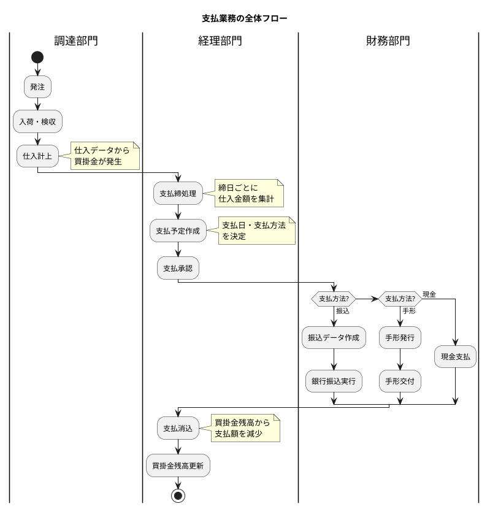
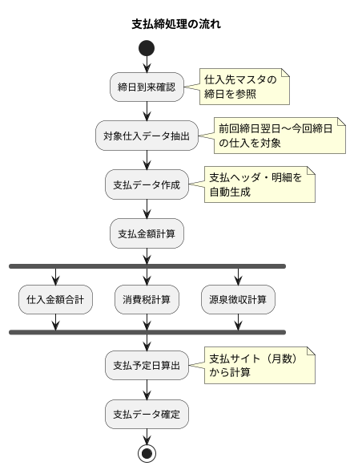
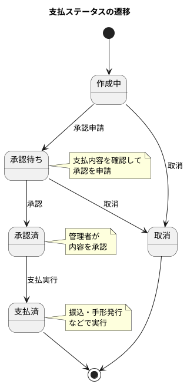
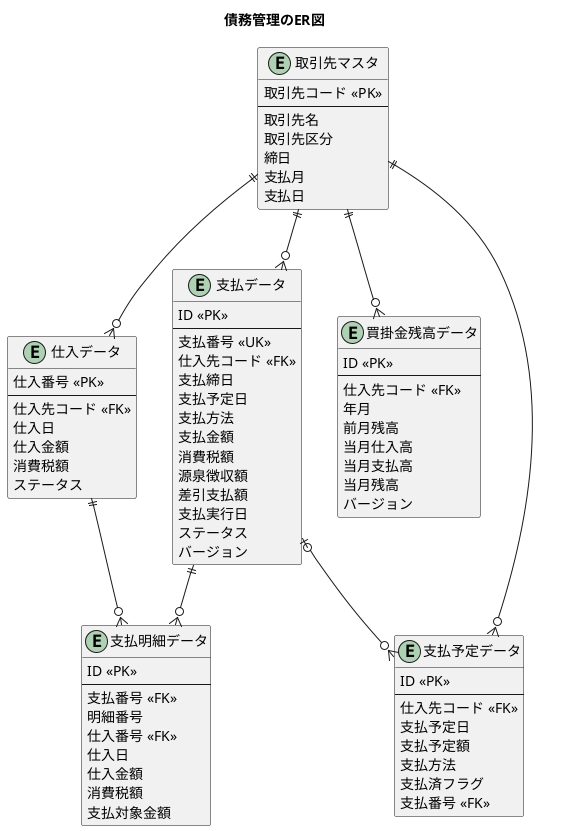
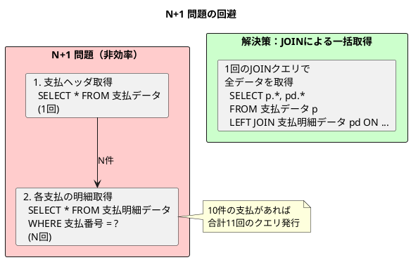
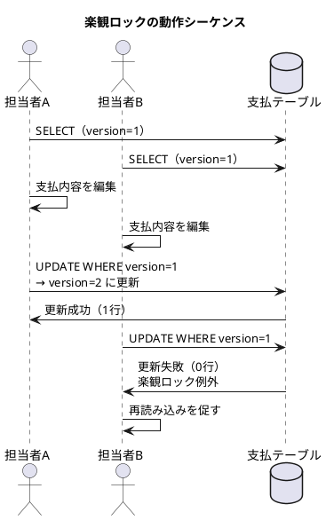
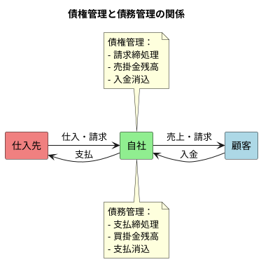

# 第10章：債務管理の設計

販売管理システムにおいて、債務管理は仕入先への支払を適切に管理するための重要な機能です。本章では、支払締処理、支払方法の管理、買掛金残高管理のデータベース設計と実装を行います。債権管理（第7章）と対をなす概念として、仕入側からの視点でデータ構造を設計します。

## 支払業務の全体像

支払業務は「仕入計上 → 支払締処理 → 支払承認 → 支払実行 → 買掛金消込」という一連のフローで構成されます。



### 支払管理で扱うデータ

| データ | 説明 |
|-------|------|
| **支払データ** | 支払締処理で作成されるヘッダ情報 |
| **支払明細データ** | 仕入データとの紐付け |
| **買掛金残高データ** | 仕入先別・月次の残高管理 |
| **支払予定データ** | 支払スケジュールの管理 |

---

## 10.1 支払業務の DB 設計

### 支払締処理の仕組み

支払締処理は、債権管理の請求締処理と対になる仕組みです。仕入先マスタに設定された締日に基づいて、仕入データを集計し支払データを作成します。



### 支払ステータスの遷移

支払データは承認ワークフローに従ってステータスが変化します。



| ステータス | 説明 | 次のアクション |
|-----------|------|---------------|
| **作成中** | 支払データ作成直後 | 承認申請または取消 |
| **承認待ち** | 承認申請済み | 承認または取消 |
| **承認済** | 管理者が承認 | 支払実行 |
| **支払済** | 支払処理完了 | 終了状態 |
| **取消** | 支払を取り消し | 終了状態 |

### 支払方法の種類

| 支払方法 | 説明 | 特徴 |
|---------|------|------|
| **振込** | 銀行振込 | 最も一般的、手数料発生 |
| **手形** | 約束手形 | 支払サイト延長、不渡りリスク |
| **現金** | 現金払い | 即時決済、少額向け |
| **相殺** | 債権債務相殺 | 売掛金との相殺 |
| **電子記録債権** | でんさい | 手形の電子版 |

### 支払関連の ER 図



### マイグレーション：支払関連テーブルの作成

<details>
<summary>V018__create_payment_tables.sql</summary>

```sql
-- src/main/resources/db/migration/V018__create_payment_tables.sql

-- 支払ステータス
CREATE TYPE 支払ステータス AS ENUM ('作成中', '承認待ち', '承認済', '支払済', '取消');

-- 支払方法
CREATE TYPE 支払方法 AS ENUM ('振込', '手形', '現金', '相殺', '電子記録債権');

-- 支払データ（ヘッダ）
CREATE TABLE "支払データ" (
    "ID" SERIAL PRIMARY KEY,
    "支払番号" VARCHAR(20) UNIQUE NOT NULL,
    "仕入先コード" VARCHAR(20) NOT NULL,
    "支払締日" DATE NOT NULL,
    "支払予定日" DATE NOT NULL,
    "支払方法" 支払方法 NOT NULL,
    "支払金額" DECIMAL(15, 2) NOT NULL,
    "消費税額" DECIMAL(15, 2) NOT NULL,
    "源泉徴収額" DECIMAL(15, 2) DEFAULT 0 NOT NULL,
    "差引支払額" DECIMAL(15, 2) NOT NULL,
    "支払実行日" DATE,
    "ステータス" 支払ステータス DEFAULT '作成中' NOT NULL,
    "振込先銀行コード" VARCHAR(10),
    "振込先支店コード" VARCHAR(10),
    "振込先口座種別" VARCHAR(10),
    "振込先口座番号" VARCHAR(20),
    "振込先口座名義" VARCHAR(100),
    "備考" TEXT,
    "バージョン" INTEGER DEFAULT 1 NOT NULL,
    "作成日時" TIMESTAMP DEFAULT CURRENT_TIMESTAMP NOT NULL,
    "作成者" VARCHAR(50),
    "更新日時" TIMESTAMP DEFAULT CURRENT_TIMESTAMP NOT NULL,
    "更新者" VARCHAR(50),
    CONSTRAINT "fk_支払_仕入先"
        FOREIGN KEY ("仕入先コード") REFERENCES "取引先マスタ"("取引先コード")
);

-- 支払明細データ
CREATE TABLE "支払明細データ" (
    "ID" SERIAL PRIMARY KEY,
    "支払番号" VARCHAR(20) NOT NULL,
    "明細番号" INTEGER NOT NULL,
    "仕入番号" VARCHAR(20) NOT NULL,
    "仕入日" DATE NOT NULL,
    "仕入金額" DECIMAL(15, 2) NOT NULL,
    "消費税額" DECIMAL(15, 2) NOT NULL,
    "支払対象金額" DECIMAL(15, 2) NOT NULL,
    "作成日時" TIMESTAMP DEFAULT CURRENT_TIMESTAMP NOT NULL,
    "更新日時" TIMESTAMP DEFAULT CURRENT_TIMESTAMP NOT NULL,
    CONSTRAINT "fk_支払明細_支払"
        FOREIGN KEY ("支払番号") REFERENCES "支払データ"("支払番号"),
    CONSTRAINT "fk_支払明細_仕入"
        FOREIGN KEY ("仕入番号") REFERENCES "仕入データ"("仕入番号"),
    UNIQUE ("支払番号", "明細番号")
);

-- 買掛金残高データ
CREATE TABLE "買掛金残高データ" (
    "ID" SERIAL PRIMARY KEY,
    "仕入先コード" VARCHAR(20) NOT NULL,
    "年月" DATE NOT NULL,
    "前月残高" DECIMAL(15, 2) DEFAULT 0 NOT NULL,
    "当月仕入高" DECIMAL(15, 2) DEFAULT 0 NOT NULL,
    "当月支払高" DECIMAL(15, 2) DEFAULT 0 NOT NULL,
    "当月残高" DECIMAL(15, 2) DEFAULT 0 NOT NULL,
    "バージョン" INTEGER DEFAULT 1 NOT NULL,
    "作成日時" TIMESTAMP DEFAULT CURRENT_TIMESTAMP NOT NULL,
    "更新日時" TIMESTAMP DEFAULT CURRENT_TIMESTAMP NOT NULL,
    CONSTRAINT "fk_買掛金残高_仕入先"
        FOREIGN KEY ("仕入先コード") REFERENCES "取引先マスタ"("取引先コード"),
    UNIQUE ("仕入先コード", "年月")
);

-- 支払予定データ
CREATE TABLE "支払予定データ" (
    "ID" SERIAL PRIMARY KEY,
    "仕入先コード" VARCHAR(20) NOT NULL,
    "支払予定日" DATE NOT NULL,
    "支払予定額" DECIMAL(15, 2) NOT NULL,
    "支払方法" 支払方法 NOT NULL,
    "支払済フラグ" BOOLEAN DEFAULT false NOT NULL,
    "支払番号" VARCHAR(20),
    "作成日時" TIMESTAMP DEFAULT CURRENT_TIMESTAMP NOT NULL,
    "更新日時" TIMESTAMP DEFAULT CURRENT_TIMESTAMP NOT NULL,
    CONSTRAINT "fk_支払予定_仕入先"
        FOREIGN KEY ("仕入先コード") REFERENCES "取引先マスタ"("取引先コード"),
    CONSTRAINT "fk_支払予定_支払"
        FOREIGN KEY ("支払番号") REFERENCES "支払データ"("支払番号")
);

-- 当月残高を自動計算するトリガー
CREATE OR REPLACE FUNCTION calculate_payable_balance()
RETURNS TRIGGER AS $$
BEGIN
    NEW."当月残高" := NEW."前月残高" + NEW."当月仕入高" - NEW."当月支払高";
    RETURN NEW;
END;
$$ LANGUAGE plpgsql;

CREATE TRIGGER trg_買掛金残高_残高計算
    BEFORE INSERT OR UPDATE ON "買掛金残高データ"
    FOR EACH ROW
    EXECUTE FUNCTION calculate_payable_balance();

-- インデックス
CREATE INDEX "idx_支払_仕入先コード" ON "支払データ"("仕入先コード");
CREATE INDEX "idx_支払_支払締日" ON "支払データ"("支払締日");
CREATE INDEX "idx_支払_支払予定日" ON "支払データ"("支払予定日");
CREATE INDEX "idx_支払_ステータス" ON "支払データ"("ステータス");
CREATE INDEX "idx_支払明細_仕入番号" ON "支払明細データ"("仕入番号");
CREATE INDEX "idx_買掛金残高_年月" ON "買掛金残高データ"("年月");
CREATE INDEX "idx_支払予定_支払予定日" ON "支払予定データ"("支払予定日");
CREATE INDEX "idx_支払予定_支払済" ON "支払予定データ"("支払済フラグ");

-- テーブルコメント
COMMENT ON TABLE "支払データ" IS '支払締処理で作成される支払ヘッダ情報';
COMMENT ON TABLE "支払明細データ" IS '支払データと仕入データの紐付け';
COMMENT ON TABLE "買掛金残高データ" IS '仕入先別・月次の買掛金残高';
COMMENT ON TABLE "支払予定データ" IS '支払スケジュールの管理';
COMMENT ON COLUMN "支払データ"."バージョン" IS '楽観ロック用バージョン番号';
COMMENT ON COLUMN "買掛金残高データ"."バージョン" IS '楽観ロック用バージョン番号';
```

</details>

### 支払関連エンティティの実装

<details>
<summary>支払ステータス ENUM</summary>

```java
// src/main/java/com/example/sales/domain/model/payment/PaymentStatus.java
package com.example.sales.domain.model.payment;

import lombok.Getter;
import lombok.RequiredArgsConstructor;

@Getter
@RequiredArgsConstructor
public enum PaymentStatus {
    DRAFT("作成中"),
    PENDING_APPROVAL("承認待ち"),
    APPROVED("承認済"),
    PAID("支払済"),
    CANCELLED("取消");

    private final String displayName;

    public static PaymentStatus fromDisplayName(String displayName) {
        for (PaymentStatus status : values()) {
            if (status.displayName.equals(displayName)) {
                return status;
            }
        }
        throw new IllegalArgumentException("Unknown payment status: " + displayName);
    }

    /**
     * 承認可能なステータスかどうか
     */
    public boolean canApprove() {
        return this == PENDING_APPROVAL;
    }

    /**
     * 支払実行可能なステータスかどうか
     */
    public boolean canExecute() {
        return this == APPROVED;
    }

    /**
     * 取消可能なステータスかどうか
     */
    public boolean canCancel() {
        return this == DRAFT || this == PENDING_APPROVAL;
    }
}
```

</details>

<details>
<summary>支払方法 ENUM</summary>

```java
// src/main/java/com/example/sales/domain/model/payment/PaymentMethod.java
package com.example.sales.domain.model.payment;

import lombok.Getter;
import lombok.RequiredArgsConstructor;

@Getter
@RequiredArgsConstructor
public enum PaymentMethod {
    BANK_TRANSFER("振込"),
    BILL("手形"),
    CASH("現金"),
    OFFSET("相殺"),
    ELECTRONIC_RECORD("電子記録債権");

    private final String displayName;

    public static PaymentMethod fromDisplayName(String displayName) {
        for (PaymentMethod method : values()) {
            if (method.displayName.equals(displayName)) {
                return method;
            }
        }
        throw new IllegalArgumentException("Unknown payment method: " + displayName);
    }

    /**
     * 振込先情報が必要かどうか
     */
    public boolean requiresBankInfo() {
        return this == BANK_TRANSFER;
    }
}
```

</details>

<details>
<summary>支払データエンティティ</summary>

```java
// src/main/java/com/example/sales/domain/model/payment/Payment.java
package com.example.sales.domain.model.payment;

import com.example.sales.domain.model.partner.Partner;
import lombok.AllArgsConstructor;
import lombok.Builder;
import lombok.Data;
import lombok.NoArgsConstructor;

import java.math.BigDecimal;
import java.time.LocalDate;
import java.time.LocalDateTime;
import java.util.ArrayList;
import java.util.List;

@Data
@Builder
@NoArgsConstructor
@AllArgsConstructor
public class Payment {
    private Integer id;
    private String paymentNumber;
    private String supplierCode;
    private LocalDate paymentClosingDate;
    private LocalDate paymentDueDate;
    private PaymentMethod paymentMethod;
    private BigDecimal paymentAmount;
    private BigDecimal taxAmount;
    private BigDecimal withholdingAmount;
    private BigDecimal netPaymentAmount;
    private LocalDate paymentExecutionDate;
    private PaymentStatus status;
    private String bankCode;
    private String branchCode;
    private String accountType;
    private String accountNumber;
    private String accountName;
    private String remarks;
    private LocalDateTime createdAt;
    private String createdBy;
    private LocalDateTime updatedAt;
    private String updatedBy;

    // 楽観ロック用バージョン
    @Builder.Default
    private Integer version = 1;

    // リレーション
    private Partner supplier;

    @Builder.Default
    private List<PaymentDetail> details = new ArrayList<>();

    /**
     * 明細の合計金額を計算
     */
    public BigDecimal calculateTotalAmount() {
        if (details == null || details.isEmpty()) {
            return BigDecimal.ZERO;
        }
        return details.stream()
                .map(PaymentDetail::getPaymentTargetAmount)
                .reduce(BigDecimal.ZERO, BigDecimal::add);
    }

    /**
     * 差引支払額を計算
     */
    public BigDecimal calculateNetAmount() {
        return paymentAmount.add(taxAmount).subtract(withholdingAmount);
    }

    /**
     * 承認申請
     */
    public void submitForApproval() {
        if (this.status != PaymentStatus.DRAFT) {
            throw new IllegalStateException(
                "作成中ステータスのみ承認申請が可能です");
        }
        this.status = PaymentStatus.PENDING_APPROVAL;
    }

    /**
     * 承認
     */
    public void approve() {
        if (!this.status.canApprove()) {
            throw new IllegalStateException(
                "このステータスでは承認できません: " + this.status.getDisplayName());
        }
        this.status = PaymentStatus.APPROVED;
    }

    /**
     * 支払実行
     */
    public void execute(LocalDate executionDate) {
        if (!this.status.canExecute()) {
            throw new IllegalStateException(
                "このステータスでは支払実行できません: " + this.status.getDisplayName());
        }
        this.paymentExecutionDate = executionDate;
        this.status = PaymentStatus.PAID;
    }

    /**
     * 取消
     */
    public void cancel() {
        if (!this.status.canCancel()) {
            throw new IllegalStateException(
                "このステータスでは取消できません: " + this.status.getDisplayName());
        }
        this.status = PaymentStatus.CANCELLED;
    }
}
```

</details>

<details>
<summary>支払明細データエンティティ</summary>

```java
// src/main/java/com/example/sales/domain/model/payment/PaymentDetail.java
package com.example.sales.domain.model.payment;

import com.example.sales.domain.model.purchase.Purchase;
import lombok.Builder;
import lombok.Data;

import java.math.BigDecimal;
import java.time.LocalDate;
import java.time.LocalDateTime;

@Data
@Builder
public class PaymentDetail {
    private Integer id;
    private String paymentNumber;
    private Integer detailNumber;
    private String purchaseNumber;
    private LocalDate purchaseDate;
    private BigDecimal purchaseAmount;
    private BigDecimal taxAmount;
    private BigDecimal paymentTargetAmount;
    private LocalDateTime createdAt;
    private LocalDateTime updatedAt;

    // リレーション
    private Payment payment;
    private Purchase purchase;
}
```

</details>

<details>
<summary>買掛金残高データエンティティ</summary>

```java
// src/main/java/com/example/sales/domain/model/payment/PayableBalance.java
package com.example.sales.domain.model.payment;

import com.example.sales.domain.model.partner.Partner;
import lombok.Builder;
import lombok.Data;

import java.math.BigDecimal;
import java.time.LocalDate;
import java.time.LocalDateTime;

@Data
@Builder
public class PayableBalance {
    private Integer id;
    private String supplierCode;
    private LocalDate yearMonth;
    private BigDecimal previousBalance;
    private BigDecimal currentPurchaseAmount;
    private BigDecimal currentPaymentAmount;
    private BigDecimal currentBalance;
    private LocalDateTime createdAt;
    private LocalDateTime updatedAt;

    // 楽観ロック用バージョン
    @Builder.Default
    private Integer version = 1;

    // リレーション
    private Partner supplier;

    /**
     * 残高を計算
     */
    public BigDecimal calculateBalance() {
        return previousBalance.add(currentPurchaseAmount).subtract(currentPaymentAmount);
    }

    /**
     * 仕入を加算
     */
    public void addPurchase(BigDecimal amount) {
        this.currentPurchaseAmount = this.currentPurchaseAmount.add(amount);
        this.currentBalance = calculateBalance();
    }

    /**
     * 支払を加算
     */
    public void addPayment(BigDecimal amount) {
        this.currentPaymentAmount = this.currentPaymentAmount.add(amount);
        this.currentBalance = calculateBalance();
    }
}
```

</details>

<details>
<summary>支払予定データエンティティ</summary>

```java
// src/main/java/com/example/sales/domain/model/payment/PaymentSchedule.java
package com.example.sales.domain.model.payment;

import com.example.sales.domain.model.partner.Partner;
import lombok.Builder;
import lombok.Data;

import java.math.BigDecimal;
import java.time.LocalDate;
import java.time.LocalDateTime;

@Data
@Builder
public class PaymentSchedule {
    private Integer id;
    private String supplierCode;
    private LocalDate paymentDueDate;
    private BigDecimal scheduledAmount;
    private PaymentMethod paymentMethod;
    private Boolean paidFlag;
    private String paymentNumber;
    private LocalDateTime createdAt;
    private LocalDateTime updatedAt;

    // リレーション
    private Partner supplier;
    private Payment payment;

    /**
     * 支払済みとしてマーク
     */
    public void markAsPaid(String paymentNumber) {
        this.paidFlag = true;
        this.paymentNumber = paymentNumber;
    }

    /**
     * 支払期限が過ぎているかどうか
     */
    public boolean isOverdue() {
        return !paidFlag && LocalDate.now().isAfter(paymentDueDate);
    }
}
```

</details>

### 支払サービスの実装

<details>
<summary>支払サービス</summary>

```java
// src/main/java/com/example/sales/application/service/PaymentService.java
package com.example.sales.application.service;

import com.example.sales.domain.model.partner.Partner;
import com.example.sales.domain.model.payment.*;
import com.example.sales.domain.model.purchase.Purchase;
import com.example.sales.infrastructure.persistence.mapper.*;
import lombok.RequiredArgsConstructor;
import org.springframework.stereotype.Service;
import org.springframework.transaction.annotation.Transactional;

import java.math.BigDecimal;
import java.time.LocalDate;
import java.time.format.DateTimeFormatter;
import java.util.ArrayList;
import java.util.List;

@Service
@RequiredArgsConstructor
public class PaymentService {

    private final PaymentMapper paymentMapper;
    private final PaymentDetailMapper paymentDetailMapper;
    private final PayableBalanceMapper payableBalanceMapper;
    private final PartnerMapper partnerMapper;
    private final PurchaseMapper purchaseMapper;

    /**
     * 支払番号を生成
     */
    private String generatePaymentNumber(LocalDate closingDate) {
        String prefix = "PAY-" + closingDate.format(
                DateTimeFormatter.ofPattern("yyyyMM")) + "-";
        String latestNumber = paymentMapper.findLatestPaymentNumber(prefix + "%");

        int sequence = 1;
        if (latestNumber != null) {
            int currentSequence = Integer.parseInt(
                    latestNumber.substring(latestNumber.length() - 4));
            sequence = currentSequence + 1;
        }

        return prefix + String.format("%04d", sequence);
    }

    /**
     * 支払予定日を計算
     */
    private LocalDate calculatePaymentDueDate(LocalDate closingDate,
                                               Partner supplier) {
        // 締日の翌月から支払月数分を加算
        LocalDate baseDate = closingDate.plusMonths(supplier.getPaymentMonth());

        // 支払日を設定
        int paymentDay = supplier.getPaymentDay();
        int maxDay = baseDate.lengthOfMonth();
        if (paymentDay > maxDay) {
            paymentDay = maxDay; // 月末処理
        }

        return LocalDate.of(baseDate.getYear(), baseDate.getMonth(), paymentDay);
    }

    /**
     * 支払締処理を実行
     */
    @Transactional
    public Payment processPaymentClosing(PaymentClosingInput input) {
        // 仕入先情報を取得
        Partner supplier = partnerMapper.findByPartnerCode(input.getSupplierCode());
        if (supplier == null) {
            throw new IllegalArgumentException(
                    "仕入先が見つかりません: " + input.getSupplierCode());
        }

        // 対象仕入データを取得（前回締日翌日～今回締日）
        List<Purchase> purchases = purchaseMapper.findBySupplierAndDateRange(
                input.getSupplierCode(),
                input.getFromDate() != null
                        ? input.getFromDate()
                        : LocalDate.of(1900, 1, 1),
                input.getClosingDate()
        );

        if (purchases.isEmpty()) {
            throw new IllegalStateException(
                    "対象となる仕入データがありません");
        }

        // 支払データを作成
        String paymentNumber = generatePaymentNumber(input.getClosingDate());
        LocalDate paymentDueDate = calculatePaymentDueDate(
                input.getClosingDate(), supplier);

        BigDecimal totalAmount = BigDecimal.ZERO;
        BigDecimal totalTax = BigDecimal.ZERO;

        List<PaymentDetail> details = new ArrayList<>();
        int detailNumber = 1;

        for (Purchase purchase : purchases) {
            totalAmount = totalAmount.add(purchase.getPurchaseAmount());
            totalTax = totalTax.add(purchase.getTaxAmount());

            PaymentDetail detail = PaymentDetail.builder()
                    .paymentNumber(paymentNumber)
                    .detailNumber(detailNumber++)
                    .purchaseNumber(purchase.getPurchaseNumber())
                    .purchaseDate(purchase.getPurchaseDate())
                    .purchaseAmount(purchase.getPurchaseAmount())
                    .taxAmount(purchase.getTaxAmount())
                    .paymentTargetAmount(purchase.getTotalAmount())
                    .build();
            details.add(detail);
        }

        BigDecimal withholdingAmount = input.getWithholdingAmount() != null
                ? input.getWithholdingAmount()
                : BigDecimal.ZERO;
        BigDecimal netAmount = totalAmount.add(totalTax)
                .subtract(withholdingAmount);

        Payment payment = Payment.builder()
                .paymentNumber(paymentNumber)
                .supplierCode(input.getSupplierCode())
                .paymentClosingDate(input.getClosingDate())
                .paymentDueDate(paymentDueDate)
                .paymentMethod(input.getPaymentMethod())
                .paymentAmount(totalAmount)
                .taxAmount(totalTax)
                .withholdingAmount(withholdingAmount)
                .netPaymentAmount(netAmount)
                .status(PaymentStatus.DRAFT)
                .bankCode(supplier.getBankCode())
                .branchCode(supplier.getBranchCode())
                .accountType(supplier.getAccountType())
                .accountNumber(supplier.getAccountNumber())
                .accountName(supplier.getAccountName())
                .build();

        paymentMapper.insert(payment);

        for (PaymentDetail detail : details) {
            paymentDetailMapper.insert(detail);
        }

        payment.setDetails(details);
        return payment;
    }

    /**
     * 承認申請
     */
    @Transactional
    public void submitForApproval(String paymentNumber) {
        Payment payment = paymentMapper.findByPaymentNumber(paymentNumber);
        if (payment == null) {
            throw new IllegalArgumentException(
                    "支払データが見つかりません: " + paymentNumber);
        }

        payment.submitForApproval();
        paymentMapper.updateStatus(paymentNumber, PaymentStatus.PENDING_APPROVAL);
    }

    /**
     * 承認
     */
    @Transactional
    public void approve(String paymentNumber) {
        Payment payment = paymentMapper.findByPaymentNumber(paymentNumber);
        if (payment == null) {
            throw new IllegalArgumentException(
                    "支払データが見つかりません: " + paymentNumber);
        }

        payment.approve();
        paymentMapper.updateStatus(paymentNumber, PaymentStatus.APPROVED);
    }

    /**
     * 支払実行
     */
    @Transactional
    public void executePayment(String paymentNumber, LocalDate executionDate) {
        Payment payment = paymentMapper.findByPaymentNumber(paymentNumber);
        if (payment == null) {
            throw new IllegalArgumentException(
                    "支払データが見つかりません: " + paymentNumber);
        }

        payment.execute(executionDate);
        paymentMapper.executePayment(paymentNumber, executionDate);

        // 買掛金残高を更新
        LocalDate yearMonth = LocalDate.of(
                executionDate.getYear(), executionDate.getMonth(), 1);
        payableBalanceMapper.addPayment(
                payment.getSupplierCode(), yearMonth, payment.getNetPaymentAmount());
    }

    /**
     * 支払取消
     */
    @Transactional
    public void cancelPayment(String paymentNumber) {
        Payment payment = paymentMapper.findByPaymentNumber(paymentNumber);
        if (payment == null) {
            throw new IllegalArgumentException(
                    "支払データが見つかりません: " + paymentNumber);
        }

        payment.cancel();
        paymentMapper.updateStatus(paymentNumber, PaymentStatus.CANCELLED);
    }

    /**
     * 買掛金残高を取得
     */
    public PayableBalance getPayableBalance(String supplierCode,
                                             LocalDate yearMonth) {
        return payableBalanceMapper.findBySupplierAndYearMonth(
                supplierCode, yearMonth);
    }

    /**
     * 月次の買掛金合計を取得
     */
    public BigDecimal getTotalPayableByMonth(LocalDate yearMonth) {
        return payableBalanceMapper.sumCurrentBalanceByYearMonth(yearMonth);
    }

    /**
     * 買掛金残高を初期化（月次繰越）
     */
    @Transactional
    public PayableBalance initializePayableBalance(String supplierCode,
                                                    LocalDate yearMonth) {
        // 前月残高を取得
        LocalDate previousMonth = yearMonth.minusMonths(1);
        PayableBalance previousBalance = payableBalanceMapper
                .findBySupplierAndYearMonth(supplierCode, previousMonth);

        BigDecimal carryOver = BigDecimal.ZERO;
        if (previousBalance != null) {
            carryOver = previousBalance.getCurrentBalance();
        }

        PayableBalance newBalance = PayableBalance.builder()
                .supplierCode(supplierCode)
                .yearMonth(yearMonth)
                .previousBalance(carryOver)
                .currentPurchaseAmount(BigDecimal.ZERO)
                .currentPaymentAmount(BigDecimal.ZERO)
                .build();

        payableBalanceMapper.insert(newBalance);
        return newBalance;
    }
}
```

</details>

<details>
<summary>支払締処理の入力クラス</summary>

```java
// src/main/java/com/example/sales/application/service/PaymentClosingInput.java
package com.example.sales.application.service;

import com.example.sales.domain.model.payment.PaymentMethod;
import lombok.Builder;
import lombok.Data;

import java.math.BigDecimal;
import java.time.LocalDate;

@Data
@Builder
public class PaymentClosingInput {
    private String supplierCode;
    private LocalDate closingDate;
    private LocalDate fromDate;
    private PaymentMethod paymentMethod;
    private BigDecimal withholdingAmount;
}
```

</details>

---

## 10.2 リレーションと楽観ロックの設計

### MyBatis ネストした ResultMap による関連付け

支払データは、支払（ヘッダ）→ 支払明細の2層構造を持ちます。N+1 問題を回避するため、JOIN クエリで一括取得します。



<details>
<summary>支払データのリレーション設定（PaymentMapper.xml）</summary>

```xml
<?xml version="1.0" encoding="UTF-8" ?>
<!DOCTYPE mapper
        PUBLIC "-//mybatis.org//DTD Mapper 3.0//EN"
        "http://mybatis.org/dtd/mybatis-3-mapper.dtd">
<mapper namespace="com.example.sales.infrastructure.persistence.mapper.PaymentMapper">

    <!-- 支払（ヘッダ）の ResultMap -->
    <resultMap id="PaymentWithDetailsResultMap"
               type="com.example.sales.domain.model.payment.Payment">
        <id property="id" column="p_id"/>
        <result property="paymentNumber" column="p_支払番号"/>
        <result property="supplierCode" column="p_仕入先コード"/>
        <result property="paymentClosingDate" column="p_支払締日"/>
        <result property="paymentDueDate" column="p_支払予定日"/>
        <result property="paymentMethod" column="p_支払方法"
                typeHandler="com.example.sales.infrastructure.persistence.typehandler.PaymentMethodTypeHandler"/>
        <result property="paymentAmount" column="p_支払金額"/>
        <result property="taxAmount" column="p_消費税額"/>
        <result property="withholdingAmount" column="p_源泉徴収額"/>
        <result property="netPaymentAmount" column="p_差引支払額"/>
        <result property="paymentExecutionDate" column="p_支払実行日"/>
        <result property="status" column="p_ステータス"
                typeHandler="com.example.sales.infrastructure.persistence.typehandler.PaymentStatusTypeHandler"/>
        <result property="version" column="p_バージョン"/>
        <result property="createdAt" column="p_作成日時"/>
        <result property="updatedAt" column="p_更新日時"/>
        <!-- 支払明細との1:N関連 -->
        <collection property="details"
                    ofType="com.example.sales.domain.model.payment.PaymentDetail"
                    resultMap="PaymentDetailNestedResultMap"/>
    </resultMap>

    <!-- 支払明細のネスト ResultMap -->
    <resultMap id="PaymentDetailNestedResultMap"
               type="com.example.sales.domain.model.payment.PaymentDetail">
        <id property="id" column="pd_id"/>
        <result property="paymentNumber" column="pd_支払番号"/>
        <result property="detailNumber" column="pd_明細番号"/>
        <result property="purchaseNumber" column="pd_仕入番号"/>
        <result property="purchaseDate" column="pd_仕入日"/>
        <result property="purchaseAmount" column="pd_仕入金額"/>
        <result property="taxAmount" column="pd_消費税額"/>
        <result property="paymentTargetAmount" column="pd_支払対象金額"/>
    </resultMap>

    <!-- JOIN による一括取得クエリ -->
    <select id="findWithDetailsByPaymentNumber"
            resultMap="PaymentWithDetailsResultMap">
        SELECT
            p."ID" AS p_id,
            p."支払番号" AS p_支払番号,
            p."仕入先コード" AS p_仕入先コード,
            p."支払締日" AS p_支払締日,
            p."支払予定日" AS p_支払予定日,
            p."支払方法" AS p_支払方法,
            p."支払金額" AS p_支払金額,
            p."消費税額" AS p_消費税額,
            p."源泉徴収額" AS p_源泉徴収額,
            p."差引支払額" AS p_差引支払額,
            p."支払実行日" AS p_支払実行日,
            p."ステータス" AS p_ステータス,
            p."バージョン" AS p_バージョン,
            p."作成日時" AS p_作成日時,
            p."更新日時" AS p_更新日時,
            pd."ID" AS pd_id,
            pd."支払番号" AS pd_支払番号,
            pd."明細番号" AS pd_明細番号,
            pd."仕入番号" AS pd_仕入番号,
            pd."仕入日" AS pd_仕入日,
            pd."仕入金額" AS pd_仕入金額,
            pd."消費税額" AS pd_消費税額,
            pd."支払対象金額" AS pd_支払対象金額
        FROM "支払データ" p
        LEFT JOIN "支払明細データ" pd
            ON p."支払番号" = pd."支払番号"
        WHERE p."支払番号" = #{paymentNumber}
        ORDER BY pd."明細番号"
    </select>

</mapper>
```

</details>

### リレーション設定のポイント

| 設定項目 | 説明 |
|---------|------|
| `<collection>` | 1:N 関連のマッピング |
| `<id>` | 主キーの識別（MyBatis が重複排除に使用） |
| `resultMap` | ネストした ResultMap の参照 |
| エイリアス（AS） | カラム名の重複を避けるためのプレフィックス |
| `ORDER BY` | コレクションの順序を保証 |

### 楽観ロック（Optimistic Locking）の実装

複数ユーザーが同時に支払データを編集する場合、データの整合性を保つために楽観ロックを実装します。



### バージョンカラムによる同時更新制御

<details>
<summary>楽観ロック対応の MyBatis Mapper</summary>

```xml
<!-- 楽観ロック対応の支払更新 -->
<update id="updateWithOptimisticLock"
        parameterType="com.example.sales.domain.model.payment.Payment">
    UPDATE "支払データ"
    SET
        "支払締日" = #{paymentClosingDate},
        "支払予定日" = #{paymentDueDate},
        "支払方法" = #{paymentMethod,
            typeHandler=com.example.sales.infrastructure.persistence.typehandler.PaymentMethodTypeHandler}::支払方法,
        "支払金額" = #{paymentAmount},
        "消費税額" = #{taxAmount},
        "源泉徴収額" = #{withholdingAmount},
        "差引支払額" = #{netPaymentAmount},
        "ステータス" = #{status,
            typeHandler=com.example.sales.infrastructure.persistence.typehandler.PaymentStatusTypeHandler}::支払ステータス,
        "備考" = #{remarks},
        "更新日時" = CURRENT_TIMESTAMP,
        "バージョン" = "バージョン" + 1
    WHERE "ID" = #{id}
    AND "バージョン" = #{version}
</update>
```

</details>

<details>
<summary>Repository 実装：楽観ロック対応</summary>

```java
// src/main/java/com/example/sales/infrastructure/persistence/repository/PaymentRepositoryImpl.java
package com.example.sales.infrastructure.persistence.repository;

import com.example.sales.application.port.out.PaymentRepository;
import com.example.sales.domain.exception.OptimisticLockException;
import com.example.sales.domain.model.payment.*;
import com.example.sales.infrastructure.persistence.mapper.PaymentMapper;
import lombok.RequiredArgsConstructor;
import org.springframework.stereotype.Repository;
import org.springframework.transaction.annotation.Transactional;

@Repository
@RequiredArgsConstructor
public class PaymentRepositoryImpl implements PaymentRepository {

    private final PaymentMapper paymentMapper;

    /**
     * 楽観ロック対応の更新
     * @throws OptimisticLockException 他のユーザーによって更新された場合
     */
    @Override
    @Transactional
    public void update(Payment payment) {
        int updatedCount = paymentMapper.updateWithOptimisticLock(payment);

        if (updatedCount == 0) {
            Integer currentVersion = paymentMapper.findVersionById(payment.getId());

            if (currentVersion == null) {
                throw new OptimisticLockException(
                        "支払", payment.getId().toString());
            } else {
                throw new OptimisticLockException(
                        "支払",
                        payment.getId().toString(),
                        payment.getVersion(),
                        currentVersion
                );
            }
        }
    }
}
```

</details>

### 楽観ロックのベストプラクティス

| ポイント | 説明 |
|---------|------|
| **バージョンカラム** | INTEGER 型で十分（オーバーフローは現実的に発生しない） |
| **WHERE 条件** | 必ず `AND "バージョン" = #{version}` を含める |
| **インクリメント** | `"バージョン" = "バージョン" + 1` でアトミックに更新 |
| **例外処理** | 更新件数が0の場合は楽観ロック例外をスロー |
| **エラーメッセージ** | ユーザーにわかりやすいメッセージで再読み込みを促す |

---

## 債権管理との対比

債権管理（第7章）と債務管理（第10章）は、売り手と買い手の立場が逆転した対称的な関係にあります。

| 項目 | 債権管理（第7章） | 債務管理（第10章） |
|------|------------------|------------------|
| 取引先 | 顧客 | 仕入先 |
| 締処理 | 請求締処理 | 支払締処理 |
| データ | 請求データ | 支払データ |
| 残高 | 売掛金残高 | 買掛金残高 |
| 消込 | 入金消込 | 支払消込 |
| 予定管理 | 回収予定 | 支払予定 |



---

## 第10章のまとめ

本章では、債務管理（支払締処理・買掛金残高管理）の DB 設計と実装について学びました。

### 学んだこと

1. **支払締処理の設計**
   - 仕入データから支払データへの集計
   - 支払予定日の自動計算（支払サイト）
   - 承認ワークフロー（作成→承認待ち→承認済→支払済）

2. **支払方法の管理**
   - 振込、手形、現金、相殺、電子記録債権
   - 支払方法に応じた必要情報の管理

3. **買掛金残高管理の設計**
   - 仕入先別の残高管理
   - 月次繰越処理
   - 当月残高の自動計算（トリガー）

4. **リレーションと楽観ロック**
   - N+1 問題の回避（JOIN による一括取得）
   - 同時更新の競合制御

### テーブル一覧

| テーブル名（日本語） | Java エンティティ | 説明 |
|---|---|---|
| 支払データ | Payment | 支払ヘッダ情報 |
| 支払明細データ | PaymentDetail | 仕入との紐付け |
| 買掛金残高データ | PayableBalance | 月次残高管理 |
| 支払予定データ | PaymentSchedule | 支払スケジュール |

### ENUM 一覧

| DB ENUM 型（日本語） | Java Enum | 値 |
|---|---|---|
| 支払ステータス | PaymentStatus | 作成中→DRAFT, 承認待ち→PENDING_APPROVAL, 承認済→APPROVED, 支払済→PAID, 取消→CANCELLED |
| 支払方法 | PaymentMethod | 振込→BANK_TRANSFER, 手形→BILL, 現金→CASH, 相殺→OFFSET, 電子記録債権→ELECTRONIC_RECORD |

### 次章の予告

第11章では、財務会計システムの全体像に進みます。販売管理システムで発生した取引を財務会計の仕訳としてどのように記録するかを学びます。

---

[← 第9章：在庫管理の設計](./chapter09.md) | [第11章：財務会計システムの全体像 →](./chapter11.md)
