# 第11章：共通処理の設計

販売管理システムでは、赤黒処理、自動採番、監査カラム、履歴管理といった共通的な処理が多くの業務で横断的に使用されます。本章では、これらの共通処理のデータベース設計と実装を行います。

## 共通処理の全体像

共通処理は、業務データの整合性、追跡可能性、運用効率を高めるための基盤機能です。

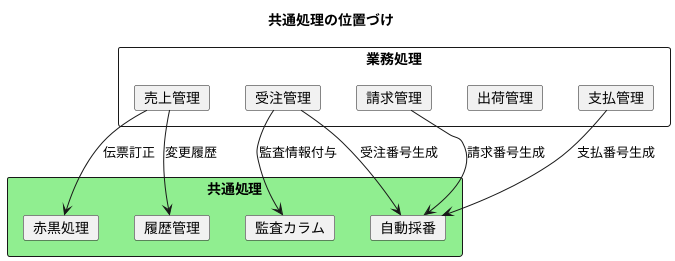

### 共通処理の役割

| 処理 | 役割 | 主な利用場面 |
|-----|------|------------|
| **赤黒処理** | 確定済み伝票の訂正 | 売上・仕入の金額訂正、取消 |
| **自動採番** | 一意な番号の発行 | 伝票番号の自動生成 |
| **監査カラム** | 変更者・日時の記録 | 全テーブル共通 |
| **履歴管理** | 変更前後の状態保存 | マスタ変更、重要データ |

---

## 11.1 赤黒処理の設計

### 赤黒処理とは

赤黒処理は、確定済みの伝票を訂正する際に使用する会計的手法です。元の伝票を「赤伝票」でマイナス計上し、正しい内容を「黒伝票」で再計上します。

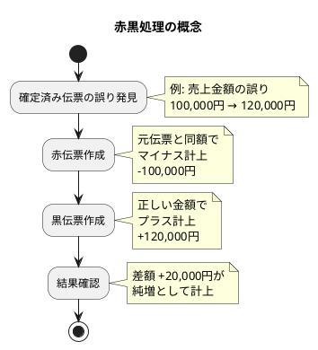

### なぜ赤黒処理が必要か

| 方式 | メリット | デメリット |
|-----|---------|-----------|
| **物理削除** | シンプル | 監査証跡なし、復元不可 |
| **論理削除** | 証跡保持 | 集計時に除外処理必要 |
| **赤黒処理** | 監査証跡完全、会計的に正確 | 伝票数増加 |

会計領域では、一度確定した伝票を直接修正することは認められません。赤黒処理により、すべての変更履歴が伝票として残り、監査対応が可能になります。

### 伝票区分の定義

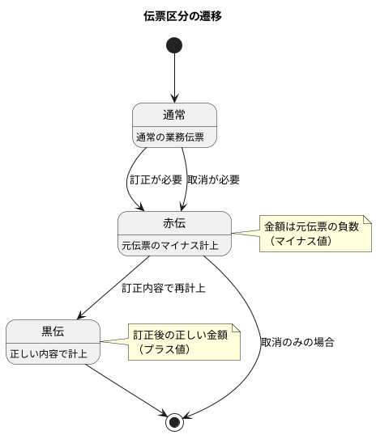

| 伝票区分 | 説明 | 金額の符号 |
|---------|------|----------|
| **通常** | 通常の業務伝票 | 正 |
| **赤伝** | 元伝票を打ち消す伝票 | 負（マイナス） |
| **黒伝** | 訂正後の内容を計上する伝票 | 正 |

### 赤黒処理の ER 図

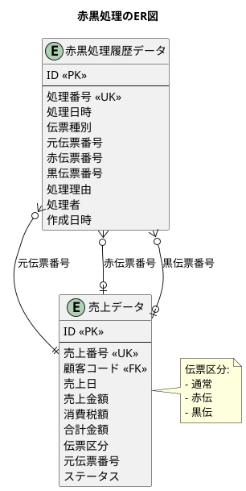

### マイグレーション：赤黒処理関連テーブルの作成

<details>
<summary>V019__create_redblack_tables.sql</summary>

```sql
-- src/main/resources/db/migration/V019__create_redblack_tables.sql

-- 伝票区分
CREATE TYPE 伝票区分 AS ENUM ('通常', '赤伝', '黒伝');

-- 赤黒処理履歴データ
CREATE TABLE "赤黒処理履歴データ" (
    "ID" SERIAL PRIMARY KEY,
    "処理番号" VARCHAR(20) UNIQUE NOT NULL,
    "処理日時" TIMESTAMP NOT NULL,
    "伝票種別" VARCHAR(20) NOT NULL,
    "元伝票番号" VARCHAR(20) NOT NULL,
    "赤伝票番号" VARCHAR(20) NOT NULL,
    "黒伝票番号" VARCHAR(20),
    "処理理由" TEXT NOT NULL,
    "処理者" VARCHAR(50) NOT NULL,
    "作成日時" TIMESTAMP DEFAULT CURRENT_TIMESTAMP NOT NULL
);

-- 売上データに伝票区分を追加
ALTER TABLE "売上データ" ADD COLUMN IF NOT EXISTS "伝票区分" 伝票区分 DEFAULT '通常' NOT NULL;
ALTER TABLE "売上データ" ADD COLUMN IF NOT EXISTS "元伝票番号" VARCHAR(20);

-- インデックス
CREATE INDEX "idx_赤黒処理履歴_元伝票番号" ON "赤黒処理履歴データ"("元伝票番号");
CREATE INDEX "idx_赤黒処理履歴_処理日時" ON "赤黒処理履歴データ"("処理日時");

-- テーブルコメント
COMMENT ON TABLE "赤黒処理履歴データ" IS '確定済み伝票の訂正履歴を管理するテーブル';
COMMENT ON COLUMN "赤黒処理履歴データ"."伝票種別" IS '対象伝票の種類（売上、仕入、請求、支払）';
```

</details>

### 赤黒処理エンティティの実装

<details>
<summary>伝票区分 ENUM</summary>

```java
// src/main/java/com/example/sales/domain/model/common/SlipType.java
package com.example.sales.domain.model.common;

import lombok.Getter;
import lombok.RequiredArgsConstructor;

@Getter
@RequiredArgsConstructor
public enum SlipType {
    NORMAL("通常"),
    RED("赤伝"),
    BLACK("黒伝");

    private final String displayName;

    public static SlipType fromDisplayName(String displayName) {
        for (SlipType type : values()) {
            if (type.displayName.equals(displayName)) {
                return type;
            }
        }
        throw new IllegalArgumentException("Unknown slip type: " + displayName);
    }

    /**
     * 赤伝かどうか
     */
    public boolean isRed() {
        return this == RED;
    }

    /**
     * 符号を取得（赤伝はマイナス）
     */
    public int getSign() {
        return this == RED ? -1 : 1;
    }
}
```

</details>

<details>
<summary>赤黒処理履歴エンティティ</summary>

```java
// src/main/java/com/example/sales/domain/model/common/RedBlackHistory.java
package com.example.sales.domain.model.common;

import lombok.Builder;
import lombok.Data;

import java.time.LocalDateTime;

@Data
@Builder
public class RedBlackHistory {
    private Integer id;
    private String processNumber;
    private LocalDateTime processDateTime;
    private String slipCategory;
    private String originalSlipNumber;
    private String redSlipNumber;
    private String blackSlipNumber;
    private String processReason;
    private String processedBy;
    private LocalDateTime createdAt;
}
```

</details>

### 赤黒処理サービスの実装

<details>
<summary>赤黒処理サービス</summary>

```java
// src/main/java/com/example/sales/application/service/RedBlackService.java
package com.example.sales.application.service;

import com.example.sales.domain.model.common.*;
import com.example.sales.domain.model.sales.*;
import com.example.sales.infrastructure.persistence.mapper.*;
import lombok.RequiredArgsConstructor;
import org.springframework.stereotype.Service;
import org.springframework.transaction.annotation.Transactional;

import java.time.LocalDateTime;
import java.time.format.DateTimeFormatter;
import java.util.List;

@Service
@RequiredArgsConstructor
public class RedBlackService {

    private final RedBlackHistoryMapper redBlackHistoryMapper;
    private final SalesMapper salesMapper;
    private final SalesDetailMapper salesDetailMapper;
    private final NumberingService numberingService;

    /**
     * 処理番号を生成
     */
    private String generateProcessNumber() {
        String prefix = "RB-" + LocalDateTime.now().format(
                DateTimeFormatter.ofPattern("yyyyMMdd")) + "-";
        String latestNumber = redBlackHistoryMapper.findLatestProcessNumber(prefix + "%");

        int sequence = 1;
        if (latestNumber != null) {
            int currentSequence = Integer.parseInt(
                    latestNumber.substring(latestNumber.length() - 4));
            sequence = currentSequence + 1;
        }

        return prefix + String.format("%04d", sequence);
    }

    /**
     * 売上の赤黒処理を実行
     */
    @Transactional
    public RedBlackResult processSalesRedBlack(RedBlackInput input) {
        // 元伝票を取得
        Sales originalSales = salesMapper.findBySalesNumber(
                input.getOriginalSlipNumber());
        if (originalSales == null) {
            throw new IllegalArgumentException(
                    "元伝票が見つかりません: " + input.getOriginalSlipNumber());
        }

        if (originalSales.getSlipType() != SlipType.NORMAL) {
            throw new IllegalStateException(
                    "通常伝票以外は赤黒処理できません");
        }

        List<SalesDetail> originalDetails = salesDetailMapper
                .findBySalesNumber(input.getOriginalSlipNumber());

        // 赤伝票を作成（元伝票のマイナス）
        String redSlipNumber = numberingService.generateSalesNumber();
        Sales redSales = createRedSales(originalSales, redSlipNumber);
        salesMapper.insert(redSales);

        for (SalesDetail detail : originalDetails) {
            SalesDetail redDetail = createRedDetail(detail, redSlipNumber);
            salesDetailMapper.insert(redDetail);
        }

        // 黒伝票を作成（訂正後の内容）
        String blackSlipNumber = null;
        if (input.getCorrectedData() != null) {
            blackSlipNumber = numberingService.generateSalesNumber();
            Sales blackSales = createBlackSales(
                    originalSales, blackSlipNumber, input.getCorrectedData());
            salesMapper.insert(blackSales);

            for (CorrectedDetailData correctedDetail :
                    input.getCorrectedData().getDetails()) {
                SalesDetail blackDetail = createBlackDetail(
                        correctedDetail, blackSlipNumber);
                salesDetailMapper.insert(blackDetail);
            }
        }

        // 赤黒処理履歴を記録
        String processNumber = generateProcessNumber();
        RedBlackHistory history = RedBlackHistory.builder()
                .processNumber(processNumber)
                .processDateTime(LocalDateTime.now())
                .slipCategory("売上")
                .originalSlipNumber(input.getOriginalSlipNumber())
                .redSlipNumber(redSlipNumber)
                .blackSlipNumber(blackSlipNumber)
                .processReason(input.getProcessReason())
                .processedBy(input.getProcessedBy())
                .build();
        redBlackHistoryMapper.insert(history);

        return RedBlackResult.builder()
                .processNumber(processNumber)
                .originalSlipNumber(input.getOriginalSlipNumber())
                .redSlipNumber(redSlipNumber)
                .blackSlipNumber(blackSlipNumber)
                .build();
    }

    private Sales createRedSales(Sales original, String redSlipNumber) {
        return Sales.builder()
                .salesNumber(redSlipNumber)
                .customerCode(original.getCustomerCode())
                .salesDate(original.getSalesDate())
                .salesAmount(original.getSalesAmount().negate())
                .taxAmount(original.getTaxAmount().negate())
                .totalAmount(original.getTotalAmount().negate())
                .slipType(SlipType.RED)
                .originalSlipNumber(original.getSalesNumber())
                .status(SalesStatus.CONFIRMED)
                .build();
    }

    private SalesDetail createRedDetail(SalesDetail original,
                                         String redSlipNumber) {
        return SalesDetail.builder()
                .salesNumber(redSlipNumber)
                .detailNumber(original.getDetailNumber())
                .productCode(original.getProductCode())
                .quantity(original.getQuantity().negate())
                .unitPrice(original.getUnitPrice())
                .amount(original.getAmount().negate())
                .build();
    }

    private Sales createBlackSales(Sales original, String blackSlipNumber,
                                    CorrectedSalesData correctedData) {
        return Sales.builder()
                .salesNumber(blackSlipNumber)
                .customerCode(correctedData.getCustomerCode() != null
                        ? correctedData.getCustomerCode()
                        : original.getCustomerCode())
                .salesDate(correctedData.getSalesDate() != null
                        ? correctedData.getSalesDate()
                        : original.getSalesDate())
                .salesAmount(correctedData.getSalesAmount())
                .taxAmount(correctedData.getTaxAmount())
                .totalAmount(correctedData.getTotalAmount())
                .slipType(SlipType.BLACK)
                .originalSlipNumber(original.getSalesNumber())
                .status(SalesStatus.CONFIRMED)
                .build();
    }

    private SalesDetail createBlackDetail(CorrectedDetailData correctedDetail,
                                           String blackSlipNumber) {
        return SalesDetail.builder()
                .salesNumber(blackSlipNumber)
                .detailNumber(correctedDetail.getDetailNumber())
                .productCode(correctedDetail.getProductCode())
                .quantity(correctedDetail.getQuantity())
                .unitPrice(correctedDetail.getUnitPrice())
                .amount(correctedDetail.getAmount())
                .build();
    }

    /**
     * 赤黒処理履歴を取得
     */
    public RedBlackHistory findByProcessNumber(String processNumber) {
        return redBlackHistoryMapper.findByProcessNumber(processNumber);
    }

    /**
     * 元伝票番号で赤黒処理履歴を検索
     */
    public List<RedBlackHistory> findByOriginalSlipNumber(
            String originalSlipNumber) {
        return redBlackHistoryMapper.findByOriginalSlipNumber(originalSlipNumber);
    }
}
```

</details>

---

## 11.2 自動採番の設計

### 採番の要件

| 要件 | 説明 |
|-----|------|
| **一意性** | 同一種別内で重複しない |
| **連番性** | 基本的に連番で発行 |
| **可読性** | 年月や種別が識別可能 |
| **拡張性** | 将来の要件変更に対応 |

### 採番パターン

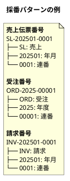

### 採番形式の種類

| 採番形式 | 説明 | 例 |
|---------|------|-----|
| **YEARLY** | 年次でリセット | ORD-2025-00001 |
| **MONTHLY** | 月次でリセット | SL-202501-0001 |
| **DAILY** | 日次でリセット | SL-20250115-0001 |
| **SEQUENTIAL** | リセットなし連番 | SEQ-000001 |

### 採番テーブルの ER 図

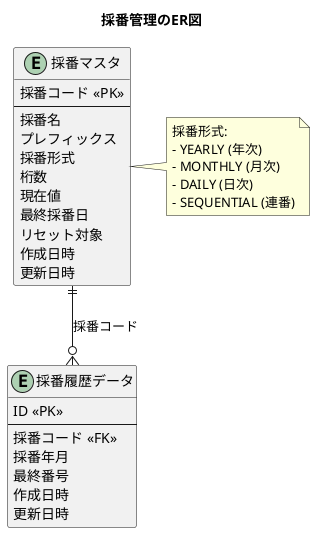

### マイグレーション：採番テーブルの作成

<details>
<summary>V020__create_numbering_tables.sql</summary>

```sql
-- src/main/resources/db/migration/V020__create_numbering_tables.sql

-- 採番マスタ
CREATE TABLE "採番マスタ" (
    "採番コード" VARCHAR(20) PRIMARY KEY,
    "採番名" VARCHAR(100) NOT NULL,
    "プレフィックス" VARCHAR(10) NOT NULL,
    "採番形式" VARCHAR(20) NOT NULL,  -- YEARLY, MONTHLY, DAILY, SEQUENTIAL
    "桁数" INTEGER NOT NULL,
    "現在値" BIGINT DEFAULT 0 NOT NULL,
    "最終採番日" DATE,
    "リセット対象" BOOLEAN DEFAULT false NOT NULL,
    "作成日時" TIMESTAMP DEFAULT CURRENT_TIMESTAMP NOT NULL,
    "更新日時" TIMESTAMP DEFAULT CURRENT_TIMESTAMP NOT NULL
);

-- 採番履歴データ
CREATE TABLE "採番履歴データ" (
    "ID" SERIAL PRIMARY KEY,
    "採番コード" VARCHAR(20) NOT NULL,
    "採番年月" VARCHAR(8) NOT NULL,
    "最終番号" BIGINT NOT NULL,
    "作成日時" TIMESTAMP DEFAULT CURRENT_TIMESTAMP NOT NULL,
    "更新日時" TIMESTAMP DEFAULT CURRENT_TIMESTAMP NOT NULL,
    CONSTRAINT "fk_採番履歴_採番マスタ"
        FOREIGN KEY ("採番コード") REFERENCES "採番マスタ"("採番コード"),
    UNIQUE ("採番コード", "採番年月")
);

-- 初期データ
INSERT INTO "採番マスタ" ("採番コード", "採番名", "プレフィックス", "採番形式", "桁数") VALUES
('SALES', '売上番号', 'SL', 'MONTHLY', 4),
('ORDER', '受注番号', 'ORD', 'YEARLY', 5),
('SHIPMENT', '出荷番号', 'SHP', 'MONTHLY', 4),
('INVOICE', '請求番号', 'INV', 'MONTHLY', 4),
('RECEIPT', '入金番号', 'RC', 'MONTHLY', 4),
('PURCHASE_ORDER', '発注番号', 'PO', 'MONTHLY', 4),
('PURCHASE', '仕入番号', 'PU', 'MONTHLY', 4),
('PAYMENT', '支払番号', 'PAY', 'MONTHLY', 4),
('STOCKTAKING', '棚卸番号', 'ST', 'MONTHLY', 4);

-- インデックス
CREATE INDEX "idx_採番履歴_採番年月" ON "採番履歴データ"("採番年月");

-- テーブルコメント
COMMENT ON TABLE "採番マスタ" IS '伝票番号の採番ルールを管理するマスタテーブル';
COMMENT ON TABLE "採番履歴データ" IS '年月別の採番状況を記録するテーブル';
```

</details>

### 採番サービスの実装

<details>
<summary>採番形式 ENUM</summary>

```java
// src/main/java/com/example/sales/domain/model/common/NumberingFormat.java
package com.example.sales.domain.model.common;

import lombok.Getter;
import lombok.RequiredArgsConstructor;

@Getter
@RequiredArgsConstructor
public enum NumberingFormat {
    YEARLY("年次"),
    MONTHLY("月次"),
    DAILY("日次"),
    SEQUENTIAL("連番");

    private final String displayName;

    public static NumberingFormat fromDisplayName(String displayName) {
        for (NumberingFormat format : values()) {
            if (format.displayName.equals(displayName)) {
                return format;
            }
        }
        throw new IllegalArgumentException(
                "Unknown numbering format: " + displayName);
    }
}
```

</details>

<details>
<summary>採番マスタエンティティ</summary>

```java
// src/main/java/com/example/sales/domain/model/common/NumberingMaster.java
package com.example.sales.domain.model.common;

import lombok.Builder;
import lombok.Data;

import java.time.LocalDate;
import java.time.LocalDateTime;

@Data
@Builder
public class NumberingMaster {
    private String numberingCode;
    private String numberingName;
    private String prefix;
    private NumberingFormat format;
    private Integer digits;
    private Long currentValue;
    private LocalDate lastNumberingDate;
    private Boolean resetTarget;
    private LocalDateTime createdAt;
    private LocalDateTime updatedAt;
}
```

</details>

<details>
<summary>採番サービス</summary>

```java
// src/main/java/com/example/sales/application/service/NumberingService.java
package com.example.sales.application.service;

import com.example.sales.domain.model.common.*;
import com.example.sales.infrastructure.persistence.mapper.*;
import lombok.RequiredArgsConstructor;
import org.springframework.stereotype.Service;
import org.springframework.transaction.annotation.Transactional;

import java.time.LocalDate;
import java.time.format.DateTimeFormatter;

@Service
@RequiredArgsConstructor
public class NumberingService {

    private final NumberingMasterMapper numberingMasterMapper;
    private final NumberingHistoryMapper numberingHistoryMapper;

    /**
     * 次の番号を取得
     */
    @Transactional
    public String getNextNumber(String numberingCode) {
        NumberingMaster master = numberingMasterMapper
                .findByNumberingCode(numberingCode);
        if (master == null) {
            throw new IllegalArgumentException(
                    "採番マスタが見つかりません: " + numberingCode);
        }

        LocalDate today = LocalDate.now();
        String yearMonth = getYearMonth(today, master.getFormat());

        // 履歴を取得または作成
        NumberingHistory history = numberingHistoryMapper
                .findByCodeAndYearMonth(numberingCode, yearMonth);

        long nextNumber;
        if (history == null) {
            // 新規年月の場合、1から開始
            nextNumber = 1;
            history = NumberingHistory.builder()
                    .numberingCode(numberingCode)
                    .yearMonth(yearMonth)
                    .lastNumber(nextNumber)
                    .build();
            numberingHistoryMapper.insert(history);
        } else {
            // 既存の場合、インクリメント
            nextNumber = history.getLastNumber() + 1;
            numberingHistoryMapper.incrementLastNumber(history.getId());
        }

        // 番号をフォーマット
        return formatNumber(master, yearMonth, nextNumber);
    }

    private String getYearMonth(LocalDate date, NumberingFormat format) {
        return switch (format) {
            case YEARLY -> date.format(DateTimeFormatter.ofPattern("yyyy"));
            case MONTHLY -> date.format(DateTimeFormatter.ofPattern("yyyyMM"));
            case DAILY -> date.format(DateTimeFormatter.ofPattern("yyyyMMdd"));
            case SEQUENTIAL -> "0000";
        };
    }

    private String formatNumber(NumberingMaster master, String yearMonth,
                                 long number) {
        String sequenceFormat = "%0" + master.getDigits() + "d";
        String sequence = String.format(sequenceFormat, number);

        if (master.getFormat() == NumberingFormat.SEQUENTIAL) {
            return master.getPrefix() + "-" + sequence;
        } else {
            return master.getPrefix() + "-" + yearMonth + "-" + sequence;
        }
    }

    /** 売上番号を生成 */
    public String generateSalesNumber() {
        return getNextNumber("SALES");
    }

    /** 受注番号を生成 */
    public String generateOrderNumber() {
        return getNextNumber("ORDER");
    }

    /** 出荷番号を生成 */
    public String generateShipmentNumber() {
        return getNextNumber("SHIPMENT");
    }

    /** 請求番号を生成 */
    public String generateInvoiceNumber() {
        return getNextNumber("INVOICE");
    }

    /** 入金番号を生成 */
    public String generateReceiptNumber() {
        return getNextNumber("RECEIPT");
    }

    /** 発注番号を生成 */
    public String generatePurchaseOrderNumber() {
        return getNextNumber("PURCHASE_ORDER");
    }

    /** 仕入番号を生成 */
    public String generatePurchaseNumber() {
        return getNextNumber("PURCHASE");
    }

    /** 支払番号を生成 */
    public String generatePaymentNumber() {
        return getNextNumber("PAYMENT");
    }

    /** 棚卸番号を生成 */
    public String generateStocktakingNumber() {
        return getNextNumber("STOCKTAKING");
    }
}
```

</details>

---

## 11.3 監査カラムの設計

### 監査カラムとは

すべてのテーブルに共通して設ける、データの作成・更新に関する情報を記録するカラムです。

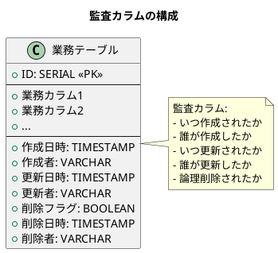

### 監査カラムの種類

| カラム | 型 | 説明 |
|-------|-----|------|
| **作成日時** | TIMESTAMP | レコード作成日時 |
| **作成者** | VARCHAR | レコード作成者 |
| **更新日時** | TIMESTAMP | 最終更新日時 |
| **更新者** | VARCHAR | 最終更新者 |
| **削除フラグ** | BOOLEAN | 論理削除フラグ |
| **削除日時** | TIMESTAMP | 論理削除日時 |
| **削除者** | VARCHAR | 論理削除実行者 |

### 論理削除の考え方

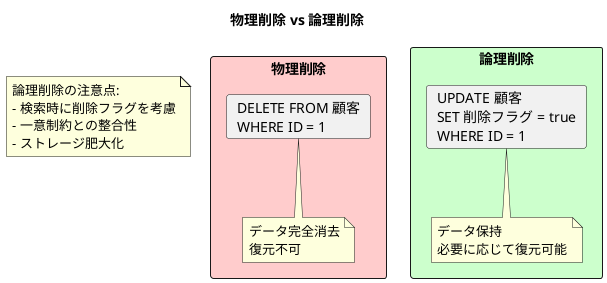

### 監査カラム用エンティティ基底クラス

<details>
<summary>Auditable 基底クラス</summary>

```java
// src/main/java/com/example/sales/domain/model/common/Auditable.java
package com.example.sales.domain.model.common;

import lombok.Data;
import lombok.experimental.SuperBuilder;

import java.time.LocalDateTime;

@Data
@SuperBuilder
public abstract class Auditable {
    private LocalDateTime createdAt;
    private String createdBy;
    private LocalDateTime updatedAt;
    private String updatedBy;
    private Boolean deletedFlag;
    private LocalDateTime deletedAt;
    private String deletedBy;

    /**
     * 論理削除されているかどうか
     */
    public boolean isDeleted() {
        return deletedFlag != null && deletedFlag;
    }

    /**
     * 論理削除を実行
     */
    public void softDelete(String deletedBy) {
        this.deletedFlag = true;
        this.deletedAt = LocalDateTime.now();
        this.deletedBy = deletedBy;
    }

    /**
     * 論理削除を復元
     */
    public void restore() {
        this.deletedFlag = false;
        this.deletedAt = null;
        this.deletedBy = null;
    }
}
```

</details>

### MyBatis インターセプターによる自動設定

<details>
<summary>監査インターセプター</summary>

```java
// src/main/java/com/example/sales/infrastructure/persistence/AuditInterceptor.java
package com.example.sales.infrastructure.persistence;

import com.example.sales.domain.model.common.Auditable;
import org.apache.ibatis.executor.Executor;
import org.apache.ibatis.mapping.MappedStatement;
import org.apache.ibatis.mapping.SqlCommandType;
import org.apache.ibatis.plugin.*;
import org.springframework.security.core.Authentication;
import org.springframework.security.core.context.SecurityContextHolder;
import org.springframework.stereotype.Component;

import java.time.LocalDateTime;
import java.util.Properties;

@Intercepts({
    @Signature(type = Executor.class, method = "update",
               args = {MappedStatement.class, Object.class})
})
@Component
public class AuditInterceptor implements Interceptor {

    @Override
    public Object intercept(Invocation invocation) throws Throwable {
        MappedStatement ms = (MappedStatement) invocation.getArgs()[0];
        Object parameter = invocation.getArgs()[1];

        if (parameter instanceof Auditable auditable) {
            String currentUser = getCurrentUser();
            LocalDateTime now = LocalDateTime.now();

            if (ms.getSqlCommandType() == SqlCommandType.INSERT) {
                auditable.setCreatedAt(now);
                auditable.setCreatedBy(currentUser);
                auditable.setUpdatedAt(now);
                auditable.setUpdatedBy(currentUser);
                if (auditable.getDeletedFlag() == null) {
                    auditable.setDeletedFlag(false);
                }
            } else if (ms.getSqlCommandType() == SqlCommandType.UPDATE) {
                auditable.setUpdatedAt(now);
                auditable.setUpdatedBy(currentUser);
            }
        }

        return invocation.proceed();
    }

    private String getCurrentUser() {
        Authentication authentication = SecurityContextHolder
                .getContext().getAuthentication();
        if (authentication != null && authentication.isAuthenticated()) {
            return authentication.getName();
        }
        return "SYSTEM";
    }

    @Override
    public Object plugin(Object target) {
        return Plugin.wrap(target, this);
    }

    @Override
    public void setProperties(Properties properties) {
        // 設定プロパティがあれば処理
    }
}
```

</details>

---

## 11.4 履歴テーブルの設計

### 履歴管理の種類

| 種類 | 説明 | 用途 |
|-----|------|-----|
| **変更履歴** | 変更前後の値を記録 | 監査、デバッグ |
| **スナップショット** | 特定時点の状態を保存 | 帳票再発行、分析 |
| **イベントソーシング** | すべてのイベントを記録 | 完全な追跡、再構築 |

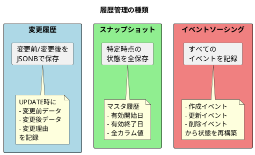

### 変更履歴テーブルの ER 図

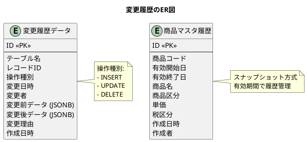

### マイグレーション：履歴テーブルの作成

<details>
<summary>V021__create_history_tables.sql</summary>

```sql
-- src/main/resources/db/migration/V021__create_history_tables.sql

-- 変更履歴データ
CREATE TABLE "変更履歴データ" (
    "ID" SERIAL PRIMARY KEY,
    "テーブル名" VARCHAR(100) NOT NULL,
    "レコードID" VARCHAR(100) NOT NULL,
    "操作種別" VARCHAR(10) NOT NULL,  -- INSERT, UPDATE, DELETE
    "変更日時" TIMESTAMP NOT NULL,
    "変更者" VARCHAR(50) NOT NULL,
    "変更前データ" JSONB,
    "変更後データ" JSONB,
    "変更理由" TEXT,
    "作成日時" TIMESTAMP DEFAULT CURRENT_TIMESTAMP NOT NULL
);

-- マスタ履歴データ（スナップショット方式の例）
CREATE TABLE "商品マスタ履歴" (
    "ID" SERIAL PRIMARY KEY,
    "商品コード" VARCHAR(20) NOT NULL,
    "有効開始日" DATE NOT NULL,
    "有効終了日" DATE,
    "商品名" VARCHAR(100) NOT NULL,
    "商品区分" 商品区分 NOT NULL,
    "単価" DECIMAL(15, 2),
    "税区分" 税区分,
    "作成日時" TIMESTAMP DEFAULT CURRENT_TIMESTAMP NOT NULL,
    "作成者" VARCHAR(50),
    UNIQUE ("商品コード", "有効開始日")
);

-- インデックス
CREATE INDEX "idx_変更履歴_テーブル名" ON "変更履歴データ"("テーブル名");
CREATE INDEX "idx_変更履歴_レコードID" ON "変更履歴データ"("レコードID");
CREATE INDEX "idx_変更履歴_変更日時" ON "変更履歴データ"("変更日時");
CREATE INDEX "idx_商品マスタ履歴_商品コード" ON "商品マスタ履歴"("商品コード");
CREATE INDEX "idx_商品マスタ履歴_有効期間"
    ON "商品マスタ履歴"("有効開始日", "有効終了日");

-- テーブルコメント
COMMENT ON TABLE "変更履歴データ" IS 'データ変更の履歴をJSONBで保存するテーブル';
COMMENT ON TABLE "商品マスタ履歴" IS '商品マスタのスナップショット履歴';
```

</details>

### 履歴サービスの実装

<details>
<summary>変更履歴エンティティ</summary>

```java
// src/main/java/com/example/sales/domain/model/common/ChangeHistory.java
package com.example.sales.domain.model.common;

import lombok.Builder;
import lombok.Data;

import java.time.LocalDateTime;

@Data
@Builder
public class ChangeHistory {
    private Integer id;
    private String tableName;
    private String recordId;
    private String operationType;
    private LocalDateTime changedAt;
    private String changedBy;
    private String beforeData;
    private String afterData;
    private String changeReason;
    private LocalDateTime createdAt;
}
```

</details>

<details>
<summary>履歴サービス</summary>

```java
// src/main/java/com/example/sales/application/service/HistoryService.java
package com.example.sales.application.service;

import com.example.sales.domain.model.common.ChangeHistory;
import com.example.sales.infrastructure.persistence.mapper.ChangeHistoryMapper;
import com.fasterxml.jackson.core.JsonProcessingException;
import com.fasterxml.jackson.databind.ObjectMapper;
import lombok.RequiredArgsConstructor;
import org.springframework.stereotype.Service;
import org.springframework.transaction.annotation.Transactional;

import java.time.LocalDateTime;
import java.util.List;

@Service
@RequiredArgsConstructor
public class HistoryService {

    private final ChangeHistoryMapper changeHistoryMapper;
    private final ObjectMapper objectMapper;

    /**
     * 変更履歴を記録
     */
    @Transactional
    public void recordChange(String tableName, String recordId,
                             String operationType, Object beforeData,
                             Object afterData, String changedBy,
                             String changeReason) {
        try {
            String beforeJson = beforeData != null
                    ? objectMapper.writeValueAsString(beforeData) : null;
            String afterJson = afterData != null
                    ? objectMapper.writeValueAsString(afterData) : null;

            ChangeHistory history = ChangeHistory.builder()
                    .tableName(tableName)
                    .recordId(recordId)
                    .operationType(operationType)
                    .changedAt(LocalDateTime.now())
                    .changedBy(changedBy)
                    .beforeData(beforeJson)
                    .afterData(afterJson)
                    .changeReason(changeReason)
                    .build();

            changeHistoryMapper.insert(history);
        } catch (JsonProcessingException e) {
            throw new RuntimeException(
                    "履歴データのシリアライズに失敗しました", e);
        }
    }

    /**
     * INSERT履歴を記録
     */
    @Transactional
    public void recordInsert(String tableName, String recordId,
                             Object data, String changedBy) {
        recordChange(tableName, recordId, "INSERT", null, data, changedBy, null);
    }

    /**
     * UPDATE履歴を記録
     */
    @Transactional
    public void recordUpdate(String tableName, String recordId,
                             Object beforeData, Object afterData,
                             String changedBy, String changeReason) {
        recordChange(tableName, recordId, "UPDATE",
                beforeData, afterData, changedBy, changeReason);
    }

    /**
     * DELETE履歴を記録
     */
    @Transactional
    public void recordDelete(String tableName, String recordId,
                             Object data, String changedBy,
                             String changeReason) {
        recordChange(tableName, recordId, "DELETE",
                data, null, changedBy, changeReason);
    }

    /**
     * テーブルとレコードIDで履歴を検索
     */
    public List<ChangeHistory> findByTableAndRecordId(String tableName,
                                                       String recordId) {
        return changeHistoryMapper.findByTableAndRecordId(tableName, recordId);
    }

    /**
     * 期間で履歴を検索
     */
    public List<ChangeHistory> findByDateRange(LocalDateTime fromDateTime,
                                                LocalDateTime toDateTime) {
        return changeHistoryMapper.findByDateRange(fromDateTime, toDateTime);
    }
}
```

</details>

---

## 業務システムでの使い分け

赤黒処理、論理削除、変更履歴は、業務の性質に応じて使い分けます。

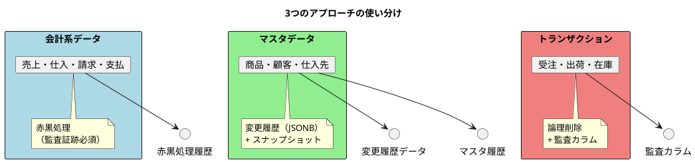

| データ種別 | 推奨方式 | 理由 |
|-----------|---------|------|
| **会計系** | 赤黒処理 | 監査対応、会計原則 |
| **マスタ** | 変更履歴 + スナップショット | 変更追跡、過去参照 |
| **トランザクション** | 論理削除 + 監査カラム | 運用効率、復元可能 |

---

## 第11章のまとめ

本章では、販売管理システム全般で使用される共通処理の DB 設計と実装について学びました。

### 学んだこと

1. **赤黒処理の設計**
   - 確定済み伝票の訂正方法
   - 赤伝票（マイナス計上）と黒伝票（プラス計上）
   - 監査証跡の確保

2. **自動採番の設計**
   - 採番マスタによる柔軟な設定
   - 年次・月次・日次・連番の対応
   - 履歴による採番管理

3. **監査カラムの設計**
   - 作成日時・作成者・更新日時・更新者
   - 論理削除（削除フラグ・削除日時・削除者）
   - インターセプターによる自動設定

4. **履歴テーブルの設計**
   - 変更履歴（変更前後の JSON 保存）
   - スナップショット方式の履歴
   - 有効期間による履歴管理

### テーブル一覧

| テーブル名（日本語） | Java エンティティ | 説明 |
|---|---|---|
| 赤黒処理履歴データ | RedBlackHistory | 赤黒処理の履歴 |
| 採番マスタ | NumberingMaster | 採番ルールの定義 |
| 採番履歴データ | NumberingHistory | 年月別の採番状況 |
| 変更履歴データ | ChangeHistory | データ変更の履歴 |
| 商品マスタ履歴 | ProductHistory | 商品マスタのスナップショット |

### ENUM 一覧

| DB ENUM 型（日本語） | Java Enum | 値 |
|---|---|---|
| 伝票区分 | SlipType | 通常→NORMAL, 赤伝→RED, 黒伝→BLACK |

### 共通処理 ER 図

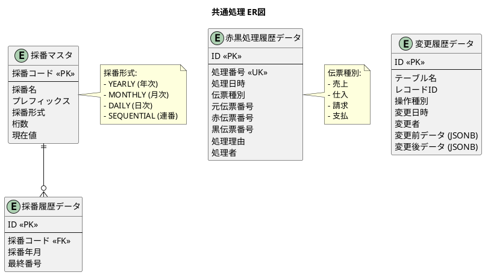

### 次章の予告

第12章では、B 社事例を用いた財務会計データの作成に進みます。販売管理システムで設計したマスタ・トランザクションデータを、実際のビジネスシナリオに基づいて構築します。

---

[← 第10章：債務管理の設計](./chapter10.md) | [第12章：財務会計データ作成（B社事例） →](./chapter12.md)
