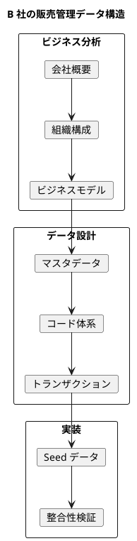
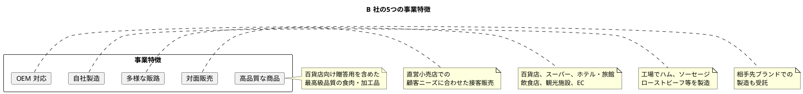
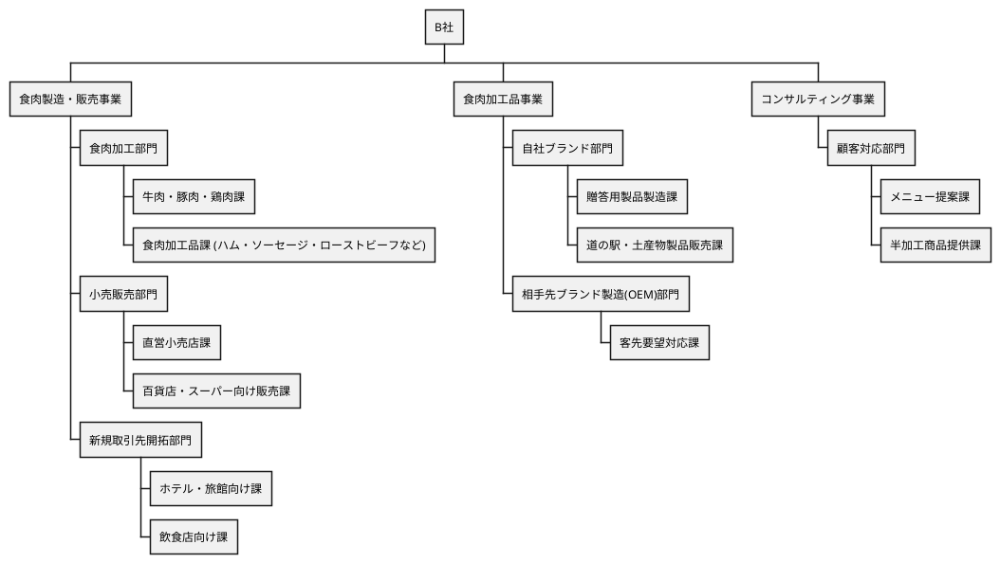
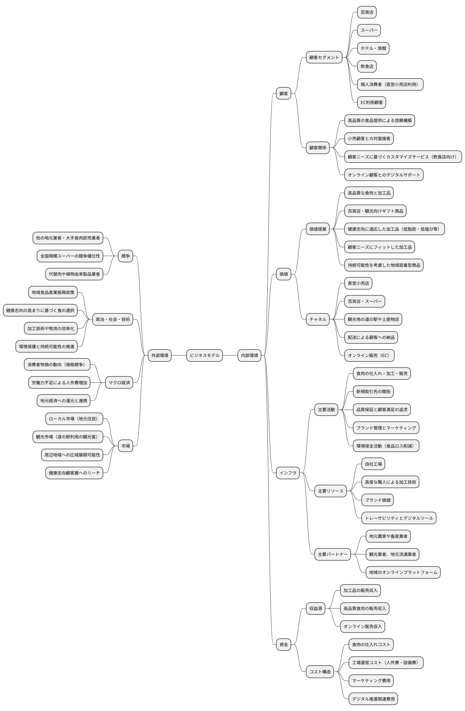
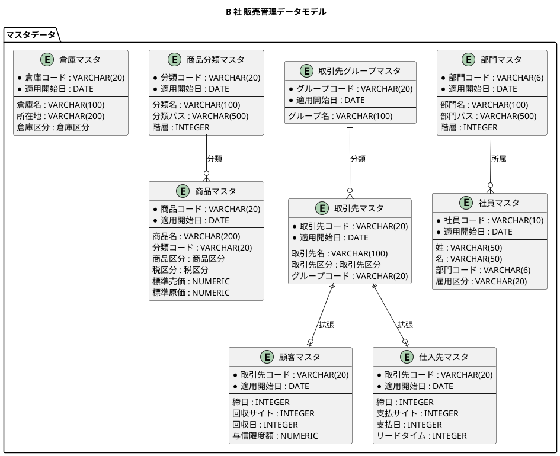
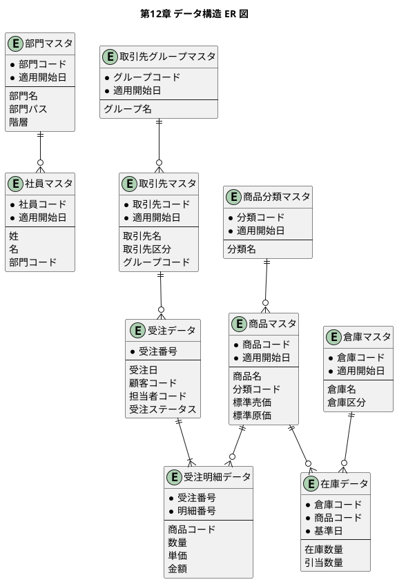

# 第12章：販売管理データ設計（B 社事例）

販売管理システムのデータベース設計を、食肉・食肉加工品の製造販売を行う B 社の事例を通じて実践的に学びます。本章では、実際のビジネスに基づいたマスタデータとトランザクションデータの設計・実装方法を解説します。

## B 社事例の全体像

B 社の販売管理システムに必要なデータ構造を、ビジネスモデルから段階的に設計します。



### 本章の構成

| セクション | 内容 |
|-----------|------|
| **12.1 B 社の概要** | 会社プロファイル、事業環境、事業特徴 |
| **12.2 組織構成** | 組織図、部門階層、社員配置 |
| **12.3 ビジネスモデル** | ビジネスモデルキャンバス、取引先・商品構成 |
| **12.4 データ構造の設計** | マスタ構成、コード体系、ENUM マッピング |
| **12.5 Seed データの実装** | マスタ・トランザクションの投入実装 |

---

## 12.1 B 社の概要

### 会社プロファイル

| 項目 | 内容 |
|------|------|
| **社名** | B 社（架空） |
| **業種** | 食肉・食肉加工品の製造・販売業 |
| **資本金** | 3,000 万円 |
| **従業員数** | 45 名（うちパート従業員 21 名） |
| **事業所** | 本社、工場、直営小売店 1 店舗 |
| **年間販売額** | 約 9 億円（2021 年度） |
| **主要取扱商品** | 牛肉、豚肉、鶏肉、食肉加工品 |

### 沿革と事業環境

B 社は X 県の大都市近郊に立地し、高速道路のインターチェンジからも近い車の利便性が良いエリアに位置しています。

1955 年に食肉小売店として開業し、当時の食肉消費拡大の波に乗って順調に成長。1960 年代には地域の百貨店や近隣スーパーへの卸売事業を開始しました。

百貨店やスーパーとの取引実績から、B 社の商品はクオリティの高さに定評があり、仕入れ元からの信頼も厚く、良質な食肉を安定的に仕入れられる体制が整っています。

### 事業の特徴



| 特徴 | 説明 |
|------|------|
| **高品質な商品** | 百貨店向けには贈答用を含めた最高級品質の食肉や食肉加工品 |
| **対面販売** | 直営小売店では顧客ニーズに合わせた接客販売 |
| **多様な販路** | 百貨店、スーパー、ホテル・旅館、飲食店、観光施設、EC |
| **自社製造** | 工場でハム、ソーセージ、ローストビーフ等の加工品を製造 |
| **OEM 対応** | 相手先ブランドでの製造も受託 |

---

## 12.2 組織構成

### 組織図



### 部門マスタの階層構造

```
本社（000000）
├── 食肉製造・販売事業（100000）
│   ├── 食肉加工部門（110000）
│   │   ├── 牛肉・豚肉・鶏肉課（111000）
│   │   └── 食肉加工品課（112000）
│   ├── 小売販売部門（120000）
│   │   ├── 直営小売店課（121000）
│   │   └── 百貨店・スーパー向け販売課（122000）
│   └── 新規取引先開拓部門（130000）
│       ├── ホテル・旅館向け課（131000）
│       └── 飲食店向け課（132000）
├── 食肉加工品事業（200000）
│   ├── 自社ブランド部門（210000）
│   │   ├── 贈答用製品製造課（211000）
│   │   └── 道の駅・土産物製品販売課（212000）
│   └── 相手先ブランド製造(OEM)部門（220000）
│       └── 客先要望対応課（221000）
└── コンサルティング事業（300000）
    └── 顧客対応部門（310000）
        ├── メニュー提案課（311000）
        └── 半加工商品提供課（312000）
```

### 社員の配置

| 部門 | 正社員 | パート | 計 |
|------|--------|--------|-----|
| 経営層（本社） | 2 名 | - | 2 名 |
| 食肉製造・販売事業 | 8 名 | 7 名 | 15 名 |
| 食肉加工品事業 | 6 名 | 8 名 | 14 名 |
| コンサルティング事業 | 6 名 | 6 名 | 12 名 |
| 経理・総務等 | 2 名 | - | 2 名 |
| **合計** | **24 名** | **21 名** | **45 名** |

---

## 12.3 ビジネスモデル

### ビジネスモデルキャンバス



### 得意先の分類

| グループ | 取引先例 | 特徴 |
|---------|---------|------|
| 百貨店 | 地域百貨店、X 県有名百貨店 | 贈答用高級品、ギフト需要 |
| スーパー | 地域スーパーチェーン、広域スーパーチェーン | 日常使いのカット肉・スライス肉 |
| ホテル・旅館 | シティホテル、温泉旅館 | 宴会・レストラン向け |
| 飲食店 | 焼肉レストラン、イタリアンレストラン | メニュー提案付き販売 |
| 観光施設 | 道の駅、観光センター | 土産物・贈答品 |

### 仕入先の分類

| グループ | 取引先例 | 特徴 |
|---------|---------|------|
| 食肉卸 | 地域食肉卸 A 社、地域食肉卸 B 社 | 牛肉・豚肉・鶏肉の安定供給 |
| 畜産業者 | 地域畜産農家、県内畜産組合 | 高品質な原材料 |

### 商品構成

| 分類 | 商品例 | 特徴 |
|------|--------|------|
| 牛肉 | 黒毛和牛サーロイン、ロース、カルビ、ヒレ、切り落とし | 高級品から日常使いまで |
| 豚肉 | 豚ロース、豚バラ、豚ヒレ、豚コマ、豚肩ロース | 幅広い用途 |
| 鶏肉 | 鶏もも、鶏むね、手羽先、手羽元、鶏ささみ | 健康志向にも対応 |
| 加工品 | ローストビーフ、ハム、ソーセージ、ベーコン、コロッケ | 自社工場製造 |

---

## 12.4 データ構造の設計

### マスタデータの構成

| データ種別 | 件数 | 内容 |
|-----------|------|------|
| 部門マスタ | 21 件 | 4 階層の組織構造 |
| 社員マスタ | 24 件 | 正社員 24 名 |
| 取引先マスタ | 14 件 | 得意先 10 件、仕入先 4 件 |
| 商品分類マスタ | 4 件 | 牛肉、豚肉、鶏肉、加工品 |
| 商品マスタ | 20 件 | 各分類 5 件ずつ |
| 倉庫マスタ | 3 件 | 本社倉庫、工場倉庫、外部委託倉庫 |

### コード体系

#### 商品コード体系

| 接頭辞 | 区分 | 例 |
|--------|------|-----|
| BEEF- | 牛肉 | BEEF-001 黒毛和牛サーロイン |
| PORK- | 豚肉 | PORK-001 豚ロース |
| CHKN- | 鶏肉 | CHKN-001 鶏もも |
| PROC- | 加工品 | PROC-001 ローストビーフ |

#### 取引先コード体系

| 接頭辞 | 区分 | 例 |
|--------|------|-----|
| CUS- | 得意先 | CUS-001 地域百貨店 |
| SUP- | 仕入先 | SUP-001 地域食肉卸 A 社 |

#### 部門コード体系

| コード | 部門名 | 階層 |
|--------|--------|------|
| 000000 | 本社 | 1 |
| 100000 | 食肉製造・販売事業 | 2 |
| 110000 | 食肉加工部門 | 3 |
| 111000 | 牛肉・豚肉・鶏肉課 | 4 |
| 112000 | 食肉加工品課 | 4 |
| 120000 | 小売販売部門 | 3 |
| 121000 | 直営小売店課 | 4 |
| 122000 | 百貨店・スーパー向け販売課 | 4 |
| 200000 | 食肉加工品事業 | 2 |
| 300000 | コンサルティング事業 | 2 |

### ENUM の日本語・英語マッピング

本システムでは、データベースの ENUM 値は日本語、Java の ENUM は英語で定義し、MyBatis の TypeHandler でマッピングを行います。

#### 取引先区分（PartnerType）

| 日本語 DB 値 | 英語 Java 値 |
|-------------|-------------|
| "顧客" | CUSTOMER |
| "仕入先" | SUPPLIER |

#### 商品区分（ProductType）

| 日本語 DB 値 | 英語 Java 値 |
|-------------|-------------|
| "商品" | PRODUCT |
| "製品" | MANUFACTURED |
| "サービス" | SERVICE |

#### 税区分（TaxType）

| 日本語 DB 値 | 英語 Java 値 |
|-------------|-------------|
| "標準税率" | STANDARD |
| "軽減税率" | REDUCED |
| "非課税" | EXEMPT |

#### 受注ステータス（OrderStatus）

| 日本語 DB 値 | 英語 Java 値 |
|-------------|-------------|
| "受付済" | RECEIVED |
| "引当済" | ALLOCATED |
| "出荷指示済" | SHIPMENT_INSTRUCTED |
| "出荷済" | SHIPPED |
| "キャンセル" | CANCELLED |

#### 出荷ステータス（ShipmentStatus）

| 日本語 DB 値 | 英語 Java 値 |
|-------------|-------------|
| "未出荷" | PENDING |
| "出荷済" | SHIPPED |
| "配達完了" | DELIVERED |

#### 発注ステータス（PurchaseStatus）

| 日本語 DB 値 | 英語 Java 値 |
|-------------|-------------|
| "発注済" | ORDERED |
| "入荷済" | RECEIVED |
| "検収済" | INSPECTED |
| "キャンセル" | CANCELLED |

#### 倉庫区分（WarehouseType）

| 日本語 DB 値 | 英語 Java 値 |
|-------------|-------------|
| "自社" | OWN |
| "外部" | EXTERNAL |
| "仮想" | VIRTUAL |

### データモデル ER 図



---

## 12.5 Seed データの実装

### 実装方針

Seed データの投入にあたり、以下のポイントを考慮します。

| ポイント | 説明 |
|---------|------|
| **外部キー制約の考慮** | データ投入順序を依存関係に基づいて設計 |
| **複合キーの扱い** | 適用開始日を含む複合主キーへの対応 |
| **日本語テーブル名・カラム名** | MyBatis の resultMap でマッピング |
| **ヘキサゴナルアーキテクチャ** | Repository（出力ポート）経由でデータ投入 |
| **Spring Profile の活用** | `default` プロファイルでアプリ起動時に自動投入 |

### プロジェクト構造

```
src/
├── main/
│   └── java/
│       └── com/example/sms/
│           ├── application/
│           │   └── port/
│           │       └── out/
│           │           └── *Repository.java    # 出力ポート
│           ├── domain/
│           │   └── model/
│           │       └── ...                     # ドメインモデル
│           └── infrastructure/
│               ├── in/
│               │   ├── rest/                   # REST API アダプタ
│               │   └── seed/                   # Seed データ投入
│               │       ├── SeedDataService.java
│               │       ├── MasterDataSeeder.java
│               │       ├── TransactionDataSeeder.java
│               │       └── SeedRunner.java
│               └── out/
│                   └── persistence/
│                       ├── mapper/             # MyBatis Mapper
│                       └── repository/         # Repository 実装
└── test/
    └── java/
        └── com/example/sms/
            └── infrastructure/
                └── in/
                    └── seed/
                        └── SeedDataServiceTest.java
```

### SeedDataService の実装

<details>
<summary>SeedDataService.java</summary>

```java
package com.example.sms.infrastructure.in.seed;

import org.slf4j.Logger;
import org.slf4j.LoggerFactory;
import org.springframework.stereotype.Service;
import org.springframework.transaction.annotation.Transactional;

import java.time.LocalDate;

/**
 * Seed データ投入サービス.
 * B社事例に基づく販売管理システムの初期データを投入する。
 */
@Service
public class SeedDataService {

    private static final Logger log = LoggerFactory.getLogger(SeedDataService.class);

    private final MasterDataSeeder masterDataSeeder;
    private final TransactionDataSeeder transactionDataSeeder;

    public SeedDataService(
            MasterDataSeeder masterDataSeeder,
            TransactionDataSeeder transactionDataSeeder) {
        this.masterDataSeeder = masterDataSeeder;
        this.transactionDataSeeder = transactionDataSeeder;
    }

    /**
     * すべての Seed データを投入.
     */
    @Transactional
    public void seedAll() {
        log.info("========================================");
        log.info("販売管理システム Seed データ投入開始");
        log.info("========================================");

        LocalDate effectiveDate = LocalDate.of(2025, 1, 1);

        // 既存データの削除
        cleanAllData();

        // マスタデータの投入
        masterDataSeeder.seedAll(effectiveDate);

        // トランザクションデータの投入
        transactionDataSeeder.seedAll(effectiveDate);

        log.info("========================================");
        log.info("販売管理システム Seed データ投入完了!");
        log.info("========================================");
    }

    private void cleanAllData() {
        log.info("既存データを削除中...");

        // トランザクションデータから削除（外部キー制約のため逆順）
        transactionDataSeeder.cleanAll();

        // マスタデータを削除
        masterDataSeeder.cleanAll();

        log.info("既存データ削除完了");
    }
}
```

</details>

### MasterDataSeeder の実装

<details>
<summary>MasterDataSeeder.java</summary>

```java
package com.example.sms.infrastructure.in.seed;

import com.example.sms.application.port.out.*;
import com.example.sms.domain.model.department.Department;
import com.example.sms.domain.model.employee.Employee;
import com.example.sms.domain.model.inventory.Warehouse;
import com.example.sms.domain.model.inventory.WarehouseType;
import com.example.sms.domain.model.partner.Partner;
import com.example.sms.domain.model.product.*;
import org.slf4j.Logger;
import org.slf4j.LoggerFactory;
import org.springframework.stereotype.Component;

import java.math.BigDecimal;
import java.time.LocalDate;
import java.util.List;

/**
 * マスタデータ Seeder.
 * B社事例に基づくマスタデータを投入する。
 */
@Component
public class MasterDataSeeder {

    private static final Logger log = LoggerFactory.getLogger(MasterDataSeeder.class);

    private final DepartmentRepository departmentRepository;
    private final EmployeeRepository employeeRepository;
    private final PartnerRepository partnerRepository;
    private final ProductClassificationRepository productClassificationRepository;
    private final ProductRepository productRepository;
    private final WarehouseRepository warehouseRepository;

    // コンストラクタ省略

    /**
     * すべてのマスタデータを投入.
     */
    public void seedAll(LocalDate effectiveDate) {
        seedDepartments(effectiveDate);
        seedWarehouses();
        seedProductClassifications();
        seedProducts();
        seedPartners();
        seedEmployees(effectiveDate);
    }

    /**
     * すべてのマスタデータを削除.
     */
    public void cleanAll() {
        employeeRepository.deleteAll();
        productRepository.deleteAll();
        productClassificationRepository.deleteAll();
        partnerRepository.deleteAll();
        warehouseRepository.deleteAll();
        departmentRepository.deleteAll();
    }

    private void seedDepartments(LocalDate effectiveDate) {
        log.info("部門マスタを投入中...");

        List<Department> departments = List.of(
            // 本社
            Department.builder()
                .departmentCode("000000").startDate(effectiveDate)
                .departmentName("本社").departmentPath("/000000").hierarchyLevel(1).build(),

            // 食肉製造・販売事業
            Department.builder()
                .departmentCode("100000").startDate(effectiveDate)
                .departmentName("食肉製造・販売事業").departmentPath("/000000/100000").hierarchyLevel(2).build(),
            // ... 以下省略
        );

        departments.forEach(departmentRepository::save);
        log.info("部門マスタ {}件 投入完了", departments.size());
    }

    private void seedWarehouses() {
        log.info("倉庫マスタを投入中...");

        List<Warehouse> warehouses = List.of(
            Warehouse.builder()
                .warehouseCode("WH-HQ")
                .warehouseName("本社倉庫")
                .warehouseType(WarehouseType.OWN)
                .address("東京都千代田区1-1-1")
                .activeFlag(true)
                .build(),
            Warehouse.builder()
                .warehouseCode("WH-FAC")
                .warehouseName("工場倉庫")
                .warehouseType(WarehouseType.OWN)
                .address("埼玉県さいたま市2-2-2")
                .activeFlag(true)
                .build(),
            Warehouse.builder()
                .warehouseCode("WH-EXT")
                .warehouseName("外部委託倉庫")
                .warehouseType(WarehouseType.EXTERNAL)
                .address("神奈川県横浜市3-3-3")
                .activeFlag(true)
                .build()
        );

        warehouses.forEach(warehouseRepository::save);
        log.info("倉庫マスタ {}件 投入完了", warehouses.size());
    }

    private void seedProductClassifications() {
        log.info("商品分類マスタを投入中...");

        List<ProductClassification> categories = List.of(
            ProductClassification.builder()
                .classificationCode("CAT-BEEF").classificationName("牛肉")
                .classificationPath("/CAT-BEEF").hierarchyLevel(1).build(),
            ProductClassification.builder()
                .classificationCode("CAT-PORK").classificationName("豚肉")
                .classificationPath("/CAT-PORK").hierarchyLevel(1).build(),
            ProductClassification.builder()
                .classificationCode("CAT-CHKN").classificationName("鶏肉")
                .classificationPath("/CAT-CHKN").hierarchyLevel(1).build(),
            ProductClassification.builder()
                .classificationCode("CAT-PROC").classificationName("加工品")
                .classificationPath("/CAT-PROC").hierarchyLevel(1).build()
        );

        categories.forEach(productClassificationRepository::save);
        log.info("商品分類マスタ {}件 投入完了", categories.size());
    }

    private void seedProducts() {
        log.info("商品マスタを投入中...");

        List<Product> products = List.of(
            // 牛肉
            createProduct("BEEF-001", "黒毛和牛サーロイン", "CAT-BEEF", 8000, 5000),
            createProduct("BEEF-002", "黒毛和牛ロース", "CAT-BEEF", 6000, 3800),
            // ... 以下省略（全20件）
        );

        products.forEach(productRepository::save);
        log.info("商品マスタ {}件 投入完了", products.size());
    }

    private Product createProduct(String code, String name, String classificationCode,
                                   int sellingPrice, int purchasePrice) {
        return Product.builder()
            .productCode(code)
            .productName(name)
            .productCategory(ProductCategory.PRODUCT)
            .taxCategory(TaxCategory.EXCLUSIVE)
            .classificationCode(classificationCode)
            .sellingPrice(new BigDecimal(sellingPrice))
            .purchasePrice(new BigDecimal(purchasePrice))
            .isInventoryManaged(true)
            .build();
    }

    private void seedPartners() {
        log.info("取引先マスタを投入中...");

        List<Partner> partners = List.of(
            // 得意先（百貨店）
            createCustomer("CUS-001", "地域百貨店"),
            createCustomer("CUS-002", "X県有名百貨店"),
            // ... 以下省略（全14件：得意先10件、仕入先4件）
        );

        partners.forEach(partnerRepository::save);
        log.info("取引先マスタ {}件 投入完了", partners.size());
    }

    private Partner createCustomer(String code, String name) {
        return Partner.builder()
            .partnerCode(code)
            .partnerName(name)
            .isCustomer(true)
            .isSupplier(false)
            .creditLimit(new BigDecimal("10000000"))
            .build();
    }

    private Partner createSupplier(String code, String name) {
        return Partner.builder()
            .partnerCode(code)
            .partnerName(name)
            .isCustomer(false)
            .isSupplier(true)
            .build();
    }

    private void seedEmployees(LocalDate effectiveDate) {
        log.info("社員マスタを投入中...");

        List<Employee> employees = List.of(
            // 経営層
            createEmployee("EMP-001", "山田 太郎", "000000", effectiveDate),
            createEmployee("EMP-002", "佐藤 次郎", "000000", effectiveDate),
            // ... 以下省略（全24件）
        );

        employees.forEach(employeeRepository::save);
        log.info("社員マスタ {}件 投入完了", employees.size());
    }

    private Employee createEmployee(String code, String name, String departmentCode,
                                     LocalDate departmentStartDate) {
        return Employee.builder()
            .employeeCode(code)
            .employeeName(name)
            .departmentCode(departmentCode)
            .departmentStartDate(departmentStartDate)
            .build();
    }
}
```

</details>

### TransactionDataSeeder の実装

<details>
<summary>TransactionDataSeeder.java</summary>

```java
package com.example.sms.infrastructure.in.seed;

import com.example.sms.application.port.out.*;
import com.example.sms.domain.model.inventory.Inventory;
import com.example.sms.domain.model.product.TaxCategory;
import com.example.sms.domain.model.sales.OrderStatus;
import com.example.sms.domain.model.sales.SalesOrder;
import com.example.sms.domain.model.sales.SalesOrderDetail;
import org.slf4j.Logger;
import org.slf4j.LoggerFactory;
import org.springframework.stereotype.Component;

import java.math.BigDecimal;
import java.time.LocalDate;
import java.util.List;

/**
 * トランザクションデータ Seeder.
 * B社事例に基づくトランザクションデータを投入する。
 */
@Component
public class TransactionDataSeeder {

    private static final Logger log = LoggerFactory.getLogger(TransactionDataSeeder.class);

    private final InventoryRepository inventoryRepository;
    private final SalesOrderRepository salesOrderRepository;
    private final ShipmentRepository shipmentRepository;
    private final SalesRepository salesRepository;

    // コンストラクタ省略

    /**
     * すべてのトランザクションデータを投入.
     */
    public void seedAll(LocalDate effectiveDate) {
        seedInventories();
        seedOrders(effectiveDate);
    }

    /**
     * すべてのトランザクションデータを削除.
     */
    public void cleanAll() {
        salesRepository.deleteAll();
        shipmentRepository.deleteAll();
        salesOrderRepository.deleteAll();
        inventoryRepository.deleteAll();
    }

    private void seedInventories() {
        log.info("在庫情報を投入中...");

        List<Inventory> inventories = List.of(
            // 本社倉庫の在庫（牛肉）
            createInventory("WH-HQ", "BEEF-001", 50, 10),
            createInventory("WH-HQ", "BEEF-002", 80, 15),
            createInventory("WH-HQ", "BEEF-003", 100, 20),
            createInventory("WH-HQ", "BEEF-004", 30, 5),
            createInventory("WH-HQ", "BEEF-005", 150, 30),

            // 本社倉庫の在庫（豚肉）
            createInventory("WH-HQ", "PORK-001", 200, 30),
            createInventory("WH-HQ", "PORK-002", 250, 40),
            createInventory("WH-HQ", "PORK-003", 100, 15),
            createInventory("WH-HQ", "PORK-004", 300, 50),
            createInventory("WH-HQ", "PORK-005", 180, 25),

            // 本社倉庫の在庫（鶏肉）
            createInventory("WH-HQ", "CHKN-001", 300, 50),
            createInventory("WH-HQ", "CHKN-002", 350, 60),
            createInventory("WH-HQ", "CHKN-003", 200, 30),
            createInventory("WH-HQ", "CHKN-004", 180, 25),
            createInventory("WH-HQ", "CHKN-005", 150, 20),

            // 工場倉庫の在庫（加工品）
            createInventory("WH-FAC", "PROC-001", 100, 20),
            createInventory("WH-FAC", "PROC-002", 150, 30),
            createInventory("WH-FAC", "PROC-003", 200, 40),
            createInventory("WH-FAC", "PROC-004", 180, 35),
            createInventory("WH-FAC", "PROC-005", 300, 50)
        );

        inventories.forEach(inventoryRepository::save);
        log.info("在庫情報 {}件 投入完了", inventories.size());
    }

    private Inventory createInventory(String warehouseCode, String productCode,
                                        int quantity, int allocatedQuantity) {
        return Inventory.builder()
            .warehouseCode(warehouseCode)
            .productCode(productCode)
            .currentQuantity(new BigDecimal(quantity))
            .allocatedQuantity(new BigDecimal(allocatedQuantity))
            .orderedQuantity(BigDecimal.ZERO)
            .build();
    }

    private void seedOrders(LocalDate effectiveDate) {
        log.info("受注データを投入中...");

        // 受注1（百貨店向け）- 引当済み
        SalesOrder order1 = SalesOrder.builder()
            .orderNumber("ORD-2025-001")
            .orderDate(LocalDate.of(2025, 1, 10))
            .customerCode("CUS-001")
            .representativeCode("EMP-009")
            .requestedDeliveryDate(LocalDate.of(2025, 1, 15))
            .status(OrderStatus.ALLOCATED)
            .details(List.of(
                createOrderDetail(1, "BEEF-001", "黒毛和牛サーロイン", 10, 8000),
                createOrderDetail(2, "PROC-001", "ローストビーフ", 20, 3500)
            ))
            .build();
        salesOrderRepository.save(order1);

        // 受注2（スーパー向け）- 引当済み
        SalesOrder order2 = SalesOrder.builder()
            .orderNumber("ORD-2025-002")
            .orderDate(LocalDate.of(2025, 1, 12))
            .customerCode("CUS-003")
            .representativeCode("EMP-009")
            .requestedDeliveryDate(LocalDate.of(2025, 1, 18))
            .status(OrderStatus.ALLOCATED)
            .details(List.of(
                createOrderDetail(1, "PORK-001", "豚ロース", 50, 1200),
                createOrderDetail(2, "CHKN-001", "鶏もも", 100, 480)
            ))
            .build();
        salesOrderRepository.save(order2);

        // 受注3（ホテル向け）- 出荷済み
        SalesOrder order3 = SalesOrder.builder()
            .orderNumber("ORD-2025-003")
            .orderDate(LocalDate.of(2025, 1, 15))
            .customerCode("CUS-005")
            .representativeCode("EMP-010")
            .requestedDeliveryDate(LocalDate.of(2025, 1, 17))
            .status(OrderStatus.SHIPPED)
            .details(List.of(
                createOrderDetail(1, "BEEF-002", "黒毛和牛ロース", 30, 6000),
                createOrderDetail(2, "BEEF-003", "黒毛和牛カルビ", 25, 5500)
            ))
            .build();
        salesOrderRepository.save(order3);

        log.info("受注データ 3件 投入完了");
    }

    private SalesOrderDetail createOrderDetail(int lineNumber, String productCode,
                                                 String productName, int quantity, int unitPrice) {
        BigDecimal qty = new BigDecimal(quantity);
        BigDecimal price = new BigDecimal(unitPrice);
        BigDecimal amount = qty.multiply(price);
        BigDecimal taxRate = new BigDecimal("10.00");
        BigDecimal taxAmount = amount.multiply(taxRate).divide(new BigDecimal("100"));

        return SalesOrderDetail.builder()
            .lineNumber(lineNumber)
            .productCode(productCode)
            .productName(productName)
            .orderQuantity(qty)
            .unitPrice(price)
            .amount(amount)
            .taxCategory(TaxCategory.EXCLUSIVE)
            .taxRate(taxRate)
            .taxAmount(taxAmount)
            .warehouseCode("WH-HQ")
            .build();
    }
}
```

**注**: 出荷・売上データは受注明細への依存関係が複雑なため、初期シードでは投入しません。これらは別途のユースケースで実装します。

</details>

### Seed データ実行方法

#### Gradle タスクの設定

```kotlin
// build.gradle.kts（default プロファイルで実行）
tasks.register<JavaExec>("seedData") {
    group = "application"
    description = "Seed データを投入する（default プロファイル）"
    mainClass.set("com.example.sms.Application")
    classpath = sourceSets["main"].runtimeClasspath
}
```

#### 実行コマンド

```bash
# Gradle タスクで実行
./gradlew seedData

# または直接 Java で実行（default プロファイル）
java -jar build/libs/sms-backend.jar
```

#### 実行結果の例

```
========================================
販売管理システム Seed データ投入開始
========================================
既存データを削除中...
既存データ削除完了
部門マスタを投入中...
部門マスタ 21件 投入完了
倉庫マスタを投入中...
倉庫マスタ 3件 投入完了
商品分類マスタを投入中...
商品分類マスタ 4件 投入完了
商品マスタを投入中...
商品マスタ 20件 投入完了
取引先マスタを投入中...
取引先マスタ 14件 投入完了
社員マスタを投入中...
社員マスタ 24件 投入完了
在庫情報を投入中...
在庫情報 20件 投入完了
受注データを投入中...
受注データ 3件 投入完了
========================================
販売管理システム Seed データ投入完了!
========================================
```

### データの検証と活用

<details>
<summary>SeedDataServiceTest.java</summary>

```java
package com.example.sms.infrastructure.in.seed;

import com.example.sms.application.port.out.*;
import com.example.sms.domain.model.department.Department;
import com.example.sms.domain.model.inventory.Inventory;
import com.example.sms.domain.model.partner.Partner;
import com.example.sms.domain.model.product.Product;
import com.example.sms.domain.model.sales.SalesOrder;
import com.example.sms.testsetup.BaseIntegrationTest;
import org.junit.jupiter.api.*;
import org.springframework.beans.factory.annotation.Autowired;

import java.math.BigDecimal;
import java.util.List;

import static org.assertj.core.api.Assertions.assertThat;

/**
 * Seed データ投入サービス統合テスト.
 */
@DisplayName("Seed データ投入サービス")
class SeedDataServiceTest extends BaseIntegrationTest {

    @Autowired
    private SeedDataService seedDataService;

    @Autowired
    private DepartmentRepository departmentRepository;

    @Autowired
    private PartnerRepository partnerRepository;

    @Autowired
    private ProductRepository productRepository;

    @Autowired
    private InventoryRepository inventoryRepository;

    @Autowired
    private SalesOrderRepository salesOrderRepository;

    @BeforeEach
    void setUp() {
        seedDataService.seedAll();
    }

    @Nested
    @DisplayName("マスタデータの妥当性検証")
    class MasterDataValidation {

        @Test
        @DisplayName("部門マスタが21件投入される")
        void seedsDepartments() {
            List<Department> departments = departmentRepository.findAll();
            assertThat(departments).hasSize(21);
        }

        @Test
        @DisplayName("すべての部門が階層構造を持つ")
        void allDepartmentsHaveHierarchy() {
            List<Department> departments = departmentRepository.findAll();

            for (Department dept : departments) {
                assertThat(dept.getDepartmentPath()).isNotBlank();
                assertThat(dept.getHierarchyLevel()).isPositive();
            }
        }

        @Test
        @DisplayName("商品マスタが20件投入される")
        void seedsProducts() {
            List<Product> products = productRepository.findAll();
            assertThat(products).hasSize(20);
        }

        @Test
        @DisplayName("取引先マスタが14件投入される（得意先10件、仕入先4件）")
        void seedsPartners() {
            List<Partner> partners = partnerRepository.findAll();
            assertThat(partners).hasSize(14);

            List<Partner> customers = partnerRepository.findCustomers();
            List<Partner> suppliers = partnerRepository.findSuppliers();

            assertThat(customers).hasSize(10);
            assertThat(suppliers).hasSize(4);
        }
    }

    @Nested
    @DisplayName("在庫データの妥当性検証")
    class InventoryValidation {

        @Test
        @DisplayName("在庫データが20件投入される")
        void seedsInventories() {
            List<Inventory> inventories = inventoryRepository.findAll();
            assertThat(inventories).hasSize(20);
        }

        @Test
        @DisplayName("在庫数量が0以上である")
        void inventoryQuantityIsNonNegative() {
            List<Inventory> inventories = inventoryRepository.findAll();

            for (Inventory inventory : inventories) {
                assertThat(inventory.getCurrentQuantity())
                    .isGreaterThanOrEqualTo(BigDecimal.ZERO);
            }
        }
    }

    @Nested
    @DisplayName("受注データの妥当性検証")
    class OrderValidation {

        @Test
        @DisplayName("受注データが3件投入される")
        void seedsOrders() {
            List<SalesOrder> orders = salesOrderRepository.findAll();
            assertThat(orders).hasSize(3);
        }

        @Test
        @DisplayName("受注に対応する顧客が存在する")
        void orderHasValidCustomer() {
            List<SalesOrder> orders = salesOrderRepository.findAll();

            for (SalesOrder order : orders) {
                var customer = partnerRepository.findByCode(order.getCustomerCode());
                assertThat(customer).isPresent();
                assertThat(customer.get().isCustomer()).isTrue();
            }
        }
    }

    @Nested
    @DisplayName("再投入時の挙動")
    class ReseededBehavior {

        @Test
        @DisplayName("seedAll を複数回実行してもデータ件数が一定")
        void seedAllIsIdempotent() {
            // 2回目の投入
            seedDataService.seedAll();

            List<Department> departments = departmentRepository.findAll();
            List<Product> products = productRepository.findAll();
            List<Partner> partners = partnerRepository.findAll();

            assertThat(departments).hasSize(21);
            assertThat(products).hasSize(20);
            assertThat(partners).hasSize(14);
        }
    }
}
```

</details>

---

## 第12章のまとめ

B 社の事例を通じて、販売管理システムのデータ設計と Seed データ実装を行いました。

### 実装したデータ

| カテゴリ | 内容 |
|---------|------|
| **マスタデータ** | 部門 21 件、取引先 14 件、商品 20 件、社員 24 件、倉庫 3 件、商品分類 4 件 |
| **トランザクション** | 受注 3 件、在庫 20 件 |
| **備考** | 出荷・売上データは受注明細への依存関係が複雑なため、初期シードでは投入しない |

### B 社の事業特徴とデータ設計への反映

| 特徴 | データ設計への反映 |
|------|-------------------|
| 多様な販路 | 得意先 10 件（百貨店、スーパー、ホテル等）の管理 |
| 自社製造能力 | 工場倉庫（WH-FAC）と加工品カテゴリの分離 |
| 高品質へのこだわり | 商品マスタでの標準売価・仕入価格管理 |
| 地域密着 | 食肉卸・畜産業者の仕入先 4 件 |

### 技術的なポイント

| ポイント | 内容 |
|---------|------|
| **ヘキサゴナルアーキテクチャ** | Repository（出力ポート）経由でデータ投入 |
| **外部キー制約** | マスタ → トランザクションの順で投入 |
| **日本語テーブル名** | MyBatis でダブルクォートで囲む |
| **ENUM マッピング** | 日本語 DB 値 ↔ 英語 Java 値の変換 |
| **Spring Profile** | `default` プロファイルでアプリ起動時に自動投入 |
| **Builder パターン** | ドメインモデルの生成に Builder パターンを使用 |

### ER 図（本章で扱ったテーブル）



次の第13章では、このデータモデルを活用した API サービスの実装に進みます。
