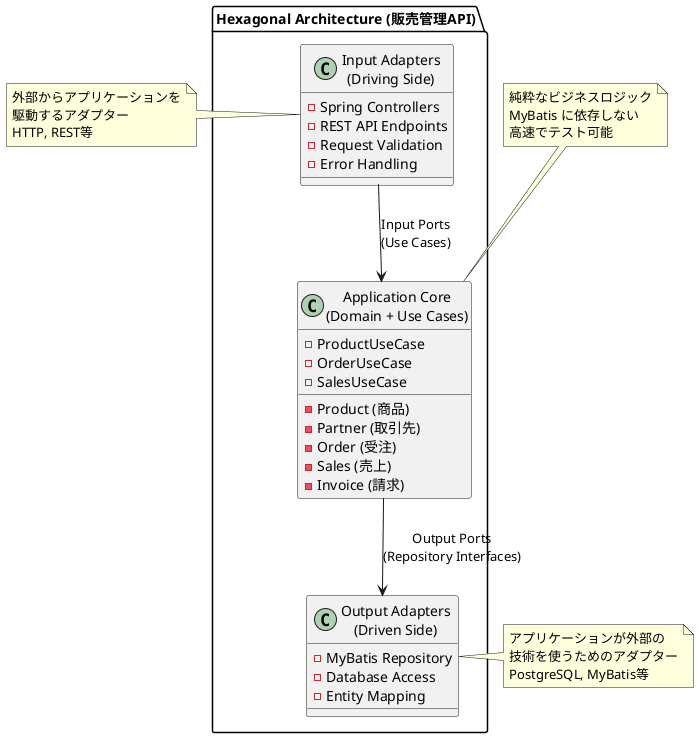

# 第13章：API サービスの実装

本章では、販売管理システムのデータベース設計を外部から利用できるようにするため、RESTful API サービスを実装します。ヘキサゴナルアーキテクチャ（Ports and Adapters）を採用し、ドメインロジックを外部技術から分離した保守性の高い API を構築します。

---

## 13.1 ヘキサゴナルアーキテクチャの復習

### Ports and Adapters パターンの概要

ヘキサゴナルアーキテクチャ（Ports and Adapters パターン）は、Alistair Cockburn によって提唱された設計手法で、アプリケーションの中核となるビジネスロジック（ドメイン層）を外部の技術的詳細から完全に分離することを目的とします。



### ドメイン中心設計

ビジネスロジックを中心に据え、外部技術（DB、Web、UI など）を周辺に配置します。これにより、ビジネスルールが技術的な関心事から独立し、変更に強い設計が実現できます。

### 依存性の逆転

ドメイン層は外部に依存せず、外部がドメイン層に依存します。具体的には、リポジトリのインターフェース（Output Port）をドメイン層で定義し、その実装（Adapter）をインフラストラクチャ層に配置します。

### テスト容易性

モックやスタブを使った単体テストが容易になります。ドメインロジックを独立してテストでき、外部依存（データベースなど）なしで高速なテストが可能です。

---

## 13.2 アーキテクチャ構造

### レイヤー構成

販売管理 API の実装では、以下のレイヤー構造を採用します。

```
src/main/java/com/example/sms/
├── domain/                     # ドメイン層（純粋なビジネスロジック）
│   ├── model/                 # ドメインモデル（エンティティ、値オブジェクト）
│   │   ├── department/        # 部門関連
│   │   ├── employee/          # 社員関連
│   │   ├── inventory/         # 在庫関連
│   │   ├── partner/           # 取引先関連
│   │   ├── product/           # 商品関連
│   │   ├── purchase/          # 仕入関連
│   │   └── sales/             # 販売関連
│   ├── exception/             # ドメイン例外
│   └── type/                  # 値型定義
│
├── application/               # アプリケーション層
│   └── port/
│       └── out/              # Output Port（リポジトリインターフェース）
│
├── infrastructure/            # インフラストラクチャ層
│   ├── in/                   # Input Adapter（受信アダプター）
│   │   ├── rest/             # REST API（Web実装）
│   │   │   ├── controller/   # REST Controller（Spring MVC）
│   │   │   ├── dto/          # Data Transfer Object
│   │   │   └── exception/    # Exception Handler
│   │   └── seed/             # Seed データ投入
│   └── out/                  # Output Adapter（送信アダプター）
│       └── persistence/      # DB実装
│           ├── mapper/       # MyBatis Mapper
│           ├── repository/   # Repository実装
│           └── typehandler/  # 型ハンドラー
│
└── config/                   # 設定クラス
```

### Domain 層

ビジネスルールとドメインモデルを定義します。外部技術に依存しない純粋な Java コードで構成されます。

<details>
<summary>Product.java（商品ドメインモデル）</summary>

```java
package com.example.sms.domain.model.product;

import lombok.AllArgsConstructor;
import lombok.Builder;
import lombok.Data;
import lombok.NoArgsConstructor;

import java.math.BigDecimal;
import java.time.LocalDateTime;

/**
 * 商品エンティティ.
 */
@Data
@Builder
@NoArgsConstructor
@AllArgsConstructor
public class Product {
    private String productCode;
    private String productFullName;
    private String productName;
    private String productNameKana;
    private ProductCategory productCategory;
    private String modelNumber;
    @Builder.Default
    private BigDecimal sellingPrice = BigDecimal.ZERO;
    @Builder.Default
    private BigDecimal purchasePrice = BigDecimal.ZERO;
    private TaxCategory taxCategory;
    private String classificationCode;
    @Builder.Default
    private boolean isMiscellaneous = false;
    @Builder.Default
    private boolean isInventoryManaged = true;
    @Builder.Default
    private boolean isInventoryAllocated = true;
    private String supplierCode;
    private String supplierBranchNumber;
    private LocalDateTime createdAt;
    private String createdBy;
    private LocalDateTime updatedAt;
    private String updatedBy;
}
```

</details>

### Application 層

ユースケースの実装とオーケストレーションを担当します。

<details>
<summary>ProductRepository.java（Output Port）</summary>

```java
package com.example.sms.application.port.out;

import com.example.sms.domain.model.product.Product;
import com.example.sms.domain.model.product.ProductCategory;

import java.util.List;
import java.util.Optional;

/**
 * 商品リポジトリ（Output Port）.
 */
public interface ProductRepository {

    void save(Product product);

    Optional<Product> findByCode(String productCode);

    List<Product> findAll();

    List<Product> findByCategory(ProductCategory category);

    List<Product> findByClassificationCode(String classificationCode);

    void update(Product product);

    void deleteByCode(String productCode);

    void deleteAll();
}
```

</details>

### Infrastructure 層

外部技術との接続を担当します。DB アクセス（MyBatis）や Web フレームワーク（Spring MVC）の実装を含みます。

### Input Port / Output Port の分離

| ポート | 役割 | 例 |
|--------|------|-----|
| Input Port | アプリケーションへの入力インターフェース | `ProductUseCase`, `OrderUseCase` |
| Output Port | アプリケーションからの出力インターフェース | `ProductRepository`, `OrderRepository` |

---

## 13.3 マスタ API の実装

### 商品マスタ API（CRUD エンドポイント）

#### Output Port（リポジトリインターフェース）

<details>
<summary>ProductRepository.java</summary>

```java
package com.example.sms.application.port.out;

/**
 * 商品リポジトリ（Output Port）
 */
public interface ProductRepository {
    Product save(Product product);
    List<Product> findAll();
    Optional<Product> findByCode(String productCode, LocalDate effectiveDate);
    List<Product> findByType(ProductType type);
    List<Product> findByCategoryCode(String categoryCode);
    void deleteByCode(String productCode, LocalDate effectiveDate);
}
```

</details>

#### Input Port（ユースケースインターフェース）

<details>
<summary>コマンドオブジェクト</summary>

```java
package com.example.sms.application.port.in;

public record CreateProductCommand(
    String productCode,
    String productName,
    String categoryCode,
    ProductType productType,
    TaxType taxType,
    BigDecimal sellingPrice,
    BigDecimal purchasePrice
) {}

public record UpdateProductCommand(
    String productCode,
    String productName,
    ProductType productType,
    TaxType taxType,
    BigDecimal sellingPrice,
    BigDecimal purchasePrice
) {}
```

</details>

### TDD による実装（Red-Green-Refactor）

#### Red: 失敗するテストを書く

<details>
<summary>ProductControllerTest.java</summary>

```java
package com.example.sms.infrastructure.in.rest;

import com.example.sms.application.port.out.ProductClassificationRepository;
import com.example.sms.application.port.out.ProductRepository;
import com.example.sms.domain.model.product.Product;
import com.example.sms.domain.model.product.ProductCategory;
import com.example.sms.domain.model.product.ProductClassification;
import com.example.sms.domain.model.product.TaxCategory;
import com.example.sms.testsetup.BaseIntegrationTest;
import org.junit.jupiter.api.BeforeEach;
import org.junit.jupiter.api.DisplayName;
import org.junit.jupiter.api.Nested;
import org.junit.jupiter.api.Test;
import org.springframework.beans.factory.annotation.Autowired;
import org.springframework.boot.webmvc.test.autoconfigure.AutoConfigureMockMvc;
import org.springframework.http.MediaType;
import org.springframework.test.web.servlet.MockMvc;

import java.math.BigDecimal;

import static org.springframework.test.web.servlet.request.MockMvcRequestBuilders.*;
import static org.springframework.test.web.servlet.result.MockMvcResultMatchers.*;

@AutoConfigureMockMvc
@DisplayName("商品マスタ API テスト")
class ProductControllerTest extends BaseIntegrationTest {

    private static final String TEST_CLASSIFICATION_CODE = "CAT-TEST";

    @Autowired
    private MockMvc mockMvc;

    @Autowired
    private ProductRepository productRepository;

    @Autowired
    private ProductClassificationRepository productClassificationRepository;

    @BeforeEach
    void setUp() {
        productRepository.deleteAll();
        productClassificationRepository.deleteAll();
        // テスト用の商品分類を作成
        ProductClassification classification = ProductClassification.builder()
            .classificationCode(TEST_CLASSIFICATION_CODE)
            .classificationName("テスト分類")
            .hierarchyLevel(1)
            .classificationPath("/CAT-TEST")
            .isLeaf(true)
            .build();
        productClassificationRepository.save(classification);
    }

    @Nested
    @DisplayName("POST /api/v1/products")
    class CreateProduct {

        @Test
        @DisplayName("商品を登録できる")
        void shouldCreateProduct() throws Exception {
            var request = """
                {
                    "productCode": "NEW-001",
                    "productFullName": "新規テスト商品 フルネーム",
                    "productName": "新規テスト商品",
                    "productNameKana": "シンキテストショウヒン",
                    "productCategory": "PRODUCT",
                    "modelNumber": "MODEL-001",
                    "sellingPrice": 5000,
                    "purchasePrice": 3000,
                    "taxCategory": "EXCLUSIVE",
                    "classificationCode": "CAT-TEST"
                }
                """;

            mockMvc.perform(post("/api/v1/products")
                    .contentType(MediaType.APPLICATION_JSON)
                    .content(request))
                .andExpect(status().isCreated())
                .andExpect(jsonPath("$.productCode").value("NEW-001"))
                .andExpect(jsonPath("$.productName").value("新規テスト商品"));
        }
    }
}
```

</details>

#### Green: テストを通す実装

<details>
<summary>ProductController.java</summary>

```java
package com.example.sms.infrastructure.in.rest.controller;

import com.example.sms.application.port.out.ProductRepository;
import com.example.sms.domain.exception.DuplicateProductException;
import com.example.sms.domain.exception.ProductNotFoundException;
import com.example.sms.domain.model.product.Product;
import com.example.sms.infrastructure.in.rest.dto.CreateProductRequest;
import com.example.sms.infrastructure.in.rest.dto.ProductResponse;
import com.example.sms.infrastructure.in.rest.dto.UpdateProductRequest;
import io.swagger.v3.oas.annotations.Operation;
import io.swagger.v3.oas.annotations.Parameter;
import io.swagger.v3.oas.annotations.responses.ApiResponse;
import io.swagger.v3.oas.annotations.tags.Tag;
import jakarta.validation.Valid;
import org.springframework.http.HttpStatus;
import org.springframework.http.ResponseEntity;
import org.springframework.web.bind.annotation.*;

import java.util.List;

@RestController
@RequestMapping("/api/v1/products")
@Tag(name = "products", description = "商品マスタ API")
public class ProductController {

    private final ProductRepository productRepository;

    public ProductController(ProductRepository productRepository) {
        this.productRepository = productRepository;
    }

    @GetMapping
    @Operation(summary = "商品一覧の取得")
    @ApiResponse(responseCode = "200", description = "商品一覧を返却")
    public ResponseEntity<List<ProductResponse>> getAllProducts() {
        List<Product> products = productRepository.findAll();
        List<ProductResponse> responses = products.stream()
            .map(ProductResponse::from)
            .toList();
        return ResponseEntity.ok(responses);
    }

    @GetMapping("/{productCode}")
    @Operation(summary = "商品の取得")
    @ApiResponse(responseCode = "200", description = "商品を返却")
    @ApiResponse(responseCode = "404", description = "商品が見つからない")
    public ResponseEntity<ProductResponse> getProduct(
            @Parameter(description = "商品コード")
            @PathVariable String productCode) {

        Product product = productRepository.findByCode(productCode)
            .orElseThrow(() -> new ProductNotFoundException(productCode));

        return ResponseEntity.ok(ProductResponse.from(product));
    }

    @PostMapping
    @Operation(summary = "商品の登録")
    @ApiResponse(responseCode = "201", description = "商品を登録")
    @ApiResponse(responseCode = "409", description = "商品が既に存在する")
    public ResponseEntity<ProductResponse> createProduct(
            @Valid @RequestBody CreateProductRequest request) {

        // 重複チェック
        productRepository.findByCode(request.productCode())
            .ifPresent(existing -> {
                throw new DuplicateProductException(request.productCode());
            });

        Product product = Product.builder()
            .productCode(request.productCode())
            .productFullName(request.productFullName())
            .productName(request.productName())
            .productNameKana(request.productNameKana())
            .productCategory(request.productCategory())
            .modelNumber(request.modelNumber())
            .sellingPrice(request.sellingPrice())
            .purchasePrice(request.purchasePrice())
            .taxCategory(request.taxCategory())
            .classificationCode(request.classificationCode())
            .build();

        productRepository.save(product);

        return ResponseEntity.status(HttpStatus.CREATED)
            .body(ProductResponse.from(product));
    }
}
```

</details>

### Controller・Service・Repository の実装

#### Application Service

<details>
<summary>ProductService.java</summary>

```java
@Service
@Transactional
public class ProductService implements ProductUseCase {

    private final ProductRepository productRepository;

    public ProductService(ProductRepository productRepository) {
        this.productRepository = productRepository;
    }

    @Override
    public Product createProduct(CreateProductCommand command) {
        LocalDate effectiveDate = LocalDate.now();

        // 重複チェック
        productRepository.findByCode(command.productCode(), effectiveDate)
            .ifPresent(existing -> {
                throw new DuplicateProductException(command.productCode());
            });

        Product product = new Product(
            command.productCode(),
            effectiveDate,
            command.productName(),
            command.categoryCode(),
            effectiveDate,
            command.productType(),
            command.taxType(),
            command.sellingPrice(),
            command.purchasePrice()
        );

        return productRepository.save(product);
    }

    @Override
    @Transactional(readOnly = true)
    public Product getProductByCode(String productCode) {
        LocalDate effectiveDate = LocalDate.now();
        return productRepository.findByCode(productCode, effectiveDate)
            .orElseThrow(() -> new ProductNotFoundException(productCode));
    }
}
```

</details>

### 顧客マスタ API（請求先・回収先の管理）

顧客マスタ API では、請求先と回収先の概念を正しく管理します。

<details>
<summary>CustomerController.java</summary>

```java
@RestController
@RequestMapping("/api/v1/customers")
@Tag(name = "customers", description = "顧客 API")
public class CustomerController {

    private final CustomerUseCase customerUseCase;

    @GetMapping("/{customerCode}")
    @Operation(summary = "顧客の取得")
    public ResponseEntity<CustomerResponse> getCustomer(
            @PathVariable String customerCode) {

        Customer customer = customerUseCase.getCustomerByCode(customerCode);
        return ResponseEntity.ok(CustomerResponse.from(customer));
    }

    @GetMapping("/{customerCode}/billing-destinations")
    @Operation(summary = "請求先一覧の取得")
    public ResponseEntity<List<BillingDestinationResponse>> getBillingDestinations(
            @PathVariable String customerCode) {

        List<BillingDestination> destinations =
            customerUseCase.getBillingDestinations(customerCode);
        return ResponseEntity.ok(destinations.stream()
            .map(BillingDestinationResponse::from)
            .toList());
    }
}
```

</details>

---

## 13.4 トランザクション API の実装

### 受注 API（受注登録・受注照会・受注明細照会）

<details>
<summary>OrderController.java</summary>

```java
@RestController
@RequestMapping("/api/v1/orders")
@Tag(name = "orders", description = "受注 API")
public class OrderController {

    private final OrderUseCase orderUseCase;

    @PostMapping
    @Operation(summary = "受注の登録")
    public ResponseEntity<OrderResponse> createOrder(
            @Valid @RequestBody CreateOrderRequest request) {

        Order order = orderUseCase.createOrder(request.toCommand());
        return ResponseEntity.status(HttpStatus.CREATED)
            .body(OrderResponse.from(order));
    }

    @GetMapping("/{orderNumber}")
    @Operation(summary = "受注の取得")
    public ResponseEntity<OrderResponse> getOrder(
            @PathVariable String orderNumber) {

        Order order = orderUseCase.getOrderByNumber(orderNumber);
        return ResponseEntity.ok(OrderResponse.from(order));
    }

    @GetMapping("/{orderNumber}/details")
    @Operation(summary = "受注明細の取得")
    public ResponseEntity<List<OrderDetailResponse>> getOrderDetails(
            @PathVariable String orderNumber) {

        List<OrderDetail> details = orderUseCase.getOrderDetails(orderNumber);
        return ResponseEntity.ok(details.stream()
            .map(OrderDetailResponse::from)
            .toList());
    }
}
```

</details>

### 出荷 API（出荷指示・出荷確定）

<details>
<summary>ShipmentController.java</summary>

```java
@RestController
@RequestMapping("/api/v1/shipments")
@Tag(name = "shipments", description = "出荷 API")
public class ShipmentController {

    private final ShipmentUseCase shipmentUseCase;

    @PostMapping("/instructions")
    @Operation(summary = "出荷指示の登録")
    public ResponseEntity<ShipmentInstructionResponse> createShipmentInstruction(
            @Valid @RequestBody CreateShipmentInstructionRequest request) {

        ShipmentInstruction instruction =
            shipmentUseCase.createInstruction(request.toCommand());
        return ResponseEntity.status(HttpStatus.CREATED)
            .body(ShipmentInstructionResponse.from(instruction));
    }

    @PostMapping("/{shipmentNumber}/confirm")
    @Operation(summary = "出荷確定")
    public ResponseEntity<ShipmentResponse> confirmShipment(
            @PathVariable String shipmentNumber) {

        Shipment shipment = shipmentUseCase.confirmShipment(shipmentNumber);
        return ResponseEntity.ok(ShipmentResponse.from(shipment));
    }
}
```

</details>

### 売上 API（売上計上・売上照会）

<details>
<summary>SalesController.java</summary>

```java
@RestController
@RequestMapping("/api/v1/sales")
@Tag(name = "sales", description = "売上 API")
public class SalesController {

    private final SalesUseCase salesUseCase;

    @PostMapping
    @Operation(summary = "売上計上")
    public ResponseEntity<SalesResponse> recordSales(
            @Valid @RequestBody RecordSalesRequest request) {

        Sales sales = salesUseCase.recordSales(request.toCommand());
        return ResponseEntity.status(HttpStatus.CREATED)
            .body(SalesResponse.from(sales));
    }

    @GetMapping
    @Operation(summary = "売上一覧の取得")
    public ResponseEntity<List<SalesResponse>> getSalesList(
            @RequestParam(required = false) LocalDate fromDate,
            @RequestParam(required = false) LocalDate toDate,
            @RequestParam(required = false) String customerCode) {

        List<Sales> salesList = salesUseCase.getSalesList(fromDate, toDate, customerCode);
        return ResponseEntity.ok(salesList.stream()
            .map(SalesResponse::from)
            .toList());
    }
}
```

</details>

### 請求・入金 API（請求締め・入金消込）

<details>
<summary>InvoiceController.java / ReceiptController.java</summary>

```java
@RestController
@RequestMapping("/api/v1/invoices")
@Tag(name = "invoices", description = "請求 API")
public class InvoiceController {

    private final InvoiceUseCase invoiceUseCase;

    @PostMapping("/closing")
    @Operation(summary = "請求締め処理")
    public ResponseEntity<List<InvoiceResponse>> executeClosing(
            @Valid @RequestBody InvoiceClosingRequest request) {

        List<Invoice> invoices = invoiceUseCase.executeClosing(
            request.closingDate(),
            request.customerCode()
        );
        return ResponseEntity.ok(invoices.stream()
            .map(InvoiceResponse::from)
            .toList());
    }
}

@RestController
@RequestMapping("/api/v1/receipts")
@Tag(name = "receipts", description = "入金 API")
public class ReceiptController {

    private final ReceiptUseCase receiptUseCase;

    @PostMapping
    @Operation(summary = "入金登録")
    public ResponseEntity<ReceiptResponse> recordReceipt(
            @Valid @RequestBody RecordReceiptRequest request) {

        Receipt receipt = receiptUseCase.recordReceipt(request.toCommand());
        return ResponseEntity.status(HttpStatus.CREATED)
            .body(ReceiptResponse.from(receipt));
    }

    @PostMapping("/{receiptNumber}/apply")
    @Operation(summary = "入金消込")
    public ResponseEntity<ReceiptResponse> applyReceipt(
            @PathVariable String receiptNumber,
            @Valid @RequestBody ApplyReceiptRequest request) {

        Receipt receipt = receiptUseCase.applyToInvoices(
            receiptNumber,
            request.invoiceNumbers()
        );
        return ResponseEntity.ok(ReceiptResponse.from(receipt));
    }
}
```

</details>

---

## 13.5 エラーハンドリング

### グローバル例外ハンドラー（@RestControllerAdvice）

<details>
<summary>GlobalExceptionHandler.java</summary>

```java
package com.example.sms.infrastructure.in.rest.exception;

import com.example.sms.domain.exception.BusinessRuleViolationException;
import com.example.sms.domain.exception.DuplicateResourceException;
import com.example.sms.domain.exception.OptimisticLockException;
import com.example.sms.domain.exception.ResourceNotFoundException;
import com.example.sms.infrastructure.in.rest.dto.ErrorResponse;
import com.example.sms.infrastructure.in.rest.dto.ValidationErrorResponse;
import org.slf4j.Logger;
import org.slf4j.LoggerFactory;
import org.springframework.http.HttpStatus;
import org.springframework.http.ResponseEntity;
import org.springframework.validation.FieldError;
import org.springframework.web.bind.MethodArgumentNotValidException;
import org.springframework.web.bind.annotation.ExceptionHandler;
import org.springframework.web.bind.annotation.RestControllerAdvice;

import java.time.Instant;
import java.util.Map;
import java.util.concurrent.ConcurrentHashMap;

@RestControllerAdvice
public class GlobalExceptionHandler {

    private static final Logger LOG = LoggerFactory.getLogger(GlobalExceptionHandler.class);

    @ExceptionHandler(ResourceNotFoundException.class)
    public ResponseEntity<ErrorResponse> handleResourceNotFound(ResourceNotFoundException e) {
        LOG.warn("Resource not found: {}", e.getMessage());

        ErrorResponse response = new ErrorResponse(
            HttpStatus.NOT_FOUND.value(),
            "NOT_FOUND",
            e.getMessage(),
            Instant.now()
        );

        return ResponseEntity.status(HttpStatus.NOT_FOUND).body(response);
    }

    @ExceptionHandler(DuplicateResourceException.class)
    public ResponseEntity<ErrorResponse> handleDuplicateResource(DuplicateResourceException e) {
        LOG.warn("Duplicate resource: {}", e.getMessage());

        ErrorResponse response = new ErrorResponse(
            HttpStatus.CONFLICT.value(),
            "CONFLICT",
            e.getMessage(),
            Instant.now()
        );

        return ResponseEntity.status(HttpStatus.CONFLICT).body(response);
    }

    @ExceptionHandler(BusinessRuleViolationException.class)
    public ResponseEntity<ErrorResponse> handleBusinessRuleViolation(BusinessRuleViolationException e) {
        LOG.warn("Business rule violation: {}", e.getMessage());

        ErrorResponse response = new ErrorResponse(
            HttpStatus.UNPROCESSABLE_ENTITY.value(),
            "BUSINESS_RULE_VIOLATION",
            e.getMessage(),
            Instant.now()
        );

        return ResponseEntity.status(HttpStatus.UNPROCESSABLE_ENTITY).body(response);
    }

    @ExceptionHandler(OptimisticLockException.class)
    public ResponseEntity<ErrorResponse> handleOptimisticLock(OptimisticLockException e) {
        LOG.warn("Optimistic lock exception: {}", e.getMessage());

        ErrorResponse response = new ErrorResponse(
            HttpStatus.CONFLICT.value(),
            "OPTIMISTIC_LOCK",
            e.getMessage(),
            Instant.now()
        );

        return ResponseEntity.status(HttpStatus.CONFLICT).body(response);
    }

    @ExceptionHandler(MethodArgumentNotValidException.class)
    public ResponseEntity<ValidationErrorResponse> handleValidationErrors(
            MethodArgumentNotValidException e) {

        Map<String, String> errors = new ConcurrentHashMap<>();
        e.getBindingResult().getAllErrors().forEach(error -> {
            String fieldName = ((FieldError) error).getField();
            String errorMessage = error.getDefaultMessage();
            errors.put(fieldName, errorMessage);
        });

        ValidationErrorResponse response = new ValidationErrorResponse(
            HttpStatus.BAD_REQUEST.value(),
            "VALIDATION_ERROR",
            "入力値が不正です",
            errors,
            Instant.now()
        );

        return ResponseEntity.badRequest().body(response);
    }

    @ExceptionHandler(Exception.class)
    public ResponseEntity<ErrorResponse> handleGenericException(Exception e) {
        LOG.error("Unexpected error occurred", e);

        ErrorResponse response = new ErrorResponse(
            HttpStatus.INTERNAL_SERVER_ERROR.value(),
            "INTERNAL_ERROR",
            "システムエラーが発生しました",
            Instant.now()
        );

        return ResponseEntity.status(HttpStatus.INTERNAL_SERVER_ERROR).body(response);
    }
}
```

</details>

### ドメイン例外の定義と変換

<details>
<summary>ドメイン例外クラス</summary>

```java
package com.example.sms.domain.exception;

public abstract class ResourceNotFoundException extends RuntimeException {
    protected ResourceNotFoundException(String message) {
        super(message);
    }
}

public class ProductNotFoundException extends ResourceNotFoundException {
    public ProductNotFoundException(String productCode) {
        super("商品が見つかりません: " + productCode);
    }
}

public class OrderNotFoundException extends ResourceNotFoundException {
    public OrderNotFoundException(String orderNumber) {
        super("受注が見つかりません: " + orderNumber);
    }
}

public abstract class BusinessRuleViolationException extends RuntimeException {
    protected BusinessRuleViolationException(String message) {
        super(message);
    }
}

public class CreditLimitExceededException extends BusinessRuleViolationException {
    public CreditLimitExceededException(String customerCode, BigDecimal limit, BigDecimal amount) {
        super(String.format(
            "与信限度額を超過しています（顧客: %s, 限度額: %s, 申請額: %s）",
            customerCode, limit, amount
        ));
    }
}

public class InsufficientInventoryException extends BusinessRuleViolationException {
    public InsufficientInventoryException(String productCode, BigDecimal available, BigDecimal requested) {
        super(String.format(
            "在庫が不足しています（商品: %s, 有効在庫: %s, 要求数量: %s）",
            productCode, available, requested
        ));
    }
}
```

</details>

### ProblemDetail によるエラーレスポンス

RFC 7807 に準拠した ProblemDetail 形式でエラーを返却することも可能です。

<details>
<summary>エラーレスポンス DTO</summary>

```java
public record ErrorResponse(
    int status,
    String code,
    String message,
    Instant timestamp
) {}

public record ValidationErrorResponse(
    int status,
    String code,
    String message,
    Map<String, String> errors,
    Instant timestamp
) {}
```

</details>

### バリデーションエラーの処理

リクエスト DTO に Bean Validation アノテーションを付与し、バリデーションエラーを統一的に処理します。

<details>
<summary>CreateProductRequest.java</summary>

```java
public record CreateProductRequest(
    @NotBlank(message = "商品コードは必須です")
    String productCode,

    @NotBlank(message = "商品名は必須です")
    String productName,

    @NotBlank(message = "商品分類コードは必須です")
    String categoryCode,

    @NotNull(message = "商品区分は必須です")
    ProductType productType,

    @NotNull(message = "税区分は必須です")
    TaxType taxType,

    @NotNull(message = "販売単価は必須です")
    @Positive(message = "販売単価は正の数である必要があります")
    BigDecimal sellingPrice,

    @NotNull(message = "仕入単価は必須です")
    @Positive(message = "仕入単価は正の数である必要があります")
    BigDecimal purchasePrice
) {}
```

</details>

---

## 13.6 API ドキュメント

### OpenAPI / Swagger の設定

<details>
<summary>OpenApiConfig.java</summary>

```java
@Configuration
public class OpenApiConfig {

    @Bean
    public OpenAPI openAPI() {
        return new OpenAPI()
            .info(new Info()
                .title("販売管理システム API")
                .description("TDD で育てる販売管理システムの API ドキュメント")
                .version("1.0.0"))
            .servers(List.of(
                new Server()
                    .url("http://localhost:8080")
                    .description("開発サーバー")))
            .tags(List.of(
                new Tag().name("products").description("商品マスタ API"),
                new Tag().name("partners").description("取引先マスタ API"),
                new Tag().name("customers").description("顧客 API"),
                new Tag().name("orders").description("受注 API"),
                new Tag().name("shipments").description("出荷 API"),
                new Tag().name("sales").description("売上 API"),
                new Tag().name("invoices").description("請求 API"),
                new Tag().name("receipts").description("入金 API")));
    }
}
```

</details>

### エンドポイントの文書化

<details>
<summary>アノテーションによるドキュメント化</summary>

```java
@GetMapping("/{productCode}")
@Operation(
    summary = "商品の取得",
    description = "商品コードを指定して商品情報を取得します"
)
@ApiResponse(responseCode = "200", description = "商品を返却")
@ApiResponse(responseCode = "404", description = "商品が見つからない")
public ResponseEntity<ProductResponse> getProduct(
        @Parameter(description = "商品コード", example = "BEEF-001")
        @PathVariable String productCode) {
    // ...
}
```

</details>

### リクエスト・レスポンスのスキーマ定義

application.yml に Swagger UI の設定を追加します。

<details>
<summary>application.yml（Swagger 設定）</summary>

```yaml
springdoc:
  swagger-ui:
    path: /swagger-ui.html
    tags-sorter: alpha
    operations-sorter: alpha
  api-docs:
    path: /api-docs
```

</details>

Swagger UI にアクセスすると、API ドキュメントが自動生成されます。

---

## 13.7 API インテグレーションテスト

### テストコンテナによる統合テスト環境

Testcontainers を使用して、実際のデータベース環境で API の統合テストを実行します。

<details>
<summary>テスト基盤クラス</summary>

```java
@SpringBootTest(webEnvironment = SpringBootTest.WebEnvironment.RANDOM_PORT)
@Testcontainers
@ActiveProfiles("test")
public abstract class IntegrationTestBase {

    @Container
    static PostgreSQLContainer<?> postgres = new PostgreSQLContainer<>("postgres:16")
            .withDatabaseName("sales_test")
            .withUsername("test")
            .withPassword("test");

    @DynamicPropertySource
    static void configureProperties(DynamicPropertyRegistry registry) {
        registry.add("spring.datasource.url", postgres::getJdbcUrl);
        registry.add("spring.datasource.username", postgres::getUsername);
        registry.add("spring.datasource.password", postgres::getPassword);
    }

    @Autowired
    protected TestRestTemplate restTemplate;

    @Autowired
    protected ObjectMapper objectMapper;
}
```

</details>

### REST API エンドポイントのテスト

<details>
<summary>ProductApiIntegrationTest.java</summary>

```java
@DisplayName("商品 API 統合テスト")
class ProductApiIntegrationTest extends IntegrationTestBase {

    @Nested
    @DisplayName("商品登録・取得フロー")
    class ProductCrudFlow {

        @Test
        @DisplayName("商品を登録して取得できる")
        void shouldCreateAndRetrieveProduct() {
            // Given: 商品登録リクエスト
            var createRequest = new CreateProductRequest(
                "BEEF-INT-001",
                "統合テスト用商品",
                "CAT-BEEF",
                ProductType.PRODUCT,
                TaxType.STANDARD,
                new BigDecimal("5000"),
                new BigDecimal("3000")
            );

            // When: 商品を登録
            ResponseEntity<ProductResponse> createResponse = restTemplate.postForEntity(
                "/api/v1/products",
                createRequest,
                ProductResponse.class
            );

            // Then: 登録成功
            assertThat(createResponse.getStatusCode()).isEqualTo(HttpStatus.CREATED);
            assertThat(createResponse.getBody()).isNotNull();
            assertThat(createResponse.getBody().productCode()).isEqualTo("BEEF-INT-001");

            // When: 登録した商品を取得
            ResponseEntity<ProductResponse> getResponse = restTemplate.getForEntity(
                "/api/v1/products/BEEF-INT-001",
                ProductResponse.class
            );

            // Then: 取得成功
            assertThat(getResponse.getStatusCode()).isEqualTo(HttpStatus.OK);
            assertThat(getResponse.getBody().productName()).isEqualTo("統合テスト用商品");
        }

        @Test
        @DisplayName("存在しない商品を取得すると404エラー")
        void shouldReturn404WhenProductNotFound() {
            // When
            ResponseEntity<ErrorResponse> response = restTemplate.getForEntity(
                "/api/v1/products/NOT-EXIST",
                ErrorResponse.class
            );

            // Then
            assertThat(response.getStatusCode()).isEqualTo(HttpStatus.NOT_FOUND);
            assertThat(response.getBody().code()).isEqualTo("NOT_FOUND");
        }
    }
}
```

</details>

### データベース状態の検証

<details>
<summary>OrderApiIntegrationTest.java</summary>

```java
@DisplayName("受注 API 統合テスト")
class OrderApiIntegrationTest extends IntegrationTestBase {

    @Autowired
    private JdbcTemplate jdbcTemplate;

    @BeforeEach
    void setUp() {
        // テストデータのセットアップ
        jdbcTemplate.execute("""
            INSERT INTO 商品 (商品コード, 適用開始日, 商品名, 販売単価, 仕入単価)
            VALUES ('BEEF-001', CURRENT_DATE, 'テスト牛肉', 5000, 3000)
            ON CONFLICT DO NOTHING
        """);
    }

    @Test
    @DisplayName("受注登録時にデータベースに正しく保存される")
    void shouldPersistOrderToDatabase() {
        // Given
        var createRequest = new CreateOrderRequest(
            "CUS-001",
            LocalDate.now(),
            List.of(new OrderDetailRequest("BEEF-001", 10, new BigDecimal("5000")))
        );

        // When
        ResponseEntity<OrderResponse> response = restTemplate.postForEntity(
            "/api/v1/orders",
            createRequest,
            OrderResponse.class
        );

        // Then: API レスポンスの検証
        assertThat(response.getStatusCode()).isEqualTo(HttpStatus.CREATED);
        String orderNumber = response.getBody().orderNumber();

        // Then: データベース状態の検証
        Integer count = jdbcTemplate.queryForObject(
            "SELECT COUNT(*) FROM 受注 WHERE 受注番号 = ?",
            Integer.class,
            orderNumber
        );
        assertThat(count).isEqualTo(1);

        // Then: 明細データの検証
        Integer detailCount = jdbcTemplate.queryForObject(
            "SELECT COUNT(*) FROM 受注明細 WHERE 受注番号 = ?",
            Integer.class,
            orderNumber
        );
        assertThat(detailCount).isEqualTo(1);
    }
}
```

</details>

### テストデータのセットアップとクリーンアップ

<details>
<summary>TestDataManager.java</summary>

```java
@Component
@Profile("test")
public class TestDataManager {

    private final JdbcTemplate jdbcTemplate;

    public TestDataManager(JdbcTemplate jdbcTemplate) {
        this.jdbcTemplate = jdbcTemplate;
    }

    @Transactional
    public void setupMasterData() {
        // 商品分類マスタ
        jdbcTemplate.execute("""
            INSERT INTO 商品分類 (商品分類コード, 適用開始日, 商品分類名)
            VALUES ('CAT-BEEF', CURRENT_DATE, '牛肉'),
                   ('CAT-PORK', CURRENT_DATE, '豚肉')
            ON CONFLICT DO NOTHING
        """);

        // 取引先マスタ
        jdbcTemplate.execute("""
            INSERT INTO 取引先 (取引先コード, 取引先名, 取引先区分コード)
            VALUES ('CUS-001', 'テスト顧客', '1'),
                   ('SUP-001', 'テスト仕入先', '2')
            ON CONFLICT DO NOTHING
        """);
    }

    @Transactional
    public void cleanupTransactionData() {
        // トランザクションデータのクリーンアップ（外部キー制約の順序に注意）
        jdbcTemplate.execute("DELETE FROM 入金明細");
        jdbcTemplate.execute("DELETE FROM 入金");
        jdbcTemplate.execute("DELETE FROM 請求明細");
        jdbcTemplate.execute("DELETE FROM 請求");
        jdbcTemplate.execute("DELETE FROM 売上明細");
        jdbcTemplate.execute("DELETE FROM 売上");
        jdbcTemplate.execute("DELETE FROM 出荷明細");
        jdbcTemplate.execute("DELETE FROM 出荷");
        jdbcTemplate.execute("DELETE FROM 受注明細");
        jdbcTemplate.execute("DELETE FROM 受注");
    }

    @Transactional
    public void cleanupAll() {
        cleanupTransactionData();
        jdbcTemplate.execute("DELETE FROM 商品");
        jdbcTemplate.execute("DELETE FROM 商品分類");
        jdbcTemplate.execute("DELETE FROM 取引先");
    }
}
```

</details>

<details>
<summary>統合テストでの使用例</summary>

```java
@DisplayName("販売フロー統合テスト")
class SalesFlowIntegrationTest extends IntegrationTestBase {

    @Autowired
    private TestDataManager testDataManager;

    @BeforeEach
    void setUp() {
        testDataManager.cleanupTransactionData();
        testDataManager.setupMasterData();
    }

    @AfterEach
    void tearDown() {
        testDataManager.cleanupTransactionData();
    }

    @Test
    @DisplayName("受注から売上までの一連のフローが正常に動作する")
    void shouldCompleteSalesFlow() {
        // 1. 受注登録
        var orderRequest = createOrderRequest();
        ResponseEntity<OrderResponse> orderResponse = restTemplate.postForEntity(
            "/api/v1/orders",
            orderRequest,
            OrderResponse.class
        );
        assertThat(orderResponse.getStatusCode()).isEqualTo(HttpStatus.CREATED);
        String orderNumber = orderResponse.getBody().orderNumber();

        // 2. 出荷指示
        var shipmentRequest = new CreateShipmentInstructionRequest(orderNumber);
        ResponseEntity<ShipmentInstructionResponse> shipmentResponse = restTemplate.postForEntity(
            "/api/v1/shipments/instructions",
            shipmentRequest,
            ShipmentInstructionResponse.class
        );
        assertThat(shipmentResponse.getStatusCode()).isEqualTo(HttpStatus.CREATED);
        String shipmentNumber = shipmentResponse.getBody().shipmentNumber();

        // 3. 出荷確定
        ResponseEntity<ShipmentResponse> confirmResponse = restTemplate.postForEntity(
            "/api/v1/shipments/" + shipmentNumber + "/confirm",
            null,
            ShipmentResponse.class
        );
        assertThat(confirmResponse.getStatusCode()).isEqualTo(HttpStatus.OK);

        // 4. 売上計上の確認
        ResponseEntity<SalesResponse[]> salesResponse = restTemplate.getForEntity(
            "/api/v1/sales?orderNumber=" + orderNumber,
            SalesResponse[].class
        );
        assertThat(salesResponse.getStatusCode()).isEqualTo(HttpStatus.OK);
        assertThat(salesResponse.getBody()).hasSize(1);
    }
}
```

</details>

---

## 本章のまとめ

本章では、販売管理システムの API サービスを実装しました。

### 実装したコンポーネント

| カテゴリ | 内容 |
|----------|------|
| アーキテクチャ | ヘキサゴナルアーキテクチャ（Ports & Adapters） |
| マスタ API | 商品マスタ、顧客マスタ |
| トランザクション API | 受注、出荷、売上、請求・入金 |
| エラーハンドリング | グローバル例外ハンドラー、ドメイン例外 |
| API ドキュメント | OpenAPI / Swagger UI |

### アーキテクチャの利点

1. **テスト容易性**: ドメインロジックを独立してテスト可能
2. **技術変更の容易さ**: アダプターを差し替えるだけで技術を変更可能
3. **保守性**: 関心事の分離による高い保守性
4. **チーム開発**: レイヤーごとに並行開発が可能

### エンドポイント一覧

| メソッド | パス | 説明 |
|----------|------|------|
| GET | `/api/v1/products` | 商品一覧の取得 |
| GET | `/api/v1/products/{code}` | 商品の取得 |
| POST | `/api/v1/products` | 商品の登録 |
| PUT | `/api/v1/products/{code}` | 商品の更新 |
| DELETE | `/api/v1/products/{code}` | 商品の削除 |
| GET | `/api/v1/orders` | 受注一覧の取得 |
| POST | `/api/v1/orders` | 受注の登録 |
| POST | `/api/v1/shipments/instructions` | 出荷指示の登録 |
| POST | `/api/v1/shipments/{number}/confirm` | 出荷確定 |
| POST | `/api/v1/sales` | 売上計上 |
| POST | `/api/v1/invoices/closing` | 請求締め処理 |
| POST | `/api/v1/receipts` | 入金登録 |
| POST | `/api/v1/receipts/{number}/apply` | 入金消込 |
