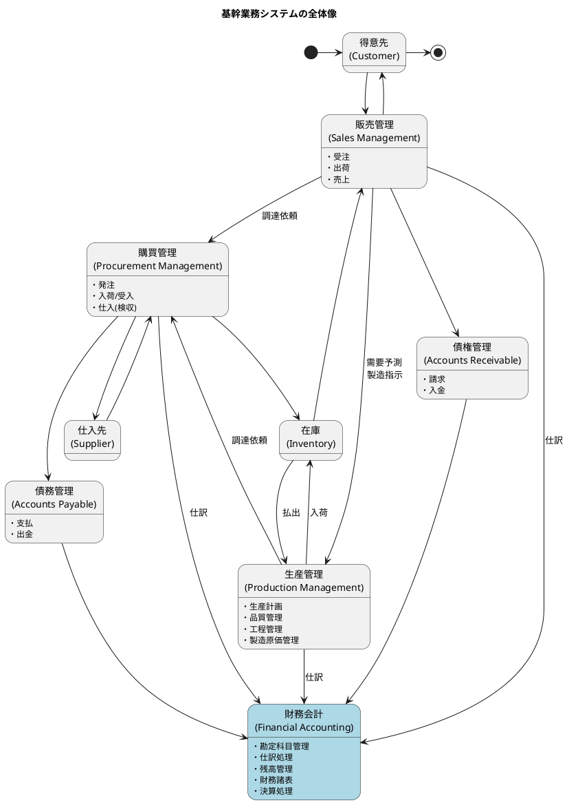
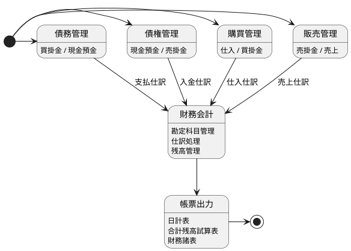
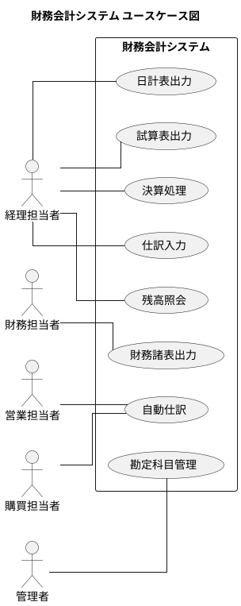
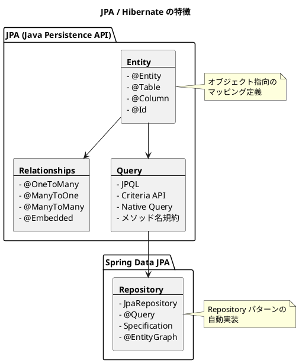
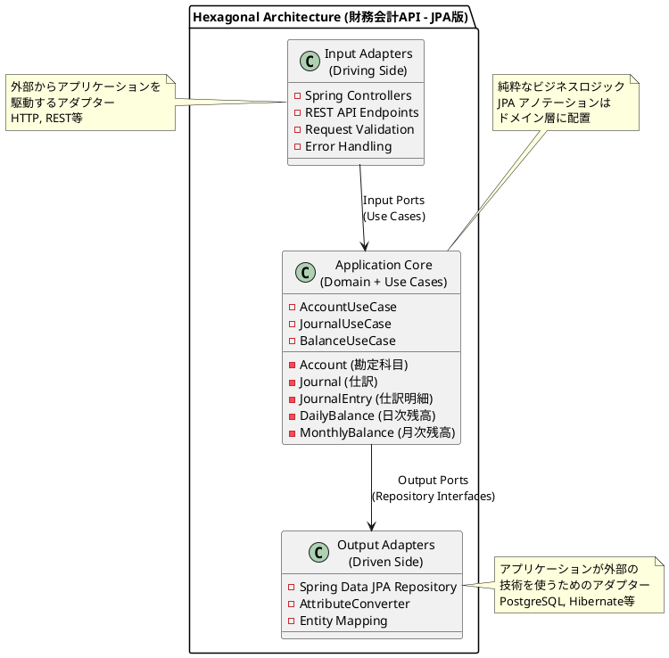

# 第14章：財務会計システムの全体像（ORM版）

本章では、財務会計システムの全体像を把握し、Spring Data JPA を使用した ORM 実装のアーキテクチャについて解説します。MyBatis 版との違いを比較しながら、JPA の特徴を活かした設計手法を学びます。

---

## 14.1 財務会計システムのスコープ

### 基幹業務システムにおける位置づけ

財務会計システムは、基幹業務システムの中で他のシステムから仕訳データを受け取り、企業の財務状態を管理する重要なシステムです。



### 財務会計システムの業務領域

財務会計システムは、以下の業務領域をカバーします。



### 業務機能の概要

| 業務 | 説明 |
|------|------|
| **勘定科目管理** | 勘定科目マスタ・勘定科目構成マスタの管理 |
| **仕訳処理** | 仕訳入力・自動仕訳・仕訳照会 |
| **残高管理** | 日次残高・月次残高の管理 |
| **帳票出力** | 日計表・合計残高試算表・財務諸表の出力 |
| **決算処理** | 月次決算・年次決算 |

### ユースケース図

財務会計システム全体のユースケースは以下の通りです。



---

## 14.2 ORM アーキテクチャの概要

### MyBatis 版と JPA 版の比較

本章では、MyBatis 版と同じビジネスロジックを Spring Data JPA で実装します。ORM の違いによるアプローチの差異を理解することが目的です。

| 観点 | MyBatis 版 | JPA 版 |
|------|-----------|--------|
| マッピング方法 | XML Mapper + resultMap | @Entity + @Column |
| ENUM 変換 | TypeHandler | AttributeConverter |
| Repository | Mapper インターフェース + XML | JpaRepository インターフェース |
| SQL | XML で明示的に記述 | メソッド名規約で自動生成 |
| テスト基底クラス | @MybatisTest | @DataJpaTest |
| N+1 問題対策 | 明示的な JOIN | @EntityGraph, JPQL JOIN FETCH |

### JPA の特徴



---

## 14.3 プロジェクト構成

### ヘキサゴナルアーキテクチャ

財務会計システムは、ヘキサゴナルアーキテクチャ（ポート&アダプターパターン）を採用します。

```
src/main/java/com/example/accounting/
├── application/                    # アプリケーション層
│   └── port/
│       └── out/                   # Output Port（リポジトリインターフェース）
│           └── AccountRepository.java
├── domain/                         # ドメイン層（純粋なビジネスロジック）
│   └── model/                     # ドメインモデル
│       └── account/
│           ├── Account.java       # @Entity アノテーション付き
│           ├── BsPlType.java
│           ├── DebitCreditType.java
│           ├── TransactionElementType.java
│           ├── AggregationType.java
│           └── TaxCalculationType.java
├── infrastructure/                 # インフラストラクチャ層
│   └── persistence/
│       ├── converter/             # JPA AttributeConverter
│       │   ├── BsPlTypeConverter.java
│       │   ├── DebitCreditTypeConverter.java
│       │   ├── TransactionElementTypeConverter.java
│       │   ├── AggregationTypeConverter.java
│       │   └── TaxCalculationTypeConverter.java
│       └── repository/            # Repository実装
│           ├── AccountJpaRepository.java  # Spring Data JPA
│           └── AccountRepositoryImpl.java
└── config/
    └── JpaConfig.java

src/main/resources/
├── db/migration/
│   └── V001__create_enum_types.sql
└── application.yml
```

### アーキテクチャ図



---

## 14.4 環境構築

### 前提条件

以下のツールがインストールされていることを確認してください。

- Java 17以上（推奨：Java 21 LTS）
- Gradle 8.x以上（推奨：Gradle Wrapper使用）
- Docker & Docker Compose（推奨）
- Git

### build.gradle の設定

<details>
<summary>build.gradle</summary>

```groovy
plugins {
    id 'java'
    id 'application'
    id 'jacoco'
    id 'org.springframework.boot' version '3.2.0'
    id 'io.spring.dependency-management' version '1.1.4'
}

group = 'com.example.accounting'
version = '0.0.1-SNAPSHOT'

java {
    sourceCompatibility = '21'
}

repositories {
    mavenCentral()
}

dependencies {
    // Spring Boot
    implementation 'org.springframework.boot:spring-boot-starter-web'
    implementation 'org.springframework.boot:spring-boot-starter-data-jpa'
    implementation 'org.springframework.boot:spring-boot-starter-validation'
    testImplementation 'org.springframework.boot:spring-boot-starter-test'

    // Flyway
    implementation 'org.flywaydb:flyway-core'
    implementation 'org.flywaydb:flyway-database-postgresql'

    // Database
    runtimeOnly 'org.postgresql:postgresql'

    // Lombok (オプション)
    compileOnly 'org.projectlombok:lombok'
    annotationProcessor 'org.projectlombok:lombok'

    // Test
    testImplementation 'org.junit.jupiter:junit-jupiter-api'
    testImplementation 'org.junit.jupiter:junit-jupiter-params'
    testRuntimeOnly 'org.junit.jupiter:junit-jupiter-engine'
    testImplementation 'org.assertj:assertj-core:3.24.2'
    testImplementation 'org.testcontainers:testcontainers:1.19.3'
    testImplementation 'org.testcontainers:postgresql:1.19.3'
    testImplementation 'org.testcontainers:junit-jupiter:1.19.3'
}

test {
    useJUnitPlatform()
}

jacoco {
    toolVersion = "0.8.11"
}

jacocoTestReport {
    dependsOn test
    reports {
        xml.required = true
        html.required = true
    }
}
```

</details>

### Docker Compose のセットアップ

<details>
<summary>docker-compose.yml</summary>

```yaml
services:
  postgres:
    image: postgres:16-alpine
    container_name: financial-accounting-postgres-jpa
    restart: unless-stopped
    environment:
      POSTGRES_USER: ${POSTGRES_USER:-postgres}
      POSTGRES_PASSWORD: ${POSTGRES_PASSWORD:-postgres}
      POSTGRES_DB: ${POSTGRES_DB:-financial_accounting}
      TZ: 'Asia/Tokyo'
    ports:
      - "${POSTGRES_PORT:-5432}:5432"
    volumes:
      - postgres_data:/var/lib/postgresql/data
    healthcheck:
      test: ["CMD-SHELL", "pg_isready -U ${POSTGRES_USER:-postgres}"]
      interval: 10s
      timeout: 5s
      retries: 5

volumes:
  postgres_data:
```

</details>

### application.yml の設定

<details>
<summary>application.yml</summary>

```yaml
spring:
  application:
    name: financial-accounting-jpa

  datasource:
    url: jdbc:postgresql://localhost:5432/financial_accounting
    username: postgres
    password: postgres
    driver-class-name: org.postgresql.Driver

  jpa:
    hibernate:
      ddl-auto: validate  # Flyway でスキーマ管理するため validate
    show-sql: true
    properties:
      hibernate:
        format_sql: true
        dialect: org.hibernate.dialect.PostgreSQLDialect

  flyway:
    enabled: true
    locations: classpath:db/migration

logging:
  level:
    org.hibernate.SQL: DEBUG
    org.hibernate.type.descriptor.sql.BasicBinder: TRACE
```

</details>

### PostgreSQL ENUM の定義

<details>
<summary>V001__create_enum_types.sql</summary>

```sql
-- BSPL区分（貸借対照表・損益計算書）
CREATE TYPE BSPL区分 AS ENUM ('BS', 'PL');

-- 貸借区分
CREATE TYPE 貸借区分 AS ENUM ('借方', '貸方');

-- 取引要素区分
CREATE TYPE 取引要素区分 AS ENUM ('資産', '負債', '資本', '収益', '費用');

-- 集計区分
CREATE TYPE 集計区分 AS ENUM ('見出科目', '集計科目', '計上科目');

-- 消費税計算区分
CREATE TYPE 消費税計算区分 AS ENUM ('課税', '非課税', '不課税', '免税');
```

</details>

---

## 14.5 JPA エンティティの基本

### 日本語テーブル名・カラム名のマッピング

本シリーズでは、**日本語テーブル名・日本語カラム名**を使用します。JPA では、`@Table` と `@Column` アノテーションを使ってマッピングします。

| 項目 | 例 |
|-----|-----|
| テーブル名 | `勘定科目マスタ`, `仕訳データ`, `日次勘定科目残高` |
| カラム名 | `勘定科目コード`, `勘定科目名`, `BSPL区分` |
| ENUM名 | `BSPL区分`, `貸借区分`, `集計区分` |
| ENUM値 | `BS`, `PL`, `借方`, `貸方` |

### エンティティクラスの例

<details>
<summary>Account.java（勘定科目エンティティ）</summary>

```java
package com.example.accounting.domain.model.account;

import jakarta.persistence.*;
import lombok.*;
import java.time.LocalDateTime;

@Entity
@Table(name = "勘定科目マスタ")
@Data
@Builder
@NoArgsConstructor
@AllArgsConstructor
public class Account {

    @Id
    @Column(name = "勘定科目コード", length = 5)
    private String accountCode;

    @Column(name = "勘定科目名", length = 40, nullable = false)
    private String accountName;

    @Column(name = "勘定科目略名", length = 10)
    private String accountShortName;

    @Column(name = "勘定科目カナ", length = 40)
    private String accountNameKana;

    @Convert(converter = BsPlTypeConverter.class)
    @Column(name = "BSPL区分", nullable = false, columnDefinition = "BSPL区分")
    private BsPlType bsPlType;

    @Convert(converter = DebitCreditTypeConverter.class)
    @Column(name = "貸借区分", nullable = false, columnDefinition = "貸借区分")
    private DebitCreditType debitCreditType;

    @Convert(converter = TransactionElementTypeConverter.class)
    @Column(name = "取引要素区分", nullable = false, columnDefinition = "取引要素区分")
    private TransactionElementType transactionElementType;

    @Convert(converter = AggregationTypeConverter.class)
    @Column(name = "集計区分", nullable = false, columnDefinition = "集計区分")
    private AggregationType aggregationType;

    @Column(name = "管理会計区分", length = 1)
    private String managementAccountingType;

    @Column(name = "費用区分", length = 1)
    private String expenseType;

    @Column(name = "元帳出力区分", length = 1)
    private String ledgerOutputType;

    @Column(name = "補助科目種別", length = 1)
    private String subAccountType;

    @Convert(converter = TaxCalculationTypeConverter.class)
    @Column(name = "消費税計算区分", columnDefinition = "消費税計算区分")
    private TaxCalculationType taxCalculationType;

    @Column(name = "課税取引コード", length = 2)
    private String taxTransactionCode;

    @Column(name = "期日管理区分", length = 1)
    private String dueDateManagementType;

    @Column(name = "作成日時")
    private LocalDateTime createdAt;

    @Column(name = "更新日時")
    private LocalDateTime updatedAt;

    @Column(name = "更新者名", length = 12)
    private String updatedBy;

    @PrePersist
    protected void onCreate() {
        createdAt = LocalDateTime.now();
        updatedAt = LocalDateTime.now();
    }

    @PreUpdate
    protected void onUpdate() {
        updatedAt = LocalDateTime.now();
    }
}
```

</details>

### ENUM 定義

<details>
<summary>BsPlType.java（BSPL区分）</summary>

```java
package com.example.accounting.domain.model.account;

import lombok.Getter;
import lombok.RequiredArgsConstructor;

@Getter
@RequiredArgsConstructor
public enum BsPlType {
    BS("BS"),  // 貸借対照表
    PL("PL");  // 損益計算書

    private final String displayName;

    public static BsPlType fromDisplayName(String displayName) {
        for (BsPlType type : values()) {
            if (type.displayName.equals(displayName)) {
                return type;
            }
        }
        throw new IllegalArgumentException("不正なBSPL区分: " + displayName);
    }
}
```

</details>

<details>
<summary>DebitCreditType.java（貸借区分）</summary>

```java
package com.example.accounting.domain.model.account;

import lombok.Getter;
import lombok.RequiredArgsConstructor;

@Getter
@RequiredArgsConstructor
public enum DebitCreditType {
    DEBIT("借方"),
    CREDIT("貸方");

    private final String displayName;

    public static DebitCreditType fromDisplayName(String displayName) {
        for (DebitCreditType type : values()) {
            if (type.displayName.equals(displayName)) {
                return type;
            }
        }
        throw new IllegalArgumentException("不正な貸借区分: " + displayName);
    }
}
```

</details>

### AttributeConverter

JPA では `AttributeConverter` を使って PostgreSQL ENUM と Java Enum を変換します。

<details>
<summary>BsPlTypeConverter.java</summary>

```java
package com.example.accounting.infrastructure.persistence.converter;

import com.example.accounting.domain.model.account.BsPlType;
import jakarta.persistence.AttributeConverter;
import jakarta.persistence.Converter;

@Converter(autoApply = true)
public class BsPlTypeConverter implements AttributeConverter<BsPlType, String> {

    @Override
    public String convertToDatabaseColumn(BsPlType attribute) {
        return attribute != null ? attribute.getDisplayName() : null;
    }

    @Override
    public BsPlType convertToEntityAttribute(String dbData) {
        return dbData != null ? BsPlType.fromDisplayName(dbData) : null;
    }
}
```

</details>

---

## 14.6 Spring Data JPA Repository

### JpaRepository インターフェース

Spring Data JPA では、インターフェースを定義するだけで基本的な CRUD 操作が自動実装されます。

<details>
<summary>AccountJpaRepository.java</summary>

```java
package com.example.accounting.infrastructure.persistence.repository;

import com.example.accounting.domain.model.account.Account;
import com.example.accounting.domain.model.account.AggregationType;
import com.example.accounting.domain.model.account.BsPlType;
import org.springframework.data.jpa.repository.JpaRepository;
import org.springframework.stereotype.Repository;

import java.util.List;

@Repository
public interface AccountJpaRepository extends JpaRepository<Account, String> {

    List<Account> findByBsPlType(BsPlType bsPlType);

    List<Account> findByAggregationType(AggregationType aggregationType);

    List<Account> findAllByOrderByAccountCodeAsc();
}
```

</details>

### Repository インターフェース（Output Port）

ヘキサゴナルアーキテクチャでは、アプリケーション層に Output Port を定義します。

<details>
<summary>AccountRepository.java</summary>

```java
package com.example.accounting.application.port.out;

import com.example.accounting.domain.model.account.Account;
import com.example.accounting.domain.model.account.AggregationType;
import com.example.accounting.domain.model.account.BsPlType;

import java.util.List;
import java.util.Optional;

/**
 * 勘定科目リポジトリ（Output Port）
 */
public interface AccountRepository {

    void save(Account account);

    Optional<Account> findByCode(String accountCode);

    List<Account> findAll();

    List<Account> findByBsPlType(BsPlType bsPlType);

    List<Account> findByAggregationType(AggregationType aggregationType);

    void delete(String accountCode);

    void deleteAll();
}
```

</details>

### Repository 実装（Infrastructure 層）

<details>
<summary>AccountRepositoryImpl.java</summary>

```java
package com.example.accounting.infrastructure.persistence.repository;

import com.example.accounting.application.port.out.AccountRepository;
import com.example.accounting.domain.model.account.Account;
import com.example.accounting.domain.model.account.AggregationType;
import com.example.accounting.domain.model.account.BsPlType;
import lombok.RequiredArgsConstructor;
import org.springframework.stereotype.Repository;

import java.util.List;
import java.util.Optional;

@Repository
@RequiredArgsConstructor
public class AccountRepositoryImpl implements AccountRepository {

    private final AccountJpaRepository jpaRepository;

    @Override
    public void save(Account account) {
        jpaRepository.save(account);
    }

    @Override
    public Optional<Account> findByCode(String accountCode) {
        return jpaRepository.findById(accountCode);
    }

    @Override
    public List<Account> findAll() {
        return jpaRepository.findAllByOrderByAccountCodeAsc();
    }

    @Override
    public List<Account> findByBsPlType(BsPlType bsPlType) {
        return jpaRepository.findByBsPlType(bsPlType);
    }

    @Override
    public List<Account> findByAggregationType(AggregationType aggregationType) {
        return jpaRepository.findByAggregationType(aggregationType);
    }

    @Override
    public void delete(String accountCode) {
        jpaRepository.deleteById(accountCode);
    }

    @Override
    public void deleteAll() {
        jpaRepository.deleteAll();
    }
}
```

</details>

---

## 14.7 TestContainers によるテスト

### テスト基盤クラス

<details>
<summary>BaseIntegrationTest.java</summary>

```java
package com.example.accounting.testsetup;

import org.springframework.boot.test.autoconfigure.jdbc.AutoConfigureTestDatabase;
import org.springframework.boot.test.autoconfigure.orm.jpa.DataJpaTest;
import org.springframework.test.context.DynamicPropertyRegistry;
import org.springframework.test.context.DynamicPropertySource;
import org.testcontainers.containers.PostgreSQLContainer;
import org.testcontainers.junit.jupiter.Container;
import org.testcontainers.junit.jupiter.Testcontainers;

@Testcontainers
@DataJpaTest
@AutoConfigureTestDatabase(replace = AutoConfigureTestDatabase.Replace.NONE)
public abstract class BaseIntegrationTest {

    @Container
    static PostgreSQLContainer<?> postgres = new PostgreSQLContainer<>("postgres:16-alpine")
            .withDatabaseName("testdb")
            .withUsername("testuser")
            .withPassword("testpass");

    @DynamicPropertySource
    static void configureProperties(DynamicPropertyRegistry registry) {
        registry.add("spring.datasource.url", postgres::getJdbcUrl);
        registry.add("spring.datasource.username", postgres::getUsername);
        registry.add("spring.datasource.password", postgres::getPassword);
        registry.add("spring.flyway.enabled", () -> "true");
        registry.add("spring.flyway.locations", () -> "classpath:db/migration");
        registry.add("spring.jpa.hibernate.ddl-auto", () -> "validate");
    }
}
```

</details>

### データベース接続テスト

<details>
<summary>DatabaseConnectionTest.java</summary>

```java
package com.example.accounting;

import com.example.accounting.testsetup.BaseIntegrationTest;
import org.junit.jupiter.api.DisplayName;
import org.junit.jupiter.api.Test;
import org.springframework.beans.factory.annotation.Autowired;

import javax.sql.DataSource;
import java.sql.Connection;
import java.sql.ResultSet;
import java.sql.Statement;

import static org.assertj.core.api.Assertions.assertThat;

@DisplayName("データベース接続")
class DatabaseConnectionTest extends BaseIntegrationTest {

    @Autowired
    private DataSource dataSource;

    @Test
    @DisplayName("PostgreSQLに接続できる")
    void canConnectToPostgres() throws Exception {
        try (Connection conn = dataSource.getConnection();
             Statement stmt = conn.createStatement();
             ResultSet rs = stmt.executeQuery("SELECT 1")) {
            assertThat(rs.next()).isTrue();
            assertThat(rs.getInt(1)).isEqualTo(1);
        }
    }

    @Test
    @DisplayName("BSPL区分ENUMが作成されている")
    void bsplTypeEnumExists() throws Exception {
        try (Connection conn = dataSource.getConnection();
             Statement stmt = conn.createStatement();
             ResultSet rs = stmt.executeQuery(
                 "SELECT unnest(enum_range(NULL::BSPL区分))::text")) {
            assertThat(rs.next()).isTrue();
            assertThat(rs.getString(1)).isEqualTo("BS");
        }
    }
}
```

</details>

---

## 14.8 命名規則のまとめ

| 要素 | 言語 | 例 |
|------|------|-----|
| **テーブル名** | 日本語 | `"勘定科目マスタ"`, `"仕訳データ"` |
| **カラム名** | 日本語 | `"勘定科目コード"`, `"勘定科目名"` |
| **ENUM 型** | 日本語 | `BSPL区分`, `貸借区分` |
| **ENUM 値** | 日本語 | `'BS'`, `'借方'` |
| **Java クラス名** | 英語 | `Account`, `BsPlType` |
| **Java フィールド名** | 英語 | `accountCode`, `accountName` |
| **Java メソッド名** | 英語 | `findByCode()`, `save()` |
| **JPA アノテーション** | 日本語カラム指定 | `@Column(name = "勘定科目コード")` |

---

## 本章のまとめ

本章では、財務会計システムの全体像と JPA による ORM 実装の基本を学びました。

### 学んだこと

| カテゴリ | 内容 |
|----------|------|
| スコープ | 勘定科目管理・仕訳処理・残高管理・帳票出力・決算処理 |
| アーキテクチャ | ヘキサゴナルアーキテクチャ（ポート&アダプター） |
| ORM | Spring Data JPA / Hibernate |
| マッピング | @Entity, @Table, @Column, @Convert |
| ENUM 変換 | AttributeConverter |
| テスト | TestContainers + @DataJpaTest |

### MyBatis 版との主な違い

| 項目 | MyBatis 版 | JPA 版 |
|------|-----------|--------|
| SQL 記述 | XML で明示的に記述 | 自動生成（メソッド名規約） |
| マッピング | resultMap | @Entity + @Column |
| ENUM 変換 | TypeHandler | AttributeConverter |
| 関連取得 | 明示的な JOIN | @EntityGraph, FETCH JOIN |

### 次章の予告

第15章では、財務会計システムの基盤となる勘定科目マスタの設計を JPA で実装します。@EmbeddedId を使った複合主キーや @ManyToOne によるリレーションも解説します。
