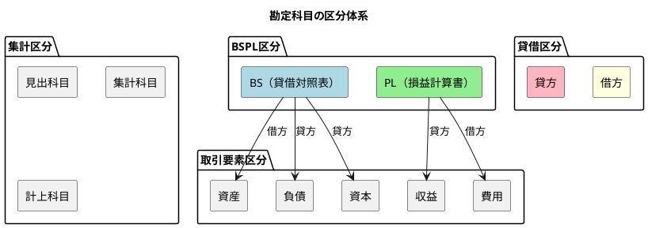
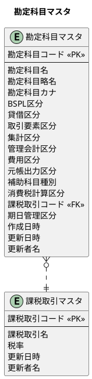
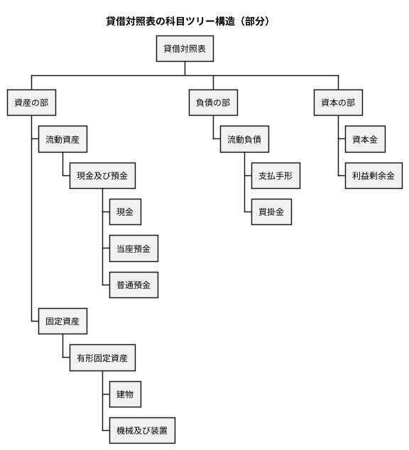
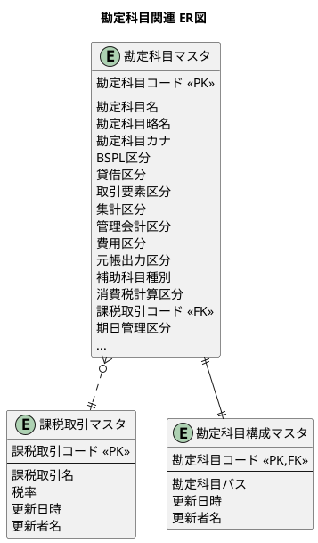

# 第15章：勘定科目の設計（ORM版）

財務会計システムの根幹となる勘定科目マスタを Spring Data JPA で設計します。本章では、TDD（テスト駆動開発）を用いて勘定科目マスタ、勘定科目構成マスタ、課税取引マスタを JPA エンティティとして実装していきます。

---

## 15.1 勘定科目マスタの設計

### 勘定科目の区分体系

勘定科目は複数の区分で分類されます。これらの区分を正しく理解することが、財務会計システム設計の基礎となります。



#### 区分の説明

| 区分 | 説明 | 値の例 |
|-----|------|-------|
| **BSPL区分** | 貸借対照表(BS)か損益計算書(PL)か | `BS`, `PL` |
| **貸借区分** | 借方科目か貸方科目か | `借方`, `貸方` |
| **取引要素区分** | 5つの取引要素のどれに該当するか | `資産`, `負債`, `資本`, `収益`, `費用` |
| **集計区分** | 科目の性質（見出し/集計/計上） | `見出科目`, `集計科目`, `計上科目` |

#### 取引要素と貸借区分の関係

複式簿記では、取引要素によって借方・貸方が決まります。

| 取引要素 | BSPL区分 | 増加時の貸借 | 減少時の貸借 |
|---------|---------|------------|------------|
| 資産 | BS | 借方 | 貸方 |
| 負債 | BS | 貸方 | 借方 |
| 資本 | BS | 貸方 | 借方 |
| 収益 | PL | 貸方 | 借方 |
| 費用 | PL | 借方 | 貸方 |

### 勘定科目マスタのER図



### マイグレーション：ENUM型とテーブルの作成

<details>
<summary>V001__create_enum_types.sql</summary>

```sql
-- BSPL区分（貸借対照表・損益計算書）
CREATE TYPE BSPL区分 AS ENUM ('BS', 'PL');

-- 貸借区分
CREATE TYPE 貸借区分 AS ENUM ('借方', '貸方');

-- 取引要素区分
CREATE TYPE 取引要素区分 AS ENUM ('資産', '負債', '資本', '収益', '費用');

-- 集計区分
CREATE TYPE 集計区分 AS ENUM ('見出科目', '集計科目', '計上科目');

-- 消費税計算区分
CREATE TYPE 消費税計算区分 AS ENUM ('課税', '非課税', '不課税', '免税');
```

</details>

<details>
<summary>V002__create_account_master.sql</summary>

```sql
-- 課税取引マスタ
CREATE TABLE "課税取引マスタ" (
    "課税取引コード" VARCHAR(2) PRIMARY KEY,
    "課税取引名" VARCHAR(20) NOT NULL,
    "税率" DECIMAL(5,3) NOT NULL DEFAULT 0.10,
    "更新日時" TIMESTAMP DEFAULT CURRENT_TIMESTAMP,
    "更新者名" VARCHAR(12)
);

-- 勘定科目マスタ
CREATE TABLE "勘定科目マスタ" (
    "勘定科目コード" VARCHAR(5) PRIMARY KEY,
    "勘定科目名" VARCHAR(40) NOT NULL,
    "勘定科目略名" VARCHAR(10),
    "勘定科目カナ" VARCHAR(40),
    "BSPL区分" BSPL区分 NOT NULL,
    "貸借区分" 貸借区分 NOT NULL,
    "取引要素区分" 取引要素区分 NOT NULL,
    "集計区分" 集計区分 NOT NULL,
    "管理会計区分" VARCHAR(1),
    "費用区分" VARCHAR(1),
    "元帳出力区分" VARCHAR(1),
    "補助科目種別" VARCHAR(1),
    "消費税計算区分" 消費税計算区分,
    "課税取引コード" VARCHAR(2) REFERENCES "課税取引マスタ"("課税取引コード"),
    "期日管理区分" VARCHAR(1),
    "作成日時" TIMESTAMP DEFAULT CURRENT_TIMESTAMP,
    "更新日時" TIMESTAMP DEFAULT CURRENT_TIMESTAMP,
    "更新者名" VARCHAR(12)
);

-- インデックス
CREATE INDEX idx_勘定科目マスタ_BSPL区分 ON "勘定科目マスタ"("BSPL区分");
CREATE INDEX idx_勘定科目マスタ_取引要素区分 ON "勘定科目マスタ"("取引要素区分");
CREATE INDEX idx_勘定科目マスタ_集計区分 ON "勘定科目マスタ"("集計区分");
```

</details>

---

## 15.2 JPA エンティティの実装

### TDD による勘定科目マスタの実装

#### Red: 失敗するテストを書く

<details>
<summary>勘定科目リポジトリテスト</summary>

```java
package com.example.accounting.infrastructure.persistence.repository;

import com.example.accounting.application.port.out.AccountRepository;
import com.example.accounting.domain.model.account.*;
import com.example.accounting.testsetup.BaseIntegrationTest;
import org.junit.jupiter.api.*;
import org.springframework.beans.factory.annotation.Autowired;

import static org.assertj.core.api.Assertions.*;

@DisplayName("勘定科目リポジトリ")
class AccountRepositoryTest extends BaseIntegrationTest {

    @Autowired
    private AccountRepository accountRepository;

    @BeforeEach
    void setUp() {
        accountRepository.deleteAll();
    }

    @Nested
    @DisplayName("登録")
    class Registration {

        @Test
        @DisplayName("勘定科目を登録できる")
        void canRegisterAccount() {
            // Arrange
            var account = Account.builder()
                    .accountCode("11110")
                    .accountName("現金")
                    .accountShortName("現金")
                    .bsPlType(BsPlType.BS)
                    .debitCreditType(DebitCreditType.DEBIT)
                    .transactionElementType(TransactionElementType.ASSET)
                    .aggregationType(AggregationType.POSTING)
                    .build();

            // Act
            accountRepository.save(account);

            // Assert
            var result = accountRepository.findByCode("11110");
            assertThat(result).isPresent();
            assertThat(result.get().getAccountName()).isEqualTo("現金");
            assertThat(result.get().getBsPlType()).isEqualTo(BsPlType.BS);
            assertThat(result.get().getDebitCreditType()).isEqualTo(DebitCreditType.DEBIT);
        }

        @Test
        @DisplayName("貸借対照表の資産科目を登録できる")
        void canRegisterBSAssetAccount() {
            var account = createAccount("11000", "流動資産", BsPlType.BS,
                    DebitCreditType.DEBIT, TransactionElementType.ASSET, AggregationType.SUMMARY);
            accountRepository.save(account);

            var result = accountRepository.findByCode("11000");
            assertThat(result).isPresent();
            assertThat(result.get().getBsPlType()).isEqualTo(BsPlType.BS);
            assertThat(result.get().getTransactionElementType()).isEqualTo(TransactionElementType.ASSET);
        }

        @Test
        @DisplayName("損益計算書の収益科目を登録できる")
        void canRegisterPLRevenueAccount() {
            var account = createAccount("41000", "売上高", BsPlType.PL,
                    DebitCreditType.CREDIT, TransactionElementType.REVENUE, AggregationType.SUMMARY);
            accountRepository.save(account);

            var result = accountRepository.findByCode("41000");
            assertThat(result).isPresent();
            assertThat(result.get().getBsPlType()).isEqualTo(BsPlType.PL);
            assertThat(result.get().getTransactionElementType()).isEqualTo(TransactionElementType.REVENUE);
        }
    }

    @Nested
    @DisplayName("集計区分")
    class AggregationTypes {

        @Test
        @DisplayName("見出科目を登録できる")
        void canRegisterHeaderAccount() {
            var account = createAccount("11", "(資産の部）", BsPlType.BS,
                    DebitCreditType.DEBIT, TransactionElementType.ASSET, AggregationType.HEADING);
            accountRepository.save(account);

            var result = accountRepository.findByCode("11");
            assertThat(result.get().getAggregationType()).isEqualTo(AggregationType.HEADING);
        }

        @Test
        @DisplayName("集計科目を登録できる")
        void canRegisterSummaryAccount() {
            var account = createAccount("11190", "現金及び預金", BsPlType.BS,
                    DebitCreditType.DEBIT, TransactionElementType.ASSET, AggregationType.SUMMARY);
            accountRepository.save(account);

            var result = accountRepository.findByCode("11190");
            assertThat(result.get().getAggregationType()).isEqualTo(AggregationType.SUMMARY);
        }

        @Test
        @DisplayName("計上科目を登録できる")
        void canRegisterPostingAccount() {
            var account = createAccount("11110", "現金", BsPlType.BS,
                    DebitCreditType.DEBIT, TransactionElementType.ASSET, AggregationType.POSTING);
            accountRepository.save(account);

            var result = accountRepository.findByCode("11110");
            assertThat(result.get().getAggregationType()).isEqualTo(AggregationType.POSTING);
        }
    }

    private Account createAccount(String code, String name, BsPlType bsPlType,
            DebitCreditType debitCreditType, TransactionElementType transactionElementType,
            AggregationType aggregationType) {
        return Account.builder()
                .accountCode(code)
                .accountName(name)
                .bsPlType(bsPlType)
                .debitCreditType(debitCreditType)
                .transactionElementType(transactionElementType)
                .aggregationType(aggregationType)
                .build();
    }
}
```

</details>

#### Green: テストを通す実装

##### ドメイン層（JPA エンティティ）

<details>
<summary>Account.java（勘定科目エンティティ）</summary>

```java
package com.example.accounting.domain.model.account;

import com.example.accounting.infrastructure.persistence.converter.*;
import jakarta.persistence.*;
import lombok.*;
import java.time.LocalDateTime;

@Entity
@Table(name = "勘定科目マスタ")
@Data
@Builder
@NoArgsConstructor
@AllArgsConstructor
public class Account {

    @Id
    @Column(name = "勘定科目コード", length = 5)
    private String accountCode;

    @Column(name = "勘定科目名", length = 40, nullable = false)
    private String accountName;

    @Column(name = "勘定科目略名", length = 10)
    private String accountShortName;

    @Column(name = "勘定科目カナ", length = 40)
    private String accountNameKana;

    @Convert(converter = BsPlTypeConverter.class)
    @Column(name = "BSPL区分", nullable = false, columnDefinition = "BSPL区分")
    private BsPlType bsPlType;

    @Convert(converter = DebitCreditTypeConverter.class)
    @Column(name = "貸借区分", nullable = false, columnDefinition = "貸借区分")
    private DebitCreditType debitCreditType;

    @Convert(converter = TransactionElementTypeConverter.class)
    @Column(name = "取引要素区分", nullable = false, columnDefinition = "取引要素区分")
    private TransactionElementType transactionElementType;

    @Convert(converter = AggregationTypeConverter.class)
    @Column(name = "集計区分", nullable = false, columnDefinition = "集計区分")
    private AggregationType aggregationType;

    @Column(name = "管理会計区分", length = 1)
    private String managementAccountingType;

    @Column(name = "費用区分", length = 1)
    private String expenseType;

    @Column(name = "元帳出力区分", length = 1)
    private String ledgerOutputType;

    @Column(name = "補助科目種別", length = 1)
    private String subAccountType;

    @Convert(converter = TaxCalculationTypeConverter.class)
    @Column(name = "消費税計算区分", columnDefinition = "消費税計算区分")
    private TaxCalculationType taxCalculationType;

    @Column(name = "課税取引コード", length = 2)
    private String taxTransactionCode;

    @Column(name = "期日管理区分", length = 1)
    private String dueDateManagementType;

    @Column(name = "作成日時")
    private LocalDateTime createdAt;

    @Column(name = "更新日時")
    private LocalDateTime updatedAt;

    @Column(name = "更新者名", length = 12)
    private String updatedBy;

    @PrePersist
    protected void onCreate() {
        createdAt = LocalDateTime.now();
        updatedAt = LocalDateTime.now();
    }

    @PreUpdate
    protected void onUpdate() {
        updatedAt = LocalDateTime.now();
    }
}
```

</details>

##### ENUM 定義（ドメイン層）

<details>
<summary>BsPlType.java（BSPL区分）</summary>

```java
package com.example.accounting.domain.model.account;

import lombok.Getter;
import lombok.RequiredArgsConstructor;

@Getter
@RequiredArgsConstructor
public enum BsPlType {
    BS("BS"),
    PL("PL");

    private final String displayName;

    public static BsPlType fromDisplayName(String displayName) {
        for (BsPlType type : values()) {
            if (type.displayName.equals(displayName)) {
                return type;
            }
        }
        throw new IllegalArgumentException("不正なBSPL区分: " + displayName);
    }
}
```

</details>

<details>
<summary>DebitCreditType.java（貸借区分）</summary>

```java
package com.example.accounting.domain.model.account;

import lombok.Getter;
import lombok.RequiredArgsConstructor;

@Getter
@RequiredArgsConstructor
public enum DebitCreditType {
    DEBIT("借方"),
    CREDIT("貸方");

    private final String displayName;

    public static DebitCreditType fromDisplayName(String displayName) {
        for (DebitCreditType type : values()) {
            if (type.displayName.equals(displayName)) {
                return type;
            }
        }
        throw new IllegalArgumentException("不正な貸借区分: " + displayName);
    }
}
```

</details>

<details>
<summary>TransactionElementType.java（取引要素区分）</summary>

```java
package com.example.accounting.domain.model.account;

import lombok.Getter;
import lombok.RequiredArgsConstructor;

@Getter
@RequiredArgsConstructor
public enum TransactionElementType {
    ASSET("資産"),
    LIABILITY("負債"),
    EQUITY("資本"),
    REVENUE("収益"),
    EXPENSE("費用");

    private final String displayName;

    public static TransactionElementType fromDisplayName(String displayName) {
        for (TransactionElementType type : values()) {
            if (type.displayName.equals(displayName)) {
                return type;
            }
        }
        throw new IllegalArgumentException("不正な取引要素区分: " + displayName);
    }
}
```

</details>

<details>
<summary>AggregationType.java（集計区分）</summary>

```java
package com.example.accounting.domain.model.account;

import lombok.Getter;
import lombok.RequiredArgsConstructor;

@Getter
@RequiredArgsConstructor
public enum AggregationType {
    HEADING("見出科目"),
    SUMMARY("集計科目"),
    POSTING("計上科目");

    private final String displayName;

    public static AggregationType fromDisplayName(String displayName) {
        for (AggregationType type : values()) {
            if (type.displayName.equals(displayName)) {
                return type;
            }
        }
        throw new IllegalArgumentException("不正な集計区分: " + displayName);
    }
}
```

</details>

##### AttributeConverter（ENUM 変換）

JPA では `AttributeConverter` を使って PostgreSQL ENUM と Java Enum を変換します。MyBatis の TypeHandler に相当します。

<details>
<summary>BsPlTypeConverter.java</summary>

```java
package com.example.accounting.infrastructure.persistence.converter;

import com.example.accounting.domain.model.account.BsPlType;
import jakarta.persistence.AttributeConverter;
import jakarta.persistence.Converter;

@Converter(autoApply = true)
public class BsPlTypeConverter implements AttributeConverter<BsPlType, String> {

    @Override
    public String convertToDatabaseColumn(BsPlType attribute) {
        return attribute != null ? attribute.getDisplayName() : null;
    }

    @Override
    public BsPlType convertToEntityAttribute(String dbData) {
        return dbData != null ? BsPlType.fromDisplayName(dbData) : null;
    }
}
```

</details>

<details>
<summary>DebitCreditTypeConverter.java</summary>

```java
package com.example.accounting.infrastructure.persistence.converter;

import com.example.accounting.domain.model.account.DebitCreditType;
import jakarta.persistence.AttributeConverter;
import jakarta.persistence.Converter;

@Converter(autoApply = true)
public class DebitCreditTypeConverter implements AttributeConverter<DebitCreditType, String> {

    @Override
    public String convertToDatabaseColumn(DebitCreditType attribute) {
        return attribute != null ? attribute.getDisplayName() : null;
    }

    @Override
    public DebitCreditType convertToEntityAttribute(String dbData) {
        return dbData != null ? DebitCreditType.fromDisplayName(dbData) : null;
    }
}
```

</details>

<details>
<summary>TransactionElementTypeConverter.java</summary>

```java
package com.example.accounting.infrastructure.persistence.converter;

import com.example.accounting.domain.model.account.TransactionElementType;
import jakarta.persistence.AttributeConverter;
import jakarta.persistence.Converter;

@Converter(autoApply = true)
public class TransactionElementTypeConverter implements AttributeConverter<TransactionElementType, String> {

    @Override
    public String convertToDatabaseColumn(TransactionElementType attribute) {
        return attribute != null ? attribute.getDisplayName() : null;
    }

    @Override
    public TransactionElementType convertToEntityAttribute(String dbData) {
        return dbData != null ? TransactionElementType.fromDisplayName(dbData) : null;
    }
}
```

</details>

<details>
<summary>AggregationTypeConverter.java</summary>

```java
package com.example.accounting.infrastructure.persistence.converter;

import com.example.accounting.domain.model.account.AggregationType;
import jakarta.persistence.AttributeConverter;
import jakarta.persistence.Converter;

@Converter(autoApply = true)
public class AggregationTypeConverter implements AttributeConverter<AggregationType, String> {

    @Override
    public String convertToDatabaseColumn(AggregationType attribute) {
        return attribute != null ? attribute.getDisplayName() : null;
    }

    @Override
    public AggregationType convertToEntityAttribute(String dbData) {
        return dbData != null ? AggregationType.fromDisplayName(dbData) : null;
    }
}
```

</details>

##### Repository インターフェース（Output Port）

<details>
<summary>AccountRepository.java</summary>

```java
package com.example.accounting.application.port.out;

import com.example.accounting.domain.model.account.Account;
import com.example.accounting.domain.model.account.AggregationType;
import com.example.accounting.domain.model.account.BsPlType;
import com.example.accounting.domain.model.account.TransactionElementType;

import java.util.List;
import java.util.Optional;

/**
 * 勘定科目リポジトリ（Output Port）
 */
public interface AccountRepository {

    void save(Account account);

    Optional<Account> findByCode(String accountCode);

    List<Account> findAll();

    List<Account> findByBsPlType(BsPlType bsPlType);

    List<Account> findByAggregationType(AggregationType aggregationType);

    List<Account> findByTransactionElementType(TransactionElementType type);

    void update(Account account);

    void deleteAll();
}
```

</details>

##### Spring Data JPA Repository

<details>
<summary>AccountJpaRepository.java</summary>

```java
package com.example.accounting.infrastructure.persistence.repository;

import com.example.accounting.domain.model.account.Account;
import com.example.accounting.domain.model.account.AggregationType;
import com.example.accounting.domain.model.account.BsPlType;
import com.example.accounting.domain.model.account.TransactionElementType;
import org.springframework.data.jpa.repository.JpaRepository;
import org.springframework.data.jpa.repository.Modifying;
import org.springframework.data.jpa.repository.Query;
import org.springframework.stereotype.Repository;

import java.util.List;

@Repository
public interface AccountJpaRepository extends JpaRepository<Account, String> {

    List<Account> findByBsPlType(BsPlType bsPlType);

    List<Account> findByAggregationType(AggregationType aggregationType);

    List<Account> findByTransactionElementType(TransactionElementType transactionElementType);

    List<Account> findAllByOrderByAccountCodeAsc();

    @Modifying
    @Query(value = "TRUNCATE TABLE \"勘定科目マスタ\" CASCADE", nativeQuery = true)
    void truncateTable();
}
```

</details>

##### Repository 実装クラス（インフラストラクチャ層）

<details>
<summary>AccountRepositoryImpl.java</summary>

```java
package com.example.accounting.infrastructure.persistence.repository;

import com.example.accounting.application.port.out.AccountRepository;
import com.example.accounting.domain.model.account.Account;
import com.example.accounting.domain.model.account.AggregationType;
import com.example.accounting.domain.model.account.BsPlType;
import com.example.accounting.domain.model.account.TransactionElementType;
import lombok.RequiredArgsConstructor;
import org.springframework.stereotype.Repository;
import org.springframework.transaction.annotation.Transactional;

import java.util.List;
import java.util.Optional;

@Repository
@RequiredArgsConstructor
public class AccountRepositoryImpl implements AccountRepository {

    private final AccountJpaRepository jpaRepository;

    @Override
    public void save(Account account) {
        jpaRepository.save(account);
    }

    @Override
    public Optional<Account> findByCode(String accountCode) {
        return jpaRepository.findById(accountCode);
    }

    @Override
    public List<Account> findAll() {
        return jpaRepository.findAllByOrderByAccountCodeAsc();
    }

    @Override
    public List<Account> findByBsPlType(BsPlType bsPlType) {
        return jpaRepository.findByBsPlType(bsPlType);
    }

    @Override
    public List<Account> findByAggregationType(AggregationType aggregationType) {
        return jpaRepository.findByAggregationType(aggregationType);
    }

    @Override
    public List<Account> findByTransactionElementType(TransactionElementType type) {
        return jpaRepository.findByTransactionElementType(type);
    }

    @Override
    public void update(Account account) {
        jpaRepository.save(account);
    }

    @Override
    @Transactional
    public void deleteAll() {
        jpaRepository.truncateTable();
    }
}
```

</details>

---

## 15.3 勘定科目構成マスタの設計

### チルダ連結方式による階層構造

勘定科目の階層構造を「チルダ（^）連結」で表現します。これにより、SQL の LIKE 検索で効率的に階層検索ができます。



### 勘定科目構成マスタのデータ例

| 勘定科目コード | 勘定科目パス |
|-------------|-------------|
| 11 | 11 |
| 11000 | 11^11000 |
| 11190 | 11^11000^11190 |
| 11110 | 11^11000^11190^11110 |
| 11120 | 11^11000^11190^11120 |
| 11130 | 11^11000^11190^11130 |

### マイグレーション

<details>
<summary>V003__create_account_structure.sql</summary>

```sql
-- 勘定科目構成マスタ
CREATE TABLE "勘定科目構成マスタ" (
    "勘定科目コード" VARCHAR(5) PRIMARY KEY REFERENCES "勘定科目マスタ"("勘定科目コード"),
    "勘定科目パス" VARCHAR(100) NOT NULL,
    "更新日時" TIMESTAMP DEFAULT CURRENT_TIMESTAMP,
    "更新者名" VARCHAR(12)
);

-- インデックス（パス検索用）
CREATE INDEX idx_勘定科目構成マスタ_パス ON "勘定科目構成マスタ"("勘定科目パス");
```

</details>

### TDD による勘定科目構成マスタの実装

#### JPA エンティティ

<details>
<summary>AccountStructure.java</summary>

```java
package com.example.accounting.domain.model.account;

import jakarta.persistence.*;
import lombok.*;
import java.time.LocalDateTime;

@Entity
@Table(name = "勘定科目構成マスタ")
@Data
@Builder
@NoArgsConstructor
@AllArgsConstructor
public class AccountStructure {

    @Id
    @Column(name = "勘定科目コード", length = 5)
    private String accountCode;

    @Column(name = "勘定科目パス", length = 100, nullable = false)
    private String accountPath;

    @Column(name = "更新日時")
    private LocalDateTime updatedAt;

    @Column(name = "更新者名", length = 12)
    private String updatedBy;

    /**
     * パスの深さ（階層レベル）を取得
     */
    @Transient
    public int getDepth() {
        if (accountPath == null || accountPath.isEmpty()) {
            return 0;
        }
        return accountPath.split("\\^").length - 1;
    }

    /**
     * 親科目コードを取得
     */
    @Transient
    public String getParentCode() {
        if (accountPath == null || !accountPath.contains("^")) {
            return null;
        }
        String[] parts = accountPath.split("\\^");
        if (parts.length < 2) {
            return null;
        }
        return parts[parts.length - 2];
    }

    @PrePersist
    @PreUpdate
    protected void onUpdate() {
        updatedAt = LocalDateTime.now();
    }
}
```

</details>

#### Repository インターフェース（Output Port）

<details>
<summary>AccountStructureRepository.java</summary>

```java
package com.example.accounting.application.port.out;

import com.example.accounting.domain.model.account.AccountStructure;

import java.util.List;
import java.util.Optional;

/**
 * 勘定科目構成リポジトリ（Output Port）
 */
public interface AccountStructureRepository {

    void save(AccountStructure structure);

    Optional<AccountStructure> findByCode(String accountCode);

    List<AccountStructure> findAll();

    List<AccountStructure> findByPathContaining(String pathSegment);

    List<AccountStructure> findChildren(String parentCode);

    void update(AccountStructure structure);

    void deleteAll();
}
```

</details>

#### Spring Data JPA Repository

<details>
<summary>AccountStructureJpaRepository.java</summary>

```java
package com.example.accounting.infrastructure.persistence.repository;

import com.example.accounting.domain.model.account.AccountStructure;
import org.springframework.data.jpa.repository.JpaRepository;
import org.springframework.data.jpa.repository.Modifying;
import org.springframework.data.jpa.repository.Query;
import org.springframework.data.repository.query.Param;
import org.springframework.stereotype.Repository;

import java.util.List;

@Repository
public interface AccountStructureJpaRepository extends JpaRepository<AccountStructure, String> {

    List<AccountStructure> findAllByOrderByAccountCodeAsc();

    @Query("SELECT s FROM AccountStructure s WHERE s.accountPath LIKE %:pathSegment% ORDER BY s.accountCode")
    List<AccountStructure> findByAccountPathContaining(@Param("pathSegment") String pathSegment);

    @Query("SELECT s FROM AccountStructure s WHERE s.accountPath LIKE :parentCode% ORDER BY s.accountCode")
    List<AccountStructure> findChildrenByParentCode(@Param("parentCode") String parentCode);

    @Modifying
    @Query(value = "TRUNCATE TABLE \"勘定科目構成マスタ\" CASCADE", nativeQuery = true)
    void truncateTable();
}
```

</details>

#### Repository 実装クラス

<details>
<summary>AccountStructureRepositoryImpl.java</summary>

```java
package com.example.accounting.infrastructure.persistence.repository;

import com.example.accounting.application.port.out.AccountStructureRepository;
import com.example.accounting.domain.model.account.AccountStructure;
import lombok.RequiredArgsConstructor;
import org.springframework.stereotype.Repository;
import org.springframework.transaction.annotation.Transactional;

import java.util.List;
import java.util.Optional;

@Repository
@RequiredArgsConstructor
public class AccountStructureRepositoryImpl implements AccountStructureRepository {

    private final AccountStructureJpaRepository jpaRepository;

    @Override
    public void save(AccountStructure structure) {
        jpaRepository.save(structure);
    }

    @Override
    public Optional<AccountStructure> findByCode(String accountCode) {
        return jpaRepository.findById(accountCode);
    }

    @Override
    public List<AccountStructure> findAll() {
        return jpaRepository.findAllByOrderByAccountCodeAsc();
    }

    @Override
    public List<AccountStructure> findByPathContaining(String pathSegment) {
        return jpaRepository.findByAccountPathContaining(pathSegment);
    }

    @Override
    public List<AccountStructure> findChildren(String parentCode) {
        return jpaRepository.findChildrenByParentCode(parentCode + "^");
    }

    @Override
    public void update(AccountStructure structure) {
        jpaRepository.save(structure);
    }

    @Override
    @Transactional
    public void deleteAll() {
        jpaRepository.truncateTable();
    }
}
```

</details>

---

## 15.4 課税取引マスタの設計

### 課税取引コード・税率の管理

課税取引マスタは、消費税の税率情報を管理するマスタテーブルです。

| 課税取引コード | 課税取引名 | 税率 |
|-------------|-----------|------|
| 00 | 非課税 | 0.000 |
| 08 | 軽減税率 | 0.080 |
| 10 | 標準税率 | 0.100 |

### TDD による課税取引マスタの実装

#### JPA エンティティ

<details>
<summary>TaxTransaction.java</summary>

```java
package com.example.accounting.domain.model.tax;

import jakarta.persistence.*;
import lombok.*;
import java.math.BigDecimal;
import java.time.LocalDateTime;

@Entity
@Table(name = "課税取引マスタ")
@Data
@Builder
@NoArgsConstructor
@AllArgsConstructor
public class TaxTransaction {

    @Id
    @Column(name = "課税取引コード", length = 2)
    private String taxCode;

    @Column(name = "課税取引名", length = 20, nullable = false)
    private String taxName;

    @Builder.Default
    @Column(name = "税率", precision = 5, scale = 3, nullable = false)
    private BigDecimal taxRate = new BigDecimal("0.10");

    @Column(name = "更新日時")
    private LocalDateTime updatedAt;

    @Column(name = "更新者名", length = 12)
    private String updatedBy;

    /**
     * 税込金額を計算
     */
    public BigDecimal calculateTaxIncludedAmount(BigDecimal amount) {
        return amount.add(amount.multiply(taxRate));
    }

    /**
     * 消費税額を計算
     */
    public BigDecimal calculateTaxAmount(BigDecimal amount) {
        return amount.multiply(taxRate);
    }

    @PrePersist
    @PreUpdate
    protected void onUpdate() {
        updatedAt = LocalDateTime.now();
    }
}
```

</details>

#### Spring Data JPA Repository

<details>
<summary>TaxTransactionJpaRepository.java</summary>

```java
package com.example.accounting.infrastructure.persistence.repository;

import com.example.accounting.domain.model.tax.TaxTransaction;
import org.springframework.data.jpa.repository.JpaRepository;
import org.springframework.data.jpa.repository.Modifying;
import org.springframework.data.jpa.repository.Query;
import org.springframework.stereotype.Repository;

import java.util.List;

@Repository
public interface TaxTransactionJpaRepository extends JpaRepository<TaxTransaction, String> {

    List<TaxTransaction> findAllByOrderByTaxCodeAsc();

    @Modifying
    @Query(value = "TRUNCATE TABLE \"課税取引マスタ\" CASCADE", nativeQuery = true)
    void truncateTable();
}
```

</details>

---

## 15.5 MyBatis 版との比較

### 実装の違い

| 観点 | MyBatis 版 | JPA 版 |
|------|-----------|--------|
| マッピング | XML Mapper + resultMap | @Entity + @Column |
| ENUM 変換 | TypeHandler | AttributeConverter |
| Repository | Mapper インターフェース + XML | JpaRepository インターフェース |
| SQL | XML で明示的に記述 | メソッド名規約で自動生成 |
| トランザクション管理 | 明示的に記述 | @Transactional |
| TRUNCATE | XML で定義 | @Query(nativeQuery) |

### コード量の比較

| 項目 | MyBatis 版 | JPA 版 |
|------|-----------|--------|
| エンティティ | POJO（アノテーションなし） | @Entity + @Column |
| ENUM 変換 | TypeHandler（各4クラス） | AttributeConverter（各4クラス） |
| Mapper/Repository | Mapper + XML | JpaRepository インターフェースのみ |
| SQL | XML で全て記述 | メソッド名規約 + @Query |

---

## 第15章のまとめ

### 作成したテーブル

| テーブル名 | 説明 |
|----------|------|
| `課税取引マスタ` | 消費税の税率情報を管理 |
| `勘定科目マスタ` | 勘定科目の基本情報を管理 |
| `勘定科目構成マスタ` | 勘定科目の階層構造をチルダ連結で管理 |

### ER図



### 設計のポイント

1. **ENUM 型の活用**: BSPL区分、貸借区分、取引要素区分、集計区分で型安全性を確保
2. **日本語 DB / 英語 Java**: テーブル・カラムは日本語、Java コードは英語で統一
3. **AttributeConverter**: Java Enum と日本語 ENUM 値の変換を JPA AttributeConverter で実装
4. **チルダ連結方式**: 勘定科目構成マスタで階層構造を表現し、JPQL の LIKE 検索で効率的に階層検索
5. **ヘキサゴナルアーキテクチャ**: ドメイン層がインフラに依存しない設計
6. **JpaRepository**: メソッド名規約による自動 SQL 生成

### 命名規則

| 要素 | 言語 | 例 |
|------|------|-----|
| **テーブル名** | 日本語 | `"勘定科目マスタ"`, `"課税取引マスタ"` |
| **カラム名** | 日本語 | `"勘定科目コード"`, `"勘定科目名"` |
| **ENUM 型** | 日本語 | `BSPL区分`, `貸借区分` |
| **ENUM 値** | 日本語 | `'BS'`, `'借方'` |
| **Java クラス名** | 英語 | `Account`, `AccountStructure` |
| **Java フィールド名** | 英語 | `accountCode`, `accountName` |
| **JPA @Column** | 日本語カラム指定 | `@Column(name = "勘定科目コード")` |

---

## 次章の予告

第16章では、仕訳テーブルの設計に進みます。複式簿記の基本構造である「借方・貸方」の仕訳データを JPA で実装していきます。@EmbeddedId を使った複合主キーや @ManyToOne によるリレーションも解説します。
