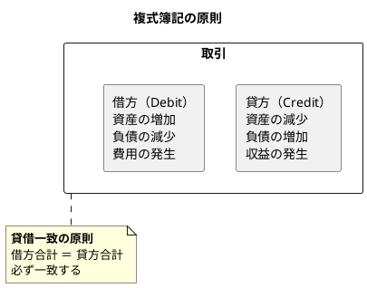
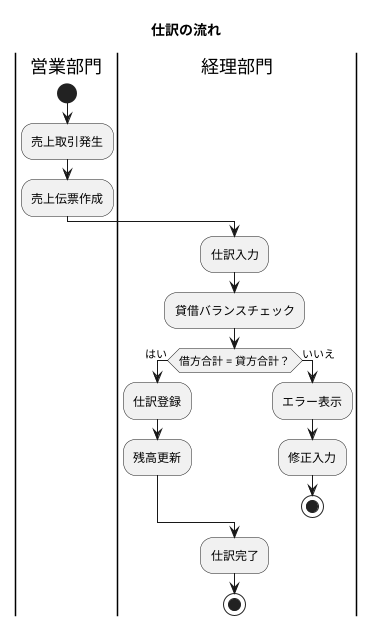
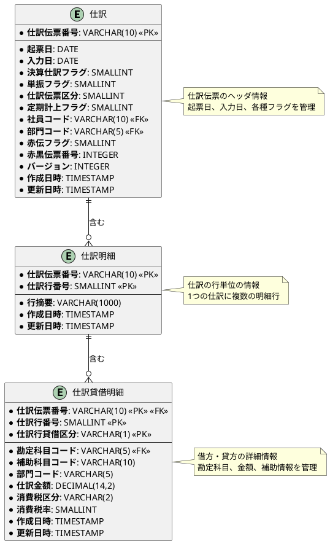
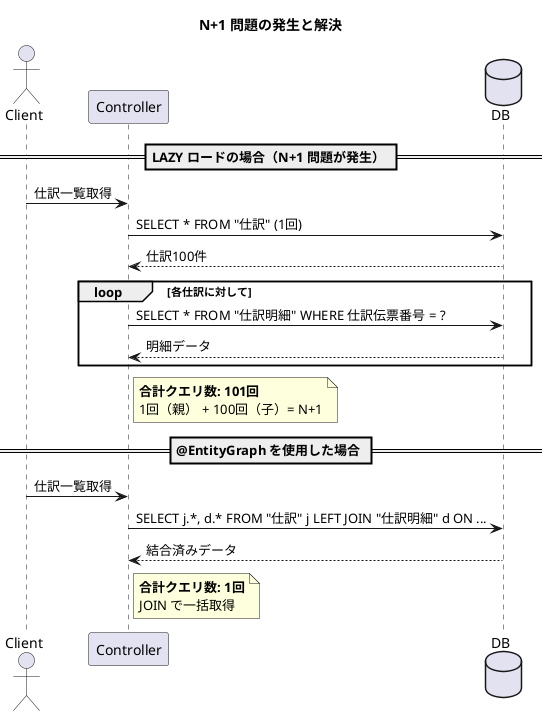

# 第16章：仕訳の設計（ORM版）

財務会計システムの核心部分である「仕訳処理」を Spring Data JPA で設計します。本章では、複式簿記の原則に基づき、仕訳データの登録・管理を実現するテーブル構造を TDD で実装します。

---

## 16.1 複式簿記と仕訳の概念

複式簿記は、すべての取引を「借方（かりかた）」と「貸方（かしかた）」の2つの側面から記録する方式です。



### 仕訳の具体例

商品を現金で販売した場合の仕訳：

| 借方（Debit） | 貸方（Credit） |
|--------------|---------------|
| 現金 100,000円 | 売上 100,000円 |



---

## 16.2 仕訳テーブルのスキーマ設計

### ER図：仕訳の親子関係



### Flyway マイグレーション

<details>
<summary>V006__create_journal_tables.sql</summary>

```sql
-- 仕訳伝票区分
CREATE TYPE 仕訳伝票区分 AS ENUM ('通常', '決算', '自動', '振替');

-- 仕訳行貸借区分
CREATE TYPE 仕訳行貸借区分 AS ENUM ('借方', '貸方');

-- 消費税区分
CREATE TYPE 消費税区分 AS ENUM ('課税', '非課税', '免税', '不課税', '対象外');

-- 消費税計算区分（仕訳用）
CREATE TYPE 仕訳消費税計算区分 AS ENUM ('外税', '内税', '税なし');

-- 仕訳ヘッダ
CREATE TABLE "仕訳" (
    "仕訳伝票番号" VARCHAR(10) PRIMARY KEY,
    "起票日" DATE NOT NULL,
    "入力日" DATE NOT NULL DEFAULT CURRENT_DATE,
    "決算仕訳フラグ" SMALLINT DEFAULT 0 NOT NULL,
    "単振フラグ" SMALLINT DEFAULT 0 NOT NULL,
    "仕訳伝票区分" 仕訳伝票区分 DEFAULT '通常' NOT NULL,
    "定期計上フラグ" SMALLINT DEFAULT 0 NOT NULL,
    "社員コード" VARCHAR(10),
    "部門コード" VARCHAR(5),
    "赤伝フラグ" SMALLINT DEFAULT 0 NOT NULL,
    "赤黒伝票番号" INTEGER,
    "バージョン" INTEGER DEFAULT 0 NOT NULL,
    "作成日時" TIMESTAMP DEFAULT CURRENT_TIMESTAMP NOT NULL,
    "更新日時" TIMESTAMP DEFAULT CURRENT_TIMESTAMP NOT NULL,
    CONSTRAINT "fk_仕訳_部門"
        FOREIGN KEY ("部門コード") REFERENCES "部門マスタ"("部門コード")
);

-- 仕訳明細
CREATE TABLE "仕訳明細" (
    "仕訳伝票番号" VARCHAR(10) NOT NULL,
    "仕訳行番号" SMALLINT NOT NULL,
    "行摘要" VARCHAR(1000),
    "作成日時" TIMESTAMP DEFAULT CURRENT_TIMESTAMP NOT NULL,
    "更新日時" TIMESTAMP DEFAULT CURRENT_TIMESTAMP NOT NULL,
    PRIMARY KEY ("仕訳伝票番号", "仕訳行番号"),
    CONSTRAINT "fk_仕訳明細_仕訳"
        FOREIGN KEY ("仕訳伝票番号") REFERENCES "仕訳"("仕訳伝票番号") ON DELETE CASCADE
);

-- 仕訳貸借明細
CREATE TABLE "仕訳貸借明細" (
    "仕訳伝票番号" VARCHAR(10) NOT NULL,
    "仕訳行番号" SMALLINT NOT NULL,
    "仕訳行貸借区分" 仕訳行貸借区分 NOT NULL,
    "勘定科目コード" VARCHAR(5) NOT NULL,
    "補助科目コード" VARCHAR(10),
    "部門コード" VARCHAR(5),
    "仕訳金額" DECIMAL(14,2) NOT NULL,
    "消費税区分" 消費税区分 DEFAULT '課税',
    "消費税率" SMALLINT DEFAULT 10,
    "消費税計算区分" 仕訳消費税計算区分 DEFAULT '外税',
    "作成日時" TIMESTAMP DEFAULT CURRENT_TIMESTAMP NOT NULL,
    "更新日時" TIMESTAMP DEFAULT CURRENT_TIMESTAMP NOT NULL,
    PRIMARY KEY ("仕訳伝票番号", "仕訳行番号", "仕訳行貸借区分"),
    CONSTRAINT "fk_仕訳貸借明細_仕訳明細"
        FOREIGN KEY ("仕訳伝票番号", "仕訳行番号")
        REFERENCES "仕訳明細"("仕訳伝票番号", "仕訳行番号") ON DELETE CASCADE,
    CONSTRAINT "fk_仕訳貸借明細_勘定科目"
        FOREIGN KEY ("勘定科目コード") REFERENCES "勘定科目マスタ"("勘定科目コード")
);

-- インデックス
CREATE INDEX "idx_仕訳_起票日" ON "仕訳"("起票日");
CREATE INDEX "idx_仕訳_部門コード" ON "仕訳"("部門コード");
CREATE INDEX "idx_仕訳_仕訳伝票区分" ON "仕訳"("仕訳伝票区分");
CREATE INDEX "idx_仕訳貸借明細_勘定科目コード" ON "仕訳貸借明細"("勘定科目コード");
```

</details>

---

## 16.3 JPA エンティティの実装

### ENUM 定義

<details>
<summary>JournalVoucherType.java（仕訳伝票区分）</summary>

```java
package com.example.accounting.domain.model.journal;

import lombok.Getter;
import lombok.RequiredArgsConstructor;

@Getter
@RequiredArgsConstructor
public enum JournalVoucherType {
    NORMAL("通常"),
    CLOSING("決算"),
    AUTO("自動"),
    TRANSFER("振替");

    private final String displayName;

    public static JournalVoucherType fromDisplayName(String displayName) {
        for (JournalVoucherType type : values()) {
            if (type.displayName.equals(displayName)) {
                return type;
            }
        }
        throw new IllegalArgumentException("Unknown journal voucher type: " + displayName);
    }
}
```

</details>

<details>
<summary>JournalDebitCreditType.java（仕訳行貸借区分）</summary>

```java
package com.example.accounting.domain.model.journal;

import lombok.Getter;
import lombok.RequiredArgsConstructor;

@Getter
@RequiredArgsConstructor
public enum JournalDebitCreditType {
    DEBIT("借方"),
    CREDIT("貸方");

    private final String displayName;

    public static JournalDebitCreditType fromDisplayName(String displayName) {
        for (JournalDebitCreditType type : values()) {
            if (type.displayName.equals(displayName)) {
                return type;
            }
        }
        throw new IllegalArgumentException("Unknown debit/credit type: " + displayName);
    }
}
```

</details>

### 仕訳エンティティ

<details>
<summary>Journal.java（仕訳ヘッダ）</summary>

```java
package com.example.accounting.domain.model.journal;

import com.example.accounting.infrastructure.persistence.converter.JournalVoucherTypeConverter;
import jakarta.persistence.*;
import lombok.*;

import java.math.BigDecimal;
import java.time.LocalDate;
import java.time.LocalDateTime;
import java.util.ArrayList;
import java.util.List;

@Entity
@Table(name = "仕訳")
@NamedEntityGraphs({
    @NamedEntityGraph(
        name = "Journal.withAllDetails",
        attributeNodes = {
            @NamedAttributeNode(value = "details", subgraph = "details-subgraph")
        },
        subgraphs = {
            @NamedSubgraph(
                name = "details-subgraph",
                attributeNodes = {
                    @NamedAttributeNode("debitCreditDetails")
                }
            )
        }
    )
})
@Data
@Builder
@NoArgsConstructor
@AllArgsConstructor
public class Journal {

    @Id
    @Column(name = "仕訳伝票番号", length = 10)
    private String journalVoucherNumber;

    @Column(name = "起票日", nullable = false)
    private LocalDate postingDate;

    @Column(name = "入力日", nullable = false)
    private LocalDate entryDate;

    @Builder.Default
    @Column(name = "決算仕訳フラグ", nullable = false)
    private Boolean closingJournalFlag = false;

    @Builder.Default
    @Column(name = "単振フラグ", nullable = false)
    private Boolean singleEntryFlag = false;

    @Convert(converter = JournalVoucherTypeConverter.class)
    @Column(name = "仕訳伝票区分", nullable = false, columnDefinition = "仕訳伝票区分")
    @Builder.Default
    private JournalVoucherType voucherType = JournalVoucherType.NORMAL;

    @Builder.Default
    @Column(name = "定期計上フラグ", nullable = false)
    private Boolean periodicPostingFlag = false;

    @Column(name = "社員コード", length = 10)
    private String employeeCode;

    @Column(name = "部門コード", length = 5)
    private String departmentCode;

    @Builder.Default
    @Column(name = "赤伝フラグ", nullable = false)
    private Boolean redSlipFlag = false;

    @Column(name = "赤黒伝票番号")
    private Integer redBlackVoucherNumber;

    @Version
    @Column(name = "バージョン")
    private Integer version;

    @Column(name = "作成日時", nullable = false)
    private LocalDateTime createdAt;

    @Column(name = "更新日時", nullable = false)
    private LocalDateTime updatedAt;

    @OneToMany(mappedBy = "journal", cascade = CascadeType.ALL, orphanRemoval = true)
    @Builder.Default
    private List<JournalDetail> details = new ArrayList<>();

    /**
     * 貸借バランスチェック
     */
    @Transient
    public boolean isBalanced() {
        var debitTotal = details.stream()
            .flatMap(d -> d.getDebitCreditDetails().stream())
            .filter(dc -> dc.getDebitCreditType() == JournalDebitCreditType.DEBIT)
            .map(JournalDebitCreditDetail::getAmount)
            .reduce(BigDecimal.ZERO, BigDecimal::add);

        var creditTotal = details.stream()
            .flatMap(d -> d.getDebitCreditDetails().stream())
            .filter(dc -> dc.getDebitCreditType() == JournalDebitCreditType.CREDIT)
            .map(JournalDebitCreditDetail::getAmount)
            .reduce(BigDecimal.ZERO, BigDecimal::add);

        return debitTotal.compareTo(creditTotal) == 0;
    }

    public void addDetail(JournalDetail detail) {
        details.add(detail);
        detail.setJournal(this);
    }

    @PrePersist
    protected void onCreate() {
        createdAt = LocalDateTime.now();
        updatedAt = LocalDateTime.now();
        if (entryDate == null) {
            entryDate = LocalDate.now();
        }
    }

    @PreUpdate
    protected void onUpdate() {
        updatedAt = LocalDateTime.now();
    }
}
```

</details>

### 複合主キーの実装

JPA では `@EmbeddedId` を使用して複合主キーを表現します。

<details>
<summary>JournalDetailId.java（仕訳明細の複合主キー）</summary>

```java
package com.example.accounting.domain.model.journal;

import jakarta.persistence.Column;
import jakarta.persistence.Embeddable;
import lombok.*;

import java.io.Serializable;

@Embeddable
@Data
@Builder
@NoArgsConstructor
@AllArgsConstructor
public class JournalDetailId implements Serializable {

    @Column(name = "仕訳伝票番号", length = 10)
    private String journalVoucherNumber;

    @Column(name = "仕訳行番号")
    private Integer lineNumber;
}
```

</details>

<details>
<summary>JournalDetail.java（仕訳明細）</summary>

```java
package com.example.accounting.domain.model.journal;

import jakarta.persistence.*;
import lombok.*;

import java.time.LocalDateTime;
import java.util.ArrayList;
import java.util.List;

@Entity
@Table(name = "仕訳明細")
@Data
@Builder
@NoArgsConstructor
@AllArgsConstructor
public class JournalDetail {

    @EmbeddedId
    private JournalDetailId id;

    @Column(name = "行摘要", length = 1000)
    private String lineSummary;

    @Column(name = "作成日時", nullable = false)
    private LocalDateTime createdAt;

    @Column(name = "更新日時", nullable = false)
    private LocalDateTime updatedAt;

    @ManyToOne(fetch = FetchType.LAZY)
    @JoinColumn(name = "仕訳伝票番号", insertable = false, updatable = false)
    private Journal journal;

    @OneToMany(mappedBy = "journalDetail", cascade = CascadeType.ALL, orphanRemoval = true)
    @Builder.Default
    private List<JournalDebitCreditDetail> debitCreditDetails = new ArrayList<>();

    public void addDebitCreditDetail(JournalDebitCreditDetail dcDetail) {
        debitCreditDetails.add(dcDetail);
        dcDetail.setJournalDetail(this);
    }

    @PrePersist
    protected void onCreate() {
        createdAt = LocalDateTime.now();
        updatedAt = LocalDateTime.now();
    }

    @PreUpdate
    protected void onUpdate() {
        updatedAt = LocalDateTime.now();
    }
}
```

</details>

<details>
<summary>JournalDebitCreditDetailId.java（仕訳貸借明細の複合主キー）</summary>

```java
package com.example.accounting.domain.model.journal;

import com.example.accounting.infrastructure.persistence.converter.JournalDebitCreditTypeConverter;
import jakarta.persistence.Column;
import jakarta.persistence.Convert;
import jakarta.persistence.Embeddable;
import lombok.*;

import java.io.Serializable;

@Embeddable
@Data
@Builder
@NoArgsConstructor
@AllArgsConstructor
public class JournalDebitCreditDetailId implements Serializable {

    @Column(name = "仕訳伝票番号", length = 10)
    private String journalVoucherNumber;

    @Column(name = "仕訳行番号")
    private Integer lineNumber;

    @Convert(converter = JournalDebitCreditTypeConverter.class)
    @Column(name = "仕訳行貸借区分", columnDefinition = "仕訳行貸借区分")
    private JournalDebitCreditType debitCreditType;
}
```

</details>

<details>
<summary>JournalDebitCreditDetail.java（仕訳貸借明細）</summary>

```java
package com.example.accounting.domain.model.journal;

import com.example.accounting.infrastructure.persistence.converter.*;
import jakarta.persistence.*;
import lombok.*;

import java.math.BigDecimal;
import java.time.LocalDateTime;

@Entity
@Table(name = "仕訳貸借明細")
@Data
@Builder
@NoArgsConstructor
@AllArgsConstructor
public class JournalDebitCreditDetail {

    @EmbeddedId
    private JournalDebitCreditDetailId id;

    @Column(name = "勘定科目コード", length = 5, nullable = false)
    private String accountCode;

    @Column(name = "補助科目コード", length = 10)
    private String subAccountCode;

    @Column(name = "部門コード", length = 5)
    private String departmentCode;

    @Column(name = "仕訳金額", precision = 14, scale = 2, nullable = false)
    private BigDecimal amount;

    @Convert(converter = TaxTypeConverter.class)
    @Column(name = "消費税区分", columnDefinition = "消費税区分")
    @Builder.Default
    private TaxType taxType = TaxType.TAXABLE;

    @Builder.Default
    @Column(name = "消費税率")
    private Integer taxRate = 10;

    @Column(name = "作成日時", nullable = false)
    private LocalDateTime createdAt;

    @Column(name = "更新日時", nullable = false)
    private LocalDateTime updatedAt;

    @ManyToOne(fetch = FetchType.LAZY)
    @JoinColumns({
        @JoinColumn(name = "仕訳伝票番号", referencedColumnName = "仕訳伝票番号", insertable = false, updatable = false),
        @JoinColumn(name = "仕訳行番号", referencedColumnName = "仕訳行番号", insertable = false, updatable = false)
    })
    private JournalDetail journalDetail;

    @Transient
    public JournalDebitCreditType getDebitCreditType() {
        return id != null ? id.getDebitCreditType() : null;
    }

    @PrePersist
    protected void onCreate() {
        createdAt = LocalDateTime.now();
        updatedAt = LocalDateTime.now();
    }

    @PreUpdate
    protected void onUpdate() {
        updatedAt = LocalDateTime.now();
    }
}
```

</details>

---

## 16.4 AttributeConverter の実装

<details>
<summary>JournalVoucherTypeConverter.java</summary>

```java
package com.example.accounting.infrastructure.persistence.converter;

import com.example.accounting.domain.model.journal.JournalVoucherType;
import jakarta.persistence.AttributeConverter;
import jakarta.persistence.Converter;

@Converter(autoApply = true)
public class JournalVoucherTypeConverter implements AttributeConverter<JournalVoucherType, String> {

    @Override
    public String convertToDatabaseColumn(JournalVoucherType attribute) {
        return attribute != null ? attribute.getDisplayName() : null;
    }

    @Override
    public JournalVoucherType convertToEntityAttribute(String dbData) {
        return dbData != null ? JournalVoucherType.fromDisplayName(dbData) : null;
    }
}
```

</details>

<details>
<summary>JournalDebitCreditTypeConverter.java</summary>

```java
package com.example.accounting.infrastructure.persistence.converter;

import com.example.accounting.domain.model.journal.JournalDebitCreditType;
import jakarta.persistence.AttributeConverter;
import jakarta.persistence.Converter;

@Converter(autoApply = true)
public class JournalDebitCreditTypeConverter implements AttributeConverter<JournalDebitCreditType, String> {

    @Override
    public String convertToDatabaseColumn(JournalDebitCreditType attribute) {
        return attribute != null ? attribute.getDisplayName() : null;
    }

    @Override
    public JournalDebitCreditType convertToEntityAttribute(String dbData) {
        return dbData != null ? JournalDebitCreditType.fromDisplayName(dbData) : null;
    }
}
```

</details>

---

## 16.5 TDD による仕訳の実装

### テストクラス

<details>
<summary>JournalRepositoryTest.java</summary>

```java
package com.example.accounting.infrastructure.persistence.repository;

import com.example.accounting.application.port.out.JournalRepository;
import com.example.accounting.domain.model.journal.*;
import com.example.accounting.testsetup.BaseIntegrationTest;
import org.junit.jupiter.api.*;
import org.springframework.beans.factory.annotation.Autowired;

import java.math.BigDecimal;
import java.time.LocalDate;

import static org.assertj.core.api.Assertions.*;

@DisplayName("仕訳リポジトリのテスト")
class JournalRepositoryTest extends BaseIntegrationTest {

    @Autowired
    private JournalRepository journalRepository;

    @BeforeEach
    void setUp() {
        journalRepository.deleteAll();
    }

    @Nested
    @DisplayName("仕訳の登録")
    class JournalInsertTest {

        @Test
        @DisplayName("単純仕訳（1行借方・1行貸方）を登録できる")
        void shouldInsertSimpleJournal() {
            // Given: 現金売上の仕訳データ
            var journal = createSimpleSalesJournal("J0001");

            // When: 仕訳を登録
            journalRepository.save(journal);

            // Then: 登録されたデータを確認
            var savedJournal = journalRepository.findByVoucherNumber("J0001");
            assertThat(savedJournal).isPresent();
            assertThat(savedJournal.get().getPostingDate()).isEqualTo(LocalDate.of(2024, 4, 1));
            assertThat(savedJournal.get().isBalanced()).isTrue();
        }

        @Test
        @DisplayName("複合仕訳（複数行）を登録できる")
        void shouldInsertCompoundJournal() {
            // Given: 売掛金回収の複合仕訳
            var journal = createCompoundJournal("J0002");

            // When: 仕訳を登録
            journalRepository.save(journal);

            // Then: 登録されたデータを確認
            var savedJournal = journalRepository.findByVoucherNumber("J0002");
            assertThat(savedJournal).isPresent();
            assertThat(savedJournal.get().getDetails()).hasSize(2);
            assertThat(savedJournal.get().isBalanced()).isTrue();
        }

        @Test
        @DisplayName("貸借が一致しない仕訳はバランスチェックでfalseを返す")
        void shouldReturnFalseForUnbalancedJournal() {
            // Given: 貸借不一致の仕訳データ
            var journal = createUnbalancedJournal("J0003");

            // When & Then: バランスチェック
            assertThat(journal.isBalanced()).isFalse();
        }
    }

    @Nested
    @DisplayName("仕訳の検索")
    class JournalSearchTest {

        @BeforeEach
        void setUpData() {
            journalRepository.save(createSimpleSalesJournal("J0001"));
            journalRepository.save(createSimpleSalesJournal("J0002"));
        }

        @Test
        @DisplayName("起票日範囲で仕訳を検索できる")
        void shouldFindJournalsByDateRange() {
            // When: 日付範囲で検索
            var journals = journalRepository.findByPostingDateBetween(
                LocalDate.of(2024, 4, 1),
                LocalDate.of(2024, 4, 30)
            );

            // Then: 該当する仕訳が返される
            assertThat(journals).hasSize(2);
        }

        @Test
        @DisplayName("勘定科目コードで仕訳を検索できる")
        void shouldFindJournalsByAccountCode() {
            // When: 勘定科目コードで検索
            var journals = journalRepository.findByAccountCode("11110");

            // Then: 該当する仕訳が返される
            assertThat(journals).hasSize(2);
        }
    }

    // テストデータ作成メソッド
    private Journal createSimpleSalesJournal(String voucherNumber) {
        var journal = Journal.builder()
            .journalVoucherNumber(voucherNumber)
            .postingDate(LocalDate.of(2024, 4, 1))
            .entryDate(LocalDate.now())
            .voucherType(JournalVoucherType.NORMAL)
            .build();

        var detailId = JournalDetailId.builder()
            .journalVoucherNumber(voucherNumber)
            .lineNumber(1)
            .build();

        var journalDetail = JournalDetail.builder()
            .id(detailId)
            .lineSummary("現金売上")
            .build();

        var debitId = JournalDebitCreditDetailId.builder()
            .journalVoucherNumber(voucherNumber)
            .lineNumber(1)
            .debitCreditType(JournalDebitCreditType.DEBIT)
            .build();

        var debitDetail = JournalDebitCreditDetail.builder()
            .id(debitId)
            .accountCode("11110")
            .amount(new BigDecimal("100000"))
            .build();

        var creditId = JournalDebitCreditDetailId.builder()
            .journalVoucherNumber(voucherNumber)
            .lineNumber(1)
            .debitCreditType(JournalDebitCreditType.CREDIT)
            .build();

        var creditDetail = JournalDebitCreditDetail.builder()
            .id(creditId)
            .accountCode("41100")
            .amount(new BigDecimal("100000"))
            .build();

        journalDetail.addDebitCreditDetail(debitDetail);
        journalDetail.addDebitCreditDetail(creditDetail);
        journal.addDetail(journalDetail);

        return journal;
    }

    private Journal createCompoundJournal(String voucherNumber) {
        // 省略（part-3.md と同様の実装）
        return Journal.builder().journalVoucherNumber(voucherNumber).build();
    }

    private Journal createUnbalancedJournal(String voucherNumber) {
        // 省略（part-3.md と同様の実装）
        return Journal.builder().journalVoucherNumber(voucherNumber).build();
    }
}
```

</details>

---

## 16.6 Spring Data JPA Repository

### Repository インターフェース（Output Port）

<details>
<summary>JournalRepository.java</summary>

```java
package com.example.accounting.application.port.out;

import com.example.accounting.domain.model.journal.Journal;

import java.time.LocalDate;
import java.util.List;
import java.util.Optional;

public interface JournalRepository {
    void save(Journal journal);
    Optional<Journal> findByVoucherNumber(String voucherNumber);
    List<Journal> findByPostingDateBetween(LocalDate fromDate, LocalDate toDate);
    List<Journal> findByAccountCode(String accountCode);
    List<Journal> findByDepartmentCode(String departmentCode);
    void delete(String voucherNumber);
    void deleteAll();
}
```

</details>

### JpaRepository

<details>
<summary>JournalJpaRepository.java</summary>

```java
package com.example.accounting.infrastructure.persistence.repository;

import com.example.accounting.domain.model.journal.Journal;
import org.springframework.data.jpa.repository.EntityGraph;
import org.springframework.data.jpa.repository.JpaRepository;
import org.springframework.data.jpa.repository.Modifying;
import org.springframework.data.jpa.repository.Query;
import org.springframework.data.repository.query.Param;
import org.springframework.stereotype.Repository;

import java.time.LocalDate;
import java.util.List;
import java.util.Optional;

@Repository
public interface JournalJpaRepository extends JpaRepository<Journal, String> {

    @EntityGraph(value = "Journal.withAllDetails")
    Optional<Journal> findByJournalVoucherNumber(String voucherNumber);

    @EntityGraph(value = "Journal.withAllDetails")
    List<Journal> findByPostingDateBetween(LocalDate fromDate, LocalDate toDate);

    @Query("SELECT DISTINCT j FROM Journal j " +
           "JOIN j.details d " +
           "JOIN d.debitCreditDetails dc " +
           "WHERE dc.accountCode = :accountCode")
    @EntityGraph(value = "Journal.withAllDetails")
    List<Journal> findByAccountCode(@Param("accountCode") String accountCode);

    @EntityGraph(value = "Journal.withAllDetails")
    List<Journal> findByDepartmentCode(String departmentCode);

    @Modifying
    @Query(value = "TRUNCATE TABLE \"仕訳\" CASCADE", nativeQuery = true)
    void truncateTable();
}
```

</details>

---

## 16.7 N+1 問題への対策

### @EntityGraph による一括取得

JPA では `@EntityGraph` を使って関連エンティティを一括取得できます。



### Named EntityGraph の定義

```java
@Entity
@Table(name = "仕訳")
@NamedEntityGraphs({
    @NamedEntityGraph(
        name = "Journal.withAllDetails",
        attributeNodes = {
            @NamedAttributeNode(value = "details", subgraph = "details-subgraph")
        },
        subgraphs = {
            @NamedSubgraph(
                name = "details-subgraph",
                attributeNodes = {
                    @NamedAttributeNode("debitCreditDetails")
                }
            )
        }
    )
})
public class Journal {
    // ...
}
```

---

## 16.8 楽観ロックの実装

JPA では `@Version` アノテーションで楽観ロックを簡単に実装できます。

```java
@Entity
@Table(name = "仕訳")
public class Journal {

    @Version
    @Column(name = "バージョン")
    private Integer version;

    // ...
}
```

### 楽観ロックの動作

1. エンティティ取得時にバージョン番号を保持
2. UPDATE 時に `WHERE バージョン = :currentVersion` 条件付き
3. バージョン不一致なら `ObjectOptimisticLockingFailureException` をスロー
4. 成功時はバージョンを自動インクリメント

---

## 16.9 仕訳サービスの実装

<details>
<summary>JournalService.java</summary>

```java
package com.example.accounting.application.service;

import com.example.accounting.application.port.out.JournalRepository;
import com.example.accounting.domain.model.journal.*;
import lombok.RequiredArgsConstructor;
import org.springframework.stereotype.Service;
import org.springframework.transaction.annotation.Transactional;

import java.time.LocalDate;
import java.util.List;

@Service
@RequiredArgsConstructor
public class JournalService {

    private final JournalRepository journalRepository;

    /**
     * 仕訳を登録する
     */
    @Transactional
    public void registerJournal(Journal journal) {
        if (!journal.isBalanced()) {
            throw new IllegalArgumentException(
                "仕訳の貸借が一致しません: " + journal.getJournalVoucherNumber()
            );
        }
        journalRepository.save(journal);
    }

    /**
     * 仕訳を取得する
     */
    @Transactional(readOnly = true)
    public Journal getJournal(String voucherNumber) {
        return journalRepository.findByVoucherNumber(voucherNumber)
            .orElseThrow(() -> new IllegalArgumentException(
                "仕訳が見つかりません: " + voucherNumber
            ));
    }

    /**
     * 期間指定で仕訳を検索する
     */
    @Transactional(readOnly = true)
    public List<Journal> findJournalsByDateRange(LocalDate fromDate, LocalDate toDate) {
        return journalRepository.findByPostingDateBetween(fromDate, toDate);
    }

    /**
     * 仕訳を取消する（赤伝処理）
     */
    @Transactional
    public String cancelJournal(String voucherNumber) {
        var original = getJournal(voucherNumber);
        var redSlip = createRedSlip(original);
        journalRepository.save(redSlip);
        return redSlip.getJournalVoucherNumber();
    }

    private Journal createRedSlip(Journal original) {
        // 借方・貸方を反転した赤伝を作成
        // ...
        return Journal.builder().build();
    }
}
```

</details>

---

## 16.10 MyBatis 版との比較

| 観点 | MyBatis 版 | JPA 版 |
|------|-----------|--------|
| 親子関係 | 個別に INSERT/SELECT | `@OneToMany` で自動管理 |
| 複合主キー | XML で個別指定 | `@EmbeddedId` |
| N+1 対策 | JOIN を明示的に記述 | `@EntityGraph` |
| カスケード | 手動実装 | `CascadeType.ALL` |
| 楽観ロック | 手動実装 | `@Version` |

---

## 第16章のまとめ

### 作成したテーブル

| テーブル名 | 説明 |
|----------|------|
| `仕訳` | 仕訳伝票のヘッダ情報 |
| `仕訳明細` | 仕訳の行単位の情報 |
| `仕訳貸借明細` | 借方・貸方の詳細情報 |

### 設計のポイント

1. **3層構造の仕訳テーブル**: 仕訳 → 仕訳明細 → 仕訳貸借明細
2. **@EmbeddedId**: 複合主キーの管理
3. **@OneToMany / @ManyToOne**: JPA リレーションの活用
4. **CascadeType.ALL**: カスケード操作
5. **@EntityGraph**: N+1 問題への対策
6. **@Version**: 楽観ロックの実装
7. **isBalanced()**: 貸借一致の原則をエンティティで表現

---

## 次章の予告

第17章では、自動仕訳の設計に進みます。販売管理システムからの売上データを会計システムの仕訳データへ自動変換するパターンマスタの設計と、フラグ管理方式・日付管理方式によるデータ連携を実装します。
