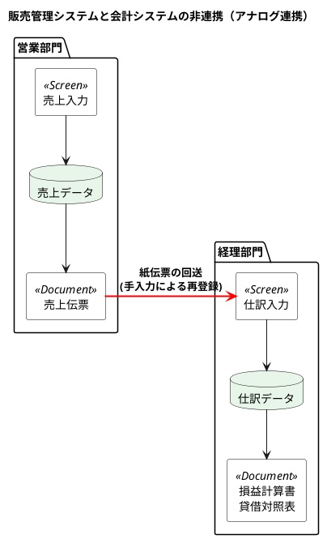
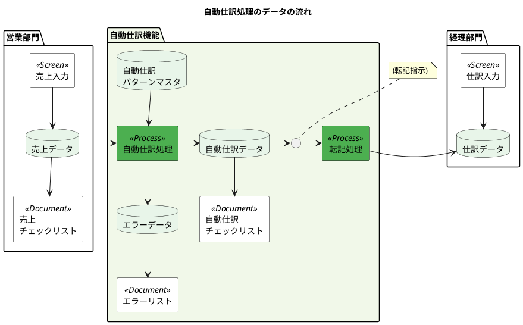
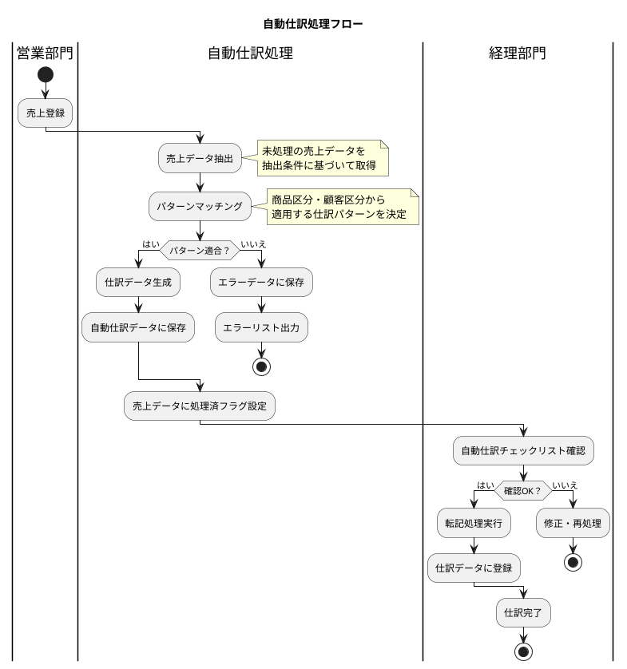
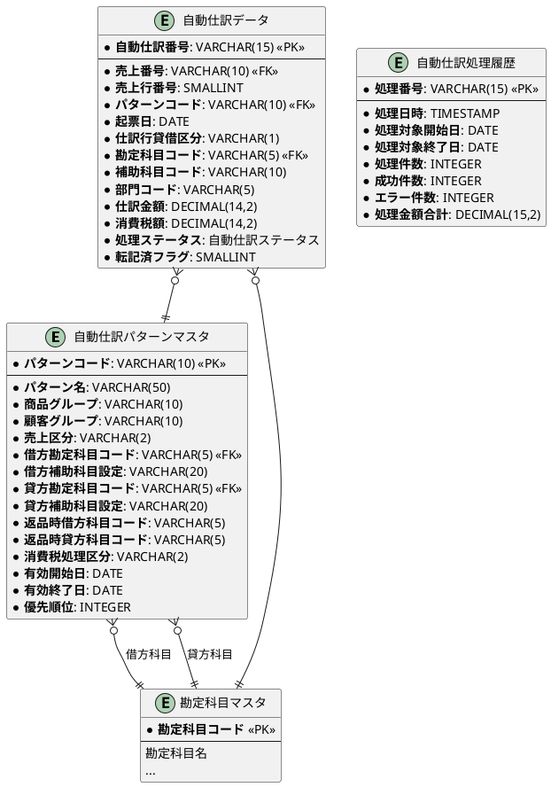
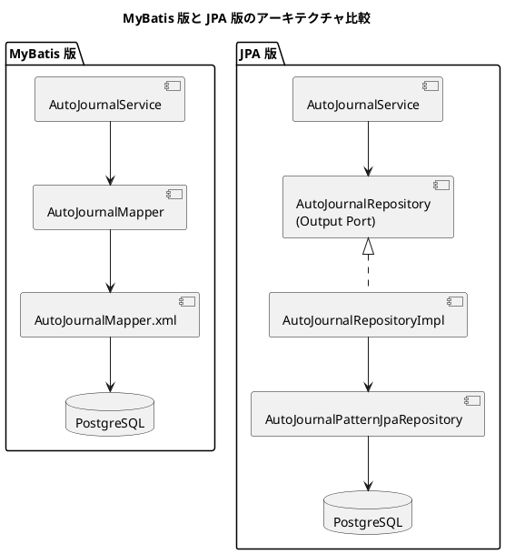

# 第17章：自動仕訳の設計（ORM版）

販売管理システムなどの業務システムから会計システムへの自動仕訳処理を TDD で設計していきます。売上データから仕訳データへの自動変換ルールと、効率的なバッチ処理の設計を行います。

JPA 版では、@Entity によるリレーション定義、@EntityGraph による N+1 問題対策、Spring Data JPA Specification による動的クエリを活用します。

---

## 17.1 自動仕訳の概要

### 自動仕訳とは

自動仕訳は、業務システムのトランザクションデータを会計システムの仕訳データへ自動的に変換する機能です。

#### 従来のアナログ連携（手入力による連携）

従来の方式では、販売管理システムで発行した売上伝票を紙で経理部門に回送し、経理担当者が仕訳入力を行っていました。



**アナログ連携の問題点：**

| 問題 | 説明 |
|-----|------|
| 二重入力 | 営業部門と経理部門で同じ情報を入力する作業負荷 |
| 入力ミス | 手入力によるデータ不整合 |
| タイムラグ | 紙伝票の回送による情報遅延 |
| 消費税計算ミス | 手計算による誤り |
| 勘定科目選択ミス | 担当者の判断ばらつき |

#### 自動仕訳によるデジタル連携

自動仕訳処理を導入することで、売上データから仕訳データへの変換を自動化します。



### 自動仕訳処理の流れ



### 売上伝票から仕訳伝票への変換例

#### 売上伝票（ビジネス上の事実）

| 項目 | 値 |
|-----|-----|
| 伝票日付 | 2024/04/01 |
| 顧客 | DBMフード新宿 |
| 明細1 | いちご蒸缶 1,000個 × 1,000円 = 1,000,000円 |
| 明細2 | アスパラ 200個 × 10,000円 = 2,000,000円 |
| 明細3 | さざえのエスカルゴ 1,500個 × 100円 = 150,000円 |
| 合計 | 3,150,000円（税抜）+ 消費税 315,000円 = 3,465,000円（税込） |

#### 仕訳伝票（会計上の記録）

| 借方科目 | 借方金額 | 貸方科目 | 貸方金額 | 摘要 |
|---------|---------|---------|---------|-----|
| 売掛金/DBMフード本社 | 3,465,000 | | | 売上計上 |
| | | 売上加工品/DBMフード新宿 | 1,150,000 | いちご蒸缶・さざえ |
| | | 売上生鮮品/DBMフード新宿 | 2,000,000 | アスパラ |
| | | 仮受消費税 | 315,000 | 消費税10% |

---

## 17.2 自動仕訳テーブルの設計

### フラグ管理方式と日付管理方式

売上データの処理状態を管理する方式には、2つのアプローチがあります。

#### フラグ管理方式

- **メリット**：シンプルな実装、処理状態が明確
- **デメリット**：再処理時にフラグリセットが必要、大量データでの更新負荷

#### 日付管理方式

- **メリット**：差分処理が容易、再処理時の柔軟性
- **デメリット**：管理テーブルが必要、更新日時の整合性管理が必要

### セット中心のアプリケーション設計

大量データを効率的に処理するには、ループ処理よりもセット中心処理が有効です。

| 方式 | 処理方法 | DB操作回数 |
|-----|---------|-----------|
| ループ処理 | 売上データを1件ずつ読み込み、各売上に対してパターンマスタを検索、1件ずつ仕訳データを挿入 | N×M回 |
| セット中心処理 | パターンマスタを1件読み込み、該当パターンの売上データを一括INSERT | M回（パターン数） |

### 自動仕訳関連テーブルの ER 図



---

## 17.3 MyBatis 版との実装比較

### データアクセス層の比較

| 機能 | MyBatis 版 | JPA 版 |
|-----|-----------|--------|
| ENUM 型変換 | TypeHandler | AttributeConverter |
| 関連エンティティ取得 | resultMap の association | @ManyToOne |
| N+1 問題対策 | JOIN を含む SQL | @EntityGraph |
| 動的クエリ | XML の `<if>` タグ | Specification パターン |
| バッチ INSERT | foreach 句 | saveAll() |
| 有効期間検索 | WHERE 句で条件指定 | JPQL で条件指定 |

### Flyway マイグレーション

<details>
<summary>V007__create_auto_journal_tables.sql</summary>

```sql
-- 自動仕訳処理ステータス
CREATE TYPE 自動仕訳ステータス AS ENUM ('処理待ち', '処理中', '処理完了', '転記済', 'エラー');

-- 自動仕訳パターンマスタ
CREATE TABLE "自動仕訳パターンマスタ" (
    "パターンコード" VARCHAR(10) PRIMARY KEY,
    "パターン名" VARCHAR(50) NOT NULL,
    "商品グループ" VARCHAR(10) DEFAULT 'ALL',
    "顧客グループ" VARCHAR(10) DEFAULT 'ALL',
    "売上区分" VARCHAR(2) DEFAULT '01',
    "借方勘定科目コード" VARCHAR(5) NOT NULL,
    "借方補助科目設定" VARCHAR(20),
    "貸方勘定科目コード" VARCHAR(5) NOT NULL,
    "貸方補助科目設定" VARCHAR(20),
    "返品時借方科目コード" VARCHAR(5),
    "返品時貸方科目コード" VARCHAR(5),
    "消費税処理区分" VARCHAR(2) DEFAULT '01',
    "有効開始日" DATE DEFAULT CURRENT_DATE,
    "有効終了日" DATE DEFAULT '9999-12-31',
    "優先順位" INTEGER DEFAULT 100,
    "作成日時" TIMESTAMP DEFAULT CURRENT_TIMESTAMP NOT NULL,
    "更新日時" TIMESTAMP DEFAULT CURRENT_TIMESTAMP NOT NULL,
    CONSTRAINT "fk_自動仕訳パターン_借方科目"
        FOREIGN KEY ("借方勘定科目コード") REFERENCES "勘定科目マスタ"("勘定科目コード"),
    CONSTRAINT "fk_自動仕訳パターン_貸方科目"
        FOREIGN KEY ("貸方勘定科目コード") REFERENCES "勘定科目マスタ"("勘定科目コード")
);

-- 自動仕訳データ
CREATE TABLE "自動仕訳データ" (
    "自動仕訳番号" VARCHAR(15) PRIMARY KEY,
    "売上番号" VARCHAR(10) NOT NULL,
    "売上行番号" SMALLINT NOT NULL,
    "パターンコード" VARCHAR(10) NOT NULL,
    "起票日" DATE NOT NULL,
    "仕訳行貸借区分" 仕訳行貸借区分 NOT NULL,
    "勘定科目コード" VARCHAR(5) NOT NULL,
    "補助科目コード" VARCHAR(10),
    "部門コード" VARCHAR(5),
    "仕訳金額" DECIMAL(14,2) NOT NULL,
    "消費税額" DECIMAL(14,2) DEFAULT 0,
    "処理ステータス" 自動仕訳ステータス DEFAULT '処理待ち' NOT NULL,
    "転記済フラグ" SMALLINT DEFAULT 0,
    "転記日" DATE,
    "仕訳伝票番号" VARCHAR(10),
    "エラーコード" VARCHAR(10),
    "エラーメッセージ" VARCHAR(200),
    "作成日時" TIMESTAMP DEFAULT CURRENT_TIMESTAMP NOT NULL,
    "更新日時" TIMESTAMP DEFAULT CURRENT_TIMESTAMP NOT NULL
);

-- 自動仕訳処理履歴
CREATE TABLE "自動仕訳処理履歴" (
    "処理番号" VARCHAR(15) PRIMARY KEY,
    "処理日時" TIMESTAMP NOT NULL DEFAULT CURRENT_TIMESTAMP,
    "処理対象開始日" DATE NOT NULL,
    "処理対象終了日" DATE NOT NULL,
    "処理件数" INTEGER DEFAULT 0,
    "成功件数" INTEGER DEFAULT 0,
    "エラー件数" INTEGER DEFAULT 0,
    "処理金額合計" DECIMAL(15,2) DEFAULT 0,
    "処理者" VARCHAR(50),
    "備考" TEXT,
    "作成日時" TIMESTAMP DEFAULT CURRENT_TIMESTAMP NOT NULL
);

-- インデックス
CREATE INDEX "idx_自動仕訳パターン_優先順位" ON "自動仕訳パターンマスタ"("優先順位");
CREATE INDEX "idx_自動仕訳_売上番号" ON "自動仕訳データ"("売上番号");
CREATE INDEX "idx_自動仕訳_処理ステータス" ON "自動仕訳データ"("処理ステータス");
CREATE INDEX "idx_自動仕訳_転記済フラグ" ON "自動仕訳データ"("転記済フラグ");
```

</details>

---

## 17.4 JPA エンティティの実装

### 自動仕訳ステータス Enum と AttributeConverter

<details>
<summary>AutoJournalStatus.java</summary>

```java
package com.example.accounting.domain.model.autojournal;

import lombok.Getter;
import lombok.RequiredArgsConstructor;

@Getter
@RequiredArgsConstructor
public enum AutoJournalStatus {
    PENDING("処理待ち"),
    PROCESSING("処理中"),
    COMPLETED("処理完了"),
    POSTED("転記済"),
    ERROR("エラー");

    private final String displayName;

    public static AutoJournalStatus fromDisplayName(String displayName) {
        for (AutoJournalStatus status : values()) {
            if (status.displayName.equals(displayName)) {
                return status;
            }
        }
        throw new IllegalArgumentException("Unknown auto journal status: " + displayName);
    }
}
```

</details>

<details>
<summary>AutoJournalStatusConverter.java</summary>

```java
package com.example.accounting.infrastructure.persistence.converter;

import com.example.accounting.domain.model.autojournal.AutoJournalStatus;
import jakarta.persistence.AttributeConverter;
import jakarta.persistence.Converter;

/**
 * 自動仕訳ステータス ↔ PostgreSQL ENUM 変換
 * JPA では AttributeConverter を使用して ENUM 型を変換する
 */
@Converter(autoApply = true)
public class AutoJournalStatusConverter implements AttributeConverter<AutoJournalStatus, String> {

    @Override
    public String convertToDatabaseColumn(AutoJournalStatus attribute) {
        return attribute != null ? attribute.getDisplayName() : null;
    }

    @Override
    public AutoJournalStatus convertToEntityAttribute(String dbData) {
        return dbData != null ? AutoJournalStatus.fromDisplayName(dbData) : null;
    }
}
```

</details>

### 自動仕訳パターンマスタ Entity

<details>
<summary>AutoJournalPattern.java</summary>

```java
package com.example.accounting.domain.model.autojournal;

import com.example.accounting.domain.model.account.Account;
import jakarta.persistence.*;
import lombok.*;

import java.time.LocalDate;
import java.time.LocalDateTime;

/**
 * 自動仕訳パターンマスタ Entity
 *
 * JPA 版では @ManyToOne で勘定科目との関連を定義
 * MyBatis 版では resultMap で手動マッピングしていたが、
 * JPA では @JoinColumn で外部キー関連を自動的に解決
 */
@Entity
@Table(name = "自動仕訳パターンマスタ")
@Data
@Builder
@NoArgsConstructor
@AllArgsConstructor
public class AutoJournalPattern {

    @Id
    @Column(name = "パターンコード", length = 10)
    private String patternCode;

    @Column(name = "パターン名", length = 50, nullable = false)
    private String patternName;

    @Column(name = "商品グループ", length = 10)
    private String productGroup;

    @Column(name = "顧客グループ", length = 10)
    private String customerGroup;

    @Column(name = "売上区分", length = 2)
    private String salesType;

    /**
     * 借方勘定科目との関連
     * @ManyToOne で遅延ロード（LAZY）を指定
     * N+1 問題が発生する場合は @EntityGraph で対策
     */
    @ManyToOne(fetch = FetchType.LAZY)
    @JoinColumn(name = "借方勘定科目コード", referencedColumnName = "勘定科目コード",
                insertable = false, updatable = false)
    private Account debitAccount;

    @Column(name = "借方勘定科目コード", length = 5, nullable = false)
    private String debitAccountCode;

    @Column(name = "借方補助科目設定", length = 20)
    private String debitSubAccountSetting;

    /**
     * 貸方勘定科目との関連
     */
    @ManyToOne(fetch = FetchType.LAZY)
    @JoinColumn(name = "貸方勘定科目コード", referencedColumnName = "勘定科目コード",
                insertable = false, updatable = false)
    private Account creditAccount;

    @Column(name = "貸方勘定科目コード", length = 5, nullable = false)
    private String creditAccountCode;

    @Column(name = "貸方補助科目設定", length = 20)
    private String creditSubAccountSetting;

    @Column(name = "返品時借方科目コード", length = 5)
    private String returnDebitAccountCode;

    @Column(name = "返品時貸方科目コード", length = 5)
    private String returnCreditAccountCode;

    @Column(name = "消費税処理区分", length = 2)
    private String taxProcessingType;

    @Column(name = "有効開始日")
    private LocalDate validFrom;

    @Column(name = "有効終了日")
    private LocalDate validTo;

    @Column(name = "優先順位")
    private Integer priority;

    @Column(name = "作成日時", nullable = false, updatable = false)
    private LocalDateTime createdAt;

    @Column(name = "更新日時", nullable = false)
    private LocalDateTime updatedAt;

    /**
     * 指定日付に有効かどうかを判定
     */
    public boolean isValidAt(LocalDate date) {
        return !date.isBefore(validFrom) && !date.isAfter(validTo);
    }

    /**
     * 商品グループと顧客グループにマッチするか判定
     */
    public boolean matches(String productGroup, String customerGroup) {
        boolean productMatch = "ALL".equals(this.productGroup) ||
                               this.productGroup.equals(productGroup);
        boolean customerMatch = "ALL".equals(this.customerGroup) ||
                                this.customerGroup.equals(customerGroup);
        return productMatch && customerMatch;
    }

    @PrePersist
    protected void onCreate() {
        LocalDateTime now = LocalDateTime.now();
        this.createdAt = now;
        this.updatedAt = now;
        if (this.validFrom == null) {
            this.validFrom = LocalDate.now();
        }
        if (this.validTo == null) {
            this.validTo = LocalDate.of(9999, 12, 31);
        }
        if (this.priority == null) {
            this.priority = 100;
        }
    }

    @PreUpdate
    protected void onUpdate() {
        this.updatedAt = LocalDateTime.now();
    }
}
```

</details>

### 自動仕訳データ Entity

<details>
<summary>AutoJournalEntry.java</summary>

```java
package com.example.accounting.domain.model.autojournal;

import com.example.accounting.domain.model.account.Account;
import com.example.accounting.domain.model.department.Department;
import com.example.accounting.domain.model.journal.DebitCreditType;
import com.example.accounting.infrastructure.persistence.converter.AutoJournalStatusConverter;
import com.example.accounting.infrastructure.persistence.converter.DebitCreditTypeConverter;
import jakarta.persistence.*;
import lombok.*;

import java.math.BigDecimal;
import java.time.LocalDate;
import java.time.LocalDateTime;

/**
 * 自動仕訳データ Entity
 *
 * JPA 版では @ManyToOne で関連エンティティを定義
 * 状態管理には Enum + AttributeConverter を使用
 */
@Entity
@Table(name = "自動仕訳データ")
@Data
@Builder
@NoArgsConstructor
@AllArgsConstructor
public class AutoJournalEntry {

    @Id
    @Column(name = "自動仕訳番号", length = 15)
    private String autoJournalNumber;

    @Column(name = "売上番号", length = 10, nullable = false)
    private String salesNumber;

    @Column(name = "売上行番号", nullable = false)
    private Integer salesLineNumber;

    /**
     * パターンマスタとの関連
     */
    @ManyToOne(fetch = FetchType.LAZY)
    @JoinColumn(name = "パターンコード", referencedColumnName = "パターンコード",
                insertable = false, updatable = false)
    private AutoJournalPattern pattern;

    @Column(name = "パターンコード", length = 10, nullable = false)
    private String patternCode;

    @Column(name = "起票日", nullable = false)
    private LocalDate postingDate;

    /**
     * 仕訳行貸借区分
     * AttributeConverter で PostgreSQL ENUM と Java Enum を変換
     */
    @Convert(converter = DebitCreditTypeConverter.class)
    @Column(name = "仕訳行貸借区分", nullable = false, columnDefinition = "仕訳行貸借区分")
    private DebitCreditType debitCreditType;

    /**
     * 勘定科目との関連
     */
    @ManyToOne(fetch = FetchType.LAZY)
    @JoinColumn(name = "勘定科目コード", referencedColumnName = "勘定科目コード",
                insertable = false, updatable = false)
    private Account account;

    @Column(name = "勘定科目コード", length = 5, nullable = false)
    private String accountCode;

    @Column(name = "補助科目コード", length = 10)
    private String subAccountCode;

    /**
     * 部門との関連
     */
    @ManyToOne(fetch = FetchType.LAZY)
    @JoinColumn(name = "部門コード", referencedColumnName = "部門コード",
                insertable = false, updatable = false)
    private Department department;

    @Column(name = "部門コード", length = 5)
    private String departmentCode;

    @Column(name = "仕訳金額", nullable = false, precision = 14, scale = 2)
    private BigDecimal amount;

    @Column(name = "消費税額", precision = 14, scale = 2)
    private BigDecimal taxAmount;

    /**
     * 処理ステータス
     * AttributeConverter で PostgreSQL ENUM と Java Enum を変換
     */
    @Convert(converter = AutoJournalStatusConverter.class)
    @Column(name = "処理ステータス", nullable = false, columnDefinition = "自動仕訳ステータス")
    private AutoJournalStatus status;

    @Column(name = "転記済フラグ")
    private Boolean postedFlag;

    @Column(name = "転記日")
    private LocalDate postedDate;

    @Column(name = "仕訳伝票番号", length = 10)
    private String journalVoucherNumber;

    @Column(name = "エラーコード", length = 10)
    private String errorCode;

    @Column(name = "エラーメッセージ", length = 200)
    private String errorMessage;

    @Column(name = "作成日時", nullable = false, updatable = false)
    private LocalDateTime createdAt;

    @Column(name = "更新日時", nullable = false)
    private LocalDateTime updatedAt;

    @PrePersist
    protected void onCreate() {
        LocalDateTime now = LocalDateTime.now();
        this.createdAt = now;
        this.updatedAt = now;
        if (this.status == null) {
            this.status = AutoJournalStatus.PENDING;
        }
        if (this.postedFlag == null) {
            this.postedFlag = false;
        }
        if (this.taxAmount == null) {
            this.taxAmount = BigDecimal.ZERO;
        }
    }

    @PreUpdate
    protected void onUpdate() {
        this.updatedAt = LocalDateTime.now();
    }
}
```

</details>

### 自動仕訳処理履歴 Entity

<details>
<summary>AutoJournalHistory.java</summary>

```java
package com.example.accounting.domain.model.autojournal;

import jakarta.persistence.*;
import lombok.*;

import java.math.BigDecimal;
import java.time.LocalDate;
import java.time.LocalDateTime;

/**
 * 自動仕訳処理履歴 Entity
 */
@Entity
@Table(name = "自動仕訳処理履歴")
@Data
@Builder
@NoArgsConstructor
@AllArgsConstructor
public class AutoJournalHistory {

    @Id
    @Column(name = "処理番号", length = 15)
    private String processNumber;

    @Column(name = "処理日時", nullable = false)
    private LocalDateTime processDateTime;

    @Column(name = "処理対象開始日", nullable = false)
    private LocalDate targetFromDate;

    @Column(name = "処理対象終了日", nullable = false)
    private LocalDate targetToDate;

    @Column(name = "処理件数")
    private Integer totalCount;

    @Column(name = "成功件数")
    private Integer successCount;

    @Column(name = "エラー件数")
    private Integer errorCount;

    @Column(name = "処理金額合計", precision = 15, scale = 2)
    private BigDecimal totalAmount;

    @Column(name = "処理者", length = 50)
    private String processedBy;

    @Column(name = "備考", columnDefinition = "TEXT")
    private String remarks;

    @Column(name = "作成日時", nullable = false, updatable = false)
    private LocalDateTime createdAt;

    @PrePersist
    protected void onCreate() {
        this.createdAt = LocalDateTime.now();
        if (this.totalCount == null) {
            this.totalCount = 0;
        }
        if (this.successCount == null) {
            this.successCount = 0;
        }
        if (this.errorCount == null) {
            this.errorCount = 0;
        }
        if (this.totalAmount == null) {
            this.totalAmount = BigDecimal.ZERO;
        }
    }
}
```

</details>

---

## 17.5 TDD によるパターンマッチングの実装

### パターンマッチングのテスト

<details>
<summary>AutoJournalPatternTest.java</summary>

```java
package com.example.accounting.domain.model.autojournal;

import org.junit.jupiter.api.DisplayName;
import org.junit.jupiter.api.Nested;
import org.junit.jupiter.api.Test;

import java.time.LocalDate;

import static org.assertj.core.api.Assertions.*;

@DisplayName("自動仕訳パターンのテスト")
class AutoJournalPatternTest {

    @Nested
    @DisplayName("パターンマッチング")
    class PatternMatchingTest {

        @Test
        @DisplayName("商品グループALLは全ての商品グループにマッチする")
        void shouldMatchAllProductGroups() {
            // Given: 商品グループALLのパターン
            var pattern = AutoJournalPattern.builder()
                .patternCode("P001")
                .productGroup("ALL")
                .customerGroup("ALL")
                .build();

            // When & Then
            assertThat(pattern.matches("加工品", "一般")).isTrue();
            assertThat(pattern.matches("生鮮品", "一般")).isTrue();
            assertThat(pattern.matches("雑貨", "特約店")).isTrue();
        }

        @Test
        @DisplayName("特定の商品グループのみにマッチする")
        void shouldMatchSpecificProductGroup() {
            // Given: 加工品専用パターン
            var pattern = AutoJournalPattern.builder()
                .patternCode("P002")
                .productGroup("加工品")
                .customerGroup("ALL")
                .build();

            // When & Then
            assertThat(pattern.matches("加工品", "一般")).isTrue();
            assertThat(pattern.matches("生鮮品", "一般")).isFalse();
        }

        @Test
        @DisplayName("商品グループと顧客グループの両方でマッチングする")
        void shouldMatchBothProductAndCustomerGroup() {
            // Given: 特定の組み合わせパターン
            var pattern = AutoJournalPattern.builder()
                .patternCode("P003")
                .productGroup("加工品")
                .customerGroup("特約店")
                .build();

            // When & Then
            assertThat(pattern.matches("加工品", "特約店")).isTrue();
            assertThat(pattern.matches("加工品", "一般")).isFalse();
            assertThat(pattern.matches("生鮮品", "特約店")).isFalse();
        }
    }

    @Nested
    @DisplayName("有効期間チェック")
    class ValidityCheckTest {

        @Test
        @DisplayName("有効期間内の日付でtrueを返す")
        void shouldReturnTrueForValidDate() {
            // Given
            var pattern = AutoJournalPattern.builder()
                .patternCode("P001")
                .validFrom(LocalDate.of(2024, 1, 1))
                .validTo(LocalDate.of(2024, 12, 31))
                .build();

            // When & Then
            assertThat(pattern.isValidAt(LocalDate.of(2024, 6, 15))).isTrue();
            assertThat(pattern.isValidAt(LocalDate.of(2024, 1, 1))).isTrue();
            assertThat(pattern.isValidAt(LocalDate.of(2024, 12, 31))).isTrue();
        }

        @Test
        @DisplayName("有効期間外の日付でfalseを返す")
        void shouldReturnFalseForInvalidDate() {
            // Given
            var pattern = AutoJournalPattern.builder()
                .patternCode("P001")
                .validFrom(LocalDate.of(2024, 1, 1))
                .validTo(LocalDate.of(2024, 12, 31))
                .build();

            // When & Then
            assertThat(pattern.isValidAt(LocalDate.of(2023, 12, 31))).isFalse();
            assertThat(pattern.isValidAt(LocalDate.of(2025, 1, 1))).isFalse();
        }
    }
}
```

</details>

### リポジトリのテスト

<details>
<summary>AutoJournalPatternRepositoryTest.java</summary>

```java
package com.example.accounting.infrastructure.persistence;

import com.example.accounting.domain.model.autojournal.*;
import com.example.accounting.infrastructure.persistence.repository.AutoJournalPatternJpaRepository;
import org.junit.jupiter.api.DisplayName;
import org.junit.jupiter.api.Nested;
import org.junit.jupiter.api.Test;
import org.springframework.beans.factory.annotation.Autowired;
import org.springframework.boot.test.autoconfigure.jdbc.AutoConfigureTestDatabase;
import org.springframework.boot.test.autoconfigure.orm.jpa.DataJpaTest;
import org.springframework.test.context.DynamicPropertyRegistry;
import org.springframework.test.context.DynamicPropertySource;
import org.testcontainers.containers.PostgreSQLContainer;
import org.testcontainers.junit.jupiter.Container;
import org.testcontainers.junit.jupiter.Testcontainers;

import java.time.LocalDate;

import static org.assertj.core.api.Assertions.*;

/**
 * 自動仕訳リポジトリのテスト
 *
 * JPA 版では @DataJpaTest を使用（MyBatis 版では @MybatisTest）
 * TestContainers で PostgreSQL コンテナを起動し、実際のDBでテスト
 */
@DataJpaTest
@AutoConfigureTestDatabase(replace = AutoConfigureTestDatabase.Replace.NONE)
@Testcontainers
@DisplayName("自動仕訳パターンリポジトリのテスト")
class AutoJournalPatternRepositoryTest {

    @Container
    static PostgreSQLContainer<?> postgres = new PostgreSQLContainer<>("postgres:16")
            .withDatabaseName("testdb")
            .withUsername("test")
            .withPassword("test");

    @DynamicPropertySource
    static void configureProperties(DynamicPropertyRegistry registry) {
        registry.add("spring.datasource.url", postgres::getJdbcUrl);
        registry.add("spring.datasource.username", postgres::getUsername);
        registry.add("spring.datasource.password", postgres::getPassword);
    }

    @Autowired
    private AutoJournalPatternJpaRepository patternRepository;

    @Nested
    @DisplayName("パターンマスタの操作")
    class PatternMasterTest {

        @Test
        @DisplayName("パターンマスタを登録・取得できる")
        void shouldSaveAndFindPattern() {
            // Given
            var pattern = AutoJournalPattern.builder()
                .patternCode("P001")
                .patternName("加工品売上")
                .productGroup("加工品")
                .customerGroup("ALL")
                .debitAccountCode("11300")  // 売掛金
                .creditAccountCode("41110") // 売上加工品
                .validFrom(LocalDate.of(2024, 1, 1))
                .validTo(LocalDate.of(9999, 12, 31))
                .priority(100)
                .build();

            // When
            patternRepository.save(pattern);
            var saved = patternRepository.findById("P001");

            // Then
            assertThat(saved).isPresent();
            assertThat(saved.get().getPatternName()).isEqualTo("加工品売上");
            assertThat(saved.get().getProductGroup()).isEqualTo("加工品");
        }

        @Test
        @DisplayName("有効なパターンを優先順位順で取得できる")
        void shouldFindValidPatternsSortedByPriority() {
            // Given: 複数のパターンを登録
            var pattern1 = AutoJournalPattern.builder()
                .patternCode("P001")
                .patternName("加工品売上")
                .productGroup("加工品")
                .customerGroup("ALL")
                .debitAccountCode("11300")
                .creditAccountCode("41110")
                .validFrom(LocalDate.of(2024, 1, 1))
                .validTo(LocalDate.of(9999, 12, 31))
                .priority(200)
                .build();

            var pattern2 = AutoJournalPattern.builder()
                .patternCode("P002")
                .patternName("生鮮品売上")
                .productGroup("生鮮品")
                .customerGroup("ALL")
                .debitAccountCode("11300")
                .creditAccountCode("41120")
                .validFrom(LocalDate.of(2024, 1, 1))
                .validTo(LocalDate.of(9999, 12, 31))
                .priority(100)
                .build();

            patternRepository.save(pattern1);
            patternRepository.save(pattern2);

            // When
            var patterns = patternRepository.findValidPatterns(LocalDate.of(2024, 4, 1));

            // Then
            assertThat(patterns).isSortedAccordingTo(
                (p1, p2) -> p1.getPriority().compareTo(p2.getPriority())
            );
            assertThat(patterns.get(0).getPatternCode()).isEqualTo("P002"); // priority 100
        }
    }
}
```

</details>

---

## 17.6 JpaRepository インターフェース

### 自動仕訳パターンマスタ Repository

<details>
<summary>AutoJournalPatternJpaRepository.java</summary>

```java
package com.example.accounting.infrastructure.persistence.repository;

import com.example.accounting.domain.model.autojournal.AutoJournalPattern;
import org.springframework.data.jpa.repository.EntityGraph;
import org.springframework.data.jpa.repository.JpaRepository;
import org.springframework.data.jpa.repository.Query;
import org.springframework.data.repository.query.Param;
import org.springframework.stereotype.Repository;

import java.time.LocalDate;
import java.util.List;
import java.util.Optional;

/**
 * 自動仕訳パターンマスタ JpaRepository
 *
 * JPA 版では JpaRepository を継承（MyBatis 版では Mapper インターフェース）
 * メソッド名規約で自動的にクエリを生成
 */
@Repository
public interface AutoJournalPatternJpaRepository extends JpaRepository<AutoJournalPattern, String> {

    /**
     * 有効なパターンを優先順位順で取得
     * @Query で JPQL を明示的に記述
     */
    @Query("SELECT p FROM AutoJournalPattern p " +
           "WHERE p.validFrom <= :date AND p.validTo >= :date " +
           "ORDER BY p.priority, p.patternCode")
    List<AutoJournalPattern> findValidPatterns(@Param("date") LocalDate date);

    /**
     * パターンコードで検索（勘定科目も一緒に取得）
     * @EntityGraph で N+1 問題を防止
     */
    @EntityGraph(attributePaths = {"debitAccount", "creditAccount"})
    Optional<AutoJournalPattern> findWithAccountsByPatternCode(String patternCode);

    /**
     * 商品グループで検索
     */
    List<AutoJournalPattern> findByProductGroupOrderByPriority(String productGroup);

    /**
     * 顧客グループで検索
     */
    List<AutoJournalPattern> findByCustomerGroupOrderByPriority(String customerGroup);
}
```

</details>

### 自動仕訳データ Repository

<details>
<summary>AutoJournalEntryJpaRepository.java</summary>

```java
package com.example.accounting.infrastructure.persistence.repository;

import com.example.accounting.domain.model.autojournal.AutoJournalEntry;
import com.example.accounting.domain.model.autojournal.AutoJournalStatus;
import org.springframework.data.jpa.repository.EntityGraph;
import org.springframework.data.jpa.repository.JpaRepository;
import org.springframework.data.jpa.repository.JpaSpecificationExecutor;
import org.springframework.data.jpa.repository.Query;
import org.springframework.data.repository.query.Param;
import org.springframework.stereotype.Repository;

import java.time.LocalDate;
import java.util.List;
import java.util.Optional;

/**
 * 自動仕訳データ JpaRepository
 *
 * JpaSpecificationExecutor を継承して動的クエリに対応
 * MyBatis 版では動的 SQL を XML で記述していたが、
 * JPA 版では Specification パターンを使用
 */
@Repository
public interface AutoJournalEntryJpaRepository
        extends JpaRepository<AutoJournalEntry, String>,
                JpaSpecificationExecutor<AutoJournalEntry> {

    /**
     * 売上番号で検索
     */
    List<AutoJournalEntry> findBySalesNumberOrderBySalesLineNumberAscDebitCreditTypeAsc(
            String salesNumber);

    /**
     * 未転記の自動仕訳を取得
     */
    @Query("SELECT e FROM AutoJournalEntry e " +
           "WHERE e.postedFlag = false " +
           "AND e.status = com.example.accounting.domain.model.autojournal.AutoJournalStatus.COMPLETED " +
           "ORDER BY e.postingDate, e.autoJournalNumber")
    List<AutoJournalEntry> findUnposted();

    /**
     * 未転記の自動仕訳を日付で取得
     */
    @Query("SELECT e FROM AutoJournalEntry e " +
           "WHERE e.postedFlag = false " +
           "AND e.status = com.example.accounting.domain.model.autojournal.AutoJournalStatus.COMPLETED " +
           "AND e.postingDate = :date " +
           "ORDER BY e.autoJournalNumber")
    List<AutoJournalEntry> findUnpostedByDate(@Param("date") LocalDate date);

    /**
     * ステータスで検索
     */
    List<AutoJournalEntry> findByStatusOrderByPostingDateAscAutoJournalNumberAsc(
            AutoJournalStatus status);

    /**
     * パターンと関連エンティティを一緒に取得
     * @EntityGraph で N+1 問題を防止
     */
    @EntityGraph(attributePaths = {"pattern", "account", "department"})
    Optional<AutoJournalEntry> findWithRelationsById(String autoJournalNumber);
}
```

</details>

---

## 17.7 Spring Data JPA Specification による動的クエリ

JPA 版では、複雑な検索条件を組み合わせる際に Specification パターンを使用します。MyBatis 版では XML の `<if>` タグで動的 SQL を構築していましたが、JPA 版では型安全な Specification で実現します。

<details>
<summary>AutoJournalEntrySpecifications.java</summary>

```java
package com.example.accounting.infrastructure.persistence.specification;

import com.example.accounting.domain.model.autojournal.AutoJournalEntry;
import com.example.accounting.domain.model.autojournal.AutoJournalStatus;
import org.springframework.data.jpa.domain.Specification;

import java.time.LocalDate;

/**
 * 自動仕訳エントリ検索用 Specification
 *
 * JPA 版では Specification パターンで動的クエリを構築
 * MyBatis 版の XML 動的 SQL を Java コードで表現
 *
 * 使用例:
 * var spec = AutoJournalEntrySpecifications.unposted()
 *     .and(AutoJournalEntrySpecifications.postingDateBetween(from, to))
 *     .and(AutoJournalEntrySpecifications.hasStatus(AutoJournalStatus.COMPLETED));
 * var entries = repository.findAll(spec);
 */
public class AutoJournalEntrySpecifications {

    /**
     * 未転記条件
     */
    public static Specification<AutoJournalEntry> unposted() {
        return (root, query, cb) -> cb.equal(root.get("postedFlag"), false);
    }

    /**
     * ステータス条件
     */
    public static Specification<AutoJournalEntry> hasStatus(AutoJournalStatus status) {
        return (root, query, cb) -> cb.equal(root.get("status"), status);
    }

    /**
     * 起票日範囲条件
     */
    public static Specification<AutoJournalEntry> postingDateBetween(
            LocalDate from, LocalDate to) {
        return (root, query, cb) -> cb.between(root.get("postingDate"), from, to);
    }

    /**
     * 起票日条件
     */
    public static Specification<AutoJournalEntry> postingDateEquals(LocalDate date) {
        return (root, query, cb) -> cb.equal(root.get("postingDate"), date);
    }

    /**
     * 売上番号条件
     */
    public static Specification<AutoJournalEntry> salesNumberEquals(String salesNumber) {
        return (root, query, cb) -> cb.equal(root.get("salesNumber"), salesNumber);
    }

    /**
     * パターンコード条件
     */
    public static Specification<AutoJournalEntry> patternCodeEquals(String patternCode) {
        return (root, query, cb) -> cb.equal(root.get("patternCode"), patternCode);
    }

    /**
     * 勘定科目コード条件
     */
    public static Specification<AutoJournalEntry> accountCodeEquals(String accountCode) {
        return (root, query, cb) -> cb.equal(root.get("accountCode"), accountCode);
    }

    /**
     * 部門コード条件
     */
    public static Specification<AutoJournalEntry> departmentCodeEquals(String departmentCode) {
        return (root, query, cb) -> cb.equal(root.get("departmentCode"), departmentCode);
    }

    /**
     * エラー有無条件
     */
    public static Specification<AutoJournalEntry> hasError() {
        return (root, query, cb) -> cb.isNotNull(root.get("errorCode"));
    }

    /**
     * エラー無し条件
     */
    public static Specification<AutoJournalEntry> noError() {
        return (root, query, cb) -> cb.isNull(root.get("errorCode"));
    }
}
```

</details>

### Specification の使用例

```java
// 動的クエリの組み立て
var spec = AutoJournalEntrySpecifications.unposted()
    .and(AutoJournalEntrySpecifications.postingDateBetween(
        LocalDate.of(2024, 4, 1),
        LocalDate.of(2024, 4, 30)))
    .and(AutoJournalEntrySpecifications.hasStatus(AutoJournalStatus.COMPLETED))
    .and(AutoJournalEntrySpecifications.noError());

// クエリ実行
var entries = entryJpaRepository.findAll(spec);
```

---

## 17.8 自動仕訳サービスの実装

<details>
<summary>AutoJournalService.java（一部抜粋）</summary>

```java
package com.example.accounting.application.service;

import com.example.accounting.application.dto.AutoJournalResult;
import com.example.accounting.application.dto.SalesData;
import com.example.accounting.application.port.out.AutoJournalRepository;
import com.example.accounting.domain.model.autojournal.*;
import com.example.accounting.domain.model.journal.*;
import lombok.RequiredArgsConstructor;
import lombok.extern.slf4j.Slf4j;
import org.springframework.stereotype.Service;
import org.springframework.transaction.annotation.Transactional;

import java.math.BigDecimal;
import java.time.LocalDate;
import java.time.LocalDateTime;
import java.util.*;

/**
 * 自動仕訳サービス
 *
 * JPA 版でもビジネスロジックは MyBatis 版と同じ
 * リポジトリ経由でデータアクセスを行う
 */
@Service
@RequiredArgsConstructor
@Slf4j
public class AutoJournalService {

    private final AutoJournalRepository autoJournalRepository;
    private final JournalRepository journalRepository;

    /**
     * 売上データから自動仕訳を生成する
     */
    @Transactional
    public AutoJournalResult generateAutoJournals(List<SalesData> salesDataList) {
        var processNumber = generateProcessNumber();
        var startTime = LocalDateTime.now();

        int successCount = 0;
        int errorCount = 0;
        BigDecimal totalAmount = BigDecimal.ZERO;

        // 有効なパターンを取得
        var patterns = autoJournalRepository.findValidPatterns(LocalDate.now());

        List<AutoJournalEntry> allEntries = new ArrayList<>();

        for (SalesData sale : salesDataList) {
            try {
                // マッチするパターンを検索
                var matchedPattern = findMatchingPattern(patterns, sale);

                if (matchedPattern.isPresent()) {
                    // 自動仕訳データを生成
                    var entries = createAutoJournalEntries(sale, matchedPattern.get());
                    allEntries.addAll(entries);

                    successCount++;
                    totalAmount = totalAmount.add(sale.getAmount());
                } else {
                    // パターン不一致エラー
                    allEntries.add(createErrorEntry(sale, "E001", "マッチするパターンが見つかりません"));
                    errorCount++;
                }
            } catch (Exception e) {
                log.error("自動仕訳処理エラー: {}", sale.getSalesNumber(), e);
                allEntries.add(createErrorEntry(sale, "E999", e.getMessage()));
                errorCount++;
            }
        }

        // JPA 版では saveAll でバッチ保存
        autoJournalRepository.saveAllEntries(allEntries);

        // 処理履歴を保存
        var history = AutoJournalHistory.builder()
            .processNumber(processNumber)
            .processDateTime(startTime)
            .targetFromDate(salesDataList.stream()
                .map(SalesData::getSalesDate)
                .min(LocalDate::compareTo).orElse(LocalDate.now()))
            .targetToDate(salesDataList.stream()
                .map(SalesData::getSalesDate)
                .max(LocalDate::compareTo).orElse(LocalDate.now()))
            .totalCount(salesDataList.size())
            .successCount(successCount)
            .errorCount(errorCount)
            .totalAmount(totalAmount)
            .build();

        autoJournalRepository.saveHistory(history);

        return new AutoJournalResult(processNumber, successCount, errorCount, totalAmount);
    }

    /**
     * マッチするパターンを検索
     */
    private Optional<AutoJournalPattern> findMatchingPattern(
            List<AutoJournalPattern> patterns, SalesData sale) {
        return patterns.stream()
            .filter(p -> p.matches(sale.getProductGroup(), sale.getCustomerGroup()))
            .filter(p -> p.isValidAt(sale.getSalesDate()))
            .findFirst();
    }
}
```

</details>

---

## 17.9 ヘキサゴナルアーキテクチャでのポート設計

### Output Port（リポジトリインターフェース）

<details>
<summary>AutoJournalRepository.java</summary>

```java
package com.example.accounting.application.port.out;

import com.example.accounting.domain.model.autojournal.*;

import java.time.LocalDate;
import java.util.List;
import java.util.Optional;

/**
 * 自動仕訳リポジトリ（Output Port）
 *
 * ヘキサゴナルアーキテクチャにおける出力ポート
 * アプリケーション層はこのインターフェースに依存し、
 * インフラストラクチャ層で実装する
 */
public interface AutoJournalRepository {

    // パターンマスタ操作
    void savePattern(AutoJournalPattern pattern);

    Optional<AutoJournalPattern> findPatternByCode(String patternCode);

    Optional<AutoJournalPattern> findPatternWithAccounts(String patternCode);

    List<AutoJournalPattern> findAllPatterns();

    List<AutoJournalPattern> findValidPatterns(LocalDate date);

    void updatePattern(AutoJournalPattern pattern);

    void deletePattern(String patternCode);

    // 自動仕訳エントリ操作
    void saveEntry(AutoJournalEntry entry);

    void saveAllEntries(List<AutoJournalEntry> entries);

    Optional<AutoJournalEntry> findEntryByNumber(String autoJournalNumber);

    Optional<AutoJournalEntry> findEntryWithRelations(String autoJournalNumber);

    List<AutoJournalEntry> findEntriesBySalesNumber(String salesNumber);

    List<AutoJournalEntry> findUnpostedEntries();

    List<AutoJournalEntry> findUnpostedEntriesByDate(LocalDate date);

    List<AutoJournalEntry> findEntriesByStatus(AutoJournalStatus status);

    void updateEntry(AutoJournalEntry entry);

    // 処理履歴操作
    void saveHistory(AutoJournalHistory history);

    Optional<AutoJournalHistory> findHistoryByNumber(String processNumber);

    List<AutoJournalHistory> findHistoriesByDateRange(LocalDate fromDate, LocalDate toDate);

    void deleteAll();
}
```

</details>

---

## 17.10 まとめ：MyBatis 版と JPA 版の比較

### データアクセス層のアーキテクチャ比較



### JPA 版の特徴

| 観点 | JPA 版の特徴 |
|-----|-------------|
| 型安全性 | Specification パターンによる型安全な動的クエリ |
| N+1 問題対策 | @EntityGraph による宣言的な解決 |
| バッチ処理 | saveAll() による効率的な一括保存 |
| ポート分離 | Output Port インターフェースによる抽象化 |
| テスト容易性 | @DataJpaTest + TestContainers |

---

## 次章予告

[第18章](chapter18-orm.md)では、勘定科目残高テーブルの設計について、JPA 版での実装を解説します。
