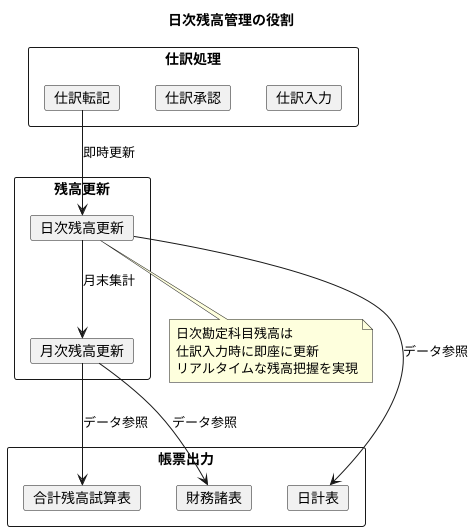
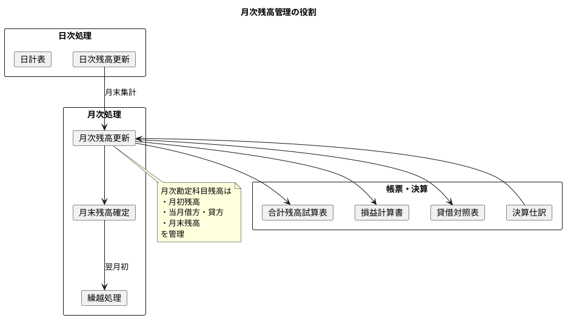
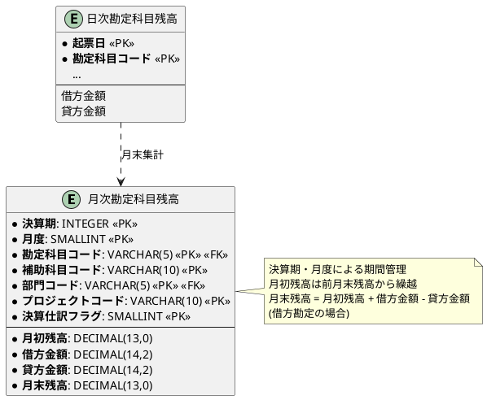

# 第18章：勘定科目残高の設計（ORM版）

会計システムにおける残高管理の基盤となる「勘定科目別残高テーブル」を TDD で設計していきます。日次・月次の残高管理と、帳票出力に必要なテーブル構造を実装します。

JPA 版では、@EmbeddedId による複合主キー、@Query による集計クエリ、Projection インターフェースを活用します。

---

## 18.1 日次勘定科目残高の設計

### 日次残高管理の目的

日次勘定科目残高は、日々の仕訳処理に連動して更新される残高情報を管理します。日計表の出力やリアルタイムな残高把握に使用します。



| 目的 | 説明 |
|-----|------|
| 日計表出力 | 日単位の勘定科目別借方・貸方合計の集計 |
| リアルタイム残高 | 仕訳入力と同時に残高を更新 |
| 監査証跡 | 日付別の取引履歴の保持 |
| 決算仕訳の区別 | 通常仕訳と決算仕訳の分離管理 |

### 複合主キーによる多次元管理

日次残高テーブルは、以下の6つのカラムで複合主キーを構成します。

| カラム | 説明 | 例 |
|--------|------|-----|
| 起票日 | 仕訳の起票日 | 2024-04-01 |
| 勘定科目コード | 勘定科目マスタのコード | 11110 |
| 補助科目コード | 補助的な分類（空文字可） | 空文字 |
| 部門コード | 部門マスタのコード | 10100 |
| プロジェクトコード | プロジェクト単位管理（空文字可） | P001 |
| 決算仕訳フラグ | 決算仕訳か否か | false |

この設計により、同じ勘定科目でも以下の粒度で残高を分けて管理できます。

- 部門別の売上高
- プロジェクト別の原価
- 通常仕訳と決算仕訳の分離

---

## 18.2 MyBatis 版との実装比較

### データアクセス層の比較

| 機能 | MyBatis 版 | JPA 版 |
|-----|-----------|--------|
| 複合主キー | Key 内部クラス | @EmbeddedId + @Embeddable |
| 検索結果マッピング | resultMap + DTO | Projection インターフェース |
| UPSERT | XML で INSERT ON CONFLICT | @Query + nativeQuery |
| 集計クエリ | XML で GROUP BY | Native Query + Projection |
| 日計表出力 | resultMap でマッピング | Projection → DTO 変換 |

### Flyway マイグレーション

<details>
<summary>V008__create_daily_account_balance_table.sql</summary>

```sql
-- 日次勘定科目残高
CREATE TABLE "日次勘定科目残高" (
    "起票日" DATE NOT NULL,
    "勘定科目コード" VARCHAR(5) NOT NULL,
    "補助科目コード" VARCHAR(10) NOT NULL DEFAULT '',
    "部門コード" VARCHAR(5) NOT NULL DEFAULT '00000',
    "プロジェクトコード" VARCHAR(10) NOT NULL DEFAULT '',
    "決算仕訳フラグ" SMALLINT NOT NULL DEFAULT 0,
    "借方金額" DECIMAL(14,2) NOT NULL DEFAULT 0,
    "貸方金額" DECIMAL(14,2) NOT NULL DEFAULT 0,
    "作成日時" TIMESTAMP DEFAULT CURRENT_TIMESTAMP NOT NULL,
    "更新日時" TIMESTAMP DEFAULT CURRENT_TIMESTAMP NOT NULL,
    PRIMARY KEY (
        "起票日",
        "勘定科目コード",
        "補助科目コード",
        "部門コード",
        "プロジェクトコード",
        "決算仕訳フラグ"
    ),
    CONSTRAINT "fk_日次残高_勘定科目"
        FOREIGN KEY ("勘定科目コード") REFERENCES "勘定科目マスタ"("勘定科目コード"),
    CONSTRAINT "fk_日次残高_部門"
        FOREIGN KEY ("部門コード") REFERENCES "部門マスタ"("部門コード")
);

-- インデックス
CREATE INDEX "idx_日次残高_起票日" ON "日次勘定科目残高"("起票日");
CREATE INDEX "idx_日次残高_勘定科目" ON "日次勘定科目残高"("勘定科目コード");
CREATE INDEX "idx_日次残高_部門" ON "日次勘定科目残高"("部門コード");
```

</details>

---

## 18.3 JPA エンティティの実装

### 複合主キークラス（@Embeddable）

<details>
<summary>DailyAccountBalanceId.java</summary>

```java
package com.example.accounting.domain.model.balance;

import jakarta.persistence.Column;
import jakarta.persistence.Embeddable;
import lombok.*;

import java.io.Serializable;
import java.time.LocalDate;
import java.util.Objects;

/**
 * 日次勘定科目残高の複合主キー
 *
 * JPA では @EmbeddedId で複合主キーを表現
 * MyBatis 版では Key 内部クラスを使用していたが、
 * JPA 版では @Embeddable アノテーション付きクラスで実装
 *
 * 注意: equals() と hashCode() の実装が必須
 */
@Embeddable
@Data
@Builder
@NoArgsConstructor
@AllArgsConstructor
public class DailyAccountBalanceId implements Serializable {

    @Column(name = "起票日", nullable = false)
    private LocalDate postingDate;

    @Column(name = "勘定科目コード", length = 5, nullable = false)
    private String accountCode;

    @Column(name = "補助科目コード", length = 10, nullable = false)
    private String subAccountCode;

    @Column(name = "部門コード", length = 5, nullable = false)
    private String departmentCode;

    @Column(name = "プロジェクトコード", length = 10, nullable = false)
    private String projectCode;

    @Column(name = "決算仕訳フラグ", nullable = false)
    private Boolean closingJournalFlag;

    @Override
    public boolean equals(Object o) {
        if (this == o) return true;
        if (o == null || getClass() != o.getClass()) return false;
        DailyAccountBalanceId that = (DailyAccountBalanceId) o;
        return Objects.equals(postingDate, that.postingDate) &&
               Objects.equals(accountCode, that.accountCode) &&
               Objects.equals(subAccountCode, that.subAccountCode) &&
               Objects.equals(departmentCode, that.departmentCode) &&
               Objects.equals(projectCode, that.projectCode) &&
               Objects.equals(closingJournalFlag, that.closingJournalFlag);
    }

    @Override
    public int hashCode() {
        return Objects.hash(postingDate, accountCode, subAccountCode,
                           departmentCode, projectCode, closingJournalFlag);
    }
}
```

</details>

### 日次勘定科目残高 Entity

<details>
<summary>DailyAccountBalance.java</summary>

```java
package com.example.accounting.domain.model.balance;

import com.example.accounting.domain.model.account.Account;
import com.example.accounting.domain.model.department.Department;
import jakarta.persistence.*;
import lombok.*;

import java.math.BigDecimal;
import java.time.LocalDateTime;

/**
 * 日次勘定科目残高 Entity
 *
 * JPA 版では @EmbeddedId で複合主キーを定義
 * MyBatis 版では単純な POJO + Key 内部クラスだったが、
 * JPA 版では Entity アノテーションと関連定義が必要
 */
@Entity
@Table(name = "日次勘定科目残高")
@Data
@Builder
@NoArgsConstructor
@AllArgsConstructor
public class DailyAccountBalance {

    /**
     * 複合主キー
     * @EmbeddedId で埋め込みIDを使用
     */
    @EmbeddedId
    private DailyAccountBalanceId id;

    /**
     * 勘定科目マスタとの関連
     */
    @ManyToOne(fetch = FetchType.LAZY)
    @JoinColumn(name = "勘定科目コード", referencedColumnName = "勘定科目コード",
                insertable = false, updatable = false)
    private Account account;

    /**
     * 部門マスタとの関連
     */
    @ManyToOne(fetch = FetchType.LAZY)
    @JoinColumn(name = "部門コード", referencedColumnName = "部門コード",
                insertable = false, updatable = false)
    private Department department;

    @Column(name = "借方金額", nullable = false, precision = 14, scale = 2)
    private BigDecimal debitAmount;

    @Column(name = "貸方金額", nullable = false, precision = 14, scale = 2)
    private BigDecimal creditAmount;

    @Column(name = "作成日時", nullable = false, updatable = false)
    private LocalDateTime createdAt;

    @Column(name = "更新日時", nullable = false)
    private LocalDateTime updatedAt;

    /**
     * 残高を計算する（貸借区分に応じて）
     * @param isDebitAccount 借方勘定かどうか
     * @return 残高
     */
    public BigDecimal calculateBalance(boolean isDebitAccount) {
        if (isDebitAccount) {
            // 借方勘定：借方 - 貸方
            return debitAmount.subtract(creditAmount);
        } else {
            // 貸方勘定：貸方 - 借方
            return creditAmount.subtract(debitAmount);
        }
    }

    /**
     * 金額を加算する
     */
    public void addAmounts(BigDecimal debit, BigDecimal credit) {
        this.debitAmount = this.debitAmount.add(debit);
        this.creditAmount = this.creditAmount.add(credit);
        this.updatedAt = LocalDateTime.now();
    }

    @PrePersist
    protected void onCreate() {
        LocalDateTime now = LocalDateTime.now();
        this.createdAt = now;
        this.updatedAt = now;
        if (this.debitAmount == null) {
            this.debitAmount = BigDecimal.ZERO;
        }
        if (this.creditAmount == null) {
            this.creditAmount = BigDecimal.ZERO;
        }
    }

    @PreUpdate
    protected void onUpdate() {
        this.updatedAt = LocalDateTime.now();
    }
}
```

</details>

### 日計表行用 Projection インターフェース

<details>
<summary>DailyReportLineProjection.java と DailyReportLine.java</summary>

```java
package com.example.accounting.domain.model.balance;

import java.math.BigDecimal;
import java.time.LocalDate;

/**
 * 日計表行の Projection インターフェース
 *
 * JPA 版では Projection インターフェースを使用して
 * 集計クエリの結果をマッピング
 * MyBatis 版では resultMap で DTO にマッピングしていた
 */
public interface DailyReportLineProjection {
    LocalDate getReportDate();
    String getAccountCode();
    String getAccountName();
    String getSubAccountCode();
    String getSubAccountName();
    BigDecimal getDebitTotal();
    BigDecimal getCreditTotal();
    BigDecimal getBalance();
}
```

```java
package com.example.accounting.domain.model.balance;

import lombok.AllArgsConstructor;
import lombok.Builder;
import lombok.Data;
import lombok.NoArgsConstructor;

import java.math.BigDecimal;
import java.time.LocalDate;

/**
 * 日計表行 DTO
 */
@Data
@Builder
@NoArgsConstructor
@AllArgsConstructor
public class DailyReportLine {
    private LocalDate reportDate;         // 対象日
    private String accountCode;           // 勘定科目コード
    private String accountName;           // 勘定科目名
    private String subAccountCode;        // 補助科目コード
    private String subAccountName;        // 補助科目名
    private BigDecimal debitTotal;        // 借方合計
    private BigDecimal creditTotal;       // 貸方合計
    private BigDecimal balance;           // 残高

    /**
     * Projection から DTO を生成
     */
    public static DailyReportLine fromProjection(DailyReportLineProjection projection) {
        return DailyReportLine.builder()
            .reportDate(projection.getReportDate())
            .accountCode(projection.getAccountCode())
            .accountName(projection.getAccountName())
            .subAccountCode(projection.getSubAccountCode())
            .subAccountName(projection.getSubAccountName())
            .debitTotal(projection.getDebitTotal())
            .creditTotal(projection.getCreditTotal())
            .balance(projection.getBalance())
            .build();
    }
}
```

</details>

---

## 18.4 TDD による日次残高テーブルの実装

### リポジトリのテスト

<details>
<summary>DailyAccountBalanceRepositoryTest.java</summary>

```java
package com.example.accounting.infrastructure.persistence;

import com.example.accounting.domain.model.balance.DailyAccountBalance;
import com.example.accounting.domain.model.balance.DailyAccountBalanceId;
import com.example.accounting.infrastructure.persistence.repository.DailyAccountBalanceJpaRepository;
import org.junit.jupiter.api.DisplayName;
import org.junit.jupiter.api.Nested;
import org.junit.jupiter.api.Test;
import org.springframework.beans.factory.annotation.Autowired;
import org.springframework.boot.test.autoconfigure.jdbc.AutoConfigureTestDatabase;
import org.springframework.boot.test.autoconfigure.orm.jpa.DataJpaTest;
import org.springframework.test.context.DynamicPropertyRegistry;
import org.springframework.test.context.DynamicPropertySource;
import org.testcontainers.containers.PostgreSQLContainer;
import org.testcontainers.junit.jupiter.Container;
import org.testcontainers.junit.jupiter.Testcontainers;

import java.math.BigDecimal;
import java.time.LocalDate;

import static org.assertj.core.api.Assertions.*;

/**
 * 日次勘定科目残高リポジトリのテスト
 *
 * JPA 版では @DataJpaTest を使用（MyBatis 版では @MybatisTest）
 */
@DataJpaTest
@AutoConfigureTestDatabase(replace = AutoConfigureTestDatabase.Replace.NONE)
@Testcontainers
@DisplayName("日次勘定科目残高リポジトリのテスト")
class DailyAccountBalanceRepositoryTest {

    @Container
    static PostgreSQLContainer<?> postgres = new PostgreSQLContainer<>("postgres:16")
            .withDatabaseName("testdb")
            .withUsername("test")
            .withPassword("test");

    @DynamicPropertySource
    static void configureProperties(DynamicPropertyRegistry registry) {
        registry.add("spring.datasource.url", postgres::getJdbcUrl);
        registry.add("spring.datasource.username", postgres::getUsername);
        registry.add("spring.datasource.password", postgres::getPassword);
    }

    @Autowired
    private DailyAccountBalanceJpaRepository dailyBalanceRepository;

    @Nested
    @DisplayName("日次残高の登録・更新")
    class DailyBalanceUpsertTest {

        @Test
        @DisplayName("新規の日次残高を登録できる")
        void shouldInsertNewDailyBalance() {
            // Given
            var id = DailyAccountBalanceId.builder()
                .postingDate(LocalDate.of(2024, 4, 1))
                .accountCode("11110")  // 現金
                .subAccountCode("")
                .departmentCode("10100")
                .projectCode("")
                .closingJournalFlag(false)
                .build();

            var balance = DailyAccountBalance.builder()
                .id(id)
                .debitAmount(new BigDecimal("100000"))
                .creditAmount(BigDecimal.ZERO)
                .build();

            // When
            dailyBalanceRepository.save(balance);

            // Then
            var saved = dailyBalanceRepository.findById(id);
            assertThat(saved).isPresent();
            assertThat(saved.get().getDebitAmount())
                .isEqualByComparingTo("100000");
        }

        @Test
        @DisplayName("既存の日次残高を更新できる")
        void shouldUpdateExistingDailyBalance() {
            // Given: 初回登録
            var id = DailyAccountBalanceId.builder()
                .postingDate(LocalDate.of(2024, 4, 1))
                .accountCode("11110")
                .subAccountCode("")
                .departmentCode("10100")
                .projectCode("")
                .closingJournalFlag(false)
                .build();

            var balance1 = DailyAccountBalance.builder()
                .id(id)
                .debitAmount(new BigDecimal("100000"))
                .creditAmount(BigDecimal.ZERO)
                .build();
            dailyBalanceRepository.save(balance1);

            // When: 金額を追加
            var saved = dailyBalanceRepository.findById(id).orElseThrow();
            saved.addAmounts(new BigDecimal("50000"), BigDecimal.ZERO);
            dailyBalanceRepository.save(saved);

            // Then: 合算される
            var updated = dailyBalanceRepository.findById(id);
            assertThat(updated).isPresent();
            assertThat(updated.get().getDebitAmount())
                .isEqualByComparingTo("150000");
        }
    }

    @Nested
    @DisplayName("日次残高の検索")
    class DailyBalanceSearchTest {

        @Test
        @DisplayName("日付範囲で日次残高を検索できる")
        void shouldFindBalancesByDateRange() {
            // When
            var balances = dailyBalanceRepository.findByIdPostingDateBetween(
                LocalDate.of(2024, 4, 1),
                LocalDate.of(2024, 4, 30)
            );

            // Then
            assertThat(balances).allMatch(b ->
                !b.getId().getPostingDate().isBefore(LocalDate.of(2024, 4, 1)) &&
                !b.getId().getPostingDate().isAfter(LocalDate.of(2024, 4, 30))
            );
        }

        @Test
        @DisplayName("勘定科目コードで日次残高を検索できる")
        void shouldFindBalancesByAccountCode() {
            // When
            var balances = dailyBalanceRepository.findByIdAccountCode("11110");

            // Then
            assertThat(balances).allMatch(b ->
                b.getId().getAccountCode().equals("11110")
            );
        }
    }
}
```

</details>

---

## 18.5 JpaRepository インターフェース

### 日次勘定科目残高 Repository

<details>
<summary>DailyAccountBalanceJpaRepository.java</summary>

```java
package com.example.accounting.infrastructure.persistence.repository;

import com.example.accounting.domain.model.balance.DailyAccountBalance;
import com.example.accounting.domain.model.balance.DailyAccountBalanceId;
import com.example.accounting.domain.model.balance.DailyReportLineProjection;
import org.springframework.data.jpa.repository.JpaRepository;
import org.springframework.data.jpa.repository.Modifying;
import org.springframework.data.jpa.repository.Query;
import org.springframework.data.repository.query.Param;
import org.springframework.stereotype.Repository;

import java.math.BigDecimal;
import java.time.LocalDate;
import java.util.List;

/**
 * 日次勘定科目残高 JpaRepository
 *
 * JPA 版では JpaRepository を継承
 * 複合主キーは DailyAccountBalanceId として定義
 * 集計クエリは @Query + Projection で実装
 */
@Repository
public interface DailyAccountBalanceJpaRepository
        extends JpaRepository<DailyAccountBalance, DailyAccountBalanceId> {

    /**
     * 日付範囲で検索
     * メソッド名規約で自動生成
     */
    List<DailyAccountBalance> findByIdPostingDateBetween(
            LocalDate fromDate, LocalDate toDate);

    /**
     * 起票日で検索
     */
    List<DailyAccountBalance> findByIdPostingDate(LocalDate postingDate);

    /**
     * 勘定科目コードで検索
     */
    List<DailyAccountBalance> findByIdAccountCode(String accountCode);

    /**
     * 部門コードで検索
     */
    List<DailyAccountBalance> findByIdDepartmentCode(String departmentCode);

    /**
     * 日計表データ取得
     * Native Query で集計クエリを実行し、Projection にマッピング
     */
    @Query(value = """
        SELECT
            d."起票日" as reportDate,
            d."勘定科目コード" as accountCode,
            a."勘定科目名" as accountName,
            d."補助科目コード" as subAccountCode,
            '' as subAccountName,
            SUM(d."借方金額") as debitTotal,
            SUM(d."貸方金額") as creditTotal,
            CASE
                WHEN a."貸借区分" = '借方'
                THEN SUM(d."借方金額") - SUM(d."貸方金額")
                ELSE SUM(d."貸方金額") - SUM(d."借方金額")
            END as balance
        FROM "日次勘定科目残高" d
        JOIN "勘定科目マスタ" a ON d."勘定科目コード" = a."勘定科目コード"
        WHERE d."起票日" = :reportDate
        GROUP BY d."起票日", d."勘定科目コード", a."勘定科目名",
                 d."補助科目コード", a."貸借区分"
        ORDER BY d."勘定科目コード", d."補助科目コード"
        """, nativeQuery = true)
    List<DailyReportLineProjection> getDailyReport(@Param("reportDate") LocalDate reportDate);

    /**
     * UPSERT 用のカスタムクエリ
     * PostgreSQL の ON CONFLICT を使用
     */
    @Modifying
    @Query(value = """
        INSERT INTO "日次勘定科目残高" (
            "起票日", "勘定科目コード", "補助科目コード",
            "部門コード", "プロジェクトコード", "決算仕訳フラグ",
            "借方金額", "貸方金額", "作成日時", "更新日時"
        ) VALUES (
            :postingDate, :accountCode, :subAccountCode,
            :departmentCode, :projectCode, :closingJournalFlag,
            :debitAmount, :creditAmount, CURRENT_TIMESTAMP, CURRENT_TIMESTAMP
        )
        ON CONFLICT (
            "起票日", "勘定科目コード", "補助科目コード",
            "部門コード", "プロジェクトコード", "決算仕訳フラグ"
        )
        DO UPDATE SET
            "借方金額" = "日次勘定科目残高"."借方金額" + EXCLUDED."借方金額",
            "貸方金額" = "日次勘定科目残高"."貸方金額" + EXCLUDED."貸方金額",
            "更新日時" = CURRENT_TIMESTAMP
        """, nativeQuery = true)
    void upsert(
            @Param("postingDate") LocalDate postingDate,
            @Param("accountCode") String accountCode,
            @Param("subAccountCode") String subAccountCode,
            @Param("departmentCode") String departmentCode,
            @Param("projectCode") String projectCode,
            @Param("closingJournalFlag") Boolean closingJournalFlag,
            @Param("debitAmount") BigDecimal debitAmount,
            @Param("creditAmount") BigDecimal creditAmount);
}
```

</details>

---

## 18.6 月次勘定科目残高の設計

### 月次残高管理の目的

月次勘定科目残高は、月単位での残高管理を行い、合計残高試算表や財務諸表の出力に使用します。



| 目的 | 説明 |
|-----|------|
| 合計残高試算表 | 月次の勘定科目別借方・貸方・残高の集計 |
| 財務諸表出力 | 貸借対照表・損益計算書のデータソース |
| 月次決算 | 月末残高の確定と繰越処理 |
| 決算仕訳対応 | 通常仕訳と決算仕訳の分離管理 |

### 月次勘定科目残高テーブルの ER 図



---

## 18.7 月次残高の JPA エンティティ

### 複合主キークラス

<details>
<summary>MonthlyAccountBalanceId.java</summary>

```java
package com.example.accounting.domain.model.balance;

import jakarta.persistence.Column;
import jakarta.persistence.Embeddable;
import lombok.*;

import java.io.Serializable;
import java.util.Objects;

/**
 * 月次勘定科目残高の複合主キー
 */
@Embeddable
@Data
@Builder
@NoArgsConstructor
@AllArgsConstructor
public class MonthlyAccountBalanceId implements Serializable {

    @Column(name = "決算期", nullable = false)
    private Integer fiscalYear;

    @Column(name = "月度", nullable = false)
    private Integer month;

    @Column(name = "勘定科目コード", length = 5, nullable = false)
    private String accountCode;

    @Column(name = "補助科目コード", length = 10, nullable = false)
    private String subAccountCode;

    @Column(name = "部門コード", length = 5, nullable = false)
    private String departmentCode;

    @Column(name = "プロジェクトコード", length = 10, nullable = false)
    private String projectCode;

    @Column(name = "決算仕訳フラグ", nullable = false)
    private Boolean closingJournalFlag;

    @Override
    public boolean equals(Object o) {
        if (this == o) return true;
        if (o == null || getClass() != o.getClass()) return false;
        MonthlyAccountBalanceId that = (MonthlyAccountBalanceId) o;
        return Objects.equals(fiscalYear, that.fiscalYear) &&
               Objects.equals(month, that.month) &&
               Objects.equals(accountCode, that.accountCode) &&
               Objects.equals(subAccountCode, that.subAccountCode) &&
               Objects.equals(departmentCode, that.departmentCode) &&
               Objects.equals(projectCode, that.projectCode) &&
               Objects.equals(closingJournalFlag, that.closingJournalFlag);
    }

    @Override
    public int hashCode() {
        return Objects.hash(fiscalYear, month, accountCode, subAccountCode,
                           departmentCode, projectCode, closingJournalFlag);
    }
}
```

</details>

### 月次勘定科目残高 Entity

<details>
<summary>MonthlyAccountBalance.java</summary>

```java
package com.example.accounting.domain.model.balance;

import com.example.accounting.domain.model.account.Account;
import com.example.accounting.domain.model.department.Department;
import jakarta.persistence.*;
import lombok.*;

import java.math.BigDecimal;
import java.time.LocalDateTime;

/**
 * 月次勘定科目残高 Entity
 */
@Entity
@Table(name = "月次勘定科目残高")
@Data
@Builder
@NoArgsConstructor
@AllArgsConstructor
public class MonthlyAccountBalance {

    @EmbeddedId
    private MonthlyAccountBalanceId id;

    @ManyToOne(fetch = FetchType.LAZY)
    @JoinColumn(name = "勘定科目コード", referencedColumnName = "勘定科目コード",
                insertable = false, updatable = false)
    private Account account;

    @ManyToOne(fetch = FetchType.LAZY)
    @JoinColumn(name = "部門コード", referencedColumnName = "部門コード",
                insertable = false, updatable = false)
    private Department department;

    @Column(name = "月初残高", nullable = false, precision = 13)
    private BigDecimal openingBalance;

    @Column(name = "借方金額", nullable = false, precision = 14, scale = 2)
    private BigDecimal debitAmount;

    @Column(name = "貸方金額", nullable = false, precision = 14, scale = 2)
    private BigDecimal creditAmount;

    @Column(name = "月末残高", nullable = false, precision = 13)
    private BigDecimal closingBalance;

    @Column(name = "作成日時", nullable = false, updatable = false)
    private LocalDateTime createdAt;

    @Column(name = "更新日時", nullable = false)
    private LocalDateTime updatedAt;

    /**
     * 月末残高を計算する
     * @param isDebitAccount 借方勘定かどうか
     */
    public void calculateClosingBalance(boolean isDebitAccount) {
        if (isDebitAccount) {
            // 借方勘定：月初 + 借方 - 貸方
            this.closingBalance = openingBalance
                .add(debitAmount)
                .subtract(creditAmount);
        } else {
            // 貸方勘定：月初 + 貸方 - 借方
            this.closingBalance = openingBalance
                .add(creditAmount)
                .subtract(debitAmount);
        }
    }

    @PrePersist
    protected void onCreate() {
        LocalDateTime now = LocalDateTime.now();
        this.createdAt = now;
        this.updatedAt = now;
        initializeDefaults();
    }

    @PreUpdate
    protected void onUpdate() {
        this.updatedAt = LocalDateTime.now();
    }

    private void initializeDefaults() {
        if (this.openingBalance == null) this.openingBalance = BigDecimal.ZERO;
        if (this.debitAmount == null) this.debitAmount = BigDecimal.ZERO;
        if (this.creditAmount == null) this.creditAmount = BigDecimal.ZERO;
        if (this.closingBalance == null) this.closingBalance = BigDecimal.ZERO;
    }
}
```

</details>

### 合計残高試算表行用 Projection

<details>
<summary>TrialBalanceLineProjection.java と TrialBalanceLine.java</summary>

```java
package com.example.accounting.domain.model.balance;

import java.math.BigDecimal;

/**
 * 合計残高試算表行の Projection インターフェース
 */
public interface TrialBalanceLineProjection {
    Integer getFiscalYear();
    Integer getMonth();
    String getAccountCode();
    String getAccountName();
    String getBsplType();
    String getDebitCreditType();
    BigDecimal getOpeningBalance();
    BigDecimal getDebitTotal();
    BigDecimal getCreditTotal();
    BigDecimal getClosingBalance();
}
```

```java
package com.example.accounting.domain.model.balance;

import lombok.AllArgsConstructor;
import lombok.Builder;
import lombok.Data;
import lombok.NoArgsConstructor;

import java.math.BigDecimal;

/**
 * 合計残高試算表行 DTO
 */
@Data
@Builder
@NoArgsConstructor
@AllArgsConstructor
public class TrialBalanceLine {
    private Integer fiscalYear;           // 決算期
    private Integer month;                // 月度
    private String accountCode;           // 勘定科目コード
    private String accountName;           // 勘定科目名
    private String bsplType;              // BSPL区分
    private String debitCreditType;       // 貸借区分
    private BigDecimal openingBalance;    // 月初残高
    private BigDecimal debitTotal;        // 借方合計
    private BigDecimal creditTotal;       // 貸方合計
    private BigDecimal closingBalance;    // 月末残高

    /**
     * Projection から DTO を生成
     */
    public static TrialBalanceLine fromProjection(TrialBalanceLineProjection projection) {
        return TrialBalanceLine.builder()
            .fiscalYear(projection.getFiscalYear())
            .month(projection.getMonth())
            .accountCode(projection.getAccountCode())
            .accountName(projection.getAccountName())
            .bsplType(projection.getBsplType())
            .debitCreditType(projection.getDebitCreditType())
            .openingBalance(projection.getOpeningBalance())
            .debitTotal(projection.getDebitTotal())
            .creditTotal(projection.getCreditTotal())
            .closingBalance(projection.getClosingBalance())
            .build();
    }
}
```

</details>

---

## 18.8 残高更新サービスの実装

<details>
<summary>BalanceUpdateService.java</summary>

```java
package com.example.accounting.application.service;

import com.example.accounting.application.port.out.DailyAccountBalanceRepository;
import com.example.accounting.application.port.out.MonthlyAccountBalanceRepository;
import com.example.accounting.domain.model.journal.DebitCreditType;
import com.example.accounting.domain.model.journal.Journal;
import com.example.accounting.domain.model.journal.JournalDebitCreditDetail;
import lombok.RequiredArgsConstructor;
import lombok.extern.slf4j.Slf4j;
import org.springframework.stereotype.Service;
import org.springframework.transaction.annotation.Transactional;

import java.math.BigDecimal;
import java.time.LocalDate;

/**
 * 残高更新サービス
 *
 * 仕訳登録時の残高更新を担当
 * JPA 版でもビジネスロジックは MyBatis 版と同じ
 */
@Service
@RequiredArgsConstructor
@Slf4j
public class BalanceUpdateService {

    private final DailyAccountBalanceRepository dailyBalanceRepository;
    private final MonthlyAccountBalanceRepository monthlyBalanceRepository;

    /**
     * 仕訳登録に伴う残高更新
     */
    @Transactional
    public void updateBalancesForJournal(Journal journal) {
        var postingDate = journal.getPostingDate();
        var closingFlag = journal.getClosingEntryFlag() != null
            ? journal.getClosingEntryFlag() : false;

        // 仕訳の各明細について残高を更新
        for (var detail : journal.getDetails()) {
            for (var dcDetail : detail.getDebitCreditDetails()) {
                updateDailyBalance(postingDate, dcDetail, closingFlag);
            }
        }

        log.info("残高更新完了: 仕訳伝票番号={}, 起票日={}",
            journal.getJournalVoucherNumber(), postingDate);
    }

    /**
     * 日次残高の更新
     * JPA 版では upsert メソッドで Native Query を使用
     */
    private void updateDailyBalance(LocalDate postingDate,
            JournalDebitCreditDetail dcDetail, boolean closingFlag) {
        var debitAmount = dcDetail.getDebitCreditType() == DebitCreditType.DEBIT
            ? dcDetail.getAmount() : BigDecimal.ZERO;
        var creditAmount = dcDetail.getDebitCreditType() == DebitCreditType.CREDIT
            ? dcDetail.getAmount() : BigDecimal.ZERO;

        dailyBalanceRepository.upsert(
            postingDate,
            dcDetail.getAccountCode(),
            dcDetail.getSubAccountCode() != null ? dcDetail.getSubAccountCode() : "",
            dcDetail.getDepartmentCode() != null ? dcDetail.getDepartmentCode() : "00000",
            dcDetail.getProjectCode() != null ? dcDetail.getProjectCode() : "",
            closingFlag,
            debitAmount,
            creditAmount
        );
    }

    /**
     * 月次残高の集計
     */
    @Transactional
    public int aggregateMonthlyBalance(int fiscalYear, int month) {
        LocalDate fromDate = LocalDate.of(fiscalYear, month, 1);
        LocalDate toDate = fromDate.withDayOfMonth(fromDate.lengthOfMonth());

        int count = monthlyBalanceRepository.aggregateFromDaily(
            fiscalYear, month, fromDate, toDate);

        log.info("月次残高集計完了: 決算期={}, 月度={}, 件数={}",
            fiscalYear, month, count);

        return count;
    }

    /**
     * 月次残高の繰越処理
     */
    @Transactional
    public int carryForwardMonthlyBalance(int fiscalYear, int fromMonth, int toMonth) {
        int count = monthlyBalanceRepository.carryForward(fiscalYear, fromMonth, toMonth);

        log.info("月次残高繰越完了: 決算期={}, {}月 → {}月, 件数={}",
            fiscalYear, fromMonth, toMonth, count);

        return count;
    }
}
```

</details>

---

## 18.9 まとめ：設計のポイント

### 複合主キーによる多次元管理

1. **日次残高**：起票日 + 勘定科目 + 補助科目 + 部門 + プロジェクト + 決算仕訳フラグ
2. **月次残高**：決算期 + 月度 + 勘定科目 + 補助科目 + 部門 + プロジェクト + 決算仕訳フラグ
3. JPA では @EmbeddedId + @Embeddable で複合主キーを表現

### UPSERT による効率的な残高更新

- PostgreSQL の `INSERT ON CONFLICT DO UPDATE` を使用
- JPA では @Query + nativeQuery で Native SQL を実行
- 既存レコードがあれば金額を加算、なければ新規挿入

### Projection による集計結果のマッピング

- Native Query の結果を Projection インターフェースで受け取り
- Projection から DTO への変換メソッドを用意
- 型安全な集計結果の取り扱いが可能

### MyBatis 版との比較

| 観点 | MyBatis 版 | JPA 版 |
|------|-----------|--------|
| 複合主キー | Key 内部クラス | @EmbeddedId + @Embeddable |
| 集計結果マッピング | resultMap + DTO | Projection インターフェース |
| UPSERT | XML で INSERT ON CONFLICT | @Query + nativeQuery |
| テスト | @MybatisTest | @DataJpaTest |

---

## 次章予告

[第19章](chapter19-orm.md)では、赤黒処理によるデータ訂正方式と、JPA Auditing を使用したログ管理の設計について解説します。
