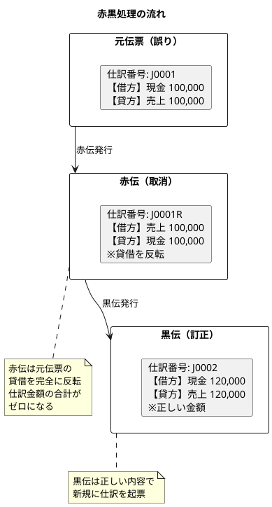
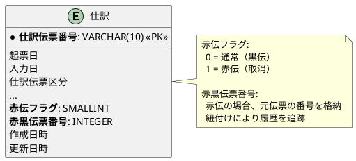
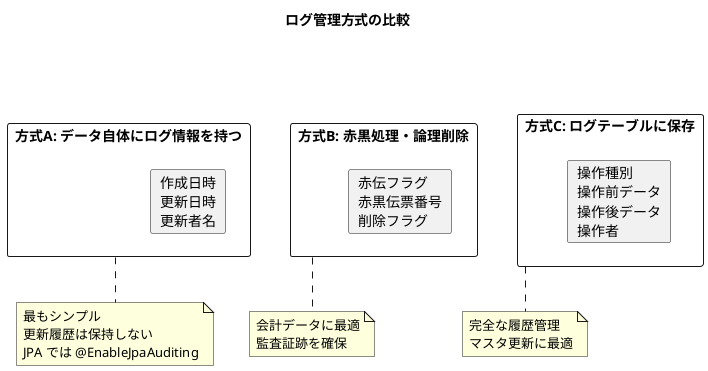

# 第19章：赤黒とログの設計（ORM版）

会計システムにおけるデータ訂正方式（赤黒処理）とログ管理の設計を行います。

JPA 版では、@EntityListeners と AuditingEntityListener を使用した監査証跡の実装を行います。

---

## 19.1 赤黒処理の概念

会計システムでは、一度登録したデータの「削除」や「更新」を安易に行うことはできません。監査証跡を確保しつつ、データ訂正を行う方式が必要です。

### 赤黒処理とは

赤黒処理とは、誤った仕訳を訂正する際に、元の仕訳を「赤伝（取消伝票）」で打ち消し、正しい仕訳を「黒伝（訂正伝票）」として新規登録する方式です。



### 赤黒処理のメリット

| メリット | 説明 |
|---------|------|
| 監査証跡の確保 | 元の仕訳が残り、訂正履歴が追跡可能 |
| データ整合性 | 物理削除を行わないため、参照整合性が維持される |
| 会計基準準拠 | 会計原則に則った正当な訂正方法 |
| 残高の自動調整 | 赤伝により残高が自動的に訂正される |

---

## 19.2 赤黒処理のテーブル設計

仕訳テーブルには、赤黒処理に必要な項目が含まれています。



---

## 19.3 MyBatis 版との実装比較

### データアクセス層の比較

| 機能 | MyBatis 版 | JPA 版 |
|-----|-----------|--------|
| 監査カラム設定 | 手動 / Interceptor | @EnableJpaAuditing |
| マスタ変更ログ | DB トリガー | @EntityListeners |
| ENUM 変換 | TypeHandler | AttributeConverter |
| 動的クエリ | XML `<if>` タグ | Specification パターン |
| 一括保存（Cascade） | 明示的に各テーブル INSERT | CascadeType.ALL |

---

## 19.4 赤黒処理サービスの実装

<details>
<summary>JournalCorrectionService.java</summary>

```java
package com.example.accounting.application.service;

import com.example.accounting.application.port.out.JournalRepository;
import com.example.accounting.domain.model.journal.*;
import lombok.RequiredArgsConstructor;
import lombok.extern.slf4j.Slf4j;
import org.springframework.stereotype.Service;
import org.springframework.transaction.annotation.Transactional;

import java.time.LocalDate;
import java.util.ArrayList;

/**
 * 赤黒処理サービス
 *
 * JPA 版でもビジネスロジックは MyBatis 版と同じ
 * Entity の操作方法が異なる（JPA では Cascade を活用）
 */
@Service
@RequiredArgsConstructor
@Slf4j
public class JournalCorrectionService {

    private final JournalRepository journalRepository;
    private final BalanceUpdateService balanceUpdateService;

    /**
     * 仕訳を赤黒訂正する
     * @param originalVoucherNumber 元伝票番号
     * @param correctedJournal 訂正後の仕訳（黒伝）
     * @return 赤伝と黒伝の仕訳伝票番号
     */
    @Transactional
    public CorrectionResult correctJournal(String originalVoucherNumber,
            Journal correctedJournal) {
        // 元伝票を取得
        var original = journalRepository.findByVoucherNumber(originalVoucherNumber)
            .orElseThrow(() -> new IllegalArgumentException(
                "元伝票が見つかりません: " + originalVoucherNumber));

        // 赤伝を作成
        var redSlip = createRedSlip(original);
        journalRepository.save(redSlip);
        balanceUpdateService.updateBalancesForJournal(redSlip);

        // 黒伝（訂正伝票）を登録
        if (!correctedJournal.isBalanced()) {
            throw new IllegalArgumentException("訂正仕訳の貸借が一致しません");
        }
        journalRepository.save(correctedJournal);
        balanceUpdateService.updateBalancesForJournal(correctedJournal);

        log.info("赤黒訂正完了: 元伝票={}, 赤伝={}, 黒伝={}",
            originalVoucherNumber,
            redSlip.getJournalVoucherNumber(),
            correctedJournal.getJournalVoucherNumber());

        return new CorrectionResult(
            redSlip.getJournalVoucherNumber(),
            correctedJournal.getJournalVoucherNumber()
        );
    }

    /**
     * 仕訳を取消する（赤伝のみ発行）
     * @param voucherNumber 取消対象の仕訳伝票番号
     * @return 赤伝の仕訳伝票番号
     */
    @Transactional
    public String cancelJournal(String voucherNumber) {
        var original = journalRepository.findByVoucherNumber(voucherNumber)
            .orElseThrow(() -> new IllegalArgumentException(
                "仕訳が見つかりません: " + voucherNumber));

        // 既に赤伝が発行されているか確認
        if (original.getRedSlipFlag() != null && original.getRedSlipFlag()) {
            throw new IllegalStateException("この仕訳は既に取消済みです");
        }

        // 赤伝を作成
        var redSlip = createRedSlip(original);
        journalRepository.save(redSlip);
        balanceUpdateService.updateBalancesForJournal(redSlip);

        log.info("仕訳取消完了: 元伝票={}, 赤伝={}",
            voucherNumber, redSlip.getJournalVoucherNumber());

        return redSlip.getJournalVoucherNumber();
    }

    /**
     * 赤伝を作成する
     *
     * JPA 版では CascadeType.ALL により、
     * Journal を保存すると details も自動的に保存される
     */
    private Journal createRedSlip(Journal original) {
        // 赤伝の仕訳伝票番号を生成（元伝票番号 + R）
        var redVoucherNumber = original.getJournalVoucherNumber() + "R";

        // 貸借を反転した明細を作成
        var redDetails = new ArrayList<JournalDetail>();
        for (var detail : original.getDetails()) {
            var reversedDCDetails = new ArrayList<JournalDebitCreditDetail>();
            for (var dcDetail : detail.getDebitCreditDetails()) {
                var reversed = JournalDebitCreditDetail.builder()
                    .journalVoucherNumber(redVoucherNumber)
                    .lineNumber(dcDetail.getLineNumber())
                    .debitCreditLineNumber(dcDetail.getDebitCreditLineNumber())
                    // 借方→貸方、貸方→借方に反転
                    .debitCreditType(
                        dcDetail.getDebitCreditType() == DebitCreditType.DEBIT
                            ? DebitCreditType.CREDIT
                            : DebitCreditType.DEBIT)
                    .accountCode(dcDetail.getAccountCode())
                    .subAccountCode(dcDetail.getSubAccountCode())
                    .departmentCode(dcDetail.getDepartmentCode())
                    .amount(dcDetail.getAmount())
                    .taxType(dcDetail.getTaxType())
                    .taxRate(dcDetail.getTaxRate())
                    .build();
                reversedDCDetails.add(reversed);
            }

            var redDetail = JournalDetail.builder()
                .journalVoucherNumber(redVoucherNumber)
                .lineNumber(detail.getLineNumber())
                .lineSummary(detail.getLineSummary() + "（取消）")
                .debitCreditDetails(reversedDCDetails)
                .build();
            redDetails.add(redDetail);
        }

        return Journal.builder()
            .journalVoucherNumber(redVoucherNumber)
            .postingDate(LocalDate.now())
            .entryDate(LocalDate.now())
            .closingEntryFlag(original.getClosingEntryFlag())
            .voucherType(original.getVoucherType())
            .departmentCode(original.getDepartmentCode())
            .redSlipFlag(true)
            .redBlackVoucherNumber(extractNumericPart(original.getJournalVoucherNumber()))
            .details(redDetails)
            .build();
    }

    private Integer extractNumericPart(String voucherNumber) {
        return Integer.parseInt(voucherNumber.replaceAll("[^0-9]", ""));
    }

    /**
     * 訂正結果
     */
    public record CorrectionResult(
        String redSlipNumber,
        String blackSlipNumber
    ) {}
}
```

</details>

---

## 19.5 ログ管理方式の選択

会計システムのログ管理には、3つの方式があります。



### 推奨される組み合わせ

| データ種別 | 方式 | JPA 実装 |
|----------|------|---------|
| マスタデータ | A + C | @EnableJpaAuditing + @EntityListeners |
| トランザクションデータ | A + B | @EnableJpaAuditing + 赤黒処理 |
| サマリデータ | A | @EnableJpaAuditing のみ |

---

## 19.6 JPA Auditing による自動タイムスタンプ

JPA 版では、Spring Data JPA の Auditing 機能を使用して、作成日時・更新日時・作成者・更新者を自動的に設定できます。

### Auditing 設定

<details>
<summary>AccountingApplication.java</summary>

```java
package com.example.accounting;

import org.springframework.boot.SpringApplication;
import org.springframework.boot.autoconfigure.SpringBootApplication;
import org.springframework.data.jpa.repository.config.EnableJpaAuditing;

@SpringBootApplication
@EnableJpaAuditing  // JPA Auditing を有効化
public class AccountingApplication {
    public static void main(String[] args) {
        SpringApplication.run(AccountingApplication.class, args);
    }
}
```

</details>

### AuditorAware 実装（操作者の自動設定）

<details>
<summary>AuditorAwareImpl.java</summary>

```java
package com.example.accounting.infrastructure.config;

import org.springframework.data.domain.AuditorAware;
import org.springframework.security.core.Authentication;
import org.springframework.security.core.context.SecurityContextHolder;
import org.springframework.stereotype.Component;

import java.util.Optional;

/**
 * 操作者を自動取得する AuditorAware 実装
 *
 * Spring Security と連携して、現在ログイン中のユーザーを取得
 * @CreatedBy, @LastModifiedBy に自動設定される
 */
@Component
public class AuditorAwareImpl implements AuditorAware<String> {

    @Override
    public Optional<String> getCurrentAuditor() {
        Authentication authentication = SecurityContextHolder.getContext().getAuthentication();

        if (authentication == null || !authentication.isAuthenticated()) {
            return Optional.of("system");
        }

        return Optional.of(authentication.getName());
    }
}
```

</details>

### 監査情報を持つ基底 Entity

<details>
<summary>BaseEntity.java</summary>

```java
package com.example.accounting.domain.model.common;

import jakarta.persistence.*;
import lombok.Getter;
import lombok.Setter;
import org.springframework.data.annotation.CreatedBy;
import org.springframework.data.annotation.CreatedDate;
import org.springframework.data.annotation.LastModifiedBy;
import org.springframework.data.annotation.LastModifiedDate;
import org.springframework.data.jpa.domain.support.AuditingEntityListener;

import java.time.LocalDateTime;

/**
 * 監査情報を持つ基底 Entity
 *
 * JPA 版では @EntityListeners と Auditing アノテーションで
 * 作成日時・更新日時・作成者・更新者を自動管理
 *
 * MyBatis 版では手動で設定していたが、JPA 版では自動化
 */
@MappedSuperclass
@EntityListeners(AuditingEntityListener.class)
@Getter
@Setter
public abstract class BaseEntity {

    @CreatedDate
    @Column(name = "作成日時", nullable = false, updatable = false)
    private LocalDateTime createdAt;

    @LastModifiedDate
    @Column(name = "更新日時", nullable = false)
    private LocalDateTime updatedAt;

    @CreatedBy
    @Column(name = "作成者", length = 50, updatable = false)
    private String createdBy;

    @LastModifiedBy
    @Column(name = "更新者", length = 50)
    private String updatedBy;
}
```

</details>

---

## 19.7 マスタ変更ログテーブルの設計

### Flyway マイグレーション

<details>
<summary>V010__create_change_log_table.sql</summary>

```sql
-- 操作種別
CREATE TYPE 操作種別 AS ENUM ('INSERT', 'UPDATE', 'DELETE');

-- 変更ログテーブル
CREATE TABLE "変更ログ" (
    "ログID" SERIAL PRIMARY KEY,
    "テーブル名" VARCHAR(50) NOT NULL,
    "レコードキー" VARCHAR(100) NOT NULL,
    "操作種別" 操作種別 NOT NULL,
    "操作前データ" JSONB,
    "操作後データ" JSONB,
    "操作日時" TIMESTAMP DEFAULT CURRENT_TIMESTAMP NOT NULL,
    "操作者" VARCHAR(50),
    "操作端末" VARCHAR(100),
    "備考" TEXT
);

-- インデックス
CREATE INDEX "idx_変更ログ_テーブル名" ON "変更ログ"("テーブル名");
CREATE INDEX "idx_変更ログ_レコードキー" ON "変更ログ"("レコードキー");
CREATE INDEX "idx_変更ログ_操作日時" ON "変更ログ"("操作日時");
```

</details>

### 変更ログ Entity

<details>
<summary>ChangeLog.java</summary>

```java
package com.example.accounting.domain.model.audit;

import com.example.accounting.infrastructure.persistence.converter.OperationTypeConverter;
import jakarta.persistence.*;
import lombok.*;

import java.time.LocalDateTime;

/**
 * 変更ログ Entity
 *
 * JPA 版では @Entity で定義
 * @GeneratedValue で自動採番
 */
@Entity
@Table(name = "変更ログ")
@Data
@Builder
@NoArgsConstructor
@AllArgsConstructor
public class ChangeLog {

    @Id
    @GeneratedValue(strategy = GenerationType.IDENTITY)
    @Column(name = "ログID")
    private Long logId;

    @Column(name = "テーブル名", length = 50, nullable = false)
    private String tableName;

    @Column(name = "レコードキー", length = 100, nullable = false)
    private String recordKey;

    @Convert(converter = OperationTypeConverter.class)
    @Column(name = "操作種別", nullable = false, columnDefinition = "操作種別")
    private OperationType operationType;

    @Column(name = "操作前データ", columnDefinition = "JSONB")
    private String beforeData;

    @Column(name = "操作後データ", columnDefinition = "JSONB")
    private String afterData;

    @Column(name = "操作日時", nullable = false)
    private LocalDateTime operatedAt;

    @Column(name = "操作者", length = 50)
    private String operatedBy;

    @Column(name = "操作端末", length = 100)
    private String operatedFrom;

    @Column(name = "備考", columnDefinition = "TEXT")
    private String remarks;

    @PrePersist
    protected void onCreate() {
        if (this.operatedAt == null) {
            this.operatedAt = LocalDateTime.now();
        }
    }
}
```

</details>

### 操作種別 Enum と Converter

<details>
<summary>OperationType.java と OperationTypeConverter.java</summary>

```java
package com.example.accounting.domain.model.audit;

/**
 * 操作種別 Enum
 */
public enum OperationType {
    INSERT,
    UPDATE,
    DELETE
}
```

```java
package com.example.accounting.infrastructure.persistence.converter;

import com.example.accounting.domain.model.audit.OperationType;
import jakarta.persistence.AttributeConverter;
import jakarta.persistence.Converter;

/**
 * 操作種別 ↔ PostgreSQL ENUM 変換
 */
@Converter(autoApply = true)
public class OperationTypeConverter implements AttributeConverter<OperationType, String> {

    @Override
    public String convertToDatabaseColumn(OperationType attribute) {
        return attribute != null ? attribute.name() : null;
    }

    @Override
    public OperationType convertToEntityAttribute(String dbData) {
        return dbData != null ? OperationType.valueOf(dbData) : null;
    }
}
```

</details>

---

## 19.8 EntityListener によるマスタ変更ログの自動記録

JPA 版では @EntityListeners を使用して、Entity のライフサイクルイベントをフックし、変更ログを自動的に記録できます。

<details>
<summary>ChangeLogListener.java</summary>

```java
package com.example.accounting.infrastructure.persistence.listener;

import com.example.accounting.domain.model.audit.ChangeLog;
import com.example.accounting.domain.model.audit.OperationType;
import com.example.accounting.infrastructure.persistence.repository.ChangeLogJpaRepository;
import com.fasterxml.jackson.core.JsonProcessingException;
import com.fasterxml.jackson.databind.ObjectMapper;
import jakarta.persistence.*;
import lombok.extern.slf4j.Slf4j;
import org.springframework.beans.factory.annotation.Autowired;
import org.springframework.security.core.context.SecurityContextHolder;
import org.springframework.stereotype.Component;

import java.time.LocalDateTime;

/**
 * マスタ変更ログを自動記録する EntityListener
 *
 * JPA 版では @EntityListeners で Entity のライフサイクルをフック
 * MyBatis 版では DB トリガーで実装していた機能を Java コードで実現
 */
@Component
@Slf4j
public class ChangeLogListener {

    private static ChangeLogJpaRepository changeLogRepository;
    private static ObjectMapper objectMapper;

    @Autowired
    public void setChangeLogRepository(ChangeLogJpaRepository repository) {
        ChangeLogListener.changeLogRepository = repository;
    }

    @Autowired
    public void setObjectMapper(ObjectMapper mapper) {
        ChangeLogListener.objectMapper = mapper;
    }

    @PostPersist
    public void postPersist(Object entity) {
        saveChangeLog(entity, OperationType.INSERT, null, entity);
    }

    @PostUpdate
    public void postUpdate(Object entity) {
        saveChangeLog(entity, OperationType.UPDATE, null, entity);
    }

    @PostRemove
    public void postRemove(Object entity) {
        saveChangeLog(entity, OperationType.DELETE, entity, null);
    }

    private void saveChangeLog(Object entity, OperationType operationType,
                               Object beforeData, Object afterData) {
        try {
            String tableName = getTableName(entity);
            String recordKey = getRecordKey(entity);
            String beforeJson = beforeData != null ? objectMapper.writeValueAsString(beforeData) : null;
            String afterJson = afterData != null ? objectMapper.writeValueAsString(afterData) : null;

            var changeLog = ChangeLog.builder()
                .tableName(tableName)
                .recordKey(recordKey)
                .operationType(operationType)
                .beforeData(beforeJson)
                .afterData(afterJson)
                .operatedAt(LocalDateTime.now())
                .operatedBy(getCurrentUser())
                .build();

            changeLogRepository.save(changeLog);

            log.debug("変更ログ記録: table={}, key={}, operation={}",
                tableName, recordKey, operationType);

        } catch (JsonProcessingException e) {
            log.error("変更ログの JSON 変換に失敗しました", e);
        }
    }

    private String getTableName(Object entity) {
        Table tableAnnotation = entity.getClass().getAnnotation(Table.class);
        return tableAnnotation != null ? tableAnnotation.name() : entity.getClass().getSimpleName();
    }

    private String getRecordKey(Object entity) {
        return entity.toString();
    }

    private String getCurrentUser() {
        var authentication = SecurityContextHolder.getContext().getAuthentication();
        return authentication != null ? authentication.getName() : "system";
    }
}
```

</details>

### EntityListener を使用する Entity

```java
// Account Entity に @EntityListeners を追加
@Entity
@Table(name = "勘定科目マスタ")
@EntityListeners(ChangeLogListener.class)  // 変更ログを自動記録
@Data
@Builder
@NoArgsConstructor
@AllArgsConstructor
public class Account extends BaseEntity {
    // ... 既存のフィールド
}
```

---

## 19.9 変更ログリポジトリの実装

### JpaRepository と Specification

<details>
<summary>ChangeLogJpaRepository.java</summary>

```java
package com.example.accounting.infrastructure.persistence.repository;

import com.example.accounting.domain.model.audit.ChangeLog;
import com.example.accounting.domain.model.audit.OperationType;
import org.springframework.data.jpa.repository.JpaRepository;
import org.springframework.data.jpa.repository.JpaSpecificationExecutor;
import org.springframework.data.jpa.repository.Query;
import org.springframework.data.repository.query.Param;
import org.springframework.stereotype.Repository;

import java.time.LocalDateTime;
import java.util.List;

/**
 * 変更ログ JpaRepository
 *
 * JpaSpecificationExecutor を継承して動的クエリに対応
 */
@Repository
public interface ChangeLogJpaRepository
        extends JpaRepository<ChangeLog, Long>,
                JpaSpecificationExecutor<ChangeLog> {

    /**
     * テーブル名とレコードキーで検索
     */
    List<ChangeLog> findByTableNameAndRecordKeyOrderByOperatedAtDesc(
            String tableName, String recordKey);

    /**
     * テーブル名で検索
     */
    List<ChangeLog> findByTableNameOrderByOperatedAtDesc(String tableName);

    /**
     * 操作種別で検索
     */
    List<ChangeLog> findByOperationTypeOrderByOperatedAtDesc(OperationType operationType);

    /**
     * 期間指定で検索
     */
    @Query("SELECT c FROM ChangeLog c " +
           "WHERE c.operatedAt BETWEEN :from AND :to " +
           "ORDER BY c.operatedAt DESC")
    List<ChangeLog> findByDateRange(
            @Param("from") LocalDateTime from,
            @Param("to") LocalDateTime to);

    /**
     * 操作者で検索
     */
    List<ChangeLog> findByOperatedByOrderByOperatedAtDesc(String operatedBy);
}
```

</details>

### Specification による動的クエリ

<details>
<summary>ChangeLogSpecifications.java</summary>

```java
package com.example.accounting.infrastructure.persistence.specification;

import com.example.accounting.domain.model.audit.ChangeLog;
import com.example.accounting.domain.model.audit.OperationType;
import org.springframework.data.jpa.domain.Specification;

import java.time.LocalDateTime;

/**
 * 変更ログ検索用 Specification
 *
 * JPA 版では Specification パターンで動的クエリを構築
 * MyBatis 版では XML の <if> タグで動的 SQL を構築していた
 */
public class ChangeLogSpecifications {

    public static Specification<ChangeLog> tableNameEquals(String tableName) {
        return (root, query, cb) ->
            tableName == null ? null : cb.equal(root.get("tableName"), tableName);
    }

    public static Specification<ChangeLog> recordKeyEquals(String recordKey) {
        return (root, query, cb) ->
            recordKey == null ? null : cb.equal(root.get("recordKey"), recordKey);
    }

    public static Specification<ChangeLog> operationTypeEquals(OperationType operationType) {
        return (root, query, cb) ->
            operationType == null ? null : cb.equal(root.get("operationType"), operationType);
    }

    public static Specification<ChangeLog> operatedAtAfter(LocalDateTime from) {
        return (root, query, cb) ->
            from == null ? null : cb.greaterThanOrEqualTo(root.get("operatedAt"), from);
    }

    public static Specification<ChangeLog> operatedAtBefore(LocalDateTime to) {
        return (root, query, cb) ->
            to == null ? null : cb.lessThanOrEqualTo(root.get("operatedAt"), to);
    }

    public static Specification<ChangeLog> operatedByEquals(String operatedBy) {
        return (root, query, cb) ->
            operatedBy == null ? null : cb.equal(root.get("operatedBy"), operatedBy);
    }
}
```

</details>

---

## 19.10 変更ログリポジトリのテスト

<details>
<summary>ChangeLogRepositoryTest.java</summary>

```java
package com.example.accounting.infrastructure.persistence.repository;

import com.example.accounting.application.port.out.ChangeLogRepository;
import com.example.accounting.domain.model.audit.ChangeLog;
import com.example.accounting.domain.model.audit.OperationType;
import org.junit.jupiter.api.*;
import org.springframework.beans.factory.annotation.Autowired;
import org.springframework.boot.test.autoconfigure.jdbc.AutoConfigureTestDatabase;
import org.springframework.boot.test.autoconfigure.orm.jpa.DataJpaTest;
import org.springframework.context.annotation.Import;
import org.springframework.test.context.DynamicPropertyRegistry;
import org.springframework.test.context.DynamicPropertySource;
import org.testcontainers.containers.PostgreSQLContainer;
import org.testcontainers.junit.jupiter.Container;
import org.testcontainers.junit.jupiter.Testcontainers;

import java.time.LocalDateTime;

import static org.assertj.core.api.Assertions.*;

/**
 * 変更ログリポジトリのテスト
 */
@DataJpaTest
@AutoConfigureTestDatabase(replace = AutoConfigureTestDatabase.Replace.NONE)
@Testcontainers
@Import(ChangeLogRepositoryImpl.class)
@DisplayName("変更ログリポジトリ")
class ChangeLogRepositoryTest {

    @Container
    static PostgreSQLContainer<?> postgres = new PostgreSQLContainer<>("postgres:16")
            .withDatabaseName("testdb")
            .withUsername("test")
            .withPassword("test");

    @DynamicPropertySource
    static void configureProperties(DynamicPropertyRegistry registry) {
        registry.add("spring.datasource.url", postgres::getJdbcUrl);
        registry.add("spring.datasource.username", postgres::getUsername);
        registry.add("spring.datasource.password", postgres::getPassword);
    }

    @Autowired
    private ChangeLogRepository changeLogRepository;

    @Nested
    @DisplayName("登録")
    class Insert {

        @Test
        @DisplayName("変更ログを登録できる")
        void canInsertChangeLog() {
            // Arrange
            var changeLog = ChangeLog.builder()
                    .tableName("勘定科目マスタ")
                    .recordKey("11100")
                    .operationType(OperationType.INSERT)
                    .afterData("{\"勘定科目コード\":\"11100\",\"勘定科目名\":\"現金\"}")
                    .operatedBy("admin")
                    .build();

            // Act
            changeLogRepository.save(changeLog);

            // Assert
            assertThat(changeLog.getLogId()).isNotNull();
            var result = changeLogRepository.findById(changeLog.getLogId());
            assertThat(result).isPresent();
            assertThat(result.get().getTableName()).isEqualTo("勘定科目マスタ");
            assertThat(result.get().getOperationType()).isEqualTo(OperationType.INSERT);
        }
    }

    @Nested
    @DisplayName("検索")
    class Search {

        @Test
        @DisplayName("テーブル名とレコードキーで検索できる")
        void canFindByTableNameAndRecordKey() {
            // Act
            var result = changeLogRepository.findByTableNameAndRecordKey(
                    "勘定科目マスタ", "11100");

            // Assert
            assertThat(result).allMatch(log ->
                    log.getTableName().equals("勘定科目マスタ") &&
                    log.getRecordKey().equals("11100"));
        }

        @Test
        @DisplayName("複合条件で検索できる")
        void canFindByConditions() {
            // Act: Specification パターンで動的クエリ
            var result = changeLogRepository.findByConditions(
                    "勘定科目マスタ",
                    null,
                    OperationType.UPDATE,
                    null,
                    null,
                    null);

            // Assert
            assertThat(result).allMatch(log ->
                log.getOperationType() == OperationType.UPDATE);
        }
    }
}
```

</details>

---

## 19.11 まとめ：設計のポイント

### 赤黒処理によるデータ訂正

1. 物理削除を行わず、赤伝で打ち消し
2. 監査証跡の確保
3. 残高の自動調整
4. JPA 版では CascadeType.ALL で一括保存

### ログ管理方式の使い分け

| データ種別 | 方式 | JPA 実装 |
|----------|------|---------|
| マスタデータ | ログテーブル方式 | @EntityListeners |
| トランザクションデータ | 赤黒処理 | Cascade 保存 |
| サマリデータ | 更新日時のみ | @EnableJpaAuditing |

### JPA Auditing による自動化

- @CreatedDate, @LastModifiedDate で日時自動設定
- @CreatedBy, @LastModifiedBy で操作者自動設定
- AuditorAware で Spring Security 連携

### MyBatis 版との比較

| 観点 | MyBatis 版 | JPA 版 |
|------|-----------|--------|
| 監査カラム設定 | 手動 / Interceptor | @EnableJpaAuditing |
| マスタ変更ログ | DB トリガー | @EntityListeners |
| ENUM 変換 | TypeHandler | AttributeConverter |
| 動的クエリ | XML `<if>` タグ | Specification パターン |
| 自動採番 | useGeneratedKeys | @GeneratedValue |
| テスト | @MybatisTest | @DataJpaTest |

---

## 次章予告

[第20章](chapter20-orm.md)では、D社（化粧品製造販売）の事例に基づいて、Seedデータを作成します。JPA 版では CommandLineRunner と @Transactional を使用したデータ投入を実装します。
