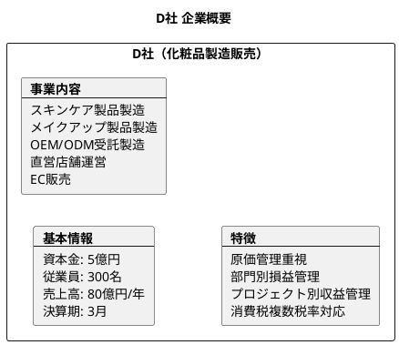
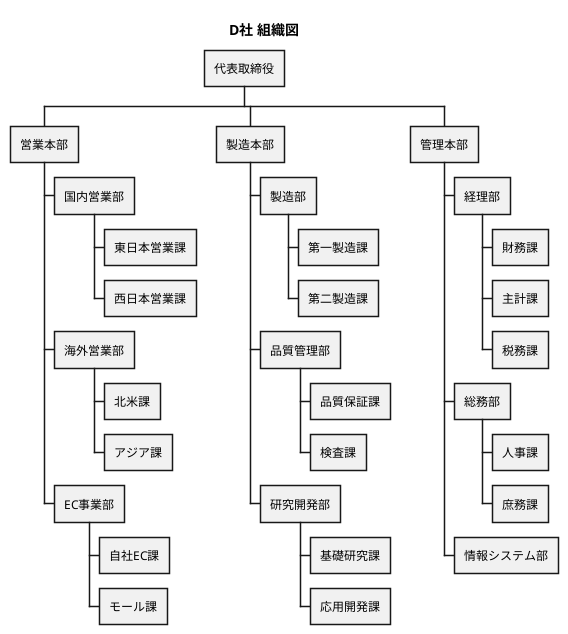
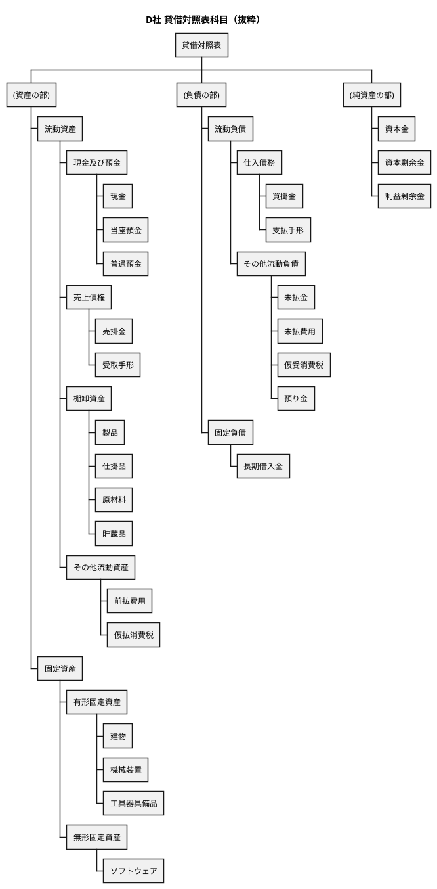
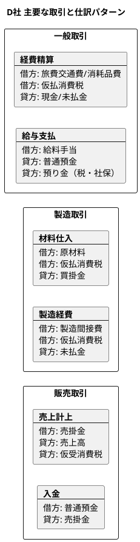
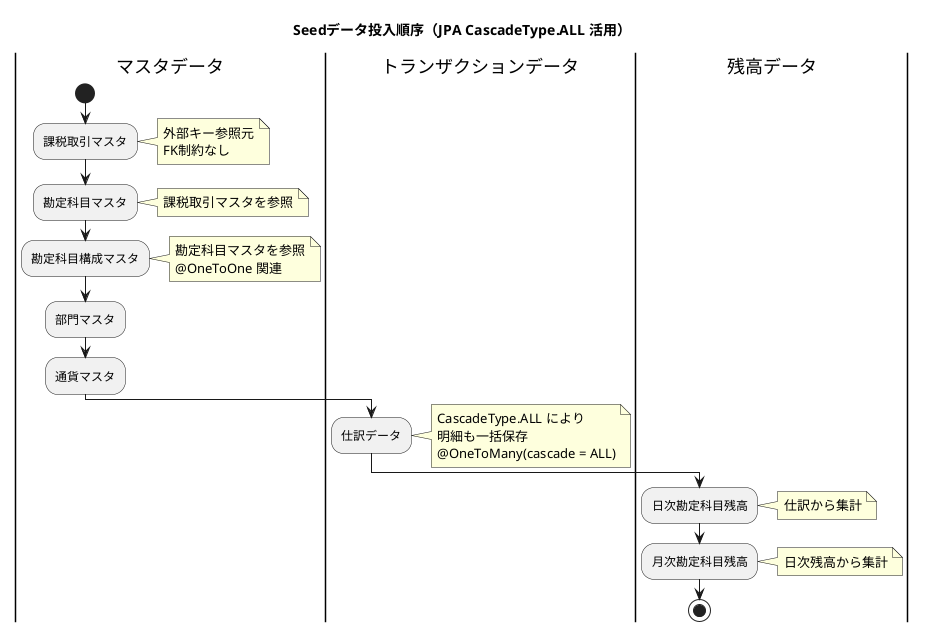

# 第20章：財務会計データ設計（D社事例）【ORM版】

本章では、化粧品製造販売会社D社を題材として、Spring Data JPA を使用した財務会計システムのデータ設計と Seed データ実装を解説します。JPA の CascadeType.ALL によるカスケード保存や、CommandLineRunner による起動時データ投入を活用します。

## 20.1 D社の概要

### 20.1.1 会社プロファイル

D社は化粧品製造販売を主業とする中堅企業です。

| 項目 | 内容 |
|------|------|
| 業種 | 化粧品製造販売 |
| 資本金 | 5億円 |
| 従業員数 | 300名 |
| 年間売上高 | 80億円 |
| 決算期 | 3月 |
| 経理体制 | 経理部10名、財務課3名 |

### 20.1.2 企業概要



## 20.2 組織構成

### 20.2.1 組織図



### 20.2.2 部門コード体系

| 部門コード | 部門名 | 組織階層 | 部門パス |
|-----------|--------|----------|----------|
| 10000 | 全社 | 0 | 10000 |
| 11000 | 営業本部 | 1 | 10000~11000 |
| 11100 | 国内営業部 | 2 | 10000~11000~11100 |
| 11110 | 東日本営業課 | 3 | 10000~11000~11100~11110 |
| 11120 | 西日本営業課 | 3 | 10000~11000~11100~11120 |
| 12000 | 製造本部 | 1 | 10000~12000 |
| 12100 | 製造部 | 2 | 10000~12000~12100 |
| 13000 | 管理本部 | 1 | 10000~13000 |
| 13100 | 経理部 | 2 | 10000~13000~13100 |

### 20.2.3 部門エンティティ（JPA）

<details>
<summary>Department エンティティ</summary>

```java
// src/main/java/com/example/accounting/domain/model/department/Department.java
package com.example.accounting.domain.model.department;

import jakarta.persistence.*;
import lombok.*;

import java.time.LocalDateTime;

/**
 * 部門エンティティ
 */
@Entity
@Table(name = "部門マスタ")
@Data
@Builder
@NoArgsConstructor
@AllArgsConstructor
public class Department {

    @Id
    @Column(name = "部門コード", length = 5)
    private String departmentCode;

    @Column(name = "部門名", length = 40, nullable = false)
    private String departmentName;

    @Column(name = "組織階層")
    private Integer organizationLevel;

    @Column(name = "部門パス", length = 100)
    private String departmentPath;

    @Column(name = "最下層区分")
    private Integer lowestLevelFlag;

    @Column(name = "作成日時")
    private LocalDateTime createdAt;

    @Column(name = "更新日時")
    private LocalDateTime updatedAt;

    @Column(name = "更新者名", length = 20)
    private String updatedBy;

    /**
     * 最下層（末端）部門かどうか
     */
    public boolean isLeaf() {
        return lowestLevelFlag != null && lowestLevelFlag == 1;
    }

    /**
     * 部門パスから親部門コードを取得
     */
    public String getParentDepartmentCode() {
        if (departmentPath == null || !departmentPath.contains("~")) {
            return null;
        }
        String[] parts = departmentPath.split("~");
        if (parts.length < 2) {
            return null;
        }
        return parts[parts.length - 2];
    }

    @PrePersist
    protected void onCreate() {
        if (createdAt == null) {
            createdAt = LocalDateTime.now();
        }
        if (updatedAt == null) {
            updatedAt = LocalDateTime.now();
        }
    }

    @PreUpdate
    protected void onUpdate() {
        updatedAt = LocalDateTime.now();
    }
}
```

</details>

### 20.2.4 部門リポジトリ（JPA）

<details>
<summary>DepartmentJpaRepository インターフェース</summary>

```java
// src/main/java/com/example/accounting/infrastructure/persistence/repository/DepartmentJpaRepository.java
package com.example.accounting.infrastructure.persistence.repository;

import com.example.accounting.domain.model.department.Department;
import org.springframework.data.jpa.repository.JpaRepository;
import org.springframework.data.jpa.repository.Query;
import org.springframework.data.repository.query.Param;
import org.springframework.stereotype.Repository;

import java.util.List;

/**
 * 部門リポジトリ（Spring Data JPA）
 */
@Repository
public interface DepartmentJpaRepository extends JpaRepository<Department, String> {

    /**
     * 組織階層で検索する
     */
    List<Department> findByOrganizationLevel(Integer level);

    /**
     * 部門パスで前方一致検索する（配下の部門を取得）
     */
    @Query("SELECT d FROM Department d WHERE d.departmentPath LIKE CONCAT(:pathPrefix, '%') ORDER BY d.departmentPath")
    List<Department> findByDepartmentPathStartsWith(@Param("pathPrefix") String pathPrefix);

    /**
     * 最下層部門のみ検索する
     */
    List<Department> findByLowestLevelFlag(Integer flag);

    /**
     * 最下層部門のみ検索する（便利メソッド）
     */
    default List<Department> findLeafDepartments() {
        return findByLowestLevelFlag(1);
    }

    /**
     * 部門コード順で全件取得
     */
    List<Department> findAllByOrderByDepartmentCodeAsc();
}
```

</details>

### 20.2.5 部門リポジトリのテスト（JPA）

<details>
<summary>DepartmentJpaRepositoryTest</summary>

```java
// src/test/java/com/example/accounting/infrastructure/persistence/repository/DepartmentJpaRepositoryTest.java
package com.example.accounting.infrastructure.persistence.repository;

import com.example.accounting.domain.model.department.Department;
import org.junit.jupiter.api.*;
import org.springframework.beans.factory.annotation.Autowired;
import org.springframework.boot.test.autoconfigure.orm.jpa.DataJpaTest;
import org.springframework.test.context.DynamicPropertyRegistry;
import org.springframework.test.context.DynamicPropertySource;
import org.testcontainers.containers.PostgreSQLContainer;
import org.testcontainers.junit.jupiter.Container;
import org.testcontainers.junit.jupiter.Testcontainers;

import static org.assertj.core.api.Assertions.*;

@DataJpaTest
@Testcontainers
@DisplayName("部門リポジトリ（JPA）")
class DepartmentJpaRepositoryTest {

    @Container
    static PostgreSQLContainer<?> postgres = new PostgreSQLContainer<>("postgres:16")
            .withDatabaseName("testdb")
            .withUsername("testuser")
            .withPassword("testpass");

    @DynamicPropertySource
    static void configureProperties(DynamicPropertyRegistry registry) {
        registry.add("spring.datasource.url", postgres::getJdbcUrl);
        registry.add("spring.datasource.username", postgres::getUsername);
        registry.add("spring.datasource.password", postgres::getPassword);
    }

    @Autowired
    private DepartmentJpaRepository departmentRepository;

    @BeforeEach
    void setUp() {
        departmentRepository.deleteAll();
    }

    @Nested
    @DisplayName("登録")
    class Insert {

        @Test
        @DisplayName("部門を登録できる")
        void canInsertDepartment() {
            // Arrange
            var department = Department.builder()
                    .departmentCode("10000")
                    .departmentName("全社")
                    .organizationLevel(0)
                    .departmentPath("10000")
                    .lowestLevelFlag(0)
                    .build();

            // Act
            departmentRepository.save(department);

            // Assert
            var result = departmentRepository.findById("10000");
            assertThat(result).isPresent();
            assertThat(result.get().getDepartmentName()).isEqualTo("全社");
            assertThat(result.get().getOrganizationLevel()).isEqualTo(0);
        }

        @Test
        @DisplayName("階層構造を持つ部門を登録できる")
        void canInsertHierarchicalDepartments() {
            // Arrange & Act
            departmentRepository.save(Department.builder()
                    .departmentCode("10000")
                    .departmentName("全社")
                    .organizationLevel(0)
                    .departmentPath("10000")
                    .lowestLevelFlag(0)
                    .build());

            departmentRepository.save(Department.builder()
                    .departmentCode("11000")
                    .departmentName("営業本部")
                    .organizationLevel(1)
                    .departmentPath("10000~11000")
                    .lowestLevelFlag(0)
                    .build());

            departmentRepository.save(Department.builder()
                    .departmentCode("11110")
                    .departmentName("東日本営業課")
                    .organizationLevel(3)
                    .departmentPath("10000~11000~11100~11110")
                    .lowestLevelFlag(1)
                    .build());

            // Assert
            var result = departmentRepository.findById("11110");
            assertThat(result).isPresent();
            assertThat(result.get().getDepartmentPath()).isEqualTo("10000~11000~11100~11110");
            assertThat(result.get().isLeaf()).isTrue();
        }
    }

    @Nested
    @DisplayName("検索")
    class Search {

        @BeforeEach
        void setUpTestData() {
            departmentRepository.save(Department.builder()
                    .departmentCode("10000")
                    .departmentName("全社")
                    .organizationLevel(0)
                    .departmentPath("10000")
                    .lowestLevelFlag(0)
                    .build());

            departmentRepository.save(Department.builder()
                    .departmentCode("11000")
                    .departmentName("営業本部")
                    .organizationLevel(1)
                    .departmentPath("10000~11000")
                    .lowestLevelFlag(0)
                    .build());

            departmentRepository.save(Department.builder()
                    .departmentCode("11110")
                    .departmentName("東日本営業課")
                    .organizationLevel(3)
                    .departmentPath("10000~11000~11100~11110")
                    .lowestLevelFlag(1)
                    .build());

            departmentRepository.save(Department.builder()
                    .departmentCode("12000")
                    .departmentName("製造本部")
                    .organizationLevel(1)
                    .departmentPath("10000~12000")
                    .lowestLevelFlag(0)
                    .build());
        }

        @Test
        @DisplayName("組織階層で検索できる")
        void canFindByOrganizationLevel() {
            // Act
            var result = departmentRepository.findByOrganizationLevel(1);

            // Assert
            assertThat(result).hasSize(2);
            assertThat(result).extracting(Department::getDepartmentCode)
                    .containsExactlyInAnyOrder("11000", "12000");
        }

        @Test
        @DisplayName("部門パスで配下の部門を検索できる")
        void canFindByDepartmentPathStartsWith() {
            // Act
            var result = departmentRepository.findByDepartmentPathStartsWith("10000~11000");

            // Assert
            assertThat(result).hasSize(2);
            assertThat(result).extracting(Department::getDepartmentCode)
                    .containsExactlyInAnyOrder("11000", "11110");
        }

        @Test
        @DisplayName("最下層部門のみ検索できる")
        void canFindLeafDepartments() {
            // Act
            var result = departmentRepository.findLeafDepartments();

            // Assert
            assertThat(result).hasSize(1);
            assertThat(result.get(0).getDepartmentCode()).isEqualTo("11110");
        }
    }
}
```

</details>

## 20.3 勘定科目体系

### 20.3.1 勘定科目の構成

D社の勘定科目は、貸借対照表（BS）科目と損益計算書（PL）科目で構成されています。



### 20.3.2 主要勘定科目一覧

**資産（BS借方）**

| コード | 科目名 | 補助科目 | 説明 |
|--------|--------|----------|------|
| 11110 | 現金 | - | 手元現金 |
| 11130 | 普通預金 | 必須 | 銀行別管理 |
| 11210 | 売掛金 | 必須 | 得意先別管理 |
| 11330 | 原材料 | 必須 | 品目別管理 |
| 11430 | 仮払消費税 | - | 消費税処理用 |

**負債・純資産・収益・費用**

| コード | 科目名 | 消費税 | 説明 |
|--------|--------|--------|------|
| 21110 | 買掛金 | - | 仕入先別管理 |
| 21240 | 仮受消費税 | - | 消費税処理用 |
| 33200 | 繰越利益剰余金 | - | 留保利益 |
| 41110 | 国内売上高 | 課税10% | 国内向け売上 |
| 62100 | 旅費交通費 | 課税10% | 出張費等 |

### 20.3.3 会計処理のパターン



## 20.4 Seed データ投入サービス（JPA版）

### 20.4.1 SeedDataService

JPA の CascadeType.ALL を活用し、仕訳と明細を一括保存します。

<details>
<summary>SeedDataService（JPA版）</summary>

```java
// src/main/java/com/example/accounting/infrastructure/seed/SeedDataService.java
package com.example.accounting.infrastructure.seed;

import com.example.accounting.domain.model.account.*;
import com.example.accounting.domain.model.department.*;
import com.example.accounting.domain.model.journal.*;
import com.example.accounting.domain.model.tax.*;
import com.example.accounting.infrastructure.persistence.repository.*;
import lombok.RequiredArgsConstructor;
import lombok.extern.slf4j.Slf4j;
import org.springframework.stereotype.Service;
import org.springframework.transaction.annotation.Transactional;

import java.math.BigDecimal;
import java.time.LocalDate;
import java.util.ArrayList;
import java.util.List;

/**
 * Seed データ投入サービス（JPA 版）
 */
@Service
@RequiredArgsConstructor
@Slf4j
public class SeedDataService {

    private final AccountJpaRepository accountRepository;
    private final AccountStructureJpaRepository accountStructureRepository;
    private final TaxTransactionJpaRepository taxTransactionRepository;
    private final DepartmentJpaRepository departmentRepository;
    private final JournalJpaRepository journalRepository;

    /**
     * 全Seedデータを投入
     */
    @Transactional
    public void seedAll() {
        log.info("Starting seed data insertion...");

        seedTaxTransactions();
        seedAccountMasters();
        seedAccountStructures();
        seedDepartments();
        seedSampleJournals();

        log.info("Seed data insertion completed.");
    }

    /**
     * 課税取引マスタのSeedデータ
     */
    @Transactional
    public void seedTaxTransactions() {
        log.info("Seeding tax transactions...");

        List<TaxTransaction> taxes = List.of(
            TaxTransaction.builder()
                .taxCode("00").taxName("免税").taxRate(BigDecimal.ZERO).build(),
            TaxTransaction.builder()
                .taxCode("08").taxName("軽減税率8%").taxRate(new BigDecimal("0.080")).build(),
            TaxTransaction.builder()
                .taxCode("10").taxName("標準税率10%").taxRate(new BigDecimal("0.100")).build(),
            TaxTransaction.builder()
                .taxCode("80").taxName("非課税").taxRate(BigDecimal.ZERO).build(),
            TaxTransaction.builder()
                .taxCode("99").taxName("対象外").taxRate(BigDecimal.ZERO).build()
        );

        int insertedCount = 0;
        for (TaxTransaction tax : taxes) {
            if (!taxTransactionRepository.existsById(tax.getTaxCode())) {
                taxTransactionRepository.save(tax);
                insertedCount++;
            }
        }

        log.info("Tax transactions seeded: {} records", insertedCount);
    }

    /**
     * 勘定科目マスタのSeedデータ
     */
    @Transactional
    public void seedAccountMasters() {
        log.info("Seeding account masters...");

        List<Account> accounts = createAccountMasterSeedData();

        int insertedCount = 0;
        for (Account account : accounts) {
            if (!accountRepository.existsById(account.getAccountCode())) {
                accountRepository.save(account);
                insertedCount++;
            }
        }

        log.info("Account masters seeded: {} records", insertedCount);
    }

    /**
     * 勘定科目構成マスタのSeedデータ
     */
    @Transactional
    public void seedAccountStructures() {
        log.info("Seeding account structures...");

        List<Account> accounts = accountRepository.findAll();

        int insertedCount = 0;
        for (Account account : accounts) {
            if (!accountStructureRepository.existsById(account.getAccountCode())) {
                String path = generateAccountPath(account);
                AccountStructure structure = AccountStructure.builder()
                    .accountCode(account.getAccountCode())
                    .accountPath(path)
                    .account(account)
                    .build();
                accountStructureRepository.save(structure);
                insertedCount++;
            }
        }

        log.info("Account structures seeded: {} records", insertedCount);
    }

    /**
     * 部門マスタのSeedデータ
     */
    @Transactional
    public void seedDepartments() {
        log.info("Seeding departments...");

        List<Department> departments = createDepartmentSeedData();

        int insertedCount = 0;
        for (Department dept : departments) {
            if (!departmentRepository.existsById(dept.getDepartmentCode())) {
                departmentRepository.save(dept);
                insertedCount++;
            }
        }

        log.info("Departments seeded: {} records", insertedCount);
    }

    /**
     * サンプル仕訳データのSeed
     */
    @Transactional
    public void seedSampleJournals() {
        log.info("Seeding sample journals...");

        // 期首仕訳
        createOpeningJournal();

        // 売上仕訳
        createSalesJournal();

        // 経費仕訳
        createExpenseJournal();

        // 材料仕入仕訳
        createMaterialPurchaseJournal();

        // 給与支払仕訳
        createSalaryJournal();

        // 入金仕訳
        createReceiptJournal();

        // 支払仕訳
        createPaymentJournal();

        log.info("Sample journals seeded.");
    }

    private void createOpeningJournal() {
        String journalNumber = "J2025040001";

        if (journalRepository.existsById(journalNumber)) {
            return;
        }

        LocalDate date = LocalDate.of(2025, 4, 1);

        // 仕訳ヘッダ
        Journal journal = Journal.builder()
            .journalNumber(journalNumber)
            .postingDate(date)
            .inputDate(date)
            .closingJournalFlag(0)
            .singleFlag(0)
            .journalSlipType(JournalSlipType.NORMAL)
            .departmentCode("13100")
            .build();

        // 仕訳明細
        JournalDetail detail = JournalDetail.builder()
            .lineNumber(1)
            .lineDescription("前期繰越")
            .build();
        detail.setJournal(journal);

        // 借方：普通預金
        JournalDcDetail debit = JournalDcDetail.builder()
            .dcType(DcType.DEBIT)
            .accountCode("11130")
            .amount(new BigDecimal("50000000"))
            .build();
        debit.setJournalDetail(detail);

        // 貸方：繰越利益剰余金
        JournalDcDetail credit = JournalDcDetail.builder()
            .dcType(DcType.CREDIT)
            .accountCode("33200")
            .amount(new BigDecimal("50000000"))
            .build();
        credit.setJournalDetail(detail);

        // 関連付け
        detail.addDcDetail(debit);
        detail.addDcDetail(credit);
        journal.addDetail(detail);

        // CascadeType.ALL により一括保存
        journalRepository.save(journal);
    }

    private void createSalesJournal() {
        String journalNumber = "J2025040002";

        if (journalRepository.existsById(journalNumber)) {
            return;
        }

        LocalDate date = LocalDate.of(2025, 4, 5);

        Journal journal = Journal.builder()
            .journalNumber(journalNumber)
            .postingDate(date)
            .inputDate(date)
            .closingJournalFlag(0)
            .singleFlag(0)
            .journalSlipType(JournalSlipType.AUTO)
            .departmentCode("11110")
            .build();

        JournalDetail detail = JournalDetail.builder()
            .lineNumber(1)
            .lineDescription("ABC商事 スキンケアセット 100個")
            .build();
        detail.setJournal(journal);

        // 借方：売掛金
        JournalDcDetail debit = JournalDcDetail.builder()
            .dcType(DcType.DEBIT)
            .accountCode("11210")
            .subAccountCode("ABC001")
            .amount(new BigDecimal("330000"))
            .build();
        debit.setJournalDetail(detail);

        // 貸方：国内売上高
        JournalDcDetail creditSales = JournalDcDetail.builder()
            .dcType(DcType.CREDIT)
            .accountCode("41110")
            .subAccountCode("ABC001")
            .amount(new BigDecimal("300000"))
            .taxType(TaxType.TAXABLE_SALES)
            .taxRate(10)
            .build();
        creditSales.setJournalDetail(detail);

        // 貸方：仮受消費税
        JournalDcDetail creditTax = JournalDcDetail.builder()
            .dcType(DcType.CREDIT)
            .accountCode("21240")
            .amount(new BigDecimal("30000"))
            .build();
        creditTax.setJournalDetail(detail);

        detail.addDcDetail(debit);
        detail.addDcDetail(creditSales);
        detail.addDcDetail(creditTax);
        journal.addDetail(detail);

        journalRepository.save(journal);
    }

    private void createExpenseJournal() {
        String journalNumber = "J2025040003";

        if (journalRepository.existsById(journalNumber)) {
            return;
        }

        LocalDate date = LocalDate.of(2025, 4, 10);

        Journal journal = Journal.builder()
            .journalNumber(journalNumber)
            .postingDate(date)
            .inputDate(date)
            .closingJournalFlag(0)
            .singleFlag(0)
            .journalSlipType(JournalSlipType.NORMAL)
            .departmentCode("11110")
            .build();

        JournalDetail detail = JournalDetail.builder()
            .lineNumber(1)
            .lineDescription("出張旅費 東京→大阪")
            .build();
        detail.setJournal(journal);

        // 借方：旅費交通費
        JournalDcDetail debitExp = JournalDcDetail.builder()
            .dcType(DcType.DEBIT)
            .accountCode("62100")
            .amount(new BigDecimal("27273"))
            .taxType(TaxType.TAXABLE_PURCHASE)
            .taxRate(10)
            .build();
        debitExp.setJournalDetail(detail);

        // 借方：仮払消費税
        JournalDcDetail debitTax = JournalDcDetail.builder()
            .dcType(DcType.DEBIT)
            .accountCode("11430")
            .amount(new BigDecimal("2727"))
            .build();
        debitTax.setJournalDetail(detail);

        // 貸方：現金
        JournalDcDetail credit = JournalDcDetail.builder()
            .dcType(DcType.CREDIT)
            .accountCode("11110")
            .amount(new BigDecimal("30000"))
            .build();
        credit.setJournalDetail(detail);

        detail.addDcDetail(debitExp);
        detail.addDcDetail(debitTax);
        detail.addDcDetail(credit);
        journal.addDetail(detail);

        journalRepository.save(journal);
    }

    private void createMaterialPurchaseJournal() {
        String journalNumber = "J2025040004";

        if (journalRepository.existsById(journalNumber)) {
            return;
        }

        LocalDate date = LocalDate.of(2025, 4, 15);

        Journal journal = Journal.builder()
            .journalNumber(journalNumber)
            .postingDate(date)
            .inputDate(date)
            .closingJournalFlag(0)
            .singleFlag(0)
            .journalSlipType(JournalSlipType.AUTO)
            .departmentCode("12110")
            .build();

        JournalDetail detail = JournalDetail.builder()
            .lineNumber(1)
            .lineDescription("XYZ化学 原材料仕入")
            .build();
        detail.setJournal(journal);

        // 借方：原材料
        JournalDcDetail debitMat = JournalDcDetail.builder()
            .dcType(DcType.DEBIT)
            .accountCode("11330")
            .subAccountCode("MAT001")
            .amount(new BigDecimal("500000"))
            .taxType(TaxType.TAXABLE_PURCHASE)
            .taxRate(10)
            .build();
        debitMat.setJournalDetail(detail);

        // 借方：仮払消費税
        JournalDcDetail debitTax = JournalDcDetail.builder()
            .dcType(DcType.DEBIT)
            .accountCode("11430")
            .amount(new BigDecimal("50000"))
            .build();
        debitTax.setJournalDetail(detail);

        // 貸方：買掛金
        JournalDcDetail credit = JournalDcDetail.builder()
            .dcType(DcType.CREDIT)
            .accountCode("21110")
            .subAccountCode("XYZ001")
            .amount(new BigDecimal("550000"))
            .build();
        credit.setJournalDetail(detail);

        detail.addDcDetail(debitMat);
        detail.addDcDetail(debitTax);
        detail.addDcDetail(credit);
        journal.addDetail(detail);

        journalRepository.save(journal);
    }

    private void createSalaryJournal() {
        String journalNumber = "J2025040005";

        if (journalRepository.existsById(journalNumber)) {
            return;
        }

        LocalDate date = LocalDate.of(2025, 4, 20);

        Journal journal = Journal.builder()
            .journalNumber(journalNumber)
            .postingDate(date)
            .inputDate(date)
            .closingJournalFlag(0)
            .singleFlag(0)
            .journalSlipType(JournalSlipType.NORMAL)
            .departmentCode("13100")
            .build();

        JournalDetail detail = JournalDetail.builder()
            .lineNumber(1)
            .lineDescription("4月度給与")
            .build();
        detail.setJournal(journal);

        // 借方：給料手当
        JournalDcDetail debit = JournalDcDetail.builder()
            .dcType(DcType.DEBIT)
            .accountCode("61200")
            .amount(new BigDecimal("10000000"))
            .build();
        debit.setJournalDetail(detail);

        // 貸方：普通預金
        JournalDcDetail creditBank = JournalDcDetail.builder()
            .dcType(DcType.CREDIT)
            .accountCode("11130")
            .amount(new BigDecimal("8500000"))
            .build();
        creditBank.setJournalDetail(detail);

        // 貸方：預り金
        JournalDcDetail creditDeposit = JournalDcDetail.builder()
            .dcType(DcType.CREDIT)
            .accountCode("21250")
            .amount(new BigDecimal("1500000"))
            .build();
        creditDeposit.setJournalDetail(detail);

        detail.addDcDetail(debit);
        detail.addDcDetail(creditBank);
        detail.addDcDetail(creditDeposit);
        journal.addDetail(detail);

        journalRepository.save(journal);
    }

    private void createReceiptJournal() {
        String journalNumber = "J2025040006";

        if (journalRepository.existsById(journalNumber)) {
            return;
        }

        LocalDate date = LocalDate.of(2025, 4, 25);

        Journal journal = Journal.builder()
            .journalNumber(journalNumber)
            .postingDate(date)
            .inputDate(date)
            .closingJournalFlag(0)
            .singleFlag(0)
            .journalSlipType(JournalSlipType.NORMAL)
            .departmentCode("13100")
            .build();

        JournalDetail detail = JournalDetail.builder()
            .lineNumber(1)
            .lineDescription("ABC商事 入金")
            .build();
        detail.setJournal(journal);

        // 借方：普通預金
        JournalDcDetail debit = JournalDcDetail.builder()
            .dcType(DcType.DEBIT)
            .accountCode("11130")
            .amount(new BigDecimal("330000"))
            .build();
        debit.setJournalDetail(detail);

        // 貸方：売掛金
        JournalDcDetail credit = JournalDcDetail.builder()
            .dcType(DcType.CREDIT)
            .accountCode("11210")
            .subAccountCode("ABC001")
            .amount(new BigDecimal("330000"))
            .build();
        credit.setJournalDetail(detail);

        detail.addDcDetail(debit);
        detail.addDcDetail(credit);
        journal.addDetail(detail);

        journalRepository.save(journal);
    }

    private void createPaymentJournal() {
        String journalNumber = "J2025040007";

        if (journalRepository.existsById(journalNumber)) {
            return;
        }

        LocalDate date = LocalDate.of(2025, 4, 30);

        Journal journal = Journal.builder()
            .journalNumber(journalNumber)
            .postingDate(date)
            .inputDate(date)
            .closingJournalFlag(0)
            .singleFlag(0)
            .journalSlipType(JournalSlipType.NORMAL)
            .departmentCode("13100")
            .build();

        JournalDetail detail = JournalDetail.builder()
            .lineNumber(1)
            .lineDescription("XYZ化学 支払")
            .build();
        detail.setJournal(journal);

        // 借方：買掛金
        JournalDcDetail debit = JournalDcDetail.builder()
            .dcType(DcType.DEBIT)
            .accountCode("21110")
            .subAccountCode("XYZ001")
            .amount(new BigDecimal("550000"))
            .build();
        debit.setJournalDetail(detail);

        // 貸方：普通預金
        JournalDcDetail credit = JournalDcDetail.builder()
            .dcType(DcType.CREDIT)
            .accountCode("11130")
            .amount(new BigDecimal("550000"))
            .build();
        credit.setJournalDetail(detail);

        detail.addDcDetail(debit);
        detail.addDcDetail(credit);
        journal.addDetail(detail);

        journalRepository.save(journal);
    }

    private List<Account> createAccountMasterSeedData() {
        List<Account> accounts = new ArrayList<>();

        // 流動資産
        accounts.add(Account.builder()
            .accountCode("11110").accountName("現金").accountShortName("現金")
            .bsPlType(BsPlType.BS).dcType(AccountDcType.DEBIT).elementType(ElementType.ASSET)
            .summaryType(SummaryType.POSTING).managementType(ManagementType.COMMON)
            .build());

        accounts.add(Account.builder()
            .accountCode("11130").accountName("普通預金").accountShortName("普通")
            .bsPlType(BsPlType.BS).dcType(AccountDcType.DEBIT).elementType(ElementType.ASSET)
            .summaryType(SummaryType.POSTING).managementType(ManagementType.COMMON)
            .subAccountType(SubAccountType.REQUIRED)
            .build());

        accounts.add(Account.builder()
            .accountCode("11210").accountName("売掛金").accountShortName("売掛金")
            .bsPlType(BsPlType.BS).dcType(AccountDcType.DEBIT).elementType(ElementType.ASSET)
            .summaryType(SummaryType.POSTING).managementType(ManagementType.COMMON)
            .subAccountType(SubAccountType.REQUIRED).dueDateManagementType(DueDateManagementType.REQUIRED)
            .build());

        // 棚卸資産
        accounts.add(Account.builder()
            .accountCode("11330").accountName("原材料").accountShortName("原材料")
            .bsPlType(BsPlType.BS).dcType(AccountDcType.DEBIT).elementType(ElementType.ASSET)
            .summaryType(SummaryType.POSTING).managementType(ManagementType.MANUFACTURING)
            .subAccountType(SubAccountType.REQUIRED)
            .build());

        // 仮払消費税
        accounts.add(Account.builder()
            .accountCode("11430").accountName("仮払消費税").accountShortName("仮払税")
            .bsPlType(BsPlType.BS).dcType(AccountDcType.DEBIT).elementType(ElementType.ASSET)
            .summaryType(SummaryType.POSTING).managementType(ManagementType.COMMON)
            .build());

        // 負債
        accounts.add(Account.builder()
            .accountCode("21110").accountName("買掛金").accountShortName("買掛金")
            .bsPlType(BsPlType.BS).dcType(AccountDcType.CREDIT).elementType(ElementType.LIABILITY)
            .summaryType(SummaryType.POSTING).managementType(ManagementType.COMMON)
            .subAccountType(SubAccountType.REQUIRED).dueDateManagementType(DueDateManagementType.REQUIRED)
            .build());

        accounts.add(Account.builder()
            .accountCode("21240").accountName("仮受消費税").accountShortName("仮受税")
            .bsPlType(BsPlType.BS).dcType(AccountDcType.CREDIT).elementType(ElementType.LIABILITY)
            .summaryType(SummaryType.POSTING).managementType(ManagementType.COMMON)
            .build());

        accounts.add(Account.builder()
            .accountCode("21250").accountName("預り金").accountShortName("預り金")
            .bsPlType(BsPlType.BS).dcType(AccountDcType.CREDIT).elementType(ElementType.LIABILITY)
            .summaryType(SummaryType.POSTING).managementType(ManagementType.COMMON)
            .build());

        // 純資産
        accounts.add(Account.builder()
            .accountCode("33200").accountName("繰越利益剰余金").accountShortName("繰越利益")
            .bsPlType(BsPlType.BS).dcType(AccountDcType.CREDIT).elementType(ElementType.CAPITAL)
            .summaryType(SummaryType.POSTING).managementType(ManagementType.COMMON)
            .build());

        // 売上
        accounts.add(Account.builder()
            .accountCode("41110").accountName("国内売上高").accountShortName("国内売上")
            .bsPlType(BsPlType.PL).dcType(AccountDcType.CREDIT).elementType(ElementType.REVENUE)
            .summaryType(SummaryType.POSTING).managementType(ManagementType.COMMON)
            .taxCalculationType(TaxCalculationType.SALES).taxCode("10")
            .build());

        // 経費
        accounts.add(Account.builder()
            .accountCode("61200").accountName("給料手当").accountShortName("給料")
            .bsPlType(BsPlType.PL).dcType(AccountDcType.DEBIT).elementType(ElementType.EXPENSE)
            .summaryType(SummaryType.POSTING).managementType(ManagementType.COMMON)
            .expenseType(ExpenseType.EXPENSE)
            .build());

        accounts.add(Account.builder()
            .accountCode("62100").accountName("旅費交通費").accountShortName("旅費交通")
            .bsPlType(BsPlType.PL).dcType(AccountDcType.DEBIT).elementType(ElementType.EXPENSE)
            .summaryType(SummaryType.POSTING).managementType(ManagementType.COMMON)
            .expenseType(ExpenseType.EXPENSE)
            .taxCalculationType(TaxCalculationType.PURCHASE).taxCode("10")
            .build());

        return accounts;
    }

    private List<Department> createDepartmentSeedData() {
        return List.of(
            Department.builder()
                .departmentCode("10000").departmentName("全社")
                .organizationLevel(0).departmentPath("10000").lowestLevelFlag(0).build(),
            Department.builder()
                .departmentCode("11000").departmentName("営業本部")
                .organizationLevel(1).departmentPath("10000~11000").lowestLevelFlag(0).build(),
            Department.builder()
                .departmentCode("11110").departmentName("東日本営業課")
                .organizationLevel(3).departmentPath("10000~11000~11100~11110").lowestLevelFlag(1).build(),
            Department.builder()
                .departmentCode("12000").departmentName("製造本部")
                .organizationLevel(1).departmentPath("10000~12000").lowestLevelFlag(0).build(),
            Department.builder()
                .departmentCode("12110").departmentName("第一製造課")
                .organizationLevel(3).departmentPath("10000~12000~12100~12110").lowestLevelFlag(1).build(),
            Department.builder()
                .departmentCode("13000").departmentName("管理本部")
                .organizationLevel(1).departmentPath("10000~13000").lowestLevelFlag(0).build(),
            Department.builder()
                .departmentCode("13100").departmentName("経理部")
                .organizationLevel(2).departmentPath("10000~13000~13100").lowestLevelFlag(0).build()
        );
    }

    private String generateAccountPath(Account account) {
        String code = account.getAccountCode();

        // 簡易的なパス生成（実際はマスタの親子関係から生成）
        if (code.length() == 2) {
            return code;
        } else if (code.length() == 5) {
            String parent = code.substring(0, 2);
            return parent + "~" + code;
        }
        return code;
    }
}
```

</details>

### 20.4.2 CommandLineRunner による起動時データ投入

<details>
<summary>SeedDataRunner（CommandLineRunner）</summary>

```java
// src/main/java/com/example/accounting/infrastructure/seed/SeedDataRunner.java
package com.example.accounting.infrastructure.seed;

import lombok.RequiredArgsConstructor;
import lombok.extern.slf4j.Slf4j;
import org.springframework.boot.CommandLineRunner;
import org.springframework.context.annotation.Profile;
import org.springframework.stereotype.Component;

/**
 * アプリケーション起動時に Seed データを投入する
 *
 * dev, local プロファイル時のみ有効
 */
@Component
@Profile({"dev", "local"})
@RequiredArgsConstructor
@Slf4j
public class SeedDataRunner implements CommandLineRunner {

    private final SeedDataService seedDataService;

    @Override
    public void run(String... args) {
        log.info("=== Starting Seed Data Initialization ===");

        try {
            seedDataService.seedAll();
            log.info("=== Seed Data Initialization Completed ===");
        } catch (Exception e) {
            log.error("=== Seed Data Initialization Failed ===", e);
            // 起動は継続させる（テストデータが無くても動作は可能）
        }
    }
}
```

</details>

### 20.4.3 @PostConstruct を使用した代替実装

<details>
<summary>SeedDataInitializer（@PostConstruct）</summary>

```java
// src/main/java/com/example/accounting/infrastructure/seed/SeedDataInitializer.java
package com.example.accounting.infrastructure.seed;

import jakarta.annotation.PostConstruct;
import lombok.RequiredArgsConstructor;
import lombok.extern.slf4j.Slf4j;
import org.springframework.context.annotation.Profile;
import org.springframework.stereotype.Component;

/**
 * @PostConstruct を使用した Seed データ投入
 *
 * CommandLineRunner より早いタイミングで実行される
 */
@Component
@Profile({"dev", "local"})
@RequiredArgsConstructor
@Slf4j
public class SeedDataInitializer {

    private final SeedDataService seedDataService;

    @PostConstruct
    public void initialize() {
        log.info("=== @PostConstruct Seed Data Initialization ===");

        try {
            seedDataService.seedAll();
            log.info("=== Seed Data Initialization Completed ===");
        } catch (Exception e) {
            log.error("=== Seed Data Initialization Failed ===", e);
        }
    }
}
```

</details>

## 20.5 Seed データ投入テスト

<details>
<summary>SeedDataServiceTest（JPA版）</summary>

```java
// src/test/java/com/example/accounting/infrastructure/seed/SeedDataServiceTest.java
package com.example.accounting.infrastructure.seed;

import com.example.accounting.domain.model.account.*;
import com.example.accounting.domain.model.journal.*;
import com.example.accounting.infrastructure.persistence.repository.*;
import org.junit.jupiter.api.*;
import org.springframework.beans.factory.annotation.Autowired;
import org.springframework.boot.test.autoconfigure.orm.jpa.DataJpaTest;
import org.springframework.context.annotation.Import;
import org.springframework.test.context.DynamicPropertyRegistry;
import org.springframework.test.context.DynamicPropertySource;
import org.testcontainers.containers.PostgreSQLContainer;
import org.testcontainers.junit.jupiter.Container;
import org.testcontainers.junit.jupiter.Testcontainers;

import java.math.BigDecimal;

import static org.assertj.core.api.Assertions.*;

@DataJpaTest
@Import(SeedDataService.class)
@Testcontainers
@DisplayName("Seedデータ投入（JPA）")
class SeedDataServiceTest {

    @Container
    static PostgreSQLContainer<?> postgres = new PostgreSQLContainer<>("postgres:16")
            .withDatabaseName("testdb")
            .withUsername("testuser")
            .withPassword("testpass");

    @DynamicPropertySource
    static void configureProperties(DynamicPropertyRegistry registry) {
        registry.add("spring.datasource.url", postgres::getJdbcUrl);
        registry.add("spring.datasource.username", postgres::getUsername);
        registry.add("spring.datasource.password", postgres::getPassword);
    }

    @Autowired
    private SeedDataService seedDataService;

    @Autowired
    private AccountJpaRepository accountRepository;

    @Autowired
    private TaxTransactionJpaRepository taxTransactionRepository;

    @Autowired
    private DepartmentJpaRepository departmentRepository;

    @Autowired
    private JournalJpaRepository journalRepository;

    @Nested
    @DisplayName("課税取引マスタ")
    class TaxTransactionSeed {

        @Test
        @DisplayName("課税取引マスタのSeedデータを投入できる")
        void canSeedTaxTransactions() {
            // Act
            seedDataService.seedTaxTransactions();

            // Assert
            var tax10 = taxTransactionRepository.findById("10");
            assertThat(tax10).isPresent();
            assertThat(tax10.get().getTaxName()).isEqualTo("標準税率10%");
            assertThat(tax10.get().getTaxRate()).isEqualByComparingTo(new BigDecimal("0.100"));

            var tax08 = taxTransactionRepository.findById("08");
            assertThat(tax08).isPresent();
            assertThat(tax08.get().getTaxName()).isEqualTo("軽減税率8%");
        }
    }

    @Nested
    @DisplayName("勘定科目マスタ")
    class AccountMasterSeed {

        @BeforeEach
        void setUp() {
            seedDataService.seedTaxTransactions();
        }

        @Test
        @DisplayName("勘定科目マスタのSeedデータを投入できる")
        void canSeedAccountMasters() {
            // Act
            seedDataService.seedAccountMasters();

            // Assert
            var cash = accountRepository.findById("11110");
            assertThat(cash).isPresent();
            assertThat(cash.get().getAccountName()).isEqualTo("現金");
            assertThat(cash.get().getBsPlType()).isEqualTo(BsPlType.BS);
            assertThat(cash.get().getDcType()).isEqualTo(AccountDcType.DEBIT);

            var sales = accountRepository.findById("41110");
            assertThat(sales).isPresent();
            assertThat(sales.get().getAccountName()).isEqualTo("国内売上高");
            assertThat(sales.get().getBsPlType()).isEqualTo(BsPlType.PL);
            assertThat(sales.get().getDcType()).isEqualTo(AccountDcType.CREDIT);
        }

        @Test
        @DisplayName("重複実行しても既存データが上書きされない（冪等性）")
        void seedIsIdempotent() {
            // Act
            seedDataService.seedAccountMasters();
            seedDataService.seedAccountMasters(); // 2回目

            // Assert
            var accounts = accountRepository.findAll();
            long cashCount = accounts.stream()
                    .filter(a -> "11110".equals(a.getAccountCode()))
                    .count();
            assertThat(cashCount).isEqualTo(1);
        }
    }

    @Nested
    @DisplayName("部門マスタ")
    class DepartmentSeed {

        @Test
        @DisplayName("部門マスタのSeedデータを投入できる")
        void canSeedDepartments() {
            // Act
            seedDataService.seedDepartments();

            // Assert
            var company = departmentRepository.findById("10000");
            assertThat(company).isPresent();
            assertThat(company.get().getDepartmentName()).isEqualTo("全社");
            assertThat(company.get().getOrganizationLevel()).isEqualTo(0);

            var sales = departmentRepository.findById("11110");
            assertThat(sales).isPresent();
            assertThat(sales.get().getDepartmentName()).isEqualTo("東日本営業課");
            assertThat(sales.get().getDepartmentPath()).isEqualTo("10000~11000~11100~11110");
        }
    }

    @Nested
    @DisplayName("仕訳データ")
    class JournalSeed {

        @BeforeEach
        void setUp() {
            seedDataService.seedTaxTransactions();
            seedDataService.seedAccountMasters();
            seedDataService.seedDepartments();
        }

        @Test
        @DisplayName("サンプル仕訳データを投入できる")
        void canSeedSampleJournals() {
            // Act
            seedDataService.seedSampleJournals();

            // Assert
            // 期首仕訳
            var opening = journalRepository.findById("J2025040001");
            assertThat(opening).isPresent();
            assertThat(opening.get().getJournalSlipType()).isEqualTo(JournalSlipType.NORMAL);

            // 売上仕訳
            var sales = journalRepository.findById("J2025040002");
            assertThat(sales).isPresent();
            assertThat(sales.get().getJournalSlipType()).isEqualTo(JournalSlipType.AUTO);

            // CascadeType.ALL により明細も保存されていることを確認
            var salesWithDetails = journalRepository.findWithDetailsById("J2025040002");
            assertThat(salesWithDetails).isPresent();
            assertThat(salesWithDetails.get().getDetails()).hasSize(1);
        }

        @Test
        @DisplayName("仕訳の貸借一致を確認できる")
        void journalBalanceIsCorrect() {
            // Arrange
            seedDataService.seedSampleJournals();

            // Act
            var journal = journalRepository.findWithDetailsById("J2025040002").orElseThrow();

            // Assert
            var detail = journal.getDetails().get(0);
            BigDecimal debitSum = detail.getDcDetails().stream()
                    .filter(d -> d.getDcType() == DcType.DEBIT)
                    .map(JournalDcDetail::getAmount)
                    .reduce(BigDecimal.ZERO, BigDecimal::add);
            BigDecimal creditSum = detail.getDcDetails().stream()
                    .filter(d -> d.getDcType() == DcType.CREDIT)
                    .map(JournalDcDetail::getAmount)
                    .reduce(BigDecimal.ZERO, BigDecimal::add);

            assertThat(debitSum).isEqualByComparingTo(creditSum);
            assertThat(debitSum).isEqualByComparingTo(new BigDecimal("330000"));
        }
    }

    @Nested
    @DisplayName("全データ一括投入")
    class SeedAll {

        @Test
        @DisplayName("全Seedデータを一括投入できる")
        void canSeedAll() {
            // Act
            seedDataService.seedAll();

            // Assert
            assertThat(taxTransactionRepository.findById("10")).isPresent();
            assertThat(accountRepository.findById("11110")).isPresent();
            assertThat(departmentRepository.findById("10000")).isPresent();
            assertThat(journalRepository.findById("J2025040001")).isPresent();
        }
    }
}
```

</details>

## 20.6 データ投入順序

外部キー制約を考慮したデータ投入順序：



## まとめ

### MyBatis 版との違い

| 観点 | MyBatis 版 | JPA 版 |
|------|-----------|--------|
| Repository | Mapper インターフェース + XML | JpaRepository インターフェース |
| マッピング | resultMap で日本語カラム ↔ 英語プロパティ | @Column で日本語カラム名を指定 |
| 関連の保存 | 個別に INSERT | CascadeType.ALL で一括保存 |
| テスト | @MybatisTest | @DataJpaTest |
| クエリメソッド | XML に SQL を記述 | メソッド名規約 or @Query |
| 存在確認 | findByCode() == null | existsById() |

### JPA 固有のポイント

1. **CascadeType.ALL によるカスケード保存**
   ```java
   @OneToMany(mappedBy = "journal", cascade = CascadeType.ALL, orphanRemoval = true)
   private List<JournalDetail> details = new ArrayList<>();
   ```

2. **@PrePersist / @PreUpdate による自動タイムスタンプ**
   ```java
   @PrePersist
   protected void onCreate() {
       if (createdAt == null) {
           createdAt = LocalDateTime.now();
       }
   }
   ```

3. **existsById() による存在確認**
   ```java
   if (!accountRepository.existsById(account.getAccountCode())) {
       accountRepository.save(account);
   }
   ```

4. **CommandLineRunner による起動時データ投入**
   ```java
   @Component
   @Profile({"dev", "local"})
   public class SeedDataRunner implements CommandLineRunner {
       @Override
       public void run(String... args) {
           seedDataService.seedAll();
       }
   }
   ```

### 設計のポイント

1. **実務に即した勘定科目体系**
   - 製造業向けの科目構成
   - 管理会計区分による部門別損益
   - 消費税複数税率対応

2. **階層構造の管理**
   - 勘定科目のチルダ連結パス
   - 部門マスタの組織階層
   - 科目集計の効率化

3. **Seedデータの設計**
   - 外部キー制約を考慮した投入順序
   - 冪等性（重複実行時の安全性）
   - テスト可能な構造

4. **仕訳パターンの網羅**
   - 期首繰越仕訳
   - 売上・売掛金仕訳
   - 経費・消費税仕訳
   - 材料仕入仕訳
   - 給与支払仕訳
   - 入金・支払仕訳

### テーブル一覧（Seed対象）

| テーブル名 | 件数目安 | 説明 |
|-----------|---------|------|
| 課税取引マスタ | 5件 | 税率マスタ |
| 勘定科目マスタ | 100件 | 科目マスタ |
| 勘定科目構成マスタ | 100件 | 科目階層 |
| 部門マスタ | 30件 | 組織マスタ |
| 仕訳 | 10件 | サンプル仕訳 |
| 日次勘定科目残高 | 50件 | 日次残高 |
| 月次勘定科目残高 | 20件 | 月次残高 |

---

[← 第19章：赤黒とログの設計【ORM版】](./chapter19-orm.md) | [第21章：APIサービスの実装【ORM版】 →](./chapter21-orm.md)
