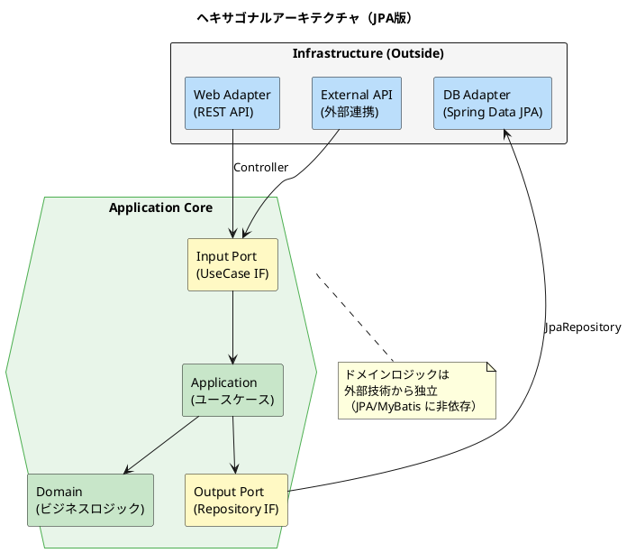
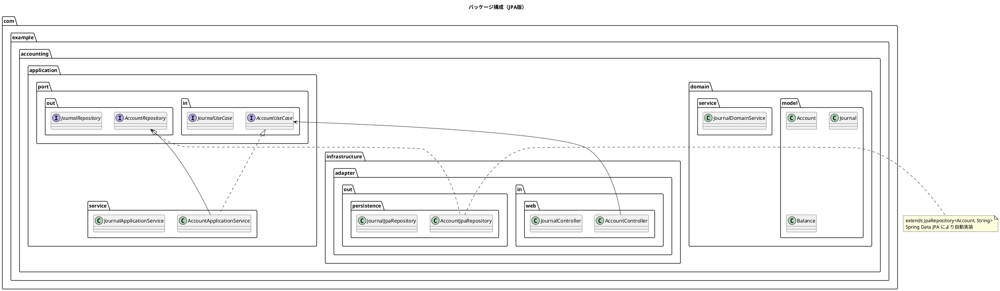
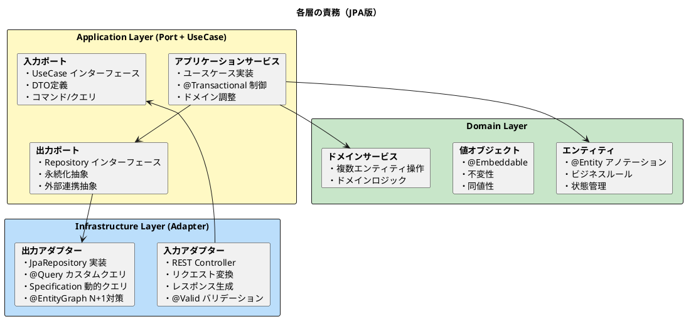

# 第21章：APIサービスの実装【ORM版】

本章では、財務会計システムの API サービスを TDD で実装します。ヘキサゴナルアーキテクチャに基づき、Spring Data JPA を使用した勘定科目マスタ API、仕訳 API、残高照会 API を構築します。

## 21.1 ヘキサゴナルアーキテクチャ

### 21.1.1 Ports and Adapters パターン

ヘキサゴナルアーキテクチャは、ドメインロジックを外部の技術的関心事から分離するアーキテクチャパターンです。



### 21.1.2 アーキテクチャの利点

| 利点 | 説明 |
|------|------|
| **テスト容易性** | ドメインロジックを単独でテスト可能 |
| **技術独立性** | DB、フレームワークの変更が容易 |
| **可読性** | 責務が明確に分離される |
| **保守性** | 変更の影響範囲が限定される |

## 21.2 アーキテクチャ構造（JPA版）

### 21.2.1 パッケージ構成



### 21.2.2 各レイヤーの責務



## 21.3 マスタ API の実装

### 21.3.1 API エンドポイント設計

| メソッド | パス | 説明 |
|---------|------|------|
| GET | /api/accounts | 勘定科目一覧取得 |
| GET | /api/accounts/{accountCode} | 勘定科目取得 |
| GET | /api/accounts/{accountCode}/hierarchy | 科目階層取得 |
| POST | /api/accounts | 勘定科目登録 |
| PUT | /api/accounts/{accountCode} | 勘定科目更新 |
| DELETE | /api/accounts/{accountCode} | 勘定科目削除 |

### 21.3.2 Output Port（リポジトリインターフェース）

<details>
<summary>AccountRepository（Output Port）</summary>

```java
// src/main/java/com/example/accounting/application/port/out/AccountRepository.java
package com.example.accounting.application.port.out;

import com.example.accounting.domain.model.account.Account;

import java.util.List;
import java.util.Optional;

/**
 * 勘定科目リポジトリ（Output Port）
 *
 * ヘキサゴナルアーキテクチャにおける出力ポート。
 * アプリケーション層から永続化層への依存を抽象化する。
 */
public interface AccountRepository {

    /**
     * 勘定科目コードで検索
     */
    Optional<Account> findByCode(String accountCode);

    /**
     * 全件取得
     */
    List<Account> findAll();

    /**
     * BSPL区分で検索
     */
    List<Account> findByBsPlType(String bsPlType);

    /**
     * 科目パスで検索（チルダ連結方式）
     */
    List<Account> findByPathLike(String pathPattern);

    /**
     * 計上科目のみ取得
     */
    List<Account> findPostingAccounts();

    /**
     * 保存（新規・更新）
     */
    Account save(Account account);

    /**
     * 削除
     */
    void delete(String accountCode);

    /**
     * 存在確認
     */
    boolean exists(String accountCode);
}
```

</details>

### 21.3.3 JPA Repository 実装

<details>
<summary>AccountJpaRepository</summary>

```java
// src/main/java/com/example/accounting/infrastructure/adapter/out/persistence/AccountJpaRepository.java
package com.example.accounting.infrastructure.adapter.out.persistence;

import com.example.accounting.domain.model.account.Account;
import com.example.accounting.domain.model.account.BsPlType;
import com.example.accounting.domain.model.account.SummaryType;
import org.springframework.data.jpa.repository.JpaRepository;
import org.springframework.data.jpa.repository.Query;
import org.springframework.data.repository.query.Param;
import org.springframework.stereotype.Repository;

import java.util.List;

/**
 * 勘定科目 JPA リポジトリ
 *
 * Spring Data JPA により基本的な CRUD 操作は自動生成される。
 * カスタムクエリは @Query アノテーションで定義。
 */
@Repository
public interface AccountJpaRepository extends JpaRepository<Account, String> {

    /**
     * BSPL区分で検索
     */
    List<Account> findByBsPlType(BsPlType bsPlType);

    /**
     * 科目パスで前方一致検索（勘定科目構成マスタ経由）
     */
    @Query("SELECT a FROM Account a JOIN AccountStructure s ON a.accountCode = s.accountCode " +
           "WHERE s.accountPath LIKE CONCAT(:pathPrefix, '%') ORDER BY a.accountCode")
    List<Account> findByAccountPathStartsWith(@Param("pathPrefix") String pathPrefix);

    /**
     * 計上科目のみ取得
     */
    List<Account> findBySummaryType(SummaryType summaryType);

    /**
     * 計上科目のみ取得（便利メソッド）
     */
    default List<Account> findPostingAccounts() {
        return findBySummaryType(SummaryType.POSTING);
    }

    /**
     * 勘定科目コード順で全件取得
     */
    List<Account> findAllByOrderByAccountCodeAsc();
}
```

</details>

### 21.3.4 Repository アダプター

<details>
<summary>AccountRepositoryAdapter</summary>

```java
// src/main/java/com/example/accounting/infrastructure/adapter/out/persistence/AccountRepositoryAdapter.java
package com.example.accounting.infrastructure.adapter.out.persistence;

import com.example.accounting.application.port.out.AccountRepository;
import com.example.accounting.domain.model.account.Account;
import com.example.accounting.domain.model.account.BsPlType;
import lombok.RequiredArgsConstructor;
import org.springframework.stereotype.Component;

import java.util.List;
import java.util.Optional;

/**
 * 勘定科目リポジトリアダプター
 *
 * Output Port（AccountRepository）の実装。
 * JpaRepository をラップしてドメインのインターフェースに適合させる。
 */
@Component
@RequiredArgsConstructor
public class AccountRepositoryAdapter implements AccountRepository {

    private final AccountJpaRepository jpaRepository;

    @Override
    public Optional<Account> findByCode(String accountCode) {
        return jpaRepository.findById(accountCode);
    }

    @Override
    public List<Account> findAll() {
        return jpaRepository.findAllByOrderByAccountCodeAsc();
    }

    @Override
    public List<Account> findByBsPlType(String bsPlType) {
        return jpaRepository.findByBsPlType(BsPlType.valueOf(bsPlType));
    }

    @Override
    public List<Account> findByPathLike(String pathPattern) {
        String prefix = pathPattern.replace("%", "");
        return jpaRepository.findByAccountPathStartsWith(prefix);
    }

    @Override
    public List<Account> findPostingAccounts() {
        return jpaRepository.findPostingAccounts();
    }

    @Override
    public Account save(Account account) {
        return jpaRepository.save(account);
    }

    @Override
    public void delete(String accountCode) {
        jpaRepository.deleteById(accountCode);
    }

    @Override
    public boolean exists(String accountCode) {
        return jpaRepository.existsById(accountCode);
    }
}
```

</details>

### 21.3.5 Input Port（ユースケースインターフェース）

<details>
<summary>AccountUseCase（Input Port）</summary>

```java
// src/main/java/com/example/accounting/application/port/in/AccountUseCase.java
package com.example.accounting.application.port.in;

import com.example.accounting.application.port.in.dto.*;

import java.util.List;

/**
 * 勘定科目ユースケース（Input Port）
 */
public interface AccountUseCase {

    /**
     * 勘定科目を取得
     */
    AccountResponse getAccount(String accountCode);

    /**
     * 全勘定科目を取得
     */
    List<AccountResponse> getAllAccounts();

    /**
     * BS/PL区分で勘定科目を取得
     */
    List<AccountResponse> getAccountsByBsPlType(String bsPlType);

    /**
     * 科目階層を取得（親科目以下の全科目）
     */
    List<AccountResponse> getAccountHierarchy(String parentAccountCode);

    /**
     * 計上科目のみ取得
     */
    List<AccountResponse> getPostingAccounts();

    /**
     * 勘定科目を登録
     */
    AccountResponse createAccount(CreateAccountCommand command);

    /**
     * 勘定科目を更新
     */
    AccountResponse updateAccount(String accountCode, UpdateAccountCommand command);

    /**
     * 勘定科目を削除
     */
    void deleteAccount(String accountCode);
}
```

</details>

### 21.3.6 コマンド・レスポンス DTO

<details>
<summary>CreateAccountCommand</summary>

```java
// src/main/java/com/example/accounting/application/port/in/dto/CreateAccountCommand.java
package com.example.accounting.application.port.in.dto;

import jakarta.validation.constraints.*;
import lombok.Builder;
import lombok.Data;

@Data
@Builder
public class CreateAccountCommand {

    @NotBlank(message = "勘定科目コードは必須です")
    @Size(max = 5, message = "勘定科目コードは5文字以内です")
    private String accountCode;

    @NotBlank(message = "勘定科目名は必須です")
    @Size(max = 40, message = "勘定科目名は40文字以内です")
    private String accountName;

    @Size(max = 10, message = "勘定科目略名は10文字以内です")
    private String accountShortName;

    @NotBlank(message = "BSPL区分は必須です")
    @Pattern(regexp = "BS|PL", message = "BSPL区分はBS/PLのいずれかです")
    private String bsPlType;

    @NotBlank(message = "貸借区分は必須です")
    @Pattern(regexp = "借方|貸方", message = "貸借区分は借方/貸方のいずれかです")
    private String dcType;

    @NotBlank(message = "取引要素区分は必須です")
    private String elementType;

    @NotBlank(message = "集計区分は必須です")
    private String summaryType;

    private String managementType;
    private String expenseType;
    private String taxCalculationType;
    private String taxCode;
    private String parentAccountCode;
}
```

</details>

<details>
<summary>AccountResponse</summary>

```java
// src/main/java/com/example/accounting/application/port/in/dto/AccountResponse.java
package com.example.accounting.application.port.in.dto;

import com.example.accounting.domain.model.account.Account;
import lombok.Builder;
import lombok.Data;

@Data
@Builder
public class AccountResponse {
    private String accountCode;
    private String accountName;
    private String accountShortName;
    private String accountKana;
    private String bsPlType;
    private String dcType;
    private String elementType;
    private String summaryType;
    private String managementType;
    private String expenseType;
    private String taxCalculationType;
    private String taxCode;
    private String accountPath;

    /**
     * エンティティからレスポンスDTOを生成
     */
    public static AccountResponse from(Account account) {
        return AccountResponse.builder()
                .accountCode(account.getAccountCode())
                .accountName(account.getAccountName())
                .accountShortName(account.getAccountShortName())
                .accountKana(account.getAccountKana())
                .bsPlType(account.getBsPlType() != null ? account.getBsPlType().name() : null)
                .dcType(account.getDcType() != null ? account.getDcType().getDisplayName() : null)
                .elementType(account.getElementType() != null ? account.getElementType().getDisplayName() : null)
                .summaryType(account.getSummaryType() != null ? account.getSummaryType().getDisplayName() : null)
                .managementType(account.getManagementType() != null ? account.getManagementType().getDisplayName() : null)
                .expenseType(account.getExpenseType() != null ? account.getExpenseType().getDisplayName() : null)
                .taxCalculationType(account.getTaxCalculationType() != null ? account.getTaxCalculationType().getDisplayName() : null)
                .taxCode(account.getTaxCode())
                .build();
    }
}
```

</details>

## 21.4 TDD による実装

### 21.4.1 Red: Controller テスト

<details>
<summary>AccountControllerTest</summary>

```java
// src/test/java/com/example/accounting/infrastructure/adapter/in/web/AccountControllerTest.java
package com.example.accounting.infrastructure.adapter.in.web;

import com.example.accounting.application.port.in.AccountUseCase;
import com.example.accounting.application.port.in.dto.*;
import com.example.accounting.domain.exception.AccountNotFoundException;
import com.fasterxml.jackson.databind.ObjectMapper;
import org.junit.jupiter.api.*;
import org.springframework.beans.factory.annotation.Autowired;
import org.springframework.boot.test.autoconfigure.web.servlet.WebMvcTest;
import org.springframework.boot.test.mock.mockito.MockBean;
import org.springframework.http.MediaType;
import org.springframework.test.web.servlet.MockMvc;

import java.util.List;

import static org.mockito.ArgumentMatchers.*;
import static org.mockito.BDDMockito.*;
import static org.springframework.test.web.servlet.request.MockMvcRequestBuilders.*;
import static org.springframework.test.web.servlet.result.MockMvcResultMatchers.*;

@WebMvcTest(AccountController.class)
@DisplayName("勘定科目マスタ API")
class AccountControllerTest {

    @Autowired
    private MockMvc mockMvc;

    @Autowired
    private ObjectMapper objectMapper;

    @MockBean
    private AccountUseCase accountUseCase;

    @Nested
    @DisplayName("GET /api/accounts/{accountCode}")
    class GetAccount {

        @Test
        @DisplayName("勘定科目を取得できる")
        void canGetAccount() throws Exception {
            // Given
            AccountResponse response = AccountResponse.builder()
                    .accountCode("11110")
                    .accountName("現金")
                    .accountShortName("現金")
                    .bsPlType("BS")
                    .dcType("借方")
                    .elementType("資産")
                    .summaryType("計上科目")
                    .build();

            given(accountUseCase.getAccount("11110")).willReturn(response);

            // When & Then
            mockMvc.perform(get("/api/accounts/{accountCode}", "11110"))
                    .andExpect(status().isOk())
                    .andExpect(jsonPath("$.accountCode").value("11110"))
                    .andExpect(jsonPath("$.accountName").value("現金"))
                    .andExpect(jsonPath("$.bsPlType").value("BS"));
        }

        @Test
        @DisplayName("存在しない勘定科目は404を返す")
        void notFoundForNonExistent() throws Exception {
            // Given
            given(accountUseCase.getAccount("99999")).willThrow(
                    new AccountNotFoundException("99999"));

            // When & Then
            mockMvc.perform(get("/api/accounts/{accountCode}", "99999"))
                    .andExpect(status().isNotFound());
        }
    }

    @Nested
    @DisplayName("POST /api/accounts")
    class CreateAccount {

        @Test
        @DisplayName("勘定科目を登録できる")
        void canCreateAccount() throws Exception {
            // Given
            CreateAccountCommand command = CreateAccountCommand.builder()
                    .accountCode("11150")
                    .accountName("手許現金")
                    .accountShortName("手許現金")
                    .bsPlType("BS")
                    .dcType("借方")
                    .elementType("資産")
                    .summaryType("計上科目")
                    .build();

            AccountResponse response = AccountResponse.builder()
                    .accountCode("11150")
                    .accountName("手許現金")
                    .accountShortName("手許現金")
                    .bsPlType("BS")
                    .dcType("借方")
                    .build();

            given(accountUseCase.createAccount(any())).willReturn(response);

            // When & Then
            mockMvc.perform(post("/api/accounts")
                            .contentType(MediaType.APPLICATION_JSON)
                            .content(objectMapper.writeValueAsString(command)))
                    .andExpect(status().isCreated())
                    .andExpect(jsonPath("$.accountCode").value("11150"))
                    .andExpect(jsonPath("$.accountName").value("手許現金"));
        }

        @Test
        @DisplayName("バリデーションエラーで400を返す")
        void badRequestForValidationError() throws Exception {
            // Given
            CreateAccountCommand command = CreateAccountCommand.builder()
                    .accountCode("")  // 必須項目が空
                    .accountName("")
                    .build();

            // When & Then
            mockMvc.perform(post("/api/accounts")
                            .contentType(MediaType.APPLICATION_JSON)
                            .content(objectMapper.writeValueAsString(command)))
                    .andExpect(status().isBadRequest());
        }
    }
}
```

</details>

### 21.4.2 Green: Controller 実装

<details>
<summary>AccountController</summary>

```java
// src/main/java/com/example/accounting/infrastructure/adapter/in/web/AccountController.java
package com.example.accounting.infrastructure.adapter.in.web;

import com.example.accounting.application.port.in.AccountUseCase;
import com.example.accounting.application.port.in.dto.*;
import io.swagger.v3.oas.annotations.Operation;
import io.swagger.v3.oas.annotations.Parameter;
import io.swagger.v3.oas.annotations.responses.ApiResponse;
import io.swagger.v3.oas.annotations.tags.Tag;
import jakarta.validation.Valid;
import lombok.RequiredArgsConstructor;
import org.springframework.http.HttpStatus;
import org.springframework.http.ResponseEntity;
import org.springframework.web.bind.annotation.*;

import java.util.List;

@RestController
@RequestMapping("/api/accounts")
@RequiredArgsConstructor
@Tag(name = "勘定科目マスタ", description = "勘定科目マスタの管理API")
public class AccountController {

    private final AccountUseCase accountUseCase;

    @GetMapping("/{accountCode}")
    @Operation(summary = "勘定科目取得", description = "勘定科目コードで勘定科目を取得します")
    @ApiResponse(responseCode = "200", description = "取得成功")
    @ApiResponse(responseCode = "404", description = "勘定科目が存在しない")
    public ResponseEntity<AccountResponse> getAccount(
            @Parameter(description = "勘定科目コード")
            @PathVariable String accountCode) {
        return ResponseEntity.ok(accountUseCase.getAccount(accountCode));
    }

    @GetMapping
    @Operation(summary = "勘定科目一覧取得", description = "勘定科目の一覧を取得します")
    public ResponseEntity<List<AccountResponse>> getAccounts(
            @Parameter(description = "BSPL区分（BS/PL）")
            @RequestParam(required = false) String bsPlType,
            @Parameter(description = "計上科目のみ")
            @RequestParam(required = false, defaultValue = "false") boolean postingOnly) {

        List<AccountResponse> accounts;
        if (bsPlType != null) {
            accounts = accountUseCase.getAccountsByBsPlType(bsPlType);
        } else if (postingOnly) {
            accounts = accountUseCase.getPostingAccounts();
        } else {
            accounts = accountUseCase.getAllAccounts();
        }
        return ResponseEntity.ok(accounts);
    }

    @PostMapping
    @Operation(summary = "勘定科目登録", description = "新規勘定科目を登録します")
    @ApiResponse(responseCode = "201", description = "登録成功")
    @ApiResponse(responseCode = "400", description = "バリデーションエラー")
    public ResponseEntity<AccountResponse> createAccount(
            @Valid @RequestBody CreateAccountCommand command) {
        AccountResponse response = accountUseCase.createAccount(command);
        return ResponseEntity.status(HttpStatus.CREATED).body(response);
    }

    @PutMapping("/{accountCode}")
    @Operation(summary = "勘定科目更新", description = "勘定科目を更新します")
    public ResponseEntity<AccountResponse> updateAccount(
            @PathVariable String accountCode,
            @Valid @RequestBody UpdateAccountCommand command) {
        return ResponseEntity.ok(accountUseCase.updateAccount(accountCode, command));
    }

    @DeleteMapping("/{accountCode}")
    @Operation(summary = "勘定科目削除", description = "勘定科目を削除します")
    @ApiResponse(responseCode = "204", description = "削除成功")
    public ResponseEntity<Void> deleteAccount(@PathVariable String accountCode) {
        accountUseCase.deleteAccount(accountCode);
        return ResponseEntity.noContent().build();
    }
}
```

</details>

### 21.4.3 Refactor: Application Service 実装

<details>
<summary>AccountApplicationService</summary>

```java
// src/main/java/com/example/accounting/application/service/AccountApplicationService.java
package com.example.accounting.application.service;

import com.example.accounting.application.port.in.AccountUseCase;
import com.example.accounting.application.port.in.dto.*;
import com.example.accounting.application.port.out.AccountRepository;
import com.example.accounting.application.port.out.AccountStructureRepository;
import com.example.accounting.domain.exception.*;
import com.example.accounting.domain.model.account.*;
import lombok.RequiredArgsConstructor;
import org.springframework.stereotype.Service;
import org.springframework.transaction.annotation.Transactional;

import java.util.List;
import java.util.stream.Collectors;

@Service
@RequiredArgsConstructor
@Transactional(readOnly = true)
public class AccountApplicationService implements AccountUseCase {

    private final AccountRepository accountRepository;
    private final AccountStructureRepository accountStructureRepository;

    @Override
    public AccountResponse getAccount(String accountCode) {
        Account account = accountRepository.findByCode(accountCode)
                .orElseThrow(() -> new AccountNotFoundException(accountCode));
        return AccountResponse.from(account);
    }

    @Override
    public List<AccountResponse> getAllAccounts() {
        return accountRepository.findAll().stream()
                .map(AccountResponse::from)
                .collect(Collectors.toList());
    }

    @Override
    public List<AccountResponse> getAccountsByBsPlType(String bsPlType) {
        return accountRepository.findByBsPlType(bsPlType).stream()
                .map(AccountResponse::from)
                .collect(Collectors.toList());
    }

    @Override
    public List<AccountResponse> getAccountHierarchy(String parentAccountCode) {
        String pathPattern = "%" + parentAccountCode + "%";
        return accountRepository.findByPathLike(pathPattern).stream()
                .map(AccountResponse::from)
                .collect(Collectors.toList());
    }

    @Override
    public List<AccountResponse> getPostingAccounts() {
        return accountRepository.findPostingAccounts().stream()
                .map(AccountResponse::from)
                .collect(Collectors.toList());
    }

    @Override
    @Transactional
    public AccountResponse createAccount(CreateAccountCommand command) {
        if (accountRepository.exists(command.getAccountCode())) {
            throw new AccountAlreadyExistsException(command.getAccountCode());
        }

        Account account = Account.builder()
                .accountCode(command.getAccountCode())
                .accountName(command.getAccountName())
                .accountShortName(command.getAccountShortName())
                .bsPlType(BsPlType.valueOf(command.getBsPlType()))
                .dcType(AccountDcType.fromDisplayName(command.getDcType()))
                .elementType(ElementType.fromDisplayName(command.getElementType()))
                .summaryType(SummaryType.fromDisplayName(command.getSummaryType()))
                .taxCode(command.getTaxCode())
                .build();

        accountRepository.save(account);

        String accountPath = generateAccountPath(command.getAccountCode(), command.getParentAccountCode());
        AccountStructure structure = AccountStructure.builder()
                .accountCode(command.getAccountCode())
                .accountPath(accountPath)
                .account(account)
                .build();
        accountStructureRepository.save(structure);

        return AccountResponse.from(account);
    }

    @Override
    @Transactional
    public AccountResponse updateAccount(String accountCode, UpdateAccountCommand command) {
        Account account = accountRepository.findByCode(accountCode)
                .orElseThrow(() -> new AccountNotFoundException(accountCode));

        if (command.getAccountName() != null) {
            account.setAccountName(command.getAccountName());
        }
        if (command.getAccountShortName() != null) {
            account.setAccountShortName(command.getAccountShortName());
        }

        accountRepository.save(account);
        return AccountResponse.from(account);
    }

    @Override
    @Transactional
    public void deleteAccount(String accountCode) {
        if (!accountRepository.exists(accountCode)) {
            throw new AccountNotFoundException(accountCode);
        }
        accountStructureRepository.delete(accountCode);
        accountRepository.delete(accountCode);
    }

    private String generateAccountPath(String accountCode, String parentAccountCode) {
        if (parentAccountCode == null || parentAccountCode.isEmpty()) {
            return accountCode;
        }
        return accountStructureRepository.findByCode(parentAccountCode)
                .map(parent -> parent.getAccountPath() + "~" + accountCode)
                .orElse(accountCode);
    }
}
```

</details>

## 21.5 トランザクション API

### 21.5.1 仕訳 API エンドポイント

| メソッド | パス | 説明 |
|---------|------|------|
| GET | /api/journals | 仕訳一覧取得 |
| GET | /api/journals/{journalNumber} | 仕訳取得 |
| POST | /api/journals | 仕訳登録 |
| POST | /api/journals/check-balance | 貸借バランスチェック |
| POST | /api/journals/{journalNumber}/cancel | 仕訳取消（赤黒処理） |
| POST | /api/journals/{journalNumber}/correct | 仕訳訂正（赤黒処理） |

<details>
<summary>JournalController</summary>

```java
// src/main/java/com/example/accounting/infrastructure/adapter/in/web/JournalController.java
package com.example.accounting.infrastructure.adapter.in.web;

import com.example.accounting.application.port.in.JournalUseCase;
import com.example.accounting.application.port.in.dto.*;
import io.swagger.v3.oas.annotations.Operation;
import io.swagger.v3.oas.annotations.Parameter;
import io.swagger.v3.oas.annotations.tags.Tag;
import jakarta.validation.Valid;
import lombok.RequiredArgsConstructor;
import org.springframework.format.annotation.DateTimeFormat;
import org.springframework.http.HttpStatus;
import org.springframework.http.ResponseEntity;
import org.springframework.web.bind.annotation.*;

import java.time.LocalDate;
import java.util.List;

@RestController
@RequestMapping("/api/journals")
@RequiredArgsConstructor
@Tag(name = "仕訳", description = "仕訳の管理API")
public class JournalController {

    private final JournalUseCase journalUseCase;

    @GetMapping("/{journalNumber}")
    @Operation(summary = "仕訳取得", description = "仕訳伝票番号で仕訳を取得します")
    public ResponseEntity<JournalResponse> getJournal(
            @Parameter(description = "仕訳伝票番号")
            @PathVariable String journalNumber) {
        return ResponseEntity.ok(journalUseCase.getJournal(journalNumber));
    }

    @GetMapping
    @Operation(summary = "仕訳一覧取得", description = "条件を指定して仕訳を検索します")
    public ResponseEntity<List<JournalResponse>> getJournals(
            @Parameter(description = "開始日")
            @RequestParam @DateTimeFormat(iso = DateTimeFormat.ISO.DATE) LocalDate fromDate,
            @Parameter(description = "終了日")
            @RequestParam @DateTimeFormat(iso = DateTimeFormat.ISO.DATE) LocalDate toDate,
            @Parameter(description = "部門コード")
            @RequestParam(required = false) String departmentCode) {

        List<JournalResponse> journals;
        if (departmentCode != null) {
            journals = journalUseCase.getJournalsByDepartment(departmentCode, fromDate, toDate);
        } else {
            journals = journalUseCase.getJournalsByDateRange(fromDate, toDate);
        }
        return ResponseEntity.ok(journals);
    }

    @PostMapping
    @Operation(summary = "仕訳登録", description = "新規仕訳を登録します")
    public ResponseEntity<JournalResponse> createJournal(
            @Valid @RequestBody CreateJournalCommand command) {
        JournalResponse response = journalUseCase.createJournal(command);
        return ResponseEntity.status(HttpStatus.CREATED).body(response);
    }

    @PostMapping("/check-balance")
    @Operation(summary = "貸借バランスチェック", description = "仕訳の貸借バランスをチェックします")
    public ResponseEntity<BalanceCheckResult> checkBalance(
            @Valid @RequestBody CreateJournalCommand command) {
        return ResponseEntity.ok(journalUseCase.checkBalance(command));
    }

    @PostMapping("/{journalNumber}/cancel")
    @Operation(summary = "仕訳取消", description = "仕訳を赤黒処理で取消します")
    public ResponseEntity<JournalCancellationResult> cancelJournal(
            @PathVariable String journalNumber,
            @RequestParam String reason) {
        return ResponseEntity.ok(journalUseCase.cancelJournal(journalNumber, reason));
    }

    @PostMapping("/{journalNumber}/correct")
    @Operation(summary = "仕訳訂正", description = "仕訳を赤黒処理で訂正します")
    public ResponseEntity<JournalCorrectionResult> correctJournal(
            @PathVariable String journalNumber,
            @RequestParam String reason,
            @Valid @RequestBody CreateJournalCommand correctedData) {
        return ResponseEntity.ok(journalUseCase.correctJournal(journalNumber, correctedData, reason));
    }
}
```

</details>

### 21.5.2 残高照会 API

<details>
<summary>BalanceController</summary>

```java
// src/main/java/com/example/accounting/infrastructure/adapter/in/web/BalanceController.java
package com.example.accounting.infrastructure.adapter.in.web;

import com.example.accounting.application.port.in.BalanceUseCase;
import com.example.accounting.application.port.in.dto.*;
import io.swagger.v3.oas.annotations.Operation;
import io.swagger.v3.oas.annotations.Parameter;
import io.swagger.v3.oas.annotations.tags.Tag;
import lombok.RequiredArgsConstructor;
import org.springframework.format.annotation.DateTimeFormat;
import org.springframework.http.ResponseEntity;
import org.springframework.web.bind.annotation.*;

import java.time.LocalDate;
import java.util.List;

@RestController
@RequestMapping("/api/balances")
@RequiredArgsConstructor
@Tag(name = "残高照会", description = "勘定科目残高の照会API")
public class BalanceController {

    private final BalanceUseCase balanceUseCase;

    @GetMapping("/daily")
    @Operation(summary = "日次残高取得", description = "指定日の勘定科目残高を取得します")
    public ResponseEntity<List<DailyBalanceResponse>> getDailyBalances(
            @Parameter(description = "対象日")
            @RequestParam @DateTimeFormat(iso = DateTimeFormat.ISO.DATE) LocalDate date,
            @Parameter(description = "勘定科目コード（省略時は全科目）")
            @RequestParam(required = false) String accountCode) {
        return ResponseEntity.ok(balanceUseCase.getDailyBalances(date, accountCode));
    }

    @GetMapping("/monthly")
    @Operation(summary = "月次残高取得", description = "指定月の勘定科目残高を取得します")
    public ResponseEntity<List<MonthlyBalanceResponse>> getMonthlyBalances(
            @Parameter(description = "決算期")
            @RequestParam int fiscalYear,
            @Parameter(description = "月度")
            @RequestParam int month) {
        return ResponseEntity.ok(balanceUseCase.getMonthlyBalances(fiscalYear, month));
    }

    @GetMapping("/accounts/{accountCode}")
    @Operation(summary = "勘定科目別残高取得", description = "勘定科目の期間別残高を取得します")
    public ResponseEntity<AccountBalanceSummary> getAccountBalanceSummary(
            @PathVariable String accountCode,
            @RequestParam @DateTimeFormat(iso = DateTimeFormat.ISO.DATE) LocalDate fromDate,
            @RequestParam @DateTimeFormat(iso = DateTimeFormat.ISO.DATE) LocalDate toDate) {
        return ResponseEntity.ok(balanceUseCase.getAccountBalanceSummary(accountCode, fromDate, toDate));
    }
}
```

</details>

## 21.6 エラーハンドリング

### 21.6.1 ドメイン例外

<details>
<summary>ドメイン例外クラス</summary>

```java
// src/main/java/com/example/accounting/domain/exception/AccountingException.java
package com.example.accounting.domain.exception;

import lombok.Getter;

@Getter
public abstract class AccountingException extends RuntimeException {
    private final String errorCode;

    protected AccountingException(String errorCode, String message) {
        super(message);
        this.errorCode = errorCode;
    }
}

// AccountNotFoundException.java
package com.example.accounting.domain.exception;

public class AccountNotFoundException extends AccountingException {
    public AccountNotFoundException(String accountCode) {
        super("ACC001", "勘定科目が見つかりません: " + accountCode);
    }
}

// JournalBalanceException.java
package com.example.accounting.domain.exception;

import java.math.BigDecimal;

public class JournalBalanceException extends AccountingException {
    public JournalBalanceException(BigDecimal debit, BigDecimal credit) {
        super("JNL001", String.format("貸借が一致しません。借方合計: %s, 貸方合計: %s", debit, credit));
    }
}

// AccountAlreadyExistsException.java
package com.example.accounting.domain.exception;

public class AccountAlreadyExistsException extends AccountingException {
    public AccountAlreadyExistsException(String accountCode) {
        super("ACC002", "勘定科目は既に存在します: " + accountCode);
    }
}
```

</details>

### 21.6.2 グローバル例外ハンドラー

<details>
<summary>GlobalExceptionHandler</summary>

```java
// src/main/java/com/example/accounting/infrastructure/adapter/in/web/GlobalExceptionHandler.java
package com.example.accounting.infrastructure.adapter.in.web;

import com.example.accounting.domain.exception.*;
import lombok.Builder;
import lombok.Data;
import lombok.extern.slf4j.Slf4j;
import org.springframework.http.HttpStatus;
import org.springframework.http.ResponseEntity;
import org.springframework.validation.FieldError;
import org.springframework.web.bind.MethodArgumentNotValidException;
import org.springframework.web.bind.annotation.ExceptionHandler;
import org.springframework.web.bind.annotation.RestControllerAdvice;

import java.time.LocalDateTime;
import java.util.HashMap;
import java.util.Map;

@RestControllerAdvice
@Slf4j
public class GlobalExceptionHandler {

    @ExceptionHandler(AccountNotFoundException.class)
    public ResponseEntity<ErrorResponse> handleAccountNotFoundException(AccountNotFoundException e) {
        log.warn("Account not found: {}", e.getMessage());
        return ResponseEntity.status(HttpStatus.NOT_FOUND)
                .body(createErrorResponse(e.getErrorCode(), e.getMessage()));
    }

    @ExceptionHandler(AccountAlreadyExistsException.class)
    public ResponseEntity<ErrorResponse> handleAccountAlreadyExistsException(AccountAlreadyExistsException e) {
        log.warn("Account already exists: {}", e.getMessage());
        return ResponseEntity.status(HttpStatus.CONFLICT)
                .body(createErrorResponse(e.getErrorCode(), e.getMessage()));
    }

    @ExceptionHandler(JournalBalanceException.class)
    public ResponseEntity<ErrorResponse> handleJournalBalanceException(JournalBalanceException e) {
        log.warn("Journal balance error: {}", e.getMessage());
        return ResponseEntity.status(HttpStatus.BAD_REQUEST)
                .body(createErrorResponse(e.getErrorCode(), e.getMessage()));
    }

    @ExceptionHandler(MethodArgumentNotValidException.class)
    public ResponseEntity<ValidationErrorResponse> handleValidationException(MethodArgumentNotValidException e) {
        log.warn("Validation error: {}", e.getMessage());

        Map<String, String> errors = new HashMap<>();
        e.getBindingResult().getAllErrors().forEach(error -> {
            String fieldName = ((FieldError) error).getField();
            String errorMessage = error.getDefaultMessage();
            errors.put(fieldName, errorMessage);
        });

        return ResponseEntity.status(HttpStatus.BAD_REQUEST)
                .body(ValidationErrorResponse.builder()
                        .errorCode("VAL001")
                        .message("入力値が不正です")
                        .timestamp(LocalDateTime.now())
                        .errors(errors)
                        .build());
    }

    @ExceptionHandler(Exception.class)
    public ResponseEntity<ErrorResponse> handleGenericException(Exception e) {
        log.error("Unexpected error", e);
        return ResponseEntity.status(HttpStatus.INTERNAL_SERVER_ERROR)
                .body(createErrorResponse("SYS001", "システムエラーが発生しました"));
    }

    private ErrorResponse createErrorResponse(String errorCode, String message) {
        return ErrorResponse.builder()
                .errorCode(errorCode)
                .message(message)
                .timestamp(LocalDateTime.now())
                .build();
    }

    @Data
    @Builder
    public static class ErrorResponse {
        private String errorCode;
        private String message;
        private LocalDateTime timestamp;
    }

    @Data
    @Builder
    public static class ValidationErrorResponse {
        private String errorCode;
        private String message;
        private LocalDateTime timestamp;
        private Map<String, String> errors;
    }
}
```

</details>

## 21.7 統合テスト

<details>
<summary>AccountControllerIntegrationTest</summary>

```java
// src/test/java/com/example/accounting/infrastructure/adapter/in/web/AccountControllerIntegrationTest.java
package com.example.accounting.infrastructure.adapter.in.web;

import com.example.accounting.application.port.in.dto.CreateAccountCommand;
import com.fasterxml.jackson.databind.ObjectMapper;
import org.junit.jupiter.api.*;
import org.springframework.beans.factory.annotation.Autowired;
import org.springframework.boot.test.autoconfigure.web.servlet.AutoConfigureMockMvc;
import org.springframework.boot.test.context.SpringBootTest;
import org.springframework.http.MediaType;
import org.springframework.test.context.DynamicPropertyRegistry;
import org.springframework.test.context.DynamicPropertySource;
import org.springframework.test.web.servlet.MockMvc;
import org.testcontainers.containers.PostgreSQLContainer;
import org.testcontainers.junit.jupiter.Container;
import org.testcontainers.junit.jupiter.Testcontainers;

import static org.springframework.test.web.servlet.request.MockMvcRequestBuilders.*;
import static org.springframework.test.web.servlet.result.MockMvcResultMatchers.*;

@SpringBootTest
@AutoConfigureMockMvc
@Testcontainers
@DisplayName("勘定科目 API 統合テスト")
class AccountControllerIntegrationTest {

    @Container
    static PostgreSQLContainer<?> postgres = new PostgreSQLContainer<>("postgres:16")
            .withDatabaseName("testdb")
            .withUsername("testuser")
            .withPassword("testpass");

    @DynamicPropertySource
    static void configureProperties(DynamicPropertyRegistry registry) {
        registry.add("spring.datasource.url", postgres::getJdbcUrl);
        registry.add("spring.datasource.username", postgres::getUsername);
        registry.add("spring.datasource.password", postgres::getPassword);
    }

    @Autowired
    private MockMvc mockMvc;

    @Autowired
    private ObjectMapper objectMapper;

    @Nested
    @DisplayName("勘定科目 CRUD")
    class AccountCrud {

        @Test
        @DisplayName("勘定科目の登録・取得・更新・削除が正常に動作する")
        void crudOperationsWork() throws Exception {
            // Create
            CreateAccountCommand createCommand = CreateAccountCommand.builder()
                    .accountCode("99999")
                    .accountName("テスト科目")
                    .accountShortName("テスト")
                    .bsPlType("BS")
                    .dcType("借方")
                    .elementType("資産")
                    .summaryType("計上科目")
                    .build();

            mockMvc.perform(post("/api/accounts")
                            .contentType(MediaType.APPLICATION_JSON)
                            .content(objectMapper.writeValueAsString(createCommand)))
                    .andExpect(status().isCreated())
                    .andExpect(jsonPath("$.accountCode").value("99999"))
                    .andExpect(jsonPath("$.accountName").value("テスト科目"));

            // Read
            mockMvc.perform(get("/api/accounts/{accountCode}", "99999"))
                    .andExpect(status().isOk())
                    .andExpect(jsonPath("$.accountCode").value("99999"));

            // Delete
            mockMvc.perform(delete("/api/accounts/{accountCode}", "99999"))
                    .andExpect(status().isNoContent());

            // Verify deleted
            mockMvc.perform(get("/api/accounts/{accountCode}", "99999"))
                    .andExpect(status().isNotFound());
        }
    }
}
```

</details>

## 21.8 OpenAPI 設定

<details>
<summary>OpenApiConfig</summary>

```java
// src/main/java/com/example/accounting/infrastructure/config/OpenApiConfig.java
package com.example.accounting.infrastructure.config;

import io.swagger.v3.oas.models.OpenAPI;
import io.swagger.v3.oas.models.info.Contact;
import io.swagger.v3.oas.models.info.Info;
import io.swagger.v3.oas.models.info.License;
import io.swagger.v3.oas.models.servers.Server;
import org.springframework.context.annotation.Bean;
import org.springframework.context.annotation.Configuration;

import java.util.List;

@Configuration
public class OpenApiConfig {

    @Bean
    public OpenAPI customOpenAPI() {
        return new OpenAPI()
                .info(new Info()
                        .title("財務会計システム API")
                        .description("財務会計システムのREST API仕様書（JPA版）")
                        .version("1.0.0")
                        .contact(new Contact()
                                .name("開発チーム")
                                .email("dev@example.com"))
                        .license(new License()
                                .name("MIT License")
                                .url("https://opensource.org/licenses/MIT")))
                .servers(List.of(
                        new Server().url("http://localhost:8080").description("開発環境"),
                        new Server().url("https://api.example.com").description("本番環境")
                ));
    }
}
```

</details>

API ドキュメントへのアクセス：
- **Swagger UI**: http://localhost:8080/swagger-ui.html
- **OpenAPI JSON**: http://localhost:8080/api-docs

## まとめ

### MyBatis 版との違い

| 観点 | MyBatis 版 | JPA 版 |
|------|-----------|--------|
| Output Port 実装 | Mapper + XML | JpaRepository + Adapter |
| クエリ定義 | XML に SQL | @Query or メソッド名規約 |
| トランザクション | @Transactional | @Transactional（同一） |
| N+1 対策 | JOIN を XML で記述 | @EntityGraph |
| 動的クエリ | `<if>` タグ | Specification |
| テスト | @MybatisTest | @DataJpaTest |

### JPA 固有の実装ポイント

1. **Repository Adapter パターン**
   ```java
   @Component
   @RequiredArgsConstructor
   public class AccountRepositoryAdapter implements AccountRepository {
       private final AccountJpaRepository jpaRepository;

       @Override
       public Optional<Account> findByCode(String accountCode) {
           return jpaRepository.findById(accountCode);
       }
   }
   ```

2. **@Query によるカスタムクエリ**
   ```java
   @Query("SELECT a FROM Account a JOIN AccountStructure s ON a.accountCode = s.accountCode " +
          "WHERE s.accountPath LIKE CONCAT(:pathPrefix, '%') ORDER BY a.accountCode")
   List<Account> findByAccountPathStartsWith(@Param("pathPrefix") String pathPrefix);
   ```

3. **existsById() による存在確認**
   ```java
   @Override
   public boolean exists(String accountCode) {
       return jpaRepository.existsById(accountCode);
   }
   ```

### API エンドポイント一覧

| メソッド | パス | 説明 |
|---------|------|------|
| GET | /api/accounts | 勘定科目一覧取得 |
| GET | /api/accounts/{accountCode} | 勘定科目取得 |
| POST | /api/accounts | 勘定科目登録 |
| PUT | /api/accounts/{accountCode} | 勘定科目更新 |
| DELETE | /api/accounts/{accountCode} | 勘定科目削除 |
| GET | /api/journals | 仕訳一覧取得 |
| GET | /api/journals/{journalNumber} | 仕訳取得 |
| POST | /api/journals | 仕訳登録 |
| POST | /api/journals/{journalNumber}/cancel | 仕訳取消 |
| POST | /api/journals/{journalNumber}/correct | 仕訳訂正 |
| GET | /api/balances/daily | 日次残高取得 |
| GET | /api/balances/monthly | 月次残高取得 |
| GET | /api/reports/daily-report | 日計表取得 |
| GET | /api/reports/trial-balance | 合計残高試算表取得 |

---

[← 第20章：財務会計データ設計（D社事例）【ORM版】](./chapter20-orm.md) | [第22章：生産管理システムの全体像 →](../part4/chapter22.md)
