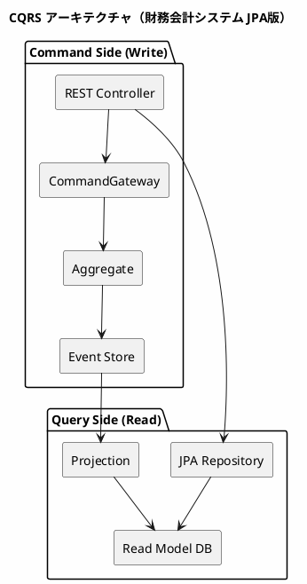
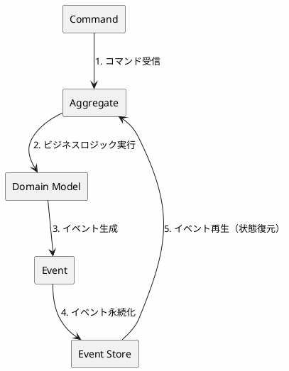
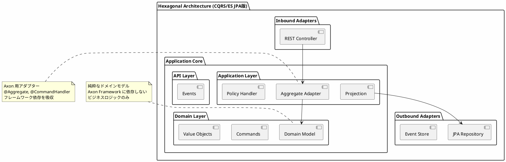
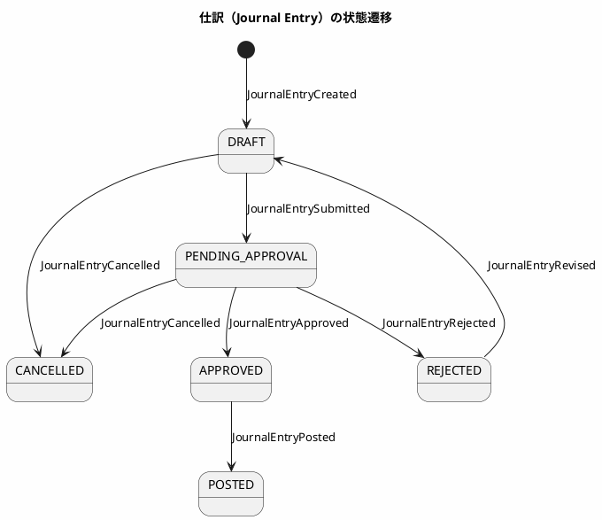
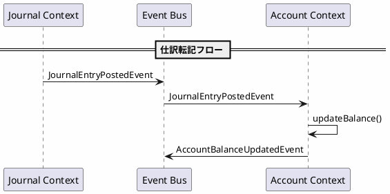

# 第22章：Axon CQRS/ES の実装【ORM版】

本章では、財務会計システムに **CQRS（Command Query Responsibility Segregation）** と **Event Sourcing** を実装します。Axon Framework を使用し、コマンド（書き込み）とクエリ（読み取り）を分離し、すべての状態変更をイベントとして記録するアーキテクチャを構築します。

研究 1 で構築したヘキサゴナルアーキテクチャの考え方を踏襲しつつ、**ドメインモデルをフレームワークから分離**し、Axon Aggregate Adapter を介して連携させます。Read Model の永続化には **Spring Data JPA** を使用します。

---

## 22.1 CQRS/ES アーキテクチャの基礎

### 22.1.1 CQRS とは

CQRS（Command Query Responsibility Segregation）は、コマンド（書き込み）とクエリ（読み取り）の責務を分離するアーキテクチャパターンです。



**CQRS の利点：**

| 観点 | 説明 |
|------|------|
| **スケーラビリティ** | 読み取りと書き込みを独立してスケール可能 |
| **パフォーマンス** | 読み取りに最適化されたモデルで高速クエリ |
| **複雑性の分離** | 書き込みロジックと読み取りロジックを独立して開発 |
| **監査対応** | Event Sourcing と組み合わせて完全な履歴を保持 |

**財務会計システムでの CQRS の意義：**

- **監査証跡**: すべての仕訳変更履歴を完全に保持
- **複雑なクエリ**: 試算表、財務諸表など多様なビューを効率的に生成
- **データ整合性**: イベントベースで一貫性を保証

---

### 22.1.2 Event Sourcing とは

Event Sourcing は、アプリケーションの状態をイベントの連続として保存するパターンです。



**Event Sourcing の利点：**

| 観点 | 説明 |
|------|------|
| **完全な履歴** | すべての状態変更が記録される |
| **監査証跡** | いつ、誰が、何を変更したかが明確 |
| **時間旅行** | 過去の任意の時点の状態を再構築可能 |
| **イベント駆動** | 他システムとの連携が容易 |

**財務会計システムでの Event Sourcing の意義：**

- **訂正仕訳の追跡**: 修正履歴を完全に保持
- **期末決算処理**: 任意の時点での残高を再計算可能
- **内部統制**: SOX 法対応の監査証跡を自動生成

---

### 22.1.3 ヘキサゴナルアーキテクチャとの統合



**設計原則：**

1. **ドメインモデルの純粋性**: ドメインモデルは Axon に依存しない純粋な Java コード
2. **Aggregate Adapter**: Axon Framework 用のアダプターを Application Layer に配置
3. **イベントは公開 API**: イベントは他の Context から参照される公開 API として定義

---

## 22.2 技術スタック

| カテゴリ | 技術 | バージョン |
|---------|------|-----------|
| 言語 | Java | 21 |
| フレームワーク | Spring Boot | 3.4.1 |
| CQRS/ES | Axon Framework | 4.10.3 |
| ORM | Spring Data JPA | 3.4.1 |
| API ドキュメント | SpringDoc OpenAPI | 2.7.0 |
| データベース | H2 (開発) / PostgreSQL (本番) | - |

### 22.2.1 build.gradle.kts

<details>
<summary>コード例: build.gradle.kts</summary>

```kotlin
dependencies {
    // Spring Boot
    implementation("org.springframework.boot:spring-boot-starter-web")
    implementation("org.springframework.boot:spring-boot-starter-validation")
    implementation("org.springframework.boot:spring-boot-starter-data-jpa")

    // Axon Framework
    implementation("org.axonframework:axon-spring-boot-starter:4.10.3") {
        exclude(group = "org.axonframework", module = "axon-server-connector")
    }

    // OpenAPI
    implementation("org.springdoc:springdoc-openapi-starter-webmvc-ui:2.7.0")

    // Database
    runtimeOnly("com.h2database:h2")
    runtimeOnly("org.postgresql:postgresql")

    // Test
    testImplementation("org.springframework.boot:spring-boot-starter-test")
    testImplementation("org.axonframework:axon-test:4.10.3")
}
```

</details>

---

### 22.2.2 ディレクトリ構造

<details>
<summary>コード例: ディレクトリ構成</summary>

```
src/main/java/com/example/accounting/
├── app/                              # アプリケーション共通
│   └── RootController.java
├── config/                           # 設定クラス
│   ├── AxonConfig.java
│   ├── JpaConfig.java
│   └── OpenApiConfig.java
├── journal/                          # Journal Bounded Context（仕訳）
│   ├── api/
│   │   └── events/                   # 公開イベント API
│   │       ├── JournalEntryEvent.java     # sealed interface
│   │       ├── JournalEntryCreatedEvent.java
│   │       ├── JournalEntryApprovedEvent.java
│   │       └── JournalEntryPostedEvent.java
│   ├── adapter/
│   │   ├── inbound/rest/journals/    # Inbound Adapter (REST)
│   │   │   ├── JournalsController.java
│   │   │   └── protocol/             # Request/Response DTO
│   │   └── outbound/persistence/     # Outbound Adapter (JPA)
│   │       ├── entity/
│   │       │   ├── JournalEntryEntity.java
│   │       │   └── JournalLineEntity.java
│   │       └── repository/
│   │           └── JournalEntryJpaRepository.java
│   ├── application/
│   │   ├── aggregate/                # Axon Aggregate Adapter
│   │   │   └── JournalEntryAggregateAdapter.java
│   │   ├── policy/                   # イベントハンドラー（Choreography）
│   │   │   └── AccountEventHandler.java
│   │   └── query/                    # Projection
│   │       └── JournalEntryProjection.java
│   └── domain/
│       └── model/aggregate/journal/  # 純粋なドメインモデル
│           ├── JournalEntry.java
│           ├── JournalEntryCommands.java
│           ├── JournalEntryStatus.java
│           └── JournalLine.java
└── account/                          # Account Bounded Context（勘定科目）
    ├── api/events/
    │   ├── AccountEvent.java
    │   └── AccountBalanceUpdatedEvent.java
    ├── application/
    │   ├── aggregate/
    │   │   └── AccountAggregateAdapter.java
    │   └── policy/
    │       └── JournalEventHandler.java
    └── domain/model/aggregate/account/
        ├── Account.java
        └── AccountCommands.java
```

</details>

---

## 22.3 Axon 設定クラス（JPA版）

### 22.3.1 AxonConfig.java

<details>
<summary>コード例: AxonConfig.java</summary>

```java
package com.example.accounting.config;

import org.axonframework.common.jpa.EntityManagerProvider;
import org.axonframework.eventsourcing.eventstore.EmbeddedEventStore;
import org.axonframework.eventsourcing.eventstore.EventStorageEngine;
import org.axonframework.eventsourcing.eventstore.EventStore;
import org.axonframework.eventsourcing.eventstore.jpa.JpaEventStorageEngine;
import org.axonframework.serialization.Serializer;
import org.axonframework.serialization.json.JacksonSerializer;
import org.axonframework.spring.config.SpringAxonConfiguration;
import org.springframework.context.annotation.Bean;
import org.springframework.context.annotation.Configuration;

import javax.sql.DataSource;

/**
 * Axon Framework 設定（JPA版）
 */
@Configuration
public class AxonConfig {

    /**
     * JPA ベースの Event Storage Engine
     */
    @Bean
    public EventStorageEngine eventStorageEngine(
            EntityManagerProvider entityManagerProvider,
            Serializer serializer) {
        return JpaEventStorageEngine.builder()
                .entityManagerProvider(entityManagerProvider)
                .snapshotSerializer(serializer)
                .eventSerializer(serializer)
                .build();
    }

    /**
     * Event Store
     */
    @Bean
    public EventStore eventStore(EventStorageEngine eventStorageEngine) {
        return EmbeddedEventStore.builder()
                .storageEngine(eventStorageEngine)
                .build();
    }

    /**
     * JSON シリアライザー
     */
    @Bean
    public Serializer eventSerializer() {
        return JacksonSerializer.defaultSerializer();
    }
}
```

</details>

### 22.3.2 JpaConfig.java

<details>
<summary>コード例: JpaConfig.java</summary>

```java
package com.example.accounting.config;

import org.springframework.context.annotation.Configuration;
import org.springframework.data.jpa.repository.config.EnableJpaAuditing;
import org.springframework.data.jpa.repository.config.EnableJpaRepositories;

/**
 * JPA 設定
 */
@Configuration
@EnableJpaRepositories(basePackages = {
    "com.example.accounting.journal.adapter.outbound.persistence.repository",
    "com.example.accounting.account.adapter.outbound.persistence.repository"
})
@EnableJpaAuditing
public class JpaConfig {
}
```

</details>

---

## 22.4 ドメインモデルとイベント設計

### 22.4.1 Journal Bounded Context

仕訳の作成から転記完了までのライフサイクルを管理します。

#### 状態遷移図



#### イベント一覧

| イベント | 説明 |
|---------|------|
| `JournalEntryCreatedEvent` | 仕訳が作成された |
| `JournalEntrySubmittedEvent` | 仕訳が承認申請された |
| `JournalEntryApprovedEvent` | 仕訳が承認された |
| `JournalEntryRejectedEvent` | 仕訳が却下された |
| `JournalEntryRevisedEvent` | 却下された仕訳が修正された |
| `JournalEntryPostedEvent` | 仕訳が転記された（元帳に反映） |
| `JournalEntryCancelledEvent` | 仕訳がキャンセルされた |

---

### 22.4.2 イベント定義（API Layer）

#### sealed interface によるイベントの型安全性

<details>
<summary>コード例: JournalEntryEvent.java</summary>

```java
package com.example.accounting.journal.api.events;

/**
 * JournalEntry イベントの sealed interface
 * すべての JournalEntry イベントの親インターフェース
 */
public sealed interface JournalEntryEvent permits
        JournalEntryCreatedEvent,
        JournalEntrySubmittedEvent,
        JournalEntryApprovedEvent,
        JournalEntryRejectedEvent,
        JournalEntryRevisedEvent,
        JournalEntryPostedEvent,
        JournalEntryCancelledEvent {

    String journalEntryId();
}
```

</details>

#### イベント record の実装

<details>
<summary>コード例: JournalEntryCreatedEvent.java</summary>

```java
package com.example.accounting.journal.api.events;

import java.math.BigDecimal;
import java.time.LocalDate;
import java.time.LocalDateTime;
import java.util.List;

/**
 * 仕訳作成イベント
 */
public record JournalEntryCreatedEvent(
        String journalEntryId,
        String journalNumber,
        LocalDate transactionDate,
        String description,
        List<JournalLineData> lines,
        String createdBy,
        LocalDateTime createdAt
) implements JournalEntryEvent {

    /**
     * 仕訳明細データ
     */
    public record JournalLineData(
            String accountCode,
            String accountName,
            BigDecimal debitAmount,
            BigDecimal creditAmount
    ) {
    }
}
```

</details>

<details>
<summary>コード例: JournalEntryApprovedEvent.java</summary>

```java
package com.example.accounting.journal.api.events;

import java.time.LocalDateTime;

/**
 * 仕訳承認イベント
 */
public record JournalEntryApprovedEvent(
        String journalEntryId,
        String approvedBy,
        String comment,
        LocalDateTime approvedAt
) implements JournalEntryEvent {
}
```

</details>

<details>
<summary>コード例: JournalEntryPostedEvent.java</summary>

```java
package com.example.accounting.journal.api.events;

import java.time.LocalDateTime;

/**
 * 仕訳転記イベント
 */
public record JournalEntryPostedEvent(
        String journalEntryId,
        String fiscalPeriod,
        String postedBy,
        LocalDateTime postedAt
) implements JournalEntryEvent {
}
```

</details>

---

### 22.4.3 コマンド定義（Domain Layer）

<details>
<summary>コード例: JournalEntryCommands.java</summary>

```java
package com.example.accounting.journal.domain.model.aggregate.journal;

import org.axonframework.modelling.command.TargetAggregateIdentifier;
import java.math.BigDecimal;
import java.time.LocalDate;
import java.util.List;

/**
 * JournalEntry 集約へのコマンド定義
 */
public final class JournalEntryCommands {

    private JournalEntryCommands() {
    }

    /**
     * 仕訳作成コマンド
     */
    public record CreateJournalEntryCommand(
            @TargetAggregateIdentifier
            String journalEntryId,
            LocalDate transactionDate,
            String description,
            List<JournalLineInput> lines,
            String createdBy
    ) {
        public record JournalLineInput(
                String accountCode,
                String accountName,
                BigDecimal debitAmount,
                BigDecimal creditAmount
        ) {
        }
    }

    /**
     * 仕訳承認申請コマンド
     */
    public record SubmitJournalEntryCommand(
            @TargetAggregateIdentifier
            String journalEntryId,
            String submittedBy
    ) {
    }

    /**
     * 仕訳承認コマンド
     */
    public record ApproveJournalEntryCommand(
            @TargetAggregateIdentifier
            String journalEntryId,
            String approvedBy,
            String comment
    ) {
    }

    /**
     * 仕訳却下コマンド
     */
    public record RejectJournalEntryCommand(
            @TargetAggregateIdentifier
            String journalEntryId,
            String rejectedBy,
            String reason
    ) {
    }

    /**
     * 仕訳転記コマンド
     */
    public record PostJournalEntryCommand(
            @TargetAggregateIdentifier
            String journalEntryId,
            String fiscalPeriod,
            String postedBy
    ) {
    }

    /**
     * 仕訳キャンセルコマンド
     */
    public record CancelJournalEntryCommand(
            @TargetAggregateIdentifier
            String journalEntryId,
            String cancelledBy,
            String reason
    ) {
    }
}
```

</details>

---

### 22.4.4 ドメインモデル（純粋な Java）

<details>
<summary>コード例: JournalEntry.java</summary>

```java
package com.example.accounting.journal.domain.model.aggregate.journal;

import com.example.accounting.journal.api.events.*;
import com.example.accounting.journal.api.events.JournalEntryCreatedEvent.JournalLineData;
import java.math.BigDecimal;
import java.time.LocalDate;
import java.time.LocalDateTime;
import java.util.List;

/**
 * JournalEntry ドメインモデル（Axon 非依存）
 * 純粋なビジネスロジックのみを含む
 */
public record JournalEntry(
        String journalEntryId,
        String journalNumber,
        LocalDate transactionDate,
        String description,
        List<JournalLine> lines,
        JournalEntryStatus status
) {

    // ======== ファクトリメソッド ========

    /**
     * 仕訳作成
     */
    public static JournalEntryCreatedEvent create(
            String journalEntryId,
            String journalNumber,
            LocalDate transactionDate,
            String description,
            List<JournalLineData> lines,
            String createdBy
    ) {
        // バリデーション: 借方・貸方の合計が一致すること
        BigDecimal totalDebit = lines.stream()
                .map(JournalLineData::debitAmount)
                .reduce(BigDecimal.ZERO, BigDecimal::add);
        BigDecimal totalCredit = lines.stream()
                .map(JournalLineData::creditAmount)
                .reduce(BigDecimal.ZERO, BigDecimal::add);

        if (totalDebit.compareTo(totalCredit) != 0) {
            throw new IllegalArgumentException(
                    "Debit and credit amounts must be equal. Debit: " + totalDebit + ", Credit: " + totalCredit
            );
        }

        if (lines.isEmpty()) {
            throw new IllegalArgumentException("Journal entry must have at least one line");
        }

        return new JournalEntryCreatedEvent(
                journalEntryId,
                journalNumber,
                transactionDate,
                description,
                lines,
                createdBy,
                LocalDateTime.now()
        );
    }

    /**
     * イベントからの再構築
     */
    public static JournalEntry from(JournalEntryCreatedEvent event) {
        List<JournalLine> lines = event.lines().stream()
                .map(data -> new JournalLine(
                        data.accountCode(),
                        data.accountName(),
                        data.debitAmount(),
                        data.creditAmount()
                ))
                .toList();

        return new JournalEntry(
                event.journalEntryId(),
                event.journalNumber(),
                event.transactionDate(),
                event.description(),
                lines,
                JournalEntryStatus.DRAFT
        );
    }

    // ======== 状態遷移メソッド ========

    /**
     * 承認申請
     */
    public JournalEntrySubmittedEvent submit(String submittedBy) {
        if (status != JournalEntryStatus.DRAFT) {
            throw new IllegalStateException("Only draft journal entries can be submitted");
        }
        return new JournalEntrySubmittedEvent(journalEntryId, submittedBy, LocalDateTime.now());
    }

    /**
     * 承認
     */
    public JournalEntryApprovedEvent approve(String approvedBy, String comment) {
        if (status != JournalEntryStatus.PENDING_APPROVAL) {
            throw new IllegalStateException("Only pending journal entries can be approved");
        }
        return new JournalEntryApprovedEvent(journalEntryId, approvedBy, comment, LocalDateTime.now());
    }

    /**
     * 却下
     */
    public JournalEntryRejectedEvent reject(String rejectedBy, String reason) {
        if (status != JournalEntryStatus.PENDING_APPROVAL) {
            throw new IllegalStateException("Only pending journal entries can be rejected");
        }
        return new JournalEntryRejectedEvent(journalEntryId, rejectedBy, reason, LocalDateTime.now());
    }

    /**
     * 転記
     */
    public JournalEntryPostedEvent post(String fiscalPeriod, String postedBy) {
        if (status != JournalEntryStatus.APPROVED) {
            throw new IllegalStateException("Only approved journal entries can be posted");
        }
        return new JournalEntryPostedEvent(journalEntryId, fiscalPeriod, postedBy, LocalDateTime.now());
    }

    /**
     * キャンセル
     */
    public JournalEntryCancelledEvent cancel(String cancelledBy, String reason) {
        if (status == JournalEntryStatus.POSTED) {
            throw new IllegalStateException("Posted journal entries cannot be cancelled");
        }
        if (status == JournalEntryStatus.CANCELLED) {
            throw new IllegalStateException("Journal entry is already cancelled");
        }
        return new JournalEntryCancelledEvent(journalEntryId, cancelledBy, reason, LocalDateTime.now());
    }

    // ======== イベント適用メソッド ========

    /**
     * イベントを適用して新しい状態を生成
     */
    public JournalEntry apply(JournalEntryEvent event) {
        return switch (event) {
            case JournalEntryCreatedEvent e -> from(e);
            case JournalEntrySubmittedEvent e -> withStatus(JournalEntryStatus.PENDING_APPROVAL);
            case JournalEntryApprovedEvent e -> withStatus(JournalEntryStatus.APPROVED);
            case JournalEntryRejectedEvent e -> withStatus(JournalEntryStatus.REJECTED);
            case JournalEntryRevisedEvent e -> withStatus(JournalEntryStatus.DRAFT);
            case JournalEntryPostedEvent e -> withStatus(JournalEntryStatus.POSTED);
            case JournalEntryCancelledEvent e -> withStatus(JournalEntryStatus.CANCELLED);
        };
    }

    /**
     * 状態更新ヘルパー
     */
    private JournalEntry withStatus(JournalEntryStatus newStatus) {
        return new JournalEntry(journalEntryId, journalNumber, transactionDate, description, lines, newStatus);
    }
}
```

</details>

<details>
<summary>コード例: JournalEntryStatus.java</summary>

```java
package com.example.accounting.journal.domain.model.aggregate.journal;

/**
 * 仕訳ステータス
 */
public enum JournalEntryStatus {
    DRAFT,             // 下書き
    PENDING_APPROVAL,  // 承認待ち
    APPROVED,          // 承認済み
    REJECTED,          // 却下
    POSTED,            // 転記済み
    CANCELLED          // キャンセル
}
```

</details>

<details>
<summary>コード例: JournalLine.java</summary>

```java
package com.example.accounting.journal.domain.model.aggregate.journal;

import java.math.BigDecimal;

/**
 * 仕訳明細（Value Object）
 */
public record JournalLine(
        String accountCode,
        String accountName,
        BigDecimal debitAmount,
        BigDecimal creditAmount
) {
    public JournalLine {
        if (debitAmount == null) debitAmount = BigDecimal.ZERO;
        if (creditAmount == null) creditAmount = BigDecimal.ZERO;

        if (debitAmount.compareTo(BigDecimal.ZERO) < 0 || creditAmount.compareTo(BigDecimal.ZERO) < 0) {
            throw new IllegalArgumentException("Amounts cannot be negative");
        }
    }
}
```

</details>

---

## 22.5 Aggregate Adapter と Policy Handler

### 22.5.1 JournalEntry Aggregate Adapter

<details>
<summary>コード例: JournalEntryAggregateAdapter.java</summary>

```java
package com.example.accounting.journal.application.aggregate;

import com.example.accounting.journal.api.events.*;
import com.example.accounting.journal.api.events.JournalEntryCreatedEvent.JournalLineData;
import com.example.accounting.journal.domain.model.aggregate.journal.JournalEntry;
import com.example.accounting.journal.domain.model.aggregate.journal.JournalEntryCommands.*;
import org.axonframework.commandhandling.CommandHandler;
import org.axonframework.eventsourcing.EventSourcingHandler;
import org.axonframework.modelling.command.AggregateIdentifier;
import org.axonframework.modelling.command.AggregateLifecycle;
import org.axonframework.spring.stereotype.Aggregate;

import java.util.UUID;

/**
 * JournalEntry Aggregate Adapter（Axon Framework 用）
 */
@Aggregate
public class JournalEntryAggregateAdapter {

    @AggregateIdentifier
    private String journalEntryId;

    private JournalEntry journalEntry;

    /**
     * Axon が使用するデフォルトコンストラクタ
     */
    protected JournalEntryAggregateAdapter() {
    }

    // ======== Command Handlers ========

    /**
     * 集約作成コマンドハンドラー（コンストラクタ）
     */
    @CommandHandler
    public JournalEntryAggregateAdapter(CreateJournalEntryCommand command) {
        // 仕訳番号を生成
        String journalNumber = generateJournalNumber();

        // コマンドの明細をイベント用データに変換
        var lineDataList = command.lines().stream()
                .map(line -> new JournalLineData(
                        line.accountCode(),
                        line.accountName(),
                        line.debitAmount(),
                        line.creditAmount()
                ))
                .toList();

        // ドメインモデルのファクトリメソッドを呼び出し
        var event = JournalEntry.create(
                command.journalEntryId(),
                journalNumber,
                command.transactionDate(),
                command.description(),
                lineDataList,
                command.createdBy()
        );

        // イベントを発行
        AggregateLifecycle.apply(event);
    }

    /**
     * 承認申請コマンドハンドラー
     */
    @CommandHandler
    public void handle(SubmitJournalEntryCommand command) {
        var event = journalEntry.submit(command.submittedBy());
        AggregateLifecycle.apply(event);
    }

    /**
     * 承認コマンドハンドラー
     */
    @CommandHandler
    public void handle(ApproveJournalEntryCommand command) {
        var event = journalEntry.approve(command.approvedBy(), command.comment());
        AggregateLifecycle.apply(event);
    }

    /**
     * 却下コマンドハンドラー
     */
    @CommandHandler
    public void handle(RejectJournalEntryCommand command) {
        var event = journalEntry.reject(command.rejectedBy(), command.reason());
        AggregateLifecycle.apply(event);
    }

    /**
     * 転記コマンドハンドラー
     */
    @CommandHandler
    public void handle(PostJournalEntryCommand command) {
        var event = journalEntry.post(command.fiscalPeriod(), command.postedBy());
        AggregateLifecycle.apply(event);
    }

    /**
     * キャンセルコマンドハンドラー
     */
    @CommandHandler
    public void handle(CancelJournalEntryCommand command) {
        var event = journalEntry.cancel(command.cancelledBy(), command.reason());
        AggregateLifecycle.apply(event);
    }

    // ======== Event Sourcing Handlers（状態復元）========

    @EventSourcingHandler
    public void on(JournalEntryCreatedEvent event) {
        this.journalEntryId = event.journalEntryId();
        this.journalEntry = JournalEntry.from(event);
    }

    @EventSourcingHandler
    public void on(JournalEntrySubmittedEvent event) {
        this.journalEntry = journalEntry.apply(event);
    }

    @EventSourcingHandler
    public void on(JournalEntryApprovedEvent event) {
        this.journalEntry = journalEntry.apply(event);
    }

    @EventSourcingHandler
    public void on(JournalEntryRejectedEvent event) {
        this.journalEntry = journalEntry.apply(event);
    }

    @EventSourcingHandler
    public void on(JournalEntryPostedEvent event) {
        this.journalEntry = journalEntry.apply(event);
    }

    @EventSourcingHandler
    public void on(JournalEntryCancelledEvent event) {
        this.journalEntry = journalEntry.apply(event);
    }

    // ======== Helper Methods ========

    private String generateJournalNumber() {
        // 実際には連番生成サービスを使用
        return "JE-" + UUID.randomUUID().toString().substring(0, 8).toUpperCase();
    }
}
```

</details>

**Axon アノテーション解説：**

| アノテーション | 説明 |
|--------------|------|
| `@Aggregate` | Event Sourcing 集約であることを宣言 |
| `@AggregateIdentifier` | 集約の識別子フィールド |
| `@CommandHandler` | コマンドを処理するメソッド |
| `@EventSourcingHandler` | イベントから状態を復元するメソッド |
| `AggregateLifecycle.apply()` | イベントを発行するメソッド |

---

### 22.5.2 Policy Handler（Choreography パターン）



<details>
<summary>コード例: JournalEventHandler.java（Account Context 内）</summary>

```java
package com.example.accounting.account.application.policy;

import com.example.accounting.account.domain.model.aggregate.account.AccountCommands.*;
import com.example.accounting.journal.api.events.JournalEntryPostedEvent;
import org.axonframework.commandhandling.gateway.CommandGateway;
import org.axonframework.eventhandling.EventHandler;
import org.springframework.stereotype.Component;

/**
 * Journal イベントに反応して勘定科目残高を更新する Policy Handler
 */
@Component
public class JournalEventHandler {

    private final CommandGateway commandGateway;

    public JournalEventHandler(CommandGateway commandGateway) {
        this.commandGateway = commandGateway;
    }

    /**
     * Policy: "When a journal entry is posted, update account balances"
     */
    @EventHandler
    public void on(JournalEntryPostedEvent event) {
        // 仕訳の各明細に対して残高更新コマンドを発行
        // 実際には JournalEntryPostedEvent に明細情報を含めるか、
        // Read Model から取得する
        var command = new UpdateAccountBalanceCommand(
                event.journalEntryId(),
                event.fiscalPeriod()
        );
        commandGateway.send(command);
    }
}
```

</details>

---

## 22.6 Projection と Read Model（JPA版）

### 22.6.1 JournalEntry Projection

<details>
<summary>コード例: JournalEntryProjection.java</summary>

```java
package com.example.accounting.journal.application.query;

import com.example.accounting.journal.adapter.outbound.persistence.entity.JournalEntryEntity;
import com.example.accounting.journal.adapter.outbound.persistence.entity.JournalLineEntity;
import com.example.accounting.journal.adapter.outbound.persistence.repository.JournalEntryJpaRepository;
import com.example.accounting.journal.api.events.*;
import org.axonframework.eventhandling.EventHandler;
import org.springframework.stereotype.Component;
import org.springframework.transaction.annotation.Transactional;

import java.util.stream.Collectors;

/**
 * JournalEntry Projection（JPA を使用した Read Model の更新）
 */
@Component
@Transactional
public class JournalEntryProjection {

    private final JournalEntryJpaRepository repository;

    public JournalEntryProjection(JournalEntryJpaRepository repository) {
        this.repository = repository;
    }

    @EventHandler
    public void on(JournalEntryCreatedEvent event) {
        var entity = new JournalEntryEntity();
        entity.setJournalEntryId(event.journalEntryId());
        entity.setJournalNumber(event.journalNumber());
        entity.setTransactionDate(event.transactionDate());
        entity.setDescription(event.description());
        entity.setStatus("DRAFT");
        entity.setCreatedBy(event.createdBy());
        entity.setCreatedAt(event.createdAt());

        // 明細をエンティティに変換
        var lineEntities = event.lines().stream()
                .map(line -> {
                    var lineEntity = new JournalLineEntity();
                    lineEntity.setAccountCode(line.accountCode());
                    lineEntity.setAccountName(line.accountName());
                    lineEntity.setDebitAmount(line.debitAmount());
                    lineEntity.setCreditAmount(line.creditAmount());
                    lineEntity.setJournalEntry(entity);
                    return lineEntity;
                })
                .collect(Collectors.toList());

        entity.setLines(lineEntities);
        repository.save(entity);
    }

    @EventHandler
    public void on(JournalEntrySubmittedEvent event) {
        repository.findById(event.journalEntryId()).ifPresent(entity -> {
            entity.setStatus("PENDING_APPROVAL");
            entity.setSubmittedBy(event.submittedBy());
            entity.setSubmittedAt(event.submittedAt());
            repository.save(entity);
        });
    }

    @EventHandler
    public void on(JournalEntryApprovedEvent event) {
        repository.findById(event.journalEntryId()).ifPresent(entity -> {
            entity.setStatus("APPROVED");
            entity.setApprovedBy(event.approvedBy());
            entity.setApprovalComment(event.comment());
            entity.setApprovedAt(event.approvedAt());
            repository.save(entity);
        });
    }

    @EventHandler
    public void on(JournalEntryRejectedEvent event) {
        repository.findById(event.journalEntryId()).ifPresent(entity -> {
            entity.setStatus("REJECTED");
            entity.setRejectedBy(event.rejectedBy());
            entity.setRejectionReason(event.reason());
            entity.setRejectedAt(event.rejectedAt());
            repository.save(entity);
        });
    }

    @EventHandler
    public void on(JournalEntryPostedEvent event) {
        repository.findById(event.journalEntryId()).ifPresent(entity -> {
            entity.setStatus("POSTED");
            entity.setFiscalPeriod(event.fiscalPeriod());
            entity.setPostedBy(event.postedBy());
            entity.setPostedAt(event.postedAt());
            repository.save(entity);
        });
    }

    @EventHandler
    public void on(JournalEntryCancelledEvent event) {
        repository.findById(event.journalEntryId()).ifPresent(entity -> {
            entity.setStatus("CANCELLED");
            entity.setCancelledBy(event.cancelledBy());
            entity.setCancellationReason(event.reason());
            entity.setCancelledAt(event.cancelledAt());
            repository.save(entity);
        });
    }
}
```

</details>

---

### 22.6.2 Read Model Entity（JPA）

<details>
<summary>コード例: JournalEntryEntity.java</summary>

```java
package com.example.accounting.journal.adapter.outbound.persistence.entity;

import jakarta.persistence.*;
import java.time.LocalDate;
import java.time.LocalDateTime;
import java.util.ArrayList;
import java.util.List;

/**
 * JournalEntry Read Model Entity（JPA）
 */
@Entity
@Table(name = "journal_entries")
public class JournalEntryEntity {

    @Id
    @Column(name = "journal_entry_id", length = 36)
    private String journalEntryId;

    @Column(name = "journal_number", length = 20, nullable = false)
    private String journalNumber;

    @Column(name = "transaction_date", nullable = false)
    private LocalDate transactionDate;

    @Column(name = "description", length = 500)
    private String description;

    @Column(name = "status", length = 20, nullable = false)
    private String status;

    @Column(name = "fiscal_period", length = 10)
    private String fiscalPeriod;

    @Column(name = "created_by", length = 100, nullable = false)
    private String createdBy;

    @Column(name = "created_at", nullable = false)
    private LocalDateTime createdAt;

    @Column(name = "submitted_by", length = 100)
    private String submittedBy;

    @Column(name = "submitted_at")
    private LocalDateTime submittedAt;

    @Column(name = "approved_by", length = 100)
    private String approvedBy;

    @Column(name = "approval_comment", length = 500)
    private String approvalComment;

    @Column(name = "approved_at")
    private LocalDateTime approvedAt;

    @Column(name = "rejected_by", length = 100)
    private String rejectedBy;

    @Column(name = "rejection_reason", length = 500)
    private String rejectionReason;

    @Column(name = "rejected_at")
    private LocalDateTime rejectedAt;

    @Column(name = "posted_by", length = 100)
    private String postedBy;

    @Column(name = "posted_at")
    private LocalDateTime postedAt;

    @Column(name = "cancelled_by", length = 100)
    private String cancelledBy;

    @Column(name = "cancellation_reason", length = 500)
    private String cancellationReason;

    @Column(name = "cancelled_at")
    private LocalDateTime cancelledAt;

    @OneToMany(mappedBy = "journalEntry", cascade = CascadeType.ALL, orphanRemoval = true)
    private List<JournalLineEntity> lines = new ArrayList<>();

    // Getters and Setters
    public String getJournalEntryId() { return journalEntryId; }
    public void setJournalEntryId(String journalEntryId) { this.journalEntryId = journalEntryId; }

    public String getJournalNumber() { return journalNumber; }
    public void setJournalNumber(String journalNumber) { this.journalNumber = journalNumber; }

    public LocalDate getTransactionDate() { return transactionDate; }
    public void setTransactionDate(LocalDate transactionDate) { this.transactionDate = transactionDate; }

    public String getDescription() { return description; }
    public void setDescription(String description) { this.description = description; }

    public String getStatus() { return status; }
    public void setStatus(String status) { this.status = status; }

    public String getFiscalPeriod() { return fiscalPeriod; }
    public void setFiscalPeriod(String fiscalPeriod) { this.fiscalPeriod = fiscalPeriod; }

    public String getCreatedBy() { return createdBy; }
    public void setCreatedBy(String createdBy) { this.createdBy = createdBy; }

    public LocalDateTime getCreatedAt() { return createdAt; }
    public void setCreatedAt(LocalDateTime createdAt) { this.createdAt = createdAt; }

    public String getSubmittedBy() { return submittedBy; }
    public void setSubmittedBy(String submittedBy) { this.submittedBy = submittedBy; }

    public LocalDateTime getSubmittedAt() { return submittedAt; }
    public void setSubmittedAt(LocalDateTime submittedAt) { this.submittedAt = submittedAt; }

    public String getApprovedBy() { return approvedBy; }
    public void setApprovedBy(String approvedBy) { this.approvedBy = approvedBy; }

    public String getApprovalComment() { return approvalComment; }
    public void setApprovalComment(String approvalComment) { this.approvalComment = approvalComment; }

    public LocalDateTime getApprovedAt() { return approvedAt; }
    public void setApprovedAt(LocalDateTime approvedAt) { this.approvedAt = approvedAt; }

    public String getRejectedBy() { return rejectedBy; }
    public void setRejectedBy(String rejectedBy) { this.rejectedBy = rejectedBy; }

    public String getRejectionReason() { return rejectionReason; }
    public void setRejectionReason(String rejectionReason) { this.rejectionReason = rejectionReason; }

    public LocalDateTime getRejectedAt() { return rejectedAt; }
    public void setRejectedAt(LocalDateTime rejectedAt) { this.rejectedAt = rejectedAt; }

    public String getPostedBy() { return postedBy; }
    public void setPostedBy(String postedBy) { this.postedBy = postedBy; }

    public LocalDateTime getPostedAt() { return postedAt; }
    public void setPostedAt(LocalDateTime postedAt) { this.postedAt = postedAt; }

    public String getCancelledBy() { return cancelledBy; }
    public void setCancelledBy(String cancelledBy) { this.cancelledBy = cancelledBy; }

    public String getCancellationReason() { return cancellationReason; }
    public void setCancellationReason(String cancellationReason) { this.cancellationReason = cancellationReason; }

    public LocalDateTime getCancelledAt() { return cancelledAt; }
    public void setCancelledAt(LocalDateTime cancelledAt) { this.cancelledAt = cancelledAt; }

    public List<JournalLineEntity> getLines() { return lines; }
    public void setLines(List<JournalLineEntity> lines) { this.lines = lines; }
}
```

</details>

<details>
<summary>コード例: JournalLineEntity.java</summary>

```java
package com.example.accounting.journal.adapter.outbound.persistence.entity;

import jakarta.persistence.*;
import java.math.BigDecimal;

/**
 * JournalLine Read Model Entity（JPA）
 */
@Entity
@Table(name = "journal_lines")
public class JournalLineEntity {

    @Id
    @GeneratedValue(strategy = GenerationType.IDENTITY)
    @Column(name = "id")
    private Long id;

    @ManyToOne(fetch = FetchType.LAZY)
    @JoinColumn(name = "journal_entry_id", nullable = false)
    private JournalEntryEntity journalEntry;

    @Column(name = "account_code", length = 10, nullable = false)
    private String accountCode;

    @Column(name = "account_name", length = 100, nullable = false)
    private String accountName;

    @Column(name = "debit_amount", precision = 15, scale = 2, nullable = false)
    private BigDecimal debitAmount;

    @Column(name = "credit_amount", precision = 15, scale = 2, nullable = false)
    private BigDecimal creditAmount;

    // Getters and Setters
    public Long getId() { return id; }
    public void setId(Long id) { this.id = id; }

    public JournalEntryEntity getJournalEntry() { return journalEntry; }
    public void setJournalEntry(JournalEntryEntity journalEntry) { this.journalEntry = journalEntry; }

    public String getAccountCode() { return accountCode; }
    public void setAccountCode(String accountCode) { this.accountCode = accountCode; }

    public String getAccountName() { return accountName; }
    public void setAccountName(String accountName) { this.accountName = accountName; }

    public BigDecimal getDebitAmount() { return debitAmount; }
    public void setDebitAmount(BigDecimal debitAmount) { this.debitAmount = debitAmount; }

    public BigDecimal getCreditAmount() { return creditAmount; }
    public void setCreditAmount(BigDecimal creditAmount) { this.creditAmount = creditAmount; }
}
```

</details>

---

### 22.6.3 JPA Repository インターフェース

<details>
<summary>コード例: JournalEntryJpaRepository.java</summary>

```java
package com.example.accounting.journal.adapter.outbound.persistence.repository;

import com.example.accounting.journal.adapter.outbound.persistence.entity.JournalEntryEntity;
import org.springframework.data.jpa.repository.EntityGraph;
import org.springframework.data.jpa.repository.JpaRepository;
import org.springframework.data.jpa.repository.Query;
import org.springframework.data.repository.query.Param;
import org.springframework.stereotype.Repository;

import java.time.LocalDate;
import java.util.List;
import java.util.Optional;

/**
 * JournalEntry JPA Repository
 */
@Repository
public interface JournalEntryJpaRepository extends JpaRepository<JournalEntryEntity, String> {

    /**
     * ID で検索（明細を EAGER ロード）
     */
    @EntityGraph(attributePaths = {"lines"})
    Optional<JournalEntryEntity> findWithLinesById(String journalEntryId);

    /**
     * ステータスで検索
     */
    List<JournalEntryEntity> findByStatus(String status);

    /**
     * 期間で検索
     */
    List<JournalEntryEntity> findByTransactionDateBetween(LocalDate startDate, LocalDate endDate);

    /**
     * 会計期間で検索
     */
    List<JournalEntryEntity> findByFiscalPeriod(String fiscalPeriod);

    /**
     * 勘定科目コードを含む仕訳を検索
     */
    @Query("SELECT DISTINCT je FROM JournalEntryEntity je JOIN je.lines l WHERE l.accountCode = :accountCode")
    List<JournalEntryEntity> findByAccountCode(@Param("accountCode") String accountCode);

    /**
     * 仕訳番号で検索
     */
    Optional<JournalEntryEntity> findByJournalNumber(String journalNumber);
}
```

</details>

---

## 22.7 REST API と統合テスト

### 22.7.1 REST Controller（Inbound Adapter）

<details>
<summary>コード例: JournalsController.java</summary>

```java
package com.example.accounting.journal.adapter.inbound.rest.journals;

import com.example.accounting.journal.adapter.inbound.rest.journals.protocol.*;
import com.example.accounting.journal.adapter.outbound.persistence.repository.JournalEntryJpaRepository;
import com.example.accounting.journal.api.events.JournalEntryCreatedEvent.JournalLineData;
import com.example.accounting.journal.domain.model.aggregate.journal.JournalEntryCommands.*;
import io.swagger.v3.oas.annotations.Operation;
import io.swagger.v3.oas.annotations.tags.Tag;
import jakarta.validation.Valid;
import org.axonframework.commandhandling.gateway.CommandGateway;
import org.springframework.http.HttpStatus;
import org.springframework.http.ResponseEntity;
import org.springframework.web.bind.annotation.*;

import java.util.UUID;
import java.util.concurrent.CompletableFuture;

/**
 * Journal REST Controller（Inbound Adapter）
 */
@RestController
@RequestMapping("/api/journals")
@Tag(name = "Journals", description = "Journal Entry management API")
public class JournalsController {

    private final CommandGateway commandGateway;
    private final JournalEntryJpaRepository repository;

    public JournalsController(CommandGateway commandGateway, JournalEntryJpaRepository repository) {
        this.commandGateway = commandGateway;
        this.repository = repository;
    }

    // ========== Command Side (Write) ==========

    @PostMapping
    @Operation(summary = "Create a new journal entry")
    public CompletableFuture<ResponseEntity<JournalCreateResponse>> create(
            @Valid @RequestBody JournalCreateRequest request
    ) {
        var journalEntryId = UUID.randomUUID().toString();

        var lineInputs = request.lines().stream()
                .map(line -> new JournalLineInput(
                        line.accountCode(),
                        line.accountName(),
                        line.debitAmount(),
                        line.creditAmount()
                ))
                .toList();

        var command = new CreateJournalEntryCommand(
                journalEntryId,
                request.transactionDate(),
                request.description(),
                lineInputs,
                request.createdBy()
        );

        return commandGateway.send(command)
                .thenApply(result -> ResponseEntity
                        .status(HttpStatus.CREATED)
                        .body(new JournalCreateResponse(journalEntryId)));
    }

    @PostMapping("/{id}/submit")
    @Operation(summary = "Submit journal entry for approval")
    public CompletableFuture<ResponseEntity<Void>> submit(
            @PathVariable String id,
            @Valid @RequestBody JournalSubmitRequest request
    ) {
        var command = new SubmitJournalEntryCommand(id, request.submittedBy());

        return commandGateway.send(command)
                .thenApply(result -> ResponseEntity.ok().<Void>build());
    }

    @PostMapping("/{id}/approve")
    @Operation(summary = "Approve journal entry")
    public CompletableFuture<ResponseEntity<Void>> approve(
            @PathVariable String id,
            @Valid @RequestBody JournalApproveRequest request
    ) {
        var command = new ApproveJournalEntryCommand(id, request.approvedBy(), request.comment());

        return commandGateway.send(command)
                .thenApply(result -> ResponseEntity.ok().<Void>build());
    }

    @PostMapping("/{id}/reject")
    @Operation(summary = "Reject journal entry")
    public CompletableFuture<ResponseEntity<Void>> reject(
            @PathVariable String id,
            @Valid @RequestBody JournalRejectRequest request
    ) {
        var command = new RejectJournalEntryCommand(id, request.rejectedBy(), request.reason());

        return commandGateway.send(command)
                .thenApply(result -> ResponseEntity.ok().<Void>build());
    }

    @PostMapping("/{id}/post")
    @Operation(summary = "Post journal entry to general ledger")
    public CompletableFuture<ResponseEntity<Void>> post(
            @PathVariable String id,
            @Valid @RequestBody JournalPostRequest request
    ) {
        var command = new PostJournalEntryCommand(id, request.fiscalPeriod(), request.postedBy());

        return commandGateway.send(command)
                .thenApply(result -> ResponseEntity.ok().<Void>build());
    }

    @PostMapping("/{id}/cancel")
    @Operation(summary = "Cancel journal entry")
    public CompletableFuture<ResponseEntity<Void>> cancel(
            @PathVariable String id,
            @Valid @RequestBody JournalCancelRequest request
    ) {
        var command = new CancelJournalEntryCommand(id, request.cancelledBy(), request.reason());

        return commandGateway.send(command)
                .thenApply(result -> ResponseEntity.ok().<Void>build());
    }

    // ========== Query Side (Read) ==========

    @GetMapping("/{id}")
    @Operation(summary = "Get a journal entry by ID")
    public ResponseEntity<JournalGetResponse> get(@PathVariable String id) {
        return repository.findWithLinesById(id)
                .map(entity -> ResponseEntity.ok(JournalGetResponse.from(entity)))
                .orElse(ResponseEntity.notFound().build());
    }

    @GetMapping
    @Operation(summary = "Get all journal entries")
    public ResponseEntity<JournalListResponse> getAll() {
        var entities = repository.findAll();
        var items = entities.stream()
                .map(JournalGetResponse::from)
                .toList();
        return ResponseEntity.ok(new JournalListResponse(items));
    }

    @GetMapping("/status/{status}")
    @Operation(summary = "Get journal entries by status")
    public ResponseEntity<JournalListResponse> getByStatus(@PathVariable String status) {
        var entities = repository.findByStatus(status);
        var items = entities.stream()
                .map(JournalGetResponse::from)
                .toList();
        return ResponseEntity.ok(new JournalListResponse(items));
    }
}
```

</details>

---

### 22.7.2 API エンドポイント一覧

| メソッド | パス | 説明 | 種別 |
|---------|------|------|------|
| POST | `/api/journals` | 仕訳作成 | Command |
| POST | `/api/journals/{id}/submit` | 承認申請 | Command |
| POST | `/api/journals/{id}/approve` | 承認 | Command |
| POST | `/api/journals/{id}/reject` | 却下 | Command |
| POST | `/api/journals/{id}/post` | 転記 | Command |
| POST | `/api/journals/{id}/cancel` | キャンセル | Command |
| GET | `/api/journals` | 仕訳一覧取得 | Query |
| GET | `/api/journals/{id}` | 仕訳詳細取得 | Query |
| GET | `/api/journals/status/{status}` | ステータス別取得 | Query |

---

### 22.7.3 Axon Test による単体テスト

<details>
<summary>コード例: JournalEntryAggregateTest.java</summary>

```java
package com.example.accounting.journal.application.aggregate;

import com.example.accounting.journal.api.events.*;
import com.example.accounting.journal.api.events.JournalEntryCreatedEvent.JournalLineData;
import com.example.accounting.journal.domain.model.aggregate.journal.JournalEntryCommands.*;
import org.axonframework.test.aggregate.AggregateTestFixture;
import org.axonframework.test.aggregate.FixtureConfiguration;
import org.junit.jupiter.api.BeforeEach;
import org.junit.jupiter.api.DisplayName;
import org.junit.jupiter.api.Nested;
import org.junit.jupiter.api.Test;

import java.math.BigDecimal;
import java.time.LocalDate;
import java.time.LocalDateTime;
import java.util.List;

class JournalEntryAggregateTest {

    private FixtureConfiguration<JournalEntryAggregateAdapter> fixture;

    @BeforeEach
    void setUp() {
        fixture = new AggregateTestFixture<>(JournalEntryAggregateAdapter.class);
    }

    @Nested
    @DisplayName("仕訳作成")
    class CreateJournalEntry {

        @Test
        @DisplayName("貸借一致の仕訳を作成できる")
        void shouldCreateBalancedJournalEntry() {
            var command = new CreateJournalEntryCommand(
                    "je-1",
                    LocalDate.now(),
                    "売上計上",
                    List.of(
                            new JournalLineInput("1100", "売掛金", BigDecimal.valueOf(10000), BigDecimal.ZERO),
                            new JournalLineInput("4100", "売上高", BigDecimal.ZERO, BigDecimal.valueOf(10000))
                    ),
                    "user-1"
            );

            fixture.givenNoPriorActivity()
                    .when(command)
                    .expectSuccessfulHandlerExecution()
                    .expectEventsMatching(events ->
                            events.getPayload() instanceof JournalEntryCreatedEvent
                    );
        }

        @Test
        @DisplayName("貸借不一致の場合はエラー")
        void shouldRejectUnbalancedJournalEntry() {
            var command = new CreateJournalEntryCommand(
                    "je-1",
                    LocalDate.now(),
                    "不正な仕訳",
                    List.of(
                            new JournalLineInput("1100", "売掛金", BigDecimal.valueOf(10000), BigDecimal.ZERO),
                            new JournalLineInput("4100", "売上高", BigDecimal.ZERO, BigDecimal.valueOf(5000))
                    ),
                    "user-1"
            );

            fixture.givenNoPriorActivity()
                    .when(command)
                    .expectException(IllegalArgumentException.class);
        }
    }

    @Nested
    @DisplayName("仕訳承認")
    class ApproveJournalEntry {

        @Test
        @DisplayName("承認待ちの仕訳を承認できる")
        void shouldApprovePendingJournalEntry() {
            var createdEvent = new JournalEntryCreatedEvent(
                    "je-1",
                    "JE-001",
                    LocalDate.now(),
                    "売上計上",
                    List.of(
                            new JournalLineData("1100", "売掛金", BigDecimal.valueOf(10000), BigDecimal.ZERO),
                            new JournalLineData("4100", "売上高", BigDecimal.ZERO, BigDecimal.valueOf(10000))
                    ),
                    "user-1",
                    LocalDateTime.now()
            );
            var submittedEvent = new JournalEntrySubmittedEvent("je-1", "user-1", LocalDateTime.now());

            fixture.given(createdEvent, submittedEvent)
                    .when(new ApproveJournalEntryCommand("je-1", "manager-1", "承認します"))
                    .expectSuccessfulHandlerExecution()
                    .expectEventsMatching(events ->
                            events.getPayload() instanceof JournalEntryApprovedEvent
                    );
        }
    }

    @Nested
    @DisplayName("仕訳転記")
    class PostJournalEntry {

        @Test
        @DisplayName("承認済みの仕訳を転記できる")
        void shouldPostApprovedJournalEntry() {
            var createdEvent = new JournalEntryCreatedEvent(
                    "je-1",
                    "JE-001",
                    LocalDate.now(),
                    "売上計上",
                    List.of(
                            new JournalLineData("1100", "売掛金", BigDecimal.valueOf(10000), BigDecimal.ZERO),
                            new JournalLineData("4100", "売上高", BigDecimal.ZERO, BigDecimal.valueOf(10000))
                    ),
                    "user-1",
                    LocalDateTime.now()
            );
            var submittedEvent = new JournalEntrySubmittedEvent("je-1", "user-1", LocalDateTime.now());
            var approvedEvent = new JournalEntryApprovedEvent("je-1", "manager-1", "OK", LocalDateTime.now());

            fixture.given(createdEvent, submittedEvent, approvedEvent)
                    .when(new PostJournalEntryCommand("je-1", "2024-01", "system"))
                    .expectSuccessfulHandlerExecution()
                    .expectEventsMatching(events ->
                            events.getPayload() instanceof JournalEntryPostedEvent
                    );
        }

        @Test
        @DisplayName("未承認の仕訳は転記できない")
        void shouldNotPostUnapprovedJournalEntry() {
            var createdEvent = new JournalEntryCreatedEvent(
                    "je-1",
                    "JE-001",
                    LocalDate.now(),
                    "売上計上",
                    List.of(
                            new JournalLineData("1100", "売掛金", BigDecimal.valueOf(10000), BigDecimal.ZERO),
                            new JournalLineData("4100", "売上高", BigDecimal.ZERO, BigDecimal.valueOf(10000))
                    ),
                    "user-1",
                    LocalDateTime.now()
            );

            fixture.given(createdEvent)
                    .when(new PostJournalEntryCommand("je-1", "2024-01", "system"))
                    .expectException(IllegalStateException.class);
        }
    }
}
```

</details>

---

## 22.8 まとめ

### 22.8.1 実装した機能一覧

| 項目 | 内容 | 主要技術 |
|---|---|---|
| **CQRS/ES アーキテクチャ** | コマンドとクエリの分離 | Axon Framework, Event Sourcing |
| **ドメイン設計** | イベント、コマンド、ドメインモデル | sealed interface, record |
| **Aggregate Adapter** | フレームワーク依存の分離 | @Aggregate, @CommandHandler |
| **Projection** | Read Model の更新 | @EventHandler, Spring Data JPA |
| **REST API** | Inbound Adapter, テスト | CommandGateway, Axon Test |

### 22.8.2 MyBatis 版と JPA 版の比較

| 観点 | MyBatis 版 | JPA 版 |
|------|-----------|--------|
| **設定** | MapperScan, XML マッピング | EnableJpaRepositories |
| **Event Store** | JdbcEventStorageEngine | JpaEventStorageEngine |
| **Repository** | Mapper インターフェース + XML | JpaRepository インターフェース |
| **Projection** | Mapper.insert/update | Repository.save |
| **エンティティ** | POJO | @Entity アノテーション |
| **リレーション** | 手動結合 | @OneToMany/@ManyToOne |
| **クエリ** | XML で SQL 定義 | メソッド名規約 + @Query |

### 22.8.3 JPA 版の利点

| 利点 | 説明 |
|------|------|
| **コード量削減** | Spring Data JPA による自動実装 |
| **型安全性** | コンパイル時にクエリメソッドをチェック |
| **リレーション管理** | @OneToMany によるカスケード操作 |
| **監査機能** | @EnableJpaAuditing による自動タイムスタンプ |
| **N+1 対策** | @EntityGraph による EAGER ロード制御 |

### 22.8.4 財務会計システムにおける CQRS/ES の意義

| 観点 | 説明 |
|------|------|
| **監査証跡** | すべての仕訳変更履歴を完全に保持 |
| **内部統制** | SOX 法対応の監査ログを自動生成 |
| **訂正仕訳** | 修正履歴を完全に追跡可能 |
| **期末決算** | 任意の時点での残高を再計算可能 |
| **試算表生成** | Read Model を使った高速クエリ |

CQRS/ES は導入コストが高いですが、監査要件が厳しい財務会計システムでは、その恩恵は大きくなります。JPA を使用することで、Read Model の管理が簡潔になり、Spring Data JPA の豊富な機能を活用できます。
