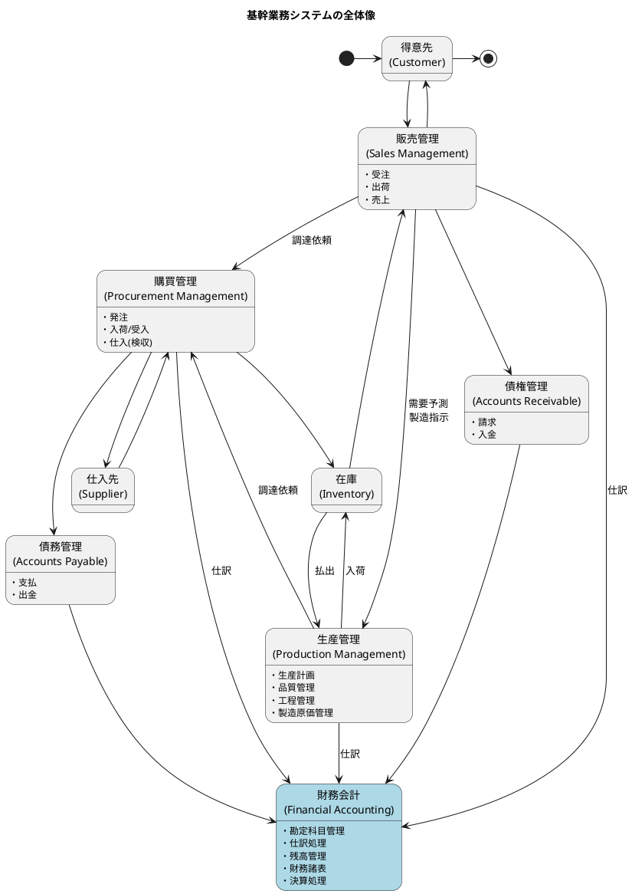
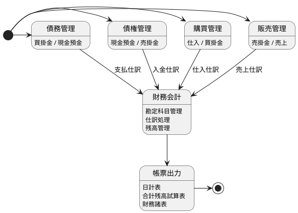
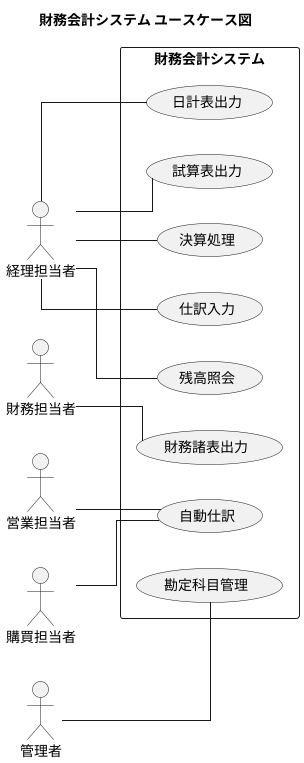
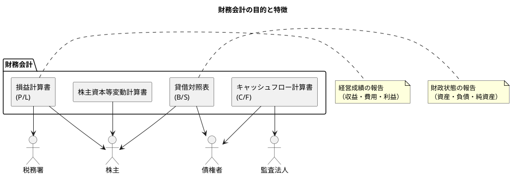
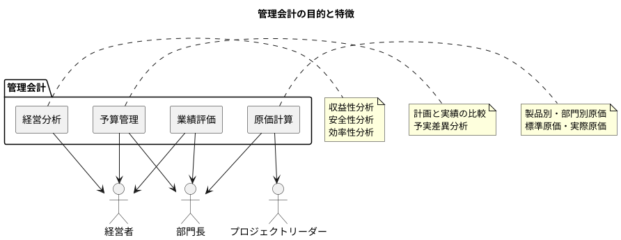
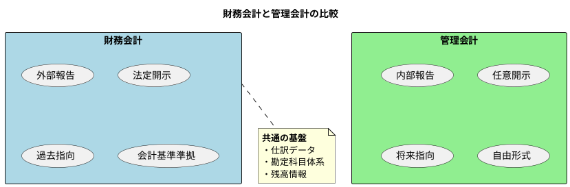
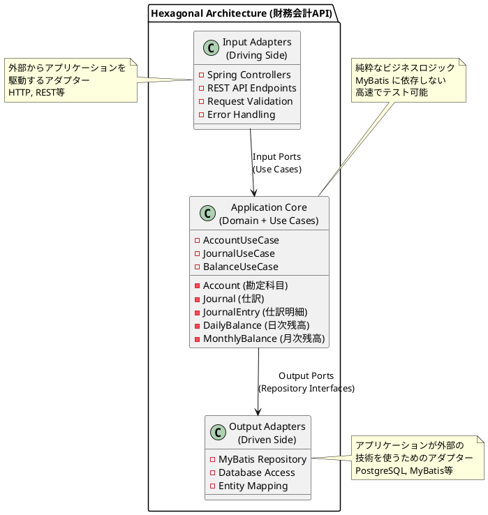
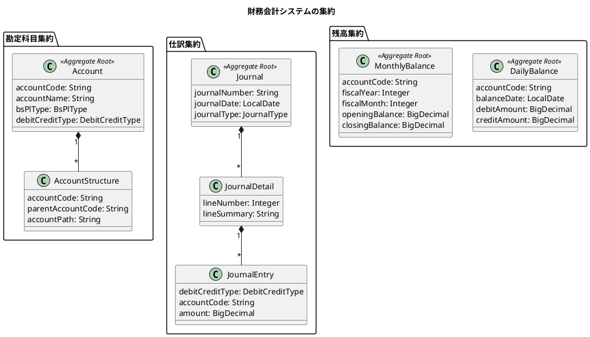
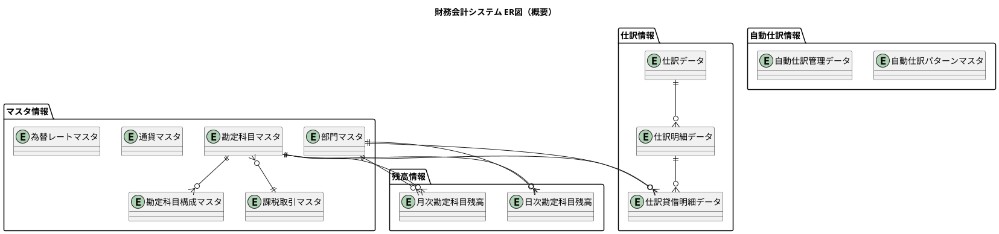

# 第14章：財務会計システムの全体像

本章では、財務会計システムの全体像を把握し、販売管理システムとの連携や、財務会計と管理会計の違い、システムアーキテクチャについて解説します。

---

## 14.1 財務会計システムのスコープ

### 基幹業務システムにおける位置づけ

財務会計システムは、基幹業務システムの中で他のシステムから仕訳データを受け取り、企業の財務状態を管理する重要なシステムです。



### 財務会計システムの業務領域

財務会計システムは、以下の業務領域をカバーします。



### 業務機能の概要

| 業務 | 説明 |
|------|------|
| **債権管理（請求・入金）** | 売上に基づく請求書発行と入金消込処理 |
| **債務管理（支払・出金）** | 仕入に基づく支払処理と出金管理 |
| **経理（仕訳・決算）** | 仕訳入力・自動仕訳・残高管理・決算処理 |

### ユースケース図

財務会計システム全体のユースケースは以下の通りです。



### 会計組織の役割分担

| 部門 | 役割 | 主な業務 |
|------|------|----------|
| **経理部門** | 日常の会計処理 | 仕訳入力、残高照会、日計表出力 |
| **財務部門** | 財務諸表の作成 | 試算表出力、財務諸表作成、決算処理 |
| **営業部門** | 売上データの提供 | 売上仕訳の元データ作成 |
| **購買部門** | 仕入データの提供 | 仕入仕訳の元データ作成 |
| **管理者** | マスタ管理 | 勘定科目マスタの管理 |

---

## 14.2 財務会計と管理会計の違い

### 財務会計：外部報告目的

財務会計は、株主・債権者・税務署などの外部利害関係者に対して、企業の財政状態や経営成績を報告することを目的とします。



**財務会計の特徴**

| 項目 | 内容 |
|------|------|
| 目的 | 外部への報告（法定開示） |
| 対象 | 株主、債権者、税務署 |
| 規則 | 会計基準、税法に準拠 |
| 期間 | 会計期間（通常1年） |
| 形式 | 財務諸表（B/S, P/L, C/F） |

### 管理会計：内部意思決定目的

管理会計は、経営者や管理者が意思決定を行うための情報を提供することを目的とします。



**管理会計の特徴**

| 項目 | 内容 |
|------|------|
| 目的 | 内部の意思決定支援 |
| 対象 | 経営者、管理者 |
| 規則 | 自由（社内ルール） |
| 期間 | 任意（月次、週次、日次） |
| 形式 | 自由（セグメント別、製品別など） |

### 財務会計と管理会計の比較



| 比較項目 | 財務会計 | 管理会計 |
|----------|----------|----------|
| 利用者 | 外部利害関係者 | 経営者・管理者 |
| 目的 | 報告義務の履行 | 意思決定の支援 |
| 規制 | 会計基準・税法 | なし（任意） |
| 時間軸 | 過去（実績） | 過去・現在・将来 |
| 詳細度 | 法定様式 | 必要に応じて詳細 |
| 更新頻度 | 期末（四半期・年次） | 随時（日次・週次） |

---

## 14.3 財務会計システムのアーキテクチャ

### プロジェクト構成

財務会計システムは、ヘキサゴナルアーキテクチャ（ポート&アダプターパターン）を採用します。

```
src/main/java/com/example/accounting/
├── domain/                     # ドメイン層（純粋なビジネスロジック）
│   ├── model/                 # ドメインモデル（エンティティ、値オブジェクト）
│   │   ├── account/           # 勘定科目関連
│   │   ├── journal/           # 仕訳関連
│   │   └── balance/           # 残高関連
│   ├── type/                  # 基本型（通貨、金額等）
│   └── exception/             # ドメイン例外
│
├── application/               # アプリケーション層
│   └── port/
│       └── out/              # Output Port（リポジトリインターフェース）
│
├── infrastructure/            # インフラストラクチャ層
│   ├── in/                   # Input Adapter（受信アダプター）
│   │   ├── rest/             # REST API（Web実装）
│   │   │   ├── controller/   # REST Controller
│   │   │   ├── dto/          # Data Transfer Object
│   │   │   └── exception/    # Exception Handler
│   │   └── seed/             # Seed データ投入
│   └── out/                  # Output Adapter（送信アダプター）
│       └── persistence/      # DB実装
│           ├── mapper/       # MyBatis Mapper
│           ├── repository/   # Repository実装
│           └── typehandler/  # 型ハンドラー
│
└── config/                   # 設定クラス
```

### ヘキサゴナルアーキテクチャ（ポート&アダプター）



### アーキテクチャの特徴

| 特徴 | 説明 |
|------|------|
| **ドメイン中心** | ビジネスロジックを中心に据え、外部技術から分離 |
| **依存性の逆転** | ドメイン層は外部に依存せず、外部がドメイン層に依存 |
| **テスト容易性** | モックやスタブを使った単体テストが容易 |
| **技術変更の容易さ** | アダプターを差し替えるだけで技術を変更可能 |

### ドメイン駆動設計の適用

#### 集約とリポジトリ



#### ドメインサービス

| サービス | 責務 |
|----------|------|
| **JournalValidationService** | 仕訳の貸借一致検証 |
| **BalanceCalculationService** | 残高計算・集計 |
| **AutoJournalService** | 自動仕訳生成 |
| **ClosingService** | 月次・年次決算処理 |

#### アプリケーションサービス

| サービス | 責務 |
|----------|------|
| **AccountUseCase** | 勘定科目の登録・照会・更新 |
| **JournalUseCase** | 仕訳の登録・照会・更新 |
| **BalanceUseCase** | 残高照会・帳票出力 |
| **ClosingUseCase** | 決算処理の実行 |

### API 設計

#### RESTful API の基本方針

| 方針 | 説明 |
|------|------|
| リソース指向 | 勘定科目、仕訳、残高をリソースとして設計 |
| HTTP メソッド | GET（照会）、POST（登録）、PUT（更新）、DELETE（削除） |
| ステータスコード | 200（成功）、201（作成）、400（バリデーションエラー）、404（未検出）、409（競合） |
| エラーレスポンス | ProblemDetail 形式（RFC 7807） |

#### エンドポイント設計

| メソッド | パス | 説明 |
|----------|------|------|
| GET | `/api/v1/accounts` | 勘定科目一覧の取得 |
| GET | `/api/v1/accounts/{code}` | 勘定科目の取得 |
| POST | `/api/v1/accounts` | 勘定科目の登録 |
| PUT | `/api/v1/accounts/{code}` | 勘定科目の更新 |
| DELETE | `/api/v1/accounts/{code}` | 勘定科目の削除 |
| GET | `/api/v1/journals` | 仕訳一覧の取得 |
| POST | `/api/v1/journals` | 仕訳の登録 |
| GET | `/api/v1/balances/daily` | 日次残高の取得 |
| GET | `/api/v1/balances/monthly` | 月次残高の取得 |
| GET | `/api/v1/reports/trial-balance` | 試算表の出力 |

### マスタ情報とトランザクション情報

財務会計システムのデータは、大きく「マスタ情報」と「トランザクション情報」に分類されます。



| 分類 | 説明 | 例 |
|-----|------|-----|
| **マスタ情報** | 基本的に変更が少ない、システムの基盤となるデータ | 勘定科目マスタ、勘定科目構成マスタ、課税取引マスタ |
| **トランザクション情報** | 日々の業務で発生するデータ | 仕訳データ、日次勘定科目残高、月次勘定科目残高 |

---

## 本章のまとめ

本章では、財務会計システムの全体像を把握しました。

### 学んだこと

| カテゴリ | 内容 |
|----------|------|
| スコープ | 債権管理・債務管理・経理（仕訳・決算） |
| 連携 | 販売管理・購買管理・生産管理からの仕訳データ受領 |
| 財務会計 | 外部報告目的（法定開示） |
| 管理会計 | 内部意思決定目的（任意） |
| アーキテクチャ | ヘキサゴナルアーキテクチャ（ポート&アダプター） |
| 設計手法 | ドメイン駆動設計（集約・リポジトリ・ドメインサービス） |

### 次章の予告

第15章では、財務会計システムの基盤となる勘定科目マスタの設計を行います。勘定科目コード、BSPL区分、貸借区分、集計区分などの詳細を解説します。
