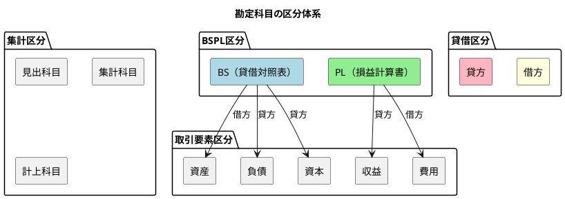
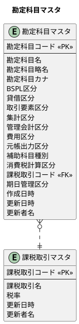
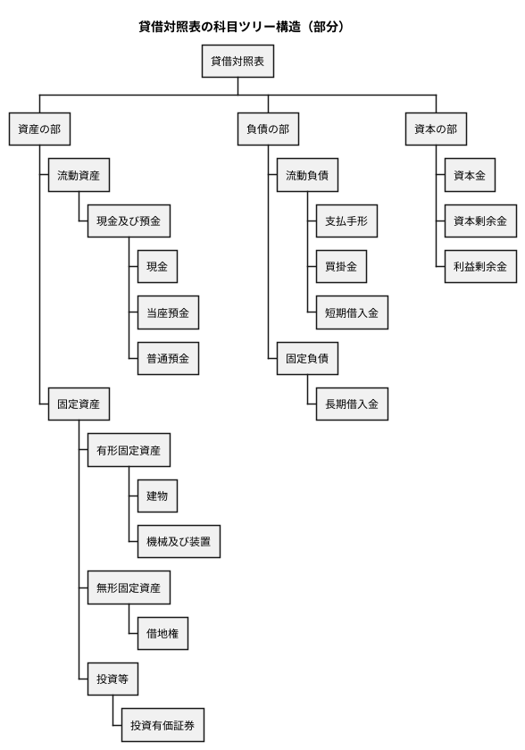
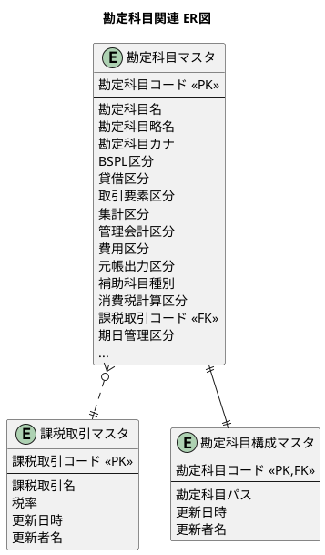

# 第15章：勘定科目の設計

財務会計システムの根幹となる勘定科目マスタを設計します。本章では、TDD（テスト駆動開発）を用いて勘定科目マスタ、勘定科目構成マスタ、課税取引マスタを実装していきます。

---

## 15.1 勘定科目マスタの設計

### 勘定科目の区分体系

勘定科目は複数の区分で分類されます。これらの区分を正しく理解することが、財務会計システム設計の基礎となります。



#### 区分の説明

| 区分 | 説明 | 値の例 |
|-----|------|-------|
| **BSPL区分** | 貸借対照表(BS)か損益計算書(PL)か | `BS`, `PL` |
| **貸借区分** | 借方科目か貸方科目か | `借方`, `貸方` |
| **取引要素区分** | 5つの取引要素のどれに該当するか | `資産`, `負債`, `資本`, `収益`, `費用` |
| **集計区分** | 科目の性質（見出し/集計/計上） | `見出科目`, `集計科目`, `計上科目` |

#### 取引要素と貸借区分の関係

複式簿記では、取引要素によって借方・貸方が決まります。

| 取引要素 | BSPL区分 | 増加時の貸借 | 減少時の貸借 |
|---------|---------|------------|------------|
| 資産 | BS | 借方 | 貸方 |
| 負債 | BS | 貸方 | 借方 |
| 資本 | BS | 貸方 | 借方 |
| 収益 | PL | 貸方 | 借方 |
| 費用 | PL | 借方 | 貸方 |

#### 集計区分の使い分け

| 集計区分 | 説明 | 例 |
|---------|------|-----|
| **見出科目** | 帳票の見出しとして表示、計上不可 | `(資産の部）`, `(負債の部）` |
| **集計科目** | 配下の科目を集計、計上不可 | `流動資産`, `現金及び預金` |
| **計上科目** | 実際に仕訳で使用する科目 | `現金`, `当座預金`, `売上高` |

### 勘定科目マスタのER図



### 勘定科目マスタの項目説明

| 項目 | 説明 | 例 |
|-----|------|-----|
| **勘定科目コード** | 科目を一意に識別するコード | `11110` |
| **勘定科目名** | 科目の正式名称 | `現金` |
| **勘定科目略名** | 科目の略称（帳票表示用） | `現金` |
| **勘定科目カナ** | 検索用カナ名 | `ゲンキン` |
| **BSPL区分** | 貸借対照表(BS)か損益計算書(PL)か | `BS` |
| **貸借区分** | 借方科目か貸方科目か | `借方` |
| **取引要素区分** | 5つの取引要素のどれか | `資産` |
| **集計区分** | 見出科目/集計科目/計上科目 | `計上科目` |
| **管理会計区分** | 管理会計での分類 | `1` |
| **費用区分** | 費用の分類（製造原価/販管費等） | `2` |
| **補助科目種別** | 補助科目の種類（得意先/仕入先等） | `1` |
| **消費税計算区分** | 消費税の計算方法 | `課税` |
| **課税取引コード** | 関連する課税取引マスタの参照 | `10` |
| **期日管理区分** | 期日管理の有無 | `1` |

### マイグレーション：ENUM型とテーブルの作成

<details>
<summary>マイグレーションSQL</summary>

```sql
-- src/main/resources/db/migration/V001__create_account_enums.sql

-- ENUM型の定義
CREATE TYPE BSPL区分 AS ENUM ('BS', 'PL');
CREATE TYPE 貸借区分 AS ENUM ('借方', '貸方');
CREATE TYPE 取引要素区分 AS ENUM ('資産', '負債', '資本', '収益', '費用');
CREATE TYPE 集計区分 AS ENUM ('見出科目', '集計科目', '計上科目');
CREATE TYPE 消費税計算区分 AS ENUM ('対象外', '課税', '非課税', '不課税', '輸出免税');
```

```sql
-- src/main/resources/db/migration/V002__create_account_master.sql

-- 課税取引マスタ
CREATE TABLE "課税取引マスタ" (
    "課税取引コード" VARCHAR(2) PRIMARY KEY,
    "課税取引名" VARCHAR(20) NOT NULL,
    "税率" DECIMAL(5,3) NOT NULL DEFAULT 0.10,
    "更新日時" TIMESTAMP DEFAULT CURRENT_TIMESTAMP,
    "更新者名" VARCHAR(12)
);

-- 勘定科目マスタ
CREATE TABLE "勘定科目マスタ" (
    "勘定科目コード" VARCHAR(5) PRIMARY KEY,
    "勘定科目名" VARCHAR(40) NOT NULL,
    "勘定科目略名" VARCHAR(10),
    "勘定科目カナ" VARCHAR(40),
    "BSPL区分" BSPL区分 NOT NULL,
    "貸借区分" 貸借区分 NOT NULL,
    "取引要素区分" 取引要素区分 NOT NULL,
    "集計区分" 集計区分 NOT NULL,
    "管理会計区分" VARCHAR(1),
    "費用区分" VARCHAR(1),
    "元帳出力区分" VARCHAR(1),
    "補助科目種別" VARCHAR(1),
    "消費税計算区分" 消費税計算区分,
    "課税取引コード" VARCHAR(2) REFERENCES "課税取引マスタ"("課税取引コード"),
    "期日管理区分" VARCHAR(1),
    "作成日時" TIMESTAMP DEFAULT CURRENT_TIMESTAMP,
    "更新日時" TIMESTAMP DEFAULT CURRENT_TIMESTAMP,
    "更新者名" VARCHAR(12)
);

-- インデックス
CREATE INDEX idx_勘定科目マスタ_BSPL区分 ON "勘定科目マスタ"("BSPL区分");
CREATE INDEX idx_勘定科目マスタ_取引要素区分 ON "勘定科目マスタ"("取引要素区分");
CREATE INDEX idx_勘定科目マスタ_集計区分 ON "勘定科目マスタ"("集計区分");
```

</details>

### TDD による勘定科目マスタの実装

#### Red: 失敗するテストを書く

<details>
<summary>勘定科目リポジトリテスト</summary>

```java
// src/test/java/com/example/fas/infrastructure/out/persistence/repository/AccountRepositoryTest.java
package com.example.fas.infrastructure.out.persistence.repository;

import com.example.fas.application.port.out.AccountRepository;
import com.example.fas.domain.model.account.*;
import com.example.fas.testsetup.BaseIntegrationTest;
import org.junit.jupiter.api.*;
import org.springframework.beans.factory.annotation.Autowired;

import static org.assertj.core.api.Assertions.*;

@DisplayName("勘定科目リポジトリ")
class AccountRepositoryTest extends BaseIntegrationTest {

    @Autowired
    private AccountRepository accountRepository;

    @BeforeEach
    void setUp() {
        accountRepository.deleteAll();
    }

    @Nested
    @DisplayName("登録")
    class Registration {

        @Test
        @DisplayName("勘定科目を登録できる")
        void canRegisterAccount() {
            // Arrange
            var account = Account.builder()
                    .accountCode("11110")
                    .accountName("現金")
                    .accountShortName("現金")
                    .bsplType(BSPLType.BS)
                    .debitCreditType(DebitCreditType.DEBIT)
                    .transactionElementType(TransactionElementType.ASSET)
                    .aggregationType(AggregationType.POSTING)
                    .build();

            // Act
            accountRepository.save(account);

            // Assert
            var result = accountRepository.findByCode("11110");
            assertThat(result).isPresent();
            assertThat(result.get().getAccountName()).isEqualTo("現金");
            assertThat(result.get().getBsplType()).isEqualTo(BSPLType.BS);
            assertThat(result.get().getDebitCreditType()).isEqualTo(DebitCreditType.DEBIT);
        }

        @Test
        @DisplayName("貸借対照表の資産科目を登録できる")
        void canRegisterBSAssetAccount() {
            var account = createAccount("11000", "流動資産", BSPLType.BS,
                    DebitCreditType.DEBIT, TransactionElementType.ASSET, AggregationType.SUMMARY);
            accountRepository.save(account);

            var result = accountRepository.findByCode("11000");
            assertThat(result).isPresent();
            assertThat(result.get().getBsplType()).isEqualTo(BSPLType.BS);
            assertThat(result.get().getTransactionElementType()).isEqualTo(TransactionElementType.ASSET);
        }

        @Test
        @DisplayName("貸借対照表の負債科目を登録できる")
        void canRegisterBSLiabilityAccount() {
            var account = createAccount("21000", "流動負債", BSPLType.BS,
                    DebitCreditType.CREDIT, TransactionElementType.LIABILITY, AggregationType.SUMMARY);
            accountRepository.save(account);

            var result = accountRepository.findByCode("21000");
            assertThat(result).isPresent();
            assertThat(result.get().getTransactionElementType()).isEqualTo(TransactionElementType.LIABILITY);
        }

        @Test
        @DisplayName("損益計算書の収益科目を登録できる")
        void canRegisterPLRevenueAccount() {
            var account = createAccount("41000", "売上高", BSPLType.PL,
                    DebitCreditType.CREDIT, TransactionElementType.REVENUE, AggregationType.SUMMARY);
            accountRepository.save(account);

            var result = accountRepository.findByCode("41000");
            assertThat(result).isPresent();
            assertThat(result.get().getBsplType()).isEqualTo(BSPLType.PL);
            assertThat(result.get().getTransactionElementType()).isEqualTo(TransactionElementType.REVENUE);
        }

        @Test
        @DisplayName("損益計算書の費用科目を登録できる")
        void canRegisterPLExpenseAccount() {
            var account = createAccount("51000", "売上原価", BSPLType.PL,
                    DebitCreditType.DEBIT, TransactionElementType.EXPENSE, AggregationType.SUMMARY);
            accountRepository.save(account);

            var result = accountRepository.findByCode("51000");
            assertThat(result).isPresent();
            assertThat(result.get().getTransactionElementType()).isEqualTo(TransactionElementType.EXPENSE);
        }
    }

    @Nested
    @DisplayName("集計区分")
    class AggregationTypes {

        @Test
        @DisplayName("見出科目を登録できる")
        void canRegisterHeaderAccount() {
            var account = createAccount("11", "(資産の部）", BSPLType.BS,
                    DebitCreditType.DEBIT, TransactionElementType.ASSET, AggregationType.HEADER);
            accountRepository.save(account);

            var result = accountRepository.findByCode("11");
            assertThat(result.get().getAggregationType()).isEqualTo(AggregationType.HEADER);
        }

        @Test
        @DisplayName("集計科目を登録できる")
        void canRegisterSummaryAccount() {
            var account = createAccount("11190", "現金及び預金", BSPLType.BS,
                    DebitCreditType.DEBIT, TransactionElementType.ASSET, AggregationType.SUMMARY);
            accountRepository.save(account);

            var result = accountRepository.findByCode("11190");
            assertThat(result.get().getAggregationType()).isEqualTo(AggregationType.SUMMARY);
        }

        @Test
        @DisplayName("計上科目を登録できる")
        void canRegisterPostingAccount() {
            var account = createAccount("11110", "現金", BSPLType.BS,
                    DebitCreditType.DEBIT, TransactionElementType.ASSET, AggregationType.POSTING);
            accountRepository.save(account);

            var result = accountRepository.findByCode("11110");
            assertThat(result.get().getAggregationType()).isEqualTo(AggregationType.POSTING);
        }
    }

    private Account createAccount(String code, String name, BSPLType bsplType,
            DebitCreditType debitCreditType, TransactionElementType transactionElementType,
            AggregationType aggregationType) {
        return Account.builder()
                .accountCode(code)
                .accountName(name)
                .bsplType(bsplType)
                .debitCreditType(debitCreditType)
                .transactionElementType(transactionElementType)
                .aggregationType(aggregationType)
                .build();
    }
}
```

</details>

#### Green: テストを通す実装

##### ドメイン層

<details>
<summary>勘定科目エンティティ</summary>

```java
// src/main/java/com/example/fas/domain/model/account/Account.java
package com.example.fas.domain.model.account;

import lombok.*;
import java.time.LocalDateTime;

@Data
@Builder
@NoArgsConstructor
@AllArgsConstructor
public class Account {
    private String accountCode;
    private String accountName;
    private String accountShortName;
    private String accountNameKana;
    private BSPLType bsplType;
    private DebitCreditType debitCreditType;
    private TransactionElementType transactionElementType;
    private AggregationType aggregationType;
    private String managementAccountingType;
    private String expenseType;
    private String ledgerOutputType;
    private String subAccountType;
    private String consumptionTaxType;
    private String taxTransactionCode;
    private String dueDateManagementType;
    private LocalDateTime createdAt;
    private LocalDateTime updatedAt;
    private String updatedBy;
}
```

</details>

<details>
<summary>BSPL区分 Enum</summary>

```java
// src/main/java/com/example/fas/domain/model/account/BSPLType.java
package com.example.fas.domain.model.account;

import lombok.Getter;
import lombok.RequiredArgsConstructor;

@Getter
@RequiredArgsConstructor
public enum BSPLType {
    BS("BS"),
    PL("PL");

    private final String displayName;

    public static BSPLType fromDisplayName(String displayName) {
        for (BSPLType type : values()) {
            if (type.displayName.equals(displayName)) {
                return type;
            }
        }
        throw new IllegalArgumentException("不正なBSPL区分: " + displayName);
    }
}
```

</details>

<details>
<summary>貸借区分 Enum</summary>

```java
// src/main/java/com/example/fas/domain/model/account/DebitCreditType.java
package com.example.fas.domain.model.account;

import lombok.Getter;
import lombok.RequiredArgsConstructor;

@Getter
@RequiredArgsConstructor
public enum DebitCreditType {
    DEBIT("借方"),
    CREDIT("貸方");

    private final String displayName;

    public static DebitCreditType fromDisplayName(String displayName) {
        for (DebitCreditType type : values()) {
            if (type.displayName.equals(displayName)) {
                return type;
            }
        }
        throw new IllegalArgumentException("不正な貸借区分: " + displayName);
    }
}
```

</details>

<details>
<summary>取引要素区分 Enum</summary>

```java
// src/main/java/com/example/fas/domain/model/account/TransactionElementType.java
package com.example.fas.domain.model.account;

import lombok.Getter;
import lombok.RequiredArgsConstructor;

@Getter
@RequiredArgsConstructor
public enum TransactionElementType {
    ASSET("資産"),
    LIABILITY("負債"),
    EQUITY("資本"),
    REVENUE("収益"),
    EXPENSE("費用");

    private final String displayName;

    public static TransactionElementType fromDisplayName(String displayName) {
        for (TransactionElementType type : values()) {
            if (type.displayName.equals(displayName)) {
                return type;
            }
        }
        throw new IllegalArgumentException("不正な取引要素区分: " + displayName);
    }
}
```

</details>

<details>
<summary>集計区分 Enum</summary>

```java
// src/main/java/com/example/fas/domain/model/account/AggregationType.java
package com.example.fas.domain.model.account;

import lombok.Getter;
import lombok.RequiredArgsConstructor;

@Getter
@RequiredArgsConstructor
public enum AggregationType {
    HEADER("見出科目"),
    SUMMARY("集計科目"),
    POSTING("計上科目");

    private final String displayName;

    public static AggregationType fromDisplayName(String displayName) {
        for (AggregationType type : values()) {
            if (type.displayName.equals(displayName)) {
                return type;
            }
        }
        throw new IllegalArgumentException("不正な集計区分: " + displayName);
    }
}
```

</details>

##### アプリケーション層（Output Port）

<details>
<summary>勘定科目リポジトリインターフェース</summary>

```java
// src/main/java/com/example/fas/application/port/out/AccountRepository.java
package com.example.fas.application.port.out;

import com.example.fas.domain.model.account.Account;
import com.example.fas.domain.model.account.BSPLType;
import com.example.fas.domain.model.account.TransactionElementType;

import java.util.List;
import java.util.Optional;

/**
 * 勘定科目リポジトリ（Output Port）
 */
public interface AccountRepository {

    void save(Account account);

    Optional<Account> findByCode(String accountCode);

    List<Account> findAll();

    List<Account> findByBSPLType(BSPLType bsplType);

    List<Account> findByTransactionElementType(TransactionElementType type);

    void update(Account account);

    void deleteAll();
}
```

</details>

##### インフラストラクチャ層

<details>
<summary>TypeHandler実装（BSPLTypeHandler）</summary>

```java
// src/main/java/com/example/fas/infrastructure/out/persistence/typehandler/BSPLTypeHandler.java
package com.example.fas.infrastructure.out.persistence.typehandler;

import com.example.fas.domain.model.account.BSPLType;
import org.apache.ibatis.type.BaseTypeHandler;
import org.apache.ibatis.type.JdbcType;

import java.sql.*;

public class BSPLTypeHandler extends BaseTypeHandler<BSPLType> {

    @Override
    public void setNonNullParameter(PreparedStatement ps, int i, BSPLType parameter, JdbcType jdbcType)
            throws SQLException {
        ps.setString(i, parameter.getDisplayName());
    }

    @Override
    public BSPLType getNullableResult(ResultSet rs, String columnName) throws SQLException {
        String value = rs.getString(columnName);
        return value == null ? null : BSPLType.fromDisplayName(value);
    }

    @Override
    public BSPLType getNullableResult(ResultSet rs, int columnIndex) throws SQLException {
        String value = rs.getString(columnIndex);
        return value == null ? null : BSPLType.fromDisplayName(value);
    }

    @Override
    public BSPLType getNullableResult(CallableStatement cs, int columnIndex) throws SQLException {
        String value = cs.getString(columnIndex);
        return value == null ? null : BSPLType.fromDisplayName(value);
    }
}
```

</details>

<details>
<summary>TypeHandler実装（DebitCreditTypeHandler）</summary>

```java
// src/main/java/com/example/fas/infrastructure/out/persistence/typehandler/DebitCreditTypeHandler.java
package com.example.fas.infrastructure.out.persistence.typehandler;

import com.example.fas.domain.model.account.DebitCreditType;
import org.apache.ibatis.type.BaseTypeHandler;
import org.apache.ibatis.type.JdbcType;

import java.sql.*;

public class DebitCreditTypeHandler extends BaseTypeHandler<DebitCreditType> {

    @Override
    public void setNonNullParameter(PreparedStatement ps, int i, DebitCreditType parameter, JdbcType jdbcType)
            throws SQLException {
        ps.setString(i, parameter.getDisplayName());
    }

    @Override
    public DebitCreditType getNullableResult(ResultSet rs, String columnName) throws SQLException {
        String value = rs.getString(columnName);
        return value == null ? null : DebitCreditType.fromDisplayName(value);
    }

    @Override
    public DebitCreditType getNullableResult(ResultSet rs, int columnIndex) throws SQLException {
        String value = rs.getString(columnIndex);
        return value == null ? null : DebitCreditType.fromDisplayName(value);
    }

    @Override
    public DebitCreditType getNullableResult(CallableStatement cs, int columnIndex) throws SQLException {
        String value = cs.getString(columnIndex);
        return value == null ? null : DebitCreditType.fromDisplayName(value);
    }
}
```

</details>

<details>
<summary>MyBatis XML Mapper</summary>

```xml
<?xml version="1.0" encoding="UTF-8" ?>
<!DOCTYPE mapper
        PUBLIC "-//mybatis.org//DTD Mapper 3.0//EN"
        "http://mybatis.org/dtd/mybatis-3-mapper.dtd">
<mapper namespace="com.example.fas.infrastructure.out.persistence.mapper.AccountMapper">

    <resultMap id="AccountResultMap" type="com.example.fas.domain.model.account.Account">
        <result property="accountCode" column="勘定科目コード"/>
        <result property="accountName" column="勘定科目名"/>
        <result property="accountShortName" column="勘定科目略名"/>
        <result property="accountNameKana" column="勘定科目カナ"/>
        <result property="bsplType" column="BSPL区分"
                typeHandler="com.example.fas.infrastructure.out.persistence.typehandler.BSPLTypeHandler"/>
        <result property="debitCreditType" column="貸借区分"
                typeHandler="com.example.fas.infrastructure.out.persistence.typehandler.DebitCreditTypeHandler"/>
        <result property="transactionElementType" column="取引要素区分"
                typeHandler="com.example.fas.infrastructure.out.persistence.typehandler.TransactionElementTypeHandler"/>
        <result property="aggregationType" column="集計区分"
                typeHandler="com.example.fas.infrastructure.out.persistence.typehandler.AggregationTypeHandler"/>
        <result property="managementAccountingType" column="管理会計区分"/>
        <result property="expenseType" column="費用区分"/>
        <result property="ledgerOutputType" column="元帳出力区分"/>
        <result property="subAccountType" column="補助科目種別"/>
        <result property="consumptionTaxType" column="消費税計算区分"/>
        <result property="taxTransactionCode" column="課税取引コード"/>
        <result property="dueDateManagementType" column="期日管理区分"/>
        <result property="createdAt" column="作成日時"/>
        <result property="updatedAt" column="更新日時"/>
        <result property="updatedBy" column="更新者名"/>
    </resultMap>

    <insert id="insert" parameterType="com.example.fas.domain.model.account.Account">
        INSERT INTO "勘定科目マスタ" (
            "勘定科目コード", "勘定科目名", "勘定科目略名", "勘定科目カナ",
            "BSPL区分", "貸借区分", "取引要素区分", "集計区分",
            "管理会計区分", "費用区分", "元帳出力区分", "補助科目種別",
            "消費税計算区分", "課税取引コード", "期日管理区分",
            "作成日時", "更新日時", "更新者名"
        ) VALUES (
            #{accountCode}, #{accountName}, #{accountShortName}, #{accountNameKana},
            #{bsplType, typeHandler=com.example.fas.infrastructure.out.persistence.typehandler.BSPLTypeHandler}::BSPL区分,
            #{debitCreditType, typeHandler=com.example.fas.infrastructure.out.persistence.typehandler.DebitCreditTypeHandler}::貸借区分,
            #{transactionElementType, typeHandler=com.example.fas.infrastructure.out.persistence.typehandler.TransactionElementTypeHandler}::取引要素区分,
            #{aggregationType, typeHandler=com.example.fas.infrastructure.out.persistence.typehandler.AggregationTypeHandler}::集計区分,
            #{managementAccountingType}, #{expenseType}, #{ledgerOutputType}, #{subAccountType},
            #{consumptionTaxType}::消費税計算区分, #{taxTransactionCode}, #{dueDateManagementType},
            CURRENT_TIMESTAMP, CURRENT_TIMESTAMP, #{updatedBy}
        )
    </insert>

    <select id="findByCode" resultMap="AccountResultMap">
        SELECT * FROM "勘定科目マスタ"
        WHERE "勘定科目コード" = #{accountCode}
    </select>

    <select id="findAll" resultMap="AccountResultMap">
        SELECT * FROM "勘定科目マスタ"
        ORDER BY "勘定科目コード"
    </select>

    <select id="findByBSPLType" resultMap="AccountResultMap">
        SELECT * FROM "勘定科目マスタ"
        WHERE "BSPL区分" = #{bsplType}::BSPL区分
        ORDER BY "勘定科目コード"
    </select>

    <delete id="deleteAll">
        TRUNCATE TABLE "勘定科目マスタ" CASCADE
    </delete>
</mapper>
```

</details>

<details>
<summary>勘定科目リポジトリ実装</summary>

```java
// src/main/java/com/example/fas/infrastructure/out/persistence/repository/AccountRepositoryImpl.java
package com.example.fas.infrastructure.out.persistence.repository;

import com.example.fas.application.port.out.AccountRepository;
import com.example.fas.domain.model.account.Account;
import com.example.fas.domain.model.account.BSPLType;
import com.example.fas.domain.model.account.TransactionElementType;
import com.example.fas.infrastructure.out.persistence.mapper.AccountMapper;
import lombok.RequiredArgsConstructor;
import org.springframework.stereotype.Repository;

import java.util.List;
import java.util.Optional;

@Repository
@RequiredArgsConstructor
public class AccountRepositoryImpl implements AccountRepository {

    private final AccountMapper accountMapper;

    @Override
    public void save(Account account) {
        accountMapper.insert(account);
    }

    @Override
    public Optional<Account> findByCode(String accountCode) {
        return accountMapper.findByCode(accountCode);
    }

    @Override
    public List<Account> findAll() {
        return accountMapper.findAll();
    }

    @Override
    public List<Account> findByBSPLType(BSPLType bsplType) {
        return accountMapper.findByBSPLType(bsplType.getDisplayName());
    }

    @Override
    public List<Account> findByTransactionElementType(TransactionElementType type) {
        throw new UnsupportedOperationException("Not implemented yet");
    }

    @Override
    public void update(Account account) {
        accountMapper.update(account);
    }

    @Override
    public void deleteAll() {
        accountMapper.deleteAll();
    }
}
```

</details>

---

## 15.2 勘定科目構成マスタの設計

### チルダ連結方式による階層構造

勘定科目の階層構造を「チルダ（~）連結」で表現します。これにより、SQL の LIKE 検索で効率的に階層検索ができます。



### 勘定科目構成マスタのデータ例

| 勘定科目コード | 勘定科目パス |
|-------------|-------------|
| 11 | 11 |
| 11000 | 11~11000 |
| 11190 | 11~11000~11190 |
| 11110 | 11~11000~11190~11110 |
| 11120 | 11~11000~11190~11120 |
| 11130 | 11~11000~11190~11130 |

### 階層検索のメリット

チルダ連結方式を使うと、LIKE 検索で特定科目配下のすべての科目を効率的に取得できます。

```sql
-- 現金及び預金（11190）配下の科目残高を集計
SELECT SUM(r.科目残高)
FROM 勘定科目残高テーブル r
INNER JOIN 勘定科目構成マスタ o ON r.勘定科目コード = o.勘定科目コード
WHERE o.勘定科目パス LIKE '%11190%'
```

### マイグレーション

<details>
<summary>マイグレーションSQL</summary>

```sql
-- src/main/resources/db/migration/V003__create_account_structure.sql

-- 勘定科目構成マスタ
CREATE TABLE "勘定科目構成マスタ" (
    "勘定科目コード" VARCHAR(5) PRIMARY KEY REFERENCES "勘定科目マスタ"("勘定科目コード"),
    "勘定科目パス" VARCHAR(100) NOT NULL,
    "更新日時" TIMESTAMP DEFAULT CURRENT_TIMESTAMP,
    "更新者名" VARCHAR(12)
);

-- インデックス（パス検索用）
CREATE INDEX idx_勘定科目構成マスタ_パス ON "勘定科目構成マスタ"("勘定科目パス");
```

</details>

### TDD による勘定科目構成マスタの実装

#### Red: 失敗するテストを書く

<details>
<summary>勘定科目構成リポジトリテスト</summary>

```java
// src/test/java/com/example/fas/infrastructure/out/persistence/repository/AccountStructureRepositoryTest.java
package com.example.fas.infrastructure.out.persistence.repository;

import com.example.fas.application.port.out.AccountRepository;
import com.example.fas.application.port.out.AccountStructureRepository;
import com.example.fas.domain.model.account.*;
import com.example.fas.testsetup.BaseIntegrationTest;
import org.junit.jupiter.api.*;
import org.springframework.beans.factory.annotation.Autowired;

import java.util.List;

import static org.assertj.core.api.Assertions.*;

@DisplayName("勘定科目構成リポジトリ")
class AccountStructureRepositoryTest extends BaseIntegrationTest {

    @Autowired
    private AccountStructureRepository accountStructureRepository;

    @Autowired
    private AccountRepository accountRepository;

    @BeforeEach
    void setUp() {
        accountStructureRepository.deleteAll();
        accountRepository.deleteAll();
        setupAccountMaster();
    }

    private void setupAccountMaster() {
        // 資産の部（見出科目）
        accountRepository.save(createAccount("11", "(資産の部）", AggregationType.HEADER));
        // 流動資産（集計科目）
        accountRepository.save(createAccount("11000", "流動資産", AggregationType.SUMMARY));
        // 現金及び預金（集計科目）
        accountRepository.save(createAccount("11190", "現金及び預金", AggregationType.SUMMARY));
        // 現金（計上科目）
        accountRepository.save(createAccount("11110", "現金", AggregationType.POSTING));
        // 当座預金（計上科目）
        accountRepository.save(createAccount("11120", "当座預金", AggregationType.POSTING));
        // 普通預金（計上科目）
        accountRepository.save(createAccount("11130", "普通預金", AggregationType.POSTING));
    }

    private Account createAccount(String code, String name, AggregationType aggregationType) {
        return Account.builder()
                .accountCode(code)
                .accountName(name)
                .bsplType(BSPLType.BS)
                .debitCreditType(DebitCreditType.DEBIT)
                .transactionElementType(TransactionElementType.ASSET)
                .aggregationType(aggregationType)
                .build();
    }

    @Nested
    @DisplayName("登録")
    class Registration {

        @Test
        @DisplayName("勘定科目構成を登録できる")
        void canRegisterAccountStructure() {
            // Arrange
            var structure = AccountStructure.builder()
                    .accountCode("11")
                    .accountPath("11")
                    .build();

            // Act
            accountStructureRepository.save(structure);

            // Assert
            var result = accountStructureRepository.findByCode("11");
            assertThat(result).isPresent();
            assertThat(result.get().getAccountPath()).isEqualTo("11");
        }

        @Test
        @DisplayName("階層構造を持つ勘定科目構成を登録できる")
        void canRegisterHierarchicalStructure() {
            // Arrange: ルート
            accountStructureRepository.save(AccountStructure.builder()
                    .accountCode("11").accountPath("11").build());

            // Arrange: 第2階層
            accountStructureRepository.save(AccountStructure.builder()
                    .accountCode("11000").accountPath("11~11000").build());

            // Arrange: 第3階層
            accountStructureRepository.save(AccountStructure.builder()
                    .accountCode("11190").accountPath("11~11000~11190").build());

            // Arrange: 第4階層（計上科目）
            accountStructureRepository.save(AccountStructure.builder()
                    .accountCode("11110").accountPath("11~11000~11190~11110").build());

            // Act
            var result = accountStructureRepository.findByCode("11110");

            // Assert
            assertThat(result).isPresent();
            assertThat(result.get().getAccountPath()).isEqualTo("11~11000~11190~11110");
        }
    }

    @Nested
    @DisplayName("階層検索")
    class HierarchySearch {

        @BeforeEach
        void setUpStructures() {
            accountStructureRepository.save(AccountStructure.builder()
                    .accountCode("11").accountPath("11").build());
            accountStructureRepository.save(AccountStructure.builder()
                    .accountCode("11000").accountPath("11~11000").build());
            accountStructureRepository.save(AccountStructure.builder()
                    .accountCode("11190").accountPath("11~11000~11190").build());
            accountStructureRepository.save(AccountStructure.builder()
                    .accountCode("11110").accountPath("11~11000~11190~11110").build());
            accountStructureRepository.save(AccountStructure.builder()
                    .accountCode("11120").accountPath("11~11000~11190~11120").build());
            accountStructureRepository.save(AccountStructure.builder()
                    .accountCode("11130").accountPath("11~11000~11190~11130").build());
        }

        @Test
        @DisplayName("現金及び預金配下の科目を検索できる")
        void canFindChildrenOfCashAndDeposits() {
            // Act
            var results = accountStructureRepository.findByPathContaining("11190");

            // Assert
            assertThat(results).hasSize(4); // 11190, 11110, 11120, 11130
            assertThat(results).extracting(AccountStructure::getAccountCode)
                    .containsExactlyInAnyOrder("11190", "11110", "11120", "11130");
        }

        @Test
        @DisplayName("流動資産配下の全科目を検索できる")
        void canFindAllChildrenOfCurrentAssets() {
            // Act
            var results = accountStructureRepository.findByPathContaining("11000");

            // Assert
            assertThat(results).hasSize(5); // 11000, 11190, 11110, 11120, 11130
        }
    }
}
```

</details>

#### Green: テストを通す実装

##### ドメイン層

<details>
<summary>勘定科目構成エンティティ</summary>

```java
// src/main/java/com/example/fas/domain/model/account/AccountStructure.java
package com.example.fas.domain.model.account;

import lombok.*;
import java.time.LocalDateTime;

@Data
@Builder
@NoArgsConstructor
@AllArgsConstructor
public class AccountStructure {
    private String accountCode;
    private String accountPath;
    private LocalDateTime updatedAt;
    private String updatedBy;

    /**
     * パスの深さ（階層レベル）を取得する.
     *
     * @return 階層の深さ（1から始まる）
     */
    public int getDepth() {
        if (accountPath == null || accountPath.isEmpty()) {
            return 0;
        }
        return accountPath.split("~").length;
    }

    /**
     * 親科目コードを取得する.
     *
     * @return 親科目コード。ルート科目の場合はnull
     */
    public String getParentCode() {
        if (accountPath == null || !accountPath.contains("~")) {
            return null;
        }
        String[] parts = accountPath.split("~");
        if (parts.length < 2) {
            return null;
        }
        return parts[parts.length - 2];
    }
}
```

</details>

##### アプリケーション層（Output Port）

<details>
<summary>勘定科目構成リポジトリインターフェース</summary>

```java
// src/main/java/com/example/fas/application/port/out/AccountStructureRepository.java
package com.example.fas.application.port.out;

import com.example.fas.domain.model.account.AccountStructure;

import java.util.List;
import java.util.Optional;

/**
 * 勘定科目構成リポジトリ（Output Port）
 */
public interface AccountStructureRepository {

    void save(AccountStructure structure);

    Optional<AccountStructure> findByCode(String accountCode);

    List<AccountStructure> findAll();

    List<AccountStructure> findByPathContaining(String pathSegment);

    List<AccountStructure> findChildren(String parentCode);

    void update(AccountStructure structure);

    void deleteAll();
}
```

</details>

##### インフラストラクチャ層

<details>
<summary>MyBatis XML Mapper</summary>

```xml
<?xml version="1.0" encoding="UTF-8" ?>
<!DOCTYPE mapper
        PUBLIC "-//mybatis.org//DTD Mapper 3.0//EN"
        "http://mybatis.org/dtd/mybatis-3-mapper.dtd">
<mapper namespace="com.example.fas.infrastructure.out.persistence.mapper.AccountStructureMapper">

    <resultMap id="AccountStructureResultMap" type="com.example.fas.domain.model.account.AccountStructure">
        <result property="accountCode" column="勘定科目コード"/>
        <result property="accountPath" column="勘定科目パス"/>
        <result property="updatedAt" column="更新日時"/>
        <result property="updatedBy" column="更新者名"/>
    </resultMap>

    <insert id="insert" parameterType="com.example.fas.domain.model.account.AccountStructure">
        INSERT INTO "勘定科目構成マスタ" (
            "勘定科目コード", "勘定科目パス", "更新日時", "更新者名"
        ) VALUES (
            #{accountCode}, #{accountPath}, CURRENT_TIMESTAMP, #{updatedBy}
        )
    </insert>

    <select id="findByCode" resultMap="AccountStructureResultMap">
        SELECT * FROM "勘定科目構成マスタ"
        WHERE "勘定科目コード" = #{accountCode}
    </select>

    <select id="findAll" resultMap="AccountStructureResultMap">
        SELECT * FROM "勘定科目構成マスタ"
        ORDER BY "勘定科目コード"
    </select>

    <select id="findByPathContaining" resultMap="AccountStructureResultMap">
        SELECT * FROM "勘定科目構成マスタ"
        WHERE "勘定科目パス" LIKE '%' || #{pathSegment} || '%'
        ORDER BY "勘定科目コード"
    </select>

    <select id="findChildren" resultMap="AccountStructureResultMap">
        SELECT * FROM "勘定科目構成マスタ"
        WHERE "勘定科目パス" LIKE #{parentCode} || '~%'
          AND "勘定科目パス" NOT LIKE #{parentCode} || '~%~%'
        ORDER BY "勘定科目コード"
    </select>

    <delete id="deleteAll">
        TRUNCATE TABLE "勘定科目構成マスタ" CASCADE
    </delete>
</mapper>
```

</details>

<details>
<summary>勘定科目構成リポジトリ実装</summary>

```java
// src/main/java/com/example/fas/infrastructure/out/persistence/repository/AccountStructureRepositoryImpl.java
package com.example.fas.infrastructure.out.persistence.repository;

import com.example.fas.application.port.out.AccountStructureRepository;
import com.example.fas.domain.model.account.AccountStructure;
import com.example.fas.infrastructure.out.persistence.mapper.AccountStructureMapper;
import lombok.RequiredArgsConstructor;
import org.springframework.stereotype.Repository;

import java.util.List;
import java.util.Optional;

@Repository
@RequiredArgsConstructor
public class AccountStructureRepositoryImpl implements AccountStructureRepository {

    private final AccountStructureMapper accountStructureMapper;

    @Override
    public void save(AccountStructure structure) {
        accountStructureMapper.insert(structure);
    }

    @Override
    public Optional<AccountStructure> findByCode(String accountCode) {
        return accountStructureMapper.findByCode(accountCode);
    }

    @Override
    public List<AccountStructure> findAll() {
        return accountStructureMapper.findAll();
    }

    @Override
    public List<AccountStructure> findByPathContaining(String pathSegment) {
        return accountStructureMapper.findByPathContaining(pathSegment);
    }

    @Override
    public List<AccountStructure> findChildren(String parentCode) {
        return accountStructureMapper.findChildren(parentCode);
    }

    @Override
    public void update(AccountStructure structure) {
        accountStructureMapper.update(structure);
    }

    @Override
    public void deleteAll() {
        accountStructureMapper.deleteAll();
    }
}
```

</details>

---

## 15.3 課税取引マスタの設計

### 課税取引コード・税率の管理

課税取引マスタは、消費税の税率情報を管理するマスタテーブルです。

| 課税取引コード | 課税取引名 | 税率 |
|-------------|-----------|------|
| 00 | 非課税 | 0.000 |
| 08 | 軽減税率 | 0.080 |
| 10 | 標準税率 | 0.100 |

### TDD による課税取引マスタの実装

<details>
<summary>課税取引リポジトリテスト</summary>

```java
// src/test/java/com/example/fas/infrastructure/out/persistence/repository/TaxTransactionRepositoryTest.java
package com.example.fas.infrastructure.out.persistence.repository;

import com.example.fas.application.port.out.TaxTransactionRepository;
import com.example.fas.domain.model.tax.TaxTransaction;
import com.example.fas.testsetup.BaseIntegrationTest;
import org.junit.jupiter.api.*;
import org.springframework.beans.factory.annotation.Autowired;

import java.math.BigDecimal;

import static org.assertj.core.api.Assertions.*;

@DisplayName("課税取引リポジトリ")
class TaxTransactionRepositoryTest extends BaseIntegrationTest {

    @Autowired
    private TaxTransactionRepository taxTransactionRepository;

    @BeforeEach
    void setUp() {
        taxTransactionRepository.deleteAll();
    }

    @Nested
    @DisplayName("登録")
    class Registration {

        @Test
        @DisplayName("課税取引を登録できる")
        void canRegisterTaxTransaction() {
            // Arrange
            var taxTransaction = TaxTransaction.builder()
                    .taxCode("10")
                    .taxName("標準税率")
                    .taxRate(new BigDecimal("0.10"))
                    .build();

            // Act
            taxTransactionRepository.save(taxTransaction);

            // Assert
            var result = taxTransactionRepository.findByCode("10");
            assertThat(result).isPresent();
            assertThat(result.get().getTaxName()).isEqualTo("標準税率");
            assertThat(result.get().getTaxRate()).isEqualByComparingTo(new BigDecimal("0.10"));
        }

        @Test
        @DisplayName("軽減税率を登録できる")
        void canRegisterReducedTaxRate() {
            // Arrange
            var taxTransaction = TaxTransaction.builder()
                    .taxCode("08")
                    .taxName("軽減税率")
                    .taxRate(new BigDecimal("0.08"))
                    .build();

            // Act
            taxTransactionRepository.save(taxTransaction);

            // Assert
            var result = taxTransactionRepository.findByCode("08");
            assertThat(result).isPresent();
            assertThat(result.get().getTaxRate()).isEqualByComparingTo(new BigDecimal("0.08"));
        }

        @Test
        @DisplayName("非課税を登録できる")
        void canRegisterTaxExempt() {
            // Arrange
            var taxTransaction = TaxTransaction.builder()
                    .taxCode("00")
                    .taxName("非課税")
                    .taxRate(BigDecimal.ZERO)
                    .build();

            // Act
            taxTransactionRepository.save(taxTransaction);

            // Assert
            var result = taxTransactionRepository.findByCode("00");
            assertThat(result).isPresent();
            assertThat(result.get().getTaxRate()).isEqualByComparingTo(BigDecimal.ZERO);
        }
    }

    @Nested
    @DisplayName("消費税計算")
    class TaxCalculation {

        @Test
        @DisplayName("税込金額を計算できる")
        void canCalculateTaxIncludedAmount() {
            // Arrange
            var taxTransaction = TaxTransaction.builder()
                    .taxCode("10")
                    .taxName("標準税率")
                    .taxRate(new BigDecimal("0.10"))
                    .build();

            // Act
            var amount = new BigDecimal("10000");
            var taxIncludedAmount = taxTransaction.calculateTaxIncludedAmount(amount);

            // Assert
            assertThat(taxIncludedAmount).isEqualByComparingTo(new BigDecimal("11000"));
        }

        @Test
        @DisplayName("消費税額を計算できる")
        void canCalculateTaxAmount() {
            // Arrange
            var taxTransaction = TaxTransaction.builder()
                    .taxCode("10")
                    .taxName("標準税率")
                    .taxRate(new BigDecimal("0.10"))
                    .build();

            // Act
            var amount = new BigDecimal("10000");
            var taxAmount = taxTransaction.calculateTaxAmount(amount);

            // Assert
            assertThat(taxAmount).isEqualByComparingTo(new BigDecimal("1000"));
        }
    }
}
```

</details>

<details>
<summary>課税取引エンティティ</summary>

```java
// src/main/java/com/example/fas/domain/model/tax/TaxTransaction.java
package com.example.fas.domain.model.tax;

import lombok.*;
import java.math.BigDecimal;
import java.time.LocalDateTime;

@Data
@Builder
@NoArgsConstructor
@AllArgsConstructor
public class TaxTransaction {
    private String taxCode;
    private String taxName;
    @Builder.Default
    private BigDecimal taxRate = new BigDecimal("0.10");
    private LocalDateTime updatedAt;
    private String updatedBy;

    /**
     * 税込金額を計算
     */
    public BigDecimal calculateTaxIncludedAmount(BigDecimal amount) {
        return amount.add(amount.multiply(taxRate));
    }

    /**
     * 消費税額を計算
     */
    public BigDecimal calculateTaxAmount(BigDecimal amount) {
        return amount.multiply(taxRate);
    }
}
```

</details>

<details>
<summary>課税取引リポジトリインターフェース</summary>

```java
// src/main/java/com/example/fas/application/port/out/TaxTransactionRepository.java
package com.example.fas.application.port.out;

import com.example.fas.domain.model.tax.TaxTransaction;

import java.util.List;
import java.util.Optional;

/**
 * 課税取引リポジトリ（Output Port）
 */
public interface TaxTransactionRepository {

    void save(TaxTransaction taxTransaction);

    Optional<TaxTransaction> findByCode(String taxCode);

    List<TaxTransaction> findAll();

    void update(TaxTransaction taxTransaction);

    void deleteAll();
}
```

</details>

<details>
<summary>MyBatis XML Mapper</summary>

```xml
<?xml version="1.0" encoding="UTF-8" ?>
<!DOCTYPE mapper
        PUBLIC "-//mybatis.org//DTD Mapper 3.0//EN"
        "http://mybatis.org/dtd/mybatis-3-mapper.dtd">
<mapper namespace="com.example.fas.infrastructure.out.persistence.mapper.TaxTransactionMapper">

    <resultMap id="TaxTransactionResultMap" type="com.example.fas.domain.model.tax.TaxTransaction">
        <result property="taxCode" column="課税取引コード"/>
        <result property="taxName" column="課税取引名"/>
        <result property="taxRate" column="税率"/>
        <result property="updatedAt" column="更新日時"/>
        <result property="updatedBy" column="更新者名"/>
    </resultMap>

    <insert id="insert" parameterType="com.example.fas.domain.model.tax.TaxTransaction">
        INSERT INTO "課税取引マスタ" (
            "課税取引コード", "課税取引名", "税率", "更新日時", "更新者名"
        ) VALUES (
            #{taxCode}, #{taxName}, #{taxRate}, CURRENT_TIMESTAMP, #{updatedBy}
        )
    </insert>

    <select id="findByCode" resultMap="TaxTransactionResultMap">
        SELECT * FROM "課税取引マスタ"
        WHERE "課税取引コード" = #{taxCode}
    </select>

    <select id="findAll" resultMap="TaxTransactionResultMap">
        SELECT * FROM "課税取引マスタ"
        ORDER BY "課税取引コード"
    </select>

    <update id="update" parameterType="com.example.fas.domain.model.tax.TaxTransaction">
        UPDATE "課税取引マスタ"
        SET "課税取引名" = #{taxName},
            "税率" = #{taxRate},
            "更新日時" = CURRENT_TIMESTAMP,
            "更新者名" = #{updatedBy}
        WHERE "課税取引コード" = #{taxCode}
    </update>

    <delete id="deleteAll">
        TRUNCATE TABLE "課税取引マスタ" CASCADE
    </delete>
</mapper>
```

</details>

---

## 第15章のまとめ

### 作成したテーブル

| テーブル名 | 説明 |
|----------|------|
| `課税取引マスタ` | 消費税の税率情報を管理 |
| `勘定科目マスタ` | 勘定科目の基本情報を管理 |
| `勘定科目構成マスタ` | 勘定科目の階層構造をチルダ連結で管理 |

### ER図



### 設計のポイント

1. **ENUM 型の活用**: BSPL区分、貸借区分、取引要素区分、集計区分で型安全性を確保
2. **日本語 DB / 英語 Java**: テーブル・カラムは日本語、Java コードは英語で統一
3. **TypeHandler**: Java Enum と日本語 ENUM 値の変換を MyBatis TypeHandler で実装
4. **チルダ連結方式**: 勘定科目構成マスタで階層構造を表現し、LIKE 検索で効率的に階層検索
5. **ヘキサゴナルアーキテクチャ**: ドメイン層がインフラに依存しない設計

### 命名規則

| 要素 | 言語 | 例 |
|------|------|-----|
| **テーブル名** | 日本語 | `"勘定科目マスタ"`, `"課税取引マスタ"` |
| **カラム名** | 日本語 | `"勘定科目コード"`, `"勘定科目名"` |
| **ENUM 型** | 日本語 | `BSPL区分`, `貸借区分` |
| **ENUM 値** | 日本語 | `'BS'`, `'借方'` |
| **Java クラス名** | 英語 | `Account`, `AccountStructure` |
| **Java フィールド名** | 英語 | `accountCode`, `accountName` |
| **MyBatis resultMap** | 日本語 ↔ 英語 | `column="勘定科目コード" property="accountCode"` |

---

## 次章の予告

第16章では、仕訳テーブルの設計に進みます。複式簿記の基本構造である「借方・貸方」の仕訳データを TDD で実装していきます。
