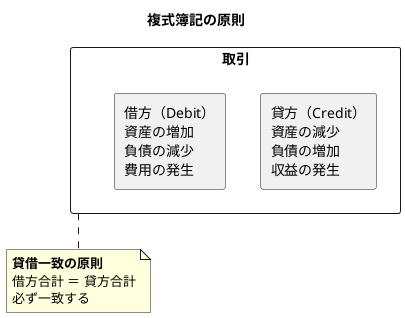
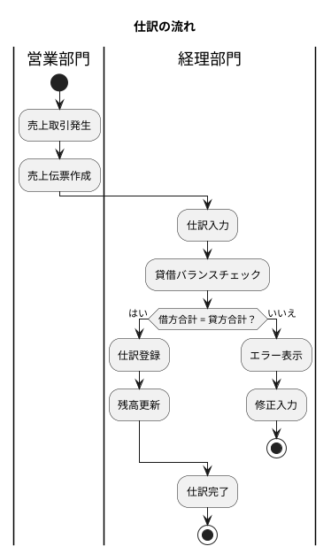
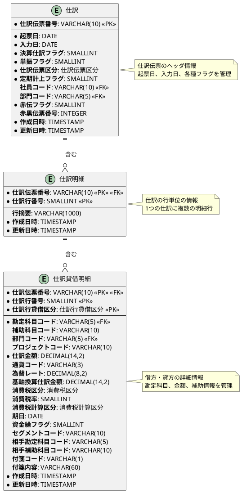
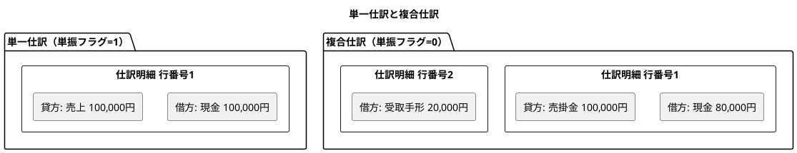
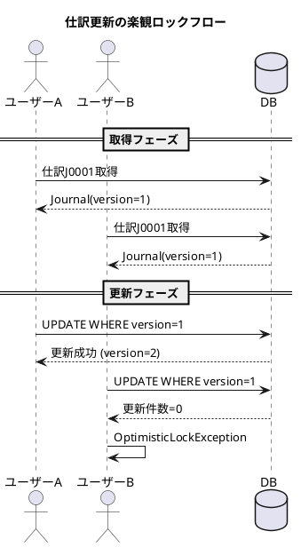
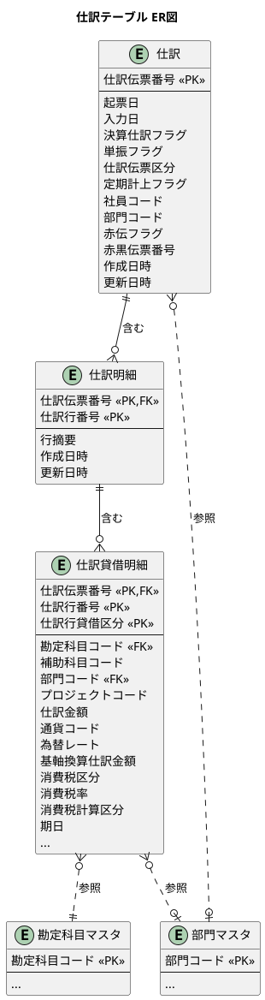

# 第16章：仕訳の設計

財務会計システムの核心部分である「仕訳処理」を TDD で設計していきます。複式簿記の原則に基づき、仕訳データの登録・管理を実現するテーブル構造を設計します。

---

## 16.1 仕訳テーブルの設計

### 複式簿記と仕訳の概念

複式簿記は、すべての取引を「借方（かりかた）」と「貸方（かしかた）」の2つの側面から記録する方式です。



#### 仕訳の具体例

商品を現金で販売した場合の仕訳：

| 借方（Debit） | 貸方（Credit） |
|--------------|---------------|
| 現金 100,000円 | 売上 100,000円 |

売掛金を現金と受取手形で回収した場合の仕訳（複合仕訳）：

| 借方（Debit） | 貸方（Credit） |
|--------------|---------------|
| 現金 80,000円 | 売掛金 100,000円 |
| 受取手形 20,000円 | |

### 仕訳処理の流れ



### 仕訳テーブルの項目設計

| 項目 | 説明 |
|-----|------|
| **仕訳伝票番号** | 仕訳を一意に識別するキー |
| **起票日** | 会計上の取引発生日 |
| **入力日** | システムへの登録日 |
| **決算仕訳フラグ** | 決算整理仕訳かどうか（0:通常、1:決算） |
| **単振フラグ** | 単一仕訳か複合仕訳か（0:複合、1:単一） |
| **仕訳伝票区分** | 仕訳の種類（通常/決算/自動/振替） |
| **定期計上フラグ** | 定期的な計上か否か |
| **社員コード** | 起票担当者 |
| **部門コード** | 所属部門 |
| **赤伝フラグ** | 赤伝（取消）かどうか（0:黒伝、1:赤伝） |
| **赤黒伝票番号** | 関連する赤黒伝票の番号 |

### 仕訳テーブルのER図



### マイグレーション：仕訳テーブルの作成

<details>
<summary>マイグレーションSQL</summary>

```sql
-- src/main/resources/db/migration/V006__create_journal_tables.sql

-- 仕訳伝票区分
CREATE TYPE 仕訳伝票区分 AS ENUM ('通常', '決算', '自動', '振替');

-- 仕訳行貸借区分
CREATE TYPE 仕訳行貸借区分 AS ENUM ('借方', '貸方');

-- 消費税区分（仕訳用）
CREATE TYPE 消費税区分 AS ENUM ('課税', '非課税', '免税', '不課税', '対象外');

-- 消費税計算区分（仕訳用）
CREATE TYPE 消費税計算区分 AS ENUM ('外税', '内税', '税なし');

-- 仕訳ヘッダ
CREATE TABLE "仕訳" (
    "仕訳伝票番号" VARCHAR(10) PRIMARY KEY,
    "起票日" DATE NOT NULL,
    "入力日" DATE NOT NULL DEFAULT CURRENT_DATE,
    "決算仕訳フラグ" SMALLINT DEFAULT 0 NOT NULL,
    "単振フラグ" SMALLINT DEFAULT 0 NOT NULL,
    "仕訳伝票区分" 仕訳伝票区分 DEFAULT '通常' NOT NULL,
    "定期計上フラグ" SMALLINT DEFAULT 0 NOT NULL,
    "社員コード" VARCHAR(10),
    "部門コード" VARCHAR(5),
    "赤伝フラグ" SMALLINT DEFAULT 0 NOT NULL,
    "赤黒伝票番号" INTEGER,
    "作成日時" TIMESTAMP DEFAULT CURRENT_TIMESTAMP NOT NULL,
    "更新日時" TIMESTAMP DEFAULT CURRENT_TIMESTAMP NOT NULL,
    CONSTRAINT "fk_仕訳_部門"
        FOREIGN KEY ("部門コード") REFERENCES "部門マスタ"("部門コード")
);

-- 仕訳明細
CREATE TABLE "仕訳明細" (
    "仕訳伝票番号" VARCHAR(10) NOT NULL,
    "仕訳行番号" SMALLINT NOT NULL,
    "行摘要" VARCHAR(1000),
    "作成日時" TIMESTAMP DEFAULT CURRENT_TIMESTAMP NOT NULL,
    "更新日時" TIMESTAMP DEFAULT CURRENT_TIMESTAMP NOT NULL,
    PRIMARY KEY ("仕訳伝票番号", "仕訳行番号"),
    CONSTRAINT "fk_仕訳明細_仕訳"
        FOREIGN KEY ("仕訳伝票番号") REFERENCES "仕訳"("仕訳伝票番号") ON DELETE CASCADE
);

-- 仕訳貸借明細
CREATE TABLE "仕訳貸借明細" (
    "仕訳伝票番号" VARCHAR(10) NOT NULL,
    "仕訳行番号" SMALLINT NOT NULL,
    "仕訳行貸借区分" 仕訳行貸借区分 NOT NULL,
    "勘定科目コード" VARCHAR(5) NOT NULL,
    "補助科目コード" VARCHAR(10),
    "部門コード" VARCHAR(5),
    "プロジェクトコード" VARCHAR(10),
    "仕訳金額" DECIMAL(14,2) NOT NULL,
    "通貨コード" VARCHAR(3) DEFAULT 'JPY',
    "為替レート" DECIMAL(8,2) DEFAULT 1.00,
    "基軸換算仕訳金額" DECIMAL(14,2),
    "消費税区分" 消費税区分 DEFAULT '課税',
    "消費税率" SMALLINT DEFAULT 10,
    "消費税計算区分" 消費税計算区分 DEFAULT '外税',
    "期日" DATE,
    "資金繰フラグ" SMALLINT DEFAULT 0,
    "セグメントコード" VARCHAR(10),
    "相手勘定科目コード" VARCHAR(5),
    "相手補助科目コード" VARCHAR(10),
    "付箋コード" VARCHAR(1),
    "付箋内容" VARCHAR(60),
    "作成日時" TIMESTAMP DEFAULT CURRENT_TIMESTAMP NOT NULL,
    "更新日時" TIMESTAMP DEFAULT CURRENT_TIMESTAMP NOT NULL,
    PRIMARY KEY ("仕訳伝票番号", "仕訳行番号", "仕訳行貸借区分"),
    CONSTRAINT "fk_仕訳貸借明細_仕訳明細"
        FOREIGN KEY ("仕訳伝票番号", "仕訳行番号")
        REFERENCES "仕訳明細"("仕訳伝票番号", "仕訳行番号") ON DELETE CASCADE,
    CONSTRAINT "fk_仕訳貸借明細_勘定科目"
        FOREIGN KEY ("勘定科目コード") REFERENCES "勘定科目マスタ"("勘定科目コード"),
    CONSTRAINT "fk_仕訳貸借明細_部門"
        FOREIGN KEY ("部門コード") REFERENCES "部門マスタ"("部門コード")
);

-- インデックス
CREATE INDEX "idx_仕訳_起票日" ON "仕訳"("起票日");
CREATE INDEX "idx_仕訳_部門コード" ON "仕訳"("部門コード");
CREATE INDEX "idx_仕訳_仕訳伝票区分" ON "仕訳"("仕訳伝票区分");
CREATE INDEX "idx_仕訳貸借明細_勘定科目コード" ON "仕訳貸借明細"("勘定科目コード");
CREATE INDEX "idx_仕訳貸借明細_部門コード" ON "仕訳貸借明細"("部門コード");
```

</details>

<details>
<summary>貸借バランスチェック関数</summary>

```sql
-- 貸借バランスチェック関数
CREATE OR REPLACE FUNCTION check_journal_balance()
RETURNS TRIGGER AS $$
DECLARE
    debit_total DECIMAL(14,2);
    credit_total DECIMAL(14,2);
BEGIN
    -- 借方合計を計算
    SELECT COALESCE(SUM("仕訳金額"), 0) INTO debit_total
    FROM "仕訳貸借明細"
    WHERE "仕訳伝票番号" = NEW."仕訳伝票番号"
    AND "仕訳行貸借区分" = '借方';

    -- 貸方合計を計算
    SELECT COALESCE(SUM("仕訳金額"), 0) INTO credit_total
    FROM "仕訳貸借明細"
    WHERE "仕訳伝票番号" = NEW."仕訳伝票番号"
    AND "仕訳行貸借区分" = '貸方';

    -- 貸借一致チェック（トリガー内では警告のみ、アプリ側で制御）
    IF debit_total <> credit_total THEN
        RAISE WARNING '仕訳伝票番号 % の貸借が一致していません: 借方=%, 貸方=%',
            NEW."仕訳伝票番号", debit_total, credit_total;
    END IF;

    RETURN NEW;
END;
$$ LANGUAGE plpgsql;

-- 貸借バランスチェックトリガー（挿入・更新時）
CREATE TRIGGER "trg_check_journal_balance"
AFTER INSERT OR UPDATE ON "仕訳貸借明細"
FOR EACH ROW
EXECUTE FUNCTION check_journal_balance();
```

</details>

---

## 16.2 仕訳明細の設計

### 仕訳明細の役割

仕訳明細は、仕訳伝票の行単位の情報を管理します。1つの仕訳伝票に複数の明細行を持つことができます。

| 項目 | 説明 |
|-----|------|
| **仕訳伝票番号** | 親となる仕訳伝票の番号（外部キー） |
| **仕訳行番号** | 明細行の連番（1から始まる） |
| **行摘要** | その行の取引内容の説明（最大1000文字） |

### 単一仕訳と複合仕訳



---

## 16.3 仕訳貸借明細の設計

### 仕訳貸借明細の項目

仕訳貸借明細は、借方・貸方それぞれの詳細情報を管理する最も粒度の細かいテーブルです。

#### 基本情報

| 項目 | 説明 |
|-----|------|
| **仕訳伝票番号** | 親となる仕訳伝票の番号 |
| **仕訳行番号** | 親となる仕訳明細の行番号 |
| **仕訳行貸借区分** | 借方/貸方の区分 |
| **勘定科目コード** | 使用する勘定科目 |
| **補助科目コード** | 補助科目（得意先、仕入先など） |
| **仕訳金額** | 取引金額 |

#### 多通貨対応

| 項目 | 説明 |
|-----|------|
| **通貨コード** | 取引通貨（デフォルト: JPY） |
| **為替レート** | 適用為替レート |
| **基軸換算仕訳金額** | 基軸通貨（円）換算後の金額 |

#### 管理会計情報

| 項目 | 説明 |
|-----|------|
| **部門コード** | 配賦先部門 |
| **プロジェクトコード** | 関連プロジェクト |
| **セグメントコード** | セグメント情報 |

#### 消費税情報

| 項目 | 説明 |
|-----|------|
| **消費税区分** | 課税/非課税/免税/不課税/対象外 |
| **消費税率** | 適用税率（10, 8 など） |
| **消費税計算区分** | 外税/内税/税なし |

#### その他

| 項目 | 説明 |
|-----|------|
| **期日** | 支払期日・入金期日 |
| **資金繰フラグ** | 資金繰表への計上対象か |
| **相手勘定科目コード** | 相手勘定科目（元帳表示用） |
| **相手補助科目コード** | 相手補助科目 |
| **付箋コード** | 付箋の種類 |
| **付箋内容** | 付箋の内容（メモ） |

### TDD による仕訳テーブルの実装

#### ドメイン層：Enum定義

<details>
<summary>仕訳伝票区分 Enum</summary>

```java
// src/main/java/com/example/accounting/domain/model/journal/JournalVoucherType.java
package com.example.fas.domain.model.journal;

import lombok.Getter;
import lombok.RequiredArgsConstructor;

@Getter
@RequiredArgsConstructor
public enum JournalVoucherType {
    NORMAL("通常"),
    CLOSING("決算"),
    AUTO("自動"),
    TRANSFER("振替");

    private final String displayName;

    public static JournalVoucherType fromDisplayName(String displayName) {
        for (JournalVoucherType type : values()) {
            if (type.displayName.equals(displayName)) {
                return type;
            }
        }
        throw new IllegalArgumentException("不正な仕訳伝票区分: " + displayName);
    }
}
```

</details>

<details>
<summary>消費税区分 Enum</summary>

```java
// src/main/java/com/example/accounting/domain/model/journal/TaxType.java
package com.example.fas.domain.model.journal;

import lombok.Getter;
import lombok.RequiredArgsConstructor;

@Getter
@RequiredArgsConstructor
public enum TaxType {
    TAXABLE("課税"),
    NON_TAXABLE("非課税"),
    TAX_EXEMPT("免税"),
    NOT_TAXABLE("不課税"),
    OUT_OF_SCOPE("対象外");

    private final String displayName;

    public static TaxType fromDisplayName(String displayName) {
        for (TaxType type : values()) {
            if (type.displayName.equals(displayName)) {
                return type;
            }
        }
        throw new IllegalArgumentException("不正な消費税区分: " + displayName);
    }
}
```

</details>

<details>
<summary>消費税計算区分 Enum</summary>

```java
// src/main/java/com/example/accounting/domain/model/journal/TaxCalculationType.java
package com.example.fas.domain.model.journal;

import lombok.Getter;
import lombok.RequiredArgsConstructor;

@Getter
@RequiredArgsConstructor
public enum TaxCalculationType {
    EXCLUSIVE("外税"),
    INCLUSIVE("内税"),
    NO_TAX("税なし");

    private final String displayName;

    public static TaxCalculationType fromDisplayName(String displayName) {
        for (TaxCalculationType type : values()) {
            if (type.displayName.equals(displayName)) {
                return type;
            }
        }
        throw new IllegalArgumentException("不正な消費税計算区分: " + displayName);
    }
}
```

</details>

#### ドメイン層：エンティティ

<details>
<summary>仕訳エンティティ</summary>

```java
// src/main/java/com/example/accounting/domain/model/journal/Journal.java
package com.example.fas.domain.model.journal;

import lombok.AllArgsConstructor;
import lombok.Builder;
import lombok.Data;
import lombok.NoArgsConstructor;

import java.math.BigDecimal;
import java.time.LocalDate;
import java.time.LocalDateTime;
import java.util.ArrayList;
import java.util.List;

@Data
@Builder
@NoArgsConstructor
@AllArgsConstructor
public class Journal {
    private String journalVoucherNumber;      // 仕訳伝票番号
    private LocalDate postingDate;            // 起票日
    private LocalDate entryDate;              // 入力日
    private Boolean closingJournalFlag;       // 決算仕訳フラグ
    private Boolean singleEntryFlag;          // 単振フラグ
    private JournalVoucherType voucherType;   // 仕訳伝票区分
    private Boolean periodicPostingFlag;      // 定期計上フラグ
    private String employeeCode;              // 社員コード
    private String departmentCode;            // 部門コード
    private Boolean redSlipFlag;              // 赤伝フラグ
    private Integer redBlackVoucherNumber;    // 赤黒伝票番号
    private LocalDateTime createdAt;          // 作成日時
    private LocalDateTime updatedAt;          // 更新日時

    // リレーション
    @Builder.Default
    private List<JournalDetail> details = new ArrayList<>();

    /**
     * 貸借バランスチェック
     * @return 借方合計と貸方合計が一致する場合 true
     */
    public boolean isBalanced() {
        BigDecimal debitTotal = details.stream()
            .flatMap(d -> d.getDebitCreditDetails().stream())
            .filter(dc -> dc.getDebitCreditType() == DebitCreditType.DEBIT)
            .map(JournalDebitCreditDetail::getAmount)
            .reduce(BigDecimal.ZERO, BigDecimal::add);

        BigDecimal creditTotal = details.stream()
            .flatMap(d -> d.getDebitCreditDetails().stream())
            .filter(dc -> dc.getDebitCreditType() == DebitCreditType.CREDIT)
            .map(JournalDebitCreditDetail::getAmount)
            .reduce(BigDecimal.ZERO, BigDecimal::add);

        return debitTotal.compareTo(creditTotal) == 0;
    }

    /**
     * 借方合計を取得
     */
    public BigDecimal getDebitTotal() {
        return details.stream()
            .flatMap(d -> d.getDebitCreditDetails().stream())
            .filter(dc -> dc.getDebitCreditType() == DebitCreditType.DEBIT)
            .map(JournalDebitCreditDetail::getAmount)
            .reduce(BigDecimal.ZERO, BigDecimal::add);
    }

    /**
     * 貸方合計を取得
     */
    public BigDecimal getCreditTotal() {
        return details.stream()
            .flatMap(d -> d.getDebitCreditDetails().stream())
            .filter(dc -> dc.getDebitCreditType() == DebitCreditType.CREDIT)
            .map(JournalDebitCreditDetail::getAmount)
            .reduce(BigDecimal.ZERO, BigDecimal::add);
    }
}
```

</details>

<details>
<summary>仕訳明細エンティティ</summary>

```java
// src/main/java/com/example/accounting/domain/model/journal/JournalDetail.java
package com.example.fas.domain.model.journal;

import lombok.AllArgsConstructor;
import lombok.Builder;
import lombok.Data;
import lombok.NoArgsConstructor;

import java.time.LocalDateTime;
import java.util.ArrayList;
import java.util.List;

@Data
@Builder
@NoArgsConstructor
@AllArgsConstructor
public class JournalDetail {
    private String journalVoucherNumber;  // 仕訳伝票番号
    private Integer lineNumber;           // 仕訳行番号
    private String lineSummary;           // 行摘要
    private LocalDateTime createdAt;      // 作成日時
    private LocalDateTime updatedAt;      // 更新日時

    // リレーション
    @Builder.Default
    private List<JournalDebitCreditDetail> debitCreditDetails = new ArrayList<>();
}
```

</details>

<details>
<summary>仕訳貸借明細エンティティ</summary>

```java
// src/main/java/com/example/accounting/domain/model/journal/JournalDebitCreditDetail.java
package com.example.fas.domain.model.journal;

import com.example.fas.domain.model.account.DebitCreditType;
import lombok.AllArgsConstructor;
import lombok.Builder;
import lombok.Data;
import lombok.NoArgsConstructor;

import java.math.BigDecimal;
import java.time.LocalDate;
import java.time.LocalDateTime;

@Data
@Builder
@NoArgsConstructor
@AllArgsConstructor
public class JournalDebitCreditDetail {
    private String journalVoucherNumber;      // 仕訳伝票番号
    private Integer lineNumber;               // 仕訳行番号
    private DebitCreditType debitCreditType;  // 仕訳行貸借区分
    private String accountCode;               // 勘定科目コード
    private String subAccountCode;            // 補助科目コード
    private String departmentCode;            // 部門コード
    private String projectCode;               // プロジェクトコード
    private BigDecimal amount;                // 仕訳金額
    private String currencyCode;              // 通貨コード
    private BigDecimal exchangeRate;          // 為替レート
    private BigDecimal baseCurrencyAmount;    // 基軸換算仕訳金額
    private TaxType taxType;                  // 消費税区分
    private Integer taxRate;                  // 消費税率
    private TaxCalculationType taxCalcType;   // 消費税計算区分
    private LocalDate dueDate;                // 期日
    private Boolean cashFlowFlag;             // 資金繰フラグ
    private String segmentCode;               // セグメントコード
    private String counterAccountCode;        // 相手勘定科目コード
    private String counterSubAccountCode;     // 相手補助科目コード
    private String tagCode;                   // 付箋コード
    private String tagContent;                // 付箋内容
    private LocalDateTime createdAt;          // 作成日時
    private LocalDateTime updatedAt;          // 更新日時
}
```

</details>

#### テストコード

<details>
<summary>仕訳リポジトリテスト</summary>

```java
// src/test/java/com/example/accounting/infrastructure/persistence/repository/JournalRepositoryTest.java
package com.example.fas.infrastructure.persistence.repository;

import com.example.fas.application.port.out.JournalRepository;
import com.example.fas.domain.model.account.DebitCreditType;
import com.example.fas.domain.model.journal.*;
import com.example.fas.testsetup.BaseIntegrationTest;
import org.junit.jupiter.api.*;
import org.springframework.beans.factory.annotation.Autowired;

import java.math.BigDecimal;
import java.time.LocalDate;
import java.util.List;

import static org.assertj.core.api.Assertions.*;

@DisplayName("仕訳リポジトリ")
class JournalRepositoryTest extends BaseIntegrationTest {

    @Autowired
    private JournalRepository journalRepository;

    @BeforeEach
    void setUp() {
        journalRepository.deleteAll();
    }

    @Nested
    @DisplayName("仕訳の登録")
    class Registration {

        @Test
        @DisplayName("単純仕訳（1行借方・1行貸方）を登録できる")
        void canRegisterSimpleJournal() {
            // Arrange: 現金売上の仕訳データ
            var journal = createSimpleSalesJournal("J0001");

            // Act: 仕訳を登録
            journalRepository.save(journal);

            // Assert: 登録されたデータを確認
            var savedJournal = journalRepository.findByVoucherNumber("J0001");
            assertThat(savedJournal).isPresent();
            assertThat(savedJournal.get().getPostingDate()).isEqualTo(LocalDate.of(2024, 4, 1));
            assertThat(savedJournal.get().isBalanced()).isTrue();
        }

        @Test
        @DisplayName("複合仕訳（複数行）を登録できる")
        void canRegisterCompoundJournal() {
            // Arrange: 売掛金回収の複合仕訳
            var journal = createCompoundJournal("J0002");

            // Act: 仕訳を登録
            journalRepository.save(journal);

            // Assert: 登録されたデータを確認
            var savedJournal = journalRepository.findByVoucherNumber("J0002");
            assertThat(savedJournal).isPresent();
            assertThat(savedJournal.get().getDetails()).hasSize(2);
            assertThat(savedJournal.get().isBalanced()).isTrue();
        }

        @Test
        @DisplayName("貸借が一致しない仕訳はバランスチェックでfalseを返す")
        void shouldReturnFalseForUnbalancedJournal() {
            // Arrange: 貸借不一致の仕訳データ
            var journal = createUnbalancedJournal("J0003");

            // Assert: バランスチェック
            assertThat(journal.isBalanced()).isFalse();
        }
    }

    @Nested
    @DisplayName("仕訳の検索")
    class Search {

        @BeforeEach
        void setUpTestData() {
            journalRepository.save(createSimpleSalesJournal("J0001"));
            journalRepository.save(createCompoundJournal("J0002"));
        }

        @Test
        @DisplayName("起票日範囲で仕訳を検索できる")
        void canFindByDateRange() {
            // Act
            var journals = journalRepository.findByPostingDateBetween(
                LocalDate.of(2024, 4, 1),
                LocalDate.of(2024, 4, 30)
            );

            // Assert
            assertThat(journals).hasSize(2);
        }

        @Test
        @DisplayName("勘定科目コードで仕訳を検索できる")
        void canFindByAccountCode() {
            // Act
            var journals = journalRepository.findByAccountCode("11110");

            // Assert
            assertThat(journals).isNotEmpty();
        }
    }

    private Journal createSimpleSalesJournal(String voucherNumber) {
        var debitDetail = JournalDebitCreditDetail.builder()
            .journalVoucherNumber(voucherNumber)
            .lineNumber(1)
            .debitCreditType(DebitCreditType.DEBIT)
            .accountCode("11110")  // 現金
            .amount(new BigDecimal("100000"))
            .currencyCode("JPY")
            .exchangeRate(BigDecimal.ONE)
            .build();

        var creditDetail = JournalDebitCreditDetail.builder()
            .journalVoucherNumber(voucherNumber)
            .lineNumber(1)
            .debitCreditType(DebitCreditType.CREDIT)
            .accountCode("41100")  // 売上
            .amount(new BigDecimal("100000"))
            .currencyCode("JPY")
            .exchangeRate(BigDecimal.ONE)
            .build();

        var journalDetail = JournalDetail.builder()
            .journalVoucherNumber(voucherNumber)
            .lineNumber(1)
            .lineSummary("現金売上")
            .debitCreditDetails(List.of(debitDetail, creditDetail))
            .build();

        return Journal.builder()
            .journalVoucherNumber(voucherNumber)
            .postingDate(LocalDate.of(2024, 4, 1))
            .entryDate(LocalDate.now())
            .closingJournalFlag(false)
            .singleEntryFlag(true)
            .voucherType(JournalVoucherType.NORMAL)
            .periodicPostingFlag(false)
            .redSlipFlag(false)
            .details(List.of(journalDetail))
            .build();
    }

    private Journal createCompoundJournal(String voucherNumber) {
        // 売掛金100,000円を現金80,000円と受取手形20,000円で回収
        var debit1 = JournalDebitCreditDetail.builder()
            .journalVoucherNumber(voucherNumber)
            .lineNumber(1)
            .debitCreditType(DebitCreditType.DEBIT)
            .accountCode("11110")  // 現金
            .amount(new BigDecimal("80000"))
            .build();

        var credit1 = JournalDebitCreditDetail.builder()
            .journalVoucherNumber(voucherNumber)
            .lineNumber(1)
            .debitCreditType(DebitCreditType.CREDIT)
            .accountCode("11300")  // 売掛金
            .amount(new BigDecimal("100000"))
            .build();

        var debit2 = JournalDebitCreditDetail.builder()
            .journalVoucherNumber(voucherNumber)
            .lineNumber(2)
            .debitCreditType(DebitCreditType.DEBIT)
            .accountCode("11200")  // 受取手形
            .amount(new BigDecimal("20000"))
            .build();

        var detail1 = JournalDetail.builder()
            .journalVoucherNumber(voucherNumber)
            .lineNumber(1)
            .lineSummary("現金入金")
            .debitCreditDetails(List.of(debit1, credit1))
            .build();

        var detail2 = JournalDetail.builder()
            .journalVoucherNumber(voucherNumber)
            .lineNumber(2)
            .lineSummary("手形入金")
            .debitCreditDetails(List.of(debit2))
            .build();

        return Journal.builder()
            .journalVoucherNumber(voucherNumber)
            .postingDate(LocalDate.of(2024, 4, 5))
            .entryDate(LocalDate.now())
            .closingJournalFlag(false)
            .singleEntryFlag(false)  // 複合仕訳
            .voucherType(JournalVoucherType.NORMAL)
            .details(List.of(detail1, detail2))
            .build();
    }

    private Journal createUnbalancedJournal(String voucherNumber) {
        var debitDetail = JournalDebitCreditDetail.builder()
            .journalVoucherNumber(voucherNumber)
            .lineNumber(1)
            .debitCreditType(DebitCreditType.DEBIT)
            .accountCode("11110")
            .amount(new BigDecimal("100000"))
            .build();

        var creditDetail = JournalDebitCreditDetail.builder()
            .journalVoucherNumber(voucherNumber)
            .lineNumber(1)
            .debitCreditType(DebitCreditType.CREDIT)
            .accountCode("41100")
            .amount(new BigDecimal("90000"))  // 不一致
            .build();

        var journalDetail = JournalDetail.builder()
            .journalVoucherNumber(voucherNumber)
            .lineNumber(1)
            .debitCreditDetails(List.of(debitDetail, creditDetail))
            .build();

        return Journal.builder()
            .journalVoucherNumber(voucherNumber)
            .postingDate(LocalDate.of(2024, 4, 1))
            .details(List.of(journalDetail))
            .build();
    }
}
```

</details>

#### アプリケーション層（Output Port）

<details>
<summary>仕訳リポジトリインターフェース</summary>

```java
// src/main/java/com/example/accounting/application/port/out/JournalRepository.java
package com.example.fas.application.port.out;

import com.example.fas.domain.model.journal.Journal;

import java.time.LocalDate;
import java.util.List;
import java.util.Optional;

/**
 * 仕訳リポジトリ（Output Port）
 */
public interface JournalRepository {

    void save(Journal journal);

    Optional<Journal> findByVoucherNumber(String voucherNumber);

    List<Journal> findByPostingDateBetween(LocalDate fromDate, LocalDate toDate);

    List<Journal> findByAccountCode(String accountCode);

    List<Journal> findByDepartmentCode(String departmentCode);

    void delete(String voucherNumber);

    void deleteAll();
}
```

</details>

#### インフラストラクチャ層

<details>
<summary>MyBatis XML Mapper</summary>

```xml
<?xml version="1.0" encoding="UTF-8" ?>
<!DOCTYPE mapper
        PUBLIC "-//mybatis.org//DTD Mapper 3.0//EN"
        "http://mybatis.org/dtd/mybatis-3-mapper.dtd">
<mapper namespace="com.example.fas.infrastructure.persistence.mapper.JournalMapper">

    <!-- 仕訳 ResultMap -->
    <resultMap id="JournalResultMap" type="com.example.fas.domain.model.journal.Journal">
        <result property="journalVoucherNumber" column="仕訳伝票番号"/>
        <result property="postingDate" column="起票日"/>
        <result property="entryDate" column="入力日"/>
        <result property="closingJournalFlag" column="決算仕訳フラグ"/>
        <result property="singleEntryFlag" column="単振フラグ"/>
        <result property="voucherType" column="仕訳伝票区分"
                typeHandler="com.example.fas.infrastructure.persistence.typehandler.JournalVoucherTypeHandler"/>
        <result property="periodicPostingFlag" column="定期計上フラグ"/>
        <result property="employeeCode" column="社員コード"/>
        <result property="departmentCode" column="部門コード"/>
        <result property="redSlipFlag" column="赤伝フラグ"/>
        <result property="redBlackVoucherNumber" column="赤黒伝票番号"/>
        <result property="createdAt" column="作成日時"/>
        <result property="updatedAt" column="更新日時"/>
    </resultMap>

    <!-- 仕訳明細 ResultMap -->
    <resultMap id="JournalDetailResultMap" type="com.example.fas.domain.model.journal.JournalDetail">
        <result property="journalVoucherNumber" column="仕訳伝票番号"/>
        <result property="lineNumber" column="仕訳行番号"/>
        <result property="lineSummary" column="行摘要"/>
        <result property="createdAt" column="作成日時"/>
        <result property="updatedAt" column="更新日時"/>
    </resultMap>

    <!-- 仕訳貸借明細 ResultMap -->
    <resultMap id="JournalDebitCreditDetailResultMap" type="com.example.fas.domain.model.journal.JournalDebitCreditDetail">
        <result property="journalVoucherNumber" column="仕訳伝票番号"/>
        <result property="lineNumber" column="仕訳行番号"/>
        <result property="debitCreditType" column="仕訳行貸借区分"
                typeHandler="com.example.fas.infrastructure.persistence.typehandler.DebitCreditTypeHandler"/>
        <result property="accountCode" column="勘定科目コード"/>
        <result property="subAccountCode" column="補助科目コード"/>
        <result property="departmentCode" column="部門コード"/>
        <result property="projectCode" column="プロジェクトコード"/>
        <result property="amount" column="仕訳金額"/>
        <result property="currencyCode" column="通貨コード"/>
        <result property="exchangeRate" column="為替レート"/>
        <result property="baseCurrencyAmount" column="基軸換算仕訳金額"/>
        <result property="taxType" column="消費税区分"
                typeHandler="com.example.fas.infrastructure.persistence.typehandler.TaxTypeHandler"/>
        <result property="taxRate" column="消費税率"/>
        <result property="taxCalcType" column="消費税計算区分"
                typeHandler="com.example.fas.infrastructure.persistence.typehandler.TaxCalculationTypeHandler"/>
        <result property="dueDate" column="期日"/>
        <result property="cashFlowFlag" column="資金繰フラグ"/>
        <result property="segmentCode" column="セグメントコード"/>
        <result property="counterAccountCode" column="相手勘定科目コード"/>
        <result property="counterSubAccountCode" column="相手補助科目コード"/>
        <result property="tagCode" column="付箋コード"/>
        <result property="tagContent" column="付箋内容"/>
        <result property="createdAt" column="作成日時"/>
        <result property="updatedAt" column="更新日時"/>
    </resultMap>

    <!-- 仕訳ヘッダ登録 -->
    <insert id="insertJournal" parameterType="com.example.fas.domain.model.journal.Journal">
        INSERT INTO "仕訳" (
            "仕訳伝票番号", "起票日", "入力日", "決算仕訳フラグ", "単振フラグ",
            "仕訳伝票区分", "定期計上フラグ", "社員コード", "部門コード",
            "赤伝フラグ", "赤黒伝票番号", "作成日時", "更新日時"
        ) VALUES (
            #{journalVoucherNumber}, #{postingDate}, #{entryDate},
            #{closingJournalFlag}, #{singleEntryFlag},
            #{voucherType, typeHandler=com.example.fas.infrastructure.persistence.typehandler.JournalVoucherTypeHandler}::仕訳伝票区分,
            #{periodicPostingFlag}, #{employeeCode}, #{departmentCode},
            #{redSlipFlag}, #{redBlackVoucherNumber},
            CURRENT_TIMESTAMP, CURRENT_TIMESTAMP
        )
    </insert>

    <!-- 仕訳明細登録 -->
    <insert id="insertJournalDetail" parameterType="com.example.fas.domain.model.journal.JournalDetail">
        INSERT INTO "仕訳明細" (
            "仕訳伝票番号", "仕訳行番号", "行摘要", "作成日時", "更新日時"
        ) VALUES (
            #{journalVoucherNumber}, #{lineNumber}, #{lineSummary},
            CURRENT_TIMESTAMP, CURRENT_TIMESTAMP
        )
    </insert>

    <!-- 仕訳貸借明細登録 -->
    <insert id="insertJournalDebitCreditDetail" parameterType="com.example.fas.domain.model.journal.JournalDebitCreditDetail">
        INSERT INTO "仕訳貸借明細" (
            "仕訳伝票番号", "仕訳行番号", "仕訳行貸借区分",
            "勘定科目コード", "補助科目コード", "部門コード", "プロジェクトコード",
            "仕訳金額", "通貨コード", "為替レート", "基軸換算仕訳金額",
            "消費税区分", "消費税率", "消費税計算区分",
            "期日", "資金繰フラグ", "セグメントコード",
            "相手勘定科目コード", "相手補助科目コード",
            "付箋コード", "付箋内容", "作成日時", "更新日時"
        ) VALUES (
            #{journalVoucherNumber}, #{lineNumber},
            #{debitCreditType, typeHandler=com.example.fas.infrastructure.persistence.typehandler.DebitCreditTypeHandler}::仕訳行貸借区分,
            #{accountCode}, #{subAccountCode}, #{departmentCode}, #{projectCode},
            #{amount}, #{currencyCode}, #{exchangeRate}, #{baseCurrencyAmount},
            #{taxType, typeHandler=com.example.fas.infrastructure.persistence.typehandler.TaxTypeHandler}::消費税区分,
            #{taxRate},
            #{taxCalcType, typeHandler=com.example.fas.infrastructure.persistence.typehandler.TaxCalculationTypeHandler}::消費税計算区分,
            #{dueDate}, #{cashFlowFlag}, #{segmentCode},
            #{counterAccountCode}, #{counterSubAccountCode},
            #{tagCode}, #{tagContent}, CURRENT_TIMESTAMP, CURRENT_TIMESTAMP
        )
    </insert>

    <!-- 仕訳伝票番号で検索 -->
    <select id="findByVoucherNumber" resultMap="JournalResultMap">
        SELECT * FROM "仕訳"
        WHERE "仕訳伝票番号" = #{voucherNumber}
    </select>

    <!-- 仕訳明細検索 -->
    <select id="findDetailsByVoucherNumber" resultMap="JournalDetailResultMap">
        SELECT * FROM "仕訳明細"
        WHERE "仕訳伝票番号" = #{voucherNumber}
        ORDER BY "仕訳行番号"
    </select>

    <!-- 仕訳貸借明細検索 -->
    <select id="findDCDetailsByVoucherAndLine" resultMap="JournalDebitCreditDetailResultMap">
        SELECT * FROM "仕訳貸借明細"
        WHERE "仕訳伝票番号" = #{voucherNumber}
        AND "仕訳行番号" = #{lineNumber}
    </select>

    <!-- 起票日範囲で検索 -->
    <select id="findVoucherNumbersByDateRange" resultType="String">
        SELECT "仕訳伝票番号" FROM "仕訳"
        WHERE "起票日" BETWEEN #{fromDate} AND #{toDate}
        ORDER BY "仕訳伝票番号"
    </select>

    <!-- 勘定科目コードで検索 -->
    <select id="findVoucherNumbersByAccountCode" resultType="String">
        SELECT DISTINCT "仕訳伝票番号" FROM "仕訳貸借明細"
        WHERE "勘定科目コード" = #{accountCode}
        ORDER BY "仕訳伝票番号"
    </select>

    <!-- 削除 -->
    <delete id="deleteJournal">
        DELETE FROM "仕訳" WHERE "仕訳伝票番号" = #{voucherNumber}
    </delete>

    <delete id="deleteAll">
        TRUNCATE TABLE "仕訳" CASCADE
    </delete>
</mapper>
```

</details>

<details>
<summary>仕訳リポジトリ実装</summary>

```java
// src/main/java/com/example/accounting/infrastructure/persistence/repository/JournalRepositoryImpl.java
package com.example.fas.infrastructure.persistence.repository;

import com.example.fas.application.port.out.JournalRepository;
import com.example.fas.domain.model.journal.Journal;
import com.example.fas.infrastructure.persistence.mapper.JournalMapper;
import lombok.RequiredArgsConstructor;
import org.springframework.stereotype.Repository;
import org.springframework.transaction.annotation.Transactional;

import java.time.LocalDate;
import java.util.List;
import java.util.Optional;
import java.util.stream.Collectors;

@Repository
@RequiredArgsConstructor
public class JournalRepositoryImpl implements JournalRepository {

    private final JournalMapper journalMapper;

    @Override
    @Transactional
    public void save(Journal journal) {
        // 1. 仕訳ヘッダを登録
        journalMapper.insertJournal(journal);

        // 2. 仕訳明細を登録
        journal.getDetails().forEach(detail -> {
            journalMapper.insertJournalDetail(detail);

            // 3. 仕訳貸借明細を登録
            detail.getDebitCreditDetails().forEach(dcDetail -> {
                journalMapper.insertJournalDebitCreditDetail(dcDetail);
            });
        });
    }

    @Override
    public Optional<Journal> findByVoucherNumber(String voucherNumber) {
        return journalMapper.findByVoucherNumber(voucherNumber)
            .map(journal -> {
                var details = journalMapper.findDetailsByVoucherNumber(voucherNumber);
                details.forEach(detail -> {
                    var dcDetails = journalMapper.findDCDetailsByVoucherAndLine(
                        voucherNumber, detail.getLineNumber());
                    detail.setDebitCreditDetails(dcDetails);
                });
                journal.setDetails(details);
                return journal;
            });
    }

    @Override
    public List<Journal> findByPostingDateBetween(LocalDate fromDate, LocalDate toDate) {
        return journalMapper.findVoucherNumbersByDateRange(fromDate, toDate).stream()
            .map(this::findByVoucherNumber)
            .filter(Optional::isPresent)
            .map(Optional::get)
            .collect(Collectors.toList());
    }

    @Override
    public List<Journal> findByAccountCode(String accountCode) {
        return journalMapper.findVoucherNumbersByAccountCode(accountCode).stream()
            .map(this::findByVoucherNumber)
            .filter(Optional::isPresent)
            .map(Optional::get)
            .collect(Collectors.toList());
    }

    @Override
    public List<Journal> findByDepartmentCode(String departmentCode) {
        return journalMapper.findVoucherNumbersByDepartmentCode(departmentCode).stream()
            .map(this::findByVoucherNumber)
            .filter(Optional::isPresent)
            .map(Optional::get)
            .collect(Collectors.toList());
    }

    @Override
    @Transactional
    public void delete(String voucherNumber) {
        journalMapper.deleteJournal(voucherNumber);
    }

    @Override
    @Transactional
    public void deleteAll() {
        journalMapper.deleteAll();
    }
}
```

</details>

---

## 16.4 リレーションと楽観ロックの設計

### MyBatis ネストした ResultMap によるリレーション設定

仕訳データは、仕訳（ヘッダ）→ 仕訳明細 → 仕訳貸借明細の3層構造を持ちます。MyBatis でこの親子関係を効率的に取得するためのリレーション設定を実装します。

#### ネストした ResultMap の定義

<details>
<summary>JournalMapper.xml（リレーション設定）</summary>

```xml
<?xml version="1.0" encoding="UTF-8" ?>
<!DOCTYPE mapper PUBLIC "-//mybatis.org//DTD Mapper 3.0//EN"
        "http://mybatis.org/dtd/mybatis-3-mapper.dtd">

<!-- src/main/resources/mapper/JournalMapper.xml -->
<mapper namespace="com.example.fas.infrastructure.persistence.mapper.JournalMapper">

    <!-- 仕訳（ヘッダ）の ResultMap（リレーション込み） -->
    <resultMap id="journalWithDetailsResultMap" type="com.example.fas.domain.model.journal.Journal">
        <id property="journalVoucherNumber" column="j_仕訳伝票番号"/>
        <result property="postingDate" column="j_起票日"/>
        <result property="entryDate" column="j_入力日"/>
        <result property="closingJournalFlag" column="j_決算仕訳フラグ"/>
        <result property="singleEntryFlag" column="j_単振フラグ"/>
        <result property="voucherType" column="j_仕訳伝票区分"
                typeHandler="com.example.fas.infrastructure.persistence.typehandler.JournalVoucherTypeHandler"/>
        <result property="periodicPostingFlag" column="j_定期計上フラグ"/>
        <result property="employeeCode" column="j_社員コード"/>
        <result property="departmentCode" column="j_部門コード"/>
        <result property="redSlipFlag" column="j_赤伝フラグ"/>
        <result property="redBlackVoucherNumber" column="j_赤黒伝票番号"/>
        <result property="version" column="j_バージョン"/>
        <result property="createdAt" column="j_作成日時"/>
        <result property="updatedAt" column="j_更新日時"/>
        <!-- 仕訳明細との1:N関連 -->
        <collection property="details" ofType="com.example.fas.domain.model.journal.JournalDetail"
                    resultMap="journalDetailNestedResultMap"/>
    </resultMap>

    <!-- 仕訳明細のネスト ResultMap -->
    <resultMap id="journalDetailNestedResultMap" type="com.example.fas.domain.model.journal.JournalDetail">
        <id property="journalVoucherNumber" column="d_仕訳伝票番号"/>
        <id property="lineNumber" column="d_仕訳行番号"/>
        <result property="lineSummary" column="d_行摘要"/>
        <result property="version" column="d_バージョン"/>
        <result property="createdAt" column="d_作成日時"/>
        <result property="updatedAt" column="d_更新日時"/>
        <!-- 仕訳貸借明細との1:N関連 -->
        <collection property="debitCreditDetails" ofType="com.example.fas.domain.model.journal.JournalDebitCreditDetail"
                    resultMap="journalDebitCreditDetailNestedResultMap"/>
    </resultMap>

    <!-- 仕訳貸借明細のネスト ResultMap -->
    <resultMap id="journalDebitCreditDetailNestedResultMap" type="com.example.fas.domain.model.journal.JournalDebitCreditDetail">
        <id property="journalVoucherNumber" column="dc_仕訳伝票番号"/>
        <id property="lineNumber" column="dc_仕訳行番号"/>
        <id property="debitCreditType" column="dc_仕訳行貸借区分"
            typeHandler="com.example.fas.infrastructure.persistence.typehandler.DebitCreditTypeHandler"/>
        <result property="accountCode" column="dc_勘定科目コード"/>
        <result property="subAccountCode" column="dc_補助科目コード"/>
        <result property="departmentCode" column="dc_部門コード"/>
        <result property="projectCode" column="dc_プロジェクトコード"/>
        <result property="amount" column="dc_仕訳金額"/>
        <result property="currencyCode" column="dc_通貨コード"/>
        <result property="exchangeRate" column="dc_為替レート"/>
        <result property="baseCurrencyAmount" column="dc_基軸換算仕訳金額"/>
        <result property="taxType" column="dc_消費税区分"
                typeHandler="com.example.fas.infrastructure.persistence.typehandler.TaxTypeHandler"/>
        <result property="taxRate" column="dc_消費税率"/>
        <result property="taxCalcType" column="dc_消費税計算区分"
                typeHandler="com.example.fas.infrastructure.persistence.typehandler.TaxCalculationTypeHandler"/>
        <result property="dueDate" column="dc_期日"/>
        <result property="cashFlowFlag" column="dc_資金繰フラグ"/>
        <result property="segmentCode" column="dc_セグメントコード"/>
        <result property="counterAccountCode" column="dc_相手勘定科目コード"/>
        <result property="counterSubAccountCode" column="dc_相手補助科目コード"/>
        <result property="tagCode" column="dc_付箋コード"/>
        <result property="tagContent" column="dc_付箋内容"/>
        <result property="version" column="dc_バージョン"/>
        <result property="createdAt" column="dc_作成日時"/>
        <result property="updatedAt" column="dc_更新日時"/>
    </resultMap>

    <!-- JOIN による一括取得クエリ（3層構造） -->
    <select id="findWithDetailsByVoucherNumber" resultMap="journalWithDetailsResultMap">
        SELECT
            j."仕訳伝票番号" AS j_仕訳伝票番号,
            j."起票日" AS j_起票日,
            j."入力日" AS j_入力日,
            j."決算仕訳フラグ" AS j_決算仕訳フラグ,
            j."単振フラグ" AS j_単振フラグ,
            j."仕訳伝票区分" AS j_仕訳伝票区分,
            j."定期計上フラグ" AS j_定期計上フラグ,
            j."社員コード" AS j_社員コード,
            j."部門コード" AS j_部門コード,
            j."赤伝フラグ" AS j_赤伝フラグ,
            j."赤黒伝票番号" AS j_赤黒伝票番号,
            j."バージョン" AS j_バージョン,
            j."作成日時" AS j_作成日時,
            j."更新日時" AS j_更新日時,
            d."仕訳伝票番号" AS d_仕訳伝票番号,
            d."仕訳行番号" AS d_仕訳行番号,
            d."行摘要" AS d_行摘要,
            d."バージョン" AS d_バージョン,
            d."作成日時" AS d_作成日時,
            d."更新日時" AS d_更新日時,
            dc."仕訳伝票番号" AS dc_仕訳伝票番号,
            dc."仕訳行番号" AS dc_仕訳行番号,
            dc."仕訳行貸借区分" AS dc_仕訳行貸借区分,
            dc."勘定科目コード" AS dc_勘定科目コード,
            dc."補助科目コード" AS dc_補助科目コード,
            dc."部門コード" AS dc_部門コード,
            dc."プロジェクトコード" AS dc_プロジェクトコード,
            dc."仕訳金額" AS dc_仕訳金額,
            dc."通貨コード" AS dc_通貨コード,
            dc."為替レート" AS dc_為替レート,
            dc."基軸換算仕訳金額" AS dc_基軸換算仕訳金額,
            dc."消費税区分" AS dc_消費税区分,
            dc."消費税率" AS dc_消費税率,
            dc."消費税計算区分" AS dc_消費税計算区分,
            dc."期日" AS dc_期日,
            dc."資金繰フラグ" AS dc_資金繰フラグ,
            dc."セグメントコード" AS dc_セグメントコード,
            dc."相手勘定科目コード" AS dc_相手勘定科目コード,
            dc."相手補助科目コード" AS dc_相手補助科目コード,
            dc."付箋コード" AS dc_付箋コード,
            dc."付箋内容" AS dc_付箋内容,
            dc."バージョン" AS dc_バージョン,
            dc."作成日時" AS dc_作成日時,
            dc."更新日時" AS dc_更新日時
        FROM "仕訳" j
        LEFT JOIN "仕訳明細" d ON j."仕訳伝票番号" = d."仕訳伝票番号"
        LEFT JOIN "仕訳貸借明細" dc ON d."仕訳伝票番号" = dc."仕訳伝票番号"
            AND d."仕訳行番号" = dc."仕訳行番号"
        WHERE j."仕訳伝票番号" = #{voucherNumber}
        ORDER BY d."仕訳行番号", dc."仕訳行貸借区分"
    </select>

</mapper>
```

</details>

#### リレーション設定のポイント

| 設定項目 | 説明 |
|---------|------|
| `<collection>` | 1:N 関連のマッピング |
| `<id>` | 主キーの識別（MyBatis が重複排除に使用） |
| 複合主キー | 仕訳明細・仕訳貸借明細は複数の `<id>` で複合主キーを表現 |
| `resultMap` | ネストした ResultMap の参照 |
| エイリアス（AS） | カラム名の重複を避けるためのプレフィックス（j_, d_, dc_） |
| `ORDER BY` | コレクションの順序を保証 |

### 楽観ロックの実装

複数ユーザーが同時に仕訳データを編集する場合、データの整合性を保つために楽観ロック（Optimistic Locking）を実装します。

#### Flyway マイグレーション: バージョンカラム追加

<details>
<summary>V006__add_journal_version_columns.sql</summary>

```sql
-- src/main/resources/db/migration/V006__add_journal_version_columns.sql

-- 仕訳テーブルにバージョンカラムを追加
ALTER TABLE "仕訳" ADD COLUMN "バージョン" INTEGER DEFAULT 1 NOT NULL;

-- 仕訳明細テーブルにバージョンカラムを追加
ALTER TABLE "仕訳明細" ADD COLUMN "バージョン" INTEGER DEFAULT 1 NOT NULL;

-- 仕訳貸借明細テーブルにバージョンカラムを追加
ALTER TABLE "仕訳貸借明細" ADD COLUMN "バージョン" INTEGER DEFAULT 1 NOT NULL;

-- コメント追加
COMMENT ON COLUMN "仕訳"."バージョン" IS '楽観ロック用バージョン番号';
COMMENT ON COLUMN "仕訳明細"."バージョン" IS '楽観ロック用バージョン番号';
COMMENT ON COLUMN "仕訳貸借明細"."バージョン" IS '楽観ロック用バージョン番号';
```

</details>

#### エンティティへのバージョンフィールド追加

<details>
<summary>Journal.java（バージョンフィールド追加）</summary>

```java
// src/main/java/com/example/fas/domain/model/journal/Journal.java
package com.example.fas.domain.model.journal;

import lombok.AllArgsConstructor;
import lombok.Builder;
import lombok.Data;
import lombok.NoArgsConstructor;

import java.math.BigDecimal;
import java.time.LocalDate;
import java.time.LocalDateTime;
import java.util.ArrayList;
import java.util.List;

@Data
@Builder
@NoArgsConstructor
@AllArgsConstructor
public class Journal {
    private String journalVoucherNumber;      // 仕訳伝票番号
    private LocalDate postingDate;            // 起票日
    private LocalDate entryDate;              // 入力日
    private Boolean closingJournalFlag;       // 決算仕訳フラグ
    private Boolean singleEntryFlag;          // 単振フラグ
    private JournalVoucherType voucherType;   // 仕訳伝票区分
    private Boolean periodicPostingFlag;      // 定期計上フラグ
    private String employeeCode;              // 社員コード
    private String departmentCode;            // 部門コード
    private Boolean redSlipFlag;              // 赤伝フラグ
    private Integer redBlackVoucherNumber;    // 赤黒伝票番号
    private LocalDateTime createdAt;          // 作成日時
    private LocalDateTime updatedAt;          // 更新日時

    // 楽観ロック用バージョン
    @Builder.Default
    private Integer version = 1;

    // リレーション
    @Builder.Default
    private List<JournalDetail> details = new ArrayList<>();

    // 以下、既存のビジネスロジック...
}
```

</details>

#### MyBatis Mapper: 楽観ロック対応の更新

<details>
<summary>JournalMapper.xml（楽観ロック対応 UPDATE）</summary>

```xml
<!-- 楽観ロック対応の更新（バージョンチェック付き） -->
<update id="updateWithOptimisticLock" parameterType="com.example.fas.domain.model.journal.Journal">
    UPDATE "仕訳"
    SET
        "起票日" = #{postingDate},
        "入力日" = #{entryDate},
        "決算仕訳フラグ" = #{closingJournalFlag},
        "単振フラグ" = #{singleEntryFlag},
        "仕訳伝票区分" = #{voucherType, typeHandler=com.example.fas.infrastructure.persistence.typehandler.JournalVoucherTypeHandler}::仕訳伝票区分,
        "定期計上フラグ" = #{periodicPostingFlag},
        "社員コード" = #{employeeCode},
        "部門コード" = #{departmentCode},
        "赤伝フラグ" = #{redSlipFlag},
        "赤黒伝票番号" = #{redBlackVoucherNumber},
        "更新日時" = CURRENT_TIMESTAMP,
        "バージョン" = "バージョン" + 1
    WHERE "仕訳伝票番号" = #{journalVoucherNumber}
    AND "バージョン" = #{version}
</update>

<!-- バージョンのみ取得 -->
<select id="findVersionByVoucherNumber" resultType="Integer">
    SELECT "バージョン" FROM "仕訳"
    WHERE "仕訳伝票番号" = #{voucherNumber}
</select>
```

</details>

#### 楽観ロック例外クラス

<details>
<summary>OptimisticLockException.java</summary>

```java
// src/main/java/com/example/fas/domain/exception/OptimisticLockException.java
package com.example.fas.domain.exception;

public class OptimisticLockException extends RuntimeException {

    private final String entityName;
    private final String entityId;
    private final Integer expectedVersion;
    private final Integer actualVersion;

    public OptimisticLockException(String entityName, String entityId) {
        super(String.format("%s (ID: %s) は既に削除されています", entityName, entityId));
        this.entityName = entityName;
        this.entityId = entityId;
        this.expectedVersion = null;
        this.actualVersion = null;
    }

    public OptimisticLockException(String entityName, String entityId,
                                    Integer expectedVersion, Integer actualVersion) {
        super(String.format("%s (ID: %s) は他のユーザーによって更新されています。" +
                "期待バージョン: %d, 実際のバージョン: %d",
                entityName, entityId, expectedVersion, actualVersion));
        this.entityName = entityName;
        this.entityId = entityId;
        this.expectedVersion = expectedVersion;
        this.actualVersion = actualVersion;
    }

    public String getEntityName() {
        return entityName;
    }

    public String getEntityId() {
        return entityId;
    }

    public Integer getExpectedVersion() {
        return expectedVersion;
    }

    public Integer getActualVersion() {
        return actualVersion;
    }
}
```

</details>

#### Repository 実装: 楽観ロック対応

<details>
<summary>JournalRepositoryImpl.java（楽観ロック対応）</summary>

```java
// src/main/java/com/example/fas/infrastructure/persistence/repository/JournalRepositoryImpl.java
package com.example.fas.infrastructure.persistence.repository;

import com.example.fas.application.port.out.JournalRepository;
import com.example.fas.domain.exception.OptimisticLockException;
import com.example.fas.domain.model.journal.Journal;
import com.example.fas.infrastructure.persistence.mapper.JournalMapper;
import lombok.RequiredArgsConstructor;
import org.springframework.stereotype.Repository;
import org.springframework.transaction.annotation.Transactional;

import java.time.LocalDate;
import java.util.List;
import java.util.Optional;
import java.util.stream.Collectors;

@Repository
@RequiredArgsConstructor
public class JournalRepositoryImpl implements JournalRepository {

    private final JournalMapper journalMapper;

    @Override
    @Transactional
    public void update(Journal journal) {
        int updatedCount = journalMapper.updateWithOptimisticLock(journal);

        if (updatedCount == 0) {
            // バージョン不一致または削除済み
            Integer currentVersion = journalMapper.findVersionByVoucherNumber(
                    journal.getJournalVoucherNumber());
            if (currentVersion == null) {
                throw new OptimisticLockException("仕訳", journal.getJournalVoucherNumber());
            } else {
                throw new OptimisticLockException("仕訳", journal.getJournalVoucherNumber(),
                        journal.getVersion(), currentVersion);
            }
        }
    }

    @Override
    public Optional<Journal> findByVoucherNumberWithDetails(String voucherNumber) {
        return Optional.ofNullable(journalMapper.findWithDetailsByVoucherNumber(voucherNumber));
    }

    // その他のメソッド...
}
```

</details>

#### TDD: 楽観ロックのテスト

<details>
<summary>JournalRepositoryOptimisticLockTest.java</summary>

```java
// src/test/java/com/example/fas/infrastructure/persistence/repository/JournalRepositoryOptimisticLockTest.java
package com.example.fas.infrastructure.persistence.repository;

import com.example.fas.application.port.out.JournalRepository;
import com.example.fas.domain.exception.OptimisticLockException;
import com.example.fas.domain.model.account.DebitCreditType;
import com.example.fas.domain.model.journal.*;
import com.example.fas.testsetup.BaseIntegrationTest;
import org.junit.jupiter.api.*;
import org.springframework.beans.factory.annotation.Autowired;

import java.math.BigDecimal;
import java.time.LocalDate;
import java.util.List;

import static org.assertj.core.api.Assertions.*;

@DisplayName("仕訳リポジトリ - 楽観ロック")
class JournalRepositoryOptimisticLockTest extends BaseIntegrationTest {

    @Autowired
    private JournalRepository journalRepository;

    @BeforeEach
    void setUp() {
        journalRepository.deleteAll();
    }

    @Nested
    @DisplayName("楽観ロック")
    class OptimisticLocking {

        @Test
        @DisplayName("同じバージョンで更新できる")
        void canUpdateWithSameVersion() {
            // Arrange
            var journal = createTestJournal("J0001");
            journalRepository.save(journal);

            // Act
            var fetched = journalRepository.findByVoucherNumber("J0001").get();
            fetched.setDepartmentCode("DEPT-002");
            journalRepository.update(fetched);

            // Assert
            var updated = journalRepository.findByVoucherNumber("J0001").get();
            assertThat(updated.getDepartmentCode()).isEqualTo("DEPT-002");
            assertThat(updated.getVersion()).isEqualTo(2); // バージョンがインクリメント
        }

        @Test
        @DisplayName("異なるバージョンで更新すると楽観ロック例外が発生する")
        void throwsExceptionWhenVersionMismatch() {
            // Arrange
            var journal = createTestJournal("J0002");
            journalRepository.save(journal);

            // ユーザーAが取得
            var journalA = journalRepository.findByVoucherNumber("J0002").get();
            // ユーザーBが取得
            var journalB = journalRepository.findByVoucherNumber("J0002").get();

            // ユーザーAが更新（成功）
            journalA.setDepartmentCode("DEPT-A");
            journalRepository.update(journalA);

            // Act & Assert: ユーザーBが古いバージョンで更新（失敗）
            journalB.setDepartmentCode("DEPT-B");
            assertThatThrownBy(() -> journalRepository.update(journalB))
                    .isInstanceOf(OptimisticLockException.class)
                    .hasMessageContaining("他のユーザーによって更新されています");
        }

        @Test
        @DisplayName("削除済みデータを更新すると楽観ロック例外が発生する")
        void throwsExceptionWhenAlreadyDeleted() {
            // Arrange
            var journal = createTestJournal("J0003");
            journalRepository.save(journal);

            var fetched = journalRepository.findByVoucherNumber("J0003").get();
            journalRepository.delete("J0003");

            // Act & Assert
            assertThatThrownBy(() -> journalRepository.update(fetched))
                    .isInstanceOf(OptimisticLockException.class)
                    .hasMessageContaining("既に削除されています");
        }
    }

    private Journal createTestJournal(String voucherNumber) {
        var debitDetail = JournalDebitCreditDetail.builder()
                .journalVoucherNumber(voucherNumber)
                .lineNumber(1)
                .debitCreditType(DebitCreditType.DEBIT)
                .accountCode("11110")
                .amount(new BigDecimal("100000"))
                .build();

        var creditDetail = JournalDebitCreditDetail.builder()
                .journalVoucherNumber(voucherNumber)
                .lineNumber(1)
                .debitCreditType(DebitCreditType.CREDIT)
                .accountCode("41100")
                .amount(new BigDecimal("100000"))
                .build();

        var journalDetail = JournalDetail.builder()
                .journalVoucherNumber(voucherNumber)
                .lineNumber(1)
                .lineSummary("テスト仕訳")
                .debitCreditDetails(List.of(debitDetail, creditDetail))
                .build();

        return Journal.builder()
                .journalVoucherNumber(voucherNumber)
                .postingDate(LocalDate.of(2024, 4, 1))
                .entryDate(LocalDate.now())
                .closingJournalFlag(false)
                .singleEntryFlag(true)
                .voucherType(JournalVoucherType.NORMAL)
                .periodicPostingFlag(false)
                .departmentCode("DEPT-001")
                .redSlipFlag(false)
                .details(List.of(journalDetail))
                .build();
    }
}
```

</details>

#### 楽観ロックのベストプラクティス

| ポイント | 説明 |
|---------|------|
| **バージョンカラム** | INTEGER 型で十分（オーバーフローは実用上問題なし） |
| **WHERE 条件** | 必ず `AND "バージョン" = #{version}` を含める |
| **インクリメント** | `"バージョン" = "バージョン" + 1` でアトミックに更新 |
| **例外処理** | 更新件数が0の場合は楽観ロック例外をスロー |
| **リトライ** | 必要に応じて再取得・再更新のリトライロジックを実装 |
| **3層構造の考慮** | 仕訳は通常ヘッダ単位でロック、明細の個別ロックは必要に応じて追加 |

### 3層構造におけるリレーションと整合性

仕訳データは3層構造（仕訳 → 仕訳明細 → 仕訳貸借明細）を持つため、更新時の整合性確保が重要です。

#### 更新パターン

| パターン | 説明 | 推奨 |
|---------|------|------|
| **ヘッダ単位ロック** | 仕訳ヘッダのバージョンのみチェック | ○ シンプルで実用的 |
| **全層ロック** | 仕訳・明細・貸借明細すべてのバージョンをチェック | △ 複雑だが厳密 |
| **カスケード更新** | ヘッダ更新時に明細も一括削除・再挿入 | △ 実装が簡単だが履歴管理に注意 |

#### 推奨アプローチ

仕訳データは通常、伝票単位で一括編集されるため、**ヘッダ単位ロック**が推奨されます。明細の部分更新が必要な場合は、明細レベルのバージョンチェックを追加します。



---

## 第16章のまとめ

### 作成したテーブル

| テーブル名 | 説明 |
|----------|------|
| `仕訳` | 仕訳伝票のヘッダ情報（起票日、入力日、各種フラグ） |
| `仕訳明細` | 仕訳の行単位の情報（行摘要） |
| `仕訳貸借明細` | 借方・貸方の詳細（勘定科目、金額、補助情報） |

### ER図



### 設計のポイント

1. **3階層構造**: 仕訳 → 仕訳明細 → 仕訳貸借明細の親子関係
2. **複式簿記の原則**: 借方合計 = 貸方合計の貸借一致チェック
3. **単一仕訳と複合仕訳**: 単振フラグで区別
4. **赤黒処理対応**: 赤伝フラグと赤黒伝票番号で訂正履歴を管理
5. **多通貨対応**: 通貨コード、為替レート、基軸換算金額
6. **消費税対応**: 消費税区分、消費税率、消費税計算区分
7. **管理会計対応**: 部門コード、プロジェクトコード、セグメントコード

### ドメインロジック

| メソッド | 説明 |
|---------|------|
| `isBalanced()` | 借方合計と貸方合計が一致するかチェック |
| `getDebitTotal()` | 借方合計を取得 |
| `getCreditTotal()` | 貸方合計を取得 |

---

## 次章の予告

第17章では、自動仕訳の設計に進みます。販売管理システムと会計システムの連携、自動仕訳パターンマスタの設計、売上伝票から仕訳伝票への転記ロジックを TDD で実装していきます。
