# 第17章：自動仕訳の設計

販売管理システムなどの業務システムから会計システムへの自動仕訳処理を TDD で設計していきます。売上データから仕訳データへの自動変換ルールと、効率的なバッチ処理の設計を行います。

---

## 17.1 自動仕訳の概要

### 販売管理システムと会計システムの連携

自動仕訳は、業務システムのトランザクションデータを会計システムの仕訳データへ自動的に変換する機能です。

#### 従来のアナログ連携（手入力による非連携）

従来の方式では、販売管理システムで発行した売上伝票を紙で経理部門に回送し、経理担当者が仕訳入力を行っていました。

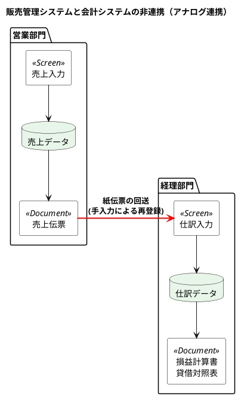

#### アナログ連携の問題点

| 問題 | 説明 |
|-----|------|
| **二重入力** | 営業部門と経理部門で同じ情報を入力する作業負荷 |
| **入力ミス** | 手入力によるデータ不整合 |
| **タイムラグ** | 紙伝票の回送による情報遅延 |
| **消費税計算ミス** | 手計算による誤り |
| **勘定科目選択ミス** | 担当者の判断ばらつき |

### 自動仕訳処理のデータフロー

自動仕訳処理を導入することで、売上データから仕訳データへの変換を自動化します。

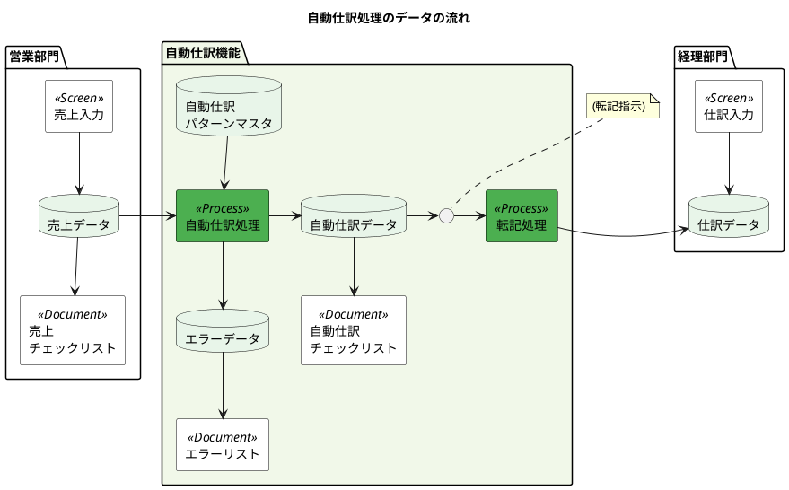

### 自動仕訳処理の流れ

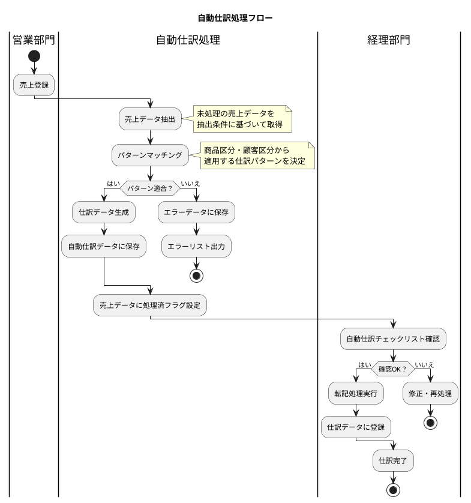

---

## 17.2 自動仕訳パターンマスタの設計

### 商品グループ × 顧客グループによる条件分岐

自動仕訳パターンマスタは、売上データから仕訳データへの変換ルールを定義するマスタテーブルです。

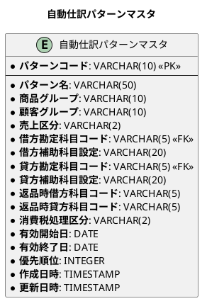

### パターンマスタの項目説明

| 項目 | 説明 | 例 |
|-----|------|-----|
| **パターンコード** | パターンを一意に識別するコード | `P001` |
| **パターン名** | パターンの名称 | `加工品売上` |
| **商品グループ** | 対象商品グループ（`ALL`は全て） | `加工品`, `生鮮品`, `ALL` |
| **顧客グループ** | 対象顧客グループ（`ALL`は全て） | `一般`, `特約店`, `ALL` |
| **売上区分** | 売上の種類 | `01`:通常売上, `02`:返品 |
| **借方勘定科目コード** | 借方に計上する勘定科目 | `11300`(売掛金) |
| **貸方勘定科目コード** | 貸方に計上する勘定科目 | `41110`(売上加工品) |
| **優先順位** | パターン適用の優先度（小さい方が優先） | `100` |

### パターンマスタのデータ例

| パターンコード | パターン名 | 商品グループ | 顧客グループ | 借方科目 | 貸方科目 | 優先順位 |
|-------------|----------|------------|------------|---------|---------|---------|
| P001 | 加工品売上（特約店） | 加工品 | 特約店 | 売掛金 | 売上加工品 | 10 |
| P002 | 加工品売上（一般） | 加工品 | ALL | 売掛金 | 売上加工品 | 20 |
| P003 | 生鮮品売上 | 生鮮品 | ALL | 売掛金 | 売上生鮮品 | 30 |
| P999 | その他売上 | ALL | ALL | 売掛金 | 売上その他 | 999 |

### 売上返品時の科目設定

返品時は通常売上と逆の仕訳が必要です。

| 取引 | 借方 | 貸方 |
|-----|-----|-----|
| **通常売上** | 売掛金 | 売上 |
| **売上返品** | 売上 | 売掛金 |

---

## 17.3 自動仕訳処理の設計

### フラグ管理方式と日付管理方式

売上データの処理状態を管理する方式には、2つのアプローチがあります。

#### フラグ管理方式

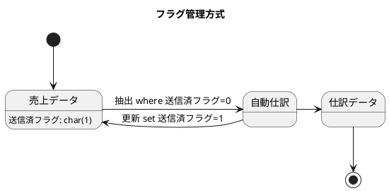

| メリット | デメリット |
|---------|----------|
| シンプルな実装 | 再処理時にフラグリセットが必要 |
| 処理状態が明確 | 大量データでの更新負荷 |

#### 日付管理方式

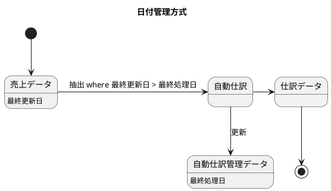

| メリット | デメリット |
|---------|----------|
| 差分処理が容易 | 管理テーブルが必要 |
| 再処理時の柔軟性 | 更新日時の整合性管理が必要 |

### セット中心のアプリケーション設計

大量データを効率的に処理するには、ループ処理よりもセット中心処理が有効です。

#### ループ処理（非効率）

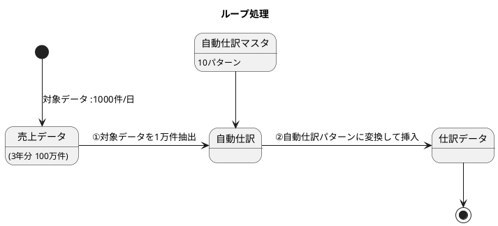

**処理方式：**
1. 売上データを1件ずつ読み込む
2. 各売上に対してパターンマスタを検索
3. 1件ずつ仕訳データを挿入

**問題点：** N × M 回のDB操作が発生（N=売上件数、M=パターン数）

#### セット中心処理（効率的）

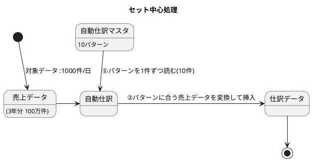

**処理方式：**
1. パターンマスタを1件読み込む（10件）
2. 該当パターンの売上データを一括 INSERT
3. パターン数分のDB操作で完了

**利点：** M 回（パターン数）のDB操作で完了

### 自動仕訳関連テーブルのER図

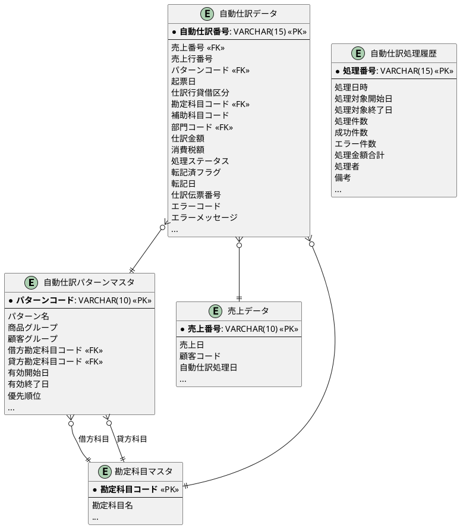

### マイグレーション：自動仕訳テーブルの作成

<details>
<summary>マイグレーションSQL</summary>

```sql
-- src/main/resources/db/migration/V007__create_auto_journal_tables.sql

-- 自動仕訳処理ステータス
CREATE TYPE 自動仕訳ステータス AS ENUM ('処理待ち', '処理中', '処理完了', '転記済', 'エラー');

-- 自動仕訳パターンマスタ
CREATE TABLE "自動仕訳パターンマスタ" (
    "パターンコード" VARCHAR(10) PRIMARY KEY,
    "パターン名" VARCHAR(50) NOT NULL,
    "商品グループ" VARCHAR(10) DEFAULT 'ALL',
    "顧客グループ" VARCHAR(10) DEFAULT 'ALL',
    "売上区分" VARCHAR(2) DEFAULT '01',
    "借方勘定科目コード" VARCHAR(5) NOT NULL,
    "借方補助科目設定" VARCHAR(20),
    "貸方勘定科目コード" VARCHAR(5) NOT NULL,
    "貸方補助科目設定" VARCHAR(20),
    "返品時借方科目コード" VARCHAR(5),
    "返品時貸方科目コード" VARCHAR(5),
    "消費税処理区分" VARCHAR(2) DEFAULT '01',
    "有効開始日" DATE DEFAULT CURRENT_DATE,
    "有効終了日" DATE DEFAULT '9999-12-31',
    "優先順位" INTEGER DEFAULT 100,
    "作成日時" TIMESTAMP DEFAULT CURRENT_TIMESTAMP NOT NULL,
    "更新日時" TIMESTAMP DEFAULT CURRENT_TIMESTAMP NOT NULL,
    CONSTRAINT "fk_自動仕訳パターン_借方科目"
        FOREIGN KEY ("借方勘定科目コード") REFERENCES "勘定科目マスタ"("勘定科目コード"),
    CONSTRAINT "fk_自動仕訳パターン_貸方科目"
        FOREIGN KEY ("貸方勘定科目コード") REFERENCES "勘定科目マスタ"("勘定科目コード")
);

-- 自動仕訳データ
CREATE TABLE "自動仕訳データ" (
    "自動仕訳番号" VARCHAR(15) PRIMARY KEY,
    "売上番号" VARCHAR(10) NOT NULL,
    "売上行番号" SMALLINT NOT NULL,
    "パターンコード" VARCHAR(10) NOT NULL,
    "起票日" DATE NOT NULL,
    "仕訳行貸借区分" 仕訳行貸借区分 NOT NULL,
    "勘定科目コード" VARCHAR(5) NOT NULL,
    "補助科目コード" VARCHAR(10),
    "部門コード" VARCHAR(5),
    "仕訳金額" DECIMAL(14,2) NOT NULL,
    "消費税額" DECIMAL(14,2) DEFAULT 0,
    "処理ステータス" 自動仕訳ステータス DEFAULT '処理待ち' NOT NULL,
    "転記済フラグ" SMALLINT DEFAULT 0,
    "転記日" DATE,
    "仕訳伝票番号" VARCHAR(10),
    "エラーコード" VARCHAR(10),
    "エラーメッセージ" VARCHAR(200),
    "作成日時" TIMESTAMP DEFAULT CURRENT_TIMESTAMP NOT NULL,
    "更新日時" TIMESTAMP DEFAULT CURRENT_TIMESTAMP NOT NULL,
    CONSTRAINT "fk_自動仕訳_パターン"
        FOREIGN KEY ("パターンコード") REFERENCES "自動仕訳パターンマスタ"("パターンコード"),
    CONSTRAINT "fk_自動仕訳_勘定科目"
        FOREIGN KEY ("勘定科目コード") REFERENCES "勘定科目マスタ"("勘定科目コード"),
    CONSTRAINT "fk_自動仕訳_部門"
        FOREIGN KEY ("部門コード") REFERENCES "部門マスタ"("部門コード")
);

-- 自動仕訳処理履歴
CREATE TABLE "自動仕訳処理履歴" (
    "処理番号" VARCHAR(15) PRIMARY KEY,
    "処理日時" TIMESTAMP NOT NULL DEFAULT CURRENT_TIMESTAMP,
    "処理対象開始日" DATE NOT NULL,
    "処理対象終了日" DATE NOT NULL,
    "処理件数" INTEGER DEFAULT 0,
    "成功件数" INTEGER DEFAULT 0,
    "エラー件数" INTEGER DEFAULT 0,
    "処理金額合計" DECIMAL(15,2) DEFAULT 0,
    "処理者" VARCHAR(50),
    "備考" TEXT,
    "作成日時" TIMESTAMP DEFAULT CURRENT_TIMESTAMP NOT NULL
);

-- インデックス
CREATE INDEX "idx_自動仕訳パターン_商品グループ" ON "自動仕訳パターンマスタ"("商品グループ");
CREATE INDEX "idx_自動仕訳パターン_顧客グループ" ON "自動仕訳パターンマスタ"("顧客グループ");
CREATE INDEX "idx_自動仕訳パターン_優先順位" ON "自動仕訳パターンマスタ"("優先順位");
CREATE INDEX "idx_自動仕訳_売上番号" ON "自動仕訳データ"("売上番号");
CREATE INDEX "idx_自動仕訳_処理ステータス" ON "自動仕訳データ"("処理ステータス");
CREATE INDEX "idx_自動仕訳_転記済フラグ" ON "自動仕訳データ"("転記済フラグ");
CREATE INDEX "idx_自動仕訳_起票日" ON "自動仕訳データ"("起票日");
```

</details>

---

## 17.4 売上伝票から仕訳伝票への転記ロジック

### 明細行の分解と集約

売上伝票の明細行を、仕訳パターンに基づいて借方・貸方に分解します。

#### 売上伝票の例

| 項目 | 値 |
|-----|-----|
| 伝票日付 | 2024/04/01 |
| 顧客 | DBMフード新宿 |
| 明細1 | いちご蒸缶（加工品）1,000個 × 1,000円 = 1,000,000円 |
| 明細2 | アスパラ（生鮮品）200個 × 10,000円 = 2,000,000円 |
| 明細3 | さざえのエスカルゴ（加工品）1,500個 × 100円 = 150,000円 |
| 合計 | 3,150,000円（税抜）+ 消費税 315,000円 = 3,465,000円（税込） |

#### 仕訳伝票への変換

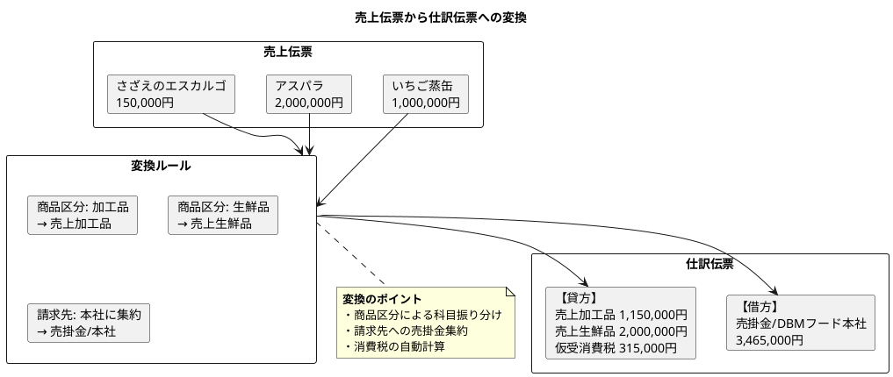

### 借方（売掛金）と貸方（売上）の展開

| 借方科目 | 借方金額 | 貸方科目 | 貸方金額 | 摘要 |
|---------|---------|---------|---------|-----|
| 売掛金/DBMフード本社 | 3,465,000 | | | 売上計上 |
| | | 売上加工品/DBMフード新宿 | 1,150,000 | いちご蒸缶・さざえ |
| | | 売上生鮮品/DBMフード新宿 | 2,000,000 | アスパラ |
| | | 仮受消費税 | 315,000 | 消費税10% |

### 消費税の按分計算

消費税額は、明細行ごとの税抜金額に比例して按分します。

```
消費税按分計算：
- 加工品合計: 1,150,000円 → 消費税: 115,000円
- 生鮮品合計: 2,000,000円 → 消費税: 200,000円
- 合計消費税: 315,000円
```

### 貸借一致の原則

仕訳データは必ず借方合計と貸方合計が一致する必要があります。

```
借方合計: 3,465,000円
貸方合計: 1,150,000 + 2,000,000 + 315,000 = 3,465,000円
→ 貸借一致 OK
```

### TDD による自動仕訳処理の実装

#### ドメイン層：エンティティ

<details>
<summary>自動仕訳ステータス Enum</summary>

```java
// src/main/java/com/example/accounting/domain/model/autojournal/AutoJournalStatus.java
package com.example.accounting.domain.model.autojournal;

import lombok.Getter;
import lombok.RequiredArgsConstructor;

@Getter
@RequiredArgsConstructor
public enum AutoJournalStatus {
    PENDING("処理待ち"),
    PROCESSING("処理中"),
    COMPLETED("処理完了"),
    POSTED("転記済"),
    ERROR("エラー");

    private final String displayName;

    public static AutoJournalStatus fromDisplayName(String displayName) {
        for (AutoJournalStatus status : values()) {
            if (status.displayName.equals(displayName)) {
                return status;
            }
        }
        throw new IllegalArgumentException("不正な自動仕訳ステータス: " + displayName);
    }
}
```

</details>

<details>
<summary>自動仕訳パターンマスタエンティティ</summary>

```java
// src/main/java/com/example/accounting/domain/model/autojournal/AutoJournalPattern.java
package com.example.accounting.domain.model.autojournal;

import lombok.AllArgsConstructor;
import lombok.Builder;
import lombok.Data;
import lombok.NoArgsConstructor;

import java.time.LocalDate;
import java.time.LocalDateTime;

@Data
@Builder
@NoArgsConstructor
@AllArgsConstructor
public class AutoJournalPattern {
    private String patternCode;           // パターンコード
    private String patternName;           // パターン名
    private String productGroup;          // 商品グループ
    private String customerGroup;         // 顧客グループ
    private String salesType;             // 売上区分
    private String debitAccountCode;      // 借方勘定科目コード
    private String debitSubAccountSetting; // 借方補助科目設定
    private String creditAccountCode;     // 貸方勘定科目コード
    private String creditSubAccountSetting; // 貸方補助科目設定
    private String returnDebitAccountCode; // 返品時借方科目コード
    private String returnCreditAccountCode; // 返品時貸方科目コード
    private String taxProcessingType;     // 消費税処理区分
    private LocalDate validFrom;          // 有効開始日
    private LocalDate validTo;            // 有効終了日
    private Integer priority;             // 優先順位
    private LocalDateTime createdAt;      // 作成日時
    private LocalDateTime updatedAt;      // 更新日時

    /**
     * 指定日付に有効かどうかを判定
     */
    public boolean isValidAt(LocalDate date) {
        return !date.isBefore(validFrom) && !date.isAfter(validTo);
    }

    /**
     * 商品グループと顧客グループにマッチするか判定
     */
    public boolean matches(String productGroup, String customerGroup) {
        boolean productMatch = "ALL".equals(this.productGroup) ||
                               this.productGroup.equals(productGroup);
        boolean customerMatch = "ALL".equals(this.customerGroup) ||
                                this.customerGroup.equals(customerGroup);
        return productMatch && customerMatch;
    }
}
```

</details>

<details>
<summary>自動仕訳データエンティティ</summary>

```java
// src/main/java/com/example/accounting/domain/model/autojournal/AutoJournalEntry.java
package com.example.accounting.domain.model.autojournal;

import com.example.accounting.domain.model.account.DebitCreditType;
import lombok.AllArgsConstructor;
import lombok.Builder;
import lombok.Data;
import lombok.NoArgsConstructor;

import java.math.BigDecimal;
import java.time.LocalDate;
import java.time.LocalDateTime;

@Data
@Builder
@NoArgsConstructor
@AllArgsConstructor
public class AutoJournalEntry {
    private String autoJournalNumber;     // 自動仕訳番号
    private String salesNumber;           // 売上番号
    private Integer salesLineNumber;      // 売上行番号
    private String patternCode;           // パターンコード
    private LocalDate postingDate;        // 起票日
    private DebitCreditType debitCreditType; // 仕訳行貸借区分
    private String accountCode;           // 勘定科目コード
    private String subAccountCode;        // 補助科目コード
    private String departmentCode;        // 部門コード
    private BigDecimal amount;            // 仕訳金額
    private BigDecimal taxAmount;         // 消費税額
    private AutoJournalStatus status;     // 処理ステータス
    private Boolean postedFlag;           // 転記済フラグ
    private LocalDate postedDate;         // 転記日
    private String journalVoucherNumber;  // 仕訳伝票番号
    private String errorCode;             // エラーコード
    private String errorMessage;          // エラーメッセージ
    private LocalDateTime createdAt;      // 作成日時
    private LocalDateTime updatedAt;      // 更新日時
}
```

</details>

<details>
<summary>自動仕訳処理履歴エンティティ</summary>

```java
// src/main/java/com/example/accounting/domain/model/autojournal/AutoJournalHistory.java
package com.example.accounting.domain.model.autojournal;

import lombok.AllArgsConstructor;
import lombok.Builder;
import lombok.Data;
import lombok.NoArgsConstructor;

import java.math.BigDecimal;
import java.time.LocalDate;
import java.time.LocalDateTime;

@Data
@Builder
@NoArgsConstructor
@AllArgsConstructor
public class AutoJournalHistory {
    private String processNumber;         // 処理番号
    private LocalDateTime processDateTime; // 処理日時
    private LocalDate targetFromDate;     // 処理対象開始日
    private LocalDate targetToDate;       // 処理対象終了日
    private Integer totalCount;           // 処理件数
    private Integer successCount;         // 成功件数
    private Integer errorCount;           // エラー件数
    private BigDecimal totalAmount;       // 処理金額合計
    private String processedBy;           // 処理者
    private String remarks;               // 備考
    private LocalDateTime createdAt;      // 作成日時
}
```

</details>

#### テストコード

<details>
<summary>自動仕訳パターンのテスト</summary>

```java
// src/test/java/com/example/accounting/domain/model/autojournal/AutoJournalPatternTest.java
package com.example.accounting.domain.model.autojournal;

import org.junit.jupiter.api.DisplayName;
import org.junit.jupiter.api.Nested;
import org.junit.jupiter.api.Test;

import java.time.LocalDate;

import static org.assertj.core.api.Assertions.*;

@DisplayName("自動仕訳パターン")
class AutoJournalPatternTest {

    @Nested
    @DisplayName("パターンマッチング")
    class PatternMatching {

        @Test
        @DisplayName("商品グループALLは全ての商品グループにマッチする")
        void shouldMatchAllProductGroups() {
            // Arrange: 商品グループALLのパターン
            var pattern = AutoJournalPattern.builder()
                .patternCode("P001")
                .productGroup("ALL")
                .customerGroup("ALL")
                .build();

            // Act & Assert
            assertThat(pattern.matches("加工品", "一般")).isTrue();
            assertThat(pattern.matches("生鮮品", "一般")).isTrue();
            assertThat(pattern.matches("雑貨", "特約店")).isTrue();
        }

        @Test
        @DisplayName("特定の商品グループのみにマッチする")
        void shouldMatchSpecificProductGroup() {
            // Arrange: 加工品専用パターン
            var pattern = AutoJournalPattern.builder()
                .patternCode("P002")
                .productGroup("加工品")
                .customerGroup("ALL")
                .build();

            // Act & Assert
            assertThat(pattern.matches("加工品", "一般")).isTrue();
            assertThat(pattern.matches("生鮮品", "一般")).isFalse();
        }

        @Test
        @DisplayName("商品グループと顧客グループの両方でマッチングする")
        void shouldMatchBothProductAndCustomerGroup() {
            // Arrange: 特定の組み合わせパターン
            var pattern = AutoJournalPattern.builder()
                .patternCode("P003")
                .productGroup("加工品")
                .customerGroup("特約店")
                .build();

            // Act & Assert
            assertThat(pattern.matches("加工品", "特約店")).isTrue();
            assertThat(pattern.matches("加工品", "一般")).isFalse();
            assertThat(pattern.matches("生鮮品", "特約店")).isFalse();
        }
    }

    @Nested
    @DisplayName("有効期間チェック")
    class ValidityCheck {

        @Test
        @DisplayName("有効期間内の日付でtrueを返す")
        void shouldReturnTrueForValidDate() {
            // Arrange
            var pattern = AutoJournalPattern.builder()
                .patternCode("P001")
                .validFrom(LocalDate.of(2024, 1, 1))
                .validTo(LocalDate.of(2024, 12, 31))
                .build();

            // Act & Assert
            assertThat(pattern.isValidAt(LocalDate.of(2024, 6, 15))).isTrue();
            assertThat(pattern.isValidAt(LocalDate.of(2024, 1, 1))).isTrue();
            assertThat(pattern.isValidAt(LocalDate.of(2024, 12, 31))).isTrue();
        }

        @Test
        @DisplayName("有効期間外の日付でfalseを返す")
        void shouldReturnFalseForInvalidDate() {
            // Arrange
            var pattern = AutoJournalPattern.builder()
                .patternCode("P001")
                .validFrom(LocalDate.of(2024, 1, 1))
                .validTo(LocalDate.of(2024, 12, 31))
                .build();

            // Act & Assert
            assertThat(pattern.isValidAt(LocalDate.of(2023, 12, 31))).isFalse();
            assertThat(pattern.isValidAt(LocalDate.of(2025, 1, 1))).isFalse();
        }
    }
}
```

</details>

#### アプリケーション層（Output Port）

<details>
<summary>自動仕訳リポジトリインターフェース</summary>

```java
// src/main/java/com/example/accounting/application/port/out/AutoJournalRepository.java
package com.example.accounting.application.port.out;

import com.example.accounting.domain.model.autojournal.*;

import java.time.LocalDate;
import java.util.List;
import java.util.Optional;

/**
 * 自動仕訳リポジトリ（Output Port）
 */
public interface AutoJournalRepository {

    // パターンマスタ操作
    void savePattern(AutoJournalPattern pattern);

    Optional<AutoJournalPattern> findPatternByCode(String patternCode);

    List<AutoJournalPattern> findAllPatterns();

    List<AutoJournalPattern> findValidPatterns(LocalDate date);

    void updatePattern(AutoJournalPattern pattern);

    void deletePattern(String patternCode);

    // 自動仕訳エントリ操作
    void saveEntry(AutoJournalEntry entry);

    Optional<AutoJournalEntry> findEntryByNumber(String autoJournalNumber);

    List<AutoJournalEntry> findEntriesBySalesNumber(String salesNumber);

    List<AutoJournalEntry> findUnpostedEntries();

    List<AutoJournalEntry> findUnpostedEntriesByDate(LocalDate date);

    List<AutoJournalEntry> findEntriesByStatus(AutoJournalStatus status);

    void updateEntry(AutoJournalEntry entry);

    // 処理履歴操作
    void saveHistory(AutoJournalHistory history);

    Optional<AutoJournalHistory> findHistoryByNumber(String processNumber);

    List<AutoJournalHistory> findHistoriesByDateRange(LocalDate fromDate, LocalDate toDate);
}
```

</details>

---

## 17.5 リレーションと楽観ロックの設計

### MyBatis ネストした ResultMap によるリレーション設定

自動仕訳データは、自動仕訳パターンマスタを参照し、売上データとの関連を持ちます。MyBatis でこれらの関係を効率的に取得するためのリレーション設定を実装します。

#### ネストした ResultMap の定義

<details>
<summary>AutoJournalMapper.xml（リレーション設定）</summary>

```xml
<?xml version="1.0" encoding="UTF-8" ?>
<!DOCTYPE mapper PUBLIC "-//mybatis.org//DTD Mapper 3.0//EN"
        "http://mybatis.org/dtd/mybatis-3-mapper.dtd">

<!-- src/main/resources/mapper/AutoJournalMapper.xml -->
<mapper namespace="com.example.fas.infrastructure.persistence.mapper.AutoJournalMapper">

    <!-- 自動仕訳パターンマスタ ResultMap -->
    <resultMap id="autoJournalPatternResultMap" type="com.example.fas.domain.model.autojournal.AutoJournalPattern">
        <id property="patternCode" column="パターンコード"/>
        <result property="patternName" column="パターン名"/>
        <result property="productGroup" column="商品グループ"/>
        <result property="customerGroup" column="顧客グループ"/>
        <result property="salesType" column="売上区分"/>
        <result property="debitAccountCode" column="借方勘定科目コード"/>
        <result property="debitSubAccountSetting" column="借方補助科目設定"/>
        <result property="creditAccountCode" column="貸方勘定科目コード"/>
        <result property="creditSubAccountSetting" column="貸方補助科目設定"/>
        <result property="returnDebitAccountCode" column="返品時借方科目コード"/>
        <result property="returnCreditAccountCode" column="返品時貸方科目コード"/>
        <result property="taxProcessingType" column="消費税処理区分"/>
        <result property="validFrom" column="有効開始日"/>
        <result property="validTo" column="有効終了日"/>
        <result property="priority" column="優先順位"/>
        <result property="version" column="バージョン"/>
        <result property="createdAt" column="作成日時"/>
        <result property="updatedAt" column="更新日時"/>
    </resultMap>

    <!-- 自動仕訳データ ResultMap（パターン情報込み） -->
    <resultMap id="autoJournalEntryWithPatternResultMap" type="com.example.fas.domain.model.autojournal.AutoJournalEntry">
        <id property="autoJournalNumber" column="e_自動仕訳番号"/>
        <result property="salesNumber" column="e_売上番号"/>
        <result property="salesLineNumber" column="e_売上行番号"/>
        <result property="patternCode" column="e_パターンコード"/>
        <result property="postingDate" column="e_起票日"/>
        <result property="debitCreditType" column="e_仕訳行貸借区分"
                typeHandler="com.example.fas.infrastructure.persistence.typehandler.DebitCreditTypeHandler"/>
        <result property="accountCode" column="e_勘定科目コード"/>
        <result property="subAccountCode" column="e_補助科目コード"/>
        <result property="departmentCode" column="e_部門コード"/>
        <result property="amount" column="e_仕訳金額"/>
        <result property="taxAmount" column="e_消費税額"/>
        <result property="status" column="e_処理ステータス"
                typeHandler="com.example.fas.infrastructure.persistence.typehandler.AutoJournalStatusTypeHandler"/>
        <result property="postedFlag" column="e_転記済フラグ"/>
        <result property="postedDate" column="e_転記日"/>
        <result property="journalVoucherNumber" column="e_仕訳伝票番号"/>
        <result property="errorCode" column="e_エラーコード"/>
        <result property="errorMessage" column="e_エラーメッセージ"/>
        <result property="version" column="e_バージョン"/>
        <result property="createdAt" column="e_作成日時"/>
        <result property="updatedAt" column="e_更新日時"/>
        <!-- パターン情報との関連 -->
        <association property="pattern" javaType="com.example.fas.domain.model.autojournal.AutoJournalPattern">
            <id property="patternCode" column="p_パターンコード"/>
            <result property="patternName" column="p_パターン名"/>
            <result property="productGroup" column="p_商品グループ"/>
            <result property="customerGroup" column="p_顧客グループ"/>
            <result property="debitAccountCode" column="p_借方勘定科目コード"/>
            <result property="creditAccountCode" column="p_貸方勘定科目コード"/>
            <result property="priority" column="p_優先順位"/>
        </association>
    </resultMap>

    <!-- 自動仕訳処理履歴 ResultMap -->
    <resultMap id="autoJournalHistoryResultMap" type="com.example.fas.domain.model.autojournal.AutoJournalHistory">
        <id property="processNumber" column="処理番号"/>
        <result property="processDateTime" column="処理日時"/>
        <result property="targetFromDate" column="処理対象開始日"/>
        <result property="targetToDate" column="処理対象終了日"/>
        <result property="totalCount" column="処理件数"/>
        <result property="successCount" column="成功件数"/>
        <result property="errorCount" column="エラー件数"/>
        <result property="totalAmount" column="処理金額合計"/>
        <result property="processedBy" column="処理者"/>
        <result property="remarks" column="備考"/>
        <result property="version" column="バージョン"/>
        <result property="createdAt" column="作成日時"/>
    </resultMap>

    <!-- JOIN による自動仕訳データとパターンの一括取得クエリ -->
    <select id="findEntryWithPatternByNumber" resultMap="autoJournalEntryWithPatternResultMap">
        SELECT
            e."自動仕訳番号" AS e_自動仕訳番号,
            e."売上番号" AS e_売上番号,
            e."売上行番号" AS e_売上行番号,
            e."パターンコード" AS e_パターンコード,
            e."起票日" AS e_起票日,
            e."仕訳行貸借区分" AS e_仕訳行貸借区分,
            e."勘定科目コード" AS e_勘定科目コード,
            e."補助科目コード" AS e_補助科目コード,
            e."部門コード" AS e_部門コード,
            e."仕訳金額" AS e_仕訳金額,
            e."消費税額" AS e_消費税額,
            e."処理ステータス" AS e_処理ステータス,
            e."転記済フラグ" AS e_転記済フラグ,
            e."転記日" AS e_転記日,
            e."仕訳伝票番号" AS e_仕訳伝票番号,
            e."エラーコード" AS e_エラーコード,
            e."エラーメッセージ" AS e_エラーメッセージ,
            e."バージョン" AS e_バージョン,
            e."作成日時" AS e_作成日時,
            e."更新日時" AS e_更新日時,
            p."パターンコード" AS p_パターンコード,
            p."パターン名" AS p_パターン名,
            p."商品グループ" AS p_商品グループ,
            p."顧客グループ" AS p_顧客グループ,
            p."借方勘定科目コード" AS p_借方勘定科目コード,
            p."貸方勘定科目コード" AS p_貸方勘定科目コード,
            p."優先順位" AS p_優先順位
        FROM "自動仕訳データ" e
        LEFT JOIN "自動仕訳パターンマスタ" p ON e."パターンコード" = p."パターンコード"
        WHERE e."自動仕訳番号" = #{autoJournalNumber}
    </select>

    <!-- 未転記の自動仕訳データをパターン情報付きで取得 -->
    <select id="findUnpostedEntriesWithPattern" resultMap="autoJournalEntryWithPatternResultMap">
        SELECT
            e."自動仕訳番号" AS e_自動仕訳番号,
            e."売上番号" AS e_売上番号,
            e."売上行番号" AS e_売上行番号,
            e."パターンコード" AS e_パターンコード,
            e."起票日" AS e_起票日,
            e."仕訳行貸借区分" AS e_仕訳行貸借区分,
            e."勘定科目コード" AS e_勘定科目コード,
            e."補助科目コード" AS e_補助科目コード,
            e."部門コード" AS e_部門コード,
            e."仕訳金額" AS e_仕訳金額,
            e."消費税額" AS e_消費税額,
            e."処理ステータス" AS e_処理ステータス,
            e."転記済フラグ" AS e_転記済フラグ,
            e."転記日" AS e_転記日,
            e."仕訳伝票番号" AS e_仕訳伝票番号,
            e."エラーコード" AS e_エラーコード,
            e."エラーメッセージ" AS e_エラーメッセージ,
            e."バージョン" AS e_バージョン,
            e."作成日時" AS e_作成日時,
            e."更新日時" AS e_更新日時,
            p."パターンコード" AS p_パターンコード,
            p."パターン名" AS p_パターン名,
            p."商品グループ" AS p_商品グループ,
            p."顧客グループ" AS p_顧客グループ,
            p."借方勘定科目コード" AS p_借方勘定科目コード,
            p."貸方勘定科目コード" AS p_貸方勘定科目コード,
            p."優先順位" AS p_優先順位
        FROM "自動仕訳データ" e
        LEFT JOIN "自動仕訳パターンマスタ" p ON e."パターンコード" = p."パターンコード"
        WHERE e."転記済フラグ" = 0
        AND e."処理ステータス" = '処理完了'
        ORDER BY e."起票日", e."自動仕訳番号"
    </select>

</mapper>
```

</details>

#### リレーション設定のポイント

| 設定項目 | 説明 |
|---------|------|
| `<association>` | N:1 関連のマッピング（自動仕訳データ → パターンマスタ） |
| `<id>` | 主キーの識別 |
| `resultMap` | ネストした ResultMap の参照 |
| エイリアス（AS） | カラム名の重複を避けるためのプレフィックス（e_, p_） |
| `ORDER BY` | 取得順序の保証 |

### 楽観ロックの実装

自動仕訳データは複数の処理（生成、転記、エラー修正）で更新されるため、楽観ロックによる整合性確保が重要です。

#### Flyway マイグレーション: バージョンカラム追加

<details>
<summary>V008__add_auto_journal_version_columns.sql</summary>

```sql
-- src/main/resources/db/migration/V008__add_auto_journal_version_columns.sql

-- 自動仕訳パターンマスタにバージョンカラムを追加
ALTER TABLE "自動仕訳パターンマスタ" ADD COLUMN "バージョン" INTEGER DEFAULT 1 NOT NULL;

-- 自動仕訳データにバージョンカラムを追加
ALTER TABLE "自動仕訳データ" ADD COLUMN "バージョン" INTEGER DEFAULT 1 NOT NULL;

-- 自動仕訳処理履歴にバージョンカラムを追加
ALTER TABLE "自動仕訳処理履歴" ADD COLUMN "バージョン" INTEGER DEFAULT 1 NOT NULL;

-- コメント追加
COMMENT ON COLUMN "自動仕訳パターンマスタ"."バージョン" IS '楽観ロック用バージョン番号';
COMMENT ON COLUMN "自動仕訳データ"."バージョン" IS '楽観ロック用バージョン番号';
COMMENT ON COLUMN "自動仕訳処理履歴"."バージョン" IS '楽観ロック用バージョン番号';
```

</details>

#### エンティティへのバージョンフィールド追加

<details>
<summary>AutoJournalEntry.java（バージョンフィールド追加）</summary>

```java
// src/main/java/com/example/fas/domain/model/autojournal/AutoJournalEntry.java
package com.example.fas.domain.model.autojournal;

import com.example.fas.domain.model.account.DebitCreditType;
import lombok.AllArgsConstructor;
import lombok.Builder;
import lombok.Data;
import lombok.NoArgsConstructor;

import java.math.BigDecimal;
import java.time.LocalDate;
import java.time.LocalDateTime;

@Data
@Builder
@NoArgsConstructor
@AllArgsConstructor
public class AutoJournalEntry {
    private String autoJournalNumber;     // 自動仕訳番号
    private String salesNumber;           // 売上番号
    private Integer salesLineNumber;      // 売上行番号
    private String patternCode;           // パターンコード
    private LocalDate postingDate;        // 起票日
    private DebitCreditType debitCreditType; // 仕訳行貸借区分
    private String accountCode;           // 勘定科目コード
    private String subAccountCode;        // 補助科目コード
    private String departmentCode;        // 部門コード
    private BigDecimal amount;            // 仕訳金額
    private BigDecimal taxAmount;         // 消費税額
    private AutoJournalStatus status;     // 処理ステータス
    private Boolean postedFlag;           // 転記済フラグ
    private LocalDate postedDate;         // 転記日
    private String journalVoucherNumber;  // 仕訳伝票番号
    private String errorCode;             // エラーコード
    private String errorMessage;          // エラーメッセージ
    private LocalDateTime createdAt;      // 作成日時
    private LocalDateTime updatedAt;      // 更新日時

    // 楽観ロック用バージョン
    @Builder.Default
    private Integer version = 1;

    // パターン情報（リレーション）
    private AutoJournalPattern pattern;
}
```

</details>

#### MyBatis Mapper: 楽観ロック対応の更新

<details>
<summary>AutoJournalMapper.xml（楽観ロック対応 UPDATE）</summary>

```xml
<!-- 楽観ロック対応の自動仕訳データ更新（ステータス変更） -->
<update id="updateEntryWithOptimisticLock" parameterType="com.example.fas.domain.model.autojournal.AutoJournalEntry">
    UPDATE "自動仕訳データ"
    SET
        "処理ステータス" = #{status, typeHandler=com.example.fas.infrastructure.persistence.typehandler.AutoJournalStatusTypeHandler}::自動仕訳ステータス,
        "転記済フラグ" = #{postedFlag},
        "転記日" = #{postedDate},
        "仕訳伝票番号" = #{journalVoucherNumber},
        "エラーコード" = #{errorCode},
        "エラーメッセージ" = #{errorMessage},
        "更新日時" = CURRENT_TIMESTAMP,
        "バージョン" = "バージョン" + 1
    WHERE "自動仕訳番号" = #{autoJournalNumber}
    AND "バージョン" = #{version}
</update>

<!-- 楽観ロック対応のパターンマスタ更新 -->
<update id="updatePatternWithOptimisticLock" parameterType="com.example.fas.domain.model.autojournal.AutoJournalPattern">
    UPDATE "自動仕訳パターンマスタ"
    SET
        "パターン名" = #{patternName},
        "商品グループ" = #{productGroup},
        "顧客グループ" = #{customerGroup},
        "売上区分" = #{salesType},
        "借方勘定科目コード" = #{debitAccountCode},
        "借方補助科目設定" = #{debitSubAccountSetting},
        "貸方勘定科目コード" = #{creditAccountCode},
        "貸方補助科目設定" = #{creditSubAccountSetting},
        "返品時借方科目コード" = #{returnDebitAccountCode},
        "返品時貸方科目コード" = #{returnCreditAccountCode},
        "消費税処理区分" = #{taxProcessingType},
        "有効開始日" = #{validFrom},
        "有効終了日" = #{validTo},
        "優先順位" = #{priority},
        "更新日時" = CURRENT_TIMESTAMP,
        "バージョン" = "バージョン" + 1
    WHERE "パターンコード" = #{patternCode}
    AND "バージョン" = #{version}
</update>

<!-- バージョンのみ取得 -->
<select id="findEntryVersionByNumber" resultType="Integer">
    SELECT "バージョン" FROM "自動仕訳データ"
    WHERE "自動仕訳番号" = #{autoJournalNumber}
</select>

<select id="findPatternVersionByCode" resultType="Integer">
    SELECT "バージョン" FROM "自動仕訳パターンマスタ"
    WHERE "パターンコード" = #{patternCode}
</select>
```

</details>

#### Repository 実装: 楽観ロック対応

<details>
<summary>AutoJournalRepositoryImpl.java（楽観ロック対応）</summary>

```java
// src/main/java/com/example/fas/infrastructure/persistence/repository/AutoJournalRepositoryImpl.java
package com.example.fas.infrastructure.persistence.repository;

import com.example.fas.application.port.out.AutoJournalRepository;
import com.example.fas.domain.exception.OptimisticLockException;
import com.example.fas.domain.model.autojournal.*;
import com.example.fas.infrastructure.persistence.mapper.AutoJournalMapper;
import lombok.RequiredArgsConstructor;
import org.springframework.stereotype.Repository;
import org.springframework.transaction.annotation.Transactional;

import java.time.LocalDate;
import java.util.List;
import java.util.Optional;

@Repository
@RequiredArgsConstructor
public class AutoJournalRepositoryImpl implements AutoJournalRepository {

    private final AutoJournalMapper mapper;

    @Override
    @Transactional
    public void updateEntry(AutoJournalEntry entry) {
        int updatedCount = mapper.updateEntryWithOptimisticLock(entry);

        if (updatedCount == 0) {
            Integer currentVersion = mapper.findEntryVersionByNumber(entry.getAutoJournalNumber());
            if (currentVersion == null) {
                throw new OptimisticLockException("自動仕訳データ", entry.getAutoJournalNumber());
            } else {
                throw new OptimisticLockException("自動仕訳データ", entry.getAutoJournalNumber(),
                        entry.getVersion(), currentVersion);
            }
        }
    }

    @Override
    @Transactional
    public void updatePattern(AutoJournalPattern pattern) {
        int updatedCount = mapper.updatePatternWithOptimisticLock(pattern);

        if (updatedCount == 0) {
            Integer currentVersion = mapper.findPatternVersionByCode(pattern.getPatternCode());
            if (currentVersion == null) {
                throw new OptimisticLockException("自動仕訳パターン", pattern.getPatternCode());
            } else {
                throw new OptimisticLockException("自動仕訳パターン", pattern.getPatternCode(),
                        pattern.getVersion(), currentVersion);
            }
        }
    }

    @Override
    public Optional<AutoJournalEntry> findEntryWithPatternByNumber(String autoJournalNumber) {
        return Optional.ofNullable(mapper.findEntryWithPatternByNumber(autoJournalNumber));
    }

    @Override
    public List<AutoJournalEntry> findUnpostedEntriesWithPattern() {
        return mapper.findUnpostedEntriesWithPattern();
    }

    // その他のメソッド...
}
```

</details>

#### TDD: 楽観ロックのテスト

<details>
<summary>AutoJournalRepositoryOptimisticLockTest.java</summary>

```java
// src/test/java/com/example/fas/infrastructure/persistence/repository/AutoJournalRepositoryOptimisticLockTest.java
package com.example.fas.infrastructure.persistence.repository;

import com.example.fas.application.port.out.AutoJournalRepository;
import com.example.fas.domain.exception.OptimisticLockException;
import com.example.fas.domain.model.account.DebitCreditType;
import com.example.fas.domain.model.autojournal.*;
import com.example.fas.testsetup.BaseIntegrationTest;
import org.junit.jupiter.api.*;
import org.springframework.beans.factory.annotation.Autowired;

import java.math.BigDecimal;
import java.time.LocalDate;

import static org.assertj.core.api.Assertions.*;

@DisplayName("自動仕訳リポジトリ - 楽観ロック")
class AutoJournalRepositoryOptimisticLockTest extends BaseIntegrationTest {

    @Autowired
    private AutoJournalRepository autoJournalRepository;

    @BeforeEach
    void setUp() {
        // テストデータのクリーンアップ
    }

    @Nested
    @DisplayName("自動仕訳データの楽観ロック")
    class AutoJournalEntryOptimisticLocking {

        @Test
        @DisplayName("同じバージョンで更新できる")
        void canUpdateWithSameVersion() {
            // Arrange
            var entry = createTestEntry("AJ0001");
            autoJournalRepository.saveEntry(entry);

            // Act
            var fetched = autoJournalRepository.findEntryByNumber("AJ0001").get();
            fetched.setStatus(AutoJournalStatus.COMPLETED);
            autoJournalRepository.updateEntry(fetched);

            // Assert
            var updated = autoJournalRepository.findEntryByNumber("AJ0001").get();
            assertThat(updated.getStatus()).isEqualTo(AutoJournalStatus.COMPLETED);
            assertThat(updated.getVersion()).isEqualTo(2);
        }

        @Test
        @DisplayName("異なるバージョンで更新すると楽観ロック例外が発生する")
        void throwsExceptionWhenVersionMismatch() {
            // Arrange
            var entry = createTestEntry("AJ0002");
            autoJournalRepository.saveEntry(entry);

            // 処理Aが取得
            var entryA = autoJournalRepository.findEntryByNumber("AJ0002").get();
            // 処理Bが取得
            var entryB = autoJournalRepository.findEntryByNumber("AJ0002").get();

            // 処理Aが転記処理（成功）
            entryA.setStatus(AutoJournalStatus.POSTED);
            entryA.setPostedFlag(true);
            entryA.setPostedDate(LocalDate.now());
            autoJournalRepository.updateEntry(entryA);

            // Act & Assert: 処理Bが古いバージョンで更新（失敗）
            entryB.setStatus(AutoJournalStatus.ERROR);
            assertThatThrownBy(() -> autoJournalRepository.updateEntry(entryB))
                    .isInstanceOf(OptimisticLockException.class)
                    .hasMessageContaining("他のユーザーによって更新されています");
        }
    }

    @Nested
    @DisplayName("自動仕訳パターンの楽観ロック")
    class AutoJournalPatternOptimisticLocking {

        @Test
        @DisplayName("パターンマスタを同じバージョンで更新できる")
        void canUpdatePatternWithSameVersion() {
            // Arrange
            var pattern = createTestPattern("P001");
            autoJournalRepository.savePattern(pattern);

            // Act
            var fetched = autoJournalRepository.findPatternByCode("P001").get();
            fetched.setPriority(50);
            autoJournalRepository.updatePattern(fetched);

            // Assert
            var updated = autoJournalRepository.findPatternByCode("P001").get();
            assertThat(updated.getPriority()).isEqualTo(50);
            assertThat(updated.getVersion()).isEqualTo(2);
        }

        @Test
        @DisplayName("パターンマスタの同時更新で楽観ロック例外が発生する")
        void throwsExceptionWhenPatternVersionMismatch() {
            // Arrange
            var pattern = createTestPattern("P002");
            autoJournalRepository.savePattern(pattern);

            var patternA = autoJournalRepository.findPatternByCode("P002").get();
            var patternB = autoJournalRepository.findPatternByCode("P002").get();

            // ユーザーAが更新（成功）
            patternA.setPatternName("更新後パターン名A");
            autoJournalRepository.updatePattern(patternA);

            // Act & Assert: ユーザーBが古いバージョンで更新（失敗）
            patternB.setPatternName("更新後パターン名B");
            assertThatThrownBy(() -> autoJournalRepository.updatePattern(patternB))
                    .isInstanceOf(OptimisticLockException.class)
                    .hasMessageContaining("他のユーザーによって更新されています");
        }
    }

    private AutoJournalEntry createTestEntry(String autoJournalNumber) {
        return AutoJournalEntry.builder()
                .autoJournalNumber(autoJournalNumber)
                .salesNumber("S0001")
                .salesLineNumber(1)
                .patternCode("P001")
                .postingDate(LocalDate.of(2024, 4, 1))
                .debitCreditType(DebitCreditType.DEBIT)
                .accountCode("11300")
                .amount(new BigDecimal("100000"))
                .taxAmount(new BigDecimal("10000"))
                .status(AutoJournalStatus.PENDING)
                .postedFlag(false)
                .build();
    }

    private AutoJournalPattern createTestPattern(String patternCode) {
        return AutoJournalPattern.builder()
                .patternCode(patternCode)
                .patternName("テストパターン")
                .productGroup("ALL")
                .customerGroup("ALL")
                .salesType("01")
                .debitAccountCode("11300")
                .creditAccountCode("41100")
                .validFrom(LocalDate.of(2024, 1, 1))
                .validTo(LocalDate.of(9999, 12, 31))
                .priority(100)
                .build();
    }
}
```

</details>

#### 楽観ロックのベストプラクティス

| ポイント | 説明 |
|---------|------|
| **バージョンカラム** | INTEGER 型で十分 |
| **WHERE 条件** | 必ず `AND "バージョン" = #{version}` を含める |
| **インクリメント** | `"バージョン" = "バージョン" + 1` でアトミックに更新 |
| **例外処理** | 更新件数が0の場合は楽観ロック例外をスロー |
| **転記処理での注意** | 一括転記時は各エントリごとにバージョンチェック |

### 自動仕訳処理における整合性確保

自動仕訳処理は複数のフェーズ（生成 → 確認 → 転記）を経るため、各フェーズでの整合性確保が重要です。

#### 処理フェーズとロック戦略

| フェーズ | 処理内容 | ロック戦略 |
|---------|---------|----------|
| **生成** | 売上データから自動仕訳データを生成 | 売上データのフラグ更新に楽観ロック |
| **確認** | 自動仕訳チェックリストの確認・修正 | 自動仕訳データの更新に楽観ロック |
| **転記** | 自動仕訳データを仕訳データに転記 | ステータス遷移に楽観ロック |

#### ステータス遷移と楽観ロック

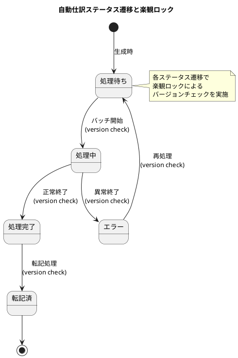

#### 一括転記時の楽観ロック

一括転記処理では、個別のエントリごとにバージョンチェックを行います。

```java
@Transactional
public PostingResult postAutoJournalEntries(List<String> autoJournalNumbers) {
    var result = new PostingResult();

    for (String number : autoJournalNumbers) {
        try {
            var entry = autoJournalRepository.findEntryByNumber(number)
                .orElseThrow(() -> new EntityNotFoundException("自動仕訳", number));

            // 仕訳データを生成
            var journal = createJournalFromEntry(entry);
            journalRepository.save(journal);

            // 転記済に更新（楽観ロック）
            entry.setStatus(AutoJournalStatus.POSTED);
            entry.setPostedFlag(true);
            entry.setPostedDate(LocalDate.now());
            entry.setJournalVoucherNumber(journal.getJournalVoucherNumber());
            autoJournalRepository.updateEntry(entry);  // バージョンチェック

            result.addSuccess(number);
        } catch (OptimisticLockException e) {
            // 他のプロセスで既に処理済み
            result.addSkipped(number, "既に処理されています");
        } catch (Exception e) {
            result.addError(number, e.getMessage());
        }
    }

    return result;
}
```

---

## 第17章のまとめ

### 作成したテーブル

| テーブル名 | 説明 |
|----------|------|
| `自動仕訳パターンマスタ` | 売上データから仕訳データへの変換ルール |
| `自動仕訳データ` | 変換された仕訳データ（転記前の中間データ） |
| `自動仕訳処理履歴` | 自動仕訳処理の実行履歴 |

### ER図

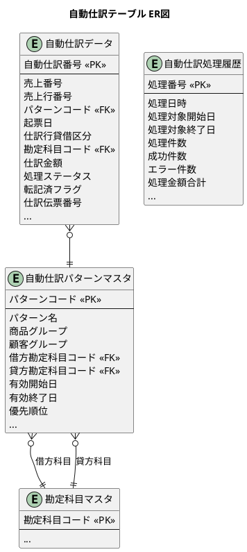

### 設計のポイント

1. **パターンマッチング**: 商品グループ × 顧客グループで仕訳パターンを自動判定
2. **優先順位**: 複数パターンが該当する場合は優先順位で決定
3. **有効期間管理**: パターンの有効開始日・終了日で期間管理
4. **セット中心処理**: 大量データを効率的に処理
5. **中間テーブル**: 転記前の自動仕訳データを保持して確認可能
6. **処理履歴**: 自動仕訳処理の実行履歴を記録
7. **エラー管理**: パターン不適合時のエラー情報を記録

### ドメインロジック

| メソッド | 説明 |
|---------|------|
| `isValidAt(date)` | 指定日付に有効かどうかを判定 |
| `matches(productGroup, customerGroup)` | 商品グループと顧客グループにマッチするか判定 |

---

## 次章の予告

第18章では、勘定科目残高の設計に進みます。日次残高・月次残高の管理、残高更新のタイミング、合計残高試算表の出力を TDD で実装していきます。
