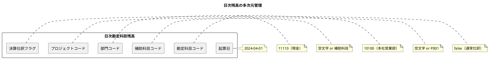
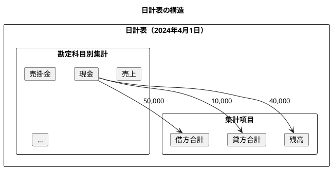
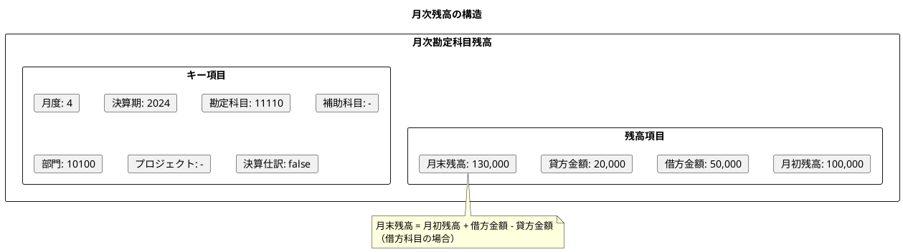
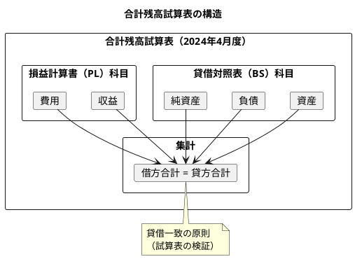
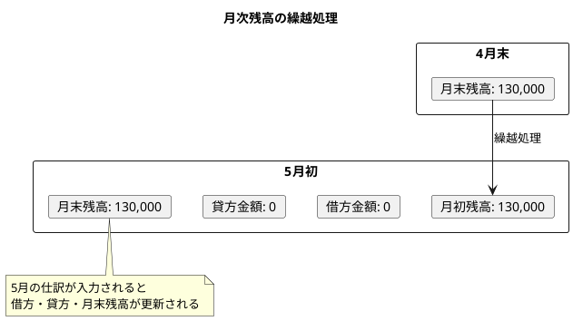
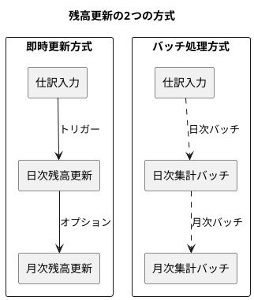
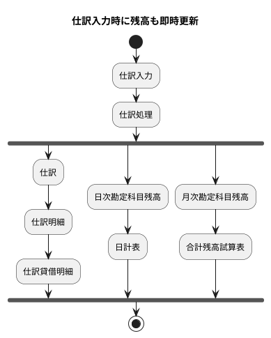
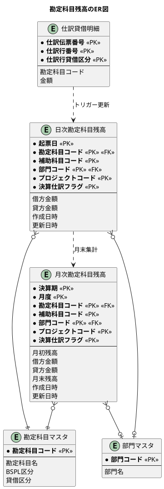
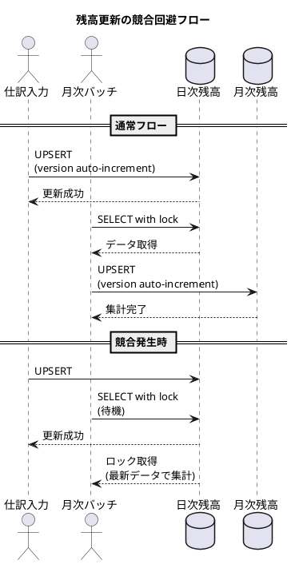

# 第18章 勘定科目残高の設計

## 概要

本章では、財務会計システムにおける勘定科目残高の設計を行います。残高管理は、仕訳データから各勘定科目の現在残高を効率的に把握するための仕組みです。日次残高と月次残高の2階層で管理し、日計表や合計残高試算表の出力に対応します。

## 18.1 日次勘定科目残高の設計

### 18.1.1 日次残高テーブルの設計方針

日次勘定科目残高は、仕訳データを起票日単位で集計した結果を保持するテーブルです。仕訳伝票を登録するたびに都度集計するのではなく、事前集計テーブルとして残高を保持することで、日計表の出力を高速化します。



### 18.1.2 複合主キーによる多次元管理

日次残高テーブルは、以下の6つのカラムで複合主キーを構成します。

| カラム | 説明 | 例 |
|--------|------|-----|
| 起票日 | 仕訳の起票日 | 2024-04-01 |
| 勘定科目コード | 勘定科目マスタのコード | 11110 |
| 補助科目コード | 補助的な分類（空文字可） | 空文字 |
| 部門コード | 部門マスタのコード | 10100 |
| プロジェクトコード | プロジェクト単位管理（空文字可） | P001 |
| 決算仕訳フラグ | 決算仕訳か否か | false |

この設計により、同じ勘定科目でも以下の粒度で残高を分けて管理できます。

- 部門別の売上高
- プロジェクト別の原価
- 通常仕訳と決算仕訳の分離

### 18.1.3 マイグレーション

<details>
<summary>V018__create_daily_account_balance_table.sql</summary>

```sql
-- V018__create_daily_account_balance_table.sql

-- 日次勘定科目残高テーブル
CREATE TABLE IF NOT EXISTS "日次勘定科目残高" (
    "起票日"               DATE NOT NULL,
    "勘定科目コード"        VARCHAR(10) NOT NULL,
    "補助科目コード"        VARCHAR(10) NOT NULL DEFAULT '',
    "部門コード"            VARCHAR(10) NOT NULL DEFAULT '00000',
    "プロジェクトコード"    VARCHAR(20) NOT NULL DEFAULT '',
    "決算仕訳フラグ"        BOOLEAN NOT NULL DEFAULT FALSE,
    "借方金額"             DECIMAL(15, 0) NOT NULL DEFAULT 0,
    "貸方金額"             DECIMAL(15, 0) NOT NULL DEFAULT 0,
    "作成日時"             TIMESTAMP NOT NULL DEFAULT CURRENT_TIMESTAMP,
    "更新日時"             TIMESTAMP NOT NULL DEFAULT CURRENT_TIMESTAMP,
    PRIMARY KEY (
        "起票日", "勘定科目コード", "補助科目コード",
        "部門コード", "プロジェクトコード", "決算仕訳フラグ"
    ),
    FOREIGN KEY ("勘定科目コード") REFERENCES "勘定科目マスタ"("勘定科目コード"),
    FOREIGN KEY ("部門コード") REFERENCES "部門マスタ"("部門コード")
);

-- インデックス
CREATE INDEX idx_daily_balance_date ON "日次勘定科目残高"("起票日");
CREATE INDEX idx_daily_balance_account ON "日次勘定科目残高"("勘定科目コード");
CREATE INDEX idx_daily_balance_dept ON "日次勘定科目残高"("部門コード");

-- UPSERT用トリガー関数
CREATE OR REPLACE FUNCTION upsert_daily_account_balance()
RETURNS TRIGGER AS $$
BEGIN
    INSERT INTO "日次勘定科目残高" (
        "起票日", "勘定科目コード", "補助科目コード",
        "部門コード", "プロジェクトコード", "決算仕訳フラグ",
        "借方金額", "貸方金額"
    ) VALUES (
        NEW."起票日",
        NEW."勘定科目コード",
        COALESCE(NEW."補助科目コード", ''),
        COALESCE(NEW."部門コード", '00000'),
        COALESCE(NEW."プロジェクトコード", ''),
        COALESCE(NEW."決算仕訳フラグ", FALSE),
        CASE WHEN NEW."貸借区分" = '借方' THEN NEW."金額" ELSE 0 END,
        CASE WHEN NEW."貸借区分" = '貸方' THEN NEW."金額" ELSE 0 END
    )
    ON CONFLICT (
        "起票日", "勘定科目コード", "補助科目コード",
        "部門コード", "プロジェクトコード", "決算仕訳フラグ"
    )
    DO UPDATE SET
        "借方金額" = "日次勘定科目残高"."借方金額" +
            CASE WHEN NEW."貸借区分" = '借方' THEN NEW."金額" ELSE 0 END,
        "貸方金額" = "日次勘定科目残高"."貸方金額" +
            CASE WHEN NEW."貸借区分" = '貸方' THEN NEW."金額" ELSE 0 END,
        "更新日時" = CURRENT_TIMESTAMP;
    RETURN NEW;
END;
$$ LANGUAGE plpgsql;

COMMENT ON TABLE "日次勘定科目残高" IS '仕訳データを起票日単位で集計した残高テーブル';
```

</details>

### 18.1.4 ドメインモデル

<details>
<summary>DailyAccountBalance エンティティ</summary>

```java
// src/main/java/com/example/sms/domain/model/accounting/DailyAccountBalance.java
package com.example.sms.domain.model.accounting;

import lombok.*;

import java.math.BigDecimal;
import java.time.LocalDate;
import java.time.LocalDateTime;

/**
 * 日次勘定科目残高エンティティ
 */
@Data
@Builder
@NoArgsConstructor
@AllArgsConstructor
public class DailyAccountBalance {
    private LocalDate postingDate;           // 起票日
    private String accountCode;              // 勘定科目コード
    private String subAccountCode;           // 補助科目コード
    private String departmentCode;           // 部門コード
    private String projectCode;              // プロジェクトコード
    private Boolean closingJournalFlag;      // 決算仕訳フラグ
    private BigDecimal debitAmount;          // 借方金額
    private BigDecimal creditAmount;         // 貸方金額
    private LocalDateTime createdAt;         // 作成日時
    private LocalDateTime updatedAt;         // 更新日時

    /**
     * 複合主キークラス
     */
    @Data
    @Builder
    @NoArgsConstructor
    @AllArgsConstructor
    public static class Key {
        private LocalDate postingDate;
        private String accountCode;
        private String subAccountCode;
        private String departmentCode;
        private String projectCode;
        private Boolean closingJournalFlag;
    }

    /**
     * 残高を計算する（借方 - 貸方）
     * 資産・費用科目の場合は正の値が残高増加を意味する
     */
    public BigDecimal getBalance() {
        return debitAmount.subtract(creditAmount);
    }

    /**
     * 指定した貸借区分での残高を取得
     */
    public BigDecimal getBalanceByType(DebitCreditType debitCreditType) {
        if (debitCreditType == DebitCreditType.DEBIT) {
            return debitAmount.subtract(creditAmount);
        } else {
            return creditAmount.subtract(debitAmount);
        }
    }
}
```

</details>

<details>
<summary>DailyReportLine（日計表行）</summary>

```java
// src/main/java/com/example/sms/domain/model/accounting/DailyReportLine.java
package com.example.sms.domain.model.accounting;

import lombok.*;

import java.math.BigDecimal;
import java.time.LocalDate;

/**
 * 日計表の1行を表すDTO
 */
@Data
@Builder
@NoArgsConstructor
@AllArgsConstructor
public class DailyReportLine {
    private LocalDate postingDate;           // 起票日
    private String accountCode;              // 勘定科目コード
    private String accountName;              // 勘定科目名
    private String bsplType;                 // BSPL区分
    private String debitCreditType;          // 貸借区分
    private BigDecimal debitTotal;           // 借方合計
    private BigDecimal creditTotal;          // 貸方合計
    private BigDecimal balance;              // 残高

    /**
     * 勘定科目の性質に基づいた残高を計算
     * 借方科目（資産・費用）: 借方 - 貸方
     * 貸方科目（負債・資本・収益）: 貸方 - 借方
     */
    public BigDecimal calculateBalance() {
        if ("借方".equals(debitCreditType)) {
            return debitTotal.subtract(creditTotal);
        } else {
            return creditTotal.subtract(debitTotal);
        }
    }
}
```

</details>

### 18.1.5 リポジトリインターフェース

<details>
<summary>DailyAccountBalanceRepository（Output Port）</summary>

```java
// src/main/java/com/example/sms/application/port/out/DailyAccountBalanceRepository.java
package com.example.sms.application.port.out;

import com.example.sms.domain.model.accounting.DailyAccountBalance;
import com.example.sms.domain.model.accounting.DailyReportLine;

import java.time.LocalDate;
import java.util.List;
import java.util.Optional;

/**
 * 日次勘定科目残高リポジトリ（Output Port）
 */
public interface DailyAccountBalanceRepository {

    /**
     * 日次残高を保存（UPSERT）
     */
    void upsert(DailyAccountBalance balance);

    /**
     * 複合キーで検索
     */
    Optional<DailyAccountBalance> findByKey(DailyAccountBalance.Key key);

    /**
     * 起票日で検索
     */
    List<DailyAccountBalance> findByPostingDate(LocalDate postingDate);

    /**
     * 勘定科目コードと期間で検索
     */
    List<DailyAccountBalance> findByAccountCodeAndDateRange(
        String accountCode, LocalDate fromDate, LocalDate toDate);

    /**
     * 日計表データを取得
     */
    List<DailyReportLine> getDailyReport(LocalDate postingDate);

    /**
     * 全件削除
     */
    void deleteAll();
}
```

</details>

### 18.1.6 日計表の出力

日計表は、特定日の全勘定科目について借方合計・貸方合計・残高を出力する帳票です。



<details>
<summary>MyBatis Mapper XML（日計表クエリ）</summary>

```xml
<!-- DailyAccountBalanceMapper.xml -->
<!-- 日計表データ取得 -->
<select id="getDailyReport" resultType="com.example.sms.domain.model.accounting.DailyReportLine">
    SELECT
        d."起票日" as postingDate,
        d."勘定科目コード" as accountCode,
        a."勘定科目名" as accountName,
        a."BSPL区分" as bsplType,
        a."貸借区分" as debitCreditType,
        SUM(d."借方金額") as debitTotal,
        SUM(d."貸方金額") as creditTotal,
        CASE
            WHEN a."貸借区分" = '借方' THEN SUM(d."借方金額") - SUM(d."貸方金額")
            ELSE SUM(d."貸方金額") - SUM(d."借方金額")
        END as balance
    FROM "日次勘定科目残高" d
    JOIN "勘定科目マスタ" a ON d."勘定科目コード" = a."勘定科目コード"
    WHERE d."起票日" = #{postingDate}
    GROUP BY d."起票日", d."勘定科目コード", a."勘定科目名", a."BSPL区分", a."貸借区分"
    ORDER BY d."勘定科目コード"
</select>
```

</details>

## 18.2 月次勘定科目残高の設計

### 18.2.1 月次残高テーブルの設計方針

月次勘定科目残高は、日次残高を月単位で集計した結果を保持するテーブルです。決算期と月度で管理し、月初残高・当月借方・当月貸方・月末残高を保持します。



### 18.2.2 マイグレーション

<details>
<summary>V019__create_monthly_account_balance_table.sql</summary>

```sql
-- V019__create_monthly_account_balance_table.sql

-- 月次勘定科目残高テーブル
CREATE TABLE IF NOT EXISTS "月次勘定科目残高" (
    "決算期"               INTEGER NOT NULL,
    "月度"                 SMALLINT NOT NULL,
    "勘定科目コード"        VARCHAR(10) NOT NULL,
    "補助科目コード"        VARCHAR(10) NOT NULL DEFAULT '',
    "部門コード"            VARCHAR(10) NOT NULL DEFAULT '00000',
    "プロジェクトコード"    VARCHAR(20) NOT NULL DEFAULT '',
    "決算仕訳フラグ"        BOOLEAN NOT NULL DEFAULT FALSE,
    "月初残高"             DECIMAL(15, 0) NOT NULL DEFAULT 0,
    "借方金額"             DECIMAL(15, 0) NOT NULL DEFAULT 0,
    "貸方金額"             DECIMAL(15, 0) NOT NULL DEFAULT 0,
    "月末残高"             DECIMAL(15, 0) NOT NULL DEFAULT 0,
    "作成日時"             TIMESTAMP NOT NULL DEFAULT CURRENT_TIMESTAMP,
    "更新日時"             TIMESTAMP NOT NULL DEFAULT CURRENT_TIMESTAMP,
    PRIMARY KEY (
        "決算期", "月度", "勘定科目コード", "補助科目コード",
        "部門コード", "プロジェクトコード", "決算仕訳フラグ"
    ),
    FOREIGN KEY ("勘定科目コード") REFERENCES "勘定科目マスタ"("勘定科目コード"),
    FOREIGN KEY ("部門コード") REFERENCES "部門マスタ"("部門コード"),
    CONSTRAINT chk_month CHECK ("月度" BETWEEN 1 AND 12)
);

-- インデックス
CREATE INDEX idx_monthly_balance_fiscal ON "月次勘定科目残高"("決算期", "月度");
CREATE INDEX idx_monthly_balance_account ON "月次勘定科目残高"("勘定科目コード");

-- 月次残高集計関数
CREATE OR REPLACE FUNCTION aggregate_monthly_balance(
    p_fiscal_year INTEGER,
    p_month SMALLINT,
    p_from_date DATE,
    p_to_date DATE
) RETURNS INTEGER AS $$
DECLARE
    v_count INTEGER;
BEGIN
    INSERT INTO "月次勘定科目残高" (
        "決算期", "月度", "勘定科目コード", "補助科目コード",
        "部門コード", "プロジェクトコード", "決算仕訳フラグ",
        "月初残高", "借方金額", "貸方金額", "月末残高"
    )
    SELECT
        p_fiscal_year,
        p_month,
        "勘定科目コード",
        "補助科目コード",
        "部門コード",
        "プロジェクトコード",
        "決算仕訳フラグ",
        0,  -- 月初残高は繰越処理で設定
        SUM("借方金額"),
        SUM("貸方金額"),
        SUM("借方金額") - SUM("貸方金額")  -- 暫定月末残高
    FROM "日次勘定科目残高"
    WHERE "起票日" BETWEEN p_from_date AND p_to_date
    GROUP BY "勘定科目コード", "補助科目コード",
             "部門コード", "プロジェクトコード", "決算仕訳フラグ"
    ON CONFLICT (
        "決算期", "月度", "勘定科目コード", "補助科目コード",
        "部門コード", "プロジェクトコード", "決算仕訳フラグ"
    )
    DO UPDATE SET
        "借方金額" = EXCLUDED."借方金額",
        "貸方金額" = EXCLUDED."貸方金額",
        "月末残高" = "月次勘定科目残高"."月初残高" +
                    EXCLUDED."借方金額" - EXCLUDED."貸方金額",
        "更新日時" = CURRENT_TIMESTAMP;

    GET DIAGNOSTICS v_count = ROW_COUNT;
    RETURN v_count;
END;
$$ LANGUAGE plpgsql;

COMMENT ON TABLE "月次勘定科目残高" IS '日次残高を月単位で集計した残高テーブル';
```

</details>

### 18.2.3 ドメインモデル

<details>
<summary>MonthlyAccountBalance エンティティ</summary>

```java
// src/main/java/com/example/sms/domain/model/accounting/MonthlyAccountBalance.java
package com.example.sms.domain.model.accounting;

import lombok.*;

import java.math.BigDecimal;
import java.time.LocalDateTime;

/**
 * 月次勘定科目残高エンティティ
 */
@Data
@Builder
@NoArgsConstructor
@AllArgsConstructor
public class MonthlyAccountBalance {
    private Integer fiscalYear;              // 決算期
    private Integer month;                   // 月度
    private String accountCode;              // 勘定科目コード
    private String subAccountCode;           // 補助科目コード
    private String departmentCode;           // 部門コード
    private String projectCode;              // プロジェクトコード
    private Boolean closingJournalFlag;      // 決算仕訳フラグ
    private BigDecimal openingBalance;       // 月初残高
    private BigDecimal debitAmount;          // 借方金額
    private BigDecimal creditAmount;         // 貸方金額
    private BigDecimal closingBalance;       // 月末残高
    private LocalDateTime createdAt;         // 作成日時
    private LocalDateTime updatedAt;         // 更新日時

    /**
     * 複合主キークラス
     */
    @Data
    @Builder
    @NoArgsConstructor
    @AllArgsConstructor
    public static class Key {
        private Integer fiscalYear;
        private Integer month;
        private String accountCode;
        private String subAccountCode;
        private String departmentCode;
        private String projectCode;
        private Boolean closingJournalFlag;
    }

    /**
     * 月末残高を再計算する
     * 借方科目の場合: 月初残高 + 借方金額 - 貸方金額
     * 貸方科目の場合: 月初残高 - 借方金額 + 貸方金額
     */
    public BigDecimal recalculateClosingBalance(DebitCreditType accountType) {
        if (accountType == DebitCreditType.DEBIT) {
            return openingBalance.add(debitAmount).subtract(creditAmount);
        } else {
            return openingBalance.subtract(debitAmount).add(creditAmount);
        }
    }

    /**
     * 当月の増減額を取得
     */
    public BigDecimal getNetChange() {
        return closingBalance.subtract(openingBalance);
    }
}
```

</details>

<details>
<summary>TrialBalanceLine（合計残高試算表行）</summary>

```java
// src/main/java/com/example/sms/domain/model/accounting/TrialBalanceLine.java
package com.example.sms.domain.model.accounting;

import lombok.*;

import java.math.BigDecimal;

/**
 * 合計残高試算表の1行を表すDTO
 */
@Data
@Builder
@NoArgsConstructor
@AllArgsConstructor
public class TrialBalanceLine {
    private Integer fiscalYear;              // 決算期
    private Integer month;                   // 月度
    private String accountCode;              // 勘定科目コード
    private String accountName;              // 勘定科目名
    private String bsplType;                 // BSPL区分
    private String debitCreditType;          // 貸借区分
    private BigDecimal openingBalance;       // 月初残高
    private BigDecimal debitTotal;           // 借方合計
    private BigDecimal creditTotal;          // 貸方合計
    private BigDecimal closingBalance;       // 月末残高

    /**
     * 累計残高を取得する
     */
    public BigDecimal getCumulativeBalance() {
        return closingBalance;
    }

    /**
     * 当月増減を取得する
     */
    public BigDecimal getMonthlyChange() {
        return closingBalance.subtract(openingBalance);
    }
}
```

</details>

### 18.2.4 リポジトリインターフェース

<details>
<summary>MonthlyAccountBalanceRepository（Output Port）</summary>

```java
// src/main/java/com/example/sms/application/port/out/MonthlyAccountBalanceRepository.java
package com.example.sms.application.port.out;

import com.example.sms.domain.model.accounting.MonthlyAccountBalance;
import com.example.sms.domain.model.accounting.TrialBalanceLine;

import java.time.LocalDate;
import java.util.List;
import java.util.Optional;

/**
 * 月次勘定科目残高リポジトリ（Output Port）
 */
public interface MonthlyAccountBalanceRepository {

    void save(MonthlyAccountBalance balance);

    Optional<MonthlyAccountBalance> findByKey(MonthlyAccountBalance.Key key);

    List<MonthlyAccountBalance> findByFiscalYearAndMonth(Integer fiscalYear, Integer month);

    List<MonthlyAccountBalance> findByAccountCode(Integer fiscalYear, String accountCode);

    /**
     * 合計残高試算表データを取得
     */
    List<TrialBalanceLine> getTrialBalance(Integer fiscalYear, Integer month);

    /**
     * BSPL区分別試算表データを取得
     */
    List<TrialBalanceLine> getTrialBalanceByBSPL(Integer fiscalYear, Integer month, String bsplType);

    /**
     * 日次残高から月次残高を集計
     */
    int aggregateFromDaily(Integer fiscalYear, Integer month, LocalDate fromDate, LocalDate toDate);

    /**
     * 月次残高の繰越処理
     */
    int carryForward(Integer fiscalYear, Integer fromMonth, Integer toMonth);

    void deleteAll();
}
```

</details>

### 18.2.5 合計残高試算表の出力

合計残高試算表は、月次残高を勘定科目別に集計し、月初残高・借方合計・貸方合計・月末残高を出力する帳票です。



<details>
<summary>MyBatis Mapper XML（合計残高試算表クエリ）</summary>

```xml
<!-- MonthlyAccountBalanceMapper.xml -->
<!-- 合計残高試算表データ取得 -->
<select id="getTrialBalance" resultType="com.example.sms.domain.model.accounting.TrialBalanceLine">
    SELECT
        m."決算期" as fiscalYear,
        m."月度" as month,
        m."勘定科目コード" as accountCode,
        a."勘定科目名" as accountName,
        a."BSPL区分" as bsplType,
        a."貸借区分" as debitCreditType,
        SUM(m."月初残高") as openingBalance,
        SUM(m."借方金額") as debitTotal,
        SUM(m."貸方金額") as creditTotal,
        SUM(m."月末残高") as closingBalance
    FROM "月次勘定科目残高" m
    JOIN "勘定科目マスタ" a ON m."勘定科目コード" = a."勘定科目コード"
    WHERE m."決算期" = #{fiscalYear} AND m."月度" = #{month}
    GROUP BY m."決算期", m."月度", m."勘定科目コード",
             a."勘定科目名", a."BSPL区分", a."貸借区分"
    ORDER BY m."勘定科目コード"
</select>

<!-- BSPL区分別試算表データ取得 -->
<select id="getTrialBalanceByBSPL" resultType="com.example.sms.domain.model.accounting.TrialBalanceLine">
    SELECT
        m."決算期" as fiscalYear,
        m."月度" as month,
        m."勘定科目コード" as accountCode,
        a."勘定科目名" as accountName,
        a."BSPL区分" as bsplType,
        a."貸借区分" as debitCreditType,
        SUM(m."月初残高") as openingBalance,
        SUM(m."借方金額") as debitTotal,
        SUM(m."貸方金額") as creditTotal,
        SUM(m."月末残高") as closingBalance
    FROM "月次勘定科目残高" m
    JOIN "勘定科目マスタ" a ON m."勘定科目コード" = a."勘定科目コード"
    WHERE m."決算期" = #{fiscalYear}
      AND m."月度" = #{month}
      AND a."BSPL区分" = #{bsplType}
    GROUP BY m."決算期", m."月度", m."勘定科目コード",
             a."勘定科目名", a."BSPL区分", a."貸借区分"
    ORDER BY m."勘定科目コード"
</select>
```

</details>

### 18.2.6 月次残高の繰越処理

月次残高の繰越処理は、前月末残高を翌月初残高として設定する処理です。



<details>
<summary>繰越処理のSQL</summary>

```xml
<!-- 月次残高の繰越処理 -->
<insert id="carryForward">
    INSERT INTO "月次勘定科目残高" (
        "決算期", "月度", "勘定科目コード", "補助科目コード",
        "部門コード", "プロジェクトコード", "決算仕訳フラグ",
        "月初残高", "借方金額", "貸方金額", "月末残高",
        "作成日時", "更新日時"
    )
    SELECT
        "決算期",
        #{toMonth},
        "勘定科目コード",
        "補助科目コード",
        "部門コード",
        "プロジェクトコード",
        "決算仕訳フラグ",
        "月末残高",  -- 前月末残高を月初残高に
        0,
        0,
        "月末残高",  -- 暫定で前月末残高
        CURRENT_TIMESTAMP,
        CURRENT_TIMESTAMP
    FROM "月次勘定科目残高"
    WHERE "決算期" = #{fiscalYear}
      AND "月度" = #{fromMonth}
    ON CONFLICT (
        "決算期", "月度", "勘定科目コード", "補助科目コード",
        "部門コード", "プロジェクトコード", "決算仕訳フラグ"
    )
    DO UPDATE SET
        "月初残高" = EXCLUDED."月初残高",
        "更新日時" = CURRENT_TIMESTAMP
</insert>
```

</details>

## 18.3 残高更新のタイミング

### 18.3.1 更新方式の選択

残高更新には2つの方式があります。

| 方式 | 特徴 | 適用シーン |
|------|------|-----------|
| 即時更新 | 仕訳入力時にリアルタイムで残高を更新 | 残高をすぐに確認したい場合 |
| バッチ処理 | 月末などのタイミングで一括集計 | 大量データの処理効率を重視する場合 |



### 18.3.2 即時更新の実装

仕訳入力時に日次残高を即時更新するサービスの実装です。

<details>
<summary>BalanceUpdateService</summary>

```java
// src/main/java/com/example/sms/application/service/BalanceUpdateService.java
package com.example.sms.application.service;

import com.example.sms.application.port.out.DailyAccountBalanceRepository;
import com.example.sms.application.port.out.MonthlyAccountBalanceRepository;
import com.example.sms.domain.model.accounting.DailyAccountBalance;
import com.example.sms.domain.model.accounting.DebitCreditType;
import com.example.sms.domain.model.accounting.Journal;
import com.example.sms.domain.model.accounting.JournalDebitCreditDetail;
import lombok.RequiredArgsConstructor;
import lombok.extern.slf4j.Slf4j;
import org.springframework.stereotype.Service;
import org.springframework.transaction.annotation.Transactional;

import java.math.BigDecimal;
import java.time.LocalDate;

/**
 * 残高更新サービス
 */
@Service
@RequiredArgsConstructor
@Slf4j
public class BalanceUpdateService {

    private final DailyAccountBalanceRepository dailyBalanceRepository;
    private final MonthlyAccountBalanceRepository monthlyBalanceRepository;

    /**
     * 仕訳登録に伴う残高更新
     * @param journal 登録された仕訳
     */
    @Transactional
    public void updateBalancesForJournal(Journal journal) {
        var postingDate = journal.getPostingDate();
        var closingFlag = journal.getClosingJournalFlag() != null
            ? journal.getClosingJournalFlag() : false;

        // 仕訳の各明細について残高を更新
        for (var detail : journal.getDetails()) {
            for (var dcDetail : detail.getDebitCreditDetails()) {
                updateDailyBalance(postingDate, dcDetail, closingFlag);
            }
        }

        log.info("残高更新完了: 仕訳伝票番号={}, 起票日={}",
            journal.getJournalVoucherNumber(), postingDate);
    }

    /**
     * 日次残高の更新
     */
    private void updateDailyBalance(LocalDate postingDate,
            JournalDebitCreditDetail dcDetail, boolean closingFlag) {
        var debitAmount = dcDetail.getDebitCreditType() == DebitCreditType.DEBIT
            ? dcDetail.getAmount() : BigDecimal.ZERO;
        var creditAmount = dcDetail.getDebitCreditType() == DebitCreditType.CREDIT
            ? dcDetail.getAmount() : BigDecimal.ZERO;

        var dailyBalance = DailyAccountBalance.builder()
            .postingDate(postingDate)
            .accountCode(dcDetail.getAccountCode())
            .subAccountCode(dcDetail.getSubAccountCode() != null
                ? dcDetail.getSubAccountCode() : "")
            .departmentCode(dcDetail.getDepartmentCode() != null
                ? dcDetail.getDepartmentCode() : "00000")
            .projectCode(dcDetail.getProjectCode() != null
                ? dcDetail.getProjectCode() : "")
            .closingJournalFlag(closingFlag)
            .debitAmount(debitAmount)
            .creditAmount(creditAmount)
            .build();

        dailyBalanceRepository.upsert(dailyBalance);
    }

    /**
     * 月次残高の集計
     * @param fiscalYear 決算期
     * @param month 月度
     */
    @Transactional
    public int aggregateMonthlyBalance(int fiscalYear, int month) {
        // 対象期間を計算
        LocalDate fromDate = LocalDate.of(fiscalYear, month, 1);
        LocalDate toDate = fromDate.withDayOfMonth(fromDate.lengthOfMonth());

        // 日次残高から月次残高を集計
        int count = monthlyBalanceRepository.aggregateFromDaily(
            fiscalYear, month, fromDate, toDate);

        log.info("月次残高集計完了: 決算期={}, 月度={}, 件数={}",
            fiscalYear, month, count);

        return count;
    }

    /**
     * 月次残高の繰越処理
     * @param fiscalYear 決算期
     * @param fromMonth 繰越元月度
     * @param toMonth 繰越先月度
     */
    @Transactional
    public int carryForwardMonthlyBalance(int fiscalYear, int fromMonth, int toMonth) {
        int count = monthlyBalanceRepository.carryForward(fiscalYear, fromMonth, toMonth);

        log.info("月次残高繰越完了: 決算期={}, {}月 → {}月, 件数={}",
            fiscalYear, fromMonth, toMonth, count);

        return count;
    }
}
```

</details>

### 18.3.3 仕訳入力時の残高更新フロー



### 18.3.4 TDD によるテスト実装

<details>
<summary>日次残高リポジトリのテスト</summary>

```java
// src/test/java/com/example/sms/infrastructure/persistence/DailyAccountBalanceRepositoryTest.java
package com.example.sms.infrastructure.persistence;

import com.example.sms.domain.model.accounting.DailyAccountBalance;
import com.example.sms.infrastructure.persistence.repository.DailyAccountBalanceRepositoryImpl;
import org.junit.jupiter.api.DisplayName;
import org.junit.jupiter.api.Nested;
import org.junit.jupiter.api.Test;
import org.mybatis.spring.boot.test.autoconfigure.MybatisTest;
import org.springframework.beans.factory.annotation.Autowired;
import org.springframework.boot.test.autoconfigure.jdbc.AutoConfigureTestDatabase;
import org.springframework.context.annotation.Import;
import org.springframework.test.context.DynamicPropertyRegistry;
import org.springframework.test.context.DynamicPropertySource;
import org.testcontainers.containers.PostgreSQLContainer;
import org.testcontainers.junit.jupiter.Container;
import org.testcontainers.junit.jupiter.Testcontainers;

import java.math.BigDecimal;
import java.time.LocalDate;

import static org.assertj.core.api.Assertions.*;

@MybatisTest
@AutoConfigureTestDatabase(replace = AutoConfigureTestDatabase.Replace.NONE)
@Testcontainers
@Import(DailyAccountBalanceRepositoryImpl.class)
@DisplayName("日次勘定科目残高リポジトリのテスト")
class DailyAccountBalanceRepositoryTest {

    @Container
    static PostgreSQLContainer<?> postgres = new PostgreSQLContainer<>("postgres:16")
            .withDatabaseName("testdb")
            .withUsername("test")
            .withPassword("test");

    @DynamicPropertySource
    static void configureProperties(DynamicPropertyRegistry registry) {
        registry.add("spring.datasource.url", postgres::getJdbcUrl);
        registry.add("spring.datasource.username", postgres::getUsername);
        registry.add("spring.datasource.password", postgres::getPassword);
    }

    @Autowired
    private DailyAccountBalanceRepositoryImpl dailyBalanceRepository;

    @Nested
    @DisplayName("日次残高の登録")
    class DailyBalanceRegistrationTest {

        @Test
        @DisplayName("新規の日次残高を登録できる")
        void shouldRegisterNewDailyBalance() {
            // Given
            var balance = DailyAccountBalance.builder()
                .postingDate(LocalDate.of(2024, 4, 1))
                .accountCode("11110")
                .subAccountCode("")
                .departmentCode("10100")
                .projectCode("")
                .closingJournalFlag(false)
                .debitAmount(new BigDecimal("100000"))
                .creditAmount(BigDecimal.ZERO)
                .build();

            // When
            dailyBalanceRepository.upsert(balance);

            // Then
            var key = DailyAccountBalance.Key.builder()
                .postingDate(LocalDate.of(2024, 4, 1))
                .accountCode("11110")
                .subAccountCode("")
                .departmentCode("10100")
                .projectCode("")
                .closingJournalFlag(false)
                .build();
            var found = dailyBalanceRepository.findByKey(key);
            assertThat(found).isPresent();
            assertThat(found.get().getDebitAmount()).isEqualByComparingTo("100000");
        }

        @Test
        @DisplayName("既存の日次残高に金額を加算できる（UPSERT）")
        void shouldAddAmountToExistingBalance() {
            // Given: 既存残高
            var existingBalance = DailyAccountBalance.builder()
                .postingDate(LocalDate.of(2024, 4, 1))
                .accountCode("11110")
                .subAccountCode("")
                .departmentCode("10100")
                .projectCode("")
                .closingJournalFlag(false)
                .debitAmount(new BigDecimal("100000"))
                .creditAmount(BigDecimal.ZERO)
                .build();
            dailyBalanceRepository.upsert(existingBalance);

            // When: 同じキーで追加
            var additionalBalance = DailyAccountBalance.builder()
                .postingDate(LocalDate.of(2024, 4, 1))
                .accountCode("11110")
                .subAccountCode("")
                .departmentCode("10100")
                .projectCode("")
                .closingJournalFlag(false)
                .debitAmount(new BigDecimal("50000"))
                .creditAmount(BigDecimal.ZERO)
                .build();
            dailyBalanceRepository.upsert(additionalBalance);

            // Then: 金額が加算されている
            var key = DailyAccountBalance.Key.builder()
                .postingDate(LocalDate.of(2024, 4, 1))
                .accountCode("11110")
                .subAccountCode("")
                .departmentCode("10100")
                .projectCode("")
                .closingJournalFlag(false)
                .build();
            var found = dailyBalanceRepository.findByKey(key);
            assertThat(found).isPresent();
            assertThat(found.get().getDebitAmount()).isEqualByComparingTo("150000");
        }
    }

    @Nested
    @DisplayName("日計表")
    class DailyReportTest {

        @Test
        @DisplayName("日計表データを取得できる")
        void shouldGetDailyReport() {
            // Given: 日次残高データ
            var balance = DailyAccountBalance.builder()
                .postingDate(LocalDate.of(2024, 4, 1))
                .accountCode("11110")
                .subAccountCode("")
                .departmentCode("10100")
                .projectCode("")
                .closingJournalFlag(false)
                .debitAmount(new BigDecimal("100000"))
                .creditAmount(new BigDecimal("30000"))
                .build();
            dailyBalanceRepository.upsert(balance);

            // When
            var report = dailyBalanceRepository.getDailyReport(LocalDate.of(2024, 4, 1));

            // Then
            assertThat(report).isNotEmpty();
            assertThat(report.get(0).getAccountCode()).isEqualTo("11110");
        }
    }
}
```

</details>

<details>
<summary>月次残高リポジトリのテスト</summary>

```java
// src/test/java/com/example/sms/infrastructure/persistence/MonthlyAccountBalanceRepositoryTest.java
package com.example.sms.infrastructure.persistence;

import com.example.sms.domain.model.accounting.MonthlyAccountBalance;
import com.example.sms.infrastructure.persistence.repository.MonthlyAccountBalanceRepositoryImpl;
import org.junit.jupiter.api.DisplayName;
import org.junit.jupiter.api.Nested;
import org.junit.jupiter.api.Test;
import org.mybatis.spring.boot.test.autoconfigure.MybatisTest;
import org.springframework.beans.factory.annotation.Autowired;
import org.springframework.boot.test.autoconfigure.jdbc.AutoConfigureTestDatabase;
import org.springframework.context.annotation.Import;
import org.springframework.test.context.DynamicPropertyRegistry;
import org.springframework.test.context.DynamicPropertySource;
import org.testcontainers.containers.PostgreSQLContainer;
import org.testcontainers.junit.jupiter.Container;
import org.testcontainers.junit.jupiter.Testcontainers;

import java.math.BigDecimal;
import java.time.LocalDate;

import static org.assertj.core.api.Assertions.*;

@MybatisTest
@AutoConfigureTestDatabase(replace = AutoConfigureTestDatabase.Replace.NONE)
@Testcontainers
@Import(MonthlyAccountBalanceRepositoryImpl.class)
@DisplayName("月次勘定科目残高リポジトリのテスト")
class MonthlyAccountBalanceRepositoryTest {

    @Container
    static PostgreSQLContainer<?> postgres = new PostgreSQLContainer<>("postgres:16")
            .withDatabaseName("testdb")
            .withUsername("test")
            .withPassword("test");

    @DynamicPropertySource
    static void configureProperties(DynamicPropertyRegistry registry) {
        registry.add("spring.datasource.url", postgres::getJdbcUrl);
        registry.add("spring.datasource.username", postgres::getUsername);
        registry.add("spring.datasource.password", postgres::getPassword);
    }

    @Autowired
    private MonthlyAccountBalanceRepositoryImpl monthlyBalanceRepository;

    @Nested
    @DisplayName("月次残高の繰越処理")
    class CarryForwardTest {

        @Test
        @DisplayName("前月末残高を翌月初残高として繰越できる")
        void shouldCarryForwardToNextMonth() {
            // Given: 4月末残高が存在
            var aprilBalance = MonthlyAccountBalance.builder()
                .fiscalYear(2024)
                .month(4)
                .accountCode("11110")
                .subAccountCode("")
                .departmentCode("10100")
                .projectCode("")
                .closingJournalFlag(false)
                .openingBalance(new BigDecimal("100000"))
                .debitAmount(new BigDecimal("50000"))
                .creditAmount(new BigDecimal("20000"))
                .closingBalance(new BigDecimal("130000"))
                .build();
            monthlyBalanceRepository.save(aprilBalance);

            // When: 5月の月初残高として繰越
            monthlyBalanceRepository.carryForward(2024, 4, 5);

            // Then: 5月の月初残高が4月末残高と一致
            var mayBalance = monthlyBalanceRepository.findByKey(
                MonthlyAccountBalance.Key.builder()
                    .fiscalYear(2024)
                    .month(5)
                    .accountCode("11110")
                    .subAccountCode("")
                    .departmentCode("10100")
                    .projectCode("")
                    .closingJournalFlag(false)
                    .build()
            );
            assertThat(mayBalance).isPresent();
            assertThat(mayBalance.get().getOpeningBalance())
                .isEqualByComparingTo("130000");
        }
    }

    @Nested
    @DisplayName("合計残高試算表")
    class TrialBalanceTest {

        @Test
        @DisplayName("合計残高試算表データを取得できる")
        void shouldGetTrialBalance() {
            // Given: 月次残高データ
            var balance = MonthlyAccountBalance.builder()
                .fiscalYear(2024)
                .month(4)
                .accountCode("11110")
                .subAccountCode("")
                .departmentCode("10100")
                .projectCode("")
                .closingJournalFlag(false)
                .openingBalance(new BigDecimal("100000"))
                .debitAmount(new BigDecimal("50000"))
                .creditAmount(new BigDecimal("20000"))
                .closingBalance(new BigDecimal("130000"))
                .build();
            monthlyBalanceRepository.save(balance);

            // When
            var trialBalance = monthlyBalanceRepository.getTrialBalance(2024, 4);

            // Then
            assertThat(trialBalance).isNotNull();
        }
    }
}
```

</details>

## 18.4 ER図



## 18.5 リレーションと楽観ロックの設計

### MyBatis ネストした ResultMap によるリレーション設定

残高テーブルは、勘定科目マスタや部門マスタとのリレーションを持ちます。MyBatis でこれらの関係を効率的に取得するためのリレーション設定を実装します。

#### ネストした ResultMap の定義

<details>
<summary>DailyAccountBalanceMapper.xml（リレーション設定）</summary>

```xml
<?xml version="1.0" encoding="UTF-8" ?>
<!DOCTYPE mapper PUBLIC "-//mybatis.org//DTD Mapper 3.0//EN"
        "http://mybatis.org/dtd/mybatis-3-mapper.dtd">

<!-- src/main/resources/mapper/DailyAccountBalanceMapper.xml -->
<mapper namespace="com.example.fas.infrastructure.persistence.mapper.DailyAccountBalanceMapper">

    <!-- 日次勘定科目残高 ResultMap -->
    <resultMap id="dailyAccountBalanceResultMap" type="com.example.fas.domain.model.accounting.DailyAccountBalance">
        <id property="postingDate" column="起票日"/>
        <id property="accountCode" column="勘定科目コード"/>
        <id property="subAccountCode" column="補助科目コード"/>
        <id property="departmentCode" column="部門コード"/>
        <id property="projectCode" column="プロジェクトコード"/>
        <id property="closingJournalFlag" column="決算仕訳フラグ"/>
        <result property="debitAmount" column="借方金額"/>
        <result property="creditAmount" column="貸方金額"/>
        <result property="version" column="バージョン"/>
        <result property="createdAt" column="作成日時"/>
        <result property="updatedAt" column="更新日時"/>
    </resultMap>

    <!-- 日次残高 + 勘定科目情報 ResultMap -->
    <resultMap id="dailyBalanceWithAccountResultMap" type="com.example.fas.domain.model.accounting.DailyAccountBalance">
        <id property="postingDate" column="d_起票日"/>
        <id property="accountCode" column="d_勘定科目コード"/>
        <id property="subAccountCode" column="d_補助科目コード"/>
        <id property="departmentCode" column="d_部門コード"/>
        <id property="projectCode" column="d_プロジェクトコード"/>
        <id property="closingJournalFlag" column="d_決算仕訳フラグ"/>
        <result property="debitAmount" column="d_借方金額"/>
        <result property="creditAmount" column="d_貸方金額"/>
        <result property="version" column="d_バージョン"/>
        <result property="createdAt" column="d_作成日時"/>
        <result property="updatedAt" column="d_更新日時"/>
        <!-- 勘定科目情報との関連 -->
        <association property="account" javaType="com.example.fas.domain.model.account.Account">
            <id property="accountCode" column="a_勘定科目コード"/>
            <result property="accountName" column="a_勘定科目名"/>
            <result property="bsplType" column="a_BSPL区分"/>
            <result property="debitCreditType" column="a_貸借区分"/>
        </association>
        <!-- 部門情報との関連 -->
        <association property="department" javaType="com.example.fas.domain.model.department.Department">
            <id property="departmentCode" column="dept_部門コード"/>
            <result property="departmentName" column="dept_部門名"/>
        </association>
    </resultMap>

    <!-- 月次勘定科目残高 ResultMap -->
    <resultMap id="monthlyAccountBalanceResultMap" type="com.example.fas.domain.model.accounting.MonthlyAccountBalance">
        <id property="fiscalYear" column="決算期"/>
        <id property="month" column="月度"/>
        <id property="accountCode" column="勘定科目コード"/>
        <id property="subAccountCode" column="補助科目コード"/>
        <id property="departmentCode" column="部門コード"/>
        <id property="projectCode" column="プロジェクトコード"/>
        <id property="closingJournalFlag" column="決算仕訳フラグ"/>
        <result property="openingBalance" column="月初残高"/>
        <result property="debitAmount" column="借方金額"/>
        <result property="creditAmount" column="貸方金額"/>
        <result property="closingBalance" column="月末残高"/>
        <result property="version" column="バージョン"/>
        <result property="createdAt" column="作成日時"/>
        <result property="updatedAt" column="更新日時"/>
    </resultMap>

    <!-- JOIN による日次残高と勘定科目・部門の一括取得クエリ -->
    <select id="findWithAccountByKey" resultMap="dailyBalanceWithAccountResultMap">
        SELECT
            d."起票日" AS d_起票日,
            d."勘定科目コード" AS d_勘定科目コード,
            d."補助科目コード" AS d_補助科目コード,
            d."部門コード" AS d_部門コード,
            d."プロジェクトコード" AS d_プロジェクトコード,
            d."決算仕訳フラグ" AS d_決算仕訳フラグ,
            d."借方金額" AS d_借方金額,
            d."貸方金額" AS d_貸方金額,
            d."バージョン" AS d_バージョン,
            d."作成日時" AS d_作成日時,
            d."更新日時" AS d_更新日時,
            a."勘定科目コード" AS a_勘定科目コード,
            a."勘定科目名" AS a_勘定科目名,
            a."BSPL区分" AS a_BSPL区分,
            a."貸借区分" AS a_貸借区分,
            dept."部門コード" AS dept_部門コード,
            dept."部門名" AS dept_部門名
        FROM "日次勘定科目残高" d
        JOIN "勘定科目マスタ" a ON d."勘定科目コード" = a."勘定科目コード"
        LEFT JOIN "部門マスタ" dept ON d."部門コード" = dept."部門コード"
        WHERE d."起票日" = #{postingDate}
          AND d."勘定科目コード" = #{accountCode}
          AND d."補助科目コード" = #{subAccountCode}
          AND d."部門コード" = #{departmentCode}
          AND d."プロジェクトコード" = #{projectCode}
          AND d."決算仕訳フラグ" = #{closingJournalFlag}
    </select>

    <!-- 日付範囲での残高一覧取得（勘定科目情報付き） -->
    <select id="findByDateRangeWithAccount" resultMap="dailyBalanceWithAccountResultMap">
        SELECT
            d."起票日" AS d_起票日,
            d."勘定科目コード" AS d_勘定科目コード,
            d."補助科目コード" AS d_補助科目コード,
            d."部門コード" AS d_部門コード,
            d."プロジェクトコード" AS d_プロジェクトコード,
            d."決算仕訳フラグ" AS d_決算仕訳フラグ,
            d."借方金額" AS d_借方金額,
            d."貸方金額" AS d_貸方金額,
            d."バージョン" AS d_バージョン,
            d."作成日時" AS d_作成日時,
            d."更新日時" AS d_更新日時,
            a."勘定科目コード" AS a_勘定科目コード,
            a."勘定科目名" AS a_勘定科目名,
            a."BSPL区分" AS a_BSPL区分,
            a."貸借区分" AS a_貸借区分,
            dept."部門コード" AS dept_部門コード,
            dept."部門名" AS dept_部門名
        FROM "日次勘定科目残高" d
        JOIN "勘定科目マスタ" a ON d."勘定科目コード" = a."勘定科目コード"
        LEFT JOIN "部門マスタ" dept ON d."部門コード" = dept."部門コード"
        WHERE d."起票日" BETWEEN #{fromDate} AND #{toDate}
        ORDER BY d."起票日", d."勘定科目コード", d."部門コード"
    </select>

</mapper>
```

</details>

#### リレーション設定のポイント

| 設定項目 | 説明 |
|---------|------|
| `<association>` | N:1 関連のマッピング（残高 → 勘定科目マスタ、部門マスタ） |
| 複合主キー | 6つの `<id>` カラムで複合主キーを表現 |
| `resultMap` | ネストした ResultMap の参照 |
| エイリアス（AS） | カラム名の重複を避けるためのプレフィックス（d_, a_, dept_） |
| `LEFT JOIN` | 部門マスタは省略可能のため LEFT JOIN |

### 楽観ロックの実装

残高テーブルは仕訳入力時のトリガー更新や月次集計バッチなど、複数の処理で同時に更新される可能性があります。楽観ロックによる整合性確保が重要です。

#### Flyway マイグレーション: バージョンカラム追加

<details>
<summary>V020__add_balance_version_columns.sql</summary>

```sql
-- src/main/resources/db/migration/V020__add_balance_version_columns.sql

-- 日次勘定科目残高にバージョンカラムを追加
ALTER TABLE "日次勘定科目残高" ADD COLUMN "バージョン" INTEGER DEFAULT 1 NOT NULL;

-- 月次勘定科目残高にバージョンカラムを追加
ALTER TABLE "月次勘定科目残高" ADD COLUMN "バージョン" INTEGER DEFAULT 1 NOT NULL;

-- コメント追加
COMMENT ON COLUMN "日次勘定科目残高"."バージョン" IS '楽観ロック用バージョン番号';
COMMENT ON COLUMN "月次勘定科目残高"."バージョン" IS '楽観ロック用バージョン番号';
```

</details>

#### エンティティへのバージョンフィールド追加

<details>
<summary>DailyAccountBalance.java（バージョンフィールド追加）</summary>

```java
// src/main/java/com/example/fas/domain/model/accounting/DailyAccountBalance.java
package com.example.fas.domain.model.accounting;

import lombok.*;

import java.math.BigDecimal;
import java.time.LocalDate;
import java.time.LocalDateTime;

@Data
@Builder
@NoArgsConstructor
@AllArgsConstructor
public class DailyAccountBalance {
    private LocalDate postingDate;           // 起票日
    private String accountCode;              // 勘定科目コード
    private String subAccountCode;           // 補助科目コード
    private String departmentCode;           // 部門コード
    private String projectCode;              // プロジェクトコード
    private Boolean closingJournalFlag;      // 決算仕訳フラグ
    private BigDecimal debitAmount;          // 借方金額
    private BigDecimal creditAmount;         // 貸方金額
    private LocalDateTime createdAt;         // 作成日時
    private LocalDateTime updatedAt;         // 更新日時

    // 楽観ロック用バージョン
    @Builder.Default
    private Integer version = 1;

    // リレーション
    private Account account;                 // 勘定科目情報
    private Department department;           // 部門情報

    // 既存のメソッド...
}
```

</details>

<details>
<summary>MonthlyAccountBalance.java（バージョンフィールド追加）</summary>

```java
// src/main/java/com/example/fas/domain/model/accounting/MonthlyAccountBalance.java
package com.example.fas.domain.model.accounting;

import lombok.*;

import java.math.BigDecimal;
import java.time.LocalDateTime;

@Data
@Builder
@NoArgsConstructor
@AllArgsConstructor
public class MonthlyAccountBalance {
    private Integer fiscalYear;              // 決算期
    private Integer month;                   // 月度
    private String accountCode;              // 勘定科目コード
    private String subAccountCode;           // 補助科目コード
    private String departmentCode;           // 部門コード
    private String projectCode;              // プロジェクトコード
    private Boolean closingJournalFlag;      // 決算仕訳フラグ
    private BigDecimal openingBalance;       // 月初残高
    private BigDecimal debitAmount;          // 借方金額
    private BigDecimal creditAmount;         // 貸方金額
    private BigDecimal closingBalance;       // 月末残高
    private LocalDateTime createdAt;         // 作成日時
    private LocalDateTime updatedAt;         // 更新日時

    // 楽観ロック用バージョン
    @Builder.Default
    private Integer version = 1;

    // リレーション
    private Account account;                 // 勘定科目情報
    private Department department;           // 部門情報

    // 既存のメソッド...
}
```

</details>

#### MyBatis Mapper: 楽観ロック対応の更新

<details>
<summary>AccountBalanceMapper.xml（楽観ロック対応 UPDATE）</summary>

```xml
<!-- 楽観ロック対応の日次残高更新 -->
<update id="updateDailyBalanceWithOptimisticLock" parameterType="com.example.fas.domain.model.accounting.DailyAccountBalance">
    UPDATE "日次勘定科目残高"
    SET
        "借方金額" = #{debitAmount},
        "貸方金額" = #{creditAmount},
        "更新日時" = CURRENT_TIMESTAMP,
        "バージョン" = "バージョン" + 1
    WHERE "起票日" = #{postingDate}
      AND "勘定科目コード" = #{accountCode}
      AND "補助科目コード" = #{subAccountCode}
      AND "部門コード" = #{departmentCode}
      AND "プロジェクトコード" = #{projectCode}
      AND "決算仕訳フラグ" = #{closingJournalFlag}
      AND "バージョン" = #{version}
</update>

<!-- 楽観ロック対応の月次残高更新 -->
<update id="updateMonthlyBalanceWithOptimisticLock" parameterType="com.example.fas.domain.model.accounting.MonthlyAccountBalance">
    UPDATE "月次勘定科目残高"
    SET
        "月初残高" = #{openingBalance},
        "借方金額" = #{debitAmount},
        "貸方金額" = #{creditAmount},
        "月末残高" = #{closingBalance},
        "更新日時" = CURRENT_TIMESTAMP,
        "バージョン" = "バージョン" + 1
    WHERE "決算期" = #{fiscalYear}
      AND "月度" = #{month}
      AND "勘定科目コード" = #{accountCode}
      AND "補助科目コード" = #{subAccountCode}
      AND "部門コード" = #{departmentCode}
      AND "プロジェクトコード" = #{projectCode}
      AND "決算仕訳フラグ" = #{closingJournalFlag}
      AND "バージョン" = #{version}
</update>

<!-- UPSERT（楽観ロック対応） -->
<insert id="upsertDailyBalanceWithOptimisticLock" parameterType="com.example.fas.domain.model.accounting.DailyAccountBalance">
    INSERT INTO "日次勘定科目残高" (
        "起票日", "勘定科目コード", "補助科目コード",
        "部門コード", "プロジェクトコード", "決算仕訳フラグ",
        "借方金額", "貸方金額", "バージョン", "作成日時", "更新日時"
    ) VALUES (
        #{postingDate}, #{accountCode}, #{subAccountCode},
        #{departmentCode}, #{projectCode}, #{closingJournalFlag},
        #{debitAmount}, #{creditAmount}, 1, CURRENT_TIMESTAMP, CURRENT_TIMESTAMP
    )
    ON CONFLICT (
        "起票日", "勘定科目コード", "補助科目コード",
        "部門コード", "プロジェクトコード", "決算仕訳フラグ"
    )
    DO UPDATE SET
        "借方金額" = "日次勘定科目残高"."借方金額" + EXCLUDED."借方金額",
        "貸方金額" = "日次勘定科目残高"."貸方金額" + EXCLUDED."貸方金額",
        "更新日時" = CURRENT_TIMESTAMP,
        "バージョン" = "日次勘定科目残高"."バージョン" + 1
</insert>

<!-- バージョンのみ取得 -->
<select id="findDailyBalanceVersion" resultType="Integer">
    SELECT "バージョン" FROM "日次勘定科目残高"
    WHERE "起票日" = #{postingDate}
      AND "勘定科目コード" = #{accountCode}
      AND "補助科目コード" = #{subAccountCode}
      AND "部門コード" = #{departmentCode}
      AND "プロジェクトコード" = #{projectCode}
      AND "決算仕訳フラグ" = #{closingJournalFlag}
</select>

<select id="findMonthlyBalanceVersion" resultType="Integer">
    SELECT "バージョン" FROM "月次勘定科目残高"
    WHERE "決算期" = #{fiscalYear}
      AND "月度" = #{month}
      AND "勘定科目コード" = #{accountCode}
      AND "補助科目コード" = #{subAccountCode}
      AND "部門コード" = #{departmentCode}
      AND "プロジェクトコード" = #{projectCode}
      AND "決算仕訳フラグ" = #{closingJournalFlag}
</select>
```

</details>

#### Repository 実装: 楽観ロック対応

<details>
<summary>AccountBalanceRepositoryImpl.java（楽観ロック対応）</summary>

```java
// src/main/java/com/example/fas/infrastructure/persistence/repository/DailyAccountBalanceRepositoryImpl.java
package com.example.fas.infrastructure.persistence.repository;

import com.example.fas.application.port.out.DailyAccountBalanceRepository;
import com.example.fas.domain.exception.OptimisticLockException;
import com.example.fas.domain.model.accounting.DailyAccountBalance;
import com.example.fas.infrastructure.persistence.mapper.DailyAccountBalanceMapper;
import lombok.RequiredArgsConstructor;
import org.springframework.stereotype.Repository;
import org.springframework.transaction.annotation.Transactional;

import java.time.LocalDate;
import java.util.List;
import java.util.Optional;

@Repository
@RequiredArgsConstructor
public class DailyAccountBalanceRepositoryImpl implements DailyAccountBalanceRepository {

    private final DailyAccountBalanceMapper mapper;

    @Override
    @Transactional
    public void updateWithOptimisticLock(DailyAccountBalance balance) {
        int updatedCount = mapper.updateDailyBalanceWithOptimisticLock(balance);

        if (updatedCount == 0) {
            Integer currentVersion = mapper.findDailyBalanceVersion(
                balance.getPostingDate(),
                balance.getAccountCode(),
                balance.getSubAccountCode(),
                balance.getDepartmentCode(),
                balance.getProjectCode(),
                balance.getClosingJournalFlag()
            );

            String key = String.format("%s/%s/%s/%s/%s/%s",
                balance.getPostingDate(),
                balance.getAccountCode(),
                balance.getSubAccountCode(),
                balance.getDepartmentCode(),
                balance.getProjectCode(),
                balance.getClosingJournalFlag());

            if (currentVersion == null) {
                throw new OptimisticLockException("日次残高", key);
            } else {
                throw new OptimisticLockException("日次残高", key,
                    balance.getVersion(), currentVersion);
            }
        }
    }

    @Override
    @Transactional
    public void upsert(DailyAccountBalance balance) {
        // UPSERT は競合時に自動でバージョンインクリメント
        mapper.upsertDailyBalanceWithOptimisticLock(balance);
    }

    @Override
    public Optional<DailyAccountBalance> findWithAccountByKey(DailyAccountBalance.Key key) {
        return Optional.ofNullable(mapper.findWithAccountByKey(
            key.getPostingDate(),
            key.getAccountCode(),
            key.getSubAccountCode(),
            key.getDepartmentCode(),
            key.getProjectCode(),
            key.getClosingJournalFlag()
        ));
    }

    // その他のメソッド...
}
```

</details>

#### TDD: 楽観ロックのテスト

<details>
<summary>AccountBalanceOptimisticLockTest.java</summary>

```java
// src/test/java/com/example/fas/infrastructure/persistence/repository/AccountBalanceOptimisticLockTest.java
package com.example.fas.infrastructure.persistence.repository;

import com.example.fas.application.port.out.DailyAccountBalanceRepository;
import com.example.fas.application.port.out.MonthlyAccountBalanceRepository;
import com.example.fas.domain.exception.OptimisticLockException;
import com.example.fas.domain.model.accounting.DailyAccountBalance;
import com.example.fas.domain.model.accounting.MonthlyAccountBalance;
import com.example.fas.testsetup.BaseIntegrationTest;
import org.junit.jupiter.api.*;
import org.springframework.beans.factory.annotation.Autowired;

import java.math.BigDecimal;
import java.time.LocalDate;

import static org.assertj.core.api.Assertions.*;

@DisplayName("勘定科目残高 - 楽観ロック")
class AccountBalanceOptimisticLockTest extends BaseIntegrationTest {

    @Autowired
    private DailyAccountBalanceRepository dailyBalanceRepository;

    @Autowired
    private MonthlyAccountBalanceRepository monthlyBalanceRepository;

    @Nested
    @DisplayName("日次残高の楽観ロック")
    class DailyBalanceOptimisticLocking {

        @Test
        @DisplayName("同じバージョンで更新できる")
        void canUpdateWithSameVersion() {
            // Arrange
            var balance = createTestDailyBalance();
            dailyBalanceRepository.upsert(balance);

            // Act
            var key = DailyAccountBalance.Key.builder()
                .postingDate(LocalDate.of(2024, 4, 1))
                .accountCode("11110")
                .subAccountCode("")
                .departmentCode("10100")
                .projectCode("")
                .closingJournalFlag(false)
                .build();
            var fetched = dailyBalanceRepository.findByKey(key).get();
            fetched.setDebitAmount(new BigDecimal("200000"));
            dailyBalanceRepository.updateWithOptimisticLock(fetched);

            // Assert
            var updated = dailyBalanceRepository.findByKey(key).get();
            assertThat(updated.getDebitAmount()).isEqualByComparingTo("200000");
            assertThat(updated.getVersion()).isEqualTo(2);
        }

        @Test
        @DisplayName("異なるバージョンで更新すると楽観ロック例外が発生する")
        void throwsExceptionWhenVersionMismatch() {
            // Arrange
            var balance = createTestDailyBalance();
            dailyBalanceRepository.upsert(balance);

            var key = DailyAccountBalance.Key.builder()
                .postingDate(LocalDate.of(2024, 4, 1))
                .accountCode("11110")
                .subAccountCode("")
                .departmentCode("10100")
                .projectCode("")
                .closingJournalFlag(false)
                .build();

            // 処理Aが取得
            var balanceA = dailyBalanceRepository.findByKey(key).get();
            // 処理Bが取得
            var balanceB = dailyBalanceRepository.findByKey(key).get();

            // 処理Aが更新（成功）
            balanceA.setDebitAmount(new BigDecimal("200000"));
            dailyBalanceRepository.updateWithOptimisticLock(balanceA);

            // Act & Assert: 処理Bが古いバージョンで更新（失敗）
            balanceB.setDebitAmount(new BigDecimal("300000"));
            assertThatThrownBy(() -> dailyBalanceRepository.updateWithOptimisticLock(balanceB))
                .isInstanceOf(OptimisticLockException.class)
                .hasMessageContaining("他のユーザーによって更新されています");
        }

        @Test
        @DisplayName("UPSERTでは自動的にバージョンがインクリメントされる")
        void upsertIncrementsVersion() {
            // Arrange
            var balance = createTestDailyBalance();
            dailyBalanceRepository.upsert(balance);

            // Act: 同じキーでUPSERT（金額追加）
            var additionalBalance = DailyAccountBalance.builder()
                .postingDate(LocalDate.of(2024, 4, 1))
                .accountCode("11110")
                .subAccountCode("")
                .departmentCode("10100")
                .projectCode("")
                .closingJournalFlag(false)
                .debitAmount(new BigDecimal("50000"))
                .creditAmount(BigDecimal.ZERO)
                .build();
            dailyBalanceRepository.upsert(additionalBalance);

            // Assert
            var key = DailyAccountBalance.Key.builder()
                .postingDate(LocalDate.of(2024, 4, 1))
                .accountCode("11110")
                .subAccountCode("")
                .departmentCode("10100")
                .projectCode("")
                .closingJournalFlag(false)
                .build();
            var updated = dailyBalanceRepository.findByKey(key).get();
            assertThat(updated.getDebitAmount()).isEqualByComparingTo("150000");
            assertThat(updated.getVersion()).isEqualTo(2);
        }
    }

    @Nested
    @DisplayName("月次残高の楽観ロック")
    class MonthlyBalanceOptimisticLocking {

        @Test
        @DisplayName("繰越処理で楽観ロック例外が発生しない")
        void carryForwardDoesNotCauseOptimisticLock() {
            // Arrange
            var balance = createTestMonthlyBalance(4);
            monthlyBalanceRepository.save(balance);

            // Act: 繰越処理
            int count = monthlyBalanceRepository.carryForward(2024, 4, 5);

            // Assert
            assertThat(count).isGreaterThan(0);

            var key = MonthlyAccountBalance.Key.builder()
                .fiscalYear(2024)
                .month(5)
                .accountCode("11110")
                .subAccountCode("")
                .departmentCode("10100")
                .projectCode("")
                .closingJournalFlag(false)
                .build();
            var mayBalance = monthlyBalanceRepository.findByKey(key);
            assertThat(mayBalance).isPresent();
            assertThat(mayBalance.get().getOpeningBalance()).isEqualByComparingTo("130000");
        }
    }

    private DailyAccountBalance createTestDailyBalance() {
        return DailyAccountBalance.builder()
            .postingDate(LocalDate.of(2024, 4, 1))
            .accountCode("11110")
            .subAccountCode("")
            .departmentCode("10100")
            .projectCode("")
            .closingJournalFlag(false)
            .debitAmount(new BigDecimal("100000"))
            .creditAmount(BigDecimal.ZERO)
            .build();
    }

    private MonthlyAccountBalance createTestMonthlyBalance(int month) {
        return MonthlyAccountBalance.builder()
            .fiscalYear(2024)
            .month(month)
            .accountCode("11110")
            .subAccountCode("")
            .departmentCode("10100")
            .projectCode("")
            .closingJournalFlag(false)
            .openingBalance(new BigDecimal("100000"))
            .debitAmount(new BigDecimal("50000"))
            .creditAmount(new BigDecimal("20000"))
            .closingBalance(new BigDecimal("130000"))
            .build();
    }
}
```

</details>

#### 楽観ロックのベストプラクティス

| ポイント | 説明 |
|---------|------|
| **複合主キーの扱い** | WHERE条件に全ての複合主キーカラムを含める |
| **UPSERT時の注意** | ON CONFLICT DO UPDATE で自動バージョンインクリメント |
| **バッチ処理** | 月次集計時は個別の残高ごとにバージョンチェック |
| **トリガー更新** | トリガーでのUPSERTは競合時に自動リトライ |

### 残高更新における整合性確保

残高テーブルは即時更新とバッチ処理の両方で更新されるため、整合性確保が特に重要です。

#### 更新パターンと楽観ロック

| 更新パターン | 処理内容 | ロック戦略 |
|------------|---------|----------|
| **仕訳入力時** | 日次残高のUPSERT | ON CONFLICT での自動バージョン管理 |
| **日次集計** | 仕訳データからの再集計 | バッチ単位でのトランザクション管理 |
| **月次集計** | 日次残高からの月次集計 | 集計前に対象レコードをロック |
| **繰越処理** | 前月末 → 翌月初への転記 | UPSERT による競合回避 |

#### 即時更新とバッチ処理の共存



---

## 18.6 まとめ

本章では、勘定科目残高の設計について解説しました。

### 設計のポイント

1. **複合主キーによる多次元管理**
   - 起票日/決算期・月度 + 勘定科目 + 補助科目 + 部門 + プロジェクト
   - 決算仕訳フラグによる通常/決算の分離

2. **日次残高の即時更新**
   - 仕訳登録トリガーによる自動更新
   - UPSERT（INSERT ON CONFLICT）による効率的な処理

3. **月次残高の集計と繰越**
   - 日次残高からの月末一括集計
   - 前月末残高 → 翌月初残高の繰越処理

4. **帳票出力対応**
   - 日計表：日次残高からの勘定科目別集計
   - 合計残高試算表：月次残高からのBS/PL分類

### 次章の予告

第19章では、財務会計データモデルの統合設計を行います。これまで設計した勘定科目マスタ、仕訳、自動仕訳、勘定科目残高を統合し、財務会計システム全体のER図を完成させます。
