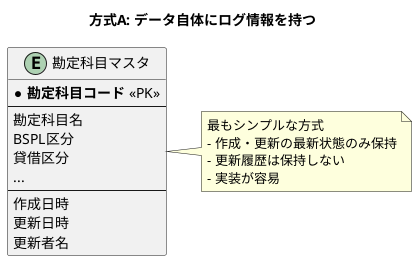
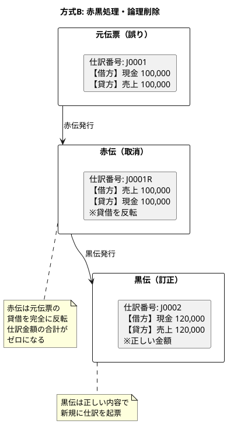
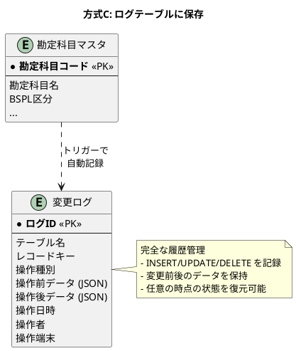
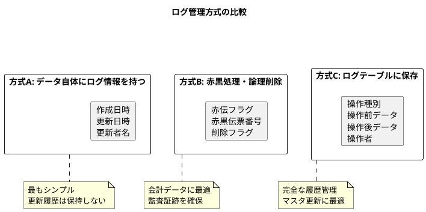
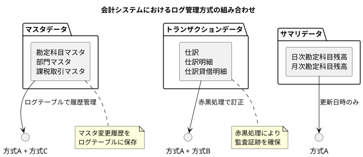
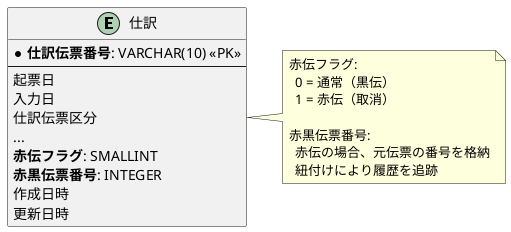
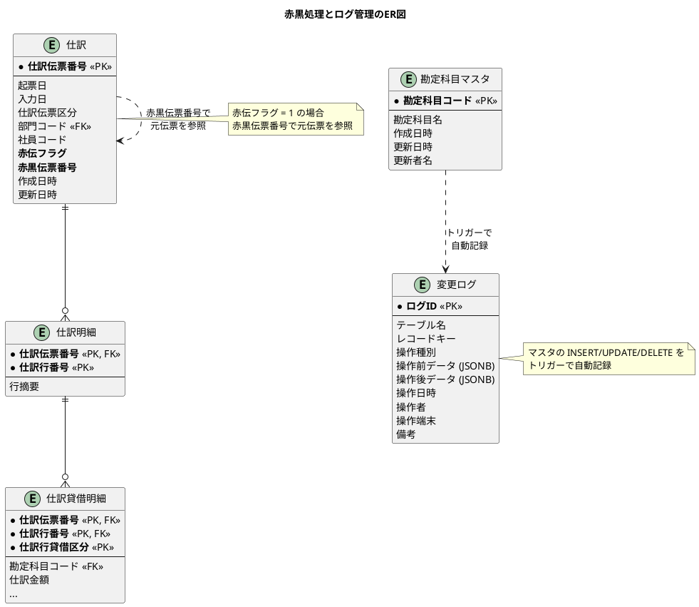

# 第19章 赤黒とログの設計

## 概要

本章では、財務会計システムにおけるデータ訂正方式とログ管理の設計を行います。会計システムでは、一度登録したデータの「削除」や「更新」を安易に行うことはできません。監査証跡を確保しつつ、データ訂正を行う方式が必要です。

## 19.1 3つのアプローチ

業務システムにおけるログ管理・変更管理には、3つの代表的なアプローチがあります。

### 19.1.1 データ自体にログ情報を持つ方式

最もシンプルな方式で、各テーブルに作成日時・更新日時・更新者名などのカラムを持たせます。



| メリット | デメリット |
|---------|-----------|
| 実装が簡単 | 変更履歴が追跡できない |
| パフォーマンスへの影響が少ない | 誰がいつ何を変更したか不明 |
| テーブル設計がシンプル | 監査対応が困難 |

### 19.1.2 赤黒処理・論理削除方式

会計データに適した方式で、物理削除を行わず、赤伝（取消伝票）で打ち消します。



| メリット | デメリット |
|---------|-----------|
| 監査証跡が確保される | データ量が増加する |
| 会計基準に準拠 | 複雑な処理が必要 |
| 残高が自動的に訂正される | 元伝票と赤伝の紐付け管理が必要 |

### 19.1.3 ログテーブルにログ情報を保存する方式

変更前後のデータを別テーブルに保存する方式です。



| メリット | デメリット |
|---------|-----------|
| 完全な変更履歴を追跡可能 | ログテーブルが肥大化する |
| 任意の時点の状態を復元可能 | トリガー設定が必要 |
| 監査対応が容易 | パフォーマンスへの影響 |

### 19.1.4 3つの方式の比較



## 19.2 業務システムでの使い分け

### 19.2.1 推奨される組み合わせ

業務システムでは、データの特性に応じて3つの方式を組み合わせて使用します。



| データ種別 | 採用方式 | 理由 |
|-----------|---------|------|
| **会計データ（仕訳）** | 方式A + 方式B | 会計基準に準拠した訂正方法が必要 |
| **マスタデータ** | 方式A + 方式C | 変更履歴の追跡が必要、監査対応 |
| **サマリデータ** | 方式A | 仕訳から再集計可能なため、履歴不要 |

### 19.2.2 赤黒処理の実装

仕訳テーブルには、赤黒処理に必要な項目が含まれています。



<details>
<summary>JournalCorrectionService（赤黒処理サービス）</summary>

```java
// src/main/java/com/example/sms/application/service/JournalCorrectionService.java
package com.example.fas.application.service;

import com.example.fas.application.port.out.JournalRepository;
import com.example.fas.domain.model.accounting.*;
import lombok.RequiredArgsConstructor;
import lombok.extern.slf4j.Slf4j;
import org.springframework.stereotype.Service;
import org.springframework.transaction.annotation.Transactional;

import java.time.LocalDate;
import java.util.ArrayList;

@Service
@RequiredArgsConstructor
@Slf4j
public class JournalCorrectionService {

    private final JournalRepository journalRepository;
    private final BalanceUpdateService balanceUpdateService;

    /**
     * 仕訳を赤黒訂正する
     * @param originalVoucherNumber 元伝票番号
     * @param correctedJournal 訂正後の仕訳（黒伝）
     * @return 赤伝と黒伝の仕訳伝票番号
     */
    @Transactional
    public CorrectionResult correctJournal(String originalVoucherNumber,
            Journal correctedJournal) {
        // 元伝票を取得
        var original = journalRepository.findByVoucherNumber(originalVoucherNumber)
            .orElseThrow(() -> new IllegalArgumentException(
                "元伝票が見つかりません: " + originalVoucherNumber));

        // 赤伝を作成
        var redSlip = createRedSlip(original);
        journalRepository.save(redSlip);
        balanceUpdateService.updateBalancesForJournal(redSlip);

        // 黒伝（訂正伝票）を登録
        if (!correctedJournal.isBalanced()) {
            throw new IllegalArgumentException("訂正仕訳の貸借が一致しません");
        }
        journalRepository.save(correctedJournal);
        balanceUpdateService.updateBalancesForJournal(correctedJournal);

        log.info("赤黒訂正完了: 元伝票={}, 赤伝={}, 黒伝={}",
            originalVoucherNumber,
            redSlip.getJournalVoucherNumber(),
            correctedJournal.getJournalVoucherNumber());

        return new CorrectionResult(
            redSlip.getJournalVoucherNumber(),
            correctedJournal.getJournalVoucherNumber()
        );
    }

    /**
     * 仕訳を取消する（赤伝のみ発行）
     * @param voucherNumber 取消対象の仕訳伝票番号
     * @return 赤伝の仕訳伝票番号
     */
    @Transactional
    public String cancelJournal(String voucherNumber) {
        var original = journalRepository.findByVoucherNumber(voucherNumber)
            .orElseThrow(() -> new IllegalArgumentException(
                "仕訳が見つかりません: " + voucherNumber));

        // 既に赤伝が発行されているか確認
        if (original.getRedSlipFlag() != null && original.getRedSlipFlag()) {
            throw new IllegalStateException("この仕訳は既に取消済みです");
        }

        // 赤伝を作成
        var redSlip = createRedSlip(original);
        journalRepository.save(redSlip);
        balanceUpdateService.updateBalancesForJournal(redSlip);

        log.info("仕訳取消完了: 元伝票={}, 赤伝={}",
            voucherNumber, redSlip.getJournalVoucherNumber());

        return redSlip.getJournalVoucherNumber();
    }

    /**
     * 赤伝を作成する
     */
    private Journal createRedSlip(Journal original) {
        // 赤伝の仕訳伝票番号を生成（元伝票番号 + R）
        var redVoucherNumber = original.getJournalVoucherNumber() + "R";

        // 貸借を反転した明細を作成
        var redDetails = new ArrayList<JournalDetail>();
        for (var detail : original.getDetails()) {
            var reversedDCDetails = new ArrayList<JournalDebitCreditDetail>();
            for (var dcDetail : detail.getDebitCreditDetails()) {
                var reversed = JournalDebitCreditDetail.builder()
                    .journalVoucherNumber(redVoucherNumber)
                    .lineNumber(dcDetail.getLineNumber())
                    // 借方→貸方、貸方→借方に反転
                    .debitCreditType(
                        dcDetail.getDebitCreditType() == DebitCreditType.DEBIT
                            ? DebitCreditType.CREDIT
                            : DebitCreditType.DEBIT)
                    .accountCode(dcDetail.getAccountCode())
                    .subAccountCode(dcDetail.getSubAccountCode())
                    .departmentCode(dcDetail.getDepartmentCode())
                    .projectCode(dcDetail.getProjectCode())
                    .amount(dcDetail.getAmount())
                    .currencyCode(dcDetail.getCurrencyCode())
                    .exchangeRate(dcDetail.getExchangeRate())
                    .taxType(dcDetail.getTaxType())
                    .taxRate(dcDetail.getTaxRate())
                    .taxCalcType(dcDetail.getTaxCalcType())
                    .build();
                reversedDCDetails.add(reversed);
            }

            var redDetail = JournalDetail.builder()
                .journalVoucherNumber(redVoucherNumber)
                .lineNumber(detail.getLineNumber())
                .lineSummary(detail.getLineSummary() + "（取消）")
                .debitCreditDetails(reversedDCDetails)
                .build();
            redDetails.add(redDetail);
        }

        return Journal.builder()
            .journalVoucherNumber(redVoucherNumber)
            .postingDate(LocalDate.now())
            .entryDate(LocalDate.now())
            .closingJournalFlag(original.getClosingJournalFlag())
            .singleEntryFlag(original.getSingleEntryFlag())
            .voucherType(original.getVoucherType())
            .periodicPostingFlag(false)
            .employeeCode(original.getEmployeeCode())
            .departmentCode(original.getDepartmentCode())
            .redSlipFlag(true)
            .redBlackVoucherNumber(extractNumericPart(original.getJournalVoucherNumber()))
            .details(redDetails)
            .build();
    }

    private Integer extractNumericPart(String voucherNumber) {
        return Integer.parseInt(voucherNumber.replaceAll("[^0-9]", ""));
    }

    /**
     * 訂正結果
     */
    public record CorrectionResult(
        String redSlipNumber,
        String blackSlipNumber
    ) {}
}
```

</details>

### 19.2.3 ログテーブルの実装

マスタデータの変更履歴を保存するログテーブルを設計します。

<details>
<summary>V010__create_change_log_table.sql</summary>

```sql
-- V010__create_change_log_table.sql

-- 操作種別
CREATE TYPE 操作種別 AS ENUM ('INSERT', 'UPDATE', 'DELETE');

-- 変更ログテーブル
CREATE TABLE "変更ログ" (
    "ログID" SERIAL PRIMARY KEY,
    "テーブル名" VARCHAR(50) NOT NULL,
    "レコードキー" VARCHAR(100) NOT NULL,
    "操作種別" 操作種別 NOT NULL,
    "操作前データ" JSONB,
    "操作後データ" JSONB,
    "操作日時" TIMESTAMP DEFAULT CURRENT_TIMESTAMP NOT NULL,
    "操作者" VARCHAR(50),
    "操作端末" VARCHAR(100),
    "備考" TEXT
);

-- インデックス
CREATE INDEX "idx_変更ログ_テーブル名" ON "変更ログ"("テーブル名");
CREATE INDEX "idx_変更ログ_レコードキー" ON "変更ログ"("レコードキー");
CREATE INDEX "idx_変更ログ_操作日時" ON "変更ログ"("操作日時");
CREATE INDEX "idx_変更ログ_操作種別" ON "変更ログ"("操作種別");

-- 勘定科目マスタの変更ログトリガー
CREATE OR REPLACE FUNCTION log_account_changes()
RETURNS TRIGGER AS $$
BEGIN
    IF TG_OP = 'INSERT' THEN
        INSERT INTO "変更ログ" (
            "テーブル名", "レコードキー", "操作種別",
            "操作前データ", "操作後データ", "操作者"
        ) VALUES (
            '勘定科目マスタ',
            NEW."勘定科目コード",
            'INSERT',
            NULL,
            row_to_json(NEW),
            NEW."更新者名"
        );
        RETURN NEW;
    ELSIF TG_OP = 'UPDATE' THEN
        INSERT INTO "変更ログ" (
            "テーブル名", "レコードキー", "操作種別",
            "操作前データ", "操作後データ", "操作者"
        ) VALUES (
            '勘定科目マスタ',
            NEW."勘定科目コード",
            'UPDATE',
            row_to_json(OLD),
            row_to_json(NEW),
            NEW."更新者名"
        );
        RETURN NEW;
    ELSIF TG_OP = 'DELETE' THEN
        INSERT INTO "変更ログ" (
            "テーブル名", "レコードキー", "操作種別",
            "操作前データ", "操作後データ", "操作者"
        ) VALUES (
            '勘定科目マスタ',
            OLD."勘定科目コード",
            'DELETE',
            row_to_json(OLD),
            NULL,
            OLD."更新者名"
        );
        RETURN OLD;
    END IF;
END;
$$ LANGUAGE plpgsql;

CREATE TRIGGER "trg_勘定科目マスタ_変更ログ"
AFTER INSERT OR UPDATE OR DELETE ON "勘定科目マスタ"
FOR EACH ROW
EXECUTE FUNCTION log_account_changes();

COMMENT ON TABLE "変更ログ" IS 'マスタデータの変更履歴を保存するテーブル';
```

</details>

### 19.2.4 ドメインモデル

<details>
<summary>ChangeLog エンティティ</summary>

```java
// src/main/java/com/example/sms/domain/model/audit/ChangeLog.java
package com.example.fas.domain.model.audit;

import lombok.AllArgsConstructor;
import lombok.Builder;
import lombok.Data;
import lombok.NoArgsConstructor;

import java.time.LocalDateTime;

/**
 * 変更ログエンティティ
 */
@Data
@Builder
@NoArgsConstructor
@AllArgsConstructor
public class ChangeLog {
    private Long logId;               // ログID
    private String tableName;         // テーブル名
    private String recordKey;         // レコードキー
    private OperationType operationType; // 操作種別
    private String beforeData;        // 操作前データ（JSON）
    private String afterData;         // 操作後データ（JSON）
    private LocalDateTime operatedAt; // 操作日時
    private String operatedBy;        // 操作者
    private String operatedFrom;      // 操作端末
    private String remarks;           // 備考

    /**
     * 操作種別
     */
    public enum OperationType {
        INSERT, UPDATE, DELETE
    }
}
```

</details>

### 19.2.5 リポジトリインターフェース

<details>
<summary>ChangeLogRepository（Output Port）</summary>

```java
// src/main/java/com/example/sms/application/port/out/ChangeLogRepository.java
package com.example.fas.application.port.out;

import com.example.fas.domain.model.audit.ChangeLog;
import com.example.fas.domain.model.audit.ChangeLog.OperationType;

import java.time.LocalDateTime;
import java.util.List;
import java.util.Optional;

/**
 * 変更ログリポジトリ（Output Port）
 */
public interface ChangeLogRepository {

    /**
     * 変更ログを保存する
     */
    void save(ChangeLog changeLog);

    /**
     * ログIDで検索する
     */
    Optional<ChangeLog> findById(Long logId);

    /**
     * テーブル名とレコードキーで検索する
     */
    List<ChangeLog> findByTableNameAndRecordKey(String tableName, String recordKey);

    /**
     * テーブル名で検索する
     */
    List<ChangeLog> findByTableName(String tableName);

    /**
     * 操作種別で検索する
     */
    List<ChangeLog> findByOperationType(OperationType operationType);

    /**
     * 期間指定で検索する
     */
    List<ChangeLog> findByDateRange(LocalDateTime from, LocalDateTime to);

    /**
     * 操作者で検索する
     */
    List<ChangeLog> findByOperatedBy(String operatedBy);

    /**
     * 複合条件で検索する
     */
    List<ChangeLog> findByConditions(
            String tableName,
            String recordKey,
            OperationType operationType,
            LocalDateTime from,
            LocalDateTime to,
            String operatedBy
    );

    /**
     * 全件削除（テスト用）
     */
    void deleteAll();
}
```

</details>

### 19.2.6 MyBatis Mapper

<details>
<summary>ChangeLogMapper.xml</summary>

```xml
<?xml version="1.0" encoding="UTF-8" ?>
<!DOCTYPE mapper PUBLIC "-//mybatis.org//DTD Mapper 3.0//EN"
        "http://mybatis.org/dtd/mybatis-3-mapper.dtd">

<mapper namespace="com.example.fas.infrastructure.persistence.mapper.ChangeLogMapper">

    <!-- ResultMap: 日本語カラム名 → 英語プロパティ名 -->
    <resultMap id="ChangeLogResultMap" type="com.example.fas.domain.model.audit.ChangeLog">
        <id property="logId" column="ログID"/>
        <result property="tableName" column="テーブル名"/>
        <result property="recordKey" column="レコードキー"/>
        <result property="operationType" column="操作種別"
                typeHandler="com.example.fas.infrastructure.persistence.typehandler.OperationTypeHandler"/>
        <result property="beforeData" column="操作前データ"/>
        <result property="afterData" column="操作後データ"/>
        <result property="operatedAt" column="操作日時"/>
        <result property="operatedBy" column="操作者"/>
        <result property="operatedFrom" column="操作端末"/>
        <result property="remarks" column="備考"/>
    </resultMap>

    <!-- 登録 -->
    <insert id="insert" parameterType="com.example.fas.domain.model.audit.ChangeLog"
            useGeneratedKeys="true" keyProperty="logId" keyColumn="ログID">
        INSERT INTO "変更ログ" (
            "テーブル名",
            "レコードキー",
            "操作種別",
            "操作前データ",
            "操作後データ",
            "操作日時",
            "操作者",
            "操作端末",
            "備考"
        ) VALUES (
            #{tableName},
            #{recordKey},
            #{operationType, typeHandler=com.example.fas.infrastructure.persistence.typehandler.OperationTypeHandler},
            #{beforeData}::jsonb,
            #{afterData}::jsonb,
            COALESCE(#{operatedAt}, CURRENT_TIMESTAMP),
            #{operatedBy},
            #{operatedFrom},
            #{remarks}
        )
    </insert>

    <!-- ログIDで検索 -->
    <select id="findById" resultMap="ChangeLogResultMap">
        SELECT
            "ログID",
            "テーブル名",
            "レコードキー",
            "操作種別",
            "操作前データ",
            "操作後データ",
            "操作日時",
            "操作者",
            "操作端末",
            "備考"
        FROM "変更ログ"
        WHERE "ログID" = #{logId}
    </select>

    <!-- テーブル名とレコードキーで検索 -->
    <select id="findByTableNameAndRecordKey" resultMap="ChangeLogResultMap">
        SELECT
            "ログID",
            "テーブル名",
            "レコードキー",
            "操作種別",
            "操作前データ",
            "操作後データ",
            "操作日時",
            "操作者",
            "操作端末",
            "備考"
        FROM "変更ログ"
        WHERE "テーブル名" = #{tableName}
          AND "レコードキー" = #{recordKey}
        ORDER BY "操作日時" DESC
    </select>

    <!-- テーブル名で検索 -->
    <select id="findByTableName" resultMap="ChangeLogResultMap">
        SELECT
            "ログID",
            "テーブル名",
            "レコードキー",
            "操作種別",
            "操作前データ",
            "操作後データ",
            "操作日時",
            "操作者",
            "操作端末",
            "備考"
        FROM "変更ログ"
        WHERE "テーブル名" = #{tableName}
        ORDER BY "操作日時" DESC
    </select>

    <!-- 複合条件で検索 -->
    <select id="findByConditions" resultMap="ChangeLogResultMap">
        SELECT
            "ログID",
            "テーブル名",
            "レコードキー",
            "操作種別",
            "操作前データ",
            "操作後データ",
            "操作日時",
            "操作者",
            "操作端末",
            "備考"
        FROM "変更ログ"
        <where>
            <if test="tableName != null">
                AND "テーブル名" = #{tableName}
            </if>
            <if test="recordKey != null">
                AND "レコードキー" = #{recordKey}
            </if>
            <if test="operationType != null">
                AND "操作種別" = #{operationType, typeHandler=com.example.fas.infrastructure.persistence.typehandler.OperationTypeHandler}
            </if>
            <if test="from != null">
                AND "操作日時" &gt;= #{from}
            </if>
            <if test="to != null">
                AND "操作日時" &lt;= #{to}
            </if>
            <if test="operatedBy != null">
                AND "操作者" = #{operatedBy}
            </if>
        </where>
        ORDER BY "操作日時" DESC
    </select>

    <!-- 全件削除（テスト用） -->
    <delete id="deleteAll">
        DELETE FROM "変更ログ"
    </delete>

</mapper>
```

</details>

<details>
<summary>OperationTypeHandler（TypeHandler）</summary>

```java
// src/main/java/com/example/sms/infrastructure/persistence/typehandler/OperationTypeHandler.java
package com.example.fas.infrastructure.persistence.typehandler;

import com.example.fas.domain.model.audit.ChangeLog.OperationType;
import org.apache.ibatis.type.BaseTypeHandler;
import org.apache.ibatis.type.JdbcType;
import org.apache.ibatis.type.MappedTypes;

import java.sql.CallableStatement;
import java.sql.PreparedStatement;
import java.sql.ResultSet;
import java.sql.SQLException;

/**
 * 操作種別 TypeHandler
 * PostgreSQL ENUM（操作種別） ↔ Java Enum（OperationType）の変換
 */
@MappedTypes(OperationType.class)
public class OperationTypeHandler extends BaseTypeHandler<OperationType> {

    @Override
    public void setNonNullParameter(PreparedStatement ps, int i,
            OperationType parameter, JdbcType jdbcType) throws SQLException {
        // Java Enum → PostgreSQL ENUM
        ps.setObject(i, parameter.name(), java.sql.Types.OTHER);
    }

    @Override
    public OperationType getNullableResult(ResultSet rs, String columnName)
            throws SQLException {
        String value = rs.getString(columnName);
        return value == null ? null : OperationType.valueOf(value);
    }

    @Override
    public OperationType getNullableResult(ResultSet rs, int columnIndex)
            throws SQLException {
        String value = rs.getString(columnIndex);
        return value == null ? null : OperationType.valueOf(value);
    }

    @Override
    public OperationType getNullableResult(CallableStatement cs, int columnIndex)
            throws SQLException {
        String value = cs.getString(columnIndex);
        return value == null ? null : OperationType.valueOf(value);
    }
}
```

</details>

### 19.2.7 TDD によるテスト実装

<details>
<summary>変更ログリポジトリのテスト</summary>

```java
// src/test/java/com/example/sms/infrastructure/persistence/ChangeLogRepositoryTest.java
package com.example.fas.infrastructure.persistence;

import com.example.fas.application.port.out.ChangeLogRepository;
import com.example.fas.domain.model.audit.ChangeLog;
import com.example.fas.domain.model.audit.ChangeLog.OperationType;
import org.junit.jupiter.api.*;
import org.mybatis.spring.boot.test.autoconfigure.MybatisTest;
import org.springframework.beans.factory.annotation.Autowired;
import org.springframework.boot.test.autoconfigure.jdbc.AutoConfigureTestDatabase;
import org.springframework.context.annotation.Import;
import org.springframework.test.context.DynamicPropertyRegistry;
import org.springframework.test.context.DynamicPropertySource;
import org.testcontainers.containers.PostgreSQLContainer;
import org.testcontainers.junit.jupiter.Container;
import org.testcontainers.junit.jupiter.Testcontainers;

import java.time.LocalDateTime;

import static org.assertj.core.api.Assertions.*;

@MybatisTest
@AutoConfigureTestDatabase(replace = AutoConfigureTestDatabase.Replace.NONE)
@Testcontainers
@Import(ChangeLogRepositoryImpl.class)
@DisplayName("変更ログリポジトリ")
class ChangeLogRepositoryTest {

    @Container
    static PostgreSQLContainer<?> postgres = new PostgreSQLContainer<>("postgres:16")
            .withDatabaseName("testdb")
            .withUsername("test")
            .withPassword("test");

    @DynamicPropertySource
    static void configureProperties(DynamicPropertyRegistry registry) {
        registry.add("spring.datasource.url", postgres::getJdbcUrl);
        registry.add("spring.datasource.username", postgres::getUsername);
        registry.add("spring.datasource.password", postgres::getPassword);
    }

    @Autowired
    private ChangeLogRepository changeLogRepository;

    @BeforeEach
    void setUp() {
        changeLogRepository.deleteAll();
    }

    @Nested
    @DisplayName("登録")
    class Insert {

        @Test
        @DisplayName("変更ログを登録できる")
        void canInsertChangeLog() {
            // Arrange
            var changeLog = ChangeLog.builder()
                    .tableName("勘定科目マスタ")
                    .recordKey("11100")
                    .operationType(OperationType.INSERT)
                    .afterData("{\"勘定科目コード\":\"11100\",\"勘定科目名\":\"現金\"}")
                    .operatedBy("admin")
                    .build();

            // Act
            changeLogRepository.save(changeLog);

            // Assert
            assertThat(changeLog.getLogId()).isNotNull();
            var result = changeLogRepository.findById(changeLog.getLogId());
            assertThat(result).isPresent();
            assertThat(result.get().getTableName()).isEqualTo("勘定科目マスタ");
            assertThat(result.get().getOperationType()).isEqualTo(OperationType.INSERT);
        }

        @Test
        @DisplayName("UPDATE操作のログを登録できる")
        void canInsertUpdateLog() {
            // Arrange
            var changeLog = ChangeLog.builder()
                    .tableName("勘定科目マスタ")
                    .recordKey("11100")
                    .operationType(OperationType.UPDATE)
                    .beforeData("{\"勘定科目名\":\"現金\"}")
                    .afterData("{\"勘定科目名\":\"現金及び預金\"}")
                    .operatedBy("admin")
                    .remarks("科目名変更")
                    .build();

            // Act
            changeLogRepository.save(changeLog);

            // Assert
            var result = changeLogRepository.findById(changeLog.getLogId());
            assertThat(result).isPresent();
            assertThat(result.get().getOperationType()).isEqualTo(OperationType.UPDATE);
            assertThat(result.get().getBeforeData()).contains("現金");
            assertThat(result.get().getAfterData()).contains("現金及び預金");
        }
    }

    @Nested
    @DisplayName("検索")
    class Search {

        @BeforeEach
        void setUpTestData() {
            // テストデータを登録
            changeLogRepository.save(ChangeLog.builder()
                    .tableName("勘定科目マスタ")
                    .recordKey("11100")
                    .operationType(OperationType.INSERT)
                    .afterData("{\"勘定科目コード\":\"11100\"}")
                    .operatedAt(LocalDateTime.of(2025, 1, 1, 10, 0))
                    .operatedBy("user1")
                    .build());

            changeLogRepository.save(ChangeLog.builder()
                    .tableName("勘定科目マスタ")
                    .recordKey("11100")
                    .operationType(OperationType.UPDATE)
                    .beforeData("{\"勘定科目名\":\"現金\"}")
                    .afterData("{\"勘定科目名\":\"現金及び預金\"}")
                    .operatedAt(LocalDateTime.of(2025, 1, 15, 14, 30))
                    .operatedBy("user2")
                    .build());
        }

        @Test
        @DisplayName("テーブル名とレコードキーで検索できる")
        void canFindByTableNameAndRecordKey() {
            // Act
            var result = changeLogRepository.findByTableNameAndRecordKey(
                    "勘定科目マスタ", "11100");

            // Assert
            assertThat(result).hasSize(2);
            assertThat(result).allMatch(log ->
                    log.getTableName().equals("勘定科目マスタ") &&
                    log.getRecordKey().equals("11100"));
        }

        @Test
        @DisplayName("操作種別で検索できる")
        void canFindByOperationType() {
            // Act
            var result = changeLogRepository.findByOperationType(OperationType.INSERT);

            // Assert
            assertThat(result).hasSize(1);
            assertThat(result).allMatch(log ->
                    log.getOperationType() == OperationType.INSERT);
        }
    }
}
```

</details>

## 19.3 ER図



## 19.4 まとめ

本章では、財務会計システムにおける赤黒処理とログ管理の設計について解説しました。

### 設計のポイント

1. **3つのログ管理アプローチ**
   - 方式A: データ自体にログ情報（シンプルだが履歴追跡不可）
   - 方式B: 赤黒処理・論理削除（会計データに最適）
   - 方式C: ログテーブル（マスタデータに最適）

2. **業務システムでの使い分け**
   - 会計データ: 赤黒処理で監査証跡を確保
   - マスタデータ: ログテーブルで変更履歴を管理
   - サマリデータ: 更新日時のみ

3. **赤黒処理のメリット**
   - 監査証跡の確保
   - 会計基準への準拠
   - 残高の自動調整

4. **ログテーブルのメリット**
   - 完全な変更履歴の追跡
   - 任意の時点の状態を復元可能
   - トリガーによる自動記録

### 次章の予告

第20章では、具体的な企業（D社：化粧品製造販売）の事例に基づいて、財務会計システムのデータ設計を行います。勘定科目体系、組織構成、Seedデータの実装など、実際の業務に即した設計を行います。
