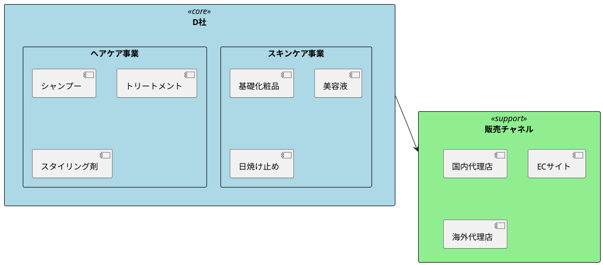
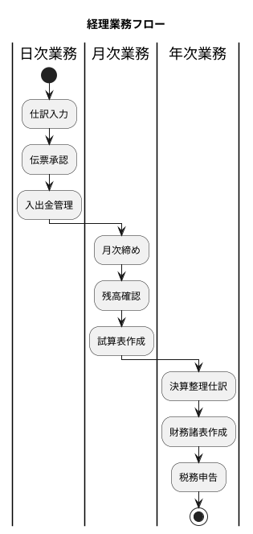
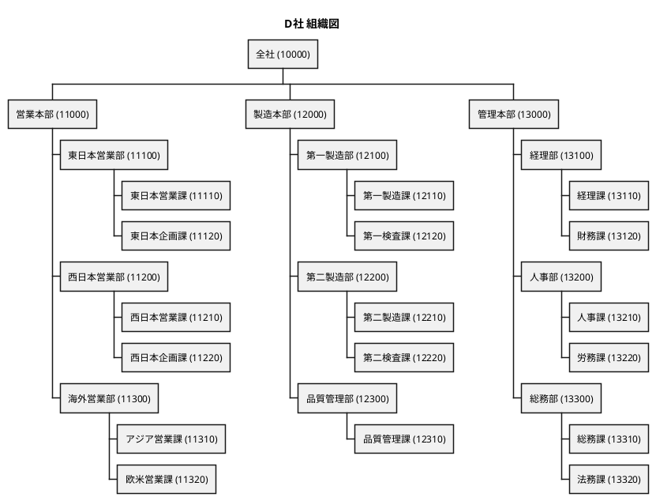
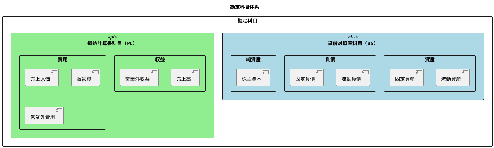
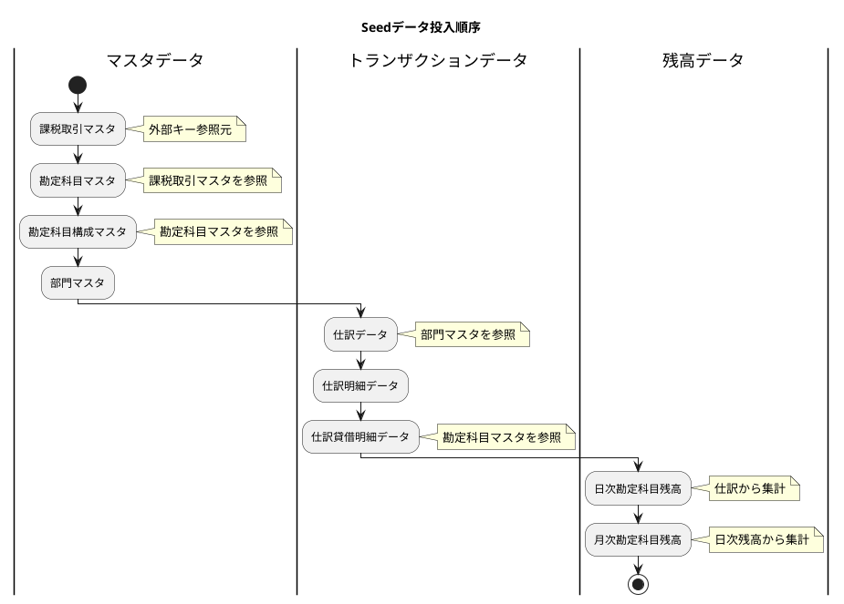

# 第20章：財務会計データ設計（D社事例）

本章では、化粧品製造販売会社D社を題材として、実際の財務会計システムにおけるデータ設計の全体像を解説します。企業概要から組織構成、勘定科目体系、そしてSeedデータの実装まで、包括的に説明します。

## 20.1 D社の概要

### 20.1.1 会社プロファイル

D社は化粧品製造販売を主業とする中堅企業です。以下にD社の基本情報を示します。

| 項目 | 内容 |
|------|------|
| 業種 | 化粧品製造販売 |
| 資本金 | 5億円 |
| 従業員数 | 300名 |
| 年間売上高 | 80億円 |
| 決算期 | 3月 |

### 20.1.2 企業概要

D社は国内市場を中心にスキンケア製品とヘアケア製品を展開しており、近年は海外市場への進出も積極的に行っています。製造拠点は国内に2工場を持ち、品質管理に力を入れた製品づくりが特徴です。



### 20.1.3 決算期と経理体制

D社は3月決算を採用しており、経理部門は以下の体制で運営されています。

| 部門 | 人数 | 主な業務 |
|------|------|----------|
| 経理部 | 10名 | 日常経理、月次決算、年次決算 |
| 財務課 | 3名 | 資金管理、資金調達、為替管理 |



## 20.2 組織構成

### 20.2.1 組織図

D社の組織は本部-部-課の3階層で構成されています。



### 20.2.2 部門マスタの階層構造

部門マスタはチルダ連結によるパス表現で階層構造を管理します。これにより、任意の階層での集計が容易になります。

| 部門コード | 部門名 | 組織階層 | 部門パス | 最下層フラグ |
|------------|--------|----------|----------|--------------|
| 10000 | 全社 | 0 | 10000 | 0 |
| 11000 | 営業本部 | 1 | 10000~11000 | 0 |
| 11100 | 東日本営業部 | 2 | 10000~11000~11100 | 0 |
| 11110 | 東日本営業課 | 3 | 10000~11000~11100~11110 | 1 |
| 12000 | 製造本部 | 1 | 10000~12000 | 0 |
| 12100 | 第一製造部 | 2 | 10000~12000~12100 | 0 |
| 12110 | 第一製造課 | 3 | 10000~12000~12100~12110 | 1 |
| 13000 | 管理本部 | 1 | 10000~13000 | 0 |
| 13100 | 経理部 | 2 | 10000~13000~13100 | 0 |
| 13110 | 経理課 | 3 | 10000~13000~13100~13110 | 1 |

### 20.2.3 部門コード体系

D社の部門コードは5桁で設計されており、各桁に意味を持たせています。

```
 1  2  3  4  5
 ↓  ↓  ↓  ↓  ↓
[1][1][1][1][0]
 │  │  │  └──── 連番（0-9）
 │  │  └─────── 課コード（1-9）
 │  └──────────  部コード（1-9）
 └─────────────  本部コード（1-3）

本部コード:
  1: 営業本部
  2: 製造本部
  3: 管理本部
```

<details>
<summary>部門エンティティの実装</summary>

```java
// src/main/java/com/example/accounting/domain/model/department/Department.java
package com.example.accounting.domain.model.department;

import lombok.AllArgsConstructor;
import lombok.Builder;
import lombok.Data;
import lombok.NoArgsConstructor;

import java.util.Arrays;
import java.util.List;

@Data
@Builder
@NoArgsConstructor
@AllArgsConstructor
public class Department {
    /** 部門コード（5桁） */
    private String departmentCode;

    /** 部門名 */
    private String departmentName;

    /** 部門略名 */
    private String departmentShortName;

    /** 組織階層（0:全社, 1:本部, 2:部, 3:課） */
    private Integer organizationLevel;

    /** 部門パス（チルダ連結） */
    private String departmentPath;

    /** 最下層フラグ（0:中間, 1:最下層） */
    private Integer lowestLevelFlag;

    /**
     * 上位部門コードのリストを取得
     */
    public List<String> getAncestorCodes() {
        if (departmentPath == null || departmentPath.isEmpty()) {
            return List.of();
        }
        return Arrays.asList(departmentPath.split("~"));
    }

    /**
     * 直上位の部門コードを取得
     */
    public String getParentCode() {
        List<String> ancestors = getAncestorCodes();
        if (ancestors.size() < 2) {
            return null;
        }
        return ancestors.get(ancestors.size() - 2);
    }

    /**
     * 最下層かどうか
     */
    public boolean isLowestLevel() {
        return lowestLevelFlag != null && lowestLevelFlag == 1;
    }

    /**
     * 指定部門の下位かどうか
     */
    public boolean isDescendantOf(String ancestorCode) {
        return departmentPath != null && departmentPath.contains(ancestorCode);
    }
}
```

</details>

<details>
<summary>部門リポジトリの実装</summary>

```java
// src/main/java/com/example/accounting/domain/model/department/DepartmentRepository.java
package com.example.accounting.domain.model.department;

import java.util.List;
import java.util.Optional;

public interface DepartmentRepository {
    /**
     * 部門コードで検索
     */
    Optional<Department> findByCode(String departmentCode);

    /**
     * 全部門を取得
     */
    List<Department> findAll();

    /**
     * 階層で検索
     */
    List<Department> findByOrganizationLevel(int level);

    /**
     * 最下層部門のみ取得
     */
    List<Department> findLowestLevel();

    /**
     * 上位部門配下の部門を取得（パス検索）
     */
    List<Department> findByPathPrefix(String pathPrefix);

    /**
     * 部門を保存
     */
    void save(Department department);

    /**
     * 部門を削除
     */
    void deleteByCode(String departmentCode);
}
```

</details>

<details>
<summary>部門マイグレーション</summary>

```sql
-- V104__seed_department_master.sql
-- 部門マスタ Seed データ

-- 全社（レベル0）
INSERT INTO "部門マスタ" ("部門コード", "部門名", "部門略名", "組織階層", "部門パス", "最下層フラグ")
VALUES ('10000', '全社', '全社', 0, '10000', 0);

-- 営業本部配下
INSERT INTO "部門マスタ" ("部門コード", "部門名", "部門略名", "組織階層", "部門パス", "最下層フラグ")
VALUES
('11000', '営業本部', '営業', 1, '10000~11000', 0),
('11100', '東日本営業部', '東日本', 2, '10000~11000~11100', 0),
('11110', '東日本営業課', '東日本営業', 3, '10000~11000~11100~11110', 1),
('11120', '東日本企画課', '東日本企画', 3, '10000~11000~11100~11120', 1),
('11200', '西日本営業部', '西日本', 2, '10000~11000~11200', 0),
('11210', '西日本営業課', '西日本営業', 3, '10000~11000~11200~11210', 1),
('11220', '西日本企画課', '西日本企画', 3, '10000~11000~11200~11220', 1),
('11300', '海外営業部', '海外', 2, '10000~11000~11300', 0),
('11310', 'アジア営業課', 'アジア営業', 3, '10000~11000~11300~11310', 1),
('11320', '欧米営業課', '欧米営業', 3, '10000~11000~11300~11320', 1);

-- 製造本部配下
INSERT INTO "部門マスタ" ("部門コード", "部門名", "部門略名", "組織階層", "部門パス", "最下層フラグ")
VALUES
('12000', '製造本部', '製造', 1, '10000~12000', 0),
('12100', '第一製造部', '第一製造', 2, '10000~12000~12100', 0),
('12110', '第一製造課', '一製課', 3, '10000~12000~12100~12110', 1),
('12120', '第一検査課', '一検課', 3, '10000~12000~12100~12120', 1),
('12200', '第二製造部', '第二製造', 2, '10000~12000~12200', 0),
('12210', '第二製造課', '二製課', 3, '10000~12000~12200~12210', 1),
('12220', '第二検査課', '二検課', 3, '10000~12000~12200~12220', 1),
('12300', '品質管理部', '品管', 2, '10000~12000~12300', 0),
('12310', '品質管理課', '品管課', 3, '10000~12000~12300~12310', 1);

-- 管理本部配下
INSERT INTO "部門マスタ" ("部門コード", "部門名", "部門略名", "組織階層", "部門パス", "最下層フラグ")
VALUES
('13000', '管理本部', '管理', 1, '10000~13000', 0),
('13100', '経理部', '経理', 2, '10000~13000~13100', 0),
('13110', '経理課', '経理課', 3, '10000~13000~13100~13110', 1),
('13120', '財務課', '財務課', 3, '10000~13000~13100~13120', 1),
('13200', '人事部', '人事', 2, '10000~13000~13200', 0),
('13210', '人事課', '人事課', 3, '10000~13000~13200~13210', 1),
('13220', '労務課', '労務課', 3, '10000~13000~13200~13220', 1),
('13300', '総務部', '総務', 2, '10000~13000~13300', 0),
('13310', '総務課', '総務課', 3, '10000~13000~13300~13310', 1),
('13320', '法務課', '法務課', 3, '10000~13000~13300~13320', 1);
```

</details>

## 20.3 勘定科目体系

### 20.3.1 勘定科目の構成

D社の勘定科目は、貸借対照表（BS）科目と損益計算書（PL）科目で構成されています。



#### 主要勘定科目一覧

**資産（BS借方）**

| コード | 科目名 | 補助科目 | 説明 |
|--------|--------|----------|------|
| 11110 | 現金 | - | 手元現金 |
| 11130 | 普通預金 | 必須 | 銀行別管理 |
| 11210 | 売掛金 | 必須 | 得意先別管理 |
| 11330 | 原材料 | 必須 | 品目別管理 |
| 11430 | 仮払消費税 | - | 消費税処理用 |

**負債（BS貸方）**

| コード | 科目名 | 補助科目 | 説明 |
|--------|--------|----------|------|
| 21110 | 買掛金 | 必須 | 仕入先別管理 |
| 21240 | 仮受消費税 | - | 消費税処理用 |
| 21250 | 預り金 | - | 源泉税・社保等 |

**純資産（BS貸方）**

| コード | 科目名 | 説明 |
|--------|--------|------|
| 31100 | 資本金 | 払込資本 |
| 33200 | 繰越利益剰余金 | 留保利益 |

**売上（PL貸方）**

| コード | 科目名 | 消費税 | 説明 |
|--------|--------|--------|------|
| 41110 | 国内売上高 | 課税10% | 国内向け売上 |
| 41120 | 輸出売上高 | 免税 | 海外向け売上 |

**費用（PL借方）**

| コード | 科目名 | 消費税 | 説明 |
|--------|--------|--------|------|
| 51100 | 材料費 | 課税10% | 製造原価 |
| 61200 | 給料手当 | 対象外 | 人件費 |
| 62100 | 旅費交通費 | 課税10% | 出張費等 |
| 63100 | 広告宣伝費 | 課税10% | 販促費用 |

### 20.3.2 勘定科目コード体系

D社の勘定科目コードは5桁で設計されています。

```
 1  2  3  4  5
 ↓  ↓  ↓  ↓  ↓
[1][1][1][1][0]
 │  │  │  └──── 連番（0-9）
 │  │  └─────── 中分類（1-9）
 │  └──────────  小分類（1-9）
 └─────────────  大分類（1-6）

大分類:
  1: 資産
  2: 負債
  3: 純資産
  4: 収益
  5: 原価
  6: 販管費
  7: 営業外収益
  8: 営業外費用
```

### 20.3.3 勘定科目構成マスタ

勘定科目の階層構造はチルダ連結パスで管理します。

| 勘定科目コード | 勘定科目パス | 説明 |
|----------------|--------------|------|
| 10000 | 10000 | 資産（大分類） |
| 11000 | 10000~11000 | 流動資産（中分類） |
| 11100 | 10000~11000~11100 | 現金預金（小分類） |
| 11110 | 10000~11000~11100~11110 | 現金（科目） |
| 11130 | 10000~11000~11100~11130 | 普通預金（科目） |

<details>
<summary>勘定科目マスタ Seed SQL</summary>

```sql
-- V100__seed_account_master_bs.sql
-- 勘定科目マスタ Seed（BS科目）

-- 資産
INSERT INTO "勘定科目マスタ" (
    "勘定科目コード", "勘定科目名", "勘定科目略名",
    "BSPLフラグ", "貸借区分", "五要素区分", "集計区分", "管理区分"
)
VALUES
-- 流動資産
('11110', '現金', '現金', 'BS', '借方', '資産', '記帳', '共通'),
('11130', '普通預金', '普通', 'BS', '借方', '資産', '記帳', '共通'),
('11210', '売掛金', '売掛金', 'BS', '借方', '資産', '記帳', '共通'),
('11330', '原材料', '原材料', 'BS', '借方', '資産', '記帳', '製造'),
('11430', '仮払消費税', '仮払税', 'BS', '借方', '資産', '記帳', '共通'),
-- 流動負債
('21110', '買掛金', '買掛金', 'BS', '貸方', '負債', '記帳', '共通'),
('21240', '仮受消費税', '仮受税', 'BS', '貸方', '負債', '記帳', '共通'),
('21250', '預り金', '預り金', 'BS', '貸方', '負債', '記帳', '共通'),
-- 純資産
('31100', '資本金', '資本金', 'BS', '貸方', '純資産', '記帳', '共通'),
('33200', '繰越利益剰余金', '繰越利益', 'BS', '貸方', '純資産', '記帳', '共通');

-- V101__seed_account_master_pl.sql
-- 勘定科目マスタ Seed（PL科目）

INSERT INTO "勘定科目マスタ" (
    "勘定科目コード", "勘定科目名", "勘定科目略名",
    "BSPLフラグ", "貸借区分", "五要素区分", "集計区分", "管理区分",
    "課税算出区分", "消費税コード"
)
VALUES
-- 売上
('41110', '国内売上高', '国内売上', 'PL', '貸方', '収益', '記帳', '共通', '売上', '10'),
('41120', '輸出売上高', '輸出売上', 'PL', '貸方', '収益', '記帳', '共通', '売上', '00'),
-- 製造原価
('51100', '材料費', '材料費', 'PL', '借方', '費用', '記帳', '製造', '仕入', '10'),
-- 販管費
('61200', '給料手当', '給料', 'PL', '借方', '費用', '記帳', '共通', '対象外', '99'),
('62100', '旅費交通費', '旅費交通', 'PL', '借方', '費用', '記帳', '共通', '仕入', '10'),
('63100', '広告宣伝費', '広告宣伝', 'PL', '借方', '費用', '記帳', '共通', '仕入', '10');
```

</details>

<details>
<summary>勘定科目構成マスタ Seed SQL</summary>

```sql
-- V102__seed_account_config_master.sql
-- 勘定科目構成マスタ Seed

INSERT INTO "勘定科目構成マスタ" ("勘定科目コード", "勘定科目パス")
VALUES
-- 資産階層
('10000', '10000'),
('11000', '10000~11000'),
('11100', '10000~11000~11100'),
('11110', '10000~11000~11100~11110'),
('11130', '10000~11000~11100~11130'),
('11200', '10000~11000~11200'),
('11210', '10000~11000~11200~11210'),
('11300', '10000~11000~11300'),
('11330', '10000~11000~11300~11330'),
('11400', '10000~11000~11400'),
('11430', '10000~11000~11400~11430'),
-- 負債階層
('20000', '20000'),
('21000', '20000~21000'),
('21100', '20000~21000~21100'),
('21110', '20000~21000~21100~21110'),
('21200', '20000~21000~21200'),
('21240', '20000~21000~21200~21240'),
('21250', '20000~21000~21200~21250'),
-- 純資産階層
('30000', '30000'),
('31000', '30000~31000'),
('31100', '30000~31000~31100'),
('33000', '30000~33000'),
('33200', '30000~33000~33200'),
-- 収益階層
('40000', '40000'),
('41000', '40000~41000'),
('41110', '40000~41000~41110'),
('41120', '40000~41000~41120'),
-- 原価階層
('50000', '50000'),
('51000', '50000~51000'),
('51100', '50000~51000~51100'),
-- 販管費階層
('60000', '60000'),
('61000', '60000~61000'),
('61200', '60000~61000~61200'),
('62000', '60000~62000'),
('62100', '60000~62000~62100'),
('63000', '60000~63000'),
('63100', '60000~63000~63100');
```

</details>

### 20.3.4 補助科目の設計

補助科目は得意先・仕入先・銀行口座などの明細管理に使用します。

| 勘定科目 | 補助科目設定 | 用途 |
|----------|--------------|------|
| 売掛金 | 必須 | 得意先別債権管理 |
| 買掛金 | 必須 | 仕入先別債務管理 |
| 普通預金 | 必須 | 銀行口座別管理 |
| 原材料 | 必須 | 品目別在庫管理 |

<details>
<summary>課税取引マスタ Seed SQL</summary>

```sql
-- V103__seed_tax_transaction_master.sql
-- 課税取引マスタ Seed

INSERT INTO "課税取引マスタ" ("消費税コード", "消費税名", "消費税率")
VALUES
('00', '免税', 0.000),
('08', '軽減税率8%', 0.080),
('10', '標準税率10%', 0.100),
('80', '非課税', 0.000),
('99', '対象外', 0.000);
```

</details>

## 20.4 Seedデータの実装

### 20.4.1 マスタデータの構成

Seedデータは外部キー制約を考慮した順序で投入する必要があります。



### 20.4.2 仕訳サンプルデータの作成

実際の業務を想定した仕訳サンプルを作成します。

#### 期首繰越仕訳（4月1日）

| 借方 | 金額 | 貸方 | 金額 |
|------|------|------|------|
| 普通預金 | 50,000,000 | 繰越利益剰余金 | 50,000,000 |

#### 売上計上仕訳（4月5日）

| 借方 | 金額 | 貸方 | 金額 |
|------|------|------|------|
| 売掛金（ABC商事） | 330,000 | 国内売上高 | 300,000 |
|  |  | 仮受消費税 | 30,000 |

#### 経費計上仕訳（4月10日）

| 借方 | 金額 | 貸方 | 金額 |
|------|------|------|------|
| 旅費交通費 | 27,273 | 現金 | 30,000 |
| 仮払消費税 | 2,727 |  |  |

<details>
<summary>仕訳サンプル Seed SQL</summary>

```sql
-- V110__seed_journal_april.sql
-- 2025年4月度 仕訳データ

-- 4月1日：期首仕訳（前期繰越）
INSERT INTO "仕訳" ("仕訳伝票番号", "起票日", "入力日", "決算仕訳フラグ", "単振フラグ", "仕訳伝票区分", "部門コード")
VALUES ('J2025040001', '2025-04-01', '2025-04-01', 0, 0, '通常', '13100');

INSERT INTO "仕訳明細" ("仕訳伝票番号", "仕訳行番号", "行摘要")
VALUES ('J2025040001', 1, '前期繰越');

INSERT INTO "仕訳貸借明細" ("仕訳伝票番号", "仕訳行番号", "仕訳行貸借区分", "勘定科目コード", "仕訳金額")
VALUES
('J2025040001', 1, '借方', '11130', 50000000),  -- 普通預金
('J2025040001', 1, '貸方', '33200', 50000000);  -- 繰越利益剰余金

-- 4月5日：売上計上（国内売上）
INSERT INTO "仕訳" ("仕訳伝票番号", "起票日", "入力日", "決算仕訳フラグ", "単振フラグ", "仕訳伝票区分", "部門コード")
VALUES ('J2025040002', '2025-04-05', '2025-04-05', 0, 0, '自動', '11110');

INSERT INTO "仕訳明細" ("仕訳伝票番号", "仕訳行番号", "行摘要")
VALUES ('J2025040002', 1, 'ABC商事 スキンケアセット 100個');

INSERT INTO "仕訳貸借明細" ("仕訳伝票番号", "仕訳行番号", "仕訳行貸借区分", "勘定科目コード", "補助科目コード", "仕訳金額", "消費税区分", "消費税率")
VALUES
('J2025040002', 1, '借方', '11210', 'ABC001', 330000, NULL, NULL),    -- 売掛金
('J2025040002', 1, '貸方', '41110', 'ABC001', 300000, '課税売上', 10),  -- 国内売上高
('J2025040002', 1, '貸方', '21240', NULL, 30000, NULL, NULL);          -- 仮受消費税

-- 4月10日：経費計上（旅費交通費）
INSERT INTO "仕訳" ("仕訳伝票番号", "起票日", "入力日", "決算仕訳フラグ", "単振フラグ", "仕訳伝票区分", "部門コード")
VALUES ('J2025040003', '2025-04-10', '2025-04-10', 0, 0, '通常', '11110');

INSERT INTO "仕訳明細" ("仕訳伝票番号", "仕訳行番号", "行摘要")
VALUES ('J2025040003', 1, '出張旅費 東京→大阪');

INSERT INTO "仕訳貸借明細" ("仕訳伝票番号", "仕訳行番号", "仕訳行貸借区分", "勘定科目コード", "仕訳金額", "消費税区分", "消費税率")
VALUES
('J2025040003', 1, '借方', '62100', 27273, '課税仕入', 10),  -- 旅費交通費
('J2025040003', 1, '借方', '11430', 2727, NULL, NULL),       -- 仮払消費税
('J2025040003', 1, '貸方', '11110', 30000, NULL, NULL);      -- 現金

-- 4月15日：材料仕入
INSERT INTO "仕訳" ("仕訳伝票番号", "起票日", "入力日", "決算仕訳フラグ", "単振フラグ", "仕訳伝票区分", "部門コード")
VALUES ('J2025040004', '2025-04-15', '2025-04-15', 0, 0, '自動', '12110');

INSERT INTO "仕訳明細" ("仕訳伝票番号", "仕訳行番号", "行摘要")
VALUES ('J2025040004', 1, 'XYZ化学 原材料仕入');

INSERT INTO "仕訳貸借明細" ("仕訳伝票番号", "仕訳行番号", "仕訳行貸借区分", "勘定科目コード", "補助科目コード", "仕訳金額", "消費税区分", "消費税率")
VALUES
('J2025040004', 1, '借方', '11330', 'MAT001', 500000, '課税仕入', 10),  -- 原材料
('J2025040004', 1, '借方', '11430', NULL, 50000, NULL, NULL),           -- 仮払消費税
('J2025040004', 1, '貸方', '21110', 'XYZ001', 550000, NULL, NULL);      -- 買掛金

-- 4月20日：給与支払
INSERT INTO "仕訳" ("仕訳伝票番号", "起票日", "入力日", "決算仕訳フラグ", "単振フラグ", "仕訳伝票区分", "部門コード")
VALUES ('J2025040005', '2025-04-20', '2025-04-20', 0, 0, '通常', '13100');

INSERT INTO "仕訳明細" ("仕訳伝票番号", "仕訳行番号", "行摘要")
VALUES ('J2025040005', 1, '4月度給与');

INSERT INTO "仕訳貸借明細" ("仕訳伝票番号", "仕訳行番号", "仕訳行貸借区分", "勘定科目コード", "仕訳金額")
VALUES
('J2025040005', 1, '借方', '61200', 10000000),  -- 給料手当
('J2025040005', 1, '貸方', '11130', 8500000),   -- 普通預金（手取り）
('J2025040005', 1, '貸方', '21250', 1500000);   -- 預り金（源泉税・社保）

-- 4月25日：売掛金入金
INSERT INTO "仕訳" ("仕訳伝票番号", "起票日", "入力日", "決算仕訳フラグ", "単振フラグ", "仕訳伝票区分", "部門コード")
VALUES ('J2025040006', '2025-04-25', '2025-04-25', 0, 0, '通常', '13100');

INSERT INTO "仕訳明細" ("仕訳伝票番号", "仕訳行番号", "行摘要")
VALUES ('J2025040006', 1, 'ABC商事 入金');

INSERT INTO "仕訳貸借明細" ("仕訳伝票番号", "仕訳行番号", "仕訳行貸借区分", "勘定科目コード", "補助科目コード", "仕訳金額")
VALUES
('J2025040006', 1, '借方', '11130', NULL, 330000),         -- 普通預金
('J2025040006', 1, '貸方', '11210', 'ABC001', 330000);     -- 売掛金

-- 4月30日：買掛金支払
INSERT INTO "仕訳" ("仕訳伝票番号", "起票日", "入力日", "決算仕訳フラグ", "単振フラグ", "仕訳伝票区分", "部門コード")
VALUES ('J2025040007', '2025-04-30', '2025-04-30', 0, 0, '通常', '13100');

INSERT INTO "仕訳明細" ("仕訳伝票番号", "仕訳行番号", "行摘要")
VALUES ('J2025040007', 1, 'XYZ化学 支払');

INSERT INTO "仕訳貸借明細" ("仕訳伝票番号", "仕訳行番号", "仕訳行貸借区分", "勘定科目コード", "補助科目コード", "仕訳金額")
VALUES
('J2025040007', 1, '借方', '21110', 'XYZ001', 550000),  -- 買掛金
('J2025040007', 1, '貸方', '11130', NULL, 550000);      -- 普通預金
```

</details>

### 20.4.3 データの検証と活用

#### SeedDataService の実装

Seedデータの投入は Java サービスとして実装し、冪等性を保証します。

<details>
<summary>SeedDataService の実装</summary>

```java
// src/main/java/com/example/accounting/infrastructure/seed/SeedDataService.java
package com.example.accounting.infrastructure.seed;

import com.example.accounting.domain.model.account.*;
import com.example.accounting.domain.model.department.*;
import com.example.accounting.domain.model.journal.*;
import com.example.accounting.infrastructure.persistence.mapper.*;
import lombok.RequiredArgsConstructor;
import lombok.extern.slf4j.Slf4j;
import org.springframework.stereotype.Service;
import org.springframework.transaction.annotation.Transactional;

import java.math.BigDecimal;
import java.time.LocalDate;
import java.util.List;

@Service
@RequiredArgsConstructor
@Slf4j
public class SeedDataService {

    private final AccountMasterMapper accountMasterMapper;
    private final TaxTransactionMapper taxTransactionMapper;
    private final DepartmentMapper departmentMapper;
    private final JournalMapper journalMapper;
    private final JournalDetailMapper journalDetailMapper;
    private final JournalDcDetailMapper journalDcDetailMapper;

    /**
     * 全Seedデータを投入
     */
    @Transactional
    public void seedAll() {
        log.info("Starting seed data insertion...");

        seedTaxTransactions();
        seedAccountMasters();
        seedDepartments();
        seedSampleJournals();

        log.info("Seed data insertion completed.");
    }

    /**
     * 課税取引マスタのSeedデータ
     */
    @Transactional
    public void seedTaxTransactions() {
        log.info("Seeding tax transactions...");

        List<TaxTransaction> taxes = List.of(
            TaxTransaction.builder()
                .taxCode("00").taxName("免税").taxRate(BigDecimal.ZERO).build(),
            TaxTransaction.builder()
                .taxCode("08").taxName("軽減税率8%").taxRate(new BigDecimal("0.080")).build(),
            TaxTransaction.builder()
                .taxCode("10").taxName("標準税率10%").taxRate(new BigDecimal("0.100")).build(),
            TaxTransaction.builder()
                .taxCode("80").taxName("非課税").taxRate(BigDecimal.ZERO).build(),
            TaxTransaction.builder()
                .taxCode("99").taxName("対象外").taxRate(BigDecimal.ZERO).build()
        );

        taxes.forEach(tax -> {
            if (taxTransactionMapper.findByCode(tax.getTaxCode()) == null) {
                taxTransactionMapper.insert(tax);
            }
        });

        log.info("Tax transactions seeded: {} records", taxes.size());
    }

    /**
     * 部門マスタのSeedデータ
     */
    @Transactional
    public void seedDepartments() {
        log.info("Seeding departments...");

        List<Department> departments = List.of(
            Department.builder()
                .departmentCode("10000").departmentName("全社")
                .organizationLevel(0).departmentPath("10000").lowestLevelFlag(0).build(),
            Department.builder()
                .departmentCode("11000").departmentName("営業本部")
                .organizationLevel(1).departmentPath("10000~11000").lowestLevelFlag(0).build(),
            Department.builder()
                .departmentCode("11110").departmentName("東日本営業課")
                .organizationLevel(3).departmentPath("10000~11000~11100~11110").lowestLevelFlag(1).build(),
            Department.builder()
                .departmentCode("12000").departmentName("製造本部")
                .organizationLevel(1).departmentPath("10000~12000").lowestLevelFlag(0).build(),
            Department.builder()
                .departmentCode("12110").departmentName("第一製造課")
                .organizationLevel(3).departmentPath("10000~12000~12100~12110").lowestLevelFlag(1).build(),
            Department.builder()
                .departmentCode("13000").departmentName("管理本部")
                .organizationLevel(1).departmentPath("10000~13000").lowestLevelFlag(0).build(),
            Department.builder()
                .departmentCode("13100").departmentName("経理部")
                .organizationLevel(2).departmentPath("10000~13000~13100").lowestLevelFlag(0).build()
        );

        int insertedCount = 0;
        for (Department dept : departments) {
            if (departmentMapper.findByCode(dept.getDepartmentCode()) == null) {
                departmentMapper.insert(dept);
                insertedCount++;
            }
        }

        log.info("Departments seeded: {} records", insertedCount);
    }

    // 省略: seedAccountMasters, seedSampleJournals
}
```

</details>

<details>
<summary>SeedDataService のテスト</summary>

```java
// src/test/java/com/example/accounting/infrastructure/seed/SeedDataServiceTest.java
package com.example.accounting.infrastructure.seed;

import com.example.accounting.domain.model.account.*;
import com.example.accounting.domain.model.journal.*;
import com.example.accounting.infrastructure.persistence.mapper.*;
import org.junit.jupiter.api.*;
import org.mybatis.spring.boot.test.autoconfigure.MybatisTest;
import org.springframework.beans.factory.annotation.Autowired;
import org.springframework.boot.test.autoconfigure.jdbc.AutoConfigureTestDatabase;
import org.springframework.context.annotation.Import;
import org.springframework.test.context.DynamicPropertyRegistry;
import org.springframework.test.context.DynamicPropertySource;
import org.testcontainers.containers.PostgreSQLContainer;
import org.testcontainers.junit.jupiter.Container;
import org.testcontainers.junit.jupiter.Testcontainers;

import java.math.BigDecimal;
import java.util.List;

import static org.assertj.core.api.Assertions.*;

@MybatisTest
@AutoConfigureTestDatabase(replace = AutoConfigureTestDatabase.Replace.NONE)
@Import(SeedDataService.class)
@Testcontainers
@DisplayName("Seedデータ投入")
class SeedDataServiceTest {

    @Container
    static PostgreSQLContainer<?> postgres = new PostgreSQLContainer<>("postgres:16")
            .withDatabaseName("testdb")
            .withUsername("testuser")
            .withPassword("testpass");

    @DynamicPropertySource
    static void configureProperties(DynamicPropertyRegistry registry) {
        registry.add("spring.datasource.url", postgres::getJdbcUrl);
        registry.add("spring.datasource.username", postgres::getUsername);
        registry.add("spring.datasource.password", postgres::getPassword);
    }

    @Autowired
    private SeedDataService seedDataService;

    @Autowired
    private TaxTransactionMapper taxTransactionMapper;

    @Autowired
    private DepartmentMapper departmentMapper;

    @Nested
    @DisplayName("課税取引マスタ")
    class TaxTransactionSeed {

        @Test
        @DisplayName("課税取引マスタのSeedデータを投入できる")
        void canSeedTaxTransactions() {
            // Act
            seedDataService.seedTaxTransactions();

            // Assert
            TaxTransaction tax10 = taxTransactionMapper.findByCode("10");
            assertThat(tax10).isNotNull();
            assertThat(tax10.getTaxName()).isEqualTo("標準税率10%");
            assertThat(tax10.getTaxRate()).isEqualByComparingTo(new BigDecimal("0.100"));
        }
    }

    @Nested
    @DisplayName("部門マスタ")
    class DepartmentSeed {

        @Test
        @DisplayName("部門マスタのSeedデータを投入できる")
        void canSeedDepartments() {
            // Act
            seedDataService.seedDepartments();

            // Assert
            var company = departmentMapper.findByCode("10000");
            assertThat(company).isNotNull();
            assertThat(company.getDepartmentName()).isEqualTo("全社");
            assertThat(company.getOrganizationLevel()).isEqualTo(0);
        }
    }

    @Nested
    @DisplayName("全データ一括投入")
    class SeedAll {

        @Test
        @DisplayName("全Seedデータを一括投入できる")
        void canSeedAll() {
            // Act
            seedDataService.seedAll();

            // Assert
            assertThat(taxTransactionMapper.findByCode("10")).isNotNull();
            assertThat(departmentMapper.findByCode("10000")).isNotNull();
        }

        @Test
        @DisplayName("重複実行しても既存データが上書きされない（冪等性）")
        void seedIsIdempotent() {
            // Act
            seedDataService.seedAll();
            seedDataService.seedAll(); // 2回目

            // Assert - エラーなく完了し、データは1件のみ
            assertThat(taxTransactionMapper.findByCode("10")).isNotNull();
        }
    }
}
```

</details>

#### Seedデータ投入順序のまとめ

| 順序 | テーブル | 件数目安 | 説明 |
|------|----------|----------|------|
| 1 | 課税取引マスタ | 5件 | 税率マスタ |
| 2 | 勘定科目マスタ | 100件 | 科目マスタ |
| 3 | 勘定科目構成マスタ | 100件 | 科目階層 |
| 4 | 部門マスタ | 30件 | 組織マスタ |
| 5 | 仕訳 | 10件 | サンプル仕訳 |
| 6 | 日次勘定科目残高 | 50件 | 日次残高 |
| 7 | 月次勘定科目残高 | 20件 | 月次残高 |

## まとめ

本章では、D社（化粧品製造販売会社）を題材として、実践的な財務会計データ設計を解説しました。

### 設計のポイント

1. **組織構成の階層管理**
   - 本部-部-課の3階層構造
   - チルダ連結パスによる柔軟な集計
   - 部門コード体系の設計

2. **勘定科目体系の設計**
   - BS/PL科目の体系的な分類
   - 5桁コードによる階層表現
   - 補助科目による明細管理

3. **Seedデータの実装**
   - 外部キー制約を考慮した投入順序
   - 冪等性を保証するサービス実装
   - 実務を想定した仕訳パターン

次章では、財務会計サブシステムの統合について解説します。

---

[← 第19章：赤黒とログの設計](./chapter19.md) | [第21章：財務会計サブシステムの統合 →](./chapter21.md)
