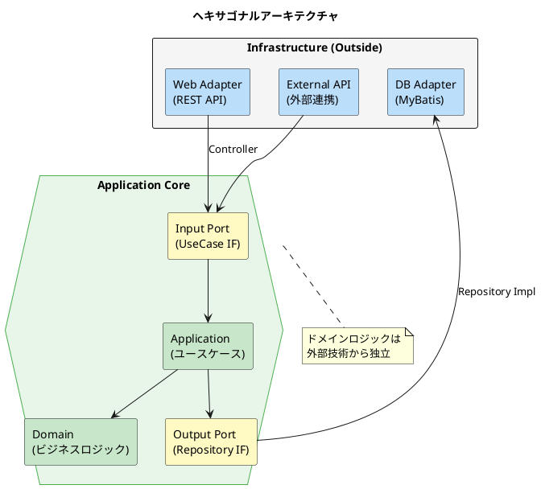
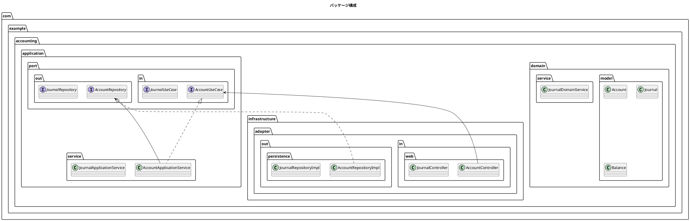
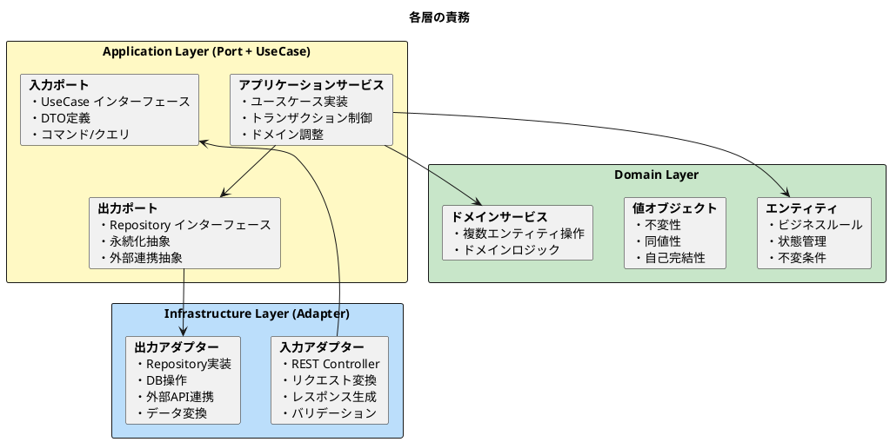
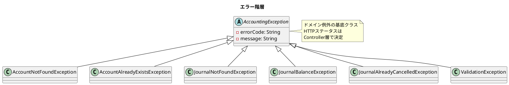

# 第21章：API サービスの実装

本章では、財務会計システムの API サービスを TDD で実装します。ヘキサゴナルアーキテクチャに基づき、勘定科目マスタ API、仕訳 API、残高照会 API を構築します。

## 21.1 ヘキサゴナルアーキテクチャの復習

### 21.1.1 Ports and Adapters パターンの概要

ヘキサゴナルアーキテクチャ（別名：Ports and Adapters パターン）は、ドメインロジックを外部の技術的関心事から分離するアーキテクチャパターンです。



### 21.1.2 ドメイン中心設計

ヘキサゴナルアーキテクチャでは、ドメインロジックがアプリケーションの中心に位置します。外部の技術（Web フレームワーク、データベース、外部 API）は周辺に配置され、ドメインに依存します。

### 21.1.3 依存性の逆転

依存性の方向は常に外側から内側（ドメイン）に向かいます。Output Port（リポジトリインターフェース）を使用することで、ドメインがインフラストラクチャに依存しない設計を実現します。

### 21.1.4 テスト容易性

アーキテクチャの利点をまとめます。

| 利点 | 説明 |
|------|------|
| **テスト容易性** | ドメインロジックを単独でテスト可能 |
| **技術独立性** | DB、フレームワークの変更が容易 |
| **可読性** | 責務が明確に分離される |
| **保守性** | 変更の影響範囲が限定される |

## 21.2 アーキテクチャ構造

### 21.2.1 パッケージ構成



### 21.2.2 各レイヤーの責務



## 21.3 マスタ API の実装

### 21.3.1 勘定科目マスタ API（CRUD エンドポイント）

勘定科目マスタの API エンドポイントを設計します。

| メソッド | パス | 説明 |
|---------|------|------|
| GET | /api/accounts | 勘定科目一覧取得 |
| GET | /api/accounts/{accountCode} | 勘定科目取得 |
| GET | /api/accounts/{accountCode}/hierarchy | 科目階層取得 |
| POST | /api/accounts | 勘定科目登録 |
| PUT | /api/accounts/{accountCode} | 勘定科目更新 |
| DELETE | /api/accounts/{accountCode} | 勘定科目削除 |

<details>
<summary>Output Port（リポジトリインターフェース）</summary>

```java
// src/main/java/com/example/accounting/application/port/out/AccountRepository.java
package com.example.accounting.application.port.out;

import com.example.accounting.domain.model.account.AccountMaster;

import java.util.List;
import java.util.Optional;

public interface AccountRepository {

    /**
     * 勘定科目コードで検索
     */
    Optional<AccountMaster> findByCode(String accountCode);

    /**
     * 全件取得
     */
    List<AccountMaster> findAll();

    /**
     * BSPL区分で検索
     */
    List<AccountMaster> findByBsPlType(String bsPlType);

    /**
     * 科目パスで検索（チルダ連結方式）
     */
    List<AccountMaster> findByPathLike(String pathPattern);

    /**
     * 計上科目のみ取得
     */
    List<AccountMaster> findPostingAccounts();

    /**
     * 保存（新規・更新）
     */
    void save(AccountMaster account);

    /**
     * 削除
     */
    void delete(String accountCode);

    /**
     * 存在確認
     */
    boolean exists(String accountCode);
}
```

</details>

<details>
<summary>Input Port（ユースケースインターフェース）</summary>

```java
// src/main/java/com/example/accounting/application/port/in/AccountUseCase.java
package com.example.accounting.application.port.in;

import com.example.accounting.application.port.in.dto.*;

import java.util.List;

public interface AccountUseCase {

    /**
     * 勘定科目を取得
     */
    AccountResponse getAccount(String accountCode);

    /**
     * 全勘定科目を取得
     */
    List<AccountResponse> getAllAccounts();

    /**
     * BS/PL区分で勘定科目を取得
     */
    List<AccountResponse> getAccountsByBsPlType(String bsPlType);

    /**
     * 科目階層を取得（親科目以下の全科目）
     */
    List<AccountResponse> getAccountHierarchy(String parentAccountCode);

    /**
     * 計上科目のみ取得
     */
    List<AccountResponse> getPostingAccounts();

    /**
     * 勘定科目を登録
     */
    AccountResponse createAccount(CreateAccountCommand command);

    /**
     * 勘定科目を更新
     */
    AccountResponse updateAccount(String accountCode, UpdateAccountCommand command);

    /**
     * 勘定科目を削除
     */
    void deleteAccount(String accountCode);
}
```

</details>

### 21.3.2 TDD による実装（Red-Green-Refactor）

#### Red: 失敗するテストを書く

<details>
<summary>Controller テスト</summary>

```java
// src/test/java/com/example/accounting/infrastructure/adapter/in/web/AccountControllerTest.java
package com.example.accounting.infrastructure.adapter.in.web;

import com.example.accounting.application.port.in.AccountUseCase;
import com.example.accounting.application.port.in.dto.*;
import com.fasterxml.jackson.databind.ObjectMapper;
import org.junit.jupiter.api.*;
import org.springframework.beans.factory.annotation.Autowired;
import org.springframework.boot.test.autoconfigure.web.servlet.WebMvcTest;
import org.springframework.boot.test.mock.mockito.MockBean;
import org.springframework.http.MediaType;
import org.springframework.test.web.servlet.MockMvc;

import java.util.List;

import static org.mockito.ArgumentMatchers.*;
import static org.mockito.BDDMockito.*;
import static org.springframework.test.web.servlet.request.MockMvcRequestBuilders.*;
import static org.springframework.test.web.servlet.result.MockMvcResultMatchers.*;

@WebMvcTest(AccountController.class)
@DisplayName("勘定科目マスタ API")
class AccountControllerTest {

    @Autowired
    private MockMvc mockMvc;

    @Autowired
    private ObjectMapper objectMapper;

    @MockBean
    private AccountUseCase accountUseCase;

    @Nested
    @DisplayName("GET /api/accounts/{accountCode}")
    class GetAccount {

        @Test
        @DisplayName("勘定科目を取得できる")
        void canGetAccount() throws Exception {
            // Given
            AccountResponse response = AccountResponse.builder()
                    .accountCode("11110")
                    .accountName("現金")
                    .accountShortName("現金")
                    .bsPlType("BS")
                    .dcType("借方")
                    .elementType("資産")
                    .summaryType("計上科目")
                    .build();

            given(accountUseCase.getAccount("11110")).willReturn(response);

            // When & Then
            mockMvc.perform(get("/api/accounts/{accountCode}", "11110"))
                    .andExpect(status().isOk())
                    .andExpect(jsonPath("$.accountCode").value("11110"))
                    .andExpect(jsonPath("$.accountName").value("現金"))
                    .andExpect(jsonPath("$.bsPlType").value("BS"));
        }

        @Test
        @DisplayName("存在しない勘定科目は404を返す")
        void notFoundForNonExistent() throws Exception {
            // Given
            given(accountUseCase.getAccount("99999")).willThrow(
                    new AccountNotFoundException("99999"));

            // When & Then
            mockMvc.perform(get("/api/accounts/{accountCode}", "99999"))
                    .andExpect(status().isNotFound());
        }
    }

    @Nested
    @DisplayName("POST /api/accounts")
    class CreateAccount {

        @Test
        @DisplayName("勘定科目を登録できる")
        void canCreateAccount() throws Exception {
            // Given
            CreateAccountCommand command = CreateAccountCommand.builder()
                    .accountCode("11150")
                    .accountName("手許現金")
                    .bsPlType("BS")
                    .dcType("借方")
                    .elementType("資産")
                    .summaryType("計上科目")
                    .build();

            AccountResponse response = AccountResponse.builder()
                    .accountCode("11150")
                    .accountName("手許現金")
                    .bsPlType("BS")
                    .dcType("借方")
                    .build();

            given(accountUseCase.createAccount(any())).willReturn(response);

            // When & Then
            mockMvc.perform(post("/api/accounts")
                            .contentType(MediaType.APPLICATION_JSON)
                            .content(objectMapper.writeValueAsString(command)))
                    .andExpect(status().isCreated())
                    .andExpect(jsonPath("$.accountCode").value("11150"));
        }

        @Test
        @DisplayName("バリデーションエラーで400を返す")
        void badRequestForValidationError() throws Exception {
            // Given
            CreateAccountCommand command = CreateAccountCommand.builder()
                    .accountCode("")  // 必須項目が空
                    .build();

            // When & Then
            mockMvc.perform(post("/api/accounts")
                            .contentType(MediaType.APPLICATION_JSON)
                            .content(objectMapper.writeValueAsString(command)))
                    .andExpect(status().isBadRequest());
        }
    }
}
```

</details>

#### Green: テストを通す最小限の実装

<details>
<summary>Controller の実装</summary>

```java
// src/main/java/com/example/accounting/infrastructure/adapter/in/web/AccountController.java
package com.example.accounting.infrastructure.adapter.in.web;

import com.example.accounting.application.port.in.AccountUseCase;
import com.example.accounting.application.port.in.dto.*;
import io.swagger.v3.oas.annotations.Operation;
import io.swagger.v3.oas.annotations.Parameter;
import io.swagger.v3.oas.annotations.responses.ApiResponse;
import io.swagger.v3.oas.annotations.tags.Tag;
import jakarta.validation.Valid;
import lombok.RequiredArgsConstructor;
import org.springframework.http.HttpStatus;
import org.springframework.http.ResponseEntity;
import org.springframework.web.bind.annotation.*;

import java.util.List;

@RestController
@RequestMapping("/api/accounts")
@RequiredArgsConstructor
@Tag(name = "勘定科目マスタ", description = "勘定科目マスタの管理API")
public class AccountController {

    private final AccountUseCase accountUseCase;

    @GetMapping("/{accountCode}")
    @Operation(summary = "勘定科目取得", description = "勘定科目コードで勘定科目を取得します")
    @ApiResponse(responseCode = "200", description = "取得成功")
    @ApiResponse(responseCode = "404", description = "勘定科目が存在しない")
    public ResponseEntity<AccountResponse> getAccount(
            @Parameter(description = "勘定科目コード")
            @PathVariable String accountCode) {
        return ResponseEntity.ok(accountUseCase.getAccount(accountCode));
    }

    @GetMapping
    @Operation(summary = "勘定科目一覧取得", description = "勘定科目の一覧を取得します")
    public ResponseEntity<List<AccountResponse>> getAccounts(
            @Parameter(description = "BSPL区分（BS/PL）")
            @RequestParam(required = false) String bsPlType,
            @Parameter(description = "計上科目のみ")
            @RequestParam(required = false, defaultValue = "false") boolean postingOnly) {

        List<AccountResponse> accounts;
        if (bsPlType != null) {
            accounts = accountUseCase.getAccountsByBsPlType(bsPlType);
        } else if (postingOnly) {
            accounts = accountUseCase.getPostingAccounts();
        } else {
            accounts = accountUseCase.getAllAccounts();
        }
        return ResponseEntity.ok(accounts);
    }

    @PostMapping
    @Operation(summary = "勘定科目登録", description = "新規勘定科目を登録します")
    @ApiResponse(responseCode = "201", description = "登録成功")
    @ApiResponse(responseCode = "400", description = "バリデーションエラー")
    public ResponseEntity<AccountResponse> createAccount(
            @Valid @RequestBody CreateAccountCommand command) {
        AccountResponse response = accountUseCase.createAccount(command);
        return ResponseEntity.status(HttpStatus.CREATED).body(response);
    }

    @PutMapping("/{accountCode}")
    @Operation(summary = "勘定科目更新", description = "勘定科目を更新します")
    public ResponseEntity<AccountResponse> updateAccount(
            @PathVariable String accountCode,
            @Valid @RequestBody UpdateAccountCommand command) {
        return ResponseEntity.ok(accountUseCase.updateAccount(accountCode, command));
    }

    @DeleteMapping("/{accountCode}")
    @Operation(summary = "勘定科目削除", description = "勘定科目を削除します")
    @ApiResponse(responseCode = "204", description = "削除成功")
    public ResponseEntity<Void> deleteAccount(@PathVariable String accountCode) {
        accountUseCase.deleteAccount(accountCode);
        return ResponseEntity.noContent().build();
    }
}
```

</details>

#### Refactor: Application Service の実装

<details>
<summary>Application Service</summary>

```java
// src/main/java/com/example/accounting/application/service/AccountApplicationService.java
package com.example.accounting.application.service;

import com.example.accounting.application.port.in.AccountUseCase;
import com.example.accounting.application.port.in.dto.*;
import com.example.accounting.application.port.out.AccountRepository;
import com.example.accounting.application.port.out.AccountConfigRepository;
import com.example.accounting.domain.model.account.*;
import lombok.RequiredArgsConstructor;
import org.springframework.stereotype.Service;
import org.springframework.transaction.annotation.Transactional;

import java.util.List;
import java.util.stream.Collectors;

@Service
@RequiredArgsConstructor
@Transactional(readOnly = true)
public class AccountApplicationService implements AccountUseCase {

    private final AccountRepository accountRepository;
    private final AccountConfigRepository accountConfigRepository;

    @Override
    public AccountResponse getAccount(String accountCode) {
        AccountMaster account = accountRepository.findByCode(accountCode)
                .orElseThrow(() -> new AccountNotFoundException(accountCode));
        return AccountResponse.from(account);
    }

    @Override
    public List<AccountResponse> getAllAccounts() {
        return accountRepository.findAll().stream()
                .map(AccountResponse::from)
                .collect(Collectors.toList());
    }

    @Override
    public List<AccountResponse> getAccountsByBsPlType(String bsPlType) {
        return accountRepository.findByBsPlType(bsPlType).stream()
                .map(AccountResponse::from)
                .collect(Collectors.toList());
    }

    @Override
    public List<AccountResponse> getAccountHierarchy(String parentAccountCode) {
        String pathPattern = "%" + parentAccountCode + "%";
        return accountRepository.findByPathLike(pathPattern).stream()
                .map(AccountResponse::from)
                .collect(Collectors.toList());
    }

    @Override
    public List<AccountResponse> getPostingAccounts() {
        return accountRepository.findPostingAccounts().stream()
                .map(AccountResponse::from)
                .collect(Collectors.toList());
    }

    @Override
    @Transactional
    public AccountResponse createAccount(CreateAccountCommand command) {
        if (accountRepository.exists(command.getAccountCode())) {
            throw new AccountAlreadyExistsException(command.getAccountCode());
        }

        AccountMaster account = AccountMaster.builder()
                .accountCode(command.getAccountCode())
                .accountName(command.getAccountName())
                .accountShortName(command.getAccountShortName())
                .bsPlType(BsPlType.valueOf(command.getBsPlType()))
                .dcType(AccountDcType.fromDisplayName(command.getDcType()))
                .elementType(ElementType.fromDisplayName(command.getElementType()))
                .summaryType(SummaryType.fromDisplayName(command.getSummaryType()))
                .taxCode(command.getTaxCode())
                .build();

        accountRepository.save(account);

        String accountPath = generateAccountPath(command.getAccountCode(), command.getParentAccountCode());
        AccountConfig config = AccountConfig.builder()
                .accountCode(command.getAccountCode())
                .accountPath(accountPath)
                .build();
        accountConfigRepository.save(config);

        return AccountResponse.from(account);
    }

    @Override
    @Transactional
    public AccountResponse updateAccount(String accountCode, UpdateAccountCommand command) {
        AccountMaster account = accountRepository.findByCode(accountCode)
                .orElseThrow(() -> new AccountNotFoundException(accountCode));

        if (command.getAccountName() != null) {
            account.setAccountName(command.getAccountName());
        }
        if (command.getAccountShortName() != null) {
            account.setAccountShortName(command.getAccountShortName());
        }

        accountRepository.save(account);
        return AccountResponse.from(account);
    }

    @Override
    @Transactional
    public void deleteAccount(String accountCode) {
        if (!accountRepository.exists(accountCode)) {
            throw new AccountNotFoundException(accountCode);
        }
        accountConfigRepository.delete(accountCode);
        accountRepository.delete(accountCode);
    }

    private String generateAccountPath(String accountCode, String parentAccountCode) {
        if (parentAccountCode == null || parentAccountCode.isEmpty()) {
            return accountCode;
        }
        return accountConfigRepository.findByCode(parentAccountCode)
                .map(parent -> parent.getAccountPath() + "~" + accountCode)
                .orElse(accountCode);
    }
}
```

</details>

### 21.3.3 補助科目マスタ API

補助科目は勘定科目に紐づく詳細区分で、得意先・仕入先・銀行口座などを管理します。

| メソッド | パス | 説明 |
|---------|------|------|
| GET | /api/accounts/{accountCode}/sub-accounts | 補助科目一覧取得 |
| POST | /api/accounts/{accountCode}/sub-accounts | 補助科目登録 |

## 21.4 トランザクション API の実装

### 21.4.1 仕訳 API

仕訳の登録・照会・訂正・取消を行う API を実装します。

| メソッド | パス | 説明 |
|---------|------|------|
| GET | /api/journals | 仕訳一覧取得 |
| GET | /api/journals/{journalNumber} | 仕訳取得 |
| POST | /api/journals | 仕訳登録 |
| POST | /api/journals/check-balance | 貸借バランスチェック |
| POST | /api/journals/{journalNumber}/cancel | 仕訳取消（赤黒処理） |
| POST | /api/journals/{journalNumber}/correct | 仕訳訂正（赤黒処理） |

<details>
<summary>仕訳ユースケースインターフェース</summary>

```java
// src/main/java/com/example/accounting/application/port/in/JournalUseCase.java
package com.example.accounting.application.port.in;

import com.example.accounting.application.port.in.dto.*;

import java.time.LocalDate;
import java.util.List;

public interface JournalUseCase {

    /**
     * 仕訳を取得
     */
    JournalResponse getJournal(String journalNumber);

    /**
     * 日付範囲で仕訳を検索
     */
    List<JournalResponse> getJournalsByDateRange(LocalDate fromDate, LocalDate toDate);

    /**
     * 部門で仕訳を検索
     */
    List<JournalResponse> getJournalsByDepartment(String departmentCode, LocalDate fromDate, LocalDate toDate);

    /**
     * 仕訳を登録
     */
    JournalResponse createJournal(CreateJournalCommand command);

    /**
     * 仕訳を取消（赤黒処理）
     */
    JournalCancellationResult cancelJournal(String journalNumber, String reason);

    /**
     * 仕訳を訂正（赤黒処理）
     */
    JournalCorrectionResult correctJournal(String journalNumber, CreateJournalCommand correctedData, String reason);

    /**
     * 貸借バランスをチェック
     */
    BalanceCheckResult checkBalance(CreateJournalCommand command);
}
```

</details>

<details>
<summary>仕訳 Controller</summary>

```java
// src/main/java/com/example/accounting/infrastructure/adapter/in/web/JournalController.java
package com.example.accounting.infrastructure.adapter.in.web;

import com.example.accounting.application.port.in.JournalUseCase;
import com.example.accounting.application.port.in.dto.*;
import io.swagger.v3.oas.annotations.Operation;
import io.swagger.v3.oas.annotations.Parameter;
import io.swagger.v3.oas.annotations.tags.Tag;
import jakarta.validation.Valid;
import lombok.RequiredArgsConstructor;
import org.springframework.format.annotation.DateTimeFormat;
import org.springframework.http.HttpStatus;
import org.springframework.http.ResponseEntity;
import org.springframework.web.bind.annotation.*;

import java.time.LocalDate;
import java.util.List;

@RestController
@RequestMapping("/api/journals")
@RequiredArgsConstructor
@Tag(name = "仕訳", description = "仕訳の管理API")
public class JournalController {

    private final JournalUseCase journalUseCase;

    @GetMapping("/{journalNumber}")
    @Operation(summary = "仕訳取得", description = "仕訳伝票番号で仕訳を取得します")
    public ResponseEntity<JournalResponse> getJournal(
            @Parameter(description = "仕訳伝票番号")
            @PathVariable String journalNumber) {
        return ResponseEntity.ok(journalUseCase.getJournal(journalNumber));
    }

    @GetMapping
    @Operation(summary = "仕訳一覧取得", description = "条件を指定して仕訳を検索します")
    public ResponseEntity<List<JournalResponse>> getJournals(
            @Parameter(description = "開始日")
            @RequestParam @DateTimeFormat(iso = DateTimeFormat.ISO.DATE) LocalDate fromDate,
            @Parameter(description = "終了日")
            @RequestParam @DateTimeFormat(iso = DateTimeFormat.ISO.DATE) LocalDate toDate,
            @Parameter(description = "部門コード")
            @RequestParam(required = false) String departmentCode) {

        List<JournalResponse> journals;
        if (departmentCode != null) {
            journals = journalUseCase.getJournalsByDepartment(departmentCode, fromDate, toDate);
        } else {
            journals = journalUseCase.getJournalsByDateRange(fromDate, toDate);
        }
        return ResponseEntity.ok(journals);
    }

    @PostMapping
    @Operation(summary = "仕訳登録", description = "新規仕訳を登録します")
    public ResponseEntity<JournalResponse> createJournal(
            @Valid @RequestBody CreateJournalCommand command) {
        JournalResponse response = journalUseCase.createJournal(command);
        return ResponseEntity.status(HttpStatus.CREATED).body(response);
    }

    @PostMapping("/check-balance")
    @Operation(summary = "貸借バランスチェック", description = "仕訳の貸借バランスをチェックします")
    public ResponseEntity<BalanceCheckResult> checkBalance(
            @Valid @RequestBody CreateJournalCommand command) {
        return ResponseEntity.ok(journalUseCase.checkBalance(command));
    }

    @PostMapping("/{journalNumber}/cancel")
    @Operation(summary = "仕訳取消", description = "仕訳を赤黒処理で取消します")
    public ResponseEntity<JournalCancellationResult> cancelJournal(
            @PathVariable String journalNumber,
            @RequestParam String reason) {
        return ResponseEntity.ok(journalUseCase.cancelJournal(journalNumber, reason));
    }

    @PostMapping("/{journalNumber}/correct")
    @Operation(summary = "仕訳訂正", description = "仕訳を赤黒処理で訂正します")
    public ResponseEntity<JournalCorrectionResult> correctJournal(
            @PathVariable String journalNumber,
            @RequestParam String reason,
            @Valid @RequestBody CreateJournalCommand correctedData) {
        return ResponseEntity.ok(journalUseCase.correctJournal(journalNumber, correctedData, reason));
    }
}
```

</details>

### 21.4.2 残高照会 API

日次残高・月次残高・部門別残高を照会する API を実装します。

| メソッド | パス | 説明 |
|---------|------|------|
| GET | /api/balances/daily | 日次残高取得 |
| GET | /api/balances/monthly | 月次残高取得 |
| GET | /api/balances/accounts/{accountCode} | 勘定科目別残高取得 |
| GET | /api/balances/departments | 部門別残高取得 |

<details>
<summary>残高照会 Controller</summary>

```java
// src/main/java/com/example/accounting/infrastructure/adapter/in/web/BalanceController.java
package com.example.accounting.infrastructure.adapter.in.web;

import com.example.accounting.application.port.in.BalanceUseCase;
import com.example.accounting.application.port.in.dto.*;
import io.swagger.v3.oas.annotations.Operation;
import io.swagger.v3.oas.annotations.Parameter;
import io.swagger.v3.oas.annotations.tags.Tag;
import lombok.RequiredArgsConstructor;
import org.springframework.format.annotation.DateTimeFormat;
import org.springframework.http.ResponseEntity;
import org.springframework.web.bind.annotation.*;

import java.time.LocalDate;
import java.util.List;

@RestController
@RequestMapping("/api/balances")
@RequiredArgsConstructor
@Tag(name = "残高照会", description = "勘定科目残高の照会API")
public class BalanceController {

    private final BalanceUseCase balanceUseCase;

    @GetMapping("/daily")
    @Operation(summary = "日次残高取得", description = "指定日の勘定科目残高を取得します")
    public ResponseEntity<List<DailyBalanceResponse>> getDailyBalances(
            @Parameter(description = "対象日")
            @RequestParam @DateTimeFormat(iso = DateTimeFormat.ISO.DATE) LocalDate date,
            @Parameter(description = "勘定科目コード（省略時は全科目）")
            @RequestParam(required = false) String accountCode) {
        return ResponseEntity.ok(balanceUseCase.getDailyBalances(date, accountCode));
    }

    @GetMapping("/monthly")
    @Operation(summary = "月次残高取得", description = "指定月の勘定科目残高を取得します")
    public ResponseEntity<List<MonthlyBalanceResponse>> getMonthlyBalances(
            @Parameter(description = "決算期")
            @RequestParam int fiscalYear,
            @Parameter(description = "月度")
            @RequestParam int month) {
        return ResponseEntity.ok(balanceUseCase.getMonthlyBalances(fiscalYear, month));
    }

    @GetMapping("/accounts/{accountCode}")
    @Operation(summary = "勘定科目別残高取得", description = "勘定科目の期間別残高を取得します")
    public ResponseEntity<AccountBalanceSummary> getAccountBalanceSummary(
            @PathVariable String accountCode,
            @RequestParam @DateTimeFormat(iso = DateTimeFormat.ISO.DATE) LocalDate fromDate,
            @RequestParam @DateTimeFormat(iso = DateTimeFormat.ISO.DATE) LocalDate toDate) {
        return ResponseEntity.ok(balanceUseCase.getAccountBalanceSummary(accountCode, fromDate, toDate));
    }

    @GetMapping("/departments")
    @Operation(summary = "部門別残高取得", description = "部門別の勘定科目残高を取得します")
    public ResponseEntity<List<DepartmentBalanceResponse>> getDepartmentBalances(
            @RequestParam int fiscalYear,
            @RequestParam int month,
            @RequestParam(required = false) String accountCode) {
        return ResponseEntity.ok(balanceUseCase.getDepartmentBalances(fiscalYear, month, accountCode));
    }
}
```

</details>

### 21.4.3 試算表 API

日計表と合計残高試算表を出力する API を実装します。

<details>
<summary>帳票出力 Controller</summary>

```java
// src/main/java/com/example/accounting/infrastructure/adapter/in/web/ReportController.java
package com.example.accounting.infrastructure.adapter.in.web;

import com.example.accounting.application.port.in.BalanceUseCase;
import com.example.accounting.application.port.in.dto.*;
import io.swagger.v3.oas.annotations.Operation;
import io.swagger.v3.oas.annotations.tags.Tag;
import lombok.RequiredArgsConstructor;
import org.springframework.format.annotation.DateTimeFormat;
import org.springframework.http.ResponseEntity;
import org.springframework.web.bind.annotation.*;

import java.time.LocalDate;

@RestController
@RequestMapping("/api/reports")
@RequiredArgsConstructor
@Tag(name = "帳票出力", description = "会計帳票の出力API")
public class ReportController {

    private final BalanceUseCase balanceUseCase;

    @GetMapping("/daily-report")
    @Operation(summary = "日計表取得", description = "指定日の日計表データを取得します")
    public ResponseEntity<DailyReportResponse> getDailyReport(
            @RequestParam @DateTimeFormat(iso = DateTimeFormat.ISO.DATE) LocalDate date) {
        return ResponseEntity.ok(balanceUseCase.getDailyReport(date));
    }

    @GetMapping("/trial-balance")
    @Operation(summary = "合計残高試算表取得", description = "指定月の合計残高試算表を取得します")
    public ResponseEntity<TrialBalanceResponse> getTrialBalance(
            @RequestParam int fiscalYear,
            @RequestParam int month) {
        return ResponseEntity.ok(balanceUseCase.getTrialBalance(fiscalYear, month));
    }
}
```

</details>

<details>
<summary>合計残高試算表レスポンス DTO</summary>

```java
// src/main/java/com/example/accounting/application/port/in/dto/TrialBalanceResponse.java
package com.example.accounting.application.port.in.dto;

import lombok.Builder;
import lombok.Data;

import java.math.BigDecimal;
import java.util.List;

@Data
@Builder
public class TrialBalanceResponse {
    private int fiscalYear;
    private int month;
    private List<TrialBalanceLine> lines;
    private TrialBalanceTotals totals;

    @Data
    @Builder
    public static class TrialBalanceLine {
        private String accountCode;
        private String accountName;
        private String bsPlType;
        private String dcType;
        private BigDecimal openingBalance;
        private BigDecimal debitAmount;
        private BigDecimal creditAmount;
        private BigDecimal closingBalance;
    }

    @Data
    @Builder
    public static class TrialBalanceTotals {
        private BigDecimal totalOpeningDebit;
        private BigDecimal totalOpeningCredit;
        private BigDecimal totalDebit;
        private BigDecimal totalCredit;
        private BigDecimal totalClosingDebit;
        private BigDecimal totalClosingCredit;
    }
}
```

</details>

## 21.5 エラーハンドリング

### 21.5.1 ドメイン例外の定義



<details>
<summary>ドメイン例外クラス</summary>

```java
// src/main/java/com/example/accounting/domain/exception/AccountingException.java
package com.example.accounting.domain.exception;

import lombok.Getter;

@Getter
public abstract class AccountingException extends RuntimeException {
    private final String errorCode;

    protected AccountingException(String errorCode, String message) {
        super(message);
        this.errorCode = errorCode;
    }
}

// AccountNotFoundException.java
package com.example.accounting.domain.exception;

public class AccountNotFoundException extends AccountingException {
    public AccountNotFoundException(String accountCode) {
        super("ACC001", "勘定科目が見つかりません: " + accountCode);
    }
}

// JournalBalanceException.java
package com.example.accounting.domain.exception;

import java.math.BigDecimal;

public class JournalBalanceException extends AccountingException {
    public JournalBalanceException(BigDecimal debit, BigDecimal credit) {
        super("JNL001", String.format("貸借が一致しません。借方合計: %s, 貸方合計: %s", debit, credit));
    }
}
```

</details>

### 21.5.2 グローバル例外ハンドラー

<details>
<summary>GlobalExceptionHandler</summary>

```java
// src/main/java/com/example/accounting/infrastructure/adapter/in/web/GlobalExceptionHandler.java
package com.example.accounting.infrastructure.adapter.in.web;

import com.example.accounting.domain.exception.*;
import lombok.Builder;
import lombok.Data;
import lombok.extern.slf4j.Slf4j;
import org.springframework.http.HttpStatus;
import org.springframework.http.ResponseEntity;
import org.springframework.validation.FieldError;
import org.springframework.web.bind.MethodArgumentNotValidException;
import org.springframework.web.bind.annotation.ExceptionHandler;
import org.springframework.web.bind.annotation.RestControllerAdvice;

import java.time.LocalDateTime;
import java.util.HashMap;
import java.util.Map;

@RestControllerAdvice
@Slf4j
public class GlobalExceptionHandler {

    @ExceptionHandler(AccountNotFoundException.class)
    public ResponseEntity<ErrorResponse> handleAccountNotFoundException(AccountNotFoundException e) {
        log.warn("Account not found: {}", e.getMessage());
        return ResponseEntity.status(HttpStatus.NOT_FOUND)
                .body(createErrorResponse(e.getErrorCode(), e.getMessage()));
    }

    @ExceptionHandler(JournalNotFoundException.class)
    public ResponseEntity<ErrorResponse> handleJournalNotFoundException(JournalNotFoundException e) {
        log.warn("Journal not found: {}", e.getMessage());
        return ResponseEntity.status(HttpStatus.NOT_FOUND)
                .body(createErrorResponse(e.getErrorCode(), e.getMessage()));
    }

    @ExceptionHandler(JournalBalanceException.class)
    public ResponseEntity<ErrorResponse> handleJournalBalanceException(JournalBalanceException e) {
        log.warn("Journal balance error: {}", e.getMessage());
        return ResponseEntity.status(HttpStatus.BAD_REQUEST)
                .body(createErrorResponse(e.getErrorCode(), e.getMessage()));
    }

    @ExceptionHandler(MethodArgumentNotValidException.class)
    public ResponseEntity<ValidationErrorResponse> handleValidationException(MethodArgumentNotValidException e) {
        log.warn("Validation error: {}", e.getMessage());

        Map<String, String> errors = new HashMap<>();
        e.getBindingResult().getAllErrors().forEach(error -> {
            String fieldName = ((FieldError) error).getField();
            String errorMessage = error.getDefaultMessage();
            errors.put(fieldName, errorMessage);
        });

        return ResponseEntity.status(HttpStatus.BAD_REQUEST)
                .body(ValidationErrorResponse.builder()
                        .errorCode("VAL001")
                        .message("入力値が不正です")
                        .timestamp(LocalDateTime.now())
                        .errors(errors)
                        .build());
    }

    @ExceptionHandler(Exception.class)
    public ResponseEntity<ErrorResponse> handleGenericException(Exception e) {
        log.error("Unexpected error", e);
        return ResponseEntity.status(HttpStatus.INTERNAL_SERVER_ERROR)
                .body(createErrorResponse("SYS001", "システムエラーが発生しました"));
    }

    private ErrorResponse createErrorResponse(String errorCode, String message) {
        return ErrorResponse.builder()
                .errorCode(errorCode)
                .message(message)
                .timestamp(LocalDateTime.now())
                .build();
    }

    @Data
    @Builder
    public static class ErrorResponse {
        private String errorCode;
        private String message;
        private LocalDateTime timestamp;
    }

    @Data
    @Builder
    public static class ValidationErrorResponse {
        private String errorCode;
        private String message;
        private LocalDateTime timestamp;
        private Map<String, String> errors;
    }
}
```

</details>

## 21.6 API ドキュメント

### 21.6.1 OpenAPI / Swagger の設定

<details>
<summary>OpenAPI 設定</summary>

```java
// src/main/java/com/example/accounting/infrastructure/config/OpenApiConfig.java
package com.example.accounting.infrastructure.config;

import io.swagger.v3.oas.models.OpenAPI;
import io.swagger.v3.oas.models.info.Contact;
import io.swagger.v3.oas.models.info.Info;
import io.swagger.v3.oas.models.info.License;
import io.swagger.v3.oas.models.servers.Server;
import org.springframework.context.annotation.Bean;
import org.springframework.context.annotation.Configuration;

import java.util.List;

@Configuration
public class OpenApiConfig {

    @Bean
    public OpenAPI customOpenAPI() {
        return new OpenAPI()
                .info(new Info()
                        .title("財務会計システム API")
                        .description("財務会計システムのREST API仕様書")
                        .version("1.0.0")
                        .contact(new Contact()
                                .name("開発チーム")
                                .email("dev@example.com"))
                        .license(new License()
                                .name("MIT License")
                                .url("https://opensource.org/licenses/MIT")))
                .servers(List.of(
                        new Server().url("http://localhost:8080").description("開発環境"),
                        new Server().url("https://api.example.com").description("本番環境")
                ));
    }
}
```

</details>

### 21.6.2 API ドキュメントへのアクセス

アプリケーション起動後、以下の URL で API 仕様書を確認できます：

- **Swagger UI**: http://localhost:8080/swagger-ui.html
- **OpenAPI JSON**: http://localhost:8080/api-docs

## 21.7 API インテグレーションテスト

### 21.7.1 テストコンテナによる統合テスト環境

Testcontainers を使用して、実際の PostgreSQL データベースを使用した統合テストを実行します。

<details>
<summary>統合テストの設定</summary>

```java
// src/test/java/com/example/accounting/infrastructure/adapter/in/web/AccountControllerIntegrationTest.java
package com.example.accounting.infrastructure.adapter.in.web;

import com.example.accounting.application.port.in.dto.CreateAccountCommand;
import com.fasterxml.jackson.databind.ObjectMapper;
import org.junit.jupiter.api.*;
import org.springframework.beans.factory.annotation.Autowired;
import org.springframework.boot.test.autoconfigure.web.servlet.AutoConfigureMockMvc;
import org.springframework.boot.test.context.SpringBootTest;
import org.springframework.http.MediaType;
import org.springframework.test.context.DynamicPropertyRegistry;
import org.springframework.test.context.DynamicPropertySource;
import org.springframework.test.web.servlet.MockMvc;
import org.testcontainers.containers.PostgreSQLContainer;
import org.testcontainers.junit.jupiter.Container;
import org.testcontainers.junit.jupiter.Testcontainers;

import static org.springframework.test.web.servlet.request.MockMvcRequestBuilders.*;
import static org.springframework.test.web.servlet.result.MockMvcResultMatchers.*;

@SpringBootTest
@AutoConfigureMockMvc
@Testcontainers
@DisplayName("勘定科目 API 統合テスト")
class AccountControllerIntegrationTest {

    @Container
    static PostgreSQLContainer<?> postgres = new PostgreSQLContainer<>("postgres:16")
            .withDatabaseName("testdb")
            .withUsername("testuser")
            .withPassword("testpass");

    @DynamicPropertySource
    static void configureProperties(DynamicPropertyRegistry registry) {
        registry.add("spring.datasource.url", postgres::getJdbcUrl);
        registry.add("spring.datasource.username", postgres::getUsername);
        registry.add("spring.datasource.password", postgres::getPassword);
    }

    @Autowired
    private MockMvc mockMvc;

    @Autowired
    private ObjectMapper objectMapper;

    @Nested
    @DisplayName("勘定科目 CRUD")
    class AccountCrud {

        @Test
        @DisplayName("勘定科目の登録・取得・更新・削除が正常に動作する")
        void crudOperationsWork() throws Exception {
            // Create
            CreateAccountCommand createCommand = CreateAccountCommand.builder()
                    .accountCode("99999")
                    .accountName("テスト科目")
                    .accountShortName("テスト")
                    .bsPlType("BS")
                    .dcType("借方")
                    .elementType("資産")
                    .summaryType("計上科目")
                    .build();

            mockMvc.perform(post("/api/accounts")
                            .contentType(MediaType.APPLICATION_JSON)
                            .content(objectMapper.writeValueAsString(createCommand)))
                    .andExpect(status().isCreated())
                    .andExpect(jsonPath("$.accountCode").value("99999"))
                    .andExpect(jsonPath("$.accountName").value("テスト科目"));

            // Read
            mockMvc.perform(get("/api/accounts/{accountCode}", "99999"))
                    .andExpect(status().isOk())
                    .andExpect(jsonPath("$.accountCode").value("99999"));

            // Delete
            mockMvc.perform(delete("/api/accounts/{accountCode}", "99999"))
                    .andExpect(status().isNoContent());

            // Verify deleted
            mockMvc.perform(get("/api/accounts/{accountCode}", "99999"))
                    .andExpect(status().isNotFound());
        }
    }
}
```

</details>

### 21.7.2 API エンドポイント一覧

| メソッド | パス | 説明 |
|---------|------|------|
| GET | /api/accounts | 勘定科目一覧取得 |
| GET | /api/accounts/{accountCode} | 勘定科目取得 |
| POST | /api/accounts | 勘定科目登録 |
| PUT | /api/accounts/{accountCode} | 勘定科目更新 |
| DELETE | /api/accounts/{accountCode} | 勘定科目削除 |
| GET | /api/journals | 仕訳一覧取得 |
| GET | /api/journals/{journalNumber} | 仕訳取得 |
| POST | /api/journals | 仕訳登録 |
| POST | /api/journals/{journalNumber}/cancel | 仕訳取消 |
| POST | /api/journals/{journalNumber}/correct | 仕訳訂正 |
| GET | /api/balances/daily | 日次残高取得 |
| GET | /api/balances/monthly | 月次残高取得 |
| GET | /api/reports/daily-report | 日計表取得 |
| GET | /api/reports/trial-balance | 合計残高試算表取得 |

## まとめ

本章では、財務会計システムの API サービスを実装しました。

### 設計のポイント

1. **ヘキサゴナルアーキテクチャ**
   - ドメインロジックの独立性
   - Ports and Adapters パターンによる責務分離
   - テスト容易性の確保

2. **マスタ API の設計**
   - CRUD 操作の標準化
   - 階層構造（チルダ連結）への対応
   - バリデーションとエラーハンドリング

3. **トランザクション API の設計**
   - 仕訳の登録・照会・訂正・取消
   - 貸借バランスチェック
   - 赤黒処理との連携

4. **帳票 API の設計**
   - 日計表・合計残高試算表
   - 部門別・科目別残高照会

これで財務会計システムの第3部は完了です。次の第4部では、生産管理システムについて解説します。

---

[← 第20章：財務会計データ設計 D社事例](./chapter20.md) | [第22章：生産管理システムの全体像 →](../part4/chapter22.md)
