# 第22章：生産管理システムの全体像

本章から第4部「生産管理システム」の解説に入ります。まず、生産管理システムのスコープと、関連する組織の役割分担について解説します。

---

## 22.1 生産管理システムのスコープ

生産管理システムは、製造業における「モノづくり」の全工程を管理するシステムです。販売管理システムからの受注情報を起点として、生産計画の立案から製品の完成、在庫管理に至るまでの一連の業務プロセスを管理します。

### システム全体像

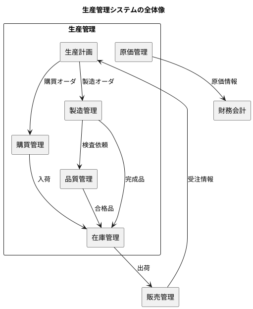

### ユースケース図

生産管理システム全体のユースケースは以下の通りです。

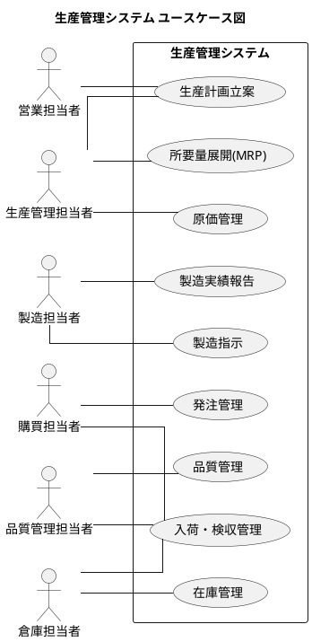

### 生産計画（MPS・MRP）

生産計画は、販売計画や受注情報に基づいて、何をいつまでにどれだけ生産するかを決定する業務です。

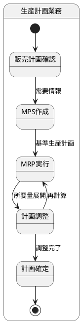

| 項目 | 説明 |
|---|---|
| MPS（基準生産計画） | 製品レベルの生産計画。何をいつまでにいくつ作るか |
| MRP（所要量展開） | BOM を使って部品・材料レベルまで展開。必要数量と時期を算出 |
| 主なデータ | オーダ情報、所要情報、引当情報 |

### 購買管理（発注・入荷・検収）

購買管理は、生産に必要な部品・材料を外部から調達する業務です。

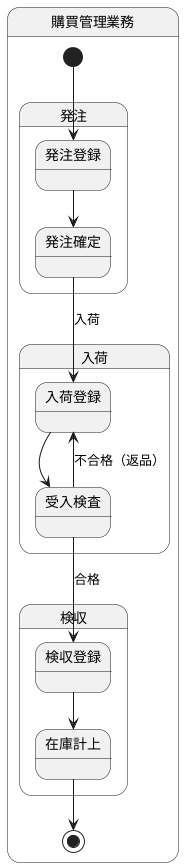

| 項目 | 説明 |
|---|---|
| 目的 | 生産に必要な部品・材料を適切なタイミングで調達 |
| 入力 | MRP からの購買オーダ、発注依頼 |
| 出力 | 発注書、入荷伝票、検収伝票 |
| 主なデータ | 発注データ、入荷受入データ、検収データ |

### 工程管理（製造指示・製造実績）

工程管理は、製造オーダに基づいて製造作業を指示し、実績を収集する業務です。

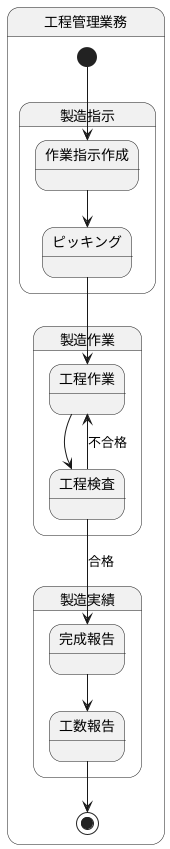

| 項目 | 説明 |
|---|---|
| 目的 | 製造オーダを効率的に実行し、実績を正確に記録 |
| 入力 | 製造オーダ、工程表、BOM |
| 出力 | 作業指示書、ピッキングリスト、完成報告書 |
| 主なデータ | 作業指示データ、完成実績データ、工数実績データ |

### 在庫管理（受払・在庫状態）

在庫管理は、部品・材料・製品の在庫数量と状態を管理する業務です。

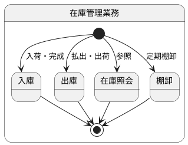

| 項目 | 説明 |
|---|---|
| 目的 | 在庫の正確な把握と適正在庫の維持 |
| 主な機能 | 在庫照会、受払管理、棚卸、在庫調整 |
| 主なデータ | 在庫データ、払出データ、棚卸データ |

### 品質管理（受入検査・出荷検査・トレーサビリティ）

品質管理は、製品の品質を確保するための検査と履歴管理を行う業務です。

| 検査種別 | タイミング | 目的 |
|---|---|---|
| 受入検査 | 入荷時 | 購入品の品質確認 |
| 工程検査 | 製造中 | 工程ごとの品質確認 |
| 出荷検査 | 出荷前 | 最終製品の品質確認 |

### 製造原価管理（標準原価・実際原価・配賦）

製造原価管理は、製品の製造にかかったコストを計算・管理する業務です。

| 原価要素 | 説明 |
|---|---|
| 材料費 | 直接材料費、間接材料費 |
| 労務費 | 直接労務費、間接労務費 |
| 製造間接費 | 減価償却費、光熱費、間接労務費等 |

### マスタ情報とトランザクション情報

生産管理システムのデータは、大きく「マスタ情報」と「トランザクション情報」に分類されます。

| 分類 | 説明 | 例 |
|-----|------|-----|
| **マスタ情報** | 基本的に変更が少ない、システムの基盤となるデータ | 品目マスタ、BOM、取引先マスタ、工程マスタ |
| **トランザクション情報** | 日々の業務で発生するデータ | 発注データ、製造実績、在庫移動 |

---

## 22.2 生産組織の役割分担

生産管理システムに関わる組織は複数あり、それぞれが異なる役割を担っています。

### 組織構成

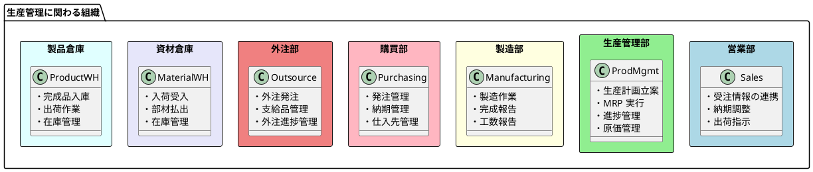

### 営業部

営業部は、得意先との接点を持ち、受注情報を生産管理に連携します。

| 業務 | 責務 | 主な操作 |
|---|---|---|
| 受注連携 | 受注情報の生産計画への連携 | 受注データ登録 |
| 納期調整 | 生産計画に基づく納期回答 | 納期回答、納期変更 |
| 出荷指示 | 製品倉庫への出荷依頼 | 出荷指示登録 |

### 生産管理部

生産管理部は、生産計画の立案から進捗管理、原価管理までを担当します。

| 業務 | 責務 | 主な操作 |
|---|---|---|
| 生産計画 | MPS・MRP の立案と調整 | 計画登録、所要量展開 |
| 進捗管理 | 製造進捗の監視と対応 | 進捗照会、遅延アラート |
| 原価管理 | 製造原価の計算と分析 | 原価計算、差異分析 |

### 製造部

製造部は、実際の製造作業を担当します。

| 業務 | 責務 | 主な操作 |
|---|---|---|
| 製造作業 | 作業指示に基づく製造 | 作業実施 |
| 完成報告 | 完成数量の報告 | 完成実績登録 |
| 工数報告 | 作業時間の報告 | 工数実績登録 |

### 購買部

購買部は、部品・材料の外部調達を担当します。

| 業務 | 責務 | 主な操作 |
|---|---|---|
| 発注 | 仕入先への発注 | 発注登録、注文書発行 |
| 納期管理 | 入荷予定の管理 | 納期確認、督促 |
| 仕入先管理 | 仕入先情報の管理 | 仕入先評価 |

### 外注部

外注部は、外注加工の管理を担当します。

| 業務 | 責務 | 主な操作 |
|---|---|---|
| 外注発注 | 外注先への加工依頼 | 外注発注登録 |
| 支給品管理 | 外注先への支給品管理 | 支給登録、消費確認 |
| 進捗管理 | 外注作業の進捗管理 | 進捗確認、督促 |

### 資材倉庫

資材倉庫は、部品・材料の物理的な管理を担当します。

| 業務 | 責務 | 主な操作 |
|---|---|---|
| 入荷受入 | 購入品の受入と検品 | 入荷登録、検品 |
| 部材払出 | 製造への部材供給 | 払出登録、ピッキング |
| 在庫管理 | 在庫数量の管理 | 棚卸、在庫調整 |

### 製品倉庫

製品倉庫は、完成品の物理的な管理を担当します。

| 業務 | 責務 | 主な操作 |
|---|---|---|
| 完成品入庫 | 製造からの完成品受入 | 入庫登録 |
| 出荷作業 | 得意先への出荷 | 出荷登録、配送手配 |
| 在庫管理 | 製品在庫の管理 | 棚卸、在庫調整 |

### 業務フローと各部門の責務

各部門がどのタイミングで業務に関与するかを、全体フローで示します。

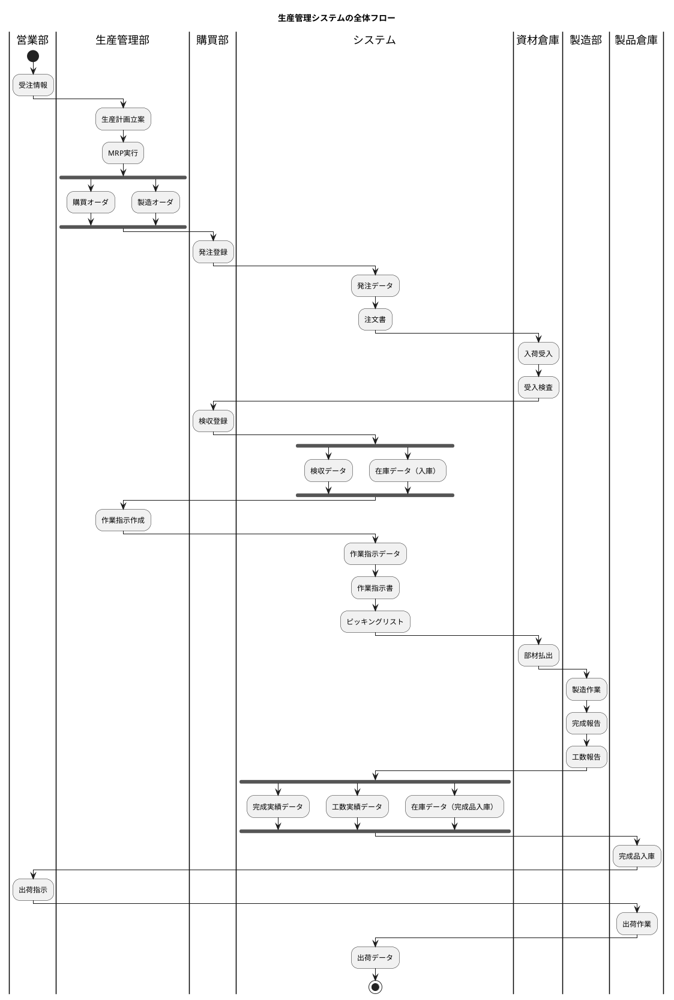

### 部門間の連携ポイント

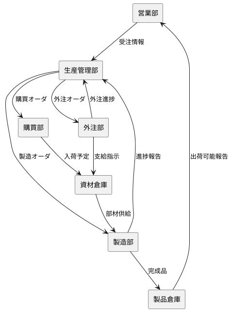

| 連携元 | 連携先 | 連携内容 |
|---|---|---|
| 営業部 | 生産管理部 | 受注情報、納期要望 |
| 生産管理部 | 購買部 | 購買オーダ |
| 生産管理部 | 製造部 | 製造オーダ、作業指示 |
| 生産管理部 | 外注部 | 外注オーダ |
| 購買部 | 資材倉庫 | 入荷予定情報 |
| 外注部 | 資材倉庫 | 支給指示 |
| 資材倉庫 | 製造部 | 部材供給 |
| 製造部 | 製品倉庫 | 完成品 |
| 製造部 | 生産管理部 | 進捗報告 |
| 製品倉庫 | 営業部 | 出荷可能報告 |

---

## 22.3 生産管理システムのアーキテクチャ

本節では、生産管理システム（PMS: Production Management System）のプロジェクト構成とアーキテクチャについて解説します。

### プロジェクト構成

生産管理システムは `apps/pms` ディレクトリ以下に構築します。

```
apps/pms/
├── backend/
│   ├── build.gradle.kts               # Gradle ビルド設定（Kotlin DSL）
│   ├── settings.gradle.kts            # Gradle 設定
│   ├── config/                        # 品質管理ツール設定
│   │   ├── checkstyle/
│   │   │   └── checkstyle.xml
│   │   ├── pmd/
│   │   │   └── ruleset.xml
│   │   └── spotbugs/
│   │       └── exclude.xml
│   │
│   └── src/
│       ├── main/
│       │   ├── java/com/example/pms/
│       │   │   │
│       │   │   ├── domain/            # ドメイン層（純粋なビジネスロジック）
│       │   │   │   ├── model/         # ドメインモデル（エンティティ、値オブジェクト）
│       │   │   │   │   ├── master/    # マスタ関連
│       │   │   │   │   └── transaction/ # トランザクション関連
│       │   │   │   ├── type/          # 基本型（通貨、単位、数量等）
│       │   │   │   └── exception/     # ドメイン例外
│       │   │   │
│       │   │   ├── application/       # アプリケーション層
│       │   │   │   ├── port/
│       │   │   │   │   ├── in/        # Input Port（ユースケースIF）
│       │   │   │   │   └── out/       # Output Port（リポジトリIF）
│       │   │   │   └── service/       # Application Service（ユースケース実装）
│       │   │   │
│       │   │   ├── infrastructure/    # インフラストラクチャ層
│       │   │   │   ├── in/            # Input Adapter
│       │   │   │   │   └── rest/      # REST API Controller
│       │   │   │   ├── out/           # Output Adapter
│       │   │   │   │   └── persistence/ # 永続化（MyBatis Mapper）
│       │   │   │   └── config/        # 設定クラス
│       │   │   │
│       │   │   └── Application.java   # メインクラス
│       │   │
│       │   └── resources/
│       │       ├── application.yml    # アプリケーション設定
│       │       ├── db/migration/      # Flyway マイグレーション
│       │       └── mapper/            # MyBatis XML マッパー
│       │
│       └── test/
│           ├── java/com/example/pms/
│           │   ├── testsetup/         # テスト基盤クラス
│           │   │   └── BaseIntegrationTest.java
│           │   ├── domain/            # ドメイン層テスト
│           │   ├── application/       # アプリケーション層テスト
│           │   └── infrastructure/    # インフラ層テスト
│           │
│           └── resources/
│               └── application-test.yml
│
└── docker-compose.yml                 # Docker 構成
```

**各レイヤーの責務：**

| レイヤー | 責務 |
|---|---|
| Domain 層 | ビジネスルールとドメインモデル（外部技術に非依存） |
| Application 層 | ユースケースの実装とオーケストレーション |
| Infrastructure 層 | 外部技術との接続（DB、Web 等） |

### ヘキサゴナルアーキテクチャ（ポート&アダプター）

生産管理システムは、ヘキサゴナルアーキテクチャ（Ports and Adapters）を採用します。このアーキテクチャにより、ビジネスロジックを外部の技術的関心事から分離し、テスト容易性と保守性を高めます。

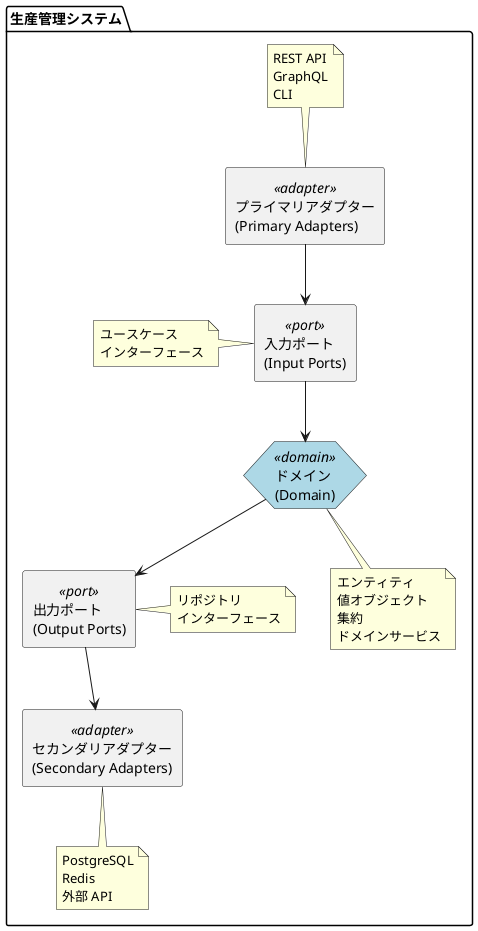

#### ドメイン（中心）

ドメインはシステムの中心に位置し、ビジネスロジックを実装します。

```
domain/
├── model/                       # ドメインモデル
│   ├── master/                  # マスタ関連
│   │   ├── Item.java            # 品目
│   │   ├── Bom.java             # 部品構成表
│   │   ├── WorkCalendar.java    # カレンダ
│   │   ├── Location.java        # 場所
│   │   └── Supplier.java        # 取引先
│   ├── planning/                # 計画関連
│   │   ├── ProductionPlan.java  # 生産計画
│   │   ├── Order.java           # オーダ
│   │   └── Requirement.java     # 所要
│   ├── purchasing/              # 購買関連
│   │   ├── PurchaseOrder.java   # 発注
│   │   ├── Receiving.java       # 入荷受入
│   │   └── Acceptance.java      # 検収
│   ├── manufacturing/           # 製造関連
│   │   ├── WorkOrder.java       # 作業指示
│   │   ├── Completion.java      # 完成実績
│   │   └── LaborReport.java     # 工数実績
│   └── inventory/               # 在庫関連
│       ├── Stock.java           # 在庫
│       └── Issue.java           # 払出
├── type/                        # 基本型
│   ├── Money.java               # 通貨
│   ├── Quantity.java            # 数量
│   └── ItemCode.java            # 品目コード
└── exception/                   # ドメイン例外
    └── DomainException.java
```

#### ポート（入力ポート・出力ポート）

ポートは、ドメインと外部世界との境界を定義するインターフェースです。

| ポート種別 | 役割 | 例 |
|---|---|---|
| 入力ポート | 外部からの要求を受け付ける | ユースケースインターフェース |
| 出力ポート | 外部リソースへのアクセスを抽象化 | リポジトリインターフェース |

```java
// 入力ポート（ユースケースインターフェース）
public interface ExecuteMrpUseCase {
    MrpResult execute(MrpCommand command);
}

// 出力ポート（リポジトリインターフェース）
public interface ItemRepository {
    void save(Item item);
    Optional<Item> findByCode(ItemCode code);
    List<Item> findAll();
}
```

#### アダプター（プライマリ・セカンダリ）

アダプターは、ポートの実装を提供し、外部技術とドメインを接続します。

| アダプター種別 | 役割 | 例 |
|---|---|---|
| プライマリアダプター | 外部からの入力を処理 | REST コントローラ、CLI |
| セカンダリアダプター | 外部リソースへの出力を処理 | DB リポジトリ実装、外部 API クライアント |

```
infrastructure/
├── in/                          # Input Adapter（プライマリアダプター）
│   └── rest/                    # REST API
│       ├── controller/
│       │   ├── ItemController.java
│       │   ├── BomController.java
│       │   └── MrpController.java
│       ├── dto/
│       │   ├── ItemRequest.java
│       │   └── ItemResponse.java
│       └── exception/
│           └── RestExceptionHandler.java
├── out/                         # Output Adapter（セカンダリアダプター）
│   └── persistence/             # 永続化
│       ├── mapper/              # MyBatis Mapper
│       │   └── ItemMapper.java
│       ├── repository/          # Repository実装
│       │   └── ItemRepositoryImpl.java
│       └── typehandler/         # 型ハンドラ
│           └── ItemTypeEnumHandler.java
└── config/                      # 設定クラス
    ├── DatabaseConfig.java
    └── WebConfig.java
```

#### 依存性の方向と依存性逆転の原則

ヘキサゴナルアーキテクチャでは、すべての依存性がドメインに向かいます。

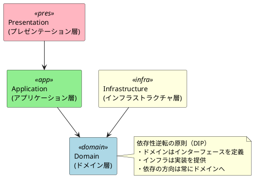

### ドメイン駆動設計の適用

#### 集約とリポジトリ

生産管理システムの主要な集約を以下に示します。

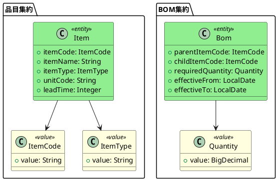

| 集約 | ルートエンティティ | 主な責務 |
|---|---|---|
| 品目集約 | Item | 品目情報の管理 |
| BOM 集約 | Bom | 部品構成の管理 |
| オーダ集約 | Order | 生産・購買オーダの管理 |
| 作業指示集約 | WorkOrder | 製造指示の管理 |
| 在庫集約 | Stock | 在庫数量の管理 |

#### ドメインサービス

複数の集約をまたぐビジネスロジックは、ドメインサービスとして実装します。

```java
// MRP ドメインサービス
public class MrpDomainService {

    public List<Requirement> explodeRequirements(
            Item item,
            Quantity requiredQty,
            LocalDate requiredDate,
            BomRepository bomRepository) {

        List<Bom> children = bomRepository.findChildren(item.getItemCode());

        return children.stream()
            .map(bom -> new Requirement(
                bom.getChildItemCode(),
                requiredQty.multiply(bom.getRequiredQuantity()),
                requiredDate.minusDays(item.getLeadTime())
            ))
            .collect(Collectors.toList());
    }
}
```

#### アプリケーションサービス

ユースケースの実装は、アプリケーションサービスとして実装します。

```java
@Service
@RequiredArgsConstructor
public class MrpApplicationService implements ExecuteMrpUseCase {

    private final ItemRepository itemRepository;
    private final BomRepository bomRepository;
    private final OrderRepository orderRepository;
    private final MrpDomainService mrpDomainService;

    @Override
    @Transactional
    public MrpResult execute(MrpCommand command) {
        // 1. 対象品目の取得
        Item item = itemRepository.findByCode(command.getItemCode())
            .orElseThrow(() -> new ItemNotFoundException(command.getItemCode()));

        // 2. 所要量展開
        List<Requirement> requirements = mrpDomainService.explodeRequirements(
            item, command.getQuantity(), command.getRequiredDate(), bomRepository);

        // 3. オーダ生成
        List<Order> orders = requirements.stream()
            .map(this::createOrder)
            .collect(Collectors.toList());

        orders.forEach(orderRepository::save);

        return new MrpResult(orders);
    }
}
```

### API 設計

#### RESTful API の基本方針

| 方針 | 説明 |
|---|---|
| リソース指向 | URL はリソースを表現（動詞ではなく名詞） |
| HTTP メソッド | GET（取得）、POST（作成）、PUT（更新）、DELETE（削除） |
| ステータスコード | 200（成功）、201（作成）、400（クライアントエラー）、404（未検出）、500（サーバーエラー） |

#### エンドポイント設計

| エンドポイント | メソッド | 説明 |
|---|---|---|
| `/api/items` | GET | 品目一覧取得 |
| `/api/items/{code}` | GET | 品目詳細取得 |
| `/api/items` | POST | 品目登録 |
| `/api/items/{code}` | PUT | 品目更新 |
| `/api/bom/{parentCode}` | GET | BOM 展開（子品目一覧） |
| `/api/mrp/execute` | POST | MRP 実行 |
| `/api/orders` | GET | オーダ一覧取得 |
| `/api/orders/{id}` | GET | オーダ詳細取得 |
| `/api/work-orders` | GET | 作業指示一覧取得 |
| `/api/stock/{locationCode}/{itemCode}` | GET | 在庫照会 |

---

## まとめ

本章では、生産管理システムの全体像について解説しました。

1. **生産管理システムのスコープ**
   - 生産計画（MPS・MRP）、購買管理、工程管理、在庫管理、品質管理、原価管理
   - マスタ情報とトランザクション情報の分類

2. **生産組織の役割分担**
   - 営業部・生産管理部・製造部・購買部・外注部・資材倉庫・製品倉庫
   - 各部門の責務と連携ポイント

3. **生産管理システムのアーキテクチャ**
   - ヘキサゴナルアーキテクチャ（ポート&アダプター）
   - ドメイン駆動設計の適用
   - RESTful API の設計方針

次章では、品目マスタや BOM（部品構成表）などのマスタ情報の設計について詳しく解説します。
