# 第23章：マスタ情報の設計

本章では、生産管理システムの基盤となるマスタ情報を設計します。ヘキサゴナルアーキテクチャ（ポート＆アダプターパターン）を採用し、ドメイン層がインフラストラクチャ層に依存しない設計とします。

## アーキテクチャの概要

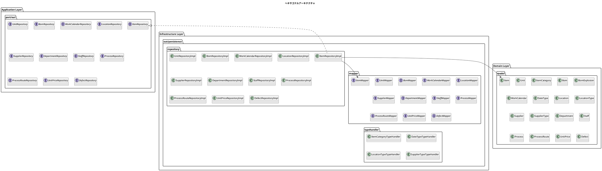

### パッケージ構成

```
src/main/java/com/example/pms/
├── application/                    # アプリケーション層
│   └── port/
│       └── out/                   # Output Port（リポジトリインターフェース）
│           ├── UnitRepository.java
│           ├── ItemRepository.java
│           ├── BomRepository.java
│           ├── WorkCalendarRepository.java
│           ├── LocationRepository.java
│           ├── SupplierRepository.java
│           ├── DepartmentRepository.java
│           ├── StaffRepository.java
│           ├── ProcessRepository.java
│           ├── ProcessRouteRepository.java
│           ├── UnitPriceRepository.java
│           └── DefectRepository.java
├── domain/                         # ドメイン層（純粋なビジネスロジック）
│   └── model/                     # ドメインモデル
│       ├── unit/
│       │   └── Unit.java
│       ├── item/
│       │   ├── Item.java
│       │   └── ItemCategory.java
│       ├── bom/
│       │   ├── Bom.java
│       │   └── BomExplosion.java
│       ├── calendar/
│       │   ├── WorkCalendar.java
│       │   └── DateType.java
│       ├── location/
│       │   ├── Location.java
│       │   └── LocationType.java
│       ├── supplier/
│       │   ├── Supplier.java
│       │   └── SupplierType.java
│       ├── department/
│       │   └── Department.java
│       ├── staff/
│       │   └── Staff.java
│       ├── process/
│       │   ├── Process.java
│       │   └── ProcessRoute.java
│       ├── unitprice/
│       │   └── UnitPrice.java
│       └── defect/
│           └── Defect.java
├── infrastructure/                 # インフラストラクチャ層
│   └── out/
│       └── persistence/
│           ├── mapper/            # MyBatis Mapper
│           │   ├── UnitMapper.java
│           │   ├── ItemMapper.java
│           │   ├── BomMapper.java
│           │   ├── WorkCalendarMapper.java
│           │   ├── LocationMapper.java
│           │   ├── SupplierMapper.java
│           │   ├── DepartmentMapper.java
│           │   ├── StaffMapper.java
│           │   ├── ProcessMapper.java
│           │   ├── ProcessRouteMapper.java
│           │   ├── UnitPriceMapper.java
│           │   └── DefectMapper.java
│           ├── repository/        # Repository実装
│           │   ├── UnitRepositoryImpl.java
│           │   ├── ItemRepositoryImpl.java
│           │   ├── BomRepositoryImpl.java
│           │   ├── WorkCalendarRepositoryImpl.java
│           │   ├── LocationRepositoryImpl.java
│           │   ├── SupplierRepositoryImpl.java
│           │   ├── DepartmentRepositoryImpl.java
│           │   ├── StaffRepositoryImpl.java
│           │   ├── ProcessRepositoryImpl.java
│           │   ├── ProcessRouteRepositoryImpl.java
│           │   ├── UnitPriceRepositoryImpl.java
│           │   └── DefectRepositoryImpl.java
│           └── typehandler/       # TypeHandler
│               ├── ItemCategoryTypeHandler.java
│               ├── DateTypeTypeHandler.java
│               ├── LocationTypeTypeHandler.java
│               └── SupplierTypeTypeHandler.java
└── config/
    └── FlywayConfig.java
```

---

## 23.1 品目マスタの設計

品目マスタは、生産管理システムで扱う「モノ」（製品、部品、材料など）の情報を管理する、最も基本的なマスタです。

### 品目とは

生産管理における「品目」とは、管理対象となるすべての「モノ」を指します。

| 品目区分 | 説明 | 例 |
|---------|------|-----|
| **製品** | 最終的に販売する完成品 | パソコン、スマートフォン |
| **半製品** | 途中まで完成した製品 | 組立済みの基板 |
| **中間品** | 製造工程の中間生成物 | 加工済み部品 |
| **部品** | 製品を構成する部品 | ネジ、コネクタ |
| **材料** | 加工に使用する材料 | 鋼材、プラスチック |
| **原料** | 化学反応などの元となる原料 | 化学薬品 |
| **資材** | 製造を支援する資材 | 梱包材、ラベル |

### 品目マスタに必要な情報

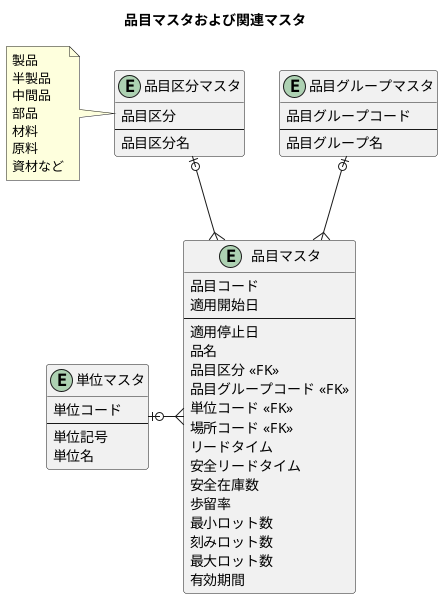

### テーブル定義

<details>
<summary>DDL（品目マスタ・単位マスタ）</summary>

```sql
-- src/main/resources/db/migration/V002__create_item_master.sql

-- 品目区分 ENUM（日本語値）
CREATE TYPE 品目区分 AS ENUM (
    '製品', '半製品', '中間品', '部品', '材料', '原料', '資材'
);

-- 単位マスタ（日本語テーブル名・カラム名）
CREATE TABLE "単位マスタ" (
    "単位コード" VARCHAR(10) PRIMARY KEY,
    "単位記号" VARCHAR(10) NOT NULL,
    "単位名" VARCHAR(50) NOT NULL,
    "作成日時" TIMESTAMP DEFAULT CURRENT_TIMESTAMP,
    "更新日時" TIMESTAMP DEFAULT CURRENT_TIMESTAMP
);

-- 品目マスタ（日本語テーブル名・カラム名）
CREATE TABLE "品目マスタ" (
    "ID" SERIAL PRIMARY KEY,
    "品目コード" VARCHAR(20) NOT NULL,
    "適用開始日" DATE NOT NULL,
    "適用停止日" DATE,
    "品名" VARCHAR(100) NOT NULL,
    "品目区分" 品目区分 NOT NULL,
    "単位コード" VARCHAR(10) REFERENCES "単位マスタ"("単位コード"),
    "リードタイム" INTEGER DEFAULT 0,
    "安全リードタイム" INTEGER DEFAULT 0,
    "安全在庫数" DECIMAL(15, 2) DEFAULT 0,
    "歩留率" DECIMAL(5, 2) DEFAULT 100,
    "最小ロット数" DECIMAL(15, 2) DEFAULT 1,
    "刻みロット数" DECIMAL(15, 2) DEFAULT 1,
    "最大ロット数" DECIMAL(15, 2),
    "有効期間" INTEGER,
    "作成日時" TIMESTAMP DEFAULT CURRENT_TIMESTAMP,
    "更新日時" TIMESTAMP DEFAULT CURRENT_TIMESTAMP,
    UNIQUE("品目コード", "適用開始日")
);

-- インデックス
CREATE INDEX idx_品目マスタ_品目コード ON "品目マスタ"("品目コード");
CREATE INDEX idx_品目マスタ_品目区分 ON "品目マスタ"("品目区分");
```

</details>

### 世代管理

品目マスタは `品目コード` と `適用開始日` の複合キーによる世代管理を採用しています。これにより：

- 同じ品目コードでも、適用開始日が異なれば別レコードとして登録可能
- 過去・現在・未来の品目情報を保持できる
- 特定時点での品目情報を参照できる

### ドメインモデル

<details>
<summary>品目エンティティ（Item.java）</summary>

```java
// src/main/java/com/example/production/domain/model/item/Item.java
package com.example.pms.domain.model.item;

import lombok.*;
import java.math.BigDecimal;
import java.time.LocalDate;
import java.time.LocalDateTime;

@Data
@Builder
@NoArgsConstructor
@AllArgsConstructor
public class Item {
    private Integer id;
    private String itemCode;
    private LocalDate effectiveFrom;
    private LocalDate effectiveTo;
    private String itemName;
    private ItemCategory itemCategory;
    private String unitCode;
    @Builder.Default
    private Integer leadTime = 0;
    @Builder.Default
    private Integer safetyLeadTime = 0;
    @Builder.Default
    private BigDecimal safetyStock = BigDecimal.ZERO;
    @Builder.Default
    private BigDecimal yieldRate = new BigDecimal("100");
    @Builder.Default
    private BigDecimal minLotSize = BigDecimal.ONE;
    @Builder.Default
    private BigDecimal lotIncrement = BigDecimal.ONE;
    private BigDecimal maxLotSize;
    private Integer shelfLife;
    private LocalDateTime createdAt;
    private LocalDateTime updatedAt;
}
```

</details>

<details>
<summary>品目区分 Enum（ItemCategory.java）</summary>

```java
// src/main/java/com/example/production/domain/model/item/ItemCategory.java
package com.example.pms.domain.model.item;

import lombok.Getter;
import lombok.RequiredArgsConstructor;

@Getter
@RequiredArgsConstructor
public enum ItemCategory {
    PRODUCT("製品"),
    SEMI_PRODUCT("半製品"),
    INTERMEDIATE("中間品"),
    PART("部品"),
    MATERIAL("材料"),
    RAW_MATERIAL("原料"),
    SUPPLY("資材");

    private final String displayName;

    public static ItemCategory fromDisplayName(String displayName) {
        for (ItemCategory category : values()) {
            if (category.displayName.equals(displayName)) {
                return category;
            }
        }
        throw new IllegalArgumentException("不正な品目区分: " + displayName);
    }
}
```

</details>

### リポジトリ

<details>
<summary>Repository インターフェース（Output Port）</summary>

```java
// src/main/java/com/example/production/application/port/out/ItemRepository.java
package com.example.pms.application.port.out;

import com.example.pms.domain.model.item.Item;

import java.time.LocalDate;
import java.util.List;
import java.util.Optional;

/**
 * 品目リポジトリ（Output Port）
 * ドメイン層がデータアクセスに依存しないためのインターフェース
 */
public interface ItemRepository {

    /**
     * 品目を保存する
     */
    void save(Item item);

    /**
     * 品目コードで品目を検索する（最新の適用開始日）
     */
    Optional<Item> findByItemCode(String itemCode);

    /**
     * 品目コードと基準日で品目を検索する
     */
    Optional<Item> findByItemCodeAndDate(String itemCode, LocalDate baseDate);

    /**
     * すべての品目を取得する
     */
    List<Item> findAll();

    /**
     * 品目を更新する
     */
    void update(Item item);

    /**
     * すべての品目を削除する
     */
    void deleteAll();
}
```

</details>

<details>
<summary>Repository 実装（インフラストラクチャ層）</summary>

```java
// src/main/java/com/example/production/infrastructure/out/persistence/repository/ItemRepositoryImpl.java
package com.example.pms.infrastructure.out.persistence.repository;

import com.example.pms.application.port.out.ItemRepository;
import com.example.pms.domain.model.item.Item;
import com.example.pms.infrastructure.out.persistence.mapper.ItemMapper;
import org.springframework.stereotype.Repository;

import java.time.LocalDate;
import java.util.List;
import java.util.Optional;

/**
 * 品目リポジトリ実装
 */
@Repository
public class ItemRepositoryImpl implements ItemRepository {

    private final ItemMapper itemMapper;

    public ItemRepositoryImpl(ItemMapper itemMapper) {
        this.itemMapper = itemMapper;
    }

    @Override
    public void save(Item item) {
        itemMapper.insert(item);
    }

    @Override
    public Optional<Item> findByItemCode(String itemCode) {
        return itemMapper.findByItemCode(itemCode);
    }

    @Override
    public Optional<Item> findByItemCodeAndDate(String itemCode, LocalDate baseDate) {
        return itemMapper.findByItemCodeAndDate(itemCode, baseDate);
    }

    @Override
    public List<Item> findAll() {
        return itemMapper.findAll();
    }

    @Override
    public void update(Item item) {
        itemMapper.update(item);
    }

    @Override
    public void deleteAll() {
        itemMapper.deleteAll();
    }
}
```

</details>

### TypeHandler

PostgreSQL の日本語 ENUM 型と Java の Enum を相互変換するための TypeHandler を実装します。

<details>
<summary>ItemCategoryTypeHandler</summary>

```java
// src/main/java/com/example/pms/infrastructure/out/persistence/typehandler/ItemCategoryTypeHandler.java
package com.example.pms.infrastructure.out.persistence.typehandler;

import com.example.pms.domain.model.item.ItemCategory;
import org.apache.ibatis.type.BaseTypeHandler;
import org.apache.ibatis.type.JdbcType;
import org.apache.ibatis.type.MappedTypes;

import java.sql.*;

@MappedTypes(ItemCategory.class)
public class ItemCategoryTypeHandler extends BaseTypeHandler<ItemCategory> {

    @Override
    public void setNonNullParameter(PreparedStatement ps, int i,
            ItemCategory parameter, JdbcType jdbcType) throws SQLException {
        ps.setString(i, parameter.getDisplayName());
    }

    @Override
    public ItemCategory getNullableResult(ResultSet rs, String columnName) throws SQLException {
        String value = rs.getString(columnName);
        return value == null ? null : ItemCategory.fromDisplayName(value);
    }

    @Override
    public ItemCategory getNullableResult(ResultSet rs, int columnIndex) throws SQLException {
        String value = rs.getString(columnIndex);
        return value == null ? null : ItemCategory.fromDisplayName(value);
    }

    @Override
    public ItemCategory getNullableResult(CallableStatement cs, int columnIndex) throws SQLException {
        String value = cs.getString(columnIndex);
        return value == null ? null : ItemCategory.fromDisplayName(value);
    }
}
```

</details>

### MyBatis Mapper

日本語カラム名と英語プロパティ名のマッピングを定義します。

<details>
<summary>Mapper インターフェース</summary>

```java
// src/main/java/com/example/production/infrastructure/out/persistence/mapper/ItemMapper.java
package com.example.pms.infrastructure.out.persistence.mapper;

import com.example.pms.domain.model.item.Item;
import org.apache.ibatis.annotations.Mapper;
import org.apache.ibatis.annotations.Param;

import java.time.LocalDate;
import java.util.List;
import java.util.Optional;

@Mapper
public interface ItemMapper {
    void insert(Item item);
    Optional<Item> findByItemCode(String itemCode);
    Optional<Item> findByItemCodeAndDate(@Param("itemCode") String itemCode,
                                          @Param("baseDate") LocalDate baseDate);
    List<Item> findAll();
    void update(Item item);
    void deleteAll();
}
```

</details>

<details>
<summary>MyBatis XML Mapper</summary>

```xml
<?xml version="1.0" encoding="UTF-8" ?>
<!DOCTYPE mapper
        PUBLIC "-//mybatis.org//DTD Mapper 3.0//EN"
        "http://mybatis.org/dtd/mybatis-3-mapper.dtd">
<mapper namespace="com.example.pms.infrastructure.out.persistence.mapper.ItemMapper">

    <!-- 日本語カラム名と英語プロパティ名のマッピング -->
    <resultMap id="ItemResultMap" type="com.example.pms.domain.model.item.Item">
        <id property="id" column="ID"/>
        <result property="itemCode" column="品目コード"/>
        <result property="effectiveFrom" column="適用開始日"/>
        <result property="effectiveTo" column="適用停止日"/>
        <result property="itemName" column="品名"/>
        <result property="itemCategory" column="品目区分"
                typeHandler="com.example.pms.infrastructure.out.persistence.typehandler.ItemCategoryTypeHandler"/>
        <result property="unitCode" column="単位コード"/>
        <result property="leadTime" column="リードタイム"/>
        <result property="safetyLeadTime" column="安全リードタイム"/>
        <result property="safetyStock" column="安全在庫数"/>
        <result property="yieldRate" column="歩留率"/>
        <result property="minLotSize" column="最小ロット数"/>
        <result property="lotIncrement" column="刻みロット数"/>
        <result property="maxLotSize" column="最大ロット数"/>
        <result property="shelfLife" column="有効期間"/>
        <result property="createdAt" column="作成日時"/>
        <result property="updatedAt" column="更新日時"/>
    </resultMap>

    <insert id="insert" parameterType="com.example.pms.domain.model.item.Item"
            useGeneratedKeys="true" keyProperty="id" keyColumn="ID">
        INSERT INTO "品目マスタ" (
            "品目コード",
            "適用開始日",
            "適用停止日",
            "品名",
            "品目区分",
            "単位コード",
            "リードタイム",
            "安全リードタイム",
            "安全在庫数",
            "歩留率",
            "最小ロット数",
            "刻みロット数",
            "最大ロット数",
            "有効期間",
            "作成日時",
            "更新日時"
        ) VALUES (
            #{itemCode},
            #{effectiveFrom},
            #{effectiveTo},
            #{itemName},
            #{itemCategory, typeHandler=com.example.pms.infrastructure.out.persistence.typehandler.ItemCategoryTypeHandler}::品目区分,
            #{unitCode},
            #{leadTime},
            #{safetyLeadTime},
            #{safetyStock},
            #{yieldRate},
            #{minLotSize},
            #{lotIncrement},
            #{maxLotSize},
            #{shelfLife},
            CURRENT_TIMESTAMP,
            CURRENT_TIMESTAMP
        )
    </insert>

    <select id="findByItemCode" resultMap="ItemResultMap">
        SELECT * FROM "品目マスタ"
        WHERE "品目コード" = #{itemCode}
        ORDER BY "適用開始日" DESC
        LIMIT 1
    </select>

    <select id="findByItemCodeAndDate" resultMap="ItemResultMap">
        SELECT * FROM "品目マスタ"
        WHERE "品目コード" = #{itemCode}
          AND "適用開始日" &lt;= #{baseDate}
          AND ("適用停止日" IS NULL OR "適用停止日" > #{baseDate})
        ORDER BY "適用開始日" DESC
        LIMIT 1
    </select>

    <select id="findAll" resultMap="ItemResultMap">
        SELECT * FROM "品目マスタ"
        ORDER BY "品目コード", "適用開始日" DESC
    </select>

    <update id="update" parameterType="com.example.pms.domain.model.item.Item">
        UPDATE "品目マスタ" SET
            "品名" = #{itemName},
            "品目区分" = #{itemCategory, typeHandler=com.example.pms.infrastructure.out.persistence.typehandler.ItemCategoryTypeHandler}::品目区分,
            "単位コード" = #{unitCode},
            "リードタイム" = #{leadTime},
            "安全リードタイム" = #{safetyLeadTime},
            "安全在庫数" = #{safetyStock},
            "歩留率" = #{yieldRate},
            "最小ロット数" = #{minLotSize},
            "刻みロット数" = #{lotIncrement},
            "最大ロット数" = #{maxLotSize},
            "有効期間" = #{shelfLife},
            "更新日時" = CURRENT_TIMESTAMP
        WHERE "ID" = #{id}
    </update>

    <delete id="deleteAll">
        TRUNCATE TABLE "品目マスタ" CASCADE
    </delete>
</mapper>
```

</details>

---

## 23.2 BOM（部品構成表）の設計

BOM（Bill of Materials：部品構成表）は、製品がどのような部品・材料から構成されているかを定義する、生産管理システムの中核となるマスタです。

### BOM の構造

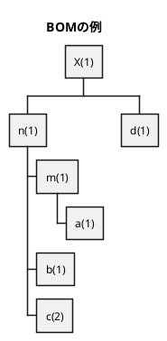

()内の数字は数量を表します。製品 X を1つ作るには：
- 中間品 n が 1 個必要
- 部品 d が 1 個必要
- 中間品 n を作るには、m が 1 個、b が 1 個、c が 2 個必要
- ...というように、再帰的な構造になっています。

### ER 図

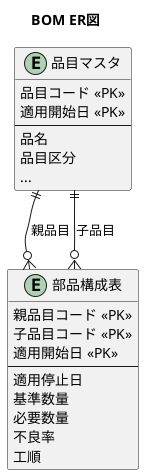

### テーブル定義

<details>
<summary>DDL（部品構成表）</summary>

```sql
-- src/main/resources/db/migration/V003__create_bom.sql

-- 部品構成表（BOM）
CREATE TABLE "部品構成表" (
    "親品目コード" VARCHAR(20) NOT NULL,
    "子品目コード" VARCHAR(20) NOT NULL,
    "適用開始日" DATE NOT NULL,
    "適用停止日" DATE,
    "基準数量" DECIMAL(15, 2) NOT NULL DEFAULT 1,
    "必要数量" DECIMAL(15, 2) NOT NULL,
    "不良率" DECIMAL(5, 2) DEFAULT 0,
    "工順" INTEGER,
    "作成日時" TIMESTAMP DEFAULT CURRENT_TIMESTAMP,
    "更新日時" TIMESTAMP DEFAULT CURRENT_TIMESTAMP,
    PRIMARY KEY ("親品目コード", "子品目コード", "適用開始日")
);

-- インデックス
CREATE INDEX idx_bom_親品目コード ON "部品構成表"("親品目コード");
CREATE INDEX idx_bom_子品目コード ON "部品構成表"("子品目コード");
```

</details>

### ドメインモデル

<details>
<summary>BOM エンティティ（Bom.java）</summary>

```java
// src/main/java/com/example/production/domain/model/bom/Bom.java
package com.example.pms.domain.model.bom;

import lombok.*;
import java.math.BigDecimal;
import java.time.LocalDate;
import java.time.LocalDateTime;

@Data
@Builder
@NoArgsConstructor
@AllArgsConstructor
public class Bom {
    private String parentItemCode;
    private String childItemCode;
    private LocalDate effectiveFrom;
    private LocalDate effectiveTo;
    @Builder.Default
    private BigDecimal baseQuantity = BigDecimal.ONE;
    private BigDecimal requiredQuantity;
    @Builder.Default
    private BigDecimal defectRate = BigDecimal.ZERO;
    private Integer sequence;
    private LocalDateTime createdAt;
    private LocalDateTime updatedAt;
}
```

</details>

<details>
<summary>BOM 展開結果（BomExplosion.java）</summary>

```java
// src/main/java/com/example/production/domain/model/bom/BomExplosion.java
package com.example.pms.domain.model.bom;

import lombok.*;
import java.math.BigDecimal;
import java.time.LocalDate;

@Data
@Builder
@NoArgsConstructor
@AllArgsConstructor
public class BomExplosion {
    private String parentItemCode;
    private String childItemCode;
    private LocalDate effectiveFrom;
    private LocalDate effectiveTo;
    private BigDecimal baseQuantity;
    private BigDecimal requiredQuantity;
    private BigDecimal defectRate;
    private Integer sequence;
    private Integer level;
    private BigDecimal totalQuantity;
}
```

</details>

### リポジトリ

<details>
<summary>BomRepository インターフェース（Output Port）</summary>

```java
// src/main/java/com/example/production/application/port/out/BomRepository.java
package com.example.pms.application.port.out;

import com.example.pms.domain.model.bom.Bom;
import com.example.pms.domain.model.bom.BomExplosion;

import java.math.BigDecimal;
import java.time.LocalDate;
import java.util.List;

/**
 * BOMリポジトリ（Output Port）
 */
public interface BomRepository {

    void save(Bom bom);

    List<Bom> findByParentItemCode(String parentItemCode);

    List<Bom> findByParentItemCodeAndDate(String parentItemCode, LocalDate baseDate);

    List<Bom> findByChildItemCode(String childItemCode);

    List<BomExplosion> explode(String itemCode, BigDecimal quantity);

    void deleteAll();
}
```

</details>

<details>
<summary>BomRepositoryImpl 実装（インフラストラクチャ層）</summary>

```java
// src/main/java/com/example/production/infrastructure/out/persistence/repository/BomRepositoryImpl.java
package com.example.pms.infrastructure.out.persistence.repository;

import com.example.pms.application.port.out.BomRepository;
import com.example.pms.domain.model.bom.Bom;
import com.example.pms.domain.model.bom.BomExplosion;
import com.example.pms.infrastructure.out.persistence.mapper.BomMapper;
import org.springframework.stereotype.Repository;

import java.math.BigDecimal;
import java.time.LocalDate;
import java.util.List;

@Repository
public class BomRepositoryImpl implements BomRepository {

    private final BomMapper bomMapper;

    public BomRepositoryImpl(BomMapper bomMapper) {
        this.bomMapper = bomMapper;
    }

    @Override
    public void save(Bom bom) {
        bomMapper.insert(bom);
    }

    @Override
    public List<Bom> findByParentItemCode(String parentItemCode) {
        return bomMapper.findByParentItemCode(parentItemCode);
    }

    @Override
    public List<Bom> findByParentItemCodeAndDate(String parentItemCode, LocalDate baseDate) {
        return bomMapper.findByParentItemCodeAndDate(parentItemCode, baseDate);
    }

    @Override
    public List<Bom> findByChildItemCode(String childItemCode) {
        return bomMapper.findByChildItemCode(childItemCode);
    }

    @Override
    public List<BomExplosion> explode(String itemCode, BigDecimal quantity) {
        return bomMapper.explode(itemCode, quantity);
    }

    @Override
    public void deleteAll() {
        bomMapper.deleteAll();
    }
}
```

</details>

### 再帰 CTE による BOM 展開

BOM は再帰的な構造を持つため、PostgreSQL の再帰 CTE（Common Table Expression）を使用して全階層を展開します。

<details>
<summary>Mapper インターフェース</summary>

```java
// src/main/java/com/example/production/infrastructure/out/persistence/mapper/BomMapper.java
package com.example.pms.infrastructure.out.persistence.mapper;

import com.example.pms.domain.model.bom.Bom;
import com.example.pms.domain.model.bom.BomExplosion;
import org.apache.ibatis.annotations.Mapper;
import org.apache.ibatis.annotations.Param;

import java.math.BigDecimal;
import java.time.LocalDate;
import java.util.List;

@Mapper
public interface BomMapper {
    void insert(Bom bom);
    List<Bom> findByParentItemCode(String parentItemCode);
    List<Bom> findByParentItemCodeAndDate(@Param("parentItemCode") String parentItemCode,
                                           @Param("baseDate") LocalDate baseDate);
    List<Bom> findByChildItemCode(String childItemCode);
    List<BomExplosion> explode(@Param("itemCode") String itemCode,
                               @Param("quantity") BigDecimal quantity);
    void deleteAll();
}
```

</details>

<details>
<summary>MyBatis XML Mapper（再帰 CTE を含む）</summary>

```xml
<?xml version="1.0" encoding="UTF-8" ?>
<!DOCTYPE mapper
        PUBLIC "-//mybatis.org//DTD Mapper 3.0//EN"
        "http://mybatis.org/dtd/mybatis-3-mapper.dtd">
<mapper namespace="com.example.pms.infrastructure.out.persistence.mapper.BomMapper">

    <!-- 日本語カラム名と英語プロパティ名のマッピング -->
    <resultMap id="BomResultMap" type="com.example.pms.domain.model.bom.Bom">
        <result property="parentItemCode" column="親品目コード"/>
        <result property="childItemCode" column="子品目コード"/>
        <result property="effectiveFrom" column="適用開始日"/>
        <result property="effectiveTo" column="適用停止日"/>
        <result property="baseQuantity" column="基準数量"/>
        <result property="requiredQuantity" column="必要数量"/>
        <result property="defectRate" column="不良率"/>
        <result property="sequence" column="工順"/>
        <result property="createdAt" column="作成日時"/>
        <result property="updatedAt" column="更新日時"/>
    </resultMap>

    <resultMap id="BomExplosionResultMap" type="com.example.pms.domain.model.bom.BomExplosion">
        <result property="parentItemCode" column="親品目コード"/>
        <result property="childItemCode" column="子品目コード"/>
        <result property="effectiveFrom" column="適用開始日"/>
        <result property="effectiveTo" column="適用停止日"/>
        <result property="baseQuantity" column="基準数量"/>
        <result property="requiredQuantity" column="必要数量"/>
        <result property="defectRate" column="不良率"/>
        <result property="sequence" column="工順"/>
        <result property="level" column="階層"/>
        <result property="totalQuantity" column="累計数量"/>
    </resultMap>

    <insert id="insert" parameterType="com.example.pms.domain.model.bom.Bom">
        INSERT INTO "部品構成表" (
            "親品目コード",
            "子品目コード",
            "適用開始日",
            "適用停止日",
            "基準数量",
            "必要数量",
            "不良率",
            "工順",
            "作成日時",
            "更新日時"
        ) VALUES (
            #{parentItemCode},
            #{childItemCode},
            #{effectiveFrom},
            #{effectiveTo},
            #{baseQuantity},
            #{requiredQuantity},
            #{defectRate},
            #{sequence},
            CURRENT_TIMESTAMP,
            CURRENT_TIMESTAMP
        )
    </insert>

    <select id="findByParentItemCode" resultMap="BomResultMap">
        SELECT * FROM "部品構成表"
        WHERE "親品目コード" = #{parentItemCode}
          AND ("適用停止日" IS NULL OR "適用停止日" > CURRENT_DATE)
        ORDER BY "工順", "子品目コード"
    </select>

    <select id="findByParentItemCodeAndDate" resultMap="BomResultMap">
        SELECT * FROM "部品構成表"
        WHERE "親品目コード" = #{parentItemCode}
          AND "適用開始日" &lt;= #{baseDate}
          AND ("適用停止日" IS NULL OR "適用停止日" > #{baseDate})
        ORDER BY "工順", "子品目コード"
    </select>

    <select id="findByChildItemCode" resultMap="BomResultMap">
        SELECT * FROM "部品構成表"
        WHERE "子品目コード" = #{childItemCode}
          AND ("適用停止日" IS NULL OR "適用停止日" > CURRENT_DATE)
        ORDER BY "親品目コード"
    </select>

    <!-- 再帰CTEによる全階層展開 -->
    <select id="explode" resultMap="BomExplosionResultMap">
        WITH RECURSIVE bom_explosion AS (
            -- 基底: 直接の子品目
            SELECT
                "親品目コード",
                "子品目コード",
                "適用開始日",
                "適用停止日",
                "基準数量",
                "必要数量",
                "不良率",
                "工順",
                1 as "階層",
                "必要数量" as "累計数量"
            FROM "部品構成表"
            WHERE "親品目コード" = #{itemCode}
              AND ("適用停止日" IS NULL OR "適用停止日" >= CURRENT_DATE)

            UNION ALL

            -- 再帰: 子品目の子品目
            SELECT
                b."親品目コード",
                b."子品目コード",
                b."適用開始日",
                b."適用停止日",
                b."基準数量",
                b."必要数量",
                b."不良率",
                b."工順",
                be."階層" + 1,
                be."累計数量" * b."必要数量"
            FROM "部品構成表" b
            INNER JOIN bom_explosion be ON b."親品目コード" = be."子品目コード"
            WHERE (b."適用停止日" IS NULL OR b."適用停止日" >= CURRENT_DATE)
              AND be."階層" &lt; 10  -- 無限ループ防止
        )
        SELECT
            "親品目コード",
            "子品目コード",
            "適用開始日",
            "適用停止日",
            "基準数量",
            "必要数量",
            "不良率",
            "工順",
            "階層",
            "累計数量" * #{quantity} as "累計数量"
        FROM bom_explosion
        ORDER BY "階層", "親品目コード", "工順", "子品目コード"
    </select>

    <delete id="deleteAll">
        TRUNCATE TABLE "部品構成表" CASCADE
    </delete>
</mapper>
```

</details>

---

## 23.3 補助マスタの設計

品目マスタと BOM を補完する補助マスタを設計します。

### カレンダマスタ

稼働日・休日・半日稼働を管理するマスタです。

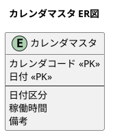

<details>
<summary>DDL（カレンダマスタ）</summary>

```sql
-- src/main/resources/db/migration/V004__create_calendar_master.sql

-- 日付区分 ENUM
CREATE TYPE 日付区分 AS ENUM ('稼働日', '休日', '半日稼働');

-- カレンダマスタ
CREATE TABLE "カレンダマスタ" (
    "カレンダコード" VARCHAR(20) NOT NULL,
    "日付" DATE NOT NULL,
    "日付区分" 日付区分 NOT NULL DEFAULT '稼働日',
    "稼働時間" DECIMAL(5, 2),
    "備考" VARCHAR(200),
    "作成日時" TIMESTAMP DEFAULT CURRENT_TIMESTAMP,
    "更新日時" TIMESTAMP DEFAULT CURRENT_TIMESTAMP,
    PRIMARY KEY ("カレンダコード", "日付")
);
```

</details>

<details>
<summary>エンティティ（WorkCalendar.java, DateType.java）</summary>

```java
// src/main/java/com/example/production/domain/model/calendar/WorkCalendar.java
package com.example.pms.domain.model.calendar;

import lombok.*;
import java.math.BigDecimal;
import java.time.LocalDate;
import java.time.LocalDateTime;

@Data
@Builder
@NoArgsConstructor
@AllArgsConstructor
public class WorkCalendar {
    private String calendarCode;
    private LocalDate date;
    private DateType dateType;
    private BigDecimal workingHours;
    private String note;
    private LocalDateTime createdAt;
    private LocalDateTime updatedAt;
}
```

```java
// src/main/java/com/example/production/domain/model/calendar/DateType.java
package com.example.pms.domain.model.calendar;

import lombok.Getter;
import lombok.RequiredArgsConstructor;

@Getter
@RequiredArgsConstructor
public enum DateType {
    WORKING("稼働日"),
    HOLIDAY("休日"),
    HALF_DAY("半日稼働");

    private final String displayName;

    public static DateType fromDisplayName(String displayName) {
        for (DateType type : values()) {
            if (type.displayName.equals(displayName)) {
                return type;
            }
        }
        throw new IllegalArgumentException("不正な日付区分: " + displayName);
    }
}
```

</details>

### 場所マスタ

倉庫・製造場所・検査場所などを管理するマスタです。階層構造を持つことができます。

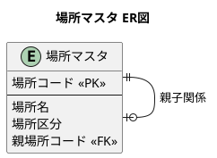

<details>
<summary>DDL（場所マスタ）</summary>

```sql
-- src/main/resources/db/migration/V005__create_location_master.sql

-- 場所区分 ENUM
CREATE TYPE 場所区分 AS ENUM ('倉庫', '製造', '検査', '出荷', '外注');

-- 場所マスタ
CREATE TABLE "場所マスタ" (
    "場所コード" VARCHAR(20) PRIMARY KEY,
    "場所名" VARCHAR(100) NOT NULL,
    "場所区分" 場所区分 NOT NULL,
    "親場所コード" VARCHAR(20) REFERENCES "場所マスタ"("場所コード"),
    "作成日時" TIMESTAMP DEFAULT CURRENT_TIMESTAMP,
    "更新日時" TIMESTAMP DEFAULT CURRENT_TIMESTAMP
);

CREATE INDEX idx_場所マスタ_場所区分 ON "場所マスタ"("場所区分");
```

</details>

<details>
<summary>エンティティ（Location.java, LocationType.java）</summary>

```java
// src/main/java/com/example/production/domain/model/location/Location.java
package com.example.pms.domain.model.location;

import lombok.*;
import java.time.LocalDateTime;

@Data
@Builder
@NoArgsConstructor
@AllArgsConstructor
public class Location {
    private String locationCode;
    private String locationName;
    private LocationType locationType;
    private String parentLocationCode;
    private LocalDateTime createdAt;
    private LocalDateTime updatedAt;
}
```

```java
// src/main/java/com/example/production/domain/model/location/LocationType.java
package com.example.pms.domain.model.location;

import lombok.Getter;
import lombok.RequiredArgsConstructor;

@Getter
@RequiredArgsConstructor
public enum LocationType {
    WAREHOUSE("倉庫"),
    MANUFACTURING("製造"),
    INSPECTION("検査"),
    SHIPPING("出荷"),
    SUBCONTRACT("外注");

    private final String displayName;

    public static LocationType fromDisplayName(String displayName) {
        for (LocationType type : values()) {
            if (type.displayName.equals(displayName)) {
                return type;
            }
        }
        throw new IllegalArgumentException("不正な場所区分: " + displayName);
    }
}
```

</details>

### 取引先マスタ

仕入先・外注先・得意先を管理するマスタです。世代管理に対応しています。

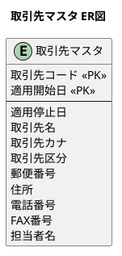

<details>
<summary>DDL（取引先マスタ）</summary>

```sql
-- src/main/resources/db/migration/V006__create_supplier_master.sql

-- 取引先区分 ENUM
CREATE TYPE 取引先区分 AS ENUM ('仕入先', '外注先', '得意先', '仕入先兼外注先');

-- 取引先マスタ
CREATE TABLE "取引先マスタ" (
    "取引先コード" VARCHAR(20) NOT NULL,
    "適用開始日" DATE NOT NULL,
    "適用停止日" DATE,
    "取引先名" VARCHAR(100) NOT NULL,
    "取引先カナ" VARCHAR(100),
    "取引先区分" 取引先区分 NOT NULL,
    "郵便番号" VARCHAR(10),
    "住所" VARCHAR(200),
    "電話番号" VARCHAR(20),
    "FAX番号" VARCHAR(20),
    "担当者名" VARCHAR(50),
    "作成日時" TIMESTAMP DEFAULT CURRENT_TIMESTAMP,
    "更新日時" TIMESTAMP DEFAULT CURRENT_TIMESTAMP,
    PRIMARY KEY ("取引先コード", "適用開始日")
);

CREATE INDEX idx_取引先マスタ_取引先区分 ON "取引先マスタ"("取引先区分");
```

</details>

<details>
<summary>エンティティ（Supplier.java, SupplierType.java）</summary>

```java
// src/main/java/com/example/production/domain/model/supplier/Supplier.java
package com.example.pms.domain.model.supplier;

import lombok.*;
import java.time.LocalDate;
import java.time.LocalDateTime;

@Data
@Builder
@NoArgsConstructor
@AllArgsConstructor
public class Supplier {
    private String supplierCode;
    private LocalDate effectiveFrom;
    private LocalDate effectiveTo;
    private String supplierName;
    private String supplierNameKana;
    private SupplierType supplierType;
    private String postalCode;
    private String address;
    private String phoneNumber;
    private String faxNumber;
    private String contactPerson;
    private LocalDateTime createdAt;
    private LocalDateTime updatedAt;
}
```

```java
// src/main/java/com/example/production/domain/model/supplier/SupplierType.java
package com.example.pms.domain.model.supplier;

import lombok.Getter;
import lombok.RequiredArgsConstructor;

@Getter
@RequiredArgsConstructor
public enum SupplierType {
    VENDOR("仕入先"),
    SUBCONTRACTOR("外注先"),
    CUSTOMER("得意先"),
    VENDOR_AND_SUBCONTRACTOR("仕入先兼外注先");

    private final String displayName;

    public static SupplierType fromDisplayName(String displayName) {
        for (SupplierType type : values()) {
            if (type.displayName.equals(displayName)) {
                return type;
            }
        }
        throw new IllegalArgumentException("不正な取引先区分: " + displayName);
    }
}
```

</details>

### 単位マスタ

品目の数量単位を管理するマスタです。

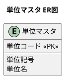

<details>
<summary>エンティティ（Unit.java）</summary>

```java
// src/main/java/com/example/pms/domain/model/unit/Unit.java
package com.example.pms.domain.model.unit;

import lombok.*;
import java.time.LocalDateTime;

@Data
@Builder
@NoArgsConstructor
@AllArgsConstructor
public class Unit {
    private String unitCode;
    private String unitSymbol;
    private String unitName;
    private LocalDateTime createdAt;
    private LocalDateTime updatedAt;
}
```

</details>

### 部門マスタ

部門・課の階層構造を管理するマスタです。

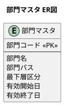

<details>
<summary>エンティティ（Department.java）</summary>

```java
// src/main/java/com/example/pms/domain/model/department/Department.java
package com.example.pms.domain.model.department;

import lombok.*;
import java.time.LocalDate;
import java.time.LocalDateTime;

@Data
@Builder
@NoArgsConstructor
@AllArgsConstructor
public class Department {
    private String departmentCode;
    private String departmentName;
    private String departmentPath;
    private Boolean lowestLevel;
    private LocalDate validFrom;
    private LocalDate validTo;
    private LocalDateTime createdAt;
    private LocalDateTime updatedAt;
}
```

</details>

### 担当者マスタ

担当者と部門の紐付けを管理するマスタです。世代管理に対応しています。

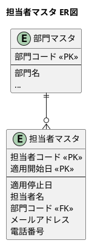

<details>
<summary>エンティティ（Staff.java）</summary>

```java
// src/main/java/com/example/pms/domain/model/staff/Staff.java
package com.example.pms.domain.model.staff;

import lombok.*;
import java.time.LocalDate;
import java.time.LocalDateTime;

@Data
@Builder
@NoArgsConstructor
@AllArgsConstructor
public class Staff {
    private String staffCode;
    private LocalDate effectiveFrom;
    private LocalDate effectiveTo;
    private String staffName;
    private String departmentCode;
    private String email;
    private String phoneNumber;
    private LocalDateTime createdAt;
    private LocalDateTime updatedAt;
}
```

</details>

### 工程マスタ

製造工程の定義を管理するマスタです。

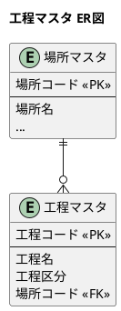

<details>
<summary>エンティティ（Process.java）</summary>

```java
// src/main/java/com/example/pms/domain/model/process/Process.java
package com.example.pms.domain.model.process;

import lombok.*;
import java.time.LocalDateTime;

@Data
@Builder
@NoArgsConstructor
@AllArgsConstructor
public class Process {
    private String processCode;
    private String processName;
    private String processType;
    private String locationCode;
    private LocalDateTime createdAt;
    private LocalDateTime updatedAt;
}
```

</details>

### 工程表

品目ごとの製造工程順序を定義するマスタです。

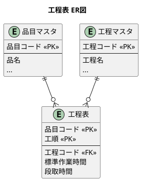

<details>
<summary>エンティティ（ProcessRoute.java）</summary>

```java
// src/main/java/com/example/pms/domain/model/process/ProcessRoute.java
package com.example.pms.domain.model.process;

import lombok.*;
import java.math.BigDecimal;
import java.time.LocalDateTime;

@Data
@Builder
@NoArgsConstructor
@AllArgsConstructor
public class ProcessRoute {
    private String itemCode;
    private Integer sequence;
    private String processCode;
    private BigDecimal standardTime;
    private BigDecimal setupTime;
    private LocalDateTime createdAt;
    private LocalDateTime updatedAt;
}
```

</details>

### 単価マスタ

品目と取引先の組み合わせによる単価情報を管理するマスタです。世代管理に対応しています。

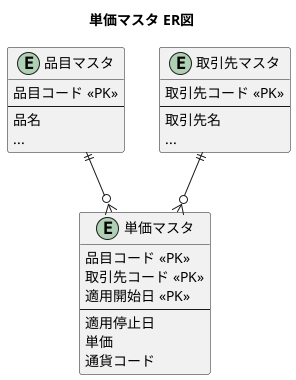

<details>
<summary>エンティティ（UnitPrice.java）</summary>

```java
// src/main/java/com/example/pms/domain/model/unitprice/UnitPrice.java
package com.example.pms.domain.model.unitprice;

import lombok.*;
import java.math.BigDecimal;
import java.time.LocalDate;
import java.time.LocalDateTime;

@Data
@Builder
@NoArgsConstructor
@AllArgsConstructor
public class UnitPrice {
    private String itemCode;
    private String supplierCode;
    private LocalDate effectiveFrom;
    private LocalDate effectiveTo;
    private BigDecimal price;
    private String currencyCode;
    private LocalDateTime createdAt;
    private LocalDateTime updatedAt;
}
```

</details>

### 欠点マスタ

品質不良の種類を管理するマスタです。

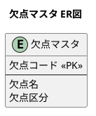

<details>
<summary>エンティティ（Defect.java）</summary>

```java
// src/main/java/com/example/pms/domain/model/defect/Defect.java
package com.example.pms.domain.model.defect;

import lombok.*;
import java.time.LocalDateTime;

@Data
@Builder
@NoArgsConstructor
@AllArgsConstructor
public class Defect {
    private String defectCode;
    private String defectName;
    private String defectType;
    private LocalDateTime createdAt;
    private LocalDateTime updatedAt;
}
```

</details>

---

## まとめ

### 作成したテーブル

| テーブル名（日本語） | 説明 |
|-------------------|------|
| `単位マスタ` | 品目の単位（個、kg、m など） |
| `品目マスタ` | 製品・部品・材料などの品目情報 |
| `部品構成表` | BOM（親子関係） |
| `カレンダマスタ` | 稼働日・休日の管理 |
| `場所マスタ` | 倉庫・工程などの場所情報 |
| `取引先マスタ` | 仕入先・外注先・得意先 |
| `部門マスタ` | 部門・課の階層構造 |
| `担当者マスタ` | 担当者と部門の紐付け |
| `工程マスタ` | 工程の定義 |
| `工程表` | 品目ごとの製造工程 |
| `単価マスタ` | 品目 × 取引先の単価 |
| `欠点マスタ` | 品質不良の種類 |

### アーキテクチャのポイント

| レイヤー | パッケージ | 責務 |
|---------|-----------|------|
| **Domain** | `domain.model.*` | ビジネスロジック、エンティティ |
| **Application** | `application.port.out` | Repository インターフェース（Output Port） |
| **Infrastructure** | `infrastructure.out.persistence.*` | DB アクセス実装 |

### 命名規則のまとめ

| 要素 | 言語 | 例 |
|------|------|-----|
| **テーブル名** | 日本語 | `"品目マスタ"`, `"部品構成表"` |
| **カラム名** | 日本語 | `"品目コード"`, `"品名"` |
| **ENUM 型** | 日本語 | `品目区分`, `日付区分` |
| **ENUM 値** | 日本語 | `'製品'`, `'稼働日'` |
| **Java クラス名** | 英語 | `Item`, `Bom`, `WorkCalendar` |
| **Java フィールド名** | 英語 | `itemCode`, `itemName` |
| **Java メソッド名** | 英語 | `findByItemCode()`, `save()` |
| **MyBatis resultMap** | 日本語 ↔ 英語 | `column="品目コード" property="itemCode"` |

### ER図（第23章完了時点）

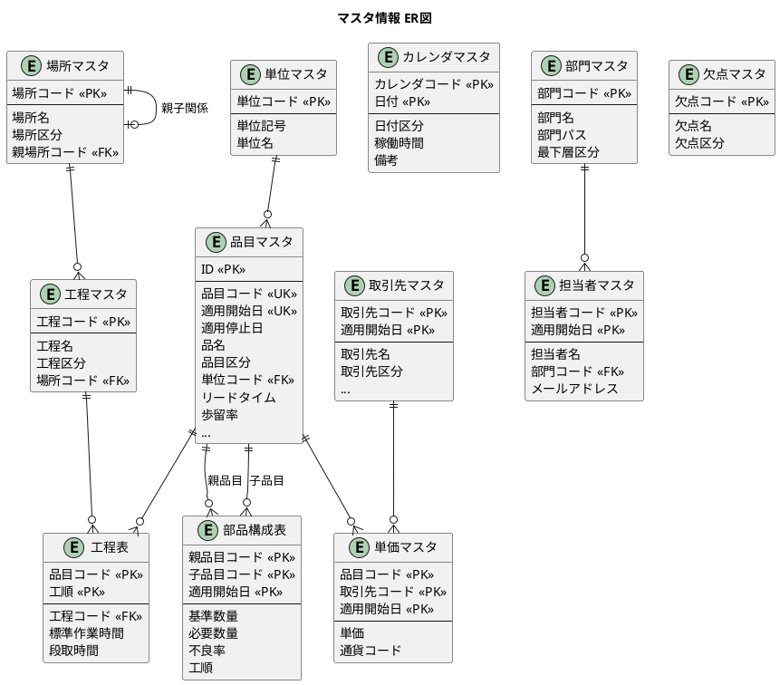

### 設計のポイント

1. **ヘキサゴナルアーキテクチャ**: ドメイン層がインフラに依存しない設計
2. **世代管理**: 品目マスタや取引先マスタは `適用開始日` による世代管理を採用
3. **日本語 DB / 英語 Java**: テーブル・カラムは日本語、Java コードは英語で統一
4. **MyBatis resultMap**: 日本語カラムと英語プロパティのマッピングを明示的に定義
5. **PostgreSQL ENUM**: 区分値は日本語 ENUM 型で型安全性を確保
6. **TypeHandler**: Java Enum と日本語 ENUM 値の変換を実装
7. **Repository パターン**: テストでは Repository インターフェースを使用
8. **再帰 CTE**: BOM 展開には再帰 CTE を使用して全階層を効率的に取得

---

[← 第22章：生産管理システムの全体像](chapter22.md) | [第24章：生産計画の設計 →](chapter24.md)
