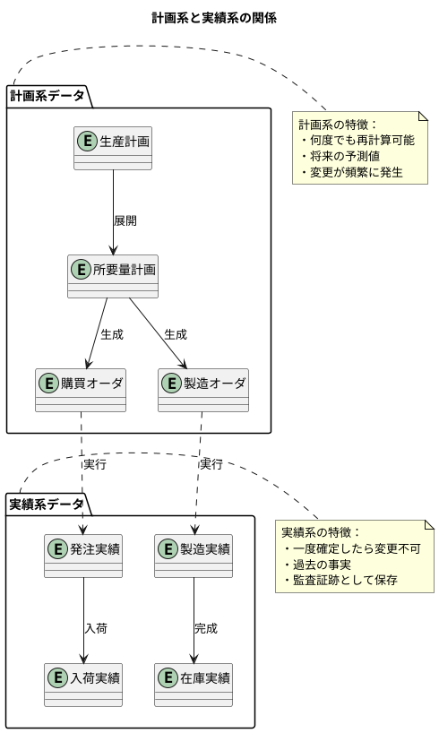
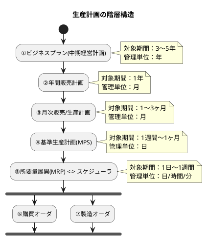
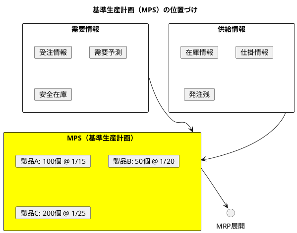
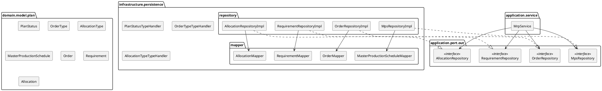
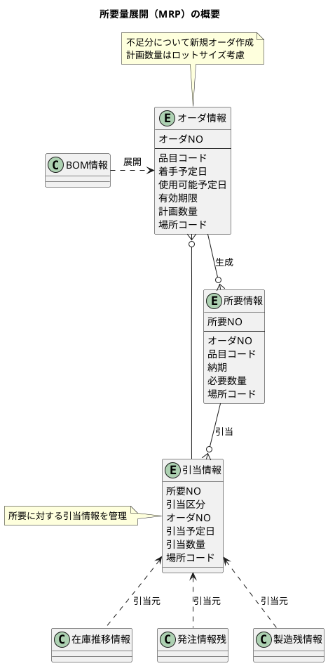
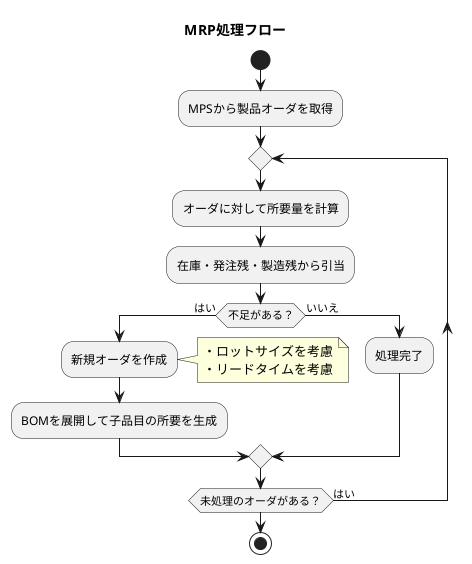
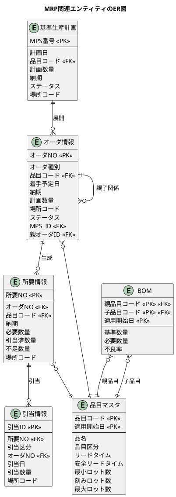

# 第24章：生産計画の設計

本章では、生産管理システムの核心部分である「生産計画」を設計します。生産計画は、製造業における意思決定の起点となる重要な機能です。

---

## 24.1 生産計画の特徴

生産計画は、「いつ」「何を」「どれだけ」生産するかを決定する計画系の中核機能です。

### 計画系と実績系の分離

生産管理システムのデータは、大きく「計画系」と「実績系」に分類されます。



#### 計画系データの特徴

| 特性 | 説明 |
|-----|------|
| **再計算可能** | 条件が変わればいつでも再計算できる |
| **仮の数値** | 確定前は何度でも変更可能 |
| **将来指向** | 未来の予定を表す |
| **柔軟性重視** | ビジネス状況に応じて調整される |

#### 実績系データの特徴

| 特性 | 説明 |
|-----|------|
| **不可逆** | 一度記録したら削除・変更しない |
| **事実の記録** | 実際に起きたことを記録 |
| **過去指向** | 過去の事実を表す |
| **証跡性重視** | 監査・トレーサビリティに使用 |

### 計画の階層構造

生産計画は、長期から短期へと段階的に詳細化されていきます。



#### 各計画レベルの概要

| レベル | 計画名 | 対象期間 | 管理単位 | 主な責任者 |
|-------|--------|---------|---------|-----------|
| 1 | ビジネスプラン | 3〜5年 | 年 | 経営層 |
| 2 | 年間販売計画 | 1年 | 月 | 営業部門 |
| 3 | 月次生産計画 | 1〜3ヶ月 | 月 | 生産管理部門 |
| 4 | 基準生産計画（MPS） | 1週〜1ヶ月 | 日 | 生産管理部門 |
| 5 | 所要量展開（MRP） | 1日〜1週間 | 日/時間 | 生産管理部門 |

### 基準生産計画（MPS）の理解

基準生産計画（Master Production Schedule）は、最終製品の生産計画です。



### 計画データのスキーマ設計

<details>
<summary>DDL（生産計画関連テーブル）</summary>

```sql
-- V008__create_planning_tables.sql

-- 計画ステータス
CREATE TYPE 計画ステータス AS ENUM ('草案', '確定', '展開済', '取消');

-- オーダ種別
CREATE TYPE オーダ種別 AS ENUM ('購買', '製造');

-- 引当区分
CREATE TYPE 引当区分 AS ENUM ('在庫', '発注残', '製造残');

-- 基準生産計画
CREATE TABLE "基準生産計画" (
    "ID" SERIAL PRIMARY KEY,
    "MPS番号" VARCHAR(20) UNIQUE NOT NULL,
    "計画日" DATE NOT NULL,
    "品目コード" VARCHAR(20) NOT NULL,
    "計画数量" DECIMAL(15, 2) NOT NULL,
    "納期" DATE NOT NULL,
    "ステータス" 計画ステータス DEFAULT '草案' NOT NULL,
    "場所コード" VARCHAR(20),
    "備考" TEXT,
    "作成日時" TIMESTAMP DEFAULT CURRENT_TIMESTAMP NOT NULL,
    "作成者" VARCHAR(50),
    "更新日時" TIMESTAMP DEFAULT CURRENT_TIMESTAMP NOT NULL,
    "更新者" VARCHAR(50),
    CONSTRAINT "fk_基準生産計画_品目"
        FOREIGN KEY ("品目コード") REFERENCES "品目マスタ"("品目コード")
);

-- オーダ情報（購買・製造共通）
CREATE TABLE "オーダ情報" (
    "ID" SERIAL PRIMARY KEY,
    "オーダNO" VARCHAR(20) UNIQUE NOT NULL,
    "オーダ種別" オーダ種別 NOT NULL,
    "品目コード" VARCHAR(20) NOT NULL,
    "着手予定日" DATE NOT NULL,
    "納期" DATE NOT NULL,
    "有効期限" DATE,
    "計画数量" DECIMAL(15, 2) NOT NULL,
    "場所コード" VARCHAR(20) NOT NULL,
    "ステータス" 計画ステータス DEFAULT '草案' NOT NULL,
    "MPS_ID" INTEGER,
    "親オーダID" INTEGER,
    "作成日時" TIMESTAMP DEFAULT CURRENT_TIMESTAMP NOT NULL,
    "作成者" VARCHAR(50),
    "更新日時" TIMESTAMP DEFAULT CURRENT_TIMESTAMP NOT NULL,
    "更新者" VARCHAR(50),
    CONSTRAINT "fk_オーダ情報_品目"
        FOREIGN KEY ("品目コード") REFERENCES "品目マスタ"("品目コード"),
    CONSTRAINT "fk_オーダ情報_MPS"
        FOREIGN KEY ("MPS_ID") REFERENCES "基準生産計画"("ID"),
    CONSTRAINT "fk_オーダ情報_親オーダ"
        FOREIGN KEY ("親オーダID") REFERENCES "オーダ情報"("ID")
);

-- 所要情報
CREATE TABLE "所要情報" (
    "ID" SERIAL PRIMARY KEY,
    "所要NO" VARCHAR(20) UNIQUE NOT NULL,
    "オーダID" INTEGER NOT NULL,
    "品目コード" VARCHAR(20) NOT NULL,
    "納期" DATE NOT NULL,
    "必要数量" DECIMAL(15, 2) NOT NULL,
    "引当済数量" DECIMAL(15, 2) DEFAULT 0 NOT NULL,
    "不足数量" DECIMAL(15, 2) DEFAULT 0 NOT NULL,
    "場所コード" VARCHAR(20) NOT NULL,
    "作成日時" TIMESTAMP DEFAULT CURRENT_TIMESTAMP NOT NULL,
    "更新日時" TIMESTAMP DEFAULT CURRENT_TIMESTAMP NOT NULL,
    CONSTRAINT "fk_所要情報_オーダ"
        FOREIGN KEY ("オーダID") REFERENCES "オーダ情報"("ID"),
    CONSTRAINT "fk_所要情報_品目"
        FOREIGN KEY ("品目コード") REFERENCES "品目マスタ"("品目コード")
);

-- 引当情報
CREATE TABLE "引当情報" (
    "ID" SERIAL PRIMARY KEY,
    "所要ID" INTEGER NOT NULL,
    "引当区分" 引当区分 NOT NULL,
    "オーダID" INTEGER,
    "引当日" DATE NOT NULL,
    "引当数量" DECIMAL(15, 2) NOT NULL,
    "場所コード" VARCHAR(20) NOT NULL,
    "作成日時" TIMESTAMP DEFAULT CURRENT_TIMESTAMP NOT NULL,
    "更新日時" TIMESTAMP DEFAULT CURRENT_TIMESTAMP NOT NULL,
    CONSTRAINT "fk_引当情報_所要"
        FOREIGN KEY ("所要ID") REFERENCES "所要情報"("ID"),
    CONSTRAINT "fk_引当情報_オーダ"
        FOREIGN KEY ("オーダID") REFERENCES "オーダ情報"("ID")
);

-- インデックス
CREATE INDEX "idx_基準生産計画_品目コード" ON "基準生産計画"("品目コード");
CREATE INDEX "idx_基準生産計画_納期" ON "基準生産計画"("納期");
CREATE INDEX "idx_オーダ情報_品目コード" ON "オーダ情報"("品目コード");
CREATE INDEX "idx_オーダ情報_納期" ON "オーダ情報"("納期");
CREATE INDEX "idx_オーダ情報_MPS_ID" ON "オーダ情報"("MPS_ID");
CREATE INDEX "idx_所要情報_オーダID" ON "所要情報"("オーダID");
CREATE INDEX "idx_所要情報_品目コード" ON "所要情報"("品目コード");
CREATE INDEX "idx_引当情報_所要ID" ON "引当情報"("所要ID");
```

</details>

### アーキテクチャ構造

生産計画でも、ヘキサゴナルアーキテクチャ（ポート＆アダプター）を採用します。



### ドメインモデル

<details>
<summary>計画ステータス Enum（PlanStatus.java）</summary>

```java
// src/main/java/com/example/production/domain/model/plan/PlanStatus.java
package com.example.production.domain.model.plan;

import lombok.Getter;
import lombok.RequiredArgsConstructor;

@Getter
@RequiredArgsConstructor
public enum PlanStatus {
    DRAFT("草案"),
    CONFIRMED("確定"),
    EXPANDED("展開済"),
    CANCELLED("取消");

    private final String displayName;

    public static PlanStatus fromDisplayName(String displayName) {
        for (PlanStatus status : values()) {
            if (status.displayName.equals(displayName)) {
                return status;
            }
        }
        throw new IllegalArgumentException("Unknown plan status: " + displayName);
    }
}
```

</details>

<details>
<summary>オーダ種別 Enum（OrderType.java）</summary>

```java
// src/main/java/com/example/production/domain/model/plan/OrderType.java
package com.example.production.domain.model.plan;

import lombok.Getter;
import lombok.RequiredArgsConstructor;

@Getter
@RequiredArgsConstructor
public enum OrderType {
    PURCHASE("購買"),
    MANUFACTURING("製造");

    private final String displayName;

    public static OrderType fromDisplayName(String displayName) {
        for (OrderType type : values()) {
            if (type.displayName.equals(displayName)) {
                return type;
            }
        }
        throw new IllegalArgumentException("Unknown order type: " + displayName);
    }
}
```

</details>

<details>
<summary>引当区分 Enum（AllocationType.java）</summary>

```java
// src/main/java/com/example/production/domain/model/plan/AllocationType.java
package com.example.production.domain.model.plan;

import lombok.Getter;
import lombok.RequiredArgsConstructor;

@Getter
@RequiredArgsConstructor
public enum AllocationType {
    INVENTORY("在庫"),
    PURCHASE_ORDER("発注残"),
    MANUFACTURING_ORDER("製造残");

    private final String displayName;

    public static AllocationType fromDisplayName(String displayName) {
        for (AllocationType type : values()) {
            if (type.displayName.equals(displayName)) {
                return type;
            }
        }
        throw new IllegalArgumentException("Unknown allocation type: " + displayName);
    }
}
```

</details>

<details>
<summary>基準生産計画エンティティ（MasterProductionSchedule.java）</summary>

```java
// src/main/java/com/example/production/domain/model/plan/MasterProductionSchedule.java
package com.example.production.domain.model.plan;

import com.example.production.domain.model.item.Item;
import lombok.Builder;
import lombok.Data;

import java.math.BigDecimal;
import java.time.LocalDate;
import java.time.LocalDateTime;

@Data
@Builder
public class MasterProductionSchedule {
    private Integer id;
    private String mpsNumber;
    private LocalDate planDate;
    private String itemCode;
    private BigDecimal planQuantity;
    private LocalDate dueDate;
    private PlanStatus status;
    private String locationCode;
    private String remarks;
    private LocalDateTime createdAt;
    private String createdBy;
    private LocalDateTime updatedAt;
    private String updatedBy;

    // リレーション
    private Item item;
}
```

</details>

<details>
<summary>オーダ情報エンティティ（Order.java）</summary>

```java
// src/main/java/com/example/production/domain/model/plan/Order.java
package com.example.production.domain.model.plan;

import com.example.production.domain.model.item.Item;
import lombok.Builder;
import lombok.Data;

import java.math.BigDecimal;
import java.time.LocalDate;
import java.time.LocalDateTime;
import java.util.List;

@Data
@Builder
public class Order {
    private Integer id;
    private String orderNumber;
    private OrderType orderType;
    private String itemCode;
    private LocalDate startDate;
    private LocalDate dueDate;
    private LocalDate expirationDate;
    private BigDecimal planQuantity;
    private String locationCode;
    private PlanStatus status;
    private Integer mpsId;
    private Integer parentOrderId;
    private LocalDateTime createdAt;
    private String createdBy;
    private LocalDateTime updatedAt;
    private String updatedBy;

    // リレーション
    private Item item;
    private MasterProductionSchedule mps;
    private Order parentOrder;
    private List<Order> childOrders;
    private List<Requirement> requirements;
}
```

</details>

<details>
<summary>所要情報エンティティ（Requirement.java）</summary>

```java
// src/main/java/com/example/production/domain/model/plan/Requirement.java
package com.example.production.domain.model.plan;

import com.example.production.domain.model.item.Item;
import lombok.Builder;
import lombok.Data;

import java.math.BigDecimal;
import java.time.LocalDate;
import java.time.LocalDateTime;
import java.util.List;

@Data
@Builder
public class Requirement {
    private Integer id;
    private String requirementNumber;
    private Integer orderId;
    private String itemCode;
    private LocalDate dueDate;
    private BigDecimal requiredQuantity;
    private BigDecimal allocatedQuantity;
    private BigDecimal shortageQuantity;
    private String locationCode;
    private LocalDateTime createdAt;
    private LocalDateTime updatedAt;

    // リレーション
    private Order order;
    private Item item;
    private List<Allocation> allocations;
}
```

</details>

<details>
<summary>引当情報エンティティ（Allocation.java）</summary>

```java
// src/main/java/com/example/production/domain/model/plan/Allocation.java
package com.example.production.domain.model.plan;

import lombok.Builder;
import lombok.Data;

import java.math.BigDecimal;
import java.time.LocalDate;
import java.time.LocalDateTime;

@Data
@Builder
public class Allocation {
    private Integer id;
    private Integer requirementId;
    private AllocationType allocationType;
    private Integer orderId;
    private LocalDate allocationDate;
    private BigDecimal allocatedQuantity;
    private String locationCode;
    private LocalDateTime createdAt;
    private LocalDateTime updatedAt;

    // リレーション
    private Requirement requirement;
    private Order order;
}
```

</details>

### TypeHandler

<details>
<summary>PlanStatusTypeHandler</summary>

```java
// src/main/java/com/example/production/infrastructure/persistence/PlanStatusTypeHandler.java
package com.example.production.infrastructure.persistence;

import com.example.production.domain.model.plan.PlanStatus;
import org.apache.ibatis.type.BaseTypeHandler;
import org.apache.ibatis.type.JdbcType;
import org.apache.ibatis.type.MappedTypes;

import java.sql.CallableStatement;
import java.sql.PreparedStatement;
import java.sql.ResultSet;
import java.sql.SQLException;

@MappedTypes(PlanStatus.class)
public class PlanStatusTypeHandler extends BaseTypeHandler<PlanStatus> {

    @Override
    public void setNonNullParameter(PreparedStatement ps, int i, PlanStatus parameter, JdbcType jdbcType)
            throws SQLException {
        ps.setString(i, parameter.getDisplayName());
    }

    @Override
    public PlanStatus getNullableResult(ResultSet rs, String columnName) throws SQLException {
        String value = rs.getString(columnName);
        return value == null ? null : PlanStatus.fromDisplayName(value);
    }

    @Override
    public PlanStatus getNullableResult(ResultSet rs, int columnIndex) throws SQLException {
        String value = rs.getString(columnIndex);
        return value == null ? null : PlanStatus.fromDisplayName(value);
    }

    @Override
    public PlanStatus getNullableResult(CallableStatement cs, int columnIndex) throws SQLException {
        String value = cs.getString(columnIndex);
        return value == null ? null : PlanStatus.fromDisplayName(value);
    }
}
```

</details>

<details>
<summary>OrderTypeTypeHandler</summary>

```java
// src/main/java/com/example/production/infrastructure/persistence/OrderTypeTypeHandler.java
package com.example.production.infrastructure.persistence;

import com.example.production.domain.model.plan.OrderType;
import org.apache.ibatis.type.BaseTypeHandler;
import org.apache.ibatis.type.JdbcType;
import org.apache.ibatis.type.MappedTypes;

import java.sql.CallableStatement;
import java.sql.PreparedStatement;
import java.sql.ResultSet;
import java.sql.SQLException;

@MappedTypes(OrderType.class)
public class OrderTypeTypeHandler extends BaseTypeHandler<OrderType> {

    @Override
    public void setNonNullParameter(PreparedStatement ps, int i, OrderType parameter, JdbcType jdbcType)
            throws SQLException {
        ps.setString(i, parameter.getDisplayName());
    }

    @Override
    public OrderType getNullableResult(ResultSet rs, String columnName) throws SQLException {
        String value = rs.getString(columnName);
        return value == null ? null : OrderType.fromDisplayName(value);
    }

    @Override
    public OrderType getNullableResult(ResultSet rs, int columnIndex) throws SQLException {
        String value = rs.getString(columnIndex);
        return value == null ? null : OrderType.fromDisplayName(value);
    }

    @Override
    public OrderType getNullableResult(CallableStatement cs, int columnIndex) throws SQLException {
        String value = cs.getString(columnIndex);
        return value == null ? null : OrderType.fromDisplayName(value);
    }
}
```

</details>

<details>
<summary>AllocationTypeTypeHandler</summary>

```java
// src/main/java/com/example/production/infrastructure/persistence/AllocationTypeTypeHandler.java
package com.example.production.infrastructure.persistence;

import com.example.production.domain.model.plan.AllocationType;
import org.apache.ibatis.type.BaseTypeHandler;
import org.apache.ibatis.type.JdbcType;
import org.apache.ibatis.type.MappedTypes;

import java.sql.CallableStatement;
import java.sql.PreparedStatement;
import java.sql.ResultSet;
import java.sql.SQLException;

@MappedTypes(AllocationType.class)
public class AllocationTypeTypeHandler extends BaseTypeHandler<AllocationType> {

    @Override
    public void setNonNullParameter(PreparedStatement ps, int i, AllocationType parameter, JdbcType jdbcType)
            throws SQLException {
        ps.setString(i, parameter.getDisplayName());
    }

    @Override
    public AllocationType getNullableResult(ResultSet rs, String columnName) throws SQLException {
        String value = rs.getString(columnName);
        return value == null ? null : AllocationType.fromDisplayName(value);
    }

    @Override
    public AllocationType getNullableResult(ResultSet rs, int columnIndex) throws SQLException {
        String value = rs.getString(columnIndex);
        return value == null ? null : AllocationType.fromDisplayName(value);
    }

    @Override
    public AllocationType getNullableResult(CallableStatement cs, int columnIndex) throws SQLException {
        String value = cs.getString(columnIndex);
        return value == null ? null : AllocationType.fromDisplayName(value);
    }
}
```

</details>

### MyBatis Mapper

<details>
<summary>MasterProductionScheduleMapper.xml</summary>

```xml
<?xml version="1.0" encoding="UTF-8" ?>
<!DOCTYPE mapper PUBLIC "-//mybatis.org//DTD Mapper 3.0//EN"
        "http://mybatis.org/dtd/mybatis-3-mapper.dtd">
<mapper namespace="com.example.production.infrastructure.persistence.mapper.MasterProductionScheduleMapper">

    <resultMap id="MasterProductionScheduleResultMap"
               type="com.example.production.domain.model.plan.MasterProductionSchedule">
        <id property="id" column="ID"/>
        <result property="mpsNumber" column="MPS番号"/>
        <result property="planDate" column="計画日"/>
        <result property="itemCode" column="品目コード"/>
        <result property="planQuantity" column="計画数量"/>
        <result property="dueDate" column="納期"/>
        <result property="status" column="ステータス"
                typeHandler="com.example.production.infrastructure.persistence.PlanStatusTypeHandler"/>
        <result property="locationCode" column="場所コード"/>
        <result property="remarks" column="備考"/>
        <result property="createdAt" column="作成日時"/>
        <result property="createdBy" column="作成者"/>
        <result property="updatedAt" column="更新日時"/>
        <result property="updatedBy" column="更新者"/>
    </resultMap>

    <insert id="insert" useGeneratedKeys="true" keyProperty="id" keyColumn="ID">
        INSERT INTO "基準生産計画" (
            "MPS番号", "計画日", "品目コード", "計画数量", "納期",
            "ステータス", "場所コード", "備考", "作成者"
        ) VALUES (
            #{mpsNumber},
            #{planDate},
            #{itemCode},
            #{planQuantity},
            #{dueDate},
            #{status, typeHandler=com.example.production.infrastructure.persistence.PlanStatusTypeHandler}::計画ステータス,
            #{locationCode},
            #{remarks},
            #{createdBy}
        )
    </insert>

    <select id="findById" resultMap="MasterProductionScheduleResultMap">
        SELECT * FROM "基準生産計画" WHERE "ID" = #{id}
    </select>

    <select id="findByMpsNumber" resultMap="MasterProductionScheduleResultMap">
        SELECT * FROM "基準生産計画" WHERE "MPS番号" = #{mpsNumber}
    </select>

    <select id="findByStatus" resultMap="MasterProductionScheduleResultMap">
        SELECT * FROM "基準生産計画"
        WHERE "ステータス" = #{status, typeHandler=com.example.production.infrastructure.persistence.PlanStatusTypeHandler}::計画ステータス
        ORDER BY "納期"
    </select>

    <update id="updateStatus">
        UPDATE "基準生産計画"
        SET "ステータス" = #{status, typeHandler=com.example.production.infrastructure.persistence.PlanStatusTypeHandler}::計画ステータス,
            "更新日時" = CURRENT_TIMESTAMP
        WHERE "ID" = #{id}
    </update>

    <delete id="deleteAll">
        DELETE FROM "基準生産計画"
    </delete>
</mapper>
```

</details>

<details>
<summary>OrderMapper.xml</summary>

```xml
<?xml version="1.0" encoding="UTF-8" ?>
<!DOCTYPE mapper PUBLIC "-//mybatis.org//DTD Mapper 3.0//EN"
        "http://mybatis.org/dtd/mybatis-3-mapper.dtd">
<mapper namespace="com.example.production.infrastructure.persistence.mapper.OrderMapper">

    <resultMap id="OrderResultMap" type="com.example.production.domain.model.plan.Order">
        <id property="id" column="ID"/>
        <result property="orderNumber" column="オーダNO"/>
        <result property="orderType" column="オーダ種別"
                typeHandler="com.example.production.infrastructure.persistence.OrderTypeTypeHandler"/>
        <result property="itemCode" column="品目コード"/>
        <result property="startDate" column="着手予定日"/>
        <result property="dueDate" column="納期"/>
        <result property="expirationDate" column="有効期限"/>
        <result property="planQuantity" column="計画数量"/>
        <result property="locationCode" column="場所コード"/>
        <result property="status" column="ステータス"
                typeHandler="com.example.production.infrastructure.persistence.PlanStatusTypeHandler"/>
        <result property="mpsId" column="MPS_ID"/>
        <result property="parentOrderId" column="親オーダID"/>
        <result property="createdAt" column="作成日時"/>
        <result property="createdBy" column="作成者"/>
        <result property="updatedAt" column="更新日時"/>
        <result property="updatedBy" column="更新者"/>
    </resultMap>

    <insert id="insert" useGeneratedKeys="true" keyProperty="id" keyColumn="ID">
        INSERT INTO "オーダ情報" (
            "オーダNO", "オーダ種別", "品目コード", "着手予定日", "納期",
            "有効期限", "計画数量", "場所コード", "ステータス", "MPS_ID", "親オーダID", "作成者"
        ) VALUES (
            #{orderNumber},
            #{orderType, typeHandler=com.example.production.infrastructure.persistence.OrderTypeTypeHandler}::オーダ種別,
            #{itemCode},
            #{startDate},
            #{dueDate},
            #{expirationDate},
            #{planQuantity},
            #{locationCode},
            #{status, typeHandler=com.example.production.infrastructure.persistence.PlanStatusTypeHandler}::計画ステータス,
            #{mpsId},
            #{parentOrderId},
            #{createdBy}
        )
    </insert>

    <select id="findById" resultMap="OrderResultMap">
        SELECT * FROM "オーダ情報" WHERE "ID" = #{id}
    </select>

    <select id="findByOrderNumber" resultMap="OrderResultMap">
        SELECT * FROM "オーダ情報" WHERE "オーダNO" = #{orderNumber}
    </select>

    <select id="findByMpsId" resultMap="OrderResultMap">
        SELECT * FROM "オーダ情報" WHERE "MPS_ID" = #{mpsId}
    </select>

    <select id="findByParentOrderId" resultMap="OrderResultMap">
        SELECT * FROM "オーダ情報" WHERE "親オーダID" = #{parentOrderId}
    </select>

    <update id="updateParentOrderId">
        UPDATE "オーダ情報"
        SET "親オーダID" = #{parentOrderId}, "更新日時" = CURRENT_TIMESTAMP
        WHERE "ID" = #{id}
    </update>

    <update id="updateStatus">
        UPDATE "オーダ情報"
        SET "ステータス" = #{status, typeHandler=com.example.production.infrastructure.persistence.PlanStatusTypeHandler}::計画ステータス,
            "更新日時" = CURRENT_TIMESTAMP
        WHERE "ID" = #{id}
    </update>

    <delete id="deleteAll">
        DELETE FROM "オーダ情報"
    </delete>
</mapper>
```

</details>

<details>
<summary>RequirementMapper.xml</summary>

```xml
<?xml version="1.0" encoding="UTF-8" ?>
<!DOCTYPE mapper PUBLIC "-//mybatis.org//DTD Mapper 3.0//EN"
        "http://mybatis.org/dtd/mybatis-3-mapper.dtd">
<mapper namespace="com.example.production.infrastructure.persistence.mapper.RequirementMapper">

    <resultMap id="RequirementResultMap" type="com.example.production.domain.model.plan.Requirement">
        <id property="id" column="ID"/>
        <result property="requirementNumber" column="所要NO"/>
        <result property="orderId" column="オーダID"/>
        <result property="itemCode" column="品目コード"/>
        <result property="dueDate" column="納期"/>
        <result property="requiredQuantity" column="必要数量"/>
        <result property="allocatedQuantity" column="引当済数量"/>
        <result property="shortageQuantity" column="不足数量"/>
        <result property="locationCode" column="場所コード"/>
        <result property="createdAt" column="作成日時"/>
        <result property="updatedAt" column="更新日時"/>
    </resultMap>

    <insert id="insert" useGeneratedKeys="true" keyProperty="id" keyColumn="ID">
        INSERT INTO "所要情報" (
            "所要NO", "オーダID", "品目コード", "納期", "必要数量",
            "引当済数量", "不足数量", "場所コード"
        ) VALUES (
            #{requirementNumber},
            #{orderId},
            #{itemCode},
            #{dueDate},
            #{requiredQuantity},
            #{allocatedQuantity},
            #{shortageQuantity},
            #{locationCode}
        )
    </insert>

    <select id="findById" resultMap="RequirementResultMap">
        SELECT * FROM "所要情報" WHERE "ID" = #{id}
    </select>

    <select id="findByOrderId" resultMap="RequirementResultMap">
        SELECT * FROM "所要情報" WHERE "オーダID" = #{orderId}
    </select>

    <update id="updateAllocation">
        UPDATE "所要情報"
        SET "引当済数量" = #{allocatedQuantity},
            "不足数量" = #{shortageQuantity},
            "更新日時" = CURRENT_TIMESTAMP
        WHERE "ID" = #{id}
    </update>

    <delete id="deleteAll">
        DELETE FROM "所要情報"
    </delete>
</mapper>
```

</details>

<details>
<summary>AllocationMapper.xml</summary>

```xml
<?xml version="1.0" encoding="UTF-8" ?>
<!DOCTYPE mapper PUBLIC "-//mybatis.org//DTD Mapper 3.0//EN"
        "http://mybatis.org/dtd/mybatis-3-mapper.dtd">
<mapper namespace="com.example.production.infrastructure.persistence.mapper.AllocationMapper">

    <resultMap id="AllocationResultMap" type="com.example.production.domain.model.plan.Allocation">
        <id property="id" column="ID"/>
        <result property="requirementId" column="所要ID"/>
        <result property="allocationType" column="引当区分"
                typeHandler="com.example.production.infrastructure.persistence.AllocationTypeTypeHandler"/>
        <result property="orderId" column="オーダID"/>
        <result property="allocationDate" column="引当日"/>
        <result property="allocatedQuantity" column="引当数量"/>
        <result property="locationCode" column="場所コード"/>
        <result property="createdAt" column="作成日時"/>
        <result property="updatedAt" column="更新日時"/>
    </resultMap>

    <insert id="insert" useGeneratedKeys="true" keyProperty="id" keyColumn="ID">
        INSERT INTO "引当情報" (
            "所要ID", "引当区分", "オーダID", "引当日", "引当数量", "場所コード"
        ) VALUES (
            #{requirementId},
            #{allocationType, typeHandler=com.example.production.infrastructure.persistence.AllocationTypeTypeHandler}::引当区分,
            #{orderId},
            #{allocationDate},
            #{allocatedQuantity},
            #{locationCode}
        )
    </insert>

    <select id="findByRequirementId" resultMap="AllocationResultMap">
        SELECT * FROM "引当情報" WHERE "所要ID" = #{requirementId}
    </select>

    <delete id="deleteAll">
        DELETE FROM "引当情報"
    </delete>
</mapper>
```

</details>

### リポジトリ

<details>
<summary>MpsRepository インターフェース</summary>

```java
// src/main/java/com/example/production/application/port/out/MpsRepository.java
package com.example.production.application.port.out;

import com.example.production.domain.model.plan.MasterProductionSchedule;
import com.example.production.domain.model.plan.PlanStatus;

import java.util.List;
import java.util.Optional;

/**
 * 基準生産計画リポジトリ（Output Port）
 */
public interface MpsRepository {
    void save(MasterProductionSchedule mps);
    Optional<MasterProductionSchedule> findById(Integer id);
    Optional<MasterProductionSchedule> findByMpsNumber(String mpsNumber);
    List<MasterProductionSchedule> findByStatus(PlanStatus status);
    void updateStatus(Integer id, PlanStatus status);
    void deleteAll();
}
```

</details>

<details>
<summary>MpsRepositoryImpl 実装</summary>

```java
// src/main/java/com/example/production/infrastructure/persistence/repository/MpsRepositoryImpl.java
package com.example.production.infrastructure.persistence.repository;

import com.example.production.application.port.out.MpsRepository;
import com.example.production.domain.model.plan.MasterProductionSchedule;
import com.example.production.domain.model.plan.PlanStatus;
import com.example.production.infrastructure.persistence.mapper.MasterProductionScheduleMapper;
import org.springframework.stereotype.Repository;

import java.util.List;
import java.util.Optional;

@Repository
public class MpsRepositoryImpl implements MpsRepository {

    private final MasterProductionScheduleMapper mpsMapper;

    public MpsRepositoryImpl(MasterProductionScheduleMapper mpsMapper) {
        this.mpsMapper = mpsMapper;
    }

    @Override
    public void save(MasterProductionSchedule mps) {
        mpsMapper.insert(mps);
    }

    @Override
    public Optional<MasterProductionSchedule> findById(Integer id) {
        return Optional.ofNullable(mpsMapper.findById(id));
    }

    @Override
    public Optional<MasterProductionSchedule> findByMpsNumber(String mpsNumber) {
        return Optional.ofNullable(mpsMapper.findByMpsNumber(mpsNumber));
    }

    @Override
    public List<MasterProductionSchedule> findByStatus(PlanStatus status) {
        return mpsMapper.findByStatus(status);
    }

    @Override
    public void updateStatus(Integer id, PlanStatus status) {
        mpsMapper.updateStatus(id, status);
    }

    @Override
    public void deleteAll() {
        mpsMapper.deleteAll();
    }
}
```

</details>

---

## 24.2 MRP（所要量展開）

所要量展開（Material Requirements Planning）は、基準生産計画（MPS）を起点として、必要な部品・材料の所要量を計算し、購買オーダや製造オーダを生成する処理です。

### MRP の基本概念



### MRP 処理の流れ



### 総所要量・正味所要量の計算

MRP では以下の計算を行います：

| 項目 | 計算式 |
|------|--------|
| **総所要量** | 親オーダ数量 × (必要数量 / 基準数量) × (1 + 不良率) |
| **引当可能量** | 在庫残 + 発注残 + 製造残 |
| **正味所要量** | 総所要量 - 引当可能量 |
| **オーダ数量** | ロットサイズを考慮した発注・製造数量 |

### ロットまとめ

ロットサイズの計算ロジック：

1. **最小ロット数**: 必要数量が最小ロット数未満の場合、最小ロット数を採用
2. **刻みロット数**: 最小ロット数を超える場合、刻みロット数で切り上げ
3. **最大ロット数**: 計算結果が最大ロット数を超える場合、最大ロット数で制限

### MRP サービス

<details>
<summary>MrpService.java</summary>

```java
// src/main/java/com/example/production/application/service/MrpService.java
package com.example.production.application.service;

import com.example.production.application.port.out.*;
import com.example.production.domain.model.bom.Bom;
import com.example.production.domain.model.item.Item;
import com.example.production.domain.model.item.ItemCategory;
import com.example.production.domain.model.plan.*;
import lombok.RequiredArgsConstructor;
import org.springframework.stereotype.Service;
import org.springframework.transaction.annotation.Transactional;

import java.math.BigDecimal;
import java.math.RoundingMode;
import java.time.LocalDate;
import java.util.ArrayList;
import java.util.List;

@Service
@RequiredArgsConstructor
public class MrpService {

    private final ItemRepository itemRepository;
    private final BomRepository bomRepository;
    private final OrderRepository orderRepository;
    private final RequirementRepository requirementRepository;
    private final AllocationRepository allocationRepository;

    /**
     * オーダから所要量を展開する
     */
    @Transactional
    public List<Requirement> explodeRequirements(Integer orderId) {
        var order = orderRepository.findById(orderId)
                .orElseThrow(() -> new IllegalArgumentException("Order not found: " + orderId));

        var bomList = bomRepository.findByParentItemCodeEffective(
                order.getItemCode(),
                order.getDueDate()
        );

        List<Requirement> requirements = new ArrayList<>();

        for (var bom : bomList) {
            var childItem = itemRepository.findByItemCodeAndDate(
                    bom.getChildItemCode(),
                    order.getDueDate()
            );

            if (childItem.isEmpty()) continue;

            // 所要量 = 親オーダ数量 × (必要数量 / 基準数量) × (1 + 不良率)
            var requiredQuantity = order.getPlanQuantity()
                    .multiply(bom.getRequiredQuantity())
                    .divide(bom.getBaseQuantity(), 2, RoundingMode.HALF_UP)
                    .multiply(BigDecimal.ONE.add(
                            bom.getDefectRate().divide(new BigDecimal("100"), 4, RoundingMode.HALF_UP)
                    ));

            // 子品目のリードタイムを考慮した納期
            var item = childItem.get();
            int leadTime = item.getLeadTime() != null ? item.getLeadTime() : 0;
            int safetyLeadTime = item.getSafetyLeadTime() != null ? item.getSafetyLeadTime() : 0;
            var childDueDate = calculateStartDate(order.getStartDate(), leadTime, safetyLeadTime);

            var requirement = Requirement.builder()
                    .requirementNumber("REQ-" + System.currentTimeMillis() + "-" + bom.getChildItemCode())
                    .orderId(order.getId())
                    .itemCode(bom.getChildItemCode())
                    .dueDate(childDueDate)
                    .requiredQuantity(requiredQuantity)
                    .allocatedQuantity(BigDecimal.ZERO)
                    .shortageQuantity(requiredQuantity)
                    .locationCode(order.getLocationCode())
                    .build();
            requirementRepository.save(requirement);

            requirements.add(requirement);
        }

        return requirements;
    }

    /**
     * 在庫から引当を行う
     */
    @Transactional
    public Allocation allocateFromInventory(Integer requirementId, int inventoryQuantity) {
        var requirement = requirementRepository.findById(requirementId)
                .orElseThrow(() -> new IllegalArgumentException("Requirement not found: " + requirementId));

        var requiredQuantity = requirement.getRequiredQuantity();
        var allocatedQuantity = requiredQuantity.min(new BigDecimal(inventoryQuantity));
        var shortageQuantity = requiredQuantity.subtract(allocatedQuantity);

        var allocation = Allocation.builder()
                .requirementId(requirementId)
                .allocationType(AllocationType.INVENTORY)
                .allocationDate(LocalDate.now())
                .allocatedQuantity(allocatedQuantity)
                .locationCode(requirement.getLocationCode())
                .build();
        allocationRepository.save(allocation);

        requirementRepository.updateAllocation(requirementId, allocatedQuantity, shortageQuantity);

        return allocation;
    }

    /**
     * ロットサイズを考慮したオーダ数量を計算する
     */
    public BigDecimal calculateOrderQuantity(
            BigDecimal requiredQuantity,
            BigDecimal minimumLotSize,
            BigDecimal incrementLotSize,
            BigDecimal maximumLotSize
    ) {
        if (minimumLotSize == null) minimumLotSize = BigDecimal.ONE;
        if (incrementLotSize == null) incrementLotSize = BigDecimal.ONE;

        // 最小ロットに満たない場合
        if (requiredQuantity.compareTo(minimumLotSize) <= 0) {
            if (maximumLotSize != null && minimumLotSize.compareTo(maximumLotSize) > 0) {
                return maximumLotSize;
            }
            return minimumLotSize;
        }

        // 刻みロットで切り上げ
        BigDecimal difference = requiredQuantity.subtract(minimumLotSize);
        BigDecimal lots = difference.divide(incrementLotSize, 0, RoundingMode.CEILING);
        BigDecimal orderQuantity = minimumLotSize.add(lots.multiply(incrementLotSize));

        // 最大ロットを超える場合は制限
        if (maximumLotSize != null && orderQuantity.compareTo(maximumLotSize) > 0) {
            return maximumLotSize;
        }

        return orderQuantity;
    }

    /**
     * リードタイムから着手日を計算する
     */
    public LocalDate calculateStartDate(LocalDate dueDate, int leadTime, int safetyLeadTime) {
        return dueDate.minusDays(leadTime + safetyLeadTime);
    }

    /**
     * 不足分に対して新規オーダを生成する
     */
    @Transactional
    public Order createShortageOrder(
            String itemCode,
            BigDecimal shortageQuantity,
            LocalDate dueDate,
            String locationCode,
            OrderType orderType
    ) {
        var item = itemRepository.findByItemCodeAndDate(itemCode, LocalDate.now())
                .orElseThrow(() -> new IllegalArgumentException("Item not found: " + itemCode));

        var orderQuantity = calculateOrderQuantity(
                shortageQuantity,
                item.getMinLotSize(),
                item.getLotIncrement(),
                item.getMaxLotSize()
        );

        int leadTime = item.getLeadTime() != null ? item.getLeadTime() : 0;
        int safetyLeadTime = item.getSafetyLeadTime() != null ? item.getSafetyLeadTime() : 0;
        var startDate = calculateStartDate(dueDate, leadTime, safetyLeadTime);

        var order = Order.builder()
                .orderNumber((orderType == OrderType.PURCHASE ? "PO" : "MO") + "-" + System.currentTimeMillis())
                .orderType(orderType)
                .itemCode(itemCode)
                .startDate(startDate)
                .dueDate(dueDate)
                .planQuantity(orderQuantity)
                .locationCode(locationCode)
                .status(PlanStatus.DRAFT)
                .build();
        orderRepository.save(order);

        return order;
    }

    /**
     * MRP の完全実行
     */
    @Transactional
    public void executeMrp(Integer mpsId, MpsRepository mpsRepository) {
        var mps = mpsRepository.findById(mpsId)
                .orElseThrow(() -> new IllegalArgumentException("MPS not found: " + mpsId));

        var orders = orderRepository.findByMpsId(mpsId);

        Order productOrder;
        if (orders.isEmpty()) {
            productOrder = Order.builder()
                    .orderNumber("MO-" + System.currentTimeMillis())
                    .orderType(OrderType.MANUFACTURING)
                    .itemCode(mps.getItemCode())
                    .startDate(calculateStartDate(mps.getDueDate(), 5, 0))
                    .dueDate(mps.getDueDate())
                    .planQuantity(mps.getPlanQuantity())
                    .locationCode(mps.getLocationCode() != null ? mps.getLocationCode() : "WH-001")
                    .status(PlanStatus.CONFIRMED)
                    .mpsId(mpsId)
                    .build();
            orderRepository.save(productOrder);
        } else {
            productOrder = orders.get(0);
        }

        recursiveMrpExplosion(productOrder.getId());
    }

    /**
     * 再帰的な所要量展開
     */
    private void recursiveMrpExplosion(Integer orderId) {
        var requirements = explodeRequirements(orderId);

        for (var requirement : requirements) {
            var itemOpt = itemRepository.findByItemCodeAndDate(requirement.getItemCode(), LocalDate.now());
            if (itemOpt.isEmpty()) continue;
            var item = itemOpt.get();

            var orderType = (item.getItemCategory() == ItemCategory.MATERIAL ||
                    item.getItemCategory() == ItemCategory.RAW_MATERIAL)
                    ? OrderType.PURCHASE : OrderType.MANUFACTURING;

            var newOrder = createShortageOrder(
                    requirement.getItemCode(),
                    requirement.getShortageQuantity(),
                    requirement.getDueDate(),
                    requirement.getLocationCode(),
                    orderType
            );

            orderRepository.updateParentOrderId(newOrder.getId(), orderId);

            recursiveMrpExplosion(newOrder.getId());
        }
    }

    /**
     * 歩留率と不良率を考慮した所要量計算
     */
    public BigDecimal calculateRequiredQuantity(
            BigDecimal parentQuantity,
            BigDecimal baseQuantity,
            BigDecimal requiredQuantity,
            BigDecimal defectRate,
            BigDecimal yieldRate
    ) {
        // 基本所要量
        BigDecimal basicQuantity = parentQuantity.multiply(requiredQuantity)
                .divide(baseQuantity, 4, RoundingMode.HALF_UP);

        // 不良率を考慮
        BigDecimal afterDefect = basicQuantity.multiply(
                BigDecimal.ONE.add(defectRate.divide(new BigDecimal("100"), 4, RoundingMode.HALF_UP))
        );

        // 歩留率を考慮
        BigDecimal afterYield = afterDefect.divide(
                yieldRate.divide(new BigDecimal("100"), 4, RoundingMode.HALF_UP),
                0,
                RoundingMode.CEILING
        );

        return afterYield;
    }
}
```

</details>

### MRP 処理の ER 図



---

## まとめ

### 学んだこと

1. **計画系と実績系の分離**
   - 計画データは再計算可能、実績データは不可逆
   - 両者を明確に分離することで保守性が向上

2. **計画の階層構造**
   - 長期計画から短期計画へ段階的に詳細化
   - MPS が MRP の入力となる

3. **MRP の基本処理**
   - BOM 展開による所要量計算
   - 在庫・発注残・製造残からの引当
   - ロットサイズとリードタイムの考慮
   - 不足分に対する新規オーダ生成

4. **日本語DB ↔ 英語Javaのマッピング**
   - MyBatis の resultMap を使用して日本語カラム名を英語プロパティにマッピング
   - TypeHandler を使用して日本語 ENUM 値を英語 Enum にマッピング

### 設計のポイント

| ポイント | 説明 |
|---------|------|
| **オーダの親子関係** | 製品オーダから部品オーダへの階層構造を管理 |
| **所要-引当の関係** | 多対多の関係を中間テーブルで管理 |
| **ロットサイズ計算** | 最小・刻み・最大の3パラメータで柔軟に対応 |
| **リードタイム逆算** | 納期から着手日を自動計算 |

### テーブル定義

#### 基準生産計画テーブル

| カラム名 | データ型 | NULL | 説明 |
|---------|---------|------|------|
| ID | SERIAL | NO | 主キー |
| MPS番号 | VARCHAR(20) | NO | MPS番号（ユニーク） |
| 計画日 | DATE | NO | 計画日 |
| 品目コード | VARCHAR(20) | NO | 品目コード |
| 計画数量 | DECIMAL(15,2) | NO | 計画数量 |
| 納期 | DATE | NO | 納期 |
| ステータス | 計画ステータス | NO | ステータス |
| 場所コード | VARCHAR(20) | YES | 場所コード |
| 備考 | TEXT | YES | 備考 |

#### オーダ情報テーブル

| カラム名 | データ型 | NULL | 説明 |
|---------|---------|------|------|
| ID | SERIAL | NO | 主キー |
| オーダNO | VARCHAR(20) | NO | オーダ番号（ユニーク） |
| オーダ種別 | オーダ種別 | NO | オーダ種別 |
| 品目コード | VARCHAR(20) | NO | 品目コード |
| 着手予定日 | DATE | NO | 着手予定日 |
| 納期 | DATE | NO | 納期 |
| 有効期限 | DATE | YES | 有効期限 |
| 計画数量 | DECIMAL(15,2) | NO | 計画数量 |
| 場所コード | VARCHAR(20) | NO | 場所コード |
| ステータス | 計画ステータス | NO | ステータス |
| MPS_ID | INTEGER | YES | MPS ID（外部キー） |
| 親オーダID | INTEGER | YES | 親オーダID（自己参照） |

#### 所要情報テーブル

| カラム名 | データ型 | NULL | 説明 |
|---------|---------|------|------|
| ID | SERIAL | NO | 主キー |
| 所要NO | VARCHAR(20) | NO | 所要番号（ユニーク） |
| オーダID | INTEGER | NO | オーダID（外部キー） |
| 品目コード | VARCHAR(20) | NO | 品目コード |
| 納期 | DATE | NO | 納期 |
| 必要数量 | DECIMAL(15,2) | NO | 必要数量 |
| 引当済数量 | DECIMAL(15,2) | NO | 引当済数量 |
| 不足数量 | DECIMAL(15,2) | NO | 不足数量 |
| 場所コード | VARCHAR(20) | NO | 場所コード |

#### 引当情報テーブル

| カラム名 | データ型 | NULL | 説明 |
|---------|---------|------|------|
| ID | SERIAL | NO | 主キー |
| 所要ID | INTEGER | NO | 所要ID（外部キー） |
| 引当区分 | 引当区分 | NO | 引当区分 |
| オーダID | INTEGER | YES | オーダID（外部キー） |
| 引当日 | DATE | NO | 引当日 |
| 引当数量 | DECIMAL(15,2) | NO | 引当数量 |
| 場所コード | VARCHAR(20) | NO | 場所コード |

---

[← 第23章：マスタ情報の設計](chapter23.md) | [第25章：購買管理の設計 →](chapter25.md)
