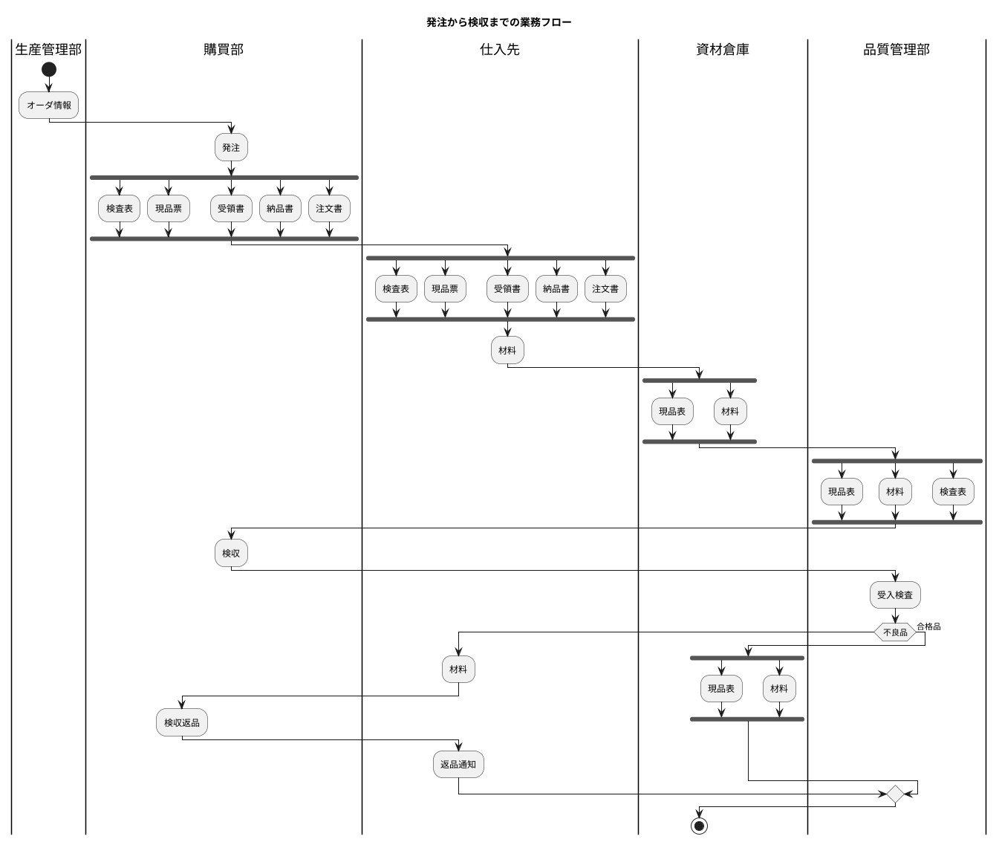
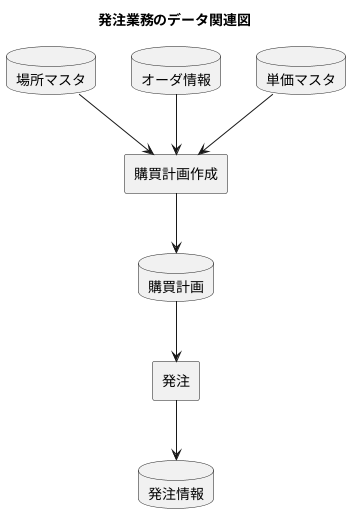
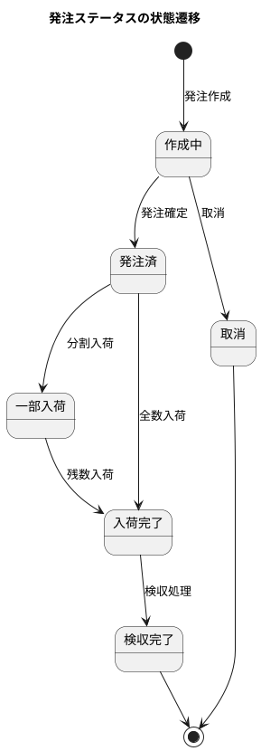
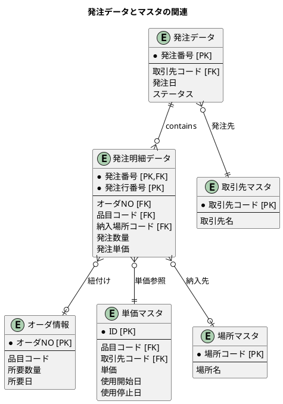
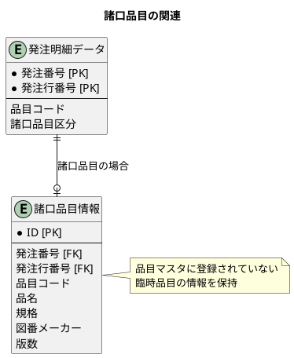
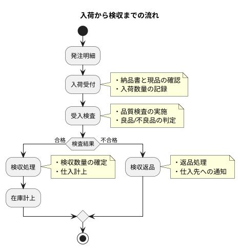
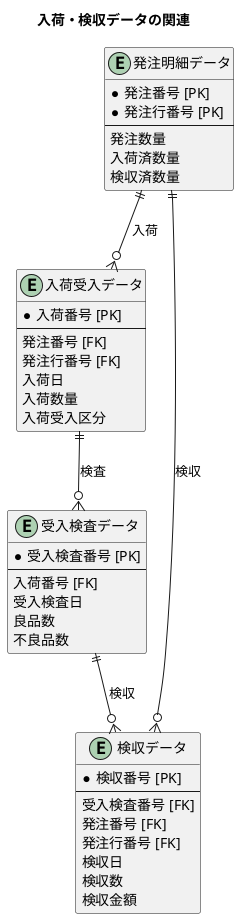

# 第25章：購買管理の設計

本章では、MRP で生成された購買オーダを実際の発注に変換し、入荷・検収までの一連の購買業務を設計します。

---

## 25.1 発注業務の DB 設計

発注業務は、購買オーダを基に取引先への発注を行い、納期管理を行う業務です。

### 発注業務の流れ



### 発注業務のデータ関連

発注業務では、オーダ情報を基に発注データを生成し、単価マスタを参照して発注金額を計算します。



### 発注関連のスキーマ設計

発注業務で使用するテーブルを定義します。

#### テーブル構造

| テーブル名 | 説明 |
|-----------|------|
| 単価マスタ | 品目・取引先ごとの単価情報を管理 |
| 発注データ | 発注ヘッダ情報（発注番号、取引先、ステータス等） |
| 発注明細データ | 発注明細情報（品目、数量、単価、金額等） |
| 諸口品目情報 | マスタに登録されていない臨時品目の情報 |

#### 発注ステータスの状態遷移



<details>
<summary>DDL: 発注関連テーブル</summary>

```sql
-- V009__create_purchasing_tables.sql

-- 発注ステータス
CREATE TYPE 発注ステータス AS ENUM ('作成中', '発注済', '一部入荷', '入荷完了', '検収完了', '取消');

-- 入荷受入区分
CREATE TYPE 入荷受入区分 AS ENUM ('通常入荷', '分割入荷', '返品入荷');

-- 単価マスタ
CREATE TABLE "単価マスタ" (
    "ID" SERIAL PRIMARY KEY,
    "品目コード" VARCHAR(20) NOT NULL,
    "取引先コード" VARCHAR(20) NOT NULL,
    "ロット単位数" DECIMAL(15, 2) DEFAULT 1 NOT NULL,
    "使用開始日" DATE NOT NULL,
    "使用停止日" DATE,
    "単価" DECIMAL(15, 2) NOT NULL,
    "作成日時" TIMESTAMP DEFAULT CURRENT_TIMESTAMP NOT NULL,
    "作成者" VARCHAR(50),
    "更新日時" TIMESTAMP DEFAULT CURRENT_TIMESTAMP NOT NULL,
    "更新者" VARCHAR(50),
    CONSTRAINT "fk_単価マスタ_品目"
        FOREIGN KEY ("品目コード") REFERENCES "品目マスタ"("品目コード"),
    CONSTRAINT "fk_単価マスタ_取引先"
        FOREIGN KEY ("取引先コード") REFERENCES "取引先マスタ"("取引先コード"),
    UNIQUE ("品目コード", "取引先コード", "ロット単位数", "使用開始日")
);

-- 発注データ
CREATE TABLE "発注データ" (
    "ID" SERIAL PRIMARY KEY,
    "発注番号" VARCHAR(20) UNIQUE NOT NULL,
    "発注日" DATE NOT NULL,
    "取引先コード" VARCHAR(20) NOT NULL,
    "発注担当者コード" VARCHAR(20),
    "発注部門コード" VARCHAR(20),
    "ステータス" 発注ステータス DEFAULT '作成中' NOT NULL,
    "備考" TEXT,
    "作成日時" TIMESTAMP DEFAULT CURRENT_TIMESTAMP NOT NULL,
    "作成者" VARCHAR(50),
    "更新日時" TIMESTAMP DEFAULT CURRENT_TIMESTAMP NOT NULL,
    "更新者" VARCHAR(50),
    CONSTRAINT "fk_発注データ_取引先"
        FOREIGN KEY ("取引先コード") REFERENCES "取引先マスタ"("取引先コード")
);

-- 発注明細データ
CREATE TABLE "発注明細データ" (
    "ID" SERIAL PRIMARY KEY,
    "発注番号" VARCHAR(20) NOT NULL,
    "発注行番号" INTEGER NOT NULL,
    "オーダNO" VARCHAR(20),
    "納入場所コード" VARCHAR(20),
    "品目コード" VARCHAR(20) NOT NULL,
    "諸口品目区分" BOOLEAN DEFAULT FALSE NOT NULL,
    "受入予定日" DATE NOT NULL,
    "回答納期" DATE,
    "発注単価" DECIMAL(15, 2) NOT NULL,
    "発注数量" DECIMAL(15, 2) NOT NULL,
    "入荷済数量" DECIMAL(15, 2) DEFAULT 0 NOT NULL,
    "検査済数量" DECIMAL(15, 2) DEFAULT 0 NOT NULL,
    "検収済数量" DECIMAL(15, 2) DEFAULT 0 NOT NULL,
    "発注金額" DECIMAL(15, 2) NOT NULL,
    "消費税金額" DECIMAL(15, 2) DEFAULT 0 NOT NULL,
    "完了フラグ" BOOLEAN DEFAULT FALSE NOT NULL,
    "明細備考" TEXT,
    "作成日時" TIMESTAMP DEFAULT CURRENT_TIMESTAMP NOT NULL,
    "作成者" VARCHAR(50),
    "更新日時" TIMESTAMP DEFAULT CURRENT_TIMESTAMP NOT NULL,
    "更新者" VARCHAR(50),
    CONSTRAINT "fk_発注明細_発注"
        FOREIGN KEY ("発注番号") REFERENCES "発注データ"("発注番号"),
    CONSTRAINT "fk_発注明細_品目"
        FOREIGN KEY ("品目コード") REFERENCES "品目マスタ"("品目コード"),
    UNIQUE ("発注番号", "発注行番号")
);

-- 諸口品目情報（マスタに登録されていない臨時品目）
CREATE TABLE "諸口品目情報" (
    "ID" SERIAL PRIMARY KEY,
    "発注番号" VARCHAR(20) NOT NULL,
    "発注行番号" INTEGER NOT NULL,
    "品目コード" VARCHAR(20) NOT NULL,
    "品名" VARCHAR(100) NOT NULL,
    "規格" VARCHAR(100),
    "図番メーカー" VARCHAR(100),
    "版数" VARCHAR(20),
    "作成日時" TIMESTAMP DEFAULT CURRENT_TIMESTAMP NOT NULL,
    "更新日時" TIMESTAMP DEFAULT CURRENT_TIMESTAMP NOT NULL,
    UNIQUE ("発注番号", "発注行番号", "品目コード")
);

-- インデックス
CREATE INDEX "idx_発注データ_取引先コード" ON "発注データ"("取引先コード");
CREATE INDEX "idx_発注データ_発注日" ON "発注データ"("発注日");
CREATE INDEX "idx_発注明細_発注番号" ON "発注明細データ"("発注番号");
CREATE INDEX "idx_発注明細_品目コード" ON "発注明細データ"("品目コード");
CREATE INDEX "idx_単価マスタ_品目取引先" ON "単価マスタ"("品目コード", "取引先コード");
```

</details>

### オーダ情報・場所マスタ・単価マスタとの連携

発注データは以下のマスタ情報と連携します。



### 諸口品目の扱い

マスタに登録されていない臨時品目（諸口品目）を発注する場合、発注明細データの「諸口品目区分」を `TRUE` に設定し、諸口品目情報テーブルに品目の詳細情報を登録します。



### 納期管理・分納対応

発注明細には「受入予定日」と「回答納期」の 2 つの日付を持ちます。

| フィールド | 説明 |
|-----------|------|
| 受入予定日 | 発注時に指定した希望納期 |
| 回答納期 | 仕入先から回答された実際の納期 |

分納（分割納品）に対応するため、発注明細ごとに「入荷済数量」「検査済数量」「検収済数量」を管理します。

### Java エンティティの定義

<details>
<summary>発注ステータス Enum</summary>

```java
// src/main/java/com/example/production/domain/model/purchase/PurchaseOrderStatus.java
package com.example.production.domain.model.purchase;

import lombok.Getter;
import lombok.RequiredArgsConstructor;

@Getter
@RequiredArgsConstructor
public enum PurchaseOrderStatus {
    CREATING("作成中"),
    ORDERED("発注済"),
    PARTIALLY_RECEIVED("一部入荷"),
    RECEIVED("入荷完了"),
    ACCEPTED("検収完了"),
    CANCELLED("取消");

    private final String displayName;

    public static PurchaseOrderStatus fromDisplayName(String displayName) {
        for (PurchaseOrderStatus status : values()) {
            if (status.displayName.equals(displayName)) {
                return status;
            }
        }
        throw new IllegalArgumentException("Unknown purchase order status: " + displayName);
    }
}
```

</details>

<details>
<summary>入荷受入区分 Enum</summary>

```java
// src/main/java/com/example/production/domain/model/purchase/ReceivingType.java
package com.example.production.domain.model.purchase;

import lombok.Getter;
import lombok.RequiredArgsConstructor;

@Getter
@RequiredArgsConstructor
public enum ReceivingType {
    NORMAL("通常入荷"),
    SPLIT("分割入荷"),
    RETURN("返品入荷");

    private final String displayName;

    public static ReceivingType fromDisplayName(String displayName) {
        for (ReceivingType type : values()) {
            if (type.displayName.equals(displayName)) {
                return type;
            }
        }
        throw new IllegalArgumentException("Unknown receiving type: " + displayName);
    }
}
```

</details>

<details>
<summary>単価マスタエンティティ</summary>

```java
// src/main/java/com/example/production/domain/model/purchase/UnitPrice.java
package com.example.production.domain.model.purchase;

import com.example.production.domain.model.item.Item;
import com.example.production.domain.model.master.Supplier;
import lombok.Builder;
import lombok.Data;

import java.math.BigDecimal;
import java.time.LocalDate;
import java.time.LocalDateTime;

@Data
@Builder
public class UnitPrice {
    private Integer id;
    private String itemCode;
    private String supplierCode;
    private BigDecimal lotUnitQuantity;
    private LocalDate effectiveFrom;
    private LocalDate effectiveTo;
    private BigDecimal unitPrice;
    private LocalDateTime createdAt;
    private String createdBy;
    private LocalDateTime updatedAt;
    private String updatedBy;

    // リレーション
    private Item item;
    private Supplier supplier;
}
```

</details>

<details>
<summary>発注データエンティティ</summary>

```java
// src/main/java/com/example/production/domain/model/purchase/PurchaseOrder.java
package com.example.production.domain.model.purchase;

import com.example.production.domain.model.master.Supplier;
import lombok.Builder;
import lombok.Data;

import java.time.LocalDate;
import java.time.LocalDateTime;
import java.util.List;

@Data
@Builder
public class PurchaseOrder {
    private Integer id;
    private String purchaseOrderNumber;
    private LocalDate orderDate;
    private String supplierCode;
    private String ordererCode;
    private String departmentCode;
    private PurchaseOrderStatus status;
    private String remarks;
    private LocalDateTime createdAt;
    private String createdBy;
    private LocalDateTime updatedAt;
    private String updatedBy;

    // リレーション
    private Supplier supplier;
    private List<PurchaseOrderDetail> details;
}
```

</details>

<details>
<summary>発注明細データエンティティ</summary>

```java
// src/main/java/com/example/production/domain/model/purchase/PurchaseOrderDetail.java
package com.example.production.domain.model.purchase;

import com.example.production.domain.model.item.Item;
import com.example.production.domain.model.plan.Order;
import lombok.Builder;
import lombok.Data;

import java.math.BigDecimal;
import java.time.LocalDate;
import java.time.LocalDateTime;
import java.util.List;

@Data
@Builder
public class PurchaseOrderDetail {
    private Integer id;
    private String purchaseOrderNumber;
    private Integer lineNumber;
    private String orderNumber;
    private String deliveryLocationCode;
    private String itemCode;
    private Boolean miscellaneousItemFlag;
    private LocalDate expectedReceivingDate;
    private LocalDate confirmedDeliveryDate;
    private BigDecimal orderUnitPrice;
    private BigDecimal orderQuantity;
    private BigDecimal receivedQuantity;
    private BigDecimal inspectedQuantity;
    private BigDecimal acceptedQuantity;
    private BigDecimal orderAmount;
    private BigDecimal taxAmount;
    private Boolean completedFlag;
    private String detailRemarks;
    private LocalDateTime createdAt;
    private String createdBy;
    private LocalDateTime updatedAt;
    private String updatedBy;

    // リレーション
    private PurchaseOrder purchaseOrder;
    private Item item;
    private Order order;
    private MiscellaneousItem miscellaneousItem;
    private List<Receiving> receivings;
    private List<Acceptance> acceptances;
}
```

</details>

<details>
<summary>諸口品目情報エンティティ</summary>

```java
// src/main/java/com/example/production/domain/model/purchase/MiscellaneousItem.java
package com.example.production.domain.model.purchase;

import lombok.Builder;
import lombok.Data;

import java.time.LocalDateTime;

@Data
@Builder
public class MiscellaneousItem {
    private Integer id;
    private String purchaseOrderNumber;
    private Integer lineNumber;
    private String itemCode;
    private String itemName;
    private String specification;
    private String drawingNumberMaker;
    private String version;
    private LocalDateTime createdAt;
    private LocalDateTime updatedAt;

    // リレーション
    private PurchaseOrderDetail purchaseOrderDetail;
}
```

</details>

### TypeHandler の実装

PostgreSQL の日本語 ENUM 型と Java の英語 Enum を相互変換するために TypeHandler を実装します。

<details>
<summary>PurchaseOrderStatusTypeHandler</summary>

```java
// src/main/java/com/example/production/infrastructure/persistence/PurchaseOrderStatusTypeHandler.java
package com.example.production.infrastructure.persistence;

import com.example.production.domain.model.purchase.PurchaseOrderStatus;
import org.apache.ibatis.type.BaseTypeHandler;
import org.apache.ibatis.type.JdbcType;
import org.apache.ibatis.type.MappedTypes;

import java.sql.CallableStatement;
import java.sql.PreparedStatement;
import java.sql.ResultSet;
import java.sql.SQLException;

@MappedTypes(PurchaseOrderStatus.class)
public class PurchaseOrderStatusTypeHandler extends BaseTypeHandler<PurchaseOrderStatus> {

    @Override
    public void setNonNullParameter(PreparedStatement ps, int i, PurchaseOrderStatus parameter, JdbcType jdbcType)
            throws SQLException {
        ps.setString(i, parameter.getDisplayName());
    }

    @Override
    public PurchaseOrderStatus getNullableResult(ResultSet rs, String columnName) throws SQLException {
        String value = rs.getString(columnName);
        return value == null ? null : PurchaseOrderStatus.fromDisplayName(value);
    }

    @Override
    public PurchaseOrderStatus getNullableResult(ResultSet rs, int columnIndex) throws SQLException {
        String value = rs.getString(columnIndex);
        return value == null ? null : PurchaseOrderStatus.fromDisplayName(value);
    }

    @Override
    public PurchaseOrderStatus getNullableResult(CallableStatement cs, int columnIndex) throws SQLException {
        String value = cs.getString(columnIndex);
        return value == null ? null : PurchaseOrderStatus.fromDisplayName(value);
    }
}
```

</details>

<details>
<summary>ReceivingTypeTypeHandler</summary>

```java
// src/main/java/com/example/production/infrastructure/persistence/ReceivingTypeTypeHandler.java
package com.example.production.infrastructure.persistence;

import com.example.production.domain.model.purchase.ReceivingType;
import org.apache.ibatis.type.BaseTypeHandler;
import org.apache.ibatis.type.JdbcType;
import org.apache.ibatis.type.MappedTypes;

import java.sql.CallableStatement;
import java.sql.PreparedStatement;
import java.sql.ResultSet;
import java.sql.SQLException;

@MappedTypes(ReceivingType.class)
public class ReceivingTypeTypeHandler extends BaseTypeHandler<ReceivingType> {

    @Override
    public void setNonNullParameter(PreparedStatement ps, int i, ReceivingType parameter, JdbcType jdbcType)
            throws SQLException {
        ps.setString(i, parameter.getDisplayName());
    }

    @Override
    public ReceivingType getNullableResult(ResultSet rs, String columnName) throws SQLException {
        String value = rs.getString(columnName);
        return value == null ? null : ReceivingType.fromDisplayName(value);
    }

    @Override
    public ReceivingType getNullableResult(ResultSet rs, int columnIndex) throws SQLException {
        String value = rs.getString(columnIndex);
        return value == null ? null : ReceivingType.fromDisplayName(value);
    }

    @Override
    public ReceivingType getNullableResult(CallableStatement cs, int columnIndex) throws SQLException {
        String value = cs.getString(columnIndex);
        return value == null ? null : ReceivingType.fromDisplayName(value);
    }
}
```

</details>

### MyBatis Mapper XML

<details>
<summary>UnitPriceMapper.xml</summary>

```xml
<!-- src/main/resources/com/example/production/infrastructure/persistence/mapper/UnitPriceMapper.xml -->
<?xml version="1.0" encoding="UTF-8" ?>
<!DOCTYPE mapper PUBLIC "-//mybatis.org//DTD Mapper 3.0//EN"
        "http://mybatis.org/dtd/mybatis-3-mapper.dtd">
<mapper namespace="com.example.production.infrastructure.persistence.mapper.UnitPriceMapper">

    <resultMap id="UnitPriceResultMap" type="com.example.production.domain.model.purchase.UnitPrice">
        <id property="id" column="ID"/>
        <result property="itemCode" column="品目コード"/>
        <result property="supplierCode" column="取引先コード"/>
        <result property="lotUnitQuantity" column="ロット単位数"/>
        <result property="effectiveFrom" column="使用開始日"/>
        <result property="effectiveTo" column="使用停止日"/>
        <result property="unitPrice" column="単価"/>
        <result property="createdAt" column="作成日時"/>
        <result property="createdBy" column="作成者"/>
        <result property="updatedAt" column="更新日時"/>
        <result property="updatedBy" column="更新者"/>
    </resultMap>

    <insert id="insert" useGeneratedKeys="true" keyProperty="id" keyColumn="ID">
        INSERT INTO "単価マスタ" (
            "品目コード", "取引先コード", "ロット単位数", "使用開始日",
            "使用停止日", "単価", "作成者"
        ) VALUES (
            #{itemCode},
            #{supplierCode},
            #{lotUnitQuantity},
            #{effectiveFrom},
            #{effectiveTo},
            #{unitPrice},
            #{createdBy}
        )
    </insert>

    <select id="findEffectiveUnitPrice" resultMap="UnitPriceResultMap">
        SELECT * FROM "単価マスタ"
        WHERE "品目コード" = #{itemCode}
          AND "取引先コード" = #{supplierCode}
          AND "使用開始日" &lt;= #{date}
          AND ("使用停止日" IS NULL OR "使用停止日" &gt;= #{date})
        ORDER BY "使用開始日" DESC
        LIMIT 1
    </select>

    <delete id="deleteAll">
        DELETE FROM "単価マスタ"
    </delete>
</mapper>
```

</details>

<details>
<summary>PurchaseOrderMapper.xml</summary>

```xml
<!-- src/main/resources/com/example/production/infrastructure/persistence/mapper/PurchaseOrderMapper.xml -->
<?xml version="1.0" encoding="UTF-8" ?>
<!DOCTYPE mapper PUBLIC "-//mybatis.org//DTD Mapper 3.0//EN"
        "http://mybatis.org/dtd/mybatis-3-mapper.dtd">
<mapper namespace="com.example.production.infrastructure.persistence.mapper.PurchaseOrderMapper">

    <resultMap id="PurchaseOrderResultMap" type="com.example.production.domain.model.purchase.PurchaseOrder">
        <id property="id" column="ID"/>
        <result property="purchaseOrderNumber" column="発注番号"/>
        <result property="orderDate" column="発注日"/>
        <result property="supplierCode" column="取引先コード"/>
        <result property="ordererCode" column="発注担当者コード"/>
        <result property="departmentCode" column="発注部門コード"/>
        <result property="status" column="ステータス"
                typeHandler="com.example.production.infrastructure.persistence.PurchaseOrderStatusTypeHandler"/>
        <result property="remarks" column="備考"/>
        <result property="createdAt" column="作成日時"/>
        <result property="createdBy" column="作成者"/>
        <result property="updatedAt" column="更新日時"/>
        <result property="updatedBy" column="更新者"/>
    </resultMap>

    <insert id="insert" useGeneratedKeys="true" keyProperty="id" keyColumn="ID">
        INSERT INTO "発注データ" (
            "発注番号", "発注日", "取引先コード", "発注担当者コード",
            "発注部門コード", "ステータス", "備考", "作成者"
        ) VALUES (
            #{purchaseOrderNumber},
            #{orderDate},
            #{supplierCode},
            #{ordererCode},
            #{departmentCode},
            #{status, typeHandler=com.example.production.infrastructure.persistence.PurchaseOrderStatusTypeHandler}::発注ステータス,
            #{remarks},
            #{createdBy}
        )
    </insert>

    <select id="findByPurchaseOrderNumber" resultMap="PurchaseOrderResultMap">
        SELECT * FROM "発注データ" WHERE "発注番号" = #{purchaseOrderNumber}
    </select>

    <select id="findLatestPurchaseOrderNumber" resultType="string">
        SELECT "発注番号" FROM "発注データ"
        WHERE "発注番号" LIKE #{prefix}
        ORDER BY "発注番号" DESC
        LIMIT 1
    </select>

    <update id="updateStatus">
        UPDATE "発注データ"
        SET "ステータス" = #{status, typeHandler=com.example.production.infrastructure.persistence.PurchaseOrderStatusTypeHandler}::発注ステータス,
            "更新日時" = CURRENT_TIMESTAMP
        WHERE "発注番号" = #{purchaseOrderNumber}
    </update>

    <delete id="deleteAll">
        DELETE FROM "発注データ"
    </delete>
</mapper>
```

</details>

<details>
<summary>PurchaseOrderDetailMapper.xml</summary>

```xml
<!-- src/main/resources/com/example/production/infrastructure/persistence/mapper/PurchaseOrderDetailMapper.xml -->
<?xml version="1.0" encoding="UTF-8" ?>
<!DOCTYPE mapper PUBLIC "-//mybatis.org//DTD Mapper 3.0//EN"
        "http://mybatis.org/dtd/mybatis-3-mapper.dtd">
<mapper namespace="com.example.production.infrastructure.persistence.mapper.PurchaseOrderDetailMapper">

    <resultMap id="PurchaseOrderDetailResultMap" type="com.example.production.domain.model.purchase.PurchaseOrderDetail">
        <id property="id" column="ID"/>
        <result property="purchaseOrderNumber" column="発注番号"/>
        <result property="lineNumber" column="発注行番号"/>
        <result property="orderNumber" column="オーダNO"/>
        <result property="deliveryLocationCode" column="納入場所コード"/>
        <result property="itemCode" column="品目コード"/>
        <result property="miscellaneousItemFlag" column="諸口品目区分"/>
        <result property="expectedReceivingDate" column="受入予定日"/>
        <result property="confirmedDeliveryDate" column="回答納期"/>
        <result property="orderUnitPrice" column="発注単価"/>
        <result property="orderQuantity" column="発注数量"/>
        <result property="receivedQuantity" column="入荷済数量"/>
        <result property="inspectedQuantity" column="検査済数量"/>
        <result property="acceptedQuantity" column="検収済数量"/>
        <result property="orderAmount" column="発注金額"/>
        <result property="taxAmount" column="消費税金額"/>
        <result property="completedFlag" column="完了フラグ"/>
        <result property="detailRemarks" column="明細備考"/>
        <result property="createdAt" column="作成日時"/>
        <result property="createdBy" column="作成者"/>
        <result property="updatedAt" column="更新日時"/>
        <result property="updatedBy" column="更新者"/>
    </resultMap>

    <insert id="insert" useGeneratedKeys="true" keyProperty="id" keyColumn="ID">
        INSERT INTO "発注明細データ" (
            "発注番号", "発注行番号", "オーダNO", "納入場所コード", "品目コード",
            "諸口品目区分", "受入予定日", "回答納期", "発注単価", "発注数量",
            "発注金額", "消費税金額", "作成者"
        ) VALUES (
            #{purchaseOrderNumber},
            #{lineNumber},
            #{orderNumber},
            #{deliveryLocationCode},
            #{itemCode},
            #{miscellaneousItemFlag},
            #{expectedReceivingDate},
            #{confirmedDeliveryDate},
            #{orderUnitPrice},
            #{orderQuantity},
            #{orderAmount},
            #{taxAmount},
            #{createdBy}
        )
    </insert>

    <select id="findByPurchaseOrderNumber" resultMap="PurchaseOrderDetailResultMap">
        SELECT * FROM "発注明細データ"
        WHERE "発注番号" = #{purchaseOrderNumber}
        ORDER BY "発注行番号"
    </select>

    <select id="findByPurchaseOrderNumberAndLineNumber" resultMap="PurchaseOrderDetailResultMap">
        SELECT * FROM "発注明細データ"
        WHERE "発注番号" = #{purchaseOrderNumber} AND "発注行番号" = #{lineNumber}
    </select>

    <update id="updateReceivedQuantity">
        UPDATE "発注明細データ"
        SET "入荷済数量" = #{receivedQuantity}, "更新日時" = CURRENT_TIMESTAMP
        WHERE "発注番号" = #{purchaseOrderNumber} AND "発注行番号" = #{lineNumber}
    </update>

    <update id="updateAcceptedQuantity">
        UPDATE "発注明細データ"
        SET "検収済数量" = #{acceptedQuantity}, "更新日時" = CURRENT_TIMESTAMP
        WHERE "発注番号" = #{purchaseOrderNumber} AND "発注行番号" = #{lineNumber}
    </update>

    <delete id="deleteAll">
        DELETE FROM "発注明細データ"
    </delete>
</mapper>
```

</details>

### Mapper インターフェース

<details>
<summary>UnitPriceMapper</summary>

```java
// src/main/java/com/example/production/infrastructure/persistence/mapper/UnitPriceMapper.java
package com.example.production.infrastructure.persistence.mapper;

import com.example.production.domain.model.purchase.UnitPrice;
import org.apache.ibatis.annotations.Mapper;
import org.apache.ibatis.annotations.Param;

import java.time.LocalDate;

@Mapper
public interface UnitPriceMapper {
    void insert(UnitPrice unitPrice);
    UnitPrice findEffectiveUnitPrice(@Param("itemCode") String itemCode,
                                     @Param("supplierCode") String supplierCode,
                                     @Param("date") LocalDate date);
    void deleteAll();
}
```

</details>

<details>
<summary>PurchaseOrderMapper</summary>

```java
// src/main/java/com/example/production/infrastructure/persistence/mapper/PurchaseOrderMapper.java
package com.example.production.infrastructure.persistence.mapper;

import com.example.production.domain.model.purchase.PurchaseOrder;
import com.example.production.domain.model.purchase.PurchaseOrderStatus;
import org.apache.ibatis.annotations.Mapper;
import org.apache.ibatis.annotations.Param;

@Mapper
public interface PurchaseOrderMapper {
    void insert(PurchaseOrder purchaseOrder);
    PurchaseOrder findByPurchaseOrderNumber(String purchaseOrderNumber);
    String findLatestPurchaseOrderNumber(String prefix);
    void updateStatus(@Param("purchaseOrderNumber") String purchaseOrderNumber,
                      @Param("status") PurchaseOrderStatus status);
    void deleteAll();
}
```

</details>

<details>
<summary>PurchaseOrderDetailMapper</summary>

```java
// src/main/java/com/example/production/infrastructure/persistence/mapper/PurchaseOrderDetailMapper.java
package com.example.production.infrastructure.persistence.mapper;

import com.example.production.domain.model.purchase.PurchaseOrderDetail;
import org.apache.ibatis.annotations.Mapper;
import org.apache.ibatis.annotations.Param;

import java.math.BigDecimal;
import java.util.List;

@Mapper
public interface PurchaseOrderDetailMapper {
    void insert(PurchaseOrderDetail detail);
    List<PurchaseOrderDetail> findByPurchaseOrderNumber(String purchaseOrderNumber);
    PurchaseOrderDetail findByPurchaseOrderNumberAndLineNumber(
            @Param("purchaseOrderNumber") String purchaseOrderNumber,
            @Param("lineNumber") Integer lineNumber);
    void updateReceivedQuantity(@Param("purchaseOrderNumber") String purchaseOrderNumber,
                                @Param("lineNumber") Integer lineNumber,
                                @Param("receivedQuantity") BigDecimal receivedQuantity);
    void updateAcceptedQuantity(@Param("purchaseOrderNumber") String purchaseOrderNumber,
                                @Param("lineNumber") Integer lineNumber,
                                @Param("acceptedQuantity") BigDecimal acceptedQuantity);
    void deleteAll();
}
```

</details>

### 発注サービスの実装

<details>
<summary>PurchaseOrderService</summary>

```java
// src/main/java/com/example/production/application/service/PurchaseOrderService.java
package com.example.production.application.service;

import com.example.production.domain.model.purchase.*;
import com.example.production.infrastructure.persistence.mapper.*;
import lombok.RequiredArgsConstructor;
import org.springframework.stereotype.Service;
import org.springframework.transaction.annotation.Transactional;

import java.math.BigDecimal;
import java.math.RoundingMode;
import java.time.LocalDate;
import java.time.format.DateTimeFormatter;
import java.util.ArrayList;
import java.util.List;

@Service
@RequiredArgsConstructor
public class PurchaseOrderService {

    private final PurchaseOrderMapper purchaseOrderMapper;
    private final PurchaseOrderDetailMapper purchaseOrderDetailMapper;
    private final UnitPriceMapper unitPriceMapper;

    /**
     * 発注番号を生成する
     */
    private String generatePurchaseOrderNumber(LocalDate orderDate) {
        String prefix = "PO-" + orderDate.format(DateTimeFormatter.ofPattern("yyyyMM")) + "-";
        String latestNumber = purchaseOrderMapper.findLatestPurchaseOrderNumber(prefix + "%");

        int sequence = 1;
        if (latestNumber != null) {
            int currentSequence = Integer.parseInt(latestNumber.substring(latestNumber.length() - 4));
            sequence = currentSequence + 1;
        }

        return prefix + String.format("%04d", sequence);
    }

    /**
     * 発注を作成する
     */
    @Transactional
    public PurchaseOrder createPurchaseOrder(PurchaseOrderCreateInput input) {
        String purchaseOrderNumber = generatePurchaseOrderNumber(input.getOrderDate());
        BigDecimal taxRate = input.getTaxRate() != null ? input.getTaxRate() : new BigDecimal("10");

        // 発注ヘッダを作成
        PurchaseOrder purchaseOrder = PurchaseOrder.builder()
                .purchaseOrderNumber(purchaseOrderNumber)
                .orderDate(input.getOrderDate())
                .supplierCode(input.getSupplierCode())
                .ordererCode(input.getOrdererCode())
                .departmentCode(input.getDepartmentCode())
                .status(PurchaseOrderStatus.CREATING)
                .remarks(input.getRemarks())
                .build();
        purchaseOrderMapper.insert(purchaseOrder);

        // 発注明細を作成
        List<PurchaseOrderDetail> details = new ArrayList<>();
        int lineNumber = 0;

        for (PurchaseOrderDetailInput detailInput : input.getDetails()) {
            lineNumber++;

            // 単価を取得
            UnitPrice unitPrice = unitPriceMapper.findEffectiveUnitPrice(
                    detailInput.getItemCode(),
                    input.getSupplierCode(),
                    input.getOrderDate()
            );

            if (unitPrice == null) {
                throw new IllegalArgumentException(
                        "Unit price not found: " + detailInput.getItemCode() + " / " + input.getSupplierCode());
            }

            // 金額計算
            BigDecimal orderAmount = unitPrice.getUnitPrice().multiply(detailInput.getOrderQuantity());
            BigDecimal taxAmount = orderAmount.multiply(taxRate)
                    .divide(new BigDecimal("100"), 0, RoundingMode.HALF_UP);

            PurchaseOrderDetail detail = PurchaseOrderDetail.builder()
                    .purchaseOrderNumber(purchaseOrderNumber)
                    .lineNumber(lineNumber)
                    .orderNumber(detailInput.getOrderNumber())
                    .deliveryLocationCode(detailInput.getDeliveryLocationCode())
                    .itemCode(detailInput.getItemCode())
                    .miscellaneousItemFlag(false)
                    .expectedReceivingDate(detailInput.getExpectedReceivingDate())
                    .orderUnitPrice(unitPrice.getUnitPrice())
                    .orderQuantity(detailInput.getOrderQuantity())
                    .orderAmount(orderAmount)
                    .taxAmount(taxAmount)
                    .build();
            purchaseOrderDetailMapper.insert(detail);

            details.add(detail);
        }

        purchaseOrder.setDetails(details);
        return purchaseOrder;
    }

    /**
     * 発注を確定する
     */
    @Transactional
    public PurchaseOrder confirmPurchaseOrder(String purchaseOrderNumber) {
        PurchaseOrder purchaseOrder = purchaseOrderMapper.findByPurchaseOrderNumber(purchaseOrderNumber);

        if (purchaseOrder == null) {
            throw new IllegalArgumentException("Purchase order not found: " + purchaseOrderNumber);
        }

        if (purchaseOrder.getStatus() != PurchaseOrderStatus.CREATING) {
            throw new IllegalStateException("Only creating purchase orders can be confirmed: " + purchaseOrderNumber);
        }

        purchaseOrderMapper.updateStatus(purchaseOrderNumber, PurchaseOrderStatus.ORDERED);
        purchaseOrder.setStatus(PurchaseOrderStatus.ORDERED);
        return purchaseOrder;
    }

    /**
     * 発注を取消する
     */
    @Transactional
    public PurchaseOrder cancelPurchaseOrder(String purchaseOrderNumber) {
        PurchaseOrder purchaseOrder = purchaseOrderMapper.findByPurchaseOrderNumber(purchaseOrderNumber);

        if (purchaseOrder == null) {
            throw new IllegalArgumentException("Purchase order not found: " + purchaseOrderNumber);
        }

        List<PurchaseOrderDetail> details = purchaseOrderDetailMapper.findByPurchaseOrderNumber(purchaseOrderNumber);
        boolean hasReceived = details.stream()
                .anyMatch(d -> d.getReceivedQuantity() != null &&
                        d.getReceivedQuantity().compareTo(BigDecimal.ZERO) > 0);

        if (hasReceived) {
            throw new IllegalStateException("Cannot cancel purchase order with received items: " + purchaseOrderNumber);
        }

        purchaseOrderMapper.updateStatus(purchaseOrderNumber, PurchaseOrderStatus.CANCELLED);
        purchaseOrder.setStatus(PurchaseOrderStatus.CANCELLED);
        return purchaseOrder;
    }
}
```

</details>

<details>
<summary>入力 DTO クラス</summary>

```java
// src/main/java/com/example/production/application/service/PurchaseOrderCreateInput.java
package com.example.production.application.service;

import lombok.Builder;
import lombok.Data;

import java.math.BigDecimal;
import java.time.LocalDate;
import java.util.List;

@Data
@Builder
public class PurchaseOrderCreateInput {
    private String supplierCode;
    private LocalDate orderDate;
    private String ordererCode;
    private String departmentCode;
    private BigDecimal taxRate;
    private String remarks;
    private List<PurchaseOrderDetailInput> details;
}
```

```java
// src/main/java/com/example/production/application/service/PurchaseOrderDetailInput.java
package com.example.production.application.service;

import lombok.Builder;
import lombok.Data;

import java.math.BigDecimal;
import java.time.LocalDate;

@Data
@Builder
public class PurchaseOrderDetailInput {
    private String itemCode;
    private BigDecimal orderQuantity;
    private LocalDate expectedReceivingDate;
    private String orderNumber;
    private String deliveryLocationCode;
}
```

</details>

### TDD: 発注データの登録テスト

<details>
<summary>PurchaseOrderServiceTest</summary>

```java
// src/test/java/com/example/production/application/service/PurchaseOrderServiceTest.java
package com.example.production.application.service;

import com.example.production.domain.model.item.Item;
import com.example.production.domain.model.item.ItemCategory;
import com.example.production.domain.model.master.Supplier;
import com.example.production.domain.model.purchase.*;
import com.example.production.infrastructure.persistence.mapper.*;
import org.junit.jupiter.api.*;
import org.mybatis.spring.boot.test.autoconfigure.MybatisTest;
import org.springframework.beans.factory.annotation.Autowired;
import org.springframework.boot.test.autoconfigure.jdbc.AutoConfigureTestDatabase;
import org.springframework.context.annotation.Import;
import org.springframework.test.context.DynamicPropertyRegistry;
import org.springframework.test.context.DynamicPropertySource;
import org.testcontainers.containers.PostgreSQLContainer;
import org.testcontainers.junit.jupiter.Container;
import org.testcontainers.junit.jupiter.Testcontainers;

import java.math.BigDecimal;
import java.time.LocalDate;
import java.util.List;

import static org.assertj.core.api.Assertions.*;

@MybatisTest
@AutoConfigureTestDatabase(replace = AutoConfigureTestDatabase.Replace.NONE)
@Import(PurchaseOrderService.class)
@Testcontainers
@DisplayName("発注業務")
class PurchaseOrderServiceTest {

    @Container
    static PostgreSQLContainer<?> postgres = new PostgreSQLContainer<>("postgres:15")
            .withDatabaseName("testdb")
            .withUsername("testuser")
            .withPassword("testpass");

    @DynamicPropertySource
    static void configureProperties(DynamicPropertyRegistry registry) {
        registry.add("spring.datasource.url", postgres::getJdbcUrl);
        registry.add("spring.datasource.username", postgres::getUsername);
        registry.add("spring.datasource.password", postgres::getPassword);
    }

    @Autowired
    private PurchaseOrderService purchaseOrderService;

    @Autowired
    private PurchaseOrderMapper purchaseOrderMapper;

    @Autowired
    private PurchaseOrderDetailMapper purchaseOrderDetailMapper;

    @Autowired
    private ItemMapper itemMapper;

    @Autowired
    private SupplierMapper supplierMapper;

    @Autowired
    private UnitPriceMapper unitPriceMapper;

    @BeforeEach
    void setUp() {
        purchaseOrderDetailMapper.deleteAll();
        purchaseOrderMapper.deleteAll();
        unitPriceMapper.deleteAll();
        supplierMapper.deleteAll();
        itemMapper.deleteAll();
    }

    @Nested
    @DisplayName("発注データの作成")
    class PurchaseOrderCreation {

        @Test
        @DisplayName("購買オーダから発注データを作成できる")
        void canCreatePurchaseOrderFromOrder() {
            // Arrange: マスタデータを準備
            Supplier supplier = Supplier.builder()
                    .supplierCode("SUP-001")
                    .effectiveFrom(LocalDate.of(2025, 1, 1))
                    .supplierName("テスト仕入先株式会社")
                    .supplierNameKana("テストシイレサキカブシキガイシャ")
                    .build();
            supplierMapper.insert(supplier);

            Item item = Item.builder()
                    .itemCode("MAT-001")
                    .effectiveFrom(LocalDate.of(2025, 1, 1))
                    .itemName("材料A")
                    .itemCategory(ItemCategory.MATERIAL)
                    .build();
            itemMapper.insert(item);

            UnitPrice unitPrice = UnitPrice.builder()
                    .itemCode("MAT-001")
                    .supplierCode("SUP-001")
                    .effectiveFrom(LocalDate.of(2025, 1, 1))
                    .unitPrice(new BigDecimal("1000"))
                    .build();
            unitPriceMapper.insert(unitPrice);

            // Act: 発注を作成
            PurchaseOrderCreateInput input = PurchaseOrderCreateInput.builder()
                    .supplierCode("SUP-001")
                    .orderDate(LocalDate.of(2025, 1, 15))
                    .taxRate(new BigDecimal("10"))
                    .details(List.of(
                            PurchaseOrderDetailInput.builder()
                                    .itemCode("MAT-001")
                                    .orderQuantity(new BigDecimal("100"))
                                    .expectedReceivingDate(LocalDate.of(2025, 1, 25))
                                    .build()
                    ))
                    .build();

            PurchaseOrder purchaseOrder = purchaseOrderService.createPurchaseOrder(input);

            // Assert
            assertThat(purchaseOrder).isNotNull();
            assertThat(purchaseOrder.getPurchaseOrderNumber()).startsWith("PO-");
            assertThat(purchaseOrder.getStatus()).isEqualTo(PurchaseOrderStatus.CREATING);
            assertThat(purchaseOrder.getDetails()).hasSize(1);
            assertThat(purchaseOrder.getDetails().get(0).getOrderQuantity())
                    .isEqualByComparingTo(new BigDecimal("100"));
            assertThat(purchaseOrder.getDetails().get(0).getOrderUnitPrice())
                    .isEqualByComparingTo(new BigDecimal("1000"));
            assertThat(purchaseOrder.getDetails().get(0).getOrderAmount())
                    .isEqualByComparingTo(new BigDecimal("100000"));
        }

        @Test
        @DisplayName("発注を発注済ステータスに変更できる")
        void canConfirmPurchaseOrder() {
            // Arrange: 発注データを準備
            Supplier supplier = Supplier.builder()
                    .supplierCode("SUP-003")
                    .effectiveFrom(LocalDate.of(2025, 1, 1))
                    .supplierName("ステータス確認用仕入先")
                    .build();
            supplierMapper.insert(supplier);

            Item item = Item.builder()
                    .itemCode("MAT-004")
                    .effectiveFrom(LocalDate.of(2025, 1, 1))
                    .itemName("材料D")
                    .itemCategory(ItemCategory.MATERIAL)
                    .build();
            itemMapper.insert(item);

            unitPriceMapper.insert(UnitPrice.builder()
                    .itemCode("MAT-004")
                    .supplierCode("SUP-003")
                    .effectiveFrom(LocalDate.of(2025, 1, 1))
                    .unitPrice(new BigDecimal("2000"))
                    .build());

            PurchaseOrderCreateInput input = PurchaseOrderCreateInput.builder()
                    .supplierCode("SUP-003")
                    .orderDate(LocalDate.of(2025, 1, 15))
                    .details(List.of(
                            PurchaseOrderDetailInput.builder()
                                    .itemCode("MAT-004")
                                    .orderQuantity(new BigDecimal("10"))
                                    .expectedReceivingDate(LocalDate.of(2025, 1, 25))
                                    .build()
                    ))
                    .build();

            PurchaseOrder purchaseOrder = purchaseOrderService.createPurchaseOrder(input);

            // Act: 発注確定
            PurchaseOrder confirmedOrder = purchaseOrderService.confirmPurchaseOrder(
                    purchaseOrder.getPurchaseOrderNumber());

            // Assert
            assertThat(confirmedOrder.getStatus()).isEqualTo(PurchaseOrderStatus.ORDERED);
        }
    }

    @Nested
    @DisplayName("消費税計算")
    class TaxCalculation {

        @Test
        @DisplayName("消費税額が正しく計算される")
        void calculatesTaxCorrectly() {
            // Arrange
            Supplier supplier = Supplier.builder()
                    .supplierCode("SUP-004")
                    .effectiveFrom(LocalDate.of(2025, 1, 1))
                    .supplierName("消費税確認用仕入先")
                    .build();
            supplierMapper.insert(supplier);

            Item item = Item.builder()
                    .itemCode("MAT-005")
                    .effectiveFrom(LocalDate.of(2025, 1, 1))
                    .itemName("材料E")
                    .itemCategory(ItemCategory.MATERIAL)
                    .build();
            itemMapper.insert(item);

            unitPriceMapper.insert(UnitPrice.builder()
                    .itemCode("MAT-005")
                    .supplierCode("SUP-004")
                    .effectiveFrom(LocalDate.of(2025, 1, 1))
                    .unitPrice(new BigDecimal("1000"))
                    .build());

            // Act
            PurchaseOrderCreateInput input = PurchaseOrderCreateInput.builder()
                    .supplierCode("SUP-004")
                    .orderDate(LocalDate.of(2025, 1, 15))
                    .taxRate(new BigDecimal("10"))
                    .details(List.of(
                            PurchaseOrderDetailInput.builder()
                                    .itemCode("MAT-005")
                                    .orderQuantity(new BigDecimal("100"))
                                    .expectedReceivingDate(LocalDate.of(2025, 1, 25))
                                    .build()
                    ))
                    .build();

            PurchaseOrder purchaseOrder = purchaseOrderService.createPurchaseOrder(input);

            // Assert: 100 × 1000 = 100,000円、消費税 10,000円
            assertThat(purchaseOrder.getDetails().get(0).getOrderAmount())
                    .isEqualByComparingTo(new BigDecimal("100000"));
            assertThat(purchaseOrder.getDetails().get(0).getTaxAmount())
                    .isEqualByComparingTo(new BigDecimal("10000"));
        }
    }
}
```

</details>

---

## 25.2 入荷・検収業務の DB 設計

入荷・検収業務は、発注した品目が納品された後の一連の処理を管理します。

### 入荷・受入業務の流れ



### 入荷・検収関連のスキーマ設計

#### テーブル構造

| テーブル名 | 説明 |
|-----------|------|
| 入荷受入データ | 入荷情報（入荷番号、数量、担当者等） |
| 欠点マスタ | 不良品の欠点コード・内容 |
| 受入検査データ | 受入検査情報（良品数、不良品数等） |
| 検収データ | 検収情報（検収数、検収金額等） |

#### データの関連



<details>
<summary>DDL: 入荷・検収関連テーブル</summary>

```sql
-- V010__create_receiving_tables.sql

-- 入荷受入データ
CREATE TABLE "入荷受入データ" (
    "ID" SERIAL PRIMARY KEY,
    "入荷番号" VARCHAR(20) UNIQUE NOT NULL,
    "発注番号" VARCHAR(20) NOT NULL,
    "発注行番号" INTEGER NOT NULL,
    "入荷日" DATE NOT NULL,
    "入荷担当者コード" VARCHAR(20),
    "入荷受入区分" 入荷受入区分 DEFAULT '通常入荷' NOT NULL,
    "品目コード" VARCHAR(20) NOT NULL,
    "諸口品目区分" BOOLEAN DEFAULT FALSE NOT NULL,
    "入荷数量" DECIMAL(15, 2) NOT NULL,
    "入荷備考" TEXT,
    "作成日時" TIMESTAMP DEFAULT CURRENT_TIMESTAMP NOT NULL,
    "作成者" VARCHAR(50),
    "更新日時" TIMESTAMP DEFAULT CURRENT_TIMESTAMP NOT NULL,
    "更新者" VARCHAR(50),
    CONSTRAINT "fk_入荷受入_発注明細"
        FOREIGN KEY ("発注番号", "発注行番号") REFERENCES "発注明細データ"("発注番号", "発注行番号"),
    CONSTRAINT "fk_入荷受入_品目"
        FOREIGN KEY ("品目コード") REFERENCES "品目マスタ"("品目コード")
);

-- 欠点マスタ
CREATE TABLE "欠点マスタ" (
    "ID" SERIAL PRIMARY KEY,
    "欠点コード" VARCHAR(20) UNIQUE NOT NULL,
    "欠点内容" VARCHAR(200) NOT NULL,
    "作成日時" TIMESTAMP DEFAULT CURRENT_TIMESTAMP NOT NULL,
    "作成者" VARCHAR(50),
    "更新日時" TIMESTAMP DEFAULT CURRENT_TIMESTAMP NOT NULL,
    "更新者" VARCHAR(50)
);

-- 受入検査データ
CREATE TABLE "受入検査データ" (
    "ID" SERIAL PRIMARY KEY,
    "受入検査番号" VARCHAR(20) UNIQUE NOT NULL,
    "入荷番号" VARCHAR(20) NOT NULL,
    "発注番号" VARCHAR(20) NOT NULL,
    "発注行番号" INTEGER NOT NULL,
    "受入検査日" DATE NOT NULL,
    "受入検査担当者コード" VARCHAR(20),
    "品目コード" VARCHAR(20) NOT NULL,
    "諸口品目区分" BOOLEAN DEFAULT FALSE NOT NULL,
    "良品数" DECIMAL(15, 2) NOT NULL,
    "不良品数" DECIMAL(15, 2) DEFAULT 0 NOT NULL,
    "受入検査備考" TEXT,
    "作成日時" TIMESTAMP DEFAULT CURRENT_TIMESTAMP NOT NULL,
    "作成者" VARCHAR(50),
    "更新日時" TIMESTAMP DEFAULT CURRENT_TIMESTAMP NOT NULL,
    "更新者" VARCHAR(50),
    CONSTRAINT "fk_受入検査_入荷"
        FOREIGN KEY ("入荷番号") REFERENCES "入荷受入データ"("入荷番号"),
    CONSTRAINT "fk_受入検査_品目"
        FOREIGN KEY ("品目コード") REFERENCES "品目マスタ"("品目コード")
);

-- 検収データ
CREATE TABLE "検収データ" (
    "ID" SERIAL PRIMARY KEY,
    "検収番号" VARCHAR(20) UNIQUE NOT NULL,
    "受入検査番号" VARCHAR(20) NOT NULL,
    "発注番号" VARCHAR(20) NOT NULL,
    "発注行番号" INTEGER NOT NULL,
    "検収日" DATE NOT NULL,
    "検収担当者コード" VARCHAR(20),
    "取引先コード" VARCHAR(20) NOT NULL,
    "品目コード" VARCHAR(20) NOT NULL,
    "諸口品目区分" BOOLEAN DEFAULT FALSE NOT NULL,
    "検収数" DECIMAL(15, 2) NOT NULL,
    "検収単価" DECIMAL(15, 2) NOT NULL,
    "検収金額" DECIMAL(15, 2) NOT NULL,
    "検収消費税額" DECIMAL(15, 2) DEFAULT 0 NOT NULL,
    "検収備考" TEXT,
    "作成日時" TIMESTAMP DEFAULT CURRENT_TIMESTAMP NOT NULL,
    "作成者" VARCHAR(50),
    "更新日時" TIMESTAMP DEFAULT CURRENT_TIMESTAMP NOT NULL,
    "更新者" VARCHAR(50),
    CONSTRAINT "fk_検収_受入検査"
        FOREIGN KEY ("受入検査番号") REFERENCES "受入検査データ"("受入検査番号"),
    CONSTRAINT "fk_検収_発注明細"
        FOREIGN KEY ("発注番号", "発注行番号") REFERENCES "発注明細データ"("発注番号", "発注行番号"),
    CONSTRAINT "fk_検収_取引先"
        FOREIGN KEY ("取引先コード") REFERENCES "取引先マスタ"("取引先コード"),
    CONSTRAINT "fk_検収_品目"
        FOREIGN KEY ("品目コード") REFERENCES "品目マスタ"("品目コード")
);

-- インデックス
CREATE INDEX "idx_入荷受入_発注番号" ON "入荷受入データ"("発注番号", "発注行番号");
CREATE INDEX "idx_入荷受入_入荷日" ON "入荷受入データ"("入荷日");
CREATE INDEX "idx_受入検査_入荷番号" ON "受入検査データ"("入荷番号");
CREATE INDEX "idx_検収_受入検査番号" ON "検収データ"("受入検査番号");
CREATE INDEX "idx_検収_発注番号" ON "検収データ"("発注番号", "発注行番号");
```

</details>

### 発注明細との紐付け

入荷受入データは発注明細データと紐付けられ、入荷のたびに発注明細の「入荷済数量」が更新されます。これにより、分納への対応が可能になります。

### 入荷受入区分（入荷 / 受入返品）

入荷受入区分は以下の値を取ります。

| 区分 | 説明 |
|-----|------|
| 通常入荷 | 通常の入荷処理 |
| 分割入荷 | 発注数量を分割して入荷する場合 |
| 返品入荷 | 検収後の返品を受け入れる場合 |

### Java エンティティの定義

<details>
<summary>入荷受入データエンティティ</summary>

```java
// src/main/java/com/example/production/domain/model/purchase/Receiving.java
package com.example.production.domain.model.purchase;

import com.example.production.domain.model.item.Item;
import lombok.Builder;
import lombok.Data;

import java.math.BigDecimal;
import java.time.LocalDate;
import java.time.LocalDateTime;
import java.util.List;

@Data
@Builder
public class Receiving {
    private Integer id;
    private String receivingNumber;
    private String purchaseOrderNumber;
    private Integer lineNumber;
    private LocalDate receivingDate;
    private String receiverCode;
    private ReceivingType receivingType;
    private String itemCode;
    private Boolean miscellaneousItemFlag;
    private BigDecimal receivingQuantity;
    private String remarks;
    private LocalDateTime createdAt;
    private String createdBy;
    private LocalDateTime updatedAt;
    private String updatedBy;

    // リレーション
    private PurchaseOrderDetail purchaseOrderDetail;
    private Item item;
    private List<Inspection> inspections;
}
```

</details>

<details>
<summary>受入検査データエンティティ</summary>

```java
// src/main/java/com/example/production/domain/model/purchase/Inspection.java
package com.example.production.domain.model.purchase;

import com.example.production.domain.model.item.Item;
import lombok.Builder;
import lombok.Data;

import java.math.BigDecimal;
import java.time.LocalDate;
import java.time.LocalDateTime;
import java.util.List;

@Data
@Builder
public class Inspection {
    private Integer id;
    private String inspectionNumber;
    private String receivingNumber;
    private String purchaseOrderNumber;
    private Integer lineNumber;
    private LocalDate inspectionDate;
    private String inspectorCode;
    private String itemCode;
    private Boolean miscellaneousItemFlag;
    private BigDecimal goodQuantity;
    private BigDecimal defectQuantity;
    private String remarks;
    private LocalDateTime createdAt;
    private String createdBy;
    private LocalDateTime updatedAt;
    private String updatedBy;

    // リレーション
    private Receiving receiving;
    private Item item;
    private List<InspectionResult> results;
    private List<Acceptance> acceptances;
}
```

</details>

<details>
<summary>検収データエンティティ</summary>

```java
// src/main/java/com/example/production/domain/model/purchase/Acceptance.java
package com.example.production.domain.model.purchase;

import com.example.production.domain.model.item.Item;
import com.example.production.domain.model.master.Supplier;
import lombok.Builder;
import lombok.Data;

import java.math.BigDecimal;
import java.time.LocalDate;
import java.time.LocalDateTime;

@Data
@Builder
public class Acceptance {
    private Integer id;
    private String acceptanceNumber;
    private String inspectionNumber;
    private String purchaseOrderNumber;
    private Integer lineNumber;
    private LocalDate acceptanceDate;
    private String acceptorCode;
    private String supplierCode;
    private String itemCode;
    private Boolean miscellaneousItemFlag;
    private BigDecimal acceptedQuantity;
    private BigDecimal unitPrice;
    private BigDecimal amount;
    private BigDecimal taxAmount;
    private String remarks;
    private LocalDateTime createdAt;
    private String createdBy;
    private LocalDateTime updatedAt;
    private String updatedBy;

    // リレーション
    private Inspection inspection;
    private PurchaseOrderDetail purchaseOrderDetail;
    private Supplier supplier;
    private Item item;
}
```

</details>

### MyBatis Mapper XML（入荷・検収）

<details>
<summary>ReceivingMapper.xml</summary>

```xml
<!-- src/main/resources/com/example/production/infrastructure/persistence/mapper/ReceivingMapper.xml -->
<?xml version="1.0" encoding="UTF-8" ?>
<!DOCTYPE mapper PUBLIC "-//mybatis.org//DTD Mapper 3.0//EN"
        "http://mybatis.org/dtd/mybatis-3-mapper.dtd">
<mapper namespace="com.example.production.infrastructure.persistence.mapper.ReceivingMapper">

    <resultMap id="ReceivingResultMap" type="com.example.production.domain.model.purchase.Receiving">
        <id property="id" column="ID"/>
        <result property="receivingNumber" column="入荷番号"/>
        <result property="purchaseOrderNumber" column="発注番号"/>
        <result property="lineNumber" column="発注行番号"/>
        <result property="receivingDate" column="入荷日"/>
        <result property="receiverCode" column="入荷担当者コード"/>
        <result property="receivingType" column="入荷受入区分"
                typeHandler="com.example.production.infrastructure.persistence.ReceivingTypeTypeHandler"/>
        <result property="itemCode" column="品目コード"/>
        <result property="miscellaneousItemFlag" column="諸口品目区分"/>
        <result property="receivingQuantity" column="入荷数量"/>
        <result property="remarks" column="入荷備考"/>
        <result property="createdAt" column="作成日時"/>
        <result property="createdBy" column="作成者"/>
        <result property="updatedAt" column="更新日時"/>
        <result property="updatedBy" column="更新者"/>
    </resultMap>

    <insert id="insert" useGeneratedKeys="true" keyProperty="id" keyColumn="ID">
        INSERT INTO "入荷受入データ" (
            "入荷番号", "発注番号", "発注行番号", "入荷日", "入荷担当者コード",
            "入荷受入区分", "品目コード", "諸口品目区分", "入荷数量", "入荷備考", "作成者"
        ) VALUES (
            #{receivingNumber},
            #{purchaseOrderNumber},
            #{lineNumber},
            #{receivingDate},
            #{receiverCode},
            #{receivingType, typeHandler=com.example.production.infrastructure.persistence.ReceivingTypeTypeHandler}::入荷受入区分,
            #{itemCode},
            #{miscellaneousItemFlag},
            #{receivingQuantity},
            #{remarks},
            #{createdBy}
        )
    </insert>

    <select id="findByReceivingNumber" resultMap="ReceivingResultMap">
        SELECT * FROM "入荷受入データ" WHERE "入荷番号" = #{receivingNumber}
    </select>

    <select id="findLatestReceivingNumber" resultType="string">
        SELECT "入荷番号" FROM "入荷受入データ"
        WHERE "入荷番号" LIKE #{prefix}
        ORDER BY "入荷番号" DESC
        LIMIT 1
    </select>

    <select id="findByPurchaseOrderNumber" resultMap="ReceivingResultMap">
        SELECT * FROM "入荷受入データ"
        WHERE "発注番号" = #{purchaseOrderNumber}
        ORDER BY "入荷日", "入荷番号"
    </select>

    <delete id="deleteAll">
        DELETE FROM "入荷受入データ"
    </delete>
</mapper>
```

</details>

<details>
<summary>InspectionMapper.xml</summary>

```xml
<!-- src/main/resources/com/example/production/infrastructure/persistence/mapper/InspectionMapper.xml -->
<?xml version="1.0" encoding="UTF-8" ?>
<!DOCTYPE mapper PUBLIC "-//mybatis.org//DTD Mapper 3.0//EN"
        "http://mybatis.org/dtd/mybatis-3-mapper.dtd">
<mapper namespace="com.example.production.infrastructure.persistence.mapper.InspectionMapper">

    <resultMap id="InspectionResultMap" type="com.example.production.domain.model.purchase.Inspection">
        <id property="id" column="ID"/>
        <result property="inspectionNumber" column="受入検査番号"/>
        <result property="receivingNumber" column="入荷番号"/>
        <result property="purchaseOrderNumber" column="発注番号"/>
        <result property="lineNumber" column="発注行番号"/>
        <result property="inspectionDate" column="受入検査日"/>
        <result property="inspectorCode" column="受入検査担当者コード"/>
        <result property="itemCode" column="品目コード"/>
        <result property="miscellaneousItemFlag" column="諸口品目区分"/>
        <result property="goodQuantity" column="良品数"/>
        <result property="defectQuantity" column="不良品数"/>
        <result property="remarks" column="受入検査備考"/>
        <result property="createdAt" column="作成日時"/>
        <result property="createdBy" column="作成者"/>
        <result property="updatedAt" column="更新日時"/>
        <result property="updatedBy" column="更新者"/>
    </resultMap>

    <insert id="insert" useGeneratedKeys="true" keyProperty="id" keyColumn="ID">
        INSERT INTO "受入検査データ" (
            "受入検査番号", "入荷番号", "発注番号", "発注行番号", "受入検査日",
            "受入検査担当者コード", "品目コード", "諸口品目区分", "良品数", "不良品数",
            "受入検査備考", "作成者"
        ) VALUES (
            #{inspectionNumber},
            #{receivingNumber},
            #{purchaseOrderNumber},
            #{lineNumber},
            #{inspectionDate},
            #{inspectorCode},
            #{itemCode},
            #{miscellaneousItemFlag},
            #{goodQuantity},
            #{defectQuantity},
            #{remarks},
            #{createdBy}
        )
    </insert>

    <select id="findByInspectionNumber" resultMap="InspectionResultMap">
        SELECT * FROM "受入検査データ" WHERE "受入検査番号" = #{inspectionNumber}
    </select>

    <select id="findLatestInspectionNumber" resultType="string">
        SELECT "受入検査番号" FROM "受入検査データ"
        WHERE "受入検査番号" LIKE #{prefix}
        ORDER BY "受入検査番号" DESC
        LIMIT 1
    </select>

    <delete id="deleteAll">
        DELETE FROM "受入検査データ"
    </delete>
</mapper>
```

</details>

<details>
<summary>AcceptanceMapper.xml</summary>

```xml
<!-- src/main/resources/com/example/production/infrastructure/persistence/mapper/AcceptanceMapper.xml -->
<?xml version="1.0" encoding="UTF-8" ?>
<!DOCTYPE mapper PUBLIC "-//mybatis.org//DTD Mapper 3.0//EN"
        "http://mybatis.org/dtd/mybatis-3-mapper.dtd">
<mapper namespace="com.example.production.infrastructure.persistence.mapper.AcceptanceMapper">

    <resultMap id="AcceptanceResultMap" type="com.example.production.domain.model.purchase.Acceptance">
        <id property="id" column="ID"/>
        <result property="acceptanceNumber" column="検収番号"/>
        <result property="inspectionNumber" column="受入検査番号"/>
        <result property="purchaseOrderNumber" column="発注番号"/>
        <result property="lineNumber" column="発注行番号"/>
        <result property="acceptanceDate" column="検収日"/>
        <result property="acceptorCode" column="検収担当者コード"/>
        <result property="supplierCode" column="取引先コード"/>
        <result property="itemCode" column="品目コード"/>
        <result property="miscellaneousItemFlag" column="諸口品目区分"/>
        <result property="acceptedQuantity" column="検収数"/>
        <result property="unitPrice" column="検収単価"/>
        <result property="amount" column="検収金額"/>
        <result property="taxAmount" column="検収消費税額"/>
        <result property="remarks" column="検収備考"/>
        <result property="createdAt" column="作成日時"/>
        <result property="createdBy" column="作成者"/>
        <result property="updatedAt" column="更新日時"/>
        <result property="updatedBy" column="更新者"/>
    </resultMap>

    <insert id="insert" useGeneratedKeys="true" keyProperty="id" keyColumn="ID">
        INSERT INTO "検収データ" (
            "検収番号", "受入検査番号", "発注番号", "発注行番号", "検収日",
            "検収担当者コード", "取引先コード", "品目コード", "諸口品目区分",
            "検収数", "検収単価", "検収金額", "検収消費税額", "検収備考", "作成者"
        ) VALUES (
            #{acceptanceNumber},
            #{inspectionNumber},
            #{purchaseOrderNumber},
            #{lineNumber},
            #{acceptanceDate},
            #{acceptorCode},
            #{supplierCode},
            #{itemCode},
            #{miscellaneousItemFlag},
            #{acceptedQuantity},
            #{unitPrice},
            #{amount},
            #{taxAmount},
            #{remarks},
            #{createdBy}
        )
    </insert>

    <select id="findByAcceptanceNumber" resultMap="AcceptanceResultMap">
        SELECT * FROM "検収データ" WHERE "検収番号" = #{acceptanceNumber}
    </select>

    <select id="findLatestAcceptanceNumber" resultType="string">
        SELECT "検収番号" FROM "検収データ"
        WHERE "検収番号" LIKE #{prefix}
        ORDER BY "検収番号" DESC
        LIMIT 1
    </select>

    <select id="findByPurchaseOrderNumber" resultMap="AcceptanceResultMap">
        SELECT * FROM "検収データ"
        WHERE "発注番号" = #{purchaseOrderNumber}
        ORDER BY "検収日", "検収番号"
    </select>

    <delete id="deleteAll">
        DELETE FROM "検収データ"
    </delete>
</mapper>
```

</details>

### Mapper インターフェース（入荷・検収）

<details>
<summary>ReceivingMapper</summary>

```java
// src/main/java/com/example/production/infrastructure/persistence/mapper/ReceivingMapper.java
package com.example.production.infrastructure.persistence.mapper;

import com.example.production.domain.model.purchase.Receiving;
import org.apache.ibatis.annotations.Mapper;
import org.apache.ibatis.annotations.Param;

import java.util.List;

@Mapper
public interface ReceivingMapper {
    void insert(Receiving receiving);
    Receiving findByReceivingNumber(String receivingNumber);
    String findLatestReceivingNumber(String prefix);
    List<Receiving> findByPurchaseOrderNumber(String purchaseOrderNumber);
    void deleteAll();
}
```

</details>

<details>
<summary>InspectionMapper</summary>

```java
// src/main/java/com/example/production/infrastructure/persistence/mapper/InspectionMapper.java
package com.example.production.infrastructure.persistence.mapper;

import com.example.production.domain.model.purchase.Inspection;
import org.apache.ibatis.annotations.Mapper;

@Mapper
public interface InspectionMapper {
    void insert(Inspection inspection);
    Inspection findByInspectionNumber(String inspectionNumber);
    String findLatestInspectionNumber(String prefix);
    void deleteAll();
}
```

</details>

<details>
<summary>AcceptanceMapper</summary>

```java
// src/main/java/com/example/production/infrastructure/persistence/mapper/AcceptanceMapper.java
package com.example.production.infrastructure.persistence.mapper;

import com.example.production.domain.model.purchase.Acceptance;
import org.apache.ibatis.annotations.Mapper;

import java.util.List;

@Mapper
public interface AcceptanceMapper {
    void insert(Acceptance acceptance);
    Acceptance findByAcceptanceNumber(String acceptanceNumber);
    String findLatestAcceptanceNumber(String prefix);
    List<Acceptance> findByPurchaseOrderNumber(String purchaseOrderNumber);
    void deleteAll();
}
```

</details>

### コマンドクラス

ヘキサゴナルアーキテクチャに従い、入力用 DTO は `application/port/in/command` に配置し、命名は `xxxCommand` とします。

<details>
<summary>ReceivingCommand</summary>

```java
// src/main/java/com/example/production/application/port/in/command/ReceivingCommand.java
package com.example.production.application.port.in.command;

import com.example.production.domain.model.purchase.ReceivingType;
import lombok.Builder;
import lombok.Data;

import java.math.BigDecimal;
import java.time.LocalDate;

@Data
@Builder
public class ReceivingCommand {
    private String purchaseOrderNumber;
    private Integer lineNumber;
    private LocalDate receivingDate;
    private String receiverCode;
    private ReceivingType receivingType;
    private BigDecimal receivingQuantity;
    private String remarks;
}
```

</details>

<details>
<summary>InspectionCommand</summary>

```java
// src/main/java/com/example/production/application/port/in/command/InspectionCommand.java
package com.example.production.application.port.in.command;

import lombok.Builder;
import lombok.Data;

import java.math.BigDecimal;
import java.time.LocalDate;

@Data
@Builder
public class InspectionCommand {
    private String receivingNumber;
    private LocalDate inspectionDate;
    private String inspectorCode;
    private BigDecimal goodQuantity;
    private BigDecimal defectQuantity;
    private String remarks;
}
```

</details>

<details>
<summary>AcceptanceCommand</summary>

```java
// src/main/java/com/example/production/application/port/in/command/AcceptanceCommand.java
package com.example.production.application.port.in.command;

import lombok.Builder;
import lombok.Data;

import java.math.BigDecimal;
import java.time.LocalDate;

@Data
@Builder
public class AcceptanceCommand {
    private String inspectionNumber;
    private LocalDate acceptanceDate;
    private String acceptorCode;
    private BigDecimal taxRate;
    private String remarks;
}
```

</details>

### 入荷検収サービスの実装

<details>
<summary>ReceivingService</summary>

```java
// src/main/java/com/example/production/application/service/ReceivingService.java
package com.example.production.application.service;

import com.example.production.domain.model.purchase.*;
import com.example.production.infrastructure.persistence.mapper.*;
import lombok.RequiredArgsConstructor;
import org.springframework.stereotype.Service;
import org.springframework.transaction.annotation.Transactional;

import java.math.BigDecimal;
import java.math.RoundingMode;
import java.time.LocalDate;
import java.time.format.DateTimeFormatter;

@Service
@RequiredArgsConstructor
public class ReceivingService {

    private final ReceivingMapper receivingMapper;
    private final InspectionMapper inspectionMapper;
    private final AcceptanceMapper acceptanceMapper;
    private final PurchaseOrderMapper purchaseOrderMapper;
    private final PurchaseOrderDetailMapper purchaseOrderDetailMapper;

    /**
     * 入荷を登録する
     */
    @Transactional
    public Receiving registerReceiving(ReceivingCommand command) {
        PurchaseOrderDetail detail = purchaseOrderDetailMapper.findByPurchaseOrderNumberAndLineNumber(
                command.getPurchaseOrderNumber(), command.getLineNumber());

        if (detail == null) {
            throw new IllegalArgumentException(
                    "Purchase order detail not found: " + command.getPurchaseOrderNumber() + "-" + command.getLineNumber());
        }

        BigDecimal receivedQuantity = detail.getReceivedQuantity() != null ?
                detail.getReceivedQuantity() : BigDecimal.ZERO;
        BigDecimal remainingQuantity = detail.getOrderQuantity().subtract(receivedQuantity);

        if (command.getReceivingQuantity().compareTo(remainingQuantity) > 0) {
            throw new IllegalStateException("Cannot receive more than ordered quantity");
        }

        String receivingNumber = generateReceivingNumber(command.getReceivingDate());

        Receiving receiving = Receiving.builder()
                .receivingNumber(receivingNumber)
                .purchaseOrderNumber(command.getPurchaseOrderNumber())
                .lineNumber(command.getLineNumber())
                .receivingDate(command.getReceivingDate())
                .receiverCode(command.getReceiverCode())
                .receivingType(command.getReceivingType() != null ? command.getReceivingType() : ReceivingType.NORMAL)
                .itemCode(detail.getItemCode())
                .miscellaneousItemFlag(detail.getMiscellaneousItemFlag())
                .receivingQuantity(command.getReceivingQuantity())
                .remarks(command.getRemarks())
                .build();
        receivingMapper.insert(receiving);

        BigDecimal newReceivedQuantity = receivedQuantity.add(command.getReceivingQuantity());
        purchaseOrderDetailMapper.updateReceivedQuantity(
                command.getPurchaseOrderNumber(), command.getLineNumber(), newReceivedQuantity);

        PurchaseOrderStatus newStatus = newReceivedQuantity.compareTo(detail.getOrderQuantity()) >= 0
                ? PurchaseOrderStatus.RECEIVED : PurchaseOrderStatus.PARTIALLY_RECEIVED;
        purchaseOrderMapper.updateStatus(command.getPurchaseOrderNumber(), newStatus);

        return receiving;
    }

    private String generateReceivingNumber(LocalDate date) {
        String prefix = "RCV-" + date.format(DateTimeFormatter.ofPattern("yyyyMM")) + "-";
        String latestNumber = receivingMapper.findLatestReceivingNumber(prefix + "%");

        int sequence = 1;
        if (latestNumber != null) {
            int currentSequence = Integer.parseInt(latestNumber.substring(latestNumber.length() - 4));
            sequence = currentSequence + 1;
        }

        return prefix + String.format("%04d", sequence);
    }

    /**
     * 受入検査を登録する
     */
    @Transactional
    public Inspection registerInspection(InspectionCommand command) {
        Receiving receiving = receivingMapper.findByReceivingNumber(command.getReceivingNumber());

        if (receiving == null) {
            throw new IllegalArgumentException("Receiving not found: " + command.getReceivingNumber());
        }

        BigDecimal totalQuantity = command.getGoodQuantity().add(command.getDefectQuantity());
        if (totalQuantity.compareTo(receiving.getReceivingQuantity()) > 0) {
            throw new IllegalStateException("Inspection quantity exceeds receiving quantity");
        }

        String inspectionNumber = generateInspectionNumber(command.getInspectionDate());

        Inspection inspection = Inspection.builder()
                .inspectionNumber(inspectionNumber)
                .receivingNumber(command.getReceivingNumber())
                .purchaseOrderNumber(receiving.getPurchaseOrderNumber())
                .lineNumber(receiving.getLineNumber())
                .inspectionDate(command.getInspectionDate())
                .inspectorCode(command.getInspectorCode())
                .itemCode(receiving.getItemCode())
                .miscellaneousItemFlag(receiving.getMiscellaneousItemFlag())
                .goodQuantity(command.getGoodQuantity())
                .defectQuantity(command.getDefectQuantity())
                .remarks(command.getRemarks())
                .build();
        inspectionMapper.insert(inspection);

        return inspection;
    }

    private String generateInspectionNumber(LocalDate date) {
        String prefix = "INS-" + date.format(DateTimeFormatter.ofPattern("yyyyMM")) + "-";
        String latestNumber = inspectionMapper.findLatestInspectionNumber(prefix + "%");

        int sequence = 1;
        if (latestNumber != null) {
            int currentSequence = Integer.parseInt(latestNumber.substring(latestNumber.length() - 4));
            sequence = currentSequence + 1;
        }

        return prefix + String.format("%04d", sequence);
    }

    /**
     * 検収処理を行う
     */
    @Transactional
    public Acceptance processAcceptance(AcceptanceCommand command) {
        Inspection inspection = inspectionMapper.findByInspectionNumber(command.getInspectionNumber());

        if (inspection == null) {
            throw new IllegalArgumentException("Inspection not found: " + command.getInspectionNumber());
        }

        PurchaseOrderDetail detail = purchaseOrderDetailMapper.findByPurchaseOrderNumberAndLineNumber(
                inspection.getPurchaseOrderNumber(), inspection.getLineNumber());

        PurchaseOrder purchaseOrder = purchaseOrderMapper.findByPurchaseOrderNumber(
                inspection.getPurchaseOrderNumber());

        BigDecimal taxRate = command.getTaxRate() != null ? command.getTaxRate() : new BigDecimal("10");

        BigDecimal amount = detail.getOrderUnitPrice().multiply(inspection.getGoodQuantity());
        BigDecimal taxAmount = amount.multiply(taxRate)
                .divide(new BigDecimal("100"), 0, RoundingMode.HALF_UP);

        String acceptanceNumber = generateAcceptanceNumber(command.getAcceptanceDate());

        Acceptance acceptance = Acceptance.builder()
                .acceptanceNumber(acceptanceNumber)
                .inspectionNumber(command.getInspectionNumber())
                .purchaseOrderNumber(inspection.getPurchaseOrderNumber())
                .lineNumber(inspection.getLineNumber())
                .acceptanceDate(command.getAcceptanceDate())
                .acceptorCode(command.getAcceptorCode())
                .supplierCode(purchaseOrder.getSupplierCode())
                .itemCode(inspection.getItemCode())
                .miscellaneousItemFlag(inspection.getMiscellaneousItemFlag())
                .acceptedQuantity(inspection.getGoodQuantity())
                .unitPrice(detail.getOrderUnitPrice())
                .amount(amount)
                .taxAmount(taxAmount)
                .remarks(command.getRemarks())
                .build();
        acceptanceMapper.insert(acceptance);

        return acceptance;
    }

    private String generateAcceptanceNumber(LocalDate date) {
        String prefix = "ACC-" + date.format(DateTimeFormatter.ofPattern("yyyyMM")) + "-";
        String latestNumber = acceptanceMapper.findLatestAcceptanceNumber(prefix + "%");

        int sequence = 1;
        if (latestNumber != null) {
            int currentSequence = Integer.parseInt(latestNumber.substring(latestNumber.length() - 4));
            sequence = currentSequence + 1;
        }

        return prefix + String.format("%04d", sequence);
    }
}
```

</details>

### 在庫計上処理

検収処理が完了すると、良品数が在庫に計上されます。在庫計上処理の詳細は第28章で解説します。

### TDD: 入荷・検収のテスト

<details>
<summary>ReceivingServiceTest</summary>

```java
// src/test/java/com/example/production/application/service/ReceivingServiceTest.java
package com.example.production.application.service;

import com.example.production.domain.model.item.Item;
import com.example.production.domain.model.item.ItemCategory;
import com.example.production.domain.model.master.Supplier;
import com.example.production.domain.model.purchase.*;
import com.example.production.infrastructure.persistence.mapper.*;
import org.junit.jupiter.api.*;
import org.mybatis.spring.boot.test.autoconfigure.MybatisTest;
import org.springframework.beans.factory.annotation.Autowired;
import org.springframework.boot.test.autoconfigure.jdbc.AutoConfigureTestDatabase;
import org.springframework.context.annotation.Import;
import org.springframework.test.context.DynamicPropertyRegistry;
import org.springframework.test.context.DynamicPropertySource;
import org.testcontainers.containers.PostgreSQLContainer;
import org.testcontainers.junit.jupiter.Container;
import org.testcontainers.junit.jupiter.Testcontainers;

import java.math.BigDecimal;
import java.time.LocalDate;
import java.util.List;

import static org.assertj.core.api.Assertions.*;

@MybatisTest
@AutoConfigureTestDatabase(replace = AutoConfigureTestDatabase.Replace.NONE)
@Import({ReceivingService.class, PurchaseOrderService.class})
@Testcontainers
@DisplayName("入荷・検収業務")
class ReceivingServiceTest {

    @Container
    static PostgreSQLContainer<?> postgres = new PostgreSQLContainer<>("postgres:15")
            .withDatabaseName("testdb")
            .withUsername("testuser")
            .withPassword("testpass");

    @DynamicPropertySource
    static void configureProperties(DynamicPropertyRegistry registry) {
        registry.add("spring.datasource.url", postgres::getJdbcUrl);
        registry.add("spring.datasource.username", postgres::getUsername);
        registry.add("spring.datasource.password", postgres::getPassword);
    }

    @Autowired
    private ReceivingService receivingService;

    @Autowired
    private PurchaseOrderService purchaseOrderService;

    @Autowired
    private ItemMapper itemMapper;

    @Autowired
    private SupplierMapper supplierMapper;

    @Autowired
    private UnitPriceMapper unitPriceMapper;

    @Autowired
    private AcceptanceMapper acceptanceMapper;

    @Autowired
    private InspectionMapper inspectionMapper;

    @Autowired
    private ReceivingMapper receivingMapper;

    @Autowired
    private PurchaseOrderDetailMapper purchaseOrderDetailMapper;

    @Autowired
    private PurchaseOrderMapper purchaseOrderMapper;

    private PurchaseOrder testPurchaseOrder;

    @BeforeEach
    void setUp() {
        // テストデータのクリーンアップ
        acceptanceMapper.deleteAll();
        inspectionMapper.deleteAll();
        receivingMapper.deleteAll();
        purchaseOrderDetailMapper.deleteAll();
        purchaseOrderMapper.deleteAll();
        unitPriceMapper.deleteAll();
        supplierMapper.deleteAll();
        itemMapper.deleteAll();

        // マスタデータの準備
        Supplier supplier = Supplier.builder()
                .supplierCode("SUP-RCV-001")
                .effectiveFrom(LocalDate.of(2025, 1, 1))
                .supplierName("入荷テスト用仕入先")
                .build();
        supplierMapper.insert(supplier);

        Item item = Item.builder()
                .itemCode("MAT-RCV-001")
                .effectiveFrom(LocalDate.of(2025, 1, 1))
                .itemName("入荷テスト用材料")
                .itemCategory(ItemCategory.MATERIAL)
                .build();
        itemMapper.insert(item);

        unitPriceMapper.insert(UnitPrice.builder()
                .itemCode("MAT-RCV-001")
                .supplierCode("SUP-RCV-001")
                .effectiveFrom(LocalDate.of(2025, 1, 1))
                .unitPrice(new BigDecimal("1000"))
                .build());

        // テスト用発注を作成
        PurchaseOrderCreateInput poInput = PurchaseOrderCreateInput.builder()
                .supplierCode("SUP-RCV-001")
                .orderDate(LocalDate.of(2025, 1, 15))
                .details(List.of(
                        PurchaseOrderDetailInput.builder()
                                .itemCode("MAT-RCV-001")
                                .orderQuantity(new BigDecimal("100"))
                                .expectedReceivingDate(LocalDate.of(2025, 1, 25))
                                .build()
                ))
                .build();
        testPurchaseOrder = purchaseOrderService.createPurchaseOrder(poInput);
        purchaseOrderService.confirmPurchaseOrder(testPurchaseOrder.getPurchaseOrderNumber());
    }

    @Nested
    @DisplayName("入荷登録")
    class ReceivingRegistration {

        @Test
        @DisplayName("発注に対して入荷を登録できる")
        void canRegisterReceiving() {
            // Act
            ReceivingCommand command = ReceivingCommand.builder()
                    .purchaseOrderNumber(testPurchaseOrder.getPurchaseOrderNumber())
                    .lineNumber(1)
                    .receivingDate(LocalDate.of(2025, 1, 25))
                    .receivingQuantity(new BigDecimal("50"))
                    .build();

            Receiving receiving = receivingService.registerReceiving(command);

            // Assert
            assertThat(receiving).isNotNull();
            assertThat(receiving.getReceivingNumber()).startsWith("RCV-");
            assertThat(receiving.getReceivingQuantity()).isEqualByComparingTo(new BigDecimal("50"));
            assertThat(receiving.getReceivingType()).isEqualTo(ReceivingType.NORMAL);
        }

        @Test
        @DisplayName("分割入荷を登録できる")
        void canRegisterSplitReceiving() {
            // Arrange: 1回目の入荷
            receivingService.registerReceiving(ReceivingCommand.builder()
                    .purchaseOrderNumber(testPurchaseOrder.getPurchaseOrderNumber())
                    .lineNumber(1)
                    .receivingDate(LocalDate.of(2025, 1, 25))
                    .receivingQuantity(new BigDecimal("30"))
                    .receivingType(ReceivingType.SPLIT)
                    .build());

            // Act: 2回目の入荷
            Receiving secondReceiving = receivingService.registerReceiving(ReceivingCommand.builder()
                    .purchaseOrderNumber(testPurchaseOrder.getPurchaseOrderNumber())
                    .lineNumber(1)
                    .receivingDate(LocalDate.of(2025, 1, 28))
                    .receivingQuantity(new BigDecimal("70"))
                    .receivingType(ReceivingType.SPLIT)
                    .build());

            // Assert
            assertThat(secondReceiving).isNotNull();
            assertThat(secondReceiving.getReceivingType()).isEqualTo(ReceivingType.SPLIT);
        }

        @Test
        @DisplayName("発注数量を超える入荷はエラーになる")
        void cannotReceiveMoreThanOrdered() {
            // Act & Assert
            ReceivingCommand command = ReceivingCommand.builder()
                    .purchaseOrderNumber(testPurchaseOrder.getPurchaseOrderNumber())
                    .lineNumber(1)
                    .receivingDate(LocalDate.of(2025, 1, 25))
                    .receivingQuantity(new BigDecimal("150"))
                    .build();

            assertThatThrownBy(() -> receivingService.registerReceiving(command))
                    .isInstanceOf(IllegalStateException.class)
                    .hasMessageContaining("Cannot receive more than ordered quantity");
        }
    }

    @Nested
    @DisplayName("受入検査")
    class InspectionRegistration {

        @Test
        @DisplayName("入荷に対して受入検査を登録できる")
        void canRegisterInspection() {
            // Arrange
            Receiving receiving = receivingService.registerReceiving(ReceivingCommand.builder()
                    .purchaseOrderNumber(testPurchaseOrder.getPurchaseOrderNumber())
                    .lineNumber(1)
                    .receivingDate(LocalDate.of(2025, 1, 25))
                    .receivingQuantity(new BigDecimal("100"))
                    .build());

            // Act
            InspectionCommand command = InspectionCommand.builder()
                    .receivingNumber(receiving.getReceivingNumber())
                    .inspectionDate(LocalDate.of(2025, 1, 26))
                    .goodQuantity(new BigDecimal("95"))
                    .defectQuantity(new BigDecimal("5"))
                    .build();

            Inspection inspection = receivingService.registerInspection(command);

            // Assert
            assertThat(inspection).isNotNull();
            assertThat(inspection.getInspectionNumber()).startsWith("INS-");
            assertThat(inspection.getGoodQuantity()).isEqualByComparingTo(new BigDecimal("95"));
            assertThat(inspection.getDefectQuantity()).isEqualByComparingTo(new BigDecimal("5"));
        }
    }

    @Nested
    @DisplayName("検収処理")
    class AcceptanceProcessing {

        @Test
        @DisplayName("検査合格品を検収できる")
        void canProcessAcceptance() {
            // Arrange
            Receiving receiving = receivingService.registerReceiving(ReceivingCommand.builder()
                    .purchaseOrderNumber(testPurchaseOrder.getPurchaseOrderNumber())
                    .lineNumber(1)
                    .receivingDate(LocalDate.of(2025, 1, 25))
                    .receivingQuantity(new BigDecimal("100"))
                    .build());

            Inspection inspection = receivingService.registerInspection(InspectionCommand.builder()
                    .receivingNumber(receiving.getReceivingNumber())
                    .inspectionDate(LocalDate.of(2025, 1, 26))
                    .goodQuantity(new BigDecimal("100"))
                    .defectQuantity(BigDecimal.ZERO)
                    .build());

            // Act
            AcceptanceCommand command = AcceptanceCommand.builder()
                    .inspectionNumber(inspection.getInspectionNumber())
                    .acceptanceDate(LocalDate.of(2025, 1, 27))
                    .taxRate(new BigDecimal("10"))
                    .build();

            Acceptance acceptance = receivingService.processAcceptance(command);

            // Assert
            assertThat(acceptance).isNotNull();
            assertThat(acceptance.getAcceptanceNumber()).startsWith("ACC-");
            assertThat(acceptance.getAcceptedQuantity()).isEqualByComparingTo(new BigDecimal("100"));
            // 100個 × 1000円 = 100,000円
            assertThat(acceptance.getAmount()).isEqualByComparingTo(new BigDecimal("100000"));
            // 消費税 10% = 10,000円
            assertThat(acceptance.getTaxAmount()).isEqualByComparingTo(new BigDecimal("10000"));
        }
    }
}
```

</details>

---

## まとめ

本章では、購買管理（発注から検収まで）の DB 設計と実装について学びました。

### 学んだこと

1. **発注業務の設計**
   - 発注データと発注明細データの親子関係
   - 単価マスタによる価格管理
   - 発注ステータスの状態遷移
   - 諸口品目（マスタ外品目）の扱い

2. **入荷・検収業務の設計**
   - 入荷→検査→検収の業務フロー
   - 分割入荷への対応
   - 良品・不良品の管理
   - 消費税計算

3. **命名規則のパターン**
   - **DB（日本語）**: テーブル名、カラム名、ENUM 型・値は日本語
   - **Java（英語）**: クラス名、フィールド名、enum 値は英語
   - **MyBatis resultMap**: 日本語カラムと英語プロパティのマッピング
   - **TypeHandler**: 日本語 ENUM 値と英語 enum の相互変換

### テーブル一覧

| テーブル名（日本語） | Java エンティティ | 説明 |
|---|---|---|
| 単価マスタ | UnitPrice | 品目・取引先ごとの単価情報 |
| 発注データ | PurchaseOrder | 発注ヘッダ情報 |
| 発注明細データ | PurchaseOrderDetail | 発注明細情報 |
| 諸口品目情報 | MiscellaneousItem | マスタ外品目の臨時情報 |
| 入荷受入データ | Receiving | 入荷情報 |
| 欠点マスタ | Defect | 不良品の欠点コード |
| 受入検査データ | Inspection | 受入検査情報 |
| 検収データ | Acceptance | 検収情報 |

### ENUM 一覧

| DB ENUM 型（日本語） | Java Enum | 値 |
|---|---|---|
| 発注ステータス | PurchaseOrderStatus | 作成中→CREATING, 発注済→ORDERED, 一部入荷→PARTIALLY_RECEIVED, 入荷完了→RECEIVED, 検収完了→ACCEPTED, 取消→CANCELLED |
| 入荷受入区分 | ReceivingType | 通常入荷→NORMAL, 分割入荷→SPLIT, 返品入荷→RETURN |
