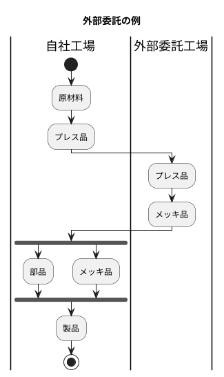
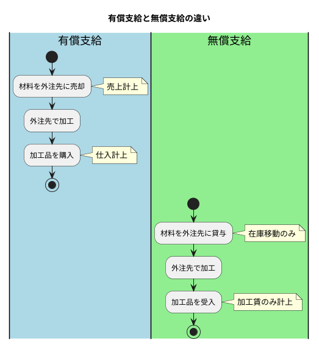
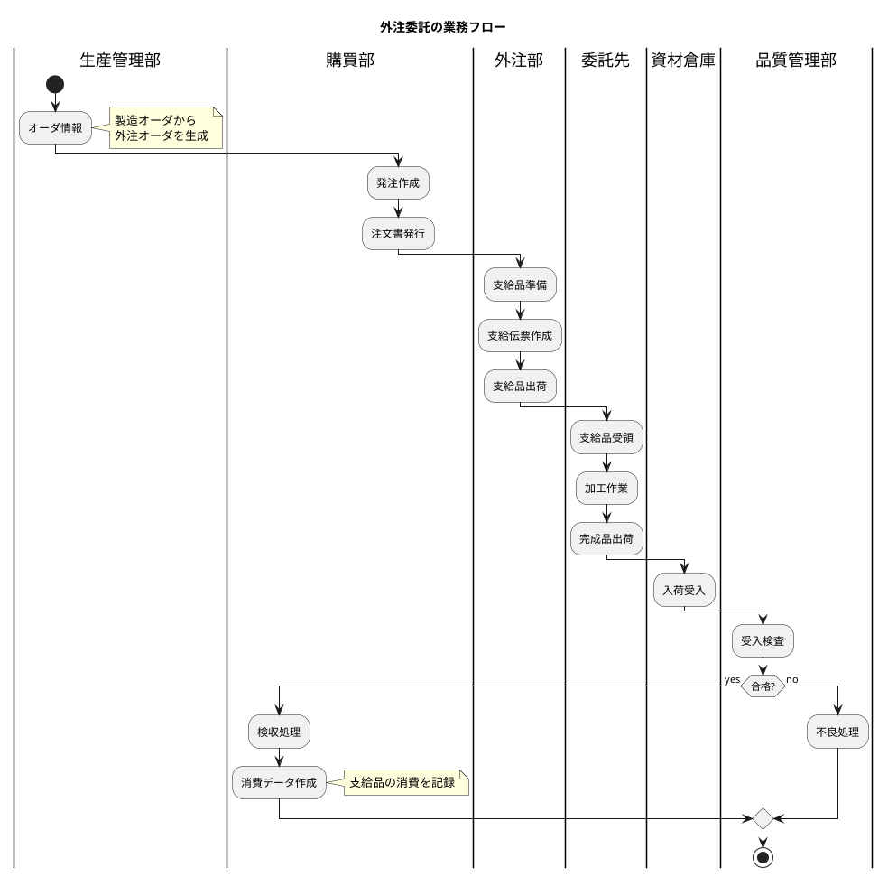
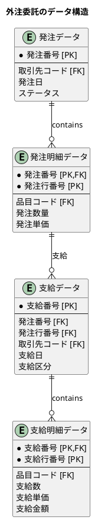
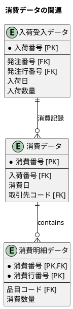
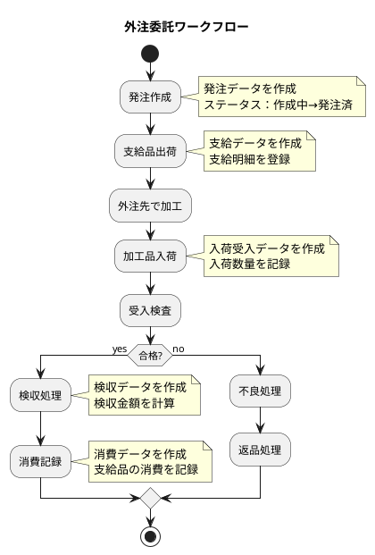
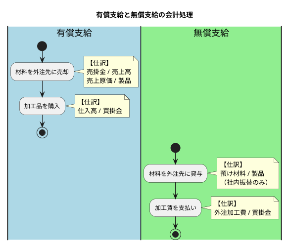
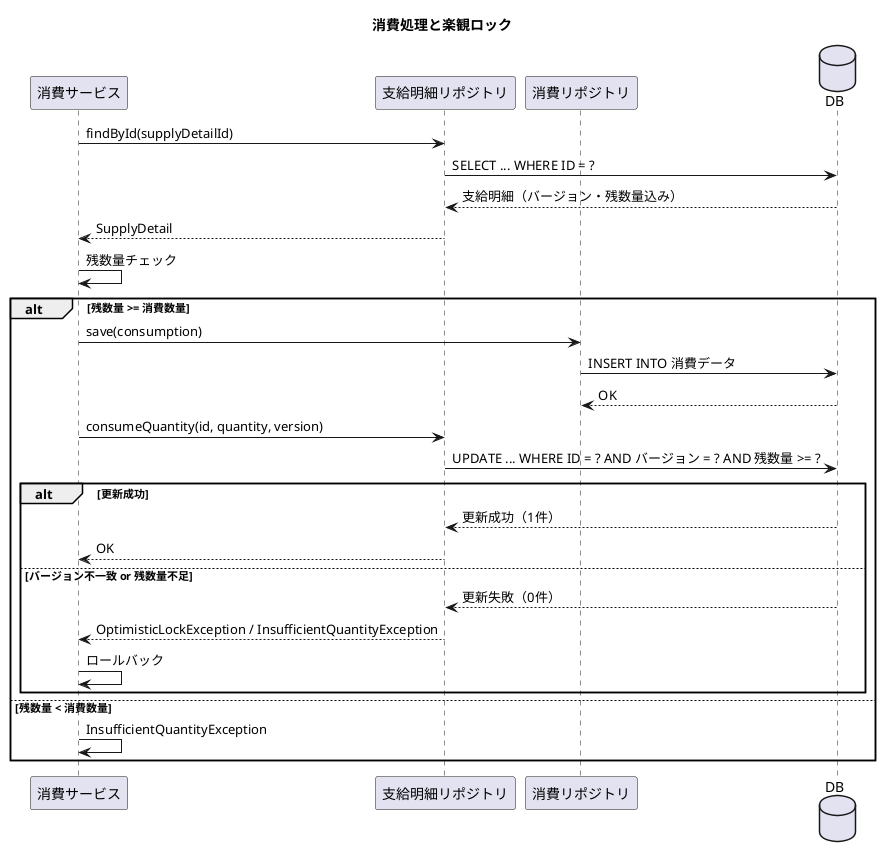

# 第26章：外注委託管理の設計

本章では、外注委託業務の DB 設計を解説します。自社で製造できない工程を外部の委託先に依頼し、材料を支給して加工してもらう業務フローをデータベースで表現します。

---

## 26.1 外注委託業務の理解

外注委託は、自社の生産能力を補完し、専門的な加工を外部に依頼するための重要な業務です。

### 外注委託とは



外注委託には以下の特徴があります：

| 特徴 | 説明 |
|-----|------|
| **専門加工の委託** | メッキ、熱処理、塗装など専門設備が必要な工程を委託 |
| **生産能力の補完** | 繁忙期の生産量増加への対応 |
| **コスト最適化** | 内製と外注のコスト比較による最適な生産配分 |

### 有償支給と無償支給

外注委託における材料の支給方法には2種類あります。

| 支給方式 | 説明 | 会計処理 |
|---------|------|---------|
| **有償支給** | 材料を売却扱いで支給 | 売上計上後、加工品を仕入れ |
| **無償支給** | 材料を無償で貸与 | 在庫のまま、加工賃のみ支払い |



### 外注委託の業務フロー



---

## 26.2 外注委託の DB 設計

### 外注オーダの構造

外注オーダは、通常の購買発注と同じテーブル構造を使用します。発注データと発注明細データに外注委託用の情報を追加する形で管理します。



### 支給関連のスキーマ設計

<details>
<summary>DDL: 支給関連テーブル</summary>

```sql
-- V011__create_supply_tables.sql

-- 支給区分
CREATE TYPE 支給区分 AS ENUM ('有償支給', '無償支給');

-- 支給データ
CREATE TABLE "支給データ" (
    "ID" SERIAL PRIMARY KEY,
    "支給番号" VARCHAR(20) UNIQUE NOT NULL,
    "発注番号" VARCHAR(20) NOT NULL,
    "発注行番号" INTEGER NOT NULL,
    "取引先コード" VARCHAR(20) NOT NULL,
    "支給日" DATE NOT NULL,
    "支給担当者コード" VARCHAR(20) NOT NULL,
    "支給区分" 支給区分 DEFAULT '無償支給' NOT NULL,
    "備考" TEXT,
    "作成日時" TIMESTAMP DEFAULT CURRENT_TIMESTAMP NOT NULL,
    "作成者" VARCHAR(50),
    "更新日時" TIMESTAMP DEFAULT CURRENT_TIMESTAMP NOT NULL,
    "更新者" VARCHAR(50),
    CONSTRAINT "fk_支給データ_発注明細"
        FOREIGN KEY ("発注番号", "発注行番号") REFERENCES "発注明細データ"("発注番号", "発注行番号"),
    CONSTRAINT "fk_支給データ_取引先"
        FOREIGN KEY ("取引先コード") REFERENCES "取引先マスタ"("取引先コード")
);

-- 支給明細データ
CREATE TABLE "支給明細データ" (
    "ID" SERIAL PRIMARY KEY,
    "支給番号" VARCHAR(20) NOT NULL,
    "支給行番号" INTEGER NOT NULL,
    "品目コード" VARCHAR(20) NOT NULL,
    "支給数" DECIMAL(15, 2) NOT NULL,
    "支給単価" DECIMAL(15, 2) NOT NULL,
    "支給金額" DECIMAL(15, 2) NOT NULL,
    "備考" TEXT,
    "作成日時" TIMESTAMP DEFAULT CURRENT_TIMESTAMP NOT NULL,
    "更新日時" TIMESTAMP DEFAULT CURRENT_TIMESTAMP NOT NULL,
    CONSTRAINT "fk_支給明細_支給"
        FOREIGN KEY ("支給番号") REFERENCES "支給データ"("支給番号"),
    CONSTRAINT "fk_支給明細_品目"
        FOREIGN KEY ("品目コード") REFERENCES "品目マスタ"("品目コード"),
    UNIQUE ("支給番号", "支給行番号")
);

-- インデックス
CREATE INDEX "idx_支給データ_発注番号" ON "支給データ"("発注番号", "発注行番号");
CREATE INDEX "idx_支給データ_取引先コード" ON "支給データ"("取引先コード");
CREATE INDEX "idx_支給データ_支給日" ON "支給データ"("支給日");
CREATE INDEX "idx_支給明細_品目コード" ON "支給明細データ"("品目コード");
```

</details>

### 発注データとの紐付け

支給データは発注明細データと紐付けられます。1つの発注明細に対して、複数の支給が発生する場合があります（分割支給）。

### 支給金額の計算（有償支給の場合）

有償支給の場合、支給金額は以下の計算式で算出されます：

```
支給金額 = 支給数 × 支給単価
```

無償支給の場合も金額は計算されますが、会計処理が異なります。

### Java エンティティの定義

<details>
<summary>支給区分 Enum</summary>

```java
// src/main/java/com/example/pms/domain/model/subcontract/SupplyType.java
package com.example.pms.domain.model.subcontract;

import lombok.Getter;
import lombok.RequiredArgsConstructor;

@Getter
@RequiredArgsConstructor
public enum SupplyType {
    PAID("有償支給"),
    FREE("無償支給");

    private final String displayName;

    public static SupplyType fromDisplayName(String displayName) {
        for (SupplyType type : values()) {
            if (type.displayName.equals(displayName)) {
                return type;
            }
        }
        throw new IllegalArgumentException("不正な支給区分: " + displayName);
    }
}
```

</details>

<details>
<summary>支給データエンティティ</summary>

```java
// src/main/java/com/example/pms/domain/model/subcontract/Supply.java
package com.example.pms.domain.model.subcontract;

import com.example.pms.domain.model.supplier.Supplier;
import com.example.pms.domain.model.purchase.PurchaseOrderDetail;
import lombok.AllArgsConstructor;
import lombok.Builder;
import lombok.Data;
import lombok.NoArgsConstructor;

import java.time.LocalDate;
import java.time.LocalDateTime;
import java.util.List;

@Data
@Builder
@NoArgsConstructor
@AllArgsConstructor
public class Supply {
    private Integer id;
    private String supplyNumber;
    private String purchaseOrderNumber;
    private Integer lineNumber;
    private String supplierCode;
    private LocalDate supplyDate;
    private String supplierPersonCode;
    private SupplyType supplyType;
    private String remarks;
    private LocalDateTime createdAt;
    private String createdBy;
    private LocalDateTime updatedAt;
    private String updatedBy;

    // リレーション
    private PurchaseOrderDetail purchaseOrderDetail;
    private Supplier supplier;
    private List<SupplyDetail> details;
}
```

</details>

<details>
<summary>支給明細データエンティティ</summary>

```java
// src/main/java/com/example/pms/domain/model/subcontract/SupplyDetail.java
package com.example.pms.domain.model.subcontract;

import com.example.pms.domain.model.item.Item;
import lombok.AllArgsConstructor;
import lombok.Builder;
import lombok.Data;
import lombok.NoArgsConstructor;

import java.math.BigDecimal;
import java.time.LocalDateTime;

@Data
@Builder
@NoArgsConstructor
@AllArgsConstructor
public class SupplyDetail {
    private Integer id;
    private String supplyNumber;
    private Integer lineNumber;
    private String itemCode;
    private BigDecimal quantity;
    private BigDecimal unitPrice;
    private BigDecimal amount;
    private String remarks;
    private LocalDateTime createdAt;
    private LocalDateTime updatedAt;

    // リレーション
    private Supply supply;
    private Item item;
}
```

</details>

### TypeHandler の実装

<details>
<summary>SupplyTypeTypeHandler</summary>

```java
// src/main/java/com/example/pms/infrastructure/persistence/SupplyTypeTypeHandler.java
package com.example.pms.infrastructure.persistence;

import com.example.pms.domain.model.subcontract.SupplyType;
import org.apache.ibatis.type.BaseTypeHandler;
import org.apache.ibatis.type.JdbcType;
import org.apache.ibatis.type.MappedTypes;

import java.sql.CallableStatement;
import java.sql.PreparedStatement;
import java.sql.ResultSet;
import java.sql.SQLException;

@MappedTypes(SupplyType.class)
public class SupplyTypeTypeHandler extends BaseTypeHandler<SupplyType> {

    @Override
    public void setNonNullParameter(PreparedStatement ps, int i, SupplyType parameter, JdbcType jdbcType)
            throws SQLException {
        ps.setString(i, parameter.getDisplayName());
    }

    @Override
    public SupplyType getNullableResult(ResultSet rs, String columnName) throws SQLException {
        String value = rs.getString(columnName);
        return value == null ? null : SupplyType.fromDisplayName(value);
    }

    @Override
    public SupplyType getNullableResult(ResultSet rs, int columnIndex) throws SQLException {
        String value = rs.getString(columnIndex);
        return value == null ? null : SupplyType.fromDisplayName(value);
    }

    @Override
    public SupplyType getNullableResult(CallableStatement cs, int columnIndex) throws SQLException {
        String value = cs.getString(columnIndex);
        return value == null ? null : SupplyType.fromDisplayName(value);
    }
}
```

</details>

### MyBatis Mapper XML

<details>
<summary>SupplyMapper.xml</summary>

```xml
<!-- src/main/resources/mapper/SupplyMapper.xml -->
<?xml version="1.0" encoding="UTF-8" ?>
<!DOCTYPE mapper PUBLIC "-//mybatis.org//DTD Mapper 3.0//EN"
        "http://mybatis.org/dtd/mybatis-3-mapper.dtd">
<mapper namespace="com.example.pms.infrastructure.out.persistence.mapper.SupplyMapper">

    <resultMap id="SupplyResultMap" type="com.example.pms.domain.model.subcontract.Supply">
        <id property="id" column="ID"/>
        <result property="supplyNumber" column="支給番号"/>
        <result property="purchaseOrderNumber" column="発注番号"/>
        <result property="lineNumber" column="発注行番号"/>
        <result property="supplierCode" column="取引先コード"/>
        <result property="supplyDate" column="支給日"/>
        <result property="supplierPersonCode" column="支給担当者コード"/>
        <result property="supplyType" column="支給区分"
                typeHandler="com.example.pms.infrastructure.out.persistence.typehandler.SupplyTypeTypeHandler"/>
        <result property="remarks" column="備考"/>
        <result property="createdAt" column="作成日時"/>
        <result property="createdBy" column="作成者"/>
        <result property="updatedAt" column="更新日時"/>
        <result property="updatedBy" column="更新者"/>
    </resultMap>

    <!-- PostgreSQL用 INSERT -->
    <insert id="insert" parameterType="com.example.pms.domain.model.subcontract.Supply"
            useGeneratedKeys="true" keyProperty="id" keyColumn="ID" databaseId="postgresql">
        INSERT INTO "支給データ" (
            "支給番号", "発注番号", "発注行番号", "取引先コード",
            "支給日", "支給担当者コード", "支給区分", "備考", "作成者", "更新者"
        ) VALUES (
            #{supplyNumber},
            #{purchaseOrderNumber},
            #{lineNumber},
            #{supplierCode},
            #{supplyDate},
            #{supplierPersonCode},
            #{supplyType, typeHandler=com.example.pms.infrastructure.out.persistence.typehandler.SupplyTypeTypeHandler}::支給区分,
            #{remarks},
            #{createdBy},
            #{updatedBy}
        )
    </insert>

    <!-- H2用 INSERT -->
    <insert id="insert" parameterType="com.example.pms.domain.model.subcontract.Supply"
            useGeneratedKeys="true" keyProperty="id" keyColumn="ID" databaseId="h2">
        INSERT INTO "支給データ" (
            "支給番号", "発注番号", "発注行番号", "取引先コード",
            "支給日", "支給担当者コード", "支給区分", "備考", "作成者", "更新者"
        ) VALUES (
            #{supplyNumber},
            #{purchaseOrderNumber},
            #{lineNumber},
            #{supplierCode},
            #{supplyDate},
            #{supplierPersonCode},
            #{supplyType, typeHandler=com.example.pms.infrastructure.out.persistence.typehandler.SupplyTypeTypeHandler},
            #{remarks},
            #{createdBy},
            #{updatedBy}
        )
    </insert>

    <select id="findById" resultMap="SupplyResultMap">
        SELECT * FROM "支給データ" WHERE "ID" = #{id}
    </select>

    <select id="findBySupplyNumber" resultMap="SupplyResultMap">
        SELECT * FROM "支給データ" WHERE "支給番号" = #{supplyNumber}
    </select>

    <select id="findByPurchaseOrderNumber" resultMap="SupplyResultMap">
        SELECT * FROM "支給データ" WHERE "発注番号" = #{purchaseOrderNumber} ORDER BY "支給日" DESC
    </select>

    <select id="findByPurchaseOrderNumberAndLineNumber" resultMap="SupplyResultMap">
        SELECT * FROM "支給データ"
        WHERE "発注番号" = #{purchaseOrderNumber} AND "発注行番号" = #{lineNumber}
        ORDER BY "支給日" DESC
    </select>

    <select id="findBySupplierCode" resultMap="SupplyResultMap">
        SELECT * FROM "支給データ" WHERE "取引先コード" = #{supplierCode} ORDER BY "支給日" DESC
    </select>

    <select id="findAll" resultMap="SupplyResultMap">
        SELECT * FROM "支給データ" ORDER BY "支給日" DESC
    </select>

    <!-- PostgreSQL用 DELETE -->
    <delete id="deleteAll" databaseId="postgresql">
        TRUNCATE TABLE "支給データ" CASCADE
    </delete>

    <!-- H2用 DELETE -->
    <delete id="deleteAll" databaseId="h2">
        DELETE FROM "支給データ"
    </delete>
</mapper>
```

</details>

<details>
<summary>SupplyDetailMapper.xml</summary>

```xml
<!-- src/main/resources/mapper/SupplyDetailMapper.xml -->
<?xml version="1.0" encoding="UTF-8" ?>
<!DOCTYPE mapper PUBLIC "-//mybatis.org//DTD Mapper 3.0//EN"
        "http://mybatis.org/dtd/mybatis-3-mapper.dtd">
<mapper namespace="com.example.pms.infrastructure.out.persistence.mapper.SupplyDetailMapper">

    <resultMap id="SupplyDetailResultMap" type="com.example.pms.domain.model.subcontract.SupplyDetail">
        <id property="id" column="ID"/>
        <result property="supplyNumber" column="支給番号"/>
        <result property="lineNumber" column="支給行番号"/>
        <result property="itemCode" column="品目コード"/>
        <result property="quantity" column="支給数"/>
        <result property="unitPrice" column="支給単価"/>
        <result property="amount" column="支給金額"/>
        <result property="remarks" column="備考"/>
        <result property="createdAt" column="作成日時"/>
        <result property="updatedAt" column="更新日時"/>
    </resultMap>

    <insert id="insert" parameterType="com.example.pms.domain.model.subcontract.SupplyDetail"
            useGeneratedKeys="true" keyProperty="id" keyColumn="ID">
        INSERT INTO "支給明細データ" (
            "支給番号", "支給行番号", "品目コード", "支給数", "支給単価", "支給金額", "備考", "作成者", "更新者"
        ) VALUES (
            #{supplyNumber},
            #{lineNumber},
            #{itemCode},
            #{quantity},
            #{unitPrice},
            #{amount},
            #{remarks},
            #{createdBy},
            #{updatedBy}
        )
    </insert>

    <select id="findById" resultMap="SupplyDetailResultMap">
        SELECT * FROM "支給明細データ" WHERE "ID" = #{id}
    </select>

    <select id="findBySupplyNumberAndLineNumber" resultMap="SupplyDetailResultMap">
        SELECT * FROM "支給明細データ"
        WHERE "支給番号" = #{supplyNumber} AND "支給行番号" = #{lineNumber}
    </select>

    <select id="findBySupplyNumber" resultMap="SupplyDetailResultMap">
        SELECT * FROM "支給明細データ"
        WHERE "支給番号" = #{supplyNumber}
        ORDER BY "支給行番号"
    </select>

    <select id="findAll" resultMap="SupplyDetailResultMap">
        SELECT * FROM "支給明細データ" ORDER BY "支給番号", "支給行番号"
    </select>

    <!-- PostgreSQL用 DELETE -->
    <delete id="deleteAll" databaseId="postgresql">
        TRUNCATE TABLE "支給明細データ" CASCADE
    </delete>

    <!-- H2用 DELETE -->
    <delete id="deleteAll" databaseId="h2">
        DELETE FROM "支給明細データ"
    </delete>
</mapper>
```

</details>

### Mapper インターフェース

<details>
<summary>SupplyMapper</summary>

```java
// src/main/java/com/example/pms/infrastructure/out/persistence/mapper/SupplyMapper.java
package com.example.pms.infrastructure.out.persistence.mapper;

import com.example.pms.domain.model.subcontract.Supply;
import org.apache.ibatis.annotations.Mapper;
import org.apache.ibatis.annotations.Param;

@Mapper
public interface SupplyMapper {
    void insert(Supply supply);
    Supply findBySupplyNumber(String supplyNumber);
    Supply findByPurchaseOrderDetail(@Param("purchaseOrderNumber") String purchaseOrderNumber,
                                     @Param("lineNumber") Integer lineNumber);
    String findLatestSupplyNumber(String prefix);
    void deleteAll();
}
```

</details>

<details>
<summary>SupplyDetailMapper</summary>

```java
// src/main/java/com/example/pms/infrastructure/out/persistence/mapper/SupplyDetailMapper.java
package com.example.pms.infrastructure.out.persistence.mapper;

import com.example.pms.domain.model.subcontract.SupplyDetail;
import org.apache.ibatis.annotations.Mapper;

import java.util.List;

@Mapper
public interface SupplyDetailMapper {
    void insert(SupplyDetail detail);
    List<SupplyDetail> findBySupplyNumber(String supplyNumber);
    void deleteAll();
}
```

</details>

### 支給サービスの実装

<details>
<summary>SupplyService</summary>

```java
// src/main/java/com/example/pms/application/service/SupplyService.java
package com.example.pms.application.service;

import com.example.pms.application.port.in.command.SupplyCreateCommand;
import com.example.pms.application.port.in.command.SupplyDetailCommand;
import com.example.pms.domain.model.subcontract.*;
import com.example.pms.infrastructure.out.persistence.mapper.*;
import lombok.RequiredArgsConstructor;
import org.springframework.stereotype.Service;
import org.springframework.transaction.annotation.Transactional;

import java.time.LocalDate;
import java.time.format.DateTimeFormatter;
import java.util.ArrayList;
import java.util.List;

@Service
@RequiredArgsConstructor
public class SupplyService {

    private final SupplyMapper supplyMapper;
    private final SupplyDetailMapper supplyDetailMapper;

    /**
     * 支給番号を生成する
     */
    private String generateSupplyNumber(LocalDate supplyDate) {
        String prefix = "SUP-" + supplyDate.format(DateTimeFormatter.ofPattern("yyyyMM")) + "-";
        String latestNumber = supplyMapper.findLatestSupplyNumber(prefix + "%");

        int sequence = 1;
        if (latestNumber != null) {
            int currentSequence = Integer.parseInt(latestNumber.substring(latestNumber.length() - 4));
            sequence = currentSequence + 1;
        }

        return prefix + String.format("%04d", sequence);
    }

    /**
     * 支給データを作成する
     */
    @Transactional
    public Supply createSupply(SupplyCreateCommand command) {
        String supplyNumber = generateSupplyNumber(command.getSupplyDate());
        SupplyType supplyType = command.getSupplyType() != null ? command.getSupplyType() : SupplyType.FREE;

        // 支給ヘッダを作成
        Supply supply = Supply.builder()
                .supplyNumber(supplyNumber)
                .purchaseOrderNumber(command.getPurchaseOrderNumber())
                .lineNumber(command.getLineNumber())
                .supplierCode(command.getSupplierCode())
                .supplyDate(command.getSupplyDate())
                .supplierPersonCode(command.getSupplierPersonCode())
                .supplyType(supplyType)
                .remarks(command.getRemarks())
                .build();
        supplyMapper.insert(supply);

        // 支給明細を作成
        List<SupplyDetail> details = new ArrayList<>();
        int detailLineNumber = 0;

        for (SupplyDetailCommand detailCommand : command.getDetails()) {
            detailLineNumber++;

            SupplyDetail detail = SupplyDetail.builder()
                    .supplyNumber(supplyNumber)
                    .lineNumber(detailLineNumber)
                    .itemCode(detailCommand.getItemCode())
                    .quantity(detailCommand.getQuantity())
                    .unitPrice(detailCommand.getUnitPrice())
                    .amount(detailCommand.getQuantity().multiply(detailCommand.getUnitPrice()))
                    .remarks(detailCommand.getRemarks())
                    .build();
            supplyDetailMapper.insert(detail);

            details.add(detail);
        }

        supply.setDetails(details);
        return supply;
    }

    /**
     * 支給番号で検索する
     */
    public Supply findBySupplyNumber(String supplyNumber) {
        Supply supply = supplyMapper.findBySupplyNumber(supplyNumber);
        if (supply != null) {
            supply.setDetails(supplyDetailMapper.findBySupplyNumber(supplyNumber));
        }
        return supply;
    }
}
```

</details>

### コマンドクラス

<details>
<summary>SupplyCreateCommand</summary>

```java
// src/main/java/com/example/pms/application/port/in/command/SupplyCreateCommand.java
package com.example.pms.application.port.in.command;

import com.example.pms.domain.model.subcontract.SupplyType;
import lombok.Builder;
import lombok.Data;

import java.time.LocalDate;
import java.util.List;

@Data
@Builder
public class SupplyCreateCommand {
    private String purchaseOrderNumber;
    private Integer lineNumber;
    private String supplierCode;
    private LocalDate supplyDate;
    private String supplierPersonCode;
    private SupplyType supplyType;
    private String remarks;
    private List<SupplyDetailCommand> details;
}
```

</details>

<details>
<summary>SupplyDetailCommand</summary>

```java
// src/main/java/com/example/pms/application/port/in/command/SupplyDetailCommand.java
package com.example.pms.application.port.in.command;

import lombok.Builder;
import lombok.Data;

import java.math.BigDecimal;

@Data
@Builder
public class SupplyDetailCommand {
    private String itemCode;
    private BigDecimal quantity;
    private BigDecimal unitPrice;
    private String remarks;
}
```

</details>

### TDD: 支給データの登録テスト

<details>
<summary>SupplyServiceTest</summary>

```java
// src/test/java/com/example/pms/application/service/SupplyServiceTest.java
package com.example.pms.application.service;

import com.example.pms.domain.model.item.Item;
import com.example.pms.domain.model.item.ItemCategory;
import com.example.pms.domain.model.supplier.Supplier;
import com.example.pms.domain.model.purchase.*;
import com.example.pms.domain.model.subcontract.*;
import com.example.pms.infrastructure.out.persistence.mapper.*;
import org.junit.jupiter.api.*;
import org.mybatis.spring.boot.test.autoconfigure.MybatisTest;
import org.springframework.beans.factory.annotation.Autowired;
import org.springframework.boot.test.autoconfigure.jdbc.AutoConfigureTestDatabase;
import org.springframework.context.annotation.Import;
import org.springframework.test.context.DynamicPropertyRegistry;
import org.springframework.test.context.DynamicPropertySource;
import org.testcontainers.containers.PostgreSQLContainer;
import org.testcontainers.junit.jupiter.Container;
import org.testcontainers.junit.jupiter.Testcontainers;

import java.math.BigDecimal;
import java.time.LocalDate;
import java.util.List;

import static org.assertj.core.api.Assertions.*;

@MybatisTest
@AutoConfigureTestDatabase(replace = AutoConfigureTestDatabase.Replace.NONE)
@Import({SupplyService.class, PurchaseOrderService.class})
@Testcontainers
@DisplayName("支給業務")
class SupplyServiceTest {

    @Container
    static PostgreSQLContainer<?> postgres = new PostgreSQLContainer<>("postgres:15")
            .withDatabaseName("testdb")
            .withUsername("testuser")
            .withPassword("testpass");

    @DynamicPropertySource
    static void configureProperties(DynamicPropertyRegistry registry) {
        registry.add("spring.datasource.url", postgres::getJdbcUrl);
        registry.add("spring.datasource.username", postgres::getUsername);
        registry.add("spring.datasource.password", postgres::getPassword);
    }

    @Autowired
    private SupplyService supplyService;

    @Autowired
    private PurchaseOrderService purchaseOrderService;

    @Autowired
    private ItemMapper itemMapper;

    @Autowired
    private SupplierMapper supplierMapper;

    @Autowired
    private UnitPriceMapper unitPriceMapper;

    @Autowired
    private SupplyMapper supplyMapper;

    @Autowired
    private SupplyDetailMapper supplyDetailMapper;

    @Autowired
    private PurchaseOrderMapper purchaseOrderMapper;

    @Autowired
    private PurchaseOrderDetailMapper purchaseOrderDetailMapper;

    private PurchaseOrder testPurchaseOrder;

    @BeforeEach
    void setUp() {
        supplyDetailMapper.deleteAll();
        supplyMapper.deleteAll();
        purchaseOrderDetailMapper.deleteAll();
        purchaseOrderMapper.deleteAll();
        unitPriceMapper.deleteAll();
        supplierMapper.deleteAll();
        itemMapper.deleteAll();

        // マスタデータの準備
        Supplier supplier = Supplier.builder()
                .supplierCode("SUB-001")
                .effectiveFrom(LocalDate.of(2025, 1, 1))
                .supplierName("株式会社メッキ工業")
                .build();
        supplierMapper.insert(supplier);

        Item parentItem = Item.builder()
                .itemCode("PLATED-001")
                .effectiveFrom(LocalDate.of(2025, 1, 1))
                .itemName("メッキ加工品")
                .itemCategory(ItemCategory.SEMI_PRODUCT)
                .build();
        itemMapper.insert(parentItem);

        Item supplyItem = Item.builder()
                .itemCode("PRESS-001")
                .effectiveFrom(LocalDate.of(2025, 1, 1))
                .itemName("プレス部品")
                .itemCategory(ItemCategory.PART)
                .build();
        itemMapper.insert(supplyItem);

        unitPriceMapper.insert(UnitPrice.builder()
                .itemCode("PLATED-001")
                .supplierCode("SUB-001")
                .effectiveFrom(LocalDate.of(2025, 1, 1))
                .unitPrice(new BigDecimal("500"))
                .build());

        // テスト用発注を作成
        PurchaseOrderCreateInput poInput = PurchaseOrderCreateInput.builder()
                .supplierCode("SUB-001")
                .orderDate(LocalDate.of(2025, 1, 15))
                .details(List.of(
                        PurchaseOrderDetailInput.builder()
                                .itemCode("PLATED-001")
                                .orderQuantity(new BigDecimal("100"))
                                .expectedReceivingDate(LocalDate.of(2025, 1, 25))
                                .build()
                ))
                .build();
        testPurchaseOrder = purchaseOrderService.createPurchaseOrder(poInput);
        purchaseOrderService.confirmPurchaseOrder(testPurchaseOrder.getPurchaseOrderNumber());
    }

    @Nested
    @DisplayName("支給データ作成")
    class SupplyCreation {

        @Test
        @DisplayName("発注に紐づく支給データを作成できる")
        void canCreateSupplyFromPurchaseOrder() {
            // Act
            SupplyCreateCommand input = SupplyCreateCommand.builder()
                    .purchaseOrderNumber(testPurchaseOrder.getPurchaseOrderNumber())
                    .lineNumber(1)
                    .supplierCode("SUB-001")
                    .supplyDate(LocalDate.of(2025, 1, 16))
                    .supplierPersonCode("EMP001")
                    .supplyType(SupplyType.FREE)
                    .details(List.of(
                            SupplyDetailCommand.builder()
                                    .itemCode("PRESS-001")
                                    .quantity(new BigDecimal("100"))
                                    .unitPrice(new BigDecimal("200"))
                                    .build()
                    ))
                    .build();

            Supply supply = supplyService.createSupply(input);

            // Assert
            assertThat(supply).isNotNull();
            assertThat(supply.getSupplyNumber()).startsWith("SUP-");
            assertThat(supply.getSupplierCode()).isEqualTo("SUB-001");
            assertThat(supply.getSupplyType()).isEqualTo(SupplyType.FREE);
            assertThat(supply.getDetails()).hasSize(1);
            assertThat(supply.getDetails().get(0).getQuantity())
                    .isEqualByComparingTo(new BigDecimal("100"));
        }

        @Test
        @DisplayName("有償支給を作成できる")
        void canCreatePaidSupply() {
            // Act
            SupplyCreateCommand input = SupplyCreateCommand.builder()
                    .purchaseOrderNumber(testPurchaseOrder.getPurchaseOrderNumber())
                    .lineNumber(1)
                    .supplierCode("SUB-001")
                    .supplyDate(LocalDate.of(2025, 1, 16))
                    .supplierPersonCode("EMP001")
                    .supplyType(SupplyType.PAID)
                    .details(List.of(
                            SupplyDetailCommand.builder()
                                    .itemCode("PRESS-001")
                                    .quantity(new BigDecimal("100"))
                                    .unitPrice(new BigDecimal("200"))
                                    .build()
                    ))
                    .build();

            Supply supply = supplyService.createSupply(input);

            // Assert
            assertThat(supply.getSupplyType()).isEqualTo(SupplyType.PAID);
            assertThat(supply.getDetails().get(0).getAmount())
                    .isEqualByComparingTo(new BigDecimal("20000"));
        }
    }
}
```

</details>

---

## 26.3 消費業務の設計

外注先が支給品を加工して納品した際、支給した材料がどれだけ消費されたかを記録します。

### 消費関連のスキーマ設計



<details>
<summary>DDL: 消費関連テーブル</summary>

```sql
-- V012__create_consumption_tables.sql

-- 消費データ
CREATE TABLE "消費データ" (
    "ID" SERIAL PRIMARY KEY,
    "消費番号" VARCHAR(20) UNIQUE NOT NULL,
    "入荷番号" VARCHAR(20) NOT NULL,
    "消費日" DATE NOT NULL,
    "取引先コード" VARCHAR(20) NOT NULL,
    "備考" TEXT,
    "作成日時" TIMESTAMP DEFAULT CURRENT_TIMESTAMP NOT NULL,
    "作成者" VARCHAR(50),
    "更新日時" TIMESTAMP DEFAULT CURRENT_TIMESTAMP NOT NULL,
    "更新者" VARCHAR(50),
    CONSTRAINT "fk_消費データ_入荷"
        FOREIGN KEY ("入荷番号") REFERENCES "入荷受入データ"("入荷番号"),
    CONSTRAINT "fk_消費データ_取引先"
        FOREIGN KEY ("取引先コード") REFERENCES "取引先マスタ"("取引先コード")
);

-- 消費明細データ
CREATE TABLE "消費明細データ" (
    "ID" SERIAL PRIMARY KEY,
    "消費番号" VARCHAR(20) NOT NULL,
    "消費行番号" INTEGER NOT NULL,
    "品目コード" VARCHAR(20) NOT NULL,
    "消費数量" DECIMAL(15, 2) NOT NULL,
    "備考" TEXT,
    "作成日時" TIMESTAMP DEFAULT CURRENT_TIMESTAMP NOT NULL,
    "更新日時" TIMESTAMP DEFAULT CURRENT_TIMESTAMP NOT NULL,
    CONSTRAINT "fk_消費明細_消費"
        FOREIGN KEY ("消費番号") REFERENCES "消費データ"("消費番号"),
    CONSTRAINT "fk_消費明細_品目"
        FOREIGN KEY ("品目コード") REFERENCES "品目マスタ"("品目コード"),
    UNIQUE ("消費番号", "消費行番号")
);

-- インデックス
CREATE INDEX "idx_消費データ_入荷番号" ON "消費データ"("入荷番号");
CREATE INDEX "idx_消費データ_取引先コード" ON "消費データ"("取引先コード");
CREATE INDEX "idx_消費データ_消費日" ON "消費データ"("消費日");
CREATE INDEX "idx_消費明細_品目コード" ON "消費明細データ"("品目コード");
```

</details>

### 入荷受入データとの紐付け

消費データは入荷受入データと紐付けられます。外注先から加工品が入荷した時点で、支給した材料の消費量を記録します。

### 消費率の計算

消費率（歩留まり率）は以下の計算式で算出されます：

```
消費率 = 消費数量 ÷ 支給数量
```

この値は品質管理や原価計算において重要な指標となります。

### Java エンティティの定義

<details>
<summary>消費データエンティティ</summary>

```java
// src/main/java/com/example/pms/domain/model/subcontract/Consumption.java
package com.example.pms.domain.model.subcontract;

import com.example.pms.domain.model.supplier.Supplier;
import com.example.pms.domain.model.purchase.Receiving;
import lombok.AllArgsConstructor;
import lombok.Builder;
import lombok.Data;
import lombok.NoArgsConstructor;

import java.time.LocalDate;
import java.time.LocalDateTime;
import java.util.List;

@Data
@Builder
@NoArgsConstructor
@AllArgsConstructor
public class Consumption {
    private Integer id;
    private String consumptionNumber;
    private String receivingNumber;
    private LocalDate consumptionDate;
    private String supplierCode;
    private String remarks;
    private LocalDateTime createdAt;
    private String createdBy;
    private LocalDateTime updatedAt;
    private String updatedBy;

    // リレーション
    private Receiving receiving;
    private Supplier supplier;
    private List<ConsumptionDetail> details;
}
```

</details>

<details>
<summary>消費明細データエンティティ</summary>

```java
// src/main/java/com/example/pms/domain/model/subcontract/ConsumptionDetail.java
package com.example.pms.domain.model.subcontract;

import com.example.pms.domain.model.item.Item;
import lombok.AllArgsConstructor;
import lombok.Builder;
import lombok.Data;
import lombok.NoArgsConstructor;

import java.math.BigDecimal;
import java.time.LocalDateTime;

@Data
@Builder
@NoArgsConstructor
@AllArgsConstructor
public class ConsumptionDetail {
    private Integer id;
    private String consumptionNumber;
    private Integer lineNumber;
    private String itemCode;
    private BigDecimal quantity;
    private String remarks;
    private LocalDateTime createdAt;
    private LocalDateTime updatedAt;

    // リレーション
    private Consumption consumption;
    private Item item;
}
```

</details>

### MyBatis Mapper XML

<details>
<summary>ConsumptionMapper.xml</summary>

```xml
<!-- src/main/resources/mapper/ConsumptionMapper.xml -->
<?xml version="1.0" encoding="UTF-8" ?>
<!DOCTYPE mapper PUBLIC "-//mybatis.org//DTD Mapper 3.0//EN"
        "http://mybatis.org/dtd/mybatis-3-mapper.dtd">
<mapper namespace="com.example.pms.infrastructure.out.persistence.mapper.ConsumptionMapper">

    <resultMap id="ConsumptionResultMap" type="com.example.pms.domain.model.subcontract.Consumption">
        <id property="id" column="ID"/>
        <result property="consumptionNumber" column="消費番号"/>
        <result property="receivingNumber" column="入荷番号"/>
        <result property="consumptionDate" column="消費日"/>
        <result property="supplierCode" column="取引先コード"/>
        <result property="remarks" column="備考"/>
        <result property="createdAt" column="作成日時"/>
        <result property="createdBy" column="作成者"/>
        <result property="updatedAt" column="更新日時"/>
        <result property="updatedBy" column="更新者"/>
    </resultMap>

    <insert id="insert" parameterType="com.example.pms.domain.model.subcontract.Consumption"
            useGeneratedKeys="true" keyProperty="id" keyColumn="ID">
        INSERT INTO "消費データ" (
            "消費番号", "入荷番号", "消費日", "取引先コード", "備考", "作成者", "更新者"
        ) VALUES (
            #{consumptionNumber},
            #{receivingNumber},
            #{consumptionDate},
            #{supplierCode},
            #{remarks},
            #{createdBy},
            #{updatedBy}
        )
    </insert>

    <select id="findById" resultMap="ConsumptionResultMap">
        SELECT * FROM "消費データ" WHERE "ID" = #{id}
    </select>

    <select id="findByConsumptionNumber" resultMap="ConsumptionResultMap">
        SELECT * FROM "消費データ" WHERE "消費番号" = #{consumptionNumber}
    </select>

    <select id="findByReceivingNumber" resultMap="ConsumptionResultMap">
        SELECT * FROM "消費データ" WHERE "入荷番号" = #{receivingNumber} ORDER BY "消費日" DESC
    </select>

    <select id="findBySupplierCode" resultMap="ConsumptionResultMap">
        SELECT * FROM "消費データ" WHERE "取引先コード" = #{supplierCode} ORDER BY "消費日" DESC
    </select>

    <select id="findAll" resultMap="ConsumptionResultMap">
        SELECT * FROM "消費データ" ORDER BY "消費日" DESC
    </select>

    <!-- PostgreSQL用 DELETE -->
    <delete id="deleteAll" databaseId="postgresql">
        TRUNCATE TABLE "消費データ" CASCADE
    </delete>

    <!-- H2用 DELETE -->
    <delete id="deleteAll" databaseId="h2">
        DELETE FROM "消費データ"
    </delete>
</mapper>
```

</details>

<details>
<summary>ConsumptionDetailMapper.xml</summary>

```xml
<!-- src/main/resources/mapper/ConsumptionDetailMapper.xml -->
<?xml version="1.0" encoding="UTF-8" ?>
<!DOCTYPE mapper PUBLIC "-//mybatis.org//DTD Mapper 3.0//EN"
        "http://mybatis.org/dtd/mybatis-3-mapper.dtd">
<mapper namespace="com.example.pms.infrastructure.out.persistence.mapper.ConsumptionDetailMapper">

    <resultMap id="ConsumptionDetailResultMap" type="com.example.pms.domain.model.subcontract.ConsumptionDetail">
        <id property="id" column="ID"/>
        <result property="consumptionNumber" column="消費番号"/>
        <result property="lineNumber" column="消費行番号"/>
        <result property="itemCode" column="品目コード"/>
        <result property="quantity" column="消費数量"/>
        <result property="remarks" column="備考"/>
        <result property="createdAt" column="作成日時"/>
        <result property="updatedAt" column="更新日時"/>
    </resultMap>

    <insert id="insert" parameterType="com.example.pms.domain.model.subcontract.ConsumptionDetail"
            useGeneratedKeys="true" keyProperty="id" keyColumn="ID">
        INSERT INTO "消費明細データ" (
            "消費番号", "消費行番号", "品目コード", "消費数量", "備考", "作成者", "更新者"
        ) VALUES (
            #{consumptionNumber},
            #{lineNumber},
            #{itemCode},
            #{quantity},
            #{remarks},
            #{createdBy},
            #{updatedBy}
        )
    </insert>

    <select id="findById" resultMap="ConsumptionDetailResultMap">
        SELECT * FROM "消費明細データ" WHERE "ID" = #{id}
    </select>

    <select id="findByConsumptionNumberAndLineNumber" resultMap="ConsumptionDetailResultMap">
        SELECT * FROM "消費明細データ"
        WHERE "消費番号" = #{consumptionNumber} AND "消費行番号" = #{lineNumber}
    </select>

    <select id="findByConsumptionNumber" resultMap="ConsumptionDetailResultMap">
        SELECT * FROM "消費明細データ"
        WHERE "消費番号" = #{consumptionNumber}
        ORDER BY "消費行番号"
    </select>

    <select id="findAll" resultMap="ConsumptionDetailResultMap">
        SELECT * FROM "消費明細データ" ORDER BY "消費番号", "消費行番号"
    </select>

    <!-- PostgreSQL用 DELETE -->
    <delete id="deleteAll" databaseId="postgresql">
        TRUNCATE TABLE "消費明細データ" CASCADE
    </delete>

    <!-- H2用 DELETE -->
    <delete id="deleteAll" databaseId="h2">
        DELETE FROM "消費明細データ"
    </delete>
</mapper>
```

</details>

### Mapper インターフェース

<details>
<summary>ConsumptionMapper</summary>

```java
// src/main/java/com/example/pms/infrastructure/out/persistence/mapper/ConsumptionMapper.java
package com.example.pms.infrastructure.out.persistence.mapper;

import com.example.pms.domain.model.subcontract.Consumption;
import org.apache.ibatis.annotations.Mapper;

@Mapper
public interface ConsumptionMapper {
    void insert(Consumption consumption);
    Consumption findByConsumptionNumber(String consumptionNumber);
    Consumption findByReceivingNumber(String receivingNumber);
    String findLatestConsumptionNumber(String prefix);
    void deleteAll();
}
```

</details>

<details>
<summary>ConsumptionDetailMapper</summary>

```java
// src/main/java/com/example/pms/infrastructure/out/persistence/mapper/ConsumptionDetailMapper.java
package com.example.pms.infrastructure.out.persistence.mapper;

import com.example.pms.domain.model.subcontract.ConsumptionDetail;
import org.apache.ibatis.annotations.Mapper;
import org.apache.ibatis.annotations.Param;

import java.math.BigDecimal;
import java.util.List;

@Mapper
public interface ConsumptionDetailMapper {
    void insert(ConsumptionDetail detail);
    List<ConsumptionDetail> findByConsumptionNumber(String consumptionNumber);
    BigDecimal sumByPurchaseOrderAndItem(@Param("purchaseOrderNumber") String purchaseOrderNumber,
                                         @Param("lineNumber") Integer lineNumber,
                                         @Param("itemCode") String itemCode);
    void deleteAll();
}
```

</details>

### 消費サービスの実装

<details>
<summary>ConsumptionService</summary>

```java
// src/main/java/com/example/pms/application/service/ConsumptionService.java
package com.example.pms.application.service;

import com.example.pms.application.port.in.command.ConsumptionCreateCommand;
import com.example.pms.application.port.in.command.ConsumptionDetailCommand;
import com.example.pms.domain.model.purchase.Receiving;
import com.example.pms.domain.model.subcontract.*;
import com.example.pms.infrastructure.out.persistence.mapper.*;
import lombok.RequiredArgsConstructor;
import org.springframework.stereotype.Service;
import org.springframework.transaction.annotation.Transactional;

import java.math.BigDecimal;
import java.math.RoundingMode;
import java.time.LocalDate;
import java.time.format.DateTimeFormatter;
import java.util.ArrayList;
import java.util.List;

@Service
@RequiredArgsConstructor
public class ConsumptionService {

    private final ConsumptionMapper consumptionMapper;
    private final ConsumptionDetailMapper consumptionDetailMapper;
    private final ReceivingMapper receivingMapper;
    private final SupplyMapper supplyMapper;
    private final SupplyDetailMapper supplyDetailMapper;

    /**
     * 消費番号を生成する
     */
    private String generateConsumptionNumber(LocalDate consumptionDate) {
        String prefix = "CON-" + consumptionDate.format(DateTimeFormatter.ofPattern("yyyyMM")) + "-";
        String latestNumber = consumptionMapper.findLatestConsumptionNumber(prefix + "%");

        int sequence = 1;
        if (latestNumber != null) {
            int currentSequence = Integer.parseInt(latestNumber.substring(latestNumber.length() - 4));
            sequence = currentSequence + 1;
        }

        return prefix + String.format("%04d", sequence);
    }

    /**
     * 消費データを作成する
     */
    @Transactional
    public Consumption createConsumption(ConsumptionCreateCommand command) {
        // 入荷データの取得
        Receiving receiving = receivingMapper.findByReceivingNumber(command.getReceivingNumber());
        if (receiving == null) {
            throw new IllegalArgumentException("Receiving not found: " + command.getReceivingNumber());
        }

        // 関連する支給データを取得
        Supply supply = supplyMapper.findByPurchaseOrderDetail(
                receiving.getPurchaseOrderNumber(), receiving.getLineNumber());
        if (supply == null) {
            throw new IllegalArgumentException("Supply not found for receiving: " + command.getReceivingNumber());
        }

        List<SupplyDetail> supplyDetails = supplyDetailMapper.findBySupplyNumber(supply.getSupplyNumber());

        // 消費数量のバリデーション
        for (ConsumptionDetailCommand detailCommand : command.getDetails()) {
            for (SupplyDetail supplyDetail : supplyDetails) {
                if (supplyDetail.getItemCode().equals(detailCommand.getItemCode())) {
                    if (detailCommand.getQuantity().compareTo(supplyDetail.getQuantity()) > 0) {
                        throw new IllegalStateException("Consumption quantity exceeds supply quantity");
                    }
                }
            }
        }

        String consumptionNumber = generateConsumptionNumber(command.getConsumptionDate());

        // 消費ヘッダを作成
        Consumption consumption = Consumption.builder()
                .consumptionNumber(consumptionNumber)
                .receivingNumber(command.getReceivingNumber())
                .consumptionDate(command.getConsumptionDate())
                .supplierCode(command.getSupplierCode())
                .remarks(command.getRemarks())
                .build();
        consumptionMapper.insert(consumption);

        // 消費明細を作成
        List<ConsumptionDetail> details = new ArrayList<>();
        int lineNumber = 0;

        for (ConsumptionDetailCommand detailCommand : command.getDetails()) {
            lineNumber++;

            ConsumptionDetail detail = ConsumptionDetail.builder()
                    .consumptionNumber(consumptionNumber)
                    .lineNumber(lineNumber)
                    .itemCode(detailCommand.getItemCode())
                    .quantity(detailCommand.getQuantity())
                    .remarks(detailCommand.getRemarks())
                    .build();
            consumptionDetailMapper.insert(detail);

            details.add(detail);
        }

        consumption.setDetails(details);
        return consumption;
    }

    /**
     * 消費率を計算する
     */
    public BigDecimal calculateConsumptionRate(String supplyNumber, String itemCode) {
        Supply supply = supplyMapper.findBySupplyNumber(supplyNumber);
        if (supply == null) {
            throw new IllegalArgumentException("Supply not found: " + supplyNumber);
        }

        List<SupplyDetail> supplyDetails = supplyDetailMapper.findBySupplyNumber(supplyNumber);
        SupplyDetail targetDetail = supplyDetails.stream()
                .filter(d -> d.getItemCode().equals(itemCode))
                .findFirst()
                .orElseThrow(() -> new IllegalArgumentException("Supply detail not found: " + itemCode));

        BigDecimal supplyQuantity = targetDetail.getQuantity();

        BigDecimal totalConsumption = consumptionDetailMapper.sumByPurchaseOrderAndItem(
                supply.getPurchaseOrderNumber(),
                supply.getLineNumber(),
                itemCode
        );

        if (totalConsumption == null) {
            totalConsumption = BigDecimal.ZERO;
        }

        return totalConsumption.divide(supplyQuantity, 2, RoundingMode.HALF_UP);
    }
}
```

</details>

### コマンドクラス

<details>
<summary>ConsumptionCreateCommand</summary>

```java
// src/main/java/com/example/pms/application/port/in/command/ConsumptionCreateCommand.java
package com.example.pms.application.port.in.command;

import lombok.Builder;
import lombok.Data;

import java.time.LocalDate;
import java.util.List;

@Data
@Builder
public class ConsumptionCreateCommand {
    private String receivingNumber;
    private LocalDate consumptionDate;
    private String supplierCode;
    private String remarks;
    private List<ConsumptionDetailCommand> details;
}
```

</details>

<details>
<summary>ConsumptionDetailCommand</summary>

```java
// src/main/java/com/example/pms/application/port/in/command/ConsumptionDetailCommand.java
package com.example.pms.application.port.in.command;

import lombok.Builder;
import lombok.Data;

import java.math.BigDecimal;

@Data
@Builder
public class ConsumptionDetailCommand {
    private String itemCode;
    private BigDecimal quantity;
    private String remarks;
}
```

</details>

### TDD: 消費データのテスト

<details>
<summary>ConsumptionServiceTest</summary>

```java
// src/test/java/com/example/pms/application/service/ConsumptionServiceTest.java
package com.example.pms.application.service;

import com.example.pms.domain.model.subcontract.*;
import org.junit.jupiter.api.*;
import org.mybatis.spring.boot.test.autoconfigure.MybatisTest;
import org.springframework.beans.factory.annotation.Autowired;
import org.springframework.boot.test.autoconfigure.jdbc.AutoConfigureTestDatabase;
import org.springframework.context.annotation.Import;
import org.springframework.test.context.DynamicPropertyRegistry;
import org.springframework.test.context.DynamicPropertySource;
import org.testcontainers.containers.PostgreSQLContainer;
import org.testcontainers.junit.jupiter.Container;
import org.testcontainers.junit.jupiter.Testcontainers;

import java.math.BigDecimal;
import java.time.LocalDate;
import java.util.List;

import static org.assertj.core.api.Assertions.*;

@MybatisTest
@AutoConfigureTestDatabase(replace = AutoConfigureTestDatabase.Replace.NONE)
@Import({ConsumptionService.class, SupplyService.class, ReceivingService.class, PurchaseOrderService.class})
@Testcontainers
@DisplayName("消費業務")
class ConsumptionServiceTest {

    @Container
    static PostgreSQLContainer<?> postgres = new PostgreSQLContainer<>("postgres:15")
            .withDatabaseName("testdb")
            .withUsername("testuser")
            .withPassword("testpass");

    @DynamicPropertySource
    static void configureProperties(DynamicPropertyRegistry registry) {
        registry.add("spring.datasource.url", postgres::getJdbcUrl);
        registry.add("spring.datasource.username", postgres::getUsername);
        registry.add("spring.datasource.password", postgres::getPassword);
    }

    @Autowired
    private ConsumptionService consumptionService;

    // テストデータ準備は省略

    @Nested
    @DisplayName("消費データ作成")
    class ConsumptionCreation {

        @Test
        @DisplayName("入荷時に支給品の消費を記録できる")
        void canRecordConsumptionOnReceiving() {
            // Arrange: 事前に支給・入荷データを作成（省略）
            String receivingNumber = "RCV-202501-0001";

            // Act
            ConsumptionCreateCommand input = ConsumptionCreateCommand.builder()
                    .receivingNumber(receivingNumber)
                    .consumptionDate(LocalDate.of(2025, 1, 26))
                    .supplierCode("SUB-001")
                    .details(List.of(
                            ConsumptionDetailCommand.builder()
                                    .itemCode("PRESS-001")
                                    .quantity(new BigDecimal("95"))
                                    .build()
                    ))
                    .build();

            Consumption consumption = consumptionService.createConsumption(input);

            // Assert
            assertThat(consumption).isNotNull();
            assertThat(consumption.getConsumptionNumber()).startsWith("CON-");
            assertThat(consumption.getDetails()).hasSize(1);
            assertThat(consumption.getDetails().get(0).getQuantity())
                    .isEqualByComparingTo(new BigDecimal("95"));
        }

        @Test
        @DisplayName("消費数量は支給数量を超えてはならない")
        void cannotConsumeMoreThanSupplied() {
            // Arrange
            String receivingNumber = "RCV-202501-0001";

            // Act & Assert
            ConsumptionCreateCommand input = ConsumptionCreateCommand.builder()
                    .receivingNumber(receivingNumber)
                    .consumptionDate(LocalDate.of(2025, 1, 26))
                    .supplierCode("SUB-001")
                    .details(List.of(
                            ConsumptionDetailCommand.builder()
                                    .itemCode("PRESS-001")
                                    .quantity(new BigDecimal("150"))
                                    .build()
                    ))
                    .build();

            assertThatThrownBy(() -> consumptionService.createConsumption(input))
                    .isInstanceOf(IllegalStateException.class)
                    .hasMessageContaining("exceeds supply quantity");
        }
    }

    @Nested
    @DisplayName("消費率の計算")
    class ConsumptionRateCalculation {

        @Test
        @DisplayName("支給に対する消費率を計算できる")
        void canCalculateConsumptionRate() {
            // Arrange: 消費データを作成（省略）
            String supplyNumber = "SUP-202501-0001";

            // Act
            BigDecimal rate = consumptionService.calculateConsumptionRate(supplyNumber, "PRESS-001");

            // Assert: 95/100 = 0.95
            assertThat(rate).isEqualByComparingTo(new BigDecimal("0.95"));
        }
    }
}
```

</details>

---

## 26.4 外注委託ワークフロー

### 外注委託の全体フロー



### 外注委託ワークフローサービス

<details>
<summary>SubcontractingWorkflowService</summary>

```java
// src/main/java/com/example/pms/application/service/SubcontractingWorkflowService.java
package com.example.pms.application.service;

import com.example.pms.application.port.in.command.SubcontractOrderCommand;
import com.example.pms.application.port.out.SubcontractStatus;
import com.example.pms.domain.model.purchase.*;
import com.example.pms.domain.model.subcontract.*;
import com.example.pms.infrastructure.out.persistence.mapper.*;
import lombok.RequiredArgsConstructor;
import org.springframework.stereotype.Service;
import org.springframework.transaction.annotation.Transactional;

import java.math.BigDecimal;
import java.math.RoundingMode;
import java.time.LocalDate;
import java.time.format.DateTimeFormatter;
import java.util.List;

@Service
@RequiredArgsConstructor
public class SubcontractingWorkflowService {

    private final PurchaseOrderMapper purchaseOrderMapper;
    private final PurchaseOrderDetailMapper purchaseOrderDetailMapper;
    private final SupplyMapper supplyMapper;
    private final SupplyDetailMapper supplyDetailMapper;
    private final ConsumptionDetailMapper consumptionDetailMapper;
    private final UnitPriceMapper unitPriceMapper;

    /**
     * 発注番号を生成する
     */
    private String generatePurchaseOrderNumber() {
        String prefix = "PO-" + LocalDate.now().format(DateTimeFormatter.ofPattern("yyyyMM")) + "-";
        String latestNumber = purchaseOrderMapper.findLatestPurchaseOrderNumber(prefix + "%");

        int sequence = 1;
        if (latestNumber != null) {
            int currentSequence = Integer.parseInt(latestNumber.substring(latestNumber.length() - 4));
            sequence = currentSequence + 1;
        }

        return prefix + String.format("%04d", sequence);
    }

    /**
     * 外注発注を作成する
     */
    @Transactional
    public PurchaseOrder createSubcontractOrder(SubcontractOrderCommand command) {
        String purchaseOrderNumber = generatePurchaseOrderNumber();

        // 単価を取得
        BigDecimal unitPrice = command.getUnitPrice();
        if (unitPrice == null) {
            UnitPrice priceEntity = unitPriceMapper.findEffectiveUnitPrice(
                    command.getItemCode(), command.getSupplierCode(), LocalDate.now());
            unitPrice = priceEntity != null ? priceEntity.getUnitPrice() : BigDecimal.ZERO;
        }

        // 発注ヘッダを作成
        PurchaseOrder purchaseOrder = PurchaseOrder.builder()
                .purchaseOrderNumber(purchaseOrderNumber)
                .orderDate(LocalDate.now())
                .supplierCode(command.getSupplierCode())
                .status(PurchaseOrderStatus.CREATING)
                .build();
        purchaseOrderMapper.insert(purchaseOrder);

        // 発注明細を作成
        BigDecimal orderAmount = command.getQuantity().multiply(unitPrice);
        PurchaseOrderDetail detail = PurchaseOrderDetail.builder()
                .purchaseOrderNumber(purchaseOrderNumber)
                .lineNumber(1)
                .itemCode(command.getItemCode())
                .orderQuantity(command.getQuantity())
                .orderUnitPrice(unitPrice)
                .orderAmount(orderAmount)
                .expectedReceivingDate(command.getDeliveryDate())
                .completedFlag(false)
                .build();
        purchaseOrderDetailMapper.insert(detail);

        // 発注確定
        purchaseOrderMapper.updateStatus(purchaseOrderNumber, PurchaseOrderStatus.ORDERED);
        purchaseOrder.setStatus(PurchaseOrderStatus.ORDERED);

        return purchaseOrder;
    }

    /**
     * 外注委託状況を取得する
     */
    public SubcontractStatus getSubcontractStatus(String purchaseOrderNumber) {
        PurchaseOrder purchaseOrder = purchaseOrderMapper.findByPurchaseOrderNumber(purchaseOrderNumber);
        if (purchaseOrder == null) {
            throw new IllegalArgumentException("Purchase order not found: " + purchaseOrderNumber);
        }

        List<PurchaseOrderDetail> details = purchaseOrderDetailMapper.findByPurchaseOrderNumber(purchaseOrderNumber);

        BigDecimal suppliedQuantity = BigDecimal.ZERO;
        BigDecimal consumedQuantity = BigDecimal.ZERO;
        BigDecimal acceptedQuantity = BigDecimal.ZERO;

        for (PurchaseOrderDetail detail : details) {
            Supply supply = supplyMapper.findByPurchaseOrderDetail(purchaseOrderNumber, detail.getLineNumber());
            if (supply != null) {
                List<SupplyDetail> supplyDetails = supplyDetailMapper.findBySupplyNumber(supply.getSupplyNumber());
                for (SupplyDetail supplyDetail : supplyDetails) {
                    suppliedQuantity = suppliedQuantity.add(supplyDetail.getQuantity());

                    BigDecimal consumed = consumptionDetailMapper.sumByPurchaseOrderAndItem(
                            purchaseOrderNumber, detail.getLineNumber(), supplyDetail.getItemCode());
                    if (consumed != null) {
                        consumedQuantity = consumedQuantity.add(consumed);
                    }
                }
            }

            if (detail.getAcceptedQuantity() != null) {
                acceptedQuantity = acceptedQuantity.add(detail.getAcceptedQuantity());
            }
        }

        BigDecimal yieldRate = suppliedQuantity.compareTo(BigDecimal.ZERO) > 0
                ? consumedQuantity.divide(suppliedQuantity, 2, RoundingMode.HALF_UP)
                : BigDecimal.ZERO;

        return SubcontractStatus.builder()
                .purchaseOrderNumber(purchaseOrderNumber)
                .status(purchaseOrder.getStatus())
                .suppliedQuantity(suppliedQuantity)
                .consumedQuantity(consumedQuantity)
                .acceptedQuantity(acceptedQuantity)
                .yieldRate(yieldRate)
                .build();
    }
}
```

</details>

### コマンド・DTO クラス

<details>
<summary>SubcontractOrderCommand</summary>

```java
// src/main/java/com/example/pms/application/port/in/command/SubcontractOrderCommand.java
package com.example.pms.application.port.in.command;

import lombok.Builder;
import lombok.Data;

import java.math.BigDecimal;
import java.time.LocalDate;

@Data
@Builder
public class SubcontractOrderCommand {
    private String supplierCode;
    private LocalDate deliveryDate;
    private String itemCode;
    private BigDecimal quantity;
    private BigDecimal unitPrice;
}
```

</details>

<details>
<summary>SubcontractStatus</summary>

```java
// src/main/java/com/example/pms/application/port/out/SubcontractStatus.java
package com.example.pms.application.port.out;

import com.example.pms.domain.model.purchase.PurchaseOrderStatus;
import lombok.Builder;
import lombok.Data;

import java.math.BigDecimal;

/**
 * 外注委託状況DTO
 */
@Data
@Builder
public class SubcontractStatus {
    private String purchaseOrderNumber;
    private PurchaseOrderStatus status;
    private BigDecimal suppliedQuantity;
    private BigDecimal consumedQuantity;
    private BigDecimal acceptedQuantity;
    private BigDecimal yieldRate;
}
```

</details>

### 有償支給と無償支給の会計処理の違い

| 処理 | 有償支給 | 無償支給 |
|-----|---------|---------|
| **支給時** | 売上計上（材料を売却） | 在庫移動のみ |
| **入荷時** | 仕入計上（加工品を購入） | 加工賃のみ計上 |
| **消費税** | 売上・仕入両方で課税 | 加工賃のみ課税 |
| **在庫管理** | 支給時に在庫減、入荷時に在庫増 | 在庫は自社のまま |



---

## 26.5 リレーションと楽観ロックの設計

### MyBatis ネストした ResultMap によるリレーション設定

外注委託データは、支給→支給明細、消費→消費明細 の親子関係と、支給→発注明細、消費→支給 の参照関係を持ちます。MyBatis でこれらの関係を効率的に取得するための設定を実装します。

#### ネストした ResultMap の定義

<details>
<summary>SupplyMapper.xml（リレーション設定）</summary>

```xml
<?xml version="1.0" encoding="UTF-8" ?>
<!DOCTYPE mapper PUBLIC "-//mybatis.org//DTD Mapper 3.0//EN"
        "http://mybatis.org/dtd/mybatis-3-mapper.dtd">

<!-- src/main/resources/mapper/SupplyMapper.xml -->
<mapper namespace="com.example.pms.infrastructure.out.persistence.mapper.SupplyMapper">

    <!-- 支給データ ResultMap（明細・発注明細込み） -->
    <resultMap id="supplyWithRelationsResultMap" type="com.example.pms.domain.model.subcontract.Supply">
        <id property="id" column="s_ID"/>
        <result property="supplyNumber" column="s_支給番号"/>
        <result property="purchaseOrderNumber" column="s_発注番号"/>
        <result property="lineNumber" column="s_発注行番号"/>
        <result property="supplierCode" column="s_取引先コード"/>
        <result property="supplyDate" column="s_支給日"/>
        <result property="supplierPersonCode" column="s_支給担当者コード"/>
        <result property="supplyType" column="s_支給区分"
                typeHandler="com.example.pms.infrastructure.out.persistence.typehandler.SupplyTypeTypeHandler"/>
        <result property="remarks" column="s_備考"/>
        <result property="version" column="s_バージョン"/>
        <result property="createdAt" column="s_作成日時"/>
        <result property="createdBy" column="s_作成者"/>
        <result property="updatedAt" column="s_更新日時"/>
        <result property="updatedBy" column="s_更新者"/>
        <!-- 発注明細との N:1 関連 -->
        <association property="purchaseOrderDetail" javaType="com.example.pms.domain.model.purchase.PurchaseOrderDetail">
            <id property="id" column="pod_ID"/>
            <result property="purchaseOrderNumber" column="pod_発注番号"/>
            <result property="lineNumber" column="pod_発注行番号"/>
            <result property="itemCode" column="pod_品目コード"/>
            <result property="orderQuantity" column="pod_発注数量"/>
            <result property="unitPrice" column="pod_発注単価"/>
        </association>
        <!-- 取引先との N:1 関連 -->
        <association property="supplier" javaType="com.example.pms.domain.model.supplier.Supplier">
            <id property="supplierCode" column="sup_取引先コード"/>
            <result property="supplierName" column="sup_取引先名"/>
        </association>
        <!-- 支給明細との 1:N 関連 -->
        <collection property="details" ofType="com.example.pms.domain.model.subcontract.SupplyDetail"
                    resultMap="supplyDetailNestedResultMap"/>
    </resultMap>

    <!-- 支給明細のネスト ResultMap -->
    <resultMap id="supplyDetailNestedResultMap" type="com.example.pms.domain.model.subcontract.SupplyDetail">
        <id property="id" column="sd_ID"/>
        <result property="supplyNumber" column="sd_支給番号"/>
        <result property="lineNumber" column="sd_支給行番号"/>
        <result property="itemCode" column="sd_品目コード"/>
        <result property="quantity" column="sd_支給数"/>
        <result property="unitPrice" column="sd_支給単価"/>
        <result property="amount" column="sd_支給金額"/>
        <result property="consumedQuantity" column="sd_消費済数量"/>
        <result property="remainingQuantity" column="sd_残数量"/>
        <result property="remarks" column="sd_備考"/>
        <result property="version" column="sd_バージョン"/>
        <!-- 品目マスタとの N:1 関連 -->
        <association property="item" javaType="com.example.pms.domain.model.item.Item">
            <id property="itemCode" column="i_品目コード"/>
            <result property="itemName" column="i_品名"/>
            <result property="unit" column="i_単位"/>
        </association>
    </resultMap>

    <!-- JOIN による一括取得クエリ -->
    <select id="findWithRelationsBySupplyNumber" resultMap="supplyWithRelationsResultMap">
        SELECT
            -- 支給データ
            s."ID" AS s_ID,
            s."支給番号" AS s_支給番号,
            s."発注番号" AS s_発注番号,
            s."発注行番号" AS s_発注行番号,
            s."取引先コード" AS s_取引先コード,
            s."支給日" AS s_支給日,
            s."支給担当者コード" AS s_支給担当者コード,
            s."支給区分" AS s_支給区分,
            s."備考" AS s_備考,
            s."バージョン" AS s_バージョン,
            s."作成日時" AS s_作成日時,
            s."作成者" AS s_作成者,
            s."更新日時" AS s_更新日時,
            s."更新者" AS s_更新者,
            -- 発注明細データ
            pod."ID" AS pod_ID,
            pod."発注番号" AS pod_発注番号,
            pod."発注行番号" AS pod_発注行番号,
            pod."品目コード" AS pod_品目コード,
            pod."発注数量" AS pod_発注数量,
            pod."発注単価" AS pod_発注単価,
            -- 取引先マスタ
            sup."取引先コード" AS sup_取引先コード,
            sup."取引先名" AS sup_取引先名,
            -- 支給明細データ
            sd."ID" AS sd_ID,
            sd."支給番号" AS sd_支給番号,
            sd."支給行番号" AS sd_支給行番号,
            sd."品目コード" AS sd_品目コード,
            sd."支給数" AS sd_支給数,
            sd."支給単価" AS sd_支給単価,
            sd."支給金額" AS sd_支給金額,
            sd."消費済数量" AS sd_消費済数量,
            sd."残数量" AS sd_残数量,
            sd."備考" AS sd_備考,
            sd."バージョン" AS sd_バージョン,
            -- 品目マスタ
            i."品目コード" AS i_品目コード,
            i."品名" AS i_品名,
            i."単位" AS i_単位
        FROM "支給データ" s
        LEFT JOIN "発注明細データ" pod
            ON s."発注番号" = pod."発注番号" AND s."発注行番号" = pod."発注行番号"
        LEFT JOIN "取引先マスタ" sup ON s."取引先コード" = sup."取引先コード"
        LEFT JOIN "支給明細データ" sd ON s."支給番号" = sd."支給番号"
        LEFT JOIN "品目マスタ" i ON sd."品目コード" = i."品目コード"
            AND i."適用開始日" = (
                SELECT MAX("適用開始日") FROM "品目マスタ"
                WHERE "品目コード" = sd."品目コード"
                AND "適用開始日" <= CURRENT_DATE
            )
        WHERE s."支給番号" = #{supplyNumber}
        ORDER BY sd."支給行番号"
    </select>

</mapper>
```

</details>

<details>
<summary>ConsumptionMapper.xml（リレーション設定）</summary>

```xml
<?xml version="1.0" encoding="UTF-8" ?>
<!DOCTYPE mapper PUBLIC "-//mybatis.org//DTD Mapper 3.0//EN"
        "http://mybatis.org/dtd/mybatis-3-mapper.dtd">

<!-- src/main/resources/mapper/ConsumptionMapper.xml -->
<mapper namespace="com.example.pms.infrastructure.out.persistence.mapper.ConsumptionMapper">

    <!-- 消費データ ResultMap（明細・支給データ込み） -->
    <resultMap id="consumptionWithRelationsResultMap" type="com.example.pms.domain.model.subcontract.Consumption">
        <id property="id" column="c_ID"/>
        <result property="consumptionNumber" column="c_消費番号"/>
        <result property="supplyNumber" column="c_支給番号"/>
        <result property="receivingNumber" column="c_入荷受入番号"/>
        <result property="consumptionDate" column="c_消費日"/>
        <result property="remarks" column="c_備考"/>
        <result property="version" column="c_バージョン"/>
        <result property="createdAt" column="c_作成日時"/>
        <result property="updatedAt" column="c_更新日時"/>
        <!-- 支給データとの N:1 関連 -->
        <association property="supply" javaType="com.example.pms.domain.model.subcontract.Supply">
            <id property="id" column="s_ID"/>
            <result property="supplyNumber" column="s_支給番号"/>
            <result property="supplierCode" column="s_取引先コード"/>
            <result property="supplyDate" column="s_支給日"/>
            <result property="supplyType" column="s_支給区分"
                    typeHandler="com.example.pms.infrastructure.out.persistence.typehandler.SupplyTypeTypeHandler"/>
        </association>
        <!-- 入荷データとの N:1 関連 -->
        <association property="receiving" javaType="com.example.pms.domain.model.purchase.Receiving">
            <id property="id" column="r_ID"/>
            <result property="receivingNumber" column="r_入荷受入番号"/>
            <result property="receivingDate" column="r_入荷日"/>
            <result property="receivedQuantity" column="r_入荷数量"/>
        </association>
        <!-- 消費明細との 1:N 関連 -->
        <collection property="details" ofType="com.example.pms.domain.model.subcontract.ConsumptionDetail"
                    resultMap="consumptionDetailNestedResultMap"/>
    </resultMap>

    <!-- 消費明細のネスト ResultMap -->
    <resultMap id="consumptionDetailNestedResultMap" type="com.example.pms.domain.model.subcontract.ConsumptionDetail">
        <id property="id" column="cd_ID"/>
        <result property="consumptionNumber" column="cd_消費番号"/>
        <result property="lineNumber" column="cd_消費行番号"/>
        <result property="supplyDetailId" column="cd_支給明細ID"/>
        <result property="itemCode" column="cd_品目コード"/>
        <result property="consumedQuantity" column="cd_消費数量"/>
        <result property="yieldRate" column="cd_歩留率"/>
        <result property="remarks" column="cd_備考"/>
        <result property="version" column="cd_バージョン"/>
        <!-- 支給明細との N:1 関連 -->
        <association property="supplyDetail" javaType="com.example.pms.domain.model.subcontract.SupplyDetail">
            <id property="id" column="sd_ID"/>
            <result property="supplyNumber" column="sd_支給番号"/>
            <result property="lineNumber" column="sd_支給行番号"/>
            <result property="quantity" column="sd_支給数"/>
            <result property="remainingQuantity" column="sd_残数量"/>
        </association>
    </resultMap>

    <!-- JOIN による一括取得クエリ -->
    <select id="findWithRelationsByConsumptionNumber" resultMap="consumptionWithRelationsResultMap">
        SELECT
            -- 消費データ
            c."ID" AS c_ID,
            c."消費番号" AS c_消費番号,
            c."支給番号" AS c_支給番号,
            c."入荷受入番号" AS c_入荷受入番号,
            c."消費日" AS c_消費日,
            c."備考" AS c_備考,
            c."バージョン" AS c_バージョン,
            c."作成日時" AS c_作成日時,
            c."更新日時" AS c_更新日時,
            -- 支給データ
            s."ID" AS s_ID,
            s."支給番号" AS s_支給番号,
            s."取引先コード" AS s_取引先コード,
            s."支給日" AS s_支給日,
            s."支給区分" AS s_支給区分,
            -- 入荷データ
            r."ID" AS r_ID,
            r."入荷受入番号" AS r_入荷受入番号,
            r."入荷日" AS r_入荷日,
            r."入荷数量" AS r_入荷数量,
            -- 消費明細データ
            cd."ID" AS cd_ID,
            cd."消費番号" AS cd_消費番号,
            cd."消費行番号" AS cd_消費行番号,
            cd."支給明細ID" AS cd_支給明細ID,
            cd."品目コード" AS cd_品目コード,
            cd."消費数量" AS cd_消費数量,
            cd."歩留率" AS cd_歩留率,
            cd."備考" AS cd_備考,
            cd."バージョン" AS cd_バージョン,
            -- 支給明細データ
            sd."ID" AS sd_ID,
            sd."支給番号" AS sd_支給番号,
            sd."支給行番号" AS sd_支給行番号,
            sd."支給数" AS sd_支給数,
            sd."残数量" AS sd_残数量
        FROM "消費データ" c
        LEFT JOIN "支給データ" s ON c."支給番号" = s."支給番号"
        LEFT JOIN "入荷受入データ" r ON c."入荷受入番号" = r."入荷受入番号"
        LEFT JOIN "消費明細データ" cd ON c."消費番号" = cd."消費番号"
        LEFT JOIN "支給明細データ" sd ON cd."支給明細ID" = sd."ID"
        WHERE c."消費番号" = #{consumptionNumber}
        ORDER BY cd."消費行番号"
    </select>

</mapper>
```

</details>

#### リレーション設定のポイント

| 設定項目 | 説明 |
|---------|------|
| `<collection>` | 支給→支給明細、消費→消費明細 の 1:N 関連 |
| `<association>` | 支給→発注明細、消費→支給、消費明細→支給明細 の N:1 関連 |
| エイリアス | `s_`（支給）、`sd_`（支給明細）、`c_`（消費）、`cd_`（消費明細） |
| 残数量管理 | 支給明細の残数量を消費時に更新 |

### 楽観ロックの実装

支給と消費は同時に複数ユーザーが操作する可能性があり、特に残数量の整合性を保つために楽観ロックが重要です。

#### Flyway マイグレーション: バージョンカラム追加

<details>
<summary>V012__add_subcontract_version_columns.sql</summary>

```sql
-- src/main/resources/db/migration/V012__add_subcontract_version_columns.sql

-- 支給データテーブルにバージョンカラムを追加
ALTER TABLE "支給データ" ADD COLUMN "バージョン" INTEGER DEFAULT 1 NOT NULL;

-- 支給明細データテーブルにバージョンカラムと残数量を追加
ALTER TABLE "支給明細データ" ADD COLUMN "消費済数量" DECIMAL(15, 2) DEFAULT 0 NOT NULL;
ALTER TABLE "支給明細データ" ADD COLUMN "残数量" DECIMAL(15, 2);
ALTER TABLE "支給明細データ" ADD COLUMN "バージョン" INTEGER DEFAULT 1 NOT NULL;

-- 残数量の初期値を設定（支給数と同じ）
UPDATE "支給明細データ" SET "残数量" = "支給数" WHERE "残数量" IS NULL;
ALTER TABLE "支給明細データ" ALTER COLUMN "残数量" SET NOT NULL;

-- 消費データテーブルにバージョンカラムを追加
ALTER TABLE "消費データ" ADD COLUMN "バージョン" INTEGER DEFAULT 1 NOT NULL;

-- 消費明細データテーブルにバージョンカラムを追加
ALTER TABLE "消費明細データ" ADD COLUMN "バージョン" INTEGER DEFAULT 1 NOT NULL;

-- コメント追加
COMMENT ON COLUMN "支給データ"."バージョン" IS '楽観ロック用バージョン番号';
COMMENT ON COLUMN "支給明細データ"."消費済数量" IS '消費済の数量';
COMMENT ON COLUMN "支給明細データ"."残数量" IS '未消費の残数量';
COMMENT ON COLUMN "支給明細データ"."バージョン" IS '楽観ロック用バージョン番号';
COMMENT ON COLUMN "消費データ"."バージョン" IS '楽観ロック用バージョン番号';
COMMENT ON COLUMN "消費明細データ"."バージョン" IS '楽観ロック用バージョン番号';
```

</details>

#### エンティティへのバージョンフィールド追加

<details>
<summary>Supply.java（バージョンフィールド追加）</summary>

```java
// src/main/java/com/example/pms/domain/model/subcontract/Supply.java
package com.example.pms.domain.model.subcontract;

import com.example.pms.domain.model.supplier.Supplier;
import com.example.pms.domain.model.purchase.PurchaseOrderDetail;
import lombok.Builder;
import lombok.Data;

import java.time.LocalDate;
import java.time.LocalDateTime;
import java.util.ArrayList;
import java.util.List;

@Data
@Builder
public class Supply {
    private Integer id;
    private String supplyNumber;
    private String purchaseOrderNumber;
    private Integer lineNumber;
    private String supplierCode;
    private LocalDate supplyDate;
    private String supplierPersonCode;
    private SupplyType supplyType;
    private String remarks;
    private LocalDateTime createdAt;
    private String createdBy;
    private LocalDateTime updatedAt;
    private String updatedBy;

    // 楽観ロック用バージョン
    @Builder.Default
    private Integer version = 1;

    // リレーション
    private PurchaseOrderDetail purchaseOrderDetail;
    private Supplier supplier;
    @Builder.Default
    private List<SupplyDetail> details = new ArrayList<>();
}
```

</details>

<details>
<summary>SupplyDetail.java（バージョン・残数量追加）</summary>

```java
// src/main/java/com/example/pms/domain/model/subcontract/SupplyDetail.java
package com.example.pms.domain.model.subcontract;

import com.example.pms.domain.model.item.Item;
import lombok.AllArgsConstructor;
import lombok.Builder;
import lombok.Data;
import lombok.NoArgsConstructor;

import java.math.BigDecimal;
import java.time.LocalDateTime;

@Data
@Builder
@NoArgsConstructor
@AllArgsConstructor
public class SupplyDetail {
    private Integer id;
    private String supplyNumber;
    private Integer lineNumber;
    private String itemCode;
    private BigDecimal quantity;
    private BigDecimal unitPrice;
    private BigDecimal amount;
    private BigDecimal consumedQuantity;
    private BigDecimal remainingQuantity;
    private String remarks;
    private LocalDateTime createdAt;
    private LocalDateTime updatedAt;

    // 楽観ロック用バージョン
    @Builder.Default
    private Integer version = 1;

    // リレーション
    private Supply supply;
    private Item item;

    /**
     * 消費可能かどうかを判定
     */
    public boolean canConsume(BigDecimal requestedQuantity) {
        return remainingQuantity.compareTo(requestedQuantity) >= 0;
    }
}
```

</details>

#### MyBatis Mapper: 楽観ロック対応の更新

<details>
<summary>SupplyDetailMapper.xml（楽観ロック対応 UPDATE）</summary>

```xml
<!-- 消費数量更新（楽観ロック対応） -->
<update id="updateConsumedQuantityWithOptimisticLock">
    UPDATE "支給明細データ"
    SET
        "消費済数量" = "消費済数量" + #{consumedQuantity},
        "残数量" = "残数量" - #{consumedQuantity},
        "更新日時" = CURRENT_TIMESTAMP,
        "バージョン" = "バージョン" + 1
    WHERE "ID" = #{id}
    AND "バージョン" = #{version}
    AND "残数量" >= #{consumedQuantity}
</update>

<!-- 残数量チェック付き更新（楽観ロック + 業務制約） -->
<update id="consumeWithValidation">
    UPDATE "支給明細データ"
    SET
        "消費済数量" = "消費済数量" + #{consumedQuantity},
        "残数量" = "残数量" - #{consumedQuantity},
        "更新日時" = CURRENT_TIMESTAMP,
        "バージョン" = "バージョン" + 1
    WHERE "ID" = #{id}
    AND "バージョン" = #{version}
    AND "残数量" >= #{consumedQuantity}
</update>

<!-- 現在のバージョン取得 -->
<select id="findVersionById" resultType="java.lang.Integer">
    SELECT "バージョン" FROM "支給明細データ" WHERE "ID" = #{id}
</select>

<!-- 残数量取得 -->
<select id="findRemainingQuantityById" resultType="java.math.BigDecimal">
    SELECT "残数量" FROM "支給明細データ" WHERE "ID" = #{id}
</select>
```

</details>

<details>
<summary>ConsumptionMapper.xml（楽観ロック対応 UPDATE）</summary>

```xml
<!-- 楽観ロック対応の更新 -->
<update id="updateWithOptimisticLock" parameterType="com.example.pms.domain.model.subcontract.Consumption">
    UPDATE "消費データ"
    SET
        "消費日" = #{consumptionDate},
        "備考" = #{remarks},
        "更新日時" = CURRENT_TIMESTAMP,
        "バージョン" = "バージョン" + 1
    WHERE "ID" = #{id}
    AND "バージョン" = #{version}
</update>

<!-- 現在のバージョン取得 -->
<select id="findVersionById" resultType="java.lang.Integer">
    SELECT "バージョン" FROM "消費データ" WHERE "ID" = #{id}
</select>
```

</details>

#### Repository 実装: 楽観ロック対応

<details>
<summary>SupplyDetailRepositoryImpl.java（楽観ロック対応）</summary>

```java
// src/main/java/com/example/pms/infrastructure/persistence/repository/SupplyDetailRepositoryImpl.java
package com.example.pms.infrastructure.out.persistence.repository;

import com.example.pms.application.port.out.SupplyDetailRepository;
import com.example.pms.domain.exception.InsufficientQuantityException;
import com.example.pms.domain.exception.OptimisticLockException;
import com.example.pms.domain.model.subcontract.SupplyDetail;
import com.example.pms.infrastructure.out.persistence.mapper.SupplyDetailMapper;
import lombok.RequiredArgsConstructor;
import org.springframework.stereotype.Repository;
import org.springframework.transaction.annotation.Transactional;

import java.math.BigDecimal;
import java.util.Optional;

@Repository
@RequiredArgsConstructor
public class SupplyDetailRepositoryImpl implements SupplyDetailRepository {

    private final SupplyDetailMapper mapper;

    @Override
    @Transactional
    public void consumeQuantity(Integer id, BigDecimal consumedQuantity, Integer version) {
        int updatedCount = mapper.updateConsumedQuantityWithOptimisticLock(id, consumedQuantity, version);

        if (updatedCount == 0) {
            // 更新失敗の原因を特定
            Integer currentVersion = mapper.findVersionById(id);
            if (currentVersion == null) {
                throw new OptimisticLockException("支給明細", id);
            }

            BigDecimal remainingQuantity = mapper.findRemainingQuantityById(id);
            if (remainingQuantity.compareTo(consumedQuantity) < 0) {
                throw new InsufficientQuantityException(
                        String.format("支給明細ID %d の残数量が不足しています（残数: %s, 要求: %s）",
                                id, remainingQuantity, consumedQuantity));
            }

            throw new OptimisticLockException("支給明細", id, version, currentVersion);
        }
    }

    @Override
    public Optional<SupplyDetail> findById(Integer id) {
        return Optional.ofNullable(mapper.findById(id));
    }

    // その他のメソッド...
}
```

</details>

#### TDD: 楽観ロックのテスト

<details>
<summary>SupplyDetailRepositoryOptimisticLockTest.java</summary>

```java
// src/test/java/com/example/pms/infrastructure/persistence/repository/SupplyDetailRepositoryOptimisticLockTest.java
package com.example.pms.infrastructure.out.persistence.repository;

import com.example.pms.application.port.out.SupplyDetailRepository;
import com.example.pms.application.port.out.SupplyRepository;
import com.example.pms.domain.exception.InsufficientQuantityException;
import com.example.pms.domain.exception.OptimisticLockException;
import com.example.pms.domain.model.subcontract.Supply;
import com.example.pms.domain.model.subcontract.SupplyDetail;
import com.example.pms.domain.model.subcontract.SupplyType;
import com.example.pms.testsetup.BaseIntegrationTest;
import org.junit.jupiter.api.*;
import org.springframework.beans.factory.annotation.Autowired;

import java.math.BigDecimal;
import java.time.LocalDate;

import static org.assertj.core.api.Assertions.*;

@DisplayName("支給明細リポジトリ - 楽観ロック")
class SupplyDetailRepositoryOptimisticLockTest extends BaseIntegrationTest {

    @Autowired
    private SupplyRepository supplyRepository;

    @Autowired
    private SupplyDetailRepository supplyDetailRepository;

    @BeforeEach
    void setUp() {
        supplyRepository.deleteAll();
    }

    @Nested
    @DisplayName("消費数量更新の楽観ロック")
    class ConsumeQuantityOptimisticLock {

        @Test
        @DisplayName("同じバージョンで消費できる")
        void canConsumeWithSameVersion() {
            // Arrange
            var supply = createSupply("SUP-2025-0001");
            var detail = createSupplyDetail(supply.getSupplyNumber(), 1, new BigDecimal("100"));

            // Act
            var fetched = supplyDetailRepository.findById(detail.getId()).get();
            supplyDetailRepository.consumeQuantity(
                    fetched.getId(),
                    new BigDecimal("30"),
                    fetched.getVersion()
            );

            // Assert
            var updated = supplyDetailRepository.findById(detail.getId()).get();
            assertThat(updated.getConsumedQuantity()).isEqualByComparingTo(new BigDecimal("30"));
            assertThat(updated.getRemainingQuantity()).isEqualByComparingTo(new BigDecimal("70"));
            assertThat(updated.getVersion()).isEqualTo(2);
        }

        @Test
        @DisplayName("異なるバージョンで消費すると楽観ロック例外が発生する")
        void throwsExceptionWhenVersionMismatch() {
            // Arrange
            var supply = createSupply("SUP-2025-0002");
            var detail = createSupplyDetail(supply.getSupplyNumber(), 1, new BigDecimal("100"));

            // ユーザーAが取得
            var detailA = supplyDetailRepository.findById(detail.getId()).get();
            // ユーザーBが取得
            var detailB = supplyDetailRepository.findById(detail.getId()).get();

            // ユーザーAが消費（成功）
            supplyDetailRepository.consumeQuantity(
                    detailA.getId(),
                    new BigDecimal("30"),
                    detailA.getVersion()
            );

            // Act & Assert: ユーザーBが古いバージョンで消費（失敗）
            assertThatThrownBy(() ->
                    supplyDetailRepository.consumeQuantity(
                            detailB.getId(),
                            new BigDecimal("40"),
                            detailB.getVersion()
                    ))
                    .isInstanceOf(OptimisticLockException.class)
                    .hasMessageContaining("他のユーザーによって更新されています");
        }

        @Test
        @DisplayName("残数量を超える消費は残数量不足例外が発生する")
        void throwsExceptionWhenInsufficientQuantity() {
            // Arrange
            var supply = createSupply("SUP-2025-0003");
            var detail = createSupplyDetail(supply.getSupplyNumber(), 1, new BigDecimal("100"));

            var fetched = supplyDetailRepository.findById(detail.getId()).get();

            // Act & Assert
            assertThatThrownBy(() ->
                    supplyDetailRepository.consumeQuantity(
                            fetched.getId(),
                            new BigDecimal("150"), // 残数量100を超える
                            fetched.getVersion()
                    ))
                    .isInstanceOf(InsufficientQuantityException.class)
                    .hasMessageContaining("残数量が不足しています");
        }
    }

    private Supply createSupply(String supplyNumber) {
        var supply = Supply.builder()
                .supplyNumber(supplyNumber)
                .purchaseOrderNumber("PO-2025-0001")
                .lineNumber(1)
                .supplierCode("SUP-001")
                .supplyDate(LocalDate.of(2025, 1, 20))
                .supplierPersonCode("EMP-001")
                .supplyType(SupplyType.FREE)
                .build();
        supplyRepository.save(supply);
        return supply;
    }

    private SupplyDetail createSupplyDetail(String supplyNumber, int lineNumber, BigDecimal quantity) {
        var detail = SupplyDetail.builder()
                .supplyNumber(supplyNumber)
                .lineNumber(lineNumber)
                .itemCode("MAT-001")
                .quantity(quantity)
                .unitPrice(new BigDecimal("500"))
                .amount(quantity.multiply(new BigDecimal("500")))
                .consumedQuantity(BigDecimal.ZERO)
                .remainingQuantity(quantity)
                .build();
        supplyDetailRepository.save(detail);
        return detail;
    }
}
```

</details>

### 消費処理における楽観ロックの考慮

消費処理では、支給明細の残数量を更新するため、楽観ロックと業務制約（残数量チェック）を組み合わせた処理が必要です。



#### 消費サービスの実装

<details>
<summary>ConsumptionService.java（楽観ロック対応）</summary>

```java
/**
 * 消費処理（楽観ロック対応）
 */
@Transactional
public Consumption processConsumption(ConsumptionRequest request) {
    // 支給明細を取得
    var supplyDetail = supplyDetailRepository.findById(request.getSupplyDetailId())
            .orElseThrow(() -> new IllegalArgumentException("支給明細が見つかりません"));

    // 残数量の事前チェック（楽観的）
    if (!supplyDetail.canConsume(request.getConsumedQuantity())) {
        throw new InsufficientQuantityException(
                String.format("残数量が不足しています（残数: %s, 要求: %s）",
                        supplyDetail.getRemainingQuantity(), request.getConsumedQuantity()));
    }

    // 歩留率の計算
    var yieldRate = calculateYieldRate(
            request.getConsumedQuantity(),
            request.getProducedQuantity()
    );

    // 消費データ作成
    var consumption = Consumption.builder()
            .consumptionNumber(generateConsumptionNumber())
            .supplyNumber(supplyDetail.getSupplyNumber())
            .receivingNumber(request.getReceivingNumber())
            .consumptionDate(request.getConsumptionDate())
            .build();
    consumptionRepository.save(consumption);

    // 消費明細作成
    var consumptionDetail = ConsumptionDetail.builder()
            .consumptionNumber(consumption.getConsumptionNumber())
            .lineNumber(1)
            .supplyDetailId(supplyDetail.getId())
            .itemCode(supplyDetail.getItemCode())
            .consumedQuantity(request.getConsumedQuantity())
            .yieldRate(yieldRate)
            .build();
    consumptionDetailRepository.save(consumptionDetail);

    // 支給明細の残数量を更新（楽観ロック）
    try {
        supplyDetailRepository.consumeQuantity(
                supplyDetail.getId(),
                request.getConsumedQuantity(),
                supplyDetail.getVersion()
        );
    } catch (OptimisticLockException e) {
        throw new ConcurrentUpdateException(
                "他のユーザーが同時に消費処理を行いました。画面を更新して再度お試しください。", e);
    } catch (InsufficientQuantityException e) {
        throw new ConcurrentUpdateException(
                "他のユーザーが先に消費処理を行ったため、残数量が不足しています。", e);
    }

    return consumption;
}

private BigDecimal calculateYieldRate(BigDecimal consumed, BigDecimal produced) {
    if (consumed.compareTo(BigDecimal.ZERO) == 0) {
        return BigDecimal.ZERO;
    }
    return produced.divide(consumed, 4, RoundingMode.HALF_UP)
            .multiply(new BigDecimal("100"));
}
```

</details>

#### 楽観ロックのベストプラクティス（外注委託向け）

| ポイント | 説明 |
|---------|------|
| **残数量と楽観ロックの組み合わせ** | WHERE 条件で両方をチェック |
| **エラー原因の特定** | バージョン不一致か残数量不足かを判別 |
| **歩留率の記録** | 消費時に歩留率を計算・記録 |
| **有償/無償支給の区別** | 会計処理が異なるため支給区分を保持 |
| **トランザクション境界** | 消費→消費明細→支給明細更新を1トランザクションで |

---

## 26.6 まとめ

本章では、外注委託管理（支給から消費まで）の DB 設計と実装について学びました。

### 学んだこと

1. **支給業務の設計**
   - 支給データと支給明細データの親子関係
   - 有償支給と無償支給の区別
   - 発注明細との紐付け

2. **消費業務の設計**
   - 入荷時の消費記録
   - 歩留まり率の計算
   - 支給数量を超えない消費のバリデーション

3. **命名規則のパターン**
   - **DB（日本語）**: テーブル名、カラム名、ENUM 型・値は日本語
   - **Java（英語）**: クラス名、フィールド名、enum 値は英語
   - **MyBatis resultMap**: 日本語カラムと英語プロパティのマッピング
   - **TypeHandler**: 日本語 ENUM 値と英語 enum の相互変換

### テーブル一覧

| テーブル名（日本語） | Java エンティティ | 説明 |
|---|---|---|
| 支給データ | Supply | 外注先への支給情報 |
| 支給明細データ | SupplyDetail | 支給品目の明細 |
| 消費データ | Consumption | 支給品の消費報告 |
| 消費明細データ | ConsumptionDetail | 消費品目の明細 |

### ENUM 一覧

| DB ENUM 型（日本語） | Java Enum | 値 |
|---|---|---|
| 支給区分 | SupplyType | 有償支給→PAID, 無償支給→FREE |
