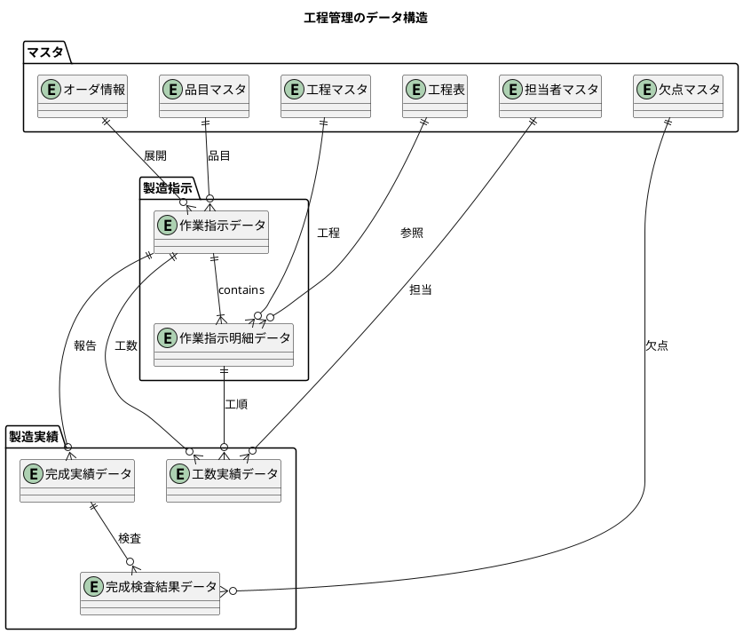
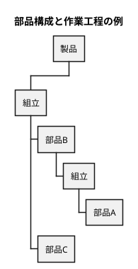
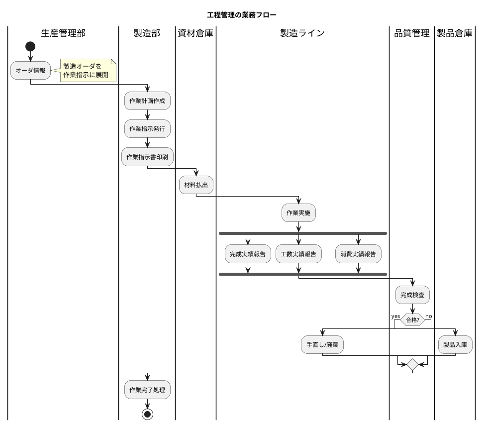
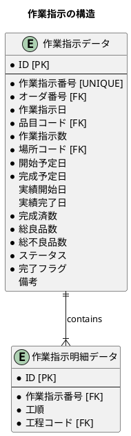
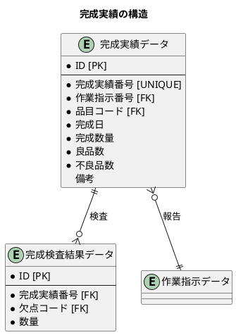
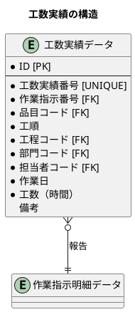
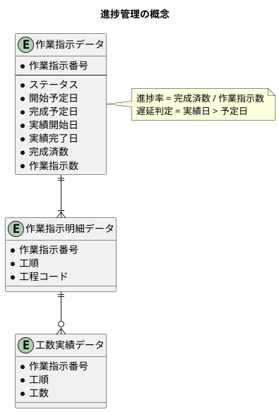
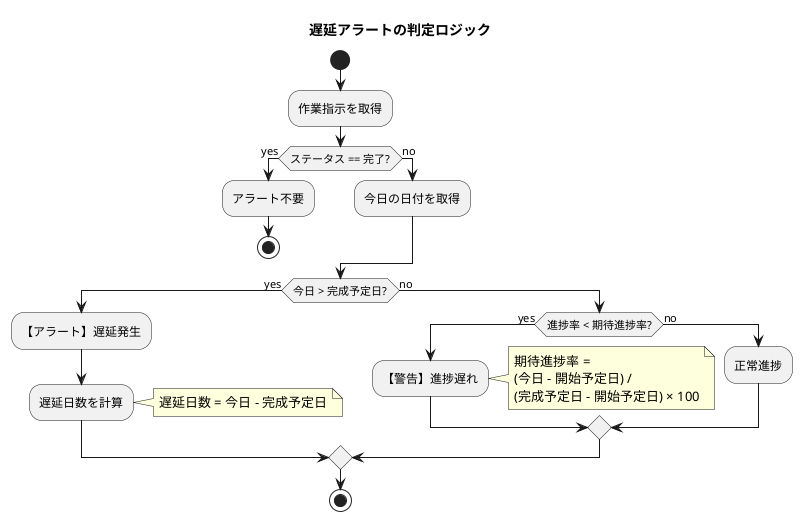
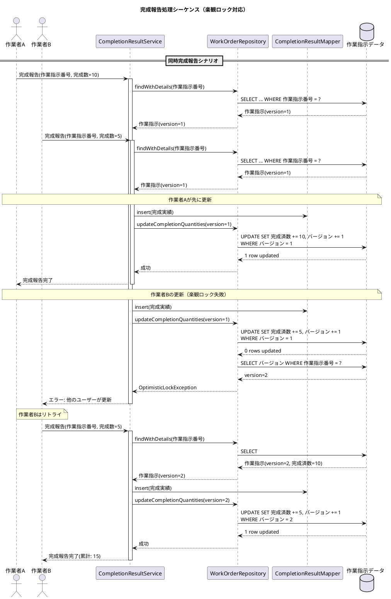

# 第27章：工程管理の設計

## 概要

本章では、生産管理システムにおける工程管理の設計を解説します。製造オーダから作業指示を生成し、完成実績・工数実績を記録する仕組みを構築します。



---

## 27.1 製造指示の DB 設計

### 工程管理業務の流れ

製造オーダが確定すると、作業指示に展開されます。作業指示は工程表に基づいて工程ごとの明細を持ち、現場での製造作業を管理します。





### 工程マスタ・工程表のスキーマ設計

工程マスタは製造工程を定義し、工程表は品目ごとの製造工順を管理します。

<details>
<summary>DDL: 工程マスタ・工程表</summary>

```sql
-- V013__create_process_master_tables.sql

-- 工程マスタ
CREATE TABLE "工程マスタ" (
    "工程コード" VARCHAR(20) PRIMARY KEY,
    "工程名" VARCHAR(100) NOT NULL,
    "作成日時" TIMESTAMP DEFAULT CURRENT_TIMESTAMP NOT NULL,
    "作成者" VARCHAR(50),
    "更新日時" TIMESTAMP DEFAULT CURRENT_TIMESTAMP NOT NULL,
    "更新者" VARCHAR(50)
);

-- 工程表
CREATE TABLE "工程表" (
    "ID" SERIAL PRIMARY KEY,
    "品目コード" VARCHAR(20) NOT NULL,
    "工順" INTEGER NOT NULL,
    "工程コード" VARCHAR(20) NOT NULL,
    "作成日時" TIMESTAMP DEFAULT CURRENT_TIMESTAMP NOT NULL,
    "更新日時" TIMESTAMP DEFAULT CURRENT_TIMESTAMP NOT NULL,
    CONSTRAINT "fk_工程表_品目"
        FOREIGN KEY ("品目コード") REFERENCES "品目マスタ"("品目コード"),
    CONSTRAINT "fk_工程表_工程"
        FOREIGN KEY ("工程コード") REFERENCES "工程マスタ"("工程コード"),
    UNIQUE ("品目コード", "工順")
);

-- インデックス
CREATE INDEX "idx_工程表_品目コード" ON "工程表"("品目コード");
CREATE INDEX "idx_工程表_工程コード" ON "工程表"("工程コード");
```

</details>

### 作業指示のスキーマ設計

作業指示データはオーダ情報から展開され、作業指示明細データは工程表に基づいて生成されます。



<details>
<summary>DDL: 作業指示データ・作業指示明細データ</summary>

```sql
-- V014__create_work_order_tables.sql

-- 作業指示ステータス
CREATE TYPE 作業指示ステータス AS ENUM ('未着手', '作業中', '完了', '中断');

-- 作業指示データ
CREATE TABLE "作業指示データ" (
    "ID" SERIAL PRIMARY KEY,
    "作業指示番号" VARCHAR(20) UNIQUE NOT NULL,
    "オーダ番号" VARCHAR(20) NOT NULL,
    "作業指示日" DATE NOT NULL,
    "品目コード" VARCHAR(20) NOT NULL,
    "作業指示数" DECIMAL(15, 2) NOT NULL,
    "場所コード" VARCHAR(20) NOT NULL,
    "開始予定日" DATE NOT NULL,
    "完成予定日" DATE NOT NULL,
    "実績開始日" DATE,
    "実績完了日" DATE,
    "完成済数" DECIMAL(15, 2) DEFAULT 0 NOT NULL,
    "総良品数" DECIMAL(15, 2) DEFAULT 0 NOT NULL,
    "総不良品数" DECIMAL(15, 2) DEFAULT 0 NOT NULL,
    "ステータス" 作業指示ステータス DEFAULT '未着手' NOT NULL,
    "完了フラグ" BOOLEAN DEFAULT false NOT NULL,
    "備考" TEXT,
    "作成日時" TIMESTAMP DEFAULT CURRENT_TIMESTAMP NOT NULL,
    "作成者" VARCHAR(50),
    "更新日時" TIMESTAMP DEFAULT CURRENT_TIMESTAMP NOT NULL,
    "更新者" VARCHAR(50),
    CONSTRAINT "fk_作業指示_オーダ"
        FOREIGN KEY ("オーダ番号") REFERENCES "オーダ情報"("オーダNO"),
    CONSTRAINT "fk_作業指示_品目"
        FOREIGN KEY ("品目コード") REFERENCES "品目マスタ"("品目コード"),
    CONSTRAINT "fk_作業指示_場所"
        FOREIGN KEY ("場所コード") REFERENCES "場所マスタ"("場所コード")
);

-- 作業指示明細データ
CREATE TABLE "作業指示明細データ" (
    "ID" SERIAL PRIMARY KEY,
    "作業指示番号" VARCHAR(20) NOT NULL,
    "工順" INTEGER NOT NULL,
    "工程コード" VARCHAR(20) NOT NULL,
    "作成日時" TIMESTAMP DEFAULT CURRENT_TIMESTAMP NOT NULL,
    "更新日時" TIMESTAMP DEFAULT CURRENT_TIMESTAMP NOT NULL,
    CONSTRAINT "fk_作業指示明細_作業指示"
        FOREIGN KEY ("作業指示番号") REFERENCES "作業指示データ"("作業指示番号"),
    CONSTRAINT "fk_作業指示明細_工程"
        FOREIGN KEY ("工程コード") REFERENCES "工程マスタ"("工程コード"),
    UNIQUE ("作業指示番号", "工順")
);

-- インデックス
CREATE INDEX "idx_作業指示_オーダ番号" ON "作業指示データ"("オーダ番号");
CREATE INDEX "idx_作業指示_品目コード" ON "作業指示データ"("品目コード");
CREATE INDEX "idx_作業指示_ステータス" ON "作業指示データ"("ステータス");
CREATE INDEX "idx_作業指示明細_工程コード" ON "作業指示明細データ"("工程コード");
```

</details>

### Java エンティティの定義

#### 工程マスタ・工程表エンティティ

<details>
<summary>Entity: Process（工程マスタ）</summary>

```java
// src/main/java/com/example/pms/domain/model/process/Process.java
package com.example.pms.domain.model.process;

import lombok.AllArgsConstructor;
import lombok.Builder;
import lombok.Data;
import lombok.NoArgsConstructor;

import java.time.LocalDateTime;

@Data
@Builder
@NoArgsConstructor
@AllArgsConstructor
public class Process {
    private String processCode;
    private String processName;
    private LocalDateTime createdAt;
    private String createdBy;
    private LocalDateTime updatedAt;
    private String updatedBy;
}
```

</details>

<details>
<summary>Entity: Routing（工程表）</summary>

```java
// src/main/java/com/example/pms/domain/model/process/Routing.java
package com.example.pms.domain.model.process;

import com.example.pms.domain.model.item.Item;
import lombok.AllArgsConstructor;
import lombok.Builder;
import lombok.Data;
import lombok.NoArgsConstructor;

import java.time.LocalDateTime;

@Data
@Builder
@NoArgsConstructor
@AllArgsConstructor
public class Routing {
    private Integer id;
    private String itemCode;
    private Integer sequence;
    private String processCode;
    private LocalDateTime createdAt;
    private LocalDateTime updatedAt;

    // リレーション
    private Item item;
    private Process process;
}
```

</details>

#### 作業指示ステータス Enum

<details>
<summary>Enum: WorkOrderStatus（作業指示ステータス）</summary>

```java
// src/main/java/com/example/pms/domain/model/process/WorkOrderStatus.java
package com.example.pms.domain.model.process;

import lombok.Getter;
import lombok.RequiredArgsConstructor;

@Getter
@RequiredArgsConstructor
public enum WorkOrderStatus {
    NOT_STARTED("未着手"),
    IN_PROGRESS("作業中"),
    COMPLETED("完了"),
    SUSPENDED("中断");

    private final String displayName;

    public static WorkOrderStatus fromDisplayName(String displayName) {
        for (WorkOrderStatus status : values()) {
            if (status.displayName.equals(displayName)) {
                return status;
            }
        }
        throw new IllegalArgumentException("不正な作業指示ステータス: " + displayName);
    }
}
```

</details>

#### 作業指示エンティティ

<details>
<summary>Entity: WorkOrder（作業指示データ）</summary>

```java
// src/main/java/com/example/pms/domain/model/process/WorkOrder.java
package com.example.pms.domain.model.process;

import com.example.pms.domain.model.item.Item;
import com.example.pms.domain.master.Location;
import com.example.pms.domain.model.planning.Order;
import lombok.AllArgsConstructor;
import lombok.Builder;
import lombok.Data;
import lombok.NoArgsConstructor;

import java.math.BigDecimal;
import java.time.LocalDate;
import java.time.LocalDateTime;
import java.util.List;

@Data
@Builder
@NoArgsConstructor
@AllArgsConstructor
public class WorkOrder {
    private Integer id;
    private String workOrderNumber;
    private String orderNumber;
    private LocalDate workOrderDate;
    private String itemCode;
    private BigDecimal orderQuantity;
    private String locationCode;
    private LocalDate plannedStartDate;
    private LocalDate plannedEndDate;
    private LocalDate actualStartDate;
    private LocalDate actualEndDate;
    private BigDecimal completedQuantity;
    private BigDecimal totalGoodQuantity;
    private BigDecimal totalDefectQuantity;
    private WorkOrderStatus status;
    private Boolean completedFlag;
    private String remarks;
    private LocalDateTime createdAt;
    private String createdBy;
    private LocalDateTime updatedAt;
    private String updatedBy;

    // リレーション
    private Order order;
    private Item item;
    private Location location;
    private List<WorkOrderDetail> details;
}
```

</details>

<details>
<summary>Entity: WorkOrderDetail（作業指示明細データ）</summary>

```java
// src/main/java/com/example/pms/domain/model/process/WorkOrderDetail.java
package com.example.pms.domain.model.process;

import lombok.AllArgsConstructor;
import lombok.Builder;
import lombok.Data;
import lombok.NoArgsConstructor;

import java.time.LocalDateTime;

@Data
@Builder
@NoArgsConstructor
@AllArgsConstructor
public class WorkOrderDetail {
    private Integer id;
    private String workOrderNumber;
    private Integer sequence;
    private String processCode;
    private LocalDateTime createdAt;
    private String createdBy;
    private LocalDateTime updatedAt;
    private String updatedBy;

    // リレーション
    private WorkOrder workOrder;
    private Process process;
}
```

</details>

### TypeHandler の実装

<details>
<summary>TypeHandler: WorkOrderStatusTypeHandler</summary>

```java
// src/main/java/com/example/pms/infrastructure/out/persistence/typehandler/WorkOrderStatusTypeHandler.java
package com.example.pms.infrastructure.out.persistence.typehandler;

import com.example.pms.domain.model.process.WorkOrderStatus;
import org.apache.ibatis.type.BaseTypeHandler;
import org.apache.ibatis.type.JdbcType;
import org.apache.ibatis.type.MappedTypes;

import java.sql.CallableStatement;
import java.sql.PreparedStatement;
import java.sql.ResultSet;
import java.sql.SQLException;

@MappedTypes(WorkOrderStatus.class)
public class WorkOrderStatusTypeHandler extends BaseTypeHandler<WorkOrderStatus> {

    @Override
    public void setNonNullParameter(PreparedStatement ps, int i, WorkOrderStatus parameter, JdbcType jdbcType)
            throws SQLException {
        ps.setString(i, parameter.getDisplayName());
    }

    @Override
    public WorkOrderStatus getNullableResult(ResultSet rs, String columnName) throws SQLException {
        String value = rs.getString(columnName);
        return value == null ? null : WorkOrderStatus.fromDisplayName(value);
    }

    @Override
    public WorkOrderStatus getNullableResult(ResultSet rs, int columnIndex) throws SQLException {
        String value = rs.getString(columnIndex);
        return value == null ? null : WorkOrderStatus.fromDisplayName(value);
    }

    @Override
    public WorkOrderStatus getNullableResult(CallableStatement cs, int columnIndex) throws SQLException {
        String value = cs.getString(columnIndex);
        return value == null ? null : WorkOrderStatus.fromDisplayName(value);
    }
}
```

</details>

### MyBatis Mapper

<details>
<summary>Mapper XML: WorkOrderMapper.xml</summary>

```xml
<!-- src/main/resources/com/example/pms/infrastructure/out/persistence/mapper/WorkOrderMapper.xml -->
<?xml version="1.0" encoding="UTF-8" ?>
<!DOCTYPE mapper PUBLIC "-//mybatis.org//DTD Mapper 3.0//EN"
        "http://mybatis.org/dtd/mybatis-3-mapper.dtd">
<mapper namespace="com.example.pms.infrastructure.out.persistence.mapper.WorkOrderMapper">

    <resultMap id="WorkOrderResultMap" type="com.example.pms.domain.model.process.WorkOrder">
        <id property="id" column="ID"/>
        <result property="workOrderNumber" column="作業指示番号"/>
        <result property="orderNumber" column="オーダ番号"/>
        <result property="workOrderDate" column="作業指示日"/>
        <result property="itemCode" column="品目コード"/>
        <result property="orderQuantity" column="作業指示数"/>
        <result property="locationCode" column="場所コード"/>
        <result property="plannedStartDate" column="開始予定日"/>
        <result property="plannedEndDate" column="完成予定日"/>
        <result property="actualStartDate" column="実績開始日"/>
        <result property="actualEndDate" column="実績完了日"/>
        <result property="completedQuantity" column="完成済数"/>
        <result property="totalGoodQuantity" column="総良品数"/>
        <result property="totalDefectQuantity" column="総不良品数"/>
        <result property="status" column="ステータス"
                typeHandler="com.example.pms.infrastructure.out.persistence.typehandler.WorkOrderStatusTypeHandler"/>
        <result property="completedFlag" column="完了フラグ"/>
        <result property="remarks" column="備考"/>
        <result property="createdAt" column="作成日時"/>
        <result property="createdBy" column="作成者"/>
        <result property="updatedAt" column="更新日時"/>
        <result property="updatedBy" column="更新者"/>
    </resultMap>

    <!-- PostgreSQL用 INSERT (ENUM キャスト必須) -->
    <insert id="insert" useGeneratedKeys="true" keyProperty="id" keyColumn="ID" databaseId="postgresql">
        INSERT INTO "作業指示データ" (
            "作業指示番号", "オーダ番号", "作業指示日", "品目コード", "作業指示数",
            "場所コード", "開始予定日", "完成予定日", "ステータス", "完了フラグ", "備考", "作成者"
        ) VALUES (
            #{workOrderNumber},
            #{orderNumber},
            #{workOrderDate},
            #{itemCode},
            #{orderQuantity},
            #{locationCode},
            #{plannedStartDate},
            #{plannedEndDate},
            #{status, typeHandler=com.example.pms.infrastructure.out.persistence.typehandler.WorkOrderStatusTypeHandler}::作業指示ステータス,
            #{completedFlag},
            #{remarks},
            #{createdBy}
        )
    </insert>

    <!-- H2用 INSERT (ENUM キャスト不要) -->
    <insert id="insert" useGeneratedKeys="true" keyProperty="id" keyColumn="ID" databaseId="h2">
        INSERT INTO "作業指示データ" (
            "作業指示番号", "オーダ番号", "作業指示日", "品目コード", "作業指示数",
            "場所コード", "開始予定日", "完成予定日", "ステータス", "完了フラグ", "備考", "作成者"
        ) VALUES (
            #{workOrderNumber},
            #{orderNumber},
            #{workOrderDate},
            #{itemCode},
            #{orderQuantity},
            #{locationCode},
            #{plannedStartDate},
            #{plannedEndDate},
            #{status, typeHandler=com.example.pms.infrastructure.out.persistence.typehandler.WorkOrderStatusTypeHandler},
            #{completedFlag},
            #{remarks},
            #{createdBy}
        )
    </insert>

    <select id="findByWorkOrderNumber" resultMap="WorkOrderResultMap">
        SELECT * FROM "作業指示データ" WHERE "作業指示番号" = #{workOrderNumber}
    </select>

    <select id="findLatestWorkOrderNumber" resultType="string">
        SELECT "作業指示番号" FROM "作業指示データ"
        WHERE "作業指示番号" LIKE #{prefix}
        ORDER BY "作業指示番号" DESC
        LIMIT 1
    </select>

    <!-- PostgreSQL用 UPDATE (ENUM キャスト必須) -->
    <update id="startWork" databaseId="postgresql">
        UPDATE "作業指示データ"
        SET "ステータス" = '作業中'::作業指示ステータス,
            "実績開始日" = #{actualStartDate},
            "更新日時" = CURRENT_TIMESTAMP
        WHERE "作業指示番号" = #{workOrderNumber}
    </update>

    <!-- H2用 UPDATE (ENUM キャスト不要) -->
    <update id="startWork" databaseId="h2">
        UPDATE "作業指示データ"
        SET "ステータス" = '作業中',
            "実績開始日" = #{actualStartDate},
            "更新日時" = CURRENT_TIMESTAMP
        WHERE "作業指示番号" = #{workOrderNumber}
    </update>

    <!-- PostgreSQL用 completeWork -->
    <update id="completeWork" databaseId="postgresql">
        UPDATE "作業指示データ"
        SET "ステータス" = '完了'::作業指示ステータス,
            "完了フラグ" = true,
            "実績完了日" = #{actualEndDate},
            "更新日時" = CURRENT_TIMESTAMP
        WHERE "作業指示番号" = #{workOrderNumber}
    </update>

    <!-- H2用 completeWork -->
    <update id="completeWork" databaseId="h2">
        UPDATE "作業指示データ"
        SET "ステータス" = '完了',
            "完了フラグ" = true,
            "実績完了日" = #{actualEndDate},
            "更新日時" = CURRENT_TIMESTAMP
        WHERE "作業指示番号" = #{workOrderNumber}
    </update>

    <update id="updateCompletionQuantities">
        UPDATE "作業指示データ"
        SET "完成済数" = "完成済数" + #{completedQuantity},
            "総良品数" = "総良品数" + #{goodQuantity},
            "総不良品数" = "総不良品数" + #{defectQuantity},
            "更新日時" = CURRENT_TIMESTAMP
        WHERE "作業指示番号" = #{workOrderNumber}
    </update>

    <delete id="deleteAll">
        DELETE FROM "作業指示データ"
    </delete>
</mapper>
```

</details>

<details>
<summary>Mapper XML: WorkOrderDetailMapper.xml</summary>

```xml
<!-- src/main/resources/com/example/pms/infrastructure/out/persistence/mapper/WorkOrderDetailMapper.xml -->
<?xml version="1.0" encoding="UTF-8" ?>
<!DOCTYPE mapper PUBLIC "-//mybatis.org//DTD Mapper 3.0//EN"
        "http://mybatis.org/dtd/mybatis-3-mapper.dtd">
<mapper namespace="com.example.pms.infrastructure.out.persistence.mapper.WorkOrderDetailMapper">

    <resultMap id="WorkOrderDetailResultMap" type="com.example.pms.domain.model.process.WorkOrderDetail">
        <id property="id" column="ID"/>
        <result property="workOrderNumber" column="作業指示番号"/>
        <result property="sequence" column="工順"/>
        <result property="processCode" column="工程コード"/>
        <result property="createdAt" column="作成日時"/>
        <result property="createdBy" column="作成者"/>
        <result property="updatedAt" column="更新日時"/>
        <result property="updatedBy" column="更新者"/>
    </resultMap>

    <insert id="insert" useGeneratedKeys="true" keyProperty="id" keyColumn="ID">
        INSERT INTO "作業指示明細データ" (
            "作業指示番号", "工順", "工程コード", "作成者", "更新者"
        ) VALUES (
            #{workOrderNumber},
            #{sequence},
            #{processCode},
            #{createdBy},
            #{updatedBy}
        )
    </insert>

    <select id="findByWorkOrderNumber" resultMap="WorkOrderDetailResultMap">
        SELECT * FROM "作業指示明細データ"
        WHERE "作業指示番号" = #{workOrderNumber}
        ORDER BY "工順"
    </select>

    <select id="findByWorkOrderNumberAndSequence" resultMap="WorkOrderDetailResultMap">
        SELECT * FROM "作業指示明細データ"
        WHERE "作業指示番号" = #{workOrderNumber} AND "工順" = #{sequence}
    </select>

    <delete id="deleteAll">
        DELETE FROM "作業指示明細データ"
    </delete>
</mapper>
```

</details>

### Mapper インターフェース

<details>
<summary>Mapper Interface: WorkOrderMapper</summary>

```java
// src/main/java/com/example/pms/infrastructure/out/persistence/mapper/WorkOrderMapper.java
package com.example.pms.infrastructure.out.persistence.mapper;

import com.example.pms.domain.model.process.WorkOrder;
import com.example.pms.domain.model.process.WorkOrderStatus;
import org.apache.ibatis.annotations.Mapper;
import org.apache.ibatis.annotations.Param;

import java.math.BigDecimal;
import java.time.LocalDate;
import java.util.List;

@Mapper
public interface WorkOrderMapper {
    void insert(WorkOrder workOrder);
    void update(WorkOrder workOrder);
    WorkOrder findById(Integer id);
    WorkOrder findByWorkOrderNumber(String workOrderNumber);
    List<WorkOrder> findByOrderNumber(String orderNumber);
    List<WorkOrder> findByStatus(WorkOrderStatus status);
    List<WorkOrder> findAll();
    String findLatestWorkOrderNumber(String prefix);
    void startWork(@Param("workOrderNumber") String workOrderNumber,
                   @Param("actualStartDate") LocalDate actualStartDate);
    void completeWork(@Param("workOrderNumber") String workOrderNumber,
                      @Param("actualEndDate") LocalDate actualEndDate);
    void updateCompletionQuantities(@Param("workOrderNumber") String workOrderNumber,
                                    @Param("completedQuantity") BigDecimal completedQuantity,
                                    @Param("goodQuantity") BigDecimal goodQuantity,
                                    @Param("defectQuantity") BigDecimal defectQuantity);
    void deleteAll();
}
```

</details>

<details>
<summary>Mapper Interface: WorkOrderDetailMapper</summary>

```java
// src/main/java/com/example/pms/infrastructure/out/persistence/mapper/WorkOrderDetailMapper.java
package com.example.pms.infrastructure.out.persistence.mapper;

import com.example.pms.domain.model.process.WorkOrderDetail;
import org.apache.ibatis.annotations.Mapper;
import org.apache.ibatis.annotations.Param;

import java.util.List;

@Mapper
public interface WorkOrderDetailMapper {
    void insert(WorkOrderDetail detail);
    void update(WorkOrderDetail detail);
    WorkOrderDetail findById(Integer id);
    List<WorkOrderDetail> findByWorkOrderNumber(String workOrderNumber);
    WorkOrderDetail findByWorkOrderNumberAndSequence(@Param("workOrderNumber") String workOrderNumber,
                                                     @Param("sequence") Integer sequence);
    List<WorkOrderDetail> findAll();
    void deleteAll();
}
```

</details>

### 作業指示サービスの実装

<details>
<summary>Service: WorkOrderService</summary>

```java
// src/main/java/com/example/pms/application/service/WorkOrderService.java
package com.example.pms.application.service;

import com.example.pms.domain.model.planning.Order;
import com.example.pms.domain.model.process.*;
import com.example.pms.infrastructure.out.persistence.mapper.*;
import lombok.RequiredArgsConstructor;
import org.springframework.stereotype.Service;
import org.springframework.transaction.annotation.Transactional;

import java.math.BigDecimal;
import java.time.LocalDate;
import java.time.format.DateTimeFormatter;
import java.util.ArrayList;
import java.util.List;

@Service
@RequiredArgsConstructor
public class WorkOrderService {

    private final WorkOrderMapper workOrderMapper;
    private final WorkOrderDetailMapper workOrderDetailMapper;
    private final OrderMapper orderMapper;
    private final RoutingMapper routingMapper;

    /**
     * 作業指示番号を生成する
     */
    private String generateWorkOrderNumber(LocalDate workOrderDate) {
        String prefix = "WO-" + workOrderDate.format(DateTimeFormatter.ofPattern("yyyyMM")) + "-";
        String latestNumber = workOrderMapper.findLatestWorkOrderNumber(prefix + "%");

        int sequence = 1;
        if (latestNumber != null) {
            int currentSequence = Integer.parseInt(latestNumber.substring(latestNumber.length() - 4));
            sequence = currentSequence + 1;
        }

        return prefix + String.format("%04d", sequence);
    }

    /**
     * 作業指示を作成する
     */
    @Transactional
    public WorkOrder createWorkOrder(WorkOrderCreateInput input) {
        // オーダ情報を取得
        Order order = orderMapper.findByOrderNumber(input.getOrderNumber());
        if (order == null) {
            throw new IllegalArgumentException("Order not found: " + input.getOrderNumber());
        }

        // 工程表を取得
        List<Routing> routings = routingMapper.findByItemCode(order.getItemCode());
        if (routings.isEmpty()) {
            throw new IllegalArgumentException("Routing not found for item: " + order.getItemCode());
        }

        String workOrderNumber = generateWorkOrderNumber(input.getWorkOrderDate());

        // 作業指示ヘッダを作成
        WorkOrder workOrder = WorkOrder.builder()
                .workOrderNumber(workOrderNumber)
                .orderNumber(input.getOrderNumber())
                .workOrderDate(input.getWorkOrderDate())
                .itemCode(order.getItemCode())
                .orderQuantity(order.getPlannedQuantity())
                .locationCode(input.getLocationCode())
                .plannedStartDate(input.getPlannedStartDate())
                .plannedEndDate(input.getPlannedEndDate())
                .completedQuantity(BigDecimal.ZERO)
                .totalGoodQuantity(BigDecimal.ZERO)
                .totalDefectQuantity(BigDecimal.ZERO)
                .status(WorkOrderStatus.NOT_STARTED)
                .completedFlag(false)
                .remarks(input.getRemarks())
                .build();
        workOrderMapper.insert(workOrder);

        // 作業指示明細を作成（工程表から自動展開）
        List<WorkOrderDetail> details = new ArrayList<>();
        for (Routing routing : routings) {
            WorkOrderDetail detail = WorkOrderDetail.builder()
                    .workOrderNumber(workOrderNumber)
                    .sequence(routing.getSequence())
                    .processCode(routing.getProcessCode())
                    .build();
            workOrderDetailMapper.insert(detail);
            details.add(detail);
        }

        workOrder.setDetails(details);
        return workOrder;
    }

    /**
     * 作業を開始する
     */
    @Transactional
    public WorkOrder startWork(String workOrderNumber) {
        WorkOrder workOrder = workOrderMapper.findByWorkOrderNumber(workOrderNumber);
        if (workOrder == null) {
            throw new IllegalArgumentException("Work order not found: " + workOrderNumber);
        }

        if (workOrder.getStatus() != WorkOrderStatus.NOT_STARTED) {
            throw new IllegalStateException("Only NOT_STARTED work orders can be started");
        }

        workOrderMapper.startWork(workOrderNumber, LocalDate.now());
        return workOrderMapper.findByWorkOrderNumber(workOrderNumber);
    }

    /**
     * 作業を完了する
     */
    @Transactional
    public WorkOrder completeWork(String workOrderNumber) {
        WorkOrder workOrder = workOrderMapper.findByWorkOrderNumber(workOrderNumber);
        if (workOrder == null) {
            throw new IllegalArgumentException("Work order not found: " + workOrderNumber);
        }

        if (workOrder.getStatus() != WorkOrderStatus.IN_PROGRESS) {
            throw new IllegalStateException("Only IN_PROGRESS work orders can be completed");
        }

        workOrderMapper.completeWork(workOrderNumber, LocalDate.now());
        return workOrderMapper.findByWorkOrderNumber(workOrderNumber);
    }

    /**
     * 作業指示を検索する
     */
    public WorkOrder findByWorkOrderNumber(String workOrderNumber) {
        WorkOrder workOrder = workOrderMapper.findByWorkOrderNumber(workOrderNumber);
        if (workOrder != null) {
            workOrder.setDetails(workOrderDetailMapper.findByWorkOrderNumber(workOrderNumber));
        }
        return workOrder;
    }
}
```

</details>

<details>
<summary>Input DTO: WorkOrderCreateInput</summary>

```java
// src/main/java/com/example/pms/application/service/WorkOrderCreateInput.java
package com.example.pms.application.service;

import lombok.Builder;
import lombok.Data;

import java.time.LocalDate;

@Data
@Builder
public class WorkOrderCreateInput {
    private String orderNumber;
    private LocalDate workOrderDate;
    private String locationCode;
    private LocalDate plannedStartDate;
    private LocalDate plannedEndDate;
    private String remarks;
}
```

</details>

### TDD: 作業指示のテスト

<details>
<summary>Test: WorkOrderServiceTest</summary>

```java
// src/test/java/com/example/pms/application/service/WorkOrderServiceTest.java
package com.example.pms.application.service;

import com.example.pms.domain.model.item.Item;
import com.example.pms.domain.model.item.ItemCategory;
import com.example.pms.domain.master.Location;
import com.example.pms.domain.model.planning.Order;
import com.example.pms.domain.model.planning.OrderType;
import com.example.pms.domain.model.planning.OrderStatus;
import com.example.pms.domain.model.process.*;
import com.example.pms.infrastructure.out.persistence.mapper.*;
import org.junit.jupiter.api.*;
import org.mybatis.spring.boot.test.autoconfigure.MybatisTest;
import org.springframework.beans.factory.annotation.Autowired;
import org.springframework.boot.test.autoconfigure.jdbc.AutoConfigureTestDatabase;
import org.springframework.context.annotation.Import;
import org.springframework.test.context.DynamicPropertyRegistry;
import org.springframework.test.context.DynamicPropertySource;
import org.testcontainers.containers.PostgreSQLContainer;
import org.testcontainers.junit.jupiter.Container;
import org.testcontainers.junit.jupiter.Testcontainers;

import java.math.BigDecimal;
import java.time.LocalDate;
import java.util.List;

import static org.assertj.core.api.Assertions.*;

@MybatisTest
@AutoConfigureTestDatabase(replace = AutoConfigureTestDatabase.Replace.NONE)
@Import(WorkOrderService.class)
@Testcontainers
@DisplayName("作業指示")
class WorkOrderServiceTest {

    @Container
    static PostgreSQLContainer<?> postgres = new PostgreSQLContainer<>("postgres:15")
            .withDatabaseName("testdb")
            .withUsername("testuser")
            .withPassword("testpass");

    @DynamicPropertySource
    static void configureProperties(DynamicPropertyRegistry registry) {
        registry.add("spring.datasource.url", postgres::getJdbcUrl);
        registry.add("spring.datasource.username", postgres::getUsername);
        registry.add("spring.datasource.password", postgres::getPassword);
    }

    @Autowired
    private WorkOrderService workOrderService;

    @Autowired
    private ItemMapper itemMapper;

    @Autowired
    private ProcessMapper processMapper;

    @Autowired
    private RoutingMapper routingMapper;

    @Autowired
    private LocationMapper locationMapper;

    @Autowired
    private OrderMapper orderMapper;

    @Autowired
    private WorkOrderMapper workOrderMapper;

    @Autowired
    private WorkOrderDetailMapper workOrderDetailMapper;

    @BeforeEach
    void setUp() {
        workOrderDetailMapper.deleteAll();
        workOrderMapper.deleteAll();
        routingMapper.deleteAll();
        orderMapper.deleteAll();
        processMapper.deleteAll();
        locationMapper.deleteAll();
        itemMapper.deleteAll();

        setupMasterData();
    }

    void setupMasterData() {
        // 品目マスタ
        itemMapper.insert(Item.builder()
                .itemCode("PROD-001")
                .effectiveFrom(LocalDate.of(2025, 1, 1))
                .itemName("製品A")
                .itemCategory(ItemCategory.PRODUCT)
                .build());

        // 工程マスタ
        processMapper.insert(Process.builder()
                .processCode("PRESS")
                .processName("プレス加工")
                .build());
        processMapper.insert(Process.builder()
                .processCode("ASSEMBLY")
                .processName("組立")
                .build());
        processMapper.insert(Process.builder()
                .processCode("INSPECT")
                .processName("検査")
                .build());

        // 工程表
        routingMapper.insert(Routing.builder()
                .itemCode("PROD-001")
                .sequence(1)
                .processCode("PRESS")
                .build());
        routingMapper.insert(Routing.builder()
                .itemCode("PROD-001")
                .sequence(2)
                .processCode("ASSEMBLY")
                .build());
        routingMapper.insert(Routing.builder()
                .itemCode("PROD-001")
                .sequence(3)
                .processCode("INSPECT")
                .build());

        // 場所マスタ
        locationMapper.insert(Location.builder()
                .locationCode("LINE001")
                .locationName("製造ライン1")
                .locationTypeCode("製造")
                .build());

        // オーダ情報
        orderMapper.insert(Order.builder()
                .orderNumber("MO-2025-001")
                .orderType(OrderType.MANUFACTURING)
                .itemCode("PROD-001")
                .plannedStartDate(LocalDate.of(2025, 1, 21))
                .dueDate(LocalDate.of(2025, 1, 25))
                .plannedQuantity(new BigDecimal("100"))
                .status(OrderStatus.CONFIRMED)
                .build());
    }

    @Nested
    @DisplayName("作業指示の作成")
    class WorkOrderCreation {

        @Test
        @DisplayName("オーダ情報から作業指示を作成できる")
        void canCreateWorkOrderFromOrder() {
            // Act
            WorkOrderCreateInput input = WorkOrderCreateInput.builder()
                    .orderNumber("MO-2025-001")
                    .workOrderDate(LocalDate.of(2025, 1, 20))
                    .locationCode("LINE001")
                    .plannedStartDate(LocalDate.of(2025, 1, 21))
                    .plannedEndDate(LocalDate.of(2025, 1, 25))
                    .build();

            WorkOrder workOrder = workOrderService.createWorkOrder(input);

            // Assert
            assertThat(workOrder).isNotNull();
            assertThat(workOrder.getWorkOrderNumber()).startsWith("WO-");
            assertThat(workOrder.getItemCode()).isEqualTo("PROD-001");
            assertThat(workOrder.getOrderQuantity()).isEqualByComparingTo(new BigDecimal("100"));
            assertThat(workOrder.getDetails()).hasSize(3); // 工程表から3工程
        }

        @Test
        @DisplayName("工程表の工順に従って明細が作成される")
        void detailsAreCreatedAccordingToRouting() {
            // Act
            WorkOrderCreateInput input = WorkOrderCreateInput.builder()
                    .orderNumber("MO-2025-001")
                    .workOrderDate(LocalDate.of(2025, 1, 20))
                    .locationCode("LINE001")
                    .plannedStartDate(LocalDate.of(2025, 1, 21))
                    .plannedEndDate(LocalDate.of(2025, 1, 25))
                    .build();

            WorkOrder workOrder = workOrderService.createWorkOrder(input);

            // Assert: 工順の順序を確認
            List<Integer> sequences = workOrder.getDetails().stream()
                    .map(WorkOrderDetail::getSequence)
                    .sorted()
                    .toList();
            assertThat(sequences).containsExactly(1, 2, 3);

            // 各工程の確認
            List<String> processCodes = workOrder.getDetails().stream()
                    .map(WorkOrderDetail::getProcessCode)
                    .toList();
            assertThat(processCodes).containsExactlyInAnyOrder("PRESS", "ASSEMBLY", "INSPECT");
        }
    }

    @Nested
    @DisplayName("作業指示のステータス管理")
    class WorkOrderStatusManagement {

        @Test
        @DisplayName("作業指示を開始できる")
        void canStartWorkOrder() {
            // Arrange
            WorkOrder workOrder = workOrderService.createWorkOrder(WorkOrderCreateInput.builder()
                    .orderNumber("MO-2025-001")
                    .workOrderDate(LocalDate.of(2025, 1, 20))
                    .locationCode("LINE001")
                    .plannedStartDate(LocalDate.of(2025, 1, 21))
                    .plannedEndDate(LocalDate.of(2025, 1, 25))
                    .build());

            // Act
            WorkOrder updated = workOrderService.startWork(workOrder.getWorkOrderNumber());

            // Assert
            assertThat(updated.getStatus()).isEqualTo(WorkOrderStatus.IN_PROGRESS);
            assertThat(updated.getActualStartDate()).isNotNull();
        }

        @Test
        @DisplayName("作業指示を完了できる")
        void canCompleteWorkOrder() {
            // Arrange
            WorkOrder workOrder = workOrderService.createWorkOrder(WorkOrderCreateInput.builder()
                    .orderNumber("MO-2025-001")
                    .workOrderDate(LocalDate.of(2025, 1, 20))
                    .locationCode("LINE001")
                    .plannedStartDate(LocalDate.of(2025, 1, 21))
                    .plannedEndDate(LocalDate.of(2025, 1, 25))
                    .build());
            workOrderService.startWork(workOrder.getWorkOrderNumber());

            // Act
            WorkOrder updated = workOrderService.completeWork(workOrder.getWorkOrderNumber());

            // Assert
            assertThat(updated.getStatus()).isEqualTo(WorkOrderStatus.COMPLETED);
            assertThat(updated.getCompletedFlag()).isTrue();
            assertThat(updated.getActualEndDate()).isNotNull();
        }
    }
}
```

</details>

---

## 27.2 製造実績の DB 設計

### 完成実績データの構造

製造現場からの完成報告を記録します。良品数・不良品数を管理し、作業指示の完成済数に反映します。



<details>
<summary>DDL: 完成実績データ・完成検査結果データ</summary>

```sql
-- V015__create_completion_result_tables.sql

-- 完成実績データ
CREATE TABLE "完成実績データ" (
    "ID" SERIAL PRIMARY KEY,
    "完成実績番号" VARCHAR(20) UNIQUE NOT NULL,
    "作業指示番号" VARCHAR(20) NOT NULL,
    "品目コード" VARCHAR(20) NOT NULL,
    "完成日" DATE NOT NULL,
    "完成数量" DECIMAL(15, 2) NOT NULL,
    "良品数" DECIMAL(15, 2) NOT NULL,
    "不良品数" DECIMAL(15, 2) NOT NULL,
    "備考" TEXT,
    "作成日時" TIMESTAMP DEFAULT CURRENT_TIMESTAMP NOT NULL,
    "作成者" VARCHAR(50),
    "更新日時" TIMESTAMP DEFAULT CURRENT_TIMESTAMP NOT NULL,
    "更新者" VARCHAR(50),
    CONSTRAINT "fk_完成実績_作業指示"
        FOREIGN KEY ("作業指示番号") REFERENCES "作業指示データ"("作業指示番号"),
    CONSTRAINT "fk_完成実績_品目"
        FOREIGN KEY ("品目コード") REFERENCES "品目マスタ"("品目コード")
);

-- 完成検査結果データ
CREATE TABLE "完成検査結果データ" (
    "ID" SERIAL PRIMARY KEY,
    "完成実績番号" VARCHAR(20) NOT NULL,
    "欠点コード" VARCHAR(20) NOT NULL,
    "数量" DECIMAL(15, 2) NOT NULL,
    "作成日時" TIMESTAMP DEFAULT CURRENT_TIMESTAMP NOT NULL,
    "更新日時" TIMESTAMP DEFAULT CURRENT_TIMESTAMP NOT NULL,
    CONSTRAINT "fk_完成検査結果_完成実績"
        FOREIGN KEY ("完成実績番号") REFERENCES "完成実績データ"("完成実績番号"),
    CONSTRAINT "fk_完成検査結果_欠点"
        FOREIGN KEY ("欠点コード") REFERENCES "欠点マスタ"("欠点コード"),
    UNIQUE ("完成実績番号", "欠点コード")
);

-- インデックス
CREATE INDEX "idx_完成実績_作業指示番号" ON "完成実績データ"("作業指示番号");
CREATE INDEX "idx_完成実績_品目コード" ON "完成実績データ"("品目コード");
CREATE INDEX "idx_完成実績_完成日" ON "完成実績データ"("完成日");
```

</details>

### Java エンティティの定義（完成実績）

<details>
<summary>Entity: CompletionResult（完成実績データ）</summary>

```java
// src/main/java/com/example/pms/domain/model/process/CompletionResult.java
package com.example.pms.domain.model.process;

import com.example.pms.domain.model.item.Item;
import lombok.AllArgsConstructor;
import lombok.Builder;
import lombok.Data;
import lombok.NoArgsConstructor;

import java.math.BigDecimal;
import java.time.LocalDate;
import java.time.LocalDateTime;
import java.util.List;

@Data
@Builder
@NoArgsConstructor
@AllArgsConstructor
public class CompletionResult {
    private Integer id;
    private String completionResultNumber;
    private String workOrderNumber;
    private String itemCode;
    private LocalDate completionDate;
    private BigDecimal completedQuantity;
    private BigDecimal goodQuantity;
    private BigDecimal defectQuantity;
    private String remarks;
    private LocalDateTime createdAt;
    private String createdBy;
    private LocalDateTime updatedAt;
    private String updatedBy;

    // リレーション
    private WorkOrder workOrder;
    private Item item;
    private List<InspectionResult> inspectionResults;
}
```

</details>

<details>
<summary>Entity: InspectionResult（完成検査結果データ）</summary>

```java
// src/main/java/com/example/pms/domain/model/process/InspectionResult.java
package com.example.pms.domain.model.process;

import com.example.pms.domain.master.Defect;
import lombok.AllArgsConstructor;
import lombok.Builder;
import lombok.Data;
import lombok.NoArgsConstructor;

import java.math.BigDecimal;
import java.time.LocalDateTime;

@Data
@Builder
@NoArgsConstructor
@AllArgsConstructor
public class InspectionResult {
    private Integer id;
    private String completionResultNumber;
    private String defectCode;
    private BigDecimal quantity;
    private LocalDateTime createdAt;
    private String createdBy;
    private LocalDateTime updatedAt;
    private String updatedBy;

    // リレーション
    private CompletionResult completionResult;
    private Defect defect;
}
```

</details>

### MyBatis Mapper（完成実績）

<details>
<summary>Mapper XML: CompletionResultMapper.xml</summary>

```xml
<!-- src/main/resources/com/example/pms/infrastructure/out/persistence/mapper/CompletionResultMapper.xml -->
<?xml version="1.0" encoding="UTF-8" ?>
<!DOCTYPE mapper PUBLIC "-//mybatis.org//DTD Mapper 3.0//EN"
        "http://mybatis.org/dtd/mybatis-3-mapper.dtd">
<mapper namespace="com.example.pms.infrastructure.out.persistence.mapper.CompletionResultMapper">

    <resultMap id="CompletionResultResultMap" type="com.example.pms.domain.model.process.CompletionResult">
        <id property="id" column="ID"/>
        <result property="completionResultNumber" column="完成実績番号"/>
        <result property="workOrderNumber" column="作業指示番号"/>
        <result property="itemCode" column="品目コード"/>
        <result property="completionDate" column="完成日"/>
        <result property="completedQuantity" column="完成数量"/>
        <result property="goodQuantity" column="良品数"/>
        <result property="defectQuantity" column="不良品数"/>
        <result property="remarks" column="備考"/>
        <result property="createdAt" column="作成日時"/>
        <result property="createdBy" column="作成者"/>
        <result property="updatedAt" column="更新日時"/>
        <result property="updatedBy" column="更新者"/>
    </resultMap>

    <insert id="insert" useGeneratedKeys="true" keyProperty="id" keyColumn="ID">
        INSERT INTO "完成実績データ" (
            "完成実績番号", "作業指示番号", "品目コード", "完成日",
            "完成数量", "良品数", "不良品数", "備考", "作成者"
        ) VALUES (
            #{completionResultNumber},
            #{workOrderNumber},
            #{itemCode},
            #{completionDate},
            #{completedQuantity},
            #{goodQuantity},
            #{defectQuantity},
            #{remarks},
            #{createdBy}
        )
    </insert>

    <select id="findByCompletionResultNumber" resultMap="CompletionResultResultMap">
        SELECT * FROM "完成実績データ" WHERE "完成実績番号" = #{completionResultNumber}
    </select>

    <select id="findByWorkOrderNumber" resultMap="CompletionResultResultMap">
        SELECT * FROM "完成実績データ"
        WHERE "作業指示番号" = #{workOrderNumber}
        ORDER BY "完成日"
    </select>

    <select id="findLatestCompletionResultNumber" resultType="string">
        SELECT "完成実績番号" FROM "完成実績データ"
        WHERE "完成実績番号" LIKE #{prefix}
        ORDER BY "完成実績番号" DESC
        LIMIT 1
    </select>

    <delete id="deleteAll">
        DELETE FROM "完成実績データ"
    </delete>
</mapper>
```

</details>

### 完成実績サービスの実装

<details>
<summary>Service: CompletionResultService</summary>

```java
// src/main/java/com/example/pms/application/service/CompletionResultService.java
package com.example.pms.application.service;

import com.example.pms.domain.model.process.*;
import com.example.pms.infrastructure.out.persistence.mapper.*;
import lombok.RequiredArgsConstructor;
import org.springframework.stereotype.Service;
import org.springframework.transaction.annotation.Transactional;

import java.time.LocalDate;
import java.time.format.DateTimeFormatter;
import java.util.ArrayList;
import java.util.List;

@Service
@RequiredArgsConstructor
public class CompletionResultService {

    private final CompletionResultMapper completionResultMapper;
    private final InspectionResultMapper inspectionResultMapper;
    private final WorkOrderMapper workOrderMapper;

    /**
     * 完成実績番号を生成する
     */
    private String generateCompletionResultNumber(LocalDate completionDate) {
        String prefix = "CR-" + completionDate.format(DateTimeFormatter.ofPattern("yyyyMM")) + "-";
        String latestNumber = completionResultMapper.findLatestCompletionResultNumber(prefix + "%");

        int sequence = 1;
        if (latestNumber != null) {
            int currentSequence = Integer.parseInt(latestNumber.substring(latestNumber.length() - 4));
            sequence = currentSequence + 1;
        }

        return prefix + String.format("%04d", sequence);
    }

    /**
     * 完成実績を報告する
     */
    @Transactional
    public CompletionResult reportCompletion(CompletionResultInput input) {
        // 作業指示を取得
        WorkOrder workOrder = workOrderMapper.findByWorkOrderNumber(input.getWorkOrderNumber());
        if (workOrder == null) {
            throw new IllegalArgumentException("Work order not found: " + input.getWorkOrderNumber());
        }

        String completionResultNumber = generateCompletionResultNumber(input.getCompletionDate());

        // 完成実績を作成
        CompletionResult completionResult = CompletionResult.builder()
                .completionResultNumber(completionResultNumber)
                .workOrderNumber(input.getWorkOrderNumber())
                .itemCode(workOrder.getItemCode())
                .completionDate(input.getCompletionDate())
                .completedQuantity(input.getCompletedQuantity())
                .goodQuantity(input.getGoodQuantity())
                .defectQuantity(input.getDefectQuantity())
                .remarks(input.getRemarks())
                .build();
        completionResultMapper.insert(completionResult);

        // 検査結果を作成
        List<InspectionResult> inspectionResults = new ArrayList<>();
        if (input.getInspectionResults() != null) {
            for (InspectionResultInput irInput : input.getInspectionResults()) {
                InspectionResult ir = InspectionResult.builder()
                        .completionResultNumber(completionResultNumber)
                        .defectCode(irInput.getDefectCode())
                        .quantity(irInput.getQuantity())
                        .build();
                inspectionResultMapper.insert(ir);
                inspectionResults.add(ir);
            }
        }
        completionResult.setInspectionResults(inspectionResults);

        // 作業指示の累計を更新
        workOrderMapper.updateCompletionQuantities(
                input.getWorkOrderNumber(),
                input.getCompletedQuantity(),
                input.getGoodQuantity(),
                input.getDefectQuantity()
        );

        return completionResult;
    }
}
```

</details>

### 工数実績データの構造

工数実績は、作業指示明細（工順）ごとに担当者の作業時間を記録します。



<details>
<summary>DDL: 工数実績データ</summary>

```sql
-- V016__create_labor_hours_tables.sql

-- 工数実績データ
CREATE TABLE "工数実績データ" (
    "ID" SERIAL PRIMARY KEY,
    "工数実績番号" VARCHAR(20) UNIQUE NOT NULL,
    "作業指示番号" VARCHAR(20) NOT NULL,
    "品目コード" VARCHAR(20) NOT NULL,
    "工順" INTEGER NOT NULL,
    "工程コード" VARCHAR(20) NOT NULL,
    "部門コード" VARCHAR(20) NOT NULL,
    "担当者コード" VARCHAR(20) NOT NULL,
    "作業日" DATE NOT NULL,
    "工数" DECIMAL(10, 2) NOT NULL,
    "備考" TEXT,
    "作成日時" TIMESTAMP DEFAULT CURRENT_TIMESTAMP NOT NULL,
    "作成者" VARCHAR(50),
    "更新日時" TIMESTAMP DEFAULT CURRENT_TIMESTAMP NOT NULL,
    "更新者" VARCHAR(50),
    CONSTRAINT "fk_工数実績_作業指示"
        FOREIGN KEY ("作業指示番号") REFERENCES "作業指示データ"("作業指示番号"),
    CONSTRAINT "fk_工数実績_品目"
        FOREIGN KEY ("品目コード") REFERENCES "品目マスタ"("品目コード"),
    CONSTRAINT "fk_工数実績_工程"
        FOREIGN KEY ("工程コード") REFERENCES "工程マスタ"("工程コード"),
    CONSTRAINT "fk_工数実績_部門"
        FOREIGN KEY ("部門コード") REFERENCES "部門マスタ"("部門コード"),
    CONSTRAINT "fk_工数実績_担当者"
        FOREIGN KEY ("担当者コード") REFERENCES "担当者マスタ"("担当者コード")
);

-- インデックス
CREATE INDEX "idx_工数実績_作業指示番号" ON "工数実績データ"("作業指示番号");
CREATE INDEX "idx_工数実績_品目コード" ON "工数実績データ"("品目コード");
CREATE INDEX "idx_工数実績_工程コード" ON "工数実績データ"("工程コード");
CREATE INDEX "idx_工数実績_担当者コード" ON "工数実績データ"("担当者コード");
CREATE INDEX "idx_工数実績_作業日" ON "工数実績データ"("作業日");
```

</details>

### Java エンティティの定義（工数実績）

<details>
<summary>Entity: LaborHours（工数実績データ）</summary>

```java
// src/main/java/com/example/pms/domain/model/process/LaborHours.java
package com.example.pms.domain.model.process;

import com.example.pms.domain.model.item.Item;
import com.example.pms.domain.master.Department;
import com.example.pms.domain.master.Employee;
import lombok.AllArgsConstructor;
import lombok.Builder;
import lombok.Data;
import lombok.NoArgsConstructor;

import java.math.BigDecimal;
import java.time.LocalDate;
import java.time.LocalDateTime;

@Data
@Builder
@NoArgsConstructor
@AllArgsConstructor
public class LaborHours {
    private Integer id;
    private String laborHoursNumber;
    private String workOrderNumber;
    private String itemCode;
    private Integer sequence;
    private String processCode;
    private String departmentCode;
    private String employeeCode;
    private LocalDate workDate;
    private BigDecimal hours;
    private String remarks;
    private LocalDateTime createdAt;
    private String createdBy;
    private LocalDateTime updatedAt;
    private String updatedBy;

    // リレーション
    private WorkOrder workOrder;
    private Item item;
    private Process process;
    private Department department;
    private Employee employee;
}
```

</details>

### MyBatis Mapper（工数実績）

<details>
<summary>Mapper XML: LaborHoursMapper.xml</summary>

```xml
<!-- src/main/resources/com/example/pms/infrastructure/out/persistence/mapper/LaborHoursMapper.xml -->
<?xml version="1.0" encoding="UTF-8" ?>
<!DOCTYPE mapper PUBLIC "-//mybatis.org//DTD Mapper 3.0//EN"
        "http://mybatis.org/dtd/mybatis-3-mapper.dtd">
<mapper namespace="com.example.pms.infrastructure.out.persistence.mapper.LaborHoursMapper">

    <resultMap id="LaborHoursResultMap" type="com.example.pms.domain.model.process.LaborHours">
        <id property="id" column="ID"/>
        <result property="laborHoursNumber" column="工数実績番号"/>
        <result property="workOrderNumber" column="作業指示番号"/>
        <result property="itemCode" column="品目コード"/>
        <result property="sequence" column="工順"/>
        <result property="processCode" column="工程コード"/>
        <result property="departmentCode" column="部門コード"/>
        <result property="employeeCode" column="担当者コード"/>
        <result property="workDate" column="作業日"/>
        <result property="hours" column="工数"/>
        <result property="remarks" column="備考"/>
        <result property="createdAt" column="作成日時"/>
        <result property="createdBy" column="作成者"/>
        <result property="updatedAt" column="更新日時"/>
        <result property="updatedBy" column="更新者"/>
    </resultMap>

    <insert id="insert" useGeneratedKeys="true" keyProperty="id" keyColumn="ID">
        INSERT INTO "工数実績データ" (
            "工数実績番号", "作業指示番号", "品目コード", "工順", "工程コード",
            "部門コード", "担当者コード", "作業日", "工数", "備考", "作成者"
        ) VALUES (
            #{laborHoursNumber},
            #{workOrderNumber},
            #{itemCode},
            #{sequence},
            #{processCode},
            #{departmentCode},
            #{employeeCode},
            #{workDate},
            #{hours},
            #{remarks},
            #{createdBy}
        )
    </insert>

    <select id="findByLaborHoursNumber" resultMap="LaborHoursResultMap">
        SELECT * FROM "工数実績データ" WHERE "工数実績番号" = #{laborHoursNumber}
    </select>

    <select id="sumByWorkOrderAndSequence" resultType="java.math.BigDecimal">
        SELECT COALESCE(SUM("工数"), 0)
        FROM "工数実績データ"
        WHERE "作業指示番号" = #{workOrderNumber} AND "工順" = #{sequence}
    </select>

    <select id="sumByWorkOrder" resultType="java.math.BigDecimal">
        SELECT COALESCE(SUM("工数"), 0)
        FROM "工数実績データ"
        WHERE "作業指示番号" = #{workOrderNumber}
    </select>

    <select id="sumByEmployee" resultType="java.math.BigDecimal">
        SELECT COALESCE(SUM("工数"), 0)
        FROM "工数実績データ"
        WHERE "担当者コード" = #{employeeCode}
          AND "作業日" BETWEEN #{startDate} AND #{endDate}
    </select>

    <select id="findLatestLaborHoursNumber" resultType="string">
        SELECT "工数実績番号" FROM "工数実績データ"
        WHERE "工数実績番号" LIKE #{prefix}
        ORDER BY "工数実績番号" DESC
        LIMIT 1
    </select>

    <delete id="deleteAll">
        DELETE FROM "工数実績データ"
    </delete>
</mapper>
```

</details>

### 工数実績サービスの実装

<details>
<summary>Service: LaborHoursService</summary>

```java
// src/main/java/com/example/pms/application/service/LaborHoursService.java
package com.example.pms.application.service;

import com.example.pms.domain.model.process.*;
import com.example.pms.infrastructure.out.persistence.mapper.*;
import lombok.RequiredArgsConstructor;
import org.springframework.stereotype.Service;
import org.springframework.transaction.annotation.Transactional;

import java.math.BigDecimal;
import java.time.LocalDate;
import java.time.format.DateTimeFormatter;
import java.util.ArrayList;
import java.util.List;

@Service
@RequiredArgsConstructor
public class LaborHoursService {

    private final LaborHoursMapper laborHoursMapper;
    private final WorkOrderDetailMapper workOrderDetailMapper;
    private final WorkOrderMapper workOrderMapper;
    private final ProcessMapper processMapper;

    /**
     * 工数実績番号を生成する
     */
    private String generateLaborHoursNumber(LocalDate workDate) {
        String prefix = "LH-" + workDate.format(DateTimeFormatter.ofPattern("yyyyMM")) + "-";
        String latestNumber = laborHoursMapper.findLatestLaborHoursNumber(prefix + "%");

        int sequence = 1;
        if (latestNumber != null) {
            int currentSequence = Integer.parseInt(latestNumber.substring(latestNumber.length() - 4));
            sequence = currentSequence + 1;
        }

        return prefix + String.format("%04d", sequence);
    }

    /**
     * 工数実績を報告する
     */
    @Transactional
    public LaborHours reportLaborHours(LaborHoursInput input) {
        // 作業指示明細を取得
        WorkOrderDetail detail = workOrderDetailMapper.findByWorkOrderAndSequence(
                input.getWorkOrderNumber(), input.getSequence());
        if (detail == null) {
            throw new IllegalArgumentException("Work order detail not found");
        }

        // 作業指示を取得
        WorkOrder workOrder = workOrderMapper.findByWorkOrderNumber(input.getWorkOrderNumber());
        if (workOrder == null) {
            throw new IllegalArgumentException("Work order not found");
        }

        String laborHoursNumber = generateLaborHoursNumber(input.getWorkDate());

        // 工数実績を作成
        LaborHours laborHours = LaborHours.builder()
                .laborHoursNumber(laborHoursNumber)
                .workOrderNumber(input.getWorkOrderNumber())
                .itemCode(workOrder.getItemCode())
                .sequence(input.getSequence())
                .processCode(detail.getProcessCode())
                .departmentCode(input.getDepartmentCode())
                .employeeCode(input.getEmployeeCode())
                .workDate(input.getWorkDate())
                .hours(input.getHours())
                .remarks(input.getRemarks())
                .build();
        laborHoursMapper.insert(laborHours);

        return laborHours;
    }

    /**
     * 工順別の工数合計を取得する
     */
    public BigDecimal getTotalHoursBySequence(String workOrderNumber, Integer sequence) {
        return laborHoursMapper.sumByWorkOrderAndSequence(workOrderNumber, sequence);
    }

    /**
     * 作業指示の工数サマリを取得する
     */
    public LaborHoursSummary getSummary(String workOrderNumber) {
        WorkOrder workOrder = workOrderMapper.findByWorkOrderNumber(workOrderNumber);
        if (workOrder == null) {
            throw new IllegalArgumentException("Work order not found");
        }

        List<WorkOrderDetail> details = workOrderDetailMapper.findByWorkOrderNumber(workOrderNumber);
        List<ProcessLaborHours> processHours = new ArrayList<>();
        BigDecimal totalHours = BigDecimal.ZERO;

        for (WorkOrderDetail detail : details) {
            BigDecimal hours = laborHoursMapper.sumByWorkOrderAndSequence(workOrderNumber, detail.getSequence());
            Process process = processMapper.findByProcessCode(detail.getProcessCode());

            processHours.add(ProcessLaborHours.builder()
                    .processCode(detail.getProcessCode())
                    .processName(process != null ? process.getProcessName() : "")
                    .hours(hours)
                    .build());

            totalHours = totalHours.add(hours);
        }

        return LaborHoursSummary.builder()
                .totalHours(totalHours)
                .processHours(processHours)
                .build();
    }

    /**
     * 担当者別の工数を取得する
     */
    public BigDecimal getTotalHoursByEmployee(String employeeCode, LocalDate startDate, LocalDate endDate) {
        return laborHoursMapper.sumByEmployee(employeeCode, startDate, endDate);
    }
}
```

</details>

<details>
<summary>Input DTO: LaborHoursInput</summary>

```java
// src/main/java/com/example/pms/application/service/LaborHoursInput.java
package com.example.pms.application.service;

import lombok.Builder;
import lombok.Data;

import java.math.BigDecimal;
import java.time.LocalDate;

@Data
@Builder
public class LaborHoursInput {
    private String workOrderNumber;
    private Integer sequence;
    private LocalDate workDate;
    private String employeeCode;
    private String departmentCode;
    private BigDecimal hours;
    private String remarks;
}
```

</details>

<details>
<summary>DTO: LaborHoursSummary・ProcessLaborHours</summary>

```java
// src/main/java/com/example/pms/application/service/LaborHoursSummary.java
package com.example.pms.application.service;

import lombok.Builder;
import lombok.Data;

import java.math.BigDecimal;
import java.util.List;

@Data
@Builder
public class LaborHoursSummary {
    private BigDecimal totalHours;
    private List<ProcessLaborHours> processHours;
}
```

```java
// src/main/java/com/example/pms/application/service/ProcessLaborHours.java
package com.example.pms.application.service;

import lombok.Builder;
import lombok.Data;

import java.math.BigDecimal;

@Data
@Builder
public class ProcessLaborHours {
    private String processCode;
    private String processName;
    private BigDecimal hours;
}
```

</details>

---

## 27.3 進捗管理

### 工程別進捗の管理

作業指示の進捗状況を工程別に把握するための設計を行います。



### 進捗状況DTO

<details>
<summary>DTO: WorkOrderProgress</summary>

```java
// src/main/java/com/example/pms/application/service/WorkOrderProgress.java
package com.example.pms.application.service;

import com.example.pms.domain.model.process.WorkOrderStatus;
import lombok.Builder;
import lombok.Data;

import java.math.BigDecimal;
import java.math.RoundingMode;
import java.time.LocalDate;
import java.util.List;

@Data
@Builder
public class WorkOrderProgress {
    private String workOrderNumber;
    private String itemCode;
    private WorkOrderStatus status;
    private BigDecimal orderQuantity;
    private BigDecimal completedQuantity;
    private LocalDate plannedStartDate;
    private LocalDate plannedEndDate;
    private LocalDate actualStartDate;
    private LocalDate actualEndDate;
    private List<ProcessProgress> processProgresses;

    /**
     * 進捗率を計算する（0-100%）
     */
    public BigDecimal getProgressRate() {
        if (orderQuantity == null || orderQuantity.compareTo(BigDecimal.ZERO) == 0) {
            return BigDecimal.ZERO;
        }
        return completedQuantity
                .multiply(new BigDecimal("100"))
                .divide(orderQuantity, 2, RoundingMode.HALF_UP);
    }

    /**
     * 遅延判定
     */
    public boolean isDelayed() {
        if (status == WorkOrderStatus.COMPLETED) {
            return false;
        }
        LocalDate today = LocalDate.now();
        return today.isAfter(plannedEndDate);
    }

    /**
     * 遅延日数を計算
     */
    public long getDelayDays() {
        if (!isDelayed()) {
            return 0;
        }
        LocalDate today = LocalDate.now();
        return java.time.temporal.ChronoUnit.DAYS.between(plannedEndDate, today);
    }
}
```

</details>

<details>
<summary>DTO: ProcessProgress</summary>

```java
// src/main/java/com/example/pms/application/service/ProcessProgress.java
package com.example.pms.application.service;

import lombok.Builder;
import lombok.Data;

import java.math.BigDecimal;

@Data
@Builder
public class ProcessProgress {
    private Integer sequence;
    private String processCode;
    private String processName;
    private BigDecimal plannedHours;
    private BigDecimal actualHours;

    /**
     * 工数消化率を計算
     */
    public BigDecimal getHoursRate() {
        if (plannedHours == null || plannedHours.compareTo(BigDecimal.ZERO) == 0) {
            return BigDecimal.ZERO;
        }
        return actualHours
                .multiply(new BigDecimal("100"))
                .divide(plannedHours, 2, java.math.RoundingMode.HALF_UP);
    }
}
```

</details>

### 進捗管理サービス

<details>
<summary>Service: ProgressManagementService</summary>

```java
// src/main/java/com/example/pms/application/service/ProgressManagementService.java
package com.example.pms.application.service;

import com.example.pms.domain.model.process.*;
import com.example.pms.infrastructure.out.persistence.mapper.*;
import lombok.RequiredArgsConstructor;
import org.springframework.stereotype.Service;

import java.time.LocalDate;
import java.util.ArrayList;
import java.util.List;
import java.util.stream.Collectors;

@Service
@RequiredArgsConstructor
public class ProgressManagementService {

    private final WorkOrderMapper workOrderMapper;
    private final WorkOrderDetailMapper workOrderDetailMapper;
    private final LaborHoursMapper laborHoursMapper;
    private final ProcessMapper processMapper;

    /**
     * 作業指示の進捗を取得する
     */
    public WorkOrderProgress getProgress(String workOrderNumber) {
        WorkOrder workOrder = workOrderMapper.findByWorkOrderNumber(workOrderNumber);
        if (workOrder == null) {
            throw new IllegalArgumentException("Work order not found: " + workOrderNumber);
        }

        List<WorkOrderDetail> details = workOrderDetailMapper.findByWorkOrderNumber(workOrderNumber);
        List<ProcessProgress> processProgresses = new ArrayList<>();

        for (WorkOrderDetail detail : details) {
            Process process = processMapper.findByProcessCode(detail.getProcessCode());
            var actualHours = laborHoursMapper.sumByWorkOrderAndSequence(
                    workOrderNumber, detail.getSequence());

            processProgresses.add(ProcessProgress.builder()
                    .sequence(detail.getSequence())
                    .processCode(detail.getProcessCode())
                    .processName(process != null ? process.getProcessName() : "")
                    .actualHours(actualHours)
                    .build());
        }

        return WorkOrderProgress.builder()
                .workOrderNumber(workOrder.getWorkOrderNumber())
                .itemCode(workOrder.getItemCode())
                .status(workOrder.getStatus())
                .orderQuantity(workOrder.getOrderQuantity())
                .completedQuantity(workOrder.getCompletedQuantity())
                .plannedStartDate(workOrder.getPlannedStartDate())
                .plannedEndDate(workOrder.getPlannedEndDate())
                .actualStartDate(workOrder.getActualStartDate())
                .actualEndDate(workOrder.getActualEndDate())
                .processProgresses(processProgresses)
                .build();
    }

    /**
     * 遅延している作業指示を取得する
     */
    public List<WorkOrderProgress> getDelayedWorkOrders() {
        // 未完了の作業指示を取得
        List<WorkOrder> workOrders = workOrderMapper.findByStatus(
                List.of(WorkOrderStatus.NOT_STARTED, WorkOrderStatus.IN_PROGRESS));

        LocalDate today = LocalDate.now();

        return workOrders.stream()
                .filter(wo -> today.isAfter(wo.getPlannedEndDate()))
                .map(wo -> getProgress(wo.getWorkOrderNumber()))
                .collect(Collectors.toList());
    }

    /**
     * 本日開始予定の作業指示を取得する
     */
    public List<WorkOrderProgress> getTodayStartWorkOrders() {
        LocalDate today = LocalDate.now();
        List<WorkOrder> workOrders = workOrderMapper.findByPlannedStartDate(today);

        return workOrders.stream()
                .map(wo -> getProgress(wo.getWorkOrderNumber()))
                .collect(Collectors.toList());
    }

    /**
     * 本日完成予定の作業指示を取得する
     */
    public List<WorkOrderProgress> getTodayDueWorkOrders() {
        LocalDate today = LocalDate.now();
        List<WorkOrder> workOrders = workOrderMapper.findByPlannedEndDate(today);

        return workOrders.stream()
                .map(wo -> getProgress(wo.getWorkOrderNumber()))
                .collect(Collectors.toList());
    }
}
```

</details>

### 遅延アラートの設計



### 進捗状況の可視化

進捗状況を可視化するためのビュー定義例を示します。

<details>
<summary>DDL: 進捗管理ビュー</summary>

```sql
-- 作業指示進捗ビュー
CREATE OR REPLACE VIEW "作業指示進捗ビュー" AS
SELECT
    wo."作業指示番号",
    wo."オーダ番号",
    wo."品目コード",
    i."品目名",
    wo."作業指示数",
    wo."完成済数",
    CASE
        WHEN wo."作業指示数" = 0 THEN 0
        ELSE ROUND((wo."完成済数" / wo."作業指示数") * 100, 2)
    END AS "進捗率",
    wo."開始予定日",
    wo."完成予定日",
    wo."実績開始日",
    wo."実績完了日",
    wo."ステータス",
    CASE
        WHEN wo."ステータス" = '完了' THEN '完了'
        WHEN CURRENT_DATE > wo."完成予定日" THEN '遅延'
        WHEN CURRENT_DATE >= wo."開始予定日" AND wo."ステータス" = '未着手' THEN '未着手遅延'
        ELSE '正常'
    END AS "進捗状態",
    CASE
        WHEN wo."ステータス" = '完了' THEN 0
        WHEN CURRENT_DATE > wo."完成予定日" THEN CURRENT_DATE - wo."完成予定日"
        ELSE 0
    END AS "遅延日数"
FROM "作業指示データ" wo
LEFT JOIN "品目マスタ" i ON wo."品目コード" = i."品目コード";

-- 工程別工数実績ビュー
CREATE OR REPLACE VIEW "工程別工数実績ビュー" AS
SELECT
    lh."作業指示番号",
    lh."工順",
    lh."工程コード",
    p."工程名",
    SUM(lh."工数") AS "合計工数",
    COUNT(*) AS "記録件数"
FROM "工数実績データ" lh
LEFT JOIN "工程マスタ" p ON lh."工程コード" = p."工程コード"
GROUP BY
    lh."作業指示番号",
    lh."工順",
    lh."工程コード",
    p."工程名"
ORDER BY
    lh."作業指示番号",
    lh."工順";
```

</details>

---

## 27.4 リレーションと楽観ロックの設計

### MyBatis ネストした ResultMap によるリレーション設定

工程管理では、作業指示→作業指示明細、完成実績→検査結果といった親子関係があります。MyBatis でこれらの関係を効率的に取得するためのリレーション設定を実装します。

#### 作業指示のネスト ResultMap（明細・オーダ・品目を含む）

<details>
<summary>WorkOrderMapper.xml（リレーション設定）</summary>

```xml
<?xml version="1.0" encoding="UTF-8" ?>
<!DOCTYPE mapper PUBLIC "-//mybatis.org//DTD Mapper 3.0//EN"
        "http://mybatis.org/dtd/mybatis-3-mapper.dtd">

<!-- src/main/resources/mapper/WorkOrderMapper.xml -->
<mapper namespace="com.example.pms.infrastructure.out.persistence.mapper.WorkOrderMapper">

    <!-- 作業指示（ヘッダ）with 明細・オーダ・品目 ResultMap -->
    <resultMap id="workOrderWithDetailsResultMap" type="com.example.pms.domain.model.process.WorkOrder">
        <id property="id" column="wo_id"/>
        <result property="workOrderNumber" column="wo_作業指示番号"/>
        <result property="orderNumber" column="wo_オーダ番号"/>
        <result property="workOrderDate" column="wo_作業指示日"/>
        <result property="itemCode" column="wo_品目コード"/>
        <result property="orderQuantity" column="wo_作業指示数"/>
        <result property="locationCode" column="wo_場所コード"/>
        <result property="plannedStartDate" column="wo_開始予定日"/>
        <result property="plannedEndDate" column="wo_完成予定日"/>
        <result property="actualStartDate" column="wo_実績開始日"/>
        <result property="actualEndDate" column="wo_実績完了日"/>
        <result property="completedQuantity" column="wo_完成済数"/>
        <result property="totalGoodQuantity" column="wo_総良品数"/>
        <result property="totalDefectQuantity" column="wo_総不良品数"/>
        <result property="status" column="wo_ステータス"
                typeHandler="com.example.pms.infrastructure.persistence.WorkOrderStatusTypeHandler"/>
        <result property="completedFlag" column="wo_完了フラグ"/>
        <result property="remarks" column="wo_備考"/>
        <result property="version" column="wo_バージョン"/>
        <result property="createdAt" column="wo_作成日時"/>
        <result property="updatedAt" column="wo_更新日時"/>

        <!-- オーダ情報との N:1 関連 -->
        <association property="order" javaType="com.example.pms.domain.model.planning.Order">
            <id property="id" column="o_id"/>
            <result property="orderNumber" column="o_オーダNO"/>
            <result property="itemCode" column="o_品目コード"/>
            <result property="plannedQuantity" column="o_計画数量"/>
            <result property="dueDate" column="o_完了日"/>
        </association>

        <!-- 品目マスタとの N:1 関連 -->
        <association property="item" javaType="com.example.pms.domain.model.item.Item">
            <id property="itemCode" column="i_品目コード"/>
            <result property="itemName" column="i_品目名"/>
            <result property="itemCategory" column="i_品目カテゴリ"
                    typeHandler="com.example.pms.infrastructure.persistence.ItemCategoryTypeHandler"/>
        </association>

        <!-- 作業指示明細との 1:N 関連 -->
        <collection property="details" ofType="com.example.pms.domain.model.process.WorkOrderDetail"
                    resultMap="workOrderDetailNestedResultMap"/>
    </resultMap>

    <!-- 作業指示明細のネスト ResultMap（工程マスタを含む） -->
    <resultMap id="workOrderDetailNestedResultMap" type="com.example.pms.domain.model.process.WorkOrderDetail">
        <id property="id" column="wd_id"/>
        <result property="workOrderNumber" column="wd_作業指示番号"/>
        <result property="sequence" column="wd_工順"/>
        <result property="processCode" column="wd_工程コード"/>
        <result property="createdAt" column="wd_作成日時"/>
        <result property="updatedAt" column="wd_更新日時"/>

        <!-- 工程マスタとの N:1 関連 -->
        <association property="process" javaType="com.example.pms.domain.model.process.Process">
            <id property="processCode" column="p_工程コード"/>
            <result property="processName" column="p_工程名"/>
        </association>
    </resultMap>

    <!-- JOIN による一括取得クエリ -->
    <select id="findWithDetailsByWorkOrderNumber" resultMap="workOrderWithDetailsResultMap">
        SELECT
            wo."ID" AS wo_id,
            wo."作業指示番号" AS wo_作業指示番号,
            wo."オーダ番号" AS wo_オーダ番号,
            wo."作業指示日" AS wo_作業指示日,
            wo."品目コード" AS wo_品目コード,
            wo."作業指示数" AS wo_作業指示数,
            wo."場所コード" AS wo_場所コード,
            wo."開始予定日" AS wo_開始予定日,
            wo."完成予定日" AS wo_完成予定日,
            wo."実績開始日" AS wo_実績開始日,
            wo."実績完了日" AS wo_実績完了日,
            wo."完成済数" AS wo_完成済数,
            wo."総良品数" AS wo_総良品数,
            wo."総不良品数" AS wo_総不良品数,
            wo."ステータス" AS wo_ステータス,
            wo."完了フラグ" AS wo_完了フラグ,
            wo."備考" AS wo_備考,
            wo."バージョン" AS wo_バージョン,
            wo."作成日時" AS wo_作成日時,
            wo."更新日時" AS wo_更新日時,
            o."ID" AS o_id,
            o."オーダNO" AS o_オーダNO,
            o."品目コード" AS o_品目コード,
            o."計画数量" AS o_計画数量,
            o."完了日" AS o_完了日,
            i."品目コード" AS i_品目コード,
            i."品目名" AS i_品目名,
            i."品目カテゴリ" AS i_品目カテゴリ,
            wd."ID" AS wd_id,
            wd."作業指示番号" AS wd_作業指示番号,
            wd."工順" AS wd_工順,
            wd."工程コード" AS wd_工程コード,
            wd."作成日時" AS wd_作成日時,
            wd."更新日時" AS wd_更新日時,
            p."工程コード" AS p_工程コード,
            p."工程名" AS p_工程名
        FROM "作業指示データ" wo
        LEFT JOIN "オーダ情報" o ON wo."オーダ番号" = o."オーダNO"
        LEFT JOIN "品目マスタ" i ON wo."品目コード" = i."品目コード"
        LEFT JOIN "作業指示明細データ" wd ON wo."作業指示番号" = wd."作業指示番号"
        LEFT JOIN "工程マスタ" p ON wd."工程コード" = p."工程コード"
        WHERE wo."作業指示番号" = #{workOrderNumber}
        ORDER BY wd."工順"
    </select>

</mapper>
```

</details>

#### 完成実績のネスト ResultMap（検査結果・作業指示を含む）

<details>
<summary>CompletionResultMapper.xml（リレーション設定）</summary>

```xml
<?xml version="1.0" encoding="UTF-8" ?>
<!DOCTYPE mapper PUBLIC "-//mybatis.org//DTD Mapper 3.0//EN"
        "http://mybatis.org/dtd/mybatis-3-mapper.dtd">

<!-- src/main/resources/mapper/CompletionResultMapper.xml -->
<mapper namespace="com.example.pms.infrastructure.out.persistence.mapper.CompletionResultMapper">

    <!-- 完成実績 with 検査結果・作業指示 ResultMap -->
    <resultMap id="completionResultWithInspectionsResultMap"
               type="com.example.pms.domain.model.process.CompletionResult">
        <id property="id" column="cr_id"/>
        <result property="completionResultNumber" column="cr_完成実績番号"/>
        <result property="workOrderNumber" column="cr_作業指示番号"/>
        <result property="itemCode" column="cr_品目コード"/>
        <result property="completionDate" column="cr_完成日"/>
        <result property="completedQuantity" column="cr_完成数量"/>
        <result property="goodQuantity" column="cr_良品数"/>
        <result property="defectQuantity" column="cr_不良品数"/>
        <result property="remarks" column="cr_備考"/>
        <result property="version" column="cr_バージョン"/>
        <result property="createdAt" column="cr_作成日時"/>
        <result property="updatedAt" column="cr_更新日時"/>

        <!-- 作業指示との N:1 関連 -->
        <association property="workOrder" javaType="com.example.pms.domain.model.process.WorkOrder">
            <id property="id" column="wo_id"/>
            <result property="workOrderNumber" column="wo_作業指示番号"/>
            <result property="itemCode" column="wo_品目コード"/>
            <result property="orderQuantity" column="wo_作業指示数"/>
            <result property="completedQuantity" column="wo_完成済数"/>
            <result property="status" column="wo_ステータス"
                    typeHandler="com.example.pms.infrastructure.persistence.WorkOrderStatusTypeHandler"/>
        </association>

        <!-- 検査結果との 1:N 関連 -->
        <collection property="inspectionResults"
                    ofType="com.example.pms.domain.model.process.InspectionResult"
                    resultMap="inspectionResultNestedResultMap"/>
    </resultMap>

    <!-- 検査結果のネスト ResultMap（欠点マスタを含む） -->
    <resultMap id="inspectionResultNestedResultMap"
               type="com.example.pms.domain.model.process.InspectionResult">
        <id property="id" column="ir_id"/>
        <result property="completionResultNumber" column="ir_完成実績番号"/>
        <result property="defectCode" column="ir_欠点コード"/>
        <result property="quantity" column="ir_数量"/>
        <result property="createdAt" column="ir_作成日時"/>
        <result property="updatedAt" column="ir_更新日時"/>

        <!-- 欠点マスタとの N:1 関連 -->
        <association property="defect" javaType="com.example.pms.domain.master.Defect">
            <id property="defectCode" column="d_欠点コード"/>
            <result property="defectName" column="d_欠点名"/>
            <result property="defectCategory" column="d_欠点区分"/>
        </association>
    </resultMap>

    <!-- JOIN による一括取得クエリ -->
    <select id="findWithInspectionsByCompletionResultNumber"
            resultMap="completionResultWithInspectionsResultMap">
        SELECT
            cr."ID" AS cr_id,
            cr."完成実績番号" AS cr_完成実績番号,
            cr."作業指示番号" AS cr_作業指示番号,
            cr."品目コード" AS cr_品目コード,
            cr."完成日" AS cr_完成日,
            cr."完成数量" AS cr_完成数量,
            cr."良品数" AS cr_良品数,
            cr."不良品数" AS cr_不良品数,
            cr."備考" AS cr_備考,
            cr."バージョン" AS cr_バージョン,
            cr."作成日時" AS cr_作成日時,
            cr."更新日時" AS cr_更新日時,
            wo."ID" AS wo_id,
            wo."作業指示番号" AS wo_作業指示番号,
            wo."品目コード" AS wo_品目コード,
            wo."作業指示数" AS wo_作業指示数,
            wo."完成済数" AS wo_完成済数,
            wo."ステータス" AS wo_ステータス,
            ir."ID" AS ir_id,
            ir."完成実績番号" AS ir_完成実績番号,
            ir."欠点コード" AS ir_欠点コード,
            ir."数量" AS ir_数量,
            ir."作成日時" AS ir_作成日時,
            ir."更新日時" AS ir_更新日時,
            d."欠点コード" AS d_欠点コード,
            d."欠点名" AS d_欠点名,
            d."欠点区分" AS d_欠点区分
        FROM "完成実績データ" cr
        LEFT JOIN "作業指示データ" wo ON cr."作業指示番号" = wo."作業指示番号"
        LEFT JOIN "完成検査結果データ" ir ON cr."完成実績番号" = ir."完成実績番号"
        LEFT JOIN "欠点マスタ" d ON ir."欠点コード" = d."欠点コード"
        WHERE cr."完成実績番号" = #{completionResultNumber}
        ORDER BY ir."欠点コード"
    </select>

</mapper>
```

</details>

#### リレーション設定のポイント

| 設定項目 | 説明 |
|---------|------|
| `<collection>` | 1:N 関連のマッピング（作業指示→明細、完成実績→検査結果） |
| `<association>` | N:1 関連のマッピング（作業指示→オーダ、明細→工程マスタ） |
| `<id>` | 主キーの識別（MyBatis が重複排除に使用） |
| エイリアス（AS） | カラム名の重複を避けるプレフィックス（`wo_`, `wd_`, `p_` など） |
| `ORDER BY` | コレクションの順序を保証（工順順、欠点コード順） |

### 楽観ロックの実装

工程管理では、複数の作業者が同時に完成実績を報告したり、工数を入力したりする状況が発生します。作業指示の完成数量を正しく更新するために楽観ロックを実装します。

#### Flyway マイグレーション: バージョンカラム追加

<details>
<summary>V017__add_process_version_columns.sql</summary>

```sql
-- src/main/resources/db/migration/V017__add_process_version_columns.sql

-- 作業指示データテーブルにバージョンカラムを追加
ALTER TABLE "作業指示データ" ADD COLUMN "バージョン" INTEGER DEFAULT 1 NOT NULL;

-- 完成実績データテーブルにバージョンカラムを追加
ALTER TABLE "完成実績データ" ADD COLUMN "バージョン" INTEGER DEFAULT 1 NOT NULL;

-- 工数実績データテーブルにバージョンカラムを追加
ALTER TABLE "工数実績データ" ADD COLUMN "バージョン" INTEGER DEFAULT 1 NOT NULL;

-- コメント追加
COMMENT ON COLUMN "作業指示データ"."バージョン" IS '楽観ロック用バージョン番号';
COMMENT ON COLUMN "完成実績データ"."バージョン" IS '楽観ロック用バージョン番号';
COMMENT ON COLUMN "工数実績データ"."バージョン" IS '楽観ロック用バージョン番号';
```

</details>

#### エンティティへのバージョンフィールド追加

<details>
<summary>WorkOrder.java（バージョンフィールド追加）</summary>

```java
// src/main/java/com/example/production/domain/model/process/WorkOrder.java
package com.example.pms.domain.model.process;

import com.example.pms.domain.model.item.Item;
import com.example.pms.domain.master.Location;
import com.example.pms.domain.model.planning.Order;
import lombok.Builder;
import lombok.Data;

import java.math.BigDecimal;
import java.time.LocalDate;
import java.time.LocalDateTime;
import java.util.ArrayList;
import java.util.List;

@Data
@Builder
public class WorkOrder {
    private Integer id;
    private String workOrderNumber;
    private String orderNumber;
    private LocalDate workOrderDate;
    private String itemCode;
    private BigDecimal orderQuantity;
    private String locationCode;
    private LocalDate plannedStartDate;
    private LocalDate plannedEndDate;
    private LocalDate actualStartDate;
    private LocalDate actualEndDate;
    private BigDecimal completedQuantity;
    private BigDecimal totalGoodQuantity;
    private BigDecimal totalDefectQuantity;
    private WorkOrderStatus status;
    private Boolean completedFlag;
    private String remarks;
    private LocalDateTime createdAt;
    private String createdBy;
    private LocalDateTime updatedAt;
    private String updatedBy;

    // 楽観ロック用バージョン
    @Builder.Default
    private Integer version = 1;

    // リレーション
    private Order order;
    private Item item;
    private Location location;
    @Builder.Default
    private List<WorkOrderDetail> details = new ArrayList<>();

    /**
     * 完成可能かどうかをチェック
     */
    public boolean canComplete() {
        return status == WorkOrderStatus.IN_PROGRESS;
    }

    /**
     * 残数量を計算
     */
    public BigDecimal getRemainingQuantity() {
        return orderQuantity.subtract(completedQuantity);
    }
}
```

</details>

#### MyBatis Mapper: 楽観ロック対応の更新

工程管理では、複数作業者が同時に完成報告を行う可能性があるため、完成数量の更新時に楽観ロックを適用します。

<details>
<summary>WorkOrderMapper.xml（楽観ロック対応 UPDATE）</summary>

```xml
<!-- 完成数量更新（楽観ロック対応） -->
<update id="updateCompletionQuantitiesWithOptimisticLock">
    UPDATE "作業指示データ"
    SET
        "完成済数" = "完成済数" + #{completedQuantity},
        "総良品数" = "総良品数" + #{goodQuantity},
        "総不良品数" = "総不良品数" + #{defectQuantity},
        "更新日時" = CURRENT_TIMESTAMP,
        "バージョン" = "バージョン" + 1
    WHERE "作業指示番号" = #{workOrderNumber}
    AND "バージョン" = #{version}
</update>

<!-- ステータス更新（楽観ロック対応） -->
<update id="updateStatusWithOptimisticLock">
    UPDATE "作業指示データ"
    SET
        "ステータス" = #{newStatus, typeHandler=com.example.pms.infrastructure.persistence.WorkOrderStatusTypeHandler}::作業指示ステータス,
        "実績開始日" = COALESCE("実績開始日", #{actualStartDate}),
        "実績完了日" = #{actualEndDate},
        "完了フラグ" = #{completedFlag},
        "更新日時" = CURRENT_TIMESTAMP,
        "バージョン" = "バージョン" + 1
    WHERE "作業指示番号" = #{workOrderNumber}
    AND "バージョン" = #{version}
</update>

<!-- バージョン取得 -->
<select id="findVersionByWorkOrderNumber" resultType="java.lang.Integer">
    SELECT "バージョン" FROM "作業指示データ"
    WHERE "作業指示番号" = #{workOrderNumber}
</select>
```

</details>

#### Repository 実装: 楽観ロック対応

<details>
<summary>WorkOrderRepositoryImpl.java（楽観ロック対応）</summary>

```java
// src/main/java/com/example/production/infrastructure/persistence/repository/WorkOrderRepositoryImpl.java
package com.example.pms.infrastructure.persistence.repository;

import com.example.pms.application.port.out.WorkOrderRepository;
import com.example.pms.domain.exception.OptimisticLockException;
import com.example.pms.domain.model.process.WorkOrder;
import com.example.pms.domain.model.process.WorkOrderStatus;
import com.example.pms.infrastructure.out.persistence.mapper.WorkOrderMapper;
import lombok.RequiredArgsConstructor;
import org.springframework.stereotype.Repository;
import org.springframework.transaction.annotation.Transactional;

import java.math.BigDecimal;
import java.time.LocalDate;
import java.util.Optional;

@Repository
@RequiredArgsConstructor
public class WorkOrderRepositoryImpl implements WorkOrderRepository {

    private final WorkOrderMapper mapper;

    @Override
    @Transactional
    public void updateCompletionQuantities(String workOrderNumber, Integer version,
                                           BigDecimal completedQuantity,
                                           BigDecimal goodQuantity,
                                           BigDecimal defectQuantity) {
        int updatedCount = mapper.updateCompletionQuantitiesWithOptimisticLock(
                workOrderNumber, version, completedQuantity, goodQuantity, defectQuantity);

        if (updatedCount == 0) {
            handleOptimisticLockFailure(workOrderNumber, version);
        }
    }

    @Override
    @Transactional
    public void updateStatus(String workOrderNumber, Integer version,
                            WorkOrderStatus newStatus, LocalDate actualStartDate,
                            LocalDate actualEndDate, Boolean completedFlag) {
        int updatedCount = mapper.updateStatusWithOptimisticLock(
                workOrderNumber, version, newStatus, actualStartDate, actualEndDate, completedFlag);

        if (updatedCount == 0) {
            handleOptimisticLockFailure(workOrderNumber, version);
        }
    }

    private void handleOptimisticLockFailure(String workOrderNumber, Integer expectedVersion) {
        Integer currentVersion = mapper.findVersionByWorkOrderNumber(workOrderNumber);
        if (currentVersion == null) {
            throw new OptimisticLockException("作業指示", workOrderNumber);
        } else {
            throw new OptimisticLockException("作業指示", workOrderNumber,
                    expectedVersion, currentVersion);
        }
    }

    @Override
    public Optional<WorkOrder> findWithDetailsByWorkOrderNumber(String workOrderNumber) {
        return Optional.ofNullable(mapper.findWithDetailsByWorkOrderNumber(workOrderNumber));
    }
}
```

</details>

#### TDD: 楽観ロックのテスト

<details>
<summary>WorkOrderRepositoryOptimisticLockTest.java</summary>

```java
// src/test/java/com/example/production/infrastructure/persistence/repository/WorkOrderRepositoryOptimisticLockTest.java
package com.example.pms.infrastructure.persistence.repository;

import com.example.pms.application.port.out.WorkOrderRepository;
import com.example.pms.domain.exception.OptimisticLockException;
import com.example.pms.domain.model.process.WorkOrder;
import com.example.pms.domain.model.process.WorkOrderStatus;
import com.example.pms.testsetup.BaseIntegrationTest;
import org.junit.jupiter.api.*;
import org.springframework.beans.factory.annotation.Autowired;

import java.math.BigDecimal;
import java.time.LocalDate;

import static org.assertj.core.api.Assertions.*;

@DisplayName("作業指示リポジトリ - 楽観ロック")
class WorkOrderRepositoryOptimisticLockTest extends BaseIntegrationTest {

    @Autowired
    private WorkOrderRepository workOrderRepository;

    @BeforeEach
    void setUp() {
        // テストデータのセットアップ
    }

    @Nested
    @DisplayName("完成数量更新の楽観ロック")
    class CompletionQuantityOptimisticLocking {

        @Test
        @DisplayName("同じバージョンで完成数量を更新できる")
        void canUpdateCompletionQuantityWithSameVersion() {
            // Arrange
            WorkOrder workOrder = createTestWorkOrder("WO-TEST-001");
            Integer initialVersion = workOrder.getVersion();

            // Act
            workOrderRepository.updateCompletionQuantities(
                    workOrder.getWorkOrderNumber(),
                    initialVersion,
                    new BigDecimal("10"),
                    new BigDecimal("9"),
                    new BigDecimal("1"));

            // Assert
            var updated = workOrderRepository.findWithDetailsByWorkOrderNumber("WO-TEST-001").get();
            assertThat(updated.getCompletedQuantity()).isEqualByComparingTo(new BigDecimal("10"));
            assertThat(updated.getTotalGoodQuantity()).isEqualByComparingTo(new BigDecimal("9"));
            assertThat(updated.getTotalDefectQuantity()).isEqualByComparingTo(new BigDecimal("1"));
            assertThat(updated.getVersion()).isEqualTo(initialVersion + 1);
        }

        @Test
        @DisplayName("異なるバージョンで更新すると楽観ロック例外が発生する")
        void throwsExceptionWhenVersionMismatch() {
            // Arrange
            WorkOrder workOrder = createTestWorkOrder("WO-TEST-002");
            Integer initialVersion = workOrder.getVersion();

            // 作業者Aが完成報告（成功）
            workOrderRepository.updateCompletionQuantities(
                    workOrder.getWorkOrderNumber(),
                    initialVersion,
                    new BigDecimal("10"),
                    new BigDecimal("10"),
                    BigDecimal.ZERO);

            // Act & Assert: 作業者Bが古いバージョンで完成報告（失敗）
            assertThatThrownBy(() -> workOrderRepository.updateCompletionQuantities(
                    workOrder.getWorkOrderNumber(),
                    initialVersion, // 古いバージョン
                    new BigDecimal("5"),
                    new BigDecimal("5"),
                    BigDecimal.ZERO))
                    .isInstanceOf(OptimisticLockException.class)
                    .hasMessageContaining("他のユーザーによって更新されています");
        }

        @Test
        @DisplayName("複数回の完成報告で累計が正しく更新される")
        void correctlyAccumulatesMultipleCompletionReports() {
            // Arrange
            WorkOrder workOrder = createTestWorkOrder("WO-TEST-003");

            // Act: 最新バージョンを取得しながら3回報告
            for (int i = 0; i < 3; i++) {
                var current = workOrderRepository.findWithDetailsByWorkOrderNumber("WO-TEST-003").get();
                workOrderRepository.updateCompletionQuantities(
                        current.getWorkOrderNumber(),
                        current.getVersion(),
                        new BigDecimal("10"),
                        new BigDecimal("9"),
                        new BigDecimal("1"));
            }

            // Assert
            var result = workOrderRepository.findWithDetailsByWorkOrderNumber("WO-TEST-003").get();
            assertThat(result.getCompletedQuantity()).isEqualByComparingTo(new BigDecimal("30"));
            assertThat(result.getTotalGoodQuantity()).isEqualByComparingTo(new BigDecimal("27"));
            assertThat(result.getTotalDefectQuantity()).isEqualByComparingTo(new BigDecimal("3"));
            assertThat(result.getVersion()).isEqualTo(4); // 初期1 + 3回更新
        }
    }

    private WorkOrder createTestWorkOrder(String workOrderNumber) {
        // テスト用作業指示の作成
        return WorkOrder.builder()
                .workOrderNumber(workOrderNumber)
                .orderNumber("MO-TEST-001")
                .workOrderDate(LocalDate.now())
                .itemCode("PROD-001")
                .orderQuantity(new BigDecimal("100"))
                .locationCode("LINE001")
                .plannedStartDate(LocalDate.now())
                .plannedEndDate(LocalDate.now().plusDays(5))
                .completedQuantity(BigDecimal.ZERO)
                .totalGoodQuantity(BigDecimal.ZERO)
                .totalDefectQuantity(BigDecimal.ZERO)
                .status(WorkOrderStatus.IN_PROGRESS)
                .completedFlag(false)
                .build();
    }
}
```

</details>

### 完成報告処理のシーケンス図

完成報告では、作業指示の完成数量を楽観ロックで安全に更新します。



### 工程管理向け楽観ロックのベストプラクティス

| ポイント | 説明 |
|---------|------|
| **累計更新** | `完成済数 = 完成済数 + #{completedQuantity}` でアトミックに加算 |
| **バージョンチェック** | 必ず `AND "バージョン" = #{version}` を WHERE 条件に含める |
| **リトライ戦略** | 楽観ロック失敗時は最新データを再取得して再試行 |
| **UI 通知** | 競合発生時はユーザーに分かりやすいメッセージを表示 |
| **完成上限チェック** | `completedQuantity + 報告数 <= orderQuantity` のビジネスチェックも併用 |
| **トランザクション境界** | 完成実績 INSERT と作業指示 UPDATE を同一トランザクションで実行 |

---

## 27.5 まとめ

本章では、工程管理の設計について学びました。

### 学んだこと

1. **製造指示の設計**
   - 作業指示データと作業指示明細データの親子関係
   - 工程表からの自動展開
   - ステータス管理（未着手→作業中→完了）

2. **製造実績の設計**
   - 完成実績と検査結果の記録
   - 作業指示の累計更新
   - 不良品の欠点別管理

3. **工数実績の設計**
   - 工順ごとの工数記録
   - 担当者別・工程別の集計

4. **進捗管理の設計**
   - 進捗率の計算
   - 遅延アラートの判定
   - 進捗状況の可視化

### テーブル一覧（第27章）

| テーブル名（日本語） | Java エンティティ | 説明 |
|---|---|---|
| 工程マスタ | Process | 工程の定義 |
| 工程表 | Routing | 品目の製造工程定義 |
| 作業指示データ | WorkOrder | 製造指示情報 |
| 作業指示明細データ | WorkOrderDetail | 工程ごとの指示明細 |
| 完成実績データ | CompletionResult | 完成報告 |
| 完成検査結果データ | InspectionResult | 検査での不良内訳 |
| 工数実績データ | LaborHours | 工程ごとの作業時間 |

### ENUM 一覧（第27章）

| DB ENUM 型（日本語） | Java Enum | 値 |
|---|---|---|
| 作業指示ステータス | WorkOrderStatus | 未着手→NOT_STARTED, 作業中→IN_PROGRESS, 完了→COMPLETED, 中断→SUSPENDED |

### 命名規則のパターン

- **DB（日本語）**: テーブル名、カラム名、ENUM 型・値は日本語
- **Java（英語）**: クラス名、フィールド名、enum 値は英語
- **MyBatis resultMap**: 日本語カラムと英語プロパティのマッピング
- **TypeHandler**: 日本語 ENUM 値と英語 enum の相互変換

---

[← 第26章：外注委託管理の設計](chapter26.md) | [第28章：在庫管理の設計 →](chapter28.md)
