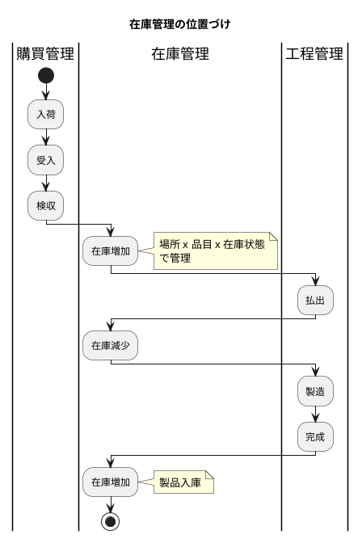
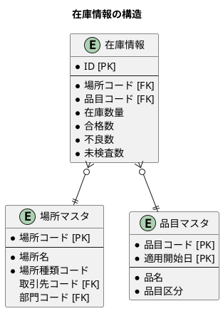
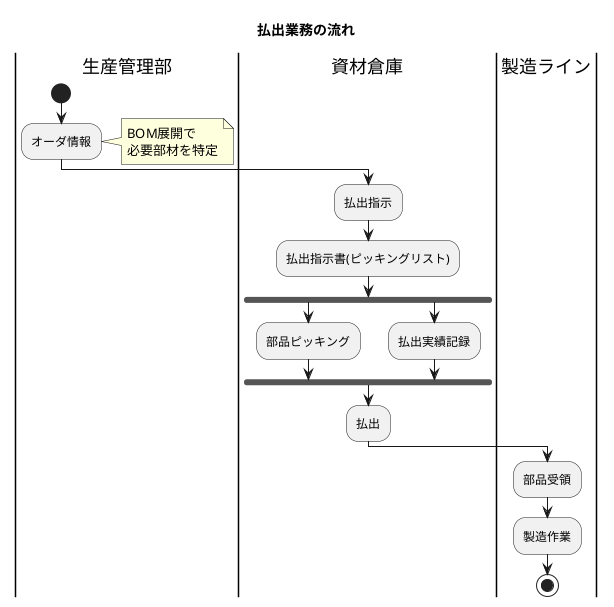
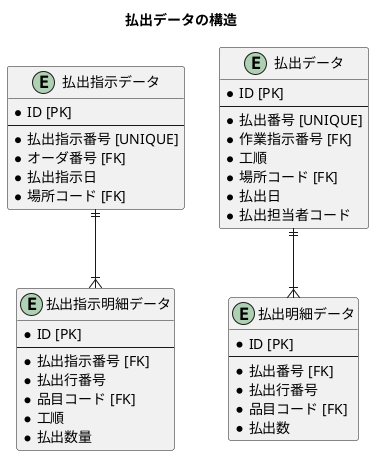
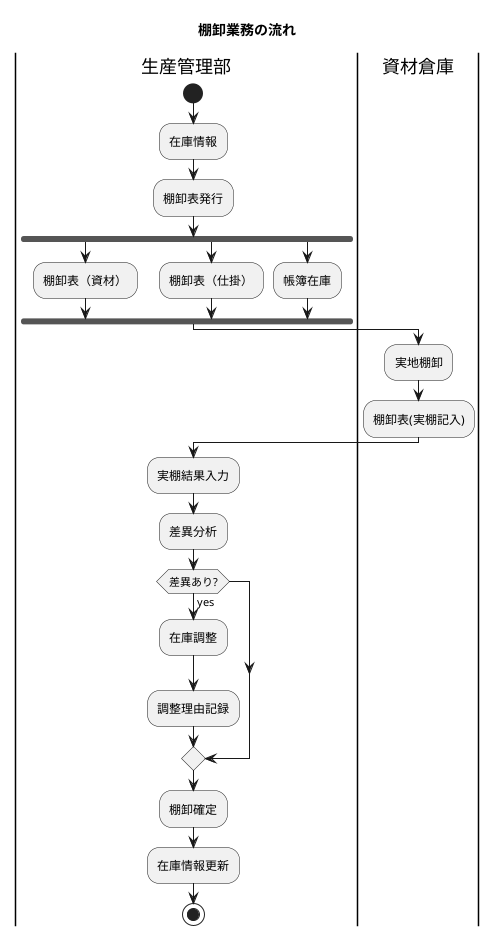
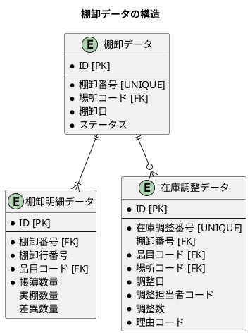
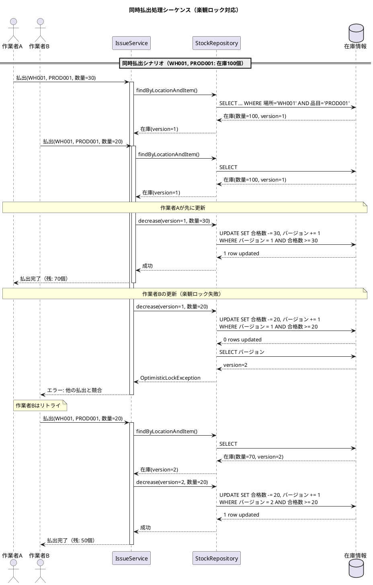
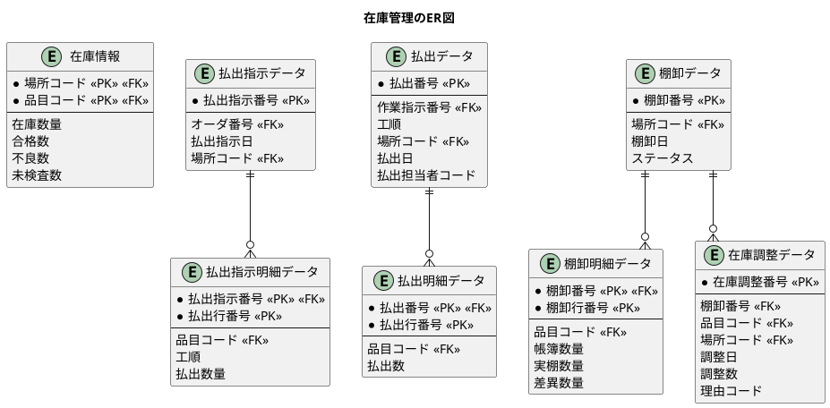

# 第28章：在庫管理の設計

## 概要

本章では、生産管理システムにおける在庫管理の設計を解説します。在庫情報の管理、払出業務、棚卸業務を実装します。



---

## 28.1 在庫情報の DB 設計

### 在庫管理の概念

在庫情報は「場所コード × 品目コード」で一意に管理されます。さらに在庫状態（合格・不良・未検査）ごとの数量を保持します。



### スキーマ設計

<details>
<summary>DDL: 場所マスタ・倉庫マスタ・在庫情報</summary>

```sql
-- V17__create_inventory_tables.sql

-- 場所マスタ
CREATE TABLE "場所マスタ" (
    "場所コード" VARCHAR(20) PRIMARY KEY,
    "場所名" VARCHAR(100) NOT NULL,
    "場所種類コード" VARCHAR(20) NOT NULL,
    "取引先コード" VARCHAR(20),
    "部門コード" VARCHAR(20),
    "適用開始日" DATE,
    "作成日時" TIMESTAMP DEFAULT CURRENT_TIMESTAMP NOT NULL,
    "更新日時" TIMESTAMP DEFAULT CURRENT_TIMESTAMP NOT NULL,
    CONSTRAINT "FK_場所_取引先" FOREIGN KEY ("取引先コード")
        REFERENCES "取引先マスタ"("取引先コード"),
    CONSTRAINT "FK_場所_部門" FOREIGN KEY ("部門コード")
        REFERENCES "部門マスタ"("部門コード")
);

COMMENT ON TABLE "場所マスタ" IS '場所マスタ';
COMMENT ON COLUMN "場所マスタ"."場所コード" IS '場所コード';
COMMENT ON COLUMN "場所マスタ"."場所名" IS '場所名';
COMMENT ON COLUMN "場所マスタ"."場所種類コード" IS '場所種類コード（倉庫/製造ライン等）';

-- 倉庫マスタ
CREATE TABLE "倉庫マスタ" (
    "倉庫コード" VARCHAR(20) PRIMARY KEY,
    "倉庫区分" VARCHAR(20) NOT NULL,
    "倉庫名" VARCHAR(100) NOT NULL,
    "部門コード" VARCHAR(20),
    "作成日時" TIMESTAMP DEFAULT CURRENT_TIMESTAMP NOT NULL,
    "更新日時" TIMESTAMP DEFAULT CURRENT_TIMESTAMP NOT NULL
);

COMMENT ON TABLE "倉庫マスタ" IS '倉庫マスタ';
COMMENT ON COLUMN "倉庫マスタ"."倉庫コード" IS '倉庫コード';
COMMENT ON COLUMN "倉庫マスタ"."倉庫区分" IS '倉庫区分';
COMMENT ON COLUMN "倉庫マスタ"."倉庫名" IS '倉庫名';

-- 在庫情報
CREATE TABLE "在庫情報" (
    "ID" SERIAL PRIMARY KEY,
    "場所コード" VARCHAR(20) NOT NULL,
    "品目コード" VARCHAR(20) NOT NULL,
    "在庫数量" DECIMAL(15, 2) NOT NULL,
    "合格数" DECIMAL(15, 2) DEFAULT 0 NOT NULL,
    "不良数" DECIMAL(15, 2) DEFAULT 0 NOT NULL,
    "未検査数" DECIMAL(15, 2) DEFAULT 0 NOT NULL,
    "作成日時" TIMESTAMP DEFAULT CURRENT_TIMESTAMP NOT NULL,
    "更新日時" TIMESTAMP DEFAULT CURRENT_TIMESTAMP NOT NULL,
    CONSTRAINT "UK_在庫_場所_品目" UNIQUE ("場所コード", "品目コード"),
    CONSTRAINT "FK_在庫_場所" FOREIGN KEY ("場所コード")
        REFERENCES "場所マスタ"("場所コード"),
    CONSTRAINT "FK_在庫_品目" FOREIGN KEY ("品目コード")
        REFERENCES "品目マスタ"("品目コード")
);

COMMENT ON TABLE "在庫情報" IS '在庫情報';
COMMENT ON COLUMN "在庫情報"."ID" IS 'サロゲートキー';
COMMENT ON COLUMN "在庫情報"."場所コード" IS '場所コード';
COMMENT ON COLUMN "在庫情報"."品目コード" IS '品目コード';
COMMENT ON COLUMN "在庫情報"."在庫数量" IS '総在庫数量';
COMMENT ON COLUMN "在庫情報"."合格数" IS '合格品数量';
COMMENT ON COLUMN "在庫情報"."不良数" IS '不良品数量';
COMMENT ON COLUMN "在庫情報"."未検査数" IS '未検査品数量';

CREATE INDEX "IDX_在庫_場所" ON "在庫情報" ("場所コード");
CREATE INDEX "IDX_在庫_品目" ON "在庫情報" ("品目コード");
```

</details>

### Java エンティティの定義

#### 在庫状態 Enum

<details>
<summary>Enum: StockStatus（在庫状態）</summary>

```java
// src/main/java/com/example/production/domain/model/inventory/StockStatus.java
package com.example.production.domain.model.inventory;

/**
 * 在庫状態
 */
public enum StockStatus {
    PASSED("合格"),
    DEFECTIVE("不良"),
    UNINSPECTED("未検査");

    private final String displayName;

    StockStatus(String displayName) {
        this.displayName = displayName;
    }

    public String getDisplayName() {
        return displayName;
    }

    public static StockStatus fromDisplayName(String displayName) {
        for (StockStatus status : values()) {
            if (status.displayName.equals(displayName)) {
                return status;
            }
        }
        throw new IllegalArgumentException("Unknown display name: " + displayName);
    }
}
```

</details>

#### 場所マスタ・在庫情報エンティティ

<details>
<summary>Entity: Location（場所マスタ）</summary>

```java
// src/main/java/com/example/production/domain/model/inventory/Location.java
package com.example.production.domain.model.inventory;

import lombok.*;
import java.time.LocalDate;
import java.time.LocalDateTime;

/**
 * 場所マスタエンティティ
 */
@Data
@Builder
@NoArgsConstructor
@AllArgsConstructor
public class Location {
    private String locationCode;
    private String locationName;
    private String locationTypeCode;
    private String supplierCode;
    private String departmentCode;
    private LocalDate effectiveDate;
    private LocalDateTime createdAt;
    private LocalDateTime updatedAt;

    public Location(String locationCode, String locationName, String locationTypeCode) {
        this.locationCode = locationCode;
        this.locationName = locationName;
        this.locationTypeCode = locationTypeCode;
    }
}
```

</details>

<details>
<summary>Entity: Stock（在庫情報）</summary>

```java
// src/main/java/com/example/production/domain/model/inventory/Stock.java
package com.example.production.domain.model.inventory;

import lombok.*;
import java.math.BigDecimal;
import java.time.LocalDateTime;

/**
 * 在庫情報エンティティ
 */
@Data
@Builder
@NoArgsConstructor
@AllArgsConstructor
public class Stock {
    private Long id;
    private String locationCode;
    private String itemCode;
    private BigDecimal stockQuantity;
    private BigDecimal passedQuantity;
    private BigDecimal defectiveQuantity;
    private BigDecimal uninspectedQuantity;
    private LocalDateTime createdAt;
    private LocalDateTime updatedAt;

    public static Stock empty(String locationCode, String itemCode) {
        return Stock.builder()
                .locationCode(locationCode)
                .itemCode(itemCode)
                .stockQuantity(BigDecimal.ZERO)
                .passedQuantity(BigDecimal.ZERO)
                .defectiveQuantity(BigDecimal.ZERO)
                .uninspectedQuantity(BigDecimal.ZERO)
                .build();
    }
}
```

</details>

#### 在庫操作リクエスト

<details>
<summary>DTO: StockChangeRequest・StockStatusChangeRequest</summary>

```java
// src/main/java/com/example/production/domain/model/inventory/StockChangeRequest.java
package com.example.production.domain.model.inventory;

import lombok.*;
import java.math.BigDecimal;

/**
 * 在庫増減リクエスト
 */
@Data
@Builder
@NoArgsConstructor
@AllArgsConstructor
public class StockChangeRequest {
    private String locationCode;
    private String itemCode;
    private BigDecimal quantity;
    private StockStatus stockStatus;
}
```

```java
// src/main/java/com/example/production/domain/model/inventory/StockStatusChangeRequest.java
package com.example.production.domain.model.inventory;

import lombok.*;
import java.math.BigDecimal;

/**
 * 在庫状態変更リクエスト
 */
@Data
@Builder
@NoArgsConstructor
@AllArgsConstructor
public class StockStatusChangeRequest {
    private String locationCode;
    private String itemCode;
    private BigDecimal quantity;
    private StockStatus fromStatus;
    private StockStatus toStatus;
}
```

</details>

<details>
<summary>Exception: InsufficientStockException</summary>

```java
// src/main/java/com/example/production/domain/model/inventory/InsufficientStockException.java
package com.example.production.domain.model.inventory;

/**
 * 在庫不足例外
 */
public class InsufficientStockException extends RuntimeException {
    public InsufficientStockException(String message) {
        super(message);
    }
}
```

</details>

### MyBatis Mapper

<details>
<summary>Mapper XML: StockMapper.xml</summary>

```xml
<?xml version="1.0" encoding="UTF-8" ?>
<!DOCTYPE mapper PUBLIC "-//mybatis.org//DTD Mapper 3.0//EN"
        "http://mybatis.org/dtd/mybatis-3-mapper.dtd">
<mapper namespace="com.example.production.infrastructure.persistence.mapper.StockMapper">

    <resultMap id="StockResultMap" type="com.example.production.domain.model.inventory.Stock">
        <id property="id" column="ID"/>
        <result property="locationCode" column="場所コード"/>
        <result property="itemCode" column="品目コード"/>
        <result property="stockQuantity" column="在庫数量"/>
        <result property="passedQuantity" column="合格数"/>
        <result property="defectiveQuantity" column="不良数"/>
        <result property="uninspectedQuantity" column="未検査数"/>
        <result property="createdAt" column="作成日時"/>
        <result property="updatedAt" column="更新日時"/>
    </resultMap>

    <select id="findByLocationAndItem" resultMap="StockResultMap">
        SELECT * FROM "在庫情報"
        WHERE "場所コード" = #{locationCode}
          AND "品目コード" = #{itemCode}
    </select>

    <select id="findByLocation" resultMap="StockResultMap">
        SELECT * FROM "在庫情報"
        WHERE "場所コード" = #{locationCode}
    </select>

    <insert id="insert" useGeneratedKeys="true" keyProperty="id" keyColumn="ID">
        INSERT INTO "在庫情報" (
            "場所コード", "品目コード", "在庫数量",
            "合格数", "不良数", "未検査数"
        ) VALUES (
            #{locationCode}, #{itemCode}, #{stockQuantity},
            #{passedQuantity}, #{defectiveQuantity}, #{uninspectedQuantity}
        )
    </insert>

    <update id="increaseByStatus">
        UPDATE "在庫情報"
        SET "在庫数量" = "在庫数量" + #{quantity},
            <choose>
                <when test="status == 'PASSED'">
                    "合格数" = "合格数" + #{quantity}
                </when>
                <when test="status == 'DEFECTIVE'">
                    "不良数" = "不良数" + #{quantity}
                </when>
                <when test="status == 'UNINSPECTED'">
                    "未検査数" = "未検査数" + #{quantity}
                </when>
            </choose>,
            "更新日時" = CURRENT_TIMESTAMP
        WHERE "場所コード" = #{locationCode}
          AND "品目コード" = #{itemCode}
    </update>

    <update id="decreaseByStatus">
        UPDATE "在庫情報"
        SET "在庫数量" = "在庫数量" - #{quantity},
            <choose>
                <when test="status == 'PASSED'">
                    "合格数" = "合格数" - #{quantity}
                </when>
                <when test="status == 'DEFECTIVE'">
                    "不良数" = "不良数" - #{quantity}
                </when>
                <when test="status == 'UNINSPECTED'">
                    "未検査数" = "未検査数" - #{quantity}
                </when>
            </choose>,
            "更新日時" = CURRENT_TIMESTAMP
        WHERE "場所コード" = #{locationCode}
          AND "品目コード" = #{itemCode}
    </update>

    <update id="changeStatus">
        UPDATE "在庫情報"
        SET
            <choose>
                <when test="fromStatus == 'PASSED'">
                    "合格数" = "合格数" - #{quantity}
                </when>
                <when test="fromStatus == 'DEFECTIVE'">
                    "不良数" = "不良数" - #{quantity}
                </when>
                <when test="fromStatus == 'UNINSPECTED'">
                    "未検査数" = "未検査数" - #{quantity}
                </when>
            </choose>,
            <choose>
                <when test="toStatus == 'PASSED'">
                    "合格数" = "合格数" + #{quantity}
                </when>
                <when test="toStatus == 'DEFECTIVE'">
                    "不良数" = "不良数" + #{quantity}
                </when>
                <when test="toStatus == 'UNINSPECTED'">
                    "未検査数" = "未検査数" + #{quantity}
                </when>
            </choose>,
            "更新日時" = CURRENT_TIMESTAMP
        WHERE "場所コード" = #{locationCode}
          AND "品目コード" = #{itemCode}
    </update>

    <update id="update">
        UPDATE "在庫情報"
        SET "在庫数量" = #{stockQuantity},
            "合格数" = #{passedQuantity},
            "不良数" = #{defectiveQuantity},
            "未検査数" = #{uninspectedQuantity},
            "更新日時" = CURRENT_TIMESTAMP
        WHERE "場所コード" = #{locationCode}
          AND "品目コード" = #{itemCode}
    </update>

</mapper>
```

</details>

<details>
<summary>Mapper Interface: StockMapper</summary>

```java
// src/main/java/com/example/production/infrastructure/persistence/mapper/StockMapper.java
package com.example.production.infrastructure.persistence.mapper;

import com.example.production.domain.model.inventory.Stock;
import org.apache.ibatis.annotations.Mapper;
import org.apache.ibatis.annotations.Param;
import java.math.BigDecimal;
import java.util.List;

@Mapper
public interface StockMapper {
    Stock findByLocationAndItem(
            @Param("locationCode") String locationCode,
            @Param("itemCode") String itemCode);

    List<Stock> findByLocation(@Param("locationCode") String locationCode);

    void insert(Stock stock);

    void increaseByStatus(
            @Param("locationCode") String locationCode,
            @Param("itemCode") String itemCode,
            @Param("quantity") BigDecimal quantity,
            @Param("status") String status);

    void decreaseByStatus(
            @Param("locationCode") String locationCode,
            @Param("itemCode") String itemCode,
            @Param("quantity") BigDecimal quantity,
            @Param("status") String status);

    void changeStatus(
            @Param("locationCode") String locationCode,
            @Param("itemCode") String itemCode,
            @Param("quantity") BigDecimal quantity,
            @Param("fromStatus") String fromStatus,
            @Param("toStatus") String toStatus);

    void update(Stock stock);
}
```

</details>

### 在庫サービスの実装

<details>
<summary>Service: InventoryService</summary>

```java
// src/main/java/com/example/production/application/service/InventoryService.java
package com.example.production.application.service;

import com.example.production.domain.model.inventory.*;
import com.example.production.infrastructure.persistence.mapper.StockMapper;
import lombok.RequiredArgsConstructor;
import org.springframework.stereotype.Service;
import org.springframework.transaction.annotation.Transactional;

import java.math.BigDecimal;
import java.util.Optional;

/**
 * 在庫管理サービス
 */
@Service
@RequiredArgsConstructor
public class InventoryService {

    private final StockMapper stockMapper;

    /**
     * 在庫を取得する
     */
    public Stock getStock(String locationCode, String itemCode) {
        return Optional.ofNullable(stockMapper.findByLocationAndItem(locationCode, itemCode))
                .orElse(Stock.empty(locationCode, itemCode));
    }

    /**
     * 在庫を増加する
     */
    @Transactional
    public void increaseStock(StockChangeRequest request) {
        Stock stock = stockMapper.findByLocationAndItem(request.getLocationCode(), request.getItemCode());

        if (stock == null) {
            // 新規作成
            Stock newStock = Stock.builder()
                    .locationCode(request.getLocationCode())
                    .itemCode(request.getItemCode())
                    .stockQuantity(request.getQuantity())
                    .passedQuantity(request.getStockStatus() == StockStatus.PASSED ? request.getQuantity() : BigDecimal.ZERO)
                    .defectiveQuantity(request.getStockStatus() == StockStatus.DEFECTIVE ? request.getQuantity() : BigDecimal.ZERO)
                    .uninspectedQuantity(request.getStockStatus() == StockStatus.UNINSPECTED ? request.getQuantity() : BigDecimal.ZERO)
                    .build();
            stockMapper.insert(newStock);
        } else {
            // 更新
            stockMapper.increaseByStatus(
                    request.getLocationCode(),
                    request.getItemCode(),
                    request.getQuantity(),
                    request.getStockStatus().name()
            );
        }
    }

    /**
     * 在庫を減少する
     */
    @Transactional
    public void decreaseStock(StockChangeRequest request) {
        Stock stock = getStock(request.getLocationCode(), request.getItemCode());
        BigDecimal currentQuantity = getQuantityByStatus(stock, request.getStockStatus());

        if (currentQuantity.compareTo(request.getQuantity()) < 0) {
            throw new InsufficientStockException("在庫が不足しています");
        }

        stockMapper.decreaseByStatus(
                request.getLocationCode(),
                request.getItemCode(),
                request.getQuantity(),
                request.getStockStatus().name()
        );
    }

    /**
     * 在庫状態を変更する
     */
    @Transactional
    public void changeStockStatus(StockStatusChangeRequest request) {
        Stock stock = getStock(request.getLocationCode(), request.getItemCode());
        BigDecimal currentQuantity = getQuantityByStatus(stock, request.getFromStatus());

        if (currentQuantity.compareTo(request.getQuantity()) < 0) {
            throw new InsufficientStockException(
                    String.format("%sの在庫が不足しています", request.getFromStatus().getDisplayName())
            );
        }

        stockMapper.changeStatus(
                request.getLocationCode(),
                request.getItemCode(),
                request.getQuantity(),
                request.getFromStatus().name(),
                request.getToStatus().name()
        );
    }

    private BigDecimal getQuantityByStatus(Stock stock, StockStatus status) {
        return switch (status) {
            case PASSED -> stock.getPassedQuantity();
            case DEFECTIVE -> stock.getDefectiveQuantity();
            case UNINSPECTED -> stock.getUninspectedQuantity();
        };
    }
}
```

</details>

### TDD: 在庫情報のテスト

<details>
<summary>Test: StockTest</summary>

```java
// src/test/java/com/example/production/domain/model/inventory/StockTest.java
package com.example.production.domain.model.inventory;

import com.example.production.application.service.InventoryService;
import com.example.production.infrastructure.persistence.mapper.*;
import org.junit.jupiter.api.*;
import org.mybatis.spring.boot.test.autoconfigure.MybatisTest;
import org.springframework.beans.factory.annotation.Autowired;
import org.springframework.boot.test.autoconfigure.jdbc.AutoConfigureTestDatabase;
import org.springframework.context.annotation.Import;
import org.springframework.test.context.DynamicPropertyRegistry;
import org.springframework.test.context.DynamicPropertySource;
import org.testcontainers.containers.PostgreSQLContainer;
import org.testcontainers.junit.jupiter.Container;
import org.testcontainers.junit.jupiter.Testcontainers;

import java.math.BigDecimal;
import java.time.LocalDate;

import static org.assertj.core.api.Assertions.*;

@MybatisTest
@AutoConfigureTestDatabase(replace = AutoConfigureTestDatabase.Replace.NONE)
@Testcontainers
@Import({InventoryService.class})
@DisplayName("在庫情報")
class StockTest {

    @Container
    static PostgreSQLContainer<?> postgres = new PostgreSQLContainer<>("postgres:15")
            .withDatabaseName("testdb")
            .withUsername("test")
            .withPassword("test");

    @DynamicPropertySource
    static void configureProperties(DynamicPropertyRegistry registry) {
        registry.add("spring.datasource.url", postgres::getJdbcUrl);
        registry.add("spring.datasource.username", postgres::getUsername);
        registry.add("spring.datasource.password", postgres::getPassword);
    }

    @Autowired
    private InventoryService inventoryService;

    @Autowired
    private StockMapper stockMapper;

    @Nested
    @DisplayName("在庫の参照")
    class StockReferenceTest {

        @Test
        @DisplayName("場所と品目で在庫を取得できる")
        void shouldGetStockByLocationAndItem() {
            // Act
            Stock stock = inventoryService.getStock("WH001", "PROD001");

            // Assert
            assertThat(stock).isNotNull();
            assertThat(stock.getStockQuantity()).isEqualByComparingTo(new BigDecimal("100"));
            assertThat(stock.getPassedQuantity()).isEqualByComparingTo(new BigDecimal("95"));
        }

        @Test
        @DisplayName("存在しない在庫は0として返す")
        void shouldReturnZeroForNonExistentStock() {
            // Act
            Stock stock = inventoryService.getStock("WH001", "NONEXISTENT");

            // Assert
            assertThat(stock.getStockQuantity()).isEqualByComparingTo(BigDecimal.ZERO);
        }
    }

    @Nested
    @DisplayName("在庫の増減")
    class StockChangeTest {

        @Test
        @DisplayName("在庫を増加できる")
        void shouldIncreaseStock() {
            // Act
            inventoryService.increaseStock(StockChangeRequest.builder()
                    .locationCode("WH001")
                    .itemCode("PROD001")
                    .quantity(new BigDecimal("50"))
                    .stockStatus(StockStatus.PASSED)
                    .build());

            // Assert
            Stock stock = inventoryService.getStock("WH001", "PROD001");
            assertThat(stock.getStockQuantity()).isEqualByComparingTo(new BigDecimal("150"));
        }

        @Test
        @DisplayName("在庫以上の数量を減少しようとするとエラー")
        void shouldThrowExceptionWhenDecreasingMoreThanStock() {
            // Act & Assert
            assertThatThrownBy(() -> inventoryService.decreaseStock(StockChangeRequest.builder()
                    .locationCode("WH001")
                    .itemCode("PROD001")
                    .quantity(new BigDecimal("200"))
                    .stockStatus(StockStatus.PASSED)
                    .build()))
                    .isInstanceOf(InsufficientStockException.class)
                    .hasMessageContaining("在庫が不足しています");
        }
    }

    @Nested
    @DisplayName("在庫状態の変更")
    class StockStatusChangeTest {

        @Test
        @DisplayName("未検査から合格への状態変更ができる")
        void shouldChangeStatusFromUninspectedToPassed() {
            // Arrange
            Stock initialStock = inventoryService.getStock("WH001", "PROD001");
            BigDecimal initialUninspected = initialStock.getUninspectedQuantity();
            BigDecimal initialPassed = initialStock.getPassedQuantity();

            // Act
            inventoryService.changeStockStatus(StockStatusChangeRequest.builder()
                    .locationCode("WH001")
                    .itemCode("PROD001")
                    .quantity(new BigDecimal("2"))
                    .fromStatus(StockStatus.UNINSPECTED)
                    .toStatus(StockStatus.PASSED)
                    .build());

            // Assert
            Stock stock = inventoryService.getStock("WH001", "PROD001");
            assertThat(stock.getUninspectedQuantity())
                    .isEqualByComparingTo(initialUninspected.subtract(new BigDecimal("2")));
            assertThat(stock.getPassedQuantity())
                    .isEqualByComparingTo(initialPassed.add(new BigDecimal("2")));
        }
    }
}
```

</details>

---

## 28.2 払出業務の DB 設計

### 払出業務の流れ

払出業務は、製造に必要な材料を倉庫から製造ラインへ供給する業務です。



### 払出指示・払出データのスキーマ設計



<details>
<summary>DDL: 払出指示データ・払出データ</summary>

```sql
-- V18__create_issue_tables.sql

-- 払出指示データ
CREATE TABLE "払出指示データ" (
    "ID" SERIAL PRIMARY KEY,
    "払出指示番号" VARCHAR(20) UNIQUE NOT NULL,
    "オーダ番号" VARCHAR(20) NOT NULL,
    "払出指示日" DATE NOT NULL,
    "場所コード" VARCHAR(20) NOT NULL,
    "備考" VARCHAR(500),
    "作成日時" TIMESTAMP DEFAULT CURRENT_TIMESTAMP NOT NULL,
    "更新日時" TIMESTAMP DEFAULT CURRENT_TIMESTAMP NOT NULL,
    CONSTRAINT "FK_払出指示_オーダ" FOREIGN KEY ("オーダ番号")
        REFERENCES "オーダ情報"("オーダNO"),
    CONSTRAINT "FK_払出指示_場所" FOREIGN KEY ("場所コード")
        REFERENCES "場所マスタ"("場所コード")
);

COMMENT ON TABLE "払出指示データ" IS '払出指示データ';

-- 払出指示明細データ
CREATE TABLE "払出指示明細データ" (
    "ID" SERIAL PRIMARY KEY,
    "払出指示番号" VARCHAR(20) NOT NULL,
    "払出行番号" INT NOT NULL,
    "品目コード" VARCHAR(20) NOT NULL,
    "工順" INT NOT NULL,
    "払出数量" DECIMAL(15, 2) NOT NULL,
    "作成日時" TIMESTAMP DEFAULT CURRENT_TIMESTAMP NOT NULL,
    "更新日時" TIMESTAMP DEFAULT CURRENT_TIMESTAMP NOT NULL,
    CONSTRAINT "UK_払出指示明細" UNIQUE ("払出指示番号", "払出行番号"),
    CONSTRAINT "FK_払出指示明細_払出指示" FOREIGN KEY ("払出指示番号")
        REFERENCES "払出指示データ"("払出指示番号"),
    CONSTRAINT "FK_払出指示明細_品目" FOREIGN KEY ("品目コード")
        REFERENCES "品目マスタ"("品目コード")
);

COMMENT ON TABLE "払出指示明細データ" IS '払出指示明細データ';

-- 払出データ
CREATE TABLE "払出データ" (
    "ID" SERIAL PRIMARY KEY,
    "払出番号" VARCHAR(20) UNIQUE NOT NULL,
    "作業指示番号" VARCHAR(20) NOT NULL,
    "工順" INT NOT NULL,
    "場所コード" VARCHAR(20) NOT NULL,
    "払出日" DATE NOT NULL,
    "払出担当者コード" VARCHAR(20) NOT NULL,
    "作成日時" TIMESTAMP DEFAULT CURRENT_TIMESTAMP NOT NULL,
    "更新日時" TIMESTAMP DEFAULT CURRENT_TIMESTAMP NOT NULL,
    CONSTRAINT "FK_払出_場所" FOREIGN KEY ("場所コード")
        REFERENCES "場所マスタ"("場所コード")
);

COMMENT ON TABLE "払出データ" IS '払出データ';

-- 払出明細データ
CREATE TABLE "払出明細データ" (
    "ID" SERIAL PRIMARY KEY,
    "払出番号" VARCHAR(20) NOT NULL,
    "払出行番号" INT NOT NULL,
    "品目コード" VARCHAR(20) NOT NULL,
    "払出数" DECIMAL(15, 2) NOT NULL,
    "作成日時" TIMESTAMP DEFAULT CURRENT_TIMESTAMP NOT NULL,
    "更新日時" TIMESTAMP DEFAULT CURRENT_TIMESTAMP NOT NULL,
    CONSTRAINT "UK_払出明細" UNIQUE ("払出番号", "払出行番号"),
    CONSTRAINT "FK_払出明細_払出" FOREIGN KEY ("払出番号")
        REFERENCES "払出データ"("払出番号"),
    CONSTRAINT "FK_払出明細_品目" FOREIGN KEY ("品目コード")
        REFERENCES "品目マスタ"("品目コード")
);

COMMENT ON TABLE "払出明細データ" IS '払出明細データ';

CREATE INDEX "IDX_払出指示_オーダ" ON "払出指示データ" ("オーダ番号");
CREATE INDEX "IDX_払出指示_場所" ON "払出指示データ" ("場所コード");
CREATE INDEX "IDX_払出_作業指示" ON "払出データ" ("作業指示番号");
```

</details>

### Java エンティティの定義（払出）

<details>
<summary>Entity: IssueInstruction・IssueInstructionDetail</summary>

```java
// src/main/java/com/example/production/domain/model/inventory/IssueInstruction.java
package com.example.production.domain.model.inventory;

import lombok.*;
import java.time.LocalDate;
import java.time.LocalDateTime;
import java.util.List;

/**
 * 払出指示データエンティティ
 */
@Data
@Builder
@NoArgsConstructor
@AllArgsConstructor
public class IssueInstruction {
    private Long id;
    private String instructionNumber;
    private String orderNumber;
    private LocalDate instructionDate;
    private String locationCode;
    private String remarks;
    private LocalDateTime createdAt;
    private LocalDateTime updatedAt;

    private List<IssueInstructionDetail> details;
}
```

```java
// src/main/java/com/example/production/domain/model/inventory/IssueInstructionDetail.java
package com.example.production.domain.model.inventory;

import lombok.*;
import java.math.BigDecimal;
import java.time.LocalDateTime;

/**
 * 払出指示明細データエンティティ
 */
@Data
@Builder
@NoArgsConstructor
@AllArgsConstructor
public class IssueInstructionDetail {
    private Long id;
    private String instructionNumber;
    private Integer lineNumber;
    private String itemCode;
    private Integer routingSequence;
    private BigDecimal issueQuantity;
    private LocalDateTime createdAt;
    private LocalDateTime updatedAt;
}
```

</details>

<details>
<summary>Entity: Issue・IssueDetail</summary>

```java
// src/main/java/com/example/production/domain/model/inventory/Issue.java
package com.example.production.domain.model.inventory;

import lombok.*;
import java.time.LocalDate;
import java.time.LocalDateTime;
import java.util.List;

/**
 * 払出データエンティティ
 */
@Data
@Builder
@NoArgsConstructor
@AllArgsConstructor
public class Issue {
    private Long id;
    private String issueNumber;
    private String workOrderNumber;
    private Integer routingSequence;
    private String locationCode;
    private LocalDate issueDate;
    private String issuerCode;
    private LocalDateTime createdAt;
    private LocalDateTime updatedAt;

    private List<IssueDetail> details;
}
```

```java
// src/main/java/com/example/production/domain/model/inventory/IssueDetail.java
package com.example.production.domain.model.inventory;

import lombok.*;
import java.math.BigDecimal;
import java.time.LocalDateTime;

/**
 * 払出明細データエンティティ
 */
@Data
@Builder
@NoArgsConstructor
@AllArgsConstructor
public class IssueDetail {
    private Long id;
    private String issueNumber;
    private Integer lineNumber;
    private String itemCode;
    private BigDecimal issueQuantity;
    private LocalDateTime createdAt;
    private LocalDateTime updatedAt;
}
```

</details>

### 払出サービスの実装

<details>
<summary>Service: IssueService</summary>

```java
// src/main/java/com/example/production/application/service/IssueService.java
package com.example.production.application.service;

import com.example.production.domain.model.inventory.*;
import com.example.production.infrastructure.persistence.mapper.*;
import lombok.RequiredArgsConstructor;
import org.springframework.stereotype.Service;
import org.springframework.transaction.annotation.Transactional;

import java.time.Year;
import java.util.List;
import java.util.stream.IntStream;

/**
 * 払出サービス
 */
@Service
@RequiredArgsConstructor
public class IssueService {

    private final IssueInstructionMapper instructionMapper;
    private final IssueMapper issueMapper;
    private final InventoryService inventoryService;

    /**
     * 払出指示を作成する
     */
    @Transactional
    public IssueInstruction createIssueInstruction(IssueInstructionRequest request) {
        String instructionNumber = generateInstructionNumber();

        IssueInstruction instruction = IssueInstruction.builder()
                .instructionNumber(instructionNumber)
                .orderNumber(request.getOrderNumber())
                .instructionDate(request.getInstructionDate())
                .locationCode(request.getLocationCode())
                .build();

        instructionMapper.insert(instruction);

        List<IssueInstructionDetail> details = IntStream.range(0, request.getDetails().size())
                .mapToObj(i -> {
                    IssueInstructionDetailRequest detailReq = request.getDetails().get(i);
                    return IssueInstructionDetail.builder()
                            .instructionNumber(instructionNumber)
                            .lineNumber(i + 1)
                            .itemCode(detailReq.getItemCode())
                            .routingSequence(detailReq.getRoutingSequence())
                            .issueQuantity(detailReq.getIssueQuantity())
                            .build();
                })
                .toList();

        details.forEach(instructionMapper::insertDetail);

        instruction.setDetails(details);
        return instruction;
    }

    /**
     * 払出を実行する
     */
    @Transactional
    public Issue executeIssue(IssueExecuteRequest request) {
        String locationCode = request.getLocationCode();

        // 在庫チェック
        for (IssueDetailRequest detail : request.getDetails()) {
            Stock stock = inventoryService.getStock(locationCode, detail.getItemCode());
            if (stock.getPassedQuantity().compareTo(detail.getIssueQuantity()) < 0) {
                throw new InsufficientStockException("在庫が不足しています: " + detail.getItemCode());
            }
        }

        String issueNumber = generateIssueNumber();

        Issue issue = Issue.builder()
                .issueNumber(issueNumber)
                .workOrderNumber(request.getWorkOrderNumber())
                .routingSequence(request.getRoutingSequence())
                .locationCode(locationCode)
                .issueDate(request.getIssueDate())
                .issuerCode(request.getIssuerCode())
                .build();

        issueMapper.insert(issue);

        List<IssueDetail> details = IntStream.range(0, request.getDetails().size())
                .mapToObj(i -> {
                    IssueDetailRequest detailReq = request.getDetails().get(i);
                    return IssueDetail.builder()
                            .issueNumber(issueNumber)
                            .lineNumber(i + 1)
                            .itemCode(detailReq.getItemCode())
                            .issueQuantity(detailReq.getIssueQuantity())
                            .build();
                })
                .toList();

        details.forEach(issueMapper::insertDetail);

        // 在庫を減少
        for (IssueDetailRequest detail : request.getDetails()) {
            inventoryService.decreaseStock(StockChangeRequest.builder()
                    .locationCode(locationCode)
                    .itemCode(detail.getItemCode())
                    .quantity(detail.getIssueQuantity())
                    .stockStatus(StockStatus.PASSED)
                    .build());
        }

        issue.setDetails(details);
        return issue;
    }

    private String generateInstructionNumber() {
        int year = Year.now().getValue();
        long count = instructionMapper.countByYear(year);
        return String.format("IS-%d-%04d", year, count + 1);
    }

    private String generateIssueNumber() {
        int year = Year.now().getValue();
        long count = issueMapper.countByYear(year);
        return String.format("PO-%d-%04d", year, count + 1);
    }
}
```

</details>

---

## 28.3 棚卸業務の DB 設計

### 棚卸業務の流れ

棚卸業務は、帳簿在庫と実際の在庫を照合し、差異を調整する業務です。



### 棚卸データのスキーマ設計



<details>
<summary>DDL: 棚卸データ・在庫調整データ</summary>

```sql
-- V19__create_stocktaking_tables.sql

-- 棚卸ステータス ENUM
CREATE TYPE "棚卸ステータス" AS ENUM ('発行済', '入力済', '確定');

-- 棚卸データ
CREATE TABLE "棚卸データ" (
    "ID" SERIAL PRIMARY KEY,
    "棚卸番号" VARCHAR(20) UNIQUE NOT NULL,
    "場所コード" VARCHAR(20) NOT NULL,
    "棚卸日" DATE NOT NULL,
    "ステータス" "棚卸ステータス" DEFAULT '発行済' NOT NULL,
    "作成日時" TIMESTAMP DEFAULT CURRENT_TIMESTAMP NOT NULL,
    "更新日時" TIMESTAMP DEFAULT CURRENT_TIMESTAMP NOT NULL
);

COMMENT ON TABLE "棚卸データ" IS '棚卸データ';

-- 棚卸明細データ
CREATE TABLE "棚卸明細データ" (
    "ID" SERIAL PRIMARY KEY,
    "棚卸番号" VARCHAR(20) NOT NULL,
    "棚卸行番号" INT NOT NULL,
    "品目コード" VARCHAR(20) NOT NULL,
    "帳簿数量" DECIMAL(15, 2) NOT NULL,
    "実棚数量" DECIMAL(15, 2),
    "差異数量" DECIMAL(15, 2),
    CONSTRAINT "UK_棚卸明細" UNIQUE ("棚卸番号", "棚卸行番号"),
    CONSTRAINT "FK_棚卸明細_棚卸" FOREIGN KEY ("棚卸番号")
        REFERENCES "棚卸データ"("棚卸番号"),
    CONSTRAINT "FK_棚卸明細_品目" FOREIGN KEY ("品目コード")
        REFERENCES "品目マスタ"("品目コード")
);

COMMENT ON TABLE "棚卸明細データ" IS '棚卸明細データ';

-- 在庫調整データ
CREATE TABLE "在庫調整データ" (
    "ID" SERIAL PRIMARY KEY,
    "在庫調整番号" VARCHAR(30) UNIQUE NOT NULL,
    "棚卸番号" VARCHAR(20),
    "品目コード" VARCHAR(20) NOT NULL,
    "場所コード" VARCHAR(20) NOT NULL,
    "調整日" DATE NOT NULL,
    "調整担当者コード" VARCHAR(20) NOT NULL,
    "調整数" DECIMAL(15, 2) NOT NULL,
    "理由コード" VARCHAR(20) NOT NULL,
    "作成日時" TIMESTAMP DEFAULT CURRENT_TIMESTAMP NOT NULL,
    "更新日時" TIMESTAMP DEFAULT CURRENT_TIMESTAMP NOT NULL,
    CONSTRAINT "FK_在庫調整_棚卸" FOREIGN KEY ("棚卸番号")
        REFERENCES "棚卸データ"("棚卸番号"),
    CONSTRAINT "FK_在庫調整_品目" FOREIGN KEY ("品目コード")
        REFERENCES "品目マスタ"("品目コード")
);

COMMENT ON TABLE "在庫調整データ" IS '在庫調整データ';
COMMENT ON COLUMN "在庫調整データ"."調整数" IS '調整数（+/-）';

CREATE INDEX "IDX_棚卸_場所" ON "棚卸データ" ("場所コード");
CREATE INDEX "IDX_棚卸_日付" ON "棚卸データ" ("棚卸日");
CREATE INDEX "IDX_在庫調整_棚卸" ON "在庫調整データ" ("棚卸番号");
```

</details>

### Java エンティティの定義（棚卸）

<details>
<summary>Enum: StocktakingStatus</summary>

```java
// src/main/java/com/example/production/domain/model/inventory/StocktakingStatus.java
package com.example.production.domain.model.inventory;

/**
 * 棚卸ステータス
 */
public enum StocktakingStatus {
    ISSUED("発行済"),
    ENTERED("入力済"),
    CONFIRMED("確定");

    private final String displayName;

    StocktakingStatus(String displayName) {
        this.displayName = displayName;
    }

    public String getDisplayName() {
        return displayName;
    }

    public static StocktakingStatus fromDisplayName(String displayName) {
        for (StocktakingStatus status : values()) {
            if (status.displayName.equals(displayName)) {
                return status;
            }
        }
        throw new IllegalArgumentException("Unknown display name: " + displayName);
    }
}
```

</details>

<details>
<summary>TypeHandler: StocktakingStatusTypeHandler</summary>

```java
// src/main/java/com/example/production/infrastructure/persistence/StocktakingStatusTypeHandler.java
package com.example.production.infrastructure.persistence;

import com.example.production.domain.model.inventory.StocktakingStatus;
import org.apache.ibatis.type.BaseTypeHandler;
import org.apache.ibatis.type.JdbcType;
import org.apache.ibatis.type.MappedTypes;

import java.sql.CallableStatement;
import java.sql.PreparedStatement;
import java.sql.ResultSet;
import java.sql.SQLException;

/**
 * 棚卸ステータスのTypeHandler
 */
@MappedTypes(StocktakingStatus.class)
public class StocktakingStatusTypeHandler extends BaseTypeHandler<StocktakingStatus> {

    @Override
    public void setNonNullParameter(PreparedStatement ps, int i,
                                    StocktakingStatus parameter, JdbcType jdbcType) throws SQLException {
        ps.setString(i, parameter.getDisplayName());
    }

    @Override
    public StocktakingStatus getNullableResult(ResultSet rs, String columnName) throws SQLException {
        String value = rs.getString(columnName);
        return value == null ? null : StocktakingStatus.fromDisplayName(value);
    }

    @Override
    public StocktakingStatus getNullableResult(ResultSet rs, int columnIndex) throws SQLException {
        String value = rs.getString(columnIndex);
        return value == null ? null : StocktakingStatus.fromDisplayName(value);
    }

    @Override
    public StocktakingStatus getNullableResult(CallableStatement cs, int columnIndex) throws SQLException {
        String value = cs.getString(columnIndex);
        return value == null ? null : StocktakingStatus.fromDisplayName(value);
    }
}
```

</details>

<details>
<summary>Entity: Stocktaking・StocktakingDetail・StockAdjustment</summary>

```java
// src/main/java/com/example/production/domain/model/inventory/Stocktaking.java
package com.example.production.domain.model.inventory;

import lombok.*;
import java.time.LocalDate;
import java.time.LocalDateTime;
import java.util.List;

/**
 * 棚卸データエンティティ
 */
@Data
@Builder
@NoArgsConstructor
@AllArgsConstructor
public class Stocktaking {
    private Long id;
    private String stocktakingNumber;
    private String locationCode;
    private LocalDate stocktakingDate;
    private StocktakingStatus status;
    private LocalDateTime createdAt;
    private LocalDateTime updatedAt;

    private List<StocktakingDetail> details;
}
```

```java
// src/main/java/com/example/production/domain/model/inventory/StocktakingDetail.java
package com.example.production.domain.model.inventory;

import lombok.*;
import java.math.BigDecimal;

/**
 * 棚卸明細データエンティティ
 */
@Data
@Builder
@NoArgsConstructor
@AllArgsConstructor
public class StocktakingDetail {
    private Long id;
    private String stocktakingNumber;
    private Integer lineNumber;
    private String itemCode;
    private BigDecimal bookQuantity;
    private BigDecimal actualQuantity;
    private BigDecimal differenceQuantity;
}
```

```java
// src/main/java/com/example/production/domain/model/inventory/StockAdjustment.java
package com.example.production.domain.model.inventory;

import lombok.*;
import java.math.BigDecimal;
import java.time.LocalDate;
import java.time.LocalDateTime;

/**
 * 在庫調整データエンティティ
 */
@Data
@Builder
@NoArgsConstructor
@AllArgsConstructor
public class StockAdjustment {
    private Long id;
    private String adjustmentNumber;
    private String stocktakingNumber;
    private String itemCode;
    private String locationCode;
    private LocalDate adjustmentDate;
    private String adjusterCode;
    private BigDecimal adjustmentQuantity;
    private String reasonCode;
    private LocalDateTime createdAt;
    private LocalDateTime updatedAt;
}
```

</details>

### 棚卸サービスの実装

<details>
<summary>Service: StocktakingService</summary>

```java
// src/main/java/com/example/production/application/service/StocktakingService.java
package com.example.production.application.service;

import com.example.production.domain.model.inventory.*;
import com.example.production.infrastructure.persistence.mapper.*;
import lombok.RequiredArgsConstructor;
import org.springframework.stereotype.Service;
import org.springframework.transaction.annotation.Transactional;

import java.math.BigDecimal;
import java.time.LocalDate;
import java.time.Year;
import java.util.List;
import java.util.UUID;
import java.util.stream.IntStream;

/**
 * 棚卸サービス
 */
@Service
@RequiredArgsConstructor
public class StocktakingService {

    private final StocktakingMapper stocktakingMapper;
    private final StockMapper stockMapper;
    private final StockAdjustmentMapper adjustmentMapper;

    /**
     * 棚卸表を発行する
     */
    @Transactional
    public Stocktaking issueStocktakingSheet(StocktakingIssueRequest request) {
        List<Stock> stocks = stockMapper.findByLocation(request.getLocationCode());

        String stocktakingNumber = generateStocktakingNumber();

        Stocktaking stocktaking = Stocktaking.builder()
                .stocktakingNumber(stocktakingNumber)
                .locationCode(request.getLocationCode())
                .stocktakingDate(request.getStocktakingDate())
                .status(StocktakingStatus.ISSUED)
                .build();

        stocktakingMapper.insert(stocktaking);

        List<StocktakingDetail> details = IntStream.range(0, stocks.size())
                .mapToObj(i -> {
                    Stock stock = stocks.get(i);
                    return StocktakingDetail.builder()
                            .stocktakingNumber(stocktakingNumber)
                            .lineNumber(i + 1)
                            .itemCode(stock.getItemCode())
                            .bookQuantity(stock.getStockQuantity())
                            .build();
                })
                .toList();

        details.forEach(stocktakingMapper::insertDetail);

        stocktaking.setDetails(details);
        return stocktaking;
    }

    /**
     * 実棚数量を入力する
     */
    @Transactional
    public Stocktaking inputActualCount(ActualCountInputRequest request) {
        Stocktaking stocktaking = stocktakingMapper.findByStocktakingNumber(request.getStocktakingNumber());
        if (stocktaking == null) {
            throw new IllegalArgumentException("棚卸データが見つかりません");
        }

        List<StocktakingDetail> existingDetails = stocktakingMapper.findDetailsByStocktakingNumber(
                request.getStocktakingNumber());

        for (ActualCountDetailRequest inputDetail : request.getDetails()) {
            existingDetails.stream()
                    .filter(d -> d.getItemCode().equals(inputDetail.getItemCode()))
                    .findFirst()
                    .ifPresent(detail -> {
                        BigDecimal difference = inputDetail.getActualQuantity()
                                .subtract(detail.getBookQuantity());

                        stocktakingMapper.updateDetail(
                                detail.getId(),
                                inputDetail.getActualQuantity(),
                                difference
                        );
                    });
        }

        stocktakingMapper.updateStatus(request.getStocktakingNumber(), StocktakingStatus.ENTERED);

        return stocktakingMapper.findByStocktakingNumberWithDetails(request.getStocktakingNumber());
    }

    /**
     * 棚卸を確定する
     */
    @Transactional
    public Stocktaking confirmStocktaking(StocktakingConfirmRequest request) {
        Stocktaking stocktaking = stocktakingMapper.findByStocktakingNumberWithDetails(
                request.getStocktakingNumber());

        if (stocktaking == null) {
            throw new IllegalArgumentException("棚卸データが見つかりません");
        }

        // 差異がある明細について在庫調整
        for (StocktakingDetail detail : stocktaking.getDetails()) {
            BigDecimal difference = detail.getDifferenceQuantity();

            if (difference != null && difference.compareTo(BigDecimal.ZERO) != 0) {
                // 在庫を調整
                Stock stock = stockMapper.findByLocationAndItem(
                        stocktaking.getLocationCode(), detail.getItemCode());

                stock.setStockQuantity(stock.getStockQuantity().add(difference));
                stock.setPassedQuantity(stock.getPassedQuantity().add(difference));
                stockMapper.update(stock);

                // 在庫調整履歴を記録
                StockAdjustment adjustment = StockAdjustment.builder()
                        .adjustmentNumber(UUID.randomUUID().toString().substring(0, 30))
                        .stocktakingNumber(request.getStocktakingNumber())
                        .itemCode(detail.getItemCode())
                        .locationCode(stocktaking.getLocationCode())
                        .adjustmentDate(LocalDate.now())
                        .adjusterCode(request.getAdjusterCode())
                        .adjustmentQuantity(difference)
                        .reasonCode(request.getAdjustmentReasonCode())
                        .build();

                adjustmentMapper.insert(adjustment);
            }
        }

        // 棚卸を確定
        stocktakingMapper.updateStatus(request.getStocktakingNumber(), StocktakingStatus.CONFIRMED);

        return stocktakingMapper.findByStocktakingNumberWithDetails(request.getStocktakingNumber());
    }

    private String generateStocktakingNumber() {
        int year = Year.now().getValue();
        long count = stocktakingMapper.countByYear(year);
        return String.format("ST-%d-%04d", year, count + 1);
    }
}
```

</details>

### MyBatis Mapper（棚卸）

<details>
<summary>Mapper XML: StocktakingMapper.xml</summary>

```xml
<?xml version="1.0" encoding="UTF-8" ?>
<!DOCTYPE mapper PUBLIC "-//mybatis.org//DTD Mapper 3.0//EN"
        "http://mybatis.org/dtd/mybatis-3-mapper.dtd">
<mapper namespace="com.example.production.infrastructure.persistence.mapper.StocktakingMapper">

    <resultMap id="StocktakingResultMap" type="com.example.production.domain.model.inventory.Stocktaking">
        <id property="id" column="ID"/>
        <result property="stocktakingNumber" column="棚卸番号"/>
        <result property="locationCode" column="場所コード"/>
        <result property="stocktakingDate" column="棚卸日"/>
        <result property="status" column="ステータス"
                typeHandler="com.example.production.infrastructure.persistence.StocktakingStatusTypeHandler"/>
        <result property="createdAt" column="作成日時"/>
        <result property="updatedAt" column="更新日時"/>
    </resultMap>

    <resultMap id="StocktakingWithDetailsResultMap" type="com.example.production.domain.model.inventory.Stocktaking"
               extends="StocktakingResultMap">
        <collection property="details" ofType="com.example.production.domain.model.inventory.StocktakingDetail">
            <id property="id" column="detail_ID"/>
            <result property="stocktakingNumber" column="detail_棚卸番号"/>
            <result property="lineNumber" column="棚卸行番号"/>
            <result property="itemCode" column="detail_品目コード"/>
            <result property="bookQuantity" column="帳簿数量"/>
            <result property="actualQuantity" column="実棚数量"/>
            <result property="differenceQuantity" column="差異数量"/>
        </collection>
    </resultMap>

    <resultMap id="StocktakingDetailResultMap" type="com.example.production.domain.model.inventory.StocktakingDetail">
        <id property="id" column="ID"/>
        <result property="stocktakingNumber" column="棚卸番号"/>
        <result property="lineNumber" column="棚卸行番号"/>
        <result property="itemCode" column="品目コード"/>
        <result property="bookQuantity" column="帳簿数量"/>
        <result property="actualQuantity" column="実棚数量"/>
        <result property="differenceQuantity" column="差異数量"/>
    </resultMap>

    <select id="findByStocktakingNumber" resultMap="StocktakingResultMap">
        SELECT * FROM "棚卸データ"
        WHERE "棚卸番号" = #{stocktakingNumber}
    </select>

    <select id="findByStocktakingNumberWithDetails" resultMap="StocktakingWithDetailsResultMap">
        SELECT
            s."ID", s."棚卸番号", s."場所コード", s."棚卸日", s."ステータス",
            s."作成日時", s."更新日時",
            d."ID" AS detail_ID, d."棚卸番号" AS "detail_棚卸番号",
            d."棚卸行番号", d."品目コード" AS "detail_品目コード",
            d."帳簿数量", d."実棚数量", d."差異数量"
        FROM "棚卸データ" s
        LEFT JOIN "棚卸明細データ" d ON s."棚卸番号" = d."棚卸番号"
        WHERE s."棚卸番号" = #{stocktakingNumber}
        ORDER BY d."棚卸行番号"
    </select>

    <select id="findDetailsByStocktakingNumber" resultMap="StocktakingDetailResultMap">
        SELECT * FROM "棚卸明細データ"
        WHERE "棚卸番号" = #{stocktakingNumber}
        ORDER BY "棚卸行番号"
    </select>

    <select id="countByYear" resultType="long">
        SELECT COUNT(*) FROM "棚卸データ"
        WHERE "棚卸番号" LIKE 'ST-' || #{year} || '-%'
    </select>

    <insert id="insert" useGeneratedKeys="true" keyProperty="id" keyColumn="ID">
        INSERT INTO "棚卸データ" (
            "棚卸番号", "場所コード", "棚卸日", "ステータス"
        ) VALUES (
            #{stocktakingNumber}, #{locationCode}, #{stocktakingDate},
            #{status, typeHandler=com.example.production.infrastructure.persistence.StocktakingStatusTypeHandler}
        )
    </insert>

    <insert id="insertDetail" useGeneratedKeys="true" keyProperty="id" keyColumn="ID">
        INSERT INTO "棚卸明細データ" (
            "棚卸番号", "棚卸行番号", "品目コード", "帳簿数量"
        ) VALUES (
            #{stocktakingNumber}, #{lineNumber}, #{itemCode}, #{bookQuantity}
        )
    </insert>

    <update id="updateDetail">
        UPDATE "棚卸明細データ"
        SET "実棚数量" = #{actualQuantity},
            "差異数量" = #{differenceQuantity}
        WHERE "ID" = #{id}
    </update>

    <update id="updateStatus">
        UPDATE "棚卸データ"
        SET "ステータス" = #{status, typeHandler=com.example.production.infrastructure.persistence.StocktakingStatusTypeHandler},
            "更新日時" = CURRENT_TIMESTAMP
        WHERE "棚卸番号" = #{stocktakingNumber}
    </update>

</mapper>
```

</details>

---

## 28.4 リレーションと楽観ロックの設計

### MyBatis ネストした ResultMap によるリレーション設定

在庫管理では、棚卸データ→棚卸明細→在庫調整、払出データ→払出明細といった親子関係があります。MyBatis でこれらの関係を効率的に取得するためのリレーション設定を実装します。

#### 棚卸データのネスト ResultMap（明細・調整・品目を含む）

<details>
<summary>StocktakingMapper.xml（リレーション設定）</summary>

```xml
<?xml version="1.0" encoding="UTF-8" ?>
<!DOCTYPE mapper PUBLIC "-//mybatis.org//DTD Mapper 3.0//EN"
        "http://mybatis.org/dtd/mybatis-3-mapper.dtd">

<!-- src/main/resources/mapper/StocktakingMapper.xml -->
<mapper namespace="com.example.production.infrastructure.persistence.mapper.StocktakingMapper">

    <!-- 棚卸データ with 明細・調整・品目 ResultMap -->
    <resultMap id="stocktakingFullResultMap" type="com.example.production.domain.model.inventory.Stocktaking">
        <id property="id" column="st_id"/>
        <result property="stocktakingNumber" column="st_棚卸番号"/>
        <result property="locationCode" column="st_場所コード"/>
        <result property="stocktakingDate" column="st_棚卸日"/>
        <result property="status" column="st_ステータス"
                typeHandler="com.example.production.infrastructure.persistence.StocktakingStatusTypeHandler"/>
        <result property="version" column="st_バージョン"/>
        <result property="createdAt" column="st_作成日時"/>
        <result property="updatedAt" column="st_更新日時"/>

        <!-- 場所マスタとの N:1 関連 -->
        <association property="location" javaType="com.example.production.domain.model.inventory.Location">
            <id property="locationCode" column="l_場所コード"/>
            <result property="locationName" column="l_場所名"/>
            <result property="locationTypeCode" column="l_場所種類コード"/>
        </association>

        <!-- 棚卸明細との 1:N 関連 -->
        <collection property="details" ofType="com.example.production.domain.model.inventory.StocktakingDetail"
                    resultMap="stocktakingDetailNestedResultMap"/>

        <!-- 在庫調整との 1:N 関連 -->
        <collection property="adjustments" ofType="com.example.production.domain.model.inventory.StockAdjustment"
                    resultMap="stockAdjustmentNestedResultMap"/>
    </resultMap>

    <!-- 棚卸明細のネスト ResultMap（品目マスタを含む） -->
    <resultMap id="stocktakingDetailNestedResultMap" type="com.example.production.domain.model.inventory.StocktakingDetail">
        <id property="id" column="sd_id"/>
        <result property="stocktakingNumber" column="sd_棚卸番号"/>
        <result property="lineNumber" column="sd_棚卸行番号"/>
        <result property="itemCode" column="sd_品目コード"/>
        <result property="bookQuantity" column="sd_帳簿数量"/>
        <result property="actualQuantity" column="sd_実棚数量"/>
        <result property="differenceQuantity" column="sd_差異数量"/>

        <!-- 品目マスタとの N:1 関連 -->
        <association property="item" javaType="com.example.production.domain.model.item.Item">
            <id property="itemCode" column="i_品目コード"/>
            <result property="itemName" column="i_品目名"/>
        </association>
    </resultMap>

    <!-- 在庫調整のネスト ResultMap -->
    <resultMap id="stockAdjustmentNestedResultMap" type="com.example.production.domain.model.inventory.StockAdjustment">
        <id property="id" column="sa_id"/>
        <result property="adjustmentNumber" column="sa_在庫調整番号"/>
        <result property="stocktakingNumber" column="sa_棚卸番号"/>
        <result property="itemCode" column="sa_品目コード"/>
        <result property="locationCode" column="sa_場所コード"/>
        <result property="adjustmentDate" column="sa_調整日"/>
        <result property="adjusterCode" column="sa_調整担当者コード"/>
        <result property="adjustmentQuantity" column="sa_調整数"/>
        <result property="reasonCode" column="sa_理由コード"/>
    </resultMap>

    <!-- JOIN による一括取得クエリ -->
    <select id="findFullByStocktakingNumber" resultMap="stocktakingFullResultMap">
        SELECT
            st."ID" AS st_id,
            st."棚卸番号" AS st_棚卸番号,
            st."場所コード" AS st_場所コード,
            st."棚卸日" AS st_棚卸日,
            st."ステータス" AS st_ステータス,
            st."バージョン" AS st_バージョン,
            st."作成日時" AS st_作成日時,
            st."更新日時" AS st_更新日時,
            l."場所コード" AS l_場所コード,
            l."場所名" AS l_場所名,
            l."場所種類コード" AS l_場所種類コード,
            sd."ID" AS sd_id,
            sd."棚卸番号" AS sd_棚卸番号,
            sd."棚卸行番号" AS sd_棚卸行番号,
            sd."品目コード" AS sd_品目コード,
            sd."帳簿数量" AS sd_帳簿数量,
            sd."実棚数量" AS sd_実棚数量,
            sd."差異数量" AS sd_差異数量,
            i."品目コード" AS i_品目コード,
            i."品目名" AS i_品目名,
            sa."ID" AS sa_id,
            sa."在庫調整番号" AS sa_在庫調整番号,
            sa."棚卸番号" AS sa_棚卸番号,
            sa."品目コード" AS sa_品目コード,
            sa."場所コード" AS sa_場所コード,
            sa."調整日" AS sa_調整日,
            sa."調整担当者コード" AS sa_調整担当者コード,
            sa."調整数" AS sa_調整数,
            sa."理由コード" AS sa_理由コード
        FROM "棚卸データ" st
        LEFT JOIN "場所マスタ" l ON st."場所コード" = l."場所コード"
        LEFT JOIN "棚卸明細データ" sd ON st."棚卸番号" = sd."棚卸番号"
        LEFT JOIN "品目マスタ" i ON sd."品目コード" = i."品目コード"
        LEFT JOIN "在庫調整データ" sa ON st."棚卸番号" = sa."棚卸番号"
        WHERE st."棚卸番号" = #{stocktakingNumber}
        ORDER BY sd."棚卸行番号"
    </select>

</mapper>
```

</details>

#### 払出データのネスト ResultMap（明細・品目・場所を含む）

<details>
<summary>IssueMapper.xml（リレーション設定）</summary>

```xml
<?xml version="1.0" encoding="UTF-8" ?>
<!DOCTYPE mapper PUBLIC "-//mybatis.org//DTD Mapper 3.0//EN"
        "http://mybatis.org/dtd/mybatis-3-mapper.dtd">

<!-- src/main/resources/mapper/IssueMapper.xml -->
<mapper namespace="com.example.production.infrastructure.persistence.mapper.IssueMapper">

    <!-- 払出データ with 明細・品目・場所 ResultMap -->
    <resultMap id="issueWithDetailsResultMap" type="com.example.production.domain.model.inventory.Issue">
        <id property="id" column="is_id"/>
        <result property="issueNumber" column="is_払出番号"/>
        <result property="workOrderNumber" column="is_作業指示番号"/>
        <result property="routingSequence" column="is_工順"/>
        <result property="locationCode" column="is_場所コード"/>
        <result property="issueDate" column="is_払出日"/>
        <result property="issuerCode" column="is_払出担当者コード"/>
        <result property="createdAt" column="is_作成日時"/>
        <result property="updatedAt" column="is_更新日時"/>

        <!-- 場所マスタとの N:1 関連 -->
        <association property="location" javaType="com.example.production.domain.model.inventory.Location">
            <id property="locationCode" column="l_場所コード"/>
            <result property="locationName" column="l_場所名"/>
        </association>

        <!-- 払出明細との 1:N 関連 -->
        <collection property="details" ofType="com.example.production.domain.model.inventory.IssueDetail"
                    resultMap="issueDetailNestedResultMap"/>
    </resultMap>

    <!-- 払出明細のネスト ResultMap（品目マスタを含む） -->
    <resultMap id="issueDetailNestedResultMap" type="com.example.production.domain.model.inventory.IssueDetail">
        <id property="id" column="id_id"/>
        <result property="issueNumber" column="id_払出番号"/>
        <result property="lineNumber" column="id_払出行番号"/>
        <result property="itemCode" column="id_品目コード"/>
        <result property="issueQuantity" column="id_払出数"/>

        <!-- 品目マスタとの N:1 関連 -->
        <association property="item" javaType="com.example.production.domain.model.item.Item">
            <id property="itemCode" column="i_品目コード"/>
            <result property="itemName" column="i_品目名"/>
        </association>
    </resultMap>

    <!-- JOIN による一括取得クエリ -->
    <select id="findWithDetailsByIssueNumber" resultMap="issueWithDetailsResultMap">
        SELECT
            is_."ID" AS is_id,
            is_."払出番号" AS is_払出番号,
            is_."作業指示番号" AS is_作業指示番号,
            is_."工順" AS is_工順,
            is_."場所コード" AS is_場所コード,
            is_."払出日" AS is_払出日,
            is_."払出担当者コード" AS is_払出担当者コード,
            is_."作成日時" AS is_作成日時,
            is_."更新日時" AS is_更新日時,
            l."場所コード" AS l_場所コード,
            l."場所名" AS l_場所名,
            id."ID" AS id_id,
            id."払出番号" AS id_払出番号,
            id."払出行番号" AS id_払出行番号,
            id."品目コード" AS id_品目コード,
            id."払出数" AS id_払出数,
            i."品目コード" AS i_品目コード,
            i."品目名" AS i_品目名
        FROM "払出データ" is_
        LEFT JOIN "場所マスタ" l ON is_."場所コード" = l."場所コード"
        LEFT JOIN "払出明細データ" id ON is_."払出番号" = id."払出番号"
        LEFT JOIN "品目マスタ" i ON id."品目コード" = i."品目コード"
        WHERE is_."払出番号" = #{issueNumber}
        ORDER BY id."払出行番号"
    </select>

</mapper>
```

</details>

#### リレーション設定のポイント

| 設定項目 | 説明 |
|---------|------|
| `<collection>` | 1:N 関連のマッピング（棚卸→明細、棚卸→調整、払出→明細） |
| `<association>` | N:1 関連のマッピング（棚卸→場所、明細→品目） |
| `<id>` | 主キーの識別（MyBatis が重複排除に使用） |
| エイリアス（AS） | カラム名の重複を避けるプレフィックス（`st_`, `sd_`, `sa_`, `is_`, `id_` など） |
| `ORDER BY` | コレクションの順序を保証（行番号順） |

### 楽観ロックの実装

在庫管理では、複数の業務（払出、入荷、棚卸調整）が同時に在庫を更新する可能性があります。データの整合性を保つために楽観ロックを実装します。

#### Flyway マイグレーション: バージョンカラム追加

<details>
<summary>V020__add_inventory_version_columns.sql</summary>

```sql
-- src/main/resources/db/migration/V020__add_inventory_version_columns.sql

-- 在庫情報テーブルにバージョンカラムを追加
ALTER TABLE "在庫情報" ADD COLUMN "バージョン" INTEGER DEFAULT 1 NOT NULL;

-- 棚卸データテーブルにバージョンカラムを追加
ALTER TABLE "棚卸データ" ADD COLUMN "バージョン" INTEGER DEFAULT 1 NOT NULL;

-- コメント追加
COMMENT ON COLUMN "在庫情報"."バージョン" IS '楽観ロック用バージョン番号';
COMMENT ON COLUMN "棚卸データ"."バージョン" IS '楽観ロック用バージョン番号';
```

</details>

#### エンティティへのバージョンフィールド追加

<details>
<summary>Stock.java（バージョンフィールド追加）</summary>

```java
// src/main/java/com/example/production/domain/model/inventory/Stock.java
package com.example.production.domain.model.inventory;

import lombok.*;
import java.math.BigDecimal;
import java.time.LocalDateTime;

/**
 * 在庫情報エンティティ
 */
@Data
@Builder
@NoArgsConstructor
@AllArgsConstructor
public class Stock {
    private Long id;
    private String locationCode;
    private String itemCode;
    private BigDecimal stockQuantity;
    private BigDecimal passedQuantity;
    private BigDecimal defectiveQuantity;
    private BigDecimal uninspectedQuantity;
    private LocalDateTime createdAt;
    private LocalDateTime updatedAt;

    // 楽観ロック用バージョン
    @Builder.Default
    private Integer version = 1;

    public static Stock empty(String locationCode, String itemCode) {
        return Stock.builder()
                .locationCode(locationCode)
                .itemCode(itemCode)
                .stockQuantity(BigDecimal.ZERO)
                .passedQuantity(BigDecimal.ZERO)
                .defectiveQuantity(BigDecimal.ZERO)
                .uninspectedQuantity(BigDecimal.ZERO)
                .build();
    }

    /**
     * 指定状態の在庫が払出可能かチェック
     */
    public boolean canIssue(BigDecimal quantity, StockStatus status) {
        BigDecimal available = getQuantityByStatus(status);
        return available.compareTo(quantity) >= 0;
    }

    /**
     * 状態別の数量を取得
     */
    public BigDecimal getQuantityByStatus(StockStatus status) {
        return switch (status) {
            case PASSED -> passedQuantity;
            case DEFECTIVE -> defectiveQuantity;
            case UNINSPECTED -> uninspectedQuantity;
        };
    }
}
```

</details>

#### MyBatis Mapper: 楽観ロック対応の在庫更新

在庫管理では、複数の業務が同時に在庫を更新する可能性があるため、増減時に楽観ロックを適用します。

<details>
<summary>StockMapper.xml（楽観ロック対応 UPDATE）</summary>

```xml
<!-- 在庫増加（楽観ロック対応） -->
<update id="increaseByStatusWithOptimisticLock">
    UPDATE "在庫情報"
    SET "在庫数量" = "在庫数量" + #{quantity},
        <choose>
            <when test="status == 'PASSED'">
                "合格数" = "合格数" + #{quantity}
            </when>
            <when test="status == 'DEFECTIVE'">
                "不良数" = "不良数" + #{quantity}
            </when>
            <when test="status == 'UNINSPECTED'">
                "未検査数" = "未検査数" + #{quantity}
            </when>
        </choose>,
        "更新日時" = CURRENT_TIMESTAMP,
        "バージョン" = "バージョン" + 1
    WHERE "場所コード" = #{locationCode}
      AND "品目コード" = #{itemCode}
      AND "バージョン" = #{version}
</update>

<!-- 在庫減少（楽観ロック + 在庫チェック） -->
<update id="decreaseByStatusWithOptimisticLock">
    UPDATE "在庫情報"
    SET "在庫数量" = "在庫数量" - #{quantity},
        <choose>
            <when test="status == 'PASSED'">
                "合格数" = "合格数" - #{quantity}
            </when>
            <when test="status == 'DEFECTIVE'">
                "不良数" = "不良数" - #{quantity}
            </when>
            <when test="status == 'UNINSPECTED'">
                "未検査数" = "未検査数" - #{quantity}
            </when>
        </choose>,
        "更新日時" = CURRENT_TIMESTAMP,
        "バージョン" = "バージョン" + 1
    WHERE "場所コード" = #{locationCode}
      AND "品目コード" = #{itemCode}
      AND "バージョン" = #{version}
      AND <choose>
            <when test="status == 'PASSED'">
                "合格数" >= #{quantity}
            </when>
            <when test="status == 'DEFECTIVE'">
                "不良数" >= #{quantity}
            </when>
            <when test="status == 'UNINSPECTED'">
                "未検査数" >= #{quantity}
            </when>
        </choose>
</update>

<!-- 在庫調整（楽観ロック対応・プラスマイナス両対応） -->
<update id="adjustWithOptimisticLock">
    UPDATE "在庫情報"
    SET "在庫数量" = "在庫数量" + #{adjustmentQuantity},
        "合格数" = "合格数" + #{adjustmentQuantity},
        "更新日時" = CURRENT_TIMESTAMP,
        "バージョン" = "バージョン" + 1
    WHERE "場所コード" = #{locationCode}
      AND "品目コード" = #{itemCode}
      AND "バージョン" = #{version}
      AND ("合格数" + #{adjustmentQuantity}) >= 0
</update>

<!-- バージョン取得 -->
<select id="findVersionByLocationAndItem" resultType="java.lang.Integer">
    SELECT "バージョン" FROM "在庫情報"
    WHERE "場所コード" = #{locationCode}
      AND "品目コード" = #{itemCode}
</select>
```

</details>

#### Repository 実装: 楽観ロック対応

<details>
<summary>StockRepositoryImpl.java（楽観ロック対応）</summary>

```java
// src/main/java/com/example/production/infrastructure/persistence/repository/StockRepositoryImpl.java
package com.example.production.infrastructure.persistence.repository;

import com.example.production.application.port.out.StockRepository;
import com.example.production.domain.exception.OptimisticLockException;
import com.example.production.domain.model.inventory.InsufficientStockException;
import com.example.production.domain.model.inventory.Stock;
import com.example.production.domain.model.inventory.StockStatus;
import com.example.production.infrastructure.persistence.mapper.StockMapper;
import lombok.RequiredArgsConstructor;
import org.springframework.stereotype.Repository;
import org.springframework.transaction.annotation.Transactional;

import java.math.BigDecimal;
import java.util.Optional;

@Repository
@RequiredArgsConstructor
public class StockRepositoryImpl implements StockRepository {

    private final StockMapper mapper;

    @Override
    @Transactional
    public void increase(String locationCode, String itemCode, Integer version,
                        BigDecimal quantity, StockStatus status) {
        int updatedCount = mapper.increaseByStatusWithOptimisticLock(
                locationCode, itemCode, quantity, status.name(), version);

        if (updatedCount == 0) {
            handleOptimisticLockFailure(locationCode, itemCode, version);
        }
    }

    @Override
    @Transactional
    public void decrease(String locationCode, String itemCode, Integer version,
                        BigDecimal quantity, StockStatus status) {
        int updatedCount = mapper.decreaseByStatusWithOptimisticLock(
                locationCode, itemCode, quantity, status.name(), version);

        if (updatedCount == 0) {
            // 在庫不足か楽観ロック失敗かを判定
            Integer currentVersion = mapper.findVersionByLocationAndItem(locationCode, itemCode);
            if (currentVersion == null) {
                throw new IllegalArgumentException("在庫情報が見つかりません");
            } else if (!currentVersion.equals(version)) {
                throw new OptimisticLockException("在庫", locationCode + ":" + itemCode,
                        version, currentVersion);
            } else {
                // バージョンは一致しているので在庫不足
                throw new InsufficientStockException(
                        String.format("在庫が不足しています: %s (場所: %s)", itemCode, locationCode));
            }
        }
    }

    @Override
    @Transactional
    public void adjust(String locationCode, String itemCode, Integer version,
                      BigDecimal adjustmentQuantity) {
        int updatedCount = mapper.adjustWithOptimisticLock(
                locationCode, itemCode, adjustmentQuantity, version);

        if (updatedCount == 0) {
            Integer currentVersion = mapper.findVersionByLocationAndItem(locationCode, itemCode);
            if (currentVersion == null) {
                throw new IllegalArgumentException("在庫情報が見つかりません");
            } else if (!currentVersion.equals(version)) {
                throw new OptimisticLockException("在庫", locationCode + ":" + itemCode,
                        version, currentVersion);
            } else {
                throw new InsufficientStockException("調整後の在庫がマイナスになります");
            }
        }
    }

    private void handleOptimisticLockFailure(String locationCode, String itemCode, Integer expectedVersion) {
        Integer currentVersion = mapper.findVersionByLocationAndItem(locationCode, itemCode);
        if (currentVersion == null) {
            throw new IllegalArgumentException("在庫情報が見つかりません");
        } else {
            throw new OptimisticLockException("在庫", locationCode + ":" + itemCode,
                    expectedVersion, currentVersion);
        }
    }

    @Override
    public Optional<Stock> findByLocationAndItem(String locationCode, String itemCode) {
        return Optional.ofNullable(mapper.findByLocationAndItem(locationCode, itemCode));
    }
}
```

</details>

#### TDD: 楽観ロックのテスト

<details>
<summary>StockRepositoryOptimisticLockTest.java</summary>

```java
// src/test/java/com/example/production/infrastructure/persistence/repository/StockRepositoryOptimisticLockTest.java
package com.example.production.infrastructure.persistence.repository;

import com.example.production.application.port.out.StockRepository;
import com.example.production.domain.exception.OptimisticLockException;
import com.example.production.domain.model.inventory.InsufficientStockException;
import com.example.production.domain.model.inventory.Stock;
import com.example.production.domain.model.inventory.StockStatus;
import com.example.production.testsetup.BaseIntegrationTest;
import org.junit.jupiter.api.*;
import org.springframework.beans.factory.annotation.Autowired;

import java.math.BigDecimal;

import static org.assertj.core.api.Assertions.*;

@DisplayName("在庫リポジトリ - 楽観ロック")
class StockRepositoryOptimisticLockTest extends BaseIntegrationTest {

    @Autowired
    private StockRepository stockRepository;

    @BeforeEach
    void setUp() {
        // テストデータのセットアップ（在庫: 100個）
    }

    @Nested
    @DisplayName("在庫減少の楽観ロック")
    class DecreaseOptimisticLocking {

        @Test
        @DisplayName("同じバージョンで在庫を減少できる")
        void canDecreaseStockWithSameVersion() {
            // Arrange
            Stock stock = stockRepository.findByLocationAndItem("WH001", "PROD001").get();
            Integer initialVersion = stock.getVersion();

            // Act
            stockRepository.decrease("WH001", "PROD001", initialVersion,
                    new BigDecimal("10"), StockStatus.PASSED);

            // Assert
            var updated = stockRepository.findByLocationAndItem("WH001", "PROD001").get();
            assertThat(updated.getPassedQuantity()).isEqualByComparingTo(new BigDecimal("90"));
            assertThat(updated.getVersion()).isEqualTo(initialVersion + 1);
        }

        @Test
        @DisplayName("異なるバージョンで減少すると楽観ロック例外が発生する")
        void throwsExceptionWhenVersionMismatch() {
            // Arrange
            Stock stock = stockRepository.findByLocationAndItem("WH001", "PROD001").get();
            Integer initialVersion = stock.getVersion();

            // 払出Aが実行（成功）
            stockRepository.decrease("WH001", "PROD001", initialVersion,
                    new BigDecimal("10"), StockStatus.PASSED);

            // Act & Assert: 払出Bが古いバージョンで実行（失敗）
            assertThatThrownBy(() -> stockRepository.decrease("WH001", "PROD001",
                    initialVersion, new BigDecimal("5"), StockStatus.PASSED))
                    .isInstanceOf(OptimisticLockException.class)
                    .hasMessageContaining("他のユーザーによって更新されています");
        }

        @Test
        @DisplayName("在庫不足の場合は在庫不足例外が発生する")
        void throwsExceptionWhenInsufficientStock() {
            // Arrange
            Stock stock = stockRepository.findByLocationAndItem("WH001", "PROD001").get();

            // Act & Assert: 在庫以上を減少しようとする
            assertThatThrownBy(() -> stockRepository.decrease("WH001", "PROD001",
                    stock.getVersion(), new BigDecimal("200"), StockStatus.PASSED))
                    .isInstanceOf(InsufficientStockException.class)
                    .hasMessageContaining("在庫が不足しています");
        }
    }

    @Nested
    @DisplayName("在庫調整の楽観ロック")
    class AdjustOptimisticLocking {

        @Test
        @DisplayName("棚卸調整で在庫を増減できる")
        void canAdjustStockFromStocktaking() {
            // Arrange
            Stock stock = stockRepository.findByLocationAndItem("WH001", "PROD001").get();
            Integer initialVersion = stock.getVersion();
            BigDecimal initialQuantity = stock.getPassedQuantity();

            // Act: プラス調整
            stockRepository.adjust("WH001", "PROD001", initialVersion, new BigDecimal("5"));

            // Assert
            var updated = stockRepository.findByLocationAndItem("WH001", "PROD001").get();
            assertThat(updated.getPassedQuantity())
                    .isEqualByComparingTo(initialQuantity.add(new BigDecimal("5")));

            // Act: マイナス調整
            stockRepository.adjust("WH001", "PROD001", updated.getVersion(), new BigDecimal("-3"));

            // Assert
            var final_ = stockRepository.findByLocationAndItem("WH001", "PROD001").get();
            assertThat(final_.getPassedQuantity())
                    .isEqualByComparingTo(initialQuantity.add(new BigDecimal("2")));
        }
    }
}
```

</details>

### 同時払出処理のシーケンス図

払出処理では、同一品目の在庫を複数の作業者が同時に払い出す可能性があります。



### 在庫管理向け楽観ロックのベストプラクティス

| ポイント | 説明 |
|---------|------|
| **在庫チェック併用** | `AND 合格数 >= #{quantity}` で在庫不足と楽観ロック失敗を同時に検出 |
| **エラー原因の特定** | 更新失敗時はバージョン比較で楽観ロックか在庫不足かを判定 |
| **リトライ戦略** | 楽観ロック失敗時は最新在庫を再取得して再試行 |
| **バッチ処理の考慮** | 大量払出はバッチサイズを小さくして競合を軽減 |
| **調整の双方向対応** | 棚卸調整は `+#{adjustmentQuantity}` でプラス・マイナス両対応 |
| **マイナス在庫防止** | 調整時も `合格数 + #{adjustmentQuantity} >= 0` でチェック |

---

## 28.5 まとめ

本章では、在庫管理の設計について学びました。

### 学んだこと

1. **在庫情報の設計**
   - 場所コード × 品目コードでの一意管理
   - 在庫状態（合格・不良・未検査）ごとの数量管理
   - 在庫増減・状態変更の実装

2. **払出業務の設計**
   - 払出指示から払出実行までのフロー
   - BOM との連携による自動展開
   - 在庫との連動

3. **棚卸業務の設計**
   - 棚卸表発行から確定までのフロー
   - 帳簿在庫と実棚在庫の差異分析
   - 在庫調整履歴の記録

### ER 図（第28章）



### テーブル一覧（第28章）

| テーブル名（日本語） | Java エンティティ | 説明 |
|---|---|---|
| 場所マスタ | Location | 場所（倉庫・ライン等）の定義 |
| 倉庫マスタ | Warehouse | 倉庫の定義 |
| 在庫情報 | Stock | 場所×品目の在庫数量 |
| 払出指示データ | IssueInstruction | 払出指示情報 |
| 払出指示明細データ | IssueInstructionDetail | 払出指示の明細 |
| 払出データ | Issue | 払出実績 |
| 払出明細データ | IssueDetail | 払出実績の明細 |
| 棚卸データ | Stocktaking | 棚卸ヘッダ |
| 棚卸明細データ | StocktakingDetail | 棚卸明細 |
| 在庫調整データ | StockAdjustment | 在庫調整履歴 |

### ENUM 一覧（第28章）

| DB ENUM 型（日本語） | Java Enum | 値 |
|---|---|---|
| 棚卸ステータス | StocktakingStatus | 発行済→ISSUED, 入力済→ENTERED, 確定→CONFIRMED |
| - | StockStatus | 合格→PASSED, 不良→DEFECTIVE, 未検査→UNINSPECTED |

---

[← 第27章：工程管理の設計](chapter27.md) | [第29章：品質管理の設計 →](chapter29.md)
