# 第29章：品質管理の設計

## 29.1 品質管理の概要

### 品質管理の目的と重要性

品質管理は、製品が顧客の要求仕様を満たしていることを保証するための重要な業務領域です。製造業において品質管理は、以下の目的で実施されます。

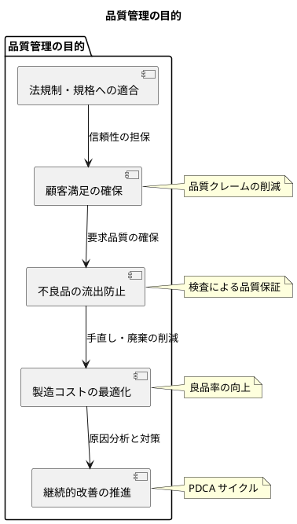

品質管理の重要性は以下の点にあります：

| 観点 | 説明 |
|-----|------|
| **顧客視点** | 不良品の流出は顧客の信頼を失い、ブランド価値を毀損する |
| **コスト視点** | 早期発見による手直しコスト削減、廃棄ロスの最小化 |
| **法的視点** | PL 法（製造物責任法）への対応、各種規格への適合 |
| **競争力視点** | 高品質は差別化要因となり、競争優位性を確保 |

### 検査の種類と位置づけ

製造プロセスにおける検査は、実施タイミングによって以下の3種類に分類されます。

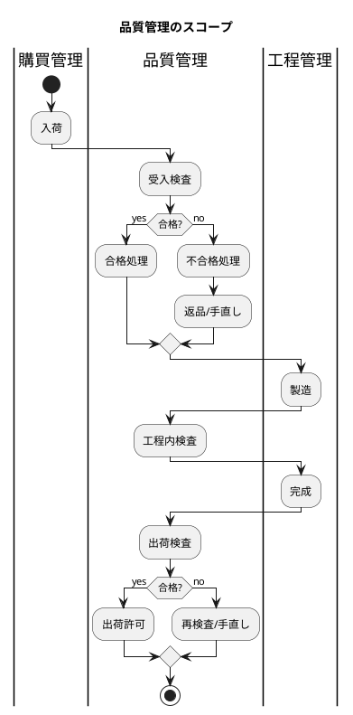

各検査の特徴と目的は以下の通りです：

| 検査種別 | タイミング | 目的 | 関連テーブル |
|---------|----------|------|------------|
| **受入検査** | 入荷後 | 購買品の品質確認、不良品の受入防止 | 受入検査データ |
| **工程内検査** | 製造中 | 製造工程での品質確認、早期不良発見 | 完成検査結果データ |
| **出荷検査** | 出荷前 | 最終品質確認、不良品の流出防止 | 出荷検査データ |

---

## 29.2 受入検査・工程検査・出荷検査

### 共通の検査判定

すべての検査で共通して使用する検査判定の列挙型を定義します。

#### 検査判定 Enum

<details>
<summary>InspectionJudgment.java</summary>

```java
// src/main/java/com/example/sms/domain/model/quality/InspectionJudgment.java
package com.example.pms.domain.model.quality;

/**
 * 検査判定
 */
public enum InspectionJudgment {
    PASSED("合格"),
    FAILED("不合格"),
    HOLD("保留");

    private final String displayName;

    InspectionJudgment(String displayName) {
        this.displayName = displayName;
    }

    public String getDisplayName() {
        return displayName;
    }

    public static InspectionJudgment fromDisplayName(String displayName) {
        for (InspectionJudgment judgment : values()) {
            if (judgment.displayName.equals(displayName)) {
                return judgment;
            }
        }
        throw new IllegalArgumentException("Unknown display name: " + displayName);
    }
}
```

</details>

#### 検査判定 TypeHandler

<details>
<summary>InspectionJudgmentTypeHandler.java</summary>

```java
// src/main/java/com/example/sms/infrastructure/out/persistence/typehandler/InspectionJudgmentTypeHandler.java
package com.example.pms.infrastructure.out.persistence.typehandler;

import com.example.pms.domain.model.quality.InspectionJudgment;
import org.apache.ibatis.type.BaseTypeHandler;
import org.apache.ibatis.type.JdbcType;
import org.apache.ibatis.type.MappedTypes;

import java.sql.CallableStatement;
import java.sql.PreparedStatement;
import java.sql.ResultSet;
import java.sql.SQLException;

/**
 * 検査判定のTypeHandler
 */
@MappedTypes(InspectionJudgment.class)
public class InspectionJudgmentTypeHandler extends BaseTypeHandler<InspectionJudgment> {

    @Override
    public void setNonNullParameter(PreparedStatement ps, int i,
                                    InspectionJudgment parameter, JdbcType jdbcType) throws SQLException {
        ps.setString(i, parameter.getDisplayName());
    }

    @Override
    public InspectionJudgment getNullableResult(ResultSet rs, String columnName) throws SQLException {
        String value = rs.getString(columnName);
        return value == null ? null : InspectionJudgment.fromDisplayName(value);
    }

    @Override
    public InspectionJudgment getNullableResult(ResultSet rs, int columnIndex) throws SQLException {
        String value = rs.getString(columnIndex);
        return value == null ? null : InspectionJudgment.fromDisplayName(value);
    }

    @Override
    public InspectionJudgment getNullableResult(CallableStatement cs, int columnIndex) throws SQLException {
        String value = cs.getString(columnIndex);
        return value == null ? null : InspectionJudgment.fromDisplayName(value);
    }
}
```

</details>

### 欠点マスタ

検査で発見された不良の種類を管理するマスタです。

#### 欠点マスタエンティティ

<details>
<summary>DefectMaster.java</summary>

```java
// src/main/java/com/example/sms/domain/model/quality/DefectMaster.java
package com.example.pms.domain.model.quality;

import lombok.*;
import java.time.LocalDateTime;

/**
 * 欠点マスタエンティティ
 */
@Data
@Builder
@NoArgsConstructor
@AllArgsConstructor
public class DefectMaster {
    private String defectCode;
    private String defectName;
    private String defectCategory;
    private LocalDateTime createdAt;
    private LocalDateTime updatedAt;
}
```

</details>

### 受入検査の設計（購買品の品質確認）

受入検査は、購買品が仕入先から入荷した際に実施する品質検査です。

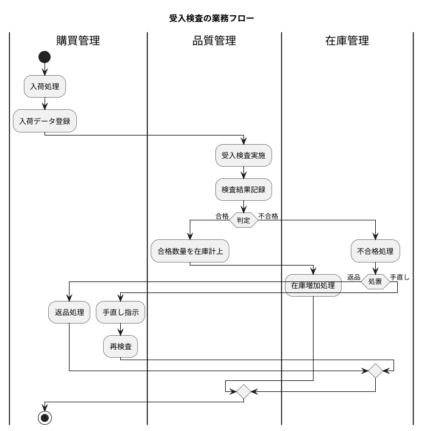

#### 受入検査データエンティティ

<details>
<summary>ReceivingInspection.java</summary>

```java
// src/main/java/com/example/sms/domain/model/quality/ReceivingInspection.java
package com.example.pms.domain.model.quality;

import lombok.*;
import java.math.BigDecimal;
import java.time.LocalDate;
import java.time.LocalDateTime;
import java.util.List;

/**
 * 受入検査データエンティティ
 */
@Data
@Builder
@NoArgsConstructor
@AllArgsConstructor
public class ReceivingInspection {
    private Integer id;
    private String inspectionNumber;
    private String receivingNumber;
    private String purchaseOrderNumber;
    private String itemCode;
    private String supplierCode;
    private LocalDate inspectionDate;
    private String inspectorCode;
    private BigDecimal inspectionQuantity;
    private BigDecimal passedQuantity;
    private BigDecimal failedQuantity;
    private InspectionJudgment judgment;
    private String remarks;
    private LocalDateTime createdAt;
    private LocalDateTime updatedAt;

    // 楽観ロック用バージョン
    @Builder.Default
    private Integer version = 1;

    // リレーション
    private Item item;
    private Supplier supplier;
    @Builder.Default
    private List<ReceivingInspectionResult> results = new ArrayList<>();
}
```

</details>

#### 受入検査結果データエンティティ

<details>
<summary>ReceivingInspectionResult.java</summary>

```java
// src/main/java/com/example/sms/domain/model/quality/ReceivingInspectionResult.java
package com.example.pms.domain.model.quality;

import lombok.*;
import java.math.BigDecimal;

/**
 * 受入検査結果データエンティティ.
 */
@Data
@Builder
@NoArgsConstructor
@AllArgsConstructor
public class ReceivingInspectionResult {
    private Integer id;
    private String inspectionNumber;
    private String defectCode;
    private BigDecimal quantity;
    private String remarks;

    // リレーション
    private Defect defect;
}
```

</details>

#### MyBatis Mapper XML：受入検査

<details>
<summary>ReceivingInspectionMapper.xml</summary>

```xml
<?xml version="1.0" encoding="UTF-8" ?>
<!DOCTYPE mapper PUBLIC "-//mybatis.org//DTD Mapper 3.0//EN"
        "http://mybatis.org/dtd/mybatis-3-mapper.dtd">
<mapper namespace="com.example.pms.infrastructure.out.persistence.mapper.ReceivingInspectionMapper">

    <resultMap id="ReceivingInspectionResultMap"
               type="com.example.pms.domain.model.quality.ReceivingInspection">
        <id property="id" column="ID"/>
        <result property="inspectionNumber" column="受入検査番号"/>
        <result property="receivingNumber" column="入荷番号"/>
        <result property="purchaseOrderNumber" column="発注番号"/>
        <result property="itemCode" column="品目コード"/>
        <result property="supplierCode" column="仕入先コード"/>
        <result property="inspectionDate" column="検査日"/>
        <result property="inspectorCode" column="検査担当者コード"/>
        <result property="inspectionQuantity" column="検査数量"/>
        <result property="passedQuantity" column="合格数"/>
        <result property="failedQuantity" column="不合格数"/>
        <result property="judgment" column="判定"
                typeHandler="com.example.pms.infrastructure.out.persistence.typehandler.InspectionJudgmentTypeHandler"/>
        <result property="remarks" column="備考"/>
        <result property="createdAt" column="作成日時"/>
        <result property="updatedAt" column="更新日時"/>
        <collection property="results" ofType="com.example.pms.domain.model.quality.ReceivingInspectionResult"
                    resultMap="ReceivingInspectionResultResultMap"/>
    </resultMap>

    <resultMap id="ReceivingInspectionResultResultMap"
               type="com.example.pms.domain.model.quality.ReceivingInspectionResult">
        <id property="id" column="RESULT_ID"/>
        <result property="inspectionNumber" column="受入検査番号"/>
        <result property="defectCode" column="欠点コード"/>
        <result property="quantity" column="数量"/>
        <result property="remarks" column="結果備考"/>
    </resultMap>

    <select id="findByInspectionNumber" resultMap="ReceivingInspectionResultMap">
        SELECT
            ri.*,
            rir."ID" AS RESULT_ID,
            rir."欠点コード",
            rir."数量",
            rir."備考" AS 結果備考
        FROM "受入検査データ" ri
        LEFT JOIN "受入検査結果データ" rir ON ri."受入検査番号" = rir."受入検査番号"
        WHERE ri."受入検査番号" = #{inspectionNumber}
    </select>

    <select id="findByReceivingNumber" resultMap="ReceivingInspectionResultMap">
        SELECT * FROM "受入検査データ"
        WHERE "入荷番号" = #{receivingNumber}
    </select>

    <select id="findBySupplierCode" resultMap="ReceivingInspectionResultMap">
        SELECT * FROM "受入検査データ"
        WHERE "仕入先コード" = #{supplierCode}
        ORDER BY "検査日" DESC
    </select>

    <insert id="insert" useGeneratedKeys="true" keyProperty="id" keyColumn="ID">
        INSERT INTO "受入検査データ" (
            "受入検査番号", "入荷番号", "発注番号", "品目コード",
            "仕入先コード", "検査日", "検査担当者コード",
            "検査数量", "合格数", "不合格数", "判定", "備考"
        ) VALUES (
            #{inspectionNumber}, #{receivingNumber}, #{purchaseOrderNumber}, #{itemCode},
            #{supplierCode}, #{inspectionDate}, #{inspectorCode},
            #{inspectionQuantity}, #{passedQuantity}, #{failedQuantity},
            #{judgment, typeHandler=com.example.pms.infrastructure.out.persistence.typehandler.InspectionJudgmentTypeHandler},
            #{remarks}
        )
    </insert>

    <insert id="insertResult" useGeneratedKeys="true" keyProperty="id" keyColumn="ID">
        INSERT INTO "受入検査結果データ" (
            "受入検査番号", "欠点コード", "数量", "備考"
        ) VALUES (
            #{inspectionNumber}, #{defectCode}, #{quantity}, #{remarks}
        )
    </insert>

    <update id="update">
        UPDATE "受入検査データ" SET
            "検査数量" = #{inspectionQuantity},
            "合格数" = #{passedQuantity},
            "不合格数" = #{failedQuantity},
            "判定" = #{judgment, typeHandler=com.example.pms.infrastructure.out.persistence.typehandler.InspectionJudgmentTypeHandler},
            "備考" = #{remarks},
            "更新日時" = CURRENT_TIMESTAMP
        WHERE "受入検査番号" = #{inspectionNumber}
    </update>

</mapper>
```

</details>

#### Flyway マイグレーション：受入検査

<details>
<summary>V029_1__create_receiving_inspection_tables.sql</summary>

```sql
-- V029_1__create_receiving_inspection_tables.sql

-- 検査判定 ENUM（共通）
CREATE TYPE "検査判定" AS ENUM ('合格', '不合格', '保留');

-- 欠点マスタ
CREATE TABLE "欠点マスタ" (
    "欠点コード" VARCHAR(20) PRIMARY KEY,
    "欠点名" VARCHAR(100) NOT NULL,
    "欠点分類" VARCHAR(50),
    "作成日時" TIMESTAMP DEFAULT CURRENT_TIMESTAMP NOT NULL,
    "更新日時" TIMESTAMP DEFAULT CURRENT_TIMESTAMP NOT NULL
);

COMMENT ON TABLE "欠点マスタ" IS '欠点マスタ';
COMMENT ON COLUMN "欠点マスタ"."欠点コード" IS '欠点コード';
COMMENT ON COLUMN "欠点マスタ"."欠点名" IS '欠点名';
COMMENT ON COLUMN "欠点マスタ"."欠点分類" IS '欠点分類（外観/寸法/機能など）';

-- 受入検査データ
CREATE TABLE "受入検査データ" (
    "ID" SERIAL PRIMARY KEY,
    "受入検査番号" VARCHAR(20) UNIQUE NOT NULL,
    "入荷番号" VARCHAR(20) NOT NULL,
    "発注番号" VARCHAR(20) NOT NULL,
    "品目コード" VARCHAR(20) NOT NULL,
    "仕入先コード" VARCHAR(20) NOT NULL,
    "検査日" DATE NOT NULL,
    "検査担当者コード" VARCHAR(20) NOT NULL,
    "検査数量" DECIMAL(15, 2) NOT NULL,
    "合格数" DECIMAL(15, 2) NOT NULL,
    "不合格数" DECIMAL(15, 2) NOT NULL,
    "判定" "検査判定" NOT NULL,
    "備考" VARCHAR(500),
    "作成日時" TIMESTAMP DEFAULT CURRENT_TIMESTAMP NOT NULL,
    "更新日時" TIMESTAMP DEFAULT CURRENT_TIMESTAMP NOT NULL,
    CONSTRAINT "FK_受入検査_品目" FOREIGN KEY ("品目コード")
        REFERENCES "品目マスタ"("品目コード"),
    CONSTRAINT "FK_受入検査_仕入先" FOREIGN KEY ("仕入先コード")
        REFERENCES "仕入先マスタ"("仕入先コード")
);

COMMENT ON TABLE "受入検査データ" IS '受入検査データ';
COMMENT ON COLUMN "受入検査データ"."受入検査番号" IS '受入検査番号';
COMMENT ON COLUMN "受入検査データ"."入荷番号" IS '入荷番号';
COMMENT ON COLUMN "受入検査データ"."判定" IS '検査判定（合格/不合格/保留）';

-- 受入検査結果データ
CREATE TABLE "受入検査結果データ" (
    "ID" SERIAL PRIMARY KEY,
    "受入検査番号" VARCHAR(20) NOT NULL,
    "欠点コード" VARCHAR(20) NOT NULL,
    "数量" DECIMAL(15, 2) NOT NULL,
    "備考" VARCHAR(500),
    CONSTRAINT "UK_受入検査結果" UNIQUE ("受入検査番号", "欠点コード"),
    CONSTRAINT "FK_受入検査結果_受入検査" FOREIGN KEY ("受入検査番号")
        REFERENCES "受入検査データ"("受入検査番号"),
    CONSTRAINT "FK_受入検査結果_欠点" FOREIGN KEY ("欠点コード")
        REFERENCES "欠点マスタ"("欠点コード")
);

COMMENT ON TABLE "受入検査結果データ" IS '受入検査結果データ';

-- インデックス
CREATE INDEX "IDX_受入検査_入荷番号" ON "受入検査データ" ("入荷番号");
CREATE INDEX "IDX_受入検査_仕入先" ON "受入検査データ" ("仕入先コード");
CREATE INDEX "IDX_受入検査_検査日" ON "受入検査データ" ("検査日");
```

</details>

#### 受入検査の ER 図

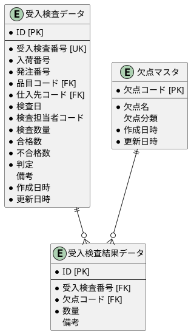

### 工程検査の設計（製造中の品質確認）

工程検査は、製造工程の途中で実施する品質検査です。製造工程で品質問題を早期発見し、不良品の大量発生を防止します。

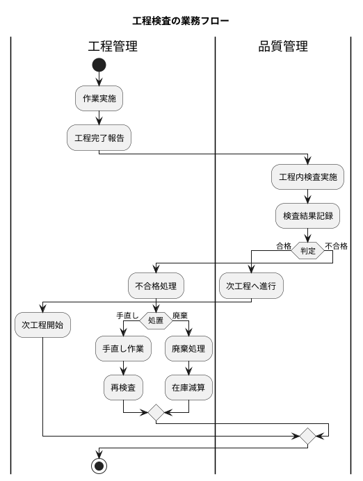

#### 工程検査データエンティティ

<details>
<summary>ProcessInspection.java</summary>

```java
// src/main/java/com/example/sms/domain/model/quality/ProcessInspection.java
package com.example.pms.domain.model.quality;

import lombok.*;
import java.math.BigDecimal;
import java.time.LocalDate;
import java.time.LocalDateTime;
import java.util.List;

/**
 * 工程検査データエンティティ.
 */
@Data
@Builder
@NoArgsConstructor
@AllArgsConstructor
public class ProcessInspection {
    private Integer id;
    private String inspectionNumber;
    private String workOrderNumber;
    private String processCode;
    private String itemCode;
    private LocalDate inspectionDate;
    private String inspectorCode;
    private BigDecimal inspectionQuantity;
    private BigDecimal passedQuantity;
    private BigDecimal failedQuantity;
    private InspectionJudgment judgment;
    private String remarks;
    private LocalDateTime createdAt;
    private LocalDateTime updatedAt;

    // 楽観ロック用バージョン
    @Builder.Default
    private Integer version = 1;

    // リレーション
    private Item item;
    private Process process;
    @Builder.Default
    private List<ProcessInspectionResult> results = new ArrayList<>();
}
```

</details>

#### 工程検査結果データエンティティ

<details>
<summary>ProcessInspectionResult.java</summary>

```java
// src/main/java/com/example/sms/domain/model/quality/ProcessInspectionResult.java
package com.example.pms.domain.model.quality;

import lombok.*;
import java.math.BigDecimal;

/**
 * 工程検査結果データエンティティ.
 */
@Data
@Builder
@NoArgsConstructor
@AllArgsConstructor
public class ProcessInspectionResult {
    private Integer id;
    private String inspectionNumber;
    private String defectCode;
    private BigDecimal quantity;
    private String remarks;

    // リレーション
    private Defect defect;
}
```

</details>

#### MyBatis Mapper XML：工程検査

<details>
<summary>ProcessInspectionMapper.xml</summary>

```xml
<?xml version="1.0" encoding="UTF-8" ?>
<!DOCTYPE mapper PUBLIC "-//mybatis.org//DTD Mapper 3.0//EN"
        "http://mybatis.org/dtd/mybatis-3-mapper.dtd">
<mapper namespace="com.example.pms.infrastructure.out.persistence.mapper.ProcessInspectionMapper">

    <resultMap id="ProcessInspectionResultMap"
               type="com.example.pms.domain.model.quality.ProcessInspection">
        <id property="id" column="ID"/>
        <result property="inspectionNumber" column="工程検査番号"/>
        <result property="workOrderNumber" column="作業指示番号"/>
        <result property="processCode" column="工程コード"/>
        <result property="itemCode" column="品目コード"/>
        <result property="inspectionDate" column="検査日"/>
        <result property="inspectorCode" column="検査担当者コード"/>
        <result property="inspectionQuantity" column="検査数量"/>
        <result property="passedQuantity" column="合格数"/>
        <result property="failedQuantity" column="不合格数"/>
        <result property="judgment" column="判定"
                typeHandler="com.example.pms.infrastructure.out.persistence.typehandler.InspectionJudgmentTypeHandler"/>
        <result property="remarks" column="備考"/>
        <result property="createdAt" column="作成日時"/>
        <result property="updatedAt" column="更新日時"/>
        <collection property="results" ofType="com.example.pms.domain.model.quality.ProcessInspectionResult"
                    resultMap="ProcessInspectionResultResultMap"/>
    </resultMap>

    <resultMap id="ProcessInspectionResultResultMap"
               type="com.example.pms.domain.model.quality.ProcessInspectionResult">
        <id property="id" column="RESULT_ID"/>
        <result property="inspectionNumber" column="工程検査番号"/>
        <result property="defectCode" column="欠点コード"/>
        <result property="quantity" column="数量"/>
        <result property="remarks" column="結果備考"/>
    </resultMap>

    <select id="findByInspectionNumber" resultMap="ProcessInspectionResultMap">
        SELECT
            pi.*,
            pir."ID" AS RESULT_ID,
            pir."欠点コード",
            pir."数量",
            pir."備考" AS 結果備考
        FROM "工程検査データ" pi
        LEFT JOIN "工程検査結果データ" pir ON pi."工程検査番号" = pir."工程検査番号"
        WHERE pi."工程検査番号" = #{inspectionNumber}
    </select>

    <select id="findByWorkOrderNumber" resultMap="ProcessInspectionResultMap">
        SELECT * FROM "工程検査データ"
        WHERE "作業指示番号" = #{workOrderNumber}
        ORDER BY "検査日" ASC
    </select>

    <select id="findByProcessCode" resultMap="ProcessInspectionResultMap">
        SELECT * FROM "工程検査データ"
        WHERE "工程コード" = #{processCode}
        ORDER BY "検査日" DESC
    </select>

    <insert id="insert" useGeneratedKeys="true" keyProperty="id" keyColumn="ID">
        INSERT INTO "工程検査データ" (
            "工程検査番号", "作業指示番号", "工程コード", "品目コード",
            "検査日", "検査担当者コード",
            "検査数量", "合格数", "不合格数", "判定", "備考"
        ) VALUES (
            #{inspectionNumber}, #{workOrderNumber}, #{processCode}, #{itemCode},
            #{inspectionDate}, #{inspectorCode},
            #{inspectionQuantity}, #{passedQuantity}, #{failedQuantity},
            #{judgment, typeHandler=com.example.pms.infrastructure.out.persistence.typehandler.InspectionJudgmentTypeHandler},
            #{remarks}
        )
    </insert>

    <insert id="insertResult" useGeneratedKeys="true" keyProperty="id" keyColumn="ID">
        INSERT INTO "工程検査結果データ" (
            "工程検査番号", "欠点コード", "数量", "備考"
        ) VALUES (
            #{inspectionNumber}, #{defectCode}, #{quantity}, #{remarks}
        )
    </insert>

    <update id="update">
        UPDATE "工程検査データ" SET
            "検査数量" = #{inspectionQuantity},
            "合格数" = #{passedQuantity},
            "不合格数" = #{failedQuantity},
            "判定" = #{judgment, typeHandler=com.example.pms.infrastructure.out.persistence.typehandler.InspectionJudgmentTypeHandler},
            "備考" = #{remarks},
            "更新日時" = CURRENT_TIMESTAMP
        WHERE "工程検査番号" = #{inspectionNumber}
    </update>

</mapper>
```

</details>

#### Flyway マイグレーション：工程検査

<details>
<summary>V029_2__create_process_inspection_tables.sql</summary>

```sql
-- V029_2__create_process_inspection_tables.sql

-- 工程検査データ
CREATE TABLE "工程検査データ" (
    "ID" SERIAL PRIMARY KEY,
    "工程検査番号" VARCHAR(20) UNIQUE NOT NULL,
    "作業指示番号" VARCHAR(20) NOT NULL,
    "工程コード" VARCHAR(20) NOT NULL,
    "品目コード" VARCHAR(20) NOT NULL,
    "検査日" DATE NOT NULL,
    "検査担当者コード" VARCHAR(20) NOT NULL,
    "検査数量" DECIMAL(15, 2) NOT NULL,
    "合格数" DECIMAL(15, 2) NOT NULL,
    "不合格数" DECIMAL(15, 2) NOT NULL,
    "判定" "検査判定" NOT NULL,
    "備考" VARCHAR(500),
    "作成日時" TIMESTAMP DEFAULT CURRENT_TIMESTAMP NOT NULL,
    "更新日時" TIMESTAMP DEFAULT CURRENT_TIMESTAMP NOT NULL,
    CONSTRAINT "FK_工程検査_作業指示" FOREIGN KEY ("作業指示番号")
        REFERENCES "作業指示データ"("作業指示番号"),
    CONSTRAINT "FK_工程検査_工程" FOREIGN KEY ("工程コード")
        REFERENCES "工程マスタ"("工程コード"),
    CONSTRAINT "FK_工程検査_品目" FOREIGN KEY ("品目コード")
        REFERENCES "品目マスタ"("品目コード")
);

COMMENT ON TABLE "工程検査データ" IS '工程検査データ';
COMMENT ON COLUMN "工程検査データ"."工程検査番号" IS '工程検査番号';
COMMENT ON COLUMN "工程検査データ"."作業指示番号" IS '作業指示番号';
COMMENT ON COLUMN "工程検査データ"."工程コード" IS '検査対象工程';

-- 工程検査結果データ
CREATE TABLE "工程検査結果データ" (
    "ID" SERIAL PRIMARY KEY,
    "工程検査番号" VARCHAR(20) NOT NULL,
    "欠点コード" VARCHAR(20) NOT NULL,
    "数量" DECIMAL(15, 2) NOT NULL,
    "備考" VARCHAR(500),
    CONSTRAINT "UK_工程検査結果" UNIQUE ("工程検査番号", "欠点コード"),
    CONSTRAINT "FK_工程検査結果_工程検査" FOREIGN KEY ("工程検査番号")
        REFERENCES "工程検査データ"("工程検査番号"),
    CONSTRAINT "FK_工程検査結果_欠点" FOREIGN KEY ("欠点コード")
        REFERENCES "欠点マスタ"("欠点コード")
);

COMMENT ON TABLE "工程検査結果データ" IS '工程検査結果データ';

-- インデックス
CREATE INDEX "IDX_工程検査_作業指示" ON "工程検査データ" ("作業指示番号");
CREATE INDEX "IDX_工程検査_工程" ON "工程検査データ" ("工程コード");
CREATE INDEX "IDX_工程検査_検査日" ON "工程検査データ" ("検査日");
```

</details>

#### 工程検査の ER 図

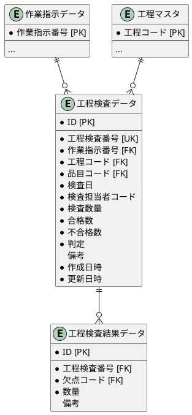

### 出荷検査の設計（出荷前の品質確認）

出荷検査は、製品を顧客に出荷する前に実施する最終品質検査です。不良品の流出を防止する最後の砦となります。

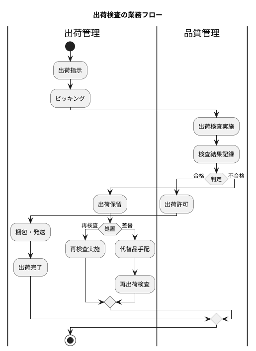

#### 出荷検査データエンティティ

<details>
<summary>ShipmentInspection.java</summary>

```java
// src/main/java/com/example/sms/domain/model/quality/ShipmentInspection.java
package com.example.pms.domain.model.quality;

import lombok.*;
import java.math.BigDecimal;
import java.time.LocalDate;
import java.time.LocalDateTime;
import java.util.List;

/**
 * 出荷検査データエンティティ.
 */
@Data
@Builder
@NoArgsConstructor
@AllArgsConstructor
public class ShipmentInspection {
    private Integer id;
    private String inspectionNumber;
    private String shipmentNumber;
    private String itemCode;
    private LocalDate inspectionDate;
    private String inspectorCode;
    private BigDecimal inspectionQuantity;
    private BigDecimal passedQuantity;
    private BigDecimal failedQuantity;
    private InspectionJudgment judgment;
    private String remarks;
    private LocalDateTime createdAt;
    private LocalDateTime updatedAt;

    // 楽観ロック用バージョン
    @Builder.Default
    private Integer version = 1;

    // リレーション
    private Item item;
    @Builder.Default
    private List<ShipmentInspectionResult> results = new ArrayList<>();
}
```

</details>

#### 出荷検査結果データエンティティ

<details>
<summary>ShipmentInspectionResult.java</summary>

```java
// src/main/java/com/example/sms/domain/model/quality/ShipmentInspectionResult.java
package com.example.pms.domain.model.quality;

import lombok.*;
import java.math.BigDecimal;

/**
 * 出荷検査結果データエンティティ.
 */
@Data
@Builder
@NoArgsConstructor
@AllArgsConstructor
public class ShipmentInspectionResult {
    private Integer id;
    private String inspectionNumber;
    private String defectCode;
    private BigDecimal quantity;
    private String remarks;

    // リレーション
    private Defect defect;
}
```

</details>

#### MyBatis Mapper XML：出荷検査

<details>
<summary>ShipmentInspectionMapper.xml</summary>

```xml
<?xml version="1.0" encoding="UTF-8" ?>
<!DOCTYPE mapper PUBLIC "-//mybatis.org//DTD Mapper 3.0//EN"
        "http://mybatis.org/dtd/mybatis-3-mapper.dtd">
<mapper namespace="com.example.pms.infrastructure.out.persistence.mapper.ShipmentInspectionMapper">

    <resultMap id="ShipmentInspectionResultMap"
               type="com.example.pms.domain.model.quality.ShipmentInspection">
        <id property="id" column="ID"/>
        <result property="inspectionNumber" column="出荷検査番号"/>
        <result property="shipmentNumber" column="出荷番号"/>
        <result property="itemCode" column="品目コード"/>
        <result property="inspectionDate" column="検査日"/>
        <result property="inspectorCode" column="検査担当者コード"/>
        <result property="inspectionQuantity" column="検査数量"/>
        <result property="passedQuantity" column="合格数"/>
        <result property="failedQuantity" column="不合格数"/>
        <result property="judgment" column="判定"
                typeHandler="com.example.pms.infrastructure.out.persistence.typehandler.InspectionJudgmentTypeHandler"/>
        <result property="remarks" column="備考"/>
        <result property="createdAt" column="作成日時"/>
        <result property="updatedAt" column="更新日時"/>
        <collection property="results" ofType="com.example.pms.domain.model.quality.ShipmentInspectionResult"
                    resultMap="ShipmentInspectionResultResultMap"/>
    </resultMap>

    <resultMap id="ShipmentInspectionResultResultMap"
               type="com.example.pms.domain.model.quality.ShipmentInspectionResult">
        <id property="id" column="RESULT_ID"/>
        <result property="inspectionNumber" column="出荷検査番号"/>
        <result property="defectCode" column="欠点コード"/>
        <result property="quantity" column="数量"/>
        <result property="remarks" column="結果備考"/>
    </resultMap>

    <select id="findByInspectionNumber" resultMap="ShipmentInspectionResultMap">
        SELECT
            si.*,
            sir."ID" AS RESULT_ID,
            sir."欠点コード",
            sir."数量",
            sir."備考" AS 結果備考
        FROM "出荷検査データ" si
        LEFT JOIN "出荷検査結果データ" sir ON si."出荷検査番号" = sir."出荷検査番号"
        WHERE si."出荷検査番号" = #{inspectionNumber}
    </select>

    <select id="findByShipmentNumber" resultMap="ShipmentInspectionResultMap">
        SELECT * FROM "出荷検査データ"
        WHERE "出荷番号" = #{shipmentNumber}
    </select>

    <insert id="insert" useGeneratedKeys="true" keyProperty="id" keyColumn="ID">
        INSERT INTO "出荷検査データ" (
            "出荷検査番号", "出荷番号", "品目コード", "検査日",
            "検査担当者コード", "検査数量", "合格数", "不合格数", "判定", "備考"
        ) VALUES (
            #{inspectionNumber}, #{shipmentNumber}, #{itemCode}, #{inspectionDate},
            #{inspectorCode}, #{inspectionQuantity}, #{passedQuantity}, #{failedQuantity},
            #{judgment, typeHandler=com.example.pms.infrastructure.out.persistence.typehandler.InspectionJudgmentTypeHandler},
            #{remarks}
        )
    </insert>

    <insert id="insertResult" useGeneratedKeys="true" keyProperty="id" keyColumn="ID">
        INSERT INTO "出荷検査結果データ" (
            "出荷検査番号", "欠点コード", "数量", "備考"
        ) VALUES (
            #{inspectionNumber}, #{defectCode}, #{quantity}, #{remarks}
        )
    </insert>

    <update id="update">
        UPDATE "出荷検査データ" SET
            "検査数量" = #{inspectionQuantity},
            "合格数" = #{passedQuantity},
            "不合格数" = #{failedQuantity},
            "判定" = #{judgment, typeHandler=com.example.pms.infrastructure.out.persistence.typehandler.InspectionJudgmentTypeHandler},
            "備考" = #{remarks},
            "更新日時" = CURRENT_TIMESTAMP
        WHERE "出荷検査番号" = #{inspectionNumber}
    </update>

</mapper>
```

</details>

#### Flyway マイグレーション：出荷検査

<details>
<summary>V029_3__create_shipment_inspection_tables.sql</summary>

```sql
-- V029_3__create_shipment_inspection_tables.sql

-- 出荷検査データ
CREATE TABLE "出荷検査データ" (
    "ID" SERIAL PRIMARY KEY,
    "出荷検査番号" VARCHAR(20) UNIQUE NOT NULL,
    "出荷番号" VARCHAR(20) NOT NULL,
    "品目コード" VARCHAR(20) NOT NULL,
    "検査日" DATE NOT NULL,
    "検査担当者コード" VARCHAR(20) NOT NULL,
    "検査数量" DECIMAL(15, 2) NOT NULL,
    "合格数" DECIMAL(15, 2) NOT NULL,
    "不合格数" DECIMAL(15, 2) NOT NULL,
    "判定" "検査判定" NOT NULL,
    "備考" VARCHAR(500),
    "作成日時" TIMESTAMP DEFAULT CURRENT_TIMESTAMP NOT NULL,
    "更新日時" TIMESTAMP DEFAULT CURRENT_TIMESTAMP NOT NULL,
    CONSTRAINT "FK_出荷検査_品目" FOREIGN KEY ("品目コード")
        REFERENCES "品目マスタ"("品目コード")
);

COMMENT ON TABLE "出荷検査データ" IS '出荷検査データ';
COMMENT ON COLUMN "出荷検査データ"."出荷検査番号" IS '出荷検査番号';
COMMENT ON COLUMN "出荷検査データ"."出荷番号" IS '出荷番号';
COMMENT ON COLUMN "出荷検査データ"."判定" IS '検査判定（合格/不合格/保留）';

-- 出荷検査結果データ
CREATE TABLE "出荷検査結果データ" (
    "ID" SERIAL PRIMARY KEY,
    "出荷検査番号" VARCHAR(20) NOT NULL,
    "欠点コード" VARCHAR(20) NOT NULL,
    "数量" DECIMAL(15, 2) NOT NULL,
    "備考" VARCHAR(500),
    CONSTRAINT "UK_出荷検査結果" UNIQUE ("出荷検査番号", "欠点コード"),
    CONSTRAINT "FK_出荷検査結果_出荷検査" FOREIGN KEY ("出荷検査番号")
        REFERENCES "出荷検査データ"("出荷検査番号"),
    CONSTRAINT "FK_出荷検査結果_欠点" FOREIGN KEY ("欠点コード")
        REFERENCES "欠点マスタ"("欠点コード")
);

COMMENT ON TABLE "出荷検査結果データ" IS '出荷検査結果データ';

-- インデックス
CREATE INDEX "IDX_出荷検査_出荷番号" ON "出荷検査データ" ("出荷番号");
CREATE INDEX "IDX_出荷検査_検査日" ON "出荷検査データ" ("検査日");
```

</details>

#### 出荷検査の ER 図

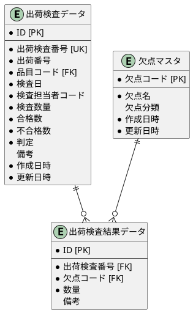

### トレーサビリティ（ロット追跡・履歴管理）

製造業におけるトレーサビリティは、製品の製造履歴を追跡可能にする仕組みです。品質問題が発生した際に、原因究明と影響範囲の特定を可能にします。

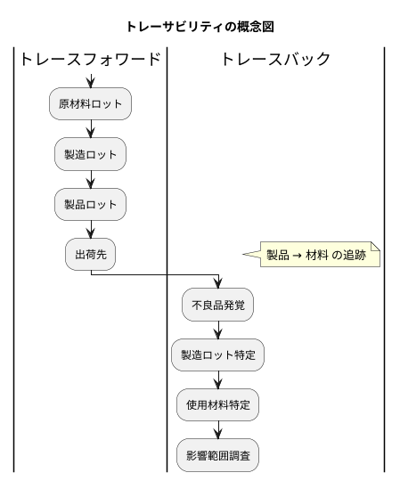

#### トレーサビリティの種類

| 種類 | 説明 | 用途 |
|-----|------|-----|
| **トレースフォワード** | 材料から製品への追跡 | 不良材料を使用した製品の特定 |
| **トレースバック** | 製品から材料への追跡 | 不良製品の原因究明 |

#### ロット種別 Enum

<details>
<summary>LotType.java</summary>

```java
// src/main/java/com/example/sms/domain/model/quality/LotType.java
package com.example.pms.domain.model.quality;

/**
 * ロット種別
 */
public enum LotType {
    PURCHASED("購入ロット"),
    MANUFACTURED("製造ロット");

    private final String displayName;

    LotType(String displayName) {
        this.displayName = displayName;
    }

    public String getDisplayName() {
        return displayName;
    }

    public static LotType fromDisplayName(String displayName) {
        for (LotType type : values()) {
            if (type.displayName.equals(displayName)) {
                return type;
            }
        }
        throw new IllegalArgumentException("Unknown display name: " + displayName);
    }
}
```

</details>

#### ロット種別 TypeHandler

<details>
<summary>LotTypeTypeHandler.java</summary>

```java
// src/main/java/com/example/sms/infrastructure/out/persistence/typehandler/LotTypeTypeHandler.java
package com.example.pms.infrastructure.out.persistence.typehandler;

import com.example.pms.domain.model.quality.LotType;
import org.apache.ibatis.type.BaseTypeHandler;
import org.apache.ibatis.type.JdbcType;
import org.apache.ibatis.type.MappedTypes;

import java.sql.CallableStatement;
import java.sql.PreparedStatement;
import java.sql.ResultSet;
import java.sql.SQLException;

/**
 * ロット種別のTypeHandler
 */
@MappedTypes(LotType.class)
public class LotTypeTypeHandler extends BaseTypeHandler<LotType> {

    @Override
    public void setNonNullParameter(PreparedStatement ps, int i,
                                    LotType parameter, JdbcType jdbcType) throws SQLException {
        ps.setString(i, parameter.getDisplayName());
    }

    @Override
    public LotType getNullableResult(ResultSet rs, String columnName) throws SQLException {
        String value = rs.getString(columnName);
        return value == null ? null : LotType.fromDisplayName(value);
    }

    @Override
    public LotType getNullableResult(ResultSet rs, int columnIndex) throws SQLException {
        String value = rs.getString(columnIndex);
        return value == null ? null : LotType.fromDisplayName(value);
    }

    @Override
    public LotType getNullableResult(CallableStatement cs, int columnIndex) throws SQLException {
        String value = cs.getString(columnIndex);
        return value == null ? null : LotType.fromDisplayName(value);
    }
}
```

</details>

#### ロットマスタエンティティ

<details>
<summary>LotMaster.java</summary>

```java
// src/main/java/com/example/sms/domain/model/quality/LotMaster.java
package com.example.pms.domain.model.quality;

import lombok.*;
import java.math.BigDecimal;
import java.time.LocalDate;
import java.time.LocalDateTime;
import java.util.List;

/**
 * ロットマスタエンティティ.
 */
@Data
@Builder
@NoArgsConstructor
@AllArgsConstructor
public class LotMaster {
    private Integer id;
    private String lotNumber;
    private String itemCode;
    private LotType lotType;
    private LocalDate manufactureDate;
    private LocalDate expirationDate;
    private BigDecimal quantity;
    private String warehouseCode;
    private String remarks;
    private LocalDateTime createdAt;
    private LocalDateTime updatedAt;

    // 楽観ロック用バージョン
    @Builder.Default
    private Integer version = 1;

    // リレーション
    private Item item;
    @Builder.Default
    private List<LotComposition> parentLotRelations = new ArrayList<>();
    @Builder.Default
    private List<LotComposition> childLotRelations = new ArrayList<>();

    /**
     * 有効期限が切れているかチェック.
     *
     * @return 有効期限切れの場合 true
     */
    public boolean isExpired() {
        return expirationDate != null && expirationDate.isBefore(LocalDate.now());
    }
}
```

</details>

#### ロット構成エンティティ

<details>
<summary>LotComposition.java</summary>

```java
// src/main/java/com/example/sms/domain/model/quality/LotComposition.java
package com.example.pms.domain.model.quality;

import lombok.*;
import java.math.BigDecimal;
import java.time.LocalDateTime;

/**
 * ロット構成エンティティ.
 * 親子ロット間の関係を管理（トレーサビリティ用）
 */
@Data
@Builder
@NoArgsConstructor
@AllArgsConstructor
public class LotComposition {
    private Integer id;
    private String parentLotNumber;
    private String childLotNumber;
    private BigDecimal usedQuantity;
    private LocalDateTime createdAt;
}
```

</details>

#### MyBatis Mapper XML：ロット管理

<details>
<summary>LotMapper.xml</summary>

```xml
<?xml version="1.0" encoding="UTF-8" ?>
<!DOCTYPE mapper PUBLIC "-//mybatis.org//DTD Mapper 3.0//EN"
        "http://mybatis.org/dtd/mybatis-3-mapper.dtd">
<mapper namespace="com.example.pms.infrastructure.out.persistence.mapper.LotMapper">

    <resultMap id="LotMasterResultMap" type="com.example.pms.domain.model.quality.LotMaster">
        <id property="id" column="ID"/>
        <result property="lotNumber" column="ロット番号"/>
        <result property="itemCode" column="品目コード"/>
        <result property="lotType" column="ロット種別"
                typeHandler="com.example.pms.infrastructure.out.persistence.typehandler.LotTypeTypeHandler"/>
        <result property="manufactureDate" column="製造日"/>
        <result property="expirationDate" column="有効期限"/>
        <result property="quantity" column="数量"/>
        <result property="warehouseCode" column="倉庫コード"/>
        <result property="remarks" column="備考"/>
        <result property="createdAt" column="作成日時"/>
        <result property="updatedAt" column="更新日時"/>
    </resultMap>

    <resultMap id="LotCompositionResultMap" type="com.example.pms.domain.model.quality.LotComposition">
        <id property="id" column="ID"/>
        <result property="parentLotNumber" column="親ロット番号"/>
        <result property="childLotNumber" column="子ロット番号"/>
        <result property="usedQuantity" column="使用数量"/>
        <result property="createdAt" column="作成日時"/>
    </resultMap>

    <select id="findByLotNumber" resultMap="LotMasterResultMap">
        SELECT * FROM "ロットマスタ"
        WHERE "ロット番号" = #{lotNumber}
    </select>

    <select id="findByItemCode" resultMap="LotMasterResultMap">
        SELECT * FROM "ロットマスタ"
        WHERE "品目コード" = #{itemCode}
        ORDER BY "製造日" DESC
    </select>

    <select id="findChildLots" resultMap="LotCompositionResultMap">
        SELECT * FROM "ロット構成"
        WHERE "親ロット番号" = #{parentLotNumber}
    </select>

    <select id="findParentLots" resultMap="LotCompositionResultMap">
        SELECT * FROM "ロット構成"
        WHERE "子ロット番号" = #{childLotNumber}
    </select>

    <!-- トレースフォワード: 子ロットから製造ロット、出荷先を追跡 -->
    <select id="traceForward" resultMap="LotMasterResultMap">
        WITH RECURSIVE lot_tree AS (
            SELECT lm.*, 0 AS level
            FROM "ロットマスタ" lm
            WHERE lm."ロット番号" = #{lotNumber}

            UNION ALL

            SELECT lm.*, lt.level + 1
            FROM "ロットマスタ" lm
            JOIN "ロット構成" lc ON lm."ロット番号" = lc."親ロット番号"
            JOIN lot_tree lt ON lc."子ロット番号" = lt."ロット番号"
            WHERE lt.level &lt; 10
        )
        SELECT * FROM lot_tree
        ORDER BY level ASC
    </select>

    <!-- トレースバック: 親ロットから材料ロットを追跡 -->
    <select id="traceBack" resultMap="LotMasterResultMap">
        WITH RECURSIVE lot_tree AS (
            SELECT lm.*, 0 AS level
            FROM "ロットマスタ" lm
            WHERE lm."ロット番号" = #{lotNumber}

            UNION ALL

            SELECT lm.*, lt.level + 1
            FROM "ロットマスタ" lm
            JOIN "ロット構成" lc ON lm."ロット番号" = lc."子ロット番号"
            JOIN lot_tree lt ON lc."親ロット番号" = lt."ロット番号"
            WHERE lt.level &lt; 10
        )
        SELECT * FROM lot_tree
        ORDER BY level ASC
    </select>

    <insert id="insert" useGeneratedKeys="true" keyProperty="id" keyColumn="ID">
        INSERT INTO "ロットマスタ" (
            "ロット番号", "品目コード", "ロット種別",
            "製造日", "有効期限", "数量", "倉庫コード", "備考"
        ) VALUES (
            #{lotNumber}, #{itemCode},
            #{lotType, typeHandler=com.example.pms.infrastructure.out.persistence.typehandler.LotTypeTypeHandler},
            #{manufactureDate}, #{expirationDate}, #{quantity}, #{warehouseCode}, #{remarks}
        )
    </insert>

    <insert id="insertComposition" useGeneratedKeys="true" keyProperty="id" keyColumn="ID">
        INSERT INTO "ロット構成" (
            "親ロット番号", "子ロット番号", "使用数量"
        ) VALUES (
            #{parentLotNumber}, #{childLotNumber}, #{usedQuantity}
        )
    </insert>

    <update id="update">
        UPDATE "ロットマスタ" SET
            "数量" = #{quantity},
            "倉庫コード" = #{warehouseCode},
            "備考" = #{remarks},
            "更新日時" = CURRENT_TIMESTAMP
        WHERE "ロット番号" = #{lotNumber}
    </update>

</mapper>
```

</details>

#### Flyway マイグレーション：ロット管理

<details>
<summary>V029_4__create_lot_tables.sql</summary>

```sql
-- V029_4__create_lot_tables.sql

-- ロット種別 ENUM
CREATE TYPE "ロット種別" AS ENUM ('購入ロット', '製造ロット');

-- ロットマスタ
CREATE TABLE "ロットマスタ" (
    "ID" SERIAL PRIMARY KEY,
    "ロット番号" VARCHAR(30) UNIQUE NOT NULL,
    "品目コード" VARCHAR(20) NOT NULL,
    "ロット種別" "ロット種別" NOT NULL,
    "製造日" DATE,
    "有効期限" DATE,
    "数量" DECIMAL(15, 2) NOT NULL,
    "倉庫コード" VARCHAR(20),
    "備考" VARCHAR(500),
    "作成日時" TIMESTAMP DEFAULT CURRENT_TIMESTAMP NOT NULL,
    "更新日時" TIMESTAMP DEFAULT CURRENT_TIMESTAMP NOT NULL,
    CONSTRAINT "FK_ロット_品目" FOREIGN KEY ("品目コード")
        REFERENCES "品目マスタ"("品目コード")
);

COMMENT ON TABLE "ロットマスタ" IS 'ロットマスタ';
COMMENT ON COLUMN "ロットマスタ"."ロット番号" IS 'ロット番号';
COMMENT ON COLUMN "ロットマスタ"."ロット種別" IS 'ロット種別（購入ロット/製造ロット）';
COMMENT ON COLUMN "ロットマスタ"."製造日" IS '製造日（購入ロットの場合は入荷日）';
COMMENT ON COLUMN "ロットマスタ"."有効期限" IS '有効期限（賞味期限、使用期限など）';

-- ロット構成（トレーサビリティ用）
CREATE TABLE "ロット構成" (
    "ID" SERIAL PRIMARY KEY,
    "親ロット番号" VARCHAR(30) NOT NULL,
    "子ロット番号" VARCHAR(30) NOT NULL,
    "使用数量" DECIMAL(15, 2) NOT NULL,
    "作成日時" TIMESTAMP DEFAULT CURRENT_TIMESTAMP NOT NULL,
    CONSTRAINT "UK_ロット構成" UNIQUE ("親ロット番号", "子ロット番号"),
    CONSTRAINT "FK_ロット構成_親" FOREIGN KEY ("親ロット番号")
        REFERENCES "ロットマスタ"("ロット番号"),
    CONSTRAINT "FK_ロット構成_子" FOREIGN KEY ("子ロット番号")
        REFERENCES "ロットマスタ"("ロット番号")
);

COMMENT ON TABLE "ロット構成" IS 'ロット構成（トレーサビリティ用）';
COMMENT ON COLUMN "ロット構成"."親ロット番号" IS '製造ロット（製品側）';
COMMENT ON COLUMN "ロット構成"."子ロット番号" IS '消費ロット（材料側）';
COMMENT ON COLUMN "ロット構成"."使用数量" IS '製造に使用した数量';

-- インデックス
CREATE INDEX "IDX_ロット_品目" ON "ロットマスタ" ("品目コード");
CREATE INDEX "IDX_ロット_製造日" ON "ロットマスタ" ("製造日");
CREATE INDEX "IDX_ロット_有効期限" ON "ロットマスタ" ("有効期限");
CREATE INDEX "IDX_ロット構成_親" ON "ロット構成" ("親ロット番号");
CREATE INDEX "IDX_ロット構成_子" ON "ロット構成" ("子ロット番号");
```

</details>

#### ロット管理の ER 図

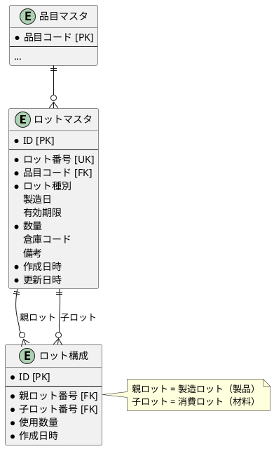

#### トレーサビリティサービス

<details>
<summary>TraceabilityService.java</summary>

```java
// src/main/java/com/example/sms/application/service/quality/TraceabilityService.java
package com.example.pms.application.service.quality;

import com.example.pms.domain.model.quality.LotMaster;
import com.example.pms.infrastructure.out.persistence.mapper.LotMapper;
import lombok.RequiredArgsConstructor;
import org.springframework.stereotype.Service;
import org.springframework.transaction.annotation.Transactional;

import java.util.List;

/**
 * トレーサビリティサービス
 */
@Service
@RequiredArgsConstructor
public class TraceabilityService {

    private final LotMapper lotMapper;

    /**
     * トレースフォワード
     * 指定されたロットが使用された製品ロットを追跡する
     *
     * @param lotNumber 追跡対象のロット番号
     * @return 製品ロットのリスト
     */
    @Transactional(readOnly = true)
    public List<LotMaster> traceForward(String lotNumber) {
        return lotMapper.traceForward(lotNumber);
    }

    /**
     * トレースバック
     * 指定された製品ロットに使用された材料ロットを追跡する
     *
     * @param lotNumber 追跡対象のロット番号
     * @return 材料ロットのリスト
     */
    @Transactional(readOnly = true)
    public List<LotMaster> traceBack(String lotNumber) {
        return lotMapper.traceBack(lotNumber);
    }

    /**
     * 影響範囲の調査
     * 不良ロットが使用された製品と出荷先を特定する
     *
     * @param defectiveLotNumber 不良ロット番号
     * @return 影響を受けたロットのリスト
     */
    @Transactional(readOnly = true)
    public List<LotMaster> investigateImpactRange(String defectiveLotNumber) {
        // トレースフォワードで影響範囲を特定
        return traceForward(defectiveLotNumber);
    }

    /**
     * 原因究明
     * 不良製品の原因となった材料ロットを特定する
     *
     * @param defectiveProductLotNumber 不良製品ロット番号
     * @return 原因となりうる材料ロットのリスト
     */
    @Transactional(readOnly = true)
    public List<LotMaster> investigateCause(String defectiveProductLotNumber) {
        // トレースバックで原因を追跡
        return traceBack(defectiveProductLotNumber);
    }
}
```

</details>

### 品質管理の全体 ER 図

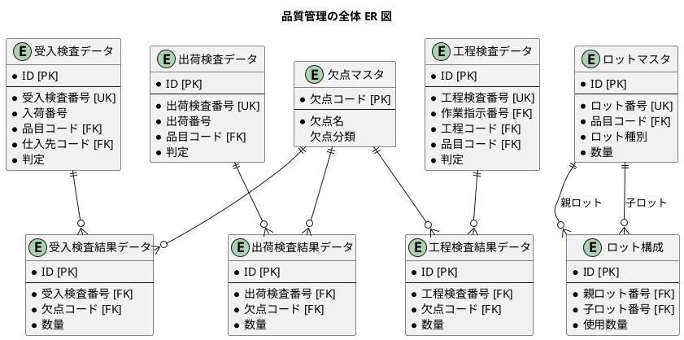

---

## 29.3 リレーションと楽観ロックの設計

### MyBatis ネストした select によるリレーション設定

品質管理では、検査データ→検査結果、ロットマスタ→ロット構成といった親子関係があります。MyBatis でこれらの関係を効率的に取得するために、ネストした select（Nested Select）方式を採用します。

#### ネストした select 方式の利点

| 観点 | 説明 |
|-----|------|
| **シンプルなクエリ** | 親テーブルのみを SELECT し、関連データは別クエリで取得 |
| **遅延ロード対応** | 必要な時のみ関連データを取得可能 |
| **N+1 問題への対応** | MyBatis のキャッシュ機能と組み合わせて最適化 |
| **H2/PostgreSQL 両対応** | 複雑な JOIN を避けることで DB 互換性を確保 |

#### 受入検査データのネスト select（検査結果を含む）

<details>
<summary>ReceivingInspectionMapper.xml（リレーション設定）</summary>

```xml
<?xml version="1.0" encoding="UTF-8" ?>
<!DOCTYPE mapper PUBLIC "-//mybatis.org//DTD Mapper 3.0//EN"
        "http://mybatis.org/dtd/mybatis-3-mapper.dtd">

<!-- src/main/resources/mapper/ReceivingInspectionMapper.xml -->
<mapper namespace="com.example.pms.infrastructure.out.persistence.mapper.ReceivingInspectionMapper">

    <!-- 基本 ResultMap -->
    <resultMap id="ReceivingInspectionResultMap" type="com.example.pms.domain.model.quality.ReceivingInspection">
        <id property="id" column="ID"/>
        <result property="inspectionNumber" column="受入検査番号"/>
        <result property="receivingNumber" column="入荷番号"/>
        <result property="purchaseOrderNumber" column="発注番号"/>
        <result property="itemCode" column="品目コード"/>
        <result property="supplierCode" column="仕入先コード"/>
        <result property="inspectionDate" column="検査日"/>
        <result property="inspectorCode" column="検査担当者コード"/>
        <result property="inspectionQuantity" column="検査数量"/>
        <result property="passedQuantity" column="合格数"/>
        <result property="failedQuantity" column="不合格数"/>
        <result property="judgment" column="判定"
                typeHandler="com.example.pms.infrastructure.out.persistence.typehandler.InspectionJudgmentTypeHandler"/>
        <result property="remarks" column="備考"/>
        <result property="version" column="バージョン"/>
        <result property="createdAt" column="作成日時"/>
        <result property="updatedAt" column="更新日時"/>
    </resultMap>

    <!-- 検査結果を含む ResultMap（ネスト select 方式） -->
    <resultMap id="ReceivingInspectionWithResultsResultMap" type="com.example.pms.domain.model.quality.ReceivingInspection"
               extends="ReceivingInspectionResultMap">
        <collection property="results" ofType="com.example.pms.domain.model.quality.ReceivingInspectionResult"
                    column="受入検査番号" select="com.example.pms.infrastructure.out.persistence.mapper.ReceivingInspectionResultMapper.findByInspectionNumber"/>
    </resultMap>

    <!-- 検査結果を含めて取得 -->
    <select id="findByInspectionNumberWithResults" resultMap="ReceivingInspectionWithResultsResultMap">
        SELECT * FROM "受入検査データ"
        WHERE "受入検査番号" = #{inspectionNumber}
    </select>

</mapper>
```

</details>

#### ロットマスタのネスト select（親子ロット構成を含む）

<details>
<summary>LotMasterMapper.xml（リレーション設定）</summary>

```xml
<?xml version="1.0" encoding="UTF-8" ?>
<!DOCTYPE mapper PUBLIC "-//mybatis.org//DTD Mapper 3.0//EN"
        "http://mybatis.org/dtd/mybatis-3-mapper.dtd">

<!-- src/main/resources/mapper/LotMasterMapper.xml -->
<mapper namespace="com.example.pms.infrastructure.out.persistence.mapper.LotMasterMapper">

    <!-- 基本 ResultMap -->
    <resultMap id="LotMasterResultMap" type="com.example.pms.domain.model.quality.LotMaster">
        <id property="id" column="ID"/>
        <result property="lotNumber" column="ロット番号"/>
        <result property="itemCode" column="品目コード"/>
        <result property="lotType" column="ロット種別"
                typeHandler="com.example.pms.infrastructure.out.persistence.typehandler.LotTypeTypeHandler"/>
        <result property="manufactureDate" column="製造日"/>
        <result property="expirationDate" column="有効期限"/>
        <result property="quantity" column="数量"/>
        <result property="warehouseCode" column="倉庫コード"/>
        <result property="remarks" column="備考"/>
        <result property="version" column="バージョン"/>
        <result property="createdAt" column="作成日時"/>
        <result property="updatedAt" column="更新日時"/>
    </resultMap>

    <!-- ロット構成を含む ResultMap（ネスト select 方式） -->
    <resultMap id="LotMasterWithCompositionsResultMap" type="com.example.pms.domain.model.quality.LotMaster"
               extends="LotMasterResultMap">
        <!-- 親ロット構成（このロットを材料として使用した製造ロット） -->
        <collection property="parentLotRelations" ofType="com.example.pms.domain.model.quality.LotComposition"
                    column="ロット番号" select="com.example.pms.infrastructure.out.persistence.mapper.LotCompositionMapper.findByChildLotNumber"/>
        <!-- 子ロット構成（このロットが使用した材料ロット） -->
        <collection property="childLotRelations" ofType="com.example.pms.domain.model.quality.LotComposition"
                    column="ロット番号" select="com.example.pms.infrastructure.out.persistence.mapper.LotCompositionMapper.findByParentLotNumber"/>
    </resultMap>

    <!-- ロット構成を含めて取得 -->
    <select id="findByLotNumberWithCompositions" resultMap="LotMasterWithCompositionsResultMap">
        SELECT * FROM "ロットマスタ"
        WHERE "ロット番号" = #{lotNumber}
    </select>

    <!-- トレースフォワード: 子ロットから製造ロットを追跡（PostgreSQL用） -->
    <select id="traceForward" resultMap="LotMasterResultMap" databaseId="postgresql">
        WITH RECURSIVE lot_tree AS (
            SELECT lm.*, 0 AS level
            FROM "ロットマスタ" lm
            WHERE lm."ロット番号" = #{lotNumber}

            UNION ALL

            SELECT lm.*, lt.level + 1
            FROM "ロットマスタ" lm
            JOIN "ロット構成" lc ON lm."ロット番号" = lc."親ロット番号"
            JOIN lot_tree lt ON lc."子ロット番号" = lt."ロット番号"
            WHERE lt.level &lt; 10
        )
        SELECT * FROM lot_tree
        ORDER BY level ASC
    </select>

    <!-- トレースバック: 親ロットから材料ロットを追跡（PostgreSQL用） -->
    <select id="traceBack" resultMap="LotMasterResultMap" databaseId="postgresql">
        WITH RECURSIVE lot_tree AS (
            SELECT lm.*, 0 AS level
            FROM "ロットマスタ" lm
            WHERE lm."ロット番号" = #{lotNumber}

            UNION ALL

            SELECT lm.*, lt.level + 1
            FROM "ロットマスタ" lm
            JOIN "ロット構成" lc ON lm."ロット番号" = lc."子ロット番号"
            JOIN lot_tree lt ON lc."親ロット番号" = lt."ロット番号"
            WHERE lt.level &lt; 10
        )
        SELECT * FROM lot_tree
        ORDER BY level ASC
    </select>

</mapper>
```

</details>

#### リレーション設定のポイント

| 設定項目 | 説明 |
|---------|------|
| **ネスト select 方式** | `column` と `select` 属性で関連データを別クエリで取得 |
| **extends 属性** | 基本 ResultMap を継承してリレーション付き ResultMap を定義 |
| **双方向ロット構成** | 親・子両方向のロット構成を別々の collection で取得 |
| **databaseId** | PostgreSQL と H2 で異なるクエリを使い分け |

### 楽観ロックの実装

品質管理では、検査結果の再判定やロット情報の更新時に、データの整合性を保つために楽観ロックを実装します。

#### Flyway マイグレーション: バージョンカラム追加

<details>
<summary>V029_5__add_quality_version_columns.sql</summary>

```sql
-- src/main/resources/db/migration/V029_5__add_quality_version_columns.sql

-- 受入検査データテーブルにバージョンカラムを追加
ALTER TABLE "受入検査データ" ADD COLUMN "バージョン" INTEGER DEFAULT 1 NOT NULL;

-- 工程検査データテーブルにバージョンカラムを追加
ALTER TABLE "工程検査データ" ADD COLUMN "バージョン" INTEGER DEFAULT 1 NOT NULL;

-- 出荷検査データテーブルにバージョンカラムを追加
ALTER TABLE "出荷検査データ" ADD COLUMN "バージョン" INTEGER DEFAULT 1 NOT NULL;

-- ロットマスタテーブルにバージョンカラムを追加
ALTER TABLE "ロットマスタ" ADD COLUMN "バージョン" INTEGER DEFAULT 1 NOT NULL;

-- コメント追加
COMMENT ON COLUMN "受入検査データ"."バージョン" IS '楽観ロック用バージョン番号';
COMMENT ON COLUMN "工程検査データ"."バージョン" IS '楽観ロック用バージョン番号';
COMMENT ON COLUMN "出荷検査データ"."バージョン" IS '楽観ロック用バージョン番号';
COMMENT ON COLUMN "ロットマスタ"."バージョン" IS '楽観ロック用バージョン番号';
```

</details>

#### エンティティへのバージョンフィールド追加

<details>
<summary>ReceivingInspection.java（バージョンフィールド追加）</summary>

```java
// src/main/java/com/example/pms/domain/model/quality/ReceivingInspection.java
package com.example.pms.domain.model.quality;

import com.example.pms.domain.model.item.Item;
import com.example.pms.domain.model.supplier.Supplier;
import lombok.*;
import java.math.BigDecimal;
import java.time.LocalDate;
import java.time.LocalDateTime;
import java.util.ArrayList;
import java.util.List;

/**
 * 受入検査データエンティティ.
 */
@Data
@Builder
@NoArgsConstructor
@AllArgsConstructor
public class ReceivingInspection {
    private Integer id;
    private String inspectionNumber;
    private String receivingNumber;
    private String purchaseOrderNumber;
    private String itemCode;
    private String supplierCode;
    private LocalDate inspectionDate;
    private String inspectorCode;
    private BigDecimal inspectionQuantity;
    private BigDecimal passedQuantity;
    private BigDecimal failedQuantity;
    private InspectionJudgment judgment;
    private String remarks;
    private LocalDateTime createdAt;
    private LocalDateTime updatedAt;

    // 楽観ロック用バージョン
    @Builder.Default
    private Integer version = 1;

    // リレーション
    private Item item;
    private Supplier supplier;
    @Builder.Default
    private List<ReceivingInspectionResult> results = new ArrayList<>();

    /**
     * 再検査可能かどうかをチェック.
     *
     * @return 再検査可能な場合 true
     */
    public boolean canReinspect() {
        return judgment == InspectionJudgment.HOLD;
    }

    /**
     * 不合格率を計算.
     *
     * @return 不合格率（%）
     */
    public BigDecimal getFailureRate() {
        if (inspectionQuantity == null || inspectionQuantity.compareTo(BigDecimal.ZERO) == 0) {
            return BigDecimal.ZERO;
        }
        return failedQuantity.divide(inspectionQuantity, 4, java.math.RoundingMode.HALF_UP)
                .multiply(new BigDecimal("100"));
    }
}
```

</details>

#### MyBatis Mapper: 楽観ロック対応の更新

検査データの判定更新や数量修正時に楽観ロックを適用します。

<details>
<summary>ReceivingInspectionMapper.xml（楽観ロック対応 UPDATE）</summary>

```xml
<!-- 判定更新（楽観ロック対応） -->
<update id="updateJudgmentWithOptimisticLock">
    UPDATE "受入検査データ"
    SET
        "合格数" = #{passedQuantity},
        "不合格数" = #{failedQuantity},
        "判定" = #{judgment, typeHandler=com.example.pms.infrastructure.out.persistence.typehandler.InspectionJudgmentTypeHandler}::"検査判定",
        "備考" = #{remarks},
        "更新日時" = CURRENT_TIMESTAMP,
        "バージョン" = "バージョン" + 1
    WHERE "受入検査番号" = #{inspectionNumber}
    AND "バージョン" = #{version}
</update>

<!-- 再検査による判定変更（楽観ロック + 保留チェック） -->
<update id="reinspectWithOptimisticLock">
    UPDATE "受入検査データ"
    SET
        "合格数" = #{passedQuantity},
        "不合格数" = #{failedQuantity},
        "判定" = #{judgment, typeHandler=com.example.pms.infrastructure.out.persistence.typehandler.InspectionJudgmentTypeHandler}::"検査判定",
        "備考" = #{remarks},
        "更新日時" = CURRENT_TIMESTAMP,
        "バージョン" = "バージョン" + 1
    WHERE "受入検査番号" = #{inspectionNumber}
    AND "バージョン" = #{version}
    AND "判定" = '保留'
</update>

<!-- バージョン取得 -->
<select id="findVersionByInspectionNumber" resultType="java.lang.Integer">
    SELECT "バージョン" FROM "受入検査データ"
    WHERE "受入検査番号" = #{inspectionNumber}
</select>

<!-- 判定状態取得 -->
<select id="findJudgmentByInspectionNumber" resultType="java.lang.String">
    SELECT "判定"::text FROM "受入検査データ"
    WHERE "受入検査番号" = #{inspectionNumber}
</select>
```

</details>

#### Repository 実装: 楽観ロック対応

<details>
<summary>ReceivingInspectionRepositoryImpl.java（楽観ロック対応）</summary>

```java
// src/main/java/com/example/sms/infrastructure/out/persistence/repository/ReceivingInspectionRepositoryImpl.java
package com.example.pms.infrastructure.out.persistence.repository;

import com.example.pms.application.port.out.ReceivingInspectionRepository;
import com.example.pms.domain.exception.OptimisticLockException;
import com.example.pms.domain.model.quality.InspectionJudgment;
import com.example.pms.domain.model.quality.ReceivingInspection;
import com.example.pms.infrastructure.out.persistence.mapper.ReceivingInspectionMapper;
import lombok.RequiredArgsConstructor;
import org.springframework.stereotype.Repository;
import org.springframework.transaction.annotation.Transactional;

import java.math.BigDecimal;
import java.util.Optional;

@Repository
@RequiredArgsConstructor
public class ReceivingInspectionRepositoryImpl implements ReceivingInspectionRepository {

    private final ReceivingInspectionMapper mapper;

    @Override
    @Transactional
    public void updateJudgment(String inspectionNumber, Integer version,
                               BigDecimal passedQuantity, BigDecimal failedQuantity,
                               InspectionJudgment judgment, String remarks) {
        int updatedCount = mapper.updateJudgmentWithOptimisticLock(
                inspectionNumber, version, passedQuantity, failedQuantity, judgment, remarks);

        if (updatedCount == 0) {
            handleOptimisticLockFailure(inspectionNumber, version);
        }
    }

    @Override
    @Transactional
    public void reinspect(String inspectionNumber, Integer version,
                         BigDecimal passedQuantity, BigDecimal failedQuantity,
                         InspectionJudgment judgment, String remarks) {
        int updatedCount = mapper.reinspectWithOptimisticLock(
                inspectionNumber, version, passedQuantity, failedQuantity, judgment, remarks);

        if (updatedCount == 0) {
            // 再検査失敗の原因を特定
            Integer currentVersion = mapper.findVersionByInspectionNumber(inspectionNumber);
            if (currentVersion == null) {
                throw new IllegalArgumentException("検査データが見つかりません");
            } else if (!currentVersion.equals(version)) {
                throw new OptimisticLockException("受入検査", inspectionNumber,
                        version, currentVersion);
            } else {
                // バージョンは一致しているので保留状態ではない
                String currentJudgment = mapper.findJudgmentByInspectionNumber(inspectionNumber);
                throw new IllegalStateException(
                        String.format("保留状態の検査のみ再検査可能です。現在の判定: %s", currentJudgment));
            }
        }
    }

    private void handleOptimisticLockFailure(String inspectionNumber, Integer expectedVersion) {
        Integer currentVersion = mapper.findVersionByInspectionNumber(inspectionNumber);
        if (currentVersion == null) {
            throw new IllegalArgumentException("検査データが見つかりません");
        } else {
            throw new OptimisticLockException("受入検査", inspectionNumber,
                    expectedVersion, currentVersion);
        }
    }

    @Override
    public Optional<ReceivingInspection> findFullByInspectionNumber(String inspectionNumber) {
        return Optional.ofNullable(mapper.findFullByInspectionNumber(inspectionNumber));
    }
}
```

</details>

#### TDD: 楽観ロックのテスト

<details>
<summary>ReceivingInspectionRepositoryOptimisticLockTest.java</summary>

```java
// src/test/java/com/example/sms/infrastructure/out/persistence/repository/ReceivingInspectionRepositoryOptimisticLockTest.java
package com.example.pms.infrastructure.out.persistence.repository;

import com.example.pms.application.port.out.ReceivingInspectionRepository;
import com.example.pms.domain.exception.OptimisticLockException;
import com.example.pms.domain.model.quality.InspectionJudgment;
import com.example.pms.domain.model.quality.ReceivingInspection;
import com.example.pms.testsetup.BaseIntegrationTest;
import org.junit.jupiter.api.*;
import org.springframework.beans.factory.annotation.Autowired;

import java.math.BigDecimal;

import static org.assertj.core.api.Assertions.*;

@DisplayName("受入検査リポジトリ - 楽観ロック")
class ReceivingInspectionRepositoryOptimisticLockTest extends BaseIntegrationTest {

    @Autowired
    private ReceivingInspectionRepository receivingInspectionRepository;

    @BeforeEach
    void setUp() {
        // テストデータのセットアップ
    }

    @Nested
    @DisplayName("判定更新の楽観ロック")
    class JudgmentUpdateOptimisticLocking {

        @Test
        @DisplayName("同じバージョンで判定を更新できる")
        void canUpdateJudgmentWithSameVersion() {
            // Arrange
            ReceivingInspection inspection = createTestInspection("RI-TEST-001", InspectionJudgment.HOLD);
            Integer initialVersion = inspection.getVersion();

            // Act
            receivingInspectionRepository.updateJudgment(
                    inspection.getInspectionNumber(),
                    initialVersion,
                    new BigDecimal("95"),
                    new BigDecimal("5"),
                    InspectionJudgment.PASSED,
                    "再検査により合格");

            // Assert
            var updated = receivingInspectionRepository
                    .findFullByInspectionNumber("RI-TEST-001").get();
            assertThat(updated.getJudgment()).isEqualTo(InspectionJudgment.PASSED);
            assertThat(updated.getPassedQuantity()).isEqualByComparingTo(new BigDecimal("95"));
            assertThat(updated.getVersion()).isEqualTo(initialVersion + 1);
        }

        @Test
        @DisplayName("異なるバージョンで更新すると楽観ロック例外が発生する")
        void throwsExceptionWhenVersionMismatch() {
            // Arrange
            ReceivingInspection inspection = createTestInspection("RI-TEST-002", InspectionJudgment.HOLD);
            Integer initialVersion = inspection.getVersion();

            // 検査担当者Aが更新（成功）
            receivingInspectionRepository.updateJudgment(
                    inspection.getInspectionNumber(),
                    initialVersion,
                    new BigDecimal("90"),
                    new BigDecimal("10"),
                    InspectionJudgment.PASSED,
                    "担当者Aによる判定");

            // Act & Assert: 検査担当者Bが古いバージョンで更新（失敗）
            assertThatThrownBy(() -> receivingInspectionRepository.updateJudgment(
                    inspection.getInspectionNumber(),
                    initialVersion, // 古いバージョン
                    new BigDecimal("80"),
                    new BigDecimal("20"),
                    InspectionJudgment.FAILED,
                    "担当者Bによる判定"))
                    .isInstanceOf(OptimisticLockException.class)
                    .hasMessageContaining("他のユーザーによって更新されています");
        }
    }

    @Nested
    @DisplayName("再検査の楽観ロック")
    class ReinspectOptimisticLocking {

        @Test
        @DisplayName("保留状態の検査を再検査できる")
        void canReinspectHoldInspection() {
            // Arrange
            ReceivingInspection inspection = createTestInspection("RI-TEST-003", InspectionJudgment.HOLD);

            // Act
            receivingInspectionRepository.reinspect(
                    inspection.getInspectionNumber(),
                    inspection.getVersion(),
                    new BigDecimal("100"),
                    BigDecimal.ZERO,
                    InspectionJudgment.PASSED,
                    "再検査により合格");

            // Assert
            var updated = receivingInspectionRepository
                    .findFullByInspectionNumber("RI-TEST-003").get();
            assertThat(updated.getJudgment()).isEqualTo(InspectionJudgment.PASSED);
        }

        @Test
        @DisplayName("保留状態でない検査は再検査できない")
        void cannotReinspectNonHoldInspection() {
            // Arrange: 合格状態の検査を作成
            ReceivingInspection inspection = createTestInspection("RI-TEST-004", InspectionJudgment.PASSED);

            // Act & Assert
            assertThatThrownBy(() -> receivingInspectionRepository.reinspect(
                    inspection.getInspectionNumber(),
                    inspection.getVersion(),
                    new BigDecimal("80"),
                    new BigDecimal("20"),
                    InspectionJudgment.FAILED,
                    "再検査"))
                    .isInstanceOf(IllegalStateException.class)
                    .hasMessageContaining("保留状態の検査のみ再検査可能です");
        }
    }

    private ReceivingInspection createTestInspection(String inspectionNumber, InspectionJudgment judgment) {
        // テスト用検査データの作成
        return ReceivingInspection.builder()
                .inspectionNumber(inspectionNumber)
                .receivingNumber("RC-TEST-001")
                .purchaseOrderNumber("PO-TEST-001")
                .itemCode("MAT-001")
                .supplierCode("SUP-001")
                .inspectionDate(java.time.LocalDate.now())
                .inspectorCode("INS-001")
                .inspectionQuantity(new BigDecimal("100"))
                .passedQuantity(judgment == InspectionJudgment.PASSED ? new BigDecimal("100") : BigDecimal.ZERO)
                .failedQuantity(judgment == InspectionJudgment.FAILED ? new BigDecimal("100") : BigDecimal.ZERO)
                .judgment(judgment)
                .build();
    }
}
```

</details>

### 検査再判定処理のシーケンス図

検査の再判定では、同一検査に対する複数担当者の同時更新を楽観ロックで制御します。

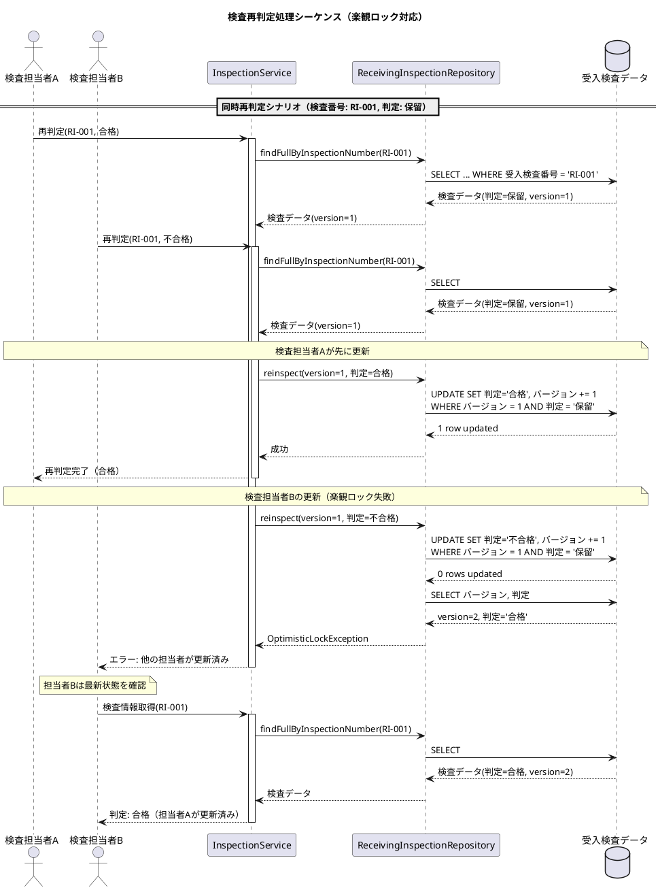

### 品質管理向け楽観ロックのベストプラクティス

| ポイント | 説明 |
|---------|------|
| **状態チェック併用** | `AND 判定 = '保留'` で再検査可能状態と楽観ロック失敗を同時に検出 |
| **エラー原因の特定** | 更新失敗時はバージョンと状態を確認してエラー種別を判定 |
| **監査証跡の考慮** | 検査判定の変更履歴を別テーブルに記録することも検討 |
| **ロット追跡の整合性** | ロット構成追加時は親子両方のロットをロックして整合性を保証 |
| **再検査ワークフロー** | 保留→合格/不合格の遷移のみ許可し、確定後の変更は別プロセスで管理 |
| **品質記録の永続性** | 検査結果は物理削除せず、バージョン管理で履歴を保持 |

---

## 29.4 まとめ

本章では、品質管理の設計について解説しました。

### 設計のポイント

1. **検査の種類と目的の明確化**
   - 受入検査：購買品の品質確認
   - 工程検査：製造中の品質確認
   - 出荷検査：出荷前の最終品質確認

2. **共通の検査判定**
   - InspectionJudgment Enum で合格/不合格/保留を統一管理
   - TypeHandler による PostgreSQL ENUM 型との連携

3. **検査データ構造の統一**
   - ヘッダー（検査データ）と明細（検査結果データ）の分離
   - 欠点マスタによる不良種類の管理

4. **トレーサビリティの実現**
   - ロットマスタによるロット情報の管理
   - ロット構成テーブルによる親子関係の管理
   - 再帰クエリによるトレースフォワード/トレースバック

### 次章への橋渡し

次章では、製造原価管理の設計について解説します。標準原価と実際原価の計算、原価差異分析など、製造業の原価管理に必要なデータベース設計を取り上げます。

---

[← 第28章：在庫管理の設計](chapter28.md) | [第30章：製造原価管理の設計 →](chapter30.md)
