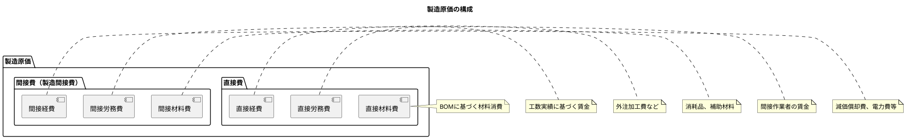
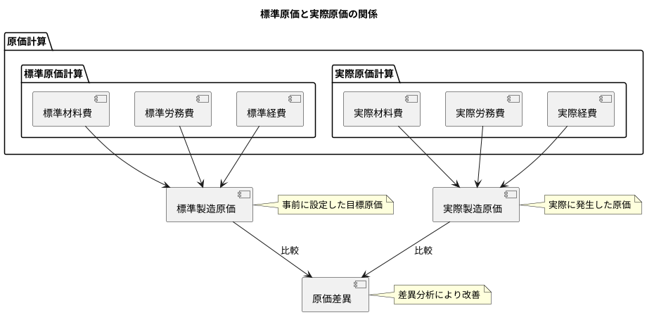
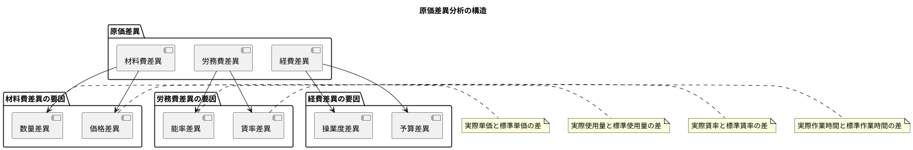
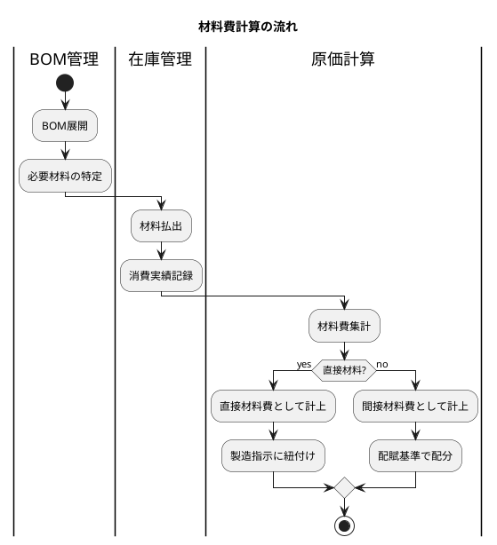
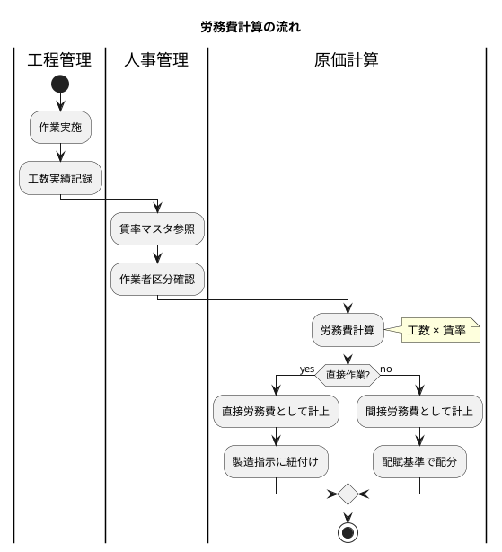
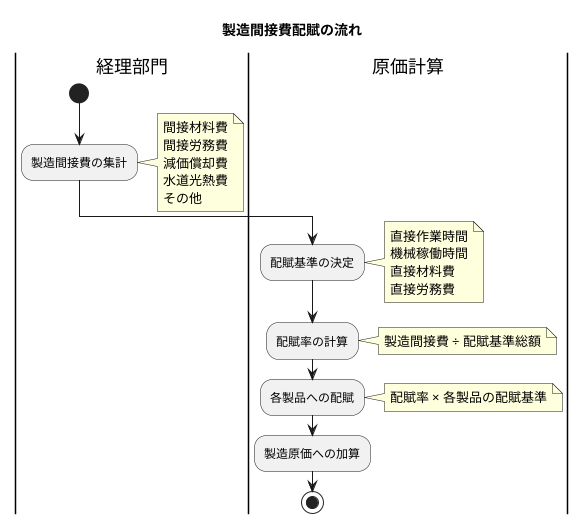
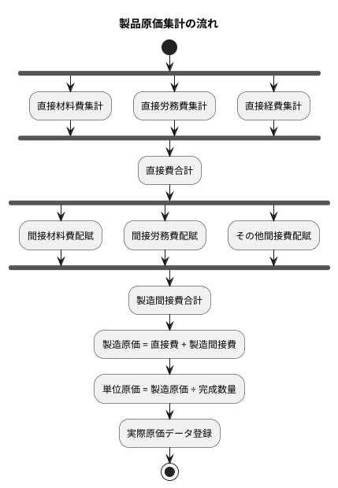
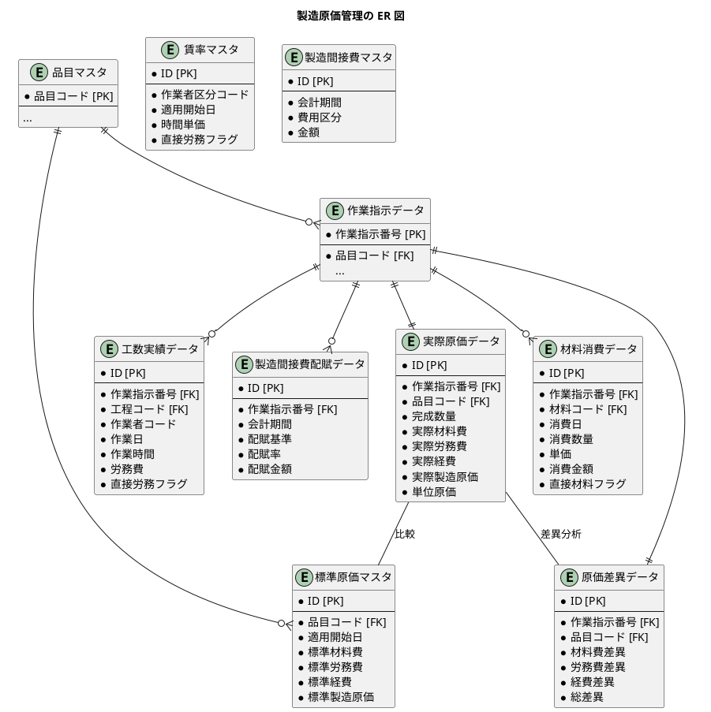

# 第30章：製造原価管理の設計

## 30.1 原価計算の概要

### 製造原価の構成

製造原価は、製品を製造するために発生するすべてのコストを体系的に把握するための概念です。製造原価は大きく直接費と間接費（製造間接費）に分類されます。



#### 原価要素の分類

| 分類 | 原価要素 | 説明 | 例 |
|-----|---------|------|-----|
| **直接材料費** | 製品に直接使用される材料 | BOM に基づき計算 | 主要材料、部品 |
| **直接労務費** | 製造作業者の賃金 | 工数実績 × 賃率 | 製造ラインの作業者 |
| **直接経費** | 製品に直接賦課できる経費 | 外注費など | 外注加工費、特許使用料 |
| **間接材料費** | 製品に間接的に使用される材料 | 配賦により計算 | 潤滑油、消耗工具 |
| **間接労務費** | 間接作業者の賃金 | 配賦により計算 | 監督者、品質管理者 |
| **間接経費** | 製造に間接的に発生する経費 | 配賦により計算 | 減価償却費、水道光熱費 |

### 標準原価と実際原価

原価計算には、標準原価計算と実際原価計算の2つのアプローチがあります。



| 区分 | 説明 | 用途 |
|-----|------|-----|
| **標準原価** | 事前に設定した目標原価 | 予算管理、見積り、原価統制 |
| **実際原価** | 実際に発生した原価 | 実績把握、原価差異分析 |

### 原価差異分析

原価差異は、標準原価と実際原価の差として計算されます。

```
原価差異 = 実際原価 - 標準原価
```

差異がプラス（不利差異）の場合は実際原価が標準を上回っており、マイナス（有利差異）の場合は実際原価が標準を下回っていることを示します。



#### 差異の要因分析

| 差異種類 | 要因 | 計算式 |
|---------|-----|-------|
| **価格差異** | 材料の購入単価の差 | (実際単価 - 標準単価) × 実際使用量 |
| **数量差異** | 材料の使用量の差 | (実際使用量 - 標準使用量) × 標準単価 |
| **賃率差異** | 労働者の賃率の差 | (実際賃率 - 標準賃率) × 実際作業時間 |
| **能率差異** | 作業効率の差 | (実際作業時間 - 標準作業時間) × 標準賃率 |

---

## 30.2 材料費・労務費・製造間接費

### 材料費の計算（直接材料費・間接材料費）

材料費は、製品の製造に使用された材料の消費額です。BOM（部品表）と消費実績に基づいて計算します。



#### 材料消費データエンティティ

<details>
<summary>MaterialConsumption.java</summary>

```java
// src/main/java/com/example/sms/domain/model/cost/MaterialConsumption.java
package com.example.sms.domain.model.cost;

import lombok.*;
import java.math.BigDecimal;
import java.time.LocalDate;
import java.time.LocalDateTime;

/**
 * 材料消費データエンティティ
 */
@Data
@Builder
@NoArgsConstructor
@AllArgsConstructor
public class MaterialConsumption {
    private Long id;
    private String workOrderNumber;
    private String materialCode;
    private LocalDate consumptionDate;
    private BigDecimal consumptionQuantity;
    private BigDecimal unitPrice;
    private BigDecimal consumptionAmount;
    private Boolean isDirect;
    private String remarks;
    private LocalDateTime createdAt;
    private LocalDateTime updatedAt;
}
```

</details>

#### MyBatis Mapper XML：材料消費

<details>
<summary>MaterialConsumptionMapper.xml</summary>

```xml
<?xml version="1.0" encoding="UTF-8" ?>
<!DOCTYPE mapper PUBLIC "-//mybatis.org//DTD Mapper 3.0//EN"
        "http://mybatis.org/dtd/mybatis-3-mapper.dtd">
<mapper namespace="com.example.sms.infrastructure.out.persistence.mapper.MaterialConsumptionMapper">

    <resultMap id="MaterialConsumptionResultMap"
               type="com.example.sms.domain.model.cost.MaterialConsumption">
        <id property="id" column="ID"/>
        <result property="workOrderNumber" column="作業指示番号"/>
        <result property="materialCode" column="材料コード"/>
        <result property="consumptionDate" column="消費日"/>
        <result property="consumptionQuantity" column="消費数量"/>
        <result property="unitPrice" column="単価"/>
        <result property="consumptionAmount" column="消費金額"/>
        <result property="isDirect" column="直接材料フラグ"/>
        <result property="remarks" column="備考"/>
        <result property="createdAt" column="作成日時"/>
        <result property="updatedAt" column="更新日時"/>
    </resultMap>

    <select id="findByWorkOrderNumber" resultMap="MaterialConsumptionResultMap">
        SELECT * FROM "材料消費データ"
        WHERE "作業指示番号" = #{workOrderNumber}
        ORDER BY "消費日" ASC
    </select>

    <select id="sumDirectMaterialCostByWorkOrderNumber" resultType="java.math.BigDecimal">
        SELECT COALESCE(SUM("消費金額"), 0)
        FROM "材料消費データ"
        WHERE "作業指示番号" = #{workOrderNumber}
          AND "直接材料フラグ" = true
    </select>

    <select id="sumIndirectMaterialCostByPeriod" resultType="java.math.BigDecimal">
        SELECT COALESCE(SUM("消費金額"), 0)
        FROM "材料消費データ"
        WHERE "消費日" BETWEEN #{startDate} AND #{endDate}
          AND "直接材料フラグ" = false
    </select>

    <insert id="insert" useGeneratedKeys="true" keyProperty="id" keyColumn="ID">
        INSERT INTO "材料消費データ" (
            "作業指示番号", "材料コード", "消費日",
            "消費数量", "単価", "消費金額", "直接材料フラグ", "備考"
        ) VALUES (
            #{workOrderNumber}, #{materialCode}, #{consumptionDate},
            #{consumptionQuantity}, #{unitPrice}, #{consumptionAmount},
            #{isDirect}, #{remarks}
        )
    </insert>

</mapper>
```

</details>

#### Flyway マイグレーション：材料消費

<details>
<summary>V030_1__create_material_consumption_tables.sql</summary>

```sql
-- V030_1__create_material_consumption_tables.sql

-- 材料消費データ
CREATE TABLE "材料消費データ" (
    "ID" SERIAL PRIMARY KEY,
    "作業指示番号" VARCHAR(20) NOT NULL,
    "材料コード" VARCHAR(20) NOT NULL,
    "消費日" DATE NOT NULL,
    "消費数量" DECIMAL(15, 2) NOT NULL,
    "単価" DECIMAL(15, 4) NOT NULL,
    "消費金額" DECIMAL(15, 2) NOT NULL,
    "直接材料フラグ" BOOLEAN NOT NULL DEFAULT true,
    "備考" VARCHAR(500),
    "作成日時" TIMESTAMP DEFAULT CURRENT_TIMESTAMP NOT NULL,
    "更新日時" TIMESTAMP DEFAULT CURRENT_TIMESTAMP NOT NULL,
    CONSTRAINT "FK_材料消費_作業指示" FOREIGN KEY ("作業指示番号")
        REFERENCES "作業指示データ"("作業指示番号"),
    CONSTRAINT "FK_材料消費_品目" FOREIGN KEY ("材料コード")
        REFERENCES "品目マスタ"("品目コード")
);

COMMENT ON TABLE "材料消費データ" IS '材料消費データ';
COMMENT ON COLUMN "材料消費データ"."直接材料フラグ" IS '直接材料=true, 間接材料=false';

-- インデックス
CREATE INDEX "IDX_材料消費_作業指示" ON "材料消費データ" ("作業指示番号");
CREATE INDEX "IDX_材料消費_消費日" ON "材料消費データ" ("消費日");
```

</details>

### 労務費の計算（直接労務費・間接労務費）

労務費は、製造に関わる作業者の人件費です。工数実績と賃率に基づいて計算します。



#### 賃率マスタエンティティ

<details>
<summary>WageRate.java</summary>

```java
// src/main/java/com/example/sms/domain/model/cost/WageRate.java
package com.example.sms.domain.model.cost;

import lombok.*;
import java.math.BigDecimal;
import java.time.LocalDate;
import java.time.LocalDateTime;

/**
 * 賃率マスタエンティティ
 */
@Data
@Builder
@NoArgsConstructor
@AllArgsConstructor
public class WageRate {
    private Long id;
    private String workerCategoryCode;
    private String workerCategoryName;
    private LocalDate effectiveStartDate;
    private LocalDate effectiveEndDate;
    private BigDecimal hourlyRate;
    private Boolean isDirect;
    private LocalDateTime createdAt;
    private LocalDateTime updatedAt;
}
```

</details>

#### 工数実績データエンティティ

<details>
<summary>LaborHours.java</summary>

```java
// src/main/java/com/example/sms/domain/model/cost/LaborHours.java
package com.example.sms.domain.model.cost;

import lombok.*;
import java.math.BigDecimal;
import java.time.LocalDate;
import java.time.LocalDateTime;

/**
 * 工数実績データエンティティ
 */
@Data
@Builder
@NoArgsConstructor
@AllArgsConstructor
public class LaborHours {
    private Long id;
    private String workOrderNumber;
    private String processCode;
    private String workerCode;
    private String workerCategoryCode;
    private LocalDate workDate;
    private BigDecimal workHours;
    private BigDecimal hourlyRate;
    private BigDecimal laborCost;
    private Boolean isDirect;
    private String remarks;
    private LocalDateTime createdAt;
    private LocalDateTime updatedAt;
}
```

</details>

#### MyBatis Mapper XML：工数実績

<details>
<summary>LaborHoursMapper.xml</summary>

```xml
<?xml version="1.0" encoding="UTF-8" ?>
<!DOCTYPE mapper PUBLIC "-//mybatis.org//DTD Mapper 3.0//EN"
        "http://mybatis.org/dtd/mybatis-3-mapper.dtd">
<mapper namespace="com.example.sms.infrastructure.out.persistence.mapper.LaborHoursMapper">

    <resultMap id="WageRateResultMap"
               type="com.example.sms.domain.model.cost.WageRate">
        <id property="id" column="ID"/>
        <result property="workerCategoryCode" column="作業者区分コード"/>
        <result property="workerCategoryName" column="作業者区分名"/>
        <result property="effectiveStartDate" column="適用開始日"/>
        <result property="effectiveEndDate" column="適用終了日"/>
        <result property="hourlyRate" column="時間単価"/>
        <result property="isDirect" column="直接労務フラグ"/>
        <result property="createdAt" column="作成日時"/>
        <result property="updatedAt" column="更新日時"/>
    </resultMap>

    <resultMap id="LaborHoursResultMap"
               type="com.example.sms.domain.model.cost.LaborHours">
        <id property="id" column="ID"/>
        <result property="workOrderNumber" column="作業指示番号"/>
        <result property="processCode" column="工程コード"/>
        <result property="workerCode" column="作業者コード"/>
        <result property="workerCategoryCode" column="作業者区分コード"/>
        <result property="workDate" column="作業日"/>
        <result property="workHours" column="作業時間"/>
        <result property="hourlyRate" column="時間単価"/>
        <result property="laborCost" column="労務費"/>
        <result property="isDirect" column="直接労務フラグ"/>
        <result property="remarks" column="備考"/>
        <result property="createdAt" column="作成日時"/>
        <result property="updatedAt" column="更新日時"/>
    </resultMap>

    <select id="findByWorkOrderNumber" resultMap="LaborHoursResultMap">
        SELECT * FROM "工数実績データ"
        WHERE "作業指示番号" = #{workOrderNumber}
        ORDER BY "作業日" ASC
    </select>

    <select id="sumDirectLaborCostByWorkOrderNumber" resultType="java.math.BigDecimal">
        SELECT COALESCE(SUM("労務費"), 0)
        FROM "工数実績データ"
        WHERE "作業指示番号" = #{workOrderNumber}
          AND "直接労務フラグ" = true
    </select>

    <select id="sumIndirectLaborCostByPeriod" resultType="java.math.BigDecimal">
        SELECT COALESCE(SUM("労務費"), 0)
        FROM "工数実績データ"
        WHERE "作業日" BETWEEN #{startDate} AND #{endDate}
          AND "直接労務フラグ" = false
    </select>

    <select id="sumWorkHoursByWorkOrderNumber" resultType="java.math.BigDecimal">
        SELECT COALESCE(SUM("作業時間"), 0)
        FROM "工数実績データ"
        WHERE "作業指示番号" = #{workOrderNumber}
    </select>

    <select id="findWageRateByCategory" resultMap="WageRateResultMap">
        SELECT * FROM "賃率マスタ"
        WHERE "作業者区分コード" = #{workerCategoryCode}
          AND "適用開始日" &lt;= #{targetDate}
          AND ("適用終了日" IS NULL OR "適用終了日" >= #{targetDate})
        ORDER BY "適用開始日" DESC
        LIMIT 1
    </select>

    <insert id="insert" useGeneratedKeys="true" keyProperty="id" keyColumn="ID">
        INSERT INTO "工数実績データ" (
            "作業指示番号", "工程コード", "作業者コード", "作業者区分コード",
            "作業日", "作業時間", "時間単価", "労務費", "直接労務フラグ", "備考"
        ) VALUES (
            #{workOrderNumber}, #{processCode}, #{workerCode}, #{workerCategoryCode},
            #{workDate}, #{workHours}, #{hourlyRate}, #{laborCost}, #{isDirect}, #{remarks}
        )
    </insert>

</mapper>
```

</details>

#### Flyway マイグレーション：労務費

<details>
<summary>V030_2__create_labor_cost_tables.sql</summary>

```sql
-- V030_2__create_labor_cost_tables.sql

-- 賃率マスタ
CREATE TABLE "賃率マスタ" (
    "ID" SERIAL PRIMARY KEY,
    "作業者区分コード" VARCHAR(20) NOT NULL,
    "作業者区分名" VARCHAR(100) NOT NULL,
    "適用開始日" DATE NOT NULL,
    "適用終了日" DATE,
    "時間単価" DECIMAL(15, 2) NOT NULL,
    "直接労務フラグ" BOOLEAN NOT NULL DEFAULT true,
    "作成日時" TIMESTAMP DEFAULT CURRENT_TIMESTAMP NOT NULL,
    "更新日時" TIMESTAMP DEFAULT CURRENT_TIMESTAMP NOT NULL,
    CONSTRAINT "UK_賃率_区分_適用開始日" UNIQUE ("作業者区分コード", "適用開始日")
);

COMMENT ON TABLE "賃率マスタ" IS '賃率マスタ';
COMMENT ON COLUMN "賃率マスタ"."時間単価" IS '1時間あたりの賃率';
COMMENT ON COLUMN "賃率マスタ"."直接労務フラグ" IS '直接労務=true, 間接労務=false';

-- 工数実績データ
CREATE TABLE "工数実績データ" (
    "ID" SERIAL PRIMARY KEY,
    "作業指示番号" VARCHAR(20) NOT NULL,
    "工程コード" VARCHAR(20) NOT NULL,
    "作業者コード" VARCHAR(20) NOT NULL,
    "作業者区分コード" VARCHAR(20) NOT NULL,
    "作業日" DATE NOT NULL,
    "作業時間" DECIMAL(5, 2) NOT NULL,
    "時間単価" DECIMAL(15, 2) NOT NULL,
    "労務費" DECIMAL(15, 2) NOT NULL,
    "直接労務フラグ" BOOLEAN NOT NULL DEFAULT true,
    "備考" VARCHAR(500),
    "作成日時" TIMESTAMP DEFAULT CURRENT_TIMESTAMP NOT NULL,
    "更新日時" TIMESTAMP DEFAULT CURRENT_TIMESTAMP NOT NULL,
    CONSTRAINT "FK_工数実績_作業指示" FOREIGN KEY ("作業指示番号")
        REFERENCES "作業指示データ"("作業指示番号"),
    CONSTRAINT "FK_工数実績_工程" FOREIGN KEY ("工程コード")
        REFERENCES "工程マスタ"("工程コード")
);

COMMENT ON TABLE "工数実績データ" IS '工数実績データ';
COMMENT ON COLUMN "工数実績データ"."作業時間" IS '作業時間（時間単位）';
COMMENT ON COLUMN "工数実績データ"."労務費" IS '作業時間 × 時間単価';

-- インデックス
CREATE INDEX "IDX_工数実績_作業指示" ON "工数実績データ" ("作業指示番号");
CREATE INDEX "IDX_工数実績_作業日" ON "工数実績データ" ("作業日");
CREATE INDEX "IDX_工数実績_作業者" ON "工数実績データ" ("作業者コード");
```

</details>

### 製造間接費の配賦

製造間接費は、特定の製品に直接紐付けられない費用であり、一定の配賦基準に基づいて各製品に配分します。



#### 製造間接費配賦データエンティティ

<details>
<summary>OverheadAllocation.java</summary>

```java
// src/main/java/com/example/sms/domain/model/cost/OverheadAllocation.java
package com.example.sms.domain.model.cost;

import lombok.*;
import java.math.BigDecimal;
import java.time.LocalDateTime;

/**
 * 製造間接費配賦データエンティティ
 */
@Data
@Builder
@NoArgsConstructor
@AllArgsConstructor
public class OverheadAllocation {
    private Long id;
    private String workOrderNumber;
    private String accountingPeriod;
    private String allocationBasis;
    private BigDecimal basisAmount;
    private BigDecimal allocationRate;
    private BigDecimal allocatedAmount;
    private LocalDateTime createdAt;
}
```

</details>

#### 製造間接費マスタエンティティ

<details>
<summary>ManufacturingOverhead.java</summary>

```java
// src/main/java/com/example/sms/domain/model/cost/ManufacturingOverhead.java
package com.example.sms.domain.model.cost;

import lombok.*;
import java.math.BigDecimal;
import java.time.LocalDateTime;

/**
 * 製造間接費マスタエンティティ
 */
@Data
@Builder
@NoArgsConstructor
@AllArgsConstructor
public class ManufacturingOverhead {
    private Long id;
    private String accountingPeriod;
    private String costCategory;
    private String costCategoryName;
    private BigDecimal amount;
    private LocalDateTime createdAt;
    private LocalDateTime updatedAt;
}
```

</details>

#### MyBatis Mapper XML：製造間接費

<details>
<summary>OverheadMapper.xml</summary>

```xml
<?xml version="1.0" encoding="UTF-8" ?>
<!DOCTYPE mapper PUBLIC "-//mybatis.org//DTD Mapper 3.0//EN"
        "http://mybatis.org/dtd/mybatis-3-mapper.dtd">
<mapper namespace="com.example.sms.infrastructure.out.persistence.mapper.OverheadMapper">

    <resultMap id="ManufacturingOverheadResultMap"
               type="com.example.sms.domain.model.cost.ManufacturingOverhead">
        <id property="id" column="ID"/>
        <result property="accountingPeriod" column="会計期間"/>
        <result property="costCategory" column="費用区分"/>
        <result property="costCategoryName" column="費用区分名"/>
        <result property="amount" column="金額"/>
        <result property="createdAt" column="作成日時"/>
        <result property="updatedAt" column="更新日時"/>
    </resultMap>

    <resultMap id="OverheadAllocationResultMap"
               type="com.example.sms.domain.model.cost.OverheadAllocation">
        <id property="id" column="ID"/>
        <result property="workOrderNumber" column="作業指示番号"/>
        <result property="accountingPeriod" column="会計期間"/>
        <result property="allocationBasis" column="配賦基準"/>
        <result property="basisAmount" column="基準金額"/>
        <result property="allocationRate" column="配賦率"/>
        <result property="allocatedAmount" column="配賦金額"/>
        <result property="createdAt" column="作成日時"/>
    </resultMap>

    <select id="sumOverheadByPeriod" resultType="java.math.BigDecimal">
        SELECT COALESCE(SUM("金額"), 0)
        FROM "製造間接費マスタ"
        WHERE "会計期間" = #{accountingPeriod}
    </select>

    <select id="findAllocationByWorkOrderNumber" resultMap="OverheadAllocationResultMap">
        SELECT * FROM "製造間接費配賦データ"
        WHERE "作業指示番号" = #{workOrderNumber}
        ORDER BY "会計期間" ASC
    </select>

    <insert id="insertOverhead" useGeneratedKeys="true" keyProperty="id" keyColumn="ID">
        INSERT INTO "製造間接費マスタ" (
            "会計期間", "費用区分", "費用区分名", "金額"
        ) VALUES (
            #{accountingPeriod}, #{costCategory}, #{costCategoryName}, #{amount}
        )
    </insert>

    <insert id="insertAllocation" useGeneratedKeys="true" keyProperty="id" keyColumn="ID">
        INSERT INTO "製造間接費配賦データ" (
            "作業指示番号", "会計期間", "配賦基準",
            "基準金額", "配賦率", "配賦金額"
        ) VALUES (
            #{workOrderNumber}, #{accountingPeriod}, #{allocationBasis},
            #{basisAmount}, #{allocationRate}, #{allocatedAmount}
        )
    </insert>

</mapper>
```

</details>

#### Flyway マイグレーション：製造間接費

<details>
<summary>V030_3__create_overhead_tables.sql</summary>

```sql
-- V030_3__create_overhead_tables.sql

-- 製造間接費マスタ
CREATE TABLE "製造間接費マスタ" (
    "ID" SERIAL PRIMARY KEY,
    "会計期間" VARCHAR(7) NOT NULL,
    "費用区分" VARCHAR(20) NOT NULL,
    "費用区分名" VARCHAR(100) NOT NULL,
    "金額" DECIMAL(15, 2) NOT NULL,
    "作成日時" TIMESTAMP DEFAULT CURRENT_TIMESTAMP NOT NULL,
    "更新日時" TIMESTAMP DEFAULT CURRENT_TIMESTAMP NOT NULL,
    CONSTRAINT "UK_製造間接費_期間_区分" UNIQUE ("会計期間", "費用区分")
);

COMMENT ON TABLE "製造間接費マスタ" IS '製造間接費マスタ';
COMMENT ON COLUMN "製造間接費マスタ"."会計期間" IS '会計期間（YYYY-MM形式）';
COMMENT ON COLUMN "製造間接費マスタ"."費用区分" IS '費用区分（間接材料/間接労務/減価償却/水道光熱など）';

-- 製造間接費配賦データ
CREATE TABLE "製造間接費配賦データ" (
    "ID" SERIAL PRIMARY KEY,
    "作業指示番号" VARCHAR(20) NOT NULL,
    "会計期間" VARCHAR(7) NOT NULL,
    "配賦基準" VARCHAR(50) NOT NULL,
    "基準金額" DECIMAL(15, 2) NOT NULL,
    "配賦率" DECIMAL(10, 6) NOT NULL,
    "配賦金額" DECIMAL(15, 2) NOT NULL,
    "作成日時" TIMESTAMP DEFAULT CURRENT_TIMESTAMP NOT NULL,
    CONSTRAINT "UK_間接費配賦_作業指示_期間" UNIQUE ("作業指示番号", "会計期間"),
    CONSTRAINT "FK_間接費配賦_作業指示" FOREIGN KEY ("作業指示番号")
        REFERENCES "作業指示データ"("作業指示番号")
);

COMMENT ON TABLE "製造間接費配賦データ" IS '製造間接費配賦データ';
COMMENT ON COLUMN "製造間接費配賦データ"."配賦基準" IS '配賦基準（直接作業時間/機械稼働時間/直接材料費/直接労務費）';
COMMENT ON COLUMN "製造間接費配賦データ"."配賦率" IS '製造間接費 ÷ 配賦基準総額';

-- インデックス
CREATE INDEX "IDX_製造間接費_期間" ON "製造間接費マスタ" ("会計期間");
CREATE INDEX "IDX_間接費配賦_作業指示" ON "製造間接費配賦データ" ("作業指示番号");
```

</details>

### 製品原価の集計

製品原価は、直接費と間接費を集計して計算します。



#### 標準原価マスタエンティティ

<details>
<summary>StandardCost.java</summary>

```java
// src/main/java/com/example/sms/domain/model/cost/StandardCost.java
package com.example.sms.domain.model.cost;

import lombok.*;
import java.math.BigDecimal;
import java.time.LocalDate;
import java.time.LocalDateTime;

/**
 * 標準原価マスタエンティティ
 */
@Data
@Builder
@NoArgsConstructor
@AllArgsConstructor
public class StandardCost {
    private Long id;
    private String itemCode;
    private LocalDate effectiveStartDate;
    private LocalDate effectiveEndDate;
    private BigDecimal standardMaterialCost;
    private BigDecimal standardLaborCost;
    private BigDecimal standardExpense;
    private BigDecimal standardManufacturingCost;
    private LocalDateTime createdAt;
    private LocalDateTime updatedAt;
}
```

</details>

#### 実際原価データエンティティ

<details>
<summary>ActualCost.java</summary>

```java
// src/main/java/com/example/sms/domain/model/cost/ActualCost.java
package com.example.sms.domain.model.cost;

import lombok.*;
import java.math.BigDecimal;
import java.time.LocalDateTime;

/**
 * 実際原価データエンティティ
 */
@Data
@Builder
@NoArgsConstructor
@AllArgsConstructor
public class ActualCost {
    private Long id;
    private String workOrderNumber;
    private String itemCode;
    private BigDecimal completedQuantity;
    private BigDecimal actualMaterialCost;
    private BigDecimal actualLaborCost;
    private BigDecimal actualExpense;
    private BigDecimal actualManufacturingCost;
    private BigDecimal unitCost;
    private LocalDateTime createdAt;
    private LocalDateTime updatedAt;
}
```

</details>

#### 原価差異データエンティティ

<details>
<summary>CostVariance.java</summary>

```java
// src/main/java/com/example/sms/domain/model/cost/CostVariance.java
package com.example.sms.domain.model.cost;

import lombok.*;
import java.math.BigDecimal;
import java.time.LocalDateTime;

/**
 * 原価差異データエンティティ
 */
@Data
@Builder
@NoArgsConstructor
@AllArgsConstructor
public class CostVariance {
    private Long id;
    private String workOrderNumber;
    private String itemCode;
    private BigDecimal materialCostVariance;
    private BigDecimal laborCostVariance;
    private BigDecimal expenseVariance;
    private BigDecimal totalVariance;
    private LocalDateTime createdAt;
}
```

</details>

#### MyBatis Mapper XML：原価管理

<details>
<summary>CostMapper.xml</summary>

```xml
<?xml version="1.0" encoding="UTF-8" ?>
<!DOCTYPE mapper PUBLIC "-//mybatis.org//DTD Mapper 3.0//EN"
        "http://mybatis.org/dtd/mybatis-3-mapper.dtd">
<mapper namespace="com.example.sms.infrastructure.out.persistence.mapper.CostMapper">

    <resultMap id="StandardCostResultMap"
               type="com.example.sms.domain.model.cost.StandardCost">
        <id property="id" column="ID"/>
        <result property="itemCode" column="品目コード"/>
        <result property="effectiveStartDate" column="適用開始日"/>
        <result property="effectiveEndDate" column="適用終了日"/>
        <result property="standardMaterialCost" column="標準材料費"/>
        <result property="standardLaborCost" column="標準労務費"/>
        <result property="standardExpense" column="標準経費"/>
        <result property="standardManufacturingCost" column="標準製造原価"/>
        <result property="createdAt" column="作成日時"/>
        <result property="updatedAt" column="更新日時"/>
    </resultMap>

    <resultMap id="ActualCostResultMap"
               type="com.example.sms.domain.model.cost.ActualCost">
        <id property="id" column="ID"/>
        <result property="workOrderNumber" column="作業指示番号"/>
        <result property="itemCode" column="品目コード"/>
        <result property="completedQuantity" column="完成数量"/>
        <result property="actualMaterialCost" column="実際材料費"/>
        <result property="actualLaborCost" column="実際労務費"/>
        <result property="actualExpense" column="実際経費"/>
        <result property="actualManufacturingCost" column="実際製造原価"/>
        <result property="unitCost" column="単位原価"/>
        <result property="createdAt" column="作成日時"/>
        <result property="updatedAt" column="更新日時"/>
    </resultMap>

    <resultMap id="CostVarianceResultMap"
               type="com.example.sms.domain.model.cost.CostVariance">
        <id property="id" column="ID"/>
        <result property="workOrderNumber" column="作業指示番号"/>
        <result property="itemCode" column="品目コード"/>
        <result property="materialCostVariance" column="材料費差異"/>
        <result property="laborCostVariance" column="労務費差異"/>
        <result property="expenseVariance" column="経費差異"/>
        <result property="totalVariance" column="総差異"/>
        <result property="createdAt" column="作成日時"/>
    </resultMap>

    <select id="findStandardCostByItemCode" resultMap="StandardCostResultMap">
        SELECT * FROM "標準原価マスタ"
        WHERE "品目コード" = #{itemCode}
          AND "適用開始日" &lt;= #{targetDate}
          AND ("適用終了日" IS NULL OR "適用終了日" >= #{targetDate})
        ORDER BY "適用開始日" DESC
        LIMIT 1
    </select>

    <select id="findActualCostByWorkOrderNumber" resultMap="ActualCostResultMap">
        SELECT * FROM "実際原価データ"
        WHERE "作業指示番号" = #{workOrderNumber}
    </select>

    <select id="findCostVarianceByWorkOrderNumber" resultMap="CostVarianceResultMap">
        SELECT * FROM "原価差異データ"
        WHERE "作業指示番号" = #{workOrderNumber}
    </select>

    <insert id="insertStandardCost" useGeneratedKeys="true" keyProperty="id" keyColumn="ID">
        INSERT INTO "標準原価マスタ" (
            "品目コード", "適用開始日", "適用終了日",
            "標準材料費", "標準労務費", "標準経費", "標準製造原価"
        ) VALUES (
            #{itemCode}, #{effectiveStartDate}, #{effectiveEndDate},
            #{standardMaterialCost}, #{standardLaborCost},
            #{standardExpense}, #{standardManufacturingCost}
        )
    </insert>

    <insert id="insertActualCost" useGeneratedKeys="true" keyProperty="id" keyColumn="ID">
        INSERT INTO "実際原価データ" (
            "作業指示番号", "品目コード", "完成数量",
            "実際材料費", "実際労務費", "実際経費",
            "実際製造原価", "単位原価"
        ) VALUES (
            #{workOrderNumber}, #{itemCode}, #{completedQuantity},
            #{actualMaterialCost}, #{actualLaborCost}, #{actualExpense},
            #{actualManufacturingCost}, #{unitCost}
        )
    </insert>

    <insert id="insertCostVariance" useGeneratedKeys="true" keyProperty="id" keyColumn="ID">
        INSERT INTO "原価差異データ" (
            "作業指示番号", "品目コード",
            "材料費差異", "労務費差異", "経費差異", "総差異"
        ) VALUES (
            #{workOrderNumber}, #{itemCode},
            #{materialCostVariance}, #{laborCostVariance},
            #{expenseVariance}, #{totalVariance}
        )
    </insert>

    <update id="updateActualCost">
        UPDATE "実際原価データ" SET
            "完成数量" = #{completedQuantity},
            "実際材料費" = #{actualMaterialCost},
            "実際労務費" = #{actualLaborCost},
            "実際経費" = #{actualExpense},
            "実際製造原価" = #{actualManufacturingCost},
            "単位原価" = #{unitCost},
            "更新日時" = CURRENT_TIMESTAMP
        WHERE "作業指示番号" = #{workOrderNumber}
    </update>

</mapper>
```

</details>

#### Flyway マイグレーション：原価管理

<details>
<summary>V030_4__create_cost_tables.sql</summary>

```sql
-- V030_4__create_cost_tables.sql

-- 標準原価マスタ
CREATE TABLE "標準原価マスタ" (
    "ID" SERIAL PRIMARY KEY,
    "品目コード" VARCHAR(20) NOT NULL,
    "適用開始日" DATE NOT NULL,
    "適用終了日" DATE,
    "標準材料費" DECIMAL(15, 2) NOT NULL,
    "標準労務費" DECIMAL(15, 2) NOT NULL,
    "標準経費" DECIMAL(15, 2) NOT NULL,
    "標準製造原価" DECIMAL(15, 2) NOT NULL,
    "作成日時" TIMESTAMP DEFAULT CURRENT_TIMESTAMP NOT NULL,
    "更新日時" TIMESTAMP DEFAULT CURRENT_TIMESTAMP NOT NULL,
    CONSTRAINT "UK_標準原価_品目_適用開始日" UNIQUE ("品目コード", "適用開始日"),
    CONSTRAINT "FK_標準原価_品目" FOREIGN KEY ("品目コード")
        REFERENCES "品目マスタ"("品目コード")
);

COMMENT ON TABLE "標準原価マスタ" IS '標準原価マスタ';
COMMENT ON COLUMN "標準原価マスタ"."標準材料費" IS '標準材料費（単位あたり）';
COMMENT ON COLUMN "標準原価マスタ"."標準労務費" IS '標準労務費（単位あたり）';
COMMENT ON COLUMN "標準原価マスタ"."標準経費" IS '標準経費（単位あたり）';
COMMENT ON COLUMN "標準原価マスタ"."標準製造原価" IS '標準製造原価（単位あたり）= 材料費 + 労務費 + 経費';

-- 実際原価データ
CREATE TABLE "実際原価データ" (
    "ID" SERIAL PRIMARY KEY,
    "作業指示番号" VARCHAR(20) NOT NULL,
    "品目コード" VARCHAR(20) NOT NULL,
    "完成数量" DECIMAL(15, 2) NOT NULL,
    "実際材料費" DECIMAL(15, 2) NOT NULL,
    "実際労務費" DECIMAL(15, 2) NOT NULL,
    "実際経費" DECIMAL(15, 2) NOT NULL,
    "実際製造原価" DECIMAL(15, 2) NOT NULL,
    "単位原価" DECIMAL(15, 4) NOT NULL,
    "作成日時" TIMESTAMP DEFAULT CURRENT_TIMESTAMP NOT NULL,
    "更新日時" TIMESTAMP DEFAULT CURRENT_TIMESTAMP NOT NULL,
    CONSTRAINT "UK_実際原価_作業指示" UNIQUE ("作業指示番号"),
    CONSTRAINT "FK_実際原価_作業指示" FOREIGN KEY ("作業指示番号")
        REFERENCES "作業指示データ"("作業指示番号"),
    CONSTRAINT "FK_実際原価_品目" FOREIGN KEY ("品目コード")
        REFERENCES "品目マスタ"("品目コード")
);

COMMENT ON TABLE "実際原価データ" IS '実際原価データ';
COMMENT ON COLUMN "実際原価データ"."単位原価" IS '実際製造原価 ÷ 完成数量';

-- 原価差異データ
CREATE TABLE "原価差異データ" (
    "ID" SERIAL PRIMARY KEY,
    "作業指示番号" VARCHAR(20) NOT NULL,
    "品目コード" VARCHAR(20) NOT NULL,
    "材料費差異" DECIMAL(15, 2) NOT NULL,
    "労務費差異" DECIMAL(15, 2) NOT NULL,
    "経費差異" DECIMAL(15, 2) NOT NULL,
    "総差異" DECIMAL(15, 2) NOT NULL,
    "作成日時" TIMESTAMP DEFAULT CURRENT_TIMESTAMP NOT NULL,
    CONSTRAINT "UK_原価差異_作業指示" UNIQUE ("作業指示番号"),
    CONSTRAINT "FK_原価差異_作業指示" FOREIGN KEY ("作業指示番号")
        REFERENCES "作業指示データ"("作業指示番号"),
    CONSTRAINT "FK_原価差異_品目" FOREIGN KEY ("品目コード")
        REFERENCES "品目マスタ"("品目コード")
);

COMMENT ON TABLE "原価差異データ" IS '原価差異データ';
COMMENT ON COLUMN "原価差異データ"."材料費差異" IS '実際材料費 - 標準材料費 × 完成数量';
COMMENT ON COLUMN "原価差異データ"."労務費差異" IS '実際労務費 - 標準労務費 × 完成数量';
COMMENT ON COLUMN "原価差異データ"."経費差異" IS '実際経費 - 標準経費 × 完成数量';
COMMENT ON COLUMN "原価差異データ"."総差異" IS '材料費差異 + 労務費差異 + 経費差異';

-- インデックス
CREATE INDEX "IDX_標準原価_品目" ON "標準原価マスタ" ("品目コード");
CREATE INDEX "IDX_実際原価_作業指示" ON "実際原価データ" ("作業指示番号");
CREATE INDEX "IDX_原価差異_作業指示" ON "原価差異データ" ("作業指示番号");
```

</details>

#### 原価計算サービス

<details>
<summary>CostCalculationService.java</summary>

```java
// src/main/java/com/example/sms/application/service/cost/CostCalculationService.java
package com.example.sms.application.service.cost;

import com.example.sms.domain.model.cost.*;
import com.example.sms.infrastructure.out.persistence.mapper.*;
import lombok.RequiredArgsConstructor;
import org.springframework.stereotype.Service;
import org.springframework.transaction.annotation.Transactional;

import java.math.BigDecimal;
import java.math.RoundingMode;
import java.time.LocalDate;

/**
 * 原価計算サービス
 */
@Service
@RequiredArgsConstructor
public class CostCalculationService {

    private final CostMapper costMapper;
    private final MaterialConsumptionMapper materialConsumptionMapper;
    private final LaborHoursMapper laborHoursMapper;
    private final OverheadMapper overheadMapper;
    private final WorkOrderMapper workOrderMapper;

    /**
     * 実際原価を計算する
     *
     * @param workOrderNumber 作業指示番号
     * @return 実際原価データ
     */
    @Transactional
    public ActualCost calculateActualCost(String workOrderNumber) {
        // 1. 材料費の計算: 直接材料費を集計
        BigDecimal materialCost = calculateMaterialCost(workOrderNumber);

        // 2. 労務費の計算: 直接労務費を集計
        BigDecimal laborCost = calculateLaborCost(workOrderNumber);

        // 3. 経費の計算: 製造間接費配賦額を集計
        BigDecimal expense = calculateExpense(workOrderNumber);

        // 4. 完成数量の取得
        BigDecimal completedQuantity = getCompletedQuantity(workOrderNumber);

        // 5. 製造原価・単位原価の計算
        BigDecimal totalCost = materialCost.add(laborCost).add(expense);
        BigDecimal unitCost = completedQuantity.compareTo(BigDecimal.ZERO) > 0
                ? totalCost.divide(completedQuantity, 4, RoundingMode.HALF_UP)
                : BigDecimal.ZERO;

        // 6. 実際原価データを保存
        ActualCost actualCost = ActualCost.builder()
                .workOrderNumber(workOrderNumber)
                .itemCode(getItemCode(workOrderNumber))
                .completedQuantity(completedQuantity)
                .actualMaterialCost(materialCost)
                .actualLaborCost(laborCost)
                .actualExpense(expense)
                .actualManufacturingCost(totalCost)
                .unitCost(unitCost)
                .build();

        costMapper.insertActualCost(actualCost);
        return actualCost;
    }

    /**
     * 原価差異を分析する
     *
     * @param workOrderNumber 作業指示番号
     * @return 原価差異データ
     */
    @Transactional
    public CostVariance analyzeCostVariance(String workOrderNumber) {
        ActualCost actualCost = costMapper.findActualCostByWorkOrderNumber(workOrderNumber);
        StandardCost standardCost = costMapper.findStandardCostByItemCode(
                actualCost.getItemCode(), LocalDate.now());

        // 標準原価総額（単位原価 × 完成数量）
        BigDecimal standardTotal = standardCost.getStandardManufacturingCost()
                .multiply(actualCost.getCompletedQuantity());

        // 材料費差異
        BigDecimal materialVariance = actualCost.getActualMaterialCost()
                .subtract(standardCost.getStandardMaterialCost()
                        .multiply(actualCost.getCompletedQuantity()));

        // 労務費差異
        BigDecimal laborVariance = actualCost.getActualLaborCost()
                .subtract(standardCost.getStandardLaborCost()
                        .multiply(actualCost.getCompletedQuantity()));

        // 経費差異
        BigDecimal expenseVariance = actualCost.getActualExpense()
                .subtract(standardCost.getStandardExpense()
                        .multiply(actualCost.getCompletedQuantity()));

        // 総差異
        BigDecimal totalVariance = actualCost.getActualManufacturingCost()
                .subtract(standardTotal);

        CostVariance variance = CostVariance.builder()
                .workOrderNumber(workOrderNumber)
                .itemCode(actualCost.getItemCode())
                .materialCostVariance(materialVariance)
                .laborCostVariance(laborVariance)
                .expenseVariance(expenseVariance)
                .totalVariance(totalVariance)
                .build();

        costMapper.insertCostVariance(variance);
        return variance;
    }

    /**
     * 製造間接費を配賦する
     *
     * @param accountingPeriod 会計期間
     * @param allocationBasis 配賦基準
     */
    @Transactional
    public void allocateOverhead(String accountingPeriod, String allocationBasis) {
        // 製造間接費総額を取得
        BigDecimal totalOverhead = overheadMapper.sumOverheadByPeriod(accountingPeriod);

        // 配賦基準総額を取得（例: 直接作業時間の場合）
        BigDecimal totalBasis = getTotalAllocationBasis(accountingPeriod, allocationBasis);

        if (totalBasis.compareTo(BigDecimal.ZERO) == 0) {
            return;
        }

        // 配賦率を計算
        BigDecimal allocationRate = totalOverhead.divide(totalBasis, 6, RoundingMode.HALF_UP);

        // 各作業指示に配賦
        // 実装省略: 各作業指示の配賦基準額を取得し、配賦額を計算して登録
    }

    private BigDecimal calculateMaterialCost(String workOrderNumber) {
        return materialConsumptionMapper.sumDirectMaterialCostByWorkOrderNumber(workOrderNumber);
    }

    private BigDecimal calculateLaborCost(String workOrderNumber) {
        return laborHoursMapper.sumDirectLaborCostByWorkOrderNumber(workOrderNumber);
    }

    private BigDecimal calculateExpense(String workOrderNumber) {
        // 製造間接費配賦額を取得
        var allocations = overheadMapper.findAllocationByWorkOrderNumber(workOrderNumber);
        return allocations.stream()
                .map(OverheadAllocation::getAllocatedAmount)
                .reduce(BigDecimal.ZERO, BigDecimal::add);
    }

    private BigDecimal getCompletedQuantity(String workOrderNumber) {
        // 作業指示から完成数量を取得
        return workOrderMapper.getCompletedQuantity(workOrderNumber);
    }

    private String getItemCode(String workOrderNumber) {
        return workOrderMapper.getItemCode(workOrderNumber);
    }

    private BigDecimal getTotalAllocationBasis(String accountingPeriod, String allocationBasis) {
        // 配賦基準に応じて総額を計算
        // 実装省略
        return BigDecimal.ZERO;
    }
}
```

</details>

### 原価管理の ER 図



---

## まとめ

本章では、製造原価管理の設計について解説しました。

### 設計のポイント

1. **原価要素の体系的な管理**
   - 直接費（材料費、労務費、経費）と間接費の分離
   - 各原価要素のトレーサビリティ確保

2. **標準原価と実際原価の対比**
   - 標準原価マスタによる目標原価の設定
   - 実際原価データによる実績の把握
   - 原価差異分析による改善活動の支援

3. **製造間接費の配賦**
   - 配賦基準（直接作業時間、機械稼働時間など）の設定
   - 配賦率の計算と各製品への配分

4. **原価計算サービス**
   - 材料費、労務費、製造間接費の集計
   - 製造原価・単位原価の計算
   - 原価差異分析の自動化

### 次章への橋渡し

次章では、E 社事例を通じて生産管理システムの具体的なデータ設計を解説します。精密機械部品製造業における実践的なデータ構造とシードデータの実装を取り上げます。

---

[← 第29章：品質管理の設計](chapter29.md) | [第31章：生産管理データ設計（E社事例） →](chapter31.md)
