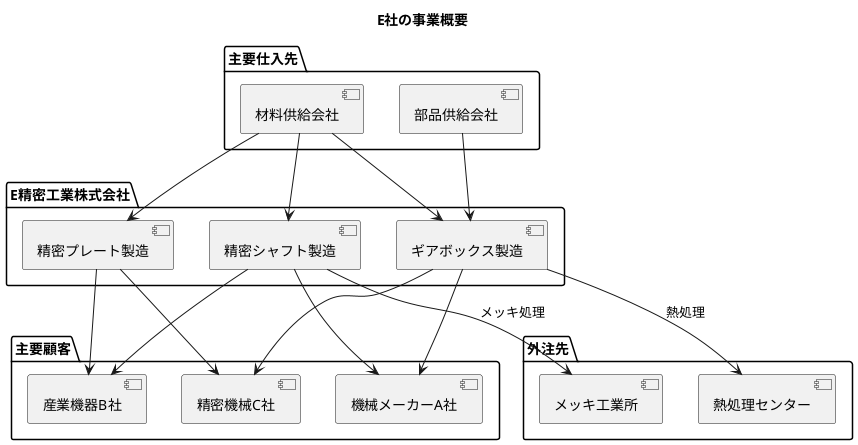
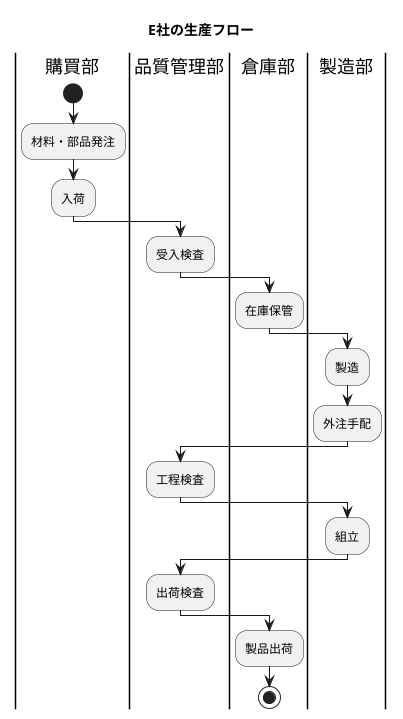
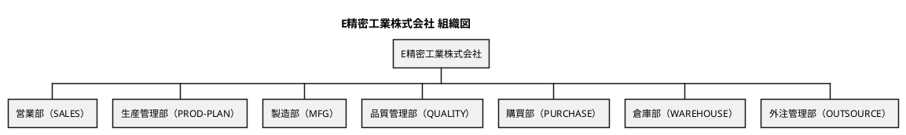
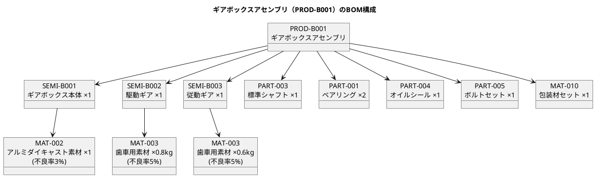

# 第31章：生産管理データ設計（E社事例）

## 31.1 E社の概要

### 会社プロファイル（精密機械部品製造業）

本章では、架空の製造業 E 社（精密機械部品メーカー）の事例を基に、生産管理システムに適したリアルなテストデータの設計と実装を解説します。

| 項目 | 内容 |
|-----|------|
| **社名** | E 精密工業株式会社（架空） |
| **業種** | 精密機械部品製造業 |
| **主要製品** | 産業用機械部品、精密シャフト、ギアボックス |
| **従業員数** | 約50名 |
| **生産形態** | 見込生産（MTS）+ 受注生産（MTO） |

### 企業概要（従業員約50名）

E 社は、産業用機械向けの精密部品を製造する中小企業です。高精度な加工技術を強みとし、多品種少量生産に対応しています。



#### 主要な製品ラインナップ

| 製品区分 | 製品例 | 特徴 |
|---------|--------|------|
| 精密シャフト | PROD-A001 | 高精度の円筒部品、メッキ処理あり |
| ギアボックス | PROD-B001 | 複数の半製品を組み立て |
| 精密プレート | PROD-C001 | 板金加工品 |

### 生産の特徴（多品種少量・受注生産型）

E 社の生産には以下の特徴があります：

1. **BOM 階層が深い**: 製品 → 半製品 → 部品・材料の多段階構成
2. **外注加工が多い**: メッキ処理、熱処理は外注依存
3. **品質管理が厳格**: 工程検査、出荷検査を徹底
4. **在庫管理が重要**: 材料、部品、半製品、製品の4層在庫



### 外注活用（メッキ処理・熱処理）

E 社では、特殊な表面処理を外注先に委託しています。

| 外注先 | 処理内容 | 対象品目 |
|-------|---------|---------|
| メッキ工業所（OUT-001） | メッキ処理 | 加工済みシャフト |
| 熱処理センター（OUT-002） | 熱処理 | 駆動ギア、従動ギア |

---

## 31.2 組織構成

### 組織図（営業部・生産管理部・製造部・品質管理部・購買部・倉庫部・外注管理部）



```
E精密工業株式会社
├── 営業部（SALES）
├── 生産管理部（PROD-PLAN）
├── 製造部（MFG）
├── 品質管理部（QUALITY）
├── 購買部（PURCHASE）
├── 倉庫部（WAREHOUSE）
└── 外注管理部（OUTSOURCE）
```

### 部門マスタの階層構造

部門マスタは以下のデータ構造で管理します。

| 部門コード | 部門名 | 役割 |
|-----------|--------|------|
| SALES | 営業部 | 受注管理、顧客対応 |
| PROD-PLAN | 生産管理部 | 生産計画、MRP |
| MFG | 製造部 | 製造作業、工程管理 |
| QUALITY | 品質管理部 | 品質検査、不良管理 |
| PURCHASE | 購買部 | 発注、仕入先管理 |
| WAREHOUSE | 倉庫部 | 在庫管理、入出庫 |
| OUTSOURCE | 外注管理部 | 外注手配、進捗管理 |

### 担当者の配置

各部門に配置される担当者のサンプルデータです。

| 担当者コード | 氏名 | 所属部門 |
|-------------|------|---------|
| EMP-001 | 田中 太郎 | 製造部 |
| EMP-002 | 鈴木 一郎 | 製造部 |
| EMP-003 | 佐藤 次郎 | 製造部 |
| EMP-004 | 高橋 三郎 | 製造部 |
| EMP-005 | 伊藤 四郎 | 製造部 |
| EMP-006 | 渡辺 五郎 | 品質管理部 |
| EMP-007 | 山本 花子 | 品質管理部 |
| EMP-008 | 中村 美咲 | 生産管理部 |
| EMP-009 | 小林 健一 | 購買部 |
| EMP-010 | 加藤 正 | 倉庫部 |
| EMP-011 | 吉田 誠 | 外注管理部 |
| EMP-012 | 山田 浩二 | 営業部 |

---

## 31.3 データ構造の設計

### 品目コード体系（PROD-/SEMI-/PART-/MAT-）

品目は、接頭辞によって区分を識別できる体系を採用しています。

| 接頭辞 | 区分 | 例 | 説明 |
|--------|------|-----|------|
| PROD- | 製品 | PROD-A001 | 販売可能な完成品 |
| SEMI- | 半製品 | SEMI-A001 | 製造途中の中間品 |
| PART- | 部品 | PART-001 | 購入部品 |
| MAT- | 材料 | MAT-001 | 原材料、包装材 |

#### 品目マスタの階層構造

```
製品（PROD-）
├── PROD-A001 精密シャフトA
├── PROD-B001 ギアボックスアセンブリ
└── PROD-C001 精密プレート

半製品（SEMI-）
├── SEMI-A001 加工済みシャフト
├── SEMI-B001 ギアボックス本体
├── SEMI-B002 駆動ギア
├── SEMI-B003 従動ギア
└── SEMI-C001 加工済みプレート

部品（PART-）
├── PART-001 ベアリング 6205
├── PART-002 オイルシール φ20
├── PART-003 標準シャフト φ10
├── PART-004 オイルシール φ30
├── PART-005 ボルトセット M6
├── PART-006 ワッシャーセット
├── PART-007 Oリング φ25
└── PART-008 ピン φ3

材料（MAT-）
├── MAT-001 丸棒材 SUS304 φ20
├── MAT-002 アルミダイキャスト素材
├── MAT-003 歯車用素材 SCM415
├── MAT-004 鋼板 SS400 t3
├── MAT-005 丸棒材 S45C φ15
├── MAT-006 真鍮丸棒 C3604 φ10
├── MAT-010 包装材セット
├── MAT-011 防錆紙
└── MAT-012 段ボール箱
```

### 取引先コード体系（SUP-/OUT-/CUS-）

取引先も接頭辞で区分を識別します。

| 接頭辞 | 区分 | 例 | 説明 |
|--------|------|-----|------|
| SUP- | 仕入先 | SUP-001 | 材料・部品の購入先 |
| OUT- | 外注先 | OUT-001 | 加工委託先 |
| CUS- | 得意先 | CUS-001 | 製品の販売先 |

#### 取引先一覧

| コード | 取引先名 | 区分 |
|--------|---------|------|
| SUP-001 | 東京スチール株式会社 | 仕入先 |
| SUP-002 | 大阪金属工業 | 仕入先 |
| SUP-003 | 名古屋ベアリング | 仕入先 |
| SUP-004 | 横浜部品センター | 仕入先 |
| SUP-005 | 神戸包装資材 | 仕入先 |
| OUT-001 | メッキ工業所 | 外注先 |
| OUT-002 | 熱処理センター | 外注先 |
| CUS-001 | 機械メーカーA社 | 得意先 |
| CUS-002 | 産業機器B社 | 得意先 |
| CUS-003 | 精密機械C社 | 得意先 |

### 工程コード体系（LATHE/MILL/GRIND/DRILL/HEAT/PLAT/ASSY/INSP）

工程は作業内容に応じたコード体系を採用しています。

| コード | 工程名 | 区分 |
|--------|--------|------|
| LATHE | 旋盤加工 | 切削 |
| MILL | フライス加工 | 切削 |
| GRIND | 研削加工 | 切削 |
| HOB | ホブ切り | 切削 |
| DRILL | 穴あけ加工 | 切削 |
| ASM | 組立 | 組立 |
| FINAL-ASM | 最終組立 | 組立 |
| INS-PROC | 工程検査 | 検査 |
| INS-SHIP | 出荷検査 | 検査 |
| INS-RCV | 受入検査 | 検査 |
| OUT-MEKI | メッキ処理 | 外注 |
| OUT-HEAT | 熱処理 | 外注 |

### BOM 階層（製品→半製品→部品→材料）

BOM（部品表）は製品の構成を階層的に定義します。

#### BOM 展開例（ギアボックスアセンブリ）



```
PROD-B001 ギアボックスアセンブリ
├── SEMI-B001 ギアボックス本体 ×1
│   └── MAT-002 アルミダイキャスト素材 ×1 (不良率3%)
├── SEMI-B002 駆動ギア ×1
│   └── MAT-003 歯車用素材 SCM415 ×0.8kg (不良率5%)
├── SEMI-B003 従動ギア ×1
│   └── MAT-003 歯車用素材 SCM415 ×0.6kg (不良率5%)
├── PART-003 標準シャフト φ10 ×1
├── PART-001 ベアリング 6205 ×2
├── PART-004 オイルシール φ30 ×1
├── PART-005 ボルトセット M6 ×1
└── MAT-010 包装材セット ×1
```

### Enum の日本語・英語マッピング

データベースでは日本語値、Java コードでは英語値を使用します。TypeHandler により相互変換を行います。

#### 品目区分（ItemCategory）

| 日本語 DB 値 | 英語 Java 値 |
|-------------|-------------|
| "製品" | PRODUCT |
| "半製品" | SEMI_FINISHED |
| "部品" | PART |
| "材料" | MATERIAL |

#### 取引先区分（SupplierType）

| 日本語 DB 値 | 英語 Java 値 |
|-------------|-------------|
| "仕入先" | VENDOR |
| "外注先" | SUBCONTRACTOR |
| "得意先" | CUSTOMER |

#### 工程区分（ProcessType）

| 日本語 DB 値 | 英語 Java 値 |
|-------------|-------------|
| "社内" | INTERNAL |
| "外注" | EXTERNAL |

#### オーダ区分（OrderType）

| 日本語 DB 値 | 英語 Java 値 |
|-------------|-------------|
| "製造" | MANUFACTURING |
| "購買" | PURCHASE |

#### オーダステータス（OrderStatus）

| 日本語 DB 値 | 英語 Java 値 |
|-------------|-------------|
| "計画" | PLANNED |
| "確定" | CONFIRMED |
| "発注済" | ORDERED |
| "完了" | COMPLETED |

#### 作業指示ステータス（WorkOrderStatus）

| 日本語 DB 値 | 英語 Java 値 |
|-------------|-------------|
| "未着手" | NOT_STARTED |
| "作業中" | IN_PROGRESS |
| "完了" | COMPLETED |

#### 在庫状態（StockStatus）

| 日本語 DB 値 | 英語 Java 値 |
|-------------|-------------|
| "合格" | PASSED |
| "不合格" | DEFECTIVE |
| "未検査" | UNINSPECTED |

#### 欠点区分（DefectCategory）

| 日本語 DB 値 | 英語 Java 値 |
|-------------|-------------|
| "加工不良" | MACHINING |
| "外観不良" | APPEARANCE |
| "表面処理不良" | SURFACE_TREATMENT |
| "熱処理不良" | HEAT_TREATMENT |
| "組立不良" | ASSEMBLY |
| "材料不良" | MATERIAL |

---

## 31.4 Seed データの実装

### 実装方針（外部キー制約・複合キー・日本語テーブル名）

Seed データ実装における技術的なポイントは以下の通りです。

1. **外部キー制約の考慮**
   - データ投入順序を外部キー依存関係に基づいて設計
   - マスタ → トランザクションの順で投入
   - 削除時は逆順（トランザクション → マスタ）

2. **複合キーの扱い**
   - 品目マスタは `(品目コード, 適用開始日)` の複合主キー
   - BOM は `(親品目コード, 親品目適用開始日, 子品目コード, 子品目適用開始日)` の複合主キー
   - 外部キー参照時は両方のキーを指定

3. **日本語テーブル名・カラム名**
   - MyBatis の resultMap を使用して日本語カラム名を英語プロパティにマッピング
   - SQL 文では日本語テーブル名・カラム名をダブルクォートで囲む

#### プロジェクト構造

```
src/
├── main/
│   └── java/
│       └── com/example/sms/
│           └── seed/
│               ├── SeedDataService.java
│               ├── MasterDataSeeder.java
│               ├── TransactionDataSeeder.java
│               └── SeedRunner.java
└── test/
    └── java/
        └── com/example/sms/
            └── seed/
                └── SeedDataIntegrationTest.java
```

### SeedDataService の設計

<details>
<summary>SeedDataService.java</summary>

```java
// src/main/java/com/example/sms/seed/SeedDataService.java
package com.example.sms.seed;

import org.apache.ibatis.session.SqlSession;
import org.apache.ibatis.session.SqlSessionFactory;
import org.slf4j.Logger;
import org.slf4j.LoggerFactory;
import org.springframework.stereotype.Service;
import org.springframework.transaction.annotation.Transactional;

import java.time.LocalDate;

@Service
public class SeedDataService {

    private static final Logger log = LoggerFactory.getLogger(SeedDataService.class);

    private final SqlSessionFactory sqlSessionFactory;
    private final MasterDataSeeder masterDataSeeder;
    private final TransactionDataSeeder transactionDataSeeder;

    public SeedDataService(
            SqlSessionFactory sqlSessionFactory,
            MasterDataSeeder masterDataSeeder,
            TransactionDataSeeder transactionDataSeeder) {
        this.sqlSessionFactory = sqlSessionFactory;
        this.masterDataSeeder = masterDataSeeder;
        this.transactionDataSeeder = transactionDataSeeder;
    }

    @Transactional
    public void seedAll() {
        log.info("========================================");
        log.info("生産管理システム Seed データ投入開始");
        log.info("========================================");

        LocalDate effectiveDate = LocalDate.of(2025, 1, 1);

        // 既存データの削除
        cleanAllData();

        // マスタデータの投入
        masterDataSeeder.seedAll(effectiveDate);

        // トランザクションデータの投入
        transactionDataSeeder.seedAll(effectiveDate);

        log.info("========================================");
        log.info("生産管理システム Seed データ投入完了!");
        log.info("========================================");
    }

    private void cleanAllData() {
        log.info("既存データを削除中...");

        try (SqlSession session = sqlSessionFactory.openSession()) {
            // トランザクションデータから削除（外部キー制約のため逆順）
            session.delete("seed.deleteAllLaborRecords");
            session.delete("seed.deleteAllCompletionRecords");
            session.delete("seed.deleteAllWorkOrderDetails");
            session.delete("seed.deleteAllWorkOrders");
            session.delete("seed.deleteAllPurchaseOrderDetails");
            session.delete("seed.deleteAllPurchaseOrders");
            session.delete("seed.deleteAllOrders");
            session.delete("seed.deleteAllStocks");

            // マスタデータを削除
            session.delete("seed.deleteAllDefects");
            session.delete("seed.deleteAllUnitPrices");
            session.delete("seed.deleteAllEmployees");
            session.delete("seed.deleteAllRoutings");
            session.delete("seed.deleteAllBoms");
            session.delete("seed.deleteAllItems");
            session.delete("seed.deleteAllProcesses");
            session.delete("seed.deleteAllWarehouses");
            session.delete("seed.deleteAllLocations");
            session.delete("seed.deleteAllSuppliers");
            session.delete("seed.deleteAllDepartments");
            session.delete("seed.deleteAllItemGroups");
            session.delete("seed.deleteAllUnits");

            session.commit();
        }

        log.info("既存データ削除完了");
    }
}
```

</details>

### MasterDataSeeder の実装（部門・担当者・品目・BOM・工程・取引先・単価）

<details>
<summary>MasterDataSeeder.java</summary>

```java
// src/main/java/com/example/sms/seed/MasterDataSeeder.java
package com.example.sms.seed;

import com.example.sms.domain.model.item.*;
import com.example.sms.domain.model.master.*;
import com.example.sms.domain.model.bom.Bom;
import com.example.sms.domain.model.process.*;
import com.example.sms.infrastructure.out.persistence.mapper.*;
import org.slf4j.Logger;
import org.slf4j.LoggerFactory;
import org.springframework.stereotype.Component;

import java.math.BigDecimal;
import java.time.LocalDate;
import java.util.List;

@Component
public class MasterDataSeeder {

    private static final Logger log = LoggerFactory.getLogger(MasterDataSeeder.class);

    private final UnitMapper unitMapper;
    private final ItemGroupMapper itemGroupMapper;
    private final DepartmentMapper departmentMapper;
    private final SupplierMapper supplierMapper;
    private final LocationMapper locationMapper;
    private final WarehouseMapper warehouseMapper;
    private final ProcessMapper processMapper;
    private final ItemMapper itemMapper;
    private final BomMapper bomMapper;
    private final RoutingMapper routingMapper;
    private final EmployeeMapper employeeMapper;
    private final UnitPriceMapper unitPriceMapper;
    private final DefectMapper defectMapper;

    public MasterDataSeeder(/* コンストラクタ引数省略 */) {
        // 依存性注入
    }

    public void seedAll(LocalDate effectiveDate) {
        seedUnits();
        seedItemGroups();
        seedDepartments(effectiveDate);
        seedSuppliers(effectiveDate);
        seedLocations();
        seedWarehouses();
        seedProcesses(effectiveDate);
        seedItems(effectiveDate);
        seedBoms(effectiveDate);
        seedRoutings(effectiveDate);
        seedEmployees(effectiveDate);
        seedUnitPrices(effectiveDate);
        seedDefects();
    }

    private void seedUnits() {
        log.info("単位マスタを投入中...");

        List<Unit> units = List.of(
            new Unit("PCS", "個"),
            new Unit("KG", "キログラム"),
            new Unit("M", "メートル"),
            new Unit("SET", "セット"),
            new Unit("L", "リットル")
        );

        units.forEach(unitMapper::insert);
        log.info("単位マスタ {}件 投入完了", units.size());
    }

    private void seedItemGroups() {
        log.info("品目グループマスタを投入中...");

        List<ItemGroup> groups = List.of(
            new ItemGroup("PRODUCT", "完成品"),
            new ItemGroup("SEMI", "半製品"),
            new ItemGroup("PART", "購入部品"),
            new ItemGroup("MATERIAL", "原材料"),
            new ItemGroup("PACKING", "梱包材"),
            new ItemGroup("BEARING", "軸受・シール部品")
        );

        groups.forEach(itemGroupMapper::insert);
        log.info("品目グループマスタ {}件 投入完了", groups.size());
    }

    private void seedDepartments(LocalDate effectiveDate) {
        log.info("部門マスタを投入中...");

        List<Department> departments = List.of(
            new Department("SALES", effectiveDate, "営業部"),
            new Department("PROD-PLAN", effectiveDate, "生産管理部"),
            new Department("MFG", effectiveDate, "製造部"),
            new Department("QUALITY", effectiveDate, "品質管理部"),
            new Department("PURCHASE", effectiveDate, "購買部"),
            new Department("WAREHOUSE", effectiveDate, "倉庫部"),
            new Department("OUTSOURCE", effectiveDate, "外注管理部")
        );

        departments.forEach(departmentMapper::insert);
        log.info("部門マスタ {}件 投入完了", departments.size());
    }

    private void seedSuppliers(LocalDate effectiveDate) {
        log.info("取引先マスタを投入中...");

        List<Supplier> suppliers = List.of(
            // 仕入先
            new Supplier("SUP-001", effectiveDate, "東京スチール株式会社", SupplierType.VENDOR),
            new Supplier("SUP-002", effectiveDate, "大阪金属工業", SupplierType.VENDOR),
            new Supplier("SUP-003", effectiveDate, "名古屋ベアリング", SupplierType.VENDOR),
            new Supplier("SUP-004", effectiveDate, "横浜部品センター", SupplierType.VENDOR),
            new Supplier("SUP-005", effectiveDate, "神戸包装資材", SupplierType.VENDOR),
            // 外注先
            new Supplier("OUT-001", effectiveDate, "メッキ工業所", SupplierType.SUBCONTRACTOR),
            new Supplier("OUT-002", effectiveDate, "熱処理センター", SupplierType.SUBCONTRACTOR),
            // 得意先
            new Supplier("CUS-001", effectiveDate, "機械メーカーA社", SupplierType.CUSTOMER),
            new Supplier("CUS-002", effectiveDate, "産業機器B社", SupplierType.CUSTOMER),
            new Supplier("CUS-003", effectiveDate, "精密機械C社", SupplierType.CUSTOMER)
        );

        suppliers.forEach(supplierMapper::insert);
        log.info("取引先マスタ {}件 投入完了", suppliers.size());
    }

    private void seedProcesses(LocalDate effectiveDate) {
        log.info("工程マスタを投入中...");

        List<Process> processes = List.of(
            // 切削工程
            new Process("LATHE", effectiveDate, "旋盤加工", ProcessType.INTERNAL),
            new Process("MILL", effectiveDate, "フライス加工", ProcessType.INTERNAL),
            new Process("GRIND", effectiveDate, "研削加工", ProcessType.INTERNAL),
            new Process("HOB", effectiveDate, "ホブ切り", ProcessType.INTERNAL),
            new Process("DRILL", effectiveDate, "穴あけ加工", ProcessType.INTERNAL),
            // 組立工程
            new Process("ASM", effectiveDate, "組立", ProcessType.INTERNAL),
            new Process("FINAL-ASM", effectiveDate, "最終組立", ProcessType.INTERNAL),
            // 検査工程
            new Process("INS-PROC", effectiveDate, "工程検査", ProcessType.INTERNAL),
            new Process("INS-SHIP", effectiveDate, "出荷検査", ProcessType.INTERNAL),
            new Process("INS-RCV", effectiveDate, "受入検査", ProcessType.INTERNAL),
            // 外注工程
            new Process("OUT-MEKI", effectiveDate, "メッキ処理", ProcessType.EXTERNAL),
            new Process("OUT-HEAT", effectiveDate, "熱処理", ProcessType.EXTERNAL)
        );

        processes.forEach(processMapper::insert);
        log.info("工程マスタ {}件 投入完了", processes.size());
    }

    private void seedItems(LocalDate effectiveDate) {
        log.info("品目マスタを投入中...");

        List<Item> items = List.of(
            // 製品
            new Item("PROD-A001", effectiveDate, "精密シャフトA",
                    ItemCategory.PRODUCT, "PRODUCT", "PCS", "WH-PROD", 7, 100),
            new Item("PROD-B001", effectiveDate, "ギアボックスアセンブリ",
                    ItemCategory.PRODUCT, "PRODUCT", "PCS", "WH-PROD", 14, 50),
            new Item("PROD-C001", effectiveDate, "精密プレート",
                    ItemCategory.PRODUCT, "PRODUCT", "PCS", "WH-PROD", 5, 80),

            // 半製品
            new Item("SEMI-A001", effectiveDate, "加工済みシャフト",
                    ItemCategory.SEMI_FINISHED, "SEMI", "PCS", "WH-PART", 5, 120),
            new Item("SEMI-B001", effectiveDate, "ギアボックス本体",
                    ItemCategory.SEMI_FINISHED, "SEMI", "PCS", "WH-PART", 7, 60),
            new Item("SEMI-B002", effectiveDate, "駆動ギア",
                    ItemCategory.SEMI_FINISHED, "SEMI", "PCS", "WH-PART", 7, 80),
            new Item("SEMI-B003", effectiveDate, "従動ギア",
                    ItemCategory.SEMI_FINISHED, "SEMI", "PCS", "WH-PART", 7, 80),
            new Item("SEMI-C001", effectiveDate, "加工済みプレート",
                    ItemCategory.SEMI_FINISHED, "SEMI", "PCS", "WH-PART", 3, 100),

            // 部品
            new Item("PART-001", effectiveDate, "ベアリング 6205",
                    ItemCategory.PART, "BEARING", "PCS", "WH-PART", 7, 100),
            new Item("PART-002", effectiveDate, "オイルシール φ20",
                    ItemCategory.PART, "BEARING", "PCS", "WH-PART", 7, 100),

            // 材料
            new Item("MAT-001", effectiveDate, "丸棒材 SUS304 φ20",
                    ItemCategory.MATERIAL, "MATERIAL", "KG", "WH-MAT", 14, 500),
            new Item("MAT-002", effectiveDate, "アルミダイキャスト素材",
                    ItemCategory.MATERIAL, "MATERIAL", "PCS", "WH-MAT", 21, 100),
            new Item("MAT-003", effectiveDate, "歯車用素材 SCM415",
                    ItemCategory.MATERIAL, "MATERIAL", "KG", "WH-MAT", 14, 300),
            new Item("MAT-010", effectiveDate, "包装材セット",
                    ItemCategory.MATERIAL, "PACKING", "SET", "WH-MAT", 3, 500)
        );

        items.forEach(itemMapper::insert);
        log.info("品目マスタ {}件 投入完了", items.size());
    }

    private void seedBoms(LocalDate effectiveDate) {
        log.info("BOMを投入中...");

        List<Bom> boms = List.of(
            // 精密シャフトA の構成
            new Bom("PROD-A001", effectiveDate, "SEMI-A001", effectiveDate,
                    BigDecimal.ONE, BigDecimal.ONE, new BigDecimal("0.02")),
            new Bom("PROD-A001", effectiveDate, "PART-001", effectiveDate,
                    BigDecimal.ONE, BigDecimal.ONE, null),
            new Bom("PROD-A001", effectiveDate, "PART-002", effectiveDate,
                    BigDecimal.ONE, BigDecimal.ONE, null),
            new Bom("PROD-A001", effectiveDate, "MAT-010", effectiveDate,
                    BigDecimal.ONE, BigDecimal.ONE, null),

            // 加工済みシャフト の構成
            new Bom("SEMI-A001", effectiveDate, "MAT-001", effectiveDate,
                    BigDecimal.ONE, new BigDecimal("0.5"), new BigDecimal("0.05")),

            // ギアボックスアセンブリ の構成
            new Bom("PROD-B001", effectiveDate, "SEMI-B001", effectiveDate,
                    BigDecimal.ONE, BigDecimal.ONE, null),
            new Bom("PROD-B001", effectiveDate, "SEMI-B002", effectiveDate,
                    BigDecimal.ONE, BigDecimal.ONE, null),
            new Bom("PROD-B001", effectiveDate, "SEMI-B003", effectiveDate,
                    BigDecimal.ONE, BigDecimal.ONE, null),
            new Bom("PROD-B001", effectiveDate, "PART-001", effectiveDate,
                    BigDecimal.ONE, new BigDecimal("2"), null)
        );

        boms.forEach(bomMapper::insert);
        log.info("BOM {}件 投入完了", boms.size());
    }

    private void seedRoutings(LocalDate effectiveDate) {
        log.info("工程表を投入中...");

        List<Routing> routings = List.of(
            // 精密シャフトA
            new Routing("PROD-A001", effectiveDate, "ASM", effectiveDate, 1, new BigDecimal("1.0")),
            new Routing("PROD-A001", effectiveDate, "INS-SHIP", effectiveDate, 2, new BigDecimal("0.5")),

            // 加工済みシャフト
            new Routing("SEMI-A001", effectiveDate, "LATHE", effectiveDate, 1, new BigDecimal("2.0")),
            new Routing("SEMI-A001", effectiveDate, "GRIND", effectiveDate, 2, new BigDecimal("1.0")),
            new Routing("SEMI-A001", effectiveDate, "OUT-MEKI", effectiveDate, 3, BigDecimal.ZERO),
            new Routing("SEMI-A001", effectiveDate, "INS-PROC", effectiveDate, 4, new BigDecimal("0.5")),

            // ギアボックスアセンブリ
            new Routing("PROD-B001", effectiveDate, "FINAL-ASM", effectiveDate, 1, new BigDecimal("2.0")),
            new Routing("PROD-B001", effectiveDate, "INS-SHIP", effectiveDate, 2, new BigDecimal("0.5"))
        );

        routings.forEach(routingMapper::insert);
        log.info("工程表 {}件 投入完了", routings.size());
    }

    private void seedEmployees(LocalDate effectiveDate) {
        log.info("担当者マスタを投入中...");

        List<Employee> employees = List.of(
            new Employee("EMP-001", effectiveDate, "田中 太郎", "MFG", effectiveDate),
            new Employee("EMP-002", effectiveDate, "鈴木 一郎", "MFG", effectiveDate),
            new Employee("EMP-006", effectiveDate, "渡辺 五郎", "QUALITY", effectiveDate),
            new Employee("EMP-008", effectiveDate, "中村 美咲", "PROD-PLAN", effectiveDate),
            new Employee("EMP-009", effectiveDate, "小林 健一", "PURCHASE", effectiveDate),
            new Employee("EMP-010", effectiveDate, "加藤 正", "WAREHOUSE", effectiveDate)
        );

        employees.forEach(employeeMapper::insert);
        log.info("担当者マスタ {}件 投入完了", employees.size());
    }

    private void seedUnitPrices(LocalDate effectiveDate) {
        log.info("単価マスタを投入中...");

        List<UnitPrice> unitPrices = List.of(
            // 材料の仕入単価
            new UnitPrice("MAT-001", effectiveDate, "SUP-001", effectiveDate,
                         effectiveDate, new BigDecimal("1500"), 10),
            new UnitPrice("MAT-002", effectiveDate, "SUP-002", effectiveDate,
                         effectiveDate, new BigDecimal("3500"), 1),
            new UnitPrice("MAT-003", effectiveDate, "SUP-002", effectiveDate,
                         effectiveDate, new BigDecimal("2000"), 10),

            // 外注加工単価
            new UnitPrice("SEMI-A001", effectiveDate, "OUT-001", effectiveDate,
                         effectiveDate, new BigDecimal("500"), 1)
        );

        unitPrices.forEach(unitPriceMapper::insert);
        log.info("単価マスタ {}件 投入完了", unitPrices.size());
    }

    private void seedDefects() {
        log.info("欠点マスタを投入中...");

        List<Defect> defects = List.of(
            new Defect("DEF-001", "寸法不良", DefectCategory.MACHINING),
            new Defect("DEF-002", "表面傷", DefectCategory.APPEARANCE),
            new Defect("DEF-003", "メッキ不良", DefectCategory.SURFACE_TREATMENT),
            new Defect("DEF-004", "熱処理不良", DefectCategory.HEAT_TREATMENT),
            new Defect("DEF-005", "組立不良", DefectCategory.ASSEMBLY),
            new Defect("DEF-006", "材料不良", DefectCategory.MATERIAL)
        );

        defects.forEach(defectMapper::insert);
        log.info("欠点マスタ {}件 投入完了", defects.size());
    }
}
```

</details>

### TransactionDataSeeder の実装（発注・入荷・作業指示・完成実績・在庫）

<details>
<summary>TransactionDataSeeder.java</summary>

```java
// src/main/java/com/example/sms/seed/TransactionDataSeeder.java
package com.example.sms.seed;

import com.example.sms.domain.model.inventory.*;
import com.example.sms.domain.model.order.*;
import com.example.sms.domain.model.purchase.*;
import com.example.sms.domain.model.workorder.*;
import com.example.sms.infrastructure.out.persistence.mapper.*;
import org.slf4j.Logger;
import org.slf4j.LoggerFactory;
import org.springframework.stereotype.Component;

import java.math.BigDecimal;
import java.time.LocalDate;
import java.time.LocalDateTime;
import java.util.List;

@Component
public class TransactionDataSeeder {

    private static final Logger log = LoggerFactory.getLogger(TransactionDataSeeder.class);

    private final StockMapper stockMapper;
    private final OrderMapper orderMapper;
    private final PurchaseOrderMapper purchaseOrderMapper;
    private final PurchaseOrderDetailMapper purchaseOrderDetailMapper;
    private final WorkOrderMapper workOrderMapper;
    private final WorkOrderDetailMapper workOrderDetailMapper;
    private final CompletionRecordMapper completionRecordMapper;
    private final LaborRecordMapper laborRecordMapper;

    public TransactionDataSeeder(/* コンストラクタ引数省略 */) {
        // 依存性注入
    }

    public void seedAll(LocalDate effectiveDate) {
        seedStocks(effectiveDate);
        seedOrders(effectiveDate);
        seedPurchaseOrders(effectiveDate);
        seedWorkOrders(effectiveDate);
        seedCompletionRecords(effectiveDate);
        seedLaborRecords(effectiveDate);
    }

    private void seedStocks(LocalDate effectiveDate) {
        log.info("在庫情報を投入中...");

        List<Stock> stocks = List.of(
            // 材料倉庫
            new Stock("WH-MAT", "MAT-001", effectiveDate,
                     new BigDecimal("800"), StockStatus.PASSED),
            new Stock("WH-MAT", "MAT-002", effectiveDate,
                     new BigDecimal("150"), StockStatus.PASSED),
            new Stock("WH-MAT", "MAT-003", effectiveDate,
                     new BigDecimal("450"), StockStatus.PASSED),
            new Stock("WH-MAT", "MAT-010", effectiveDate,
                     new BigDecimal("600"), StockStatus.PASSED),

            // 部品倉庫
            new Stock("WH-PART", "PART-001", effectiveDate,
                     new BigDecimal("200"), StockStatus.PASSED),
            new Stock("WH-PART", "PART-002", effectiveDate,
                     new BigDecimal("150"), StockStatus.PASSED),

            // 半製品在庫
            new Stock("WH-PART", "SEMI-A001", effectiveDate,
                     new BigDecimal("50"), StockStatus.PASSED),
            new Stock("WH-PART", "SEMI-B001", effectiveDate,
                     new BigDecimal("30"), StockStatus.PASSED),
            new Stock("WH-PART", "SEMI-B002", effectiveDate,
                     new BigDecimal("40"), StockStatus.PASSED),
            new Stock("WH-PART", "SEMI-B003", effectiveDate,
                     new BigDecimal("40"), StockStatus.PASSED),

            // 製品倉庫
            new Stock("WH-PROD", "PROD-A001", effectiveDate,
                     new BigDecimal("80"), StockStatus.PASSED),
            new Stock("WH-PROD", "PROD-B001", effectiveDate,
                     new BigDecimal("45"), StockStatus.PASSED),
            new Stock("WH-PROD", "PROD-C001", effectiveDate,
                     new BigDecimal("60"), StockStatus.PASSED)
        );

        stocks.forEach(stockMapper::insert);
        log.info("在庫情報 {}件 投入完了", stocks.size());
    }

    private void seedOrders(LocalDate effectiveDate) {
        log.info("オーダ情報を投入中...");

        List<Order> orders = List.of(
            // 製造オーダ
            new Order("MO-2025-001", OrderType.MANUFACTURING, "PROD-A001", effectiveDate,
                     new BigDecimal("100"), LocalDate.of(2025, 1, 31), OrderStatus.CONFIRMED),
            new Order("MO-2025-002", OrderType.MANUFACTURING, "PROD-A001", effectiveDate,
                     new BigDecimal("100"), LocalDate.of(2025, 2, 7), OrderStatus.PLANNED),
            new Order("MO-2025-003", OrderType.MANUFACTURING, "PROD-B001", effectiveDate,
                     new BigDecimal("50"), LocalDate.of(2025, 1, 31), OrderStatus.CONFIRMED),

            // 購買オーダ
            new Order("PO-2025-001", OrderType.PURCHASE, "MAT-001", effectiveDate,
                     new BigDecimal("200"), LocalDate.of(2025, 1, 20), OrderStatus.ORDERED),
            new Order("PO-2025-002", OrderType.PURCHASE, "MAT-003", effectiveDate,
                     new BigDecimal("150"), LocalDate.of(2025, 1, 22), OrderStatus.ORDERED)
        );

        orders.forEach(orderMapper::insert);
        log.info("オーダ情報 {}件 投入完了", orders.size());
    }

    private void seedPurchaseOrders(LocalDate effectiveDate) {
        log.info("発注データを投入中...");

        // 発注1
        PurchaseOrder po1 = new PurchaseOrder(
            "PUR-2025-001", LocalDate.of(2025, 1, 10),
            "SUP-001", effectiveDate, PurchaseOrderStatus.CONFIRMED
        );
        purchaseOrderMapper.insert(po1);

        purchaseOrderDetailMapper.insert(new PurchaseOrderDetail(
            "PUR-2025-001", 1, "MAT-001", effectiveDate,
            new BigDecimal("200"), new BigDecimal("1500"), LocalDate.of(2025, 1, 20)
        ));

        // 発注2
        PurchaseOrder po2 = new PurchaseOrder(
            "PUR-2025-002", LocalDate.of(2025, 1, 10),
            "SUP-002", effectiveDate, PurchaseOrderStatus.CONFIRMED
        );
        purchaseOrderMapper.insert(po2);

        purchaseOrderDetailMapper.insert(new PurchaseOrderDetail(
            "PUR-2025-002", 1, "MAT-003", effectiveDate,
            new BigDecimal("150"), new BigDecimal("2000"), LocalDate.of(2025, 1, 22)
        ));

        log.info("発注データ 2件 投入完了");
    }

    private void seedWorkOrders(LocalDate effectiveDate) {
        log.info("作業指示データを投入中...");

        // 作業指示1
        WorkOrder wo1 = new WorkOrder(
            "WO-2025-001", "MO-2025-001",
            LocalDate.of(2025, 1, 15), WorkOrderStatus.IN_PROGRESS
        );
        workOrderMapper.insert(wo1);

        workOrderDetailMapper.insert(new WorkOrderDetail(
            "WO-2025-001", 1, "ASM", effectiveDate,
            new BigDecimal("100"),
            LocalDateTime.of(2025, 1, 20, 9, 0),
            LocalDateTime.of(2025, 1, 20, 17, 0)
        ));
        workOrderDetailMapper.insert(new WorkOrderDetail(
            "WO-2025-001", 2, "INS-SHIP", effectiveDate,
            new BigDecimal("100"),
            LocalDateTime.of(2025, 1, 21, 9, 0),
            LocalDateTime.of(2025, 1, 21, 12, 0)
        ));

        // 作業指示2（完了済み）
        WorkOrder wo2 = new WorkOrder(
            "WO-2025-002", "MO-2025-005",
            LocalDate.of(2025, 1, 12), WorkOrderStatus.COMPLETED
        );
        workOrderMapper.insert(wo2);

        workOrderDetailMapper.insert(new WorkOrderDetail(
            "WO-2025-002", 1, "LATHE", effectiveDate,
            new BigDecimal("120"),
            LocalDateTime.of(2025, 1, 15, 9, 0),
            LocalDateTime.of(2025, 1, 16, 17, 0)
        ));

        log.info("作業指示データ 2件 投入完了");
    }

    private void seedCompletionRecords(LocalDate effectiveDate) {
        log.info("完成実績データを投入中...");

        List<CompletionRecord> records = List.of(
            new CompletionRecord(
                "CR-2025-001", "WO-2025-002", 1,
                LocalDate.of(2025, 1, 16),
                new BigDecimal("118"), new BigDecimal("116"), new BigDecimal("2"),
                "EMP-001", effectiveDate
            ),
            new CompletionRecord(
                "CR-2025-002", "WO-2025-002", 2,
                LocalDate.of(2025, 1, 17),
                new BigDecimal("116"), new BigDecimal("115"), new BigDecimal("1"),
                "EMP-002", effectiveDate
            )
        );

        records.forEach(completionRecordMapper::insert);
        log.info("完成実績データ {}件 投入完了", records.size());
    }

    private void seedLaborRecords(LocalDate effectiveDate) {
        log.info("工数実績データを投入中...");

        List<LaborRecord> records = List.of(
            new LaborRecord(
                "LH-2025-001", "WO-2025-002", 1,
                LocalDate.of(2025, 1, 15),
                "EMP-001", effectiveDate,
                new BigDecimal("8.0"), new BigDecimal("0.5")
            ),
            new LaborRecord(
                "LH-2025-002", "WO-2025-002", 1,
                LocalDate.of(2025, 1, 16),
                "EMP-001", effectiveDate,
                new BigDecimal("6.0"), BigDecimal.ZERO
            )
        );

        records.forEach(laborRecordMapper::insert);
        log.info("工数実績データ {}件 投入完了", records.size());
    }
}
```

</details>

### Seed 削除用 Mapper XML

<details>
<summary>seed-mapper.xml</summary>

```xml
<?xml version="1.0" encoding="UTF-8" ?>
<!DOCTYPE mapper PUBLIC "-//mybatis.org//DTD Mapper 3.0//EN"
    "http://mybatis.org/dtd/mybatis-3-mapper.dtd">
<mapper namespace="seed">

    <!-- 削除文（トランザクションデータ） -->
    <delete id="deleteAllLaborRecords">
        DELETE FROM "工数実績データ"
    </delete>

    <delete id="deleteAllCompletionRecords">
        DELETE FROM "完成実績データ"
    </delete>

    <delete id="deleteAllWorkOrderDetails">
        DELETE FROM "作業指示明細データ"
    </delete>

    <delete id="deleteAllWorkOrders">
        DELETE FROM "作業指示データ"
    </delete>

    <delete id="deleteAllPurchaseOrderDetails">
        DELETE FROM "発注明細データ"
    </delete>

    <delete id="deleteAllPurchaseOrders">
        DELETE FROM "発注データ"
    </delete>

    <delete id="deleteAllOrders">
        DELETE FROM "オーダ情報"
    </delete>

    <delete id="deleteAllStocks">
        DELETE FROM "在庫情報"
    </delete>

    <!-- 削除文（マスタデータ） -->
    <delete id="deleteAllDefects">
        DELETE FROM "欠点マスタ"
    </delete>

    <delete id="deleteAllUnitPrices">
        DELETE FROM "単価マスタ"
    </delete>

    <delete id="deleteAllEmployees">
        DELETE FROM "担当者マスタ"
    </delete>

    <delete id="deleteAllRoutings">
        DELETE FROM "工程表"
    </delete>

    <delete id="deleteAllBoms">
        DELETE FROM "BOM"
    </delete>

    <delete id="deleteAllItems">
        DELETE FROM "品目マスタ"
    </delete>

    <delete id="deleteAllProcesses">
        DELETE FROM "工程マスタ"
    </delete>

    <delete id="deleteAllWarehouses">
        DELETE FROM "倉庫マスタ"
    </delete>

    <delete id="deleteAllLocations">
        DELETE FROM "場所マスタ"
    </delete>

    <delete id="deleteAllSuppliers">
        DELETE FROM "取引先マスタ"
    </delete>

    <delete id="deleteAllDepartments">
        DELETE FROM "部門マスタ"
    </delete>

    <delete id="deleteAllItemGroups">
        DELETE FROM "品目グループマスタ"
    </delete>

    <delete id="deleteAllUnits">
        DELETE FROM "単位マスタ"
    </delete>

</mapper>
```

</details>

### 実行方法

#### Gradle タスクの設定

```kotlin
// build.gradle.kts
tasks.register<JavaExec>("seedData") {
    group = "application"
    description = "Seed データを投入する"
    mainClass.set("com.example.sms.seed.SeedRunner")
    classpath = sourceSets["main"].runtimeClasspath
    args("--spring.profiles.active=seed")
}
```

#### 実行コマンド

```bash
# Gradle タスクで実行
./gradlew seedData

# または直接 Java で実行
java -jar build/libs/production-management.jar --spring.profiles.active=seed
```

---

## 31.5 データの検証と活用

### データの整合性確認（BOM 展開・在庫残高・発注残）

<details>
<summary>SeedDataIntegrationTest.java</summary>

```java
// src/test/java/com/example/sms/seed/SeedDataIntegrationTest.java
package com.example.sms.seed;

import com.example.sms.domain.model.bom.Bom;
import com.example.sms.domain.model.inventory.Stock;
import com.example.sms.domain.model.item.Item;
import com.example.sms.infrastructure.out.persistence.mapper.*;
import org.junit.jupiter.api.*;
import org.springframework.beans.factory.annotation.Autowired;
import org.springframework.boot.test.context.SpringBootTest;
import org.springframework.test.context.DynamicPropertyRegistry;
import org.springframework.test.context.DynamicPropertySource;
import org.testcontainers.containers.PostgreSQLContainer;
import org.testcontainers.junit.jupiter.Container;
import org.testcontainers.junit.jupiter.Testcontainers;

import java.util.List;

import static org.assertj.core.api.Assertions.assertThat;

@SpringBootTest
@Testcontainers
@DisplayName("Seed データ整合性チェック")
class SeedDataIntegrationTest {

    @Container
    static PostgreSQLContainer<?> postgres = new PostgreSQLContainer<>("postgres:15")
            .withDatabaseName("production_test")
            .withUsername("test")
            .withPassword("test");

    @DynamicPropertySource
    static void configureProperties(DynamicPropertyRegistry registry) {
        registry.add("spring.datasource.url", postgres::getJdbcUrl);
        registry.add("spring.datasource.username", postgres::getUsername);
        registry.add("spring.datasource.password", postgres::getPassword);
    }

    @Autowired
    private SeedDataService seedDataService;

    @Autowired
    private ItemMapper itemMapper;

    @Autowired
    private BomMapper bomMapper;

    @Autowired
    private StockMapper stockMapper;

    @BeforeEach
    void seedData() {
        seedDataService.seedAll();
    }

    @Nested
    @DisplayName("マスタデータの妥当性検証")
    class MasterDataValidation {

        @Test
        @DisplayName("すべての品目が単位を持つ")
        void allItemsHaveUnit() {
            List<Item> items = itemMapper.findAll();

            assertThat(items).isNotEmpty();
            for (Item item : items) {
                assertThat(item.getUnitCode()).isNotBlank();
            }
        }

        @Test
        @DisplayName("すべての品目がデフォルト場所を持つ")
        void allItemsHaveDefaultLocation() {
            List<Item> items = itemMapper.findAll();

            for (Item item : items) {
                assertThat(item.getLocationCode()).isNotBlank();
            }
        }
    }

    @Nested
    @DisplayName("BOM 展開の整合性確認")
    class BomIntegrity {

        @Test
        @DisplayName("製品のBOMが正しく展開できる")
        void productBomCanBeExpanded() {
            List<Bom> boms = bomMapper.findByParentItemCode("PROD-A001");

            assertThat(boms).isNotEmpty();
            for (Bom bom : boms) {
                assertThat(bom.getRequiredQuantity()).isPositive();
            }
        }

        @Test
        @DisplayName("BOM に循環参照がない")
        void noCyclicReferenceInBom() {
            List<Bom> allBoms = bomMapper.findAll();

            for (Bom bom : allBoms) {
                // 簡易的な循環参照チェック（親=子は禁止）
                assertThat(bom.getParentItemCode())
                    .isNotEqualTo(bom.getChildItemCode());
            }
        }
    }

    @Nested
    @DisplayName("在庫数量の正確性検証")
    class StockValidation {

        @Test
        @DisplayName("在庫数量が0以上である")
        void stockQuantityIsNonNegative() {
            List<Stock> stocks = stockMapper.findAll();

            assertThat(stocks).isNotEmpty();
            for (Stock stock : stocks) {
                assertThat(stock.getQuantity()).isNotNegative();
            }
        }
    }
}
```

</details>

### サンプルデータの活用方法

このデータを使って以下の業務を学習・検証できます：

| 業務領域 | 学習内容 |
|---------|---------|
| **MRP（所要量展開）** | 製品の生産計画から必要な部品・材料の数量を計算 |
| **購買管理** | 発注から検収までの一連のフロー |
| **外注管理** | 支給品の管理と消費記録 |
| **工程管理** | 作業指示から完成実績までの追跡 |
| **在庫管理** | 品目×場所での在庫状態管理 |

### テストシナリオへの応用

#### MRP 実行結果の検証

```java
@Test
@DisplayName("製造オーダから所要量が正しく計算される")
void calculateRequirementsFromManufacturingOrder() {
    var order = orderMapper.findByOrderNumber("MO-2025-001");

    assertThat(order).isNotNull();
    assertThat(order.getQuantity()).isEqualByComparingTo(new BigDecimal("100"));

    // BOM展開で必要量を計算
    List<Bom> boms = bomMapper.findByParentItemCode(order.getItemCode());

    for (Bom bom : boms) {
        BigDecimal requiredQty = order.getQuantity()
            .multiply(bom.getRequiredQuantity());
        System.out.println(bom.getChildItemCode() + ": " + requiredQty + "個");
    }
}
```

---

## まとめ

本章では、E 社事例を基に生産管理システムのデータ設計と Seed データ実装を解説しました。

### 実装したデータ

| カテゴリ | 内容 |
|---------|------|
| **マスタデータ** | 品目25件、BOM20件、工程表24件、取引先10件 |
| **トランザクション** | オーダ9件、発注3件、作業指示2件、完成実績2件 |
| **在庫情報** | 17箇所×品目の初期在庫 |

### データの特徴

1. **階層的な製品構成**: 製品→半製品→部品→材料の BOM 構造
2. **工程の多様性**: 切削、外注（メッキ、熱処理）、組立、検査
3. **トレーサビリティ**: オーダから完成実績まで追跡可能
4. **命名規則の分離**: Java は英語、DB は日本語

### 学習効果

- 生産管理業務の全体像を把握
- TDD によるドメイン知識の習得
- 実務に即したデータ設計の経験

### 次章への橋渡し

次章では、このデータモデルを活用した API サービスの実装に進みます。ヘキサゴナルアーキテクチャに基づいた REST API の設計と実装を解説します。

---

[← 第30章：製造原価管理の設計](chapter30.md) | [第32章：APIサービスの実装 →](chapter32.md)
