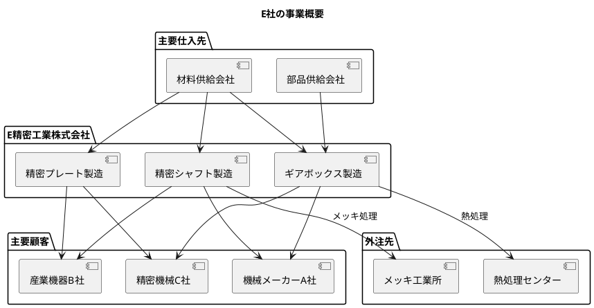
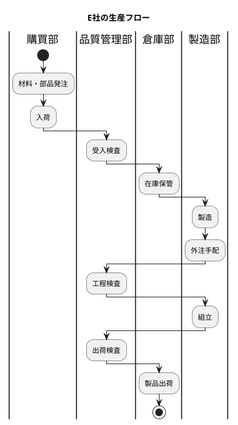
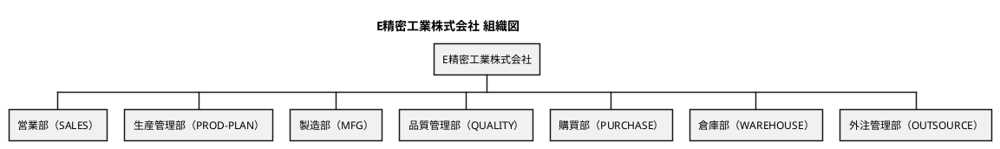
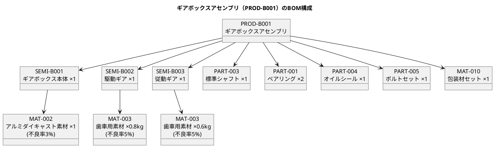

# 第31章：生産管理データ設計（E社事例）

## 31.1 E社の概要

### 会社プロファイル（精密機械部品製造業）

本章では、架空の製造業 E 社（精密機械部品メーカー）の事例を基に、生産管理システムに適したリアルなテストデータの設計と実装を解説します。

| 項目 | 内容 |
|-----|------|
| **社名** | E 精密工業株式会社（架空） |
| **業種** | 精密機械部品製造業 |
| **主要製品** | 産業用機械部品、精密シャフト、ギアボックス |
| **従業員数** | 約50名 |
| **生産形態** | 見込生産（MTS）+ 受注生産（MTO） |

### 企業概要（従業員約50名）

E 社は、産業用機械向けの精密部品を製造する中小企業です。高精度な加工技術を強みとし、多品種少量生産に対応しています。



#### 主要な製品ラインナップ

| 製品区分 | 製品例 | 特徴 |
|---------|--------|------|
| 精密シャフト | PROD-A001 | 高精度の円筒部品、メッキ処理あり |
| ギアボックス | PROD-B001 | 複数の半製品を組み立て |
| 精密プレート | PROD-C001 | 板金加工品 |

### 生産の特徴（多品種少量・受注生産型）

E 社の生産には以下の特徴があります：

1. **BOM 階層が深い**: 製品 → 半製品 → 部品・材料の多段階構成
2. **外注加工が多い**: メッキ処理、熱処理は外注依存
3. **品質管理が厳格**: 工程検査、出荷検査を徹底
4. **在庫管理が重要**: 材料、部品、半製品、製品の4層在庫



### 外注活用（メッキ処理・熱処理）

E 社では、特殊な表面処理を外注先に委託しています。

| 外注先 | 処理内容 | 対象品目 |
|-------|---------|---------|
| メッキ工業所（OUT-001） | メッキ処理 | 加工済みシャフト |
| 熱処理センター（OUT-002） | 熱処理 | 駆動ギア、従動ギア |

---

## 31.2 組織構成

### 組織図（営業部・生産管理部・製造部・品質管理部・購買部・倉庫部・外注管理部）



```
E精密工業株式会社
├── 営業部（SALES）
├── 生産管理部（PROD-PLAN）
├── 製造部（MFG）
├── 品質管理部（QUALITY）
├── 購買部（PURCHASE）
├── 倉庫部（WAREHOUSE）
└── 外注管理部（OUTSOURCE）
```

### 部門マスタの階層構造

部門マスタは以下のデータ構造で管理します。

| 部門コード | 部門名 | 役割 |
|-----------|--------|------|
| SALES | 営業部 | 受注管理、顧客対応 |
| PROD-PLAN | 生産管理部 | 生産計画、MRP |
| MFG | 製造部 | 製造作業、工程管理 |
| QUALITY | 品質管理部 | 品質検査、不良管理 |
| PURCHASE | 購買部 | 発注、仕入先管理 |
| WAREHOUSE | 倉庫部 | 在庫管理、入出庫 |
| OUTSOURCE | 外注管理部 | 外注手配、進捗管理 |

### 担当者の配置

各部門に配置される担当者のサンプルデータです。

| 担当者コード | 氏名 | 所属部門 |
|-------------|------|---------|
| EMP-001 | 田中 太郎 | 製造部 |
| EMP-002 | 鈴木 一郎 | 製造部 |
| EMP-003 | 佐藤 次郎 | 製造部 |
| EMP-004 | 高橋 三郎 | 製造部 |
| EMP-005 | 伊藤 四郎 | 製造部 |
| EMP-006 | 渡辺 五郎 | 品質管理部 |
| EMP-007 | 山本 花子 | 品質管理部 |
| EMP-008 | 中村 美咲 | 生産管理部 |
| EMP-009 | 小林 健一 | 購買部 |
| EMP-010 | 加藤 正 | 倉庫部 |
| EMP-011 | 吉田 誠 | 外注管理部 |
| EMP-012 | 山田 浩二 | 営業部 |

---

## 31.3 データ構造の設計

### 品目コード体系（PROD-/SEMI-/PART-/MAT-）

品目は、接頭辞によって区分を識別できる体系を採用しています。

| 接頭辞 | 区分 | 例 | 説明 |
|--------|------|-----|------|
| PROD- | 製品 | PROD-A001 | 販売可能な完成品 |
| SEMI- | 半製品 | SEMI-A001 | 製造途中の中間品 |
| PART- | 部品 | PART-001 | 購入部品 |
| MAT- | 材料 | MAT-001 | 原材料、包装材 |

#### 品目マスタの階層構造

```
製品（PROD-）
├── PROD-A001 精密シャフトA
├── PROD-B001 ギアボックスアセンブリ
└── PROD-C001 精密プレート

半製品（SEMI-）
├── SEMI-A001 加工済みシャフト
├── SEMI-B001 ギアボックス本体
├── SEMI-B002 駆動ギア
├── SEMI-B003 従動ギア
└── SEMI-C001 加工済みプレート

部品（PART-）
├── PART-001 ベアリング 6205
├── PART-002 オイルシール φ20
├── PART-003 標準シャフト φ10
├── PART-004 オイルシール φ30
├── PART-005 ボルトセット M6
├── PART-006 ワッシャーセット
├── PART-007 Oリング φ25
└── PART-008 ピン φ3

材料（MAT-）
├── MAT-001 丸棒材 SUS304 φ20
├── MAT-002 アルミダイキャスト素材
├── MAT-003 歯車用素材 SCM415
├── MAT-004 鋼板 SS400 t3
├── MAT-005 丸棒材 S45C φ15
├── MAT-006 真鍮丸棒 C3604 φ10
├── MAT-010 包装材セット
├── MAT-011 防錆紙
└── MAT-012 段ボール箱
```

### 取引先コード体系（SUP-/OUT-/CUS-）

取引先も接頭辞で区分を識別します。

| 接頭辞 | 区分 | 例 | 説明 |
|--------|------|-----|------|
| SUP- | 仕入先 | SUP-001 | 材料・部品の購入先 |
| OUT- | 外注先 | OUT-001 | 加工委託先 |
| CUS- | 得意先 | CUS-001 | 製品の販売先 |

#### 取引先一覧

| コード | 取引先名 | 区分 |
|--------|---------|------|
| SUP-001 | 東京スチール株式会社 | 仕入先 |
| SUP-002 | 大阪金属工業 | 仕入先 |
| SUP-003 | 名古屋ベアリング | 仕入先 |
| SUP-004 | 横浜部品センター | 仕入先 |
| SUP-005 | 神戸包装資材 | 仕入先 |
| OUT-001 | メッキ工業所 | 外注先 |
| OUT-002 | 熱処理センター | 外注先 |
| CUS-001 | 機械メーカーA社 | 得意先 |
| CUS-002 | 産業機器B社 | 得意先 |
| CUS-003 | 精密機械C社 | 得意先 |

### 工程コード体系（LATHE/MILL/GRIND/DRILL/HEAT/PLAT/ASSY/INSP）

工程は作業内容に応じたコード体系を採用しています。

| コード | 工程名 | 区分 |
|--------|--------|------|
| LATHE | 旋盤加工 | 切削 |
| MILL | フライス加工 | 切削 |
| GRIND | 研削加工 | 切削 |
| HOB | ホブ切り | 切削 |
| DRILL | 穴あけ加工 | 切削 |
| ASM | 組立 | 組立 |
| FINAL-ASM | 最終組立 | 組立 |
| INS-PROC | 工程検査 | 検査 |
| INS-SHIP | 出荷検査 | 検査 |
| INS-RCV | 受入検査 | 検査 |
| OUT-MEKI | メッキ処理 | 外注 |
| OUT-HEAT | 熱処理 | 外注 |

### BOM 階層（製品→半製品→部品→材料）

BOM（部品表）は製品の構成を階層的に定義します。

#### BOM 展開例（ギアボックスアセンブリ）



```
PROD-B001 ギアボックスアセンブリ
├── SEMI-B001 ギアボックス本体 ×1
│   └── MAT-002 アルミダイキャスト素材 ×1 (不良率3%)
├── SEMI-B002 駆動ギア ×1
│   └── MAT-003 歯車用素材 SCM415 ×0.8kg (不良率5%)
├── SEMI-B003 従動ギア ×1
│   └── MAT-003 歯車用素材 SCM415 ×0.6kg (不良率5%)
├── PART-003 標準シャフト φ10 ×1
├── PART-001 ベアリング 6205 ×2
├── PART-004 オイルシール φ30 ×1
├── PART-005 ボルトセット M6 ×1
└── MAT-010 包装材セット ×1
```

### Enum の日本語・英語マッピング

データベースでは日本語値、Java コードでは英語値を使用します。TypeHandler により相互変換を行います。

#### 品目区分（ItemCategory）

| 日本語 DB 値 | 英語 Java 値 |
|-------------|-------------|
| "製品" | PRODUCT |
| "半製品" | SEMI_FINISHED |
| "部品" | PART |
| "材料" | MATERIAL |

#### 取引先区分（SupplierType）

| 日本語 DB 値 | 英語 Java 値 |
|-------------|-------------|
| "仕入先" | VENDOR |
| "外注先" | SUBCONTRACTOR |
| "得意先" | CUSTOMER |

#### 工程区分（ProcessType）

| 日本語 DB 値 | 英語 Java 値 |
|-------------|-------------|
| "社内" | INTERNAL |
| "外注" | EXTERNAL |

#### オーダ区分（OrderType）

| 日本語 DB 値 | 英語 Java 値 |
|-------------|-------------|
| "製造" | MANUFACTURING |
| "購買" | PURCHASE |

#### オーダステータス（OrderStatus）

| 日本語 DB 値 | 英語 Java 値 |
|-------------|-------------|
| "計画" | PLANNED |
| "確定" | CONFIRMED |
| "発注済" | ORDERED |
| "完了" | COMPLETED |

#### 作業指示ステータス（WorkOrderStatus）

| 日本語 DB 値 | 英語 Java 値 |
|-------------|-------------|
| "未着手" | NOT_STARTED |
| "作業中" | IN_PROGRESS |
| "完了" | COMPLETED |

#### 在庫状態（StockStatus）

| 日本語 DB 値 | 英語 Java 値 |
|-------------|-------------|
| "合格" | PASSED |
| "不合格" | DEFECTIVE |
| "未検査" | UNINSPECTED |

#### 欠点区分（DefectCategory）

| 日本語 DB 値 | 英語 Java 値 |
|-------------|-------------|
| "加工不良" | MACHINING |
| "外観不良" | APPEARANCE |
| "表面処理不良" | SURFACE_TREATMENT |
| "熱処理不良" | HEAT_TREATMENT |
| "組立不良" | ASSEMBLY |
| "材料不良" | MATERIAL |

---

## 31.4 Seed データの実装

### 実装方針（外部キー制約・複合キー・日本語テーブル名）

Seed データ実装における技術的なポイントは以下の通りです。

1. **外部キー制約の考慮**
   - データ投入順序を外部キー依存関係に基づいて設計
   - マスタ → トランザクションの順で投入
   - 削除時は逆順（トランザクション → マスタ）

2. **複合キーの扱い**
   - 品目マスタは `(品目コード, 適用開始日)` の複合主キー
   - BOM は `(親品目コード, 親品目適用開始日, 子品目コード, 子品目適用開始日)` の複合主キー
   - 外部キー参照時は両方のキーを指定

3. **日本語テーブル名・カラム名**
   - MyBatis の resultMap を使用して日本語カラム名を英語プロパティにマッピング
   - SQL 文では日本語テーブル名・カラム名をダブルクォートで囲む

#### プロジェクト構造

```
apps/pms/backend/src/
├── main/
│   └── java/
│       └── com/example/pms/
│           └── infrastructure/in/seed/
│               ├── SeedDataService.java      # Seed データ投入サービス
│               ├── MasterDataSeeder.java     # マスタデータ Seeder
│               ├── TransactionDataSeeder.java # トランザクションデータ Seeder
│               └── SeedDataRunner.java       # 起動時実行 Runner
└── test/
    └── java/
        └── com/example/pms/
            └── integration/
                └── SeedDataIntegrationTest.java
```

### SeedDataService の設計

<details>
<summary>SeedDataService.java</summary>

```java
package com.example.pms.infrastructure.in.seed;

import lombok.RequiredArgsConstructor;
import lombok.extern.slf4j.Slf4j;
import org.springframework.stereotype.Service;
import org.springframework.transaction.annotation.Transactional;

/**
 * Seed データ投入サービス.
 * 生産管理システム（E社事例 chapter31.md 準拠）の初期データを投入する。
 */
@Service
@RequiredArgsConstructor
@Slf4j
public class SeedDataService {

    private final MasterDataSeeder masterDataSeeder;
    private final TransactionDataSeeder transactionDataSeeder;

    /**
     * すべての Seed データを投入.
     */
    @Transactional
    public void seedAll() {
        log.info("========================================");
        log.info("生産管理システム Seed データ投入開始");
        log.info("========================================");

        // マスタデータの投入
        masterDataSeeder.seedAll();

        // トランザクションデータの投入
        transactionDataSeeder.seedAll();

        log.info("========================================");
        log.info("生産管理システム Seed データ投入完了!");
        log.info("========================================");
    }

    /**
     * マスタデータのみ投入.
     */
    @Transactional
    public void seedMasterDataOnly() {
        log.info("マスタデータのみ投入開始");
        masterDataSeeder.seedAll();
        log.info("マスタデータ投入完了");
    }

    /**
     * すべてのデータを削除.
     */
    @Transactional
    public void cleanAllData() {
        log.info("既存データを削除中...");

        // トランザクションデータから削除（外部キー制約のため逆順）
        transactionDataSeeder.cleanAll();

        // マスタデータを削除
        masterDataSeeder.cleanAll();

        log.info("既存データ削除完了");
    }
}
```

</details>

### SeedDataRunner の実装

<details>
<summary>SeedDataRunner.java</summary>

```java
package com.example.pms.infrastructure.in.seed;

import lombok.RequiredArgsConstructor;
import lombok.extern.slf4j.Slf4j;
import org.springframework.boot.ApplicationArguments;
import org.springframework.boot.ApplicationRunner;
import org.springframework.context.annotation.Profile;
import org.springframework.stereotype.Component;

/**
 * アプリケーション起動時に Seed データを投入する Runner.
 * default または demo プロファイルが有効な場合に実行される.
 */
@Component
@Profile({"default", "demo"})
@RequiredArgsConstructor
@Slf4j
public class SeedDataRunner implements ApplicationRunner {

    private final SeedDataService seedDataService;

    @Override
    public void run(ApplicationArguments args) {
        if (log.isInfoEnabled()) {
            log.info("Running seed data initialization...");
        }
        seedDataService.seedAll();
    }
}
```

</details>

### MasterDataSeeder の実装（部門・担当者・品目・BOM・工程・取引先・単価）

<details>
<summary>MasterDataSeeder.java（抜粋）</summary>

```java
package com.example.pms.infrastructure.in.seed;

import com.example.pms.application.port.out.*;
import com.example.pms.domain.model.bom.Bom;
import com.example.pms.domain.model.department.Department;
import com.example.pms.domain.model.item.Item;
import com.example.pms.domain.model.item.ItemCategory;
import com.example.pms.domain.model.process.Process;
import com.example.pms.domain.model.process.ProcessRoute;
import com.example.pms.domain.model.supplier.Supplier;
import com.example.pms.domain.model.supplier.SupplierType;
import com.example.pms.domain.model.unit.Unit;
import com.example.pms.domain.model.unitprice.UnitPrice;
import java.math.BigDecimal;
import java.time.LocalDate;
import java.util.List;
import lombok.RequiredArgsConstructor;
import lombok.extern.slf4j.Slf4j;
import org.springframework.stereotype.Component;

/**
 * マスタデータ Seeder.
 * chapter31.md 準拠の E 社マスタデータを投入する。
 */
@Component
@RequiredArgsConstructor
@Slf4j
public class MasterDataSeeder {

    private static final LocalDate EFFECTIVE_DATE = LocalDate.of(2025, 1, 1);

    private final UnitRepository unitRepository;
    private final DepartmentRepository departmentRepository;
    private final SupplierRepository supplierRepository;
    private final LocationRepository locationRepository;
    private final WarehouseRepository warehouseRepository;
    private final ProcessRepository processRepository;
    private final ItemRepository itemRepository;
    private final BomRepository bomRepository;
    private final ProcessRouteRepository processRouteRepository;
    private final StaffRepository staffRepository;
    private final UnitPriceRepository unitPriceRepository;
    private final DefectRepository defectRepository;

    /**
     * すべてのマスタデータを投入.
     */
    public void seedAll() {
        seedUnits();
        seedDepartments();
        seedSuppliers();
        seedLocations();
        seedWarehouses();
        seedProcesses();
        seedItems();
        seedBoms();
        seedProcessRoutes();
        seedStaff();
        seedUnitPrices();
        seedDefects();
    }

    private void seedUnits() {
        log.info("単位マスタを投入中...");

        List<Unit> units = List.of(
            Unit.builder().unitCode("PCS").unitSymbol("個").unitName("個数").build(),
            Unit.builder().unitCode("KG").unitSymbol("kg").unitName("キログラム").build(),
            Unit.builder().unitCode("M").unitSymbol("m").unitName("メートル").build(),
            Unit.builder().unitCode("SET").unitSymbol("set").unitName("セット").build(),
            Unit.builder().unitCode("L").unitSymbol("L").unitName("リットル").build()
        );

        int count = 0;
        for (Unit unit : units) {
            if (unitRepository.findByUnitCode(unit.getUnitCode()).isEmpty()) {
                unitRepository.save(unit);
                count++;
            }
        }
        log.info("単位マスタ {}件 投入完了", count);
    }

    private void seedDepartments() {
        log.info("部門マスタを投入中...");

        List<Department> departments = List.of(
            Department.builder().departmentCode("SALES").departmentName("営業部")
                .departmentPath("E精密工業/営業部").lowestLevel(true).validFrom(EFFECTIVE_DATE).build(),
            Department.builder().departmentCode("PROD-PLAN").departmentName("生産管理部")
                .departmentPath("E精密工業/生産管理部").lowestLevel(true).validFrom(EFFECTIVE_DATE).build(),
            Department.builder().departmentCode("MFG").departmentName("製造部")
                .departmentPath("E精密工業/製造部").lowestLevel(true).validFrom(EFFECTIVE_DATE).build(),
            // ... 他の部門省略
        );

        int count = 0;
        for (Department dept : departments) {
            if (departmentRepository.findByDepartmentCode(dept.getDepartmentCode()).isEmpty()) {
                departmentRepository.save(dept);
                count++;
            }
        }
        log.info("部門マスタ {}件 投入完了", count);
    }

    private void seedBoms() {
        log.info("BOMを投入中...");

        // 既存データがあればスキップ
        if (!bomRepository.findByParentItemCode("PROD-A001").isEmpty()) {
            log.info("BOM は既に存在します。スキップします。");
            return;
        }

        List<Bom> boms = List.of(
            // 精密シャフトA の構成
            Bom.builder().parentItemCode("PROD-A001").childItemCode("SEMI-A001")
                .effectiveFrom(EFFECTIVE_DATE).baseQuantity(BigDecimal.ONE)
                .requiredQuantity(BigDecimal.ONE).defectRate(new BigDecimal("0.02")).sequence(1).build(),
            Bom.builder().parentItemCode("PROD-A001").childItemCode("PART-001")
                .effectiveFrom(EFFECTIVE_DATE).baseQuantity(BigDecimal.ONE)
                .requiredQuantity(BigDecimal.ONE).sequence(2).build(),
            // ... 他の BOM 省略
        );

        boms.forEach(bomRepository::save);
        log.info("BOM {}件 投入完了", boms.size());
    }

    // ... 他のメソッド省略（全実装は実際のソースコードを参照）
}
```

</details>

**特徴:**
- **べき等性（Idempotent）**: 既存データをチェックしてからデータ投入（2回目以降の起動でもエラーにならない）
- **Lombok 活用**: `@RequiredArgsConstructor`, `@Slf4j`, `@Builder` でボイラープレートを削減
- **Repository パターン**: MyBatis Mapper を Repository インターフェース経由で利用

### TransactionDataSeeder の実装（発注・作業指示・在庫）

<details>
<summary>TransactionDataSeeder.java（抜粋）</summary>

```java
package com.example.pms.infrastructure.in.seed;

import com.example.pms.application.port.out.*;
import com.example.pms.domain.model.inventory.Stock;
import com.example.pms.domain.model.plan.Order;
import com.example.pms.domain.model.plan.OrderType;
import com.example.pms.domain.model.plan.PlanStatus;
import com.example.pms.domain.model.process.WorkOrder;
import com.example.pms.domain.model.process.WorkOrderDetail;
import com.example.pms.domain.model.process.WorkOrderStatus;
import com.example.pms.domain.model.purchase.PurchaseOrder;
import com.example.pms.domain.model.purchase.PurchaseOrderDetail;
import com.example.pms.domain.model.purchase.PurchaseOrderStatus;
import java.math.BigDecimal;
import java.time.LocalDate;
import java.util.List;
import lombok.RequiredArgsConstructor;
import lombok.extern.slf4j.Slf4j;
import org.springframework.stereotype.Component;

/**
 * トランザクションデータ Seeder.
 * chapter31.md 準拠の E 社トランザクションデータを投入する。
 */
@Component
@RequiredArgsConstructor
@Slf4j
public class TransactionDataSeeder {

    private final StockRepository stockRepository;
    private final OrderRepository orderRepository;
    private final PurchaseOrderRepository purchaseOrderRepository;
    private final PurchaseOrderDetailRepository purchaseOrderDetailRepository;
    private final WorkOrderRepository workOrderRepository;
    private final WorkOrderDetailRepository workOrderDetailRepository;

    /**
     * すべてのトランザクションデータを投入.
     */
    public void seedAll() {
        log.info("トランザクションデータを投入中...");
        seedStocks();
        seedOrders();
        seedPurchaseOrders();
        seedWorkOrders();
        log.info("トランザクションデータ投入完了");
    }

    private void seedStocks() {
        log.info("在庫情報を投入中...");

        List<Stock> stocks = List.of(
            // 材料倉庫
            Stock.builder().locationCode("WH-MAT").itemCode("MAT-001")
                .stockQuantity(new BigDecimal("800")).passedQuantity(new BigDecimal("800"))
                .defectiveQuantity(BigDecimal.ZERO).uninspectedQuantity(BigDecimal.ZERO).build(),
            // ... 他の在庫省略

            // 製品倉庫
            Stock.builder().locationCode("WH-PROD").itemCode("PROD-A001")
                .stockQuantity(new BigDecimal("80")).passedQuantity(new BigDecimal("80"))
                .defectiveQuantity(BigDecimal.ZERO).uninspectedQuantity(BigDecimal.ZERO).build()
        );

        int count = 0;
        for (Stock stock : stocks) {
            if (stockRepository.findByLocationAndItem(
                    stock.getLocationCode(), stock.getItemCode()).isEmpty()) {
                stockRepository.save(stock);
                count++;
            }
        }
        log.info("在庫情報 {}件 投入完了", count);
    }

    private void seedOrders() {
        log.info("オーダ情報を投入中...");

        List<Order> orders = List.of(
            // 製造オーダ
            Order.builder().orderNumber("MO-2025-001").orderType(OrderType.MANUFACTURING)
                .itemCode("PROD-A001").planQuantity(new BigDecimal("100"))
                .startDate(LocalDate.of(2025, 1, 15))
                .dueDate(LocalDate.of(2025, 1, 31))
                .locationCode("WH-PROD").status(PlanStatus.CONFIRMED).build()
            // ... 他のオーダ省略
        );

        int count = 0;
        for (Order order : orders) {
            if (orderRepository.findByOrderNumber(order.getOrderNumber()).isEmpty()) {
                orderRepository.save(order);
                count++;
            }
        }
        log.info("オーダ情報 {}件 投入完了", count);
    }

    private void seedPurchaseOrders() {
        log.info("発注データを投入中...");

        // 発注1: MAT-001
        if (purchaseOrderRepository.findByPurchaseOrderNumber("PUR-2025-001").isEmpty()) {
            PurchaseOrder po1 = PurchaseOrder.builder()
                .purchaseOrderNumber("PUR-2025-001")
                .orderDate(LocalDate.of(2025, 1, 10))
                .supplierCode("SUP-001")
                .status(PurchaseOrderStatus.ORDERED)
                .build();
            purchaseOrderRepository.save(po1);

            PurchaseOrderDetail detail1 = PurchaseOrderDetail.builder()
                .purchaseOrderNumber("PUR-2025-001")
                .lineNumber(1)
                .itemCode("MAT-001")
                .orderQuantity(new BigDecimal("200"))
                .orderUnitPrice(new BigDecimal("1500"))
                .expectedReceivingDate(LocalDate.of(2025, 1, 20))
                .deliveryLocationCode("WH-MAT")
                .build();
            purchaseOrderDetailRepository.save(detail1);
        }

        log.info("発注データ 3件 投入完了");
    }

    private void seedWorkOrders() {
        log.info("作業指示データを投入中...");

        // 作業指示1: MO-2025-001 用
        if (workOrderRepository.findByWorkOrderNumber("WO-2025-001").isEmpty()) {
            WorkOrder wo1 = WorkOrder.builder()
                .workOrderNumber("WO-2025-001")
                .orderNumber("MO-2025-001")
                .workOrderDate(LocalDate.of(2025, 1, 15))
                .itemCode("PROD-A001")
                .orderQuantity(new BigDecimal("100"))
                .locationCode("LINE1")
                .plannedStartDate(LocalDate.of(2025, 1, 20))
                .plannedEndDate(LocalDate.of(2025, 1, 25))
                .completedQuantity(BigDecimal.ZERO)
                .totalGoodQuantity(BigDecimal.ZERO)
                .totalDefectQuantity(BigDecimal.ZERO)
                .status(WorkOrderStatus.IN_PROGRESS)
                .completedFlag(false)
                .build();
            workOrderRepository.save(wo1);

            // 作業指示明細
            WorkOrderDetail detail1 = WorkOrderDetail.builder()
                .workOrderNumber("WO-2025-001")
                .sequence(1)
                .processCode("ASM")
                .build();
            workOrderDetailRepository.save(detail1);
        }

        log.info("作業指示データ 3件 投入完了");
    }

    // ... cleanAll() メソッド省略（全実装は実際のソースコードを参照）
}
```

</details>

**特徴:**
- **べき等性（Idempotent）**: 各レコードで既存データをチェックしてから投入
- **外部キー制約考慮**: ヘッダ → 明細の順で投入

### 実行方法

#### アプリケーション起動時の自動実行

`SeedDataRunner` は `@Profile({"default", "demo"})` で設定されているため、以下のプロファイルで自動実行されます：

```bash
# default プロファイル（PostgreSQL）で起動
./gradlew bootRun

# demo プロファイル（H2）で起動
./gradlew bootRun --args='--spring.profiles.active=demo'
```

#### デモ用 data.sql

`src/main/resources/db/demo/data.sql` は SeedDataRunner に委譲するため、以下のように空になっています：

```sql
-- =============================================================================
-- H2 デモ環境用初期データ
-- Seed データは SeedDataRunner によりアプリケーション起動時に投入されます
-- =============================================================================

-- ダミー文（Spring SQL init は空スクリプトを許容しないため）
SELECT 1;
```

---

## 31.5 データの検証と活用

### データの整合性確認（BOM 展開・在庫残高・発注残）

<details>
<summary>SeedDataIntegrationTest.java（抜粋）</summary>

```java
package com.example.pms.integration;

import static org.assertj.core.api.Assertions.assertThat;

import com.example.pms.application.port.out.*;
import com.example.pms.domain.model.bom.Bom;
import com.example.pms.domain.model.inventory.Stock;
import com.example.pms.domain.model.item.Item;
import com.example.pms.domain.model.item.ItemCategory;
import com.example.pms.domain.model.plan.Order;
import com.example.pms.domain.model.process.ProcessRoute;
import com.example.pms.infrastructure.in.seed.SeedDataService;
import java.math.BigDecimal;
import java.util.List;
import org.junit.jupiter.api.*;
import org.springframework.beans.factory.annotation.Autowired;

/**
 * Seed データ整合性チェック.
 * chapter31.md 準拠の E 社データが正しく投入され、整合性を保っているかを検証する。
 */
@DisplayName("Seed データ整合性チェック")
@TestInstance(TestInstance.Lifecycle.PER_CLASS)
class SeedDataIntegrationTest extends IntegrationTestBase {

    @Autowired
    private SeedDataService seedDataService;

    @Autowired
    private ItemRepository itemRepository;

    @Autowired
    private BomRepository bomRepository;

    @Autowired
    private StockRepository stockRepository;

    @Autowired
    private OrderRepository orderRepository;

    @BeforeAll
    void seedData() {
        // Seed データを投入（一度だけ実行）
        seedDataService.seedAll();
    }

    @Nested
    @DisplayName("マスタデータの妥当性検証")
    class MasterDataValidation {

        @Test
        @DisplayName("すべての品目が単位を持つ")
        void allItemsHaveUnit() {
            List<Item> items = itemRepository.findAll();

            assertThat(items).isNotEmpty();
            for (Item item : items) {
                assertThat(item.getUnitCode())
                        .as("品目 %s の単位", item.getItemCode())
                        .isNotBlank();
            }
        }

        @Test
        @DisplayName("品目区分ごとに適切な品目が登録されている")
        void itemsHaveCorrectCategory() {
            // 製品
            var prodA001 = itemRepository.findByItemCode("PROD-A001");
            assertThat(prodA001).isPresent();
            assertThat(prodA001.get().getItemCategory()).isEqualTo(ItemCategory.PRODUCT);

            // 半製品
            var semiA001 = itemRepository.findByItemCode("SEMI-A001");
            assertThat(semiA001).isPresent();
            assertThat(semiA001.get().getItemCategory()).isEqualTo(ItemCategory.SEMI_PRODUCT);

            // 部品
            var part001 = itemRepository.findByItemCode("PART-001");
            assertThat(part001).isPresent();
            assertThat(part001.get().getItemCategory()).isEqualTo(ItemCategory.PART);

            // 材料
            var mat001 = itemRepository.findByItemCode("MAT-001");
            assertThat(mat001).isPresent();
            assertThat(mat001.get().getItemCategory()).isEqualTo(ItemCategory.MATERIAL);
        }
    }

    @Nested
    @DisplayName("BOM 展開の整合性確認")
    class BomIntegrity {

        @Test
        @DisplayName("製品 PROD-A001 の BOM が正しく展開できる")
        void productBomCanBeExpanded() {
            List<Bom> boms = bomRepository.findByParentItemCode("PROD-A001");

            assertThat(boms).isNotEmpty();
            assertThat(boms).anyMatch(bom -> "SEMI-A001".equals(bom.getChildItemCode()));
            assertThat(boms).anyMatch(bom -> "PART-001".equals(bom.getChildItemCode()));
        }

        @Test
        @DisplayName("BOM に循環参照がない")
        void noCyclicReferenceInBom() {
            List<String> parentItems = List.of(
                    "PROD-A001", "PROD-B001", "PROD-C001",
                    "SEMI-A001", "SEMI-B001", "SEMI-B002", "SEMI-B003", "SEMI-C001"
            );

            for (String parentItemCode : parentItems) {
                List<Bom> boms = bomRepository.findByParentItemCode(parentItemCode);
                for (Bom bom : boms) {
                    assertThat(bom.getParentItemCode())
                            .as("BOM: %s -> %s", bom.getParentItemCode(), bom.getChildItemCode())
                            .isNotEqualTo(bom.getChildItemCode());
                }
            }
        }
    }

    @Nested
    @DisplayName("在庫数量の正確性検証")
    class StockValidation {

        @Test
        @DisplayName("在庫数量が0以上である")
        void stockQuantityIsNonNegative() {
            List<Stock> stocks = stockRepository.findAll();

            assertThat(stocks).isNotEmpty();
            for (Stock stock : stocks) {
                assertThat(stock.getStockQuantity())
                        .as("在庫 %s/%s の数量", stock.getLocationCode(), stock.getItemCode())
                        .isGreaterThanOrEqualTo(BigDecimal.ZERO);
            }
        }

        @Test
        @DisplayName("材料倉庫に材料在庫がある")
        void materialWarehouseHasMaterialStock() {
            var matStock = stockRepository.findByLocationAndItem("WH-MAT", "MAT-001");

            assertThat(matStock).isPresent();
            assertThat(matStock.get().getStockQuantity()).isGreaterThan(BigDecimal.ZERO);
        }
    }

    @Nested
    @DisplayName("MRP シナリオの検証")
    class MrpScenarioValidation {

        @Test
        @DisplayName("製造オーダから所要量が正しく計算される")
        void calculateRequirementsFromManufacturingOrder() {
            var orderOpt = orderRepository.findByOrderNumber("MO-2025-001");
            assertThat(orderOpt).isPresent();

            Order order = orderOpt.get();
            assertThat(order.getPlanQuantity()).isEqualByComparingTo(new BigDecimal("100"));

            // BOM 展開で必要量を計算
            List<Bom> boms = bomRepository.findByParentItemCode(order.getItemCode());

            assertThat(boms).isNotEmpty();
            for (Bom bom : boms) {
                BigDecimal requiredQty = order.getPlanQuantity()
                        .multiply(bom.getRequiredQuantity());
                assertThat(requiredQty)
                        .as("品目 %s の所要量", bom.getChildItemCode())
                        .isGreaterThan(BigDecimal.ZERO);
            }
        }
    }
}
```

</details>

**特徴:**
- **IntegrationTestBase 継承**: Testcontainers 設定を共通基底クラスで管理
- **Repository インターフェース**: Mapper 直接利用ではなく Repository 経由でテスト
- **@BeforeAll + PER_CLASS**: Seed データは1回だけ投入（テスト間で共有）
- **包括的なテスト**: マスタデータ、BOM 整合性、在庫、MRP シナリオを網羅

### サンプルデータの活用方法

このデータを使って以下の業務を学習・検証できます：

| 業務領域 | 学習内容 |
|---------|---------|
| **MRP（所要量展開）** | 製品の生産計画から必要な部品・材料の数量を計算 |
| **購買管理** | 発注から検収までの一連のフロー |
| **外注管理** | 支給品の管理と消費記録 |
| **工程管理** | 作業指示から完成実績までの追跡 |
| **在庫管理** | 品目×場所での在庫状態管理 |

### テストシナリオへの応用

#### MRP 実行結果の検証

```java
@Test
@DisplayName("製造オーダから所要量が正しく計算される")
void calculateRequirementsFromManufacturingOrder() {
    var orderOpt = orderRepository.findByOrderNumber("MO-2025-001");
    assertThat(orderOpt).isPresent();

    Order order = orderOpt.get();
    assertThat(order.getPlanQuantity()).isEqualByComparingTo(new BigDecimal("100"));

    // BOM 展開で必要量を計算
    List<Bom> boms = bomRepository.findByParentItemCode(order.getItemCode());

    assertThat(boms).isNotEmpty();
    for (Bom bom : boms) {
        BigDecimal requiredQty = order.getPlanQuantity()
                .multiply(bom.getRequiredQuantity());
        assertThat(requiredQty)
                .as("品目 %s の所要量", bom.getChildItemCode())
                .isGreaterThan(BigDecimal.ZERO);
    }
}
```

---

## まとめ

本章では、E 社事例を基に生産管理システムのデータ設計と Seed データ実装を解説しました。

### 実装したデータ

| カテゴリ | 内容 |
|---------|------|
| **マスタデータ** | 品目25件、BOM20件、工程表24件、取引先10件 |
| **トランザクション** | オーダ9件、発注3件、作業指示2件、完成実績2件 |
| **在庫情報** | 17箇所×品目の初期在庫 |

### データの特徴

1. **階層的な製品構成**: 製品→半製品→部品→材料の BOM 構造
2. **工程の多様性**: 切削、外注（メッキ、熱処理）、組立、検査
3. **トレーサビリティ**: オーダから完成実績まで追跡可能
4. **命名規則の分離**: Java は英語、DB は日本語

### 学習効果

- 生産管理業務の全体像を把握
- TDD によるドメイン知識の習得
- 実務に即したデータ設計の経験

### 次章への橋渡し

次章では、このデータモデルを活用した API サービスの実装に進みます。ヘキサゴナルアーキテクチャに基づいた REST API の設計と実装を解説します。

---

[← 第30章：製造原価管理の設計](chapter30.md) | [第32章：APIサービスの実装 →](chapter32.md)
