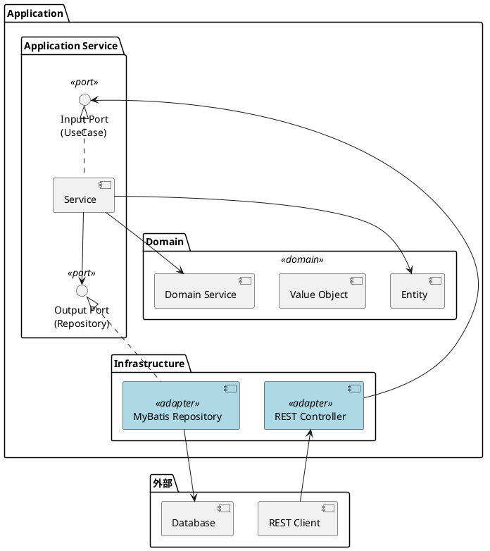
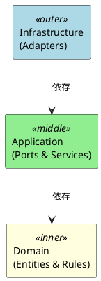

# 第32章：API サービスの実装

## 32.1 ヘキサゴナルアーキテクチャの復習

### ヘキサゴナルアーキテクチャとは

ヘキサゴナルアーキテクチャ（Ports and Adapters パターン）は、アプリケーションのドメインロジックを外部の技術的詳細から分離するアーキテクチャスタイルです。



### 主要な概念

| 概念 | 説明 | 例 |
|------|------|-----|
| Input Port | ユースケースを定義するインターフェース | ItemUseCase |
| Output Port | 外部リソースへのアクセスを定義するインターフェース | ItemRepository |
| Input Adapter | 外部からの入力を受け付けるコンポーネント | REST Controller |
| Output Adapter | 外部リソースへの出力を行うコンポーネント | MyBatis Repository |
| Domain | ビジネスロジックを含む中心部分 | Entity, Value Object |

### 依存関係の方向

ヘキサゴナルアーキテクチャでは、依存関係は常に外側から内側に向かいます。



---

## 32.2 アーキテクチャ構造

### プロジェクト構造

```
apps/pms/backend/
├── src/
│   ├── main/
│   │   ├── java/
│   │   │   └── com/example/pms/
│   │   │       ├── Application.java
│   │   │       ├── domain/
│   │   │       │   ├── model/           # エンティティ・値オブジェクト
│   │   │       │   │   ├── item/
│   │   │       │   │   ├── bom/
│   │   │       │   │   ├── inventory/
│   │   │       │   │   ├── purchase/
│   │   │       │   │   └── process/
│   │   │       │   ├── service/         # ドメインサービス
│   │   │       │   └── exception/       # ドメイン例外
│   │   │       ├── application/
│   │   │       │   ├── port/
│   │   │       │   │   ├── in/          # Input Port（ユースケース）
│   │   │       │   │   │   └── command/ # コマンドオブジェクト
│   │   │       │   │   └── out/         # Output Port（リポジトリ）
│   │   │       │   └── service/         # アプリケーションサービス
│   │   │       └── infrastructure/
│   │   │           ├── in/
│   │   │           │   ├── rest/        # REST Controller
│   │   │           │   │   └── dto/     # Request/Response DTO
│   │   │           │   └── web/
│   │   │           │       └── exception/ # 例外ハンドラ
│   │   │           └── out/
│   │   │               └── persistence/
│   │   │                   └── repository/ # Repository 実装
│   │   └── resources/
│   │       ├── mapper/                  # MyBatis マッパー XML
│   │       └── application.yml
│   └── test/
│       └── java/
│           └── com/example/pms/
│               └── integration/         # 統合テスト
└── build.gradle.kts
```

### 技術スタックの導入

<details>
<summary>build.gradle.kts</summary>

```kotlin
plugins {
    java
    id("org.springframework.boot") version "3.2.0"
    id("io.spring.dependency-management") version "1.1.4"
}

group = "com.example"
version = "0.0.1-SNAPSHOT"

java {
    sourceCompatibility = JavaVersion.VERSION_21
}

repositories {
    mavenCentral()
}

dependencies {
    // Spring Boot
    implementation("org.springframework.boot:spring-boot-starter-web")
    implementation("org.springframework.boot:spring-boot-starter-validation")

    // MyBatis
    implementation("org.mybatis.spring.boot:mybatis-spring-boot-starter:3.0.3")

    // PostgreSQL
    runtimeOnly("org.postgresql:postgresql")

    // OpenAPI / Swagger
    implementation("org.springdoc:springdoc-openapi-starter-webmvc-ui:2.3.0")

    // Lombok
    compileOnly("org.projectlombok:lombok")
    annotationProcessor("org.projectlombok:lombok")

    // Test
    testImplementation("org.springframework.boot:spring-boot-starter-test")
    testImplementation("org.testcontainers:postgresql:1.19.3")
    testImplementation("org.testcontainers:junit-jupiter:1.19.3")
}

tasks.withType<Test> {
    useJUnitPlatform()
}
```

</details>

### アプリケーション設定

<details>
<summary>Application.java</summary>

```java
package com.example.pms;

import org.springframework.boot.SpringApplication;
import org.springframework.boot.autoconfigure.SpringBootApplication;

/**
 * 生産管理システム（Production Management System）のメインクラス.
 */
@SpringBootApplication
public class Application {

    public static void main(String[] args) {
        SpringApplication.run(Application.class, args);
    }
}
```

</details>

<details>
<summary>OpenApiConfig.java</summary>

```java
package com.example.pms.infrastructure.config;

import io.swagger.v3.oas.models.OpenAPI;
import io.swagger.v3.oas.models.info.Contact;
import io.swagger.v3.oas.models.info.Info;
import org.springframework.context.annotation.Bean;
import org.springframework.context.annotation.Configuration;

/**
 * OpenAPI 設定.
 */
@Configuration
public class OpenApiConfig {

    @Bean
    public OpenAPI customOpenAPI() {
        return new OpenAPI()
            .info(new Info()
                .title("生産管理 API")
                .version("1.0")
                .description("生産管理システムの RESTful API")
                .contact(new Contact()
                    .name("開発チーム")
                    .email("dev@example.com")));
    }
}
```

</details>

<details>
<summary>RootController.java</summary>

```java
package com.example.pms.infrastructure.in.rest;

import io.swagger.v3.oas.annotations.Operation;
import io.swagger.v3.oas.annotations.tags.Tag;
import org.springframework.http.ResponseEntity;
import org.springframework.web.bind.annotation.GetMapping;
import org.springframework.web.bind.annotation.RequestMapping;
import org.springframework.web.bind.annotation.RestController;

import java.util.Map;

/**
 * API ルート Controller.
 */
@RestController
@RequestMapping("/api")
@Tag(name = "root", description = "API ルート")
public class RootController {

    @GetMapping
    @Operation(summary = "API 情報の取得")
    public ResponseEntity<Map<String, String>> root() {
        return ResponseEntity.ok(Map.of(
            "service", "Production Management API",
            "version", "1.0",
            "docs", "/swagger-ui.html"
        ));
    }

    @GetMapping("/health")
    @Operation(summary = "ヘルスチェック")
    public ResponseEntity<Map<String, String>> health() {
        return ResponseEntity.ok(Map.of("status", "UP"));
    }
}
```

</details>

---

## 32.3 マスタ API の実装

### 32.3.1 品目マスタ API

#### Output Port（リポジトリインターフェース）

<details>
<summary>ItemRepository.java</summary>

```java
package com.example.pms.application.port.out;

import com.example.pms.domain.model.item.Item;

import java.time.LocalDate;
import java.util.List;
import java.util.Optional;

/**
 * 品目リポジトリ（Output Port）
 * ドメイン層がデータアクセスに依存しないためのインターフェース
 */
public interface ItemRepository {

    void save(Item item);

    Optional<Item> findByItemCode(String itemCode);

    Optional<Item> findByItemCodeAndDate(String itemCode, LocalDate baseDate);

    List<Item> findAll();

    void update(Item item);

    void deleteAll();
}
```

</details>

#### Input Port（ユースケースインターフェース）

<details>
<summary>ItemUseCase.java</summary>

```java
package com.example.pms.application.port.in;

import com.example.pms.application.port.in.command.CreateItemCommand;
import com.example.pms.application.port.in.command.UpdateItemCommand;
import com.example.pms.domain.model.item.Item;

import java.util.List;

/**
 * 品目ユースケース（Input Port）.
 */
public interface ItemUseCase {

    List<Item> getAllItems();

    Item getItem(String itemCode);

    Item createItem(CreateItemCommand command);

    Item updateItem(String itemCode, UpdateItemCommand command);

    void deleteItem(String itemCode);
}
```

</details>

<details>
<summary>CreateItemCommand.java</summary>

```java
package com.example.pms.application.port.in.command;

import com.example.pms.domain.model.item.ItemCategory;
import lombok.Builder;
import lombok.Value;

import java.math.BigDecimal;
import java.time.LocalDate;

/**
 * 品目登録コマンド.
 */
@Value
@Builder
public class CreateItemCommand {
    String itemCode;
    String itemName;
    ItemCategory itemCategory;
    String unitCode;
    LocalDate effectiveFrom;
    LocalDate effectiveTo;
    Integer leadTime;
    Integer safetyLeadTime;
    BigDecimal safetyStock;
    BigDecimal yieldRate;
    BigDecimal minLotSize;
    BigDecimal lotIncrement;
    BigDecimal maxLotSize;
    Integer shelfLife;
}
```

</details>

#### Application Service

<details>
<summary>ItemService.java</summary>

```java
package com.example.pms.application.service;

import com.example.pms.application.port.in.ItemUseCase;
import com.example.pms.application.port.in.command.CreateItemCommand;
import com.example.pms.application.port.in.command.UpdateItemCommand;
import com.example.pms.application.port.out.ItemRepository;
import com.example.pms.domain.exception.DuplicateItemException;
import com.example.pms.domain.exception.ItemNotFoundException;
import com.example.pms.domain.model.item.Item;
import org.springframework.stereotype.Service;
import org.springframework.transaction.annotation.Transactional;

import java.time.LocalDate;
import java.util.List;

/**
 * 品目サービス（Application Service）.
 */
@Service
@Transactional
public class ItemService implements ItemUseCase {

    private final ItemRepository itemRepository;

    public ItemService(ItemRepository itemRepository) {
        this.itemRepository = itemRepository;
    }

    @Override
    @Transactional(readOnly = true)
    public List<Item> getAllItems() {
        return itemRepository.findAll();
    }

    @Override
    @Transactional(readOnly = true)
    public Item getItem(String itemCode) {
        return itemRepository.findByItemCode(itemCode)
            .orElseThrow(() -> new ItemNotFoundException(itemCode));
    }

    @Override
    public Item createItem(CreateItemCommand command) {
        if (itemRepository.findByItemCode(command.getItemCode()).isPresent()) {
            throw new DuplicateItemException(command.getItemCode());
        }

        Item item = Item.builder()
            .itemCode(command.getItemCode())
            .itemName(command.getItemName())
            .itemCategory(command.getItemCategory())
            .unitCode(command.getUnitCode())
            .effectiveFrom(command.getEffectiveFrom() != null
                ? command.getEffectiveFrom() : LocalDate.now())
            .effectiveTo(command.getEffectiveTo())
            .leadTime(command.getLeadTime())
            .safetyLeadTime(command.getSafetyLeadTime())
            .safetyStock(command.getSafetyStock())
            .yieldRate(command.getYieldRate())
            .minLotSize(command.getMinLotSize())
            .lotIncrement(command.getLotIncrement())
            .maxLotSize(command.getMaxLotSize())
            .shelfLife(command.getShelfLife())
            .build();

        itemRepository.save(item);
        return item;
    }

    @Override
    public Item updateItem(String itemCode, UpdateItemCommand command) {
        Item existing = itemRepository.findByItemCode(itemCode)
            .orElseThrow(() -> new ItemNotFoundException(itemCode));

        Item updated = Item.builder()
            .id(existing.getId())
            .itemCode(existing.getItemCode())
            .itemName(command.getItemName() != null
                ? command.getItemName() : existing.getItemName())
            .itemCategory(command.getItemCategory() != null
                ? command.getItemCategory() : existing.getItemCategory())
            .unitCode(command.getUnitCode() != null
                ? command.getUnitCode() : existing.getUnitCode())
            .effectiveFrom(existing.getEffectiveFrom())
            .createdAt(existing.getCreatedAt())
            .build();

        itemRepository.update(updated);
        return updated;
    }

    @Override
    public void deleteItem(String itemCode) {
        itemRepository.findByItemCode(itemCode)
            .orElseThrow(() -> new ItemNotFoundException(itemCode));
        throw new UnsupportedOperationException("品目の削除は現在サポートされていません");
    }
}
```

</details>

#### Input Adapter（REST Controller）

<details>
<summary>ItemControllerTest.java（テスト駆動開発）</summary>

```java
package com.example.pms.infrastructure.in.rest;

import com.example.pms.application.port.in.ItemUseCase;
import com.example.pms.domain.model.item.Item;
import com.example.pms.domain.model.item.ItemCategory;
import com.fasterxml.jackson.databind.ObjectMapper;
import org.junit.jupiter.api.BeforeEach;
import org.junit.jupiter.api.Test;
import org.springframework.beans.factory.annotation.Autowired;
import org.springframework.boot.test.autoconfigure.web.servlet.WebMvcTest;
import org.springframework.boot.test.mock.mockito.MockBean;
import org.springframework.http.MediaType;
import org.springframework.test.web.servlet.MockMvc;

import java.time.LocalDate;
import java.util.List;

import static org.mockito.ArgumentMatchers.any;
import static org.mockito.Mockito.when;
import static org.springframework.test.web.servlet.request.MockMvcRequestBuilders.*;
import static org.springframework.test.web.servlet.result.MockMvcResultMatchers.*;

@WebMvcTest(ItemController.class)
class ItemControllerTest {

    @Autowired
    private MockMvc mockMvc;

    @Autowired
    private ObjectMapper objectMapper;

    @MockBean
    private ItemUseCase itemUseCase;

    private Item sampleItem;

    @BeforeEach
    void setUp() {
        sampleItem = Item.builder()
            .itemCode("ITEM001")
            .itemName("テスト品目")
            .itemCategory(ItemCategory.PRODUCT)
            .unitCode("個")
            .effectiveFrom(LocalDate.now())
            .leadTime(5)
            .build();
    }

    @Test
    void 品目一覧を取得できる() throws Exception {
        when(itemUseCase.getAllItems()).thenReturn(List.of(sampleItem));

        mockMvc.perform(get("/api/items"))
            .andExpect(status().isOk())
            .andExpect(jsonPath("$[0].itemCode").value("ITEM001"))
            .andExpect(jsonPath("$[0].itemName").value("テスト品目"));
    }

    @Test
    void 品目を登録できる() throws Exception {
        when(itemUseCase.createItem(any())).thenReturn(sampleItem);

        var request = """
            {
                "itemCode": "ITEM001",
                "itemName": "テスト品目",
                "itemCategory": "PRODUCT",
                "unitCode": "個",
                "leadTime": 5
            }
            """;

        mockMvc.perform(post("/api/items")
                .contentType(MediaType.APPLICATION_JSON)
                .content(request))
            .andExpect(status().isCreated())
            .andExpect(jsonPath("$.itemCode").value("ITEM001"));
    }

    @Test
    void 品目を削除できる() throws Exception {
        mockMvc.perform(delete("/api/items/ITEM001"))
            .andExpect(status().isNoContent());
    }
}
```

</details>

<details>
<summary>ItemController.java</summary>

```java
package com.example.pms.infrastructure.in.rest;

import com.example.pms.application.port.in.ItemUseCase;
import com.example.pms.domain.model.item.Item;
import com.example.pms.infrastructure.in.rest.dto.CreateItemRequest;
import com.example.pms.infrastructure.in.rest.dto.ItemResponse;
import com.example.pms.infrastructure.in.rest.dto.UpdateItemRequest;
import io.swagger.v3.oas.annotations.Operation;
import io.swagger.v3.oas.annotations.tags.Tag;
import jakarta.validation.Valid;
import org.springframework.http.HttpStatus;
import org.springframework.http.ResponseEntity;
import org.springframework.web.bind.annotation.*;

import java.util.List;

/**
 * 品目マスタ API Controller.
 */
@RestController
@RequestMapping("/api/items")
@Tag(name = "items", description = "品目マスタ API")
public class ItemController {

    private final ItemUseCase itemUseCase;

    public ItemController(ItemUseCase itemUseCase) {
        this.itemUseCase = itemUseCase;
    }

    @GetMapping
    @Operation(summary = "品目一覧の取得")
    public ResponseEntity<List<ItemResponse>> getAllItems() {
        List<Item> items = itemUseCase.getAllItems();
        return ResponseEntity.ok(items.stream()
            .map(ItemResponse::from)
            .toList());
    }

    @GetMapping("/{itemCode}")
    @Operation(summary = "品目の取得")
    public ResponseEntity<ItemResponse> getItem(@PathVariable String itemCode) {
        Item item = itemUseCase.getItem(itemCode);
        return ResponseEntity.ok(ItemResponse.from(item));
    }

    @PostMapping
    @Operation(summary = "品目の登録")
    public ResponseEntity<ItemResponse> createItem(
            @Valid @RequestBody CreateItemRequest request) {
        Item item = itemUseCase.createItem(request.toCommand());
        return ResponseEntity.status(HttpStatus.CREATED)
            .body(ItemResponse.from(item));
    }

    @PutMapping("/{itemCode}")
    @Operation(summary = "品目の更新")
    public ResponseEntity<ItemResponse> updateItem(
            @PathVariable String itemCode,
            @Valid @RequestBody UpdateItemRequest request) {
        Item item = itemUseCase.updateItem(itemCode, request.toCommand());
        return ResponseEntity.ok(ItemResponse.from(item));
    }

    @DeleteMapping("/{itemCode}")
    @Operation(summary = "品目の削除")
    @ResponseStatus(HttpStatus.NO_CONTENT)
    public void deleteItem(@PathVariable String itemCode) {
        itemUseCase.deleteItem(itemCode);
    }
}
```

</details>

#### DTO（Request/Response）

<details>
<summary>CreateItemRequest.java</summary>

```java
package com.example.pms.infrastructure.in.rest.dto;

import com.example.pms.application.port.in.command.CreateItemCommand;
import com.example.pms.domain.model.item.ItemCategory;
import jakarta.validation.constraints.NotBlank;
import jakarta.validation.constraints.NotNull;
import lombok.Data;

import java.math.BigDecimal;
import java.time.LocalDate;

/**
 * 品目登録リクエスト DTO.
 */
@Data
public class CreateItemRequest {

    @NotBlank(message = "品目コードは必須です")
    private String itemCode;

    @NotBlank(message = "品目名は必須です")
    private String itemName;

    @NotNull(message = "品目区分は必須です")
    private ItemCategory itemCategory;

    @NotBlank(message = "単位コードは必須です")
    private String unitCode;

    private LocalDate effectiveFrom;
    private LocalDate effectiveTo;
    private Integer leadTime;
    private Integer safetyLeadTime;
    private BigDecimal safetyStock;
    private BigDecimal yieldRate;
    private BigDecimal minLotSize;
    private BigDecimal lotIncrement;
    private BigDecimal maxLotSize;
    private Integer shelfLife;

    public CreateItemCommand toCommand() {
        return CreateItemCommand.builder()
            .itemCode(itemCode)
            .itemName(itemName)
            .itemCategory(itemCategory)
            .unitCode(unitCode)
            .effectiveFrom(effectiveFrom)
            .effectiveTo(effectiveTo)
            .leadTime(leadTime)
            .safetyLeadTime(safetyLeadTime)
            .safetyStock(safetyStock)
            .yieldRate(yieldRate)
            .minLotSize(minLotSize)
            .lotIncrement(lotIncrement)
            .maxLotSize(maxLotSize)
            .shelfLife(shelfLife)
            .build();
    }
}
```

</details>

<details>
<summary>UpdateItemRequest.java</summary>

```java
package com.example.pms.infrastructure.in.rest.dto;

import com.example.pms.application.port.in.command.UpdateItemCommand;
import com.example.pms.domain.model.item.ItemCategory;
import lombok.Data;

import java.math.BigDecimal;
import java.time.LocalDate;

/**
 * 品目更新リクエスト DTO.
 */
@Data
public class UpdateItemRequest {

    private String itemName;
    private ItemCategory itemCategory;
    private String unitCode;
    private LocalDate effectiveFrom;
    private LocalDate effectiveTo;
    private Integer leadTime;
    private Integer safetyLeadTime;
    private BigDecimal safetyStock;
    private BigDecimal yieldRate;
    private BigDecimal minLotSize;
    private BigDecimal lotIncrement;
    private BigDecimal maxLotSize;
    private Integer shelfLife;

    public UpdateItemCommand toCommand() {
        return UpdateItemCommand.builder()
            .itemName(itemName)
            .itemCategory(itemCategory)
            .unitCode(unitCode)
            .effectiveFrom(effectiveFrom)
            .effectiveTo(effectiveTo)
            .leadTime(leadTime)
            .safetyLeadTime(safetyLeadTime)
            .safetyStock(safetyStock)
            .yieldRate(yieldRate)
            .minLotSize(minLotSize)
            .lotIncrement(lotIncrement)
            .maxLotSize(maxLotSize)
            .shelfLife(shelfLife)
            .build();
    }
}
```

</details>

<details>
<summary>ItemResponse.java</summary>

```java
package com.example.pms.infrastructure.in.rest.dto;

import com.example.pms.domain.model.item.Item;
import com.example.pms.domain.model.item.ItemCategory;
import lombok.AllArgsConstructor;
import lombok.Builder;
import lombok.Data;
import lombok.NoArgsConstructor;

import java.math.BigDecimal;
import java.time.LocalDate;
import java.time.LocalDateTime;

/**
 * 品目レスポンス DTO.
 * Note: Jackson シリアライゼーションのため @Data + @NoArgsConstructor + @AllArgsConstructor を使用
 */
@Data
@Builder
@NoArgsConstructor
@AllArgsConstructor
public class ItemResponse {
    private Integer id;
    private String itemCode;
    private String itemName;
    private ItemCategory itemCategory;
    private String unitCode;
    private LocalDate effectiveFrom;
    private LocalDate effectiveTo;
    private Integer leadTime;
    private Integer safetyLeadTime;
    private BigDecimal safetyStock;
    private BigDecimal yieldRate;
    private BigDecimal minLotSize;
    private BigDecimal lotIncrement;
    private BigDecimal maxLotSize;
    private Integer shelfLife;
    private LocalDateTime createdAt;
    private LocalDateTime updatedAt;

    public static ItemResponse from(Item item) {
        return ItemResponse.builder()
            .id(item.getId())
            .itemCode(item.getItemCode())
            .itemName(item.getItemName())
            .itemCategory(item.getItemCategory())
            .unitCode(item.getUnitCode())
            .effectiveFrom(item.getEffectiveFrom())
            .effectiveTo(item.getEffectiveTo())
            .leadTime(item.getLeadTime())
            .safetyLeadTime(item.getSafetyLeadTime())
            .safetyStock(item.getSafetyStock())
            .yieldRate(item.getYieldRate())
            .minLotSize(item.getMinLotSize())
            .lotIncrement(item.getLotIncrement())
            .maxLotSize(item.getMaxLotSize())
            .shelfLife(item.getShelfLife())
            .createdAt(item.getCreatedAt())
            .updatedAt(item.getUpdatedAt())
            .build();
    }
}
```

</details>

#### Output Adapter（MyBatis Repository）

<details>
<summary>MyBatisItemRepository.java</summary>

```java
package com.example.pms.infrastructure.out.persistence.repository;

import com.example.pms.application.port.out.ItemRepository;
import com.example.pms.domain.model.item.Item;
import org.apache.ibatis.annotations.*;
import org.springframework.stereotype.Repository;

import java.time.LocalDate;
import java.util.List;
import java.util.Optional;

/**
 * 品目リポジトリの MyBatis 実装（Output Adapter）.
 */
@Repository
@Mapper
public interface MyBatisItemRepository extends ItemRepository {

    @Override
    @Insert("""
        INSERT INTO "品目マスタ" ("品目コード", "適用開始日", "品名", "品目区分", "単位コード",
            "リードタイム", "安全リードタイム", "安全在庫数", "歩留まり率",
            "最小ロットサイズ", "ロット増分", "最大ロットサイズ", "賞味期限日数")
        VALUES (#{itemCode}, #{effectiveFrom}, #{itemName}, #{itemCategory}::品目区分, #{unitCode},
            #{leadTime}, #{safetyLeadTime}, #{safetyStock}, #{yieldRate},
            #{minLotSize}, #{lotIncrement}, #{maxLotSize}, #{shelfLife})
        """)
    void save(Item item);

    @Override
    @Select("""
        SELECT * FROM "品目マスタ"
        WHERE "品目コード" = #{itemCode}
        ORDER BY "適用開始日" DESC LIMIT 1
        """)
    @ResultMap("itemMap")
    Optional<Item> findByItemCode(String itemCode);

    @Override
    @Select("""
        SELECT * FROM "品目マスタ"
        WHERE "品目コード" = #{itemCode}
          AND "適用開始日" <= #{baseDate}
        ORDER BY "適用開始日" DESC LIMIT 1
        """)
    @ResultMap("itemMap")
    Optional<Item> findByItemCodeAndDate(String itemCode, LocalDate baseDate);

    @Override
    @Select("SELECT * FROM \"品目マスタ\"")
    @Results(id = "itemMap", value = {
        @Result(property = "id", column = "品目ID"),
        @Result(property = "itemCode", column = "品目コード"),
        @Result(property = "itemName", column = "品名"),
        @Result(property = "itemCategory", column = "品目区分"),
        @Result(property = "unitCode", column = "単位コード"),
        @Result(property = "effectiveFrom", column = "適用開始日"),
        @Result(property = "effectiveTo", column = "適用終了日"),
        @Result(property = "leadTime", column = "リードタイム"),
        @Result(property = "safetyLeadTime", column = "安全リードタイム"),
        @Result(property = "safetyStock", column = "安全在庫数"),
        @Result(property = "yieldRate", column = "歩留まり率"),
        @Result(property = "minLotSize", column = "最小ロットサイズ"),
        @Result(property = "lotIncrement", column = "ロット増分"),
        @Result(property = "maxLotSize", column = "最大ロットサイズ"),
        @Result(property = "shelfLife", column = "賞味期限日数"),
        @Result(property = "createdAt", column = "作成日時"),
        @Result(property = "updatedAt", column = "更新日時")
    })
    List<Item> findAll();

    @Override
    @Update("""
        UPDATE "品目マスタ"
        SET "品名" = #{itemName}, "品目区分" = #{itemCategory}::品目区分,
            "単位コード" = #{unitCode}
        WHERE "品目ID" = #{id}
        """)
    void update(Item item);

    @Override
    @Delete("DELETE FROM \"品目マスタ\"")
    void deleteAll();
}
```

</details>

### 32.3.2 BOM マスタ API

#### BOM 展開サービス

<details>
<summary>BomService.java</summary>

```java
package com.example.pms.application.service;

import com.example.pms.application.port.out.BomRepository;
import com.example.pms.domain.model.bom.Bom;
import lombok.Builder;
import lombok.Value;
import org.springframework.stereotype.Service;
import org.springframework.transaction.annotation.Transactional;

import java.math.BigDecimal;
import java.util.ArrayList;
import java.util.List;

/**
 * BOM サービス（Application Service）.
 */
@Service
@Transactional(readOnly = true)
public class BomService {

    private final BomRepository bomRepository;

    public BomService(BomRepository bomRepository) {
        this.bomRepository = bomRepository;
    }

    /**
     * BOM 展開（部品展開）
     */
    public List<BomNode> explodeBom(String itemCode, int maxLevel) {
        List<BomNode> result = new ArrayList<>();
        explodeRecursive(itemCode, 1, maxLevel, BigDecimal.ONE, result);
        return result;
    }

    private void explodeRecursive(
            String parentCode,
            int currentLevel,
            int maxLevel,
            BigDecimal parentQuantity,
            List<BomNode> result) {

        if (currentLevel > maxLevel) return;

        List<Bom> children = bomRepository.findByParentCode(parentCode);

        for (Bom bom : children) {
            BigDecimal requiredQty = bom.getQuantity().multiply(parentQuantity);

            result.add(BomNode.builder()
                .level(currentLevel)
                .itemCode(bom.getChildItemCode())
                .itemName(bom.getChildItemName())
                .quantity(requiredQty)
                .unit(bom.getUnit())
                .build());

            explodeRecursive(
                bom.getChildItemCode(),
                currentLevel + 1,
                maxLevel,
                requiredQty,
                result);
        }
    }

    /**
     * 逆展開（使用先照会）
     */
    public List<WhereUsedResult> whereUsed(String itemCode) {
        List<WhereUsedResult> result = new ArrayList<>();
        whereUsedRecursive(itemCode, 1, result);
        return result;
    }

    private void whereUsedRecursive(
            String childCode,
            int level,
            List<WhereUsedResult> result) {

        List<Bom> parents = bomRepository.findByChildCode(childCode);

        for (Bom bom : parents) {
            result.add(WhereUsedResult.builder()
                .level(level)
                .parentItemCode(bom.getParentItemCode())
                .parentItemName(bom.getParentItemName())
                .quantity(bom.getQuantity())
                .build());

            whereUsedRecursive(bom.getParentItemCode(), level + 1, result);
        }
    }
}

@Value
@Builder
class BomNode {
    int level;
    String itemCode;
    String itemName;
    BigDecimal quantity;
    String unit;
}

@Value
@Builder
class WhereUsedResult {
    int level;
    String parentItemCode;
    String parentItemName;
    BigDecimal quantity;
}
```

</details>

#### BOM Controller

<details>
<summary>BomController.java</summary>

```java
package com.example.pms.infrastructure.in.rest;

import com.example.pms.application.service.BomNode;
import com.example.pms.application.service.BomService;
import com.example.pms.application.service.WhereUsedResult;
import io.swagger.v3.oas.annotations.Operation;
import io.swagger.v3.oas.annotations.Parameter;
import io.swagger.v3.oas.annotations.tags.Tag;
import org.springframework.http.ResponseEntity;
import org.springframework.web.bind.annotation.*;

import java.util.List;

/**
 * BOM API Controller.
 */
@RestController
@RequestMapping("/api/bom")
@Tag(name = "bom", description = "BOM API")
public class BomController {

    private final BomService bomService;

    public BomController(BomService bomService) {
        this.bomService = bomService;
    }

    @GetMapping("/{itemCode}/explode")
    @Operation(summary = "BOM 展開（部品展開）")
    public ResponseEntity<List<BomNode>> explodeBom(
            @PathVariable String itemCode,
            @Parameter(description = "展開レベル（デフォルト: 10）")
            @RequestParam(defaultValue = "10") int maxLevel) {
        List<BomNode> nodes = bomService.explodeBom(itemCode, maxLevel);
        return ResponseEntity.ok(nodes);
    }

    @GetMapping("/{itemCode}/where-used")
    @Operation(summary = "逆展開（使用先照会）")
    public ResponseEntity<List<WhereUsedResult>> whereUsed(
            @PathVariable String itemCode) {
        List<WhereUsedResult> results = bomService.whereUsed(itemCode);
        return ResponseEntity.ok(results);
    }
}
```

</details>

---

## 32.4 トランザクション API の実装

### 32.4.1 発注 API

#### Input Port

<details>
<summary>PurchaseOrderUseCase.java</summary>

```java
package com.example.pms.application.port.in;

import com.example.pms.application.port.in.command.CreatePurchaseOrderCommand;
import com.example.pms.domain.model.purchase.PurchaseOrder;

import java.util.List;

/**
 * 発注ユースケース（Input Port）.
 */
public interface PurchaseOrderUseCase {

    List<PurchaseOrder> getAllOrders();

    PurchaseOrder getOrder(String orderNumber);

    PurchaseOrder createOrder(CreatePurchaseOrderCommand command);

    PurchaseOrder confirmOrder(String orderNumber);

    void cancelOrder(String orderNumber);
}
```

</details>

#### Controller

<details>
<summary>PurchaseOrderController.java</summary>

```java
package com.example.pms.infrastructure.in.rest;

import com.example.pms.application.port.in.PurchaseOrderUseCase;
import com.example.pms.domain.model.purchase.PurchaseOrder;
import com.example.pms.infrastructure.in.rest.dto.CreatePurchaseOrderRequest;
import com.example.pms.infrastructure.in.rest.dto.PurchaseOrderResponse;
import io.swagger.v3.oas.annotations.Operation;
import io.swagger.v3.oas.annotations.tags.Tag;
import jakarta.validation.Valid;
import org.springframework.http.HttpStatus;
import org.springframework.http.ResponseEntity;
import org.springframework.web.bind.annotation.*;

import java.util.List;

/**
 * 発注 API Controller.
 */
@RestController
@RequestMapping("/api/purchase-orders")
@Tag(name = "purchase-orders", description = "発注 API")
public class PurchaseOrderController {

    private final PurchaseOrderUseCase useCase;

    public PurchaseOrderController(PurchaseOrderUseCase useCase) {
        this.useCase = useCase;
    }

    @GetMapping
    @Operation(summary = "発注一覧の取得")
    public ResponseEntity<List<PurchaseOrderResponse>> getAllOrders() {
        List<PurchaseOrder> orders = useCase.getAllOrders();
        return ResponseEntity.ok(orders.stream()
            .map(PurchaseOrderResponse::from)
            .toList());
    }

    @GetMapping("/{orderNumber}")
    @Operation(summary = "発注詳細の取得")
    public ResponseEntity<PurchaseOrderResponse> getOrder(
            @PathVariable String orderNumber) {
        PurchaseOrder order = useCase.getOrder(orderNumber);
        return ResponseEntity.ok(PurchaseOrderResponse.from(order));
    }

    @PostMapping
    @Operation(summary = "発注の登録")
    public ResponseEntity<PurchaseOrderResponse> createOrder(
            @Valid @RequestBody CreatePurchaseOrderRequest request) {
        PurchaseOrder order = useCase.createOrder(request.toCommand());
        return ResponseEntity.status(HttpStatus.CREATED)
            .body(PurchaseOrderResponse.from(order));
    }

    @PostMapping("/{orderNumber}/confirm")
    @Operation(summary = "発注の確定")
    public ResponseEntity<PurchaseOrderResponse> confirmOrder(
            @PathVariable String orderNumber) {
        PurchaseOrder order = useCase.confirmOrder(orderNumber);
        return ResponseEntity.ok(PurchaseOrderResponse.from(order));
    }

    @DeleteMapping("/{orderNumber}")
    @Operation(summary = "発注の取消")
    @ResponseStatus(HttpStatus.NO_CONTENT)
    public void cancelOrder(@PathVariable String orderNumber) {
        useCase.cancelOrder(orderNumber);
    }
}
```

</details>

### 32.4.2 在庫照会 API

#### Input Port

<details>
<summary>InventoryUseCase.java</summary>

```java
package com.example.pms.application.port.in;

import com.example.pms.domain.model.inventory.Stock;
import lombok.Builder;
import lombok.Value;

import java.math.BigDecimal;
import java.util.List;

/**
 * 在庫ユースケース（Input Port）.
 */
public interface InventoryUseCase {

    /**
     * 在庫一覧を取得
     */
    List<Stock> getInventory(InventoryQuery query);

    /**
     * 在庫サマリーを取得
     */
    List<InventorySummary> getInventorySummary();

    /**
     * 在庫不足品目を取得
     */
    List<InventorySummary> getShortageItems();
}

@Value
@Builder
class InventoryQuery {
    String itemCode;
    String locationCode;
    String stockStatus;
}

@Value
@Builder
class InventorySummary {
    String itemCode;
    String itemName;
    BigDecimal totalQuantity;
    Integer safetyStock;
    StockState stockState;

    public enum StockState {
        NORMAL, SHORTAGE, EXCESS
    }
}
```

</details>

#### Controller

<details>
<summary>InventoryController.java</summary>

```java
package com.example.pms.infrastructure.in.rest;

import com.example.pms.application.port.in.InventoryQuery;
import com.example.pms.application.port.in.InventorySummary;
import com.example.pms.application.port.in.InventoryUseCase;
import com.example.pms.domain.model.inventory.Stock;
import com.example.pms.infrastructure.in.rest.dto.StockResponse;
import io.swagger.v3.oas.annotations.Operation;
import io.swagger.v3.oas.annotations.Parameter;
import io.swagger.v3.oas.annotations.tags.Tag;
import org.springframework.http.ResponseEntity;
import org.springframework.web.bind.annotation.*;

import java.util.List;

/**
 * 在庫 API Controller.
 */
@RestController
@RequestMapping("/api/inventory")
@Tag(name = "inventory", description = "在庫 API")
public class InventoryController {

    private final InventoryUseCase useCase;

    public InventoryController(InventoryUseCase useCase) {
        this.useCase = useCase;
    }

    @GetMapping
    @Operation(summary = "在庫一覧の取得")
    public ResponseEntity<List<StockResponse>> getInventory(
            @Parameter(description = "品目コード")
            @RequestParam(required = false) String itemCode,
            @Parameter(description = "場所コード")
            @RequestParam(required = false) String locationCode,
            @Parameter(description = "在庫状態")
            @RequestParam(required = false) String status) {

        InventoryQuery query = InventoryQuery.builder()
            .itemCode(itemCode)
            .locationCode(locationCode)
            .stockStatus(status)
            .build();

        List<Stock> stocks = useCase.getInventory(query);
        return ResponseEntity.ok(stocks.stream()
            .map(StockResponse::from)
            .toList());
    }

    @GetMapping("/summary")
    @Operation(summary = "在庫サマリーの取得")
    public ResponseEntity<List<InventorySummary>> getInventorySummary() {
        List<InventorySummary> summary = useCase.getInventorySummary();
        return ResponseEntity.ok(summary);
    }

    @GetMapping("/shortage")
    @Operation(summary = "在庫不足品目の取得")
    public ResponseEntity<List<InventorySummary>> getShortageItems() {
        List<InventorySummary> items = useCase.getShortageItems();
        return ResponseEntity.ok(items);
    }
}
```

</details>

### 32.4.3 作業指示 API

<details>
<summary>WorkOrderController.java</summary>

```java
package com.example.pms.infrastructure.in.rest;

import com.example.pms.application.port.in.WorkOrderUseCase;
import com.example.pms.domain.model.process.WorkOrder;
import com.example.pms.infrastructure.in.rest.dto.CreateWorkOrderRequest;
import com.example.pms.infrastructure.in.rest.dto.WorkOrderResponse;
import io.swagger.v3.oas.annotations.Operation;
import io.swagger.v3.oas.annotations.tags.Tag;
import jakarta.validation.Valid;
import org.springframework.http.HttpStatus;
import org.springframework.http.ResponseEntity;
import org.springframework.web.bind.annotation.*;

import java.util.List;

/**
 * 作業指示 API Controller.
 */
@RestController
@RequestMapping("/api/work-orders")
@Tag(name = "work-orders", description = "作業指示 API")
public class WorkOrderController {

    private final WorkOrderUseCase useCase;

    public WorkOrderController(WorkOrderUseCase useCase) {
        this.useCase = useCase;
    }

    @GetMapping
    @Operation(summary = "作業指示一覧の取得")
    public ResponseEntity<List<WorkOrderResponse>> getAllWorkOrders() {
        List<WorkOrder> workOrders = useCase.getAllWorkOrders();
        return ResponseEntity.ok(workOrders.stream()
            .map(WorkOrderResponse::from)
            .toList());
    }

    @GetMapping("/{workOrderNumber}")
    @Operation(summary = "作業指示詳細の取得")
    public ResponseEntity<WorkOrderResponse> getWorkOrder(
            @PathVariable String workOrderNumber) {
        WorkOrder workOrder = useCase.getWorkOrder(workOrderNumber);
        return ResponseEntity.ok(WorkOrderResponse.from(workOrder));
    }

    @PostMapping
    @Operation(summary = "作業指示の登録")
    public ResponseEntity<WorkOrderResponse> createWorkOrder(
            @Valid @RequestBody CreateWorkOrderRequest request) {
        WorkOrder workOrder = useCase.createWorkOrder(request.toCommand());
        return ResponseEntity.status(HttpStatus.CREATED)
            .body(WorkOrderResponse.from(workOrder));
    }
}
```

</details>

### 32.4.4 MRP 実行 API

#### MRP サービス

<details>
<summary>MrpUseCase.java</summary>

```java
package com.example.pms.application.port.in;

import lombok.Builder;
import lombok.Value;

import java.math.BigDecimal;
import java.time.LocalDate;
import java.time.LocalDateTime;
import java.util.List;

/**
 * MRP ユースケース（Input Port）.
 */
public interface MrpUseCase {

    /**
     * MRP（所要量展開）を実行
     */
    MrpResult execute(LocalDate startDate, LocalDate endDate);

    @Value
    @Builder
    class MrpResult {
        LocalDateTime executionTime;
        LocalDate periodStart;
        LocalDate periodEnd;
        List<PlannedOrder> plannedOrders;
        List<ShortageItem> shortageItems;
    }

    @Value
    @Builder
    class PlannedOrder {
        String itemCode;
        String itemName;
        String orderType; // MANUFACTURING or PURCHASE
        BigDecimal quantity;
        LocalDate dueDate;
    }

    @Value
    @Builder
    class ShortageItem {
        String itemCode;
        String itemName;
        BigDecimal shortageQuantity;
        LocalDate recommendedOrderDate;
    }
}
```

</details>

#### MRP Controller

<details>
<summary>MrpController.java</summary>

```java
package com.example.pms.infrastructure.in.rest;

import com.example.pms.application.port.in.MrpUseCase;
import com.example.pms.infrastructure.in.rest.dto.ExecuteMrpRequest;
import com.example.pms.infrastructure.in.rest.dto.MrpResultResponse;
import io.swagger.v3.oas.annotations.Operation;
import io.swagger.v3.oas.annotations.tags.Tag;
import jakarta.validation.Valid;
import org.springframework.http.ResponseEntity;
import org.springframework.web.bind.annotation.*;

/**
 * MRP API Controller.
 */
@RestController
@RequestMapping("/api/mrp")
@Tag(name = "mrp", description = "MRP API")
public class MrpController {

    private final MrpUseCase mrpUseCase;

    public MrpController(MrpUseCase mrpUseCase) {
        this.mrpUseCase = mrpUseCase;
    }

    @PostMapping("/execute")
    @Operation(
        summary = "MRP の実行",
        description = "指定期間の所要量展開を実行し、計画オーダを生成します"
    )
    public ResponseEntity<MrpResultResponse> execute(
            @Valid @RequestBody ExecuteMrpRequest request) {
        var result = mrpUseCase.execute(
            request.getStartDate(),
            request.getEndDate()
        );
        return ResponseEntity.ok(MrpResultResponse.from(result));
    }
}
```

</details>

---

## 32.5 エラーハンドリング

### 32.5.1 ドメイン例外の定義

<details>
<summary>DomainException.java</summary>

```java
package com.example.pms.domain.exception;

/**
 * ドメイン例外の基底クラス.
 */
public abstract class DomainException extends RuntimeException {

    protected DomainException(String message) {
        super(message);
    }

    protected DomainException(String message, Throwable cause) {
        super(message, cause);
    }
}
```

</details>

<details>
<summary>ItemNotFoundException.java</summary>

```java
package com.example.pms.domain.exception;

/**
 * 品目が見つからない例外.
 */
public class ItemNotFoundException extends DomainException {

    public ItemNotFoundException(String itemCode) {
        super("品目が見つかりません: " + itemCode);
    }
}
```

</details>

<details>
<summary>DuplicateItemException.java</summary>

```java
package com.example.pms.domain.exception;

/**
 * 品目コード重複例外.
 */
public class DuplicateItemException extends DomainException {

    public DuplicateItemException(String itemCode) {
        super("品目コードが既に存在します: " + itemCode);
    }
}
```

</details>

<details>
<summary>InsufficientInventoryException.java</summary>

```java
package com.example.pms.domain.exception;

import java.math.BigDecimal;

/**
 * 在庫不足例外.
 */
public class InsufficientInventoryException extends DomainException {

    public InsufficientInventoryException(String itemCode, BigDecimal required, BigDecimal available) {
        super(String.format("在庫が不足しています: %s (必要: %s, 有効: %s)",
            itemCode, required, available));
    }
}
```

</details>

### 32.5.2 グローバル例外ハンドラ

<details>
<summary>GlobalExceptionHandler.java</summary>

```java
package com.example.pms.infrastructure.in.web.exception;

import com.example.pms.domain.exception.DomainException;
import com.example.pms.domain.exception.DuplicateItemException;
import com.example.pms.domain.exception.ItemNotFoundException;
import org.springframework.http.HttpStatus;
import org.springframework.http.ProblemDetail;
import org.springframework.web.bind.MethodArgumentNotValidException;
import org.springframework.web.bind.annotation.ExceptionHandler;
import org.springframework.web.bind.annotation.RestControllerAdvice;

import java.net.URI;
import java.time.Instant;
import java.util.stream.Collectors;

/**
 * グローバル例外ハンドラ.
 */
@RestControllerAdvice
public class GlobalExceptionHandler {

    @ExceptionHandler(ItemNotFoundException.class)
    public ProblemDetail handleItemNotFoundException(ItemNotFoundException ex) {
        ProblemDetail problem = ProblemDetail.forStatusAndDetail(
            HttpStatus.NOT_FOUND, ex.getMessage());
        problem.setTitle("品目が見つかりません");
        problem.setType(URI.create("https://api.example.com/errors/item-not-found"));
        problem.setProperty("timestamp", Instant.now());
        return problem;
    }

    @ExceptionHandler(DuplicateItemException.class)
    public ProblemDetail handleDuplicateItemException(DuplicateItemException ex) {
        ProblemDetail problem = ProblemDetail.forStatusAndDetail(
            HttpStatus.CONFLICT, ex.getMessage());
        problem.setTitle("品目コード重複");
        problem.setType(URI.create("https://api.example.com/errors/duplicate-item"));
        problem.setProperty("timestamp", Instant.now());
        return problem;
    }

    @ExceptionHandler(MethodArgumentNotValidException.class)
    public ProblemDetail handleValidationException(MethodArgumentNotValidException ex) {
        String errors = ex.getBindingResult().getFieldErrors().stream()
            .map(e -> e.getField() + ": " + e.getDefaultMessage())
            .collect(Collectors.joining(", "));

        ProblemDetail problem = ProblemDetail.forStatusAndDetail(
            HttpStatus.BAD_REQUEST, errors);
        problem.setTitle("入力値が不正です");
        problem.setType(URI.create("https://api.example.com/errors/validation-error"));
        problem.setProperty("timestamp", Instant.now());
        return problem;
    }

    @ExceptionHandler(DomainException.class)
    public ProblemDetail handleDomainException(DomainException ex) {
        ProblemDetail problem = ProblemDetail.forStatusAndDetail(
            HttpStatus.BAD_REQUEST, ex.getMessage());
        problem.setTitle("ドメインエラー");
        problem.setType(URI.create("https://api.example.com/errors/domain-error"));
        problem.setProperty("timestamp", Instant.now());
        return problem;
    }

    @ExceptionHandler(Exception.class)
    public ProblemDetail handleGenericException(Exception ex) {
        ProblemDetail problem = ProblemDetail.forStatusAndDetail(
            HttpStatus.INTERNAL_SERVER_ERROR, "予期しないエラーが発生しました");
        problem.setTitle("内部エラー");
        problem.setType(URI.create("https://api.example.com/errors/internal-error"));
        problem.setProperty("timestamp", Instant.now());
        return problem;
    }
}
```

</details>

### 32.5.3 エラーレスポンス形式

RFC 7807（Problem Details for HTTP APIs）に準拠したエラーレスポンスを返します。

```json
{
    "type": "https://api.example.com/errors/item-not-found",
    "title": "品目が見つかりません",
    "status": 404,
    "detail": "品目が見つかりません: ITEM001",
    "instance": "/api/items/ITEM001",
    "timestamp": "2024-01-15T10:30:00Z"
}
```

| フィールド | 説明 |
|-----------|------|
| type | エラー種別を識別する URI |
| title | エラーの概要 |
| status | HTTP ステータスコード |
| detail | エラーの詳細説明 |
| instance | エラーが発生したリソースの URI |
| timestamp | エラー発生時刻 |

---

## 32.6 API ドキュメント

### OpenAPI / Swagger UI

サーバー起動後、以下の URL で Swagger UI を確認できます：

```
http://localhost:8080/swagger-ui.html
```

### API 一覧

| カテゴリ | エンドポイント | メソッド | 説明 |
|---------|---------------|----------|------|
| **品目** | /api/items | GET | 品目一覧の取得 |
| | /api/items/{itemCode} | GET | 品目の取得 |
| | /api/items | POST | 品目の登録 |
| | /api/items/{itemCode} | PUT | 品目の更新 |
| | /api/items/{itemCode} | DELETE | 品目の削除 |
| **BOM** | /api/bom/{itemCode}/explode | GET | 部品展開 |
| | /api/bom/{itemCode}/where-used | GET | 使用先照会 |
| **発注** | /api/purchase-orders | GET | 発注一覧の取得 |
| | /api/purchase-orders/{orderNumber} | GET | 発注詳細の取得 |
| | /api/purchase-orders | POST | 発注の登録 |
| | /api/purchase-orders/{orderNumber}/confirm | POST | 発注の確定 |
| | /api/purchase-orders/{orderNumber} | DELETE | 発注の取消 |
| **在庫** | /api/inventory | GET | 在庫一覧の取得 |
| | /api/inventory/summary | GET | 在庫サマリーの取得 |
| | /api/inventory/shortage | GET | 在庫不足品目の取得 |
| **作業指示** | /api/work-orders | GET | 作業指示一覧の取得 |
| | /api/work-orders/{workOrderNumber} | GET | 作業指示詳細の取得 |
| | /api/work-orders | POST | 作業指示の登録 |
| | /api/work-orders/{workOrderNumber}/completion | POST | 完成実績の登録 |
| | /api/work-orders/{workOrderNumber}/progress | PATCH | 作業進捗の更新 |
| **MRP** | /api/mrp/execute | POST | MRP の実行 |
| | /api/mrp/results | GET | MRP 実行結果の照会 |
| | /api/mrp/planned-orders | GET | 計画オーダ一覧の取得 |

---

## 32.7 API インテグレーションテスト

### RestClient を使用した API インテグレーションテスト

本プロジェクトでは、MockMvc の代わりに RestClient を使用した実際の HTTP リクエストベースのテストを採用しています。

<details>
<summary>IntegrationTestBase.java</summary>

```java
package com.example.pms.integration;

import com.example.pms.TestcontainersConfiguration;
import org.springframework.beans.factory.annotation.Autowired;
import org.springframework.boot.test.context.SpringBootTest;
import org.springframework.boot.test.web.server.LocalServerPort;
import org.springframework.context.annotation.Import;
import org.springframework.http.MediaType;
import org.springframework.jdbc.core.JdbcTemplate;
import org.springframework.test.context.ActiveProfiles;
import org.springframework.web.client.RestClient;

/**
 * API インテグレーションテストの基底クラス.
 * TestContainers を使用して PostgreSQL コンテナを起動し、
 * 実際の HTTP リクエストでテストを実行する。
 */
@SpringBootTest(webEnvironment = SpringBootTest.WebEnvironment.RANDOM_PORT)
@Import(TestcontainersConfiguration.class)
@ActiveProfiles("test")
public abstract class IntegrationTestBase {

    @LocalServerPort
    protected int port;

    @Autowired
    protected JdbcTemplate jdbcTemplate;

    private RestClient restClient;

    /**
     * REST クライアントを取得.
     */
    protected RestClient getRestClient() {
        if (restClient == null) {
            restClient = RestClient.builder()
                .baseUrl("http://localhost:" + port)
                .defaultHeader("Content-Type", MediaType.APPLICATION_JSON_VALUE)
                .defaultHeader("Accept", MediaType.APPLICATION_JSON_VALUE)
                .build();
        }
        return restClient;
    }

    protected void cleanupItemData() {
        jdbcTemplate.execute("DELETE FROM \"品目マスタ\" WHERE \"品目コード\" LIKE 'TEST%'");
    }
}
```

</details>

<details>
<summary>ItemApiIntegrationTest.java</summary>

```java
package com.example.pms.integration;

import static org.assertj.core.api.Assertions.assertThat;
import static org.assertj.core.api.Assertions.assertThatThrownBy;

import com.example.pms.domain.model.item.ItemCategory;
import com.example.pms.infrastructure.in.rest.dto.CreateItemRequest;
import com.example.pms.infrastructure.in.rest.dto.ItemResponse;
import com.example.pms.infrastructure.in.rest.dto.UpdateItemRequest;
import org.junit.jupiter.api.AfterEach;
import org.junit.jupiter.api.BeforeEach;
import org.junit.jupiter.api.DisplayName;
import org.junit.jupiter.api.Nested;
import org.junit.jupiter.api.Test;
import org.springframework.http.HttpStatus;
import org.springframework.http.MediaType;
import org.springframework.web.client.HttpClientErrorException;

@DisplayName("品目 API 統合テスト")
class ItemApiIntegrationTest extends IntegrationTestBase {

    private static final String API_PATH = "/api/items";

    @BeforeEach
    void setUp() {
        createUnit("個", "個", "個");
        cleanupItemData();
    }

    @AfterEach
    void tearDown() {
        cleanupItemData();
    }

    @Nested
    @DisplayName("品目登録・取得フロー")
    class ItemCrudFlow {

        @Test
        @DisplayName("品目を登録して取得できる")
        void shouldCreateAndRetrieveItem() {
            CreateItemRequest createRequest = new CreateItemRequest();
            createRequest.setItemCode("TEST001");
            createRequest.setItemName("テスト品目");
            createRequest.setItemCategory(ItemCategory.PRODUCT);
            createRequest.setUnitCode("個");

            // 品目を登録
            ItemResponse createResponse = getRestClient()
                .post()
                .uri(API_PATH)
                .contentType(MediaType.APPLICATION_JSON)
                .body(createRequest)
                .retrieve()
                .body(ItemResponse.class);

            assertThat(createResponse).isNotNull();
            assertThat(createResponse.getItemCode()).isEqualTo("TEST001");

            // 登録した品目を取得
            ItemResponse getResponse = getRestClient()
                .get()
                .uri(API_PATH + "/TEST001")
                .retrieve()
                .body(ItemResponse.class);

            assertThat(getResponse).isNotNull();
            assertThat(getResponse.getItemCode()).isEqualTo("TEST001");
            assertThat(getResponse.getItemName()).isEqualTo("テスト品目");
        }

        @Test
        @DisplayName("存在しない品目を取得すると404エラー")
        void shouldReturn404WhenItemNotFound() {
            assertThatThrownBy(() ->
                getRestClient()
                    .get()
                    .uri(API_PATH + "/NOT-EXIST")
                    .retrieve()
                    .body(ItemResponse.class)
            ).isInstanceOf(HttpClientErrorException.class)
                .satisfies(ex -> {
                    HttpClientErrorException httpEx = (HttpClientErrorException) ex;
                    assertThat(httpEx.getStatusCode()).isEqualTo(HttpStatus.NOT_FOUND);
                });
        }

        @Test
        @DisplayName("重複した品目コードで登録すると409エラー")
        void shouldReturn409WhenDuplicateItemCode() {
            CreateItemRequest createRequest = new CreateItemRequest();
            createRequest.setItemCode("TEST002");
            createRequest.setItemName("テスト品目2");
            createRequest.setItemCategory(ItemCategory.PRODUCT);
            createRequest.setUnitCode("個");

            // 1回目は成功
            getRestClient()
                .post()
                .uri(API_PATH)
                .contentType(MediaType.APPLICATION_JSON)
                .body(createRequest)
                .retrieve()
                .body(ItemResponse.class);

            // 2回目は409
            assertThatThrownBy(() ->
                getRestClient()
                    .post()
                    .uri(API_PATH)
                    .contentType(MediaType.APPLICATION_JSON)
                    .body(createRequest)
                    .retrieve()
                    .body(ItemResponse.class)
            ).isInstanceOf(HttpClientErrorException.class)
                .satisfies(ex -> {
                    HttpClientErrorException httpEx = (HttpClientErrorException) ex;
                    assertThat(httpEx.getStatusCode()).isEqualTo(HttpStatus.CONFLICT);
                });
        }
    }
}
```

</details>

### テスト用初期化スクリプト

<details>
<summary>init.sql</summary>

```sql
-- テスト用テーブル作成
CREATE TABLE 品目マスタ (
    品目コード VARCHAR(20) PRIMARY KEY,
    品目名 VARCHAR(100) NOT NULL,
    品目種別 VARCHAR(20),
    単位 VARCHAR(10),
    標準原価 DECIMAL(15,2),
    安全在庫 INTEGER,
    リードタイム INTEGER
);

CREATE TABLE 部品表 (
    親品目コード VARCHAR(20) NOT NULL,
    子品目コード VARCHAR(20) NOT NULL,
    員数 DECIMAL(10,4) NOT NULL,
    PRIMARY KEY (親品目コード, 子品目コード)
);

CREATE TABLE 発注 (
    発注番号 VARCHAR(20) PRIMARY KEY,
    仕入先コード VARCHAR(20) NOT NULL,
    発注日 DATE NOT NULL,
    ステータス VARCHAR(10) DEFAULT '作成中'
);

CREATE TABLE 発注明細 (
    発注番号 VARCHAR(20) NOT NULL,
    明細番号 INTEGER NOT NULL,
    品目コード VARCHAR(20) NOT NULL,
    発注数量 DECIMAL(10,2) NOT NULL,
    単価 DECIMAL(15,2),
    納期 DATE,
    PRIMARY KEY (発注番号, 明細番号)
);

CREATE TABLE 在庫 (
    品目コード VARCHAR(20) NOT NULL,
    保管場所コード VARCHAR(20) NOT NULL,
    在庫数量 DECIMAL(10,2) NOT NULL DEFAULT 0,
    PRIMARY KEY (品目コード, 保管場所コード)
);
```

</details>

---

## まとめ

本章では、ヘキサゴナルアーキテクチャを採用した生産管理システムの REST API を実装しました。

### 実装したコンポーネント

| レイヤー | コンポーネント | 役割 |
|---------|--------------|------|
| Domain | Entity, Exception | ビジネスロジック、ドメインルール |
| Application | UseCase, Service | ユースケースの実装、トランザクション管理 |
| Infrastructure | Controller, Repository | 外部との入出力 |

### アーキテクチャの特徴

1. **ヘキサゴナルアーキテクチャ**: ドメインを中心に据えた設計
2. **Ports and Adapters**: インターフェースと実装の分離
3. **TDD**: テスト駆動で API を開発
4. **OpenAPI**: Swagger UI で API 仕様を可視化

### 技術スタック

- **Spring Boot 3.2**: REST API フレームワーク
- **MyBatis**: O/R マッピング
- **Bean Validation**: リクエスト検証
- **springdoc-openapi**: API ドキュメント生成
- **Testcontainers**: 統合テスト

---

[前へ: 第31章 生産管理データ設計（E 社事例）](chapter31.md) | [目次へ戻る](../index.md)
