# 第33章：システム統合の概要

本章から第5部「エンタープライズインテグレーション」の解説に入ります。これまで解説してきた販売管理システム、財務会計システム、生産管理システムを統合し、企業全体として整合性のあるシステムを構築するための考え方とパターンについて解説します。

---

## 33.1 なぜシステム統合が必要か

### サイロ化した基幹業務システムの課題

企業の基幹業務システムは、歴史的に各業務部門のニーズに応じて個別に構築されてきました。この結果、システム間の連携が不十分な「サイロ化」した状態に陥りやすくなっています。

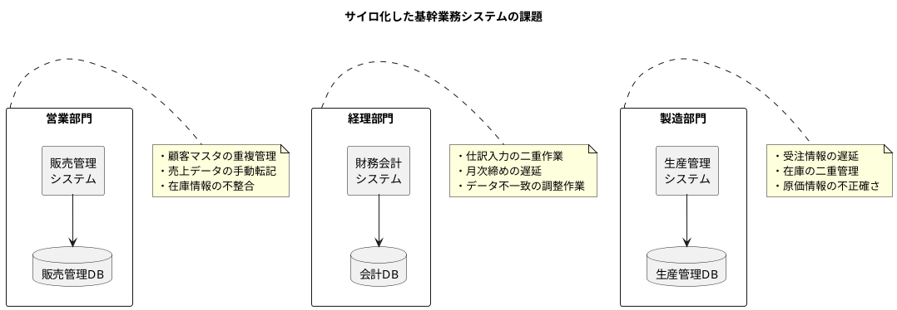

サイロ化によって発生する主な課題は以下の通りです。

| 課題カテゴリ | 具体的な問題 | 影響 |
|------------|------------|------|
| データ重複 | 同じマスタデータが複数システムに存在 | 更新漏れ、データ不整合 |
| 手作業連携 | システム間のデータ転記が手動 | 作業コスト増、転記ミス |
| 整合性欠如 | 各システムのデータが一致しない | 経営判断の遅延、誤り |
| リアルタイム性欠如 | 情報の伝達に時間がかかる | 機会損失、過剰在庫 |

### データの一貫性と整合性の確保

システム統合の最大の目的は、企業全体でのデータの一貫性と整合性を確保することです。

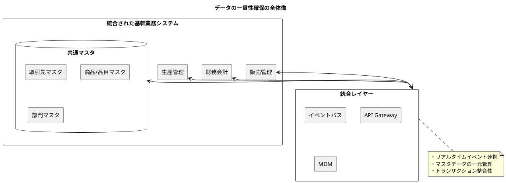

#### データ一貫性の3つのレベル

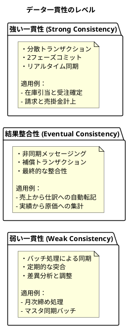

### リアルタイム連携とバッチ連携

システム統合における連携方式は、業務要件に応じて適切に選択する必要があります。

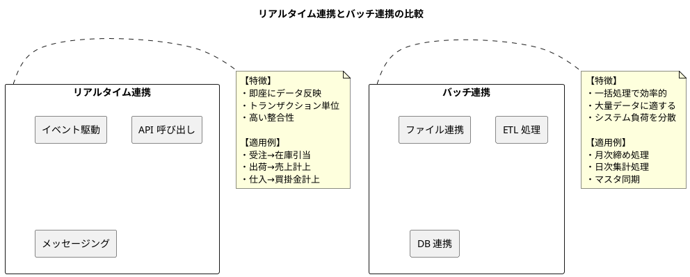

#### 連携方式の選択基準

| 要件 | リアルタイム連携 | バッチ連携 |
|-----|----------------|-----------|
| データ鮮度 | 即座に反映が必要 | 定期的な反映で可 |
| 処理量 | トランザクション単位 | 大量データの一括処理 |
| 可用性要件 | 高可用性が必要 | 一時的な遅延許容可 |
| 整合性要件 | 強い一貫性が必要 | 結果整合性で可 |
| システム負荷 | 常時負荷発生 | 負荷を時間帯で分散 |

---

## 33.2 境界づけられたコンテキスト

### 境界づけられたコンテキスト（Bounded Context）とは

ドメイン駆動設計（DDD）における「境界づけられたコンテキスト」は、特定のドメインモデルが適用される範囲を明確に定義する概念です。同じ用語でも、コンテキストによって意味や属性が異なることがあります。

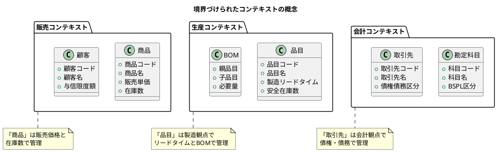

### 基幹業務システムにおけるコンテキストの識別

本書で扱う基幹業務システムは、以下の3つの主要な境界づけられたコンテキストで構成されます。

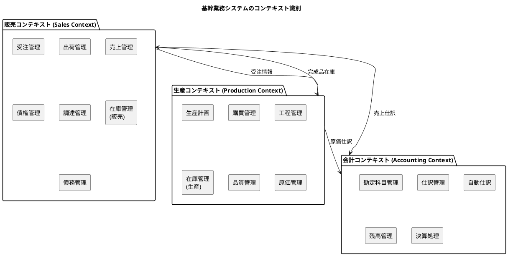

#### 販売コンテキスト

販売コンテキストは、顧客との取引に関するすべての業務を管理します。

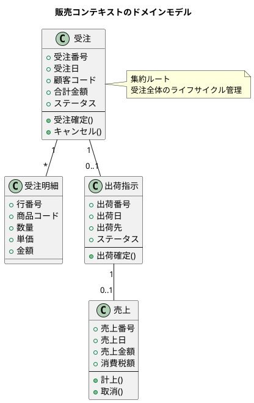

#### 会計コンテキスト

会計コンテキストは、企業の財務情報を正確に記録・管理します。

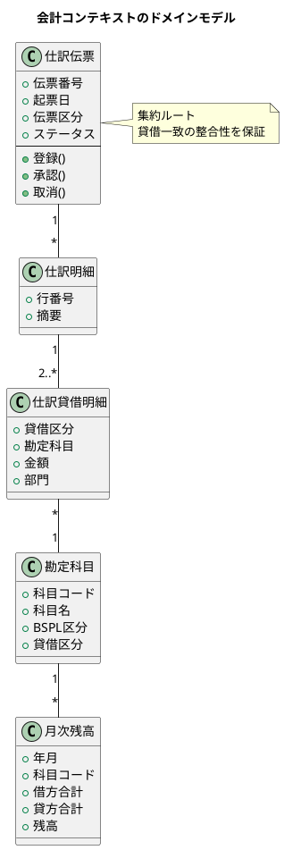

#### 生産コンテキスト

生産コンテキストは、製造業務の計画から実績管理までを担当します。

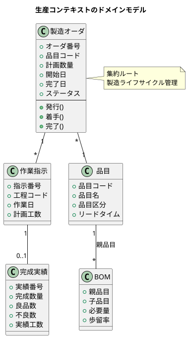

### コンテキストマップの作成

コンテキストマップは、複数の境界づけられたコンテキスト間の関係を視覚化したものです。

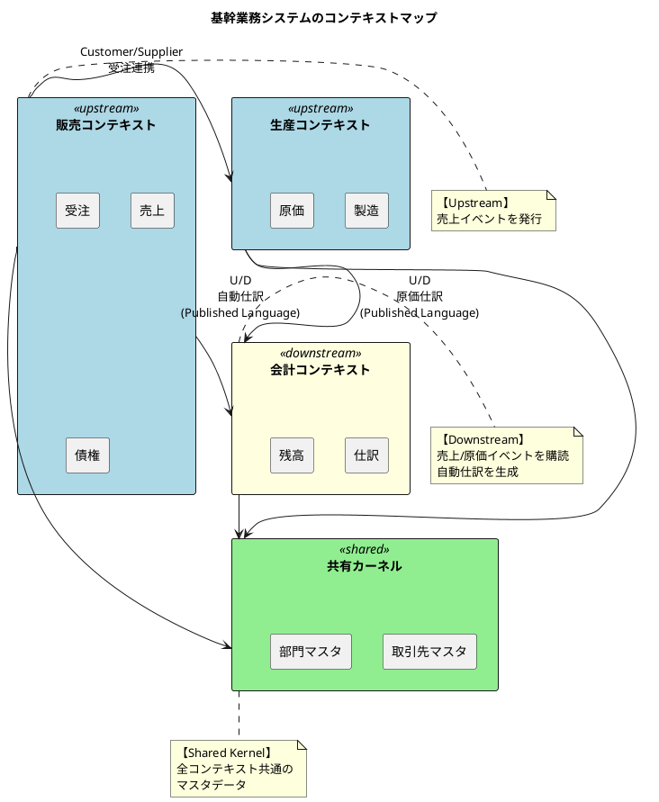

### コンテキスト間の関係パターン

ドメイン駆動設計では、コンテキスト間の関係を表す以下のパターンが定義されています。

#### 共有カーネル（Shared Kernel）

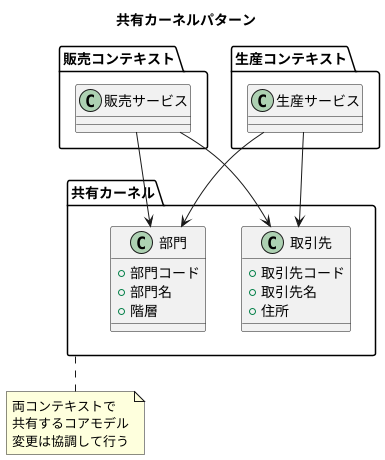

#### 顧客/供給者（Customer/Supplier）

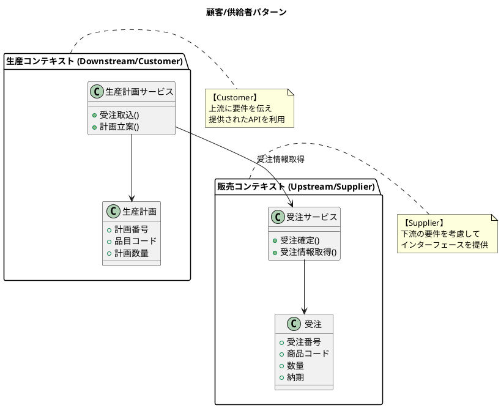

#### 腐敗防止層（Anti-Corruption Layer）

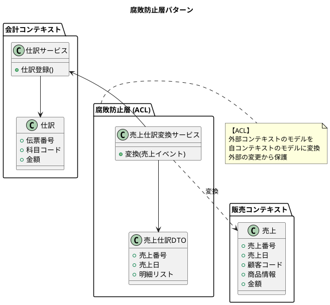

#### 公開ホストサービス（Open Host Service）

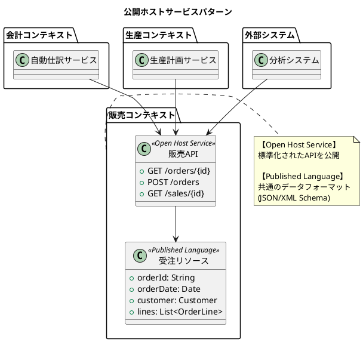

#### コンテキスト関係パターンの選択ガイド

| パターン | 適用場面 | メリット | デメリット |
|---------|---------|---------|----------|
| 共有カーネル | 密接に連携するコンテキスト | モデルの一貫性 | 変更の調整が必要 |
| 顧客/供給者 | 上流が下流の要件に対応可能 | 明確な責務分担 | 上流への依存 |
| 適合者 | 上流が変更不可能な場合 | 導入が容易 | 上流に完全依存 |
| 腐敗防止層 | レガシーシステムとの連携 | 独立性確保 | 実装コスト |
| 公開ホストサービス | 複数の消費者が存在 | 再利用性 | API設計・維持コスト |

---

## 33.3 統合パターンの選択基準

### 同期 vs 非同期

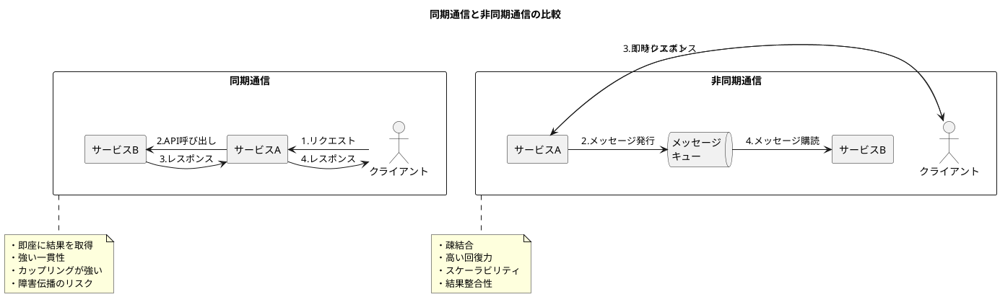

#### 選択の判断基準

| 観点 | 同期を選択 | 非同期を選択 |
|-----|----------|------------|
| 応答要件 | 即座に結果が必要 | 遅延が許容される |
| 一貫性要件 | 強い一貫性が必須 | 結果整合性で可 |
| 可用性要件 | サービス間依存を許容 | 高可用性が必要 |
| 処理量 | 少量のトランザクション | 大量のトランザクション |
| 障害分離 | 障害伝播を許容 | 障害を分離したい |

### ポイントツーポイント vs ハブ&スポーク

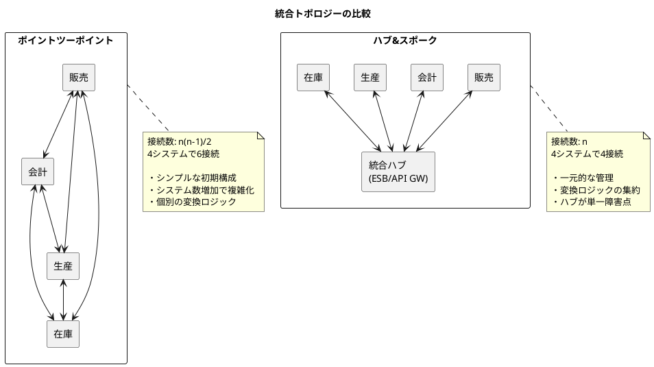

### データ統合 vs プロセス統合

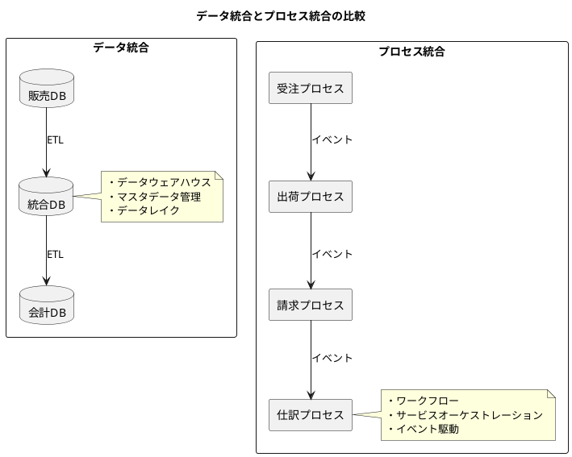

#### 統合アプローチの比較

| 観点 | データ統合 | プロセス統合 |
|-----|----------|------------|
| 主な目的 | データの一元化・分析 | 業務プロセスの自動化 |
| 更新頻度 | バッチ（日次/週次） | リアルタイム/準リアルタイム |
| 一貫性モデル | 結果整合性 | トランザクション整合性 |
| 技術要素 | ETL、DWH、MDM | ESB、BPM、イベントバス |
| 適用場面 | BI・レポーティング | 業務自動化・ワークフロー |

### 統合パターン選択のフローチャート

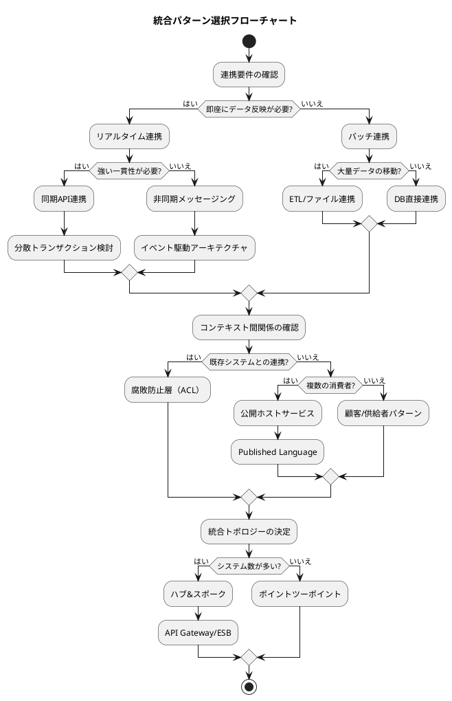

---

## 33.4 まとめ

本章では、エンタープライズインテグレーションの基本概念について解説しました。

### 学んだこと

1. **システム統合の必要性**

   - サイロ化した基幹業務システムの課題
   - データの一貫性・整合性確保の重要性
   - リアルタイム連携とバッチ連携の使い分け

2. **境界づけられたコンテキスト**

   - 販売・会計・生産の3つのコンテキスト
   - 各コンテキストの責務とドメインモデル
   - コンテキストマップによる関係の可視化

3. **コンテキスト間の関係パターン**

   - 共有カーネル：共通モデルの共有
   - 顧客/供給者：上流・下流の明確な関係
   - 腐敗防止層：外部システムからの保護
   - 公開ホストサービス：標準APIの提供

4. **統合パターンの選択基準**

   - 同期 vs 非同期の判断
   - ポイントツーポイント vs ハブ&スポーク
   - データ統合 vs プロセス統合

### 次章の予告

第34章では、メッセージングパターンについて詳しく解説します。メッセージチャネル、ルーティング、変換といったEnterprise Integration Patternsの基本パターンを学び、基幹業務システムへの適用方法を理解します。
