# 第34章：メッセージングパターン

本章では、エンタープライズインテグレーションの基盤となるメッセージングパターンについて解説します。Gregor Hohpe と Bobby Woolf による「Enterprise Integration Patterns」で体系化されたパターンを、基幹業務システムの文脈で理解していきます。

---

## 34.1 メッセージングの基礎

### メッセージングシステムの全体像

メッセージングシステムは、分散システム間の非同期通信を実現するための基盤です。送信側と受信側が直接接続する必要がなく、疎結合なシステム統合を可能にします。

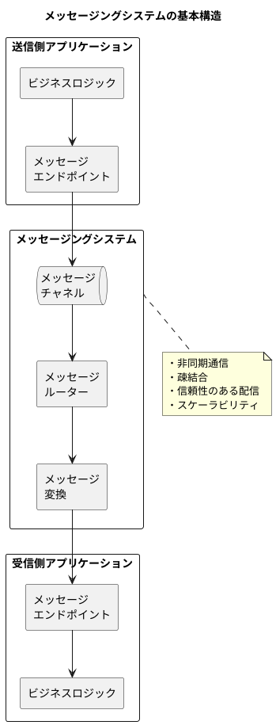

### メッセージチャネル（Message Channel）

メッセージチャネルは、送信側と受信側をつなぐ論理的なパイプです。チャネルの種類によって、メッセージの配信方法が異なります。

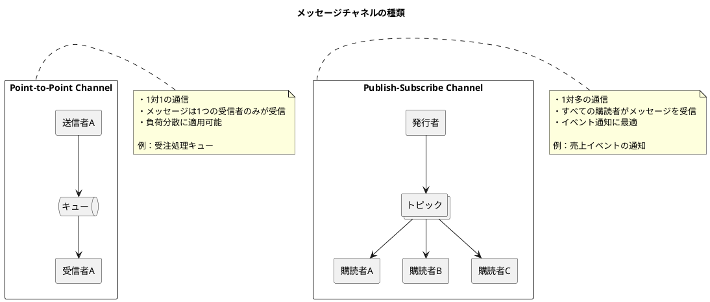

#### 基幹業務システムにおけるチャネル設計

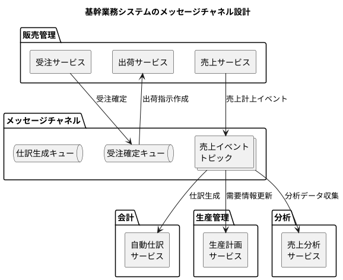

### メッセージ（Message）の構造

メッセージは、ヘッダーとボディで構成されます。ヘッダーにはルーティングや処理に必要なメタデータを、ボディにはビジネスデータを含めます。

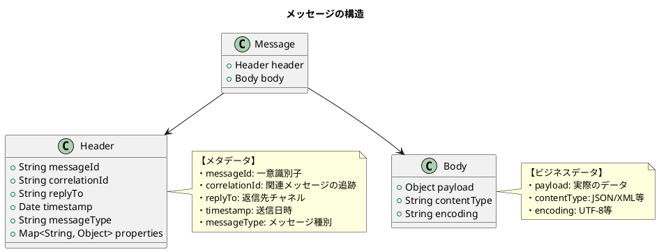

#### 売上イベントメッセージの例

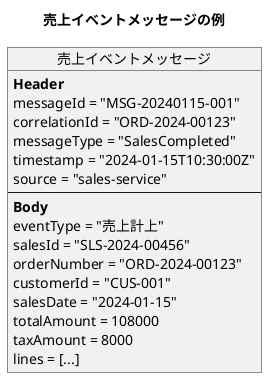

<details>
<summary>Java 実装例</summary>

```java
// メッセージヘッダー
public record MessageHeader(
    String messageId,
    String correlationId,
    String replyTo,
    Instant timestamp,
    String messageType,
    String source,
    Map<String, Object> properties
) {
    public static MessageHeader create(String messageType, String source) {
        return new MessageHeader(
            UUID.randomUUID().toString(),
            null,
            null,
            Instant.now(),
            messageType,
            source,
            new HashMap<>()
        );
    }

    public MessageHeader withCorrelationId(String correlationId) {
        return new MessageHeader(
            messageId, correlationId, replyTo, timestamp,
            messageType, source, properties
        );
    }
}

// メッセージ本体
public record Message<T>(
    MessageHeader header,
    T payload
) {
    public static <T> Message<T> of(String messageType, String source, T payload) {
        return new Message<>(
            MessageHeader.create(messageType, source),
            payload
        );
    }
}

// 売上イベント
public record SalesCompletedEvent(
    String salesId,
    String orderNumber,
    String customerId,
    LocalDate salesDate,
    BigDecimal totalAmount,
    BigDecimal taxAmount,
    List<SalesLineEvent> lines
) {}

// 使用例
Message<SalesCompletedEvent> message = Message.of(
    "SalesCompleted",
    "sales-service",
    new SalesCompletedEvent(
        "SLS-2024-00456",
        "ORD-2024-00123",
        "CUS-001",
        LocalDate.of(2024, 1, 15),
        new BigDecimal("108000"),
        new BigDecimal("8000"),
        lines
    )
).header().withCorrelationId("ORD-2024-00123");
```

</details>

### パイプとフィルター（Pipes and Filters）

パイプとフィルターパターンは、複雑な処理を小さな独立したステップ（フィルター）に分解し、パイプでつなげて処理する方式です。

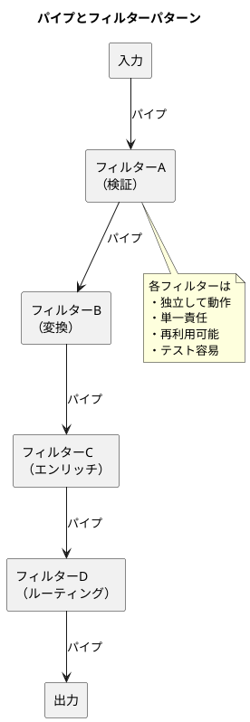

#### 売上仕訳生成パイプライン

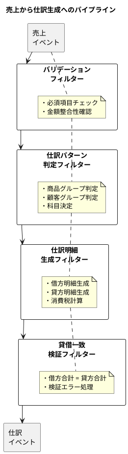

<details>
<summary>Java 実装例</summary>

```java
// フィルターインターフェース
@FunctionalInterface
public interface Filter<T> {
    T process(T input) throws FilterException;

    default Filter<T> andThen(Filter<T> next) {
        return input -> next.process(this.process(input));
    }
}

// パイプラインビルダー
public class Pipeline<T> {
    private final List<Filter<T>> filters = new ArrayList<>();

    public Pipeline<T> addFilter(Filter<T> filter) {
        filters.add(filter);
        return this;
    }

    public T execute(T input) throws FilterException {
        T result = input;
        for (Filter<T> filter : filters) {
            result = filter.process(result);
        }
        return result;
    }
}

// 売上仕訳変換コンテキスト
public class SalesJournalContext {
    private SalesCompletedEvent salesEvent;
    private JournalPattern pattern;
    private List<JournalLine> journalLines;
    private JournalEntry journalEntry;
    private List<String> errors = new ArrayList<>();

    // getter/setter
}

// バリデーションフィルター
public class ValidationFilter implements Filter<SalesJournalContext> {
    @Override
    public SalesJournalContext process(SalesJournalContext ctx) {
        SalesCompletedEvent event = ctx.getSalesEvent();

        if (event.salesId() == null || event.salesId().isBlank()) {
            ctx.getErrors().add("売上IDは必須です");
        }
        if (event.totalAmount().compareTo(BigDecimal.ZERO) <= 0) {
            ctx.getErrors().add("売上金額は正の値である必要があります");
        }

        if (!ctx.getErrors().isEmpty()) {
            throw new ValidationException(ctx.getErrors());
        }
        return ctx;
    }
}

// 仕訳パターン判定フィルター
public class PatternDeterminationFilter implements Filter<SalesJournalContext> {
    private final JournalPatternRepository patternRepository;

    @Override
    public SalesJournalContext process(SalesJournalContext ctx) {
        JournalPattern pattern = patternRepository.findByProductAndCustomerGroup(
            ctx.getSalesEvent().productGroup(),
            ctx.getSalesEvent().customerGroup()
        ).orElseThrow(() -> new PatternNotFoundException("仕訳パターンが見つかりません"));

        ctx.setPattern(pattern);
        return ctx;
    }
}

// パイプラインの構築と実行
public class SalesJournalPipeline {
    private final Pipeline<SalesJournalContext> pipeline;

    public SalesJournalPipeline(
            ValidationFilter validationFilter,
            PatternDeterminationFilter patternFilter,
            JournalLineGenerationFilter generationFilter,
            BalanceValidationFilter balanceFilter) {

        this.pipeline = new Pipeline<SalesJournalContext>()
            .addFilter(validationFilter)
            .addFilter(patternFilter)
            .addFilter(generationFilter)
            .addFilter(balanceFilter);
    }

    public JournalEntry process(SalesCompletedEvent event) {
        SalesJournalContext ctx = new SalesJournalContext();
        ctx.setSalesEvent(event);

        SalesJournalContext result = pipeline.execute(ctx);
        return result.getJournalEntry();
    }
}
```

</details>

---

## 34.2 メッセージルーティング

メッセージルーティングは、メッセージの内容や属性に基づいて、適切な宛先にメッセージを振り分ける機能です。

### Content-Based Router（内容ベースルーター）

メッセージの内容を検査し、条件に基づいて異なるチャネルにルーティングします。

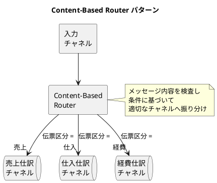

#### 基幹業務システムでの適用例

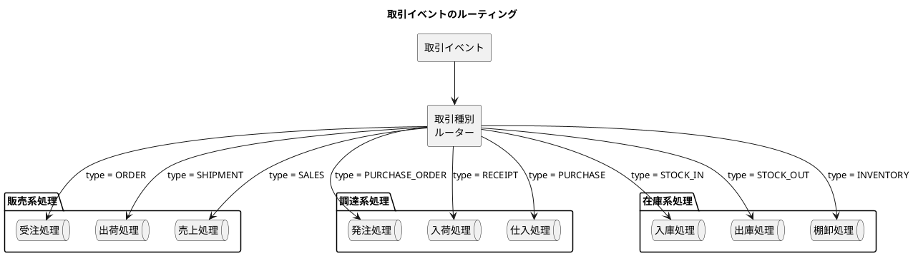

<details>
<summary>Java 実装例</summary>

```java
// ルーティング条件
public interface RoutingCondition<T> {
    boolean matches(T message);
    String getDestination();
}

// Content-Based Router
public class ContentBasedRouter<T> {
    private final List<RoutingCondition<T>> conditions = new ArrayList<>();
    private String defaultDestination;

    public ContentBasedRouter<T> when(Predicate<T> predicate, String destination) {
        conditions.add(new RoutingCondition<>() {
            @Override
            public boolean matches(T message) {
                return predicate.test(message);
            }
            @Override
            public String getDestination() {
                return destination;
            }
        });
        return this;
    }

    public ContentBasedRouter<T> otherwise(String destination) {
        this.defaultDestination = destination;
        return this;
    }

    public String route(T message) {
        return conditions.stream()
            .filter(c -> c.matches(message))
            .findFirst()
            .map(RoutingCondition::getDestination)
            .orElse(defaultDestination);
    }
}

// 取引イベントルーター
public class TransactionEventRouter {
    private final ContentBasedRouter<TransactionEvent> router;
    private final MessageSender messageSender;

    public TransactionEventRouter(MessageSender messageSender) {
        this.messageSender = messageSender;
        this.router = new ContentBasedRouter<TransactionEvent>()
            .when(e -> e.type() == TransactionType.ORDER, "order-queue")
            .when(e -> e.type() == TransactionType.SHIPMENT, "shipment-queue")
            .when(e -> e.type() == TransactionType.SALES, "sales-queue")
            .when(e -> e.type() == TransactionType.PURCHASE_ORDER, "po-queue")
            .when(e -> e.type() == TransactionType.RECEIPT, "receipt-queue")
            .when(e -> e.type() == TransactionType.PURCHASE, "purchase-queue")
            .otherwise("dead-letter-queue");
    }

    public void route(TransactionEvent event) {
        String destination = router.route(event);
        messageSender.send(destination, event);
    }
}
```

</details>

### Message Filter（メッセージフィルター）

条件に合致するメッセージのみを通過させ、それ以外は破棄または別のチャネルに送ります。

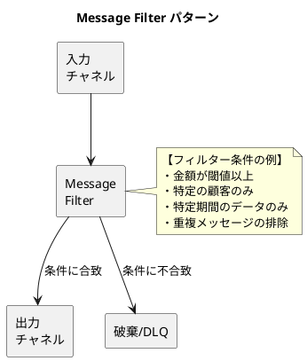

#### 高額取引フィルターの例

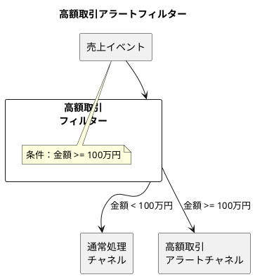

### Splitter / Aggregator（分割 / 集約）

大きなメッセージを複数の小さなメッセージに分割し、処理後に再び集約するパターンです。

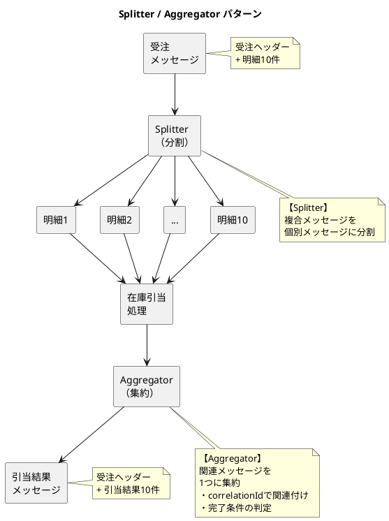

#### 基幹業務システムでの適用例

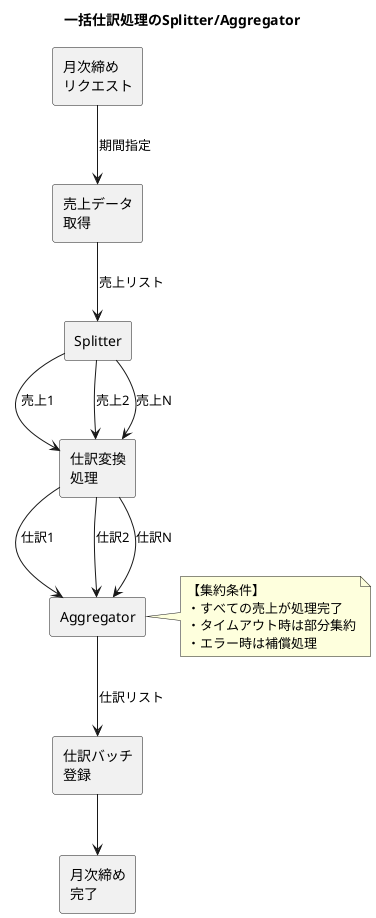

<details>
<summary>Java 実装例</summary>

```java
// Splitter
public class OrderLineSplitter {
    public List<Message<OrderLineEvent>> split(Message<OrderEvent> orderMessage) {
        OrderEvent order = orderMessage.payload();
        return order.lines().stream()
            .map(line -> {
                OrderLineEvent lineEvent = new OrderLineEvent(
                    order.orderId(),
                    line.lineNumber(),
                    line.productId(),
                    line.quantity(),
                    line.unitPrice()
                );
                return Message.of("OrderLine", "splitter", lineEvent)
                    .withCorrelationId(order.orderId());
            })
            .toList();
    }
}

// Aggregator
public class AllocationResultAggregator {
    private final Map<String, AggregationState> states = new ConcurrentHashMap<>();

    public record AggregationState(
        String correlationId,
        int expectedCount,
        List<AllocationResult> results,
        Instant startTime
    ) {}

    public void aggregate(Message<AllocationResult> message) {
        String correlationId = message.header().correlationId();
        AllocationResult result = message.payload();

        states.compute(correlationId, (id, state) -> {
            if (state == null) {
                // 初期状態
                state = new AggregationState(
                    id,
                    getExpectedCount(id),
                    new ArrayList<>(),
                    Instant.now()
                );
            }
            state.results().add(result);
            return state;
        });

        checkCompletion(correlationId);
    }

    private void checkCompletion(String correlationId) {
        AggregationState state = states.get(correlationId);
        if (state == null) return;

        // 完了条件：すべての結果が揃った
        if (state.results().size() >= state.expectedCount()) {
            AggregatedAllocationResult aggregated = new AggregatedAllocationResult(
                correlationId,
                state.results()
            );
            publishAggregatedResult(aggregated);
            states.remove(correlationId);
        }
        // タイムアウトチェック
        else if (Duration.between(state.startTime(), Instant.now()).toMinutes() > 5) {
            handleTimeout(state);
        }
    }
}
```

</details>

### Resequencer（再順序付け）

順序が乱れて到着したメッセージを、正しい順序に並べ替えてから処理します。

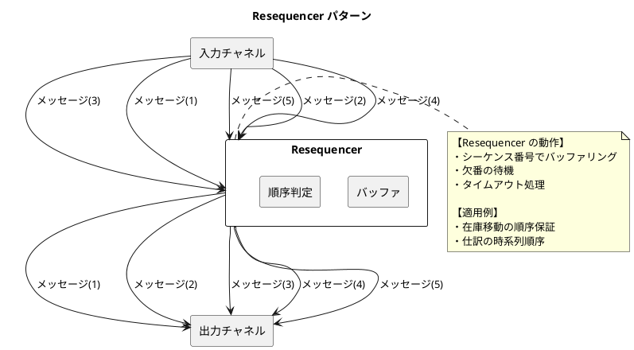

---

## 34.3 メッセージ変換

異なるシステム間でデータをやり取りする際、データ形式やスキーマの変換が必要になります。

### Message Translator（メッセージ変換）

あるシステムのメッセージ形式を、別のシステムが理解できる形式に変換します。

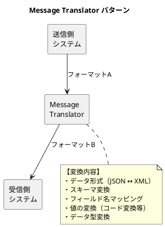

#### 売上から仕訳への変換例

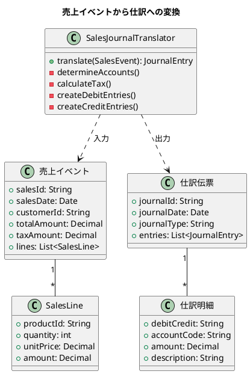

<details>
<summary>Java 実装例</summary>

```java
// メッセージ変換インターフェース
public interface MessageTranslator<S, T> {
    T translate(S source);
}

// 売上から仕訳への変換
@Component
public class SalesJournalTranslator
        implements MessageTranslator<SalesCompletedEvent, JournalEntryCommand> {

    private final JournalPatternRepository patternRepository;
    private final AccountRepository accountRepository;

    @Override
    public JournalEntryCommand translate(SalesCompletedEvent sales) {
        // 仕訳パターン取得
        JournalPattern pattern = patternRepository.findBySalesType(
            sales.salesType()
        ).orElseThrow();

        // 借方明細（売掛金）
        List<JournalLineCommand> debitLines = List.of(
            new JournalLineCommand(
                DebitCredit.DEBIT,
                pattern.debitAccountCode(),
                sales.totalAmount(),
                "売掛金計上 " + sales.customerName()
            )
        );

        // 貸方明細（売上 + 仮受消費税）
        List<JournalLineCommand> creditLines = new ArrayList<>();
        creditLines.add(new JournalLineCommand(
            DebitCredit.CREDIT,
            pattern.creditAccountCode(),
            sales.totalAmount().subtract(sales.taxAmount()),
            "売上計上 " + sales.salesId()
        ));
        creditLines.add(new JournalLineCommand(
            DebitCredit.CREDIT,
            pattern.taxAccountCode(),
            sales.taxAmount(),
            "仮受消費税"
        ));

        // 仕訳伝票作成
        return new JournalEntryCommand(
            generateJournalId(),
            sales.salesDate(),
            JournalType.SALES,
            sales.salesId(),
            Stream.concat(debitLines.stream(), creditLines.stream()).toList()
        );
    }
}
```

</details>

### Envelope Wrapper（エンベロープラッパー）

メッセージに追加のメタデータを付与するためのラッパーです。

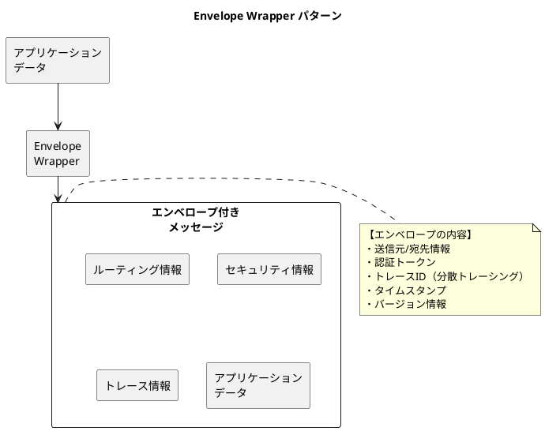

<details>
<summary>Java 実装例</summary>

```java
// エンベロープ
public record MessageEnvelope<T>(
    RoutingInfo routing,
    SecurityInfo security,
    TraceInfo trace,
    T payload
) {
    public record RoutingInfo(
        String source,
        String destination,
        String replyTo,
        int priority
    ) {}

    public record SecurityInfo(
        String authToken,
        String userId,
        List<String> roles
    ) {}

    public record TraceInfo(
        String traceId,
        String spanId,
        String parentSpanId,
        Instant timestamp
    ) {}

    public static <T> MessageEnvelope<T> wrap(
            T payload,
            String source,
            String destination) {
        return new MessageEnvelope<>(
            new RoutingInfo(source, destination, null, 0),
            null,
            new TraceInfo(
                UUID.randomUUID().toString(),
                UUID.randomUUID().toString(),
                null,
                Instant.now()
            ),
            payload
        );
    }
}

// Envelope Wrapper
@Component
public class EnvelopeWrapper {
    private final SecurityContext securityContext;
    private final TraceContext traceContext;

    public <T> MessageEnvelope<T> wrap(T payload, String destination) {
        return new MessageEnvelope<>(
            new RoutingInfo(
                "current-service",
                destination,
                null,
                0
            ),
            new SecurityInfo(
                securityContext.getToken(),
                securityContext.getUserId(),
                securityContext.getRoles()
            ),
            new TraceInfo(
                traceContext.getTraceId(),
                traceContext.newSpanId(),
                traceContext.getCurrentSpanId(),
                Instant.now()
            ),
            payload
        );
    }

    public <T> T unwrap(MessageEnvelope<T> envelope) {
        // セキュリティ検証
        validateSecurity(envelope.security());
        // トレース情報の伝播
        propagateTrace(envelope.trace());
        return envelope.payload();
    }
}
```

</details>

### Content Enricher（コンテンツエンリッチャー）

メッセージに不足している情報を外部ソースから取得して追加します。

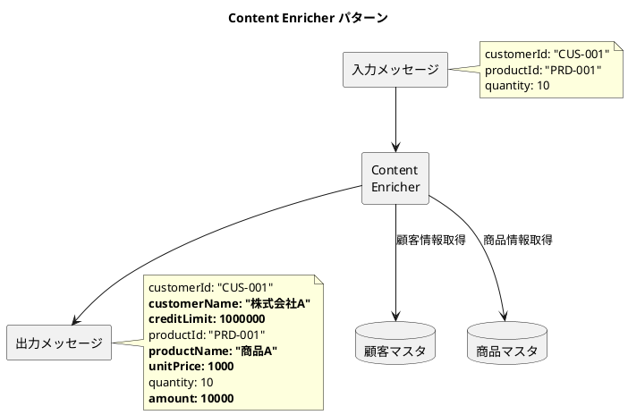

#### 受注エンリッチメントの例

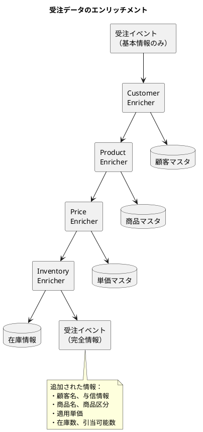

<details>
<summary>Java 実装例</summary>

```java
// Enricherインターフェース
public interface ContentEnricher<T> {
    T enrich(T message);
}

// 受注エンリッチャーチェーン
@Component
public class OrderEnricherChain {
    private final List<ContentEnricher<OrderEvent>> enrichers;

    public OrderEnricherChain(
            CustomerEnricher customerEnricher,
            ProductEnricher productEnricher,
            PriceEnricher priceEnricher,
            InventoryEnricher inventoryEnricher) {
        this.enrichers = List.of(
            customerEnricher,
            productEnricher,
            priceEnricher,
            inventoryEnricher
        );
    }

    public OrderEvent enrich(OrderEvent order) {
        OrderEvent enriched = order;
        for (ContentEnricher<OrderEvent> enricher : enrichers) {
            enriched = enricher.enrich(enriched);
        }
        return enriched;
    }
}

// 顧客情報エンリッチャー
@Component
public class CustomerEnricher implements ContentEnricher<OrderEvent> {
    private final CustomerRepository customerRepository;

    @Override
    public OrderEvent enrich(OrderEvent order) {
        Customer customer = customerRepository.findById(order.customerId())
            .orElseThrow(() -> new CustomerNotFoundException(order.customerId()));

        return order.toBuilder()
            .customerName(customer.name())
            .customerAddress(customer.address())
            .creditLimit(customer.creditLimit())
            .build();
    }
}

// 商品情報エンリッチャー
@Component
public class ProductEnricher implements ContentEnricher<OrderEvent> {
    private final ProductRepository productRepository;

    @Override
    public OrderEvent enrich(OrderEvent order) {
        List<OrderLineEvent> enrichedLines = order.lines().stream()
            .map(line -> {
                Product product = productRepository.findById(line.productId())
                    .orElseThrow();
                return line.toBuilder()
                    .productName(product.name())
                    .productCategory(product.category())
                    .taxRate(product.taxRate())
                    .build();
            })
            .toList();

        return order.toBuilder()
            .lines(enrichedLines)
            .build();
    }
}
```

</details>

### Canonical Data Model（標準データモデル）

複数のシステム間で共通に使用するデータモデルを定義し、変換の複雑さを軽減します。

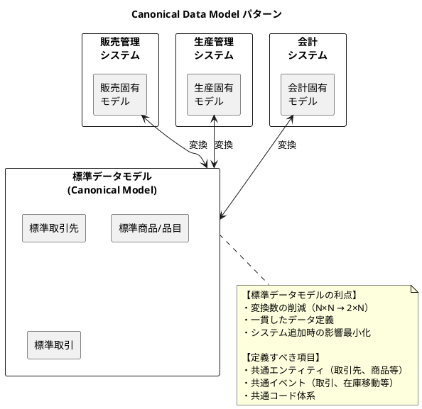

#### 基幹業務システムの標準データモデル

```plantuml
@startuml
title 基幹業務システムの標準データモデル

package "標準マスタモデル" as master {
    class "StandardPartner" as partner {
        +partnerId: String
        +partnerType: PartnerType
        +name: String
        +address: Address
        +contacts: List<Contact>
    }

    class "StandardProduct" as product {
        +productId: String
        +productType: ProductType
        +name: String
        +unit: Unit
        +prices: List<Price>
    }

    class "StandardDepartment" as dept {
        +departmentId: String
        +name: String
        +parentId: String
        +level: int
    }
}

package "標準トランザクションモデル" as transaction {
    class "StandardTransaction" as trans {
        +transactionId: String
        +transactionType: TransactionType
        +transactionDate: Date
        +partnerId: String
        +totalAmount: Money
        +lines: List<TransactionLine>
    }

    class "TransactionLine" as line {
        +lineNumber: int
        +productId: String
        +quantity: Quantity
        +unitPrice: Money
        +amount: Money
    }
}

package "標準イベントモデル" as event {
    class "StandardEvent" as evt {
        +eventId: String
        +eventType: EventType
        +timestamp: Instant
        +source: String
        +payload: Object
    }
}

trans "1" -- "*" line

note bottom of master
  【コード体系の標準化】
  ・取引先コード：PTN-XXXXXXXX
  ・商品コード：PRD-XXXXXXXX
  ・部門コード：DPT-XXXX
end note

@enduml
```

<details>
<summary>Java 実装例</summary>

```java
// 標準取引先モデル
public record StandardPartner(
    String partnerId,
    PartnerType partnerType,
    String name,
    Address address,
    List<Contact> contacts,
    Map<String, String> attributes
) {
    public enum PartnerType {
        CUSTOMER,    // 顧客
        SUPPLIER,    // 仕入先
        SUBCONTRACTOR // 外注先
    }
}

// 標準トランザクションモデル
public record StandardTransaction(
    String transactionId,
    TransactionType transactionType,
    LocalDate transactionDate,
    String partnerId,
    Money totalAmount,
    List<TransactionLine> lines,
    Map<String, String> attributes
) {
    public enum TransactionType {
        ORDER,           // 受注
        SHIPMENT,        // 出荷
        SALES,           // 売上
        PURCHASE_ORDER,  // 発注
        RECEIPT,         // 入荷
        PURCHASE,        // 仕入
        WORK_ORDER,      // 製造指示
        COMPLETION       // 完成
    }
}

// 販売固有モデルから標準モデルへの変換
@Component
public class SalesOrderToCanonicalTranslator
        implements MessageTranslator<SalesOrder, StandardTransaction> {

    @Override
    public StandardTransaction translate(SalesOrder order) {
        return new StandardTransaction(
            "TXN-" + order.orderId(),
            TransactionType.ORDER,
            order.orderDate(),
            "PTN-" + order.customerId(),
            Money.of(order.totalAmount(), "JPY"),
            order.lines().stream()
                .map(this::translateLine)
                .toList(),
            Map.of(
                "originalOrderId", order.orderId(),
                "salesRepId", order.salesRepId()
            )
        );
    }

    private TransactionLine translateLine(SalesOrderLine line) {
        return new TransactionLine(
            line.lineNumber(),
            "PRD-" + line.productCode(),
            Quantity.of(line.quantity(), line.unit()),
            Money.of(line.unitPrice(), "JPY"),
            Money.of(line.amount(), "JPY")
        );
    }
}

// 標準モデルから会計固有モデルへの変換
@Component
public class CanonicalToJournalTranslator
        implements MessageTranslator<StandardTransaction, JournalEntry> {

    @Override
    public JournalEntry translate(StandardTransaction transaction) {
        // 取引種別に応じた仕訳パターンを適用
        JournalPattern pattern = determinePattern(transaction.transactionType());

        return new JournalEntry(
            generateJournalId(),
            transaction.transactionDate(),
            pattern.journalType(),
            createJournalLines(transaction, pattern)
        );
    }
}
```

</details>

---

## 34.4 まとめ

本章では、エンタープライズインテグレーションの基盤となるメッセージングパターンについて解説しました。

### 学んだパターン一覧

| カテゴリ | パターン | 用途 |
|---------|---------|------|
| **基礎** | Message Channel | メッセージの伝送経路 |
| | Message | データとメタデータの構造 |
| | Pipes and Filters | 処理の分解と連結 |
| **ルーティング** | Content-Based Router | 内容に基づく振り分け |
| | Message Filter | 条件による通過/破棄 |
| | Splitter/Aggregator | 分割と集約 |
| | Resequencer | 順序の再整列 |
| **変換** | Message Translator | 形式変換 |
| | Envelope Wrapper | メタデータ付与 |
| | Content Enricher | 情報の追加 |
| | Canonical Data Model | 標準データ形式 |

### 基幹業務システムへの適用ポイント

1. **チャネル設計**

   - Point-to-Point：受注処理、仕訳生成など1対1の処理
   - Pub/Sub：イベント通知、複数システムへの連携

2. **ルーティング設計**

   - 取引種別による振り分け
   - 金額閾値によるフィルタリング
   - 月次締めでの分割/集約

3. **変換設計**

   - 売上→仕訳の自動変換
   - マスタ情報のエンリッチメント
   - 標準データモデルによる統合

### 次章の予告

第35章では、システム間連携パターンについて詳しく解説します。販売管理と財務会計、販売管理と生産管理、生産管理と財務会計の具体的な連携方法を学びます。
