# 第35章：システム間連携パターン

本章では、第33章で解説した境界づけられたコンテキストと、第34章で解説したメッセージングパターンを活用して、販売管理・財務会計・生産管理の3つのシステム間の具体的な連携パターンを解説します。

---

## 35.1 販売管理と財務会計の連携

販売管理システムと財務会計システムの連携は、基幹業務システム統合の中核となる部分です。売上、請求、入金などの取引データを正確に会計仕訳へ変換することが求められます。

### 連携の全体像

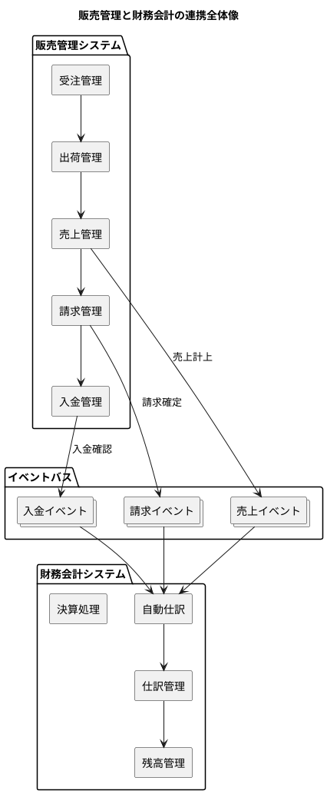

### 売上データから仕訳データへの変換

売上計上時に発生する仕訳は、売上の種類や取引条件によって異なります。

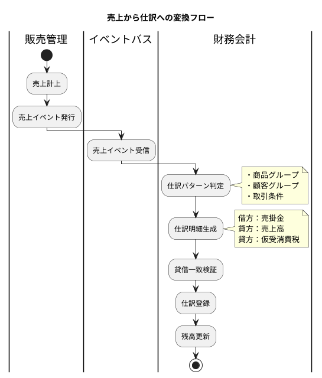

#### 売上仕訳の基本パターン

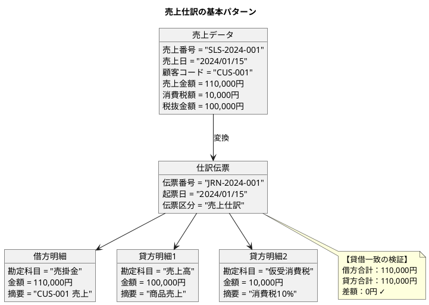

#### 売上仕訳パターンマスタ

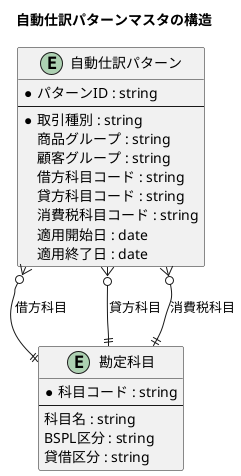

<details>
<summary>仕訳パターンテーブル定義</summary>

```sql
-- 自動仕訳パターンマスタ
CREATE TABLE 自動仕訳パターン (
    パターンID VARCHAR(20) PRIMARY KEY,
    取引種別 VARCHAR(20) NOT NULL,
    商品グループ VARCHAR(10),
    顧客グループ VARCHAR(10),
    借方科目コード VARCHAR(10) NOT NULL,
    貸方科目コード VARCHAR(10) NOT NULL,
    消費税科目コード VARCHAR(10),
    適用開始日 DATE NOT NULL,
    適用終了日 DATE,
    作成日時 TIMESTAMP DEFAULT CURRENT_TIMESTAMP,
    更新日時 TIMESTAMP DEFAULT CURRENT_TIMESTAMP,
    FOREIGN KEY (借方科目コード) REFERENCES 勘定科目(科目コード),
    FOREIGN KEY (貸方科目コード) REFERENCES 勘定科目(科目コード),
    FOREIGN KEY (消費税科目コード) REFERENCES 勘定科目(科目コード)
);

-- サンプルデータ
INSERT INTO 自動仕訳パターン VALUES
('PTN-SALES-001', '売上', NULL, NULL, '1310', '4110', '2191', '2024-01-01', NULL),
('PTN-SALES-002', '売上', 'FOOD', NULL, '1310', '4120', '2191', '2024-01-01', NULL),
('PTN-RETURN-001', '売上返品', NULL, NULL, '4110', '1310', '2191', '2024-01-01', NULL);
```

</details>

### 自動仕訳パターンの適用

商品グループや顧客グループに応じて、適切な仕訳パターンを自動選択します。

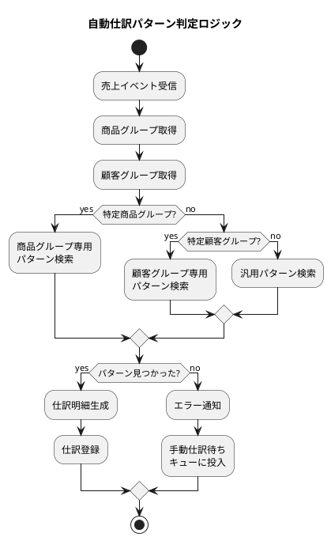

<details>
<summary>Java 実装例</summary>

```java
// 自動仕訳パターンリポジトリ
public interface JournalPatternRepository {
    Optional<JournalPattern> findByTransactionTypeAndGroups(
        TransactionType type,
        String productGroup,
        String customerGroup,
        LocalDate effectiveDate
    );
}

// 自動仕訳サービス
@Service
@Transactional
public class AutoJournalService {
    private final JournalPatternRepository patternRepository;
    private final JournalRepository journalRepository;
    private final AccountRepository accountRepository;

    @EventListener
    public void handleSalesCompleted(SalesCompletedEvent event) {
        // パターン検索（優先順位：商品グループ > 顧客グループ > 汎用）
        JournalPattern pattern = findPattern(event);

        // 仕訳伝票生成
        JournalEntry journal = createJournalEntry(event, pattern);

        // 貸借一致検証
        validateBalance(journal);

        // 仕訳登録
        journalRepository.save(journal);

        // 残高更新イベント発行
        publishBalanceUpdateEvent(journal);
    }

    private JournalPattern findPattern(SalesCompletedEvent event) {
        // 1. 商品グループ + 顧客グループで検索
        Optional<JournalPattern> pattern = patternRepository
            .findByTransactionTypeAndGroups(
                TransactionType.SALES,
                event.productGroup(),
                event.customerGroup(),
                event.salesDate()
            );

        if (pattern.isPresent()) return pattern.get();

        // 2. 商品グループのみで検索
        pattern = patternRepository.findByTransactionTypeAndGroups(
            TransactionType.SALES,
            event.productGroup(),
            null,
            event.salesDate()
        );

        if (pattern.isPresent()) return pattern.get();

        // 3. 顧客グループのみで検索
        pattern = patternRepository.findByTransactionTypeAndGroups(
            TransactionType.SALES,
            null,
            event.customerGroup(),
            event.salesDate()
        );

        if (pattern.isPresent()) return pattern.get();

        // 4. 汎用パターンで検索
        return patternRepository.findByTransactionTypeAndGroups(
            TransactionType.SALES,
            null,
            null,
            event.salesDate()
        ).orElseThrow(() -> new PatternNotFoundException(
            "仕訳パターンが見つかりません: " + event.salesId()
        ));
    }

    private JournalEntry createJournalEntry(
            SalesCompletedEvent event,
            JournalPattern pattern) {

        List<JournalLine> lines = new ArrayList<>();

        // 借方：売掛金
        lines.add(JournalLine.debit(
            pattern.debitAccountCode(),
            event.totalAmount(),
            "売掛金計上 " + event.customerName()
        ));

        // 貸方：売上高
        lines.add(JournalLine.credit(
            pattern.creditAccountCode(),
            event.netAmount(),
            "売上計上 " + event.salesId()
        ));

        // 貸方：仮受消費税
        if (event.taxAmount().compareTo(BigDecimal.ZERO) > 0) {
            lines.add(JournalLine.credit(
                pattern.taxAccountCode(),
                event.taxAmount(),
                "仮受消費税"
            ));
        }

        return new JournalEntry(
            generateJournalId(),
            event.salesDate(),
            JournalType.AUTO_SALES,
            event.salesId(),
            lines
        );
    }

    private void validateBalance(JournalEntry journal) {
        BigDecimal debitTotal = journal.lines().stream()
            .filter(l -> l.debitCredit() == DebitCredit.DEBIT)
            .map(JournalLine::amount)
            .reduce(BigDecimal.ZERO, BigDecimal::add);

        BigDecimal creditTotal = journal.lines().stream()
            .filter(l -> l.debitCredit() == DebitCredit.CREDIT)
            .map(JournalLine::amount)
            .reduce(BigDecimal.ZERO, BigDecimal::add);

        if (debitTotal.compareTo(creditTotal) != 0) {
            throw new BalanceMismatchException(
                "貸借不一致: 借方=" + debitTotal + ", 貸方=" + creditTotal
            );
        }
    }
}
```

</details>

### イベント駆動による仕訳生成

販売管理システムで発生する各種イベントに応じて、自動的に仕訳を生成します。

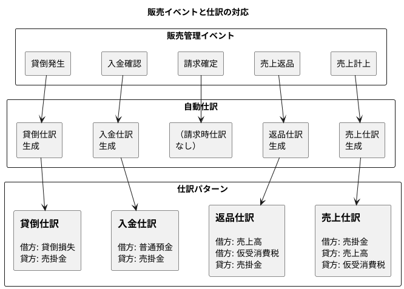

#### 入金消込と仕訳生成

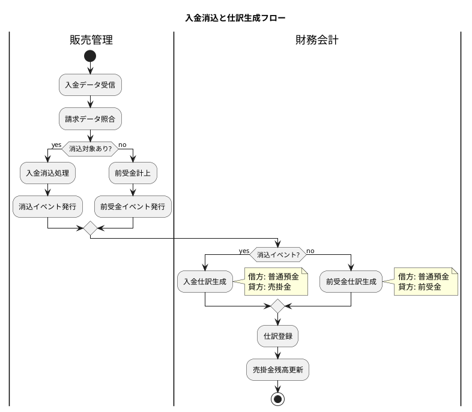

---

## 35.2 販売管理と生産管理の連携

販売管理システムと生産管理システムの連携は、需要と供給のバランスを取るために重要です。受注情報を生産計画に反映し、在庫情報を双方向で同期します。

### 連携の全体像

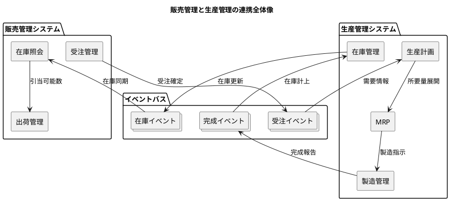

### 受注情報から生産計画への連携

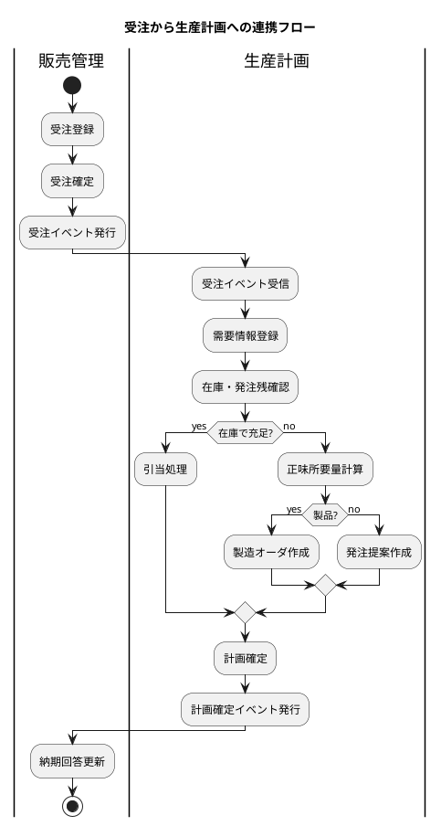

#### 受注イベントの構造

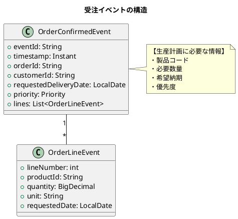

<details>
<summary>Java 実装例</summary>

```java
// 受注確定イベント
public record OrderConfirmedEvent(
    String eventId,
    Instant timestamp,
    String orderId,
    String customerId,
    LocalDate requestedDeliveryDate,
    Priority priority,
    List<OrderLineEvent> lines
) {
    public enum Priority {
        URGENT,   // 緊急
        HIGH,     // 高
        NORMAL,   // 通常
        LOW       // 低
    }
}

// 生産計画サービス
@Service
public class ProductionPlanningService {
    private final DemandRepository demandRepository;
    private final InventoryRepository inventoryRepository;
    private final MrpService mrpService;

    @EventListener
    public void handleOrderConfirmed(OrderConfirmedEvent event) {
        // 需要情報として登録
        for (OrderLineEvent line : event.lines()) {
            Demand demand = Demand.fromOrder(
                event.orderId(),
                line.productId(),
                line.quantity(),
                line.requestedDate(),
                event.priority()
            );
            demandRepository.save(demand);

            // 在庫引当を試行
            AllocationResult result = tryAllocate(demand);

            if (!result.isFullyAllocated()) {
                // MRP実行して製造/発注オーダを生成
                mrpService.execute(demand);
            }
        }

        // 納期回答イベント発行
        publishDeliveryDateResponse(event.orderId());
    }

    private AllocationResult tryAllocate(Demand demand) {
        BigDecimal available = inventoryRepository
            .findAvailableQuantity(demand.productId());

        if (available.compareTo(demand.quantity()) >= 0) {
            // 引当実行
            inventoryRepository.allocate(
                demand.productId(),
                demand.quantity(),
                demand.demandId()
            );
            return AllocationResult.fullyAllocated(demand.quantity());
        } else {
            // 部分引当
            if (available.compareTo(BigDecimal.ZERO) > 0) {
                inventoryRepository.allocate(
                    demand.productId(),
                    available,
                    demand.demandId()
                );
            }
            return AllocationResult.partiallyAllocated(
                available,
                demand.quantity().subtract(available)
            );
        }
    }
}
```

</details>

### 需要予測データの共有

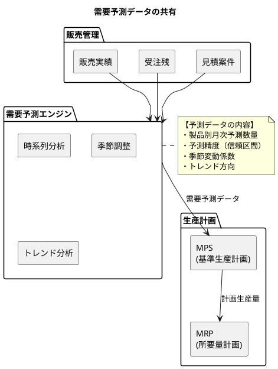

#### 需要予測イベント

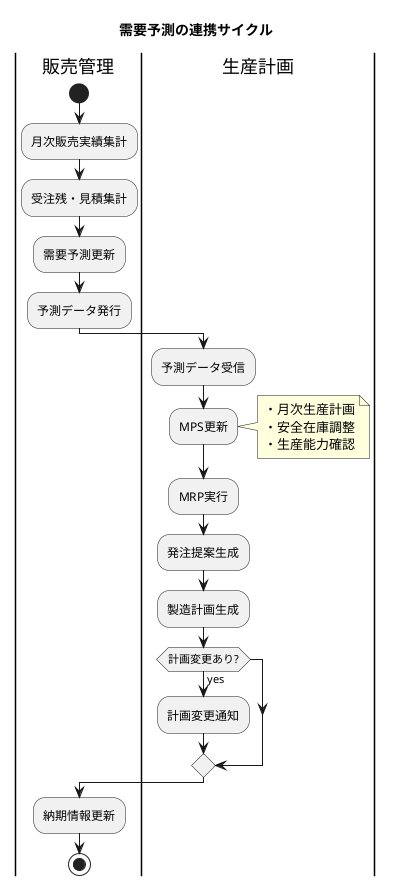

### 在庫情報の同期

販売管理と生産管理の両方で在庫を管理する場合、整合性を保つ必要があります。

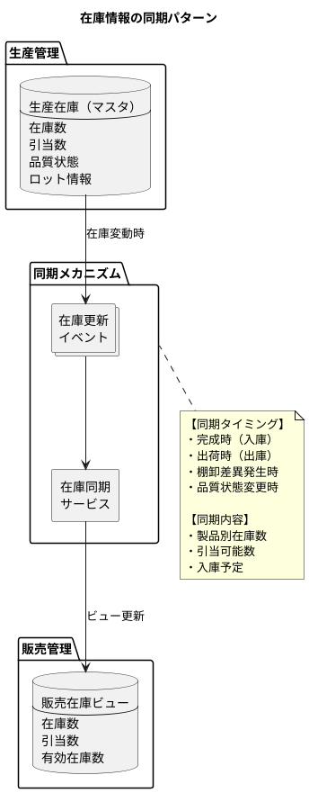

<details>
<summary>Java 実装例</summary>

```java
// 在庫更新イベント
public record InventoryUpdatedEvent(
    String eventId,
    Instant timestamp,
    String productId,
    String warehouseId,
    BigDecimal previousQuantity,
    BigDecimal currentQuantity,
    BigDecimal allocatedQuantity,
    UpdateReason reason
) {
    public enum UpdateReason {
        COMPLETION,     // 製造完成
        SHIPMENT,       // 出荷
        RECEIPT,        // 入荷
        ADJUSTMENT,     // 棚卸調整
        QUALITY_CHANGE  // 品質状態変更
    }

    public BigDecimal getAvailableQuantity() {
        return currentQuantity.subtract(allocatedQuantity);
    }
}

// 在庫同期サービス
@Service
public class InventorySyncService {
    private final SalesInventoryRepository salesInventoryRepository;

    @EventListener
    public void handleInventoryUpdated(InventoryUpdatedEvent event) {
        // 販売在庫ビューを更新
        SalesInventory salesInv = salesInventoryRepository
            .findByProductId(event.productId())
            .orElse(new SalesInventory(event.productId()));

        salesInv.updateQuantity(
            event.currentQuantity(),
            event.allocatedQuantity()
        );

        salesInventoryRepository.save(salesInv);

        // 低在庫アラート
        if (salesInv.getAvailableQuantity()
                .compareTo(salesInv.getSafetyStock()) < 0) {
            publishLowStockAlert(event.productId());
        }
    }
}
```

</details>

---

## 35.3 生産管理と財務会計の連携

生産管理システムと財務会計システムの連携は、製造原価の正確な把握と会計処理に不可欠です。

### 連携の全体像

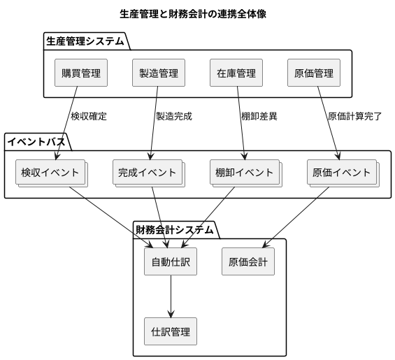

### 製造原価から仕訳への変換

製造原価は、材料費・労務費・製造間接費の3要素で構成されます。

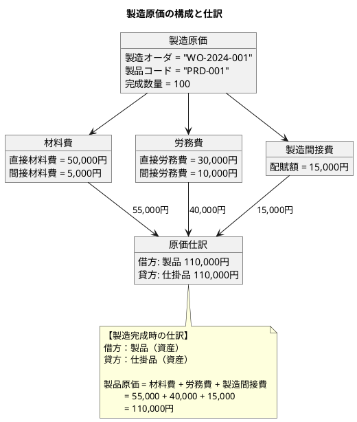

#### 製造原価計算フロー

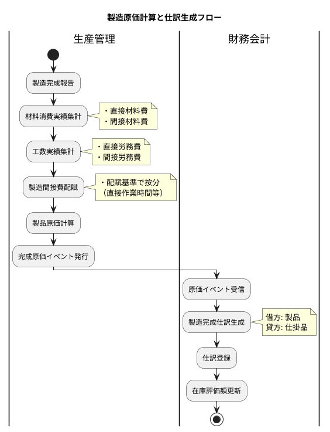

<details>
<summary>Java 実装例</summary>

```java
// 製造完成原価イベント
public record ManufacturingCompletedEvent(
    String eventId,
    Instant timestamp,
    String workOrderId,
    String productId,
    BigDecimal completedQuantity,
    CostBreakdown costBreakdown
) {
    public record CostBreakdown(
        BigDecimal directMaterialCost,
        BigDecimal indirectMaterialCost,
        BigDecimal directLaborCost,
        BigDecimal indirectLaborCost,
        BigDecimal manufacturingOverhead
    ) {
        public BigDecimal getTotalCost() {
            return directMaterialCost
                .add(indirectMaterialCost)
                .add(directLaborCost)
                .add(indirectLaborCost)
                .add(manufacturingOverhead);
        }

        public BigDecimal getMaterialCost() {
            return directMaterialCost.add(indirectMaterialCost);
        }

        public BigDecimal getLaborCost() {
            return directLaborCost.add(indirectLaborCost);
        }
    }
}

// 製造原価仕訳サービス
@Service
public class ManufacturingJournalService {
    private final JournalRepository journalRepository;

    @EventListener
    public void handleManufacturingCompleted(ManufacturingCompletedEvent event) {
        CostBreakdown cost = event.costBreakdown();

        List<JournalLine> lines = new ArrayList<>();

        // 借方：製品
        lines.add(JournalLine.debit(
            AccountCode.FINISHED_GOODS,
            cost.getTotalCost(),
            "製造完成 " + event.workOrderId()
        ));

        // 貸方：仕掛品
        lines.add(JournalLine.credit(
            AccountCode.WORK_IN_PROCESS,
            cost.getTotalCost(),
            "仕掛品振替"
        ));

        JournalEntry journal = new JournalEntry(
            generateJournalId(),
            LocalDate.now(),
            JournalType.MANUFACTURING_COMPLETION,
            event.workOrderId(),
            lines
        );

        journalRepository.save(journal);
    }
}
```

</details>

### 検収データの会計連携

仕入先からの購買品検収時に、買掛金を計上します。

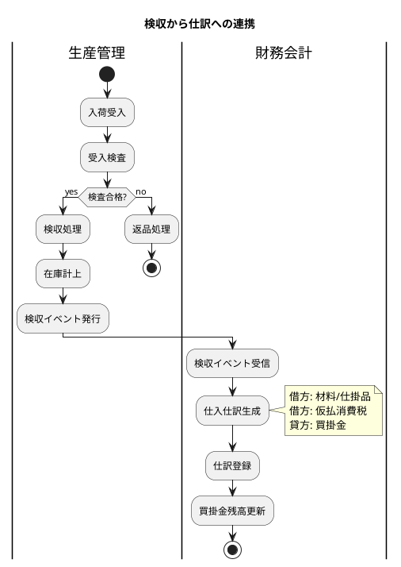

#### 検収仕訳のパターン

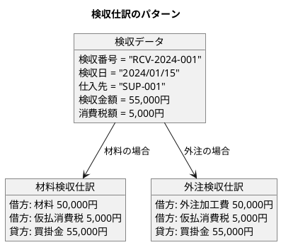

### 棚卸差異の会計処理

棚卸で発見された差異は、適切に会計処理する必要があります。

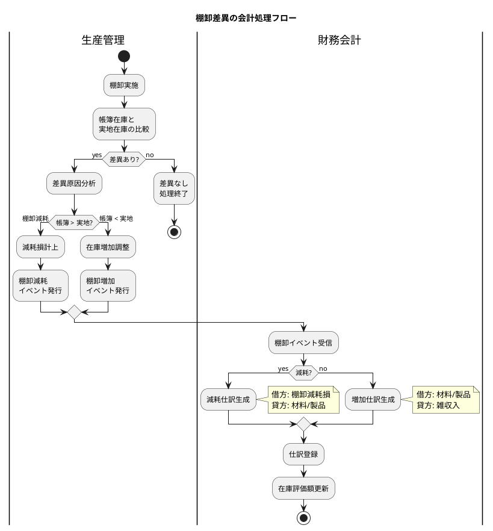

<details>
<summary>Java 実装例</summary>

```java
// 棚卸差異イベント
public record InventoryAdjustmentEvent(
    String eventId,
    Instant timestamp,
    String productId,
    String warehouseId,
    BigDecimal bookQuantity,
    BigDecimal actualQuantity,
    BigDecimal differenceQuantity,
    BigDecimal unitCost,
    AdjustmentType type,
    String reason
) {
    public enum AdjustmentType {
        SHRINKAGE,  // 減耗（帳簿 > 実地）
        SURPLUS     // 過剰（帳簿 < 実地）
    }

    public BigDecimal getAdjustmentAmount() {
        return differenceQuantity.abs().multiply(unitCost);
    }
}

// 棚卸仕訳サービス
@Service
public class InventoryAdjustmentJournalService {
    private final JournalRepository journalRepository;

    @EventListener
    public void handleInventoryAdjustment(InventoryAdjustmentEvent event) {
        List<JournalLine> lines = new ArrayList<>();

        if (event.type() == AdjustmentType.SHRINKAGE) {
            // 減耗の場合
            lines.add(JournalLine.debit(
                AccountCode.INVENTORY_SHRINKAGE_LOSS,
                event.getAdjustmentAmount(),
                "棚卸減耗 " + event.productId() + " " + event.reason()
            ));
            lines.add(JournalLine.credit(
                determineInventoryAccount(event.productId()),
                event.getAdjustmentAmount(),
                "在庫減少"
            ));
        } else {
            // 過剰の場合
            lines.add(JournalLine.debit(
                determineInventoryAccount(event.productId()),
                event.getAdjustmentAmount(),
                "在庫増加"
            ));
            lines.add(JournalLine.credit(
                AccountCode.MISCELLANEOUS_INCOME,
                event.getAdjustmentAmount(),
                "棚卸差益 " + event.productId()
            ));
        }

        JournalEntry journal = new JournalEntry(
            generateJournalId(),
            LocalDate.now(),
            JournalType.INVENTORY_ADJUSTMENT,
            event.eventId(),
            lines
        );

        journalRepository.save(journal);
    }

    private String determineInventoryAccount(String productId) {
        // 製品か材料かで勘定科目を決定
        Product product = productRepository.findById(productId).orElseThrow();
        return switch (product.type()) {
            case FINISHED_GOODS -> AccountCode.FINISHED_GOODS;
            case WORK_IN_PROCESS -> AccountCode.WORK_IN_PROCESS;
            case RAW_MATERIAL -> AccountCode.RAW_MATERIALS;
            default -> AccountCode.SUPPLIES;
        };
    }
}
```

</details>

---

## 35.4 三システム統合の全体像

販売・生産・会計の3システムを統合した全体像を整理します。

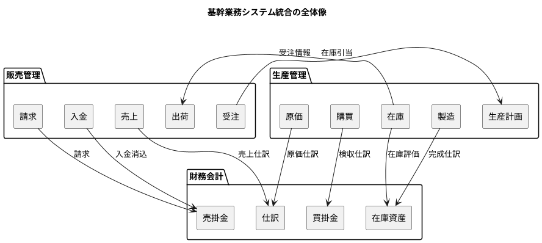

### イベントカタログ

```plantuml
@startuml
title システム間連携イベントカタログ

class "販売イベント" as sales_events {
    OrderConfirmed（受注確定）
    ShipmentCompleted（出荷完了）
    SalesCompleted（売上計上）
    BillingConfirmed（請求確定）
    PaymentReceived（入金確認）
}

class "生産イベント" as prod_events {
    DemandRegistered（需要登録）
    WorkOrderReleased（製造指示）
    ProductionCompleted（製造完成）
    ReceiptConfirmed（検収確定）
    InventoryAdjusted（在庫調整）
}

class "会計イベント" as acc_events {
    JournalPosted（仕訳計上）
    BalanceUpdated（残高更新）
    MonthEndClosed（月次締め）
}

note right of sales_events
  【発行元】販売管理
  【購読者】生産計画、自動仕訳
end note

note right of prod_events
  【発行元】生産管理
  【購読者】販売在庫、自動仕訳
end note

note right of acc_events
  【発行元】財務会計
  【購読者】経営ダッシュボード
end note

@enduml
```

---

## 35.5 まとめ

本章では、基幹業務システムの具体的な連携パターンについて解説しました。

### 学んだ連携パターン

| 連携パターン | 発生元 | 連携先 | 主な処理 |
|------------|-------|-------|---------|
| 売上→仕訳 | 販売管理 | 財務会計 | 売掛金・売上計上 |
| 入金→消込 | 販売管理 | 財務会計 | 売掛金消込 |
| 受注→計画 | 販売管理 | 生産管理 | 需要登録・MRP |
| 完成→在庫 | 生産管理 | 販売管理 | 在庫同期 |
| 検収→仕訳 | 生産管理 | 財務会計 | 買掛金計上 |
| 完成→仕訳 | 生産管理 | 財務会計 | 製品・仕掛品振替 |
| 棚卸→仕訳 | 生産管理 | 財務会計 | 棚卸損益計上 |

### 連携設計のポイント

1. **イベント駆動の採用**

   - システム間の疎結合を実現
   - 非同期処理による可用性向上
   - 監査証跡の確保

2. **自動仕訳パターンの標準化**

   - 取引種別ごとの仕訳パターン定義
   - 柔軟な条件分岐（商品/顧客グループ）
   - 例外処理の明確化

3. **データ整合性の確保**

   - イベント順序の保証
   - 補償トランザクション
   - 定期的な突合処理

### 次章の予告

第36章では、マスタデータ管理（MDM）について解説します。複数システムで共有されるマスタデータの一元管理方法と、MDMパターンの選択基準を学びます。
