# 第36章：マスタデータ管理（MDM）

本章では、複数の基幹業務システム間で共有されるマスタデータの管理方法について解説します。マスタデータ管理（Master Data Management: MDM）は、企業全体でのデータ品質と一貫性を確保するための重要な取り組みです。

---

## 36.1 マスタデータ統合の課題

### 各システムでのマスタ重複

基幹業務システムが個別に構築された場合、同じマスタデータが複数のシステムに存在することがあります。この「マスタ重複」は様々な問題を引き起こします。

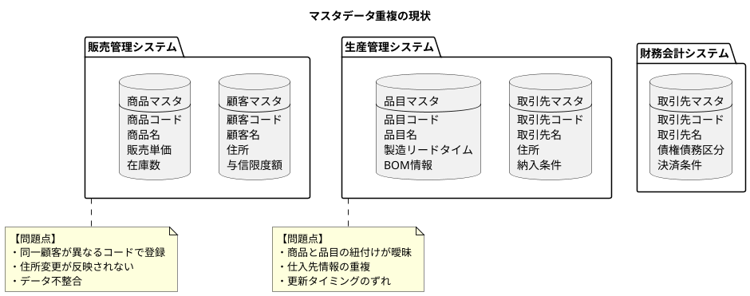

#### マスタ重複による具体的な問題

| 問題カテゴリ | 具体例 | ビジネスへの影響 |
|------------|-------|----------------|
| データ不整合 | 顧客住所が各システムで異なる | 請求書誤送付、配送ミス |
| 更新漏れ | 取引先の廃業が反映されない | 無効な発注、債権回収不能 |
| コード重複 | 同一顧客に複数コード付与 | 売上分析の誤り、与信管理不能 |
| 属性欠落 | 必要な属性が一部システムにのみ存在 | システム間連携の障害 |

### コード体系の不一致

各システムが独自のコード体系を持つことで、データの突合が困難になります。

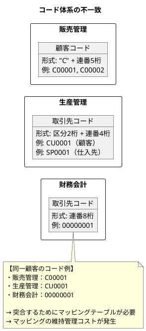

### 更新タイミングの同期

マスタデータの更新がシステム間で同期されないと、一時的または恒久的なデータ不整合が発生します。

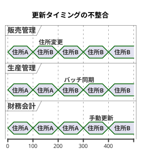

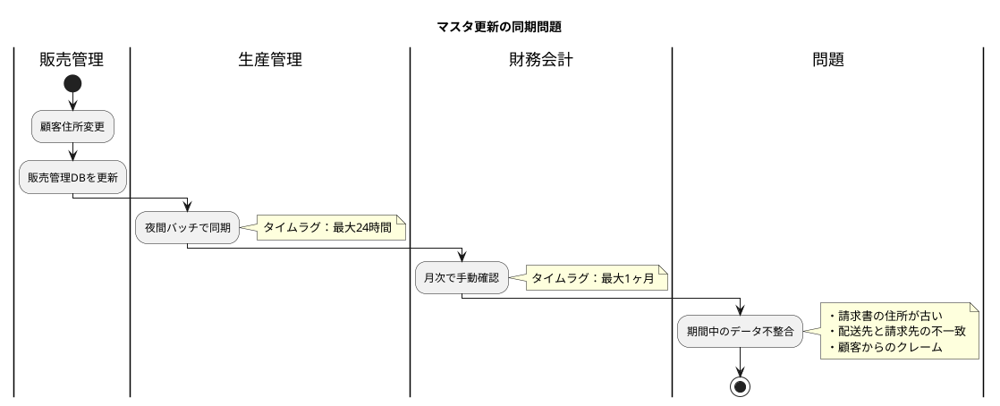

---

## 36.2 MDM パターン

マスタデータ管理には、組織の状況や要件に応じた複数のアーキテクチャパターンがあります。

### MDM パターンの概要

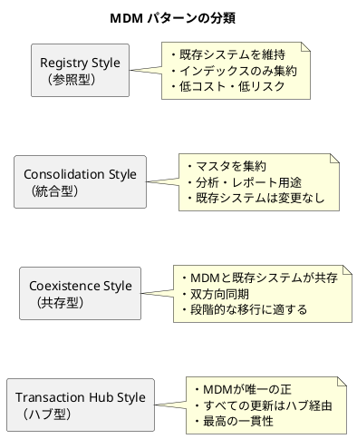

### Registry Style（参照型）

既存システムのマスタデータはそのまま維持し、MDMはマスタデータの「インデックス」として機能します。

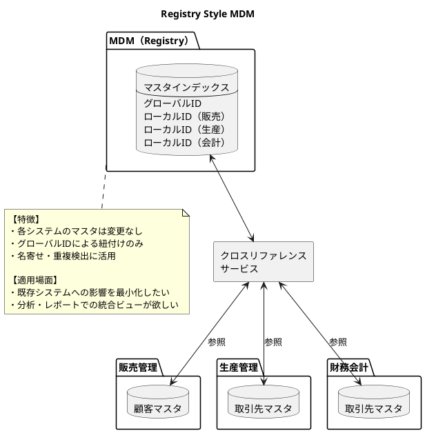

<details>
<summary>Java 実装例</summary>

```java
// マスタインデックス
@Entity
@Table(name = "master_index")
public class MasterIndex {
    @Id
    private String globalId;

    @OneToMany(mappedBy = "masterIndex", cascade = CascadeType.ALL)
    private List<LocalIdMapping> localMappings;

    private String masterType; // CUSTOMER, SUPPLIER, PRODUCT
    private String canonicalName;
    private LocalDateTime lastUpdated;
}

// ローカルIDマッピング
@Entity
@Table(name = "local_id_mapping")
public class LocalIdMapping {
    @Id
    @GeneratedValue
    private Long id;

    @ManyToOne
    private MasterIndex masterIndex;

    private String systemCode; // SALES, PRODUCTION, ACCOUNTING
    private String localId;
    private String status; // ACTIVE, INACTIVE, PENDING
}

// クロスリファレンスサービス
@Service
public class CrossReferenceService {
    private final MasterIndexRepository indexRepository;

    // グローバルIDからローカルIDを取得
    public String getLocalId(String globalId, String systemCode) {
        return indexRepository.findById(globalId)
            .flatMap(index -> index.getLocalMappings().stream()
                .filter(m -> m.getSystemCode().equals(systemCode))
                .findFirst())
            .map(LocalIdMapping::getLocalId)
            .orElseThrow(() -> new MappingNotFoundException(globalId, systemCode));
    }

    // ローカルIDからグローバルIDを取得
    public String getGlobalId(String localId, String systemCode) {
        return indexRepository.findByLocalIdAndSystem(localId, systemCode)
            .map(MasterIndex::getGlobalId)
            .orElseThrow(() -> new MappingNotFoundException(localId, systemCode));
    }

    // 名寄せ処理
    public List<MasterIndex> findPotentialDuplicates(String name) {
        return indexRepository.findByCanonicalNameLike(normalize(name));
    }
}
```

</details>

### Consolidation Style（統合型）

各システムのマスタデータを MDM に集約し、分析やレポート用途の「ゴールデンレコード」を作成します。

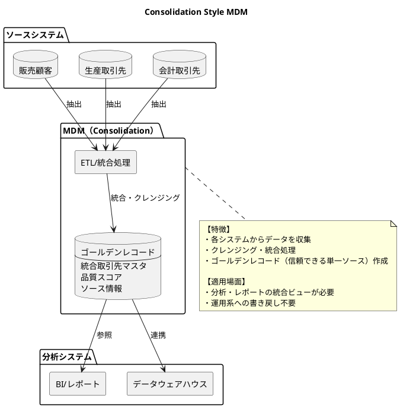

#### ゴールデンレコードの構造

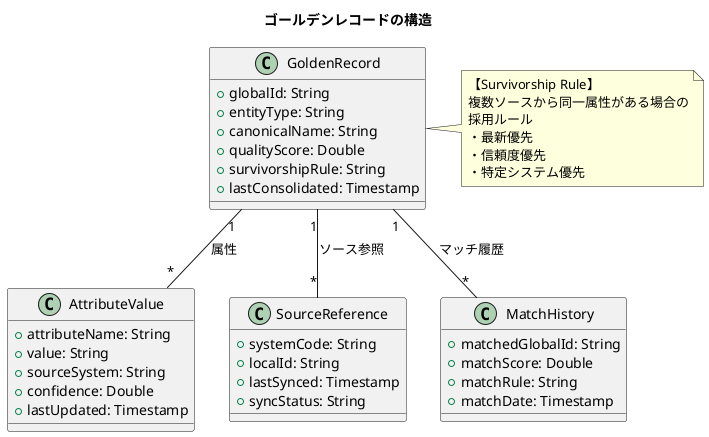

### Coexistence Style（共存型）

MDM と各システムのマスタが共存し、双方向で同期を行います。

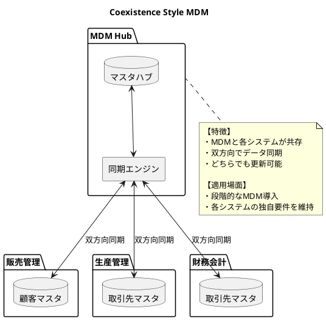

#### 同期ルールの設計

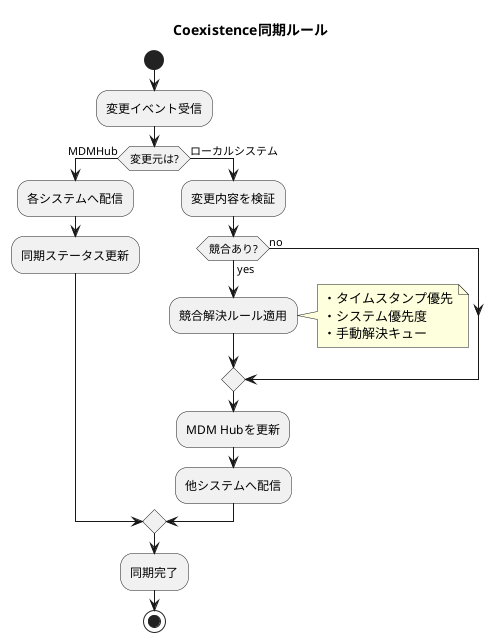

<details>
<summary>Java 実装例</summary>

```java
// 同期設定
@Entity
@Table(name = "sync_configuration")
public class SyncConfiguration {
    @Id
    private String configId;

    private String entityType;
    private String sourceSystem;
    private String targetSystem;
    private SyncDirection direction; // INBOUND, OUTBOUND, BIDIRECTIONAL
    private ConflictResolution conflictResolution;

    public enum ConflictResolution {
        LATEST_WINS,      // 最新タイムスタンプ優先
        SOURCE_WINS,      // ソースシステム優先
        TARGET_WINS,      // ターゲットシステム優先
        MANUAL_REVIEW     // 手動確認
    }
}

// 同期サービス
@Service
public class CoexistenceSyncService {
    private final SyncConfigurationRepository configRepository;
    private final MasterHubRepository hubRepository;
    private final ConflictResolver conflictResolver;

    @EventListener
    public void handleMasterChange(MasterChangeEvent event) {
        SyncConfiguration config = configRepository
            .findByEntityTypeAndSystem(event.entityType(), event.sourceSystem());

        if (event.sourceSystem().equals("MDM_HUB")) {
            // MDM Hubからの変更：各システムへ配信
            distributeToSystems(event, config);
        } else {
            // ローカルシステムからの変更
            MasterRecord hubRecord = hubRepository.findByGlobalId(event.globalId());

            if (hasConflict(hubRecord, event)) {
                MasterRecord resolved = conflictResolver.resolve(
                    hubRecord,
                    event,
                    config.getConflictResolution()
                );
                hubRepository.save(resolved);
            } else {
                hubRepository.updateFromSource(event);
            }

            // 他システムへ配信
            distributeToOtherSystems(event, config);
        }
    }

    private boolean hasConflict(MasterRecord hubRecord, MasterChangeEvent event) {
        return hubRecord.getLastUpdated().isAfter(event.previousUpdateTime());
    }
}
```

</details>

### Transaction Hub Style（トランザクションハブ型）

MDM が唯一の正（Single Source of Truth）となり、すべてのマスタ更新は MDM 経由で行われます。

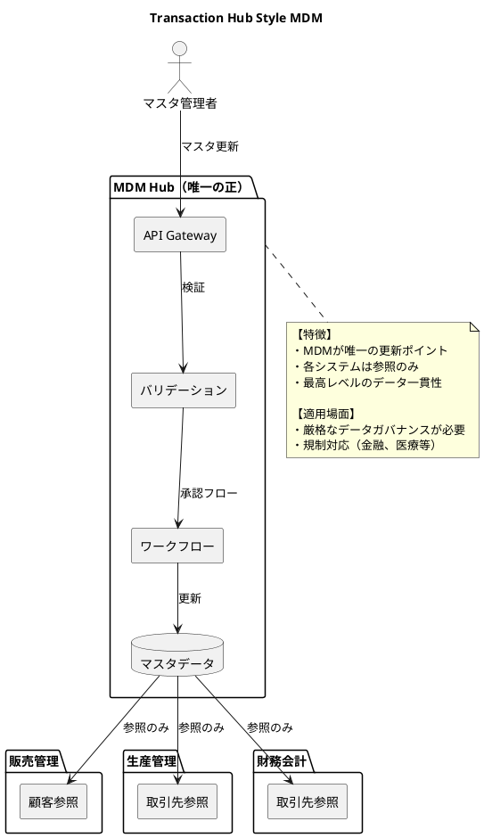

#### マスタ更新ワークフロー

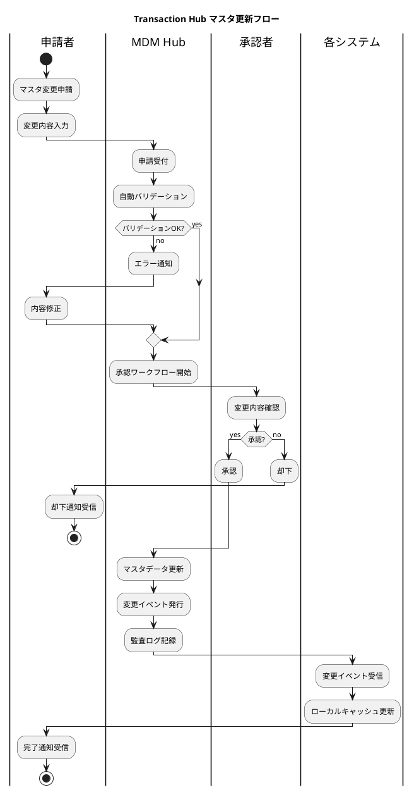

### MDM パターンの比較と選択

| パターン | データ一貫性 | 導入コスト | 運用負荷 | 適用場面 |
|---------|------------|----------|---------|---------|
| Registry | 低 | 低 | 低 | 分析用途、名寄せ |
| Consolidation | 中 | 中 | 中 | BI、レポート |
| Coexistence | 中〜高 | 中〜高 | 高 | 段階的移行 |
| Transaction Hub | 高 | 高 | 中 | 規制対応、厳格なガバナンス |

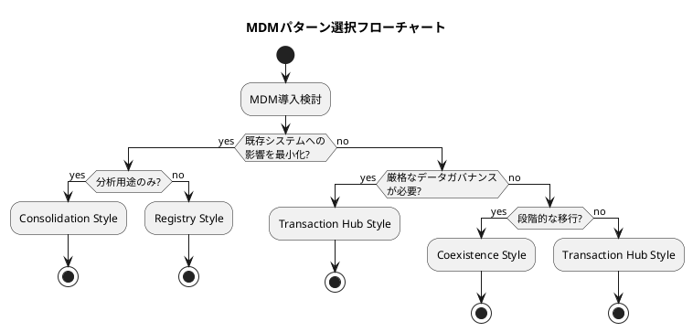

---

## 36.3 共通マスタの設計

基幹業務システムで共有される主要なマスタデータの統合設計について解説します。

### 取引先マスタの統合

取引先（顧客、仕入先、外注先）は、複数のシステムで参照される代表的なマスタです。

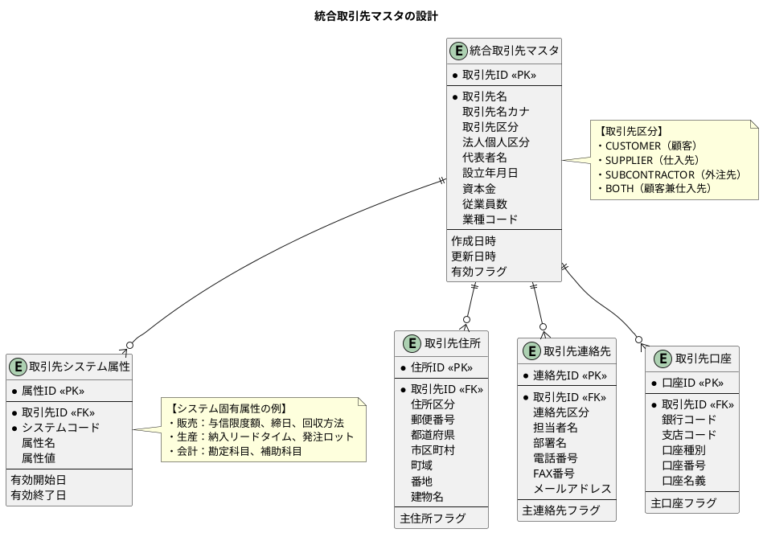

<details>
<summary>SQL 定義</summary>

```sql
-- 統合取引先マスタ
CREATE TABLE 統合取引先マスタ (
    取引先ID VARCHAR(20) PRIMARY KEY,
    取引先名 VARCHAR(200) NOT NULL,
    取引先名カナ VARCHAR(200),
    取引先区分 VARCHAR(20) NOT NULL,
    法人個人区分 VARCHAR(10),
    代表者名 VARCHAR(100),
    設立年月日 DATE,
    資本金 DECIMAL(15,0),
    従業員数 INTEGER,
    業種コード VARCHAR(10),
    作成日時 TIMESTAMP DEFAULT CURRENT_TIMESTAMP,
    更新日時 TIMESTAMP DEFAULT CURRENT_TIMESTAMP,
    有効フラグ BOOLEAN DEFAULT TRUE
);

-- 取引先住所
CREATE TABLE 取引先住所 (
    住所ID VARCHAR(20) PRIMARY KEY,
    取引先ID VARCHAR(20) NOT NULL,
    住所区分 VARCHAR(20) NOT NULL,
    郵便番号 VARCHAR(10),
    都道府県 VARCHAR(10),
    市区町村 VARCHAR(50),
    町域 VARCHAR(100),
    番地 VARCHAR(100),
    建物名 VARCHAR(100),
    主住所フラグ BOOLEAN DEFAULT FALSE,
    FOREIGN KEY (取引先ID) REFERENCES 統合取引先マスタ(取引先ID)
);

-- 取引先システム属性
CREATE TABLE 取引先システム属性 (
    属性ID VARCHAR(20) PRIMARY KEY,
    取引先ID VARCHAR(20) NOT NULL,
    システムコード VARCHAR(20) NOT NULL,
    属性名 VARCHAR(50) NOT NULL,
    属性値 VARCHAR(500),
    有効開始日 DATE,
    有効終了日 DATE,
    FOREIGN KEY (取引先ID) REFERENCES 統合取引先マスタ(取引先ID),
    UNIQUE (取引先ID, システムコード, 属性名, 有効開始日)
);
```

</details>

### 商品/品目マスタの統合

販売管理の「商品」と生産管理の「品目」を統合的に管理します。

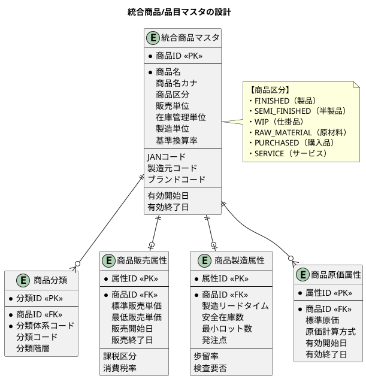

#### 商品コード体系の統一

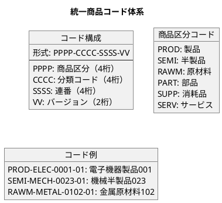

### 部門・組織マスタの統合

組織構造は、権限管理や実績集計に使用される重要なマスタです。

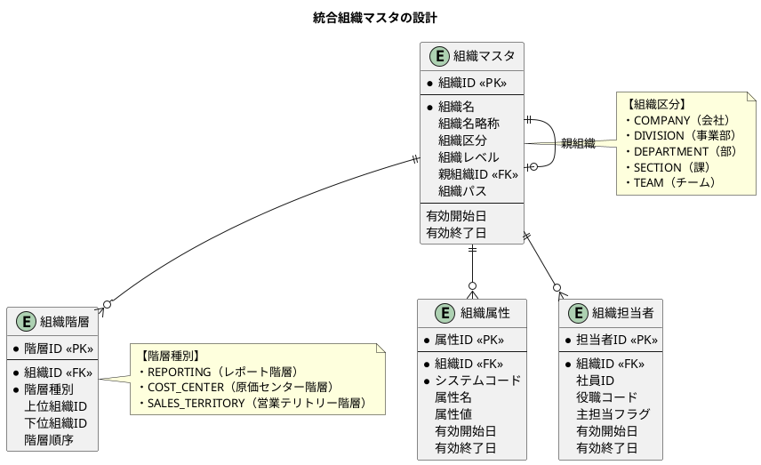

#### 組織パスによる階層表現

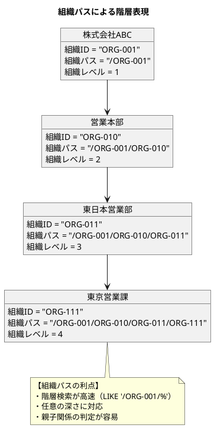

<details>
<summary>SQL クエリ例</summary>

```sql
-- 特定組織の配下をすべて取得
SELECT * FROM 組織マスタ
WHERE 組織パス LIKE '/ORG-001/ORG-010/%'
ORDER BY 組織パス;

-- 特定組織の直接の子組織を取得
SELECT * FROM 組織マスタ
WHERE 親組織ID = 'ORG-010'
AND 有効終了日 IS NULL;

-- 組織の全階層を展開（再帰CTE）
WITH RECURSIVE 組織階層 AS (
    -- 基点
    SELECT 組織ID, 組織名, 親組織ID, 1 as レベル
    FROM 組織マスタ
    WHERE 組織ID = 'ORG-001'

    UNION ALL

    -- 再帰部分
    SELECT o.組織ID, o.組織名, o.親組織ID, h.レベル + 1
    FROM 組織マスタ o
    INNER JOIN 組織階層 h ON o.親組織ID = h.組織ID
    WHERE o.有効終了日 IS NULL
)
SELECT * FROM 組織階層
ORDER BY レベル, 組織ID;
```

</details>

---

## 36.4 MDM 導入のベストプラクティス

### データガバナンスの確立

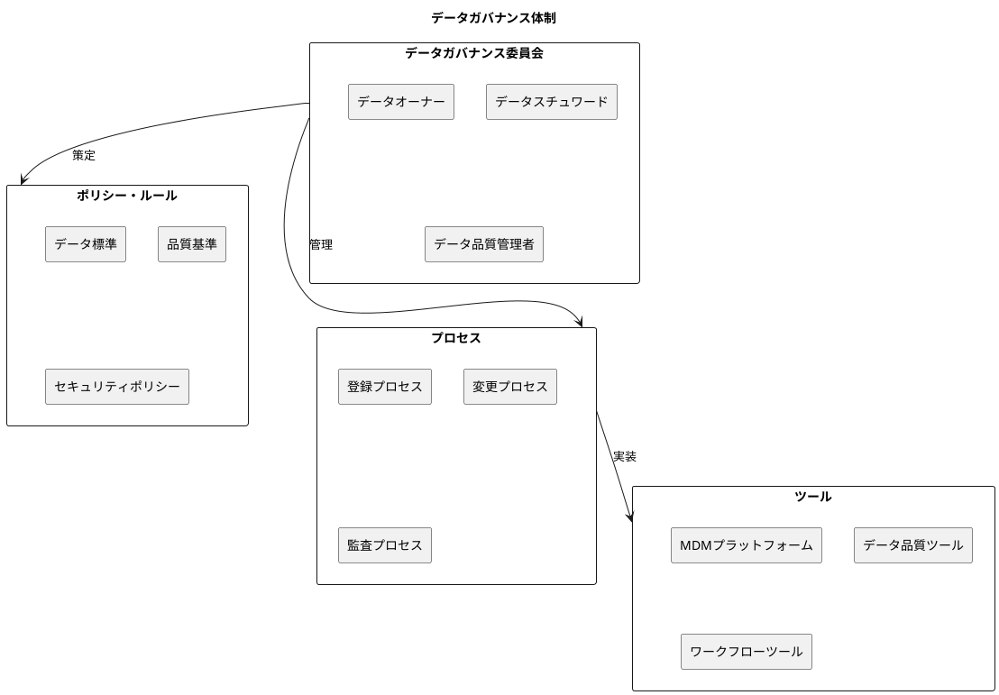

### 段階的な導入アプローチ

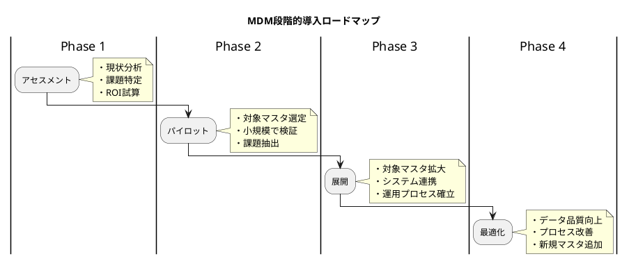

---

## 36.5 まとめ

本章では、マスタデータ管理（MDM）の概念と実践的なパターンについて解説しました。

### 学んだこと

1. **マスタデータ統合の課題**

   - 各システムでのマスタ重複
   - コード体系の不一致
   - 更新タイミングの同期問題

2. **MDM パターン**

   - Registry Style：インデックスとしての軽量 MDM
   - Consolidation Style：分析用ゴールデンレコード
   - Coexistence Style：双方向同期による共存
   - Transaction Hub Style：唯一の正としての厳格な MDM

3. **共通マスタの設計**

   - 取引先マスタ：顧客・仕入先・外注先の統合
   - 商品/品目マスタ：販売と製造の属性統合
   - 部門・組織マスタ：階層構造の表現

### MDM 成功のポイント

- ビジネス要件に合ったパターンの選択
- 段階的な導入アプローチ
- データガバナンス体制の確立
- 継続的なデータ品質管理

### 次章の予告

第37章では、イベント駆動アーキテクチャについて解説します。ドメインイベント、イベントソーシング、CQRS など、モダンなシステム統合の基盤となる概念を学びます。
