# 第37章：イベント駆動アーキテクチャ

本章では、モダンなシステム統合の基盤となるイベント駆動アーキテクチャについて解説します。ドメインイベント、イベントソーシング、CQRS といった概念を理解し、基幹業務システムへの適用方法を学びます。

---

## 37.1 イベント駆動の基礎

### イベント駆動アーキテクチャとは

イベント駆動アーキテクチャ（Event-Driven Architecture: EDA）は、システム間の通信をイベントの発行と購読によって行うアーキテクチャスタイルです。

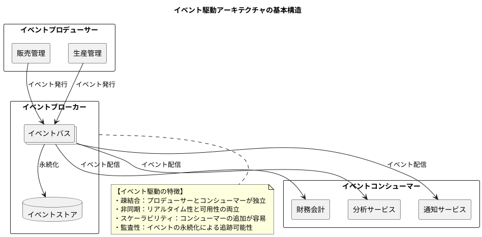

### ドメインイベントとは

ドメインイベントは、ビジネスドメインで発生した重要な出来事を表現するオブジェクトです。「過去に起きたこと」を記録するため、常に過去形で命名します。

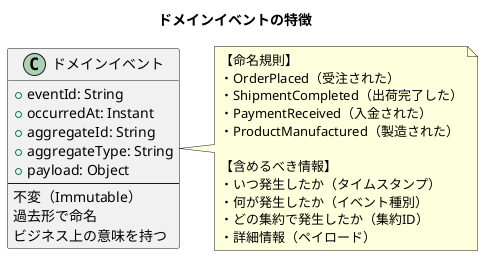

#### ドメインイベントの構造

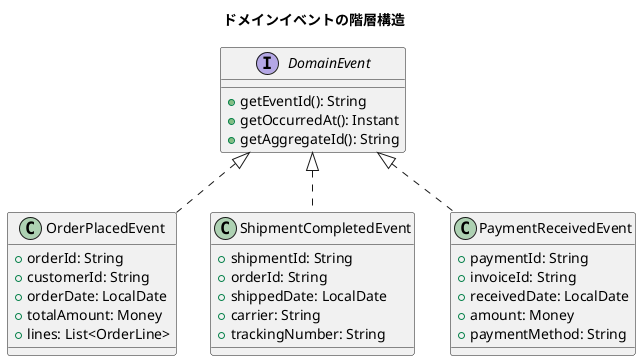

<details>
<summary>Java 実装例</summary>

```java
// ドメインイベント基底インターフェース
public interface DomainEvent {
    String getEventId();
    Instant getOccurredAt();
    String getAggregateId();
    String getAggregateType();
}

// 抽象基底クラス
public abstract class AbstractDomainEvent implements DomainEvent {
    private final String eventId;
    private final Instant occurredAt;
    private final String aggregateId;
    private final String aggregateType;

    protected AbstractDomainEvent(String aggregateId, String aggregateType) {
        this.eventId = UUID.randomUUID().toString();
        this.occurredAt = Instant.now();
        this.aggregateId = aggregateId;
        this.aggregateType = aggregateType;
    }

    // getters...
}

// 受注イベント
public record OrderPlacedEvent(
    String eventId,
    Instant occurredAt,
    String orderId,
    String customerId,
    LocalDate orderDate,
    Money totalAmount,
    List<OrderLineEvent> lines
) implements DomainEvent {

    public OrderPlacedEvent(String orderId, String customerId,
            LocalDate orderDate, Money totalAmount, List<OrderLineEvent> lines) {
        this(
            UUID.randomUUID().toString(),
            Instant.now(),
            orderId,
            customerId,
            orderDate,
            totalAmount,
            lines
        );
    }

    @Override
    public String getAggregateId() {
        return orderId;
    }

    @Override
    public String getAggregateType() {
        return "Order";
    }
}

// sealed interface による型安全なイベント定義
public sealed interface OrderEvent extends DomainEvent
    permits OrderPlacedEvent, OrderConfirmedEvent,
            OrderShippedEvent, OrderCancelledEvent {
}

public record OrderPlacedEvent(...) implements OrderEvent { }
public record OrderConfirmedEvent(...) implements OrderEvent { }
public record OrderShippedEvent(...) implements OrderEvent { }
public record OrderCancelledEvent(...) implements OrderEvent { }
```

</details>

### イベントソーシング

イベントソーシングは、エンティティの状態を「状態そのもの」ではなく「状態変化の履歴（イベント）」として保存するパターンです。

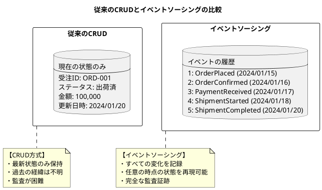

#### イベントソーシングの仕組み

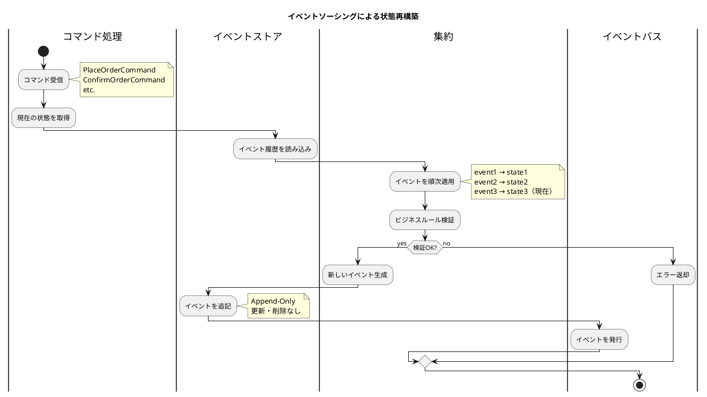

<details>
<summary>Java 実装例</summary>

```java
// イベントソース集約の基底クラス
public abstract class EventSourcedAggregate<ID> {
    private final List<DomainEvent> uncommittedEvents = new ArrayList<>();
    private int version = 0;

    // イベントから状態を再構築
    public void replayEvents(List<DomainEvent> events) {
        events.forEach(event -> {
            apply(event);
            version++;
        });
    }

    // 新しいイベントを適用
    protected void applyChange(DomainEvent event) {
        apply(event);
        uncommittedEvents.add(event);
    }

    // イベントハンドラー（サブクラスで実装）
    protected abstract void apply(DomainEvent event);

    public List<DomainEvent> getUncommittedEvents() {
        return Collections.unmodifiableList(uncommittedEvents);
    }

    public void markEventsAsCommitted() {
        uncommittedEvents.clear();
    }

    public int getVersion() {
        return version;
    }
}

// 受注集約
public class Order extends EventSourcedAggregate<OrderId> {
    private OrderId orderId;
    private CustomerId customerId;
    private OrderStatus status;
    private Money totalAmount;
    private List<OrderLine> lines;

    // コマンドハンドラー
    public void place(PlaceOrderCommand command) {
        // ビジネスルール検証
        if (status != null) {
            throw new IllegalStateException("Order already exists");
        }

        // イベント生成と適用
        applyChange(new OrderPlacedEvent(
            command.orderId(),
            command.customerId(),
            command.orderDate(),
            command.totalAmount(),
            command.lines()
        ));
    }

    public void confirm() {
        if (status != OrderStatus.PLACED) {
            throw new IllegalStateException("Order cannot be confirmed");
        }

        applyChange(new OrderConfirmedEvent(orderId.value(), Instant.now()));
    }

    // イベントハンドラー
    @Override
    protected void apply(DomainEvent event) {
        switch (event) {
            case OrderPlacedEvent e -> {
                this.orderId = new OrderId(e.orderId());
                this.customerId = new CustomerId(e.customerId());
                this.status = OrderStatus.PLACED;
                this.totalAmount = e.totalAmount();
                this.lines = e.lines().stream()
                    .map(OrderLine::from)
                    .toList();
            }
            case OrderConfirmedEvent e -> {
                this.status = OrderStatus.CONFIRMED;
            }
            case OrderShippedEvent e -> {
                this.status = OrderStatus.SHIPPED;
            }
            default -> throw new IllegalArgumentException(
                "Unknown event: " + event.getClass()
            );
        }
    }
}

// リポジトリ
@Repository
public class EventSourcedOrderRepository {
    private final EventStore eventStore;

    public Order findById(OrderId orderId) {
        List<DomainEvent> events = eventStore.getEvents(
            orderId.value(),
            "Order"
        );

        if (events.isEmpty()) {
            return null;
        }

        Order order = new Order();
        order.replayEvents(events);
        return order;
    }

    public void save(Order order) {
        List<DomainEvent> events = order.getUncommittedEvents();

        eventStore.appendEvents(
            order.getOrderId().value(),
            "Order",
            order.getVersion(),
            events
        );

        order.markEventsAsCommitted();
    }
}
```

</details>

### CQRS（コマンドクエリ責務分離）

CQRS（Command Query Responsibility Segregation）は、データの書き込み（コマンド）と読み取り（クエリ）を分離するアーキテクチャパターンです。

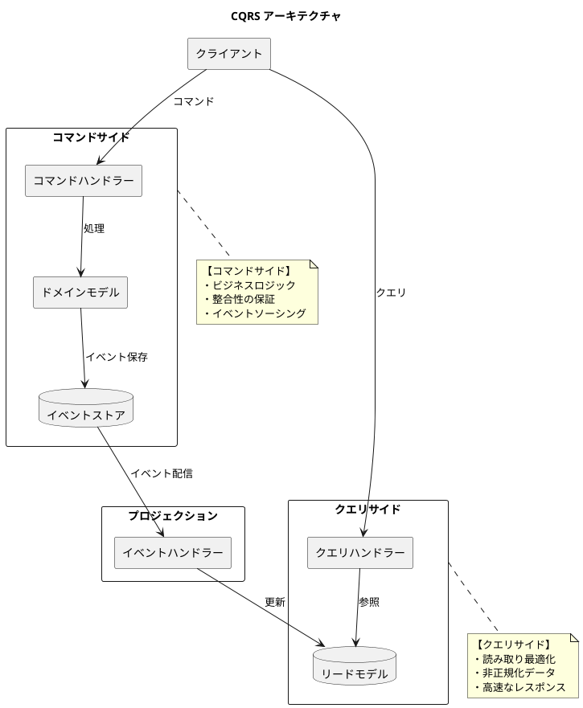

#### CQRS の利点と適用場面

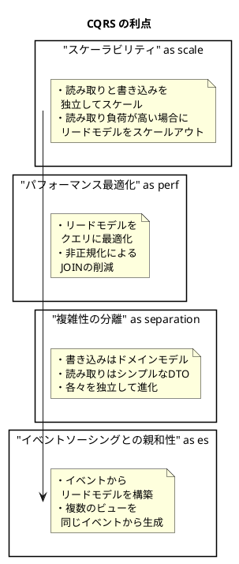

<details>
<summary>Java 実装例</summary>

```java
// コマンド
public sealed interface OrderCommand
    permits PlaceOrderCommand, ConfirmOrderCommand, ShipOrderCommand {
}

public record PlaceOrderCommand(
    String orderId,
    String customerId,
    LocalDate orderDate,
    List<OrderLineCommand> lines
) implements OrderCommand {}

// クエリ
public sealed interface OrderQuery
    permits GetOrderByIdQuery, GetOrdersByCustomerQuery,
            GetOrdersSummaryQuery {
}

public record GetOrderByIdQuery(String orderId) implements OrderQuery {}
public record GetOrdersByCustomerQuery(
    String customerId,
    LocalDate from,
    LocalDate to
) implements OrderQuery {}

// コマンドハンドラー
@Service
public class OrderCommandHandler {
    private final EventSourcedOrderRepository repository;
    private final EventPublisher eventPublisher;

    @Transactional
    public void handle(PlaceOrderCommand command) {
        Order order = new Order();
        order.place(command);

        repository.save(order);

        // イベント発行
        order.getUncommittedEvents().forEach(eventPublisher::publish);
    }

    @Transactional
    public void handle(ConfirmOrderCommand command) {
        Order order = repository.findById(new OrderId(command.orderId()));
        if (order == null) {
            throw new OrderNotFoundException(command.orderId());
        }

        order.confirm();
        repository.save(order);

        order.getUncommittedEvents().forEach(eventPublisher::publish);
    }
}

// クエリハンドラー
@Service
public class OrderQueryHandler {
    private final OrderReadModelRepository readModelRepository;

    public OrderDetailView handle(GetOrderByIdQuery query) {
        return readModelRepository.findById(query.orderId())
            .orElseThrow(() -> new OrderNotFoundException(query.orderId()));
    }

    public List<OrderSummaryView> handle(GetOrdersByCustomerQuery query) {
        return readModelRepository.findByCustomerAndPeriod(
            query.customerId(),
            query.from(),
            query.to()
        );
    }
}

// リードモデル（非正規化されたビュー）
@Entity
@Table(name = "order_read_model")
public class OrderReadModel {
    @Id
    private String orderId;
    private String customerId;
    private String customerName;  // 非正規化
    private LocalDate orderDate;
    private String status;
    private BigDecimal totalAmount;
    private int lineCount;
    private LocalDateTime lastUpdated;
}

// プロジェクション（イベントからリードモデルを構築）
@Component
public class OrderProjection {
    private final OrderReadModelRepository repository;
    private final CustomerRepository customerRepository;

    @EventHandler
    public void on(OrderPlacedEvent event) {
        Customer customer = customerRepository.findById(event.customerId());

        OrderReadModel readModel = new OrderReadModel();
        readModel.setOrderId(event.orderId());
        readModel.setCustomerId(event.customerId());
        readModel.setCustomerName(customer.getName());  // 非正規化
        readModel.setOrderDate(event.orderDate());
        readModel.setStatus("PLACED");
        readModel.setTotalAmount(event.totalAmount().amount());
        readModel.setLineCount(event.lines().size());
        readModel.setLastUpdated(LocalDateTime.now());

        repository.save(readModel);
    }

    @EventHandler
    public void on(OrderConfirmedEvent event) {
        OrderReadModel readModel = repository.findById(event.orderId())
            .orElseThrow();
        readModel.setStatus("CONFIRMED");
        readModel.setLastUpdated(LocalDateTime.now());
        repository.save(readModel);
    }
}
```

</details>

---

## 37.2 基幹業務システムのイベント設計

### 販売管理イベント

販売管理システムで発生する主要なドメインイベントを定義します。

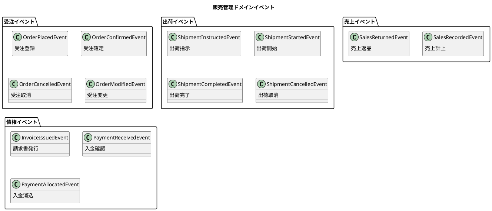

#### 受注イベントの詳細設計

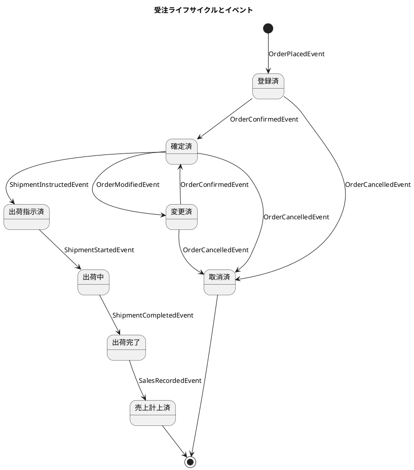

<details>
<summary>Java 実装例</summary>

```java
// 販売管理イベント定義
public sealed interface SalesEvent extends DomainEvent
    permits OrderEvent, ShipmentEvent, SalesTransactionEvent, ReceivableEvent {
}

// 受注イベント
public sealed interface OrderEvent extends SalesEvent
    permits OrderPlacedEvent, OrderConfirmedEvent,
            OrderModifiedEvent, OrderCancelledEvent {
}

public record OrderPlacedEvent(
    String eventId,
    Instant occurredAt,
    String orderId,
    String customerId,
    LocalDate orderDate,
    LocalDate requestedDeliveryDate,
    Money totalAmount,
    Money taxAmount,
    List<OrderLineEvent> lines
) implements OrderEvent {
    @Override
    public String getAggregateId() { return orderId; }
    @Override
    public String getAggregateType() { return "Order"; }
}

public record OrderConfirmedEvent(
    String eventId,
    Instant occurredAt,
    String orderId,
    String confirmedBy,
    LocalDate confirmedDate
) implements OrderEvent {
    @Override
    public String getAggregateId() { return orderId; }
    @Override
    public String getAggregateType() { return "Order"; }
}

// 出荷イベント
public sealed interface ShipmentEvent extends SalesEvent
    permits ShipmentInstructedEvent, ShipmentStartedEvent,
            ShipmentCompletedEvent, ShipmentCancelledEvent {
}

public record ShipmentCompletedEvent(
    String eventId,
    Instant occurredAt,
    String shipmentId,
    String orderId,
    LocalDate shippedDate,
    String carrier,
    String trackingNumber,
    List<ShipmentLineEvent> lines
) implements ShipmentEvent {
    @Override
    public String getAggregateId() { return shipmentId; }
    @Override
    public String getAggregateType() { return "Shipment"; }
}
```

</details>

### 財務会計イベント

財務会計システムで発生する主要なドメインイベントを定義します。

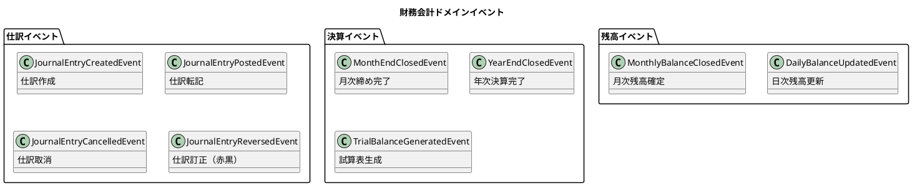

#### 仕訳ライフサイクル

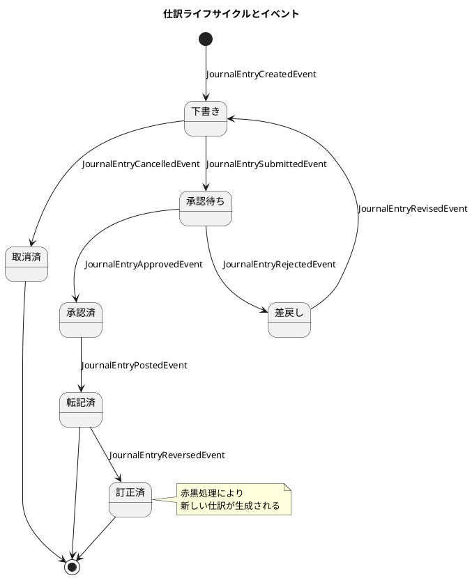

### 生産管理イベント

生産管理システムで発生する主要なドメインイベントを定義します。

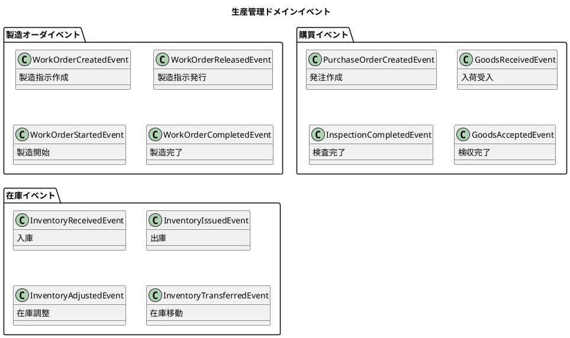

#### 製造オーダライフサイクル

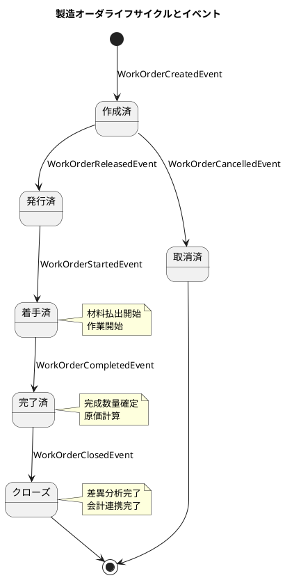

### イベントカタログ

基幹業務システム全体のイベントカタログを整理します。

| システム | イベント名 | 発生タイミング | 主な購読者 |
|---------|----------|--------------|-----------|
| 販売管理 | OrderPlacedEvent | 受注登録時 | 生産計画、与信管理 |
| 販売管理 | OrderConfirmedEvent | 受注確定時 | 出荷管理、在庫管理 |
| 販売管理 | ShipmentCompletedEvent | 出荷完了時 | 売上管理、在庫管理 |
| 販売管理 | SalesRecordedEvent | 売上計上時 | 自動仕訳、債権管理 |
| 販売管理 | PaymentReceivedEvent | 入金確認時 | 自動仕訳、債権管理 |
| 財務会計 | JournalEntryPostedEvent | 仕訳転記時 | 残高管理、試算表 |
| 財務会計 | MonthEndClosedEvent | 月次締め時 | 財務レポート |
| 生産管理 | WorkOrderReleasedEvent | 製造指示時 | 工程管理、資材管理 |
| 生産管理 | WorkOrderCompletedEvent | 製造完了時 | 在庫管理、原価計算 |
| 生産管理 | GoodsAcceptedEvent | 検収完了時 | 自動仕訳、在庫管理 |

---

## 37.3 イベントストアの設計

### イベントテーブルの構造

イベントストアは、すべてのドメインイベントを永続化するための専用データベースです。

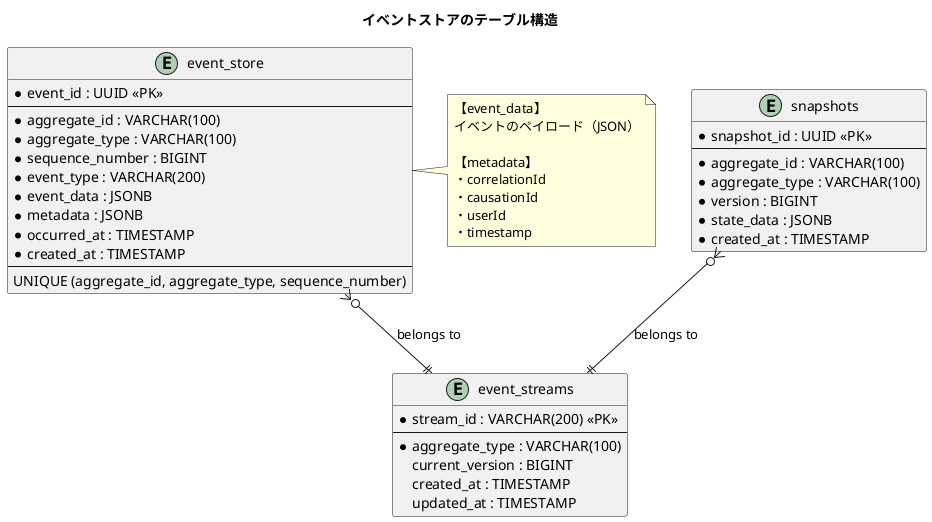

<details>
<summary>SQL 定義</summary>

```sql
-- イベントストアテーブル
CREATE TABLE event_store (
    event_id UUID PRIMARY KEY DEFAULT gen_random_uuid(),
    aggregate_id VARCHAR(100) NOT NULL,
    aggregate_type VARCHAR(100) NOT NULL,
    sequence_number BIGINT NOT NULL,
    event_type VARCHAR(200) NOT NULL,
    event_data JSONB NOT NULL,
    metadata JSONB DEFAULT '{}',
    occurred_at TIMESTAMP NOT NULL,
    created_at TIMESTAMP DEFAULT CURRENT_TIMESTAMP,
    UNIQUE (aggregate_id, aggregate_type, sequence_number)
);

-- インデックス
CREATE INDEX idx_event_store_aggregate
    ON event_store (aggregate_id, aggregate_type, sequence_number);
CREATE INDEX idx_event_store_type
    ON event_store (event_type);
CREATE INDEX idx_event_store_occurred_at
    ON event_store (occurred_at);

-- スナップショットテーブル
CREATE TABLE snapshots (
    snapshot_id UUID PRIMARY KEY DEFAULT gen_random_uuid(),
    aggregate_id VARCHAR(100) NOT NULL,
    aggregate_type VARCHAR(100) NOT NULL,
    version BIGINT NOT NULL,
    state_data JSONB NOT NULL,
    created_at TIMESTAMP DEFAULT CURRENT_TIMESTAMP,
    UNIQUE (aggregate_id, aggregate_type, version)
);

-- イベントストリームテーブル
CREATE TABLE event_streams (
    stream_id VARCHAR(200) PRIMARY KEY,
    aggregate_type VARCHAR(100) NOT NULL,
    current_version BIGINT DEFAULT 0,
    created_at TIMESTAMP DEFAULT CURRENT_TIMESTAMP,
    updated_at TIMESTAMP DEFAULT CURRENT_TIMESTAMP
);

-- 楽観ロック用の関数
CREATE OR REPLACE FUNCTION append_event(
    p_aggregate_id VARCHAR,
    p_aggregate_type VARCHAR,
    p_expected_version BIGINT,
    p_event_type VARCHAR,
    p_event_data JSONB,
    p_metadata JSONB,
    p_occurred_at TIMESTAMP
) RETURNS UUID AS $$
DECLARE
    v_stream_id VARCHAR;
    v_current_version BIGINT;
    v_event_id UUID;
BEGIN
    v_stream_id := p_aggregate_type || '-' || p_aggregate_id;

    -- ストリームのロックと現在バージョン取得
    SELECT current_version INTO v_current_version
    FROM event_streams
    WHERE stream_id = v_stream_id
    FOR UPDATE;

    IF v_current_version IS NULL THEN
        -- 新規ストリーム作成
        INSERT INTO event_streams (stream_id, aggregate_type, current_version)
        VALUES (v_stream_id, p_aggregate_type, 0);
        v_current_version := 0;
    END IF;

    -- 楽観ロックチェック
    IF v_current_version != p_expected_version THEN
        RAISE EXCEPTION 'Concurrency conflict: expected %, actual %',
            p_expected_version, v_current_version;
    END IF;

    -- イベント追加
    INSERT INTO event_store (
        aggregate_id, aggregate_type, sequence_number,
        event_type, event_data, metadata, occurred_at
    ) VALUES (
        p_aggregate_id, p_aggregate_type, v_current_version + 1,
        p_event_type, p_event_data, p_metadata, p_occurred_at
    ) RETURNING event_id INTO v_event_id;

    -- ストリームバージョン更新
    UPDATE event_streams
    SET current_version = v_current_version + 1,
        updated_at = CURRENT_TIMESTAMP
    WHERE stream_id = v_stream_id;

    RETURN v_event_id;
END;
$$ LANGUAGE plpgsql;
```

</details>

### スナップショットの管理

イベント数が多くなると、状態の再構築に時間がかかります。スナップショットを定期的に保存することで、パフォーマンスを改善します。

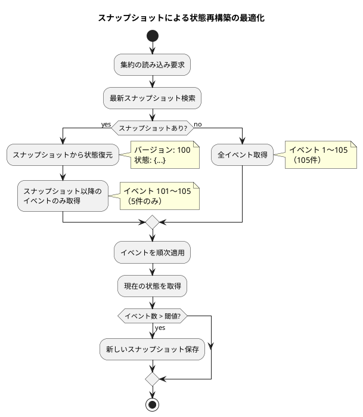

<details>
<summary>Java 実装例</summary>

```java
// スナップショット付きリポジトリ
@Repository
public class SnapshotEventSourcedRepository<T extends EventSourcedAggregate<?>> {
    private final EventStore eventStore;
    private final SnapshotStore snapshotStore;
    private final int snapshotThreshold = 100;

    public T findById(String aggregateId, String aggregateType,
                      Supplier<T> factory) {
        // スナップショット検索
        Optional<Snapshot> snapshot = snapshotStore.findLatest(
            aggregateId, aggregateType
        );

        T aggregate = factory.get();
        int fromVersion = 0;

        if (snapshot.isPresent()) {
            // スナップショットから復元
            aggregate.restoreFromSnapshot(snapshot.get().getStateData());
            fromVersion = snapshot.get().getVersion();
        }

        // スナップショット以降のイベントを取得
        List<DomainEvent> events = eventStore.getEvents(
            aggregateId,
            aggregateType,
            fromVersion + 1
        );

        // イベントを適用
        aggregate.replayEvents(events);

        return aggregate;
    }

    public void save(T aggregate) {
        List<DomainEvent> events = aggregate.getUncommittedEvents();

        // イベント保存
        eventStore.appendEvents(
            aggregate.getId(),
            aggregate.getAggregateType(),
            aggregate.getVersion(),
            events
        );

        // スナップショット判定
        if (shouldTakeSnapshot(aggregate)) {
            Snapshot snapshot = new Snapshot(
                aggregate.getId(),
                aggregate.getAggregateType(),
                aggregate.getVersion() + events.size(),
                aggregate.getStateAsJson()
            );
            snapshotStore.save(snapshot);
        }

        aggregate.markEventsAsCommitted();
    }

    private boolean shouldTakeSnapshot(T aggregate) {
        int eventsSinceSnapshot = aggregate.getVersion() %  snapshotThreshold;
        return eventsSinceSnapshot + aggregate.getUncommittedEvents().size()
            >= snapshotThreshold;
    }
}
```

</details>

### イベントの再生とリプレイ

イベントソーシングの強力な機能の1つは、イベントを再生して任意の時点の状態を復元できることです。

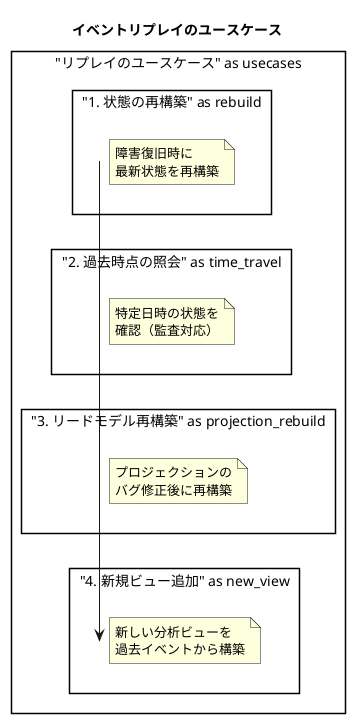

#### 特定時点の状態照会

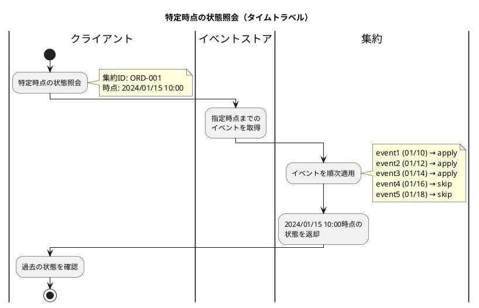

<details>
<summary>Java 実装例</summary>

```java
// タイムトラベルクエリ
@Service
public class TimeTravelQueryService {
    private final EventStore eventStore;

    public <T extends EventSourcedAggregate<?>> T getStateAt(
            String aggregateId,
            String aggregateType,
            Instant pointInTime,
            Supplier<T> factory) {

        // 指定時点までのイベントを取得
        List<DomainEvent> events = eventStore.getEventsUntil(
            aggregateId,
            aggregateType,
            pointInTime
        );

        // 状態を再構築
        T aggregate = factory.get();
        aggregate.replayEvents(events);

        return aggregate;
    }
}

// プロジェクション再構築
@Service
public class ProjectionRebuilder {
    private final EventStore eventStore;
    private final List<Projection> projections;

    public void rebuildAll() {
        // 全プロジェクションをクリア
        projections.forEach(Projection::clear);

        // 全イベントを時系列で取得
        try (Stream<DomainEvent> events = eventStore.streamAllEvents()) {
            events.forEach(event -> {
                projections.forEach(p -> p.handle(event));
            });
        }
    }

    public void rebuildFrom(Instant from) {
        try (Stream<DomainEvent> events = eventStore.streamEventsFrom(from)) {
            events.forEach(event -> {
                projections.forEach(p -> p.handle(event));
            });
        }
    }
}
```

</details>

---

## 37.4 まとめ

本章では、イベント駆動アーキテクチャの基礎と基幹業務システムへの適用方法について解説しました。

### 学んだこと

1. **イベント駆動の基礎**

   - ドメインイベント：ビジネス上の出来事を表現
   - イベントソーシング：状態変化の履歴として保存
   - CQRS：コマンドとクエリの責務分離

2. **基幹業務システムのイベント設計**

   - 販売管理イベント（受注、出荷、売上、債権）
   - 財務会計イベント（仕訳、残高、決算）
   - 生産管理イベント（製造、購買、在庫）

3. **イベントストアの設計**

   - イベントテーブルの構造
   - スナップショットによる最適化
   - イベントの再生とリプレイ

### イベント駆動アーキテクチャの適用指針

| 項目 | 推奨 | 非推奨 |
|-----|-----|-------|
| 適用場面 | 複雑なドメインロジック | シンプルな CRUD |
| | 監査要件が厳しい | 即時一貫性が必須 |
| | 複数ビューが必要 | データ量が少ない |
| 技術選定 | Axon Framework | 自前実装（小規模） |
| | Apache Kafka | 単一サービス内 |

### 次章の予告

第38章では、API 設計とサービス連携について解説します。RESTful API の設計原則、サービス間通信のパターン、API ゲートウェイの活用方法を学びます。
