# 第38章：API 設計とサービス連携

本章では、基幹業務システムにおける API 設計の原則と、サービス間連携のパターンについて解説します。RESTful API の設計、サービス間通信の方式、API ゲートウェイの活用、そしてインテグレーションテストの実践方法を学びます。

---

## 38.1 API 設計の原則

### RESTful API の設計

REST（Representational State Transfer）は、Web API 設計の標準的なアーキテクチャスタイルです。

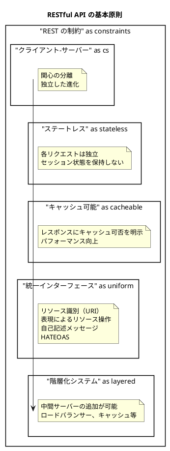

#### HTTP メソッドとリソース操作

| HTTP メソッド | 操作 | 冪等性 | 安全性 | 使用例 |
|-------------|-----|-------|-------|-------|
| GET | 取得 | Yes | Yes | リソースの参照 |
| POST | 作成 | No | No | 新規リソース作成 |
| PUT | 置換 | Yes | No | リソース全体の更新 |
| PATCH | 部分更新 | No | No | リソースの一部更新 |
| DELETE | 削除 | Yes | No | リソースの削除 |

### リソース指向設計

API はリソース（名詞）を中心に設計し、操作は HTTP メソッドで表現します。

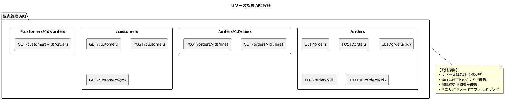

#### 基幹業務システムの API エンドポイント設計

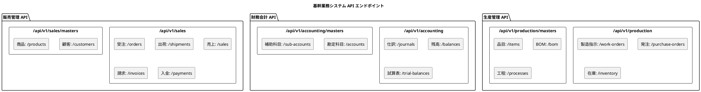

<details>
<summary>OpenAPI 定義例</summary>

```yaml
openapi: 3.0.3
info:
  title: 販売管理 API
  version: 1.0.0
  description: 基幹業務システム - 販売管理 API

servers:
  - url: https://api.example.com/api/v1/sales
    description: Production server

paths:
  /orders:
    get:
      summary: 受注一覧取得
      operationId: getOrders
      parameters:
        - name: customerId
          in: query
          schema:
            type: string
        - name: status
          in: query
          schema:
            type: string
            enum: [DRAFT, CONFIRMED, SHIPPED, COMPLETED]
        - name: fromDate
          in: query
          schema:
            type: string
            format: date
        - name: toDate
          in: query
          schema:
            type: string
            format: date
        - name: page
          in: query
          schema:
            type: integer
            default: 0
        - name: size
          in: query
          schema:
            type: integer
            default: 20
      responses:
        '200':
          description: 成功
          content:
            application/json:
              schema:
                $ref: '#/components/schemas/OrderListResponse'

    post:
      summary: 受注登録
      operationId: createOrder
      requestBody:
        required: true
        content:
          application/json:
            schema:
              $ref: '#/components/schemas/CreateOrderRequest'
      responses:
        '201':
          description: 作成成功
          content:
            application/json:
              schema:
                $ref: '#/components/schemas/OrderResponse'
        '400':
          description: バリデーションエラー
          content:
            application/problem+json:
              schema:
                $ref: '#/components/schemas/ProblemDetail'

  /orders/{orderId}:
    get:
      summary: 受注詳細取得
      operationId: getOrder
      parameters:
        - name: orderId
          in: path
          required: true
          schema:
            type: string
      responses:
        '200':
          description: 成功
          content:
            application/json:
              schema:
                $ref: '#/components/schemas/OrderResponse'
        '404':
          description: 受注が見つからない

components:
  schemas:
    OrderResponse:
      type: object
      properties:
        orderId:
          type: string
        customerId:
          type: string
        customerName:
          type: string
        orderDate:
          type: string
          format: date
        status:
          type: string
          enum: [DRAFT, CONFIRMED, SHIPPED, COMPLETED]
        totalAmount:
          type: number
        taxAmount:
          type: number
        lines:
          type: array
          items:
            $ref: '#/components/schemas/OrderLineResponse'
        _links:
          $ref: '#/components/schemas/Links'

    CreateOrderRequest:
      type: object
      required:
        - customerId
        - orderDate
        - lines
      properties:
        customerId:
          type: string
        orderDate:
          type: string
          format: date
        requestedDeliveryDate:
          type: string
          format: date
        lines:
          type: array
          items:
            $ref: '#/components/schemas/CreateOrderLineRequest'
          minItems: 1

    ProblemDetail:
      type: object
      properties:
        type:
          type: string
        title:
          type: string
        status:
          type: integer
        detail:
          type: string
        instance:
          type: string
```

</details>

### バージョニング戦略

API の互換性を維持しながら進化させるためのバージョニング戦略を検討します。

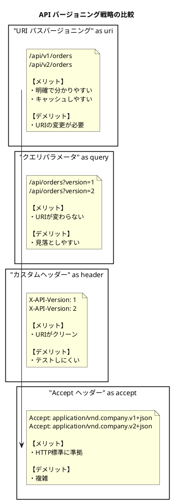

#### 推奨：URI パスバージョニング

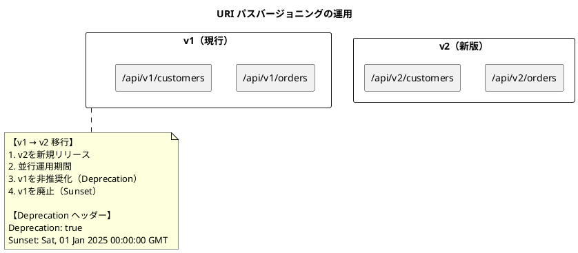

---

## 38.2 サービス間通信

### 同期通信（REST / gRPC）

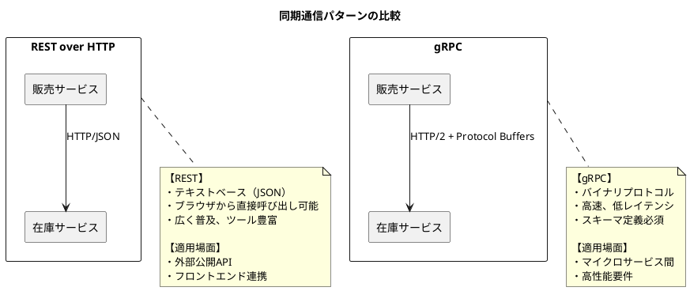

<details>
<summary>gRPC 定義例</summary>

```protobuf
syntax = "proto3";

package sales.v1;

option java_package = "com.example.sales.grpc";
option java_multiple_files = true;

// 在庫サービス
service InventoryService {
  // 在庫照会
  rpc GetStock(GetStockRequest) returns (StockResponse);

  // 在庫引当
  rpc AllocateStock(AllocateStockRequest) returns (AllocateStockResponse);

  // 引当解除
  rpc ReleaseStock(ReleaseStockRequest) returns (ReleaseStockResponse);
}

message GetStockRequest {
  string product_id = 1;
  string warehouse_id = 2;
}

message StockResponse {
  string product_id = 1;
  string warehouse_id = 2;
  int32 quantity = 3;
  int32 allocated_quantity = 4;
  int32 available_quantity = 5;
}

message AllocateStockRequest {
  string product_id = 1;
  string warehouse_id = 2;
  int32 quantity = 3;
  string order_id = 4;
}

message AllocateStockResponse {
  bool success = 1;
  string allocation_id = 2;
  string error_message = 3;
}
```

</details>

### 非同期通信（メッセージキュー）

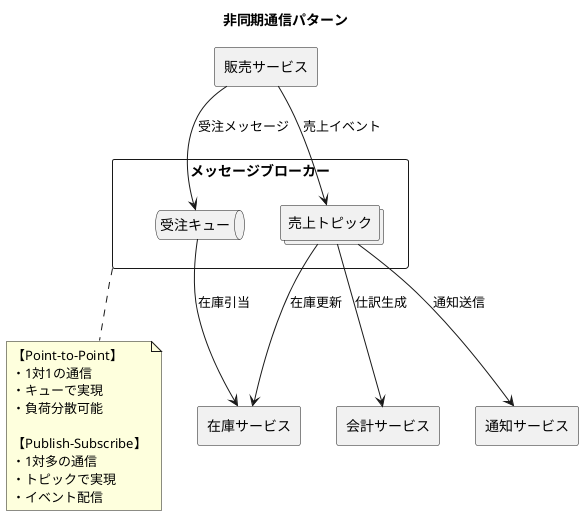

<details>
<summary>Java 実装例（Spring AMQP）</summary>

```java
// メッセージ送信
@Service
public class OrderMessagePublisher {
    private final RabbitTemplate rabbitTemplate;

    public void publishOrderCreated(OrderCreatedEvent event) {
        rabbitTemplate.convertAndSend(
            "sales.exchange",
            "order.created",
            event
        );
    }

    public void publishSalesCompleted(SalesCompletedEvent event) {
        rabbitTemplate.convertAndSend(
            "sales.topic.exchange",
            "sales.completed",
            event
        );
    }
}

// メッセージ受信
@Component
public class OrderMessageListener {

    @RabbitListener(queues = "inventory.order.queue")
    public void handleOrderCreated(OrderCreatedEvent event) {
        // 在庫引当処理
        log.info("Received order: {}", event.orderId());
        inventoryService.allocate(event);
    }
}

// 設定
@Configuration
public class RabbitMQConfig {

    @Bean
    public TopicExchange salesTopicExchange() {
        return new TopicExchange("sales.topic.exchange");
    }

    @Bean
    public Queue accountingQueue() {
        return new Queue("accounting.sales.queue", true);
    }

    @Bean
    public Binding accountingBinding(Queue accountingQueue,
                                      TopicExchange salesTopicExchange) {
        return BindingBuilder.bind(accountingQueue)
            .to(salesTopicExchange)
            .with("sales.*");
    }
}
```

</details>

### サーキットブレーカーパターン

サービス間通信の障害を検知し、障害の連鎖を防ぐパターンです。

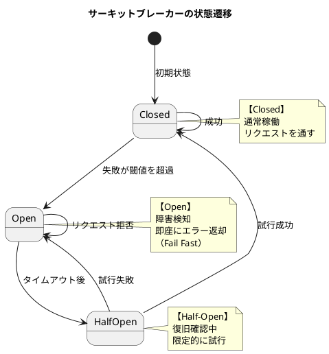

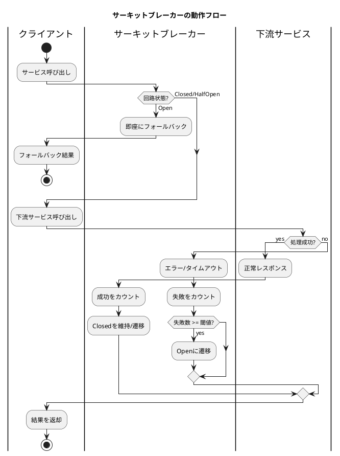

<details>
<summary>Java 実装例（Resilience4j）</summary>

```java
// 設定
@Configuration
public class CircuitBreakerConfig {

    @Bean
    public CircuitBreakerRegistry circuitBreakerRegistry() {
        CircuitBreakerConfig config = CircuitBreakerConfig.custom()
            .failureRateThreshold(50)  // 失敗率50%でOpen
            .waitDurationInOpenState(Duration.ofSeconds(30))
            .permittedNumberOfCallsInHalfOpenState(3)
            .slidingWindowType(SlidingWindowType.COUNT_BASED)
            .slidingWindowSize(10)
            .build();

        return CircuitBreakerRegistry.of(config);
    }
}

// サービス
@Service
public class InventoryServiceClient {
    private final RestTemplate restTemplate;
    private final CircuitBreaker circuitBreaker;

    public InventoryServiceClient(RestTemplate restTemplate,
                                   CircuitBreakerRegistry registry) {
        this.restTemplate = restTemplate;
        this.circuitBreaker = registry.circuitBreaker("inventoryService");
    }

    public StockResponse getStock(String productId) {
        Supplier<StockResponse> supplier = CircuitBreaker
            .decorateSupplier(circuitBreaker, () -> {
                return restTemplate.getForObject(
                    "/api/v1/inventory/{productId}",
                    StockResponse.class,
                    productId
                );
            });

        return Try.ofSupplier(supplier)
            .recover(CallNotPermittedException.class,
                e -> getFallbackStock(productId))
            .recover(Exception.class,
                e -> getFallbackStock(productId))
            .get();
    }

    private StockResponse getFallbackStock(String productId) {
        // フォールバック: キャッシュから取得または推定値
        return new StockResponse(productId, 0, 0, 0, "UNKNOWN");
    }
}

// アノテーションベース
@Service
public class AccountingServiceClient {

    @CircuitBreaker(name = "accountingService", fallbackMethod = "fallback")
    @Retry(name = "accountingService")
    @TimeLimiter(name = "accountingService")
    public CompletableFuture<JournalResponse> createJournal(
            CreateJournalRequest request) {
        return CompletableFuture.supplyAsync(() -> {
            return restTemplate.postForObject(
                "/api/v1/accounting/journals",
                request,
                JournalResponse.class
            );
        });
    }

    public CompletableFuture<JournalResponse> fallback(
            CreateJournalRequest request, Throwable t) {
        log.warn("Fallback for createJournal: {}", t.getMessage());
        // 仕訳をキューに保存して後で再試行
        pendingJournalQueue.add(request);
        return CompletableFuture.completedFuture(
            JournalResponse.pending(request.getCorrelationId())
        );
    }
}
```

</details>

---

## 38.3 API ゲートウェイ

API ゲートウェイは、クライアントと複数のバックエンドサービスの間に位置し、横断的な関心事を一元的に処理します。

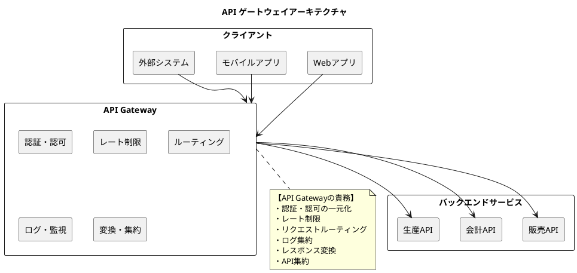

### 認証・認可の一元化

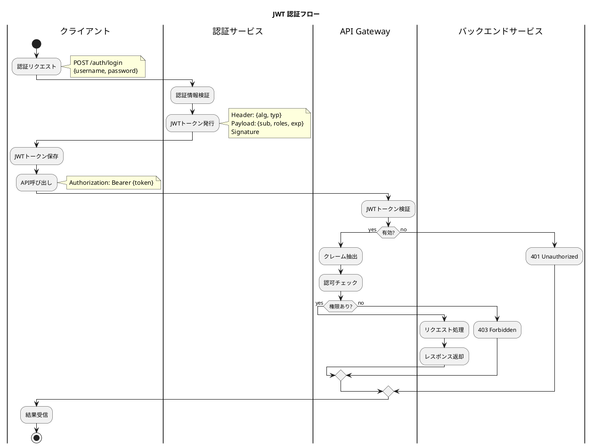

<details>
<summary>Java 実装例（Spring Security + JWT）</summary>

```java
// JWT フィルター
@Component
public class JwtAuthenticationFilter extends OncePerRequestFilter {
    private final JwtTokenProvider tokenProvider;

    @Override
    protected void doFilterInternal(HttpServletRequest request,
                                     HttpServletResponse response,
                                     FilterChain filterChain)
            throws ServletException, IOException {

        String token = extractToken(request);

        if (token != null && tokenProvider.validateToken(token)) {
            Authentication auth = tokenProvider.getAuthentication(token);
            SecurityContextHolder.getContext().setAuthentication(auth);
        }

        filterChain.doFilter(request, response);
    }

    private String extractToken(HttpServletRequest request) {
        String bearerToken = request.getHeader("Authorization");
        if (bearerToken != null && bearerToken.startsWith("Bearer ")) {
            return bearerToken.substring(7);
        }
        return null;
    }
}

// JWT プロバイダー
@Component
public class JwtTokenProvider {
    @Value("${jwt.secret}")
    private String jwtSecret;

    @Value("${jwt.expiration}")
    private long jwtExpiration;

    public String generateToken(Authentication authentication) {
        UserDetails userDetails = (UserDetails) authentication.getPrincipal();

        return Jwts.builder()
            .setSubject(userDetails.getUsername())
            .claim("roles", userDetails.getAuthorities().stream()
                .map(GrantedAuthority::getAuthority)
                .collect(Collectors.toList()))
            .setIssuedAt(new Date())
            .setExpiration(new Date(System.currentTimeMillis() + jwtExpiration))
            .signWith(SignatureAlgorithm.HS512, jwtSecret)
            .compact();
    }

    public boolean validateToken(String token) {
        try {
            Jwts.parser().setSigningKey(jwtSecret).parseClaimsJws(token);
            return true;
        } catch (JwtException | IllegalArgumentException e) {
            return false;
        }
    }

    public Authentication getAuthentication(String token) {
        Claims claims = Jwts.parser()
            .setSigningKey(jwtSecret)
            .parseClaimsJws(token)
            .getBody();

        List<String> roles = claims.get("roles", List.class);
        List<GrantedAuthority> authorities = roles.stream()
            .map(SimpleGrantedAuthority::new)
            .collect(Collectors.toList());

        User principal = new User(claims.getSubject(), "", authorities);
        return new UsernamePasswordAuthenticationToken(
            principal, token, authorities
        );
    }
}
```

</details>

### レート制限とスロットリング

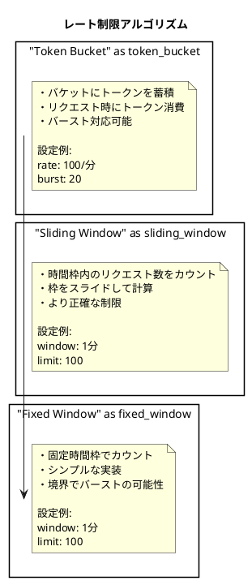

<details>
<summary>Spring Cloud Gateway 設定例</summary>

```yaml
# application.yml
spring:
  cloud:
    gateway:
      routes:
        - id: sales-service
          uri: lb://sales-service
          predicates:
            - Path=/api/v1/sales/**
          filters:
            - name: RequestRateLimiter
              args:
                redis-rate-limiter.replenishRate: 100
                redis-rate-limiter.burstCapacity: 200
                key-resolver: "#{@userKeyResolver}"
            - name: CircuitBreaker
              args:
                name: salesCircuitBreaker
                fallbackUri: forward:/fallback/sales

        - id: accounting-service
          uri: lb://accounting-service
          predicates:
            - Path=/api/v1/accounting/**
          filters:
            - name: RequestRateLimiter
              args:
                redis-rate-limiter.replenishRate: 50
                redis-rate-limiter.burstCapacity: 100

      default-filters:
        - name: Retry
          args:
            retries: 3
            statuses: BAD_GATEWAY,SERVICE_UNAVAILABLE
            methods: GET
            backoff:
              firstBackoff: 100ms
              maxBackoff: 500ms
              factor: 2
```

```java
// Key Resolver（ユーザー単位のレート制限）
@Configuration
public class RateLimiterConfig {

    @Bean
    public KeyResolver userKeyResolver() {
        return exchange -> {
            String userId = exchange.getRequest()
                .getHeaders()
                .getFirst("X-User-Id");
            return Mono.just(userId != null ? userId : "anonymous");
        };
    }

    @Bean
    public KeyResolver apiKeyResolver() {
        return exchange -> {
            String apiKey = exchange.getRequest()
                .getHeaders()
                .getFirst("X-API-Key");
            return Mono.just(apiKey != null ? apiKey : "default");
        };
    }
}
```

</details>

### ログ集約とモニタリング

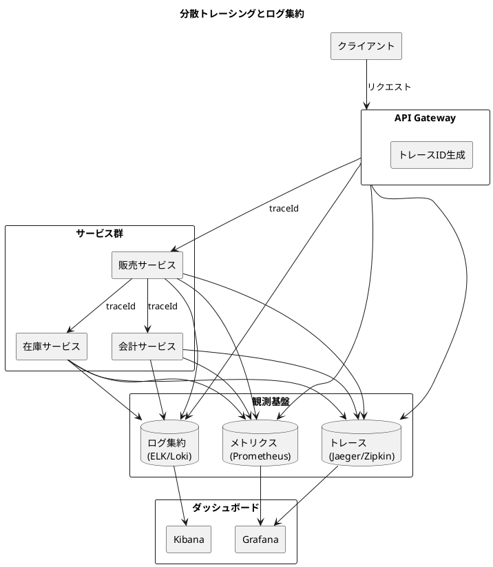

<details>
<summary>Java 実装例（Micrometer + OpenTelemetry）</summary>

```java
// トレーシング設定
@Configuration
public class TracingConfig {

    @Bean
    public Tracer tracer() {
        return GlobalOpenTelemetry.getTracer("sales-service");
    }
}

// カスタムメトリクス
@Component
public class OrderMetrics {
    private final MeterRegistry meterRegistry;
    private final Counter orderCreatedCounter;
    private final Timer orderProcessingTimer;

    public OrderMetrics(MeterRegistry meterRegistry) {
        this.meterRegistry = meterRegistry;

        this.orderCreatedCounter = Counter.builder("orders.created")
            .description("Number of orders created")
            .tag("service", "sales")
            .register(meterRegistry);

        this.orderProcessingTimer = Timer.builder("orders.processing.time")
            .description("Order processing time")
            .tag("service", "sales")
            .register(meterRegistry);
    }

    public void recordOrderCreated(String status) {
        orderCreatedCounter.increment();
        meterRegistry.counter("orders.created.by.status",
            "status", status).increment();
    }

    public void recordProcessingTime(long durationMs) {
        orderProcessingTimer.record(Duration.ofMillis(durationMs));
    }
}

// 構造化ログ
@Slf4j
@Service
public class OrderService {

    public Order createOrder(CreateOrderRequest request) {
        MDC.put("orderId", request.getOrderId());
        MDC.put("customerId", request.getCustomerId());

        try {
            log.info("Creating order", kv("action", "create_order_start"));

            Order order = processOrder(request);

            log.info("Order created successfully",
                kv("action", "create_order_complete"),
                kv("totalAmount", order.getTotalAmount()));

            return order;
        } catch (Exception e) {
            log.error("Failed to create order",
                kv("action", "create_order_failed"),
                kv("error", e.getMessage()), e);
            throw e;
        } finally {
            MDC.clear();
        }
    }
}
```

</details>

---

## 38.4 API インテグレーションテスト

### テストコンテナによる統合テスト環境

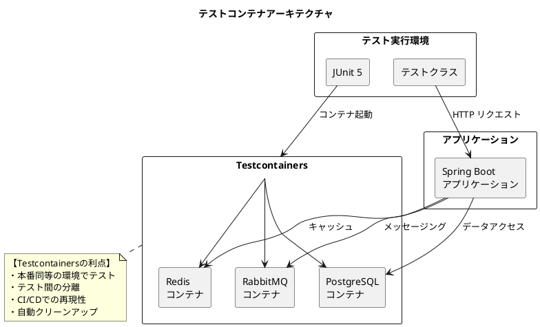

<details>
<summary>Java 実装例</summary>

```java
// テストコンテナ設定
@Testcontainers
@SpringBootTest(webEnvironment = SpringBootTest.WebEnvironment.RANDOM_PORT)
@ActiveProfiles("test")
public abstract class IntegrationTestBase {

    @Container
    static PostgreSQLContainer<?> postgres = new PostgreSQLContainer<>("postgres:15")
        .withDatabaseName("testdb")
        .withUsername("test")
        .withPassword("test");

    @Container
    static RabbitMQContainer rabbitmq = new RabbitMQContainer("rabbitmq:3.12-management");

    @DynamicPropertySource
    static void configureProperties(DynamicPropertyRegistry registry) {
        registry.add("spring.datasource.url", postgres::getJdbcUrl);
        registry.add("spring.datasource.username", postgres::getUsername);
        registry.add("spring.datasource.password", postgres::getPassword);
        registry.add("spring.rabbitmq.host", rabbitmq::getHost);
        registry.add("spring.rabbitmq.port", rabbitmq::getAmqpPort);
    }

    @Autowired
    protected TestRestTemplate restTemplate;

    @Autowired
    protected JdbcTemplate jdbcTemplate;

    @BeforeEach
    void setUp() {
        // テストデータのクリーンアップ
        cleanupTestData();
    }

    protected void cleanupTestData() {
        jdbcTemplate.execute("TRUNCATE TABLE 受注明細 CASCADE");
        jdbcTemplate.execute("TRUNCATE TABLE 受注 CASCADE");
    }
}
```

</details>

### REST API エンドポイントのテスト

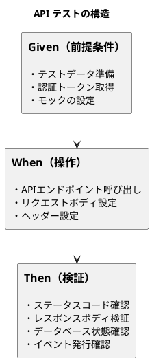

<details>
<summary>Java 実装例</summary>

```java
// 受注API統合テスト
class OrderApiIntegrationTest extends IntegrationTestBase {

    @Autowired
    private CustomerRepository customerRepository;

    @Autowired
    private ProductRepository productRepository;

    private String authToken;
    private Customer testCustomer;
    private Product testProduct;

    @BeforeEach
    void setUpTestData() {
        // 認証トークン取得
        authToken = getAuthToken("test-user", "password");

        // テストデータ準備
        testCustomer = customerRepository.save(
            new Customer("CUS-001", "テスト顧客", "test@example.com")
        );
        testProduct = productRepository.save(
            new Product("PRD-001", "テスト商品", new BigDecimal("1000"))
        );
    }

    @Test
    @DisplayName("受注登録: 正常系")
    void createOrder_Success() {
        // Given
        CreateOrderRequest request = CreateOrderRequest.builder()
            .customerId(testCustomer.getCustomerId())
            .orderDate(LocalDate.now())
            .lines(List.of(
                OrderLineRequest.builder()
                    .productId(testProduct.getProductId())
                    .quantity(10)
                    .build()
            ))
            .build();

        // When
        ResponseEntity<OrderResponse> response = restTemplate.exchange(
            "/api/v1/sales/orders",
            HttpMethod.POST,
            new HttpEntity<>(request, createAuthHeaders()),
            OrderResponse.class
        );

        // Then
        assertThat(response.getStatusCode()).isEqualTo(HttpStatus.CREATED);
        assertThat(response.getBody()).isNotNull();
        assertThat(response.getBody().getOrderId()).isNotBlank();
        assertThat(response.getBody().getStatus()).isEqualTo("DRAFT");
        assertThat(response.getBody().getTotalAmount())
            .isEqualByComparingTo(new BigDecimal("10000"));

        // データベース状態確認
        Order savedOrder = orderRepository.findById(
            response.getBody().getOrderId()
        ).orElseThrow();
        assertThat(savedOrder.getCustomerId()).isEqualTo(testCustomer.getCustomerId());
        assertThat(savedOrder.getLines()).hasSize(1);
    }

    @Test
    @DisplayName("受注登録: バリデーションエラー")
    void createOrder_ValidationError() {
        // Given - 明細なしのリクエスト
        CreateOrderRequest request = CreateOrderRequest.builder()
            .customerId(testCustomer.getCustomerId())
            .orderDate(LocalDate.now())
            .lines(List.of()) // 空の明細
            .build();

        // When
        ResponseEntity<ProblemDetail> response = restTemplate.exchange(
            "/api/v1/sales/orders",
            HttpMethod.POST,
            new HttpEntity<>(request, createAuthHeaders()),
            ProblemDetail.class
        );

        // Then
        assertThat(response.getStatusCode()).isEqualTo(HttpStatus.BAD_REQUEST);
        assertThat(response.getBody().getTitle()).isEqualTo("Validation Error");
    }

    @Test
    @DisplayName("受注一覧取得: ページング")
    void getOrders_Paging() {
        // Given - 複数の受注を作成
        for (int i = 0; i < 25; i++) {
            createTestOrder("ORD-" + String.format("%03d", i));
        }

        // When
        ResponseEntity<PagedResponse<OrderSummary>> response = restTemplate.exchange(
            "/api/v1/sales/orders?page=0&size=10",
            HttpMethod.GET,
            new HttpEntity<>(createAuthHeaders()),
            new ParameterizedTypeReference<>() {}
        );

        // Then
        assertThat(response.getStatusCode()).isEqualTo(HttpStatus.OK);
        assertThat(response.getBody().getContent()).hasSize(10);
        assertThat(response.getBody().getTotalElements()).isEqualTo(25);
        assertThat(response.getBody().getTotalPages()).isEqualTo(3);
    }

    private HttpHeaders createAuthHeaders() {
        HttpHeaders headers = new HttpHeaders();
        headers.setBearerAuth(authToken);
        headers.setContentType(MediaType.APPLICATION_JSON);
        return headers;
    }
}
```

</details>

### サービス間連携テスト

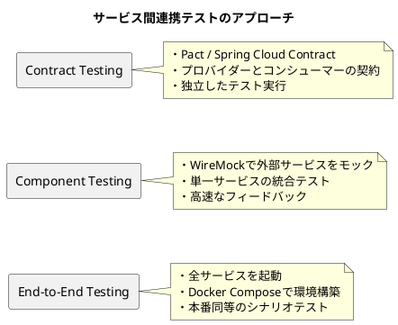

<details>
<summary>Java 実装例（WireMock）</summary>

```java
// WireMockを使用したサービス間連携テスト
@SpringBootTest(webEnvironment = SpringBootTest.WebEnvironment.RANDOM_PORT)
@AutoConfigureWireMock(port = 0)
class OrderServiceWithInventoryTest {

    @Autowired
    private TestRestTemplate restTemplate;

    @Value("${wiremock.server.port}")
    private int wireMockPort;

    @BeforeEach
    void setUp() {
        // 在庫サービスのモック設定
        stubFor(get(urlPathMatching("/api/v1/inventory/.*"))
            .willReturn(aResponse()
                .withStatus(200)
                .withHeader("Content-Type", "application/json")
                .withBody("""
                    {
                        "productId": "PRD-001",
                        "quantity": 100,
                        "allocatedQuantity": 0,
                        "availableQuantity": 100
                    }
                    """)));

        stubFor(post(urlPathMatching("/api/v1/inventory/allocate"))
            .willReturn(aResponse()
                .withStatus(200)
                .withHeader("Content-Type", "application/json")
                .withBody("""
                    {
                        "success": true,
                        "allocationId": "ALLOC-001"
                    }
                    """)));
    }

    @Test
    @DisplayName("受注確定: 在庫引当成功")
    void confirmOrder_InventoryAllocated() {
        // Given
        String orderId = createDraftOrder();

        // When
        ResponseEntity<OrderResponse> response = restTemplate.exchange(
            "/api/v1/sales/orders/{orderId}/confirm",
            HttpMethod.POST,
            new HttpEntity<>(createAuthHeaders()),
            OrderResponse.class,
            orderId
        );

        // Then
        assertThat(response.getStatusCode()).isEqualTo(HttpStatus.OK);
        assertThat(response.getBody().getStatus()).isEqualTo("CONFIRMED");

        // 在庫サービスへの呼び出しを検証
        verify(postRequestedFor(urlPathEqualTo("/api/v1/inventory/allocate"))
            .withRequestBody(matchingJsonPath("$.productId", equalTo("PRD-001")))
            .withRequestBody(matchingJsonPath("$.quantity", equalTo("10"))));
    }

    @Test
    @DisplayName("受注確定: 在庫不足")
    void confirmOrder_InsufficientStock() {
        // Given - 在庫不足のレスポンスを設定
        stubFor(post(urlPathMatching("/api/v1/inventory/allocate"))
            .willReturn(aResponse()
                .withStatus(200)
                .withBody("""
                    {
                        "success": false,
                        "errorMessage": "Insufficient stock"
                    }
                    """)));

        String orderId = createDraftOrder();

        // When
        ResponseEntity<ProblemDetail> response = restTemplate.exchange(
            "/api/v1/sales/orders/{orderId}/confirm",
            HttpMethod.POST,
            new HttpEntity<>(createAuthHeaders()),
            ProblemDetail.class,
            orderId
        );

        // Then
        assertThat(response.getStatusCode()).isEqualTo(HttpStatus.CONFLICT);
        assertThat(response.getBody().getDetail()).contains("在庫不足");
    }

    @Test
    @DisplayName("受注確定: 在庫サービスタイムアウト")
    void confirmOrder_InventoryServiceTimeout() {
        // Given - タイムアウトをシミュレート
        stubFor(post(urlPathMatching("/api/v1/inventory/allocate"))
            .willReturn(aResponse()
                .withFixedDelay(5000) // 5秒遅延
                .withStatus(200)));

        String orderId = createDraftOrder();

        // When
        ResponseEntity<ProblemDetail> response = restTemplate.exchange(
            "/api/v1/sales/orders/{orderId}/confirm",
            HttpMethod.POST,
            new HttpEntity<>(createAuthHeaders()),
            ProblemDetail.class,
            orderId
        );

        // Then - サーキットブレーカーによるフォールバック
        assertThat(response.getStatusCode()).isEqualTo(HttpStatus.SERVICE_UNAVAILABLE);
    }
}
```

</details>

---

## 38.5 まとめ

本章では、API 設計とサービス連携のパターンについて解説しました。

### 学んだこと

1. **API 設計の原則**

   - RESTful API の制約と設計原則
   - リソース指向設計（名詞ベース、HTTP メソッド）
   - バージョニング戦略（URI パス推奨）

2. **サービス間通信**

   - 同期通信（REST、gRPC）の使い分け
   - 非同期通信（メッセージキュー）
   - サーキットブレーカーによる障害対策

3. **API ゲートウェイ**

   - 認証・認可の一元化（JWT）
   - レート制限とスロットリング
   - ログ集約とモニタリング

4. **API インテグレーションテスト**

   - テストコンテナによる統合テスト環境
   - REST API エンドポイントのテスト
   - サービス間連携テスト（WireMock）

### API 設計チェックリスト

- [ ] リソースは名詞（複数形）で命名されているか
- [ ] HTTP メソッドが正しく使用されているか
- [ ] エラーレスポンスは Problem Detail 形式か
- [ ] バージョニング戦略が決定されているか
- [ ] 認証・認可が適切に実装されているか
- [ ] レート制限が設定されているか
- [ ] サーキットブレーカーが導入されているか
- [ ] 統合テストが整備されているか

### 次章の予告

第39章では、データ連携の実装パターンについて解説します。バッチ連携、リアルタイム連携、連携テーブルの設計など、具体的な実装パターンを学びます。
